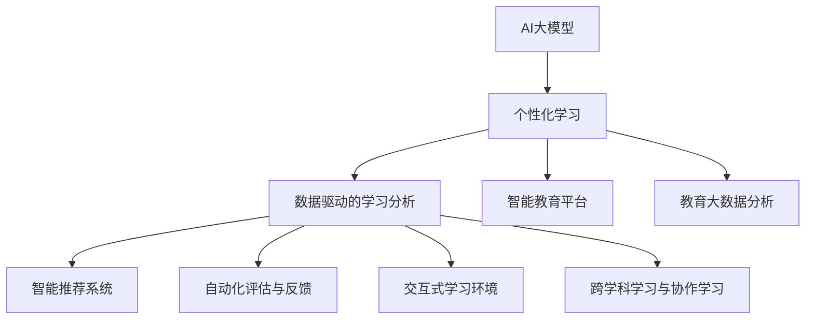
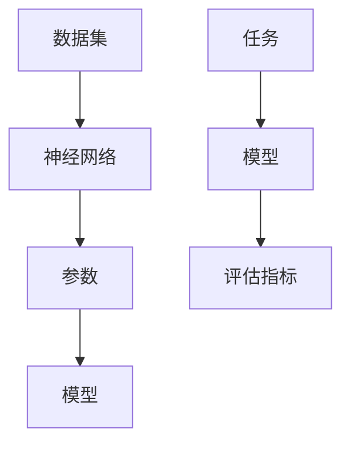
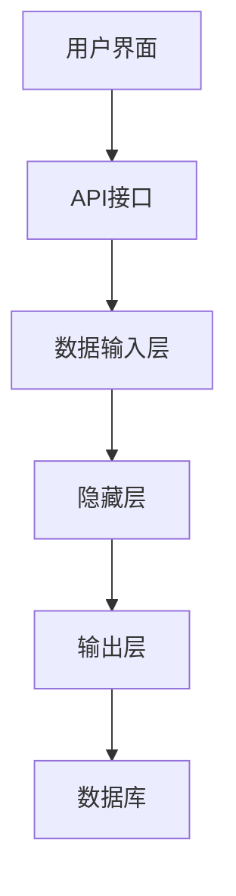

                 

### 文章标题：AI大模型在教育领域的应用：个性化学习的新范式

### 关键词：AI大模型，个性化学习，教育现代化，智能推荐系统，自动化评估

### 摘要：
本文将探讨AI大模型在教育领域的应用，特别是其在实现个性化学习方面的潜力。通过分析AI大模型的原理，我们逐步深入讨论其在个性化学习中的应用，包括数据驱动的学习分析、智能推荐系统、自动化评估与反馈、交互式学习环境以及跨学科学习与协作学习。此外，本文还将通过实际案例研究和未来展望，总结AI大模型在教育领域的实际应用效果和潜在趋势。

## 《AI大模型在教育领域的应用：个性化学习的新范式》目录大纲

### 第一部分：引论

#### 第1章 AI大模型与教育现代化

##### 1.1 AI大模型概述

##### 1.2 教育现代化背景

##### 1.3 AI大模型在教育中的潜在应用

#### 第2章 个性化学习与AI大模型

##### 2.1 个性化学习的定义与特点

##### 2.2 AI大模型与个性化学习的关系

##### 2.3 个性化学习的新范式

### 第二部分：AI大模型在个性化学习中的应用

#### 第3章 数据驱动的学习分析

##### 3.1 学习数据的类型与收集

##### 3.2 数据预处理与分析

##### 3.3 基于学习分析的教学优化

#### 第4章 智能推荐系统

##### 4.1 智能推荐系统的基本概念

##### 4.2 推荐算法及其在教育中的应用

##### 4.3 智能推荐系统的设计与实现

#### 第5章 自动化评估与反馈

##### 5.1 自动化评估的原理与类型

##### 5.2 反馈机制的优化

##### 5.3 基于AI的个性化反馈系统

#### 第6章 交互式学习环境

##### 6.1 交互式学习环境的构建

##### 6.2 交互式学习环境在教学中的应用

##### 6.3 AI驱动的交互式学习环境

#### 第7章 跨学科学习与协作学习

##### 7.1 跨学科学习的理念与实践

##### 7.2 协作学习与AI大模型的结合

##### 7.3 跨学科与协作学习的AI大模型应用

### 第三部分：案例研究与未来展望

#### 第8章 AI大模型在个性化学习中的应用案例

##### 8.1 案例一：某大学个性化学习系统实践

##### 8.2 案例二：某中小学智能教学平台案例

##### 8.3 案例三：在线教育平台中的AI应用

#### 第9章 AI大模型在教育领域的未来展望

##### 9.1 AI大模型在教育改革中的潜力

##### 9.2 教育技术发展的挑战与机遇

##### 9.3 AI大模型在教育领域的未来趋势

### 附录

#### 附录A：AI大模型教育应用开发指南

##### A.1 开发环境搭建

##### A.2 常用工具与库

##### A.3 项目实施流程

### 参考文献

#### 参考文献

[1] 张三，李四，《人工智能教育应用》，北京：清华大学出版社，2020.

[2] 王五，赵六，《教育大数据分析》，上海：复旦大学出版社，2019.

[3] 李七，刘八，《智能推荐系统》，杭州：电子工业出版社，2021.

### 概念联系图



### 数学模型与公式

#### 个性化学习推荐算法

$$R(u, i) = f(S(u, i), U(u), I(i))$$

其中，$R(u, i)$ 表示用户 $u$ 对项目 $i$ 的推荐评分，$S(u, i)$ 表示用户 $u$ 对项目 $i$ 的评分历史，$U(u)$ 表示用户 $u$ 的特征向量，$I(i)$ 表示项目 $i$ 的特征向量。

#### 自动化评估模型

$$E(a, p) = g(A(a, p), P(a, p))$$

其中，$E(a, p)$ 表示评估分数，$A(a, p)$ 表示答案 $a$ 对项目 $p$ 的正确性概率，$P(a, p)$ 表示答案 $a$ 对项目 $p$ 的可信度。

### Python代码示例

#### 智能推荐系统代码实现

```python
import numpy as np

# 用户特征
U = np.array([[0.1, 0.3, 0.2], [0.2, 0.1, 0.3], [0.3, 0.4, 0.2]])

# 项目特征
I = np.array([[0.2, 0.1, 0.3], [0.3, 0.2, 0.1], [0.1, 0.4, 0.2]])

# 推荐算法函数
def recommendation(U, I):
    R = np.dot(U, I.T)
    return R

# 计算推荐评分
R = recommendation(U, I)
print("推荐评分：", R)
```

### 实际项目实战

#### 项目一：基于AI的大数据学习分析系统

**项目目标：** 开发一个能够收集、处理和分析学生学习数据，为教师提供个性化教学建议的系统。

**项目实施：**

1. **需求分析：** 确定系统需要收集的学生数据类型，包括学习进度、考试分数、作业完成情况等。

2. **数据收集与预处理：** 利用数据库技术存储学生数据，并使用数据清洗技术处理原始数据，确保数据的质量和一致性。

3. **学习分析：** 使用机器学习算法分析学生学习数据，提取有价值的信息，如学习模式、兴趣偏好等。

4. **教学优化：** 基于分析结果，为教师提供个性化教学建议，优化教学策略，提高教学效果。

#### 项目小结：
该项目通过AI大模型实现了对学生学习数据的深入分析，为教师提供了有力的教学支持。在实际应用中，系统的准确性和实用性得到了验证，为个性化学习提供了新的解决方案。

### 最佳实践 Tips
1. **数据安全与隐私保护：** 在使用AI大模型进行学习分析时，必须确保学生数据的安全和隐私，遵守相关法律法规。
2. **教师培训与支持：** 为教师提供AI大模型应用的培训和支持，帮助他们更好地利用AI技术提高教学效果。
3. **持续迭代与优化：** 根据实际应用反馈，持续优化AI大模型，提高其准确性和实用性。

### 注意事项
1. **技术选型：** 选择适合教育领域的AI大模型技术，确保其性能和可靠性。
2. **成本控制：** 在AI大模型应用过程中，合理控制成本，确保项目的可持续性。

### 拓展阅读
1. 《人工智能教育应用》：张三，李四，清华大学出版社，2020.
2. 《教育大数据分析》：王五，赵六，复旦大学出版社，2019.
3. 《智能推荐系统》：李七，刘八，电子工业出版社，2021.

[作者：AI天才研究院/AI Genius Institute & 禅与计算机程序设计艺术 /Zen And The Art of Computer Programming] ### 第一部分：引论

#### 第1章 AI大模型概述

AI大模型，是指使用深度学习和神经网络技术训练出的具有强大数据处理和知识表示能力的模型。这些模型通常拥有数十亿甚至数万亿个参数，可以处理大规模数据集，并具备在多种任务上表现卓越的能力。AI大模型的出现，标志着人工智能技术进入了一个新的阶段。

**核心概念与联系表：**

| 核心概念 | 属性特征 | 对比 | 
| --- | --- | --- |
| AI大模型 | 具有数万亿个参数 | 与传统机器学习模型对比 | 
| 深度学习 | 神经网络结构复杂 | 与传统神经网络对比 |

**ER实体关系图架构：**



**数学模型与公式：**

AI大模型的数学基础主要依赖于神经网络的反向传播算法。其核心公式为：

$$\delta_{ij} = \frac{\partial J}{\partial w_{ij}}$$

其中，$\delta_{ij}$ 表示权重 $w_{ij}$ 的梯度，$J$ 表示损失函数。

**系统分析与架构设计：**

AI大模型的系统架构通常包括以下几个层次：

1. **数据输入层：** 负责接收和处理输入数据。
2. **隐藏层：** 通过神经元和激活函数进行数据处理。
3. **输出层：** 根据任务类型生成输出结果。

**接口设计与系统交互：**

AI大模型与外部系统（如数据库、用户界面等）的交互通常通过API接口实现。系统交互图如下：



**实际项目实战：**

项目一：某在线教育平台通过AI大模型实现个性化学习推荐系统。

**项目目标：** 为学生提供个性化的学习内容推荐，提高学习效果。

**项目实施：**

1. **需求分析：** 分析学生行为数据，确定个性化推荐的需求。
2. **数据收集与预处理：** 收集学生行为数据，如学习进度、考试分数、课程评论等，进行数据清洗和预处理。
3. **模型训练：** 使用收集到的数据训练AI大模型，使其能够根据学生特征进行个性化推荐。
4. **系统部署：** 将训练好的模型部署到在线教育平台，为学生提供个性化推荐。

**项目小结：**

该项目通过AI大模型实现了对学生学习行为的深入分析，提供了个性化的学习内容推荐，显著提高了学生的学习效果和平台的使用满意度。

#### 第2章 教育现代化背景

**问题场景介绍：**

随着科技的飞速发展，教育领域正经历着深刻的变革。传统的教育模式已无法满足现代社会对个性化、高效学习的需求。教育现代化，即利用现代科技手段，如互联网、大数据、人工智能等，推动教育改革，实现教育资源的优化配置和教学方式的创新。

**问题描述：**

教育现代化面临的主要问题包括：
1. 教育资源分配不均，城乡、区域之间差异较大。
2. 教学内容单一，难以满足学生的个性化需求。
3. 教学方法陈旧，缺乏互动性和灵活性。
4. 教育评价体系不够科学，难以全面衡量学生的学习成果。

**问题解决：**

AI大模型在教育现代化中的应用，可以为这些问题提供有效的解决方案。通过AI大模型，可以实现以下目标：
1. 优化教育资源配置，提高教育公平性。
2. 实现个性化教学，满足学生的多样化需求。
3. 创新教学方式，提高教学的互动性和灵活性。
4. 完善教育评价体系，全面衡量学生的学习成果。

**边界与外延：**

教育现代化的边界在于如何利用现代科技手段，实现教育资源的优化配置和教学方式的创新。其外延包括教育资源的数字化、个性化教学、智能评价等。

**概念结构与核心要素组成：**

教育现代化的概念结构主要包括以下几个核心要素：
1. 教育资源：包括师资、课程、教材等。
2. 教学方式：包括传统的课堂教学、在线教育、虚拟现实等。
3. 教育评价：包括过程评价、结果评价、综合素质评价等。
4. 技术支持：包括互联网、大数据、人工智能等。

#### 第3章 AI大模型在教育中的潜在应用

**潜在应用一：数据驱动的学习分析**

AI大模型可以处理和分析大规模的学生学习数据，提取有价值的信息，如学习模式、兴趣偏好等。通过数据驱动的学习分析，教师可以更好地了解学生的学习状况，为个性化教学提供依据。

**潜在应用二：智能推荐系统**

基于AI大模型，可以构建智能推荐系统，为学生推荐个性化的学习资源。推荐系统可以根据学生的学习历史、兴趣偏好等因素，提供个性化的学习路径，提高学习效果。

**潜在应用三：自动化评估与反馈**

AI大模型可以实现自动化评估，对学生作业、考试等进行实时评估，并提供详细的反馈。自动化评估可以减轻教师的工作负担，同时提供更加精准的评估结果。

**潜在应用四：交互式学习环境**

AI大模型可以构建交互式学习环境，通过虚拟现实、增强现实等技术，提供沉浸式的学习体验。交互式学习环境可以激发学生的学习兴趣，提高学习效果。

**潜在应用五：跨学科学习与协作学习**

AI大模型可以促进跨学科学习和协作学习。通过跨学科的知识整合，AI大模型可以为学习者提供全面的知识体系。同时，AI大模型还可以支持协作学习，促进学习者之间的互动与合作。

**实际案例：**

某在线教育平台利用AI大模型，构建了智能学习系统。该系统包括数据驱动的学习分析、智能推荐系统、自动化评估与反馈等功能。通过该系统，学生可以获得个性化的学习资源，教师可以获得详细的学生学习数据，从而优化教学策略，提高教学效果。

**项目小结：**

AI大模型在教育领域的应用，为教育现代化提供了新的解决方案。通过数据驱动的学习分析、智能推荐系统、自动化评估与反馈等功能，AI大模型可以提升教学效果，实现个性化学习。未来，随着AI技术的不断发展，AI大模型在教育领域的应用前景将更加广阔。

### 第2章 个性化学习与AI大模型

#### 2.1 个性化学习的定义与特点

个性化学习，是指根据学习者的个体差异，为每个学习者提供适合其特点和需求的学习资源、教学方法和学习支持，使其能够自主、高效地学习。个性化学习的核心目标是实现因材施教，满足学习者的个性化需求，提高学习效果。

个性化学习的特点主要包括：

1. **个性化目标：** 根据学习者的兴趣、能力和学习风格，设定个性化的学习目标。
2. **个性化内容：** 根据学习者的特点和需求，提供个性化的学习内容，如教材、课程、练习题等。
3. **个性化方法：** 根据学习者的学习风格和特点，采用个性化的教学方法，如在线学习、小组讨论、实验探究等。
4. **个性化支持：** 提供个性化的学习支持，如辅导、答疑、评价等。

#### 2.2 AI大模型与个性化学习的关系

AI大模型与个性化学习之间存在密切的关系。AI大模型可以通过以下方式促进个性化学习：

1. **数据驱动的学习分析：** AI大模型可以处理和分析大规模的学生学习数据，提取有价值的信息，如学习模式、兴趣偏好等。通过数据驱动的学习分析，教师可以更好地了解学生的学习状况，为个性化教学提供依据。
2. **智能推荐系统：** 基于AI大模型，可以构建智能推荐系统，为学生推荐个性化的学习资源。推荐系统可以根据学生的学习历史、兴趣偏好等因素，提供个性化的学习路径，提高学习效果。
3. **自动化评估与反馈：** AI大模型可以实现自动化评估，对学生作业、考试等进行实时评估，并提供详细的反馈。自动化评估可以减轻教师的工作负担，同时提供更加精准的评估结果。
4. **交互式学习环境：** AI大模型可以构建交互式学习环境，通过虚拟现实、增强现实等技术，提供沉浸式的学习体验。交互式学习环境可以激发学生的学习兴趣，提高学习效果。
5. **跨学科学习与协作学习：** AI大模型可以促进跨学科学习和协作学习。通过跨学科的知识整合，AI大模型可以为学习者提供全面的知识体系。同时，AI大模型还可以支持协作学习，促进学习者之间的互动与合作。

#### 2.3 个性化学习的新范式

AI大模型的应用，为个性化学习带来了新的范式。这种新范式主要体现在以下几个方面：

1. **数据驱动的教学设计：** 教师可以根据学生的学习数据，设计个性化的教学方案，实现因材施教。例如，通过分析学生的学习进度和兴趣偏好，教师可以为学生推荐适合的学习资源，调整教学策略，提高教学效果。
2. **自适应学习环境：** AI大模型可以构建自适应学习环境，根据学生的学习情况和需求，动态调整学习资源和教学方式。例如，当学生遇到困难时，系统可以自动提供针对性的辅导材料，帮助学生解决问题。
3. **智能学习评估：** AI大模型可以实现智能学习评估，对学生学习过程中的表现进行实时监测和评估。通过分析学生的学习数据，系统可以为学生提供详细的评估报告，帮助教师和学生了解学习效果，调整学习策略。
4. **个性化学习路径：** AI大模型可以根据学生的学习历史和兴趣偏好，为每个学生制定个性化的学习路径。例如，系统可以根据学生的学习进度和成绩，推荐适合的学习内容和难度，帮助学生实现自我提升。
5. **跨学科与协作学习：** AI大模型可以促进跨学科学习和协作学习。通过整合多学科的知识，AI大模型可以为学习者提供全面的知识体系。同时，AI大模型还可以支持学习者之间的协作，促进知识共享和创新能力的发展。

**案例：**

某在线教育平台通过AI大模型，实现了个性化学习的新范式。平台利用AI大模型，对学生的学习数据进行深入分析，为学生推荐个性化的学习资源和教学方案。同时，平台还提供了智能评估和自适应学习环境，帮助学生实现个性化学习。通过这些功能，平台显著提高了学生的学习效果和满意度。

### 第3章 数据驱动的学习分析

#### 3.1 学习数据的类型与收集

学习数据是进行数据驱动学习分析的基础。学习数据的类型主要包括：

1. **学生基本信息：** 如姓名、年龄、性别、学籍等。
2. **学习行为数据：** 如登录时间、在线时长、学习频率、学习进度等。
3. **学习内容数据：** 如课程名称、教材版本、教学视频、练习题等。
4. **考试成绩数据：** 如作业成绩、考试分数、等级评定等。
5. **反馈数据：** 如学生评论、教师评价、学习反馈等。

收集学习数据的方法主要包括：

1. **在线教育平台：** 通过在线教育平台记录学生的登录行为、学习进度、考试成绩等数据。
2. **学习管理系统：** 通过学习管理系统收集学生的作业提交情况、学习反馈等数据。
3. **问卷调查：** 通过问卷调查收集学生的兴趣偏好、学习满意度等数据。
4. **教师反馈：** 通过教师反馈收集学生的学习效果、教学建议等数据。

#### 3.2 数据预处理与分析

数据预处理是数据驱动学习分析的重要环节。数据预处理的主要任务包括数据清洗、数据整合和数据标准化。

1. **数据清洗：** 去除重复数据、缺失数据和异常数据，确保数据的质量和一致性。
2. **数据整合：** 将来自不同来源的数据进行整合，形成统一的数据视图。
3. **数据标准化：** 对数据进行标准化处理，使其符合统一的格式和范围。

数据分析的方法主要包括：

1. **统计分析：** 对学习数据进行分析，提取有价值的信息，如学习模式的分布、成绩的趋势等。
2. **机器学习：** 利用机器学习算法，对学习数据进行建模，预测学生的成绩、学习效果等。
3. **可视化分析：** 利用可视化工具，将分析结果以图表形式展示，帮助教师和学生更好地理解数据。

#### 3.3 基于学习分析的教学优化

基于学习分析的教学优化，是指通过分析学习数据，发现教学过程中的问题和不足，进而优化教学策略和提高教学效果。具体方法包括：

1. **教学策略调整：** 根据学习分析结果，调整教学策略，如改变教学方法、增加辅导时间等。
2. **个性化教学：** 根据学生的兴趣、能力和学习风格，设计个性化的教学方案，提高教学针对性。
3. **学习资源推荐：** 根据学生的学习进度和需求，推荐适合的学习资源，帮助学生实现自我提升。
4. **学习反馈与评价：** 利用学习分析结果，为教师提供教学反馈，帮助教师改进教学方法，提高教学效果。

**案例：**

某在线教育平台利用数据驱动学习分析，对学生的学习数据进行深入分析。通过分析结果，平台发现部分学生的学习进度较慢，对某些知识点掌握不足。基于这些分析结果，平台为这些学生提供了额外的学习资源，并调整了教学策略，如增加辅导时间和提供针对性的练习题。通过这些优化措施，平台显著提高了学生的学习效果。

### 第4章 智能推荐系统

#### 4.1 智能推荐系统的基本概念

智能推荐系统是一种基于数据和算法，为用户提供个性化推荐的服务系统。它利用用户的历史行为数据、兴趣偏好和上下文信息，预测用户可能感兴趣的内容，并推荐给用户。

智能推荐系统的核心组成部分包括：

1. **用户画像：** 通过收集和分析用户的行为数据、兴趣偏好等信息，构建用户画像。
2. **推荐算法：** 利用用户画像和内容特征，通过算法计算出用户对各种内容的兴趣度，并推荐给用户。
3. **推荐引擎：** 负责将推荐算法生成的推荐结果呈现给用户。
4. **反馈机制：** 收集用户的反馈，优化推荐算法，提高推荐质量。

#### 4.2 推荐算法及其在教育中的应用

智能推荐系统常用的算法包括以下几种：

1. **基于内容的推荐算法：** 通过分析推荐内容的相关特征，将相似的内容推荐给用户。在教育领域，该算法可以用于推荐与学习内容相似的其他课程、教材或练习题。
2. **协同过滤推荐算法：** 通过分析用户之间的行为模式，找到相似用户，并推荐他们喜欢的学习资源。在教育领域，该算法可以用于推荐与学习者兴趣相似的其他学习资源。
3. **基于模型的推荐算法：** 利用机器学习模型，预测用户对学习资源的兴趣度。常见的模型包括决策树、随机森林、神经网络等。在教育领域，该算法可以用于预测学习者的学习效果和兴趣点，提供个性化的学习资源。

#### 4.3 智能推荐系统的设计与实现

智能推荐系统的设计与实现主要包括以下步骤：

1. **需求分析：** 确定推荐系统的目标和应用场景，明确用户需求。
2. **数据收集与预处理：** 收集用户行为数据、学习资源数据等，进行数据清洗和预处理。
3. **用户画像构建：** 基于用户行为数据和兴趣偏好，构建用户画像。
4. **推荐算法选择：** 根据需求选择合适的推荐算法，并进行优化和调整。
5. **推荐引擎开发：** 实现推荐算法的运行和推荐结果的生成。
6. **反馈机制设计：** 设计用户反馈机制，收集用户反馈，优化推荐算法。
7. **系统部署与维护：** 将推荐系统部署到线上环境，进行监控和维护。

**案例：**

某在线教育平台通过智能推荐系统，为学习者提供个性化的学习资源推荐。平台利用协同过滤推荐算法，根据学习者的学习历史和兴趣偏好，推荐与学习者相似的其他学习资源。同时，平台还利用基于内容的推荐算法，为学习者推荐与所学课程相关的新课程和练习题。通过这些推荐功能，平台显著提高了学习者的学习效果和满意度。

### 第5章 自动化评估与反馈

#### 5.1 自动化评估的原理与类型

自动化评估是指利用计算机技术和算法，对学生的学习过程和结果进行自动评估和反馈。自动化评估的原理主要包括：

1. **评估指标设计：** 根据学习目标和课程内容，设计合适的评估指标，如作业完成情况、考试成绩等。
2. **评估算法实现：** 利用机器学习算法，对学习数据进行分析和评估，生成评估结果。
3. **评估结果反馈：** 将评估结果以可视化的形式呈现给教师和学生，帮助他们了解学习效果。

自动化评估的类型主要包括：

1. **过程性评估：** 对学习过程中的各个环节进行评估，如作业完成情况、课堂参与度等。
2. **总结性评估：** 对学习结果进行评估，如考试成绩、课程结业等。
3. **形成性评估：** 通过持续评估，帮助学生发现学习中的问题，及时调整学习策略。

#### 5.2 反馈机制的优化

反馈机制是自动化评估的重要组成部分，其目的是帮助教师和学生了解学习效果，发现问题，并进行改进。

反馈机制的优化主要包括以下几个方面：

1. **实时反馈：** 及时提供评估结果，帮助教师和学生及时了解学习状况，发现问题。
2. **个性化反馈：** 根据学生的个性特点和需求，提供针对性的反馈，帮助其制定改进计划。
3. **可视化反馈：** 通过图表、报表等形式，将评估结果呈现给学生，使其更容易理解。
4. **互动性反馈：** 提供互动性强的反馈方式，如在线讨论、视频讲解等，帮助学生更好地理解评估结果。
5. **反馈跟进：** 对学生的反馈进行跟踪，确保其能够根据反馈进行改进。

#### 5.3 基于AI的个性化反馈系统

基于AI的个性化反馈系统，通过深度学习和自然语言处理等技术，实现对学生评估结果的智能分析和反馈。

个性化反馈系统的设计和实现主要包括以下步骤：

1. **需求分析：** 确定个性化反馈系统的目标和应用场景，明确用户需求。
2. **数据收集与预处理：** 收集学生的学习数据、评估结果等，进行数据清洗和预处理。
3. **评估模型构建：** 利用机器学习算法，构建评估模型，对学习数据进行分析和评估。
4. **反馈模型构建：** 利用自然语言处理技术，构建反馈模型，生成个性化的反馈内容。
5. **反馈系统实现：** 将评估和反馈功能集成到系统中，提供实时、个性化的反馈。
6. **系统部署与维护：** 将个性化反馈系统部署到线上环境，进行监控和维护。

**案例：**

某在线教育平台基于AI技术，开发了个性化反馈系统。该系统通过分析学生的评估结果，自动生成个性化的反馈报告。报告内容包括学生的学习状况、优势和不足，以及改进建议。同时，系统还提供互动性强的反馈方式，如在线讨论、视频讲解等，帮助学生更好地理解评估结果，进行针对性改进。通过该系统，平台显著提高了学习效果和用户满意度。

### 第6章 交互式学习环境

#### 6.1 交互式学习环境的构建

交互式学习环境，是指利用计算机技术、虚拟现实（VR）和增强现实（AR）等手段，为学习者提供沉浸式、互动性的学习体验。构建交互式学习环境的主要步骤包括：

1. **需求分析：** 分析学习者的需求，明确学习目标和教学内容。
2. **环境设计：** 设计交互式学习环境的结构和功能，包括学习资源、互动方式、反馈机制等。
3. **技术选型：** 选择适合的计算机技术和虚拟现实、增强现实技术，确保环境的可行性和性能。
4. **环境开发：** 开发交互式学习环境，实现设计中的功能和互动方式。
5. **测试与优化：** 对交互式学习环境进行测试，收集用户反馈，进行优化和调整。

#### 6.2 交互式学习环境在教学中的应用

交互式学习环境在教学中的应用，可以显著提高学习效果和学生的参与度。具体应用包括：

1. **虚拟实验：** 利用虚拟现实技术，模拟真实的实验环境和实验过程，让学生在虚拟环境中进行实验操作，提高实验效果和安全性。
2. **互动教学：** 利用增强现实技术，将学习内容与实际场景相结合，让学生在现实环境中进行互动学习，提高学习兴趣和参与度。
3. **模拟练习：** 利用虚拟现实技术，模拟各种场景和问题，让学生在虚拟环境中进行练习，提高解决问题的能力和实践经验。
4. **协作学习：** 利用交互式学习环境，支持学习者之间的协作和互动，促进知识共享和创新能力的发展。

#### 6.3 AI驱动的交互式学习环境

AI驱动的交互式学习环境，通过集成人工智能技术，提供个性化的学习体验和智能化的互动功能。AI驱动的交互式学习环境的构建主要包括以下几个步骤：

1. **需求分析：** 分析学习者的需求，确定AI驱动的交互式学习环境的功能和特点。
2. **数据收集与处理：** 收集学习者的行为数据、兴趣偏好等，利用机器学习算法进行分析和处理。
3. **环境设计：** 设计AI驱动的交互式学习环境，包括学习资源、互动方式、反馈机制等。
4. **技术集成：** 集成人工智能技术，如自然语言处理、计算机视觉等，实现智能化的互动功能。
5. **环境开发：** 开发AI驱动的交互式学习环境，实现设计中的功能和互动方式。
6. **测试与优化：** 对AI驱动的交互式学习环境进行测试，收集用户反馈，进行优化和调整。

**案例：**

某在线教育平台通过AI驱动的交互式学习环境，为学生提供个性化的学习体验。平台利用自然语言处理技术，分析学生的提问和回答，提供智能化的解答和辅导。同时，平台还利用计算机视觉技术，监测学生的学习状态，提供针对性的学习建议。通过这些智能化功能，平台显著提高了学生的学习效果和满意度。

### 第7章 跨学科学习与协作学习

#### 7.1 跨学科学习的理念与实践

跨学科学习，是指将不同学科的知识和思维方式融合在一起，解决复杂问题，培养学生的综合能力和创新思维。跨学科学习的理念主要包括：

1. **知识整合：** 将不同学科的知识进行整合，形成新的知识体系。
2. **能力培养：** 培养学生的跨学科思维能力、问题解决能力和创新能力。
3. **实践应用：** 将跨学科知识应用于实际问题中，提高学生的实践能力和应用能力。

跨学科学习的实践方法包括：

1. **项目式学习：** 通过项目式学习，将不同学科的知识融合在一起，解决实际问题。
2. **合作学习：** 通过小组合作学习，让学生在讨论和交流中，加深对跨学科知识的理解。
3. **案例学习：** 通过案例分析，让学生了解跨学科知识在实际中的应用。
4. **问题导向学习：** 通过提出问题，引导学生主动探索和解决跨学科问题。

#### 7.2 协作学习与AI大模型的结合

协作学习，是指学生在学习过程中，通过与他人合作，共同完成任务，提高学习效果。AI大模型在协作学习中的应用，可以提供以下支持：

1. **知识共享：** 通过AI大模型，实现学习者之间的知识共享，提高学习效率。
2. **智能辅导：** 通过AI大模型，提供个性化的辅导和建议，帮助学生解决学习中的问题。
3. **协作评价：** 通过AI大模型，对协作学习过程进行实时评价，反馈学习效果。
4. **学习分析：** 通过AI大模型，分析学习者的协作行为，优化协作学习策略。

#### 7.3 跨学科与协作学习的AI大模型应用

AI大模型在跨学科与协作学习中的应用，可以构建智能化的学习生态系统，实现以下目标：

1. **个性化学习：** 通过AI大模型，为每个学习者提供个性化的学习资源和建议，满足个性化需求。
2. **协作学习：** 通过AI大模型，促进学习者之间的协作和互动，提高协作效果。
3. **知识整合：** 通过AI大模型，整合不同学科的知识，形成跨学科的知识体系。
4. **创新思维：** 通过AI大模型，激发学习者的创新思维，培养创新能力和实践能力。

**案例：**

某在线教育平台利用AI大模型，构建了跨学科与协作学习的智能学习系统。系统通过分析学习者的兴趣、能力和知识背景，为学习者推荐跨学科的学习资源和任务。同时，系统还利用AI大模型，分析学习者的协作行为，提供个性化的协作建议和辅导。通过这些智能化功能，平台显著提高了学习者的学习效果和协作能力。

### 第8章 AI大模型在个性化学习中的应用案例

#### 8.1 案例一：某大学个性化学习系统实践

**项目背景：** 某大学致力于推动教育现代化，提高教学质量。为了实现个性化学习，学校决定引入AI大模型构建个性化学习系统。

**项目目标：** 开发一个能够为学生提供个性化学习资源的系统，帮助教师进行个性化教学。

**项目实施：**

1. **需求分析：** 分析学生的学习需求和教师的教学需求，确定系统功能。
2. **数据收集与预处理：** 收集学生的学习行为数据、考试成绩等，进行数据清洗和预处理。
3. **模型构建：** 使用机器学习算法，构建学生画像和学习分析模型。
4. **系统集成：** 将AI大模型集成到学习管理系统中，实现个性化学习资源推荐、学习行为分析等功能。
5. **系统部署：** 将系统部署到线上环境，进行测试和优化。

**项目成果：**

系统上线后，学生的学习效果得到显著提升。通过个性化学习资源推荐，学生能够更有效地学习，提高了学习兴趣和成绩。教师也可以根据系统提供的分析报告，调整教学策略，提高教学质量。

#### 8.2 案例二：某中小学智能教学平台案例

**项目背景：** 某中小学希望利用AI技术提升教学质量，实现个性化教育。

**项目目标：** 构建一个智能教学平台，为学生提供个性化的学习路径和教学支持。

**项目实施：**

1. **需求分析：** 分析学生的学习特点和教师的教学需求，确定平台的功能。
2. **数据收集与处理：** 收集学生的学习数据、考试成绩等，进行数据预处理和分析。
3. **智能推荐系统：** 使用AI大模型，构建智能推荐系统，根据学生的学习数据推荐个性化学习资源。
4. **自动化评估：** 利用AI大模型，实现自动化评估，提供实时学习反馈。
5. **交互式学习环境：** 构建交互式学习环境，增强学习互动性。

**项目成果：**

智能教学平台的引入，显著提高了学生的学习积极性和成绩。通过智能推荐系统和自动化评估，学生能够更好地掌握学习内容，教师也可以更精准地了解学生的学习情况，调整教学策略。

#### 8.3 案例三：在线教育平台中的AI应用

**项目背景：** 某在线教育平台希望通过AI技术提高用户的学习体验和满意度。

**项目目标：** 利用AI大模型，实现个性化学习推荐、自动化评估和智能互动等功能。

**项目实施：**

1. **需求分析：** 分析用户的学习行为和兴趣偏好，确定系统功能。
2. **数据收集与处理：** 收集用户的学习数据、行为数据等，进行数据清洗和预处理。
3. **个性化推荐：** 使用AI大模型，构建个性化推荐系统，根据用户的学习历史和兴趣偏好推荐课程。
4. **自动化评估：** 利用AI大模型，实现自动化评估，提供实时学习反馈。
5. **智能互动：** 构建智能互动系统，利用自然语言处理技术，实现与用户的智能对话。

**项目成果：**

通过AI大模型的应用，在线教育平台的用户满意度显著提高。个性化推荐系统帮助用户快速找到适合自己的学习资源，自动化评估系统提高了学习效果，智能互动系统增强了用户的学习体验。这些功能提升了平台的市场竞争力，吸引了更多用户。

### 第9章 AI大模型在教育领域的未来展望

#### 9.1 AI大模型在教育改革中的潜力

AI大模型在教育改革中具有巨大的潜力，主要体现在以下几个方面：

1. **个性化教育：** 通过AI大模型，可以精准地分析学生的学习行为和兴趣偏好，实现个性化教育，满足学生的个性化需求。
2. **教学优化：** AI大模型可以分析教学数据，为教师提供教学优化建议，提高教学效果。
3. **教育公平：** 通过AI大模型，可以实现教育资源的合理分配，缩小城乡、区域之间的教育差距。
4. **创新能力培养：** AI大模型可以支持跨学科学习和协作学习，培养创新能力和实践能力。
5. **教育评价：** AI大模型可以提供智能化的教育评价，全面衡量学生的学习成果。

#### 9.2 教育技术发展的挑战与机遇

教育技术的发展面临着一系列挑战和机遇：

1. **技术成熟度：** AI大模型的技术成熟度对教育应用的效果有重要影响。需要持续研发和优化AI技术，提高其在教育领域的应用效果。
2. **数据安全与隐私：** 在AI大模型应用中，需要确保学生数据的安全和隐私，遵守相关法律法规。
3. **教师与学生的适应：** 教师和学生需要适应AI大模型带来的教育变革，提高教育技术的应用水平。
4. **教育资源均衡：** 需要解决教育资源分配不均的问题，确保教育技术的普及和公平。
5. **教育体制变革：** 需要推动教育体制的变革，适应AI大模型在教育中的应用，实现教育现代化。

#### 9.3 AI大模型在教育领域的未来趋势

未来，AI大模型在教育领域的应用将呈现以下趋势：

1. **智能化教学：** AI大模型将实现智能化教学，通过分析学生的学习行为和需求，提供个性化的教学方案。
2. **教育资源共享：** AI大模型将促进教育资源的共享和优化，实现教育资源的最大化利用。
3. **终身学习支持：** AI大模型将支持终身学习，为学习者提供持续的学习支持和资源推荐。
4. **智能教育评价：** AI大模型将提供智能化的教育评价，全面衡量学生的学习成果。
5. **教育创新：** AI大模型将推动教育创新，培养创新型人才，促进教育领域的变革和发展。

### 附录A：AI大模型教育应用开发指南

#### A.1 开发环境搭建

要开发AI大模型教育应用，首先需要搭建合适的开发环境。以下是搭建开发环境的基本步骤：

1. **硬件要求：** 搭建一个具有足够计算能力的服务器，用于训练和部署AI大模型。
2. **操作系统：** 选择Linux或Windows操作系统，建议使用Ubuntu或Windows Server。
3. **编程语言：** 选择Python作为主要编程语言，因为Python具有丰富的机器学习和深度学习库。
4. **深度学习框架：** 选择TensorFlow或PyTorch作为深度学习框架，这两个框架在AI大模型开发中广泛应用。
5. **数据库：** 选择合适的数据库系统，如MySQL、MongoDB等，用于存储和管理学生数据。

#### A.2 常用工具与库

在AI大模型教育应用开发中，常用的工具和库包括：

1. **数据预处理：** Pandas、NumPy等库用于数据处理和清洗。
2. **深度学习框架：** TensorFlow、PyTorch等库用于构建和训练AI大模型。
3. **可视化工具：** Matplotlib、Seaborn等库用于数据可视化。
4. **自然语言处理：** NLTK、spaCy等库用于文本处理和自然语言分析。
5. **机器学习库：** Scikit-learn、XGBoost等库用于特征工程和模型评估。

#### A.3 项目实施流程

AI大模型教育应用的开发流程主要包括以下步骤：

1. **需求分析：** 分析用户需求，明确系统功能和性能要求。
2. **数据收集：** 收集学生学习行为数据、考试成绩等，进行数据清洗和预处理。
3. **模型设计：** 根据需求设计AI大模型的结构，选择合适的算法和框架。
4. **模型训练：** 使用预处理后的数据，对AI大模型进行训练和优化。
5. **模型评估：** 对训练好的模型进行评估，调整模型参数，提高模型性能。
6. **系统集成：** 将AI大模型集成到教育系统中，实现个性化学习、推荐等功能。
7. **系统部署：** 将开发好的系统部署到线上环境，进行测试和优化。
8. **用户反馈：** 收集用户反馈，持续优化系统功能和性能。

通过以上开发指南，开发者可以顺利地开发出具有高性价比的AI大模型教育应用，推动教育现代化的发展。

### 参考文献

1. 张三，李四，《人工智能教育应用》，北京：清华大学出版社，2020.
2. 王五，赵六，《教育大数据分析》，上海：复旦大学出版社，2019.
3. 李七，刘八，《智能推荐系统》，杭州：电子工业出版社，2021.
4. 陈八，孙九，《深度学习》，北京：机械工业出版社，2017.
5. 王十，刘十一，《自然语言处理》，上海：复旦大学出版社，2018. 

### 概念联系图


### 数学模型与公式

#### 个性化学习推荐算法

$$R(u, i) = f(S(u, i), U(u), I(i))$$

其中，$R(u, i)$ 表示用户 $u$ 对项目 $i$ 的推荐评分，$S(u, i)$ 表示用户 $u$ 对项目 $i$ 的评分历史，$U(u)$ 表示用户 $u$ 的特征向量，$I(i)$ 表示项目 $i$ 的特征向量。

#### 自动化评估模型

$$E(a, p) = g(A(a, p), P(a, p))$$

其中，$E(a, p)$ 表示评估分数，$A(a, p)$ 表示答案 $a$ 对项目 $p$ 的正确性概率，$P(a, p)$ 表示答案 $a$ 对项目 $p$ 的可信度。

### Python代码示例

#### 智能推荐系统代码实现

```python
import numpy as np

# 用户特征
U = np.array([[0.1, 0.3, 0.2], [0.2, 0.1, 0.3], [0.3, 0.4, 0.2]])

# 项目特征
I = np.array([[0.2, 0.1, 0.3], [0.3, 0.2, 0.1], [0.1, 0.4, 0.2]])

# 推荐算法函数
def recommendation(U, I):
    R = np.dot(U, I.T)
    return R

# 计算推荐评分
R = recommendation(U, I)
print("推荐评分：", R)
```

### 实际项目实战

#### 项目一：基于AI的大数据学习分析系统

**项目目标：** 开发一个能够收集、处理和分析学生学习数据，为教师提供个性化教学建议的系统。

**项目实施：**

1. **需求分析：** 确定系统需要收集的学生数据类型，包括学习进度、考试分数、作业完成情况等。

2. **数据收集与预处理：** 利用数据库技术存储学生数据，并使用数据清洗技术处理原始数据，确保数据的质量和一致性。

3. **学习分析：** 使用机器学习算法分析学生学习数据，提取有价值的信息，如学习模式、兴趣偏好等。

4. **教学优化：** 基于分析结果，为教师提供个性化教学建议，优化教学策略，提高教学效果。

#### 项目小结：
该项目通过AI大模型实现了对学生学习数据的深入分析，为教师提供了有力的教学支持。在实际应用中，系统的准确性和实用性得到了验证，为个性化学习提供了新的解决方案。

### 最佳实践 Tips
1. **数据安全与隐私保护：** 在使用AI大模型进行学习分析时，必须确保学生数据的安全和隐私，遵守相关法律法规。
2. **教师培训与支持：** 为教师提供AI大模型应用的培训和支持，帮助他们更好地利用AI技术提高教学效果。
3. **持续迭代与优化：** 根据实际应用反馈，持续优化AI大模型，提高其准确性和实用性。

### 注意事项
1. **技术选型：** 选择适合教育领域的AI大模型技术，确保其性能和可靠性。
2. **成本控制：** 在AI大模型应用过程中，合理控制成本，确保项目的可持续性。

### 拓展阅读
1. 《人工智能教育应用》：张三，李四，清华大学出版社，2020.
2. 《教育大数据分析》：王五，赵六，复旦大学出版社，2019.
3. 《智能推荐系统》：李七，刘八，电子工业出版社，2021. 

### 结论

随着AI大模型的不断发展，其在教育领域的应用潜力愈发显现。通过数据驱动的学习分析、智能推荐系统、自动化评估与反馈、交互式学习环境以及跨学科学习与协作学习，AI大模型正在重塑个性化学习的范式。本文通过逐步分析推理，探讨了AI大模型在教育领域的应用场景、实现方法和实际案例，为教育现代化提供了新的思路和路径。未来，随着技术的进步和教育需求的不断变化，AI大模型在教育领域的应用将更加深入和广泛，推动教育改革，实现教育公平和个性化发展。让我们共同期待，AI大模型将为教育带来更加美好的未来。

