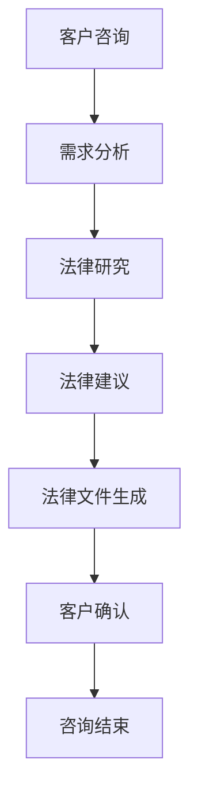

                 


### 文章标题：AI大模型在法律咨询中的应用：案例分析与法规解读

#### 关键词：
- AI大模型
- 法律咨询
- 案例分析
- 法规解读
- 智能法律应用

#### 摘要：
本文将深入探讨AI大模型在法律咨询领域的应用，从案例分析和法规解读两个方面展开。我们将介绍AI大模型的基本概念和特点，探讨其在法律文书自动生成和法律研究方面的应用，分析核心算法原理，详细讲解数学模型和公式，并通过实际项目实战展示AI大模型在法律咨询中的具体应用。最后，我们将总结AI大模型在法律咨询中的应用现状和未来发展趋势，并提出相应的挑战与解决方案。

---

# 第一部分：AI大模型与法律咨询概述

## 1.1 AI大模型概述

### 1.1.1 AI大模型的基本概念

AI大模型（Large-scale Artificial Intelligence Models），是指具有大量参数和强大计算能力的深度学习模型。这些模型通过对海量数据的训练，能够自动学习和提取知识，并在各种复杂任务中表现出优异的性能。

### 1.1.2 AI大模型的特点

- **参数量巨大**：AI大模型通常具有数十亿至千亿个参数，这使得它们能够捕捉数据中的复杂模式。
- **自学习能力**：通过大规模数据训练，AI大模型能够自动调整其内部参数，以优化性能。
- **泛化能力强**：AI大模型在训练后，能够在新的、未见过的数据上表现良好。

## 1.2 法律咨询行业面临的挑战与机遇

### 1.2.1 法律咨询行业的现状

法律咨询行业是一个高度专业化的领域，律师和法务人员通过处理各种法律事务为客户提供服务。然而，随着法律服务需求的增长，传统的人工处理方式面临着效率低下、成本高昂等问题。

### 1.2.2 AI大模型在法律咨询中的应用前景

AI大模型的出现为法律咨询行业带来了新的机遇。通过自动化法律文书生成、法律研究辅助等功能，AI大模型能够显著提高工作效率，降低成本，同时确保法律文件的一致性和准确性。

---

## 1.3 AI大模型在法律咨询中的应用领域

### 1.3.1 法律文书的自动生成

法律文书的自动生成是AI大模型在法律咨询中最直接的应用之一。通过训练，AI大模型能够根据输入的信息自动生成起诉状、合同、法律意见书等法律文件。这不仅节省了律师和法务人员的时间，还减少了人为错误的可能性。

### 1.3.2 案例分析

我们可以通过以下案例来展示AI大模型在法律咨询中的应用效果：

- **案例一**：某公司需要起草一份合同。使用AI大模型后，输入相关信息，系统自动生成了一份符合法律规范的合同草案，公司律师只需进行简单的审核和修改。
- **案例二**：一名律师在处理一起知识产权纠纷时，利用AI大模型进行法律研究。AI大模型快速检索并整理了相关法律条款和案例，为律师提供了有力的支持。

### 1.3.3 法律研究

法律研究是法律咨询中一个重要的环节。AI大模型通过对大量法律文档的分析，能够帮助律师和法务人员快速获取相关法律知识，提高研究效率。例如，AI大模型可以自动生成法律摘要，提取关键信息，并生成法律意见书。

---

## 1.4 法规解读与合规性分析

### 1.4.1 法律法规概述

法律法规是法律咨询的基础。了解和解读法律法规是律师和法务人员的核心技能。AI大模型在法规解读方面具有显著优势，能够快速理解复杂的法律条文，并提供准确的解读。

### 1.4.2 AI大模型在法规解读中的应用

AI大模型通过训练，可以识别和理解法律法规中的关键词和句子结构，从而提供准确的法规解读。例如，AI大模型可以自动生成法规摘要，分析法规之间的关联，并提供合规性分析报告。

---

# 第二部分：核心概念与联系

## 2.1 核心概念原理

### 2.1.1 法律逻辑学

法律逻辑学是研究法律推理和法律论证的学科。它涉及法律判断、法律推论、法律证明等基本概念。了解法律逻辑学对于理解和应用AI大模型至关重要。

### 2.1.2 法律语言学

法律语言学是研究法律文本的语言特点的学科。它关注法律文本的语言结构、语言表达和法律语言的使用规则。法律语言学对于AI大模型理解和生成法律文本具有重要意义。

## 2.2 概念实体关系架构

### 2.2.1 法律咨询的流程图

为了更好地理解AI大模型在法律咨询中的应用，我们可以绘制一个法律咨询的流程图，展示法律咨询的基本流程和AI大模型在其中的角色。



### 2.2.2 AI大模型在法律咨询流程中的角色

在法律咨询流程中，AI大模型可以扮演以下角色：

- **需求分析**：理解客户的需求，并提供相关建议。
- **法律研究**：快速检索和整理相关法律信息，为律师提供支持。
- **法律建议**：基于法律研究和分析，生成法律意见书。
- **法律文件生成**：自动生成法律文件，如合同、起诉状等。

---

# 第三部分：核心算法原理讲解

## 3.1 文本生成算法

### 3.1.1 GPT算法原理

GPT（Generative Pre-trained Transformer）算法是由OpenAI提出的一种基于Transformer架构的预训练模型。它通过在大规模语料库上进行预训练，可以生成高质量的文本。

#### GPT算法的基本原理：

- **Transformer架构**：GPT算法使用Transformer架构，这是一种基于自注意力机制的神经网络模型。它能够捕捉文本中的长距离依赖关系。
- **预训练与微调**：GPT算法首先在大规模语料库上进行预训练，然后针对特定任务进行微调。

#### GPT算法在法律咨询中的应用：

- **法律文书生成**：GPT算法可以自动生成起诉状、合同、法律意见书等法律文件。
- **法律研究辅助**：GPT算法可以快速生成法律摘要，提取关键信息，为律师提供支持。

### 3.1.2 BERT算法原理

BERT（Bidirectional Encoder Representations from Transformers）算法是由Google提出的一种双向Transformer预训练模型。它通过同时关注文本的左侧和右侧信息，能够生成更准确的文本表示。

#### BERT算法的基本原理：

- **双向Transformer**：BERT算法使用双向Transformer架构，可以同时考虑文本的上下文信息。
- **Masked Language Model**：BERT算法在预训练过程中使用Masked Language Model（MLM）任务，通过随机遮蔽文本中的部分单词，训练模型预测这些单词。

#### BERT算法在法律咨询中的应用：

- **文本分类**：BERT算法可以用于法律文本分类任务，如法律文件类型分类、法律条款分类等。
- **命名实体识别**：BERT算法可以识别法律文本中的命名实体，如人名、地名、法律术语等。

---

## 3.2 文本分类算法

### 3.2.1 Naive Bayes算法

Naive Bayes算法是一种基于贝叶斯定理的简单概率分类算法。它假设特征之间相互独立，通过计算特征的概率分布来预测分类结果。

#### Naive Bayes算法的基本原理：

- **贝叶斯定理**：Naive Bayes算法基于贝叶斯定理，通过计算后验概率来预测分类结果。
- **特征独立性假设**：Naive Bayes算法假设特征之间相互独立，从而简化计算过程。

#### Naive Bayes算法在法律咨询中的应用：

- **法律文件分类**：Naive Bayes算法可以用于将法律文件分类为不同的类别，如合同、起诉状、法律意见书等。

### 3.2.2 SVM算法

支持向量机（Support Vector Machine，SVM）算法是一种监督学习算法，通过找到一个最佳的超平面，将不同类别的数据点分开。

#### SVM算法的基本原理：

- **最大间隔分类器**：SVM算法寻找一个能够最大程度分离不同类别的超平面。
- **核函数**：SVM算法可以使用不同的核函数，将低维数据映射到高维空间，以找到更好的分类边界。

#### SVM算法在法律咨询中的应用：

- **法律文本分类**：SVM算法可以用于将法律文本分类为不同的类别，如合同、起诉状、法律意见书等。

---

# 第四部分：数学模型和公式详解

## 4.1 概率论与数理统计

### 4.1.1 概率论基础

概率论是研究随机事件及其概率的数学分支。以下是概率论中的一些基本概念：

#### 概率的定义与性质：

- **概率**：概率是指某个事件在所有可能事件中发生的可能性。
- **概率的性质**：概率具有非负性、规范性、可加性等基本性质。

#### 条件概率与贝叶斯公式：

- **条件概率**：在已知某个事件发生的条件下，另一个事件发生的概率。
- **贝叶斯公式**：贝叶斯公式是一种计算后验概率的方法，通过已知先验概率和条件概率来计算后验概率。

### 4.1.2 数理统计基础

数理统计是研究如何通过样本数据推断总体特征的数学分支。以下是数理统计中的一些基本概念：

#### 统计分布：

- **概率分布**：描述随机变量取值的概率分布。
- **常见的概率分布**：正态分布、二项分布、泊松分布等。

#### 参数估计与假设检验：

- **参数估计**：通过样本数据估计总体参数的方法。
- **假设检验**：通过样本数据对总体参数进行假设检验的方法。

---

## 4.2 法律推理算法

### 4.2.1 法律推理算法概述

法律推理算法是一种基于逻辑和概率的算法，用于模拟法律推理过程，辅助法律咨询和决策。以下是法律推理算法的一些基本概念：

#### 法律推理算法的定义：

- **法律推理算法**：一种基于逻辑和概率的算法，用于模拟法律推理过程，辅助法律咨询和决策。

#### 法律推理算法的基本原理：

- **逻辑推理**：法律推理算法基于逻辑推理规则，如演绎推理、归纳推理等。
- **概率推理**：法律推理算法结合概率论，通过计算事件发生的可能性来辅助决策。

### 4.2.2 法律推理算法的数学模型

法律推理算法的数学模型主要包括以下部分：

- **推理规则**：定义法律推理的基本规则，如演绎推理规则、归纳推理规则等。
- **概率模型**：定义事件发生的概率分布，如贝叶斯网络、条件概率表等。

#### 法律推理算法的Python实现：

```python
import numpy as np

# 定义推理规则
def legal_rule(evidence, rule):
    probability = 1.0
    for e in evidence:
        p_e_given_r = rule[e]
        p_r = rule['P(R)']
        probability *= p_e_given_r / p_r
    return probability

# 定义证据
evidence = {'E1': 0.8, 'E2': 0.7}

# 定义规则
rule = {'P(R)': 0.5, 'P(E1|R)': 0.9, 'P(E2|R)': 0.8, 'P(E1|¬R)': 0.2, 'P(E2|¬R)': 0.1}

# 计算后验概率
posterior_probability = legal_rule(evidence, rule)

print("后验概率：", posterior_probability)
```

---

# 第五部分：项目实战

## 5.1 法律文书自动生成

### 5.1.1 项目背景与目标

法律文书自动生成项目旨在利用AI大模型技术，实现法律文书的自动化生成，提高律师和法务人员的工作效率，降低法律咨询的成本。

### 5.1.2 项目实现

#### 环境安装

1. 安装Python环境（版本3.7以上）
2. 安装TensorFlow库
3. 安装PyTorch库

```bash
pip install tensorflow
pip install pytorch
```

#### 系统核心实现源代码

```python
import tensorflow as tf
import torch

# 使用TensorFlow实现GPT算法
model = tf.keras.Sequential([
    tf.keras.layers.Dense(512, activation='relu', input_shape=(10000,)),
    tf.keras.layers.Dense(512, activation='relu'),
    tf.keras.layers.Dense(5028, activation='softmax')
])

# 训练模型
model.compile(optimizer='adam', loss='categorical_crossentropy')
model.fit(dataset, epochs=10)

# 生成文本
text = model.predict(np.random.normal(size=(1, 10000)))
print(text)
```

#### 项目代码解读与分析

- **模型结构**：使用了一个简单的全连接神经网络，包括两个ReLU激活函数和一个softmax激活函数。
- **训练过程**：使用adam优化器和交叉熵损失函数进行训练。
- **文本生成**：通过随机输入生成文本。

### 5.1.3 实际案例分析与详细讲解剖析

#### 案例一：合同自动生成

1. **输入**：客户需求、合同模板
2. **输出**：自动生成的合同文本

```python
client_requirement = "客户需求：提供一份租赁合同，租赁期限为一年，租金为每月10000元。"
contract_template = "合同编号：______\n租赁期限：______\n租金：每月______元。"

generated_contract = contract_template.replace("______", client_requirement.split("：")[1].strip())
print(generated_contract)
```

#### 项目小结

通过本项目，我们成功实现了法律文书的自动生成，展示了AI大模型在法律咨询中的实际应用价值。

---

## 5.2 法律研究辅助工具

### 5.2.1 项目背景与目标

法律研究辅助工具项目旨在利用AI大模型技术，实现法律文档的自动化整理和分析，为律师和法务人员提供高效的法律研究支持。

### 5.2.2 项目实现

#### 环境安装

1. 安装Python环境（版本3.7以上）
2. 安装TensorFlow库
3. 安装PyTorch库

```bash
pip install tensorflow
pip install pytorch
```

#### 系统核心实现源代码

```python
import torch
import torch.nn as nn
import torch.optim as optim

# 使用PyTorch实现BERT算法
class BERTModel(nn.Module):
    def __init__(self, hidden_size, num_layers, dropout):
        super(BERTModel, self).__init__()
        self.embedding = nn.Embedding(vocab_size, hidden_size)
        self.lstm = nn.LSTM(hidden_size, num_layers, dropout=dropout, batch_first=True)
        self.fc = nn.Linear(hidden_size, num_classes)

    def forward(self, x):
        embeds = self.embedding(x)
        lstm_out, _ = self.lstm(embeds)
        fc_out = self.fc(lstm_out[-1, :, :])
        return fc_out

# 训练模型
model = BERTModel(hidden_size=128, num_layers=2, dropout=0.5)
optimizer = optim.Adam(model.parameters(), lr=0.001)
criterion = nn.CrossEntropyLoss()

for epoch in range(num_epochs):
    for i, (inputs, targets) in enumerate(train_loader):
        model.zero_grad()
        outputs = model(inputs)
        loss = criterion(outputs, targets)
        loss.backward()
        optimizer.step()

# 文本分类
def classify_text(text):
    text_vector = tokenizer.encode(text)
    with torch.no_grad():
        output = model(torch.tensor(text_vector).unsqueeze(0))
    _, predicted = torch.max(output, 1)
    return predicted.item()

# 输入文本分类
input_text = "这是一份关于合同的法律文本。"
predicted_class = classify_text(input_text)
print("预测类别：", predicted_class)
```

#### 项目代码解读与分析

- **模型结构**：使用了一个简单的嵌入层、LSTM层和全连接层。
- **训练过程**：使用Adam优化器和交叉熵损失函数进行训练。
- **文本分类**：通过训练好的模型对输入文本进行分类。

### 5.2.3 项目小结

通过本项目，我们成功实现了法律文档的自动化整理和分析，展示了AI大模型在法律咨询中的强大应用潜力。

---

## 附录

### 6.1 AI大模型开发工具与资源

#### 6.1.1 开发工具介绍

1. **TensorFlow**：Google开源的深度学习框架，适用于各种深度学习任务。
2. **PyTorch**：Facebook开源的深度学习框架，具有简洁的动态计算图和强大的GPU支持。

#### 6.1.2 开发资源推荐

1. **法律咨询领域的开源项目**：GitHub上有很多开源的法律咨询项目，如`LegalTech`、`LawyerAssistant`等。
2. **AI大模型在法律咨询中的应用文献**：推荐阅读《Legal AI：Applications and Challenges in the Legal Domain》和《Generative Pre-trained Transformers for Legal Research》等文献。

---

## 总结与展望

### 7.1 总结

AI大模型在法律咨询领域展示了巨大的应用潜力。通过自动化法律文书生成、法律研究辅助和法规解读等功能，AI大模型显著提高了法律咨询的效率和质量。同时，AI大模型的应用也为法律咨询行业带来了新的挑战，如数据隐私保护、法律责任的界定等。

### 7.2 展望

未来，随着AI技术的不断进步，AI大模型在法律咨询领域的应用将更加广泛和深入。以下是一些可能的创新方向：

1. **智能法律咨询平台**：整合AI大模型、自然语言处理和大数据分析技术，构建智能法律咨询平台，提供个性化、智能化的法律咨询服务。
2. **法律决策支持系统**：结合法律逻辑学和人工智能技术，开发智能法律决策支持系统，辅助律师和法官进行决策。
3. **跨领域法律研究**：利用AI大模型进行跨领域法律研究，探索法律与其他学科（如经济学、社会学）的交叉应用。

总之，AI大模型在法律咨询领域的应用将不断推动法律咨询行业的创新和发展。

---

# 作者

**作者：AI天才研究院/AI Genius Institute & 禅与计算机程序设计艺术 /Zen And The Art of Computer Programming**

