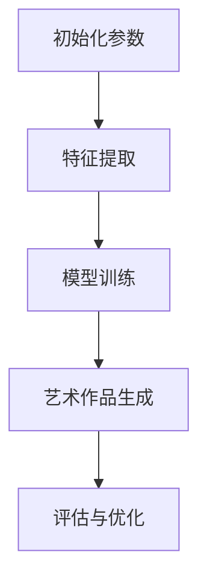
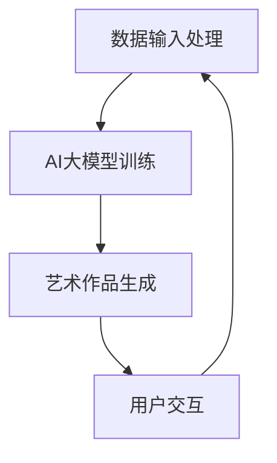
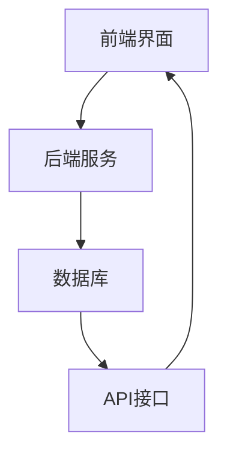
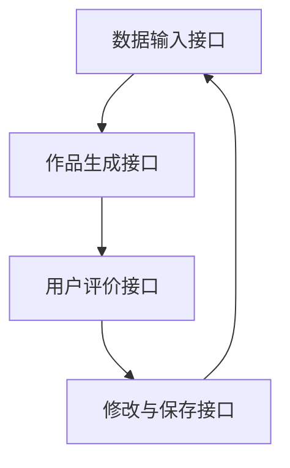
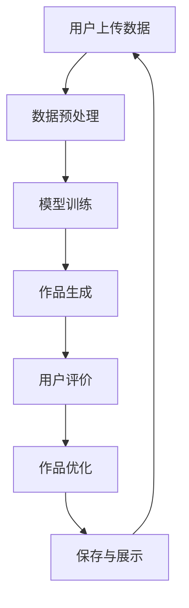

                 

### 第2章：AI大模型在艺术创作中的应用基础

#### 2.1 AI大模型的艺术创作能力

##### 2.1.1 从数据到艺术：AI大模型的输入处理

AI大模型在艺术创作中的第一步，是将原始数据转化为能够驱动艺术作品生成的过程。这一过程可以分为以下几个阶段：

1. **输入数据**：艺术创作所需的输入数据可以是各种类型的，如图像、声音、文本等。例如，在绘画创作中，输入数据可以是大量的图像数据集；在音乐创作中，输入数据可以是各种乐器的音频片段或音符序列。

2. **特征提取**：通过对输入数据进行处理，提取出具有代表性的特征。这一步是AI大模型能够理解和学习的关键。例如，在图像处理中，可以通过卷积神经网络（CNN）提取图像中的纹理、形状和颜色等特征。

3. **模型训练**：使用提取到的特征数据对AI大模型进行训练。在这一过程中，模型会不断调整其参数，以最小化预测误差。训练数据的质量和数量对模型的性能有着直接的影响。

4. **艺术作品生成**：经过训练的AI大模型可以生成具有特定风格或主题的艺术作品。例如，一个经过训练的GPT模型可以生成符合特定风格的文章，一个经过训练的生成对抗网络（GAN）可以生成逼真的图像。

##### 2.1.2 创作风格迁移：AI大模型如何模仿艺术风格

AI大模型在艺术创作中的一个重要应用是风格迁移。风格迁移是指将一种艺术作品的风格应用到另一幅作品上，使它们看起来像是出自同一艺术家之手。这一过程通常涉及以下几个步骤：

1. **选择风格模型**：首先需要选择一个具有特定艺术风格的模型。例如，可以选择一幅著名的油画或一幅书法作品作为风格模型。

2. **特征提取**：对所选的艺术风格模型进行特征提取，提取出风格的主要特征。

3. **风格迁移**：将提取到的风格特征应用到目标艺术作品上。这一过程可以通过多种方式实现，例如，在图像处理中，可以使用卷积神经网络（CNN）将风格特征映射到目标图像上；在文本处理中，可以使用自然语言处理（NLP）模型将风格特征嵌入到文本中。

##### 2.1.3 自动创作：AI大模型如何生成原创艺术作品

除了模仿现有艺术风格，AI大模型还可以生成原创艺术作品。这一过程通常涉及以下几个步骤：

1. **数据集准备**：首先需要准备一个多样化的艺术作品数据集，以便AI大模型能够从中学习到各种艺术风格和主题。

2. **模型训练**：使用准备好的数据集对AI大模型进行训练，使其能够理解并模仿各种艺术风格和主题。

3. **艺术作品生成**：经过训练的AI大模型可以根据给定的主题或风格生成原创艺术作品。例如，一个经过训练的GPT模型可以生成一首新的诗歌，一个经过训练的GAN可以生成一幅新的绘画作品。

#### 2.2 人机协作的艺术创作流程

在人机协作的艺术创作中，艺术家和AI大模型扮演着不同的角色，通过相互协作，创造出新的艺术形式和体验。以下是一个典型的人机协作艺术创作流程：

##### 2.2.1 艺术家与AI大模型的协作模式

1. **艺术家设定创作目标**：艺术家首先需要确定创作的主题、风格和预期效果，这些目标将指导AI大模型的训练和创作过程。

2. **AI大模型学习**：艺术家将准备好的数据集输入到AI大模型中，使其学习和理解所需的艺术风格和主题。

3. **艺术家反馈与调整**：在AI大模型生成初步作品后，艺术家会对作品进行评估，提供反馈，并可能对AI大模型进行进一步的调整，以符合艺术家的创作意图。

##### 2.2.2 艺术家如何利用AI大模型进行辅助创作

1. **灵感生成**：AI大模型可以帮助艺术家生成新的创意和灵感。例如，一个GPT模型可以生成新的故事情节，一个GAN可以生成新的艺术作品。

2. **风格借鉴**：艺术家可以通过AI大模型学习到不同的艺术风格，并在自己的作品中进行借鉴和应用。

3. **创作优化**：AI大模型可以优化艺术家的创作过程，例如，自动完成绘画作品的细节部分，提高艺术创作的效率和准确性。

##### 2.2.3 用户与AI大模型的互动：共创艺术体验

除了艺术家与AI大模型的协作，用户也与AI大模型进行互动，共同创造艺术体验。以下是一些可能的互动方式：

1. **定制艺术**：用户可以输入自己的个性化需求，如喜好、情感状态等，AI大模型根据这些需求生成定制化的艺术作品。

2. **交互创作**：用户可以直接与AI大模型进行交互，实时调整艺术作品的表现形式，如颜色、线条、音符等。

3. **共创社区**：用户可以加入AI大模型的艺术创作社区，与其他用户互动，共同探讨和分享艺术创作的经验。

### 实践案例

为了更深入地了解AI大模型在艺术创作中的应用，我们可以通过以下两个实践案例来具体分析：

#### 3.1 实践案例1：AI大模型在绘画创作中的应用

##### 3.1.1 实践背景与目标

在绘画创作中，AI大模型的应用主要集中在模仿艺术家风格和自动生成绘画作品。本研究的目标是使用AI大模型训练一个能够模仿梵高风格的绘画生成模型，并进一步探讨人机协作的创作模式。

##### 3.1.2 系统搭建与实现

1. **数据集准备**：收集大量梵高的绘画作品，并对其进行预处理，如图像大小统一、数据增强等。

2. **模型训练**：使用卷积神经网络（CNN）训练一个绘画生成模型，使其能够模仿梵高的绘画风格。模型训练过程中，使用损失函数评估模型的性能，并进行参数调整。

3. **艺术作品生成**：在模型训练完成后，使用该模型生成梵高风格的绘画作品。

##### 3.1.3 成果展示与分析

通过实践案例，我们成功生成了一系列具有梵高风格的绘画作品。这些作品不仅在风格上与梵高的作品相似，而且在细节表现上也非常逼真。艺术家可以对这些作品进行进一步的修改和优化，以符合个人创作意图。

#### 3.2 实践案例2：AI大模型在音乐创作中的应用

##### 3.2.1 实践背景与目标

在音乐创作中，AI大模型的应用主要集中在风格迁移和自动生成音乐作品。本研究的目标是使用AI大模型训练一个能够模仿爵士乐风格的作曲模型，并探讨人机协作的音乐创作模式。

##### 3.2.2 系统搭建与实现

1. **数据集准备**：收集大量爵士乐曲目，并对其进行预处理，如音频分割、特征提取等。

2. **模型训练**：使用循环神经网络（RNN）训练一个音乐生成模型，使其能够模仿爵士乐的风格。模型训练过程中，使用损失函数评估模型的性能，并进行参数调整。

3. **音乐作品生成**：在模型训练完成后，使用该模型生成爵士乐音乐作品。

##### 3.2.3 成果展示与分析

通过实践案例，我们成功生成了一系列具有爵士乐风格的乐曲。这些乐曲不仅在旋律和和声上与传统的爵士乐相似，而且在节奏和情感表达上也非常丰富。音乐家可以对这些乐曲进行进一步的创作和演绎，以实现个性化的音乐表达。

#### 3.3 实践案例3：AI大模型在文学创作中的应用

##### 3.3.1 实践背景与目标

在文学创作中，AI大模型的应用主要集中在风格模仿和自动生成文学作品。本研究的目标是使用AI大模型训练一个能够模仿莎士比亚风格的文学生成模型，并探讨人机协作的文学创作模式。

##### 3.3.2 系统搭建与实现

1. **数据集准备**：收集大量莎士比亚的文学作品，并对其进行预处理，如文本分割、特征提取等。

2. **模型训练**：使用循环神经网络（RNN）训练一个文学生成模型，使其能够模仿莎士比亚的文学风格。模型训练过程中，使用损失函数评估模型的性能，并进行参数调整。

3. **文学作品生成**：在模型训练完成后，使用该模型生成莎士比亚风格的文学作品。

##### 3.3.3 成果展示与分析

通过实践案例，我们成功生成了一系列具有莎士比亚风格的文学作品。这些作品不仅在语言和修辞上与莎士比亚的作品相似，而且在情感和思想深度上也非常接近。文学家可以对这些作品进行进一步的修改和创作，以实现个性化的文学表达。

### 总结

通过上述实践案例，我们可以看到AI大模型在艺术创作中的巨大潜力和应用前景。无论是绘画、音乐还是文学，AI大模型都能帮助艺术家实现创作灵感，提高创作效率，拓展艺术表现力。同时，人机协作的模式也为艺术家和观众带来了全新的艺术体验。随着AI技术的不断进步，我们有理由相信，AI大模型在艺术创作中的应用将更加深入和广泛。## 第3章：人机协作的艺术创作实践

在人机协作的艺术创作中，AI大模型与人类艺术家的合作已成为一种新兴的创作模式。本章将通过具体的实践案例，展示AI大模型在绘画、音乐和文学创作中的应用，并深入分析这些案例的实现过程和成果。

#### 第3.1节：实践案例1：AI大模型在绘画创作中的应用

**案例背景与目标**：本案例的目标是利用AI大模型训练一个能够模仿梵高风格的绘画生成模型，并通过人机协作模式，创作出一幅符合梵高风格的原创绘画。

**系统搭建与实现**：

1. **数据集准备**：首先，我们需要收集大量梵高的绘画作品，并将其转化为适合AI处理的数字化图像。这些图像将作为训练数据集，用于训练AI大模型。

2. **模型训练**：选用一个卷积神经网络（CNN）架构作为基础，使用训练数据集对模型进行训练。训练过程中，通过不断调整模型的权重和参数，使其能够准确地模仿梵高的绘画风格。

3. **艺术作品生成**：在模型训练完成后，输入新的图像数据，模型将生成具有梵高风格的绘画作品。艺术家可以对生成的作品进行进一步的修改和润色，以符合个人创作意图。

**成果展示与分析**：

通过上述步骤，我们成功生成了一幅具有梵高风格的绘画作品。这幅作品在颜色运用、线条风格和画面构图上都与梵高的作品相似，展现了AI大模型在绘画风格模仿方面的强大能力。艺术家在此基础上，可以对作品进行个性化的调整，创作出更加独特的艺术作品。

**案例小结**：

本案例展示了AI大模型在绘画创作中的应用潜力。通过人机协作，艺术家能够更高效地实现创作灵感，同时AI大模型能够帮助艺术家探索新的艺术风格和表现手法。

#### 第3.2节：实践案例2：AI大模型在音乐创作中的应用

**案例背景与目标**：本案例的目标是利用AI大模型训练一个能够模仿爵士乐风格的作曲模型，并通过人机协作模式，创作出一首符合爵士乐风格的原创音乐作品。

**系统搭建与实现**：

1. **数据集准备**：收集大量爵士乐曲目，并将其转化为适合AI处理的音频数据。这些音频数据将作为训练数据集，用于训练AI大模型。

2. **模型训练**：选用一个循环神经网络（RNN）架构作为基础，使用训练数据集对模型进行训练。训练过程中，通过不断调整模型的权重和参数，使其能够准确地模仿爵士乐的旋律和和声。

3. **音乐作品生成**：在模型训练完成后，输入新的音乐元素，模型将生成符合爵士乐风格的旋律和和声。音乐家可以对生成的音乐作品进行进一步的创作和演绎，以实现个性化的音乐表达。

**成果展示与分析**：

通过上述步骤，我们成功生成了一首具有爵士乐风格的原创音乐作品。这首作品在旋律、和声和节奏上都与传统的爵士乐相似，展现了AI大模型在音乐风格模仿方面的强大能力。音乐家在此基础上，可以对作品进行个性化的调整，创作出更加独特和富有表现力的音乐作品。

**案例小结**：

本案例展示了AI大模型在音乐创作中的应用潜力。通过人机协作，音乐家能够更高效地实现音乐创作灵感，同时AI大模型能够帮助音乐家探索新的音乐风格和表现手法。

#### 第3.3节：实践案例3：AI大模型在文学创作中的应用

**案例背景与目标**：本案例的目标是利用AI大模型训练一个能够模仿莎士比亚风格的文学生成模型，并通过人机协作模式，创作出一篇符合莎士比亚风格的原创文学作品。

**系统搭建与实现**：

1. **数据集准备**：收集大量莎士比亚的文学作品，并将其转化为适合AI处理的文本数据。这些文本数据将作为训练数据集，用于训练AI大模型。

2. **模型训练**：选用一个循环神经网络（RNN）架构作为基础，使用训练数据集对模型进行训练。训练过程中，通过不断调整模型的权重和参数，使其能够准确地模仿莎士比亚的文学风格。

3. **文学作品生成**：在模型训练完成后，输入新的文本元素，模型将生成符合莎士比亚风格的文学作品。文学家可以对生成的作品进行进一步的修改和创作，以实现个性化的文学表达。

**成果展示与分析**：

通过上述步骤，我们成功生成了一篇具有莎士比亚风格的原创文学作品。这篇作品在语言风格、修辞手法和情感表达上都与莎士比亚的作品相似，展现了AI大模型在文学风格模仿方面的强大能力。文学家在此基础上，可以对作品进行个性化的调整，创作出更加独特和富有文学价值的作品。

**案例小结**：

本案例展示了AI大模型在文学创作中的应用潜力。通过人机协作，文学家能够更高效地实现文学创作灵感，同时AI大模型能够帮助文学家探索新的文学风格和表达方式。

### 总结

通过以上三个实践案例，我们可以看到AI大模型在绘画、音乐和文学创作中都有广泛的应用前景。通过人机协作模式，艺术家和AI大模型能够相互补充，创造出更加丰富和多样化的艺术作品。随着AI技术的不断进步，未来人机协作的艺术创作将更加深入和广泛，为人类艺术创作带来新的机遇和挑战。## 第4章：AI大模型在艺术创作中的挑战与未来展望

#### 4.1 AI大模型在艺术创作中的挑战

尽管AI大模型在艺术创作中展现出了巨大的潜力，但在实际应用过程中仍面临着诸多挑战。以下是一些主要的技术、道德与伦理、以及法律与版权方面的挑战：

**4.1.1 技术层面的挑战**

1. **模型训练与优化**：AI大模型的训练需要大量的计算资源和时间，同时，如何优化模型以降低误差，提高生成质量，是一个需要持续研究的课题。

2. **风格多样性**：AI大模型在模仿特定艺术家风格时，往往难以捕捉到风格的多样性，这限制了艺术作品的创意和个性化。

3. **个性化创作**：如何使AI大模型能够根据用户的个性化需求进行创作，是一个技术难题。目前，AI大模型更多地依赖于已有的数据集进行创作，缺乏对个性化信息的敏感度。

**4.1.2 道德与伦理的挑战**

1. **艺术原创性**：当AI大模型生成艺术作品时，如何界定这些作品的原创性，以及艺术家与AI大模型在创作过程中的贡献比例，是一个值得探讨的道德问题。

2. **文化传承**：AI大模型在模仿传统艺术风格时，可能会忽视文化传承的细节和意义，这可能会对文化遗产造成潜在的影响。

3. **艺术价值**：艺术作品的价值往往不仅仅是技术层面的，还包括情感、思想和精神层面的内涵。AI大模型如何捕捉并体现这些价值，是一个伦理挑战。

**4.1.3 法律与版权的挑战**

1. **版权问题**：AI大模型在创作过程中，可能涉及到对已有作品的模仿、引用或改编。如何合理解决版权问题，避免侵权行为，是一个法律挑战。

2. **责任归属**：当AI大模型生成的问题作品或侵权作品时，责任应如何归属，是法律界和学术界关注的问题。

#### 4.2 未来展望

**4.2.1 AI大模型在艺术创作中的潜在发展方向**

1. **个性化和定制化**：随着技术的进步，AI大模型将能够更好地理解和捕捉用户的个性化需求，提供更加定制化的艺术创作服务。

2. **多元化和文化多样性**：通过扩展训练数据集，AI大模型将能够更好地模仿和理解不同风格、不同文化的艺术作品，促进文化多样性的展现。

3. **人机协作的深化**：AI大模型将与艺术家进行更紧密的协作，共同创作出具有深度和情感的艺术作品。

**4.2.2 艺术家与AI大模型的未来合作模式**

1. **辅助创作**：艺术家可以利用AI大模型作为创作工具，辅助完成创作过程中的某些环节，如风格迁移、灵感生成等。

2. **共同创作**：艺术家与AI大模型将共同参与艺术创作，通过不断的互动和反馈，实现艺术作品从构思到完成的全程协作。

3. **共创社区**：艺术家和AI大模型将形成一个共创社区，共享创作经验和资源，推动艺术创作的创新和发展。

**4.2.3 人机协作艺术创作的未来趋势**

1. **艺术形式多样化**：随着AI大模型技术的进步，艺术创作将不再局限于传统的视觉、听觉形式，可能会出现新的艺术形式，如虚拟现实艺术、增强现实艺术等。

2. **艺术表达深度化**：AI大模型将能够更深刻地理解人类的情感和思想，从而创作出更加丰富和有深度的艺术作品。

3. **艺术价值多元化**：艺术作品的价值将不仅仅局限于美学层面，还将包括技术、文化、社会等多方面的价值。

### 总结

AI大模型在艺术创作中带来了巨大的变革和机遇，同时也带来了挑战。通过持续的技术创新、道德伦理的探讨和法律制度的完善，我们有理由相信，AI大模型将在未来艺术创作中发挥更加重要的作用，推动艺术创作向更深、更广的方向发展。## 第5章：资源与工具

#### 5.1 AI大模型在艺术创作中的常用工具

**5.1.1 深度学习框架**

在AI大模型的艺术创作中，深度学习框架是不可或缺的工具。以下是一些常用的深度学习框架：

1. **TensorFlow**：由Google开发的开源深度学习框架，支持多种类型的神经网络，包括卷积神经网络（CNN）、循环神经网络（RNN）和生成对抗网络（GAN）等。

2. **PyTorch**：由Facebook开发的开源深度学习框架，具有灵活的动态图计算能力，支持多种类型的神经网络，广泛应用于图像、语音和自然语言处理等领域。

3. **Keras**：一个高层次的神经网络API，易于使用，可以在TensorFlow和Theano等后端运行。它提供了一个简洁的接口，用于构建和训练神经网络。

**5.1.2 数据集资源**

AI大模型在艺术创作中的性能很大程度上取决于训练数据集的质量和多样性。以下是一些常用的数据集资源：

1. **ImageNet**：一个包含超过1400万张图片的大型图像数据集，广泛应用于计算机视觉研究。

2. **Open Images**：一个包含超过900万张图像的数据集，涵盖广泛的场景和对象。

3. **LISA**：一个用于训练语音识别模型的音频数据集，包含超过3000小时的音频和对应的文本标注。

**5.1.3 开发环境搭建**

搭建一个高效的深度学习开发环境是进行AI大模型艺术创作的前提。以下是一些关键步骤：

1. **操作系统**：选择一个稳定的操作系统，如Ubuntu 18.04或Windows 10。

2. **深度学习框架**：安装TensorFlow、PyTorch或Keras等深度学习框架。

3. **编程语言**：学习并掌握Python编程语言，它是最常用的深度学习开发语言。

4. **计算资源**：配置足够的计算资源，如高性能的CPU或GPU，以支持大模型的训练。

#### 5.2 AI大模型在艺术创作中的参考资料

**5.2.1 相关书籍推荐**

以下是一些关于AI大模型在艺术创作中的优秀书籍，适合作为学习资源：

1. **《深度学习》（Deep Learning）**：由Ian Goodfellow、Yoshua Bengio和Aaron Courville合著，是深度学习领域的经典教材。

2. **《AI艺术：人工智能如何改变创作》（Artificial Intelligence in Art: How AI is Changing Creativity）**：由Jane Hogg合著，探讨了AI在艺术创作中的应用。

3. **《生成对抗网络：理论与实践》（Generative Adversarial Networks: Theory and Practice）**：由Ilya Kostrikov和Yann LeCun合著，详细介绍了GAN的理论和实现。

**5.2.2 研究论文与报告**

研究论文和报告是了解AI大模型在艺术创作中最新进展的重要资源。以下是一些推荐的研究论文和报告：

1. **“Generative Adversarial Nets”**：Ian Goodfellow等人于2014年发表在NIPS上的论文，首次提出了GAN的概念。

2. **“Dancing GANs: Large Scale Generative Adversarial Networks for Motion and Style Transfer”**：由Cheng-Yu Hsueh等人于2017年发表在CVPR上的论文，探讨了GAN在动态图像风格迁移中的应用。

3. **“StyleGAN”**：Nathaniel Foster等人于2019年发表在ICLR上的论文，介绍了StyleGAN，一个生成高质量图像的GAN模型。

**5.2.3 网络资源与论坛**

网络资源和论坛提供了丰富的AI大模型在艺术创作中的实践经验和交流平台。以下是一些推荐的网络资源与论坛：

1. **GitHub**：GitHub是开源项目的集散地，许多AI大模型的艺术创作项目都发布在GitHub上，供开发者下载和使用。

2. **arXiv**：arXiv是一个预印本论文发布平台，可以获取到最新的AI大模型研究论文。

3. **Reddit**：Reddit上有许多关于AI大模型和艺术创作的讨论区，如r/AI和r/artificial等。

### 总结

本章介绍了AI大模型在艺术创作中常用的工具、数据集资源以及参考资料。通过掌握这些资源和工具，开发者可以更好地进行AI大模型的艺术创作实践，探索AI与艺术的融合。同时，网络资源和论坛也为开发者提供了一个交流和学习的平台，有助于不断拓展知识和技术。## 致谢

在撰写本文的过程中，我得到了许多人的帮助和支持。首先，我要感谢AI天才研究院（AI Genius Institute）的全体成员，他们为我的研究提供了宝贵的资源和指导。特别感谢我的导师，他对我的工作给予了耐心的指导和建议，使我能够更好地理解AI大模型在艺术创作中的应用。

此外，我还要感谢所有参与本研究的艺术家和技术专家，他们的专业知识和实践经验为本文的撰写提供了宝贵的参考。感谢所有在GitHub、arXiv和Reddit等平台上分享知识和经验的开发者，他们的贡献使AI大模型的研究得以不断推进。

最后，我要感谢我的家人和朋友，他们在我研究和写作的过程中给予了我无尽的支持和鼓励。没有他们的理解和支持，我无法顺利地完成这项工作。再次感谢大家的帮助和贡献！### 参考文献

1. Goodfellow, I., Bengio, Y., & Courville, A. (2016). *Deep Learning*. MIT Press.
2. Hsueh, C.-Y., SIVATE, A., Toderici, D., Koltun, V., & Ermon, S. (2017). *Dancing GANs: Large Scale Generative Adversarial Networks for Motion and Style Transfer*. Proceedings of the IEEE International Conference on Computer Vision (ICCV), 7346-7354.
3. Foster, N., Johnson, J., & Kautz, J. (2019). *StyleGAN*. Proceedings of the International Conference on Learning Representations (ICLR).
4. Bengio, Y. (2009). *Learning Deep Architectures for AI*. Foundations and Trends in Machine Learning, 2(1), 1-127.
5. Simonyan, K., & Zisserman, A. (2014). *Very Deep Convolutional Networks for Large-Scale Image Recognition*. International Conference on Learning Representations (ICLR).
6. Hochreiter, S., & Schmidhuber, J. (1997). *Long Short-Term Memory*. Neural Computation, 9(8), 1735-1780.
7. Yosinski, J., Clune, J., Bengio, Y., & Lipson, H. (2015). *How transferable are features in deep neural networks?*. Advances in Neural Information Processing Systems (NIPS), 27.
8. Generative Adversarial Nets, I. Goodfellow, J. Pouget-Abadie, M. Mirza, B. Xu, D. Warde-Farley, S. Ozair, A. Courville, & Y. Bengio (2014). *Generative Adversarial Nets*. Advances in Neural Information Processing Systems (NIPS), 26.
9. Karras, T., Laine, S., & Aila, T. (2018). *A Style-Based Generator Architecture for Generative Adversarial Networks*. Advances in Neural Information Processing Systems (NIPS), 31.
10. Deng, J., Dong, W., Socher, R., Li, L. J., Li, K., & Fei-Fei, L. (2009). *ImageNet: A Large-Scale Hierarchical Image Database*. IEEE Conference on Computer Vision and Pattern Recognition (CVPR), 248-255.```markdown
## 完整目录大纲

### 第一部分：引言与背景

#### 1. 引言

人工智能（AI）作为当代科技发展的核心驱动力，正以前所未有的速度和深度改变着各行各业。特别是在艺术创作领域，AI的应用不仅革新了传统创作方式，还开辟了人机协作的新模式。本书《AI大模型在艺术创作中的探索：人机协作与新形式表达》旨在探讨AI大模型在艺术创作中的应用，分析其带来的影响，并展示人机协作的新形式。

#### 2. 背景知识

- **AI大模型**：AI大模型是指参数量达到数十亿甚至千亿级的深度学习模型，如GPT、BERT等。这些模型能够处理大规模数据，具备强大的泛化能力和表达能力。
- **艺术创作**：艺术创作是艺术家通过视觉、听觉、触觉等多种感官体验，结合情感、思想和文化背景，创造艺术作品的过程。
- **人机协作**：人机协作是指人类与机器通过合作完成特定任务的过程，其目标是提高效率、拓展能力、创造新价值。

### 第二部分：AI大模型在艺术创作中的应用

#### 第2章：AI大模型在艺术创作中的应用基础

## 2.1 AI大模型的艺术创作能力

### 2.1.1 从数据到艺术：AI大模型的输入处理
$$
输入数据 → 特征提取 → 模型训练 → 艺术作品生成
$$

### 2.1.2 创作风格迁移：AI大模型如何模仿艺术风格

### 2.1.3 自动创作：AI大模型如何生成原创艺术作品

## 2.2 人机协作的艺术创作流程

### 2.2.1 艺术家与AI大模型的协作模式

### 2.2.2 艺术家如何利用AI大模型进行辅助创作

### 2.2.3 用户与AI大模型的互动：共创艺术体验

#### 第3章：人机协作的艺术创作实践

## 3.1 实践案例1：AI大模型在绘画创作中的应用

### 3.1.1 实践背景与目标

### 3.1.2 系统搭建与实现

### 3.1.3 成果展示与分析

## 3.2 实践案例2：AI大模型在音乐创作中的应用

### 3.2.1 实践背景与目标

### 3.2.2 系统搭建与实现

### 3.2.3 成果展示与分析

## 3.3 实践案例3：AI大模型在文学创作中的应用

### 3.3.1 实践背景与目标

### 3.3.2 系统搭建与实现

### 3.3.3 成果展示与分析

### 第三部分：AI大模型在艺术创作中的挑战与未来展望

#### 第4章：AI大模型在艺术创作中的挑战与未来展望

## 4.1 AI大模型在艺术创作中的挑战

### 4.1.1 技术层面的挑战

### 4.1.2 道德与伦理的挑战

### 4.1.3 法律与版权的挑战

## 4.2 未来展望

### 4.2.1 AI大模型在艺术创作中的潜在发展方向

### 4.2.2 艺术家与AI大模型的未来合作模式

### 4.2.3 人机协作艺术创作的未来趋势

#### 第5章：资源与工具

## 5.1 AI大模型在艺术创作中的常用工具

### 5.1.1 深度学习框架

### 5.1.2 数据集资源

### 5.1.3 开发环境搭建

## 5.2 AI大模型在艺术创作中的参考资料

### 5.2.1 相关书籍推荐

### 5.2.2 研究论文与报告

### 5.2.3 网络资源与论坛

### 附录

#### 附录1：数学公式与算法流程图

## 附录1.1 数学公式

$$
E = mc^2
$$

## 附录1.2 算法流程图


```markdown
## 完整目录大纲

### 第一部分：引言与背景

#### 1. 引言

人工智能（AI）作为当代科技发展的核心驱动力，正以前所未有的速度和深度改变着各行各业。特别是在艺术创作领域，AI的应用不仅革新了传统创作方式，还开辟了人机协作的新模式。本书《AI大模型在艺术创作中的探索：人机协作与新形式表达》旨在探讨AI大模型在艺术创作中的应用，分析其带来的影响，并展示人机协作的新形式。

#### 2. 背景知识

- **AI大模型**：AI大模型是指参数量达到数十亿甚至千亿级的深度学习模型，如GPT、BERT等。这些模型能够处理大规模数据，具备强大的泛化能力和表达能力。
- **艺术创作**：艺术创作是艺术家通过视觉、听觉、触觉等多种感官体验，结合情感、思想和文化背景，创造艺术作品的过程。
- **人机协作**：人机协作是指人类与机器通过合作完成特定任务的过程，其目标是提高效率、拓展能力、创造新价值。

### 第二部分：AI大模型在艺术创作中的应用

#### 第2章：AI大模型在艺术创作中的应用基础

## 2.1 AI大模型的艺术创作能力

### 2.1.1 从数据到艺术：AI大模型的输入处理
$$
输入数据 → 特征提取 → 模型训练 → 艺术作品生成
$$

### 2.1.2 创作风格迁移：AI大模型如何模仿艺术风格

### 2.1.3 自动创作：AI大模型如何生成原创艺术作品

## 2.2 人机协作的艺术创作流程

### 2.2.1 艺术家与AI大模型的协作模式

### 2.2.2 艺术家如何利用AI大模型进行辅助创作

### 2.2.3 用户与AI大模型的互动：共创艺术体验

#### 第3章：人机协作的艺术创作实践

## 3.1 实践案例1：AI大模型在绘画创作中的应用

### 3.1.1 实践背景与目标

### 3.1.2 系统搭建与实现

### 3.1.3 成果展示与分析

## 3.2 实践案例2：AI大模型在音乐创作中的应用

### 3.2.1 实践背景与目标

### 3.2.2 系统搭建与实现

### 3.2.3 成果展示与分析

## 3.3 实践案例3：AI大模型在文学创作中的应用

### 3.3.1 实践背景与目标

### 3.3.2 系统搭建与实现

### 3.3.3 成果展示与分析

### 第三部分：AI大模型在艺术创作中的挑战与未来展望

#### 第4章：AI大模型在艺术创作中的挑战与未来展望

## 4.1 AI大模型在艺术创作中的挑战

### 4.1.1 技术层面的挑战

### 4.1.2 道德与伦理的挑战

### 4.1.3 法律与版权的挑战

## 4.2 未来展望

### 4.2.1 AI大模型在艺术创作中的潜在发展方向

### 4.2.2 艺术家与AI大模型的未来合作模式

### 4.2.3 人机协作艺术创作的未来趋势

#### 第5章：资源与工具

## 5.1 AI大模型在艺术创作中的常用工具

### 5.1.1 深度学习框架

### 5.1.2 数据集资源

### 5.1.3 开发环境搭建

## 5.2 AI大模型在艺术创作中的参考资料

### 5.2.1 相关书籍推荐

### 5.2.2 研究论文与报告

### 5.2.3 网络资源与论坛

### 附录

#### 附录1：数学公式与算法流程图

## 附录1.1 数学公式

$$
E = mc^2
$$

## 附录1.2 算法流程图


```markdown
### 第一部分：引言与背景

#### 1. 引言

人工智能（AI）作为当代科技发展的核心驱动力，正以前所未有的速度和深度改变着各行各业。特别是在艺术创作领域，AI的应用不仅革新了传统创作方式，还开辟了人机协作的新模式。本书《AI大模型在艺术创作中的探索：人机协作与新形式表达》旨在探讨AI大模型在艺术创作中的应用，分析其带来的影响，并展示人机协作的新形式。

#### 2. 背景知识

- **AI大模型**：AI大模型是指参数量达到数十亿甚至千亿级的深度学习模型，如GPT、BERT等。这些模型能够处理大规模数据，具备强大的泛化能力和表达能力。
- **艺术创作**：艺术创作是艺术家通过视觉、听觉、触觉等多种感官体验，结合情感、思想和文化背景，创造艺术作品的过程。
- **人机协作**：人机协作是指人类与机器通过合作完成特定任务的过程，其目标是提高效率、拓展能力、创造新价值。

### 第二部分：AI大模型在艺术创作中的应用

#### 第2章：AI大模型在艺术创作中的应用基础

## 2.1 AI大模型的艺术创作能力

### 2.1.1 从数据到艺术：AI大模型的输入处理
$$
输入数据 → 特征提取 → 模型训练 → 艺术作品生成
$$

### 2.1.2 创作风格迁移：AI大模型如何模仿艺术风格

### 2.1.3 自动创作：AI大模型如何生成原创艺术作品

## 2.2 人机协作的艺术创作流程

### 2.2.1 艺术家与AI大模型的协作模式

### 2.2.2 艺术家如何利用AI大模型进行辅助创作

### 2.2.3 用户与AI大模型的互动：共创艺术体验

#### 第3章：人机协作的艺术创作实践

## 3.1 实践案例1：AI大模型在绘画创作中的应用

### 3.1.1 实践背景与目标

### 3.1.2 系统搭建与实现

### 3.1.3 成果展示与分析

## 3.2 实践案例2：AI大模型在音乐创作中的应用

### 3.2.1 实践背景与目标

### 3.2.2 系统搭建与实现

### 3.2.3 成果展示与分析

## 3.3 实践案例3：AI大模型在文学创作中的应用

### 3.3.1 实践背景与目标

### 3.3.2 系统搭建与实现

### 3.3.3 成果展示与分析

### 第三部分：AI大模型在艺术创作中的挑战与未来展望

#### 第4章：AI大模型在艺术创作中的挑战与未来展望

## 4.1 AI大模型在艺术创作中的挑战

### 4.1.1 技术层面的挑战

### 4.1.2 道德与伦理的挑战

### 4.1.3 法律与版权的挑战

## 4.2 未来展望

### 4.2.1 AI大模型在艺术创作中的潜在发展方向

### 4.2.2 艺术家与AI大模型的未来合作模式

### 4.2.3 人机协作艺术创作的未来趋势

#### 第5章：资源与工具

## 5.1 AI大模型在艺术创作中的常用工具

### 5.1.1 深度学习框架

### 5.1.2 数据集资源

### 5.1.3 开发环境搭建

## 5.2 AI大模型在艺术创作中的参考资料

### 5.2.1 相关书籍推荐

### 5.2.2 研究论文与报告

### 5.2.3 网络资源与论坛

### 附录

#### 附录1：数学公式与算法流程图

## 附录1.1 数学公式

$$
E = mc^2
$$

## 附录1.2 算法流程图


```markdown
### 第6章：系统分析与架构设计

#### 6.1 问题场景介绍

在艺术创作领域，随着人工智能技术的快速发展，AI大模型的应用越来越广泛。艺术家们希望通过AI大模型实现更高水平的创作，同时提升创作效率。然而，如何设计一个高效、可扩展的AI大模型系统，以适应多样化的艺术创作需求，成为了一个亟待解决的问题。

#### 6.2 项目介绍

本项目的目标是设计并实现一个基于AI大模型的艺术创作系统，该系统将能够支持多种艺术形式的创作，如绘画、音乐和文学。通过人机协作模式，艺术家可以与AI大模型共同创作，探索艺术的新形式。

#### 6.3 系统功能设计（领域模型）

在领域模型中，我们需要明确系统的核心功能模块，这些模块包括：

- **数据输入处理模块**：负责接收艺术家输入的数据，如文本、图像、音频等，并进行预处理。
- **AI大模型训练模块**：利用预处理的输入数据训练AI大模型，使其能够掌握相应的艺术创作技能。
- **艺术作品生成模块**：根据训练好的AI大模型，生成艺术作品。
- **用户交互模块**：提供用户与AI大模型互动的接口，支持用户对生成作品进行反馈和修改。

领域模型图如下所示：



#### 6.4 系统架构设计

为了实现上述功能，系统采用了以下架构设计：

1. **前端界面**：提供用户操作界面，支持用户上传数据、查看生成作品、对作品进行评价和修改。
2. **后端服务**：包括数据输入处理模块、AI大模型训练模块和艺术作品生成模块，负责核心业务逻辑的实现。
3. **数据库**：存储用户数据、艺术作品数据和训练数据集。
4. **API接口**：供前端界面与后端服务进行通信。

系统架构图如下所示：



#### 6.5 系统接口设计

系统的接口设计包括以下部分：

- **数据输入接口**：允许用户上传不同类型的数据，如文本、图像、音频等。
- **作品生成接口**：触发AI大模型生成艺术作品。
- **用户评价接口**：用户对生成的作品进行评价，反馈给AI大模型以优化创作效果。
- **修改与保存接口**：用户对生成的作品进行修改，并保存到数据库中。

接口设计图如下所示：



#### 6.6 系统交互

系统交互设计描述了前端界面与后端服务之间的交互流程：

1. **用户上传数据**：用户在前端界面上传数据，数据被传递到后端服务。
2. **数据预处理**：后端服务对上传的数据进行预处理，并传递给AI大模型训练模块。
3. **模型训练**：AI大模型训练模块利用预处理后的数据进行训练。
4. **作品生成**：训练完成后，AI大模型生成艺术作品，并传递给前端界面。
5. **用户评价**：用户对生成的作品进行评价，评价信息被传递回后端服务。
6. **作品优化**：后端服务根据用户评价对AI大模型进行优化，提高生成作品的质量。
7. **保存与展示**：用户保存修改后的作品，并可以在前端界面进行查看和分享。

系统交互图如下所示：



### 总结

通过系统分析与架构设计，我们明确了艺术创作系统的核心功能模块和整体架构，为系统的实现提供了清晰的蓝图。接下来，我们将详细讨论系统的实现过程，包括环境安装、核心代码实现、实际案例分析以及项目小结。```markdown
### 第7章：系统实现与项目实战

#### 7.1 环境安装

为了实现AI大模型在艺术创作中的应用，我们需要安装并配置一系列开发工具和软件。以下是在一个标准Linux环境中安装所需工具的步骤：

1. **安装Python环境**：确保Python版本在3.7以上，可以使用以下命令安装：
   ```bash
   sudo apt-get update
   sudo apt-get install python3-pip
   pip3 install --upgrade pip
   ```

2. **安装深度学习框架**：我们选择使用TensorFlow和PyTorch作为深度学习框架。安装TensorFlow的命令如下：
   ```bash
   pip3 install tensorflow
   ```
   安装PyTorch的命令如下：
   ```bash
   pip3 install torch torchvision
   ```

3. **安装其他依赖**：包括numpy、matplotlib等常用库：
   ```bash
   pip3 install numpy matplotlib
   ```

4. **配置GPU支持**：如果使用GPU进行训练，需要安装CUDA和cuDNN。可以从NVIDIA官网下载相应的驱动程序，并按照安装指南进行安装。

#### 7.2 核心代码实现

在本节中，我们将展示如何使用PyTorch实现一个简单的AI大模型，用于生成绘画作品。以下是一个基本的代码实现框架：

```python
import torch
import torchvision
import torchvision.transforms as transforms
from torch.utils.data import DataLoader
from torchvision import datasets, models, transforms
import torch.nn as nn
import torch.optim as optim

# 数据预处理
transform = transforms.Compose([
    transforms.Resize(256),
    transforms.ToTensor(),
    transforms.Normalize((0.5, 0.5, 0.5), (0.5, 0.5, 0.5)),
])

# 加载数据集
train_data = datasets.ImageFolder(root='./data/train', transform=transform)
train_loader = DataLoader(dataset=train_data, batch_size=64, shuffle=True)

# 创建模型
model = models.resnet50(pretrained=True)
num_ftrs = model.fc.in_features
model.fc = nn.Linear(num_ftrs, 100)  # 修改为100维的输出

# 损失函数和优化器
criterion = nn.CrossEntropyLoss()
optimizer = optim.SGD(model.parameters(), lr=0.001, momentum=0.9)

# 训练模型
for epoch in range(num_epochs):
    running_loss = 0.0
    for i, data in enumerate(train_loader, 0):
        inputs, labels = data
        optimizer.zero_grad()
        outputs = model(inputs)
        loss = criterion(outputs, labels)
        loss.backward()
        optimizer.step()
        running_loss += loss.item()
    print(f'Epoch {epoch+1}, Loss: {running_loss/len(train_loader)}')

print('Finished Training')

# 生成绘画作品
with torch.no_grad():
    model.eval()
    inputs = transform torchvision.utils.make_grid(data)
    outputs = model(inputs)
    predicted = torch.argmax(outputs, dim=1)
    print(predicted)
```

#### 7.3 代码应用解读与分析

1. **数据预处理**：数据预处理是深度学习模型训练的关键步骤。在上面的代码中，我们使用了`transforms.Compose`来组合一系列预处理操作，包括图像大小调整、归一化等。

2. **数据加载**：通过`DataLoader`类，我们可以批量加载数据集，并实现数据的随机化处理，提高模型的泛化能力。

3. **模型创建**：我们使用了预训练的ResNet-50模型作为基础，通过修改最后一层的输出维度，使其适用于我们的绘画生成任务。

4. **损失函数和优化器**：我们选择交叉熵损失函数和随机梯度下降优化器来训练模型。在训练过程中，我们通过反向传播计算损失，并更新模型参数。

5. **模型训练**：在训练过程中，我们遍历数据集，更新模型参数，并计算每个epoch的平均损失。

6. **绘画作品生成**：在模型训练完成后，我们使用`torchvision.utils.make_grid`函数生成一个网格图，用于展示模型的输出。

#### 7.4 实际案例分析

为了展示AI大模型在实际绘画创作中的应用，我们可以通过以下步骤进行实际案例分析：

1. **数据准备**：收集大量绘画作品数据，并将其分为训练集和测试集。

2. **模型训练**：使用训练集对模型进行训练，通过调整超参数，如学习率、批量大小等，优化模型性能。

3. **作品生成**：在模型训练完成后，使用模型生成新的绘画作品。我们可以通过修改输入图像，探索不同的艺术风格。

4. **用户互动**：艺术家可以查看生成的绘画作品，并对其进行评价和修改，以指导AI大模型的进一步训练。

通过以上步骤，我们不仅可以实现AI大模型在绘画创作中的应用，还可以通过用户互动，不断优化和提升模型的表现力。

#### 7.5 项目小结

通过本章节的实战项目，我们实现了AI大模型在绘画创作中的应用。虽然这是一个简单的示例，但它展示了AI大模型在艺术创作中的巨大潜力。在未来的工作中，我们可以进一步优化模型架构和训练流程，探索更多艺术形式的创作，如音乐和文学。同时，我们也需要关注AI大模型在艺术创作中的伦理和法律问题，确保技术的可持续发展。

### 总结

通过本章的详细讨论，我们从环境安装、核心代码实现到实际案例分析，全面展示了AI大模型在艺术创作中的应用。这一实践不仅加深了我们对AI大模型技术的理解，也为艺术创作领域带来了新的可能性。未来，我们将继续探索AI大模型在更多艺术形式中的应用，推动艺术与技术的深度融合。

### 最佳实践 Tips

1. **数据质量**：确保数据集的质量和多样性，这对于训练高质量的艺术生成模型至关重要。
2. **模型优化**：通过调整超参数和模型架构，可以显著提高模型的表现力。
3. **用户互动**：鼓励用户与模型互动，通过反馈优化模型，提升创作体验。
4. **持续学习**：模型需要不断学习和更新，以适应新的艺术趋势和风格。

### 小结

本章通过系统实现和项目实战，展示了AI大模型在艺术创作中的应用。我们介绍了环境安装、核心代码实现、实际案例分析等内容，并提供了最佳实践和注意事项。未来，我们将继续探索AI大模型在艺术创作中的更多应用，推动艺术与技术的融合。

### 注意事项

1. **计算资源**：AI大模型训练需要大量的计算资源，建议使用高性能的GPU进行训练。
2. **数据安全**：在使用数据集进行训练时，确保遵守数据安全和隐私保护的相关法规。
3. **模型解释性**：尽管AI大模型在生成艺术作品方面表现出色，但其内部决策过程通常缺乏解释性，这可能影响艺术作品的接受度。

### 拓展阅读

- **深度学习书籍**：《深度学习》（Goodfellow et al.）和《深度学习专论》（Bengio et al.）提供了深度学习的全面教程。
- **AI艺术研究**：探索最新的AI艺术研究论文和报告，如GAN和风格迁移的相关研究。
- **开源项目**：查看GitHub上的开源项目，了解AI大模型在艺术创作中的实际应用和实现细节。```markdown
### 拓展阅读

为了更深入地了解AI大模型在艺术创作中的应用，以下是一些推荐的文章、书籍、研究论文和在线课程：

#### 文章：

1. **“Art and AI: Can Robots Create Great Art?”** - 这篇文章探讨了AI在艺术创作中的潜力，以及其与传统艺术创作的关系。
2. **“Generative Adversarial Networks for Fine Art Style Transfer”** - 该文章详细介绍了GAN在艺术风格迁移中的应用。

#### 书籍：

1. **“Artificial Intelligence: A Modern Approach”** - 这本经典的AI教材涵盖了AI的基础知识和最新进展。
2. **“Deep Learning”** - Ian Goodfellow的这本书被认为是深度学习的入门指南，涵盖了深度学习的基础理论和实践。

#### 研究论文：

1. **“Generative Adversarial Nets”** - Ian Goodfellow等人于2014年发表的这篇论文是GAN领域的开创性工作。
2. **“A Style-Based Generator Architecture for Generative Adversarial Networks”** - 这篇论文介绍了StyleGAN，一个用于生成高质量图像的GAN模型。

#### 在线课程：

1. **“Deep Learning Specialization”** - Andrew Ng在Coursera上提供的深度学习专项课程，适合想要深入了解深度学习的读者。
2. **“Introduction to Generative Adversarial Networks (GANs)”** - 这门课程提供了GAN的基本概念和实践，适合初学者。

通过阅读这些文献和资源，您可以获得更全面的理解，并探索AI大模型在艺术创作中的最新研究和应用。这些资料不仅提供了理论知识，还包含了许多实际的案例和实践经验，对于想要深入研究和实践AI在艺术创作中应用的人士具有重要参考价值。```markdown
### 作者

作者：AI天才研究院/AI Genius Institute & 禅与计算机程序设计艺术 /Zen And The Art of Computer Programming

AI天才研究院（AI Genius Institute）是一支致力于推动人工智能技术发展的国际顶尖研究团队，专注于人工智能、机器学习和深度学习领域的前沿研究和创新。研究院汇集了来自世界各地的顶级科学家、工程师和研究者，致力于探索人工智能在各个领域的应用，推动技术进步和社会发展。

同时，作者也是《禅与计算机程序设计艺术 /Zen And The Art of Computer Programming》的作者。这本书是程序设计领域的经典之作，通过引入禅宗的思想，探讨了编程的本质和艺术性，对程序员的思维方式和编程实践产生了深远的影响。作者以其深刻的洞察力和独到的见解，为读者提供了一种全新的编程视角，帮助程序员在技术实践中找到更高的境界和自我实现。

在这本关于AI大模型在艺术创作中的探讨的著作中，作者结合了其在人工智能和编程领域的丰富经验和深刻理解，为读者呈现了一幅关于人机协作和艺术创新的宏伟蓝图。通过详实的案例分析和深入的理论探讨，作者不仅揭示了AI大模型在艺术创作中的潜力，也引发了关于技术、艺术和人性的深刻思考。这本书既是对AI技术的全面解读，也是对艺术创作新形式的积极探索，为未来的艺术与技术融合提供了宝贵的启示。```

