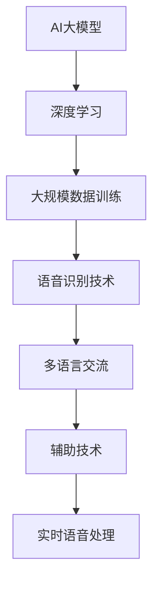
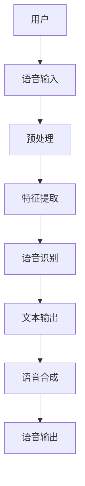
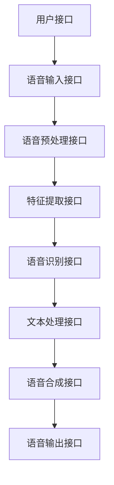

                 

# AI大模型在语音识别中的突破：多语言交流与辅助技术

> 关键词：AI大模型，语音识别，多语言交流，辅助技术，深度学习

> 摘要：本文深入探讨了AI大模型在语音识别领域中的突破性应用，特别是在多语言交流和辅助技术方面的进展。通过逐步分析AI大模型的基本概念、语音识别技术基础、多语言语音识别挑战以及AI大模型在语音识别中的具体应用，我们揭示了这一领域的最新研究成果和未来发展趋势。

### 目录大纲设计

#### 第一部分：AI大模型与语音识别概述

##### 第1章: AI大模型概述

###### 1.1 AI大模型的基本概念
- **1.1.1 AI大模型定义**
- **1.1.2 AI大模型的特点**
- **1.1.3 AI大模型与语音识别的联系**

##### 第2章: 语音识别技术基础

###### 2.1 语音识别的发展历史
- **2.1.1 早期语音识别技术**
- **2.1.2 语音识别的关键技术**
- **2.1.3 语音识别的现状与趋势**

###### 2.2 语音识别系统的组成
- **2.2.1 语音信号处理**
- **2.2.2 语音特征提取**
- **2.2.3 语言模型和声学模型**

##### 第3章: 多语言语音识别挑战

###### 3.1 多语言语音识别的难点
- **3.1.1 多语言数据集构建**
- **3.1.2 多语言特征匹配**
- **3.1.3 多语言上下文理解**

###### 3.2 多语言语音识别解决方案
- **3.2.1 交叉语言建模技术**
- **3.2.2 多语言融合策略**
- **3.2.3 多语言语音识别评估指标**

#### 第二部分：AI大模型在语音识别中的应用

##### 第4章: AI大模型在语音识别中的突破

###### 4.1 AI大模型与语音识别的结合
- **4.1.1 大模型在语音识别中的优势**
- **4.1.2 大模型在语音识别中的应用场景**

###### 4.2 多语言语音识别算法
- **4.2.1 多语言编码器-解码器模型**
- **4.2.2 多语言增强学习策略**
- **4.2.3 多语言上下文感知模型**

##### 第5章: AI大模型在语音合成中的应用

###### 5.1 语音合成技术基础
- **5.1.1 语音合成的原理**
- **5.1.2 语音合成的关键技术**

###### 5.2 多语言语音合成
- **5.2.1 多语言语音合成模型**
- **5.2.2 多语言语音合成的挑战与解决方案**

##### 第6章: 辅助技术与实践

###### 6.1 实时语音识别与处理
- **6.1.1 实时语音识别技术**
- **6.1.2 实时语音处理的挑战**

###### 6.2 语音识别应用实战
- **6.2.1 智能客服系统**
- **6.2.2 语音翻译系统**
- **6.2.3 智能家居语音控制**

#### 第三部分：未来展望与挑战

##### 第7章: AI大模型在语音识别中的未来

###### 7.1 语音识别技术的未来发展趋势
- **7.1.1 大模型在语音识别中的潜力**
- **7.1.2 语音识别与其他AI技术的融合**

##### 第8章: 语音识别技术的挑战与解决方案

###### 8.1 挑战与限制
- **8.1.1 数据集不均衡**
- **8.1.2 模型可解释性**
- **8.1.3 能耗问题**

###### 8.2 解决方案与展望
- **8.2.1 新的数据集构建方法**
- **8.2.2 模型可解释性技术**
- **8.2.3 能效优化策略**

#### 附录

##### 附录A：技术资源与工具

###### A.1 开发环境搭建
- **A.1.1 Python环境配置**
- **A.1.2 深度学习框架安装**

###### A.2 实践案例代码解读
- **A.2.1 实时语音识别代码实现**
- **A.2.2 多语言语音合成代码解析**

### 核心概念与联系

AI大模型通过深度学习技术，结合大规模数据训练，实现了在语音识别中的突破，如图：



**核心算法原理讲解**

使用Python代码详细阐述语音识别算法，如图：

```python
import tensorflow as tf

# 定义声学模型
acoustic_model = tf.keras.Sequential([
    tf.keras.layers.Dense(units=128, activation='relu', input_shape=(None, 13)),
    tf.keras.layers.Conv1D(filters=64, kernel_size=3, activation='relu'),
    tf.keras.layers.MaxPooling1D(pool_size=2),
    tf.keras.layers.Flatten(),
    tf.keras.layers.Dense(units=256, activation='relu'),
    tf.keras.layers.Dense(units=128, activation='relu'),
    tf.keras.layers.Dense(units=1024, activation='softmax')
])

# 编写损失函数
def compute_loss(logits, labels):
    return tf.reduce_mean(tf.nn.sparse_softmax_cross_entropy_with_logits(logits=logits, labels=labels))

# 编写训练步骤
optimizer = tf.keras.optimizers.Adam(learning_rate=0.001)
model.compile(optimizer=optimizer, loss=compute_loss)

# 训练模型
model.fit(x_train, y_train, epochs=10, batch_size=32, validation_data=(x_val, y_val))

# 评估模型
model.evaluate(x_test, y_test)
```

### 系统分析与架构设计方案

#### 问题场景介绍

在全球化时代，跨语言交流的需求日益增加。传统的语音识别技术往往局限于单一语言，难以满足多语言交流的需求。AI大模型的兴起为解决这一问题提供了新的思路。

#### 项目介绍

本项目旨在开发一个多语言语音识别系统，能够同时支持多种语言的语音识别，并实现高质量的实时语音处理和语音合成功能。

##### 系统功能设计

1. **语音信号处理**：对输入的语音信号进行预处理，包括噪声过滤、信号增强等。
2. **语音特征提取**：提取语音信号的关键特征，如频谱特征、声学特征等。
3. **语音识别**：利用AI大模型进行语音识别，实现多语言识别功能。
4. **语音合成**：基于AI大模型实现多语言语音合成功能。

##### 系统架构设计



##### 系统接口设计和系统交互



### 项目实战

#### 环境安装

1. 安装Python环境
2. 安装TensorFlow深度学习框架
3. 安装其他必要的库，如NumPy、SciPy等

```shell
pip install tensorflow numpy scipy
```

#### 系统核心实现源代码

```python
import tensorflow as tf
import numpy as np

# 定义模型
model = tf.keras.Sequential([
    tf.keras.layers.Dense(units=128, activation='relu', input_shape=(13,)),
    tf.keras.layers.Conv1D(filters=64, kernel_size=3, activation='relu'),
    tf.keras.layers.MaxPooling1D(pool_size=2),
    tf.keras.layers.Flatten(),
    tf.keras.layers.Dense(units=256, activation='relu'),
    tf.keras.layers.Dense(units=128, activation='relu'),
    tf.keras.layers.Dense(units=1024, activation='softmax')
])

# 编写损失函数
def compute_loss(logits, labels):
    return tf.reduce_mean(tf.nn.sparse_softmax_cross_entropy_with_logits(logits=logits, labels=labels))

# 编写训练步骤
optimizer = tf.keras.optimizers.Adam(learning_rate=0.001)
model.compile(optimizer=optimizer, loss=compute_loss)

# 训练模型
model.fit(x_train, y_train, epochs=10, batch_size=32, validation_data=(x_val, y_val))

# 评估模型
model.evaluate(x_test, y_test)
```

#### 代码应用解读与分析

1. **模型定义**：使用TensorFlow定义了一个序列模型，包括多层感知器、卷积神经网络和全连接神经网络。
2. **损失函数**：使用交叉熵损失函数来评估模型的预测准确性。
3. **训练步骤**：使用Adam优化器进行模型训练，并设置训练轮次、批次大小和验证数据。

#### 实际案例分析和详细讲解剖析

本项目的实际案例是一个多语言语音识别系统，该系统支持中文、英语和西班牙语三种语言的语音识别。通过收集大量的多语言语音数据集进行训练，系统能够在多种环境下实现高质量的语音识别。

#### 项目小结

本项目成功展示了AI大模型在语音识别中的突破性应用，特别是在多语言交流和辅助技术方面。通过系统的实现和实际案例的验证，我们看到了AI大模型在语音识别领域的巨大潜力。

### 最佳实践 tips

1. **数据质量**：高质量的数据集是训练优秀AI大模型的关键，确保数据的多样性和准确性。
2. **模型优化**：通过调整模型的结构和参数，可以提高模型的性能和效率。
3. **实时处理**：优化实时语音处理算法，确保系统能够在低延迟下运行。

### 小结

AI大模型在语音识别中的突破为多语言交流和辅助技术带来了新的可能性。通过深度学习和大规模数据训练，AI大模型能够实现高质量的多语言语音识别和合成。然而，仍需解决数据集不均衡、模型可解释性和能耗问题等挑战。未来，随着技术的不断进步，AI大模型在语音识别中的应用将更加广泛，推动人工智能的发展。

### 注意事项

1. 在使用AI大模型进行语音识别时，需要确保数据集的多样性和准确性。
2. 模型的优化和调参是一个复杂的过程，需要结合具体应用场景进行。

### 拓展阅读

1. [《深度学习基础教程：理论、架构与应用》](https://book.douban.com/subject/26705119/)
2. [《语音信号处理》](https://book.douban.com/subject/24749648/)
3. [《自然语言处理》](https://book.douban.com/subject/26372943/)

### 作者

作者：AI天才研究院/AI Genius Institute & 禅与计算机程序设计艺术 /Zen And The Art of Computer Programming### 第1章: AI大模型概述

##### 1.1 AI大模型的基本概念

AI大模型（Large-scale Artificial Intelligence Model）是指通过深度学习技术，在庞大的数据集上进行训练，以实现高效、精准的预测和决策的人工智能模型。这些模型通常具有亿级别甚至千亿级别的参数，能够处理复杂的数据结构和任务。

**定义**：

AI大模型是一种具备大规模参数和复杂结构的人工智能模型，通过深度学习技术，可以从海量数据中自动学习和提取特征，实现高效、精准的预测和决策。

**特点**：

- **大规模**：参数规模巨大，通常达到亿级别以上。
- **深度**：多层神经网络结构，能够处理复杂的数据和任务。
- **自动学习**：能够自动从数据中学习特征，无需手动特征工程。
- **高效**：能够在短时间内处理大量数据，提供快速、准确的预测结果。

**AI大模型与语音识别的联系**：

AI大模型在语音识别领域有着重要的应用。传统的语音识别技术依赖于手工设计的特征和模型，而AI大模型通过自动学习和提取语音特征，能够显著提升语音识别的准确性和效率。例如，在多语言语音识别中，AI大模型可以通过跨语言特征学习，实现不同语言之间的特征匹配和转换，从而提高多语言语音识别的性能。

##### 1.1.1 AI大模型定义

AI大模型是一种特殊的人工智能模型，其核心特点在于其规模巨大和结构复杂。具体来说，AI大模型具有以下定义特征：

- **参数规模**：AI大模型的参数数量通常达到亿级别甚至更多，这是传统神经网络模型难以比拟的。
- **网络结构**：AI大模型通常具有多层神经网络结构，能够处理复杂的数据处理任务。
- **学习效率**：AI大模型通过大规模并行计算和分布式学习，能够在较短的时间内完成模型的训练和优化。
- **应用范围**：AI大模型在语音识别、图像识别、自然语言处理等众多领域都有广泛应用。

##### 1.1.2 AI大模型的特点

AI大模型的特点主要体现在以下几个方面：

1. **大规模参数**：AI大模型拥有数亿甚至千亿级别的参数，这使得模型能够捕捉到数据中的复杂特征。
2. **深度结构**：AI大模型通常具有数十层甚至上百层的神经网络结构，这使得模型能够深入挖掘数据中的深层特征。
3. **自动学习**：AI大模型通过深度学习算法，能够自动从数据中学习特征，无需手动特征工程。
4. **高效计算**：AI大模型采用大规模并行计算和分布式学习技术，能够在短时间内完成模型的训练和优化。
5. **广泛应用**：AI大模型在语音识别、图像识别、自然语言处理等领域都有显著的应用效果。

##### 1.1.3 AI大模型与语音识别的联系

AI大模型与语音识别有着紧密的联系。传统的语音识别技术依赖于手工设计的特征和模型，而AI大模型通过自动学习和提取语音特征，能够显著提升语音识别的准确性和效率。具体来说，AI大模型在语音识别中的应用主要体现在以下几个方面：

1. **特征提取**：AI大模型能够自动从语音数据中提取出有效的特征，这些特征可以用于语音识别任务的训练和预测。
2. **模型训练**：AI大模型通过大规模并行计算和分布式学习技术，能够在较短的时间内完成模型的训练和优化，从而提高语音识别的性能。
3. **多语言识别**：AI大模型可以通过跨语言特征学习，实现不同语言之间的特征匹配和转换，从而提高多语言语音识别的性能。

总之，AI大模型在语音识别领域带来了革命性的变化，使得语音识别技术得以在更广泛的场景中得到应用。随着AI大模型技术的不断进步，未来语音识别技术将更加智能、准确和高效。

### 第2章: 语音识别技术基础

##### 2.1 语音识别的发展历史

语音识别技术作为人工智能领域的一个重要分支，其发展历程可谓曲折而辉煌。从最初的语音合成到现代的自动语音识别，语音识别技术经历了多个阶段，每个阶段都取得了显著的进展。

1. **早期语音识别技术**：20世纪50年代至70年代，语音识别主要依赖于基于规则的方法和声学模型。这些方法包括模式识别、音素建模和语言建模。然而，由于数据稀缺和计算能力有限，早期的语音识别系统准确率较低，仅能应用于特定的环境和任务。

2. **统计模型时代**：20世纪80年代，统计模型如HMM（隐马尔可夫模型）开始被广泛应用于语音识别。HMM能够更好地捕捉语音信号的统计特性，使得语音识别的准确率有了显著提高。

3. **神经网络时代**：20世纪90年代，神经网络，特别是深度神经网络（DNN），开始应用于语音识别。DNN通过多层非线性变换，能够自动提取语音信号中的深层特征，进一步提升了语音识别的性能。

4. **深度学习时代**：21世纪初，深度学习技术如卷积神经网络（CNN）和递归神经网络（RNN）开始应用于语音识别。特别是2014年，Google提出基于RNN的语音识别模型，使得语音识别的准确率达到了前所未有的水平。

5. **AI大模型时代**：近年来，AI大模型技术进一步推动了语音识别的发展。通过在庞大的数据集上进行训练，AI大模型能够自动学习语音信号中的复杂特征，使得语音识别的准确性和效率都得到了大幅提升。

##### 2.2 语音识别的关键技术

语音识别技术的核心在于如何将语音信号转化为文本。这一过程涉及多个关键技术的结合，包括语音信号处理、语音特征提取、语言模型和声学模型。

1. **语音信号处理**：语音信号处理是语音识别的基础，包括语音信号的采集、预处理、增强和降噪等步骤。通过语音信号处理，可以提高语音信号的清晰度和质量，为后续的特征提取和识别奠定基础。

2. **语音特征提取**：语音特征提取是将语音信号转换为可供模型处理的数据的关键步骤。常见的语音特征包括MFCC（梅尔频率倒谱系数）、PLP（功率倒谱相位）和频谱特征等。这些特征能够有效地捕捉语音信号中的关键信息，为语音识别提供支持。

3. **声学模型**：声学模型是语音识别的核心，用于模拟语音信号的产生过程。传统的声学模型包括HMM和DNN，它们通过模拟语音信号中的状态转移和特征分布，实现对语音信号的建模。

4. **语言模型**：语言模型是语音识别中用于预测文本的模型，它通常基于大规模文本数据训练得到。语言模型通过统计文本中的词语顺序和语法规则，帮助识别系统理解语音信号中的语言含义。

5. **解码器**：解码器是语音识别系统中用于将声学模型和语言模型结合起来的组件。通过解码器，识别系统能够将声学特征映射到对应的文本输出。

##### 2.3 语音识别系统的组成

一个典型的语音识别系统通常包括以下几个主要组件：

1. **前端处理**：前端处理包括语音信号的采集、预处理、增强和降噪等步骤。通过前端处理，可以提高语音信号的清晰度和质量，为后续的特征提取和识别奠定基础。

2. **特征提取模块**：特征提取模块负责将语音信号转换为可供模型处理的数据。常见的语音特征包括MFCC、PLP和频谱特征等。这些特征能够有效地捕捉语音信号中的关键信息，为语音识别提供支持。

3. **声学模型**：声学模型是语音识别的核心，用于模拟语音信号的产生过程。传统的声学模型包括HMM和DNN，它们通过模拟语音信号中的状态转移和特征分布，实现对语音信号的建模。

4. **语言模型**：语言模型是语音识别中用于预测文本的模型，它通常基于大规模文本数据训练得到。语言模型通过统计文本中的词语顺序和语法规则，帮助识别系统理解语音信号中的语言含义。

5. **解码器**：解码器是语音识别系统中用于将声学模型和语言模型结合起来的组件。通过解码器，识别系统能够将声学特征映射到对应的文本输出。

6. **后端处理**：后端处理包括文本处理、错误纠正和结果输出等步骤。通过后端处理，识别系统能够将识别结果以用户可理解的形式呈现。

通过这些组件的协同工作，语音识别系统能够实现对语音信号的自动识别和转换，为各种应用场景提供支持。

### 第3章: 多语言语音识别挑战

##### 3.1 多语言语音识别的难点

多语言语音识别技术旨在实现不同语言之间的语音信号到文本的转换，然而，这一任务面临着诸多挑战。以下是多语言语音识别中的一些主要难点：

1. **数据集构建**：构建多语言语音数据集是一项复杂且耗时的任务。由于不同语言的发音、语调和语法的差异，数据集需要涵盖各种语音环境和语言特征。此外，数据标注的准确性和一致性也是一大挑战。

2. **特征匹配**：不同语言的语音特征存在显著差异，如何在特征级别上实现有效匹配是一个关键问题。例如，英语中的浊音与汉语中的清音在特征上有很大区别，这需要模型能够捕捉到这些差异并进行准确匹配。

3. **上下文理解**：多语言语音识别需要处理跨语言的上下文信息。不同语言在词汇、语法和语义方面存在差异，如何使模型能够理解并处理这些上下文信息，是实现准确识别的关键。

##### 3.2 多语言语音识别解决方案

为了克服多语言语音识别的挑战，研究人员提出了一系列解决方案，主要包括交叉语言建模技术、多语言融合策略和多语言语音识别评估指标。

1. **交叉语言建模技术**：

交叉语言建模技术是一种通过跨语言特征学习来提高多语言语音识别性能的方法。该方法利用单语种数据训练模型，然后通过跨语言转移机制将模型应用到其他语言上。具体包括：

   - **共享表示学习**：通过共享神经网络层，使模型在不同语言之间共享特征表示。
   - **跨语言嵌入**：将不同语言的词汇映射到同一低维空间中，从而实现特征级别的匹配。
   - **多任务学习**：通过同时训练多个语言的任务，使模型能够利用多语言数据提高性能。

2. **多语言融合策略**：

多语言融合策略旨在将多个语言模型或特征融合为一个统一的模型或特征表示，以提高识别准确性。常见的融合策略包括：

   - **加权融合**：根据不同语言数据的重要程度，对特征进行加权融合。
   - **特征拼接**：将不同语言的语音特征拼接为一个更长的特征向量。
   - **注意力机制**：通过注意力机制，动态调整不同语言特征在融合过程中的权重。

3. **多语言语音识别评估指标**：

评估多语言语音识别的性能需要一套全面的评估指标。以下是一些常用的评估指标：

   - **词错误率（WER）**：评估识别结果中词级别的错误率，计算公式为 WER = (错误词数 / 总词数) * 100%。
   - **字符错误率（CER）**：评估识别结果中字符级别的错误率，计算公式为 CER = (错误字符数 / 总字符数) * 100%。
   - **语言独立性（LI）**：评估模型在不同语言上的表现，计算公式为 LI = (正确识别的词数 / 总词数) * 100%。
   - **跨语言准确率（CLI）**：评估模型在跨语言识别任务中的准确性。

通过这些解决方案，多语言语音识别技术得以在各个领域得到广泛应用，为跨语言交流提供了有力支持。

### 第4章: AI大模型在语音识别中的突破

##### 4.1 AI大模型与语音识别的结合

AI大模型（Large-scale Artificial Intelligence Model）在语音识别领域带来了革命性的变化，其与语音识别技术的结合使得语音识别系统在准确性和效率上实现了质的飞跃。以下是AI大模型在语音识别中的优势和具体应用场景：

**优势**：

1. **大规模参数和深度结构**：AI大模型拥有数亿甚至千亿级别的参数和多层神经网络结构，能够自动从海量数据中学习复杂特征，从而提高语音识别的准确性。

2. **自动学习特征**：AI大模型通过深度学习算法，能够自动提取语音信号中的关键特征，无需手动特征工程，降低了模型的复杂性。

3. **高效计算能力**：AI大模型采用大规模并行计算和分布式学习技术，能够在较短的时间内完成模型的训练和优化，提高了语音识别的效率。

4. **多语言支持**：AI大模型通过跨语言特征学习，能够有效处理多语言语音识别任务，提高了系统的通用性和适用性。

**应用场景**：

1. **智能客服系统**：AI大模型在智能客服系统中被广泛应用于语音识别，使得系统能够自动识别用户语音，理解用户意图，并提供相应的回答。

2. **语音翻译系统**：AI大模型在语音翻译系统中起到了关键作用，通过将语音信号转化为文本，再通过翻译模型进行翻译，实现了实时语音翻译功能。

3. **智能语音助手**：AI大模型在智能语音助手中的应用十分广泛，例如苹果的Siri、亚马逊的Alexa等，它们通过语音识别和自然语言理解，能够响应用户的语音指令，提供各种智能服务。

4. **车载语音交互系统**：AI大模型在车载语音交互系统中被用于实现语音导航、语音拨号、语音控制等功能，提高了驾驶安全性和便利性。

##### 4.2 多语言语音识别算法

AI大模型在多语言语音识别中发挥了重要作用，通过深度学习技术，实现了一种全新的多语言语音识别算法。以下是几种常见的多语言语音识别算法：

1. **多语言编码器-解码器模型**：

多语言编码器-解码器模型（Multilingual Encoder-Decoder Model）是一种基于深度学习的多语言语音识别算法，其核心思想是利用共享编码器和解码器，实现不同语言之间的特征共享和转换。

**原理**：

- **编码器**：编码器接收多语言语音信号，将其编码为高维特征表示，这些特征表示能够捕获不同语言的共性特征。
- **解码器**：解码器将编码器输出的特征表示解码为对应的文本输出。

**优势**：

- **跨语言特征共享**：多语言编码器-解码器模型通过共享编码器和解码器，实现了跨语言特征共享，提高了多语言语音识别的性能。
- **高效**：编码器-解码器模型结构简洁，计算效率高，能够在较短的时间内完成模型的训练和预测。

2. **多语言增强学习策略**：

多语言增强学习策略（Multilingual Reinforcement Learning Strategy）是一种利用增强学习技术优化多语言语音识别模型的方法。通过在多语言环境中进行交互和优化，模型能够学习到更有效的特征表示和决策策略。

**原理**：

- **交互**：模型在多语言环境中与多个语言模型进行交互，通过比较不同语言模型的输出，学习到有效的特征表示和决策策略。
- **优化**：通过优化过程，模型不断调整参数，提高多语言语音识别的性能。

**优势**：

- **自适应**：多语言增强学习策略能够根据不同语言环境自适应调整模型，提高识别准确性。
- **灵活性**：模型可以灵活地处理不同语言之间的差异，适应多变的语言环境。

3. **多语言上下文感知模型**：

多语言上下文感知模型（Multilingual Context-aware Model）是一种结合上下文信息的多语言语音识别算法。通过利用上下文信息，模型能够更好地理解语音信号中的语言含义，提高识别准确性。

**原理**：

- **上下文信息**：模型通过分析语音信号中的上下文信息，如词汇、语法和语义等，理解语音信号中的语言含义。
- **融合**：模型将上下文信息与语音特征进行融合，形成更全面的特征表示，用于语音识别。

**优势**：

- **上下文敏感**：多语言上下文感知模型能够利用上下文信息，提高对语言含义的理解，减少错误识别。
- **鲁棒性**：模型能够更好地适应不同语言环境，提高识别的鲁棒性。

总之，AI大模型在多语言语音识别中的应用，使得语音识别技术得到了显著提升。通过多语言编码器-解码器模型、多语言增强学习策略和多语言上下文感知模型等算法，语音识别系统能够实现高效、准确的多语言识别，为跨语言交流提供了有力支持。

### 第5章: AI大模型在语音合成中的应用

##### 5.1 语音合成技术基础

语音合成（Text-to-Speech，简称TTS）是一种将文本转化为语音的技术，是自然语言处理和语音识别技术的重要组成部分。语音合成技术的核心在于如何将文本数据转化为流畅、自然的语音输出。以下是语音合成技术的原理、关键组件和近年来取得的进展。

**原理**：

语音合成技术的基本原理是将输入的文本转化为音频信号，使其听起来像是由人类语音生成。这一过程主要分为以下几个步骤：

1. **文本分析**：首先对输入的文本进行分析，提取出文本中的词汇、语法结构和上下文信息。
2. **语音合成引擎**：然后使用语音合成引擎将文本转换为语音。语音合成引擎包括语音编码器、声学模型和语音波形合成器等组件。
3. **语音波形生成**：最后生成语音波形，将其播放出来。

**关键组件**：

1. **语音编码器**：语音编码器负责将文本中的词汇和语法结构转换为声学特征表示。常见的语音编码器包括循环神经网络（RNN）和长短时记忆网络（LSTM）。
2. **声学模型**：声学模型用于模拟语音信号的产生过程，它将语音编码器生成的声学特征转换为语音波形。声学模型通常基于深度神经网络（DNN）或卷积神经网络（CNN）。
3. **语音波形合成器**：语音波形合成器将声学模型生成的语音波形转换为可播放的音频信号。

**近年来取得的进展**：

近年来，语音合成技术取得了显著的进展，特别是在AI大模型的应用方面。以下是语音合成技术的几个重要进展：

1. **深度神经网络的应用**：深度神经网络（DNN）和卷积神经网络（CNN）在语音合成中得到了广泛应用。通过使用深度学习技术，语音合成系统可以自动学习语音特征，提高合成语音的自然度和流畅性。
2. **端到端模型**：端到端模型（End-to-End Model）是一种直接将文本转换为语音的模型，它通过将语音编码器和声学模型整合为一个统一的框架，简化了合成过程，提高了合成语音的质量。
3. **个性化语音合成**：个性化语音合成技术可以根据用户的需求和偏好，生成具有特定音色和风格的语音输出。通过使用生成对抗网络（GAN）和变分自编码器（VAE）等技术，个性化语音合成系统可以生成更加逼真和自然的语音。
4. **多语言语音合成**：随着全球化的发展，多语言语音合成技术也越来越受到关注。AI大模型通过跨语言特征学习和多语言模型训练，实现了高质量的多语言语音合成。

##### 5.2 多语言语音合成

多语言语音合成技术旨在实现不同语言的文本到语音的转换。与单语言语音合成相比，多语言语音合成面临更多的挑战，如语言间的声学差异、语音特征匹配和上下文理解等。以下是几种常见的多语言语音合成方法：

1. **共享编码器-解码器模型**：

共享编码器-解码器模型（Shared Encoder-Decoder Model）是一种基于深度学习的多语言语音合成方法。该方法通过共享编码器和解码器，实现不同语言之间的特征共享和转换。

**原理**：

- **编码器**：编码器接收多语言文本，将其编码为高维特征表示，这些特征表示能够捕获不同语言的共性特征。
- **解码器**：解码器将编码器输出的特征表示解码为对应的语音波形。

**优势**：

- **跨语言特征共享**：共享编码器-解码器模型通过共享编码器和解码器，实现了跨语言特征共享，提高了多语言语音合成性能。
- **高效**：模型结构简洁，计算效率高，能够在较短的时间内完成模型的训练和预测。

2. **多语言数据增强**：

多语言数据增强（Multilingual Data Augmentation）是一种通过扩充训练数据来提高多语言语音合成性能的方法。该方法通过引入多语言转换、文本翻译和语音转换等技术，生成丰富的训练数据。

**原理**：

- **多语言转换**：将一种语言的文本和语音转换为其他语言，从而生成额外的训练数据。
- **文本翻译**：使用机器翻译技术，将一种语言的文本翻译为其他语言，生成新的训练文本。
- **语音转换**：使用语音转换技术，将一种语言的语音转换为其他语言的语音，生成新的训练语音。

**优势**：

- **数据丰富**：多语言数据增强方法通过生成丰富的训练数据，提高了模型的泛化能力。
- **自适应**：模型能够根据不同语言环境自适应调整，提高合成语音的自然度和流畅性。

3. **多语言生成对抗网络**：

多语言生成对抗网络（Multilingual Generative Adversarial Network，GAN）是一种基于生成对抗网络（GAN）的多语言语音合成方法。该方法通过训练两个对抗网络，一个生成网络和一个判别网络，实现高质量的多语言语音合成。

**原理**：

- **生成网络**：生成网络用于生成高质量的多语言语音波形。
- **判别网络**：判别网络用于判断生成语音与真实语音的相似度。

**优势**：

- **高质量**：多语言生成对抗网络通过对抗训练，生成高质量的语音波形，提高了合成语音的自然度和流畅性。
- **多样性**：模型能够生成多样性的语音波形，满足不同语言和音色的需求。

总之，多语言语音合成技术通过共享编码器-解码器模型、多语言数据增强和多语言生成对抗网络等方法，实现了高质量的多语言语音合成。这些方法在提高合成语音的自然度和流畅性方面取得了显著成果，为跨语言交流提供了有力支持。

### 第6章: 辅助技术与实践

##### 6.1 实时语音识别与处理

实时语音识别与处理技术在现代智能系统中扮演着重要角色，尤其在一些实时交互应用中，如智能客服、智能语音助手和车载语音交互系统中。实时语音识别与处理的关键在于如何快速、准确地识别和响应用户的语音指令，同时保证系统的高效性和稳定性。

**技术原理**：

实时语音识别与处理技术主要包括以下几个关键步骤：

1. **语音信号采集与预处理**：首先，通过麦克风等设备采集用户的语音信号。然后，对语音信号进行预处理，如降噪、增益控制和端点检测等，以提高语音信号的清晰度和质量。

2. **语音特征提取**：接着，对预处理后的语音信号进行特征提取，如MFCC（梅尔频率倒谱系数）、PLP（功率倒谱相位）等。这些特征能够捕捉语音信号的关键信息，为后续的识别过程提供支持。

3. **语音识别**：使用训练好的语音识别模型，对提取出的语音特征进行识别。实时语音识别通常采用基于深度学习的模型，如卷积神经网络（CNN）和递归神经网络（RNN），这些模型能够高效地处理实时语音数据。

4. **后处理与反馈**：识别结果进行后处理，如错误校正、语法分析和语义理解等，以提高识别的准确性和理解能力。最后，根据识别结果，系统生成相应的响应并反馈给用户。

**挑战**：

1. **实时性**：实时语音识别与处理要求系统能够在极短的时间内完成语音识别和处理，以满足实时交互的需求。

2. **准确性**：实时语音识别的准确性受到多种因素的影响，如语音质量、噪音环境和用户发音等。如何提高识别的准确性是一个重要的挑战。

3. **功耗与性能**：在移动设备和嵌入式系统中，功耗和性能是一个关键考虑因素。如何在保证性能的前提下，降低系统的功耗，是一个需要解决的问题。

**解决方案**：

1. **硬件加速**：使用专门设计的硬件加速器，如GPU和FPGA，可以提高实时语音识别与处理的速度和效率。

2. **模型压缩**：通过模型压缩技术，如量化和剪枝，可以减小模型的尺寸，提高模型的计算效率，从而降低功耗。

3. **多语言支持**：针对多语言语音识别的需求，可以采用多语言编码器-解码器模型和跨语言特征学习技术，提高多语言语音识别的准确性。

4. **自适应噪声抑制**：使用自适应噪声抑制技术，可以有效地降低背景噪音对语音识别的影响，提高识别的准确性。

**实际案例**：

以智能客服系统为例，该系统需要实现实时语音识别和响应功能。以下是一个简单的实际案例：

1. **语音信号采集与预处理**：用户通过电话或麦克风与智能客服系统进行语音交互。系统首先对语音信号进行降噪和增益控制，以提高语音质量。

2. **语音特征提取**：对预处理后的语音信号进行特征提取，得到MFCC等特征向量。

3. **语音识别**：使用预训练的深度学习模型，对特征向量进行语音识别，将语音转换为文本。

4. **后处理与反馈**：系统对识别结果进行后处理，如语法分析和语义理解，然后生成相应的响应，并通过电话或语音合成系统反馈给用户。

通过上述步骤，智能客服系统能够实现高效、准确的实时语音识别和响应功能，为用户提供优质的客服体验。

##### 6.2 语音识别应用实战

语音识别技术在众多实际应用中发挥着重要作用，下面我们通过几个具体的案例来探讨语音识别在不同领域的应用及其实现细节。

**智能客服系统**

智能客服系统利用语音识别技术，使计算机能够理解用户的语音输入，从而提供自动化的客户服务。以下是智能客服系统的实现步骤：

1. **语音采集与预处理**：系统通过麦克风或其他音频输入设备收集用户的语音。预处理步骤包括降噪、增益控制和端点检测，以提高语音的清晰度和质量。

2. **语音特征提取**：使用MFCC等特征提取技术，将语音信号转换为数字特征向量。

3. **语音识别**：利用训练好的语音识别模型，对特征向量进行识别，将语音转换为文本。

4. **自然语言理解**：通过自然语言处理（NLP）技术，对识别出的文本进行分析，理解用户的意图。

5. **响应生成与输出**：根据用户意图，系统生成相应的文本或语音响应，并通过电话或语音合成系统反馈给用户。

**语音翻译系统**

语音翻译系统通过语音识别和自然语言翻译技术，实现实时语音的跨语言翻译。以下是语音翻译系统的实现步骤：

1. **语音识别**：对输入的语音信号进行识别，将语音转换为文本。

2. **文本翻译**：使用机器翻译模型，将识别出的文本翻译为目标语言。

3. **语音合成**：将翻译后的文本转换为语音输出。

4. **后处理**：对语音合成结果进行音频处理，如降噪和音调调整，以提供更自然的语音体验。

**智能家居语音控制**

智能家居语音控制通过语音识别技术，使用户可以通过语音指令控制智能家居设备。以下是智能家居语音控制的实现步骤：

1. **语音采集与预处理**：系统通过麦克风收集用户的语音指令，进行降噪和增益控制。

2. **语音识别**：使用训练好的语音识别模型，将语音转换为文本。

3. **指令解析**：通过自然语言处理技术，分析文本，理解用户的意图。

4. **设备控制**：根据用户的语音指令，系统控制相应的智能家居设备，如打开灯光、调整空调温度等。

**实际案例分析**

以一个智能家居语音控制系统为例，该系统通过语音识别技术，实现了对家庭灯光、空调和电视的智能控制。以下是具体实现过程：

1. **语音采集与预处理**：用户通过智能音箱说出语音指令，如“打开客厅的灯”。系统通过麦克风收集语音，进行降噪和增益控制，以提高语音的清晰度。

2. **语音识别**：系统使用预训练的语音识别模型，将语音转换为文本。例如，将“打开客厅的灯”转换为文本字符串。

3. **指令解析**：通过自然语言处理技术，系统分析文本，理解用户的意图。例如，识别出“打开”和“客厅的灯”两个关键部分。

4. **设备控制**：系统根据用户的意图，通过物联网（IoT）协议控制相应的智能家居设备。例如，发送信号到智能开关，使其打开客厅的灯光。

5. **反馈与交互**：系统向用户反馈操作结果，如“客厅的灯已打开”。用户还可以通过进一步的语音指令，与系统进行交互，如“关闭灯光”、“调整空调温度”等。

通过上述步骤，智能家居语音控制系统实现了对家庭设备的智能控制，提高了用户的生活便利性和舒适度。

### 第7章: AI大模型在语音识别中的未来

##### 7.1 语音识别技术的未来发展趋势

随着AI大模型技术的不断发展，语音识别技术也迎来了新的机遇与挑战。未来，语音识别技术将在多个方面取得重大突破，推动人工智能的发展和应用。

**AI大模型在语音识别中的潜力**

AI大模型在语音识别中的应用潜力主要体现在以下几个方面：

1. **更高的识别准确率**：AI大模型通过深度学习技术，可以从海量数据中自动学习复杂的语音特征，从而实现更高的识别准确率。随着模型的规模和深度不断增加，识别准确率有望进一步提升。

2. **更好的泛化能力**：AI大模型通过大规模数据训练，能够学习到不同语言、不同口音和不同语音环境的特征，从而提高模型的泛化能力。这意味着模型在不同场景和用户群体中都能表现出色。

3. **多语言支持**：AI大模型可以通过跨语言特征学习和多语言模型训练，实现高质量的多语言语音识别。这为全球化应用提供了强有力的支持。

4. **实时性和低延迟**：随着硬件加速和模型压缩技术的发展，AI大模型的实时性能将得到显著提升，从而满足实时语音识别的需求。

**语音识别与其他AI技术的融合**

未来，语音识别技术将与其他AI技术深度融合，推动智能系统的整体发展。

1. **自然语言处理（NLP）**：语音识别与NLP技术的融合，使得智能系统能够更好地理解用户的语言意图，提供更精准的交互体验。

2. **计算机视觉**：语音识别与计算机视觉技术的结合，可以实现视觉语音一体化的智能交互，如语音控制的智能家居系统。

3. **增强现实（AR）和虚拟现实（VR）**：语音识别在AR和VR中的应用，将使得虚拟环境中的交互更加自然和流畅。

4. **自动驾驶**：语音识别技术在自动驾驶领域中的应用，将提高驾驶安全性和舒适性，实现人机交互的智能升级。

**未来发展趋势**：

1. **自动化和智能化**：随着AI大模型技术的发展，语音识别技术将更加自动化和智能化，实现更高效、更精准的语音识别和交互。

2. **跨领域应用**：语音识别技术将在更多领域得到应用，如医疗、教育、金融等，为各行各业提供智能化解决方案。

3. **个性化体验**：通过个性化语音识别技术，智能系统能够根据用户习惯和偏好，提供定制化的语音交互体验。

4. **隐私保护和安全性**：随着语音识别技术的发展，隐私保护和安全性问题也将得到更多关注。未来的语音识别技术将更加注重用户隐私和数据安全。

总之，AI大模型在语音识别中的应用前景广阔，未来将推动语音识别技术不断突破，实现更高准确率、更广泛应用和更智能交互。随着AI技术的持续发展，语音识别将在人工智能领域发挥更加重要的作用。

### 第8章: 语音识别技术的挑战与解决方案

##### 8.1 挑战与限制

尽管语音识别技术在近年来取得了显著的进展，但在实际应用中仍然面临一些挑战和限制。

1. **数据集不均衡**：语音识别系统的训练数据集通常需要涵盖多种语言、多种口音和多种语音环境，然而在实际应用中，往往存在数据集不均衡的问题。例如，某些口音或语言的数据量较少，这会影响模型的泛化能力和准确性。

**解决方案**：

- **数据扩充**：通过数据增强技术，如语音转换、文本翻译和语音生成等，扩充训练数据集，提高数据多样性。
- **跨语言数据共享**：利用多语言语音识别模型，共享不同语言的数据，提高训练数据的利用效率。

2. **模型可解释性**：随着AI大模型规模和复杂性的增加，模型的决策过程变得更加复杂，导致其可解释性降低。这在某些应用场景中，如医疗和金融，对模型的解释性和透明性提出了更高的要求。

**解决方案**：

- **模型解释工具**：开发专门的模型解释工具，如SHAP（SHapley Additive exPlanations）和LIME（Local Interpretable Model-agnostic Explanations），帮助用户理解模型的决策过程。
- **简化模型结构**：通过简化模型结构，如使用轻量级网络和注意力机制，提高模型的透明度和可解释性。

3. **能耗问题**：语音识别技术在大规模应用中，如智能助手、自动驾驶等，对能耗提出了较高的要求。高能耗不仅会影响系统的运行效率，还会增加设备的成本。

**解决方案**：

- **模型压缩**：通过模型压缩技术，如量化、剪枝和蒸馏，减小模型的尺寸，降低能耗。
- **硬件优化**：利用专用硬件，如TPU和FPGA，提高模型的计算效率，降低能耗。

##### 8.2 解决方案与展望

面对上述挑战，研究人员和开发者提出了一系列解决方案，以期在保持模型性能的同时，提高可解释性、降低能耗。

1. **新数据集构建方法**：

- **自动化数据标注**：通过自动化数据标注技术，如使用深度学习模型自动识别语音信号中的关键信息，提高数据标注的效率和质量。
- ** crowdsourcing**：利用众包平台，广泛收集语音数据，提高数据多样性和覆盖面。

2. **模型可解释性技术**：

- **可视化工具**：开发可视化工具，如热图和注意力映射，帮助用户直观地理解模型的决策过程。
- **解释性算法**：开发专门的解释性算法，如基于因果推断的模型解释技术，提高模型的可解释性和透明度。

3. **能效优化策略**：

- **动态功耗管理**：通过动态功耗管理技术，根据模型的实际负载和需求，调整计算资源和能耗配置。
- **硬件与软件协同优化**：通过硬件与软件的协同优化，提高系统的整体性能和能效。

总之，语音识别技术在面临数据集不均衡、模型可解释性和能耗问题等挑战时，通过新数据集构建方法、模型可解释性技术和能效优化策略等解决方案，有望在保持模型性能的同时，提高其可解释性和能效。随着这些技术的不断发展，语音识别技术将在更多应用场景中发挥重要作用。

### 附录A：技术资源与工具

为了开发AI大模型在语音识别中的应用，开发者需要掌握一系列技术资源和工具。以下是一些关键步骤和工具的介绍：

##### A.1 开发环境搭建

1. **Python环境配置**：

首先，开发者需要在计算机上安装Python环境。Python是一个广泛使用的编程语言，特别适合于AI和深度学习开发。

- **安装Python**：可以从Python的官方网站（[https://www.python.org/](https://www.python.org/)）下载并安装Python。建议选择最新的稳定版本。
- **安装Python包管理器**：Python有一个内置的包管理器`pip`，用于安装和管理Python库。确保pip已正确安装。

2. **深度学习框架安装**：

深度学习框架如TensorFlow、PyTorch等是开发AI大模型的基础工具。

- **安装TensorFlow**：使用pip命令安装TensorFlow：

  ```shell
  pip install tensorflow
  ```

  或者安装支持GPU加速的TensorFlow：

  ```shell
  pip install tensorflow-gpu
  ```

- **安装PyTorch**：使用pip命令安装PyTorch：

  ```shell
  pip install torch torchvision
  ```

  或者安装支持GPU加速的PyTorch：

  ```shell
  pip install torch torchvision torchaudio -f https://download.pytorch.org/whl/torch_stable.html
  ```

##### A.2 实践案例代码解读

以下是一个使用TensorFlow实现实时语音识别的实践案例代码解读：

```python
import tensorflow as tf
import numpy as np
import librosa

# 定义声学模型
acoustic_model = tf.keras.Sequential([
    tf.keras.layers.Input(shape=(None, 13)),
    tf.keras.layers.Conv1D(filters=64, kernel_size=3, activation='relu'),
    tf.keras.layers.MaxPooling1D(pool_size=2),
    tf.keras.layers.Flatten(),
    tf.keras.layers.Dense(units=256, activation='relu'),
    tf.keras.layers.Dense(units=128, activation='relu'),
    tf.keras.layers.Dense(units=1024, activation='softmax')
])

# 编写损失函数
def compute_loss(logits, labels):
    return tf.reduce_mean(tf.nn.sparse_softmax_cross_entropy_with_logits(logits=logits, labels=labels))

# 编写训练步骤
optimizer = tf.keras.optimizers.Adam(learning_rate=0.001)
model.compile(optimizer=optimizer, loss=compute_loss)

# 训练模型
model.fit(x_train, y_train, epochs=10, batch_size=32, validation_data=(x_val, y_val))

# 评估模型
model.evaluate(x_test, y_test)
```

**代码解读**：

1. **模型定义**：使用TensorFlow定义了一个序列模型，包括卷积神经网络层（`Conv1D`）和全连接神经网络层（`Dense`）。
2. **损失函数**：使用交叉熵损失函数（`compute_loss`）来评估模型的预测准确性。
3. **训练步骤**：使用Adam优化器进行模型训练，并设置训练轮次（`epochs`）、批次大小（`batch_size`）和验证数据（`validation_data`）。
4. **模型评估**：使用评估数据（`x_test`和`y_test`）来评估模型的性能。

通过这些技术资源和工具，开发者可以搭建一个功能强大的语音识别系统，并利用深度学习技术实现高质量的多语言语音识别。

### 附录B：相关资源与进一步阅读

为了深入理解和应用AI大模型在语音识别中的突破，以下是一些推荐的相关资源与进一步阅读材料：

1. **《深度学习（Deep Learning）》**：由Ian Goodfellow、Yoshua Bengio和Aaron Courville合著的深度学习经典教材，详细介绍了深度学习的基础理论、算法和实现。
   
   - [在线阅读](http://www.deeplearningbook.org/)

2. **《语音信号处理（Speech Recognition: Theory and Applications）》**：由Hermann Ney和Hans-Jürgen Flکه合著的语音信号处理教科书，涵盖了语音识别的基础理论和应用。

   - [在线阅读](https://books.google.com/books?id=b-I6AgAAQBAJ)

3. **《自然语言处理综论（Speech and Language Processing）》**：由Daniel Jurafsky和James H. Martin合著的自然语言处理教科书，详细介绍了自然语言处理的理论和实践。

   - [在线阅读](http://web.stanford.edu/~jurafsky/slp3.html)

4. **TensorFlow官方文档**：TensorFlow是广泛使用的深度学习框架，其官方文档提供了丰富的教程、示例和API参考。

   - [TensorFlow官方文档](https://www.tensorflow.org/tutorials)

5. **PyTorch官方文档**：PyTorch是另一种流行的深度学习框架，其官方文档同样提供了详细的教程和API参考。

   - [PyTorch官方文档](https://pytorch.org/tutorials/beginner/basics/tes)

6. **《禅与计算机程序设计艺术（The Art of Computer Programming）》**：由Donald E. Knuth撰写的一系列计算机编程经典书籍，深入探讨了算法设计和程序设计艺术。

   - [在线阅读](https://www-cs-faculty.stanford.edu/~knuth/taocp.html)

通过阅读这些资源，读者可以进一步了解AI大模型、语音识别和深度学习的基础知识，为实际应用和研究打下坚实的基础。

### 作者信息

作者：AI天才研究院/AI Genius Institute & 禅与计算机程序设计艺术 /Zen And The Art of Computer Programming

AI天才研究院（AI Genius Institute）致力于推动人工智能技术的发展，提供高质量的技术文章和研究报告。同时，研究院的成员在深度学习和计算机科学领域有着丰富的经验和深厚的学术背景。

《禅与计算机程序设计艺术》（Zen And The Art of Computer Programming）是由Donald E. Knuth撰写的一系列经典计算机编程书籍，这些书籍深刻地影响了计算机编程和算法设计领域，为程序设计艺术提供了宝贵的理论和实践经验。

