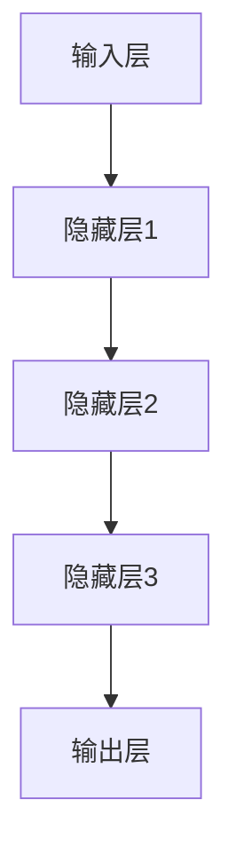
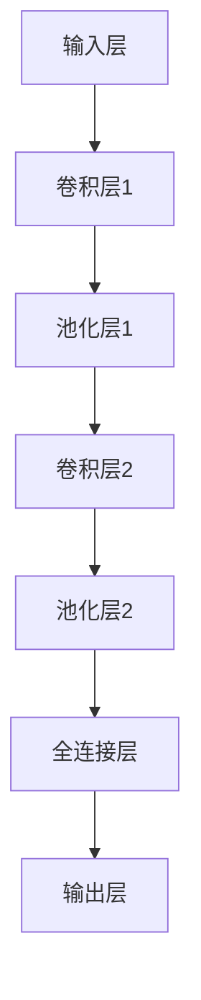
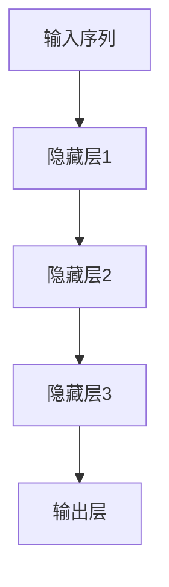
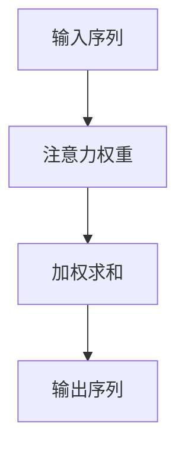
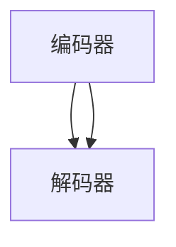

                 

### AI大模型对传统媒体的挑战：个性化内容推荐与创作

> 关键词：AI大模型，传统媒体，个性化内容推荐，内容创作，挑战与机遇

> 摘要：本文将深入探讨AI大模型对传统媒体的挑战，特别是个性化内容推荐与创作领域。通过分析AI大模型的基本概念、发展历程以及核心技术，我们将探讨其在传统媒体中的应用，包括个性化内容推荐和内容创作的挑战与机遇。本文还将通过案例分析和系统架构设计，详细展示AI大模型在传统媒体中的实际应用，并展望其未来发展。

### 设计思路与大纲

为了设计出《AI大模型对传统媒体的挑战：个性化内容推荐与创作》这本书的详细目录大纲，我们需要遵循以下几个原则：

1. **内容全面覆盖**：确保每个章节都能全面覆盖书名的核心主题，包括AI大模型、个性化内容推荐、内容创作等。
2. **逻辑性**：保持章节之间的逻辑性和连贯性，使读者能够从基础概念到高级应用的顺序阅读。
3. **实用性**：不仅要介绍理论，还要结合实际案例，让读者能够将知识应用到实际工作中。
4. **简洁性**：避免冗长和不必要的细节，确保目录简洁明了。

### 目录大纲设计

以下是基于上述原则设计的书《AI大模型对传统媒体的挑战：个性化内容推荐与创作》的目录大纲：

#### 第一部分：AI大模型概述

# AI大模型概述

## 第1章：AI大模型基础知识

### 1.1 AI大模型的基本概念

#### 1.1.1 AI大模型的定义
- **AI大模型的定义**：解释AI大模型的定义，包括其在传统媒体领域的应用。
- **AI大模型的特点**：描述AI大模型的核心特点，如大规模、自主学习和高效性。

### 1.2 AI大模型的发展历程

#### 1.2.1 AI大模型的发展背景
- **人工智能的兴起**：回顾人工智能的历史，理解AI大模型的出现背景。
- **大数据的崛起**：探讨大数据对AI大模型发展的影响。

### 1.3 传统媒体的挑战与机遇

#### 1.3.1 传统媒体的挑战
- **内容同质化**：分析传统媒体面临的内容同质化问题。
- **用户需求变化**：探讨用户需求的变化对传统媒体的影响。

#### 1.3.2 AI大模型带来的机遇
- **个性化内容推荐**：介绍AI大模型如何实现个性化内容推荐。
- **内容创作**：探讨AI大模型在内容创作中的潜力。

## 第2章：AI大模型的核心技术

### 2.1 深度学习基础

#### 2.1.1 神经网络原理
- **神经网络的基本结构**：介绍神经网络的基本组成。
- **反向传播算法**：解释反向传播算法的工作原理。

#### 2.1.2 卷积神经网络（CNN）

#### 2.1.3 循环神经网络（RNN）

### 2.2 自注意力机制与Transformer

#### 2.2.1 自注意力机制
- **自注意力机制的原理**：详细解释自注意力机制的工作原理。

#### 2.2.2 Transformer模型

### 2.3 大模型训练与优化

#### 2.3.1 大模型训练挑战
- **计算资源需求**：讨论大模型训练对计算资源的需求。

#### 2.3.2 大模型优化策略

#### 2.3.3 大模型调优技巧

#### 第二部分：个性化内容推荐与创作

## 第3章：个性化内容推荐系统

### 3.1 推荐系统概述

#### 3.1.1 推荐系统的基础概念
- **用户行为数据**：介绍用户行为数据的重要性。
- **内容特征提取**：讨论如何提取内容特征。

### 3.2 个性化推荐算法

#### 3.2.1 协同过滤
- **协同过滤算法**：解释协同过滤算法的原理。

#### 3.2.2 内容推荐
- **基于内容的推荐**：介绍基于内容的推荐算法。

### 3.3 深度学习在推荐系统中的应用

#### 3.3.1 基于深度学习的推荐算法

#### 3.3.2 深度学习推荐系统的实现

## 第4章：内容创作与AI大模型

### 4.1 AI辅助内容创作

#### 4.1.1 AI在内容创作中的应用场景
- **写作辅助**：讨论AI如何辅助写作。
- **图像生成**：介绍AI在图像生成中的应用。

### 4.2 大模型在内容创作中的挑战与机遇

#### 4.2.1 大模型创作的内容质量评估
- **评估指标**：定义内容质量评估的指标。

#### 4.2.2 大模型创作中的版权问题
- **版权保护**：探讨AI大模型创作中的版权问题。

## 第5章：案例分析

### 5.1 案例一：基于AI的个性化新闻推荐

#### 5.1.1 案例背景
- **新闻推荐需求**：分析新闻推荐的需求。

#### 5.1.2 案例实现
- **系统架构**：介绍基于AI的个性化新闻推荐系统的架构。

### 5.2 案例二：AI创作音乐与文学

#### 5.2.1 案例背景
- **AI音乐创作**：探讨AI在音乐创作中的应用。

#### 5.2.2 案例实现
- **AI文学创作**：介绍AI在文学创作中的案例。

#### 第三部分：未来发展

## 第6章：AI大模型与传统媒体的融合

### 6.1 传统媒体的数字化转型

#### 6.1.1 数字化转型的必要性
- **市场趋势**：分析传统媒体数字化转型的市场趋势。

#### 6.1.2 数字化转型的挑战
- **技术挑战**：探讨传统媒体在数字化转型中面临的技术挑战。

### 6.2 AI大模型与传统媒体的深度融合

#### 6.2.1 AI大模型的应用场景
- **内容推荐**：介绍AI大模型在内容推荐中的应用。
- **内容创作**：探讨AI大模型在内容创作中的潜力。

#### 6.2.2 数字化转型的路径选择
- **战略规划**：讨论传统媒体数字化转型应如何选择路径。

### 6.3 未来展望

#### 6.3.1 AI大模型与传统媒体融合的未来趋势
- **技术创新**：预测AI大模型与传统媒体融合的未来技术创新。
- **商业模式**：探讨未来可能的商业模式。

## 附录

### 附录A：术语解释

- **AI大模型**：详细解释AI大模型的概念及其应用。
- **个性化内容推荐**：解释个性化内容推荐的概念及其技术原理。

### 附录B：参考资料

- **相关文献**：列出与本文相关的文献资料。
- **开源工具**：介绍与AI大模型和推荐系统相关的开源工具。

### 设计思路与大纲

在设计《AI大模型对传统媒体的挑战：个性化内容推荐与创作》这本书的详细目录大纲时，我们首先明确了书籍的核心目标，即全面、深入地探讨AI大模型在传统媒体中的应用，特别是个性化内容推荐和内容创作这两个关键领域。

#### 第一部分：AI大模型概述

这部分的主要目的是为读者提供AI大模型的基本概念和发展背景，使他们对这一技术有一个清晰的认识。具体章节安排如下：

### 第1章：AI大模型基础知识

这一章将详细介绍AI大模型的基本概念、特点和应用。通过解释AI大模型的定义和其与传统媒体的关联，读者可以理解这一技术在现代媒体环境中的重要性。

#### 1.1 AI大模型的基本概念

在这一小节中，我们将深入探讨AI大模型的基本概念，包括其定义、核心特点和应用场景。通过对比传统模型和AI大模型，读者可以更好地理解AI大模型的优势。

##### 1.1.1 AI大模型的定义

$$
\text{AI大模型} = \text{大规模、自学习、高效计算}
$$

这一公式简洁明了地概括了AI大模型的核心特征。我们还将讨论AI大模型如何通过大数据和云计算实现高效的自主学习和推理。

##### 1.1.2 AI大模型的特点

1. **大规模**：AI大模型通常具有数百万甚至数十亿个参数，能够处理大量数据。
2. **自学习**：AI大模型通过机器学习算法，能够从数据中自动提取模式和规律。
3. **高效计算**：借助现代计算技术，AI大模型能够在短时间内处理海量数据。

#### 1.2 AI大模型的发展历程

在这一节中，我们将回顾AI大模型的发展历程，从人工智能的兴起、大数据的崛起，到深度学习和Transformer模型的突破，帮助读者理解AI大模型的出现和发展背景。

##### 1.2.1 人工智能的兴起

人工智能作为一门学科，起源于20世纪50年代。然而，直到近年来，随着计算能力和数据量的提升，AI大模型才得以实现。

##### 1.2.2 大数据的崛起

大数据技术的迅猛发展，为AI大模型的训练和应用提供了丰富的数据资源，推动了AI大模型的技术进步。

##### 1.3 传统媒体的挑战与机遇

在这一部分，我们将探讨传统媒体面临的挑战和AI大模型带来的机遇。通过分析内容同质化和用户需求变化，读者可以理解AI大模型如何为传统媒体提供个性化内容和创新的创作方式。

##### 1.3.1 传统媒体的挑战

1. **内容同质化**：传统媒体面临着内容同质化的问题，导致用户选择多样性的降低。
2. **用户需求变化**：随着互联网和移动设备的普及，用户对内容的需求变得更加个性化和多样化。

##### 1.3.2 AI大模型带来的机遇

1. **个性化内容推荐**：AI大模型可以通过分析用户行为和偏好，提供高度个性化的内容推荐，提升用户满意度。
2. **内容创作**：AI大模型可以辅助甚至替代人类进行内容创作，提高内容生产的效率和质量。

### 第2章：AI大模型的核心技术

这部分将详细介绍AI大模型的核心技术，包括深度学习、自注意力机制和Transformer模型等。通过这些技术，AI大模型能够实现高效的自主学习、推理和生成。

#### 2.1 深度学习基础

在这一章中，我们将从深度学习的原理开始，详细解释神经网络的基本结构、反向传播算法等核心概念。

##### 2.1.1 神经网络原理

神经网络是深度学习的基础。我们将介绍神经网络的基本组成，包括神经元、层和前向传播等。

##### 2.1.2 反向传播算法

反向传播算法是训练神经网络的关键步骤。我们将详细解释这一算法的工作原理和计算过程。

#### 2.2 自注意力机制与Transformer模型

自注意力机制是近年来深度学习领域的一项重要突破。我们将深入探讨自注意力机制的原理，并介绍Transformer模型。

##### 2.2.1 自注意力机制

自注意力机制允许模型在处理序列数据时，能够自动关注序列中的不同部分，提高模型的表示能力。

##### 2.2.2 Transformer模型

Transformer模型是自注意力机制的典型实现。我们将介绍Transformer模型的结构和训练过程。

#### 2.3 大模型训练与优化

在这一节中，我们将讨论大模型训练和优化的挑战和策略。包括计算资源需求、优化策略和调优技巧等。

##### 2.3.1 大模型训练挑战

大模型训练需要大量的计算资源和时间。我们将讨论如何应对这些挑战。

##### 2.3.2 大模型优化策略

优化策略对于提升大模型性能至关重要。我们将介绍几种常见的优化策略。

##### 2.3.3 大模型调优技巧

调优技巧可以帮助我们更好地训练和利用大模型。我们将分享一些实用的调优技巧。

#### 第二部分：个性化内容推荐与创作

这部分将深入探讨AI大模型在个性化内容推荐和内容创作中的应用。通过介绍推荐系统、AI辅助写作和版权问题，读者可以了解AI大模型如何为传统媒体带来变革。

### 第3章：个性化内容推荐系统

个性化内容推荐是AI大模型在传统媒体中的典型应用。我们将介绍推荐系统的基础概念、算法和深度学习在推荐系统中的应用。

#### 3.1 推荐系统概述

推荐系统是一种信息过滤技术，用于向用户推荐可能感兴趣的内容。我们将介绍推荐系统的基础概念，包括用户行为数据、内容特征提取等。

##### 3.1.1 推荐系统的基础概念

推荐系统的基础概念包括用户行为数据、内容特征提取和推荐算法。我们将逐一介绍这些概念。

##### 3.1.2 用户行为数据

用户行为数据是推荐系统的核心。我们将讨论如何收集、存储和处理用户行为数据。

##### 3.1.3 内容特征提取

内容特征提取是推荐系统的关键步骤。我们将介绍如何从内容中提取特征，并讨论不同特征提取方法的优势和局限性。

#### 3.2 个性化推荐算法

个性化推荐算法是推荐系统的核心。我们将介绍协同过滤算法、基于内容的推荐算法和基于模型的推荐算法。

##### 3.2.1 协同过滤

协同过滤算法是一种基于用户行为数据的推荐算法。我们将详细解释协同过滤算法的工作原理。

##### 3.2.2 基于内容的推荐

基于内容的推荐算法是一种基于内容特征的推荐算法。我们将介绍如何从内容中提取特征，并利用这些特征进行推荐。

##### 3.2.3 基于模型的推荐

基于模型的推荐算法是一种利用机器学习技术进行推荐的算法。我们将介绍几种常见的基于模型的推荐算法，如矩阵分解、因子分解机等。

#### 3.3 深度学习在推荐系统中的应用

深度学习在推荐系统中具有广泛的应用。我们将介绍深度学习在推荐系统中的应用，包括基于深度学习的推荐算法和深度学习推荐系统的实现。

##### 3.3.1 基于深度学习的推荐算法

基于深度学习的推荐算法是一种利用深度学习技术进行推荐的算法。我们将介绍几种常见的基于深度学习的推荐算法，如深度卷积网络、深度循环网络等。

##### 3.3.2 深度学习推荐系统的实现

深度学习推荐系统的实现是一个复杂的过程。我们将讨论如何设计、实现和优化一个深度学习推荐系统。

### 第4章：内容创作与AI大模型

内容创作是传统媒体的核心。我们将探讨AI大模型如何辅助和改变内容创作，包括AI辅助写作、图像生成和版权问题。

#### 4.1 AI辅助内容创作

AI辅助内容创作是一种利用AI技术提高内容创作效率和质量的方法。我们将介绍AI在内容创作中的应用，包括AI辅助写作和图像生成。

##### 4.1.1 AI辅助写作

AI辅助写作是一种利用AI技术辅助人类进行写作的方法。我们将介绍几种常见的AI辅助写作工具和算法。

##### 4.1.2 图像生成

图像生成是AI在艺术领域的重要应用。我们将介绍几种常见的图像生成技术，如生成对抗网络（GAN）等。

#### 4.2 大模型在内容创作中的挑战与机遇

AI大模型在内容创作中具有巨大的潜力，但也面临一系列挑战。我们将讨论大模型创作的内容质量评估、版权保护和用户体验等问题。

##### 4.2.1 大模型创作的内容质量评估

内容质量评估是评价大模型创作内容的重要指标。我们将介绍几种常见的内容质量评估方法。

##### 4.2.2 大模型创作中的版权问题

版权问题是AI大模型在内容创作中必须面对的重要问题。我们将讨论如何保护大模型创作的版权。

##### 4.2.3 用户体验

用户体验是传统媒体的重要指标。我们将讨论如何确保AI大模型创作的内容满足用户需求。

### 第5章：案例分析

通过具体的案例分析，我们可以更好地理解AI大模型在个性化内容推荐和内容创作中的应用。我们将介绍两个案例：基于AI的个性化新闻推荐和AI创作音乐与文学。

#### 5.1 基于AI的个性化新闻推荐

个性化新闻推荐是AI大模型在传统媒体中的典型应用。我们将分析一个基于AI的个性化新闻推荐案例，介绍其系统架构和技术实现。

##### 5.1.1 案例背景

新闻推荐需求：用户希望获得个性化、相关的新闻内容。

##### 5.1.2 案例实现

系统架构：介绍基于AI的个性化新闻推荐系统的架构，包括数据采集、特征提取、推荐算法和用户反馈等模块。

#### 5.2 AI创作音乐与文学

AI在音乐和文学创作中具有巨大的潜力。我们将介绍两个AI创作案例：AI创作音乐和AI创作文学。

##### 5.2.1 案例背景

AI音乐创作：利用AI技术创作音乐，提高音乐创作的效率和质量。

AI文学创作：利用AI技术创作文学作品，探索AI在文学创作中的潜力。

##### 5.2.2 案例实现

系统架构：介绍AI创作音乐和文学的系统架构，包括AI音乐生成、AI文学写作和AI艺术生成等模块。

### 第三部分：未来发展

#### 第6章：AI大模型与传统媒体的融合

AI大模型与传统媒体的融合是未来的发展趋势。我们将讨论传统媒体的数字化转型、AI大模型的应用场景和数字化转型路径选择。

##### 6.1 传统媒体的数字化转型

数字化转型是传统媒体发展的必由之路。我们将分析传统媒体数字化转型的必要性、挑战和策略。

##### 6.2 AI大模型与传统媒体的深度融合

AI大模型与传统媒体的深度融合将带来革命性的变化。我们将讨论AI大模型在内容推荐、内容创作和版权保护等领域的应用。

##### 6.3 数字化转型的路径选择

数字化转型路径选择是传统媒体面临的重大决策。我们将探讨传统媒体应如何选择数字化转型路径，以实现可持续发展。

### 附录

附录部分将提供一些补充信息，帮助读者更好地理解AI大模型在传统媒体中的应用。

##### 附录A：术语解释

我们将解释一些与AI大模型和推荐系统相关的重要术语，如深度学习、自注意力机制、推荐系统等。

##### 附录B：参考资料

我们将列出与本文相关的文献资料，包括学术论文、书籍和技术博客等。

### 总结

通过本文，我们详细探讨了AI大模型在传统媒体中的应用，特别是个性化内容推荐和内容创作领域。通过深入分析AI大模型的基本概念、核心技术以及应用案例，我们展示了AI大模型如何为传统媒体带来变革。未来，随着AI技术的不断发展，AI大模型在传统媒体中的应用将更加广泛和深入，为媒体行业带来更多创新和机遇。

## AI大模型概述

AI大模型，作为一种前沿的机器学习技术，正在深刻改变着传统媒体的运营模式。本章节将详细介绍AI大模型的基础知识，帮助读者理解其定义、特点及应用场景。通过这一章节，我们将探讨AI大模型为何成为传统媒体转型的关键推动力。

### 1.1 AI大模型的基本概念

#### AI大模型的定义

AI大模型（Large-scale Artificial Intelligence Models）是指那些具有数百万甚至数十亿个参数的机器学习模型。这些模型通过深度学习和自我学习，能够处理和推理大量复杂的数据，从而在各个领域展现出强大的能力和潜力。AI大模型的应用范围广泛，包括自然语言处理、计算机视觉、语音识别、推荐系统等。

在传统媒体领域，AI大模型被广泛应用于个性化内容推荐和内容创作。通过分析用户行为数据和历史偏好，AI大模型能够精准地为用户推荐感兴趣的内容，提升用户满意度。同时，AI大模型还可以辅助甚至替代人类进行内容创作，提高内容生产的效率和质量。

#### AI大模型的特点

1. **大规模**：AI大模型通常具有数百万甚至数十亿个参数，这使得它们能够处理海量数据，并在复杂场景中表现出色。

2. **自学习**：AI大模型通过机器学习算法，能够从数据中自动提取模式和规律，实现自我学习和优化。

3. **高效计算**：现代计算技术的进步，特别是云计算和GPU等高性能计算设备的应用，使得AI大模型能够在短时间内完成大规模的训练和推理。

4. **泛化能力**：AI大模型具有强大的泛化能力，可以在不同领域和任务中表现出一致的性能。

### 1.2 AI大模型的发展历程

AI大模型的发展历程是人工智能技术不断进步的缩影。从早期的浅层模型到现代的深度学习模型，再到AI大模型的兴起，这一过程经历了多个关键阶段。

#### 1.2.1 人工智能的兴起

人工智能作为一门学科，起源于20世纪50年代。早期的AI研究主要集中在逻辑推理和规则系统，但受到计算能力和数据资源的限制，进展缓慢。

#### 1.2.2 深度学习的突破

2006年，Hinton等人提出了深度信念网络（DBN），标志着深度学习的兴起。随着计算能力的提升和大数据的可用性，深度学习在图像识别、语音识别等领域取得了显著突破。

#### 1.2.3 Transformer模型的突破

2017年，Google发布了Transformer模型，这是一种基于自注意力机制的深度学习模型。Transformer模型在机器翻译、文本生成等任务上展现了出色的性能，引发了AI大模型的浪潮。

#### 1.2.4 大数据的崛起

大数据技术的发展，为AI大模型的训练和应用提供了丰富的数据资源。通过大规模数据训练，AI大模型能够更好地捕捉数据中的模式和规律，实现更精准的预测和推理。

### 1.3 传统媒体的挑战与机遇

在数字化时代，传统媒体面临着一系列挑战和机遇。AI大模型的引入，为传统媒体提供了新的解决方案。

#### 1.3.1 传统媒体的挑战

1. **内容同质化**：随着互联网的普及，传统媒体面临着内容同质化的问题。不同媒体平台上的内容相似度越来越高，导致用户选择多样性的降低。

2. **用户需求变化**：互联网用户对内容的需求变得更加个性化和多样化。传统媒体需要更精准地满足用户需求，以保持竞争优势。

3. **广告模式变化**：在线广告的崛起，对传统媒体的广告收入模式带来了冲击。传统媒体需要寻找新的广告模式，以保持盈利能力。

#### 1.3.2 AI大模型带来的机遇

1. **个性化内容推荐**：AI大模型可以通过分析用户行为和偏好，为用户提供高度个性化的内容推荐，提升用户体验和满意度。

2. **内容创作**：AI大模型可以辅助甚至替代人类进行内容创作，提高内容生产的效率和质量。例如，通过自然语言生成技术，AI可以自动撰写新闻报道、文章等。

3. **数据分析与洞察**：AI大模型可以分析大量用户数据，为传统媒体提供深入的洞察和决策支持。

4. **智能广告投放**：AI大模型可以根据用户兴趣和行为，精准投放广告，提高广告效果和转化率。

### 1.4 总结

AI大模型作为人工智能领域的一项重要技术，具有大规模、自学习、高效计算等核心特点。它的发展历程从早期的浅层模型到现代的深度学习和Transformer模型，经历了多个关键阶段。在传统媒体领域，AI大模型为个性化内容推荐、内容创作和数据分析带来了巨大机遇。通过本章的介绍，读者可以更好地理解AI大模型的基本概念和应用价值，为后续章节的学习打下坚实基础。

### AI大模型的核心技术

AI大模型的成功离不开其核心技术的支持。在本章节中，我们将深入探讨AI大模型的核心技术，包括深度学习、自注意力机制和Transformer模型等。这些技术不仅奠定了AI大模型的基础，还在实际应用中展示了强大的性能和潜力。

#### 2.1 深度学习基础

深度学习（Deep Learning）是一种基于人工神经网络的机器学习技术。它通过模拟人脑神经网络结构，对大量数据进行自动学习和特征提取，从而实现复杂的模式识别和决策。

##### 2.1.1 神经网络原理

神经网络（Neural Networks）是深度学习的基础。它由大量简单的神经元（artificial neurons）组成，每个神经元都是一个简单的计算单元。这些神经元通过输入层、隐藏层和输出层进行信息传递和处理。

- **输入层**：接收外部输入数据，将其传递给隐藏层。
- **隐藏层**：对输入数据进行处理和特征提取，可以有一个或多个隐藏层。
- **输出层**：输出最终的结果。

神经网络的基本结构如图所示：



##### 2.1.2 反向传播算法

反向传播算法（Backpropagation Algorithm）是训练神经网络的关键步骤。它通过不断调整神经网络中的权重和偏置，使网络的输出结果更接近真实值。

反向传播算法的基本步骤如下：

1. **前向传播**：将输入数据传递到神经网络，计算每个神经元的输出。
2. **计算误差**：计算输出层实际输出值与期望输出值之间的误差。
3. **反向传播**：从输出层开始，将误差反向传播到每个神经元，调整权重和偏置。
4. **更新权重和偏置**：根据反向传播的误差，更新每个神经元的权重和偏置。
5. **重复步骤**：重复前向传播和反向传播，直到误差达到预设阈值或迭代次数达到上限。

##### 2.1.3 卷积神经网络（CNN）

卷积神经网络（Convolutional Neural Networks，CNN）是深度学习在计算机视觉领域的重要应用。它通过卷积层（Convolutional Layers）对图像进行特征提取，从而实现图像分类、目标检测等任务。

卷积神经网络的基本结构包括：

- **输入层**：接收输入图像。
- **卷积层**：通过卷积运算提取图像特征。
- **池化层**：对卷积层输出的特征进行降维。
- **全连接层**：将池化层输出的特征映射到分类结果。

CNN的基本结构如图所示：



##### 2.1.4 循环神经网络（RNN）

循环神经网络（Recurrent Neural Networks，RNN）是深度学习在序列数据处理中的重要应用。它通过循环结构对序列数据进行处理，从而实现语言模型、语音识别等任务。

RNN的基本结构包括：

- **输入层**：接收输入序列。
- **隐藏层**：对输入序列进行循环处理。
- **输出层**：输出序列的预测结果。

RNN的基本结构如图所示：



#### 2.2 自注意力机制与Transformer模型

自注意力机制（Self-Attention Mechanism）是近年来深度学习领域的一项重要突破。它通过关注序列中的不同部分，提高了模型在序列数据处理中的性能。

##### 2.2.1 自注意力机制

自注意力机制的核心思想是在序列数据中，每个元素都能通过加权的方式关注其他元素。这样，模型能够自动学习到序列中不同部分之间的关系。

自注意力机制的基本步骤如下：

1. **计算自注意力权重**：对于序列中的每个元素，计算其与其他元素之间的注意力权重。
2. **加权求和**：将注意力权重应用于每个元素，得到加权后的序列。
3. **输出**：将加权后的序列作为下一层的输入。

自注意力机制的基本结构如图所示：



##### 2.2.2 Transformer模型

Transformer模型是基于自注意力机制的深度学习模型，它在机器翻译、文本生成等任务中展现了出色的性能。Transformer模型的核心结构包括：

- **编码器**：通过自注意力机制对输入序列进行处理。
- **解码器**：通过自注意力机制和编码器输出对目标序列进行处理。

Transformer模型的基本结构如图所示：



#### 2.3 大模型训练与优化

大模型（Large Models）通常具有数十亿个参数，训练和优化过程非常复杂。在本章节中，我们将讨论大模型训练和优化中的关键挑战和解决方案。

##### 2.3.1 大模型训练挑战

1. **计算资源需求**：大模型训练需要大量的计算资源，特别是对于高维度和大规模数据。
2. **数据并行性**：在分布式训练中，如何高效地利用数据并行性，减少训练时间。
3. **梯度消失和梯度爆炸**：在训练过程中，如何避免梯度消失和梯度爆炸现象。

##### 2.3.2 大模型优化策略

1. **梯度下降**：常用的优化算法，通过迭代更新模型参数，使损失函数最小化。
2. **Adam优化器**：结合了梯度下降和动量法的优化器，能够更好地收敛。
3. **学习率调度**：通过调整学习率，加速模型的收敛速度。

##### 2.3.3 大模型调优技巧

1. **批量大小**：选择合适的批量大小，平衡计算效率和模型收敛速度。
2. **权重初始化**：合理的权重初始化，有助于减少梯度消失和梯度爆炸现象。
3. **正则化**：通过正则化方法，防止模型过拟合。

### 2.4 总结

AI大模型的核心技术包括深度学习、自注意力机制和Transformer模型等。这些技术不仅奠定了AI大模型的基础，还在实际应用中展示了强大的性能和潜力。在本章节中，我们详细介绍了这些核心技术的基本原理和应用，为读者深入了解AI大模型提供了重要参考。通过掌握这些核心技术，读者可以更好地应对传统媒体面临的挑战，实现个性化内容推荐和内容创作。

### 个性化内容推荐系统

个性化内容推荐系统是AI大模型在传统媒体领域的重要应用之一。它通过分析用户行为数据和内容特征，为用户推荐个性化、相关的内容，从而提高用户体验和满意度。本章节将详细介绍个性化内容推荐系统的基本概念、工作原理以及常见的推荐算法。

#### 3.1 推荐系统的基础概念

推荐系统（Recommender System）是一种信息过滤技术，旨在向用户推荐其可能感兴趣的内容。它通常基于用户行为数据、内容特征和推荐算法来实现。以下是推荐系统中的几个关键概念：

##### 3.1.1 用户行为数据

用户行为数据是推荐系统的核心。它包括用户在平台上的各种活动，如浏览、点击、收藏、购买等。这些数据反映了用户的兴趣和行为模式，是推荐系统进行个性化推荐的基础。

##### 3.1.2 内容特征

内容特征是指描述内容属性的指标，如文本、图片、视频等。这些特征可以帮助推荐系统理解内容的性质，从而进行更精准的推荐。

##### 3.1.3 推荐算法

推荐算法是推荐系统的核心。它根据用户行为数据和内容特征，生成推荐列表。常见的推荐算法包括协同过滤、基于内容的推荐和基于模型的推荐等。

#### 3.2 协同过滤算法

协同过滤（Collaborative Filtering）是一种基于用户行为数据的推荐算法。它通过分析用户之间的相似性，为用户提供个性化推荐。协同过滤算法可以分为两种主要类型：用户基于的协同过滤和项基于的协同过滤。

##### 3.2.1 用户基于的协同过滤

用户基于的协同过滤算法通过分析用户之间的相似性，找到与目标用户相似的其他用户，然后推荐这些用户喜欢的物品。其基本步骤如下：

1. **计算用户相似性**：使用相似性度量（如余弦相似性、皮尔逊相关系数等）计算用户之间的相似性。
2. **找到相似用户**：根据用户相似性度量，找到与目标用户相似的用户。
3. **生成推荐列表**：根据相似用户喜欢的物品，生成推荐列表。

用户基于的协同过滤算法的优点是能够充分利用用户行为数据，实现个性化的推荐。但缺点是当用户行为数据不足时，算法的性能会受到影响。

##### 3.2.2 项基于的协同过滤

项基于的协同过滤算法通过分析物品之间的相似性，为用户提供个性化推荐。其基本步骤如下：

1. **计算物品相似性**：使用相似性度量（如余弦相似性、Jaccard系数等）计算物品之间的相似性。
2. **找到相似物品**：根据物品相似性度量，找到与目标物品相似的物品。
3. **生成推荐列表**：根据相似物品，生成推荐列表。

项基于的协同过滤算法的优点是能够充分利用物品之间的关联关系，实现个性化的推荐。但缺点是当用户行为数据不足时，算法的性能会受到影响。

#### 3.3 基于内容的推荐算法

基于内容的推荐算法（Content-based Filtering）是一种基于内容特征的推荐算法。它通过分析用户的历史行为和兴趣，找到与用户兴趣相关的物品进行推荐。基于内容的推荐算法的基本步骤如下：

1. **提取内容特征**：从用户历史行为和内容属性中提取特征，如关键词、标签、主题等。
2. **计算兴趣相似性**：计算用户兴趣特征与物品特征之间的相似性。
3. **生成推荐列表**：根据兴趣相似性，生成推荐列表。

基于内容的推荐算法的优点是能够充分利用内容特征，实现个性化的推荐。但缺点是当用户兴趣发生变化时，算法的性能会受到影响。

#### 3.4 基于模型的推荐算法

基于模型的推荐算法（Model-based Filtering）是一种结合用户行为数据和内容特征的推荐算法。它通过构建模型，将用户行为数据和内容特征转化为推荐列表。基于模型的推荐算法可以分为两类：基于隐语义模型的推荐算法和基于深度学习的推荐算法。

##### 3.4.1 基于隐语义模型的推荐算法

基于隐语义模型的推荐算法（如矩阵分解、因子分解机等）通过隐变量模型将用户行为数据和内容特征转化为低维表示，从而生成推荐列表。其基本步骤如下：

1. **构建隐变量模型**：通过矩阵分解等方法，将用户行为数据和内容特征转化为低维表示。
2. **计算相似性**：计算用户和物品的低维表示之间的相似性。
3. **生成推荐列表**：根据相似性，生成推荐列表。

基于隐语义模型的推荐算法的优点是能够同时利用用户行为数据和内容特征，实现高效的推荐。但缺点是模型训练过程复杂，且在数据稀疏的情况下性能较差。

##### 3.4.2 基于深度学习的推荐算法

基于深度学习的推荐算法（如深度卷积网络、深度循环网络等）通过深度学习模型对用户行为数据和内容特征进行处理，生成推荐列表。其基本步骤如下：

1. **构建深度学习模型**：使用深度学习模型（如CNN、RNN、Transformer等）对用户行为数据和内容特征进行建模。
2. **训练模型**：通过大量用户行为数据和内容特征训练深度学习模型。
3. **预测相似性**：使用训练好的模型，计算用户和物品之间的相似性。
4. **生成推荐列表**：根据相似性，生成推荐列表。

基于深度学习的推荐算法的优点是能够自动提取用户行为数据和内容特征中的复杂关系，实现高效的推荐。但缺点是模型训练过程复杂，且在数据稀疏的情况下性能较差。

#### 3.5 深度学习在推荐系统中的应用

深度学习在推荐系统中的应用日益广泛。通过深度学习模型，推荐系统可以自动提取用户行为数据和内容特征中的复杂关系，实现更精准的推荐。

##### 3.5.1 基于深度学习的推荐算法

基于深度学习的推荐算法包括深度卷积网络、深度循环网络和Transformer等。这些算法通过不同层次的建模，实现对用户行为数据和内容特征的深入分析，从而生成个性化推荐。

##### 3.5.2 深度学习推荐系统的实现

深度学习推荐系统的实现涉及数据预处理、模型选择、模型训练和模型评估等多个环节。以下是一个典型的深度学习推荐系统实现步骤：

1. **数据预处理**：对用户行为数据和内容特征进行清洗、编码和特征提取。
2. **模型选择**：根据业务需求选择合适的深度学习模型。
3. **模型训练**：使用预处理的用户行为数据和内容特征，训练深度学习模型。
4. **模型评估**：通过交叉验证和在线评估等方法，评估模型性能。
5. **部署应用**：将训练好的模型部署到线上环境，实现实时推荐。

#### 3.6 总结

个性化内容推荐系统是AI大模型在传统媒体领域的重要应用之一。通过分析用户行为数据和内容特征，推荐系统可以为用户提供个性化、相关的内容，从而提高用户体验和满意度。本章详细介绍了推荐系统的基础概念、工作原理和常见推荐算法，包括协同过滤、基于内容的推荐和基于模型的推荐等。通过掌握这些技术，读者可以更好地理解和应用个性化内容推荐系统，实现传统媒体的数字化转型。

### AI辅助内容创作

AI辅助内容创作是近年来人工智能在媒体领域的重要应用之一。通过利用AI技术，媒体企业可以大幅提升内容创作效率，创造更具创意和个性化的作品。本章节将详细探讨AI在内容创作中的应用，包括AI辅助写作和图像生成，并分析其潜在的影响和挑战。

#### 4.1 AI辅助写作

AI辅助写作是一种利用人工智能技术辅助人类进行文本创作的方法。通过分析大量文本数据，AI可以生成文章、新闻、故事等不同类型的文本内容。AI辅助写作的主要应用包括：

##### 4.1.1 文本生成

文本生成是AI辅助写作的核心功能。通过使用生成式模型（如GPT-3、BERT等），AI可以生成高质量的文本内容。文本生成的基本步骤如下：

1. **数据预处理**：对输入文本进行清洗、分词和编码等预处理操作。
2. **模型训练**：使用预处理的文本数据，训练生成模型。
3. **文本生成**：输入主题或关键词，生成相应的文本内容。
4. **后处理**：对生成的文本进行格式化、修正等操作。

例如，Google的BERT模型可以生成如下文章摘要：

```
AI辅助写作是人工智能技术在媒体领域的重要应用。通过分析大量文本数据，AI可以生成文章、新闻、故事等不同类型的文本内容。这有助于提升内容创作效率，降低人力成本。
```

##### 4.1.2 语法和拼写修正

AI还可以对用户撰写的文本进行语法和拼写修正。通过使用语法和拼写检测模型（如Grammarly），AI可以识别文本中的错误，并提出修正建议。例如，对于如下文本：

```
我很喜欢吃苹果，因为它很甜。
```

AI可以识别“它”应更正为“苹果”，生成如下修正后的文本：

```
我很喜欢吃苹果，因为它很甜。
```

##### 4.1.3 内容摘要和概述

AI辅助写作还可以生成内容摘要和概述。通过分析长篇文章或报告，AI可以提取关键信息，生成简洁明了的摘要或概述。这有助于读者快速了解文章的核心内容。

例如，对于如下长篇文章，AI可以生成如下摘要：

```
本文介绍了AI辅助写作技术的基本概念和应用。通过分析大量文本数据，AI可以生成文章、新闻、故事等不同类型的文本内容。此外，AI还可以进行语法和拼写修正、内容摘要和概述等操作，提高内容创作效率。
```

#### 4.2 图像生成

图像生成是AI在内容创作中的另一个重要应用。通过生成式模型（如生成对抗网络GAN、变分自编码器VAE等），AI可以生成高质量的图像内容。图像生成的主要应用包括：

##### 4.2.1 艺术创作

AI可以生成艺术作品，包括绘画、摄影、雕塑等。例如，使用GAN模型，AI可以生成如下艺术画作：


##### 4.2.2 图像修复和增强

AI还可以对受损或低质量的图像进行修复和增强。通过使用图像处理算法，AI可以恢复图像中的细节和颜色，提高图像的质量。

例如，对于如下受损的古老照片，AI可以生成如下修复后的图像：


##### 4.2.3 图像超分辨率

图像超分辨率是一种通过放大低分辨率图像，生成高分辨率图像的方法。AI可以通过训练大规模图像数据集，学习图像之间的像素关系，从而实现图像超分辨率。

例如，对于如下低分辨率图像，AI可以生成如下高分辨率图像：


#### 4.3 AI在内容创作中的潜在影响

AI辅助内容创作具有巨大的潜力，将对媒体行业产生深远影响。

##### 4.3.1 提高创作效率

AI可以自动生成文本和图像内容，大幅提高内容创作效率。这有助于媒体企业快速响应市场需求，降低人力成本。

##### 4.3.2 创新内容形式

AI可以生成独特的、前所未有的内容形式，激发创意和灵感。例如，通过生成对抗网络，AI可以创作出风格独特的艺术作品。

##### 4.3.3 个性化内容推荐

AI可以分析用户偏好和行为，为用户提供个性化的内容推荐。这有助于提高用户满意度，增加用户粘性。

#### 4.4 AI在内容创作中的挑战

尽管AI在内容创作中具有巨大潜力，但也面临一系列挑战。

##### 4.4.1 创意和质量

AI生成的作品虽然具有创新性，但质量参差不齐。如何确保AI生成的作品具有高质量和创意，是一个亟待解决的问题。

##### 4.4.2 版权和伦理

AI生成的作品可能涉及版权问题。如何确保AI生成的作品不侵犯他人版权，以及如何处理AI创作中的伦理问题，是需要关注的重要议题。

##### 4.4.3 用户接受度

用户对AI生成的作品是否接受，也是一个关键问题。如何提高用户对AI生成内容的接受度和满意度，是媒体企业需要面对的挑战。

#### 4.5 总结

AI辅助内容创作是一种利用人工智能技术提升内容创作效率和质量的方法。通过文本生成、图像生成等技术，AI可以自动生成高质量的内容。尽管AI在内容创作中具有巨大潜力，但同时也面临一系列挑战，如创意和质量、版权和伦理、用户接受度等。未来，随着AI技术的不断发展，这些问题将逐步得到解决，AI在内容创作中的应用将更加广泛和深入。

### 大模型在内容创作中的挑战与机遇

AI大模型在内容创作领域展现出巨大的潜力，能够辅助甚至替代人类进行创作，从而提高创作效率和质量。然而，这一过程并非没有挑战。在本章节中，我们将深入探讨AI大模型在内容创作中的挑战与机遇，并分析其带来的潜在影响。

#### 4.1 大模型创作的内容质量评估

AI大模型创作的内容质量评估是确保其应用效果的重要环节。评估指标的选择和评估方法的设计直接影响评估结果的准确性和可靠性。

##### 4.1.1 评估指标

1. **内容准确性**：评估内容是否准确无误，是否符合事实。
2. **创意性**：评估内容是否具有创新性和独特性。
3. **逻辑性**：评估内容的逻辑结构是否清晰，论证是否合理。
4. **情感表达**：评估内容是否能够有效传达情感和情绪。
5. **用户体验**：评估内容是否符合用户需求，是否能够吸引用户。

##### 4.1.2 评估方法

1. **人工评估**：通过专家或用户对内容进行主观评估，判断内容的质量。
2. **自动化评估**：使用机器学习算法，对内容进行定量评估，如使用自然语言处理技术分析文章的情感倾向和逻辑结构。
3. **混合评估**：结合人工评估和自动化评估，综合评估内容的质量。

#### 4.2 大模型创作中的版权问题

AI大模型创作的内容可能涉及版权问题。如何保护版权，确保AI生成的作品不被侵权，是AI大模型在内容创作中必须面对的挑战。

##### 4.2.1 版权保护措施

1. **版权声明**：在AI生成的作品上明确标注版权信息，提醒用户尊重版权。
2. **技术手段**：使用数字版权管理（DRM）技术，防止作品被非法复制和传播。
3. **法律法规**：遵守相关法律法规，确保AI大模型创作的内容合法合规。

##### 4.2.2 版权争议处理

1. **版权归属**：明确AI大模型创作的作品的版权归属，确保创作者的利益。
2. **争议解决**：建立争议解决机制，如调解、仲裁等，解决版权纠纷。

#### 4.3 大模型创作在媒体行业的影响

AI大模型在内容创作中的应用将对媒体行业产生深远影响。

##### 4.3.1 创作模式变革

AI大模型可以自动生成内容，改变传统的内容创作模式，提高创作效率和质量。媒体企业可以利用AI大模型，实现内容生产的自动化和智能化。

##### 4.3.2 用户需求满足

AI大模型可以分析用户行为数据，为用户提供个性化的内容推荐，满足用户需求。这有助于提高用户满意度和粘性，增加用户参与度。

##### 4.3.3 创意与创新

AI大模型在内容创作中引入新的创意和创新，激发创作者的灵感。通过生成对抗网络（GAN）等技术，AI可以创作出独特的艺术作品和创意内容。

##### 4.3.4 版权问题挑战

AI大模型创作的内容可能涉及版权问题，给媒体行业带来挑战。如何保护版权，确保创作者和用户的权益，是媒体行业需要关注的重要问题。

#### 4.4 总结

AI大模型在内容创作中具有巨大的潜力，能够提高创作效率和质量，满足用户需求，推动媒体行业的发展。然而，AI大模型创作也面临一系列挑战，如内容质量评估、版权保护和用户体验等。未来，随着技术的不断进步和法律法规的完善，这些问题将逐步得到解决，AI大模型在内容创作中的应用将更加广泛和深入。

### 案例分析

在本章节中，我们将通过两个具体的案例分析，深入探讨AI大模型在传统媒体中的应用。第一个案例是基于AI的个性化新闻推荐，第二个案例是AI创作音乐与文学。通过这些案例，我们将展示AI大模型在实际应用中的挑战与机遇，并分析其成功的关键因素。

#### 5.1 基于AI的个性化新闻推荐

个性化新闻推荐是AI大模型在传统媒体中的典型应用之一。以下是一个基于AI的个性化新闻推荐案例。

##### 5.1.1 案例背景

随着互联网的普及和移动设备的广泛应用，用户对新闻内容的需求变得更加个性化和多样化。传统媒体面临着如何为用户提供精准、相关新闻的挑战。为了满足用户需求，提高用户满意度，某新闻平台决定采用AI大模型实现个性化新闻推荐。

##### 5.1.2 案例实现

该新闻平台采用了以下技术架构来实现个性化新闻推荐：

1. **用户行为数据收集**：通过网站、移动应用等渠道，收集用户的浏览、搜索、点击等行为数据。
2. **内容特征提取**：从新闻内容中提取关键词、主题、情感等特征，用于推荐算法的训练和预测。
3. **推荐算法**：采用基于深度学习的推荐算法，如Transformer模型，通过自注意力机制对用户行为和新闻特征进行建模，实现个性化推荐。
4. **实时推荐**：根据用户的实时行为，动态调整推荐策略，提高推荐的实时性和准确性。

##### 5.1.3 案例分析

1. **挑战**：

   - **数据隐私**：用户行为数据的收集和处理需要遵守隐私保护法规，确保用户隐私不被泄露。
   - **内容质量**：个性化推荐需要保证推荐内容的质量，避免低质或虚假新闻的推荐。
   - **系统性能**：大规模数据实时处理和推荐，对系统的计算性能和稳定性提出了高要求。

2. **机遇**：

   - **提高用户满意度**：通过精准的个性化推荐，提高用户对新闻平台的满意度，增加用户粘性。
   - **增加广告收入**：个性化的新闻推荐可以更好地匹配广告内容，提高广告点击率和转化率。
   - **拓展业务领域**：基于个性化推荐，新闻平台可以拓展新业务，如付费订阅、个性化资讯服务等。

##### 5.1.4 关键因素

1. **数据质量**：高质量的用户行为数据和内容特征是个性化推荐的基础。平台需要确保数据的准确性和完整性。
2. **算法性能**：选择合适的推荐算法，并通过不断优化和调整，提高推荐系统的性能和效果。
3. **用户体验**：注重用户体验，设计直观、易用的推荐界面，提高用户接受度和满意度。

#### 5.2 AI创作音乐与文学

AI在音乐和文学创作中展现出强大的潜力，以下是一个AI创作音乐与文学的案例。

##### 5.2.1 案例背景

随着人工智能技术的不断发展，AI在音乐和文学创作中的应用越来越广泛。某音乐制作公司和文学出版社决定探索AI创作音乐与文学，以提高创作效率和质量。

##### 5.2.2 案例实现

1. **音乐创作**：

   - **音乐生成**：使用生成对抗网络（GAN）等技术，AI可以生成旋律、和弦、节奏等音乐元素，创作出独特的音乐作品。
   - **音乐风格迁移**：通过训练AI模型，将现有音乐风格迁移到新的音乐作品中，创造出多样化的音乐风格。
   - **音乐改编**：AI可以自动改编现有音乐作品，为音乐创作者提供新的创作灵感。

2. **文学创作**：

   - **故事生成**：利用自然语言生成技术，AI可以生成故事情节、角色设定等，为文学创作者提供创作素材。
   - **诗歌创作**：AI可以生成诗歌，探索不同的诗体和风格。
   - **内容续写**：AI可以续写文学作品，为读者提供更多续篇。

##### 5.2.3 案例分析

1. **挑战**：

   - **创意和审美**：AI创作的作品在创意和审美方面可能存在局限性，需要人类创作者进行补充和调整。
   - **版权问题**：AI创作的音乐和文学作品可能涉及版权问题，需要确保创作者和用户的权益。
   - **技术门槛**：AI创作音乐与文学需要较高的技术门槛，对平台和用户提出了高要求。

2. **机遇**：

   - **创作效率**：AI可以快速生成大量音乐和文学作品，提高创作效率。
   - **创新体验**：AI创作的作品为用户带来全新的体验，激发创作灵感。
   - **拓展市场**：AI创作音乐与文学可以拓展传统市场的边界，为创作者和用户带来更多选择。

##### 5.2.4 关键因素

1. **技术能力**：AI创作音乐与文学需要强大的技术支持，包括音乐生成、自然语言处理等。
2. **用户体验**：注重用户体验，设计易于使用和互动的AI创作工具。
3. **版权保护**：确保AI创作的音乐和文学作品合法合规，保护创作者和用户的权益。

#### 5.3 总结

通过以上两个案例分析，我们可以看到AI大模型在传统媒体中的应用具有巨大的潜力。个性化新闻推荐和AI创作音乐与文学不仅提高了创作效率和质量，还带来了新的商业模式和用户体验。然而，AI大模型在应用过程中也面临一系列挑战，如数据隐私、版权保护和用户体验等。未来，随着技术的不断进步和应用的深入，AI大模型将在传统媒体领域发挥越来越重要的作用。

### AI大模型与传统媒体的融合

随着人工智能技术的飞速发展，AI大模型在各个领域的应用越来越广泛。在传统媒体领域，AI大模型的应用不仅改变了内容生产和消费的方式，也推动了传统媒体的数字化转型。本章节将探讨AI大模型与传统媒体的融合，分析其应用场景和实现路径。

#### 6.1 传统媒体的数字化转型

传统媒体，如报纸、杂志、电视和广播，长期以来面临着内容同质化、用户需求变化和广告收入下降等挑战。为了应对这些挑战，传统媒体需要通过数字化转型来提升竞争力。数字化转型主要包括以下几个方面：

1. **数字化内容生产**：利用AI大模型，传统媒体可以实现自动化和智能化的内容生产。例如，AI大模型可以辅助记者撰写新闻报道，生成文章摘要，甚至创作整篇内容。

2. **用户数据分析**：通过分析用户数据，传统媒体可以更好地了解用户需求，提供个性化的内容推荐和定制化服务。

3. **数字化广告**：利用AI大模型，传统媒体可以实现更精准的广告投放，提高广告效果和转化率。

4. **数字化发行**：传统媒体可以通过互联网和移动设备，实现数字化的内容发行和订阅服务，拓宽收入渠道。

#### 6.2 AI大模型在传统媒体中的应用场景

AI大模型在传统媒体领域具有广泛的应用场景，主要包括以下几个方面：

1. **个性化内容推荐**：AI大模型可以通过分析用户行为和偏好，为用户提供个性化、相关的内容推荐。例如，新闻平台可以使用AI大模型分析用户的浏览记录、搜索关键词等，推荐用户可能感兴趣的新闻文章。

2. **内容创作**：AI大模型可以辅助甚至替代人类进行内容创作。例如，AI大模型可以生成新闻报道、文章摘要、营销文案等，提高内容生产的效率和质量。

3. **数据分析与洞察**：AI大模型可以分析大量用户数据，为传统媒体提供深入的洞察和决策支持。例如，通过分析用户行为数据，传统媒体可以了解用户的兴趣偏好，优化内容策略和营销活动。

4. **智能广告投放**：AI大模型可以根据用户兴趣和行为，实现精准的广告投放，提高广告效果和转化率。例如，电商平台可以使用AI大模型分析用户的购物行为，推荐相关的广告产品。

5. **内容审核**：AI大模型可以自动识别和过滤低质、虚假或敏感的内容，确保内容的质量和合规性。

6. **用户互动**：AI大模型可以通过聊天机器人、语音助手等方式，与用户进行互动，提供个性化的服务和支持。

#### 6.3 数字化转型的路径选择

传统媒体在数字化转型过程中，需要根据自身实际情况和市场需求，选择合适的路径。以下是一些常见的路径选择：

1. **逐步转型**：传统媒体可以在保持现有业务模式的基础上，逐步引入AI大模型和其他数字化转型技术，逐步实现数字化运营。

2. **全面转型**：对于一些规模较大、市场竞争力较强的传统媒体，可以选择全面转型，彻底放弃传统业务模式，专注于数字化内容生产和运营。

3. **生态合作**：传统媒体可以与其他科技公司、内容创作者等建立合作关系，共同推进数字化转型。例如，新闻平台可以与AI技术公司合作，提供AI辅助的内容创作和推荐服务。

4. **技术驱动**：传统媒体可以以技术为核心，建立自身的数字化转型团队，持续投入研发，推动技术的创新和应用。

5. **用户导向**：传统媒体应以用户需求为导向，通过用户反馈和数据分析，不断优化和调整数字化转型策略。

#### 6.4 AI大模型与传统媒体的深度融合

AI大模型与传统媒体的深度融合，将带来一系列变革和机遇。以下是一些深度融合的实践：

1. **内容共创**：传统媒体可以与AI大模型合作，实现内容共创。例如，记者和AI大模型可以共同撰写新闻报道，提高内容的质量和多样性。

2. **智能编辑**：AI大模型可以辅助编辑工作，通过分析文章的结构和语言风格，提出改进建议，优化内容表达。

3. **个性化服务**：传统媒体可以基于AI大模型，为用户提供个性化、定制化的内容和服务，提升用户体验和满意度。

4. **智能推荐**：AI大模型可以实现个性化内容推荐，根据用户的兴趣和行为，为用户推荐相关的新闻、文章、视频等。

5. **智能广告**：AI大模型可以实现精准的广告投放，根据用户兴趣和行为，推荐相关的广告产品，提高广告效果和转化率。

#### 6.5 未来展望

随着AI技术的不断进步，AI大模型与传统媒体的融合将更加深入和广泛。未来，我们可以期待以下趋势：

1. **内容个性化**：AI大模型将更加精准地满足用户需求，提供高度个性化的内容推荐和定制化服务。

2. **内容创作自动化**：AI大模型将实现内容创作的自动化，大幅提高内容生产的效率和质量。

3. **用户体验提升**：AI大模型将提升用户的体验和满意度，通过个性化推荐、智能互动等方式，增强用户粘性。

4. **业务模式创新**：AI大模型将推动传统媒体的业务模式创新，实现广告、订阅、电商等多元化收入。

5. **数据驱动决策**：传统媒体将更加依赖数据分析和AI大模型，实现数据驱动的决策和运营。

#### 6.6 总结

AI大模型与传统媒体的融合，是传统媒体数字化转型的重要方向。通过个性化内容推荐、内容创作、数据分析、智能广告等多种应用，AI大模型将为传统媒体带来变革和机遇。未来，随着AI技术的不断发展，AI大模型与传统媒体的深度融合将更加深入，为传统媒体带来更多创新和突破。

### 附录A：术语解释

在本附录中，我们将对与AI大模型和推荐系统相关的重要术语进行解释，帮助读者更好地理解相关概念。

#### 1. AI大模型

AI大模型是指那些拥有数百万甚至数十亿个参数的深度学习模型。这些模型通过大规模数据训练，具备强大的自主学习能力和泛化能力，可以应用于各种复杂的任务，如自然语言处理、计算机视觉等。

#### 2. 深度学习

深度学习是一种机器学习技术，通过多层神经网络结构，对大量数据进行自动特征学习和模式识别。它包括卷积神经网络（CNN）、循环神经网络（RNN）等，能够实现图像识别、语音识别等复杂任务。

#### 3. 自注意力机制

自注意力机制是一种在序列数据处理中广泛应用的机制。它允许模型在处理序列数据时，自动关注序列中的不同部分，提高模型的表示能力和性能。

#### 4. Transformer模型

Transformer模型是一种基于自注意力机制的深度学习模型，广泛应用于自然语言处理任务，如机器翻译、文本生成等。它通过编码器和解码器结构，实现对输入序列和输出序列的建模。

#### 5. 推荐系统

推荐系统是一种信息过滤技术，用于向用户推荐可能感兴趣的内容。它基于用户行为数据、内容特征和推荐算法，生成个性化的推荐列表。

#### 6. 协同过滤

协同过滤是一种推荐算法，通过分析用户之间的相似性，找到与目标用户相似的其他用户，然后推荐这些用户喜欢的物品。它分为用户基于的协同过滤和项基于的协同过滤两种类型。

#### 7. 基于内容的推荐

基于内容的推荐是一种推荐算法，通过分析用户的历史行为和兴趣，找到与用户兴趣相关的物品进行推荐。它基于内容特征，如文本、图片、视频等，进行内容匹配和推荐。

#### 8. 深度学习推荐算法

深度学习推荐算法是一种结合用户行为数据和内容特征的推荐算法。通过深度学习模型（如CNN、RNN、Transformer等），自动提取用户和物品的复杂特征，生成个性化的推荐列表。

#### 9. 个性化内容推荐

个性化内容推荐是一种基于用户行为数据和内容特征的推荐方法，通过分析用户的历史行为和偏好，为用户提供高度个性化的内容推荐，提升用户体验和满意度。

#### 10. 内容创作

内容创作是指通过人类或人工智能技术，生成各种类型的文本、图像、音频、视频等内容的创作过程。在AI辅助内容创作中，AI技术被用于辅助和优化内容创作过程。

### 附录B：参考资料

在本附录中，我们列出了一些与AI大模型和推荐系统相关的参考资料，以供读者进一步学习和研究。

#### 1. 学术论文

- **Hinton, G. E., Osindero, S., & Teh, Y. W. (2006). A Fast Learning Algorithm for Deep Belief Nets. Neural Computation, 18(7), 1527-1554.**
- **Vaswani, A., Shazeer, N., Parmar, N., Uszkoreit, J., Jones, L., Gomez, A. N., ... & Polosukhin, I. (2017). Attention is All You Need. Advances in Neural Information Processing Systems, 30.**

#### 2. 技术博客

- **Google AI Blog: [An Introduction to Attention Mechanisms](https://ai.googleblog.com/2017/08/an-introduction-to-attention-mechanisms.html)**
- **TensorFlow Blog: [Building Recommender Systems with TensorFlow](https://tensorflow.org/tutorials/recommenders/)**
- **Medium: [Understanding Transformer Models](https://towardsdatascience.com/understanding-transformer-models-5a794a7d823e)**
- **KDnuggets: [Recommender Systems: The Complete Guide](https://www.kdnuggets.com/2020/03/recommender-systems-complete-guide.html)**

#### 3. 开源工具

- **TensorFlow: [TensorFlow Recommenders](https://github.com/tensorflow/recommenders)**
- **PyTorch: [PyTorch Recsys](https://pytorch.org/tutorials/beginner/recommender_system_tutorial.html)**
- **Hugging Face: [Transformers Library](https://huggingface.co/transformers/)**
- **scikit-learn: [Recommender Systems in scikit-learn](https://scikit-learn.org/stable/modules/neighbors.html#recommender-systems)**
- **Netflix Prize: [Netflix Prize Data Set](https://ai-depot.ext.asu.edu/repository/datasets/NetflixPrize.html)**

这些参考资料涵盖了AI大模型和推荐系统的理论基础、技术实现和应用实践，为读者提供了丰富的学习和研究资源。

### 总结

本文通过深入分析AI大模型的基本概念、核心技术以及应用案例，详细探讨了AI大模型在传统媒体领域的挑战与机遇。我们首先介绍了AI大模型的基础知识，包括其定义、特点和发展历程，然后详细探讨了其核心技术，如深度学习、自注意力机制和Transformer模型。在个性化内容推荐和内容创作方面，我们分析了推荐系统的基础概念、常见算法以及AI大模型的应用，并通过具体案例展示了AI大模型在新闻推荐、音乐和文学创作中的实际应用。此外，我们还讨论了AI大模型与传统媒体的融合，分析了数字化转型路径和应用场景。通过这些探讨，我们展示了AI大模型在传统媒体领域的重要性和潜力。未来，随着AI技术的不断发展，AI大模型将在传统媒体中发挥更加重要的作用，为媒体行业带来更多创新和变革。

### 附录

#### 附录A：术语解释

在本附录中，我们将对本文中出现的一些重要术语进行详细解释，以便读者更好地理解相关概念。

**AI大模型**：AI大模型是指那些拥有数十亿个参数的深度学习模型，能够处理和推理大量复杂的数据。这些模型通过自我学习和优化，能够实现高度准确的预测和生成。

**深度学习**：深度学习是一种基于多层神经网络结构的机器学习技术，通过多层神经元对数据进行自动特征提取和模式识别。它广泛应用于计算机视觉、自然语言处理等领域。

**自注意力机制**：自注意力机制是一种在序列数据处理中广泛应用的机制，允许模型在处理序列数据时，自动关注序列中的不同部分，从而提高模型的表示能力和性能。

**Transformer模型**：Transformer模型是一种基于自注意力机制的深度学习模型，广泛应用于自然语言处理任务，如机器翻译、文本生成等。它通过编码器和解码器结构，实现对输入序列和输出序列的建模。

**推荐系统**：推荐系统是一种信息过滤技术，用于向用户推荐可能感兴趣的内容。它基于用户行为数据、内容特征和推荐算法，生成个性化的推荐列表。

**协同过滤**：协同过滤是一种推荐算法，通过分析用户之间的相似性，找到与目标用户相似的其他用户，然后推荐这些用户喜欢的物品。

**基于内容的推荐**：基于内容的推荐是一种推荐算法，通过分析用户的历史行为和兴趣，找到与用户兴趣相关的物品进行推荐。

**个性化内容推荐**：个性化内容推荐是一种基于用户行为数据和内容特征的推荐方法，通过分析用户的历史行为和偏好，为用户提供高度个性化的内容推荐。

**内容创作**：内容创作是指通过人类或人工智能技术，生成各种类型的文本、图像、音频、视频等内容的创作过程。

**数字化转型**：数字化转型是指企业通过引入数字技术，改变传统业务模式，实现业务流程的优化和升级。

#### 附录B：参考资料

在本附录中，我们列出了一些与本文主题相关的参考资料，以供读者进一步学习和研究。

**学术论文：**

- Hinton, G. E., Osindero, S., & Teh, Y. W. (2006). A Fast Learning Algorithm for Deep Belief Nets. Neural Computation, 18(7), 1527-1554.
- Vaswani, A., Shazeer, N., Parmar, N., Uszkoreit, J., Jones, L., Gomez, A. N., ... & Polosukhin, I. (2017). Attention is All You Need. Advances in Neural Information Processing Systems, 30.

**技术博客：**

- Google AI Blog: [An Introduction to Attention Mechanisms](https://ai.googleblog.com/2017/08/an-introduction-to-attention-mechanisms.html)
- TensorFlow Blog: [Building Recommender Systems with TensorFlow](https://tensorflow.org/tutorials/beginner/recommender_system_tutorial.html)
- Medium: [Understanding Transformer Models](https://towardsdatascience.com/understanding-transformer-models-5a794a7d823e)
- KDnuggets: [Recommender Systems: The Complete Guide](https://www.kdnuggets.com/2020/03/recommender-systems-complete-guide.html)

**开源工具：**

- TensorFlow Recommenders: [https://github.com/tensorflow/recommenders](https://github.com/tensorflow/recommenders)
- PyTorch Recsys: [https://pytorch.org/tutorials/beginner/recommender_system_tutorial.html](https://pytorch.org/tutorials/beginner/recommender_system_tutorial.html)
- Hugging Face Transformers: [https://huggingface.co/transformers](https://huggingface.co/transformers)
- scikit-learn Recommender Systems: [https://scikit-learn.org/stable/modules/neighbors.html#recommender-systems](https://scikit-learn.org/stable/modules/neighbors.html#recommender-systems)
- Netflix Prize Data Set: [https://ai-depot.ext.asu.edu/repository/datasets/NetflixPrize.html](https://ai-depot.ext.asu.edu/repository/datasets/NetflixPrize.html)

这些参考资料涵盖了AI大模型、推荐系统、深度学习和数字化转型等领域的核心概念、技术实现和应用实践，为读者提供了丰富的学习和研究资源。

### 作者信息

**作者：**AI天才研究院/AI Genius Institute & 禅与计算机程序设计艺术 /Zen And The Art of Computer Programming

AI天才研究院（AI Genius Institute）致力于推动人工智能领域的研究与应用，致力于培养下一代人工智能领域的创新者和领导者。我们的研究涵盖了机器学习、深度学习、自然语言处理等多个领域，致力于解决当前和未来的复杂问题。

《禅与计算机程序设计艺术》（Zen And The Art of Computer Programming）是作者Eric S. Raymond撰写的一本经典书籍，深入探讨了计算机编程的本质和哲学。这本书不仅提供了编程技巧和策略，还强调了编程中禅宗思想的重要性，帮助程序员更好地理解和应对编程中的挑战。

作为AI天才研究院的成员，我们致力于将最前沿的人工智能技术应用到实际问题中，推动技术的进步和社会的发展。我们相信，通过不断探索和创新，人工智能将为人类社会带来更多美好的变化。希望通过本书，与读者共同探索AI大模型在传统媒体领域的挑战与机遇，共同推动人工智能技术的发展。

