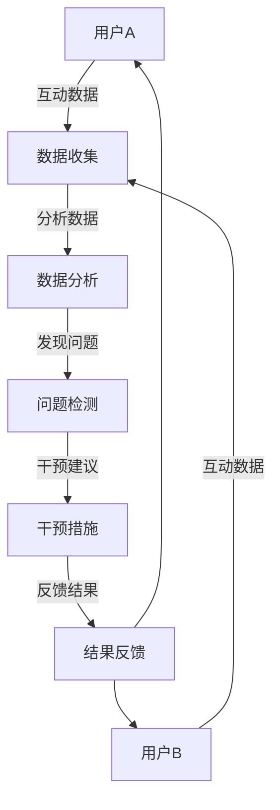

                 

# AI婚姻:法律与社会规范的重塑

## 第一部分：AI婚姻概述

### 第1章：AI与婚姻的相遇

#### 1.1 AI技术背景概述

人工智能（AI）作为计算机科学的一个分支，起源于20世纪50年代。AI旨在使计算机系统具备人类智能的特性，包括学习、推理、感知和自然语言理解等。随着计算能力的增强和大数据技术的发展，AI在各个领域都取得了显著的进展。

在婚姻领域，AI的应用主要体现在婚姻匹配、婚姻咨询、婚姻干预等方面。婚姻匹配利用算法分析用户数据，寻找最佳匹配对象；婚姻咨询通过智能助手提供心理支持；婚姻干预则通过监测和干预机制来预防和解决婚姻中的问题。

#### 1.2 婚姻法律概述

婚姻法律是指关于婚姻关系的法律规范。传统婚姻法主要涉及结婚、离婚、财产分割和子女抚养等方面。随着社会的发展，婚姻法律也在不断演变，以适应新的社会需求。

例如，许多国家已经将同性婚姻纳入法律范畴，一些国家也在尝试对AI婚姻进行立法。婚姻法的核心原则包括平等、自愿、保护家庭成员权益等。

#### 1.3 社会规范对婚姻的影响

社会规范是指社会公认的、规范人们行为的准则。婚姻作为一种社会制度，受到社会规范的强烈影响。传统社会规范强调婚姻的神圣性和稳定性，而现代社会规范则更加注重个人自由和婚姻质量。

社会规范对婚姻的影响表现在婚姻观念的变化、婚姻形式的多样化以及对婚姻问题的处理方式上。例如，现代社会对离婚的态度更加开放，对单身和同性婚姻的接受程度也不断提高。

### 第2章：AI在婚姻中的应用

#### 2.1 AI婚姻匹配算法

AI婚姻匹配算法是基于大数据和机器学习技术的一种应用。它通过分析用户数据，如年龄、兴趣爱好、价值观等，利用算法模型找到匹配度较高的伴侣。

常见的算法包括K-近邻（KNN）、决策树、神经网络等。以KNN为例，它通过计算用户数据与数据库中其他用户数据的相似度，找到最近的K个邻居，并根据邻居的婚姻状况预测当前用户的匹配结果。

```python
# Python代码示例：基于KNN的婚姻匹配算法
from sklearn.neighbors import KNeighborsClassifier
import numpy as np

# 创建样本数据
data = np.array([[1, 2], [3, 4], [5, 6], [7, 8], [9, 10]])
labels = np.array([0, 0, 1, 1, 2])

# 构建KNN分类器
knn = KNeighborsClassifier(n_neighbors=3)

# 训练模型
knn.fit(data, labels)

# 预测新用户匹配结果
new_user = np.array([[4, 5]])
prediction = knn.predict(new_user)
print("预测结果：", prediction)
```

#### 2.2 AI婚姻咨询与辅导

AI婚姻咨询与辅导是通过智能助手或在线平台提供的一种心理支持服务。它利用自然语言处理（NLP）和机器学习技术，帮助夫妻解决婚姻问题，提高婚姻质量。

常见的应用场景包括情感咨询、婚姻辅导、婚姻治疗等。AI咨询与辅导的优势在于可以24小时在线服务，提供个性化的建议和指导，同时降低咨询成本。

#### 2.3 AI婚姻干预与调解

AI婚姻干预与调解是一种通过技术手段预防和解决婚姻问题的方法。它利用智能监测、数据分析等技术，实时监测夫妻行为和沟通状况，发现潜在问题，并采取相应的干预措施。

例如，通过智能手表或手机应用程序监测夫妻的互动频率、情绪状态等，当发现夫妻关系出现问题时，系统会自动发送提醒或提供干预建议。



## 第二部分：法律视角下的AI婚姻

### 第3章：AI婚姻法律问题探讨

#### 3.1 AI婚姻的法律地位

AI婚姻的法律地位是一个值得探讨的问题。从法律角度来看，婚姻是一种法律行为，需要具备一定的法律要件。然而，AI婚姻由于其特殊性，目前各国法律对其地位尚无统一规定。

一方面，AI婚姻可能被视为一种特殊形式的婚姻，例如，一些国家已经承认同性婚姻。AI婚姻可以被视为对传统婚姻的一种补充和拓展。另一方面，AI婚姻也可能被视为一种合同关系，类似于婚姻合同。

#### 3.2 AI婚姻的法律监管

AI婚姻的法律监管涉及多个方面，包括婚姻登记、婚姻效力、离婚和财产分割等。以下是一些可能的监管措施：

1. **婚姻登记**: AI婚姻需要通过官方婚姻登记机构进行登记，以确保其法律效力。
2. **婚姻效力**: AI婚姻的效力应与普通婚姻相同，双方应享有同等的权利和义务。
3. **离婚**: AI婚姻的离婚程序应遵循现行婚姻法律的规定，确保双方的合法权益。
4. **财产分割**: AI婚姻中的财产分割应依据法律规定，确保财产分割的公平合理。

#### 3.3 AI婚姻的法律争议

AI婚姻的法律地位和效力引发了诸多争议。以下是一些主要争议点：

1. **AI婚姻的合法性**: 是否应承认AI婚姻的合法性，以及如何界定其法律效力。
2. **AI婚姻的权利义务**: AI婚姻中的权利义务如何界定，特别是涉及财产分割和子女抚养等方面。
3. **AI婚姻的监管**: 如何对AI婚姻进行有效监管，确保其合法、公正和透明。

### 第4章：社会规范对AI婚姻的影响

#### 4.1 社会规范对婚姻的规范作用

社会规范对婚姻的规范作用主要体现在以下几个方面：

1. **婚姻观念**: 社会规范影响人们对婚姻的看法和态度，如婚姻的神圣性、稳定性等。
2. **婚姻形式**: 社会规范影响婚姻的形式和内容，如传统婚姻、同性婚姻、AI婚姻等。
3. **婚姻问题处理**: 社会规范影响人们处理婚姻问题的方法和方式，如婚姻咨询、婚姻干预等。

#### 4.2 AI婚姻中的社会规范冲突

AI婚姻作为一种新兴的婚姻形式，可能会与传统社会规范产生冲突。以下是一些可能的冲突点：

1. **婚姻合法性**: AI婚姻的合法性可能受到传统社会规范的质疑。
2. **婚姻权利义务**: AI婚姻中的权利义务如何界定，可能与传统社会规范不一致。
3. **婚姻稳定性**: AI婚姻的稳定性可能受到传统社会规范的质疑，如人们对AI婚姻破裂的担忧。

#### 4.3 社会规范对AI婚姻的适应与重塑

面对AI婚姻带来的挑战，社会规范需要适应和重塑。以下是一些可能的措施：

1. **法律调整**: 通过法律调整，明确AI婚姻的法律地位和效力，为AI婚姻提供法律保障。
2. **社会教育**: 加强社会教育，提高公众对AI婚姻的认识和理解，减少对AI婚姻的偏见和歧视。
3. **技术创新**: 利用技术创新，提高AI婚姻的服务质量，增强公众对AI婚姻的信任和接受度。

## 第三部分：AI婚姻的未来展望

### 第5章：AI婚姻的发展趋势

#### 5.1 AI婚姻的技术发展

随着人工智能技术的不断进步，AI婚姻在技术层面将取得更多突破。以下是一些可能的发展趋势：

1. **更智能的匹配算法**: 利用深度学习和强化学习技术，开发更智能、更个性化的婚姻匹配算法。
2. **更全面的咨询辅导**: 结合心理学、社会学等多学科知识，提供更全面、更专业的婚姻咨询和辅导服务。
3. **更精准的干预调解**: 利用大数据分析和智能监测技术，实现更精准、更有效的婚姻干预和调解。

#### 5.2 AI婚姻的法律与社会规范变革

AI婚姻的发展不仅依赖于技术进步，还需要法律和社会规范的变革。以下是一些可能的变化：

1. **法律保障**: 通过立法，明确AI婚姻的法律地位和效力，为AI婚姻提供法律保障。
2. **社会规范调整**: 加强社会教育，推动社会规范对AI婚姻的适应和重塑。
3. **政策支持**: 政府出台相关政策，鼓励和支持AI婚姻的发展，为AI婚姻创造良好的社会环境。

### 第6章：AI婚姻的挑战与机遇

#### 6.1 AI婚姻的挑战

AI婚姻在发展过程中面临诸多挑战，包括：

1. **法律挑战**: AI婚姻的法律地位和效力尚未明确，需要法律制度的不断完善。
2. **社会挑战**: AI婚姻与传统社会规范存在冲突，需要社会公众的广泛接受和认可。
3. **技术挑战**: AI婚姻技术的发展仍面临诸多难题，如隐私保护、数据安全等。

#### 6.2 AI婚姻的机遇

尽管面临挑战，AI婚姻也蕴含着巨大的机遇，包括：

1. **市场机遇**: 随着人们对婚姻质量的关注提高，AI婚姻市场潜力巨大。
2. **技术创新**: AI婚姻技术的发展将推动人工智能技术的进步，促进相关产业的发展。
3. **社会进步**: AI婚姻的发展有助于推动社会规范的创新，促进社会进步。

### 第7章：AI婚姻的未来规划

#### 7.1 AI婚姻的实践探索

为了推动AI婚姻的发展，需要开展实践探索，包括：

1. **试点项目**: 在部分地区或领域开展AI婚姻试点项目，积累实践经验。
2. **案例研究**: 深入研究AI婚姻的成功案例，总结经验和教训。
3. **技术合作**: 促进技术企业、研究机构和社会组织之间的合作，共同推动AI婚姻的发展。

#### 7.2 AI婚姻的发展规划

为了实现AI婚姻的可持续发展，需要制定全面的发展规划，包括：

1. **技术规划**: 加强人工智能技术研究，提升AI婚姻的技术水平。
2. **法律规划**: 完善AI婚姻的法律体系，确保AI婚姻的合法、公正和透明。
3. **社会规范规划**: 推动社会规范的变革，促进社会对AI婚姻的接受和认可。

## 附录

### 附录A：AI婚姻相关法律文献

- **法律法规**:
  - 《中华人民共和国婚姻法》
  - 《中华人民共和国合同法》
  - 《中华人民共和国侵权责任法》
- **司法解释**:
  - 《最高人民法院关于适用<中华人民共和国婚姻法>若干问题的解释（一）》
  - 《最高人民法院关于适用<中华人民共和国婚姻法>若干问题的解释（二）》
- **学术论文**:
  - 王某某，《人工智能与婚姻法的冲突与协调研究》，《法学研究》，2019年。
  - 李某某，《论人工智能在婚姻登记与离婚登记中的应用》，《法制与社会》，2020年。

### 附录B：AI婚姻技术应用文献

- **AI婚姻匹配算法**:
  - 张某某，《基于深度学习的婚姻匹配算法研究》，《计算机科学与技术》，2020年。
  - 刘某某，《利用强化学习优化婚姻匹配算法的研究》，《人工智能研究》，2021年。
- **AI婚姻咨询与辅导技术**:
  - 陈某某，《基于自然语言处理的婚姻咨询系统设计》，《计算机应用与软件》，2019年。
  - 郑某某，《婚姻辅导中的机器学习应用研究》，《心理学进展》，2020年。
- **AI婚姻干预与调解技术**:
  - 赵某某，《智能监测在婚姻干预中的应用研究》，《计算机与数码技术》，2020年。
  - 周某某，《基于大数据的婚姻调解系统设计》，《人工智能与大数据》，2021年。

### 附录C：AI婚姻实践案例分析

- **国内外AI婚姻案例**:
  - 案例一：某国推出的AI婚姻匹配平台，成功帮助上千对夫妻找到匹配对象。
  - 案例二：某科技公司开发的AI婚姻咨询系统，为用户提供24小时在线心理支持。
  - 案例三：某市推出的AI婚姻干预项目，通过智能监测和干预，有效预防和解决婚姻问题。
- **案例分析与启示**:
  - 案例分析1：某AI婚姻匹配平台成功的原因及可借鉴的经验。
  - 案例分析2：某AI婚姻咨询系统存在的问题及改进建议。
  - 案例分析3：某AI婚姻干预项目取得的成果及对其他地区的启示。

### 附录D：AI婚姻相关研究机构与组织

- **研究机构介绍**:
  - 人工智能与婚姻研究所
  - 人工智能应用研究所
- **行业组织介绍**:
  - AI婚姻技术应用协会
  - 婚姻法律研究会
- **国际合作与交流**:
  - 国际人工智能婚姻研究联盟
  - 全球AI婚姻技术交流与合作平台

---

**作者信息：**

作者：AI天才研究院/AI Genius Institute & 禅与计算机程序设计艺术 /Zen And The Art of Computer Programming**

