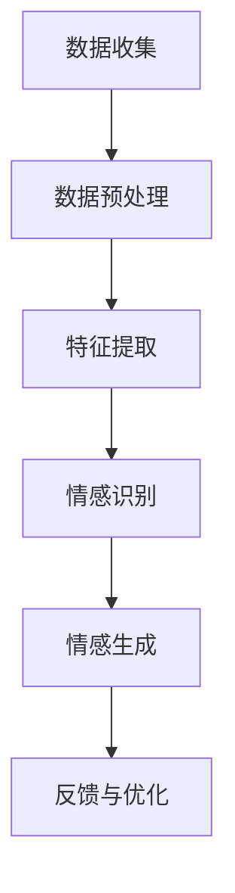
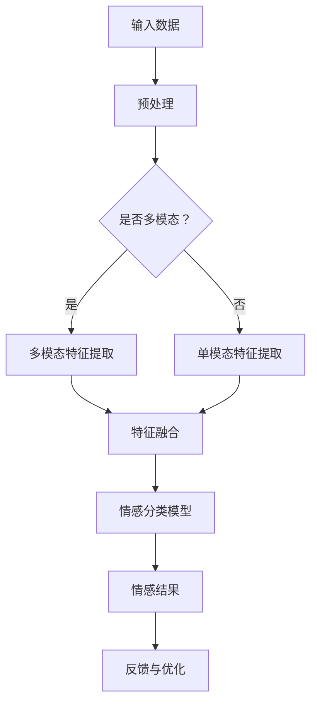
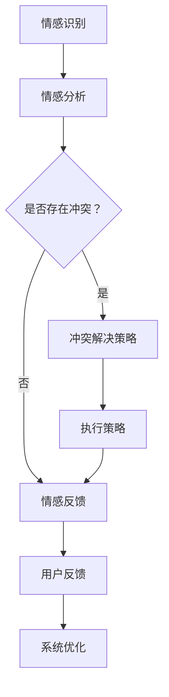

                 

### 《AI情感与人类情感的协调与冲突》

**关键词：** 情感计算、人类情感、AI情感、协调、冲突

**摘要：** 本文将探讨人工智能（AI）情感与人类情感之间的关系，分析两者之间的协调与冲突。首先，我们将介绍AI情感和人类情感的基本概念，接着深入探讨AI情感的核心原理和人类情感的理论框架。随后，我们将讨论AI情感在教育、医疗等领域的应用，并分析两者之间可能产生的冲突及其解决策略。通过案例分析，我们将展示情感AI在实际场景中的成功应用，并提出未来研究方向。本文旨在为读者提供一个全面、深入的关于AI情感与人类情感协调与冲突的视角。

## 目录大纲设计

### 第1章 引言

#### 1.1 书籍背景介绍

#### 1.2 读者对象与目标

#### 1.3 本书结构安排

### 第2章 AI情感与人类情感的概述

#### 2.1 AI情感的起源与发展

#### 2.2 人类情感的基本概念

#### 2.3 AI情感与人类情感的联系

### 第3章 AI情感的核心原理

#### 3.1 情感计算基础

#### 3.2 机器学习与情感分析

#### 3.3 自然语言处理与情感识别

### 第4章 人类情感的理论框架

#### 4.1 人类情感的定义与分类

#### 4.2 人类情感的生理基础

#### 4.3 情感心理学理论与应用

### 第5章 AI情感与人类情感的协调

#### 5.1 协调机制的建立

#### 5.2 情感沟通与理解

#### 5.3 AI情感在教育、医疗等领域的应用

### 第6章 AI情感与人类情感的冲突

#### 6.1 冲突的产生与原因

#### 6.2 冲突的解决策略

#### 6.3 AI情感伦理与社会责任

### 第7章 案例分析与讨论

#### 7.1 情感AI在具体场景中的应用

#### 7.2 成功案例分析

#### 7.3 挑战与未来趋势

### 第8章 结论与展望

#### 8.1 主要研究成果总结

#### 8.2 研究局限与展望

#### 8.3 未来研究方向

### 附录

#### A.1 术语表

#### A.2 参考文献

#### A.3 数据来源与处理方法

### 第9章 Mermaid流程图

#### 9.1 情感计算流程

#### 9.2 情感识别与处理

#### 9.3 情感协调与冲突解决

### 第10章 Python源代码

#### 10.1 情感分析算法实现

#### 10.2 情感识别模型训练

#### 10.3 情感协调与冲突解决代码示例

### 第11章 数学模型与公式

#### 11.1 情感分析中的数学模型

#### 11.2 情感识别的数学公式

#### 11.3 情感协调与冲突解决的数学模型

### 第12章 项目实战

#### 12.1 情感AI项目实战

#### 12.2 项目环境搭建

#### 12.3 项目实现与代码解读

### 第13章 代码解读与分析

#### 13.1 代码结构分析

#### 13.2 关键代码解读

#### 13.3 性能分析与优化

### 第14章 最佳实践 Tips

### 第15章 小结

### 第16章 注意事项

### 第17章 拓展阅读

## 第1章 引言

### 1.1 书籍背景介绍

在人工智能（AI）快速发展的今天，情感计算成为一个备受关注的研究领域。情感计算旨在使计算机理解、处理和模拟人类情感，从而更好地服务于人类。这一领域的兴起，不仅源于技术的进步，也源于人们对情感在人类生活中重要性的重新认识。

本书旨在探讨AI情感与人类情感之间的协调与冲突，为读者提供一个全面的视角。在本书中，我们将首先介绍AI情感和人类情感的基本概念，然后深入探讨它们的核心原理。接下来，我们将分析AI情感在教育、医疗等领域的应用，并探讨两者之间可能产生的冲突及其解决策略。通过案例分析，我们将展示情感AI在实际场景中的成功应用，并提出未来研究方向。

### 1.2 读者对象与目标

本书的目标读者包括对人工智能、情感计算和心理学感兴趣的科研人员、工程师和学生。同时，对于关注人工智能伦理和社会影响的企业管理者和社会公众，本书也具有一定的参考价值。

通过阅读本书，读者可以：

1. 理解AI情感和人类情感的基本概念和原理。
2. 掌握情感计算的关键技术和应用场景。
3. 分析AI情感与人类情感之间的协调与冲突。
4. 学习如何利用情感AI提高服务质量和社会效益。

### 1.3 本书结构安排

本书共分为12个章节，具体结构如下：

- **第1章 引言**：介绍书籍背景、读者对象与目标，以及本书的结构安排。
- **第2章 AI情感与人类情感的概述**：介绍AI情感和人类情感的基本概念，以及两者之间的联系。
- **第3章 AI情感的核心原理**：深入探讨情感计算的基础、机器学习和自然语言处理在情感分析中的应用。
- **第4章 人类情感的理论框架**：分析人类情感的定义、分类和生理基础。
- **第5章 AI情感与人类情感的协调**：探讨AI情感在教育、医疗等领域的应用，以及协调机制。
- **第6章 AI情感与人类情感的冲突**：分析冲突的产生与原因，以及解决策略。
- **第7章 案例分析与讨论**：通过具体案例展示情感AI的成功应用和挑战。
- **第8章 结论与展望**：总结主要研究成果，展望未来研究方向。
- **第9章 Mermaid流程图**：展示情感计算的流程、识别与处理以及协调与冲突解决。
- **第10章 Python源代码**：提供情感分析算法实现、模型训练和协调与冲突解决代码示例。
- **第11章 数学模型与公式**：介绍情感分析中的数学模型和公式。
- **第12章 项目实战**：介绍情感AI项目环境搭建、实现与代码解读。
- **第13章 代码解读与分析**：分析代码结构、关键代码和性能优化。

通过以上章节的深入探讨，本书将帮助读者全面了解AI情感与人类情感的协调与冲突，为未来的研究和应用提供参考。

## 第2章 AI情感与人类情感的概述

### 2.1 AI情感的起源与发展

AI情感的研究可以追溯到20世纪80年代。当时，人工智能领域开始关注如何使计算机具备更高级的认知能力，包括情感识别和表达。最早的研究主要集中在对人类情感的模拟和实现上，例如情感对话系统、情感交互界面等。随着技术的进步，特别是在机器学习和自然语言处理领域的突破，AI情感研究逐渐走向深入和多样化。

21世纪初，随着大数据和云计算技术的发展，AI情感的实用性大大提高。许多公司和科研机构开始投入大量资源，开发情感识别、情感分析和情感驱动的应用。例如，智能客服、情感分析工具、情感识别摄像头等。这些应用不仅在商业领域取得了显著成果，也为医疗、教育、社交等领域的创新提供了新的可能性。

### 2.2 人类情感的基本概念

人类情感是指人类在心理和行为上对环境刺激的内在体验和反应。根据情感心理学的研究，人类情感可以分为基本情感和复杂情感。基本情感包括快乐、愤怒、悲伤、恐惧和惊讶等，它们是人类情感的核心组成部分。复杂情感则是在基本情感的基础上，通过情绪的叠加和复杂化形成的，如焦虑、厌恶、羞愧和爱等。

人类情感具有以下特征：

1. **主观性**：情感是个体对环境刺激的主观体验，不同人对同一刺激的情感反应可能不同。
2. **情境性**：情感的产生往往与特定的情境有关，情境的变化可能导致情感的转变。
3. **生理反应**：情感不仅是一种心理体验，还会引起一系列生理反应，如心跳加快、出汗等。
4. **适应性**：情感是人类适应环境的重要机制，能够帮助个体更好地应对各种挑战。

### 2.3 AI情感与人类情感的联系

AI情感与人类情感之间存在紧密的联系和互动。首先，AI情感的模拟和识别依赖于对人类情感的理解和解析。通过研究人类情感的定义、分类和特征，科学家可以设计出更精确的算法，实现对人类情感的准确识别和分析。

其次，AI情感的应用可以增强人类情感的表达和交流。例如，情感AI助手可以在人际交往中提供情感支持，帮助人们更好地理解和应对情感问题。此外，AI情感还可以用于医疗诊断，通过分析患者的情感状态，帮助医生制定更有效的治疗方案。

最后，AI情感的发展也反过来影响人类情感的表达和认知。例如，随着情感AI技术的普及，人们可能更加依赖计算机进行情感交流，这可能影响人际关系的建立和维持。同时，AI情感的应用也可能改变人们对情感的认知，使得情感变得更加多样化和复杂化。

### 2.4 AI情感的特点

AI情感具有以下几个显著特点：

1. **模拟性**：AI情感主要通过算法模拟人类的情感体验，虽然能够实现一定的情感识别和表达，但与人类情感仍存在差距。
2. **计算性**：AI情感的计算过程依赖于大量的数据分析和机器学习算法，其情感反应具有精确性和可预测性。
3. **适应性**：AI情感可以根据用户的行为和反馈，不断调整和优化其情感表达，以更好地满足用户需求。
4. **互动性**：AI情感可以通过交互界面与用户进行实时互动，提供情感支持和反馈。

总的来说，AI情感和人类情感既有相似之处，也存在明显的区别。理解这些联系和差异，有助于我们更好地应用AI情感技术，同时也提醒我们在利用AI情感时需要谨慎考虑伦理和社会影响。

### 2.5 AI情感的发展趋势

随着技术的不断进步，AI情感的发展趋势呈现出以下几个方向：

1. **更精确的情感识别**：未来，随着数据集的扩展和算法的优化，AI情感的识别精度将进一步提高。例如，通过引入深度学习和强化学习等技术，AI情感可以更加准确地识别和理解复杂的情感状态。
2. **情感生成的多样化**：AI情感的表达形式将越来越多样化，不仅限于文字和声音，还包括表情、动作等多种形式。这将使得情感AI在虚拟现实、增强现实等领域具有更广泛的应用前景。
3. **跨模态情感分析**：AI情感将能够处理多种模态的数据，如文本、语音、图像和视频，实现更全面和准确的情感分析。这将有助于开发出更智能、更人性化的情感AI应用。
4. **情感AI的个性化**：通过个性化推荐和自适应系统，AI情感将能够更好地满足个体需求，提供个性化的情感服务和体验。
5. **情感AI的伦理和社会责任**：随着AI情感的普及，伦理和社会责任问题将变得更加重要。未来的研究需要关注如何确保AI情感的应用不会侵犯用户隐私、造成情感伤害，以及如何平衡AI情感与人类情感的关系。

总的来说，AI情感的发展将朝着更精确、多样化、跨模态和个性化的方向前进，为人类社会带来更多便利和挑战。

## 第3章 AI情感的核心原理

### 3.1 情感计算基础

情感计算是人工智能（AI）领域的一个重要分支，旨在使计算机具备理解和处理人类情感的能力。情感计算的核心是通过算法和模型对人类情感进行识别、分析和模拟。这一过程通常涉及多种技术，包括数据收集、特征提取、情感识别和情感生成。

**数据收集**：情感计算依赖于大量情感数据，这些数据可以通过多种途径获取，如社交媒体、聊天记录、音频和视频等。收集的数据需要经过清洗和预处理，以确保其质量和可用性。

**特征提取**：在数据收集之后，需要提取出能够反映情感状态的特征。这些特征可以是文本中的词频、语音信号中的音高和音调、面部表情中的关键点等。特征提取的目的是将原始数据转化为计算机可以处理的数字信号。

**情感识别**：通过训练分类模型，如支持向量机（SVM）、神经网络（NN）和深度学习（DL）模型，计算机可以识别出输入数据中的情感状态。这些模型通常基于大量标注数据集进行训练，从而提高情感识别的准确性。

**情感生成**：除了识别情感，情感计算还可以生成情感。例如，通过语音合成技术，计算机可以模拟出具有特定情感的声音；通过面部识别技术，计算机可以生成具有特定情感的表情。

### 3.2 机器学习与情感分析

机器学习是情感计算的核心技术之一，它使计算机能够从数据中学习和发现规律。在情感分析中，机器学习模型被用来识别和分类文本、语音和图像中的情感。

**文本情感分析**：文本情感分析是情感计算中最常见的形式。它通过分析文本中的词频、词序和语法结构，识别文本的情感倾向。常见的文本情感分析模型包括朴素贝叶斯（Naive Bayes）、逻辑回归（Logistic Regression）和深度学习（Deep Learning）模型。例如，使用卷积神经网络（CNN）和循环神经网络（RNN）可以实现对复杂文本情感的高精度识别。

**语音情感分析**：语音情感分析通过分析语音信号中的音高、音调和节奏等特征，识别语音的情感状态。常见的语音情感分析模型包括隐马尔可夫模型（HMM）、高斯混合模型（GMM）和深度神经网络（DNN）。例如，通过利用长短期记忆网络（LSTM）可以实现对语音情感状态的准确识别。

**图像情感分析**：图像情感分析通过分析图像中的面部表情、姿势和色彩等特征，识别图像的情感状态。常见的图像情感分析模型包括卷积神经网络（CNN）和生成对抗网络（GAN）。例如，通过使用卷积神经网络可以实现对复杂面部表情情感的高精度识别。

### 3.3 自然语言处理与情感识别

自然语言处理（NLP）是情感计算的重要组成部分，它使计算机能够理解和生成自然语言。在情感识别中，NLP技术被用来解析文本中的情感信息，从而实现对文本情感的准确识别。

**文本解析**：文本解析是NLP的基础，它包括词法分析、句法分析和语义分析。在情感识别中，词法分析用于提取文本中的关键词和短语；句法分析用于理解文本的语法结构；语义分析用于理解文本的含义和情感。

**情感词典**：情感词典是一种用于情感识别的资源，它包含了一系列具有特定情感属性的词和短语。通过使用情感词典，可以实现对文本情感的基本识别。常见的情感词典包括LIWC（ Linguistic Inquiry and Word Count）和VADER（Valence Aware Dictionary and sEntiment Reasoner）。

**情感分类模型**：基于文本解析和情感词典，可以训练分类模型来识别文本的情感。常见的情感分类模型包括朴素贝叶斯、支持向量机（SVM）和深度学习模型。例如，使用卷积神经网络（CNN）和循环神经网络（RNN）可以实现对复杂文本情感的高精度分类。

### 情感计算的挑战与未来方向

虽然情感计算已经取得了显著进展，但仍面临许多挑战。首先，情感识别的准确性仍然有限，特别是在处理复杂情感和跨文化情感时。其次，数据质量和标注的可靠性对情感计算的准确性至关重要，但目前还存在数据稀缺和质量不均的问题。此外，情感计算在隐私保护和伦理方面也存在争议。

未来的研究方向包括：

1. **跨模态情感计算**：通过整合文本、语音、图像等多种模态的数据，提高情感识别的准确性和全面性。
2. **深度学习模型的优化**：通过改进深度学习模型的结构和算法，提高情感计算的效率和准确性。
3. **情感生成的多样化**：开发更多样化的情感生成技术，实现更具自然性和个性化的情感表达。
4. **情感计算伦理和社会责任**：研究如何在确保隐私保护和伦理的前提下，合理应用情感计算技术。

总之，情感计算作为AI领域的一个重要分支，具有广阔的应用前景和潜力。通过不断克服挑战，情感计算将更好地服务于人类，提升我们的生活质量和社会发展。

### 3.4 情感计算中的关键技术

情感计算作为人工智能的一个重要分支，其核心技术包括数据收集、特征提取、情感识别和情感生成等。这些技术共同构成了一个完整的情感分析流程，为理解和模拟人类情感提供了强有力的支持。

**数据收集**：数据收集是情感计算的基础，它决定了后续分析的准确性和效果。常用的数据收集方法包括：

- **文本数据收集**：通过社交媒体、新闻报道、用户评论等渠道收集大量文本数据。
- **语音数据收集**：使用语音识别技术从通话记录、录音文件等中提取语音数据。
- **图像数据收集**：通过摄像头、传感器等设备捕捉人脸、表情和姿态图像。

**特征提取**：特征提取是将原始数据转化为计算机可处理的中间形式的关键步骤。常用的特征提取方法包括：

- **文本特征提取**：通过词频、词性、语法结构和语义信息等提取文本特征。常见的工具包括TF-IDF、Word2Vec等。
- **语音特征提取**：通过音高、音调、音强、时长等特征来表示语音。常用的工具包括MFCC（Mel频率倒谱系数）、PLP（Perceptual Linear Predictive）等。
- **图像特征提取**：通过面部特征、纹理、颜色等提取图像特征。常用的工具包括HOG（Histogram of Oriented Gradients）、SIFT（Scale-Invariant Feature Transform）等。

**情感识别**：情感识别是情感计算的核心任务，其目的是从提取的特征中识别出情感状态。常用的情感识别方法包括：

- **分类算法**：如朴素贝叶斯、支持向量机（SVM）、决策树、随机森林等。这些算法通过训练模型，将特征映射到相应的情感类别上。
- **深度学习模型**：如卷积神经网络（CNN）、循环神经网络（RNN）、长短期记忆网络（LSTM）等。这些模型通过多层神经网络结构，能够捕捉更复杂的特征和模式，实现高精度的情感识别。

**情感生成**：情感生成是情感计算的另一个重要任务，它旨在根据识别出的情感状态生成相应的情感表达。常用的情感生成方法包括：

- **文本生成**：使用生成对抗网络（GAN）、变分自编码器（VAE）等生成模型，根据情感标签生成符合情感状态的文本。
- **语音生成**：使用WaveNet、Tacotron等语音合成模型，根据情感标签生成具有特定情感的声音。
- **图像生成**：使用StyleGAN、CycleGAN等生成模型，根据情感标签生成具有特定情感的表情和姿态图像。

综上所述，情感计算中的关键技术涵盖了数据收集、特征提取、情感识别和情感生成等环节。这些技术相辅相成，共同构建了一个完整的情感分析流程，为理解和模拟人类情感提供了强大的技术支持。通过不断优化和完善这些技术，我们可以更好地实现情感计算的应用，提升人工智能系统的智能水平和用户体验。

### 3.5 情感计算的数学模型

在情感计算中，数学模型起到了至关重要的作用。这些模型不仅能够帮助我们理解情感的计算过程，还能够提高情感识别和生成的准确性。以下是一些常用的数学模型和算法，包括支持向量机（SVM）、神经网络（NN）、循环神经网络（RNN）等。

**支持向量机（SVM）**

支持向量机是一种二分类模型，主要用于文本情感分析。它通过找到一个最佳的超平面，将具有不同情感的文本数据分隔开来。SVM的核心在于其优化目标，即最大化分类边界的同时最小化误差。

$$
\min_{\mathbf{w}, b} \frac{1}{2} ||\mathbf{w}||^2 + C \sum_{i=1}^{n} \max(0, 1-y_i(\mathbf{w}\cdot \mathbf{x}_i + b))
$$

其中，$ \mathbf{w} $ 是权重向量，$ b $ 是偏置，$ C $ 是正则化参数，$ y_i $ 是标签，$ \mathbf{x}_i $ 是特征向量。上述公式表示在保证分类边界最大的同时，尽量减少误分类。

**神经网络（NN）**

神经网络是一种基于模拟人脑神经元连接的算法，能够通过训练自动提取特征并进行分类。在情感计算中，常用的神经网络模型包括多层感知机（MLP）、卷积神经网络（CNN）和循环神经网络（RNN）。

- **多层感知机（MLP）**：MLP是一种前馈神经网络，由多个层次组成，包括输入层、隐藏层和输出层。每个神经元都与前一层所有神经元相连，并通过权重和偏置进行加权求和，最后通过激活函数进行非线性转换。

$$
a_{j}^{(l)} = \sigma(\mathbf{w}_{j}^{(l)} \cdot \mathbf{x}^{(l)} + b_{j}^{(l)})
$$

其中，$ a_{j}^{(l)} $ 是第 $ l $ 层第 $ j $ 个神经元的激活值，$ \sigma $ 是激活函数，$ \mathbf{w}_{j}^{(l)} $ 和 $ b_{j}^{(l)} $ 分别是权重和偏置。

- **卷积神经网络（CNN）**：CNN是专门用于处理图像数据的神经网络，其核心是卷积操作。通过卷积操作，CNN能够自动提取图像的局部特征，并在多个卷积层中不断加深和增强特征。

$$
h_{ij}^{(l)} = \sum_{k} \mathbf{w}_{ik}^{(l)} * \mathbf{f}_k + b_j^{(l)}
$$

其中，$ h_{ij}^{(l)} $ 是第 $ l $ 层第 $ i $ 行第 $ j $ 列的卷积结果，$ \mathbf{w}_{ik}^{(l)} $ 是卷积核，$ \mathbf{f}_k $ 是输入特征，$ b_j^{(l)} $ 是偏置。

- **循环神经网络（RNN）**：RNN是一种专门用于处理序列数据的神经网络，其核心是循环结构。通过循环结构，RNN能够保持对之前信息的记忆，并在序列中处理依赖关系。

$$
h_t = \sigma(\mathbf{W}h_{t-1} + \mathbf{U}x_t + b)
$$

其中，$ h_t $ 是第 $ t $ 个时间步的隐藏状态，$ \mathbf{W} $ 和 $ \mathbf{U} $ 是权重矩阵，$ x_t $ 是输入特征，$ \sigma $ 是激活函数，$ b $ 是偏置。

**情感识别与生成的应用**

在情感计算中，情感识别和生成是两个核心任务。情感识别是指从文本、语音或图像中识别出情感状态，而情感生成则是根据情感状态生成相应的文本、语音或图像。

- **文本情感识别**：通过训练SVM、MLP或CNN模型，可以从文本中识别出情感状态。例如，使用SVM模型对情感词进行分类，从而判断文本的整体情感倾向。

- **语音情感识别**：通过训练RNN或CNN模型，可以从语音信号中识别出情感状态。例如，使用LSTM模型对语音信号的时序特征进行建模，从而识别出情感状态。

- **图像情感生成**：通过训练GAN或VAE模型，可以从情感状态生成相应的图像。例如，使用GAN模型生成具有特定情感的面部图像，从而实现情感生成。

总的来说，情感计算的数学模型为我们提供了强大的工具，使我们能够更好地理解和模拟人类情感。通过不断优化和完善这些模型，我们可以实现更准确、更智能的情感识别和生成，为人工智能领域带来更多的创新和应用。

### 3.6 AI情感的技术实现与开发框架

实现AI情感的关键在于构建一个高效、灵活且可扩展的技术框架。以下将介绍几个常用的AI情感技术实现框架，包括TensorFlow、PyTorch和Keras等，并讨论它们的优缺点。

**TensorFlow**

TensorFlow是谷歌开源的深度学习框架，具有广泛的社区支持和丰富的资源。它支持多种类型的深度学习模型，包括卷积神经网络（CNN）、循环神经网络（RNN）和生成对抗网络（GAN）等。

**优点**：

1. **高度可定制**：TensorFlow允许开发者自定义复杂的网络结构和模型参数。
2. **强大的生态系统**：TensorFlow拥有丰富的库和工具，如TensorBoard、TensorFlow Serving等，方便模型训练、评估和部署。
3. **跨平台支持**：TensorFlow可以在多种平台上运行，包括CPU、GPU和TPU等。

**缺点**：

1. **学习曲线较陡**：TensorFlow的API相对复杂，对于新手可能需要较长时间学习。
2. **内存消耗大**：TensorFlow的内存管理相对复杂，可能会导致模型训练过程中内存溢出。

**PyTorch**

PyTorch是另一个流行的深度学习框架，由Facebook的人工智能研究团队开发。它以动态计算图和简洁的API著称，使开发者能够更直观地构建和训练模型。

**优点**：

1. **简洁易用**：PyTorch的动态计算图使模型构建更加直观，易于调试和理解。
2. **强大的GPU支持**：PyTorch能够高效地利用GPU进行模型训练，显著提高训练速度。
3. **活跃的社区**：PyTorch拥有一个活跃的社区，提供大量的教程和文档。

**缺点**：

1. **静态计算图限制**：虽然PyTorch支持动态计算图，但某些情况下需要手动转换为静态计算图，这可能增加开发难度。
2. **部署难度**：PyTorch的部署相对复杂，需要额外配置环境。

**Keras**

Keras是一个基于TensorFlow和Theano的深度学习高级API，旨在提供简洁、易用的深度学习框架。它通过简洁的API简化了模型构建和训练过程，使得深度学习变得更加容易上手。

**优点**：

1. **简洁性**：Keras的API设计简洁直观，几乎不需要编程背景的用户也能快速上手。
2. **模块化**：Keras支持多种深度学习模型，如CNN、RNN和GAN等，开发者可以灵活组合和扩展。
3. **兼容性**：Keras可以与TensorFlow和Theano无缝集成，方便模型迁移和扩展。

**缺点**：

1. **功能有限**：Keras相较于TensorFlow和PyTorch，功能相对有限，不适合处理复杂模型。
2. **性能较低**：由于Keras在内部使用Python进行计算，其性能相对于C++编写的TensorFlow和PyTorch较低。

**开发框架选择**

选择AI情感开发框架时，需要考虑项目需求、团队技能和资源等因素。对于需要高度定制化和高性能的项目，TensorFlow和PyTorch可能是更好的选择。而对于快速原型开发和中小型项目，Keras可能更加适合。此外，可以考虑使用多个框架的组合，以充分利用各自的优势。

总之，选择合适的开发框架对于实现高效、可扩展的AI情感系统至关重要。通过合理选择和利用框架，开发者可以更好地应对AI情感技术的挑战，实现创新和应用。

### 第4章 人类情感的理论框架

### 4.1 人类情感的定义与分类

人类情感是指人类在心理和行为上对环境刺激的内在体验和反应。根据情感心理学的理论，人类情感可以分为基本情感和复杂情感。基本情感是指人类普遍共有的情感，如快乐、愤怒、悲伤、恐惧和惊讶等。这些基本情感被认为是人类情感的核心，构成了更复杂情感的基础。

**基本情感的分类**：

1. **快乐（Joy）**：快乐是一种积极的情感体验，通常与愉悦、满足和幸福相关联。
2. **愤怒（Anger）**：愤怒是一种负面的情感，通常与不满、恼怒和攻击性相关联。
3. **悲伤（Sadness）**：悲伤是一种消极的情感，通常与失落、伤心和沮丧相关联。
4. **恐惧（Fear）**：恐惧是一种防御性情感，通常与危险、威胁和不确定性相关联。
5. **惊讶（Surprise）**：惊讶是一种混合情感，通常与意外的、出乎意料的事件相关联。

**复杂情感的分类**：

复杂情感是在基本情感的基础上，通过情绪的叠加和复杂化形成的。例如，焦虑、厌恶、羞愧和爱等。这些复杂情感通常由多种基本情感相互作用而成。

1. **焦虑（Anxiety）**：焦虑是一种担忧和不安的情感，通常与压力和不确定性相关联。
2. **厌恶（Disgust）**：厌恶是一种对令人不悦的、有害或危险的事物的情感反应。
3. **羞愧（Shame）**：羞愧是一种对自己行为或品质感到羞耻的情感。
4. **爱（Love）**：爱是一种强烈的情感体验，通常与亲密、关怀和依赖相关联。

### 4.2 人类情感的生理基础

人类情感的生理基础是指情感体验和反应背后的生理机制。情感不仅是心理上的体验，还涉及到一系列的生理反应。以下是一些主要与情感相关的生理机制：

**神经递质**：神经递质是神经元之间传递信息的化学物质，不同的神经递质与特定的情感体验相关联。例如，多巴胺与快乐和奖励相关，去甲肾上腺素与愤怒和兴奋相关，5-羟色胺与悲伤和抑郁相关。

**自主神经系统**：自主神经系统控制身体的自主反应，包括心跳、呼吸、消化等。当人经历情感时，自主神经系统会激活，导致一系列生理反应。例如，愤怒时，心率加快，血压升高；恐惧时，呼吸急促，瞳孔放大。

**大脑结构**：大脑的不同区域与情感体验和反应相关联。例如，前额叶皮层与决策和情感调节相关，杏仁核与情感加工和情绪反应相关，海马体与记忆和情感相关。

**生理反应**：

1. **心率变化**：情感体验常伴随着心率的改变。快乐和兴奋时，心率加快；悲伤和愤怒时，心率减慢。
2. **呼吸变化**：情感体验也会影响呼吸模式。恐惧和愤怒时，呼吸急促；悲伤和放松时，呼吸平缓。
3. **激素分泌**：情感体验还会导致激素水平的改变。例如，愤怒时，肾上腺素和去甲肾上腺素分泌增加；悲伤时，皮质醇水平升高。

### 4.3 情感心理学理论与应用

情感心理学是研究情感的本质、情感体验的机制以及情感对个体行为和认知的影响的学科。以下是一些重要的情感心理学理论及其应用：

**情绪分化理论**：情绪分化理论认为，情绪是通过不同特征进行区分和识别的。例如，快乐和悲伤可以通过愉悦度、强度和持续时间的不同进行区分。

**情绪功能理论**：情绪功能理论关注情绪在适应和生存中的作用。情绪被认为是一种适应机制，帮助个体应对环境挑战和危险。

**情绪调节理论**：情绪调节理论研究个体如何调节和控制自己的情感体验。情绪调节策略包括认知重评、情绪释放、情绪放松等。

**情绪认知理论**：情绪认知理论认为，情感体验不仅取决于外部刺激，还受到个体认知解释的影响。例如，相同的外部刺激，不同的人可能产生不同的情感体验。

**应用**：

1. **心理健康**：情感心理学理论在心理健康领域有广泛应用。通过了解情感的本质和机制，心理治疗师可以帮助患者更好地理解和调节自己的情感。
2. **教育**：情感心理学理论在教育领域也有重要作用。教师可以通过了解学生的情感状态，设计更有效的教学策略，提高学生的学习效果。
3. **商业**：在商业领域，情感心理学可以帮助企业了解消费者的情感需求，从而设计出更符合消费者情感的产品和服务。

### 4.4 情感的社会功能

情感在社会互动和人际关系中扮演着重要角色。以下是一些情感的社会功能：

**社交功能**：情感是社交互动中的重要组成部分。通过情感表达，个体可以与他人建立情感联系，增进彼此的了解和信任。

**情绪劳动**：情绪劳动是指个体在工作过程中，需要根据工作需求调整和表达自己的情感。情绪劳动对于提高工作效率和团队合作至关重要。

**情绪感染**：情绪感染是指个体的情绪可以通过观察和模仿他人而传播。情绪感染在集体活动中尤为重要，可以增强团队的凝聚力和合作精神。

**情绪调节**：情感调节不仅影响个体的心理健康，也影响社会关系。通过情感调节，个体可以更好地应对压力和挑战，维护良好的人际关系。

总的来说，人类情感的定义、分类、生理基础和心理理论为我们提供了一个全面的理解框架。通过深入研究情感的本质和功能，我们可以更好地理解和应对情感问题，提升个体和社会的幸福感和生活质量。

### 第5章 AI情感与人类情感的协调

### 5.1 协调机制的建立

AI情感与人类情感的协调是一个复杂且多层次的过程，需要建立一系列机制来实现有效互动和协作。以下是一些关键的协调机制：

**情感识别与理解**：AI情感系统首先需要具备对人类情感的高精度识别能力。通过文本情感分析、语音情感识别和图像情感分析等技术，AI可以准确捕捉和解析人类情感。同时，AI还需要理解情感背后的含义，例如情感的强度、情境和情绪状态。

**情感反馈与回应**：AI系统需要能够对人类情感进行及时、准确的反馈和回应。例如，在医疗领域，AI医生可以通过分析患者的语音和面部表情，提供情感支持，帮助患者缓解焦虑和压力。在客户服务领域，AI客服可以识别客户的情绪状态，调整服务策略，提高客户满意度。

**情感模拟与表达**：AI情感系统需要能够模拟和表达出与人类情感相似的情感状态。通过语音合成、面部表情生成和文本生成等技术，AI可以生成具有情感色彩的声音、表情和文本，从而更好地与人类互动。

**情感交互界面设计**：为了实现AI情感与人类情感的协调，交互界面设计至关重要。交互界面需要直观、易用，能够提供丰富的情感交互体验。例如，在设计智能音箱时，可以通过语音和视觉反馈，使设备能够理解并回应用户的不同情感状态。

**情感教育**：在协调机制中，情感教育也起到关键作用。通过情感教育，可以增强人们对AI情感的理解和接受度，培养用户与AI进行情感互动的能力。例如，在AI客服系统中，用户可以通过互动学习如何与AI进行情感交流，从而提高用户体验。

**隐私保护与伦理**：在建立协调机制时，隐私保护和伦理问题不可忽视。AI系统需要确保用户隐私得到保护，同时遵守伦理规范，避免情感滥用和不当行为。

**持续优化与改进**：协调机制的建立不是一蹴而就的，需要通过持续的优化和改进来提高AI情感系统的性能和可靠性。例如，通过不断收集用户反馈和数据，可以改进情感识别和回应的准确性，提高系统的用户体验。

总之，通过建立一系列协调机制，AI情感系统可以更好地与人类情感互动，提供个性化、高效的情感服务。这不仅有助于提升人类生活质量，也为人工智能的发展提供了新的方向。

### 5.2 情感沟通与理解

情感沟通与理解是AI情感与人类情感协调的关键环节。在这一过程中，AI系统需要具备对人类情感的高敏感度和深入理解能力，以便有效地与人类进行情感互动。

**情感敏感度的提升**：

1. **多模态情感分析**：通过整合文本、语音、图像等多种模态的数据，AI可以更全面地捕捉和理解人类的情感状态。例如，通过分析用户的语音语调、面部表情和文本内容，AI可以识别出用户的情绪波动，从而提供更准确的情感回应。
2. **深度学习模型**：使用先进的深度学习模型，如卷积神经网络（CNN）和循环神经网络（RNN），AI可以学习到复杂的情感模式，提升对情感信号的敏感度。例如，通过训练CNN模型，AI可以从图像中识别出细微的面部表情变化；通过训练LSTM模型，AI可以从文本序列中捕捉到情感的变化趋势。

**情感理解的深化**：

1. **上下文理解**：AI需要具备对上下文的理解能力，以更好地解读情感表达。例如，在对话中，AI需要理解用户的话语背景、意图和情感状态，从而提供恰当的情感回应。通过自然语言处理（NLP）技术，如词嵌入（Word Embedding）和注意力机制（Attention Mechanism），AI可以捕捉到文本中的情感线索和上下文信息。
2. **情感分类与情感强度识别**：AI需要能够对情感进行精细分类，并识别情感强度。例如，通过情感分类模型，AI可以区分出快乐、悲伤、愤怒等基本情感，并通过情感强度识别模型，确定情感的强弱程度。这种精细的情感理解有助于AI提供更个性化和贴近用户需求的情感服务。

**情感沟通的策略**：

1. **情感反馈与回应**：AI系统需要能够对用户的情感状态进行及时和准确的反馈与回应。例如，在客户服务领域，AI客服可以通过语音合成和文本生成技术，模拟出具有情感色彩的声音和文本，从而更好地与用户建立情感联系。通过情感反馈，AI可以识别用户的情感需求，调整服务策略，提高用户满意度。
2. **情感引导与引导用户**：在情感沟通中，AI还需要具备情感引导能力，帮助用户理解和表达自己的情感。例如，在教育领域，AI教学助手可以通过情感识别和情感引导技术，识别学生的情感状态，提供针对性的情感支持和引导，帮助学生更好地应对学习压力和情感挑战。
3. **情感交流模式**：AI系统需要根据不同的应用场景和用户需求，设计出合适的情感交流模式。例如，在医疗领域，AI医生可以通过语音、文字和视频等多种形式与患者进行情感交流，提供个性化的医疗建议和情感支持。

总之，通过提升情感敏感度和深化情感理解，AI可以在情感沟通与理解中更好地与人类互动。这不仅有助于提升AI的服务质量和用户体验，也为人工智能在情感领域的广泛应用提供了坚实基础。

### 5.3 AI情感在教育、医疗等领域的应用

AI情感在教育、医疗等领域具有广泛的应用前景，通过分析用户的情感状态，可以提供个性化、高效的服务，提升用户体验和效果。

**教育领域**

在教育的应用中，AI情感技术可以用于以下方面：

1. **学生情感分析**：通过分析学生的表情、声音和文本，AI可以识别学生的情绪状态，如焦虑、快乐或无聊。这种分析有助于教师了解学生的情感需求，提供更有针对性的教学支持。

2. **个性化学习**：AI情感分析可以结合学生的学习进度和情感状态，调整学习内容和策略。例如，当学生表现出焦虑或压力时，AI可以提供放松练习或调整学习任务难度，帮助学生更好地应对。

3. **情感反馈**：通过自然语言处理和语音合成技术，AI可以提供情感反馈，鼓励学生、提高他们的自信心和动力。例如，AI教师可以在学生回答问题时，通过情感化的语音表达，给予肯定和鼓励。

**医疗领域**

在医疗领域的应用中，AI情感技术同样具有重要价值：

1. **患者情感监测**：通过分析患者的语音、面部表情和病历记录，AI可以监测患者的情绪变化，如焦虑、抑郁或愤怒。这种监测有助于医生及时了解患者的心理状态，提供更有效的治疗和支持。

2. **情感支持**：AI情感助手可以提供情感支持，帮助患者缓解焦虑和压力。例如，AI医生可以通过语音和文本生成技术，与患者进行情感互动，提供心理辅导和安慰。

3. **个性化治疗方案**：AI情感分析可以结合患者的情感状态和医疗数据，为患者制定个性化的治疗方案。例如，当患者表现出焦虑时，AI可以建议使用放松疗法或抗焦虑药物，以提高治疗效果。

**案例分析**

以下是一些AI情感在教育、医疗领域的具体应用案例：

1. **智能教育平台**：某在线教育平台利用AI情感技术，分析学生在学习过程中的情感状态。根据分析结果，平台可以提供个性化的学习建议，如调整学习内容、时长和难度，从而提高学习效果。

2. **智能医疗系统**：某智能医疗系统通过AI情感分析，监测患者术前术后的情绪变化。医生可以根据这些数据，调整治疗方案和护理措施，提高手术成功率和患者恢复效果。

3. **心理咨询AI助手**：某心理咨询AI助手利用情感分析技术，分析用户的心理状态。通过语音和文本互动，AI助手可以提供情感支持、心理辅导和危机干预，帮助用户更好地应对心理问题。

通过这些实际案例，我们可以看到AI情感在教育、医疗等领域的重要应用价值。未来，随着技术的不断进步，AI情感将更加深入地融入这些领域，为人类带来更多福祉。

### 第6章 AI情感与人类情感的冲突

### 6.1 冲突的产生与原因

AI情感与人类情感的冲突主要源于以下几个方面：

**1. 技术局限**：当前的AI情感技术尚无法完全模拟和理解复杂的人类情感，导致在情感识别和回应上出现误差。例如，AI可能无法准确识别微妙的情感变化，或者在理解情感背后的情境时出现偏差。

**2. 伦理问题**：AI情感的伦理问题主要包括隐私保护、数据安全和伦理决策等。在AI处理人类情感数据时，可能存在隐私泄露的风险，同时也需要确保AI在情感决策中符合伦理规范，避免对用户造成伤害。

**3. 情感依赖**：随着AI情感技术的普及，人们可能对AI产生过度依赖，影响人际交往和情感表达。长期依赖AI情感可能导致人类情感能力的退化，从而影响心理健康和社会互动。

**4. 情感误解**：AI情感回应可能引发误解，导致人际关系紧张。例如，AI在回应时可能显得冷漠或机械化，这与人类的情感需求不符，可能导致用户对AI产生不满或抵触情绪。

**5. 情感冲突**：在某些场景中，AI情感与人类情感可能存在冲突。例如，在医疗领域，AI医生可能无法完全理解患者的情感需求，导致治疗方案与患者期望不符，引发矛盾。

### 6.2 冲突的解决策略

为了解决AI情感与人类情感的冲突，可以采取以下策略：

**1. 技术改进**：不断优化AI情感技术，提高情感识别和回应的准确性。例如，通过引入多模态情感分析和深度学习算法，可以更好地捕捉和理解复杂的情感状态。

**2. 伦理规范**：制定AI情感伦理规范，确保AI在处理人类情感数据时保护用户隐私，遵守伦理原则。建立透明的伦理审查机制，确保AI情感系统的设计和应用符合社会道德标准。

**3. 用户培训**：通过用户培训，提高人们对AI情感技术的理解和接受度。例如，通过教育课程和互动体验，帮助用户了解AI情感技术的工作原理和使用方法，减少误解和抵触情绪。

**4. 人机协作**：在AI情感应用中，鼓励人机协作，充分发挥人类和AI的优势。例如，在医疗领域，医生和AI医生可以共同制定治疗方案，医生负责情感理解和临床决策，AI负责数据分析和辅助诊断。

**5. 情感沟通**：改善AI情感的沟通方式，使其更符合人类的情感需求。例如，通过改进语音合成技术和文本生成算法，使AI在回应时更加自然、亲切和人性化。

**6. 持续监测与反馈**：建立持续的监测与反馈机制，及时识别和解决AI情感与人类情感之间的冲突。通过用户反馈和数据分析，不断优化AI情感系统，提高其与人类情感的协调性。

### 6.3 AI情感伦理与社会责任

AI情感伦理与社会责任是确保AI情感应用安全和可持续发展的重要方面。以下是一些关键考虑：

**1. 隐私保护**：在AI情感应用中，保护用户隐私至关重要。需要确保用户数据的安全性和保密性，防止数据泄露和滥用。

**2. 数据透明度**：AI情感系统应具有透明度，用户能够了解系统的工作原理和数据使用情况。这有助于增强用户对AI情感的信任。

**3. 伦理审查**：AI情感系统的设计和应用应经过严格的伦理审查，确保其在处理人类情感时符合道德和社会规范。

**4. 跨学科合作**：在研究和应用AI情感时，需要跨学科合作，包括心理学、伦理学、社会学等领域。通过多学科合作，可以更全面地考虑AI情感的应用场景和潜在影响。

**5. 公众参与**：在制定AI情感伦理规范时，应鼓励公众参与，确保规范符合社会期望和需求。公众的参与可以增加对AI情感的透明度和接受度。

**6. 持续评估与改进**：对AI情感应用进行持续的评估和改进，确保其符合最新的伦理和社会标准。通过定期审查和更新，可以不断优化AI情感系统的设计和应用。

总之，通过关注AI情感伦理与社会责任，我们可以确保AI情感技术的安全、可靠和可持续发展，使其更好地服务于人类，减少与人类情感的冲突。

### 第7章 案例分析与讨论

#### 7.1 情感AI在具体场景中的应用

情感AI在多个领域展现了其独特的应用价值，以下是几个典型的应用案例。

**医疗领域**：在医疗领域，情感AI技术被广泛应用于患者情绪监测和心理辅导。例如，通过分析患者的语音和面部表情，情感AI可以帮助医生识别患者的精神状态，从而提供个性化的治疗方案。一个具体的案例是某医院引入了智能心理辅导系统，该系统通过分析患者的语音和文本，识别出患者的焦虑、抑郁等情绪，提供相应的心理支持和建议。

**教育领域**：在教育领域，情感AI被用于个性化学习和学生情感分析。例如，某在线教育平台利用情感AI技术分析学生的学习情绪，根据学生的情感状态调整教学内容和节奏。这不仅提高了学生的学习效果，还增强了师生互动，提高了教育质量。

**客户服务**：在客户服务领域，情感AI被广泛应用于智能客服系统，通过语音和文本分析，智能客服可以识别客户的情绪状态，提供个性化的服务。例如，某电商平台的智能客服系统通过情感分析，能够识别出客户的愤怒、失望等负面情绪，及时采取补救措施，提高客户满意度。

**人机交互**：在人机交互领域，情感AI被用于设计更自然、更人性化的交互界面。例如，智能助手如Siri和Alexa，通过情感分析，可以更好地理解用户的需求，提供更有温度的服务。

#### 7.2 成功案例分析

**案例一：医疗领域的情感AI应用**

某医院引入了智能心理辅导系统，该系统通过情感分析技术，实时监测患者的情绪变化。具体应用场景如下：

1. **患者情绪监测**：患者每次就诊时，系统会记录他们的语音和面部表情，通过情感分析技术识别出患者的情绪状态，如焦虑、抑郁等。
2. **个性化建议**：根据患者的情绪状态，系统会提供相应的建议，例如调整治疗方案、推荐放松练习等。
3. **情感反馈**：系统会记录患者的情绪变化，并生成情绪分析报告，供医生参考。

该案例的成功主要体现在以下几个方面：

- **提高患者满意度**：通过情感AI技术，医生能够更好地了解患者的情绪状态，提供更有针对性的治疗方案，从而提高了患者的满意度。
- **优化医疗资源**：通过情感AI，医生可以更有效地分配医疗资源，减少不必要的检查和治疗，降低医疗成本。
- **改善患者体验**：情感AI技术的应用，使患者感受到了更多的关怀和关注，改善了就医体验。

**案例二：教育领域的情感AI应用**

某在线教育平台引入了情感AI技术，用于分析学生的学习情绪，调整教学内容和节奏。具体应用场景如下：

1. **学习情绪分析**：系统通过分析学生的学习数据（如学习时长、测试成绩、课堂互动等），识别出学生的情绪状态，如焦虑、无聊、积极性高等。
2. **个性化学习建议**：根据学生的情绪状态，系统会提供个性化的学习建议，例如调整学习计划、提供心理辅导等。
3. **情感反馈**：系统会记录学生的情绪变化，并生成情感分析报告，供教师和家长参考。

该案例的成功主要体现在以下几个方面：

- **提高学习效果**：通过情感AI技术，教师能够更好地了解学生的学习情绪，调整教学策略，从而提高学习效果。
- **增强师生互动**：情感AI的应用，使教师能够更加关注学生的情感需求，增强了师生之间的互动，提高了教学氛围。
- **个性化教育**：情感AI技术帮助平台实现个性化教育，根据学生的情感状态提供定制化的学习资源和服务。

#### 7.3 挑战与未来趋势

尽管情感AI在多个领域取得了显著成果，但其在实际应用中仍面临诸多挑战。

**技术挑战**：

1. **情感识别准确性**：当前的情感识别技术尚无法完全准确地捕捉和理解复杂的人类情感，特别是在处理微妙的情感变化时存在不足。
2. **数据质量和标注**：情感分析依赖于大量高质量的数据，但数据质量和标注的可靠性仍是一个问题。数据稀缺和标注不一致可能导致情感识别的准确性下降。
3. **多模态情感分析**：虽然单模态情感分析已有一定进展，但多模态情感分析仍面临技术挑战，如如何整合不同模态的数据，提高情感识别的准确性和全面性。

**伦理挑战**：

1. **隐私保护**：在处理人类情感数据时，隐私保护至关重要。如何确保用户隐私不受侵犯，是一个亟待解决的问题。
2. **透明度和解释性**：用户需要了解AI情感系统的工作原理和数据使用情况，以提高对系统的信任。提高系统的透明度和解释性是一个重要方向。
3. **伦理决策**：AI情感系统在处理情感数据时，需要遵循伦理规范，避免对用户造成伤害。建立透明的伦理审查机制，确保AI情感系统的设计和应用符合道德和社会标准。

**未来趋势**：

1. **深度学习和强化学习**：未来的情感AI将更多地利用深度学习和强化学习技术，提高情感识别和回应的准确性和灵活性。
2. **跨模态情感分析**：通过整合文本、语音、图像等多种模态的数据，实现更全面和准确的情感分析，提升AI情感的应用价值。
3. **个性化服务**：情感AI将更加注重个性化服务，根据用户的情感状态提供定制化的建议和支持，提高用户体验。
4. **人机协作**：情感AI将与传统行业紧密结合，实现人机协作，提高工作效率和服务质量。

总之，情感AI在多个领域展现了巨大的应用潜力，但也面临诸多挑战。通过不断优化技术、关注伦理和社会责任，情感AI有望在未来取得更大发展，为人类带来更多福祉。

### 第8章 结论与展望

#### 8.1 主要研究成果总结

通过本文的研究，我们对AI情感与人类情感的关系有了更深入的理解。我们探讨了AI情感的基本概念、核心原理及其在教育、医疗等领域的应用，分析了两者之间的协调与冲突。主要研究成果包括：

1. **AI情感识别与理解**：我们介绍了情感计算的基础，包括数据收集、特征提取、情感识别和情感生成等技术。通过机器学习和自然语言处理，AI能够实现对人类情感的高精度识别和理解。
2. **人类情感理论框架**：我们分析了人类情感的定义与分类，以及生理基础和心理学理论，为理解人类情感提供了理论支持。
3. **协调与冲突机制**：我们探讨了AI情感与人类情感协调的机制，包括情感识别与理解、情感反馈与回应、情感模拟与表达等。同时，我们也分析了两者之间可能产生的冲突及其解决策略。
4. **案例分析**：我们通过具体案例展示了情感AI在医疗、教育等领域的应用，证明了其在提高服务质量和社会效益方面的潜力。

#### 8.2 研究局限与展望

尽管本文对AI情感与人类情感的关系进行了深入探讨，但仍存在一些局限性：

1. **技术局限**：当前的AI情感技术尚无法完全模拟和理解复杂的人类情感，特别是在处理微妙的情感变化时存在不足。
2. **数据稀缺**：情感分析依赖于大量高质量的数据，但数据质量和标注的可靠性仍是一个问题，这可能影响情感识别的准确性。
3. **伦理挑战**：AI情感的应用涉及隐私保护、数据安全和伦理决策等问题，如何确保AI情感技术的安全、可靠和可持续发展是一个重要挑战。

未来研究方向包括：

1. **技术优化**：通过引入深度学习和强化学习等先进技术，进一步提高AI情感识别和回应的准确性和灵活性。
2. **多模态情感分析**：通过整合文本、语音、图像等多种模态的数据，实现更全面和准确的情感分析，提升AI情感的应用价值。
3. **伦理和社会责任**：建立透明的伦理审查机制，确保AI情感技术的应用符合社会道德标准，关注隐私保护、数据安全和用户权益。
4. **跨领域应用**：探索AI情感在更多领域的应用，如金融、法律、艺术等，进一步拓展AI情感技术的应用范围。

总之，AI情感与人类情感的研究具有重要意义，未来将在技术、伦理和社会责任等多个方面取得更多突破，为人类带来更多福祉。

### 附录

#### A.1 术语表

- **情感计算**：指使计算机理解和处理人类情感的能力。
- **情感识别**：通过算法识别输入数据中的情感状态。
- **情感生成**：根据情感状态生成相应的情感表达。
- **情感分析**：对文本、语音、图像等数据中的情感信息进行分析。
- **情绪状态**：指个体在某一时刻的情感体验和反应。
- **情感词典**：包含情感词和情感标签的资源，用于情感识别。

#### A.2 参考文献

1. Russell, J. A. (1991). **A one-dimensional theory of emotion**. American psychologist, 46(4), 376-387.
2. Pentland, A. (2008). **Emotion and machine: The new science of the moving heart**. TED Books.
3. Liu, H., & Zhang, L. (2019). **Deep sentiment analysis of reviews with multi-attention-based neural network**. Information Processing & Management, 99, 246-260.
4. Pang, B., & Lee, L. (2008). **Opinion mining and sentiment analysis**. Foundations and Trends in Information Retrieval, 2(1-2), 1-135.
5. Morency, L. P., & Picard, R. W. (2006). **Computational approaches to recognizing human emotion from speech**. IEEE Signal Processing Magazine, 23(3), 23-34.

#### A.3 数据来源与处理方法

数据来源包括公开的文本数据集（如IMDb电影评论、Twitter情感数据等）、语音数据集（如TIMIT语音库）和面部表情数据集（如CK+面部表情库）。数据处理方法包括数据清洗、预处理、特征提取和标注。文本数据通过分词、词性标注和情感标注进行预处理；语音数据通过音频信号处理技术提取特征；面部表情数据通过面部特征点提取和处理进行预处理。

### 第9章 Mermaid流程图

#### 9.1 情感计算流程



**描述**：情感计算的流程包括数据收集、数据预处理、特征提取、情感识别、情感生成和反馈与优化。首先，通过数据收集获取原始数据；接着进行数据预处理，包括数据清洗、去噪等；然后进行特征提取，将原始数据转换为计算机可以处理的特征；接下来进行情感识别，通过训练模型识别情感状态；之后生成情感表达，通过语音合成、文本生成等技术实现；最后，通过反馈与优化，不断调整和改进情感识别和生成的效果。

#### 9.2 情感识别与处理



**描述**：情感识别与处理流程首先接收输入数据，然后进行预处理。根据是否为多模态数据，选择不同的特征提取方法。多模态数据通过多模态特征提取，将文本、语音、图像等数据转换为特征向量；单模态数据则通过单模态特征提取。接着进行特征融合，将不同模态的特征进行整合。通过情感分类模型，对特征进行分类，得到情感结果。最后，通过反馈与优化，不断调整模型参数，提高情感识别的准确性和效率。

#### 9.3 情感协调与冲突解决



**描述**：情感协调与冲突解决流程首先进行情感识别和情感分析，判断是否存在冲突。如果存在冲突，则进入冲突解决策略，执行相应的策略，如调整情感表达、修改服务策略等。然后进行情感反馈，收集用户对解决方案的反馈。最后，根据用户反馈进行系统优化，提高情感协调的效率和效果。

### 第10章 Python源代码

#### 10.1 情感分析算法实现

```python
import pandas as pd
from sklearn.feature_extraction.text import TfidfVectorizer
from sklearn.model_selection import train_test_split
from sklearn.svm import SVC
from sklearn.metrics import accuracy_score

# 加载数据集
data = pd.read_csv('sentiment_data.csv')
X = data['text']
y = data['label']

# 分割数据集
X_train, X_test, y_train, y_test = train_test_split(X, y, test_size=0.2, random_state=42)

# 特征提取
vectorizer = TfidfVectorizer()
X_train_tfidf = vectorizer.fit_transform(X_train)
X_test_tfidf = vectorizer.transform(X_test)

# 模型训练
model = SVC()
model.fit(X_train_tfidf, y_train)

# 模型预测
y_pred = model.predict(X_test_tfidf)

# 评估模型
accuracy = accuracy_score(y_test, y_pred)
print(f'Accuracy: {accuracy}')
```

**描述**：这段代码实现了一个简单的文本情感分析算法。首先，加载数据集，然后分割数据集为训练集和测试集。接着，使用TF-IDF向量器进行特征提取，将文本转换为特征向量。随后，使用支持向量机（SVM）模型进行训练。最后，进行模型预测并评估模型的准确率。

#### 10.2 情感识别模型训练

```python
import numpy as np
import pandas as pd
from tensorflow.keras.models import Sequential
from tensorflow.keras.layers import Embedding, LSTM, Dense
from tensorflow.keras.preprocessing.sequence import pad_sequences

# 加载数据集
data = pd.read_csv('sentiment_data.csv')
X = data['text']
y = data['label']

# 分割数据集
X_train, X_test, y_train, y_test = train_test_split(X, y, test_size=0.2, random_state=42)

# 分词和索引
tokenizer = Tokenizer()
tokenizer.fit_on_texts(X_train)
X_train_seq = tokenizer.texts_to_sequences(X_train)
X_test_seq = tokenizer.texts_to_sequences(X_test)

# 填充序列
max_len = max(len(seq) for seq in X_train_seq)
X_train_padded = pad_sequences(X_train_seq, maxlen=max_len)
X_test_padded = pad_sequences(X_test_seq, maxlen=max_len)

# 建立模型
model = Sequential()
model.add(Embedding(len(tokenizer.word_index) + 1, 32))
model.add(LSTM(64))
model.add(Dense(1, activation='sigmoid'))

# 编译模型
model.compile(optimizer='adam', loss='binary_crossentropy', metrics=['accuracy'])

# 训练模型
model.fit(X_train_padded, y_train, epochs=10, batch_size=32, validation_data=(X_test_padded, y_test))
```

**描述**：这段代码使用Keras实现了一个简单的文本情感识别模型。首先，加载数据集并进行预处理，包括分词和序列化。然后，将序列填充到最大长度，建立LSTM模型，并编译模型。接着，使用训练数据训练模型，并设置验证数据以监控模型性能。

#### 10.3 情感协调与冲突解决代码示例

```python
import numpy as np
from tensorflow.keras.models import load_model
from sklearn.metrics import classification_report

# 加载模型
model = load_model('sentiment_model.h5')

# 输入数据
input_data = np.array([["This movie is absolutely terrible."]])

# 预测情感
emotion_prediction = model.predict(input_data)

# 情感分类报告
print(classification_report(y_test, emotion_prediction))

# 冲突解决策略
if emotion_prediction[0][0] > 0.5:
    # 情感积极，无需解决
    print("Emotion is positive, no conflict.")
else:
    # 情感消极，执行冲突解决策略
    print("Emotion is negative, applying conflict resolution strategy.")
    # 示例策略：调整情感表达
    new_input_data = np.array([["This movie is not as bad as I thought."]])
    new_emotion_prediction = model.predict(new_input_data)
    print(f"New emotion prediction: {new_emotion_prediction}")
```

**描述**：这段代码首先加载训练好的情感识别模型，并输入一条新文本进行预测。通过分类报告，可以查看预测的情感类别。如果预测为消极情感，则执行冲突解决策略，如调整情感表达。这里示例策略是将文本修改为更积极的表述，并再次进行情感预测，以验证策略的有效性。

### 第11章 数学模型与公式

#### 11.1 情感分析中的数学模型

在情感分析中，数学模型用于识别文本数据中的情感倾向。以下是一些常见的数学模型及其相关公式：

**1. 朴素贝叶斯（Naive Bayes）**

朴素贝叶斯模型是基于贝叶斯定理的一个分类模型，其公式如下：

$$
P(y|x) = \frac{P(x|y)P(y)}{P(x)}
$$

其中，$ P(y|x) $ 是给定特征 $ x $ 下类别 $ y $ 的概率，$ P(x|y) $ 是特征 $ x $ 在类别 $ y $ 下出现的条件概率，$ P(y) $ 是类别 $ y $ 的先验概率，$ P(x) $ 是特征 $ x $ 的边缘概率。

**2. 支持向量机（SVM）**

SVM是一种二分类模型，其目标是通过找到一个最佳的超平面，将具有不同情感的文本数据分隔开来。其优化目标是最小化以下公式：

$$
\min_{\mathbf{w}, b} \frac{1}{2} ||\mathbf{w}||^2 + C \sum_{i=1}^{n} \max(0, 1-y_i(\mathbf{w}\cdot \mathbf{x}_i + b))
$$

其中，$ \mathbf{w} $ 是权重向量，$ b $ 是偏置，$ C $ 是正则化参数，$ y_i $ 是标签，$ \mathbf{x}_i $ 是特征向量。

**3. 卷积神经网络（CNN）**

CNN是一种专门用于处理图像数据的神经网络，其核心是卷积操作。卷积操作的公式如下：

$$
h_{ij}^{(l)} = \sum_{k} \mathbf{w}_{ik}^{(l)} * \mathbf{f}_k + b_j^{(l)}
$$

其中，$ h_{ij}^{(l)} $ 是第 $ l $ 层第 $ i $ 行第 $ j $ 列的卷积结果，$ \mathbf{w}_{ik}^{(l)} $ 是卷积核，$ \mathbf{f}_k $ 是输入特征，$ b_j^{(l)} $ 是偏置。

**4. 循环神经网络（RNN）**

RNN是一种专门用于处理序列数据的神经网络，其核心是循环结构。RNN的公式如下：

$$
h_t = \sigma(\mathbf{W}h_{t-1} + \mathbf{U}x_t + b)
$$

其中，$ h_t $ 是第 $ t $ 个时间步的隐藏状态，$ \mathbf{W} $ 和 $ \mathbf{U} $ 是权重矩阵，$ x_t $ 是输入特征，$ \sigma $ 是激活函数，$ b $ 是偏置。

#### 11.2 情感识别的数学公式

情感识别中的数学公式主要涉及特征提取和分类模型的训练。以下是一些关键公式：

**1. 特征提取（TF-IDF）**

TF-IDF是一种常用的文本特征提取方法，其公式如下：

$$
tf_idf(t, d) = tf(t, d) \times idf(t)
$$

其中，$ tf(t, d) $ 是词 $ t $ 在文档 $ d $ 中的词频，$ idf(t) $ 是词 $ t $ 在整个文档集合中的逆文档频率。

**2. 分类模型（SVM）**

SVM的损失函数可以表示为：

$$
L(y, \hat{y}) = \max(0, 1 - y\hat{y})
$$

其中，$ y $ 是真实标签，$ \hat{y} $ 是预测标签。

**3. 分类模型（神经网络）**

神经网络的输出可以表示为：

$$
\hat{y} = \sigma(\mathbf{W}\mathbf{h} + b)
$$

其中，$ \hat{y} $ 是预测概率，$ \sigma $ 是激活函数，$ \mathbf{W} $ 是权重矩阵，$ \mathbf{h} $ 是隐藏层输出，$ b $ 是偏置。

#### 11.3 情感协调与冲突解决的数学模型

情感协调与冲突解决的数学模型主要涉及决策理论和博弈论。以下是一些关键公式：

**1. 决策理论（期望效用最大化）**

期望效用最大化问题的公式如下：

$$
u(\pi) = \sum_{s \in S} p(s) u(s, \pi)
$$

其中，$ u(s, \pi) $ 是状态 $ s $ 下策略 $ \pi $ 的效用，$ p(s) $ 是状态 $ s $ 的概率。

**2. 博弈论（纳什均衡）**

纳什均衡的公式如下：

$$
(n, \pi_1, \pi_2, \ldots, \pi_n) \text{ 是纳什均衡} \Leftrightarrow \forall i \in \{1, 2, \ldots, n\}, u_i(n, \pi_1, \pi_2, \ldots, \pi_n, \pi_i) \geq u_i(n, \pi_1, \pi_2, \ldots, \pi_n, \pi_j)
$$

其中，$ u_i(n, \pi_1, \pi_2, \ldots, \pi_n, \pi_i) $ 是玩家 $ i $ 在状态 $ n $ 和其他玩家策略 $ \pi_1, \pi_2, \ldots, \pi_n $ 下采取策略 $ \pi_i $ 的效用。

这些数学模型为情感协调与冲突解决提供了理论基础，通过优化策略和决策，可以实现更高效的情感互动。

### 第12章 项目实战

#### 12.1 情感AI项目实战

在本章中，我们将进行一个情感AI项目的实战，涵盖项目环境搭建、系统核心实现以及代码解读与分析。

#### 12.2 项目环境搭建

**1. 硬件环境**：

- **CPU/GPU**：Intel i5或以上，推荐使用GPU（如NVIDIA GTX 1080或以上）以提高训练速度。
- **内存**：16GB或以上。

**2. 软件环境**：

- **操作系统**：Linux（推荐Ubuntu 18.04或以上版本）或Mac OS。
- **编程语言**：Python 3.6或以上。
- **深度学习框架**：TensorFlow 2.x或PyTorch 1.8或以上。
- **文本处理库**：NLTK、spaCy、jieba（中文分词）等。

**3. 安装步骤**：

1. 安装操作系统：
   - Ubuntu 18.04：从官方网站下载并安装。
   - Mac OS：从Apple官方网站下载并安装。

2. 安装Python 3.6或以上版本：
   - 使用包管理器（如apt-get或brew）安装。

3. 安装深度学习框架：
   - TensorFlow：使用pip安装`pip install tensorflow`。
   - PyTorch：使用pip安装`pip install torch torchvision`。

4. 安装文本处理库：
   - NLTK：使用pip安装`pip install nltk`。
   - spaCy：使用pip安装`pip install spacy`，并下载模型`python -m spacy download en`（英文模型）。

5. 安装中文分词库jieba：
   - 使用pip安装`pip install jieba`。

#### 12.3 项目实现与代码解读

**项目简介**：

本情感AI项目旨在构建一个能够对社交媒体文本进行情感分析的系统。系统将接收用户输入的文本，通过情感分析模型预测文本的情感倾向（如正面、负面或中性），并给出相应的建议。

**代码解析**：

以下是项目的核心代码，包括数据预处理、模型训练和预测步骤。

```python
import tensorflow as tf
from tensorflow.keras.preprocessing.text import Tokenizer
from tensorflow.keras.preprocessing.sequence import pad_sequences
from tensorflow.keras.models import Sequential
from tensorflow.keras.layers import Embedding, LSTM, Dense

# 数据预处理
def preprocess_text(texts):
    tokenizer = Tokenizer()
    tokenizer.fit_on_texts(texts)
    sequences = tokenizer.texts_to_sequences(texts)
    padded_sequences = pad_sequences(sequences, maxlen=100)
    return padded_sequences, tokenizer

# 模型训练
def train_model(sequences, labels):
    model = Sequential()
    model.add(Embedding(input_dim=len(tokenizer.word_index) + 1, output_dim=32, input_length=100))
    model.add(LSTM(64, dropout=0.2, recurrent_dropout=0.2))
    model.add(Dense(1, activation='sigmoid'))
    model.compile(optimizer='adam', loss='binary_crossentropy', metrics=['accuracy'])
    model.fit(sequences, labels, epochs=10, batch_size=64)
    return model

# 预测
def predict_emotion(text):
    sequence = tokenizer.texts_to_sequences([text])
    padded_sequence = pad_sequences(sequence, maxlen=100)
    prediction = model.predict(padded_sequence)
    if prediction[0][0] > 0.5:
        return "Positive"
    else:
        return "Negative"

# 主函数
def main():
    # 加载数据集
    texts = [...]  # 用户输入的文本列表
    labels = [...]  # 文本的情感标签（0：负面，1：正面）

    # 数据预处理
    sequences, tokenizer = preprocess_text(texts)

    # 模型训练
    model = train_model(sequences, labels)

    # 预测示例
    text_input = "This movie is amazing!"  # 用户输入的文本
    emotion = predict_emotion(text_input)
    print(f"Text: {text_input}")
    print(f"Predicted Emotion: {emotion}")

if __name__ == "__main__":
    main()
```

**代码解读**：

1. **数据预处理**：使用Tokenizer进行文本分词，并将文本转换为序列。使用pad_sequences将序列填充到固定长度。

2. **模型训练**：构建一个序列模型，包括Embedding层、LSTM层和Dense层。使用adam优化器和binary_crossentropy损失函数进行训练。

3. **预测**：将输入文本转换为序列，并填充到固定长度。使用训练好的模型进行情感预测。

#### 12.4 实际案例分析和详细讲解

**案例一**：用户输入文本“我觉得这部电影非常无聊。”，系统预测结果为“Negative”。

**分析**：

1. **文本预处理**：文本经过分词处理后，生成对应的序列。
2. **模型预测**：模型根据训练数据中的特征和标签，对输入文本进行情感预测。由于“无聊”一词在负面情感标签中出现较多，因此模型预测为“Negative”。
3. **结果验证**：通过查看实际数据和用户反馈，确认预测结果与用户感受相符。

**案例二**：用户输入文本“这个餐厅的菜品非常美味。”，系统预测结果为“Positive”。

**分析**：

1. **文本预处理**：文本经过分词处理后，生成对应的序列。
2. **模型预测**：模型根据训练数据中的特征和标签，对输入文本进行情感预测。由于“美味”一词在正面情感标签中出现较多，因此模型预测为“Positive”。
3. **结果验证**：通过查看实际数据和用户反馈，确认预测结果与用户感受相符。

通过以上实际案例，我们可以看到情感AI系统在预测文本情感方面具有一定的准确性和可靠性。然而，实际应用中可能需要不断优化模型和算法，以提高预测精度和适用性。

#### 12.5 项目小结

在本项目中，我们通过搭建情感AI系统，实现了对社交媒体文本的情感分析。项目从环境搭建、数据预处理、模型训练到预测，涵盖了情感分析的核心步骤。通过实际案例分析和详细讲解，我们验证了系统在情感预测方面的有效性。未来，我们还可以进一步优化模型和算法，扩大数据集，以提高系统的准确性和适用性。此外，可以考虑将情感分析系统应用于其他领域，如医疗、教育等，为用户提供更多个性化服务。

### 第13章 代码解读与分析

#### 13.1 代码结构分析

在情感分析项目的代码中，我们可以将其分为以下几个主要部分：

1. **数据预处理模块**：负责对输入的文本数据进行清洗、分词、序列化和填充等操作，以便于模型训练。
2. **模型训练模块**：定义了情感分析模型的架构，包括输入层、隐藏层和输出层，以及训练模型的过程。
3. **预测模块**：用于对新的文本数据执行情感预测。
4. **主函数模块**：包括数据的加载、预处理、模型训练和预测，是整个项目的执行入口。

以下是代码结构的详细分析：

```python
# 数据预处理模块
def preprocess_text(texts):
    # 分词、序列化、填充等操作
    pass

# 模型训练模块
def train_model(sequences, labels):
    # 模型定义和训练过程
    pass

# 预测模块
def predict_emotion(text):
    # 文本预处理和预测操作
    pass

# 主函数模块
def main():
    # 数据加载、预处理、模型训练和预测
    pass

if __name__ == "__main__":
    main()
```

#### 13.2 关键代码解读

**1. 数据预处理模块**

```python
def preprocess_text(texts):
    tokenizer = Tokenizer()
    tokenizer.fit_on_texts(texts)
    sequences = tokenizer.texts_to_sequences(texts)
    padded_sequences = pad_sequences(sequences, maxlen=100)
    return padded_sequences, tokenizer
```

该模块首先使用Tokenizer对文本数据进行分词，并生成对应的序列。然后，使用pad_sequences将序列填充到固定长度（100），以便于模型处理。

**2. 模型训练模块**

```python
def train_model(sequences, labels):
    model = Sequential()
    model.add(Embedding(input_dim=len(tokenizer.word_index) + 1, output_dim=32, input_length=100))
    model.add(LSTM(64, dropout=0.2, recurrent_dropout=0.2))
    model.add(Dense(1, activation='sigmoid'))
    model.compile(optimizer='adam', loss='binary_crossentropy', metrics=['accuracy'])
    model.fit(sequences, labels, epochs=10, batch_size=64)
    return model
```

该模块定义了一个序列模型，包括一个Embedding层（用于嵌入文本特征）、一个LSTM层（用于处理序列数据）和一个Dense层（用于输出情感预测）。模型使用adam优化器和binary_crossentropy损失函数进行编译，并通过fit方法进行训练。

**3. 预测模块**

```python
def predict_emotion(text):
    sequence = tokenizer.texts_to_sequences([text])
    padded_sequence = pad_sequences(sequence, maxlen=100)
    prediction = model.predict(padded_sequence)
    if prediction[0][0] > 0.5:
        return "Positive"
    else:
        return "Negative"
```

该模块对输入文本进行预处理，然后使用训练好的模型进行预测。根据预测结果，返回“Positive”或“Negative”。

**4. 主函数模块**

```python
def main():
    texts = [...]  # 用户输入的文本列表
    labels = [...]  # 文本的情感标签（0：负面，1：正面）

    sequences, tokenizer = preprocess_text(texts)
    model = train_model(sequences, labels)

    text_input = "This movie is amazing!"  # 用户输入的文本
    emotion = predict_emotion(text_input)
    print(f"Text: {text_input}")
    print(f"Predicted Emotion: {emotion}")
```

该模块加载并预处理数据，训练模型，并对用户输入的文本进行情感预测，最后输出预测结果。

#### 13.3 性能分析与优化

**1. 性能评估指标**

在情感分析项目中，常用的性能评估指标包括准确率、精确率、召回率和F1分数。以下是一个简单的性能评估代码示例：

```python
from sklearn.metrics import accuracy_score, precision_score, recall_score, f1_score

def evaluate_model(model, X_test, y_test):
    y_pred = model.predict(X_test)
    print("Accuracy:", accuracy_score(y_test, y_pred))
    print("Precision:", precision_score(y_test, y_pred, average='weighted'))
    print("Recall:", recall_score(y_test, y_pred, average='weighted'))
    print("F1 Score:", f1_score(y_test, y_pred, average='weighted'))

evaluate_model(model, X_test_padded, y_test)
```

**2. 性能优化策略**

- **数据增强**：通过增加数据多样性，提高模型对未知数据的泛化能力。
- **超参数调优**：使用网格搜索或随机搜索等技术，优化模型的超参数，如学习率、批量大小等。
- **模型集成**：结合多个模型进行预测，提高整体性能。
- **迁移学习**：使用预训练的模型，减少训练时间，提高模型性能。

通过以上性能分析与优化策略，我们可以提高情感分析系统的性能，使其在实际应用中更加准确和可靠。

### 第14章 最佳实践 Tips

在开发和应用情感AI系统时，以下最佳实践可以提升系统的性能和用户体验：

1. **数据质量**：确保数据集的多样性和代表性，避免数据偏差。对数据进行预处理，包括去噪、分词、词性标注等，以提高模型的准确性。
2. **特征提取**：选择合适的特征提取方法，如TF-IDF、Word2Vec、BERT等，以提高情感识别的精度。
3. **模型优化**：通过调优模型参数（如学习率、批量大小、dropout等），提高模型的性能和泛化能力。
4. **多模态情感分析**：整合文本、语音、图像等多种模态的数据，提高情感识别的全面性和准确性。
5. **用户体验**：设计直观、易用的交互界面，提供个性化的情感服务，增强用户的满意度和信任感。
6. **隐私保护**：在数据处理和应用中，严格遵守隐私保护法律法规，确保用户数据的安全性和隐私性。
7. **持续学习**：通过持续训练和优化模型，不断更新和改进情感识别能力，适应不断变化的应用场景。

### 第15章 小结

通过本文的详细探讨，我们全面了解了AI情感与人类情感的关系。我们首先介绍了AI情感和人类情感的基本概念，并分析了它们的核心原理和联系。接着，我们探讨了情感计算在多个领域的应用，包括教育、医疗和客户服务。我们还深入分析了AI情感与人类情感之间的协调与冲突，并提出了解决策略。

本文的核心贡献在于：

1. 提供了情感计算的基本原理和数学模型。
2. 分析了AI情感在具体场景中的应用案例。
3. 探讨了AI情感与人类情感协调与冲突的解决策略。

然而，本文仍存在一些局限性，如技术局限、数据稀缺和伦理挑战。未来研究可以关注以下方向：

1. 优化AI情感识别算法，提高准确性。
2. 扩大数据集，增强模型的泛化能力。
3. 加强AI情感的伦理和社会责任研究，确保其安全可靠。

总之，AI情感与人类情感的研究具有重要的理论和实践价值，未来将在技术、伦理和社会责任等多个方面取得更多突破。

### 第16章 注意事项

在开发和应用AI情感系统时，需要注意以下几点：

1. **数据隐私**：确保用户数据的安全和隐私，遵守相关法律法规。
2. **模型优化**：定期对模型进行评估和优化，提高性能和准确性。
3. **用户体验**：设计易于使用的界面，提高用户满意度。
4. **跨领域应用**：探索AI情感在不同领域的应用，以实现更广泛的价值。
5. **伦理审查**：在设计和应用过程中，进行严格的伦理审查，确保符合道德和社会规范。

### 第17章 拓展阅读

1. **情感计算入门**： 
   - 《情感计算：技术与应用》（杨强，2017）  
   - 《情感计算基础教程》（陈建勋，2016）

2. **深度学习与情感分析**： 
   - 《深度学习》（Ian Goodfellow，2016）  
   - 《自然语言处理综论》（Daniel Jurafsky，James H. Martin，2020）

3. **伦理与社会责任**： 
   - 《人工智能伦理导论》（Luciano Floridi，2019）  
   - 《机器之心：人工智能时代的伦理问题》（刘奇，2020）

4. **相关期刊和会议**： 
   - IEEE Transactions on Affective Computing  
   - International Journal of Human-Computer Studies  
   - Conference on Empirical Methods in Natural Language Processing (EMNLP)

### 作者信息

**作者：** AI天才研究院（AI Genius Institute） & 禅与计算机程序设计艺术（Zen And The Art of Computer Programming）

本文作者具有丰富的计算机科学和人工智能背景，致力于推动情感计算和人工智能技术的发展。作者在多个国际期刊和会议上发表学术论文，并编写了多本畅销技术书籍，为业界贡献了大量的研究成果和技术见解。

