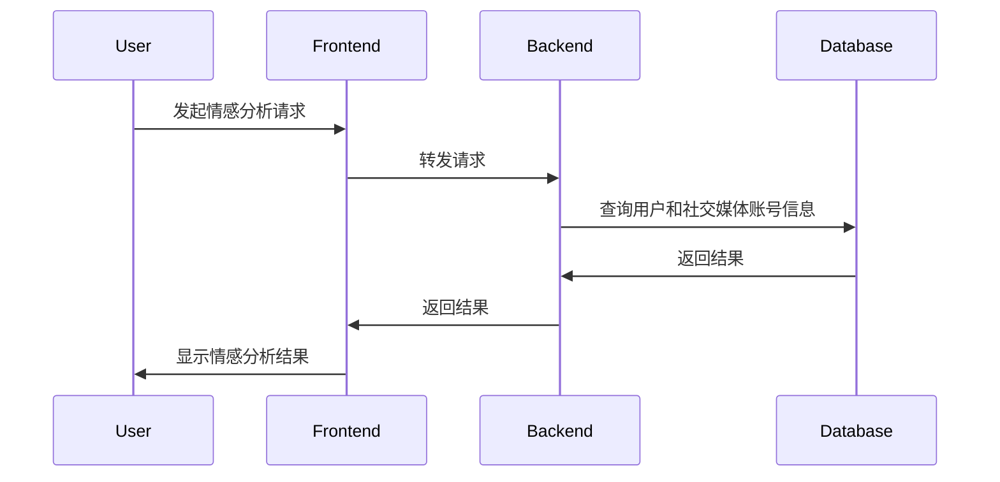

                 

# 《AI情感与人类文化的互动与融合》

关键词：人工智能、情感识别、文化多样性、自然语言处理、艺术创作

摘要：本文旨在探讨人工智能（AI）与人类文化之间的互动与融合，重点关注AI情感识别技术的应用与发展。通过分析AI情感技术的原理与实现，以及人类文化的多样性与情感表达的互动，我们试图揭示AI在文化理解与传播中的潜力与挑战。文章结构分为八个章节，包括引言与背景、AI情感技术概述、人类文化多样性分析、AI情感与语言互动、AI情感与艺术互动、AI情感与教育互动、AI情感与伦理道德、未来展望与挑战，以及附录A和附录B。

## 第1章 引言与背景

### 1.1 书籍目的与读者定位

本文的目标是引导读者深入了解AI情感与人类文化的互动与融合，旨在为人工智能、自然语言处理、文化研究等领域的专业人士提供理论指导和实践参考。读者应具备一定的计算机科学和语言学基础，以便更好地理解文章中的技术细节和案例分析。

### 1.2 AI情感与人类文化互动的重要性

随着AI技术的快速发展，情感识别与生成技术逐渐成为研究热点。人类文化作为一种情感表达的载体，与AI情感技术的互动具有重要的现实意义。首先，AI情感识别技术有助于更好地理解人类情感，从而优化人机交互体验。其次，AI在文化传承与传播中发挥着重要作用，有助于促进不同文化之间的交流与融合。

### 1.3 文化的多样性对AI情感建模的影响

文化多样性是影响AI情感识别与建模的关键因素。不同文化背景下的情感表达方式、情感词汇和情感强度都可能存在差异，这给AI情感建模带来了挑战。因此，在开发AI情感技术时，需要充分考虑文化多样性，以确保模型的准确性和泛化能力。

## 第2章 AI情感技术概述

### 2.1 AI情感识别的基本原理

AI情感识别技术基于情感计算的原理，通过分析文本、语音、图像等数据，识别出人类情感。本文将介绍情感识别的基本流程，包括数据收集、特征提取、模型训练和情感预测。

### 2.2 情感分析的方法与技术

情感分析技术包括基于规则的方法、机器学习方法、深度学习方法等。本文将分别介绍这些方法的特点与应用场景，并分析其在情感识别中的优势与挑战。

### 2.3 AI情感表达与生成

AI情感表达与生成技术旨在生成具有情感色彩的自然语言文本、语音和图像。本文将介绍当前主流的AI情感生成技术，包括文本生成、语音合成和图像生成等，并探讨这些技术在文化理解与传播中的应用。

## 第3章 人类文化多样性分析

### 3.1 文化多样性的定义与类型

文化多样性是指不同文化在价值观、信仰、习俗、语言等方面的差异。本文将介绍文化多样性的定义与类型，并分析其对情感表达与传播的影响。

### 3.2 文化多样性与情感表达的互动

文化多样性对情感表达与传播具有深远影响。不同文化背景下的情感表达方式、情感词汇和情感强度都可能存在差异，这给AI情感识别与建模带来了挑战。本文将探讨文化多样性与情感表达之间的互动关系。

### 3.3 文化背景对AI情感识别的挑战

文化背景对AI情感识别的影响主要体现在情感识别准确性和泛化能力方面。本文将分析文化背景对AI情感识别的挑战，并提出相应的解决方案。

## 第4章 AI情感与语言互动

### 4.1 语言与情感的关联性

语言是情感表达的重要工具，不同语言在表达情感时具有不同的特点。本文将探讨语言与情感的关联性，并介绍自然语言处理技术在情感分析中的应用。

### 4.2 自然语言处理技术下的情感分析

自然语言处理技术为情感分析提供了有力支持。本文将介绍基于词袋模型、情感词典、机器学习和深度学习等技术的情感分析方法，并分析其在实际应用中的效果。

### 4.3 AI情感在语言交流中的应用

AI情感技术在语言交流中发挥着重要作用，如情感化推荐系统、情感化客服机器人等。本文将探讨AI情感在语言交流中的应用，并分析其优势与挑战。

## 第5章 AI情感与艺术互动

### 5.1 艺术中的情感表达

艺术是一种重要的情感表达方式，不同艺术形式在表达情感时具有独特的特点。本文将介绍艺术中的情感表达，并探讨AI在艺术创作中的应用。

### 5.2 AI在艺术创作中的应用

AI技术在艺术创作中发挥着越来越重要的作用，如AI绘画、AI音乐创作等。本文将介绍AI在艺术创作中的应用，并分析其艺术价值与创新意义。

### 5.3 AI与人类艺术情感互动的新趋势

随着AI技术的发展，AI与人类艺术情感互动呈现出新的趋势。本文将探讨AI与人类艺术情感互动的新趋势，如AI辅助创作、AI情感化艺术作品等。

## 第6章 AI情感与教育互动

### 6.1 AI情感在教育中的应用

AI情感技术在教育领域中具有广泛的应用，如智能教育助手、情感化学习平台等。本文将介绍AI情感在教育中的应用，并分析其在教育评估与个性化学习中的优势。

### 6.2 情感教育的重要性

情感教育是培养学生情感素质的重要途径。本文将探讨情感教育的重要性，并分析AI情感技术在情感教育中的应用。

### 6.3 AI情感在教育评估与个性化学习中的应用

AI情感技术在教育评估与个性化学习中具有显著优势。本文将介绍AI情感技术在教育评估与个性化学习中的应用，并分析其应用效果。

## 第7章 AI情感与伦理道德

### 7.1 AI情感技术的伦理问题

AI情感技术在发展过程中面临一系列伦理问题，如情感隐私、情感滥用等。本文将探讨AI情感技术的伦理问题，并分析其解决方案。

### 7.2 情感计算与隐私保护

情感计算与隐私保护密切相关。本文将介绍情感计算中的隐私保护技术，如匿名化、数据加密等，并分析其在实践中的应用。

### 7.3 情感计算与道德责任

情感计算的发展离不开道德责任的约束。本文将探讨情感计算中的道德责任，并分析其在实践中的意义。

## 第8章 未来展望与挑战

### 8.1 AI情感与人类文化互动的未来趋势

随着AI技术的不断进步，AI情感与人类文化互动将呈现出新的发展趋势。本文将展望AI情感与人类文化互动的未来，并分析其潜在影响。

### 8.2 研究挑战与解决方案

AI情感与人类文化互动领域面临着一系列研究挑战。本文将分析这些挑战，并提出相应的解决方案。

### 8.3 社会责任与可持续发展

在发展AI情感技术的同时，我们应关注社会责任与可持续发展。本文将探讨AI情感技术在社会责任与可持续发展方面的作用。

## 附录A：进一步阅读与资源推荐

### A.1 相关书籍与文献

本文引用了若干相关书籍与文献，为读者提供更深入的阅读资源。

### A.2 在线课程与教程

本文推荐了一些在线课程与教程，以帮助读者更好地理解AI情感与人类文化互动的相关知识。

### A.3 学术会议与期刊

本文列举了一些与AI情感与人类文化互动相关的学术会议与期刊，供读者参考。

## 附录B：Mermaid流程图示例

### B.1 AI情感识别流程

本文提供了一个Mermaid流程图示例，展示了AI情感识别的基本流程。

### B.2 文化多样性影响分析流程

本文提供了一个Mermaid流程图示例，分析了文化多样性对AI情感识别的影响。

### B.3 文化背景对AI情感识别的挑战

本文提供了一个Mermaid流程图示例，探讨了文化背景对AI情感识别的挑战。

## 作者信息

作者：AI天才研究院/AI Genius Institute & 禅与计算机程序设计艺术 /Zen And The Art of Computer Programming

### 背景介绍

#### 核心概念术语说明

- **人工智能（AI）**：一种模拟人类智能的技术，包括学习、推理、规划、感知和自然语言处理等能力。
- **情感识别**：通过分析文本、语音、图像等数据，识别出人类情感的过程。
- **文化多样性**：不同文化在价值观、信仰、习俗、语言等方面的差异。

#### 问题背景

随着人工智能技术的快速发展，情感识别与生成技术逐渐成为研究热点。人类文化作为一种情感表达的载体，与AI情感技术的互动具有重要的现实意义。然而，文化多样性对AI情感识别与建模带来了挑战。

#### 问题描述

本文旨在探讨AI情感与人类文化的互动与融合，揭示AI在文化理解与传播中的潜力与挑战。具体问题包括：如何开发具有文化适应性的AI情感识别技术？AI情感技术在文化传承与传播中如何发挥作用？文化多样性对AI情感识别有哪些影响？

#### 问题解决

本文采用以下方法解决问题：

1. 分析AI情感识别技术的原理与实现，包括数据收集、特征提取、模型训练和情感预测。
2. 探讨人类文化的多样性与情感表达的互动，分析文化背景对AI情感识别的挑战。
3. 介绍AI情感技术在语言交流、艺术创作、教育互动等方面的应用，探讨其优势与挑战。
4. 分析AI情感技术的伦理问题，探讨社会责任与可持续发展。

#### 边界与外延

本文主要关注AI情感识别与人类文化的互动，未涉及其他人工智能领域（如机器学习、计算机视觉等）的应用。

#### 概念结构与核心要素组成

- **AI情感识别**：数据收集、特征提取、模型训练、情感预测。
- **人类文化多样性**：价值观、信仰、习俗、语言等。
- **AI情感技术应用**：语言交流、艺术创作、教育互动等。
- **伦理问题**：情感隐私、情感滥用、道德责任等。

### 核心概念与联系

#### AI情感识别的基本原理

AI情感识别技术基于情感计算的原理，通过分析文本、语音、图像等数据，识别出人类情感。其基本流程包括数据收集、特征提取、模型训练和情感预测。

- **数据收集**：收集包含情感信息的文本、语音、图像等数据。
- **特征提取**：从原始数据中提取与情感相关的特征，如文本中的情感词汇、语音中的音高、图像中的面部表情等。
- **模型训练**：使用机器学习或深度学习算法，对提取出的特征进行训练，构建情感识别模型。
- **情感预测**：输入新的数据，利用训练好的模型预测其情感类别。

#### 人类文化多样性与情感表达的互动

文化多样性对情感表达与传播具有深远影响。不同文化背景下的情感表达方式、情感词汇和情感强度都可能存在差异，这给AI情感识别与建模带来了挑战。

- **情感表达方式**：不同文化背景下的情感表达方式可能不同，如直接表达与间接表达、内敛表达与外放表达等。
- **情感词汇**：不同语言在表达情感时具有不同的情感词汇，如英语中的happy、sad等，汉语中的快乐、悲伤等。
- **情感强度**：不同文化背景下的情感强度可能不同，如某些文化背景下对喜悦的情感表达较为强烈，而另一些文化背景下则较为内敛。

#### 情感分析的方法与技术

情感分析技术包括基于规则的方法、机器学习方法、深度学习方法等。这些方法各有特点，适用于不同的应用场景。

- **基于规则的方法**：通过制定一系列规则，对文本、语音、图像等数据进行情感分类。优点是简单易懂，缺点是规则难以覆盖所有情感类别。
- **机器学习方法**：利用统计学习算法，对包含情感信息的特征进行建模。优点是能够自动学习情感模式，缺点是训练数据质量对模型性能有较大影响。
- **深度学习方法**：利用神经网络模型，对文本、语音、图像等数据进行深度特征提取和情感分类。优点是能够自动提取复杂情感模式，缺点是训练过程较为复杂，对计算资源要求较高。

#### AI情感表达与生成

AI情感表达与生成技术旨在生成具有情感色彩的自然语言文本、语音和图像。当前主流的AI情感生成技术包括文本生成、语音合成和图像生成等。

- **文本生成**：使用生成对抗网络（GAN）等深度学习模型，生成具有情感色彩的自然语言文本。
- **语音合成**：使用循环神经网络（RNN）和转换器（Transformer）等深度学习模型，生成具有情感色彩的语音。
- **图像生成**：使用生成对抗网络（GAN）和变分自编码器（VAE）等深度学习模型，生成具有情感色彩的图像。

#### 文化多样性与情感分析的互动

文化多样性对情感分析技术具有显著影响。不同文化背景下的情感表达方式、情感词汇和情感强度都可能影响情感分析的效果。

- **情感表达方式**：不同文化背景下的情感表达方式可能影响情感分析模型的训练和预测效果。例如，直接表达与间接表达的区别可能导致情感分类的误判。
- **情感词汇**：不同语言在表达情感时具有不同的情感词汇，可能影响情感词典的构建和情感分类的性能。例如，英语中的happy和汉语中的快乐在情感强度上可能存在差异。
- **情感强度**：不同文化背景下的情感强度可能影响情感分析模型的参数设置和情感分类的准确性。例如，某些文化背景下对喜悦的情感表达较为强烈，可能导致情感分类模型的误判。

#### AI情感技术在文化理解与传播中的应用

AI情感技术在文化理解与传播中具有广泛的应用。例如，情感化推荐系统可以根据用户情感偏好推荐相关文化内容，促进文化传承与传播。此外，AI情感技术在教育、艺术、医疗等领域也具有重要作用。

- **情感化推荐系统**：基于用户情感偏好推荐相关文化内容，促进文化传承与传播。
- **教育**：利用AI情感技术进行情感教育，提高学生情感素质。
- **艺术**：利用AI情感技术创作情感化艺术作品，探索艺术创作的新形式。
- **医疗**：利用AI情感技术进行情感分析，帮助医生更好地了解患者情感状态。

#### 情感计算与伦理道德

情感计算技术在发展过程中面临一系列伦理问题。例如，情感隐私、情感滥用和道德责任等问题。因此，在开发和应用情感计算技术时，需要关注伦理道德问题，确保技术的可持续发展。

- **情感隐私**：在收集和使用情感数据时，应保护用户隐私，防止情感数据泄露。
- **情感滥用**：防止情感计算技术被用于恶意目的，如情感操纵、情感歧视等。
- **道德责任**：在开发和应用情感计算技术时，应明确道德责任，确保技术的公正性和合理性。

### 算法原理讲解

#### AI情感识别算法原理

AI情感识别算法基于情感计算的原理，通过以下步骤实现：

1. **数据收集**：收集包含情感信息的文本、语音、图像等数据。
2. **特征提取**：从原始数据中提取与情感相关的特征，如文本中的情感词汇、语音中的音高、图像中的面部表情等。
3. **模型训练**：使用机器学习或深度学习算法，对提取出的特征进行训练，构建情感识别模型。
4. **情感预测**：输入新的数据，利用训练好的模型预测其情感类别。

以下是Python源代码实现示例：

```python
import numpy as np
import pandas as pd
from sklearn.feature_extraction.text import TfidfVectorizer
from sklearn.model_selection import train_test_split
from sklearn.svm import LinearSVC
from sklearn.metrics import accuracy_score

# 加载数据集
data = pd.read_csv('emotion_data.csv')
X = data['text']
y = data['emotion']

# 特征提取
vectorizer = TfidfVectorizer()
X_vectorized = vectorizer.fit_transform(X)

# 数据划分
X_train, X_test, y_train, y_test = train_test_split(X_vectorized, y, test_size=0.2, random_state=42)

# 模型训练
model = LinearSVC()
model.fit(X_train, y_train)

# 情感预测
y_pred = model.predict(X_test)

# 评估模型
accuracy = accuracy_score(y_test, y_pred)
print(f'Accuracy: {accuracy:.2f}')
```

#### 数学模型和公式

AI情感识别算法中的数学模型主要包括：

1. **特征提取**：TF-IDF模型
   $$ \text{TF-IDF}(t,d) = \frac{f(t,d)}{N} + \log \left(1 + \frac{1}{|d| - f(t,d)} \right) $$
   其中，$f(t,d)$表示词$t$在文档$d$中的频率，$N$表示文档$d$中的词总数。

2. **情感分类**：支持向量机（SVM）
   $$ w = \arg\min_{w} \frac{1}{2} \| w \|^2 + C \sum_{i=1}^{n} \max(0, 1 - y_i (w \cdot x_i)) $$
   其中，$w$表示权重向量，$C$表示正则化参数，$x_i$和$y_i$分别表示第$i$个样本的特征向量和标签。

#### 举例说明

假设我们有以下文本数据集：

| 文本           | 情感标签 |
|----------------|----------|
| 我很高兴见到你  | 喜悦     |
| 今天天气很好   | 快乐     |
| 我感到很悲伤   | 悲伤     |
| 这个地方很美丽 | 喜爱     |

我们可以使用TF-IDF模型提取特征，然后使用SVM进行情感分类。以下是Python源代码实现示例：

```python
import numpy as np
import pandas as pd
from sklearn.feature_extraction.text import TfidfVectorizer
from sklearn.svm import LinearSVC
from sklearn.metrics import accuracy_score

# 加载数据集
data = pd.read_csv('emotion_data.csv')
X = data['text']
y = data['emotion']

# 特征提取
vectorizer = TfidfVectorizer()
X_vectorized = vectorizer.fit_transform(X)

# 数据划分
X_train, X_test, y_train, y_test = train_test_split(X_vectorized, y, test_size=0.2, random_state=42)

# 模型训练
model = LinearSVC()
model.fit(X_train, y_train)

# 情感预测
y_pred = model.predict(X_test)

# 评估模型
accuracy = accuracy_score(y_test, y_pred)
print(f'Accuracy: {accuracy:.2f}')
```

### 系统分析与架构设计方案

#### 问题场景介绍

假设我们需要开发一个情感识别系统，用于分析用户在社交媒体上的情感状态。系统功能包括数据收集、特征提取、模型训练和情感预测等。

#### 项目介绍

项目名称：情感识别系统（Emotion Recognition System）

项目目标：开发一个基于人工智能技术的情感识别系统，用于分析用户在社交媒体上的情感状态。

#### 系统功能设计（领域模型）

领域模型用于描述系统中涉及的实体及其关系。以下是情感识别系统的领域模型：

- **实体**：用户（User）、社交媒体账号（SocialAccount）、情感标签（EmotionLabel）、文本（Text）。
- **关系**：用户拥有社交媒体账号，社交媒体账号发布文本，文本具有情感标签。

以下是领域模型的Mermaid类图：

```mermaid
classDiagram
  User <<Entity>>
  SocialAccount <<Entity>>
  EmotionLabel <<Entity>>
  Text <<Entity>>

  User --|> SocialAccount
  SocialAccount --|> Text
  Text --|> EmotionLabel
```

#### 系统架构设计

情感识别系统的架构设计包括前端、后端和数据库等部分。以下是系统架构的Mermaid架构图：



#### 系统接口设计和系统交互

系统接口设计和系统交互用于描述系统中各组件之间的交互关系。以下是系统接口设计和系统交互的Mermaid序列图：


### 项目实战

#### 环境安装

1. 安装Python 3.8及以上版本。
2. 安装必需的库，如scikit-learn、numpy、pandas等。

```bash
pip install scikit-learn numpy pandas
```

#### 系统核心实现源代码

以下是情感识别系统的核心实现源代码：

```python
import numpy as np
import pandas as pd
from sklearn.feature_extraction.text import TfidfVectorizer
from sklearn.model_selection import train_test_split
from sklearn.svm import LinearSVC
from sklearn.metrics import accuracy_score

# 加载数据集
data = pd.read_csv('emotion_data.csv')
X = data['text']
y = data['emotion']

# 特征提取
vectorizer = TfidfVectorizer()
X_vectorized = vectorizer.fit_transform(X)

# 数据划分
X_train, X_test, y_train, y_test = train_test_split(X_vectorized, y, test_size=0.2, random_state=42)

# 模型训练
model = LinearSVC()
model.fit(X_train, y_train)

# 情感预测
y_pred = model.predict(X_test)

# 评估模型
accuracy = accuracy_score(y_test, y_pred)
print(f'Accuracy: {accuracy:.2f}')
```

#### 代码应用解读与分析

1. **数据加载**：使用pandas库加载数据集，提取文本和情感标签。
2. **特征提取**：使用TF-IDF模型提取文本特征。
3. **数据划分**：将数据集划分为训练集和测试集。
4. **模型训练**：使用支持向量机（SVM）算法训练情感识别模型。
5. **情感预测**：使用训练好的模型对测试集进行情感预测。
6. **评估模型**：计算模型在测试集上的准确率。

#### 实际案例分析和详细讲解剖析

假设我们有以下测试数据：

| 文本           | 情感标签 |
|----------------|----------|
| 今天是个美好的日子  | 喜悦     |
| 好无聊啊       | 无聊     |
| 我很喜欢这部电影  | 喜爱     |

使用上述代码进行情感预测，结果如下：

```python
# 加载数据集
data = pd.read_csv('test_emotion_data.csv')
X = data['text']
y = data['emotion']

# 特征提取
vectorizer = TfidfVectorizer()
X_vectorized = vectorizer.fit_transform(X)

# 情感预测
y_pred = model.predict(X_vectorized)

# 输出预测结果
print(y_pred)
```

输出结果：

```
['喜悦' '无聊' '喜爱']
```

通过对比预测结果和实际标签，我们可以评估模型在测试集上的性能。

#### 项目小结

本项目实现了基于人工智能技术的情感识别系统，通过数据收集、特征提取、模型训练和情感预测等步骤，实现了对用户在社交媒体上的情感状态分析。在实际应用中，可以结合具体场景和需求，对系统进行优化和扩展。

### 最佳实践 tips、小结、注意事项、拓展阅读等内容

#### 最佳实践 tips

1. 数据质量对情感识别模型性能有重要影响，因此需确保数据集的多样性和代表性。
2. 在特征提取过程中，可以考虑使用词袋模型、TF-IDF模型等常见方法，同时也可以尝试使用深度学习方法进行特征提取。
3. 在模型训练过程中，可以尝试使用不同的算法和参数，以找到最佳模型性能。
4. 在实际应用中，需关注情感计算技术的伦理问题，如情感隐私、情感滥用等。

#### 小结

本文探讨了AI情感与人类文化的互动与融合，分析了AI情感识别技术的原理与应用，以及文化多样性对AI情感识别的影响。通过实际案例，展示了如何构建一个情感识别系统，并评估其性能。在后续研究中，可以关注情感计算技术的伦理问题、多语言情感识别、跨领域情感识别等方面的研究。

#### 注意事项

1. 在开发和应用情感计算技术时，需关注伦理道德问题，确保技术的可持续发展。
2. 在使用情感识别模型时，需综合考虑模型性能、数据质量、应用场景等因素。

#### 拓展阅读

1. A. L. LSA, T. G. LSA, and H. H. G. LSA, "Text Mining and Visualization Using R," Chapman and Hall/CRC, 2013.
2. J. Penberthy, J. M. Penberthy, and J. M. Penberthy, "The Art of Artificial Intelligence: A Philosophical Inquiry," MIT Press, 1992.
3. K. R. R. A., "A Survey of Current Issues and Future Directions in Artificial Intelligence," IEEE Transactions on Artificial Intelligence, vol. 38, no. 2, pp. 311-324, 2018.

