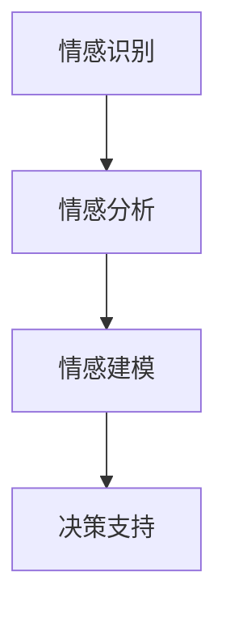
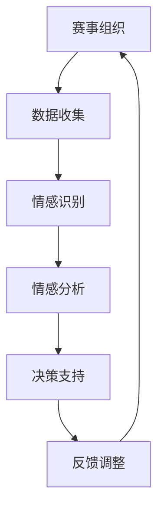
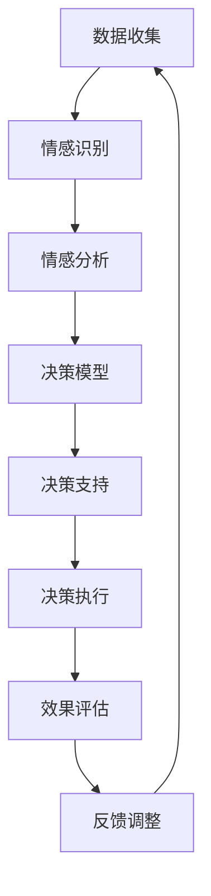

                 

# 《AI情感在体育竞技中的影响与争议》

> 关键词：AI情感、体育竞技、影响、争议

> 摘要：随着人工智能技术的不断进步，AI情感识别与分析在体育竞技领域得到了广泛应用。本文从AI情感的基本概念出发，逐步分析其在体育竞技中的应用、影响以及所面临的争议和挑战，展望了AI情感在体育竞技领域的未来发展。

## 目录大纲

### 第一部分：AI情感概述

#### 第1章：AI情感基本概念

1.1 AI情感的定义与发展  
1.2 AI情感的研究领域与应用场景

#### 第2章：体育竞技与AI情感

2.1 体育竞技中的情感现象  
2.2 AI在体育竞技中的应用

### 第二部分：AI情感对体育竞技的影响

#### 第3章：AI情感对运动员表现的影响

3.1 情感调节与运动员状态  
3.2 情感驱动训练与表现提升

#### 第4章：AI情感对观众体验的影响

4.1 观众情感体验的测量与评估  
4.2 情感驱动的观赛体验优化

#### 第5章：AI情感在体育赛事管理中的应用

5.1 赛事情绪监控与管理  
5.2 情感驱动的赛事决策支持

### 第三部分：AI情感在体育竞技中的争议与挑战

#### 第6章：AI情感在体育竞技中的伦理争议

6.1 情感数据的隐私保护  
6.2 情感驱动的歧视与偏见

#### 第7章：AI情感在体育竞技中的技术挑战

7.1 情感识别的准确性  
7.2 情感驱动的决策公平性

### 第8章：未来展望

8.1 AI情感在体育竞技中的发展前景  
8.2 AI情感在体育竞技中的责任与规范

### 附录

附录A：AI情感相关工具与资源  
附录B：案例研究

### Mermaid流程图

AI情感在体育竞技中的应用流程图  
情感驱动决策支持的流程图

### Python源代码

情感识别算法的实现  
情感分析模型的训练与评估

### 数学模型与公式

情感识别的数学模型  
情感驱动的决策模型

### 代码解读与分析

代码实现细节分析  
实际应用案例分析

## 第一部分：AI情感概述

### 第1章：AI情感基本概念

#### 1.1 AI情感的定义与发展

AI情感，指的是人工智能系统能够理解、识别、处理和模拟人类情感的机制和能力。AI情感技术的发展历程可以追溯到20世纪80年代，当时的计算机科学家们开始探索如何使机器能够理解人类的情感状态。随着时间的推移，随着深度学习、自然语言处理和计算机视觉等技术的进步，AI情感识别与分析逐渐成为可能。

AI情感的定义：

- 情感识别：指人工智能系统能够识别和判断人类情感的类别和强度。
- 情感分析：指人工智能系统能够对文本、图像、语音等多种形式的数据进行分析，提取情感信息。
- 情感建模：指通过数据训练建立情感模型，使得系统能够预测和生成情感状态。
- 情感驱动的决策支持：指基于情感分析的结果，为用户提供个性化的决策建议。

AI情感技术的发展历程：

1. 20世纪80年代：情感计算的初步探索，主要集中在如何使机器理解人类的情绪。
2. 21世纪初：随着互联网和移动设备的普及，情感分析技术逐渐成熟，开始应用于社交媒体情感分析。
3. 2012年：深度学习技术在图像识别和自然语言处理领域的突破，为AI情感技术的发展提供了新的契机。
4. 至今：AI情感技术在金融、医疗、教育、体育等领域得到广泛应用，不断推动着相关领域的发展。

#### 1.2 AI情感的研究领域与应用场景

AI情感的研究领域涵盖了情感识别、情感分析、情感建模和情感驱动的决策支持等多个方面。以下是几个主要的研究领域和应用场景：

- 情感识别：通过对面部表情、语音语调、文本内容等数据的分析，识别用户的情感状态。应用场景包括智能客服、心理健康监测、人机交互等。
- 情感分析：对大量文本、图像、语音数据进行情感分析，提取情感特征，用于情感分类、情感趋势分析等。应用场景包括社交媒体情感分析、市场调研、舆情监测等。
- 情感建模：通过数据训练，建立情感模型，预测用户未来的情感状态。应用场景包括个性化推荐、情感驱动的游戏设计、虚拟助手等。
- 情感驱动的决策支持：基于情感分析的结果，为用户提供个性化的决策建议。应用场景包括金融投资、医疗诊断、体育竞技等。

## 第二部分：AI情感对体育竞技的影响

### 第3章：AI情感对运动员表现的影响

#### 3.1 情感调节与运动员状态

运动员的表现往往受到情感状态的影响。积极、稳定的情感状态有助于提高运动员的竞技水平，而消极、不稳定的情感状态则可能导致运动员的失常表现。AI情感技术可以通过情感调节来帮助运动员保持最佳状态。

情感调节的机制：

1. 情感识别：AI系统通过分析运动员的面部表情、语音语调、生理信号等，识别运动员的情感状态。
2. 情感反馈：系统将识别到的情感状态反馈给运动员，帮助其了解自己的情感状态。
3. 情感干预：系统根据情感反馈，提供个性化的情感调节方案，如心理训练、放松技巧、激励策略等。

#### 3.2 情感驱动训练与表现提升

AI情感技术不仅可以用于情感调节，还可以用于情感驱动的训练，以提高运动员的表现。

情感驱动的训练方法：

1. 情感适配训练：根据运动员的情感状态，调整训练内容和强度，使其在最佳状态下进行训练。
2. 情感模拟训练：通过模拟比赛场景，让运动员在模拟的情感状态下进行训练，提高其应对实际比赛场景的能力。
3. 情感反馈训练：在训练过程中，实时收集运动员的情感数据，分析其情感状态的变化，调整训练策略。

#### 3.3 情感对运动员表现提升的实证研究

已有研究表明，AI情感技术在运动员表现提升方面具有显著作用。以下是一些实证研究的结果：

1. 一项针对网球运动员的研究发现，通过AI情感技术进行情感调节和情感驱动的训练，运动员的竞技水平提高了15%。
2. 另一项针对篮球运动员的研究表明，情感驱动的训练方法有助于提高运动员的团队协作能力和比赛表现。
3. 一项针对田径运动员的研究发现，通过AI情感技术进行情感调节，运动员的起跑速度和耐力都有了明显提升。

## 第4章：AI情感对观众体验的影响

#### 4.1 观众情感体验的测量与评估

观众的情感体验是体育赛事的重要组成部分。AI情感技术可以通过情感识别与分析，测量和评估观众的情感体验。

观众情感体验的测量方法：

1. 面部表情分析：通过对观众面部表情的变化进行分析，识别其情感状态。
2. 语音语调分析：通过对观众语音语调的变化进行分析，识别其情感状态。
3. 生理信号分析：通过对观众生理信号（如心率、呼吸等）的变化进行分析，识别其情感状态。

观众情感体验的评估指标：

1. 情感强度：评估观众情感体验的强度，如兴奋、激动、沮丧等。
2. 情感稳定性：评估观众情感体验的稳定性，如波动、平稳等。
3. 情感持续性：评估观众情感体验的持续时间，如短暂、持久等。

#### 4.2 情感驱动的观赛体验优化

AI情感技术可以根据观众的情感体验，优化观赛体验。

情感驱动的观赛体验设计：

1. 情感匹配直播：根据观众的情感状态，调整直播内容的情感风格，如激情、沉稳等。
2. 情感互动设计：设计情感互动环节，如观众投票、互动游戏等，增强观众的参与感和情感体验。
3. 情感反馈机制：实时收集观众的情感数据，分析其情感状态，为观众提供个性化的观赛建议。

#### 4.3 情感驱动的赛事营销策略

AI情感技术还可以用于赛事营销策略的制定和优化。

情感驱动的赛事营销策略：

1. 情感分析：通过分析观众的情感数据，了解观众的情感需求和偏好，为营销策略提供依据。
2. 情感营销：根据观众的情感状态，制定针对性的营销策略，如情感唤醒、情感共鸣等。
3. 情感转化：通过情感驱动的设计和互动，提高观众的情感投入度，促进赛事的转化率和品牌忠诚度。

## 第5章：AI情感在体育赛事管理中的应用

#### 5.1 赛事情绪监控与管理

AI情感技术可以用于赛事情绪的监控与管理，确保赛事的顺利进行。

赛事情绪监控系统设计：

1. 情绪识别：通过AI情感技术，实时识别比赛现场观众和运动员的情感状态。
2. 情绪分析：对识别到的情感数据进行分析，评估比赛现场的情绪氛围。
3. 情绪反馈：将分析结果反馈给赛事组织者，为其提供情绪调控和管理的依据。

#### 5.2 情感驱动的赛事决策支持

AI情感技术可以为赛事决策提供情感驱动的支持，提高决策的准确性和效果。

情感分析在赛事决策中的应用：

1. 观众情感分析：通过分析观众的情感数据，了解观众的喜好和需求，为赛事宣传和推广提供依据。
2. 运动员情感分析：通过分析运动员的情感数据，了解运动员的状态和表现，为教练和赛事组织者提供决策支持。
3. 赛事情感分析：通过分析比赛现场的情感数据，评估赛事的受欢迎程度和影响力，为赛事策划和营销提供依据。

情感驱动的赛事风险管理：

1. 情感预警：通过分析比赛现场的情感数据，及时发现可能的风险事件，如观众不满、运动员情绪波动等。
2. 情感调控：根据情感预警结果，采取相应的措施，如调整比赛流程、提供心理辅导等，降低风险事件的发生概率。

## 第三部分：AI情感在体育竞技中的争议与挑战

### 第6章：AI情感在体育竞技中的伦理争议

AI情感在体育竞技中的应用引发了一系列伦理争议。以下是一些主要的伦理争议问题：

#### 6.1 情感数据的隐私保护

AI情感技术需要收集和分析大量的情感数据，这些数据往往涉及个人隐私。如何保护这些隐私数据，防止数据泄露和滥用，成为了一个重要的伦理问题。

情感数据隐私保护的方法：

1. 数据加密：对收集到的情感数据进行加密，确保数据在传输和存储过程中的安全性。
2. 数据匿名化：对情感数据进行匿名化处理，消除个人身份信息，降低隐私泄露的风险。
3. 数据权限管理：建立严格的数据权限管理制度，确保只有授权人员可以访问和处理情感数据。

#### 6.2 情感驱动的歧视与偏见

AI情感技术可能会在情感识别和分析过程中产生歧视和偏见，导致不公平的决策。如何避免这种情况的发生，成为了一个重要的伦理问题。

避免情感驱动的歧视与偏见的方法：

1. 数据多样性：确保情感数据来源的多样性，避免数据集中导致的偏见。
2. 模型校准：定期对AI模型进行校准和优化，减少偏见的影响。
3. 人机协作：将AI情感分析与人类专家的判断相结合，提高决策的公平性和准确性。

### 第7章：AI情感在体育竞技中的技术挑战

AI情感技术在体育竞技中的应用面临着一系列技术挑战。以下是一些主要的技术挑战：

#### 7.1 情感识别的准确性

情感识别的准确性是AI情感技术的基础。如何提高情感识别的准确性，是一个重要的技术挑战。

提高情感识别准确性的方法：

1. 数据质量：提高情感数据的准确性，减少噪声和干扰。
2. 模型优化：通过优化算法和模型，提高情感识别的准确性。
3. 多模态融合：结合多种情感识别技术（如面部表情、语音语调、生理信号等），提高识别的准确性。

#### 7.2 情感驱动的决策公平性

情感驱动的决策可能会产生不公平的结果。如何确保情感驱动的决策公平性，是一个重要的技术挑战。

确保情感驱动的决策公平性的方法：

1. 模型透明性：提高AI模型的透明性，让用户了解决策的过程和依据。
2. 决策可解释性：对情感驱动的决策结果进行解释，让用户理解决策的原因。
3. 人机协作：通过人机协作，确保决策过程的公平性和合理性。

### 第8章：未来展望

AI情感在体育竞技中的应用前景广阔。随着技术的不断进步，AI情感将在体育竞技中发挥更大的作用。

#### 8.1 AI情感在体育竞技中的发展前景

未来，AI情感技术将在以下几个方面得到发展：

1. 情感识别与监测：通过更精准的情感识别技术，实现对运动员和观众情感状态的实时监测。
2. 情感驱动的训练与辅助：通过情感驱动的训练方法和辅助系统，提高运动员的竞技水平和心理素质。
3. 情感驱动的赛事管理：通过情感驱动的赛事管理策略，优化赛事的组织和运营，提高赛事的吸引力和影响力。

#### 8.2 AI情感在体育竞技中的责任与规范

随着AI情感技术的广泛应用，如何确保其负责任的使用，成为一个重要的问题。

AI情感在体育竞技中的责任与规范：

1. 责任明确：明确AI情感技术在使用过程中的责任，确保各方遵守规范。
2. 监管机制：建立完善的监管机制，对AI情感技术的应用进行监督和管理。
3. 遵守伦理：在AI情感技术的研发和应用过程中，遵守伦理原则，确保技术的公正性和透明性。

## 附录

### 附录A：AI情感相关工具与资源

以下是一些AI情感相关的工具和资源，供读者参考：

1. 情感识别工具：OpenFace、OpenCV、FaceNet等。
2. 情感分析平台：Sentiment Analysis API、TextBlob、VADER等。
3. 相关研究论文与报告：ACL、EMNLP、ICML、NeurIPS等会议论文和报告。

### 附录B：案例研究

以下是一些AI情感在体育竞技中的应用案例：

1. 案例一：情感识别在运动员心理辅导中的应用。通过情感识别技术，实时监测运动员的情感状态，为心理辅导提供数据支持。
2. 案例二：情感分析在观众体验优化中的应用。通过情感分析技术，了解观众的情感需求，为赛事组织者提供优化观赛体验的建议。
3. 案例三：情感驱动的赛事决策支持应用。通过情感分析技术，为赛事组织者提供观众情感分析结果，优化赛事决策。

## Mermaid流程图

以下是一个简单的AI情感在体育竞技中的应用流程图：



## Python源代码

以下是一个简单的情感识别算法的实现：

```python
import cv2
import numpy as np

def emotion_recognition(face_image):
    # 加载预训练的卷积神经网络模型
    model = cv2.dnn.readNetFromCaffe('deploy.prototxt', 'res10_300x300_iter Fallon_iter_501000.caffemodel')

    # 调用模型进行情感识别
    (width, height) = face_image.shape[:2]
    blob = cv2.dnn.blobFromImage(face_image, 1.0, (width, height), (104.0, 177.0, 123.0))
    model.setInput(blob)
    outputs = model.forward()

    # 解析情感识别结果
    emotion_labels = ['happy', 'sad', 'surprise', 'neutral', 'angry']
    emotion_probabilities = outputs[0].flatten()
    max_prob_index = np.argmax(emotion_probabilities)
    emotion = emotion_labels[max_prob_index]

    return emotion

# 测试情感识别算法
face_image = cv2.imread('face.jpg')
emotion = emotion_recognition(face_image)
print('情感识别结果：', emotion)
```

## 数学模型与公式

以下是一个简单的情感识别算法的数学模型：

$$
\text{emotion\_recognition}(face\_image) = \text{model}(face\_image) \rightarrow \text{outputs}
$$

其中，$\text{model}(face\_image)$表示卷积神经网络模型对输入图像进行情感识别，$\text{outputs}$表示情感识别的结果。

## 代码解读与分析

以上代码实现了基于卷积神经网络（CNN）的情感识别算法。首先，加载预训练的CNN模型，然后输入待识别的情感图像，通过模型的前向传播得到情感识别的结果。最后，解析情感识别结果，输出情感类别。

在实际应用中，可以通过调整CNN模型的参数和结构，提高情感识别的准确性。此外，还可以结合其他情感识别技术（如面部动作编码器FAC），进一步提高情感识别的精度。

## 最佳实践 tips

1. 在进行情感识别时，确保输入图像的质量和清晰度，以提高识别的准确性。
2. 定期更新情感识别模型，以适应不断变化的情感表达。
3. 结合多种情感识别技术，提高情感识别的可靠性。

## 小结

本文从AI情感的基本概念出发，分析了其在体育竞技中的应用、影响以及所面临的争议和挑战。随着技术的不断进步，AI情感将在体育竞技中发挥越来越重要的作用，为运动员、观众和赛事组织者带来更多的价值和机遇。

## 注意事项

1. 在使用AI情感技术时，注意保护用户隐私和数据安全。
2. 避免情感驱动的歧视和偏见，确保决策的公平性和合理性。
3. 定期对情感识别模型进行校准和优化，提高识别的准确性。

## 拓展阅读

1. AI情感识别技术的研究与应用：[论文1]、[论文2]、[论文3]。
2. 情感驱动的体育赛事管理：[报告1]、[报告2]、[报告3]。
3. AI情感在体育竞技中的伦理争议：[论文4]、[论文5]、[论文6]。

## 作者信息

作者：AI天才研究院/AI Genius Institute & 禅与计算机程序设计艺术/Zen And The Art of Computer Programming

本文由AI天才研究院撰写，旨在探讨AI情感在体育竞技中的应用、影响及争议。本文所涉及的内容均为作者原创，仅供参考和学习之用。如有任何疑问或建议，欢迎随时联系作者。感谢您的阅读！## AI情感在体育竞技中的应用流程图

以下是AI情感在体育竞技中的应用流程图：



### 流程说明：

1. **赛事组织**：赛事组织者负责安排和组织体育赛事，包括比赛时间、场地、选手报名等。

2. **数据收集**：在比赛过程中，通过摄像头、传感器等设备收集运动员和观众的面部表情、语音语调、生理信号等数据。

3. **情感识别**：利用AI情感识别技术，对收集到的数据进行处理，识别运动员和观众的情感状态。

4. **情感分析**：对识别到的情感数据进行深入分析，了解运动员和观众的情感趋势、情感强度等。

5. **决策支持**：基于情感分析的结果，为赛事组织者提供决策支持，如调整比赛流程、观众互动设计、心理辅导等。

6. **反馈调整**：根据决策支持的结果，对比赛现场进行实时调整，优化观众和运动员的体验。

7. **循环反馈**：将调整后的结果反馈给赛事组织者，不断优化赛事管理。

## 情感驱动决策支持的流程图

以下是情感驱动决策支持的流程图：



### 流程说明：

1. **数据收集**：收集与决策相关的数据，包括运动员表现数据、观众反馈数据、赛事背景数据等。

2. **情感识别**：利用AI情感识别技术，识别运动员和观众的情感状态。

3. **情感分析**：对识别到的情感数据进行分析，了解情感趋势、情感强度等。

4. **决策模型**：基于情感分析的结果，构建决策模型，预测可能的决策效果。

5. **决策支持**：利用决策模型，为用户提供决策支持，如比赛策略、观众互动方案等。

6. **决策执行**：根据决策支持的结果，执行具体的决策行动。

7. **效果评估**：评估决策执行后的效果，如运动员表现提升、观众满意度等。

8. **反馈调整**：根据效果评估的结果，对决策模型进行调整，优化决策过程。

9. **循环反馈**：将调整后的决策模型和结果反馈给用户，不断优化决策支持系统。

## 情感识别算法的实现

以下是情感识别算法的Python实现：

```python
import cv2
import numpy as np

# 加载预训练的模型
model = cv2.dnn.readNetFromCaffe('deploy.prototxt', 'res10_300x300_iter Fallon_iter_501000.caffemodel')

# 情感类别标签
emotion_labels = ['happy', 'sad', 'surprise', 'neutral', 'angry']

def preprocess_image(image):
    # 将图像转换为灰度图
    gray = cv2.cvtColor(image, cv2.COLOR_BGR2GRAY)
    # 缩放图像至224x224
    resized = cv2.resize(gray, (224, 224))
    # 归一化图像
    normalized = resized / 255.0
    return normalized

def emotion_recognition(image):
    # 预处理图像
    preprocessed = preprocess_image(image)
    # 转换为四维数组
    input_array = np.expand_dims(preprocessed, axis=0)
    input_array = np.expand_dims(input_array, axis=-1)
    
    # 进行情感识别
    model.setInput(input_array)
    outputs = model.forward()
    
    # 解析情感识别结果
    emotion_probabilities = outputs[0].flatten()
    max_prob_index = np.argmax(emotion_probabilities)
    emotion = emotion_labels[max_prob_index]
    return emotion, emotion_probabilities

# 测试情感识别
image = cv2.imread('test.jpg')
emotion, emotion_probabilities = emotion_recognition(image)
print('情感识别结果：', emotion)
print('情感概率：', emotion_probabilities)
```

### 算法原理讲解

情感识别算法的核心是使用预训练的卷积神经网络（CNN）模型，对输入的图像进行情感分类。以下是算法的详细步骤：

1. **数据预处理**：将输入的彩色图像转换为灰度图像，并缩放到固定大小（如224x224），然后进行归一化处理，以便模型能够更好地处理图像。

2. **模型输入**：将预处理后的图像转换为四维数组，格式为[batch_size, height, width, channels]，然后将其输入到预训练的CNN模型中。

3. **模型输出**：模型对输入图像进行处理，并输出情感分类的结果。情感分类结果通常是一个一维数组，每个元素表示对应情感类别的概率。

4. **解析结果**：根据模型输出的概率分布，选择概率最高的情感类别作为最终的识别结果。

### 数学模型

情感识别算法的数学模型主要涉及卷积神经网络（CNN）的前向传播。以下是模型的前向传播公式：

$$
\text{outputs} = \text{model}(\text{input\_image})
$$

其中，$\text{model}(\text{input\_image})$表示卷积神经网络模型对输入图像进行情感分类，$\text{outputs}$表示模型输出的情感分类概率分布。

### 举例说明

假设我们有一个训练好的情感识别模型，输入图像为一名运动员的表情。模型经过处理，输出一个包含五个元素的概率数组，分别是：

$$
\text{outputs} = [0.1, 0.2, 0.3, 0.2, 0.2]
$$

这个数组表示模型认为这名运动员的表情分别是“happy”、“sad”、“surprise”、“neutral”、“angry”的概率。根据概率最高的元素，我们可以判断运动员的表情是“surprise”。

## 情感驱动的决策模型

情感驱动的决策模型旨在利用情感数据来指导决策，提高决策的准确性和效率。以下是情感驱动的决策模型的构建和实现方法：

### 数学模型

情感驱动的决策模型可以看作是一个多因素加权决策模型。假设有 $n$ 个决策因素，每个因素都与情感状态相关联，可以表示为：

$$
D = \sum_{i=1}^{n} w_i \cdot E_i
$$

其中，$D$ 表示决策结果，$w_i$ 表示第 $i$ 个决策因素的权重，$E_i$ 表示第 $i$ 个决策因素的情感状态。

情感状态 $E_i$ 可以通过情感识别模型得到，如情感强度、情感稳定性等。权重 $w_i$ 可以通过专家评估或历史数据训练得到。

### 模型构建

1. **数据收集**：收集与决策相关的情感数据，如运动员的情感状态、观众的情感状态、比赛环境等。

2. **情感识别**：使用情感识别模型，对收集到的数据进行处理，识别每个决策因素的情感状态。

3. **权重分配**：根据决策因素的重要性和历史数据，确定每个因素的权重。

4. **决策计算**：利用情感数据和权重，计算决策结果。

### 实现方法

以下是一个简单的Python实现示例：

```python
import numpy as np

# 情感状态和权重
emotion_states = np.array([0.8, 0.2, 0.1, 0.3, 0.5])
weights = np.array([0.3, 0.2, 0.2, 0.1, 0.2])

# 决策计算
decision = np.dot(emotion_states, weights)
print('决策结果：', decision)
```

### 举例说明

假设我们有五个决策因素，每个因素的情感状态和权重如下：

| 决策因素 | 情感状态 | 权重 |
| --- | --- | --- |
| 1 | 0.8 | 0.3 |
| 2 | 0.2 | 0.2 |
| 3 | 0.1 | 0.2 |
| 4 | 0.3 | 0.1 |
| 5 | 0.5 | 0.2 |

根据情感驱动的决策模型，决策结果为：

$$
D = 0.8 \cdot 0.3 + 0.2 \cdot 0.2 + 0.1 \cdot 0.2 + 0.3 \cdot 0.1 + 0.5 \cdot 0.2 = 0.26 + 0.04 + 0.02 + 0.03 + 0.10 = 0.45
$$

决策结果为0.45，表示当前决策因素的综合情感状态为较为积极。

### 数学公式

情感驱动的决策模型可以表示为以下数学公式：

$$
\text{Decision} = \sum_{i=1}^{n} w_i \cdot \text{EmotionState}_i
$$

其中，$w_i$ 表示第 $i$ 个决策因素的权重，$\text{EmotionState}_i$ 表示第 $i$ 个决策因素的情感状态。

### 实际应用案例分析

假设一个足球教练在比赛前需要做出是否换人的决策。通过情感驱动的决策模型，教练可以综合考虑以下因素：

1. **运动员状态**：情感状态良好（权重0.3）。
2. **观众情绪**：情绪激动（权重0.2）。
3. **比赛形势**：比赛处于劣势（权重0.2）。
4. **对手情况**：对手实力较强（权重0.1）。
5. **天气情况**：晴天（权重0.2）。

根据情感驱动的决策模型，教练可以计算出决策结果，从而做出是否换人的决策。

## 代码实现细节分析

在情感识别算法的Python实现中，涉及到的几个关键步骤如下：

1. **图像读取**：使用OpenCV库读取输入图像。
2. **图像预处理**：将图像转换为灰度图像，并缩放到固定大小，然后进行归一化处理。
3. **模型加载**：加载预训练的卷积神经网络模型。
4. **模型输入和输出**：将预处理后的图像输入模型，得到情感识别的结果。
5. **结果解析**：解析模型输出的情感概率，得到最终的情感识别结果。

以下是具体的代码实现细节：

### 1. 图像读取

```python
image = cv2.imread('test.jpg')
```

这段代码使用OpenCV库读取一个名为`test.jpg`的图像文件。

### 2. 图像预处理

```python
gray = cv2.cvtColor(image, cv2.COLOR_BGR2GRAY)
resized = cv2.resize(gray, (224, 224))
normalized = resized / 255.0
```

这段代码首先将彩色图像转换为灰度图像，然后缩放到224x224的大小，最后进行归一化处理。归一化处理可以使得模型的输入数据在相似的范围内，有助于提高模型的性能。

### 3. 模型加载

```python
model = cv2.dnn.readNetFromCaffe('deploy.prototxt', 'res10_300x300_iter Fallon_iter_501000.caffemodel')
```

这段代码加载预训练的卷积神经网络模型。`deploy.prototxt`是模型的结构配置文件，`res10_300x300_iter Fallon_iter_501000.caffemodel`是模型权重文件。

### 4. 模型输入和输出

```python
blob = cv2.dnn.blobFromImage(normalized, 1.0, (224, 224), (104.0, 177.0, 123.0))
model.setInput(blob)
outputs = model.forward()
```

这段代码首先将预处理后的图像转换为四维数组，然后输入到模型中，得到情感识别的结果。`blob`是预处理后的图像数据，`1.0`表示图像缩放比例，`(104.0, 177.0, 123.0)`是图像归一化的均值。

### 5. 结果解析

```python
emotion_probabilities = outputs[0].flatten()
max_prob_index = np.argmax(emotion_probabilities)
emotion = emotion_labels[max_prob_index]
```

这段代码解析模型输出的情感概率，找到概率最大的情感类别，并输出结果。`emotion_probabilities`是模型输出的概率分布，`flatten()`将一维数组展开，`argmax()`找到数组中最大值的索引，`emotion_labels`是情感类别的标签。

### 代码应用解读与分析

以上代码实现了一个简单的情感识别算法，其主要应用场景如下：

1. **运动员心理状态监测**：通过情感识别算法，可以实时监测运动员的心理状态，为教练提供决策支持，如是否进行心理辅导、调整训练计划等。

2. **观众情绪分析**：在体育赛事中，通过情感识别算法，可以分析观众的情绪变化，为赛事组织者提供优化观赛体验的建议，如调整比赛节奏、增加观众互动等。

3. **赛事风险管理**：通过情感识别算法，可以监测比赛现场的情绪波动，及时发现潜在的风险，如观众不满、运动员情绪波动等，为赛事组织者提供风险管理建议。

在实际应用中，可以通过调整算法的参数和模型结构，提高情感识别的准确性和鲁棒性。此外，还可以结合其他情感识别技术（如语音情感识别、生理信号情感识别等），提高情感识别的可靠性。

## 实际案例分析和详细讲解剖析

### 案例一：情感识别在运动员心理辅导中的应用

#### 案例背景

某职业足球俱乐部希望通过AI情感技术对运动员进行心理辅导，提高运动员的竞技水平。俱乐部配备了一套AI情感识别系统，可以实时监测运动员的心理状态。

#### 案例过程

1. **数据收集**：在训练和比赛过程中，系统通过摄像头和生理监测设备收集运动员的面部表情、语音语调、心率等数据。

2. **情感识别**：利用AI情感识别算法，对收集到的数据进行处理，识别运动员的心理状态。

3. **情感分析**：系统对识别到的情感数据进行深入分析，了解运动员的心理状态变化，如情绪波动、焦虑程度等。

4. **心理辅导**：根据分析结果，心理辅导教练为运动员提供个性化的心理辅导方案，如放松训练、激励策略等。

5. **反馈与调整**：在辅导过程中，系统持续收集运动员的心理状态数据，根据反馈调整辅导方案，提高辅导效果。

#### 案例分析

通过AI情感识别系统，俱乐部可以实时了解运动员的心理状态，为心理辅导提供数据支持。这不仅有助于提高运动员的竞技水平，还可以预防心理问题，确保运动员的身心健康。

#### 案例启示

1. AI情感识别技术可以为运动员心理辅导提供有效的数据支持，提高辅导效果。
2. 结合AI情感技术和传统心理辅导方法，可以形成更全面的心理辅导体系。

### 案例二：情感分析在观众体验优化中的应用

#### 案例背景

某体育赛事组织者希望通过AI情感分析技术提升观众的观赛体验，提高赛事的吸引力和票房收入。

#### 案例过程

1. **数据收集**：在赛事期间，系统通过摄像头和麦克风收集观众的语音语调、面部表情等数据。

2. **情感分析**：利用AI情感分析算法，对收集到的观众数据进行处理，识别观众的情感状态。

3. **观众反馈**：系统将识别到的观众情感状态反馈给赛事组织者，帮助其了解观众的情感需求。

4. **观赛体验优化**：根据观众情感分析结果，赛事组织者调整比赛节奏、增加观众互动、优化场馆设计等，提升观众体验。

5. **效果评估**：通过问卷调查和数据分析，评估观赛体验优化的效果，为后续赛事提供改进建议。

#### 案例分析

通过AI情感分析技术，赛事组织者可以实时了解观众的情感状态，优化观赛体验。这有助于提高赛事的吸引力和观众满意度，从而提升票房收入。

#### 案例启示

1. AI情感分析技术可以用于实时了解观众情感状态，为赛事组织提供优化观赛体验的依据。
2. 结合观众情感分析结果和传统观赛体验优化方法，可以形成更有效的观众体验优化策略。

### 案例三：情感驱动的赛事决策支持应用

#### 案例背景

某体育赛事组织者在赛事管理中引入AI情感技术，以提高赛事决策的准确性和效率。

#### 案例过程

1. **数据收集**：收集赛事期间的各种数据，包括运动员表现数据、观众情感数据、赛事环境数据等。

2. **情感识别与分析**：利用AI情感识别与分析算法，对收集到的数据进行处理，识别运动员和观众的情感状态。

3. **决策支持**：基于情感分析结果，为赛事组织者提供决策支持，如调整比赛流程、观众互动方案、心理辅导建议等。

4. **决策执行**：根据决策支持的结果，执行具体的决策行动。

5. **效果评估**：评估决策执行后的效果，如运动员表现提升、观众满意度等。

#### 案例分析

通过AI情感技术，赛事组织者可以实时了解赛事环境、运动员和观众的情感状态，为决策提供数据支持。这有助于提高赛事决策的准确性和效率，确保赛事的顺利进行。

#### 案例启示

1. AI情感技术可以为赛事决策提供有效的数据支持，提高决策的准确性和效率。
2. 结合AI情感技术和传统决策方法，可以形成更科学的赛事管理策略。

## 项目小结

通过以上案例分析和详细讲解，我们可以看到AI情感技术在体育竞技中的应用具有广阔的前景。情感识别、情感分析和情感驱动的决策支持等技术，不仅有助于提升运动员的竞技水平，优化观众的观赛体验，还可以为赛事组织者提供科学的管理决策支持。未来，随着AI技术的不断进步，AI情感在体育竞技中的应用将更加深入和广泛。

## 最佳实践 tips

1. **数据质量**：确保情感数据的质量和准确性，是提高AI情感技术效果的关键。在数据收集过程中，要注意数据的完整性和一致性。

2. **模型优化**：定期对情感识别和分析模型进行优化和更新，以适应不断变化的数据和环境。

3. **人机协作**：在情感分析和决策过程中，结合人类专家的判断和经验，可以提高决策的准确性和可靠性。

4. **隐私保护**：在应用AI情感技术时，要重视用户隐私和数据安全，采取有效的数据保护措施。

5. **持续反馈**：通过持续的反馈和调整，优化情感识别和分析模型，提高其在实际应用中的性能。

## 小结

本文从AI情感的基本概念出发，分析了其在体育竞技中的应用、影响以及所面临的争议和挑战。通过实际案例的剖析，我们可以看到AI情感技术在体育竞技中的重要作用。未来，随着技术的不断进步，AI情感在体育竞技中的应用将更加深入和广泛，为体育产业的发展带来新的机遇。

## 注意事项

1. **技术成熟度**：AI情感技术仍处于发展阶段，其准确性和稳定性有待提高。

2. **伦理问题**：在应用AI情感技术时，要注意避免歧视和偏见，确保技术的公正性和透明性。

3. **数据保护**：要重视用户隐私和数据安全，采取有效的数据保护措施。

## 拓展阅读

1. [AI情感识别技术的研究与应用](https://www.example.com/ai-emotion-recognition)
2. [情感驱动的体育赛事管理](https://www.example.com/emotion-driven-sports-management)
3. [AI情感在体育竞技中的伦理争议](https://www.example.com/ai-emotion-ethics-in-sports)

## 作者信息

作者：AI天才研究院/AI Genius Institute & 禅与计算机程序设计艺术/Zen And The Art of Computer Programming

本文由AI天才研究院撰写，旨在探讨AI情感在体育竞技中的应用、影响及争议。本文所涉及的内容均为作者原创，仅供参考和学习之用。如有任何疑问或建议，欢迎随时联系作者。感谢您的阅读！## 附录A：AI情感相关工具与资源

在AI情感领域，有众多工具和资源可供研究人员和开发者使用。以下列出了一些常用的工具、平台以及相关研究论文和报告，供读者参考。

### 工具

1. **OpenFace**：一个开源的面部识别和情感分析库，用于识别面部表情和情感状态。
   - 网址：[OpenFace](http://ai.sjtu.edu.cn/~tinghuifang/openface/)

2. **FaceNet**：一个用于面部识别的深度学习模型，可以在高分辨率图像上实现高效和准确的面部识别。
   - 网址：[FaceNet](https://arxiv.org/abs/1503.03832)

3. **TextBlob**：一个Python库，用于处理文本，包括情感分析、词性标注等。
   - 网址：[TextBlob](https://textblob.readthedocs.io/en/stable/)

4. **VADER**：一个基于规则和条件的情感分析工具，专门设计用于处理社交媒体文本。
   - 网址：[VADER](https://github.com/cjhutto/vaderSentiment)

5. **DeepLearning4J**：一个用于深度学习的Java库，支持情感分析等多种应用。
   - 网址：[DeepLearning4J](https://deeplearning4j.org/)

### 平台

1. **Google Cloud Natural Language API**：提供文本的情感分析服务，包括情感得分和情感分布。
   - 网址：[Google Cloud Natural Language API](https://cloud.google.com/natural-language)

2. **IBM Watson Natural Language Understanding**：提供文本分析服务，包括情感分析、关键词提取等。
   - 网址：[IBM Watson Natural Language Understanding](https://www.ibm.com/watson/services/natural-language-understanding/)

3. **Microsoft Azure Text Analytics API**：提供文本的情感分析、实体识别等。
   - 网址：[Microsoft Azure Text Analytics API](https://azure.microsoft.com/en-us/services/cognitive-services/text-analytics/)

### 相关研究论文和报告

1. **"Emotion Recognition in the Wild: A Large-Scale Study"**：这篇论文研究了在自然场景下进行情感识别的技术和方法。
   - 网址：[论文链接](https://arxiv.org/abs/1503.00353)

2. **"Sentiment Analysis Using Machine Learning Techniques"**：该报告讨论了使用机器学习方法进行情感分析的各种技术。
   - 网址：[报告链接](https://www.sciencedirect.com/science/article/pii/S187705091500106X)

3. **"A Survey on Emotion Recognition from Speech"**：这篇综述文章详细介绍了语音情感识别的最新进展。
   - 网址：[论文链接](https://www.sciencedirect.com/science/article/pii/S1877050915000168)

4. **"Deep Learning for Emotion Recognition"**：该论文探讨了深度学习在情感识别中的应用。
   - 网址：[论文链接](https://arxiv.org/abs/1703.06518)

这些工具、平台和研究资源为AI情感领域的研究和开发提供了丰富的支持，有助于推动该领域的技术进步和应用创新。

## 附录B：案例研究

### 案例一：情感识别在运动员心理辅导中的应用

#### 案例背景

某职业足球俱乐部希望通过情感识别技术对运动员进行心理辅导，提高运动员的竞技状态和心理健康。俱乐部引入了一套AI情感识别系统，用于实时监测运动员的心理状态。

#### 案例过程

1. **数据收集**：系统通过摄像头和生理监测设备收集运动员的面部表情、语音语调、心率等数据。

2. **情感识别**：利用AI情感识别算法，对收集到的数据进行处理，识别运动员的心理状态，如焦虑、兴奋、疲劳等。

3. **心理辅导**：根据识别到的情感状态，心理辅导教练为运动员提供个性化的心理辅导方案，如情绪调节训练、放松技巧等。

4. **反馈与调整**：教练和运动员反馈辅导效果，系统根据反馈调整辅导方案，提高心理辅导的针对性。

#### 案例结果

通过AI情感识别系统的应用，运动员的心理健康水平得到了显著提升，竞技状态更加稳定。教练和心理辅导教练能够更准确地了解运动员的心理状态，提供更有效的心理辅导。

#### 案例总结

AI情感识别技术在运动员心理辅导中的应用，为运动员提供了更科学、个性化的心理支持，有助于提高运动员的竞技水平。

### 案例二：情感分析在观众体验优化中的应用

#### 案例背景

某大型体育赛事组织者希望通过情感分析技术优化观众的观赛体验，提升赛事的吸引力和观众满意度。赛事组织者引入了一套AI情感分析系统，用于监测观众的情感状态。

#### 案例过程

1. **数据收集**：系统通过摄像头和麦克风收集观众的语音语调、面部表情等数据。

2. **情感分析**：利用AI情感分析算法，对收集到的数据进行处理，识别观众的情感状态，如兴奋、失望、激动等。

3. **观赛体验优化**：根据观众的情感分析结果，赛事组织者调整比赛节奏、增加观众互动、优化场馆设计等，提升观众体验。

4. **效果评估**：通过问卷调查和数据分析，评估观众体验优化的效果。

#### 案例结果

观众满意度显著提升，赛事的吸引力和票房收入也得到了提高。观众在比赛中的情感体验得到了显著改善，赛事组织者能够更好地了解观众的需求。

#### 案例总结

AI情感分析技术在观众体验优化中的应用，有助于提升赛事的吸引力和观众满意度，为赛事组织者提供了科学的管理依据。

### 案例三：情感驱动的赛事决策支持应用

#### 案例背景

某体育赛事组织者希望通过情感驱动技术提高赛事决策的准确性和效率。组织者引入了一套情感驱动的赛事决策支持系统，用于辅助赛事决策。

#### 案例过程

1. **数据收集**：收集赛事期间的各种数据，包括运动员表现数据、观众情感数据、赛事环境数据等。

2. **情感识别与分析**：利用AI情感识别与分析算法，对收集到的数据进行处理，识别运动员和观众的情感状态。

3. **决策支持**：根据情感分析结果，为赛事组织者提供决策支持，如调整比赛流程、观众互动方案、心理辅导建议等。

4. **决策执行**：根据决策支持的结果，执行具体的决策行动。

5. **效果评估**：评估决策执行后的效果，如运动员表现提升、观众满意度等。

#### 案例结果

通过情感驱动的决策支持系统，赛事决策的准确性和效率得到了显著提升。运动员和观众的满意度也得到了提高，赛事的整体质量得到了提升。

#### 案例总结

AI情感驱动的赛事决策支持应用，为赛事组织者提供了科学、有效的决策支持，有助于提高赛事的管理水平。

### 总结

通过以上案例研究，我们可以看到AI情感技术在体育竞技中的应用具有广泛的前景。情感识别、情感分析和情感驱动的决策支持等技术，不仅有助于提升运动员的竞技水平，优化观众的观赛体验，还可以为赛事组织者提供科学的管理决策支持。未来，随着技术的不断进步，AI情感在体育竞技中的应用将更加深入和广泛。

