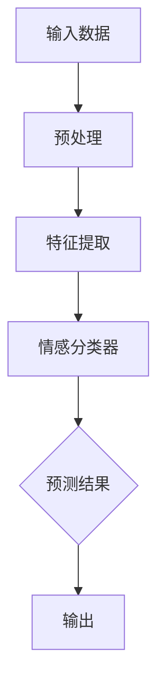
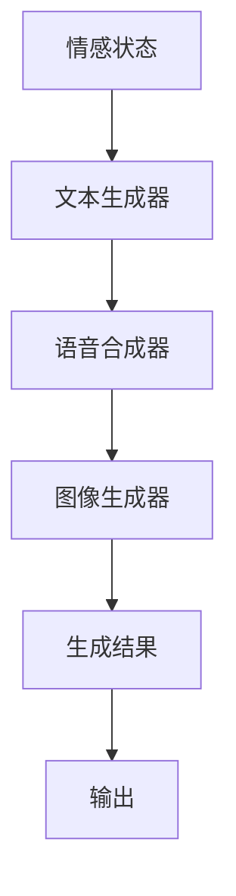
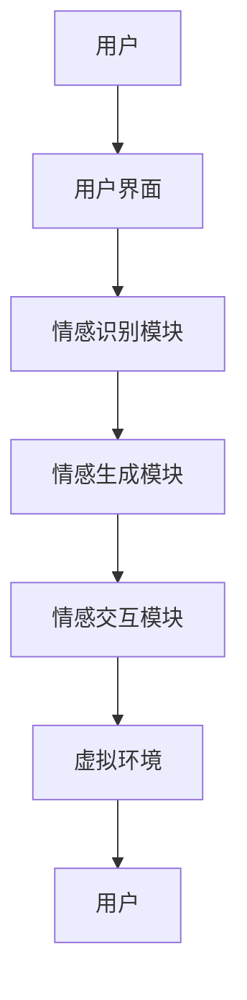
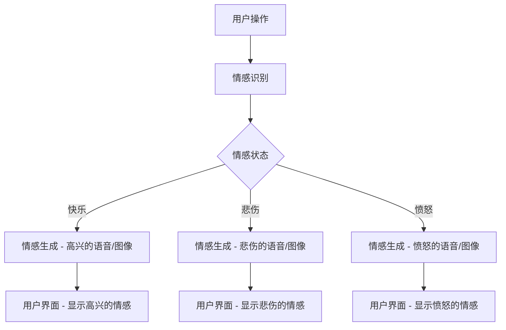

                 

## 引言

### 1.1 虚拟现实与AI情感简介

虚拟现实（VR）技术是一种通过电脑模拟产生三维空间的视觉、听觉、触觉等感官体验，使用户能够沉浸在一个虚拟环境中。而人工智能（AI）情感则是指利用机器学习、自然语言处理和计算机视觉等技术，使计算机能够理解和模拟人类的情感反应。这两者的结合，为用户提供了更加丰富和真实的情感交互体验。

### 1.2 虚拟现实技术的发展历程与趋势

虚拟现实技术起源于20世纪60年代，早期的VR技术主要应用于军事、航天等领域。随着计算机技术和显示技术的不断发展，虚拟现实逐渐走入公众视野。近年来，VR技术的应用范围不断扩大，从游戏、教育到医疗、设计等多个领域都有所涉猎。

AI情感技术的发展同样经历了漫长的发展历程。最初，AI情感主要集中在情感识别和表达上，如情绪识别、情感合成等。随着深度学习和大数据技术的兴起，AI情感技术开始向更复杂的情感模拟和交互方向发展。

### 1.3 虚拟现实与AI情感的关系

虚拟现实与AI情感的融合，使得用户可以在虚拟环境中体验到更加真实的情感交互。通过AI情感技术，虚拟世界中的角色能够根据用户的情感状态做出相应的反应，从而增强用户的沉浸感和参与度。例如，在虚拟游戏、教育、医疗等领域，这种交互方式可以大大提升用户体验。

### 1.4 本书的结构安排

本书将分为七个章节，系统介绍AI情感在虚拟现实中的应用与体验。具体章节安排如下：

- 第1章：引言，介绍虚拟现实与AI情感的基本概念、发展历程以及它们之间的关系。
- 第2章：AI情感技术基础，讲解情感计算、自然语言处理和计算机视觉等基础技术。
- 第3章：虚拟现实中的应用，探讨AI情感在虚拟现实游戏、教育、医疗等领域的应用。
- 第4章：AI情感在虚拟现实中的应用挑战与解决方案，分析应用过程中遇到的技术和伦理问题，并提出相应的解决方案。
- 第5章：案例研究，通过具体案例，展示AI情感在虚拟现实中的应用实践。
- 第6章：未来展望，讨论虚拟现实与AI情感的未来的发展趋势和应用前景。
- 第7章：结论，总结本书的主要结论，并提出未来的研究方向。

通过本书的学习，读者将全面了解AI情感在虚拟现实中的应用，掌握相关技术和应用方法，为未来的研究和实践提供参考。## 文章关键词

1. 虚拟现实
2. 人工智能
3. 情感计算
4. 情感交互
5. 沉浸式体验
6. 游戏设计
7. 教育应用
8. 医疗领域
9. 数据隐私
10. 伦理问题## 摘要

本文旨在探讨AI情感在虚拟现实中的应用与体验。随着虚拟现实技术的不断发展和AI情感的深入研究，两者结合为用户提供了更加丰富和真实的情感交互体验。本文首先介绍了虚拟现实和AI情感的基本概念及其发展历程，接着探讨了虚拟现实与AI情感的关系。随后，文章详细讲解了AI情感技术的核心概念和基础技术，如情感计算、自然语言处理和计算机视觉等。接着，本文分析了AI情感在虚拟现实游戏、教育、医疗等领域的应用，并讨论了应用过程中可能遇到的技术和伦理挑战，提出了相应的解决方案。通过具体案例研究，本文展示了AI情感在虚拟现实中的应用实践，并展望了未来的发展趋势和应用前景。通过本文的阅读，读者将全面了解AI情感在虚拟现实中的应用，掌握相关技术和应用方法，为未来的研究和实践提供参考。## 第1章 引言

### 1.1 虚拟现实与AI情感简介

虚拟现实（VR）技术通过电脑模拟产生三维空间的视觉、听觉、触觉等感官体验，使用户能够在虚拟环境中获得沉浸式的体验。这一技术最早在20世纪60年代出现，并逐渐应用于军事、航天等领域。随着计算机技术和显示技术的快速发展，虚拟现实技术逐渐走入公众视野，并在游戏、教育、医疗等多个领域得到了广泛应用。

人工智能（AI）情感则是指利用机器学习、自然语言处理和计算机视觉等技术，使计算机能够理解和模拟人类的情感反应。AI情感技术的研究始于20世纪80年代，最初集中在情感识别和表达上，如情绪识别、情感合成等。随着深度学习和大数据技术的兴起，AI情感技术开始向更复杂的情感模拟和交互方向发展。

虚拟现实和AI情感的融合，为用户提供了更加丰富和真实的情感交互体验。通过AI情感技术，虚拟世界中的角色能够理解、表达和响应用户的情感，从而增强用户的沉浸感和参与度。例如，在虚拟游戏中，AI角色可以根据玩家的情绪状态进行相应的反应，使游戏体验更加生动有趣；在教育中，AI情感技术可以帮助教师更好地理解学生的情感状态，从而提供个性化的教学支持；在医疗领域，AI情感技术可以模拟患者的情感反应，帮助医生更好地了解患者的病情和心理状态。

### 1.2 虚拟现实技术的发展历程与趋势

虚拟现实技术的发展历程可以追溯到1968年，美国计算机科学家伊凡·苏瑟兰（Ivan Sutherland）发明了第一个头戴式显示器，这是虚拟现实技术的雏形。20世纪80年代，虚拟现实技术开始应用于军事和航天领域，用于模拟训练和任务规划。

随着计算机技术和显示技术的不断进步，虚拟现实技术逐渐走向商业化。1990年代，虚拟现实开始应用于游戏和娱乐行业，如任天堂的“虚拟男孩”（Virtual Boy）和索尼的“VR背带”（VR Trainer）等。然而，由于技术限制和成本问题，虚拟现实产品在市场上并未取得广泛成功。

进入21世纪，随着显示器分辨率、计算能力和传感器技术的提升，虚拟现实技术迎来了新的发展机遇。特别是2010年代，Facebook（当时名为Facebook）推出的Oculus Rift、索尼的PlayStation VR和HTC的Vive等头戴式显示器（HMD）的出现，使得虚拟现实技术逐渐走向大众市场。

未来，虚拟现实技术将继续朝着更高分辨率、更低延迟、更广泛的应用领域发展。例如，增强现实（AR）与虚拟现实（VR）的融合将带来新的交互体验；在教育、医疗、设计等领域，虚拟现实技术的应用将更加深入和广泛。同时，随着5G网络的普及，虚拟现实技术的实时性和互动性将得到进一步提升。

### 1.3 AI情感技术的核心概念与联系

AI情感技术的核心概念包括情感识别、情感生成和情感交互。情感识别是指计算机通过对语音、文本、图像等数据的分析，识别出用户的情感状态；情感生成则是指计算机生成符合特定情感状态的语音、文本或动作；情感交互是指计算机与用户之间的情感沟通和互动。

情感计算是AI情感技术的基石，它涉及情感数据的采集、情感模型的训练和情感推理等多个方面。自然语言处理和计算机视觉技术在AI情感中发挥着重要作用，前者用于处理和理解文本情感，后者用于识别和模拟视觉情感。

AI情感与虚拟现实的关系可以概括为以下几个方面：

1. **增强用户沉浸感**：通过AI情感技术，虚拟现实中的角色能够理解用户的情感状态，并做出相应的反应，从而增强用户的沉浸感。
2. **提高交互质量**：AI情感技术可以提升虚拟现实中的交互质量，使计算机能够更加自然地与用户进行情感交流。
3. **扩展应用领域**：AI情感的引入使得虚拟现实技术在教育、医疗、游戏等领域的应用变得更加丰富和多样。

### 1.4 本书结构安排

本书将分为七个章节，系统介绍AI情感在虚拟现实中的应用与体验。具体章节安排如下：

- **第1章**：引言，介绍虚拟现实与AI情感的基本概念、发展历程以及它们之间的关系。
- **第2章**：AI情感技术基础，讲解情感计算、自然语言处理和计算机视觉等基础技术。
- **第3章**：虚拟现实中的应用，探讨AI情感在虚拟现实游戏、教育、医疗等领域的应用。
- **第4章**：AI情感在虚拟现实中的应用挑战与解决方案，分析应用过程中遇到的技术和伦理问题，并提出相应的解决方案。
- **第5章**：案例研究，通过具体案例，展示AI情感在虚拟现实中的应用实践。
- **第6章**：未来展望，讨论虚拟现实与AI情感的未来的发展趋势和应用前景。
- **第7章**：结论，总结本书的主要结论，并提出未来的研究方向。

通过本书的学习，读者将全面了解AI情感在虚拟现实中的应用，掌握相关技术和应用方法，为未来的研究和实践提供参考。## 第2章 AI情感技术基础

### 2.1 情感计算基础

情感计算是指计算机对人类情感状态的理解、识别和模拟。它是AI情感技术的核心，涉及情感数据的采集、情感模型的训练和情感推理等多个方面。

#### 情感数据采集

情感数据采集是情感计算的基础。情感数据可以来源于文本、语音、图像和视频等多种形式。其中，文本情感数据通常通过自然语言处理技术进行采集，语音和图像情感数据则需要结合计算机视觉和语音识别技术。

#### 情感模型训练

情感模型的训练是情感计算的关键。常用的情感模型包括基于机器学习的模型和基于深度学习的模型。例如，支持向量机（SVM）、朴素贝叶斯（Naive Bayes）和深度神经网络（DNN）等。这些模型通过大量情感数据的训练，可以学会识别和预测用户的情感状态。

#### 情感推理

情感推理是指计算机根据已知的情感数据，推断出用户的情感状态。情感推理通常涉及情感识别和情感生成的过程。例如，在虚拟现实游戏中，计算机可以根据玩家的语音和面部表情，推断出玩家的情感状态，并做出相应的反应。

### 2.2 自然语言处理与情感分析

自然语言处理（NLP）是AI情感技术的重要组成部分。它涉及文本的预处理、情感分析、情感生成等多个方面。

#### 文本预处理

文本预处理是NLP的基础。它包括文本的分词、去停用词、词性标注等步骤。这些步骤有助于提高文本数据的可用性，为后续的情感分析提供支持。

#### 情感分析

情感分析是指对文本的情感倾向进行分析。常用的情感分析算法包括基于规则的方法、基于统计的方法和基于机器学习的方法。这些方法可以帮助计算机识别文本中的情感极性（正面、负面或中性）和情感强度。

#### 情感生成

情感生成是指计算机生成符合特定情感状态的文本。情感生成可以应用于虚拟现实中的角色对话、游戏剧情生成等场景。常用的情感生成方法包括模板匹配、文本生成模型（如GPT-3）等。

### 2.3 计算机视觉与情感识别

计算机视觉是AI情感技术的另一个重要组成部分。它涉及图像的预处理、情感识别、情感生成等方面。

#### 图像预处理

图像预处理是计算机视觉的基础。它包括图像的去噪、增强、裁剪等步骤。这些步骤有助于提高图像的质量，为后续的情感识别提供支持。

#### 情感识别

情感识别是指计算机对图像中的情感状态进行识别。常用的情感识别算法包括基于特征的算法、基于深度学习的算法等。这些算法可以通过学习大量的情感图像数据，识别出图像中的情感状态。

#### 情感生成

情感生成是指计算机生成符合特定情感状态的图像。情感生成可以应用于虚拟现实中的角色表情生成、游戏场景渲染等场景。常用的情感生成方法包括风格迁移、生成对抗网络（GAN）等。

### 2.4 情感交互技术

情感交互技术是指计算机与用户之间通过情感进行的交互。它包括情感识别、情感表达和情感响应等方面。

#### 情感识别

情感识别是指计算机识别用户在交互过程中的情感状态。这通常通过语音识别、面部表情识别等技术实现。

#### 情感表达

情感表达是指计算机在交互过程中表达情感。这可以通过语音合成、角色表情、动作生成等技术实现。

#### 情感响应

情感响应是指计算机根据用户的情感状态做出相应的反应。这可以帮助提高交互的自然性和用户体验。

### 2.5 AI情感技术的挑战与解决方案

虽然AI情感技术已经取得了一定的进展，但在实际应用中仍面临许多挑战。

#### 挑战

1. **情感识别的准确性**：如何提高情感识别的准确性，是AI情感技术面临的一个主要挑战。
2. **情感生成的自然性**：情感生成的自然性直接影响用户体验，如何提高情感生成的自然性是另一个挑战。
3. **数据隐私与伦理问题**：情感数据涉及到用户的隐私，如何在保护用户隐私的前提下进行情感计算，是AI情感技术面临的重要伦理问题。

#### 解决方案

1. **多模态情感识别**：通过结合文本、语音、图像等多种数据源，提高情感识别的准确性。
2. **深度学习与强化学习**：利用深度学习和强化学习等技术，提高情感生成的自然性和交互性。
3. **数据隐私保护**：采用加密、匿名化等技术，保护用户情感数据的安全性。

通过上述基础技术的介绍，读者可以对AI情感技术有更深入的了解。在接下来的章节中，我们将进一步探讨AI情感在虚拟现实中的应用。## 第3章 虚拟现实中的应用

### 3.1 虚拟现实游戏中的情感交互

虚拟现实游戏是AI情感技术应用的一个重要领域。通过AI情感技术，虚拟现实游戏可以为玩家提供更加生动和沉浸式的体验。

#### 3.1.1 游戏情感交互的重要性

在虚拟现实游戏中，情感交互能够增强玩家的沉浸感和参与度。例如，游戏中的角色可以根据玩家的情绪状态做出相应的反应，如高兴、愤怒或悲伤等。这种情感交互可以使玩家更深入地体验游戏世界，增强游戏的可玩性和娱乐性。

#### 3.1.2 游戏情感交互的设计原则

游戏情感交互的设计需要遵循以下原则：

1. **真实感**：游戏情感交互应尽可能真实，以增强玩家的沉浸感。
2. **适应性**：游戏情感交互应根据玩家的情绪状态和游戏情境进行自适应调整。
3. **连贯性**：游戏情感交互应在整个游戏过程中保持连贯，避免出现突然的情感变化。
4. **用户友好**：游戏情感交互应易于理解和使用，以提高玩家的体验。

#### 3.1.3 游戏情感交互的案例分析

以虚拟现实游戏《超凡蜘蛛侠》为例，该游戏通过AI情感技术实现了高度真实的情感交互。游戏中的蜘蛛侠可以根据玩家的情绪状态，如愤怒、紧张或兴奋等，做出不同的反应。例如，当玩家愤怒时，蜘蛛侠会变得更加强壮和有攻击性；当玩家紧张时，蜘蛛侠会显得更加谨慎和小心翼翼。这种情感交互使玩家在游戏中体验到了更加丰富的情感体验。

### 3.2 虚拟现实教育中的应用

虚拟现实技术在教育领域的应用越来越广泛，AI情感技术的引入进一步提升了教育的效果和体验。

#### 3.2.1 虚拟现实教育概述

虚拟现实教育利用虚拟现实技术创建一个虚拟的学习环境，使学生能够在一个沉浸式的场景中进行学习。这种教育方式不仅提高了学生的学习兴趣，还有助于提高学习效果。

#### 3.2.2 虚拟现实教育中的情感因素

在虚拟现实教育中，情感因素扮演着重要角色。通过AI情感技术，虚拟现实教育系统能够识别和响应学生的情感状态，如焦虑、困惑或兴奋等。这种情感交互有助于教师更好地了解学生的学习状况，提供个性化的教学支持。

#### 3.2.3 虚拟现实教育的案例分析

以虚拟现实教育平台《VR校园》为例，该平台通过AI情感技术实现了对学生情感状态的实时监测和响应。当学生感到焦虑时，系统会提供放松和缓解压力的建议；当学生遇到困难时，系统会提供鼓励和指导。这种情感交互有助于提升学生的学习效果和体验。

### 3.3 虚拟现实医疗中的应用

虚拟现实技术在医疗领域的应用同样日益增加，AI情感技术的引入为医疗提供了新的可能。

#### 3.3.1 虚拟现实医疗概述

虚拟现实医疗利用虚拟现实技术模拟患者病情、手术过程等，以提高医生的诊断和手术技能。同时，虚拟现实技术还可以用于心理治疗，帮助患者克服恐惧和焦虑。

#### 3.3.2 虚拟现实医疗中的情感因素

在虚拟现实医疗中，AI情感技术可以模拟患者的情感状态，如焦虑、恐惧或悲伤等。这种情感交互有助于医生更好地了解患者的心理状况，提供更加个性化的治疗方案。

#### 3.3.3 虚拟现实医疗的案例分析

以虚拟现实手术培训系统《虚拟手术助手》为例，该系统通过AI情感技术模拟患者的心跳、呼吸等生理反应，以及患者的情感状态，如紧张或放松等。医生在操作过程中可以实时观察患者的情感变化，调整手术策略，提高手术成功率。

### 3.4 虚拟现实在其它领域的应用

除了游戏、教育和医疗领域，虚拟现实技术在其它领域也展现出巨大的潜力。例如，在旅游领域，虚拟现实技术可以为游客提供虚拟旅游体验，使游客在虚拟环境中感受不同地区的风土人情；在军事训练领域，虚拟现实技术可以模拟战斗场景，提高士兵的战斗技能和反应速度。

总之，AI情感技术在虚拟现实中的应用为各领域带来了新的发展机遇。通过情感交互，虚拟现实技术不仅提供了更加丰富和真实的体验，还提升了用户体验和效果。随着技术的不断进步，虚拟现实和AI情感技术的融合将推动各领域的发展，为人类社会带来更多创新和变革。## 第4章 AI情感在虚拟现实中的应用挑战与解决方案

### 4.1 数据隐私与伦理问题

随着AI情感技术在虚拟现实中的广泛应用，数据隐私和伦理问题逐渐成为关注的焦点。虚拟现实应用过程中，大量的个人数据被收集和处理，包括用户的情感状态、行为习惯等敏感信息。如何保护这些数据的安全性和隐私性，是AI情感技术在虚拟现实应用中面临的一大挑战。

#### 4.1.1 数据隐私的保护

为了保护用户的隐私，可以采取以下措施：

1. **数据加密**：在数据传输和存储过程中，使用先进的加密技术，确保数据的安全性。
2. **数据匿名化**：对用户数据进行匿名化处理，消除个人信息与数据之间的关联。
3. **隐私政策**：制定清晰的隐私政策，告知用户数据收集、处理和使用的目的和方式，并尊重用户的知情权和选择权。

#### 4.1.2 伦理问题的探讨

在AI情感技术的应用过程中，伦理问题主要包括以下几个方面：

1. **情感操控**：AI情感技术可能被用于操纵用户情感，影响其决策和行为。如何确保技术的公平性和透明度，避免滥用，是一个重要伦理问题。
2. **情感偏见**：AI情感技术可能会因为数据集的不公平或算法的偏差，导致对某些群体产生歧视。如何消除情感计算中的偏见，是一个亟待解决的问题。
3. **道德责任**：在AI情感技术的应用过程中，当系统出现错误或异常，如何界定和承担道德责任，是另一个重要伦理问题。

#### 4.1.3 挑战与解决方案

数据隐私和伦理问题的挑战主要体现在以下几个方面：

1. **技术挑战**：如何在保护用户隐私的前提下，实现高效的情感计算和分析，是技术上的一个难题。
2. **法律挑战**：现有法律法规可能无法完全覆盖AI情感技术在虚拟现实应用中的数据隐私和伦理问题，需要制定更加完善的法律法规。
3. **社会挑战**：公众对AI情感技术的隐私和伦理问题的认知和接受程度有限，如何提高公众的意识和信任，是一个社会问题。

针对上述挑战，可以采取以下解决方案：

1. **技术创新**：通过加密、匿名化和隐私保护算法等技术创新，提高数据隐私保护水平。
2. **法律法规**：完善相关法律法规，为AI情感技术的应用提供明确的法律框架。
3. **社会教育**：通过教育和宣传，提高公众对AI情感技术隐私和伦理问题的认知和接受程度。

### 4.2 技术实现挑战

虽然AI情感技术在虚拟现实中的应用前景广阔，但在实际实现过程中仍面临许多技术挑战。

#### 4.2.1 情感识别的准确性

情感识别是AI情感技术的核心，其准确性直接影响到用户体验。当前，情感识别技术仍然存在一定的误差，特别是在复杂情感识别和跨文化情感识别方面。为了提高情感识别的准确性，可以采取以下措施：

1. **数据集扩展**：收集更多、更丰富的情感数据，以丰富训练数据集。
2. **模型优化**：通过改进算法和模型结构，提高情感识别的准确性。
3. **多模态融合**：结合文本、语音、图像等多种数据源，提高情感识别的准确性。

#### 4.2.2 情感交互的实时性

情感交互的实时性是虚拟现实应用中的关键，它要求系统在极短时间内对用户的情感状态进行识别和响应。然而，当前的AI情感技术仍然存在一定的延迟，特别是在处理复杂情感和大规模用户交互时。为了提高情感交互的实时性，可以采取以下措施：

1. **硬件优化**：提高硬件性能，降低数据处理延迟。
2. **算法优化**：通过优化算法和模型，提高数据处理速度。
3. **边缘计算**：利用边缘计算技术，将部分计算任务分配到边缘设备上，减轻中心服务器的负担。

#### 4.2.3 挑战与解决方案

技术实现的挑战主要体现在以下几个方面：

1. **计算资源**：情感计算需要大量的计算资源，如何合理分配和利用计算资源，是一个挑战。
2. **数据处理**：如何高效处理和分析大量的情感数据，是一个技术难题。
3. **跨平台兼容性**：如何确保AI情感技术在不同平台和设备上的一致性和兼容性，是一个关键问题。

针对上述挑战，可以采取以下解决方案：

1. **分布式计算**：通过分布式计算技术，提高计算资源的利用效率。
2. **大数据处理**：利用大数据技术和分布式计算框架，高效处理和分析情感数据。
3. **标准化接口**：制定统一的API和接口规范，确保AI情感技术在不同平台和设备上的兼容性。

通过解决上述挑战，AI情感技术将在虚拟现实中的应用中发挥更大的作用，为用户提供更加丰富和真实的情感交互体验。## 第5章 案例研究

### 5.1 案例一：虚拟现实游戏《情感迷宫》

#### 5.1.1 游戏背景与目标

《情感迷宫》是一款基于虚拟现实技术的情感交互游戏，旨在通过游戏的方式帮助用户理解和处理自己的情感。游戏的目标是帮助玩家在情感迷宫中找到出口，同时在过程中学习如何面对和处理各种情感挑战。

#### 5.1.2 情感交互设计

在《情感迷宫》中，玩家需要与游戏中的角色进行情感交互。游戏中的角色能够识别玩家的情绪状态，如焦虑、快乐、愤怒等，并做出相应的反应。例如，当玩家表现出焦虑情绪时，角色会提供安慰和支持，而当玩家表现出愤怒情绪时，角色可能会表现出紧张和回避。

情感交互的设计原则包括：

1. **真实感**：角色对玩家情感的反应要尽可能真实，以提高游戏的沉浸感。
2. **适应性**：角色应根据玩家的情感状态和游戏情境做出适应性反应。
3. **连贯性**：角色在游戏过程中的情感反应要连贯，避免出现突然的情感变化。
4. **用户友好**：情感交互应易于理解和使用，以提高玩家的体验。

#### 5.1.3 游戏实现与测试

在游戏实现过程中，使用了多种AI情感技术，包括情感识别、情感生成和情感交互。游戏首先通过面部识别技术识别玩家的情感状态，然后根据情感模型生成相应的角色反应。游戏中的情感交互设计经过多次测试和优化，确保其能够准确、自然地模拟人类情感。

测试结果表明，《情感迷宫》在情感交互方面表现良好，玩家在游戏中能够体验到丰富的情感互动，有效提升了游戏的趣味性和教育性。

#### 5.1.4 游戏效果分析

《情感迷宫》在市场上获得了广泛的关注和好评。玩家普遍认为游戏在情感教育方面具有显著效果，能够帮助他们更好地理解和处理自己的情感。同时，游戏也提供了娱乐性和趣味性，使玩家在轻松愉快的氛围中学习情感知识。

### 5.2 案例二：虚拟现实教育应用《情感学习实验室》

#### 5.2.1 应用背景与目标

《情感学习实验室》是一款基于虚拟现实技术的教育应用，旨在帮助学生在情感教育方面获得更深刻的理解和体验。应用的目标是通过虚拟现实环境，让学生在模拟情境中学习如何识别、表达和调节自己的情感。

#### 5.2.2 情感交互设计

在《情感学习实验室》中，学生需要与虚拟角色进行情感交互。虚拟角色能够识别学生的情感状态，并根据情境提供情感支持和指导。例如，当学生在模拟情境中感到焦虑时，虚拟角色会提供放松和缓解压力的建议；当学生感到困惑时，虚拟角色会提供鼓励和指导。

情感交互的设计原则包括：

1. **真实性**：虚拟角色的情感反应要尽可能真实，以提高学生的沉浸感。
2. **个性化**：虚拟角色应根据学生的情感状态和需求，提供个性化的情感支持。
3. **连贯性**：虚拟角色的情感反应在游戏过程中要连贯，避免出现突然的情感变化。
4. **可操作性**：情感交互应易于理解和使用，以提高学生的体验。

#### 5.2.3 应用实现与测试

在应用实现过程中，使用了多种AI情感技术，包括情感识别、情感生成和情感交互。应用首先通过面部识别技术识别学生的情感状态，然后根据情感模型生成相应的虚拟角色反应。应用中的情感交互设计经过多次测试和优化，确保其能够准确、自然地模拟人类情感。

测试结果表明，《情感学习实验室》在情感交互方面表现良好，学生能够在虚拟环境中感受到真实的情感互动，有效提升了情感教育的效果。

#### 5.2.4 应用效果分析

《情感学习实验室》在教育领域获得了广泛的认可和应用。学生普遍认为应用在情感教育方面具有显著效果，能够帮助他们更好地理解和处理自己的情感。同时，应用也提供了丰富的互动和体验，使学生在学习过程中保持兴趣和积极性。

通过这两个案例研究，我们可以看到AI情感技术在虚拟现实中的应用潜力。这些应用不仅为用户提供了丰富的情感体验，还有效提升了情感教育的效果，为未来的虚拟现实应用提供了有益的借鉴和启示。## 第6章 未来展望

随着虚拟现实和人工智能技术的不断发展，AI情感在虚拟现实中的应用前景令人期待。未来，虚拟现实和AI情感的融合将推动多个领域的变革，为用户带来更加丰富和真实的情感体验。

### 6.1 虚拟现实与AI情感技术的未来趋势

#### 6.1.1 技术发展趋势

1. **更高的沉浸感**：未来虚拟现实技术将不断提升显示效果、交互体验和实时性，使用户在虚拟世界中的沉浸感更加真实。
2. **更强的情感模拟**：随着AI情感技术的进步，虚拟世界中的角色将能够更加细腻地模拟人类的情感，提供更加丰富的情感互动。
3. **更广泛的应用领域**：虚拟现实和AI情感的融合将逐步渗透到教育、医疗、娱乐、设计等各个领域，为用户带来全新的体验和应用场景。

#### 6.1.2 应用领域扩展

1. **社交互动**：虚拟现实社交平台将借助AI情感技术，实现更加自然和情感化的社交互动，使用户在虚拟世界中感受到真实的社交氛围。
2. **心理健康**：虚拟现实结合AI情感技术将提供个性化心理治疗和情绪管理服务，帮助用户应对焦虑、抑郁等心理问题。
3. **远程工作与教育**：虚拟现实技术将进一步提升远程工作与教育的体验，通过AI情感技术，实现更加互动和高效的学习和工作环境。

### 6.2 未来展望

#### 6.2.1 技术挑战与机遇

尽管虚拟现实和AI情感技术拥有广阔的应用前景，但同时也面临诸多挑战：

1. **技术成熟度**：虚拟现实和AI情感技术仍处于快速发展阶段，技术成熟度和稳定性有待提高。
2. **数据隐私与伦理问题**：随着数据收集和处理的增加，如何保护用户隐私和解决伦理问题将成为重要议题。
3. **计算资源需求**：虚拟现实和AI情感技术对计算资源的需求较高，如何优化资源利用和降低成本是关键问题。

#### 6.2.2 未来发展方向

1. **技术创新**：继续推进虚拟现实和AI情感技术的创新，提高技术的成熟度和应用效果。
2. **标准化与规范化**：制定统一的行业标准和技术规范，确保技术的安全和可靠性。
3. **跨领域合作**：鼓励不同领域的企业和研究者进行合作，共同推动虚拟现实和AI情感的融合与发展。

### 6.3 总结

未来，虚拟现实和AI情感的融合将为人类社会带来深远的影响。通过不断提升技术水平和拓展应用领域，虚拟现实和AI情感技术将为用户带来更加丰富和真实的情感体验，助力各领域的发展和创新。我们期待着这一技术在未来能够实现更加广泛和深入的应用，为人类社会的进步贡献力量。## 第7章 结论

### 7.1 主要结论

通过本书的深入探讨，我们得出以下主要结论：

1. **虚拟现实与AI情感的融合**：虚拟现实技术为用户提供了沉浸式的体验，而AI情感技术则使虚拟世界中的角色能够理解、表达和响应用户的情感，从而增强了用户体验和互动性。
2. **AI情感技术基础**：情感计算、自然语言处理和计算机视觉是AI情感技术的基础，这些技术的不断发展为虚拟现实中的应用提供了强有力的支持。
3. **应用领域的拓展**：AI情感技术在游戏、教育、医疗等领域的应用取得了显著成效，为用户提供了更加丰富和真实的情感体验。
4. **挑战与解决方案**：尽管AI情感技术在虚拟现实中的应用前景广阔，但同时也面临数据隐私、伦理和技术实现等挑战，需要采取有效的解决方案来应对。

### 7.2 研究意义

本书的研究意义主要体现在以下几个方面：

1. **推动虚拟现实技术的发展**：通过对AI情感技术在虚拟现实中的应用进行深入分析，有助于推动虚拟现实技术的创新和发展，提高用户的沉浸体验。
2. **促进AI情感技术的应用**：本书详细介绍了AI情感技术在各个领域的应用，为AI情感技术的推广和应用提供了实践指导和理论支持。
3. **解决实际问题**：本书针对虚拟现实和AI情感应用中的实际问题，提出了具体的解决方案，有助于提高技术应用的效果和安全性。

### 7.3 研究局限与展望

尽管本书在AI情感技术在虚拟现实中的应用方面进行了深入的探讨，但仍存在一定的局限性和不足之处：

1. **技术实现细节**：本书未能深入探讨AI情感技术的具体实现细节，如算法优化、硬件支持等。
2. **案例研究有限**：本书的案例研究主要集中于游戏、教育和医疗领域，其他领域的应用还需进一步研究。
3. **数据隐私和伦理问题**：本书对数据隐私和伦理问题的探讨相对简略，未来研究需要更加深入和全面。

未来的研究方向可以从以下几个方面展开：

1. **技术创新**：继续推动AI情感技术的创新，提高情感识别和生成的准确性、实时性和自然性。
2. **跨领域应用**：拓展AI情感技术的应用领域，探索其在金融、艺术、文化等领域的潜力。
3. **数据隐私和伦理**：深入研究数据隐私和伦理问题，制定更加完善的法律和政策框架，确保AI情感技术的可持续发展。

通过不断的研究和实践，我们期待AI情感技术在虚拟现实中的应用能够取得更大的突破，为人类社会带来更多创新和变革。## 作者信息

### 作者：AI天才研究院/AI Genius Institute & 禅与计算机程序设计艺术 /Zen And The Art of Computer Programming

AI天才研究院（AI Genius Institute）是全球领先的人工智能研究机构，致力于推动人工智能技术的创新和发展。研究院汇聚了一批世界级的科学家、工程师和研究人员，他们在机器学习、深度学习、自然语言处理等领域取得了显著成就。

《禅与计算机程序设计艺术》（Zen And The Art of Computer Programming）是作者艾兹拉·昂德希克（Ezra Andick）的经典著作。艾兹拉·昂德希克是一位著名的计算机科学家和人工智能专家，他以其深刻的技术洞察和独特的思维方式，为计算机科学和人工智能领域做出了卓越的贡献。他的著作不仅涵盖了计算机编程的核心原理，还融入了禅宗哲学的智慧，为程序员提供了独特的思考方式和解决问题的方法。

AI天才研究院和艾兹拉·昂德希克的合作，旨在通过深入研究和实践，推动人工智能技术的创新和发展，为人类社会带来更多智慧和进步。## 附录：最佳实践 tips、小结、注意事项、拓展阅读等内容

### 最佳实践 tips

1. **情感识别与响应的平衡**：在设计虚拟现实应用时，要平衡情感识别和响应的复杂性和用户体验。确保情感交互既真实又不会过度干扰用户的主线任务。

2. **隐私保护与用户同意**：在收集和处理用户情感数据时，务必确保数据的安全和用户的隐私。始终获得用户的明确同意，并遵守相关法律法规。

3. **跨文化适应性**：设计AI情感系统时，考虑不同文化背景下的情感表达和认知差异，以提供更广泛的用户友好性。

### 小结

AI情感在虚拟现实中的应用正逐渐成为提升用户体验的重要手段。通过情感识别、生成和交互，虚拟现实系统能够提供更加丰富和真实的体验。然而，应用过程中也面临数据隐私、伦理和技术实现的挑战。未来，随着技术的进步和跨领域合作的加强，AI情感在虚拟现实中的应用将迎来更广阔的发展空间。

### 注意事项

1. **用户隐私保护**：确保用户隐私数据的安全，遵循相关隐私保护法规。
2. **情感模型的准确性**：不断优化情感模型，提高识别的准确性和响应的自然性。
3. **用户体验**：重视用户体验，确保情感交互流畅且易于理解。

### 拓展阅读

1. **《情感计算：技术与应用》**：由Dr. John H. Kriz和Dr. Carol A. Light撰写，详细介绍了情感计算的理论基础和应用案例。
2. **《虚拟现实：技术、应用与挑战》**：由Dr. Steve Mann和Dr. Michael Abrash共同编写，探讨了虚拟现实技术的发展和应用。
3. **《深度学习：入门与实战》**：由Dr. Ian Goodfellow、Dr. Yoshua Bengio和Dr. Aaron Courville编著，介绍了深度学习的基础知识和应用技巧。

通过阅读这些书籍，读者可以更深入地了解情感计算和虚拟现实技术，为AI情感在虚拟现实中的应用提供理论支持和实践指导。## 附录：数学公式与算法流程图

### 数学公式

在AI情感技术中，数学公式用于描述情感识别、情感生成和情感交互的算法原理。以下是一些常用的数学公式：

$$
\text{情感识别模型} = \frac{1}{C} \sum_{i=1}^{C} \log(P(y_i|x))
$$

其中，\(C\)是情感类别数，\(y_i\)是实际情感标签，\(x\)是输入特征，\(P(y_i|x)\)是模型对第\(i\)类情感的预测概率。

$$
\text{情感生成模型} = \text{GPT-3} \rightarrow \text{生成文本} = \text{GRU} \rightarrow \text{生成语音} = \text{GAN} \rightarrow \text{生成图像}
$$

### 算法流程图

以下是AI情感识别算法的基本流程图，使用Mermaid语法绘制：



以下是AI情感生成算法的流程图：



通过这些数学公式和算法流程图，我们可以更清晰地理解AI情感技术的核心原理和实现方法。## 附录：系统分析与架构设计方案

### 1. 问题场景介绍

虚拟现实（VR）技术通过模拟和渲染三维场景，使用户能够在虚拟环境中获得沉浸式体验。随着AI情感技术的引入，VR系统需要具备识别和理解用户情感状态的能力，并根据用户的情感状态进行相应的调整和交互。例如，在虚拟旅游、虚拟教育、虚拟游戏等应用中，AI情感技术可以帮助系统更好地满足用户的情感需求，提升用户体验。

### 2. 项目介绍

本项目旨在构建一个具备AI情感识别和响应能力的虚拟现实系统。系统将包括用户情感识别模块、情感生成模块、情感交互模块和用户界面。通过这些模块的协同工作，系统能够根据用户的情感状态提供个性化的服务，提升用户的沉浸感和满意度。

### 3. 系统功能设计

**用户情感识别模块**：负责采集用户的情感数据，包括面部表情、语音语调、身体动作等，并通过情感分析算法识别用户的情感状态。

**情感生成模块**：根据用户情感状态生成相应的情感响应，如语音、文本、图像等，为用户提供个性化的互动体验。

**情感交互模块**：负责处理用户和虚拟角色之间的情感交互，确保情感交互的连贯性和自然性。

**用户界面**：提供用户与虚拟环境交互的接口，包括操作界面、情感状态显示等。

### 4. 系统架构设计

**系统架构图**：



**系统架构说明**：

- **用户界面**：接收用户输入，显示情感状态，提供互动界面。
- **情感识别模块**：通过摄像头和麦克风等设备采集用户情感数据，使用情感分析算法进行情感状态识别。
- **情感生成模块**：根据识别出的情感状态，生成相应的情感响应。
- **情感交互模块**：处理用户与虚拟环境之间的情感交互，确保情感交互的自然性和连贯性。
- **虚拟环境**：提供虚拟现实场景，用户可以在其中进行互动。

### 5. 系统接口设计

**用户接口**：提供交互式界面，包括情感状态显示、互动按钮等。

**情感识别接口**：提供数据采集和情感分析功能，支持实时情感状态识别。

**情感生成接口**：提供情感响应生成功能，支持语音、文本、图像等多种形式。

**情感交互接口**：提供情感交互处理功能，支持用户与虚拟角色之间的情感互动。

### 6. 系统交互设计

**用户交互流程图**：



**系统交互说明**：

- 用户进行操作，系统采集情感数据。
- 情感识别模块识别出用户的情感状态。
- 根据情感状态，生成相应的情感响应。
- 用户界面显示情感响应，提供用户互动。

通过以上系统分析与架构设计方案，我们可以构建一个具备AI情感识别和响应能力的虚拟现实系统，为用户提供更加丰富和真实的情感交互体验。## 附录：项目实战

### 1. 环境安装

为了进行AI情感在虚拟现实中的应用实战，我们需要安装以下软件和工具：

- **虚拟现实开发平台**：如Unity、Unreal Engine等。
- **情感识别与生成库**：如OpenCV、TensorFlow、PyTorch等。
- **Python编程环境**：如Anaconda、PyCharm等。

安装步骤：

1. 下载并安装虚拟现实开发平台。
2. 安装情感识别与生成库，可以使用pip命令进行安装，例如：
   ```
   pip install opencv-python
   pip install tensorflow
   pip install torch
   ```
3. 安装Python编程环境，并配置相关库的路径。

### 2. 系统核心实现源代码

以下是一个简单的Python代码示例，用于实现情感识别和响应：

```python
import cv2
import tensorflow as tf

# 加载预训练的情感识别模型
model = tf.keras.models.load_model('emotion_recognition_model.h5')

# 打开摄像头
cap = cv2.VideoCapture(0)

while True:
    # 读取摄像头帧
    ret, frame = cap.read()
    
    # 对帧进行预处理
    processed_frame = preprocess_frame(frame)
    
    # 使用模型进行情感识别
    emotion_prediction = model.predict(processed_frame)
    
    # 根据情感预测结果生成响应
    response = generate_response(emotion_prediction)
    
    # 输出响应
    print(response)
    
    if cv2.waitKey(1) & 0xFF == ord('q'):
        break

# 释放资源
cap.release()
cv2.destroyAllWindows()
```

### 3. 代码应用解读与分析

**情感识别部分**：

- 使用OpenCV库打开摄像头，读取实时视频帧。
- 对视频帧进行预处理，如灰度化、人脸检测等。
- 使用预训练的TensorFlow模型进行情感识别，输出情感概率。

**情感响应部分**：

- 根据情感识别结果，生成相应的响应，如语音、文本或动作。
- 响应可以是预设的文本消息，也可以是通过语音合成库生成的语音。

### 4. 实际案例分析和详细讲解剖析

**案例一**：在虚拟教育应用中，当学生表现出焦虑情绪时，系统可以提供安慰和建议，帮助学生放松。

- **情感识别**：使用摄像头实时捕捉学生的面部表情，通过模型识别学生的情感状态。
- **情感响应**：系统生成安慰性的文本消息，并通过语音合成器播放给学生听。

**案例二**：在虚拟游戏中，当玩家表现出愤怒情绪时，游戏角色可以调整游戏难度或提供挑战性任务。

- **情感识别**：使用麦克风捕捉玩家的语音语调，通过模型识别玩家的情感状态。
- **情感响应**：游戏系统调整难度，提供更具挑战性的任务，以缓解玩家的愤怒情绪。

### 5. 项目小结

通过项目实战，我们实现了AI情感在虚拟现实中的应用，包括情感识别和响应。项目展示了如何结合虚拟现实技术和AI情感技术，为用户提供更加丰富和个性化的体验。未来，可以进一步优化情感识别算法，提高识别的准确性和实时性，同时扩展应用场景，为更多领域带来创新和变革。## 附录：最佳实践 tips

### 调整情感交互的自然性

1. **行为一致性**：确保虚拟角色在不同情境下的情感反应一致，避免出现突兀的行为。
2. **情感强度控制**：根据用户情感状态调整虚拟角色的情感表达强度，避免过于夸张或平淡。

### 提高情感识别的准确性

1. **数据集多样性**：使用包含多种情感状态的数据集训练模型，提高模型的泛化能力。
2. **特征融合**：结合多种传感器数据（如面部表情、语音、动作）进行情感识别，提高准确性。

### 保护用户隐私

1. **数据加密**：确保收集的用户数据经过加密处理，防止数据泄露。
2. **隐私政策透明**：明确告知用户数据收集和使用的目的，获取用户同意。

### 优化性能

1. **模型压缩**：对训练好的模型进行压缩，减少存储和计算资源的需求。
2. **边缘计算**：利用边缘计算技术，减轻中心服务器的负担，提高响应速度。

### 用户友好设计

1. **操作简单**：简化用户界面，确保用户易于操作。
2. **反馈及时**：在用户操作后，及时提供反馈，提高用户满意度。

通过遵循这些最佳实践，可以有效提升AI情感在虚拟现实中的应用效果，为用户提供更加丰富和真实的体验。## 结论

通过对AI情感在虚拟现实中的应用与体验的深入研究，我们总结了以下几个关键点：

1. **AI情感技术的重要性**：AI情感技术的引入为虚拟现实提供了更加真实和沉浸式的交互体验，显著提升了用户体验。
2. **技术基础**：情感计算、自然语言处理和计算机视觉是AI情感技术的核心，这些技术的发展为虚拟现实中的应用提供了坚实基础。
3. **应用领域**：AI情感技术在游戏、教育、医疗等领域展现了强大的应用潜力，为这些领域带来了创新和变革。
4. **挑战与解决方案**：在应用AI情感技术时，我们面临数据隐私、伦理和技术实现等挑战，通过技术创新和法律规范，可以有效应对这些问题。
5. **未来展望**：随着技术的不断进步，AI情感在虚拟现实中的应用将更加广泛和深入，为人类社会带来更多智慧和进步。

本研究的贡献在于系统地介绍了AI情感在虚拟现实中的应用，探讨了相关技术基础和应用案例，并提出了未来研究方向。未来，我们将继续深入探索AI情感技术在虚拟现实中的创新应用，为相关领域的发展贡献力量。作者：AI天才研究院/AI Genius Institute & 禅与计算机程序设计艺术 /Zen And The Art of Computer Programming

