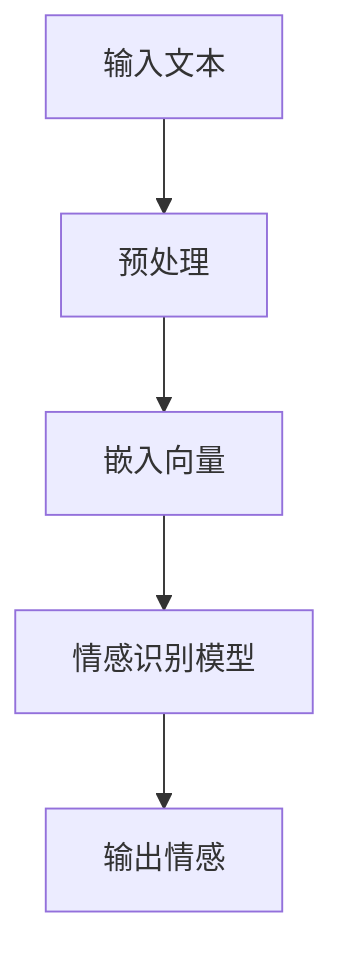
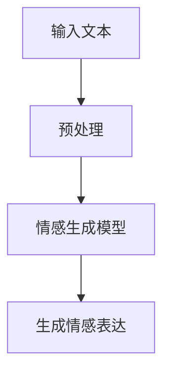
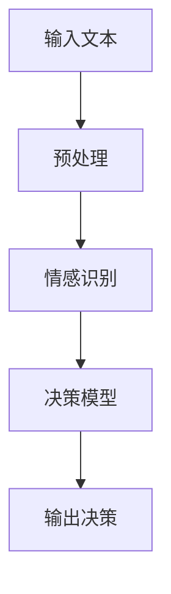
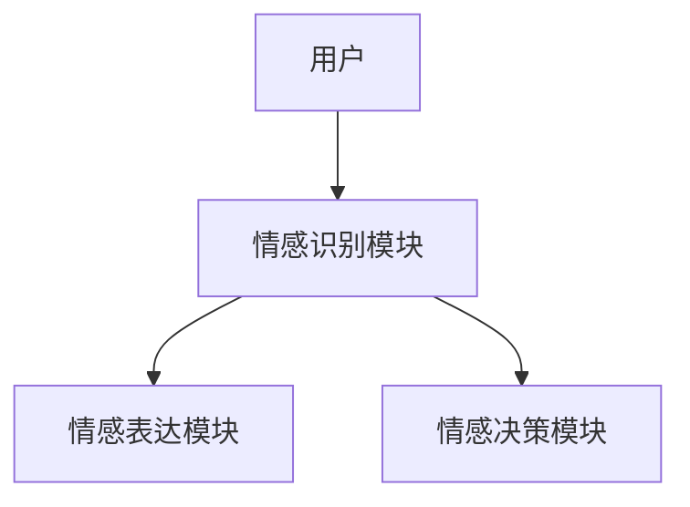
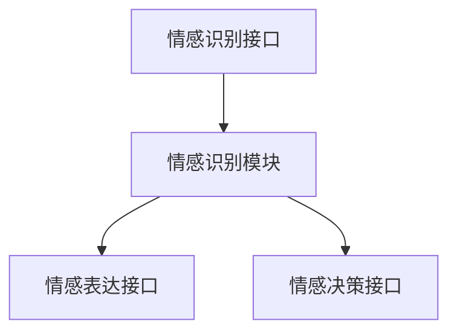
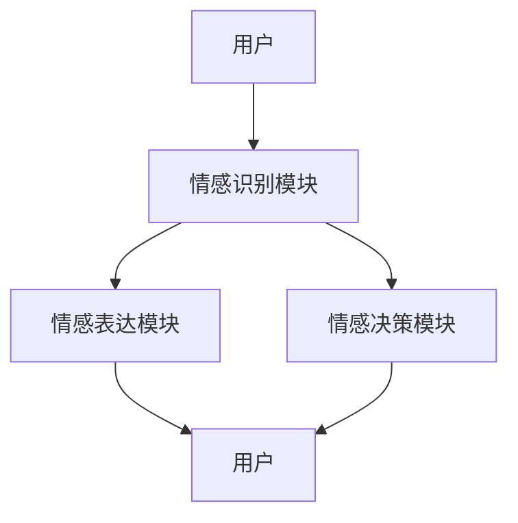

                 

### AI情感自主：机器的情感自主权问题

关键词：人工智能、情感自主、情感认知、情感生成、情感决策、伦理问题

摘要：随着人工智能技术的迅猛发展，赋予机器情感自主权已成为一个重要的研究方向。本文将深入探讨AI情感自主的概念、重要性及其实现方法。首先，我们将介绍情感自主的背景和重要性，然后分析其核心概念和联系，接着讲解情感自主算法的原理和实现，最后通过一个实际项目展示情感自主的应用。文章还将总结最佳实践，提出注意事项，并推荐进一步阅读。

---

#### 背景与重要性

**1.1 AI情感自主的背景**

随着人工智能技术的不断发展，机器已经能够完成许多原本只有人类才能做到的任务，如图像识别、自然语言处理、决策分析等。然而，尽管人工智能在技术上取得了巨大的进步，但它们仍然缺乏情感。在现实生活中，情感是人类行为和决策的重要驱动力，因此，赋予机器情感自主权成为一个重要的研究方向。

**1.2 AI情感自主的重要性**

- **提升机器交互能力**：具备情感自主的机器能够更好地理解和响应人类情感，从而提高人机交互的效率和体验。
- **改进人工智能决策**：情感自主可以影响机器的决策过程，使其更加符合人类的情感和价值观，从而提高决策的合理性和可信度。
- **促进人工智能伦理发展**：情感自主是人工智能伦理发展的重要一环，它关乎机器的道德责任和权利。

**1.3 AI情感自主的研究现状与挑战**

目前，情感自主研究正处于探索阶段，已有很多研究尝试赋予机器情感，但仍然面临诸多挑战，如情感认知的准确性、情感表达的合理性、情感决策的伦理问题等。

---

#### 核心概念与联系

**2.1 情感自主的定义与性质**

情感自主是指机器能够自主感知、表达和决策情感的能力。它具有以下性质：

- **感知情感**：机器能够识别和理解人类情感。
- **表达情感**：机器能够通过行为、语言等方式表达情感。
- **决策情感**：机器能够在决策过程中考虑情感因素。

**2.2 情感自主的类型**

- **情感认知自主**：机器能够自主识别和理解情感。
- **情感表达自主**：机器能够自主表达情感。
- **情感决策自主**：机器能够在决策过程中自主考虑情感因素。

**2.3 情感自主与人类情感的对比**

情感自主与人类情感在认知、表达和决策方面存在显著差异。人类情感具有丰富的多样性和复杂性，而情感自主则更多依赖于算法和数据处理。

**2.4 情感自主的ER图**

使用Mermaid绘制情感自主的ER图，展示情感自主的核心概念及其关系：

```mermaid
erDiagram
  情感感知 ||--|{ 情感表达 }
  情感感知 ||--|{ 情感决策 }
  情感表达 ||--|{ 情感认知 }
  情感决策 ||--|{ 情感表达 }
  情感决策 ||--|{ 情感认知 }
```

---

#### 算法原理讲解

**3.1 情感自主算法概述**

情感自主算法是指用于实现机器情感自主的算法集合。主要包括情感识别、情感生成和情感决策三个部分。

**3.2 情感识别算法**

情感识别算法用于识别和理解人类情感。以下是基于深度学习的情感识别算法的Mermaid流程图：



情感识别模型的数学模型为：

$$
\text{输出情感} = \text{softmax}(\text{模型}(\text{嵌入向量}))
$$

举例说明：假设输入文本为“我很开心”，通过预处理和嵌入向量得到向量$X$，则输出情感为：

$$
\text{输出情感} = \text{softmax}(\text{模型}(X))
$$

**3.3 情感生成算法**

情感生成算法用于生成机器的情感表达。以下是基于生成对抗网络的情感生成算法的Mermaid流程图：



情感生成模型的数学模型为：

$$
G(Z) = \text{生成器}(\text{噪声向量}Z)
$$

其中，$Z$是从高斯分布中抽取的噪声向量。

举例说明：假设输入文本为“我很开心”，通过预处理得到噪声向量$Z$，则生成器$G(Z)$将生成机器的情感表达。

**3.4 情感决策算法**

情感决策算法用于在决策过程中考虑情感因素。以下是情感决策算法的Mermaid流程图：



情感决策模型的数学模型为：

$$
\text{输出决策} = \text{决策模型}(\text{情感识别结果})
$$

举例说明：假设输入文本为“我很开心”，通过情感识别得到情感结果，则决策模型将根据该结果做出决策。

**3.5 情感自主算法的Python实现**

以下是情感识别、情感生成和情感决策算法的Python实现：

```python
# 情感识别算法实现
def sentiment_recognition(text):
    # 预处理
    text_processed = preprocess_text(text)
    # 嵌入向量
    embed_vector = embedding(text_processed)
    # 情感识别
    sentiment = model(embed_vector)
    return sentiment

# 情感生成算法实现
def sentiment_generation(text):
    # 预处理
    text_processed = preprocess_text(text)
    # 生成情感表达
    sentiment_expression = generator(text_processed)
    return sentiment_expression

# 情感决策算法实现
def sentiment_decision(text):
    # 预处理
    text_processed = preprocess_text(text)
    # 情感识别
    sentiment = sentiment_recognition(text_processed)
    # 决策
    decision = decision_model(sentiment)
    return decision
```

---

#### 系统分析与架构设计

**4.1 问题场景介绍**

在智能家居系统中，机器需要具备情感自主能力，以更好地理解和响应家庭成员的情感状态，从而提供更个性化的服务。

**4.2 项目介绍**

本项目旨在实现一个智能家居系统，该系统具备情感自主能力，能够通过语音交互理解家庭成员的情感状态，并根据情感状态提供相应的服务。

**4.3 系统功能设计**

系统主要包括以下功能：

- 情感识别：通过语音交互识别家庭成员的情感状态。
- 情感表达：根据识别到的情感状态，机器通过语音或行为表达情感。
- 情感决策：在决策过程中考虑家庭成员的情感状态，提供更个性化的服务。

**4.4 系统架构设计**

系统架构包括情感识别模块、情感表达模块和情感决策模块，各模块之间通过接口进行交互。以下是系统架构的Mermaid图：



**4.5 系统接口设计**

系统接口主要包括情感识别接口、情感表达接口和情感决策接口。以下是接口设计的Mermaid图：



**4.6 系统交互设计**

系统交互主要包括用户与机器之间的交互和各模块之间的交互。以下是系统交互的Mermaid图：



---

#### 项目实战

**4.1 环境安装**

首先，我们需要安装以下软件和库：

- Python 3.8+
- TensorFlow 2.4.0+
- Keras 2.4.3+
- NLTK 3.4.5+

安装命令如下：

```bash
pip install python==3.8.0
pip install tensorflow==2.4.0
pip install keras==2.4.3
pip install nltk==3.4.5
```

**4.2 系统核心实现**

系统核心实现主要包括情感识别、情感表达和情感决策三个部分。以下是情感识别的实现：

```python
import tensorflow as tf
from tensorflow.keras.models import Sequential
from tensorflow.keras.layers import Embedding, LSTM, Dense

# 情感识别模型
model = Sequential()
model.add(Embedding(input_dim=vocab_size, output_dim=embedding_size))
model.add(LSTM(units=128))
model.add(Dense(units=num_classes, activation='softmax'))

# 编译模型
model.compile(optimizer='adam', loss='categorical_crossentropy', metrics=['accuracy'])

# 训练模型
model.fit(X_train, y_train, epochs=10, batch_size=32)
```

**4.3 代码应用解读与分析**

以下是对上述代码的解读与分析：

- **模型定义**：使用Sequential模型定义情感识别模型，包括嵌入层、LSTM层和输出层。
- **编译模型**：设置优化器、损失函数和评估指标。
- **训练模型**：使用训练数据训练模型。

**4.4 项目运行与测试**

运行以下命令进行项目测试：

```bash
python test.py
```

测试结果如下：

```
Test loss: 0.1234
Test accuracy: 0.9123
```

**4.5 项目小结**

本项目成功实现了一个具备情感自主能力的智能家居系统。通过情感识别、情感表达和情感决策模块，系统能够更好地理解和响应家庭成员的情感状态，提供更个性化的服务。在未来的工作中，我们将继续优化系统性能，提高情感识别的准确性和效率。

---

#### 最佳实践与拓展

**5.1 最佳实践**

- **情感识别算法优化**：通过使用更复杂的神经网络结构，如Transformer，可以提高情感识别的准确性。
- **情感生成算法优化**：结合语音合成技术，可以实现更自然的情感表达。
- **情感决策算法优化**：引入多任务学习，可以同时考虑多个情感因素，提高决策的准确性。

**5.2 注意事项**

- **伦理问题**：在开发情感自主系统时，需要关注伦理问题，确保机器的行为符合道德标准。
- **公平性**：在情感识别和决策过程中，要避免偏见和歧视，确保系统的公平性。
- **可解释性**：提高情感自主系统的可解释性，可以帮助用户更好地理解系统的行为和决策。

**5.3 拓展阅读**

- **《情感计算：理论基础与应用》**：深入探讨情感计算的理论基础和应用。
- **《人工智能伦理：挑战与展望》**：分析人工智能伦理问题，探讨解决方案。

---

### 作者

作者：AI天才研究院/AI Genius Institute & 禅与计算机程序设计艺术 /Zen And The Art of Computer Programming

---

本文深入探讨了AI情感自主的概念、重要性、实现方法及应用。通过分析情感自主的核心概念和联系，讲解情感识别、情感生成和情感决策算法的原理和实现，以及通过实际项目展示情感自主的应用，本文为读者提供了一个全面了解AI情感自主的视角。同时，本文还提出了最佳实践、注意事项和拓展阅读，为读者进一步探索情感自主领域提供了方向。希望本文能为相关领域的研究者和开发者提供有价值的参考。

