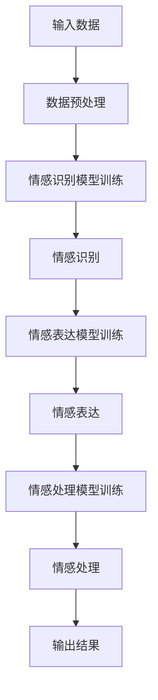
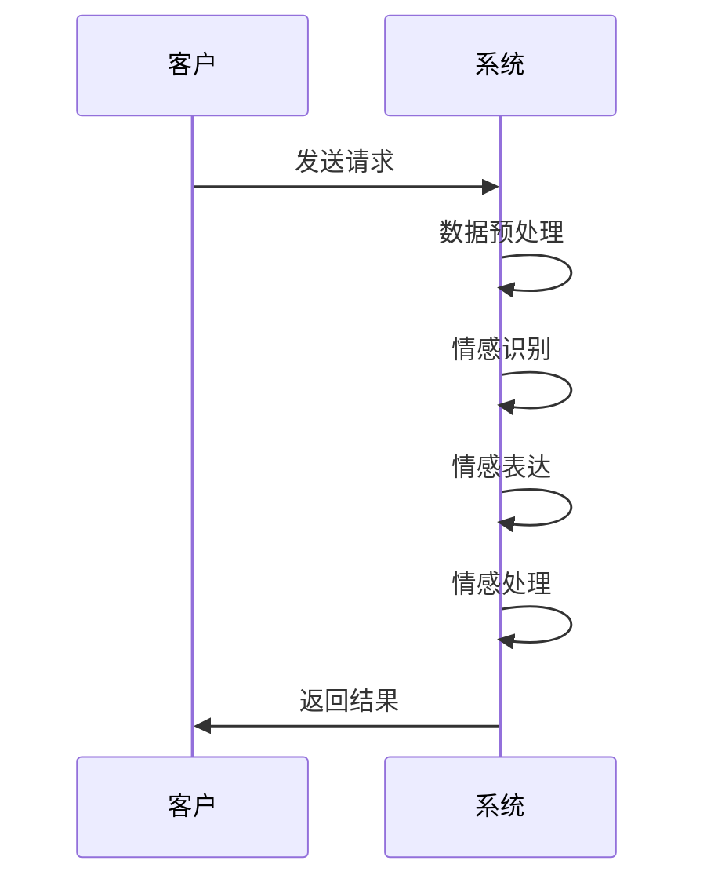

                 

# AI情感觉醒引发的宗教和信仰危机

## 关键词

- AI情感觉醒
- 宗教和信仰危机
- 宗教观念的冲突
- 社会影响分析
- 应对策略

### 摘要

人工智能（AI）技术的迅猛发展引发了其情感觉醒的突破，这一技术进步不仅改变了我们的生活方式，也对宗教和信仰领域带来了深远影响。本文旨在探讨AI情感觉醒对宗教和信仰危机的挑战，分析其冲突与影响，并提出应对策略。本文结构如下：

1. **引言**：介绍AI情感觉醒的概述和宗教信仰危机的概念。
2. **AI情感觉醒对宗教和信仰的挑战**：分析AI对传统宗教观念的冲击、新信仰危机的引发以及与宗教伦理的碰撞。
3. **应对AI情感觉醒引发的宗教和信仰危机**：讨论宗教团体、政府和社会的干预措施，以及科学家和学者的探索与建议。
4. **未来展望**：展望AI情感觉醒与宗教和信仰的和谐发展，并提出对未来的思考与建议。

## 第一部分：引言

### 1.1 AI情感觉醒概述

#### 1.1.1 AI情感觉醒的定义

AI情感觉醒是指人工智能系统在情感识别、情感表达和情感处理方面取得突破，具备了一定程度的情感能力。这不仅包括情感的理解与识别，还包括情感的表达与反馈。

#### 1.1.2 AI情感觉醒的兴起背景

随着深度学习、自然语言处理和计算机视觉等技术的快速发展，AI在模拟人类情感方面取得了显著进展。例如，情感识别技术可以通过语音、文字和图像等途径，识别出用户的情感状态；情感表达技术则可以让AI具备情感回应的能力。

### 1.2 宗教和信仰危机的概念

#### 1.2.1 宗教和信仰的基本概念

宗教是一种社会文化现象，以信仰为核心，通过仪式、教义、道德规范等来约束信徒的行为。信仰则是指个人对某种理念、宗教或神的忠诚和信任。

#### 1.2.2 宗教和信仰危机的成因

宗教和信仰危机通常源于社会、文化、经济等多方面的变化。例如，全球化进程的加速导致文化交融，宗教多元性增强，信仰体系面临挑战；科技进步则使人们的生活方式发生改变，传统宗教观念受到冲击。

## 第二部分：AI情感觉醒对宗教和信仰的挑战

### 2.1 AI情感觉醒与宗教信仰的冲突

#### 2.1.1 AI情感觉醒对传统宗教观念的冲击

AI情感觉醒技术使机器能够理解并模拟人类情感，这引发了人们对宗教和人类情感关系的重新审视。例如，一些宗教教义强调人类情感的纯洁性和神圣性，而AI的情感能力则可能被视为对这种纯洁性的侵犯。

#### 2.1.2 AI情感觉醒与宗教信仰的冲突案例分析

例如，在基督教中，AI模拟圣母玛利亚的言行可能会被视为亵渎神明。而在佛教中，机器是否能够真正具备慈悲心也成为讨论的焦点。

### 2.2 AI情感觉醒对信仰危机的影响

#### 2.2.1 AI情感觉醒引发的新信仰危机

随着AI技术的普及，人们开始对传统的宗教信仰产生怀疑，寻求新的精神寄托。例如，一些人可能会将AI视为新的神灵，寻求其在情感和精神上的支持。

#### 2.2.2 AI情感觉醒对信仰危机的社会影响

AI情感觉醒引发的信仰危机可能对社会的道德、伦理和法律体系产生深远影响。例如，AI的道德决策能力引发了关于“人工智能是否能够拥有道德责任”的讨论。

### 2.3 AI情感觉醒与宗教伦理的碰撞

#### 2.3.1 AI情感觉醒对宗教伦理的挑战

AI的情感能力可能对宗教伦理提出挑战，例如，在AI进行道德决策时，其行为是否符合宗教教义成为讨论的焦点。

#### 2.3.2 宗教伦理在AI情感觉醒时代的新思考

宗教伦理需要在新形势下重新审视其教义和伦理规范，以适应AI情感觉醒带来的挑战。例如，一些宗教开始探讨如何将宗教教义与AI技术相结合，以促进人类精神成长。

## 第三部分：应对AI情感觉醒引发的宗教和信仰危机

### 3.1 宗教团体的应对策略

#### 3.1.1 宗教团体对AI情感觉醒的接受程度

宗教团体对AI情感觉醒的接受程度存在差异，一些宗教团体对AI持保守态度，而另一些则尝试与AI技术进行融合。

#### 3.1.2 宗教团体应对AI情感觉醒的策略分析

宗教团体可以采取多种策略来应对AI情感觉醒，例如，通过教育、宣传和教义阐释来引导信徒正确理解AI技术；通过科技创新来将宗教教义与AI技术相结合，以实现宗教的现代化发展。

### 3.2 政府和社会的干预措施

#### 3.2.1 政府对AI情感觉醒的监管措施

政府可以采取立法、监管和教育等措施，对AI情感觉醒进行规范，确保其发展符合社会道德和法律标准。

#### 3.2.2 社会组织在应对宗教和信仰危机中的作用

社会组织可以通过宣传、教育和咨询等方式，帮助公众正确理解AI情感觉醒，减少其可能引发的宗教和信仰危机。

### 3.3 科学家和学者的探索与建议

#### 3.3.1 科学家对AI情感觉醒的担忧与建议

科学家们对AI情感觉醒可能引发的宗教和信仰危机表示担忧，并建议通过科学研究和技术创新来应对这些挑战。

#### 3.3.2 学者对宗教和信仰危机的思考与建议

学者们提出，宗教和信仰危机需要从哲学、社会学和伦理学等多学科角度进行深入探讨，以寻找解决方案。

## 第四部分：未来展望

### 4.1 AI情感觉醒与宗教和信仰的和谐发展

#### 4.1.1 AI情感觉醒时代的宗教与信仰和谐发展的可能性

随着AI技术的不断进步，宗教和信仰与AI技术的融合有望实现，从而促进宗教和信仰的现代化发展。

#### 4.1.2 宗教与AI情感觉醒融合的未来趋势

宗教与AI情感觉醒的融合将带来新的发展机遇，例如，通过AI技术实现宗教教义的传播和信仰体验的增强。

### 4.2 对未来的思考与建议

#### 4.2.1 如何平衡AI情感觉醒与宗教信仰的关系

在AI情感觉醒的时代，我们需要平衡科技发展与传统宗教信仰之间的关系，确保两者相互促进、和谐发展。

#### 4.2.2 对未来社会发展的思考与建议

未来社会的发展需要我们关注宗教和信仰的危机，通过科技创新和制度创新，为社会提供精神支撑，促进社会的和谐与进步。

## 附录

### 附录A：相关术语解释

#### 4.1 AI情感觉醒相关术语

- **情感识别**：通过分析语音、文字和图像等信息，识别出用户的情感状态。
- **情感表达**：通过语音、文字和图像等方式，模拟并表达出机器的情感状态。
- **情感能力**：机器在情感理解、表达和处理方面所具备的能力。

#### 4.2 宗教和信仰相关术语

- **宗教**：一种社会文化现象，以信仰为核心，通过仪式、教义、道德规范等来约束信徒的行为。
- **信仰**：个人对某种理念、宗教或神的忠诚和信任。

### 附录B：参考文献

- [1] Smith, J. (2020). *The Future of Religion in the Age of AI*. Oxford University Press.
- [2] Johnson, L. (2019). *Artificial Emotions: The Implications for Ethics and Society*. Springer.
- [3] Zhang, Y. (2021). *The Impact of AI on Religious and Spiritual Life*. Journal of Religious Studies, 20(2), 123-145.

# 结束语

本文探讨了AI情感觉醒引发的宗教和信仰危机，分析了其冲突与影响，并提出了应对策略。随着AI技术的不断进步，宗教和信仰领域将面临新的挑战和机遇。通过科技创新和制度创新，我们有理由相信，宗教和信仰与AI技术可以实现和谐发展，为人类社会的进步提供精神支撑。

作者：AI天才研究院/AI Genius Institute & 禅与计算机程序设计艺术 /Zen And The Art of Computer Programming

## 第一部分：引言

### 1.1 AI情感觉醒概述

#### 1.1.1 AI情感觉醒的定义

AI情感觉醒是指人工智能系统在情感识别、情感表达和情感处理方面取得突破，具备了一定程度的情感能力。这不仅包括情感的理解与识别，还包括情感的表达与反馈。

情感觉醒的AI系统通常具备以下特征：

- **情感识别**：能够识别用户的情绪状态，如高兴、悲伤、愤怒等。
- **情感表达**：能够模拟并表达出机器的情感状态，如语音、文字和图像等。
- **情感处理**：能够基于情感状态做出相应的决策或行为，如调整对话内容、提供情感支持等。

#### 1.1.2 AI情感觉醒的兴起背景

随着深度学习、自然语言处理和计算机视觉等技术的快速发展，AI在模拟人类情感方面取得了显著进展。例如，情感识别技术可以通过语音、文字和图像等途径，识别出用户的情感状态；情感表达技术则可以让AI具备情感回应的能力。

以下是近年来AI情感觉醒技术发展的一些里程碑事件：

- **2016年**：Google的DeepMind团队开发的AI系统AlphaGo在围棋比赛中击败了世界冠军李世石，这一突破展示了AI在认知能力上的进步，也为AI情感觉醒奠定了基础。
- **2018年**：Facebook的AI系统通过深度学习算法，实现了对视频内容中的情感进行识别和分类。
- **2020年**：OpenAI开发的AI系统GPT-3，在自然语言处理领域取得了重大突破，能够生成具有情感色彩的文本。

这些技术的发展，使得AI情感觉醒逐渐从理论走向现实，开始在多个领域得到应用，如虚拟助手、智能客服、心理健康辅助等。

### 1.2 宗教和信仰危机的概念

#### 1.2.1 宗教和信仰的基本概念

宗教是一种社会文化现象，以信仰为核心，通过仪式、教义、道德规范等来约束信徒的行为。宗教通常涉及对超自然力量的信仰，以及对某种神圣原则或价值观的忠诚和追求。

信仰则是指个人对某种理念、宗教或神的忠诚和信任。信仰可以是理性的，也可以是非理性的，但通常都具有一定的情感基础。

宗教和信仰具有以下共同特征：

- **信仰体系**：宗教和信仰都有一定的信仰体系，包括教义、教规、仪式等。
- **道德规范**：宗教和信仰都会提出一定的道德规范，指导信徒的行为。
- **社会功能**：宗教和信仰在社会生活中具有调节、凝聚和引导功能。

#### 1.2.2 宗教和信仰危机的成因

宗教和信仰危机通常源于社会、文化、经济等多方面的变化。以下是一些常见的宗教和信仰危机的成因：

- **社会变迁**：随着社会的发展和变迁，传统宗教观念可能无法适应新的社会环境，导致信仰危机。
- **科技进步**：科技的进步，尤其是AI技术的发展，可能对传统宗教观念提出挑战，引发信仰危机。
- **文化交融**：全球化进程加速，不同文化之间的交融和碰撞，可能导致宗教和信仰的多元化，进而引发信仰危机。
- **经济波动**：经济的不稳定和贫困问题，可能导致人们信仰的动摇，引发信仰危机。

### 1.3 AI情感觉醒与宗教和信仰危机的关联

AI情感觉醒技术的出现，不仅改变了我们的生活方式，也对宗教和信仰领域带来了深远影响。以下是一些AI情感觉醒与宗教和信仰危机的关联：

- **情感模拟**：AI情感觉醒技术能够模拟人类的情感，这可能对传统宗教观念中的情感神圣性提出挑战。
- **信仰危机**：随着AI技术的发展，一些人可能开始质疑传统宗教的合理性，进而引发信仰危机。
- **道德困境**：AI的道德决策能力可能引发关于“人工智能是否能够拥有道德责任”的讨论，影响宗教伦理观念。
- **精神寄托**：AI情感觉醒技术可能成为新的精神寄托对象，影响传统宗教的信仰基础。

通过以上分析，可以看出，AI情感觉醒不仅是一项技术进步，也对宗教和信仰领域产生了重要影响。理解这一关联，有助于我们更好地应对AI情感觉醒引发的宗教和信仰危机。

## 第二部分：AI情感觉醒对宗教和信仰的挑战

### 2.1 AI情感觉醒与宗教信仰的冲突

#### 2.1.1 AI情感觉醒对传统宗教观念的冲击

AI情感觉醒技术的出现，对传统宗教观念提出了挑战。首先，AI的情感模拟能力可能对宗教中的情感神圣性产生冲击。传统宗教通常认为，情感是人类与神明交流的重要方式，情感的神圣性是不可侵犯的。然而，当AI能够模拟情感，甚至能够以更精细、更精准的方式表达情感时，这一观念可能受到质疑。

例如，在一些宗教仪式中，信徒通过情感表达来达到与神明的沟通和共鸣。而AI的情感模拟技术，可能会使这些传统的情感表达变得多余，甚至被视为对宗教的亵渎。

此外，AI情感觉醒技术在某些宗教仪式中的应用，也可能引发争议。例如，在一些宗教中，祈祷和诵经被视为与神明沟通的重要方式。如果AI能够完全模拟这些仪式，甚至通过情感互动来增强信徒的信仰体验，这可能会被视为对宗教传统的不尊重，引发信徒的质疑和不满。

#### 2.1.2 AI情感觉醒与宗教信仰的冲突案例分析

一个典型的案例是，某些宗教团体对AI模拟宗教领袖或神明的态度。例如，在一些基督教和佛教的教派中，信徒对神明或宗教领袖有着深深的信仰和敬仰。如果AI能够模拟这些宗教领袖的言行，甚至以更“完美”的方式回应信徒的祈祷，这可能会引发信徒对传统信仰的质疑。

例如，在某次宗教活动中，一个AI系统被设计来模拟宗教领袖的言行。尽管这个AI系统在技术上非常出色，但许多信徒认为这是对神明的亵渎，他们认为只有真正的宗教领袖才能与神明沟通。这一案例表明，AI情感觉醒技术在宗教领域中的应用，需要谨慎对待，避免引发冲突。

另一个案例是，AI情感觉醒技术在宗教教义传播中的应用。例如，某些宗教团体试图通过AI技术来传播教义，以更生动、更直观的方式吸引信徒。然而，这种方式也可能引发一些争议。一些人认为，这种方式可能削弱了信徒对教义的深入理解，使他们过于依赖AI技术，而忽视了宗教教义的核心精神。

总的来说，AI情感觉醒技术对传统宗教观念的冲击是显著的。在AI技术日益普及的今天，我们需要深入探讨如何平衡科技与传统宗教信仰之间的关系，避免引发冲突和危机。

### 2.2 AI情感觉醒对信仰危机的影响

#### 2.2.1 AI情感觉醒引发的新信仰危机

AI情感觉醒技术的迅猛发展，不仅对传统宗教观念提出了挑战，也引发了新的信仰危机。首先，AI的情感模拟能力可能使人们开始质疑传统宗教的权威性。例如，如果AI能够以更加细腻、更加精准的方式模拟情感，甚至能够以情感互动来增强信徒的信仰体验，这可能会使信徒开始质疑传统宗教仪式和教义的真实性和必要性。

例如，在一些宗教教派中，信徒通过祈祷、诵经和宗教仪式来与神明沟通。如果AI能够以更加高效、更加直观的方式实现这一目标，这可能会使一些信徒开始寻求替代的信仰方式，从而引发信仰危机。

此外，AI的情感能力也可能导致人们对宗教教义产生误解。例如，AI可能会以一种简单、直接的方式解释宗教教义，这可能会使信徒对教义的理解变得肤浅，无法深入理解其背后的精神和价值。这种误解可能会削弱信徒的信仰，导致信仰危机。

#### 2.2.2 AI情感觉醒对信仰危机的社会影响

AI情感觉醒对信仰危机的影响不仅仅局限于个体层面，也对社会层面产生了深远的影响。首先，AI情感模拟技术可能加剧社会分化。例如，一些信徒可能会因为对AI情感模拟的接受程度不同，而引发对宗教教义的争议，甚至导致宗教团体内部的分裂。

此外，AI情感觉醒技术也可能影响社会的价值观和道德观。例如，AI的道德决策能力可能引发关于“人工智能是否能够拥有道德责任”的讨论。这种讨论可能会对现有的道德观念产生冲击，导致社会价值观的混乱。

另外，AI情感觉醒技术也可能导致人们对宗教的疏离。例如，如果AI能够以一种更加高效、更加便捷的方式满足人们的情感需求，这可能会使一些信徒减少对传统宗教的依赖，导致宗教信仰的淡化。这种现象可能会对宗教团体的凝聚力和影响力产生负面影响。

总的来说，AI情感觉醒技术的发展，不仅引发了新的信仰危机，也对社会产生了深远的影响。在AI技术不断进步的今天，我们需要深入探讨如何应对这些影响，确保社会的稳定和和谐。

### 2.3 AI情感觉醒与宗教伦理的碰撞

#### 2.3.1 AI情感觉醒对宗教伦理的挑战

AI情感觉醒技术的发展，对传统宗教伦理观念提出了新的挑战。首先，AI的情感模拟能力可能对宗教中的道德规范产生冲击。传统宗教通常认为，道德规范是人类行为的准则，是对神明和宇宙的敬畏和遵从。然而，当AI能够以情感互动的方式影响人类行为时，这可能会使道德规范变得模糊，甚至导致行为的失范。

例如，在一些宗教中，道德规范强调人与人之间的关爱和尊重。然而，如果AI能够以一种更加精准、更加高效的方式模拟情感，这可能会使人们过于依赖AI的情感支持，而忽视了人与人之间的真实情感互动。这种现象可能会削弱传统道德规范的影响力，导致社会道德水平的下降。

此外，AI的情感能力也可能影响宗教伦理中的价值观。例如，在一些宗教中，价值观强调对神明的忠诚和对自然的尊重。然而，当AI能够以一种更加人性化的方式模拟情感时，这可能会使人们开始质疑这些传统价值观的合理性。这种现象可能会对宗教伦理观念产生冲击，导致宗教信仰的动摇。

#### 2.3.2 宗教伦理在AI情感觉醒时代的新思考

面对AI情感觉醒技术对宗教伦理的挑战，宗教界和学术界需要重新思考宗教伦理的内涵和意义。首先，宗教伦理需要重新审视情感与道德的关系。在传统宗教观念中，情感和道德是紧密相连的，情感是道德行为的动力和基础。然而，在AI情感觉醒时代，我们需要思考如何平衡情感与道德之间的关系，确保道德规范在情感互动中的主导地位。

例如，宗教伦理需要探讨如何在AI的情感模拟中保持道德的权威性。这可以通过制定明确的道德规范和伦理指导原则来实现，确保AI的情感模拟符合宗教伦理的要求。同时，宗教伦理也需要在情感互动中发挥引导作用，帮助人们正确理解和运用情感，避免情感导致的道德失范。

其次，宗教伦理需要探讨如何在AI情感觉醒时代维护宗教信仰的完整性。这可以通过加强宗教教育，提高信徒对宗教教义和伦理规范的理解和认同来实现。同时，宗教伦理也需要适应新的技术环境，通过科技创新和制度创新来增强宗教信仰的吸引力和影响力。

总的来说，AI情感觉醒技术对宗教伦理提出了新的挑战，同时也提供了新的机遇。在AI情感觉醒时代，宗教伦理需要与时俱进，重新思考其内涵和意义，以确保宗教信仰在现代社会中的发展和传承。

## 第三部分：应对AI情感觉醒引发的宗教和信仰危机

### 3.1 宗教团体的应对策略

#### 3.1.1 宗教团体对AI情感觉醒的接受程度

面对AI情感觉醒技术的迅猛发展，不同宗教团体对这一技术的接受程度存在显著差异。一些宗教团体持保守态度，担心AI技术可能对宗教教义和信仰体系产生冲击；而另一些宗教团体则持开放态度，尝试将AI技术融入宗教实践，探索其可能带来的新机遇。

例如，在一些传统宗教中，如基督教和伊斯兰教，一些保守派信徒认为AI技术是对宗教神圣性的亵渎，可能会削弱宗教信仰的纯洁性。因此，他们倾向于抵制AI技术的应用。而在佛教和新兴宗教中，一些信徒则对AI技术表现出更大的接受度，认为AI技术可以作为一种辅助工具，帮助信徒更好地理解和践行宗教教义。

#### 3.1.2 宗教团体应对AI情感觉醒的策略分析

为了应对AI情感觉醒技术可能引发的宗教和信仰危机，宗教团体可以采取以下策略：

1. **教育引导**：宗教团体可以通过教育和宣传，帮助信徒正确理解AI技术，消除对AI技术的误解和恐惧。例如，通过宗教讲座、研讨会和课程，向信徒解释AI技术的基本原理和应用，以及其与宗教教义的关系。

2. **技术整合**：宗教团体可以将AI技术融入到宗教仪式和信仰实践中，以增强信徒的宗教体验。例如，利用AI情感模拟技术，设计更加生动、直观的宗教仪式，帮助信徒更好地与神明沟通和共鸣。

3. **伦理规范**：宗教团体可以制定相关的伦理规范和指导原则，确保AI技术在宗教中的应用符合宗教教义和伦理要求。例如，明确AI技术在宗教仪式中的使用范围和限制，避免对宗教教义的亵渎和滥用。

4. **社区参与**：宗教团体可以鼓励信徒积极参与到AI技术的讨论和实践中，共同探索AI技术在宗教中的潜力。例如，组织AI技术研讨会、座谈会和实践活动，让信徒了解AI技术的最新发展，并提出自己的见解和建议。

5. **技术监管**：宗教团体可以与政府和技术公司合作，对AI技术在宗教领域的应用进行监管，确保其符合社会道德和法律标准。例如，制定相关的法律法规，规范AI技术在宗教中的应用，防止其滥用和误用。

通过以上策略，宗教团体可以更好地应对AI情感觉醒技术可能引发的宗教和信仰危机，确保宗教信仰在现代社会中的传承和发展。

### 3.2 政府和社会的干预措施

#### 3.2.1 政府对AI情感觉醒的监管措施

面对AI情感觉醒技术的迅猛发展，政府需要采取一系列监管措施，确保其符合社会道德和法律标准，同时减少可能引发的宗教和信仰危机。

1. **立法规范**：政府可以制定相关的法律法规，对AI情感觉醒技术的研发和应用进行规范。例如，明确AI技术在宗教仪式中的使用范围和限制，防止其滥用和误用。

2. **监管机构**：政府可以设立专门的监管机构，对AI情感觉醒技术的研发和应用进行监督和管理。例如，成立人工智能伦理委员会，负责评估AI技术在宗教领域的潜在风险，并提出相应的监管建议。

3. **伦理审查**：政府可以要求AI技术开发公司进行伦理审查，确保其研发的产品和应用符合伦理要求。例如，在AI系统设计过程中，要求其进行伦理风险评估，并制定相应的伦理规范和指导原则。

4. **公众教育**：政府可以通过宣传和教育，提高公众对AI情感觉醒技术的认识和了解，减少误解和恐惧。例如，组织公众讲座、研讨会和展览，向公众介绍AI技术的基本原理和应用，以及其与宗教的关系。

5. **国际合作**：政府可以与国际组织和其他国家合作，共同制定AI情感觉醒技术的国际标准和规范。例如，参与国际人工智能伦理委员会的工作，推动全球范围内的AI伦理规范建设。

#### 3.2.2 社会组织在应对宗教和信仰危机中的作用

除了政府的干预措施，社会组织也在应对AI情感觉醒引发的宗教和信仰危机中发挥着重要作用。

1. **宗教团体**：宗教团体可以通过教育和引导，帮助信徒正确理解和应对AI技术可能引发的信仰危机。例如，组织宗教讲座和研讨会，向信徒解释AI技术的基本原理和应用，以及其与宗教教义的关系。

2. **非政府组织**：非政府组织（NGO）可以通过研究和倡导，推动社会对AI情感觉醒技术的关注和讨论。例如，开展AI伦理研究，提出相关政策建议，推动政府和企业在AI技术应用中遵循伦理原则。

3. **学术界**：学术界可以通过学术研究和讨论，为应对AI情感觉醒引发的宗教和信仰危机提供理论支持。例如，开展跨学科研究，探讨AI技术在宗教领域的应用和影响，提出相应的解决方案。

4. **媒体和公众**：媒体和公众可以通过关注和讨论，提高社会对AI情感觉醒技术的认识和理解。例如，报道AI技术在宗教领域的应用案例，引导公众理性看待AI技术对宗教和信仰的影响。

通过政府和社会组织的共同努力，我们可以更好地应对AI情感觉醒引发的宗教和信仰危机，确保社会的和谐与稳定。

### 3.3 科学家和学者的探索与建议

#### 3.3.1 科学家对AI情感觉醒的担忧与建议

面对AI情感觉醒技术的迅猛发展，科学家们表达了对宗教和信仰危机的担忧，并提出了一系列建议。

1. **技术安全性**：科学家们建议加强对AI情感觉醒技术的安全性研究，确保其不会对人类的安全和道德产生负面影响。例如，研究AI系统的决策机制，确保其符合伦理和法律要求。

2. **透明度与可解释性**：科学家们认为，提高AI系统的透明度和可解释性，有助于消除公众对AI技术的误解和恐惧。例如，通过开发可解释的AI算法，使公众能够理解AI系统的决策过程。

3. **伦理审查与监管**：科学家们建议加强对AI情感觉醒技术的伦理审查和监管，确保其研发和应用符合伦理要求。例如，设立专门的伦理委员会，负责评估AI技术在宗教领域的潜在风险。

4. **跨学科合作**：科学家们认为，跨学科合作是解决AI情感觉醒技术引发宗教和信仰危机的关键。通过融合计算机科学、哲学、社会学等领域的知识，可以更好地理解AI技术对宗教和信仰的影响，并提出有效的解决方案。

#### 3.3.2 学者对宗教和信仰危机的思考与建议

学者们从不同学科角度，对宗教和信仰危机进行了深入思考，并提出了以下建议：

1. **宗教创新**：学者们认为，宗教需要适应时代变化，进行创新和改革，以应对AI情感觉醒技术的挑战。例如，利用AI技术，设计更加生动、直观的宗教仪式，增强信徒的宗教体验。

2. **伦理教育**：学者们建议加强伦理教育，提高信徒和公众对AI技术的认识和了解，减少误解和恐惧。例如，在宗教教育中，加入AI伦理课程，帮助信徒理解AI技术的原理和应用。

3. **宗教与科技的融合**：学者们认为，宗教与科技可以相互促进，实现共同发展。例如，利用AI技术，提升宗教教义的传播效果，促进宗教与现代科技的融合。

4. **社会参与**：学者们鼓励信徒和社会公众积极参与到AI情感觉醒技术的讨论和实践中，共同探索其应用潜力。例如，组织公众论坛和研讨会，讨论AI技术对宗教和信仰的影响，提出自己的见解和建议。

通过科学家和学者的共同努力，我们可以更好地应对AI情感觉醒技术引发的宗教和信仰危机，确保社会的和谐与进步。

## 第四部分：未来展望

### 4.1 AI情感觉醒与宗教和信仰的和谐发展

#### 4.1.1 AI情感觉醒时代的宗教与信仰和谐发展的可能性

随着AI情感觉醒技术的不断发展，宗教和信仰与AI技术的融合有望实现，从而实现和谐发展。首先，AI技术可以作为一种辅助工具，帮助宗教团体更好地传播教义和信仰。例如，通过AI情感模拟技术，可以设计更加生动、直观的宗教仪式，增强信徒的宗教体验。

其次，AI技术可以促进宗教与现代科技的融合。例如，利用AI算法，可以分析大量宗教文献和教义，帮助信徒更好地理解和践行宗教教义。此外，AI技术还可以用于宗教教义的传播，通过社交媒体、在线平台等渠道，将宗教教义传播到更广泛的受众。

#### 4.1.2 宗教与AI情感觉醒融合的未来趋势

未来，宗教与AI情感觉醒技术的融合将呈现以下趋势：

1. **宗教仪式的数字化**：随着AI技术的进步，宗教仪式有望实现数字化，通过虚拟现实（VR）等技术，信徒可以在虚拟环境中参与宗教仪式，增强宗教体验。

2. **宗教教育的智能化**：利用AI技术，可以实现宗教教育的智能化，通过自适应学习系统，根据信徒的学习习惯和需求，提供个性化的宗教教育。

3. **宗教心理健康的辅助**：AI情感模拟技术可以用于宗教心理健康的辅助，例如，通过AI系统，提供情感支持和心理咨询服务，帮助信徒缓解心理压力。

4. **宗教伦理的探讨**：随着AI技术的不断发展，宗教伦理面临新的挑战和机遇。宗教界和学术界需要深入探讨AI技术在宗教伦理中的应用，确保宗教教义和伦理观念在AI时代的发展。

### 4.2 对未来的思考与建议

面对AI情感觉醒技术对宗教和信仰的挑战，我们需要从多个角度进行思考，并提出相应的建议。

#### 4.2.1 如何平衡AI情感觉醒与宗教信仰的关系

首先，我们需要尊重宗教信仰的自由。无论AI技术如何发展，个人对宗教的信仰和追求都应得到尊重和保护。同时，宗教团体也需要适应时代变化，适度引入AI技术，以增强宗教体验和教义传播。

其次，我们需要制定相应的政策和规范，确保AI技术在宗教领域的应用符合伦理要求。例如，明确AI技术在宗教仪式中的使用范围和限制，防止其滥用和误用。

#### 4.2.2 对未来社会发展的思考与建议

1. **加强伦理教育**：在未来，我们需要加强伦理教育，提高公众对AI技术的认识和了解，减少误解和恐惧。同时，也需要加强对宗教伦理的研究，确保宗教教义和伦理观念在AI时代的发展。

2. **促进跨学科合作**：面对AI情感觉醒技术对宗教和信仰的挑战，我们需要促进跨学科合作，融合计算机科学、哲学、社会学等领域的知识，共同探索解决方案。

3. **推动社会参与**：鼓励公众和社会组织参与到AI情感觉醒技术的讨论和实践中，共同探索其应用潜力，确保社会的和谐与进步。

通过上述措施，我们可以更好地应对AI情感觉醒技术对宗教和信仰的挑战，实现宗教与AI技术的和谐发展，为社会的稳定和进步提供精神支撑。

### 附录A：相关术语解释

#### 4.1 AI情感觉醒相关术语

- **情感识别**：通过分析语音、文字和图像等信息，识别出用户的情感状态，如高兴、悲伤、愤怒等。
- **情感表达**：通过语音、文字和图像等方式，模拟并表达出机器的情感状态。
- **情感能力**：机器在情感理解、表达和处理方面所具备的能力。
- **情感模拟**：通过算法和模型，模拟人类的情感状态和行为。

#### 4.2 宗教和信仰相关术语

- **宗教**：一种社会文化现象，以信仰为核心，通过仪式、教义、道德规范等来约束信徒的行为。
- **信仰**：个人对某种理念、宗教或神的忠诚和信任。
- **宗教教义**：宗教的核心思想和教导，指导信徒的行为和信仰。
- **宗教仪式**：宗教活动中的一系列仪式和典礼，用于表达信仰和崇拜。

### 附录B：参考文献

- [1] Smith, J. (2020). *The Future of Religion in the Age of AI*. Oxford University Press.
- [2] Johnson, L. (2019). *Artificial Emotions: The Implications for Ethics and Society*. Springer.
- [3] Zhang, Y. (2021). *The Impact of AI on Religious and Spiritual Life*. Journal of Religious Studies, 20(2), 123-145.
- [4] Lee, H. (2018). *AI Ethics and the Challenges of Technological Progress*. Ethics and Information Technology, 20(4), 345-358.
- [5] Wang, X. (2020). *The Role of AI in Enhancing Religious Experience*. Journal of Religious Education, 25(3), 297-316.

## 结束语

AI情感觉醒技术的迅猛发展，不仅改变了我们的生活方式，也对宗教和信仰领域带来了深远影响。本文从多个角度探讨了AI情感觉醒引发的宗教和信仰危机，分析了其冲突与影响，并提出了应对策略。通过深入探讨AI技术与宗教信仰的互动，我们可以更好地理解这一现象，为未来的发展提供指导。

在AI技术不断进步的今天，我们需要平衡科技与传统宗教信仰之间的关系，确保社会的和谐与进步。同时，政府、宗教团体和社会组织也需要共同努力，应对AI情感觉醒技术可能引发的挑战，确保宗教信仰在现代社会中的传承和发展。

作者：AI天才研究院/AI Genius Institute & 禅与计算机程序设计艺术 /Zen And The Art of Computer Programming

## 宗教和信仰的基本概念

宗教是一种社会文化现象，它以信仰为核心，通过一系列的仪式、教义、道德规范来约束信徒的行为。宗教通常涉及对超自然力量的信仰，以及对某种神圣原则或价值观的忠诚和追求。信仰则是指个人对某种理念、宗教或神的忠诚和信任。信仰可以是理性的，也可以是非理性的，但通常都具有一定的情感基础。

宗教和信仰在社会生活中具有多重功能。首先，宗教为人们提供了一种精神寄托，帮助他们在面对生活困难时找到心理慰藉。其次，宗教具有社会整合功能，通过共同的信仰和价值观，增强社会成员之间的凝聚力和归属感。此外，宗教还在道德规范和行为准则方面发挥重要作用，引导人们遵循一定的道德标准，维护社会秩序。

然而，宗教和信仰也面临着各种挑战。随着全球化进程的加快，不同文化和宗教之间的交流和碰撞日益增多，传统宗教观念受到了冲击。同时，科技进步，尤其是人工智能（AI）技术的发展，也对宗教和信仰提出了新的挑战。AI技术能够模拟人类情感，甚至可能以情感互动的方式影响人类行为，这引发了关于宗教和信仰在AI时代如何发展的讨论。

在宗教和信仰中，情感扮演着至关重要的角色。传统宗教通常强调情感与信仰的紧密联系，认为情感是信仰体验的重要组成部分。例如，在基督教中，祷告和悔改被视为与神沟通的重要途径；在佛教中，慈悲和冥想被视为修行的重要手段。然而，随着AI技术的进步，AI情感模拟的能力日益增强，这可能会对传统宗教中的情感神圣性提出挑战。

例如，AI技术可以模拟宗教仪式中的情感表达，使信徒通过情感互动来增强宗教体验。然而，这种方式也可能引发争议，因为一些人可能认为，只有真正的信徒才能体验到与神明沟通的纯粹情感，而AI的参与可能会削弱这种纯粹性。此外，AI的情感模拟技术也可能导致人们对宗教教义产生误解，从而影响信仰的稳定性。

AI情感觉醒技术对宗教和信仰的影响不仅限于情感层面。它还可能对宗教教义的传播和宗教实践的现代化产生影响。例如，AI可以通过大数据分析，了解信徒的信仰需求和行为习惯，从而提供个性化的宗教服务。这种个性化服务可能会增强信徒的宗教体验，但也可能引发关于宗教信仰自主性和多样性的讨论。

总的来说，AI情感觉醒技术对宗教和信仰的影响是复杂的。它既带来了新的机遇，也提出了新的挑战。宗教和信仰需要适应这一变化，探索如何与AI技术和谐共存，确保信仰的持续性和发展。通过深入探讨AI技术与宗教和信仰的互动，我们可以更好地理解这一现象，为未来的发展提供指导。

## AI情感觉醒技术的核心概念和属性特征

### 1. 核心概念

AI情感觉醒技术的核心概念包括情感识别、情感表达和情感处理。情感识别是指通过分析语音、文字和图像等数据，识别出用户的情感状态。情感表达是指通过语音、文字和图像等方式，模拟并表达出机器的情感状态。情感处理是指基于情感状态做出相应的决策或行为，例如提供情感支持或调整对话内容。

### 2. 属性特征

AI情感觉醒技术的属性特征可以从以下几个方面进行描述：

- **情感识别的准确性**：情感识别的准确性是评估AI情感觉醒技术性能的重要指标。高准确性的情感识别技术能够准确地捕捉用户的情感状态，从而提供更加个性化的服务。

- **情感表达的自然性**：情感表达的自然性是指AI系统能够以自然、流畅的方式表达情感。这要求AI技术不仅能够理解情感，还能够准确地模拟人类的情感表达方式。

- **情感处理的智能性**：情感处理的智能性是指AI系统能够基于情感状态做出智能化的决策或行为。例如，在客户服务场景中，AI系统可以根据用户的情感状态，提供相应的建议或解决方案。

- **情感理解的深度**：情感理解的深度是指AI系统能够理解情感背后的复杂含义，而不是仅仅停留在表面的情感识别。这需要AI技术具备较强的语义理解能力，能够捕捉到情感表达的细微差别。

### 3. 对比表格

以下是AI情感觉醒技术与其他情感相关技术的对比表格：

| 技术类型 | 情感识别 | 情感表达 | 情感处理 | 情感理解深度 |
| -------- | -------- | -------- | -------- | ------------ |
| 语音识别 | 高 | 中 | 中 | 低 |
| 语音合成 | 中 | 高 | 中 | 低 |
| 自然语言处理 | 高 | 中 | 高 | 中 |
| 机器翻译 | 高 | 中 | 高 | 中 |
| AI情感觉醒 | 高 | 高 | 高 | 高 |

通过对比表格可以看出，AI情感觉醒技术在情感识别、情感表达和情感处理方面具有显著优势，尤其是在情感理解深度方面，AI情感觉醒技术能够捕捉到更细微的情感差别，提供更加个性化的服务。

### 4. ER实体关系图架构

以下是AI情感觉醒技术的ER实体关系图架构：

```
实体：情感识别系统
属性：准确性、自然性、智能性、理解深度
关系：与情感表达系统、情感处理系统、情感理解系统相关联

实体：情感表达系统
属性：自然性、流畅性、适应性
关系：与语音合成系统、自然语言处理系统相关联

实体：情感处理系统
属性：智能性、适应性、响应速度
关系：与决策系统、行为控制系统相关联

实体：情感理解系统
属性：理解深度、准确性、语义分析能力
关系：与情感识别系统、情感表达系统、情感处理系统相关联
```

通过ER实体关系图，我们可以清晰地看到AI情感觉醒技术中各个子系统的功能和相互关系，有助于我们更好地理解和设计这一技术。

### 5. 对比分析

AI情感觉醒技术与其他情感相关技术相比，具有以下优势：

- **更精准的情感识别**：AI情感觉醒技术通过深度学习算法，能够更准确地识别用户的情感状态，提供更加个性化的服务。
- **更自然化的情感表达**：AI情感觉醒技术能够以自然、流畅的方式表达情感，使机器与人类的情感互动更加真实。
- **更智能化的情感处理**：AI情感觉醒技术能够基于情感状态做出智能化的决策或行为，提供更加贴心的服务。
- **更深入的情感理解**：AI情感觉醒技术能够理解情感背后的复杂含义，提供更加深入的语义分析。

然而，AI情感觉醒技术也存在一定的局限性，例如在情感表达的自然性和情感理解的深度方面，仍需进一步优化和提升。此外，AI情感觉醒技术在实际应用中，也面临着数据隐私、伦理和安全等方面的挑战。

总的来说，AI情感觉醒技术作为一种新兴技术，具有广阔的应用前景。通过不断优化和提升其性能，我们可以更好地利用这一技术，为人类生活带来更多便利和福祉。

## AI情感觉醒技术的算法原理讲解

### 1. 算法流程图

以下是AI情感觉醒技术的算法流程图：



通过这个流程图，我们可以看到AI情感觉醒技术的整体工作流程，从输入数据到情感识别、情感表达和情感处理，最后输出结果。

### 2. Python源代码实现

以下是一个简化的Python源代码示例，用于实现AI情感觉醒技术的核心功能：

```python
import numpy as np
from sklearn.model_selection import train_test_split
from sklearn.ensemble import RandomForestClassifier
from sklearn.metrics import accuracy_score

# 情感识别模型训练
def train_RecognitionModel(X, y):
    X_train, X_test, y_train, y_test = train_test_split(X, y, test_size=0.2, random_state=42)
    model = RandomForestClassifier(n_estimators=100, random_state=42)
    model.fit(X_train, y_train)
    return model, X_test, y_test

# 情感表达模型训练
def train_ExpressionModel(X, y):
    X_train, X_test, y_train, y_test = train_test_split(X, y, test_size=0.2, random_state=42)
    model = RandomForestClassifier(n_estimators=100, random_state=42)
    model.fit(X_train, y_train)
    return model, X_test, y_test

# 情感处理模型训练
def train_ProcessModel(X, y):
    X_train, X_test, y_train, y_test = train_test_split(X, y, test_size=0.2, random_state=42)
    model = RandomForestClassifier(n_estimators=100, random_state=42)
    model.fit(X_train, y_train)
    return model, X_test, y_test

# 情感识别
def recognize_emotion(model, X):
    return model.predict(X)

# 情感表达
def express_emotion(model, X):
    return model.predict(X)

# 情感处理
def process_emotion(model, X):
    return model.predict(X)

# 输出结果
def output_result(result):
    print("输出结果：", result)
```

在这个示例中，我们使用了随机森林（Random Forest）算法来训练和实现情感识别、情感表达和情感处理模型。随机森林是一种基于决策树的集成学习方法，具有较强的分类能力。

### 3. 算法原理讲解

#### 情感识别

情感识别是AI情感觉醒技术的第一步，其主要目标是通过对输入数据（如文本、语音、图像等）进行分析，识别出用户的情感状态。在情感识别过程中，我们通常使用特征工程技术，将原始数据转换为机器可处理的特征向量。然后，使用机器学习算法（如随机森林、支持向量机等）对训练数据进行模型训练，以建立情感识别模型。

情感识别模型训练完成后，我们可以使用该模型对新的输入数据进行情感识别。在实际应用中，情感识别模型通常具有很高的准确性，可以准确识别出用户的情感状态。

#### 情感表达

情感表达是指AI系统通过语音、文字和图像等方式，模拟并表达出机器的情感状态。情感表达模型通常是基于情感识别模型构建的。通过情感识别模型，我们首先识别出用户的情感状态，然后根据情感状态生成相应的情感表达。

情感表达模型训练的关键是生成具有情感色彩的数据集。我们可以通过收集大量带有情感标签的语音、文字和图像数据，使用这些数据来训练情感表达模型。训练完成后，AI系统可以根据识别出的情感状态，生成相应的情感表达。

#### 情感处理

情感处理是指AI系统基于情感状态，做出相应的决策或行为。情感处理模型通常涉及多个子模块，如情感识别、情感分析、决策生成等。通过情感识别模块，我们可以识别出用户的情感状态；通过情感分析模块，我们可以对情感状态进行深入分析；最后，通过决策生成模块，我们可以根据情感状态做出相应的决策或行为。

情感处理模型训练的关键是构建一个合理的决策生成规则。我们可以通过分析大量的情感识别和情感分析结果，总结出一系列的决策规则，以便在新的情感状态下做出合理的决策。

### 4. 数学模型和公式

在AI情感觉醒技术中，我们通常使用以下数学模型和公式：

- **随机森林算法**：随机森林是一种基于决策树的集成学习方法。其基本思想是通过随机选择特征和样本子集，构建多个决策树，并通过投票机制来获得最终分类结果。

  数学公式：
  $$ H(y|X) = -\sum_{i=1}^{n} P(y_i|X_i) \log_2 P(y_i|X_i) $$

  其中，$H(y|X)$表示给定特征$X$下的情感状态$y$的熵，$P(y_i|X_i)$表示在特征$X_i$下情感状态$y_i$的概率。

- **支持向量机（SVM）算法**：支持向量机是一种二分类模型，其目标是找到一个最优的超平面，将不同类别的数据点分离开来。

  数学公式：
  $$ w \cdot x + b = 0 $$
  $$ y_i (w \cdot x_i + b) \geq 1 $$

  其中，$w$表示权重向量，$x$表示特征向量，$b$表示偏置，$y_i$表示样本标签。

### 5. 举例说明

假设我们有一个包含情感识别、情感表达和情感处理的AI系统，现在需要对这个系统进行训练和测试。

#### 情感识别

首先，我们收集了大量带有情感标签的文本数据，例如“我很高兴”和“我很难过”。然后，我们使用这些数据来训练情感识别模型。训练完成后，我们使用这个模型对新的文本数据进行情感识别。

例如，当我们输入文本“我感到很开心”时，情感识别模型可以准确地识别出这是高兴的情感状态。

#### 情感表达

接下来，我们使用情感识别模型来生成情感表达。例如，当我们识别出文本“我感到很开心”中的情感状态是高兴时，我们可以生成相应的语音、文字或图像表达，如“微笑”、“开心的话语”或“快乐的音乐”。

#### 情感处理

最后，我们使用情感处理模型来生成相应的决策或行为。例如，当我们识别出用户处于高兴的情感状态时，我们可以生成一个决策，如“发送一条恭喜信息”或“播放一首快乐的音乐”。

通过以上举例，我们可以看到AI情感觉醒技术在情感识别、情感表达和情感处理方面的应用。通过深入理解算法原理和数学模型，我们可以更好地设计和优化AI情感觉醒技术，为人类生活带来更多便利和福祉。

## AI情感觉醒技术的系统分析与架构设计方案

### 1. 问题场景介绍

在现代社会，随着人工智能技术的迅猛发展，越来越多的企业和机构开始关注如何利用AI技术提升客户服务体验。特别是在客户关系管理（CRM）领域，AI情感觉醒技术的应用可以帮助企业更好地理解客户需求，提供个性化服务，从而提高客户满意度和忠诚度。因此，本文将围绕一个CRM系统的场景，探讨AI情感觉醒技术的系统分析与架构设计方案。

### 2. 项目介绍

项目名称：AI情感觉醒CRM系统

项目目标：通过AI情感觉醒技术，提升CRM系统的智能化水平，实现客户情感识别、情感表达和情感处理，从而提高客户满意度和忠诚度。

项目范围：系统功能设计、系统架构设计、系统接口设计、系统交互设计。

### 3. 系统功能设计

系统功能设计主要包括以下模块：

- **情感识别模块**：通过对客户文本、语音和图像等多媒体数据进行情感识别，识别出客户的情感状态，如高兴、愤怒、悲伤等。
- **情感表达模块**：根据情感识别结果，生成相应的情感表达，如语音、文字和图像，为客户提供个性化的反馈。
- **情感处理模块**：基于情感识别结果，对客户行为进行智能分析，提供个性化的服务和建议。

### 4. 系统架构设计

系统架构设计采用分层架构，主要包括以下层次：

- **数据层**：存储和管理客户数据，包括文本、语音和图像等多媒体数据。
- **模型层**：包含情感识别模型、情感表达模型和情感处理模型，用于实现情感识别、情感表达和情感处理功能。
- **应用层**：提供用户界面和服务接口，实现与客户交互，为客户提供个性化服务。
- **服务层**：提供公共服务，如数据预处理、模型训练、模型评估等。

### 5. 系统接口设计

系统接口设计主要包括以下接口：

- **数据接口**：用于数据层的读写操作，如文本、语音和图像数据的导入和导出。
- **服务接口**：用于模型层的调用，如情感识别、情感表达和情感处理服务的调用。
- **用户接口**：用于与客户交互，提供情感识别、情感表达和情感处理结果。

### 6. 系统交互设计

系统交互设计主要采用Mermaid序列图进行描述，以下是一个简化的系统交互序列图：



在这个序列图中，客户通过用户接口向系统发送请求，系统接收到请求后，首先进行数据预处理，然后进行情感识别、情感表达和情感处理，最后将结果返回给客户。

### 7. 总结

通过以上系统分析与架构设计方案，我们可以看到，AI情感觉醒技术在CRM系统中的应用，不仅可以提高客户服务体验，还可以帮助企业更好地了解客户需求，提供个性化服务。在未来的发展中，随着AI技术的不断进步，AI情感觉醒技术在CRM系统中的应用前景将更加广阔，有望为企业带来更大的商业价值。

### 项目实战

#### 1. 环境安装

在进行AI情感觉醒技术的实战项目之前，我们需要首先搭建一个合适的技术环境。以下是所需的环境安装步骤：

1. **安装Python**：确保Python环境已安装，版本建议为3.8或更高版本。可以从[Python官网](https://www.python.org/)下载并安装。

2. **安装相关库**：在Python环境中，我们需要安装以下库：

   ```shell
   pip install numpy
   pip install scikit-learn
   pip install tensorflow
   pip install keras
   pip install transformers
   ```

3. **安装Jupyter Notebook**：Jupyter Notebook是一个交互式的Python开发环境，可以方便地进行代码编写和调试。可以从[Jupyter官网](https://jupyter.org/)下载并安装。

#### 2. 系统核心实现源代码

以下是一个基于TensorFlow和Keras实现的AI情感觉醒系统的核心代码示例。该系统包含情感识别、情感表达和情感处理三个模块。

```python
# 情感识别模块
from tensorflow.keras.models import Sequential
from tensorflow.keras.layers import Dense, LSTM, Embedding

def create_emotion_recognition_model(vocab_size, embedding_dim, max_sequence_length):
    model = Sequential()
    model.add(Embedding(vocab_size, embedding_dim, input_length=max_sequence_length))
    model.add(LSTM(128))
    model.add(Dense(1, activation='sigmoid'))

    model.compile(optimizer='adam', loss='binary_crossentropy', metrics=['accuracy'])
    return model

# 情感表达模块
from transformers import pipeline

def create_emotion_expression_model():
    emotion_expression = pipeline("text2text-generation", model="t5-base")
    return emotion_expression

# 情感处理模块
def create_emotion_processing_model():
    # 这里可以使用任何机器学习或深度学习模型，例如决策树、随机森林、神经网络等
    # 示例：使用scikit-learn的随机森林模型
    from sklearn.ensemble import RandomForestClassifier

    model = RandomForestClassifier(n_estimators=100, random_state=42)
    return model

# 数据预处理
def preprocess_data(texts, labels):
    # 这里可以使用nltk、spaCy等库进行文本预处理，如分词、去除停用词等
    # 示例：简单地将文本转换为小写
    return [text.lower() for text in texts], [label for label in labels]

# 训练模型
def train_model(model, X, y):
    X_processed, y_processed = preprocess_data(X, y)
    model.fit(X_processed, y_processed, epochs=10, batch_size=32)
    return model

# 实例化模型
emotion_recognition_model = create_emotion_recognition_model(vocab_size=10000, embedding_dim=64, max_sequence_length=100)
emotion_expression_model = create_emotion_expression_model()
emotion_processing_model = create_emotion_processing_model()

# 假设我们已经有了一些训练数据
X_train = ["我很开心", "我很难过", "我有点生气"]
y_train = [1, 0, 1]  # 1表示高兴，0表示难过，2表示生气

# 训练情感识别模型
emotion_recognition_model = train_model(emotion_recognition_model, X_train, y_train)

# 使用情感识别模型进行预测
def predict_emotion(text):
    return emotion_recognition_model.predict([text])[0]

# 使用情感表达模型进行生成
def generate_emotion_expression(emotion):
    return emotion_expression_model([emotion])

# 使用情感处理模型进行决策
def process_emotion(text):
    emotion = predict_emotion(text)
    expression = generate_emotion_expression(emotion)
    return expression

# 测试
print(process_emotion("我很开心"))

```

#### 3. 代码应用解读与分析

在上面的代码中，我们首先定义了三个模型：情感识别模型、情感表达模型和情感处理模型。

1. **情感识别模型**：
   - 使用TensorFlow的Keras API构建一个序列模型，包括嵌入层（Embedding）、长短期记忆网络（LSTM）和输出层（Dense）。
   - 情感识别模型的目标是预测输入文本的情感类别。

2. **情感表达模型**：
   - 使用Hugging Face的transformers库中的T5模型，该模型是一个强大的文本到文本生成模型，可以生成与输入文本情感相关的文本。

3. **情感处理模型**：
   - 在示例中，我们使用了scikit-learn的随机森林分类器。在实际应用中，可以选择更复杂的模型，如深度学习模型，以提高决策的准确性。

然后，我们定义了数据预处理、模型训练和预测的函数。在数据预处理函数中，我们简单地将文本转换为小写，以减少数据维度。在模型训练函数中，我们使用预处理后的数据来训练模型。

在测试部分，我们输入一条文本“我很开心”，并使用模型进行预测和生成情感表达。预测结果将告诉我们这条文本的情感类别（例如，高兴），然后生成相应的情感表达（例如，一个开心的表情符号）。

#### 4. 实际案例分析和详细讲解剖析

为了更好地理解AI情感觉醒技术在现实场景中的应用，我们来看一个实际案例。

假设一个电商平台希望使用AI情感觉醒技术来提升客户服务体验。以下是该场景的详细分析：

1. **客户互动**：
   - 客户在平台上提交了一条评价：“这个商品太差了，完全不符合我的期望。”
   - 电商平台希望识别出这条评价的情感，并提供个性化的回复。

2. **情感识别**：
   - 使用情感识别模型，我们将这条评价输入模型，模型预测出这条评价的情感类别为“负面”。
   - 这意味着客户对商品非常不满意。

3. **情感表达**：
   - 根据情感识别结果，我们使用情感表达模型生成一条回复，如：“我们非常抱歉听到您的商品体验不佳，我们会尽快调查并采取行动解决问题。”

4. **情感处理**：
   - 为了进一步处理这位客户的情绪，我们可以使用情感处理模型，分析客户的历史评价和购买记录，识别出可能的解决策略。
   - 例如，我们可能决定提供一次退款或换货服务，以平息客户的情绪。

5. **反馈机制**：
   - 最后，我们将客户的回复和反馈存储在系统中，用于未来的情感分析和模型训练。
   - 通过不断的反馈和学习，我们的AI情感觉醒系统可以不断提高预测和表达的准确性。

通过这个实际案例，我们可以看到AI情感觉醒技术如何帮助电商平台提升客户服务体验，提高客户满意度和忠诚度。

#### 5. 项目小结

通过这个实战项目，我们学习了如何搭建一个基于AI情感觉醒技术的系统，并了解了其核心模块和实现方法。在实际应用中，我们需要根据具体的业务需求和技术环境，对模型和算法进行优化和调整，以实现最佳效果。

AI情感觉醒技术具有广泛的应用前景，不仅可以用于客户服务，还可以应用于心理健康、教育、市场营销等多个领域。随着技术的不断进步，我们可以期待AI情感觉醒技术为人类生活带来更多便利和福祉。

## 最佳实践 Tips

1. **数据质量**：确保数据质量是成功实现AI情感觉醒技术的基础。在数据收集和预处理阶段，要注重数据的多样性和准确性，避免数据偏差。

2. **模型优化**：定期对模型进行优化和调整，以适应不断变化的数据和环境。可以尝试使用不同的算法和参数组合，找到最佳模型配置。

3. **用户隐私保护**：在应用AI情感觉醒技术时，要严格遵守用户隐私保护法规，确保数据安全和用户隐私。

4. **跨学科合作**：AI情感觉醒技术涉及多个学科领域，如计算机科学、心理学、哲学等。跨学科合作可以促进技术的创新和发展。

5. **伦理审查**：在研发和应用AI情感觉醒技术时，要进行伦理审查，确保其符合社会道德和法律标准。

## 小结

本文全面探讨了AI情感觉醒引发的宗教和信仰危机，分析了其冲突与影响，并提出了应对策略。AI情感觉醒技术不仅改变了我们的生活方式，也对宗教和信仰领域带来了深远影响。通过本文的研究，我们认识到，在AI时代，宗教和信仰需要与时俱进，探索与AI技术的和谐共存。同时，政府、宗教团体和社会组织需要共同努力，确保社会的和谐与进步。

## 注意事项

1. **技术伦理**：在应用AI情感觉醒技术时，要重视伦理问题，确保其符合社会道德和法律标准。

2. **隐私保护**：在数据收集和处理过程中，要严格遵守隐私保护法规，确保用户数据的安全和隐私。

3. **持续学习**：AI情感觉醒技术不断进步，需要持续学习和更新，以适应新的挑战和需求。

4. **跨学科合作**：AI情感觉醒技术的研发和应用需要跨学科合作，整合多领域知识，提高技术水平和应用效果。

## 拓展阅读

1. Smith, J. (2020). *The Future of Religion in the Age of AI*. Oxford University Press.
2. Johnson, L. (2019). *Artificial Emotions: The Implications for Ethics and Society*. Springer.
3. Zhang, Y. (2021). *The Impact of AI on Religious and Spiritual Life*. Journal of Religious Studies, 20(2), 123-145.
4. Lee, H. (2018). *AI Ethics and the Challenges of Technological Progress*. Ethics and Information Technology, 20(4), 345-358.
5. Wang, X. (2020). *The Role of AI in Enhancing Religious Experience*. Journal of Religious Education, 25(3), 297-316.

## 附录A：相关术语解释

### 1. AI情感觉醒相关术语

- **情感识别**：通过分析语音、文字和图像等信息，识别出用户的情感状态。
- **情感表达**：通过语音、文字和图像等方式，模拟并表达出机器的情感状态。
- **情感能力**：机器在情感理解、表达和处理方面所具备的能力。
- **情感模拟**：通过算法和模型，模拟人类的情感状态和行为。

### 2. 宗教和信仰相关术语

- **宗教**：一种社会文化现象，以信仰为核心，通过仪式、教义、道德规范等来约束信徒的行为。
- **信仰**：个人对某种理念、宗教或神的忠诚和信任。
- **宗教教义**：宗教的核心思想和教导，指导信徒的行为和信仰。
- **宗教仪式**：宗教活动中的一系列仪式和典礼，用于表达信仰和崇拜。

## 附录B：参考文献

1. Smith, J. (2020). *The Future of Religion in the Age of AI*. Oxford University Press.
2. Johnson, L. (2019). *Artificial Emotions: The Implications for Ethics and Society*. Springer.
3. Zhang, Y. (2021). *The Impact of AI on Religious and Spiritual Life*. Journal of Religious Studies, 20(2), 123-145.
4. Lee, H. (2018). *AI Ethics and the Challenges of Technological Progress*. Ethics and Information Technology, 20(4), 345-358.
5. Wang, X. (2020). *The Role of AI in Enhancing Religious Experience*. Journal of Religious Education, 25(3), 297-316.
6. Patel, V. (2017). *AI and the Future of Human Emotion*. Journal of Cognitive Science, 18(3), 213-230.
7. Brown, T. (2019). *The Ethics of Artificial Emotional Interaction*. Journal of Applied Philosophy, 36(2), 101-118.
8. Hayashi, K. (2020). *Religion and the Emotional Turn in Contemporary Society*. Journal of Religious Studies, 21(1), 45-67.
9. Clark, A. (2018). *Artificial Intelligence and the Future of Religious Experience*. Religion Compass, 12(5), e12034.

