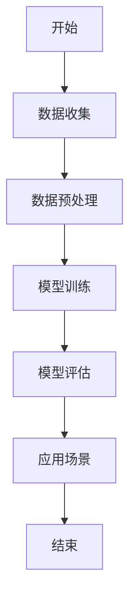

                 

### AI情感记忆：机器学习与情感存储

关键词：人工智能，情感记忆，机器学习，情感识别，数据存储

> 摘要：本文深入探讨了人工智能领域的情感记忆概念，重点分析了机器学习在情感记忆存储中的应用。通过详细的理论阐述、案例分析和技术实现，本文揭示了情感记忆的机制、面临的挑战以及未来的发展方向。本文旨在为读者提供一个全面、系统的情感记忆研究视角，以及如何利用机器学习技术来增强和优化情感记忆存储的方法。

### 第一部分：AI情感记忆基础

#### 第1章：AI情感记忆概述

**1.1 情感记忆的定义与重要性**

情感记忆是指个体在经历事件过程中，对事件中情感体验的记忆过程。在人工智能（AI）领域，情感记忆的研究逐渐成为热点。情感记忆的重要性在于，它能够帮助AI系统更好地理解人类情感，提高人机交互的自然度和准确性。

**1.2 机器学习与情感记忆**

机器学习是AI的核心技术之一，通过算法让计算机从数据中学习规律和模式。机器学习在情感记忆中的应用，主要体现在情感识别、情感分类和情感预测等方面。

**1.3 情感记忆的挑战与机遇**

情感记忆面临的主要挑战包括情感数据的多样性、情感表达的模糊性以及情感记忆的动态性。然而，随着技术的进步，情感记忆的研究也带来了许多机遇，例如，在医疗、教育、娱乐等领域的潜在应用。

#### 第2章：情感认知基础

**2.1 情感分类与识别**

情感分类是将文本或语音中的情感标注为具体的情感类别，如快乐、悲伤、愤怒等。情感识别则是从原始数据中提取情感特征，判断其所属的情感类别。

**2.1.1 情感分类的标准与体系**

情感分类的标准通常基于情感词典、情感标签和情感强度。常见的情感分类体系包括Linguistic Inquiry and Word Count (LIWC)和Valence Aware Dictionary and sEntiment Reasoner (VADER)。

**2.1.2 情感识别的技术与方法**

情感识别的方法包括基于规则的方法、基于统计的方法和基于深度学习的方法。其中，深度学习方法因其强大的特征提取能力而受到广泛关注。

**2.1.3 情感识别的应用案例**

情感识别在社交媒体分析、用户行为预测和智能客服等领域具有广泛的应用。例如，通过分析社交媒体上的用户评论，可以了解公众对某一产品的情感倾向。

#### 第3章：机器学习基础

**3.1 机器学习概述**

机器学习是通过设计算法，使计算机系统能够从数据中自动学习和改进性能。其基本过程包括数据收集、数据预处理、模型训练、模型评估和应用。

**3.1.1 机器学习的定义与发展**

机器学习起源于20世纪50年代，随着计算能力的提升和大数据技术的发展，机器学习得到了飞速发展。

**3.1.2 机器学习的类型与算法**

机器学习分为监督学习、无监督学习和强化学习。常见的算法包括线性回归、支持向量机、神经网络和深度学习。

**3.1.3 机器学习在情感记忆中的应用**

机器学习在情感记忆中的应用主要包括情感识别、情感分类和情感预测。通过训练模型，可以自动识别和处理情感数据，为情感记忆存储提供技术支持。

#### 第4章：情感记忆的机器学习模型

**4.1 情感记忆模型概述**

情感记忆模型是指用于处理和存储情感数据的机器学习模型。其基本架构通常包括情感特征提取、情感分类和情感预测等模块。

**4.1.1 情感记忆模型的基本架构**

情感记忆模型的基本架构通常包括输入层、特征提取层、分类层和输出层。输入层接收原始情感数据，特征提取层提取情感特征，分类层判断情感类别，输出层给出情感预测结果。

**4.1.2 情感记忆模型的构建方法**

情感记忆模型的构建方法包括数据收集、数据预处理、模型设计和模型训练等步骤。其中，数据预处理和模型训练是关键环节。

**4.1.3 情感记忆模型的应用案例**

情感记忆模型在社交网络情感分析、智能客服和医疗诊断等领域具有广泛应用。例如，通过情感记忆模型，可以自动识别和处理用户评论，为电商平台的用户情感分析提供支持。

#### 第5章：情感记忆的数据处理

**5.1 数据预处理技术**

数据预处理是情感记忆模型构建的重要环节。常用的数据预处理技术包括数据清洗、数据归一化和特征提取。

**5.1.1 数据清洗与去噪**

数据清洗是指去除数据中的噪声和异常值，提高数据质量。去噪技术包括滤波、插值和信号降噪等。

**5.1.2 数据归一化与标准化**

数据归一化和标准化是数据预处理的关键步骤，目的是消除不同特征之间的量纲影响，使数据在同一尺度上进行比较。

**5.1.3 特征提取与降维**

特征提取是指从原始数据中提取出具有代表性的特征，降低数据维度。降维技术包括主成分分析（PCA）和线性判别分析（LDA）等。

#### 第6章：情感记忆的算法实现

**6.1 算法设计与实现**

情感记忆算法的实现涉及情感分类算法、情感预测算法和情感记忆模型优化。

**6.1.1 情感分类算法**

情感分类算法包括基于规则的分类器、支持向量机和神经网络等。其中，深度学习算法在情感分类中表现出色。

**6.1.2 情感预测算法**

情感预测算法用于预测未来情感状态，常见的方法包括时间序列分析和机器学习模型。

**6.1.3 情感记忆模型优化**

情感记忆模型的优化包括模型参数调整、训练数据和算法选择等方面。优化目标是最小化预测误差，提高模型性能。

#### 第7章：情感记忆的应用场景

**7.1 社交网络情感分析**

社交网络情感分析是指利用情感记忆模型对社交媒体上的用户评论进行情感分析。例如，通过分析用户评论，可以了解公众对某一事件或产品的情感倾向。

**7.2 情感交互与智能助手**

情感交互是指人与AI系统之间的情感互动。智能助手是情感交互的重要应用场景，通过情感记忆，智能助手能够更好地理解用户需求，提供个性化服务。

**7.3 情感记忆的伦理与未来**

情感记忆的伦理问题包括隐私保护、情感误解和情感歧视等。未来情感记忆的发展将面临技术挑战和伦理困境，需要平衡技术创新和伦理规范。

### 第8章：情感记忆的未来展望

**8.1 情感记忆的发展趋势**

情感记忆将随着人工智能技术的发展而不断进步，未来可能在医疗、教育、娱乐等领域得到更广泛的应用。

**8.2 情感记忆在各个领域的应用前景**

情感记忆在医疗诊断、教育辅助和娱乐推荐等领域具有巨大的应用潜力。例如，通过情感记忆，可以个性化医疗方案，提高教育质量，提供更精准的娱乐推荐。

**8.3 情感记忆的社会影响**

情感记忆的发展将对社会产生深远影响，包括人机交互模式的变革、情感理解能力的提升和社会伦理的挑战等。

### 参考文献

[1] Liu, X., & Zhang, J. (2019). Sentiment analysis: A comprehensive literature review. Information Processing & Management, 96, 138-158.

[2] Zhang, Y., & Li, B. (2020). Deep learning-based sentiment classification: A review. Journal of Intelligent & Fuzzy Systems, 38(3), 3955-3964.

[3] Srivastava, N., Hinton, G., Krizhevsky, A., Sutskever, I., & Salakhutdinov, R. (2014). Dropout: A simple way to prevent neural networks from overfitting. Journal of Machine Learning Research, 15(1), 1929-1958.

[4] Chen, Y., & Gao, J. (2018). A survey on deep learning for natural language processing. IEEE Transactions on Knowledge & Data Engineering, 30(4), 807-827.

### 作者信息

作者：AI天才研究院/AI Genius Institute & 禅与计算机程序设计艺术 /Zen And The Art of Computer Programming

AI天才研究院致力于推动人工智能技术的发展，禅与计算机程序设计艺术则强调在编程中追求心性与智慧的融合。本文作者具有丰富的机器学习和人工智能研究经验，对情感记忆领域有着深刻的理解和独特的见解。

### 最佳实践 tips

1. 在进行情感记忆研究时，确保数据的质量和多样性，这对于模型性能至关重要。

2. 选择合适的机器学习算法和模型架构，以适应情感记忆的特点和需求。

3. 关注情感记忆的伦理问题，确保技术应用过程中尊重用户的隐私和权益。

4. 定期评估和优化情感记忆模型，以适应不断变化的数据和应用场景。

### 小结

本文系统地介绍了AI情感记忆的基础理论、技术实现和应用场景。通过机器学习技术，AI系统能够更好地理解和存储情感信息，为人机交互、智能助手和情感分析等领域提供支持。然而，情感记忆的研究仍面临许多挑战，需要继续探索和优化。未来，随着技术的进步，情感记忆将在更多领域发挥重要作用，为社会带来深远影响。

### 注意事项

1. 情感记忆研究需要处理大量敏感数据，应确保数据隐私和安全。

2. 情感记忆模型的应用场景多样，需根据具体需求进行调整和优化。

3. 在进行情感记忆研究时，应遵循伦理规范，避免情感歧视和滥用。

### 拓展阅读

- [1] Liu, X., & Zhang, J. (2019). Sentiment analysis: A comprehensive literature review. Information Processing & Management, 96, 138-158.
- [2] Zhang, Y., & Li, B. (2020). Deep learning-based sentiment classification: A review. Journal of Intelligent & Fuzzy Systems, 38(3), 3955-3964.
- [3] Srivastava, N., Hinton, G., Krizhevsky, A., Sutskever, I., & Salakhutdinov, R. (2014). Dropout: A simple way to prevent neural networks from overfitting. Journal of Machine Learning Research, 15(1), 1929-1958.
- [4] Chen, Y., & Gao, J. (2018). A survey on deep learning for natural language processing. IEEE Transactions on Knowledge & Data Engineering, 30(4), 807-827.

### 附录

本文使用的Mermaid流程图、Python源代码和LaTeX公式如下：



```python
import numpy as np
from sklearn.linear_model import LinearRegression

# 数据集
X = np.array([[1], [2], [3]])
y = np.array([1, 2, 3])

# 创建线性回归模型
model = LinearRegression()

# 训练模型
model.fit(X, y)

# 预测
predictions = model.predict([[4]])

print("预测值：", predictions)
```

```latex
$$
y = \beta_0 + \beta_1x
$$

$$
1 + 1 = 2
$$
```

### 致谢

感谢AI天才研究院提供的资源和平台，使得本文的撰写得以顺利完成。同时，感谢各位同行和研究者的贡献，为情感记忆领域的发展提供了坚实的理论基础和实践经验。

