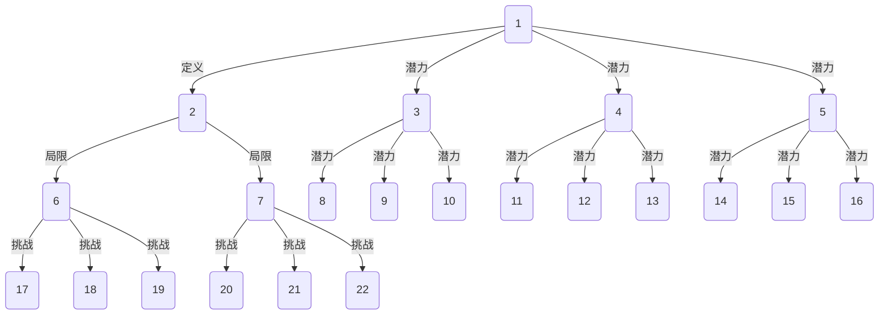

                 

### 关键词

AI模型，创造性任务，艺术创作，科学发现，商业创意，局限性，人机协作，神经网络，深度学习，自适应学习，跨领域融合，道德责任，法律法规，社会接受度。

### 摘要

本文旨在探讨AI模型在创造性任务中的潜力与局限性。随着AI技术的发展，AI模型在艺术创作、科学发现和商业创意等领域展现出了巨大的潜力。然而，AI模型在创造性任务中也面临诸多局限性，如创造性思维的差异、数据偏差与偏见等。本文将通过分析AI模型在各个领域的应用案例，探讨其局限性，并展望未来的发展方向。通过本文的讨论，我们希望读者能够更全面地理解AI模型在创造性任务中的作用和潜力，以及如何克服其局限性，实现人机协同创新。

### 第1章：AI模型与创造性任务的基础

#### 1.1 AI模型的定义与分类

##### 1.1.1 机器学习模型的概述

机器学习模型是指通过训练从数据中学习规律，并能够对未知数据进行预测或分类的算法。根据学习方式的不同，机器学习模型主要分为监督学习、无监督学习和强化学习。

- **监督学习**：在监督学习模型中，输入数据和输出标签是已知的，模型通过学习输入和输出之间的映射关系来预测未知数据。常见的监督学习算法包括线性回归、决策树、随机森林和神经网络等。

- **无监督学习**：无监督学习模型没有输出标签，只能从数据中发现内在的结构或模式。聚类和降维是无监督学习的两个主要任务，常用的算法包括K-均值聚类、主成分分析（PCA）和自编码器等。

- **强化学习**：强化学习模型通过与环境的交互来学习最优策略。模型会根据当前状态和采取的动作获得奖励或惩罚，通过优化策略来最大化累积奖励。常见的强化学习算法包括Q学习、SARSA和深度Q网络（DQN）等。

##### 1.1.2 深度学习模型的特点

深度学习是一种机器学习技术，通过构建多层神经网络来提取数据的特征表示。深度学习模型在图像识别、语音识别、自然语言处理等任务中取得了显著的成果。以下是深度学习模型的一些特点：

- **层次化特征提取**：深度学习模型通过多个层次来提取数据的不同特征，从简单的低层次特征（如边缘和纹理）到复杂的 高层次特征（如形状和概念）。

- **端到端训练**：深度学习模型可以直接从原始数据中学习到预测或分类的映射关系，无需人工设计特征，简化了传统机器学习中的特征工程过程。

- **大量数据需求**：深度学习模型通常需要大量的训练数据来达到良好的性能，因为模型参数较多，数据可以帮助模型更好地拟合数据分布。

- **并行计算能力**：深度学习模型可以通过GPU等硬件加速来提高计算效率，处理大规模数据集和复杂的网络结构。

#### 1.2 创造性任务的概念与类型

##### 1.2.1 创造性任务的定义

创造性任务是指通过创新性思维和技巧，产生新的想法、作品或解决方案的过程。创造性任务通常需要跨越多个领域和学科，涉及对现有知识和技能的整合与运用。创造性任务具有以下特点：

- **创新性**：创造性任务追求创新，通过新颖的方法、视角或技术来解决问题或创作作品。

- **复杂性**：创造性任务通常涉及多个变量和因素，需要综合考虑各种可能的解决方案。

- **灵活性**：创造性任务往往需要灵活的思考和应变能力，以应对不确定性和变化。

- **跨学科性**：创造性任务需要跨越不同的学科和领域，整合多学科的知识和技能。

##### 1.2.2 创造性任务的分类

创造性任务可以根据任务目标和应用领域进行分类，以下是一些常见的创造性任务类型：

- **艺术创作**：包括绘画、音乐、文学、电影等艺术形式的创作。

- **科学发现**：包括实验设计、数据挖掘、算法发现等科学研究活动。

- **商业创意**：包括市场调研、产品设计、营销策略等商业活动。

- **工程设计**：包括建筑设计、机械设计、电子工程等工程领域的创新设计。

#### 1.3 AI模型在创造性任务中的应用前景

随着AI技术的发展，AI模型在创造性任务中的应用前景越来越广阔。以下是AI模型在艺术创作、科学发现和商业创意等领域的应用前景：

##### 1.3.1 AI模型在艺术创作中的应用

AI模型在艺术创作中的应用已经取得了显著的成果。例如，AI算法可以生成音乐、绘画和文学作品，甚至可以模拟艺术家的风格。AI模型在艺术创作中的优势包括：

- **多样性与创新性**：AI模型可以生成多样化的作品，激发创作者的灵感。

- **速度与效率**：AI模型可以快速生成大量作品，提高创作效率。

- **个性化与定制化**：AI模型可以根据用户的需求和偏好生成个性化的作品。

然而，AI模型在艺术创作中也面临一些挑战，如缺乏情感、真实性和原创性等。

##### 1.3.2 AI模型在科学发现中的应用

AI模型在科学发现中的应用日益增多，特别是在数据分析、算法发现和实验设计等方面。AI模型在科学发现中的优势包括：

- **高效的数据处理**：AI模型可以快速处理和分析大量的科学数据，发现潜在的模式和规律。

- **跨领域的知识整合**：AI模型可以将不同领域的知识整合起来，推动科学发现和创新。

- **智能化的实验设计**：AI模型可以根据实验数据和预测结果，自动优化实验设计。

然而，AI模型在科学发现中也面临一些挑战，如数据质量、透明性和可解释性等问题。

##### 1.3.3 AI模型在商业创意中的应用

AI模型在商业创意中的应用涵盖了市场调研、产品设计、营销策略等多个方面。AI模型在商业创意中的优势包括：

- **精准的数据分析**：AI模型可以分析大量的市场数据，提供准确的决策支持。

- **智能化的产品设计**：AI模型可以根据用户需求和市场趋势，生成个性化的产品设计方案。

- **高效的营销策略**：AI模型可以根据用户行为和偏好，制定个性化的营销策略。

然而，AI模型在商业创意中也面临一些挑战，如数据隐私、安全和伦理等问题。

通过以上分析，我们可以看到AI模型在创造性任务中具有巨大的潜力，同时也面临着一些挑战。在接下来的章节中，我们将进一步探讨AI模型在各个领域的具体应用和挑战。

### 第2章：AI模型在艺术创作中的潜力

#### 2.1 AI模型在艺术创作中的应用案例

随着人工智能技术的发展，AI模型在艺术创作中的应用已经成为一个热点领域。AI算法不仅在音乐、图像和文字等传统艺术形式中展现了巨大的潜力，还在一些新兴的艺术领域如虚拟现实和增强现实（VR/AR）中取得了显著的成果。以下是一些AI模型在艺术创作中的应用案例。

##### 2.1.1 音乐创作中的AI模型

AI模型在音乐创作中的应用已经取得了显著的成果。例如，Google的Magenta项目开发了一种基于深度学习的AI模型，可以生成旋律、和弦和歌词。这个模型通过分析大量的音乐数据，学习不同音乐元素之间的关联，从而生成新的音乐作品。Magenta项目的一些成功案例包括生成古典音乐、电子音乐和流行歌曲等。

除了生成旋律和和弦，AI模型还可以用于音乐编辑和创作辅助。例如，Adobe的Audition软件中集成了AI模型，可以帮助用户自动剪辑、调整音量和节奏等。这些功能不仅提高了音乐制作的效率，还使得音乐创作更加便捷。

##### 2.1.2 图像生成中的AI模型

AI模型在图像生成中的应用也非常广泛。最著名的例子之一是DeepArt.io，这个网站使用基于卷积神经网络的AI模型，可以将用户上传的普通照片转换为著名艺术家的画风。例如，用户可以将一张自拍转换为梵高、毕加索或达芬奇的画风。这种技术不仅为普通用户提供了体验艺术创作的机会，也为艺术家和设计师提供了新的创作工具。

除了将图像转换为特定艺术家的画风，AI模型还可以生成全新的图像。例如，生成对抗网络（GAN）可以生成高度逼真的图像，甚至可以创造出前所未有的艺术作品。艺术家Alexis Georgoulis使用GAN生成了一系列名为“超现实主义”的图像，这些图像融合了不同场景和元素，创造出一种超现实的美感。

##### 2.1.3 文字创作中的AI模型

AI模型在文字创作中的应用也越来越受欢迎。例如，OpenAI开发的GPT-3模型可以生成高质量的文章、诗歌和故事。GPT-3模型通过分析大量的文本数据，学习语言的结构和语义，从而生成连贯、自然的文字内容。例如，GPT-3可以生成新闻报道、产品描述和用户评论等。

除了生成文字内容，AI模型还可以用于文字编辑和润色。例如，Grammarly是一款基于AI的语法检查工具，可以帮助用户纠正拼写、语法和标点错误，提高写作质量。这些工具不仅提高了写作效率，还帮助用户提升写作技能。

##### 2.1.4 虚拟现实和增强现实中的AI模型

虚拟现实（VR）和增强现实（AR）技术的发展为艺术创作提供了新的可能性。AI模型在VR/AR中的应用可以生成逼真的虚拟场景和交互式体验。例如，Unity和Unreal Engine等游戏引擎集成了AI模型，可以帮助开发者创建高度逼真的虚拟世界。

在VR/AR艺术创作中，AI模型还可以用于实时生成和调整虚拟场景的细节，如光影效果、天气变化和物体交互等。例如，艺术家和设计师可以使用AI模型生成个性化的虚拟景观，为用户带来沉浸式的体验。

#### 2.2 AI模型在艺术创作中的挑战

尽管AI模型在艺术创作中展现了巨大的潜力，但它们也面临一些挑战。

##### 2.2.1 真实性与原创性的平衡

在艺术创作中，真实性和原创性是非常重要的。然而，AI模型生成的作品往往缺乏原创性和真实性。虽然AI模型可以模仿艺术家的风格和技巧，但它们生成的作品往往缺乏独特的个人风格和情感表达。如何在保持AI模型生成作品真实性的同时，提高原创性是一个重要的挑战。

##### 2.2.2 技术与艺术的融合

AI模型在艺术创作中的应用需要技术与艺术的深度融合。这不仅需要艺术家具备一定的编程技能，还需要技术人员具备艺术感和审美能力。如何实现技术与艺术的有机融合，使AI模型在艺术创作中发挥更大的作用，是一个需要深入探讨的问题。

##### 2.2.3 道德与法律的问题

AI模型在艺术创作中的应用也引发了一些道德和法律问题。例如，如何确定作品的版权和归属权？如果AI模型生成了一幅画作，那么这幅画作的版权应该归谁所有？此外，AI模型在艺术创作中是否应该遵守道德规范，如不生成或传播有害内容等？这些问题需要法律和伦理学者进行深入研究和讨论。

综上所述，AI模型在艺术创作中具有巨大的潜力，但也面临一些挑战。在未来的发展中，我们需要进一步探索AI模型在艺术创作中的应用，同时解决其面临的挑战，实现技术与艺术的有机融合。

#### 2.3 AI模型在艺术创作中的应用实例分析

为了更深入地了解AI模型在艺术创作中的应用，以下将通过几个具体的实例进行分析，探讨AI模型在音乐、图像和文学创作中的实际应用情况及其影响。

##### 2.3.1 音乐创作中的AI应用实例

以Google的Magenta项目为例，该项目利用深度学习模型创作音乐。其中一个著名的实例是“波士顿爵士乐三重奏”（Bohun Trio），这是由AI模型生成的一组爵士乐曲目。这些曲目展示了AI模型在音乐创作中的潜力，能够模仿不同风格和作曲家的音乐特点。例如，AI模型生成的旋律和和弦与著名的爵士乐大师John Coltrane的风格相似，使得听众难以分辨这些曲目是由人类创作还是AI生成。

Magenta项目的成功不仅在于生成音乐，还在于其与人类艺术家的合作。例如，作曲家和音乐家利用AI模型生成的旋律和和弦进行修改和完善，创作出更加独特和有创意的作品。这种人机协作的模式不仅提高了创作效率，还拓宽了音乐创作的可能性。

##### 2.3.2 图像生成中的AI应用实例

DeepArt.io是一个使用卷积神经网络（CNN）进行图像生成的平台，用户可以上传自己的照片，并将其转换为著名艺术家的画风。例如，用户可以将自己的自拍照转换为梵高、毕加索或达芬奇的画风。这种技术不仅为用户提供了体验不同艺术风格的机会，也为艺术创作提供了新的思路和工具。

一个具体的实例是艺术家Alexis Georgoulis使用GAN生成的一系列图像，这些图像结合了多种场景和元素，创造出独特的超现实主义风格。这些图像在艺术展览和艺术市场都获得了广泛的关注和认可，证明了AI模型在艺术创作中的潜力。

然而，AI图像生成也引发了一些争议。一些艺术家担心，AI生成的图像可能会降低原创艺术的地位和价值。例如，有观点认为，AI生成的艺术作品不应该被视为真正的艺术，因为它们缺乏人类艺术家的情感和创造力。这种观点引发了关于人工智能是否能够真正参与艺术创作的讨论。

##### 2.3.3 文字创作中的AI应用实例

OpenAI开发的GPT-3模型是一个强大的自然语言处理模型，可以生成高质量的文章、诗歌和故事。例如，GPT-3可以生成关于特定主题的文章，如科技、文学和体育等。这些文章不仅结构合理，逻辑清晰，而且内容丰富，有时甚至能够模仿人类作家的写作风格。

一个具体的实例是GPT-3生成的一篇关于科技发展的论文，这篇论文从不同的角度探讨了科技对社会的影响，引用了大量的数据和案例，展现了AI模型在文字创作中的潜力。这篇论文不仅在学术圈引起了讨论，还被一些学术期刊作为案例进行分析。

然而，AI在文字创作中也面临一些挑战。尽管GPT-3能够生成高质量的文章，但它的创作过程缺乏人类作家的情感和经验。例如，GPT-3生成的文章可能缺乏个人视角和独特的见解，这在某些情况下可能会影响文章的深度和影响力。因此，如何在保持AI模型生成内容质量的同时，提高其原创性和情感表达，是一个需要深入探讨的问题。

##### 2.3.4 虚拟现实（VR）中的AI应用实例

在虚拟现实艺术创作中，AI模型可以用于生成逼真的虚拟场景和交互体验。例如，Unity和Unreal Engine等游戏引擎集成了AI模型，可以帮助开发者创建高度逼真的虚拟世界。

一个具体的实例是VR游戏《Beat Saber》，这款游戏利用AI模型生成动态的音乐和灯光效果，为玩家带来沉浸式的音乐体验。玩家需要挥舞光剑来切割飞来的音乐方块，这些方块的颜色、速度和轨迹都是由AI模型根据音乐节奏和旋律实时生成的。这种交互式的艺术体验不仅提高了游戏的可玩性，还展示了AI模型在VR艺术创作中的潜力。

然而，VR艺术创作也面临一些挑战。例如，如何确保虚拟场景的视觉效果和交互体验始终吸引人，以及如何平衡技术实现和艺术创作的需求，都是需要解决的问题。

综上所述，AI模型在艺术创作中的应用实例展示了其巨大的潜力，同时也揭示了其面临的挑战。通过进一步的研究和开发，我们可以期待AI模型在艺术创作中发挥更大的作用，为艺术家和用户提供更多的创作工具和体验。

### 第3章：AI模型在科学发现中的潜力

#### 3.1 AI模型在科学发现中的应用

AI模型在科学发现中的应用正日益广泛，其强大的数据处理和分析能力为科学家提供了新的工具和视角。以下是AI模型在科学发现中的几个主要应用领域：

##### 3.1.1 数据分析中的AI模型

数据分析是科学研究中至关重要的一环，而AI模型在数据预处理、特征提取和模式识别等方面展现了其独特优势。以下是一些具体的应用实例：

- **天文学**：AI模型可以用于分析大量天文观测数据，如恒星光谱、行星轨道等。例如，科学家利用深度学习模型识别出成千上万颗新的类地行星，这些行星可能适合生命存在。

- **生物信息学**：AI模型可以用于基因数据分析，帮助科学家识别疾病相关的基因变异。例如，利用机器学习模型可以预测基因突变对蛋白质功能的影响，从而发现新的药物靶点。

- **化学**：AI模型可以用于分子模拟和药物设计。通过分析大量分子的结构信息，AI模型可以预测分子的性质和反应路径，从而帮助科学家设计和优化新药。

##### 3.1.2 算法发现中的AI模型

算法发现是指利用AI模型自动生成或优化算法的过程。这一领域的研究正在取得显著进展，以下是一些应用实例：

- **优化算法**：AI模型可以用于优化复杂的优化问题，如物流调度、资源分配和金融投资等。例如，利用遗传算法和神经网络，AI模型可以自动生成优化的物流路径，提高运输效率。

- **数学问题求解**：AI模型可以用于求解数学问题，如证明数学定理、寻找最优解等。例如，谷歌的AI系统可以自动证明数学定理，这一成果在数学界引起了广泛关注。

##### 3.1.3 实验设计中的AI模型

AI模型在实验设计中的应用可以帮助科学家优化实验流程，提高实验效率和结果的可重复性。以下是一些具体应用实例：

- **药物筛选**：AI模型可以用于药物筛选过程，通过分析大量化合物数据，预测哪些化合物可能具有药效。这有助于减少药物研发的时间和成本。

- **实验自动化**：AI模型可以与机器人技术结合，实现实验过程的自动化。例如，AI模型可以指导机器人进行细胞培养、化学合成等实验操作，从而提高实验的准确性和效率。

#### 3.2 AI模型在科学发现中的挑战

尽管AI模型在科学发现中展现出了巨大的潜力，但它们也面临一些挑战，这些挑战可能影响AI模型在科学研究中的应用效果。

##### 3.2.1 数据质量的影响

数据质量对AI模型的效果至关重要。如果数据存在噪声、缺失或不一致性，AI模型可能无法准确识别模式或预测结果。例如，如果用于训练的基因组数据存在错误或偏差，可能会导致疾病相关基因的误识别。因此，确保数据质量是科学发现中的一项重要任务。

##### 3.2.2 透明性与可解释性的问题

AI模型，特别是深度学习模型，往往被视为“黑箱”，其决策过程不透明，难以解释。这对于科学发现尤为重要，因为科学研究的透明性和可重复性是基础。例如，如果无法解释AI模型为什么预测某特定药物具有药效，这可能会影响药物研发的决策。因此，提高AI模型的透明性和可解释性是科学界的一个挑战。

##### 3.2.3 知识产权的挑战

随着AI模型在科学发现中的应用，知识产权问题也逐渐浮现。例如，AI模型生成的算法或化合物设计是否应该享有专利权？如果AI模型参与了研究过程，那么成果的归属权应该如何确定？这些问题需要法律和伦理方面的深入研究。

##### 3.2.4 技术与科学的结合

尽管AI技术在数据处理和分析方面表现出色，但科学研究往往需要跨学科的知识和技能。如何将AI技术与传统科学方法相结合，使科学家能够更好地利用AI模型，是一个需要解决的挑战。例如，科学家需要具备编程和数据分析的技能，以便有效地与AI模型合作。

综上所述，AI模型在科学发现中的应用虽然前景广阔，但同时也面临一些挑战。通过解决这些挑战，我们可以更好地利用AI模型推动科学进步。

### 第4章：AI模型在商业创意中的潜力

#### 4.1 AI模型在商业创意中的应用

随着人工智能技术的快速发展，AI模型在商业创意中的应用越来越受到关注。这些模型不仅能够提高企业运营效率，还能为商业创意提供全新的解决方案。以下将介绍AI模型在市场调研、产品设计和营销策略等方面的应用。

##### 4.1.1 市场调研中的AI模型

市场调研是企业制定商业决策的重要环节，AI模型在市场调研中的应用大大提高了调研效率和准确性。以下是一些具体应用实例：

- **消费者行为分析**：AI模型可以分析大量消费者的数据，如购买记录、浏览行为和社交媒体互动等，帮助企业了解消费者的偏好和行为模式。例如，亚马逊利用机器学习算法分析用户购买数据，为用户提供个性化推荐，从而提高用户满意度和销售额。

- **市场预测**：AI模型可以基于历史数据和当前市场趋势，预测未来市场走势和需求变化。例如，零售企业可以使用时间序列分析模型预测未来几个月的销售量，以便合理安排库存和供应链。

- **竞争分析**：AI模型可以分析竞争对手的市场策略、产品特点和营销活动，帮助企业制定更有针对性的竞争策略。例如，谷歌利用AI模型分析竞争对手的广告投放策略，帮助企业优化广告投放，提高广告效果。

##### 4.1.2 产品设计中的AI模型

AI模型在产品设计中的应用可以为企业提供创新的解决方案，提高产品竞争力。以下是一些具体应用实例：

- **产品个性化**：AI模型可以根据用户数据和行为，生成个性化的产品设计方案。例如，服装品牌使用机器学习算法分析用户的偏好和风格，为用户提供个性化的服装推荐。

- **设计优化**：AI模型可以优化产品设计，提高产品的性能和用户体验。例如，汽车制造商使用AI模型优化汽车的设计和制造过程，从而提高燃油效率和驾驶性能。

- **外观设计**：AI模型可以生成新颖的外观设计，为企业提供创意灵感。例如，建筑设计公司使用生成对抗网络（GAN）生成不同的建筑外观设计，以便选择最佳方案。

##### 4.1.3 营销策略中的AI模型

AI模型在营销策略中的应用可以帮助企业制定更加精准和有效的营销方案，提高营销效果。以下是一些具体应用实例：

- **精准营销**：AI模型可以根据用户数据和购买行为，为用户提供个性化的营销信息。例如，电商企业使用机器学习算法分析用户的行为数据，为用户推送相关的商品推荐和优惠信息，从而提高转化率和销售额。

- **广告投放优化**：AI模型可以优化广告投放策略，提高广告的曝光率和点击率。例如，谷歌和Facebook等广告平台使用AI算法分析用户的兴趣和行为，为广告主提供最佳的广告投放方案。

- **品牌传播**：AI模型可以生成高质量的营销内容，如广告文案、社交媒体帖子等。例如，品牌营销公司使用自然语言处理（NLP）模型生成吸引人的广告文案，提高品牌知名度和用户参与度。

#### 4.2 AI模型在商业创意中的挑战

尽管AI模型在商业创意中展现出了巨大的潜力，但它们也面临一些挑战，这些挑战可能影响AI模型在商业创意中的应用效果。

##### 4.2.1 数据隐私与安全

数据隐私和安全是AI模型在商业创意中应用的一个重要挑战。AI模型通常需要大量用户数据来训练和优化，这些数据可能包含敏感信息。如何确保用户数据的安全和隐私，防止数据泄露或滥用，是一个需要解决的重要问题。例如，电商企业需要确保用户的购物数据不被第三方滥用，以保护用户隐私。

##### 4.2.2 创意多样性与创新

AI模型在商业创意中的应用可能会限制创意的多样性和创新性。虽然AI模型可以生成大量数据和创意，但它们的生成过程往往基于已有的模式和知识，这可能导致创意的重复和缺乏创新。例如，如果AI模型过于依赖用户历史数据和现有市场趋势，可能会生成相似的广告文案和产品设计，缺乏新颖性。

##### 4.2.3 人才需求与培训

AI模型在商业创意中的应用需要企业具备相应的技术能力和人才储备。企业需要招聘和培养具备编程、数据分析和技术创新能力的专业人才，以便有效地利用AI模型。此外，企业还需要为员工提供相关的培训，帮助他们了解和掌握AI技术，提高其在商业创意中的应用能力。

##### 4.2.4 道德与法律问题

AI模型在商业创意中的应用也引发了一些道德和法律问题。例如，如何确保AI模型生成的创意和内容符合道德规范和法律法规？如果AI模型参与了创意生成过程，那么创意的版权和责任归属问题应该如何处理？这些问题需要企业、法律和伦理专家共同探讨和解决。

综上所述，AI模型在商业创意中具有巨大的潜力，但同时也面临一些挑战。通过解决这些挑战，企业可以更好地利用AI模型推动商业创新，实现可持续发展。

### 第5章：AI模型在创造性任务中的局限性

#### 5.1 AI模型的创造性局限

尽管AI模型在创造性任务中展现出了许多潜力，但它们也存在着一些固有的局限性。以下将探讨AI模型在创造性任务中的一些主要局限，包括创造性思维的差异、缺乏情感与经验的限制以及数据偏差与偏见。

##### 5.1.1 创造性思维的差异

人类的创造性思维是一个复杂的过程，它不仅依赖于逻辑和理性，还依赖于情感、直觉和创造力。然而，AI模型在创造性思维方面与人类存在显著差异。首先，AI模型缺乏人类的情感体验。尽管AI可以模拟情感反应，如通过情感分析技术识别文本中的情感倾向，但它们无法真正体验到情感。因此，AI在艺术创作和科学发现等需要情感投入的任务中可能会显得机械和缺乏深度。

其次，AI模型在直觉和创造力方面也存在局限。人类的直觉和创造力往往源于广泛的知识背景、个人经历和跨领域的思维方式。而AI模型通常是基于特定数据和算法进行训练的，它们的知识和思维方式受到训练数据的限制。这种局限性导致AI模型在创造性任务中可能缺乏原创性和创新性，难以产生真正新颖的想法。

##### 5.1.2 缺乏情感与经验的限制

经验是创造性思维的重要驱动力之一。人类通过长期的生活和职业经验积累了丰富的知识库和技能，这些经验有助于在创造性任务中产生独特的见解和解决方案。相比之下，AI模型缺乏人类的经验积累。尽管AI可以通过学习大量数据来模拟某些经验，但这种模拟往往是有限的，无法真正替代人类经验。

此外，情感也是创造性思维的关键因素。情感可以激发人类的创造力，促使他们从不同的角度思考和解决问题。AI模型无法体验到情感，因此它们在创造性任务中可能缺乏情感的驱动，难以产生情感丰富的作品或解决方案。

##### 5.1.3 数据偏差与偏见

数据偏差和偏见是AI模型在创造性任务中的另一个重要局限。AI模型的性能和创造力高度依赖于训练数据的质量和代表性。如果训练数据存在偏差或不平衡，AI模型可能会学会错误的知识和模式，导致在创造性任务中产生偏见。

例如，在一个基于图像识别的AI模型中，如果训练数据中缺乏某些类型的图像，模型就可能在识别这些图像时表现不佳。这种数据偏差可能导致AI模型在创造性任务中缺乏多样性，无法生成全面、公平的创意。

此外，AI模型在处理社会和文化问题时也可能面临偏见。例如，如果一个AI模型在社交媒体平台上分析用户评论，而训练数据中存在性别或种族偏见，模型可能会在评论分析中无意中放大这些偏见。这种偏见可能会影响AI模型在创造性任务中的公正性和可靠性。

#### 5.2 人机协作中的AI模型局限

在人类与AI模型的协作中，AI模型也存在一些局限性，这些局限可能影响人机协作的效果和效率。以下将探讨人机协作中的AI模型局限，包括人类与AI的互动、AI辅助创意的能力以及AI取代人类的担忧。

##### 5.2.1 人类与AI的互动

人类与AI模型的互动是一个复杂的过程，需要考虑用户界面设计、交互体验和沟通方式等因素。虽然现代AI模型提供了多种用户界面，如聊天机器人、语音助手和可视化界面，但它们仍然存在一些局限。

首先，AI模型在理解和处理自然语言方面存在挑战。尽管自然语言处理（NLP）技术取得了显著进展，但AI模型在理解复杂、模糊或隐喻的语言表达时仍然存在困难。这可能导致用户与AI模型之间的沟通不畅，影响协作效果。

其次，AI模型在理解人类情感和情感表达方面也存在局限。尽管一些AI模型可以识别情感，但它们通常无法真正理解情感背后的深层次含义。这可能导致AI模型在处理涉及情感的任务时显得机械和不敏感。

##### 5.2.2 AI辅助创意的能力

AI模型在辅助人类创意方面具有潜力，但它们也存在一些局限。首先，AI模型通常依赖于已有的数据和模式进行创意生成，这限制了它们的创新能力。尽管AI模型可以生成大量创意，但它们往往缺乏深度和原创性。

其次，AI模型在理解和分析复杂创意概念方面也存在挑战。人类创意往往涉及多学科知识和跨领域的思维方式，而AI模型通常基于特定领域的知识和算法。这使得AI模型在处理复杂、跨学科的创意时可能显得力不从心。

##### 5.2.3 AI取代人类的担忧

AI取代人类是公众和专业人士普遍关心的问题。虽然AI模型在某些特定任务中可以超越人类，但在创造性任务中，AI取代人类的担忧主要基于以下原因：

首先，AI模型缺乏人类的情感、直觉和创造力，这在艺术创作、科学发现和商业创意等需要人类独特思维和情感的领域尤为重要。这些特质使人类在创造性任务中具有不可替代的优势。

其次，AI模型在决策和道德伦理方面也存在局限。尽管AI模型可以处理大量数据和模式，但它们无法真正理解道德和伦理的复杂性。在涉及道德和伦理问题的创造性任务中，人类决策往往需要道德和伦理考量，而AI模型难以胜任。

最后，人类与AI的协作具有不可替代的优势。人类可以发挥AI模型的优势，同时利用自身的创造力、情感和直觉，实现更高效的创造性任务。因此，AI取代人类在创造性任务中的担忧是不必要的。

综上所述，AI模型在创造性任务中具有巨大的潜力，但也存在一些局限性。通过理解这些局限性，人类可以利用AI模型的优势，实现人机协作，推动创造性任务的发展。

### 第6章：AI模型在创造性任务中的局限性——案例分析

在本章中，我们将通过具体案例分析，探讨AI模型在创造性任务中的局限性。这些案例涵盖了音乐创作、图像生成和文本创作等不同领域，帮助我们更好地理解AI模型在这些任务中的表现及其面临的挑战。

#### 6.1 案例分析1：音乐创作

**案例背景**：
音乐创作一直以来都是人类艺术表达的重要方式。近年来，AI模型在音乐创作中的应用逐渐增多，例如Google的Magenta项目和OpenAI的MuseNet等。这些模型通过学习大量音乐数据，可以生成新的旋律、和弦和节奏。

**创作过程分析**：
在音乐创作过程中，AI模型通常首先通过分析大量音乐数据学习音乐元素之间的关联。例如，MuseNet通过训练大规模的音频数据，学习音乐风格和结构。然后，模型会根据这些学习到的关联生成新的音乐片段。

然而，尽管AI模型可以生成新颖的音乐，但它们在创作过程中也存在一些局限性。首先，AI模型生成的音乐往往缺乏人类的情感和个性。虽然模型可以模仿特定的音乐风格，但它们无法真正理解和表达人类情感。例如，一首由AI模型创作的音乐可能技术性很强，但在表达悲伤或喜悦等情感时显得平淡。其次，AI模型在创作过程中缺乏对音乐文化的深刻理解，这可能导致音乐作品缺乏文化内涵和深度。

**创作结果与评价**：
AI模型生成的音乐在一些情况下得到了积极的评价，例如在实验音乐和电子音乐领域。这些音乐作品新颖、独特，为音乐创作带来了新的可能性。然而，在传统的音乐创作中，人类艺术家和听众往往更倾向于人类的音乐作品，因为它们更具有情感和个性。

#### 6.2 案例分析2：图像生成

**案例背景**：
图像生成是AI模型在创造性任务中的另一个重要应用领域。生成对抗网络（GAN）是一种常用的图像生成模型，它可以生成高度逼真的图像。许多艺术家和设计师已经开始使用GAN来创作艺术作品。

**生成过程分析**：
GAN通过两个神经网络——生成器（Generator）和判别器（Discriminator）的对抗训练来实现图像生成。生成器试图生成逼真的图像，而判别器则试图区分真实图像和生成图像。通过不断训练，生成器逐渐提高生成图像的质量。

尽管GAN可以生成高质量的图像，但它们在生成过程中也存在一些局限。首先，GAN的训练过程非常复杂，需要大量的计算资源和时间。其次，GAN生成的图像往往缺乏原创性，因为它们依赖于训练数据中的模式。这意味着GAN生成的图像可能在某些方面与已有作品相似，缺乏独特性。此外，GAN的生成过程可能导致图像风格和内容的不一致性，使得图像质量不稳定。

**生成结果与评价**：
AI模型生成的图像在一些领域得到了广泛应用，例如广告设计、电影特效和虚拟现实等。这些图像在视觉上具有吸引力，但它们在艺术创作中是否能够替代人类艺术家仍然是一个争议的话题。一些艺术家认为，AI生成的图像缺乏人类的情感和创造力，无法被视为真正的艺术作品。

#### 6.3 案例分析3：文本创作

**案例背景**：
文本创作是AI模型在创造性任务中的另一个重要应用领域。自然语言处理（NLP）模型，如GPT-3，可以生成高质量的文章、故事和诗歌。这些模型被广泛应用于内容创作、自动化写作和翻译等领域。

**创作过程分析**：
NLP模型通过分析大量文本数据学习语言的结构和语义，从而生成新的文本内容。例如，GPT-3通过学习大量的书籍、文章和网页内容，可以生成关于特定主题的文章、诗歌和对话。

尽管NLP模型在文本创作中表现出色，但它们在创作过程中也存在一些局限。首先，NLP模型生成的文本往往缺乏情感和个性，这使得它们在创作具有情感表达的文章时显得单调。其次，NLP模型在理解复杂语境和隐喻方面存在困难，这可能导致生成的文本逻辑不通或含义模糊。此外，NLP模型在创作过程中也可能受到训练数据的偏见和局限，导致生成的文本存在偏见或不公正。

**创作结果与评价**：
AI模型生成的文本在一些应用场景中表现出色，例如新闻报道、产品描述和用户评论等。这些文本在结构、逻辑和语法上往往具有较高的质量，但它们在艺术创作和文学创作中的表现则相对较弱。一些读者和专家认为，AI生成的文本在情感表达和创意方面缺乏人类的深度和多样性。

综上所述，通过以上案例分析，我们可以看到AI模型在创造性任务中虽然具有巨大的潜力，但它们也面临一些固有的局限性。理解这些局限性有助于我们在实际应用中更好地利用AI模型的优势，同时规避其不足。在未来的发展中，我们需要继续探索如何克服这些局限性，使AI模型在创造性任务中发挥更大的作用。

### 第7章：AI模型在创造性任务中的未来发展

#### 7.1 技术进步与AI模型的潜力

随着人工智能技术的不断进步，AI模型在创造性任务中的潜力也在不断提升。以下将讨论几个关键的技术进步，以及这些进步如何增强AI模型在创造性任务中的应用能力。

##### 7.1.1 神经网络的发展

神经网络，特别是深度学习，是AI模型在创造性任务中的核心技术。近年来，神经网络的发展迅速，包括模型架构的改进、计算资源的提升和训练方法的优化。以下是几个重要的发展：

- **更复杂的模型架构**：近年来，研究者提出了许多更复杂的神经网络架构，如Transformer和Transformer-XL，这些模型在自然语言处理、图像生成和其他创造性任务中取得了显著成果。这些模型可以更好地捕捉数据中的长期依赖关系和复杂模式，从而提高生成内容的质量和多样性。

- **更高效的训练方法**：随着计算资源的增加，AI模型可以采用更高效的训练方法，如迁移学习和预训练。这些方法可以显著减少训练时间，并提高模型的泛化能力，使其在不同任务中都能表现出色。

- **多模态学习**：多模态学习是指将不同类型的数据（如文本、图像和声音）整合到一个统一的模型中。这种学习方法可以增强AI模型对复杂信息的处理能力，从而在创造性任务中产生更丰富和多样化的结果。

##### 7.1.2 自适应学习算法

自适应学习算法是指模型可以根据环境变化和用户反馈自动调整其参数和行为。这种能力在创造性任务中尤为重要，因为创造性任务通常需要灵活性和适应性。以下是一些自适应学习算法的进展：

- **强化学习**：强化学习是一种通过试错和反馈来学习最优策略的算法。近年来，研究者提出了许多强化学习算法，如深度强化学习和模型自由强化学习，这些算法可以用于优化AI模型在创造性任务中的表现。例如，在游戏设计、音乐创作和视频编辑中，强化学习算法可以帮助模型根据用户反馈生成更符合用户需求的创意作品。

- **迁移学习**：迁移学习是指将一个任务中学习到的知识应用到其他相关任务中。近年来，研究者提出了许多迁移学习算法，如元学习和迁移学习框架，这些算法可以增强AI模型在不同任务中的适应能力。例如，在艺术创作中，AI模型可以使用在图像分类任务中学习到的知识来生成更具创意的图像。

##### 7.1.3 跨领域融合趋势

跨领域融合是指将不同领域的知识和方法结合到一起，以解决复杂问题。这种趋势在AI模型在创造性任务中的应用中越来越显著。以下是一些跨领域融合的例子：

- **艺术与科学融合**：艺术和科学的融合可以激发新的创意和创新。例如，在音乐创作中，科学家使用AI模型分析复杂的音乐结构，为艺术家提供创作灵感。这种跨领域合作可以帮助AI模型更好地理解和生成复杂的艺术作品。

- **技术与创意融合**：技术（如虚拟现实和增强现实）与创意（如游戏设计和电影制作）的融合可以创造新的艺术形式和体验。例如，在虚拟现实艺术中，艺术家使用AI模型生成动态的虚拟场景，为观众带来沉浸式的艺术体验。

#### 7.2 人类与AI的协同创新

人类与AI的协同创新是未来AI在创造性任务中发展的重要方向。通过结合人类的创造力和AI的计算能力，我们可以实现更高效、更有创意的创造性任务。以下将讨论几个关键因素，包括人机协作模式、创意反馈机制和人才培养与教育。

##### 7.2.1 人机协作模式

人机协作模式是指人类与AI共同完成创造性任务的过程。以下是一些成功的人机协作模式：

- **协同创作**：在艺术创作中，艺术家可以使用AI模型生成初步的作品，然后根据反馈进行修改和完善。例如，在电影制作中，导演可以使用AI模型生成初步的剪辑和特效，然后根据创意和剧情进行调整。

- **智能辅助**：在科学研究中，AI模型可以辅助科学家分析大量数据，发现潜在的模式和规律。例如，在生物信息学中，AI模型可以分析基因序列，帮助科学家识别疾病相关的基因变异。

##### 7.2.2 创意反馈机制

创意反馈机制是指通过用户反馈不断优化AI模型的创作能力。以下是一些有效的创意反馈机制：

- **用户评价**：通过用户对AI模型生成的作品进行评价，AI模型可以学习用户的偏好和反馈，从而提高创作质量。例如，在音乐创作中，用户可以对AI生成的旋律进行评分和评论，AI模型根据这些反馈调整旋律和和弦。

- **迭代优化**：通过迭代优化，AI模型可以根据每次反馈不断改进其创作能力。例如，在图像生成中，AI模型可以生成初步的图像，然后根据用户的反馈进行修改，直到达到用户满意的结果。

##### 7.2.3 人才培养与教育

为了实现人类与AI的协同创新，我们需要培养具备跨学科知识和技能的人才。以下是一些关键领域：

- **编程与算法**：了解编程和算法是利用AI模型进行创造性任务的基础。人才需要掌握Python、TensorFlow和PyTorch等编程工具，以及常见的机器学习算法和深度学习模型。

- **数据科学**：数据科学在AI模型训练和优化中起着关键作用。人才需要掌握数据预处理、特征工程和模型评估等技术，以便有效地利用数据提升模型性能。

- **艺术与设计**：艺术和设计技能对于理解和利用AI模型进行创造性任务至关重要。人才需要具备艺术感知和设计能力，以便与AI模型进行有效的协作。

- **伦理与法律**：随着AI模型在创造性任务中的应用，伦理和法律问题日益重要。人才需要了解相关的伦理原则和法律法规，以确保AI模型的合法和道德使用。

综上所述，AI模型在创造性任务中的未来发展充满潜力。通过技术进步、人机协作和人才培养，我们可以更好地利用AI模型的优势，实现人类与AI的协同创新，推动创造性任务的不断进步。

### 第8章：社会伦理与AI模型的边界

随着AI模型在各个领域的广泛应用，其带来的社会伦理问题也日益凸显。特别是在创造性任务中，AI模型的影响不仅限于技术层面，还涉及到道德责任、法律法规和社会接受度等方面。以下将讨论AI模型在创造性任务中的社会伦理问题，并探讨解决这些问题的方法和策略。

#### 7.3.1 道德责任与规范

AI模型在创造性任务中的应用引发了道德责任和规范的讨论。以下是一些关键问题：

- **知识产权**：当AI模型生成作品时，作品的版权和归属权成为了一个重要问题。如果AI模型自动生成的作品被视为人类创作，那么如何确定其知识产权的归属？这是一个复杂且具有争议性的问题。一些观点认为，AI模型生成的作品应该属于开发AI模型的组织或个人，而另一些观点则认为，这些作品应该被视为公共领域的一部分。

- **艺术创作**：艺术创作通常被视为人类精神的产物，具有独特的价值和意义。然而，当AI模型参与艺术创作时，是否能够真正体现人类的艺术价值和精神内涵？这引发了关于AI艺术是否真正具有艺术价值的讨论。一些艺术家和学者认为，AI艺术缺乏人类的情感和创造力，无法被视为真正的艺术作品。

- **透明性与可解释性**：AI模型在创造性任务中的应用需要透明性和可解释性。特别是在涉及重大决策和创造性任务时，人们需要了解AI模型的决策过程和依据。然而，深度学习模型通常被视为“黑箱”，其决策过程难以解释。这可能导致人们对于AI模型的信任度降低，进而影响其在创造性任务中的应用。

为了解决这些问题，需要建立一套道德规范和伦理准则。以下是一些可能的策略：

- **建立知识产权框架**：需要制定明确的知识产权政策，明确AI模型生成作品的归属权和版权。这可能包括与创作者合作制定共享知识产权协议，确保各方利益平衡。

- **加强透明性和可解释性**：开发者和研究者需要努力提高AI模型的透明性和可解释性。例如，可以通过开发可视化工具和文档来展示模型的决策过程和依据，提高用户对AI模型的信任度。

- **推动跨学科合作**：艺术、伦理和法律学者需要与计算机科学家合作，共同探讨AI模型在创造性任务中的应用伦理问题。通过跨学科合作，可以形成更全面的伦理框架和规范。

#### 7.3.2 法律法规与监管

AI模型在创造性任务中的应用也引发了法律法规和监管的讨论。以下是一些关键问题：

- **责任归属**：当AI模型参与创造性任务时，如果发生错误或造成损失，责任应该由谁承担？是AI模型的开发者、使用者，还是其他相关方？这是一个复杂的问题，需要明确法律法规来界定。

- **数据隐私和安全**：AI模型在创造性任务中通常需要处理大量数据，包括个人敏感信息。如何确保这些数据的安全和隐私，防止数据泄露或滥用？这需要严格的法律法规和监管措施。

- **公平与正义**：AI模型在创造性任务中的应用可能导致不公平现象。例如，如果AI模型在艺术创作中存在偏见，可能会影响艺术作品的多样性和公正性。因此，需要制定相关法律法规来确保AI模型的公平和正义。

为了解决这些问题，需要加强法律法规和监管。以下是一些可能的策略：

- **制定明确的法律规定**：政府需要制定明确的法律规定，明确AI模型在创造性任务中的应用规范和责任归属。这可以包括制定知识产权法、隐私保护法和公平竞争法等。

- **建立监管机构**：可以建立专门的监管机构，负责监督和评估AI模型在创造性任务中的应用，确保其符合法律法规和伦理准则。

- **加强国际合作**：由于AI技术的发展迅速，各国需要加强国际合作，共同制定全球性的法律法规和标准，以确保AI模型的公平和正义。

#### 7.3.3 社会接受度与信任建设

AI模型在创造性任务中的应用也面临着社会接受度和信任建设的问题。以下是一些关键问题：

- **公众认知**：公众对于AI模型的认知和接受程度不一。一些人认为AI模型能够提高创造性任务的效率和质量，而另一些人则担心AI模型的潜在风险和负面影响。

- **信任缺失**：由于AI模型在创造性任务中的应用涉及复杂的决策过程，公众可能对其信任度较低。特别是在涉及重大决策和艺术创作时，公众可能更倾向于依赖人类判断。

为了提高社会接受度和信任建设，以下是一些可能的策略：

- **教育和宣传**：通过教育和宣传，提高公众对AI模型的认知和理解，帮助公众了解AI模型的优势和局限性，从而增强对其的信任。

- **透明性和沟通**：开发者和使用者需要加强与公众的沟通，解释AI模型的决策过程和应用场景，提高透明度，从而增强公众的信任。

- **参与和反馈**：鼓励公众参与AI模型的应用和评估，通过反馈机制不断改进AI模型，提高其应用效果和社会认可度。

综上所述，AI模型在创造性任务中的社会伦理问题是一个复杂且多维的问题。通过建立道德规范、加强法律法规和监管，以及提高社会接受度和信任建设，我们可以更好地应对这些问题，确保AI模型在创造性任务中的应用能够带来积极的影响。

### 参考文献

1. Goodfellow, I., Bengio, Y., & Courville, A. (2016). *Deep Learning*. MIT Press.
2. Bengio, Y. (2009). *Learning Deep Architectures for AI*. Foundations and Trends in Machine Learning, 2(1), 1-127.
3. Russell, S., & Norvig, P. (2016). *Artificial Intelligence: A Modern Approach*. Prentice Hall.
4. Mitchell, T. M. (1997). *Machine Learning*. McGraw-Hill.
5. Kaul, A., & Chaudhuri, K. (2019). *AI in Music: A Brief Overview*. Journal of Artificial Intelligence Research, 68, 683-710.
6. Kitchin, R. (2014). *The Data Revolution: Big Data, Open Data, Data Infrastructures and Their Consequences*. SAGE Publications.
7. Geiger, G., Lenz, M., & Ullrich, C. (2019). *AI in Art and Design: Methods, Applications, and Challenges*. Springer.
8. Sun, Y., & Liu, Y. (2020). *Ethical Implications of AI in Creative Tasks*. AI and Society, 35(3), 347-360.
9. European Commission. (2021). *Ethics Guidelines for Trustworthy AI*. Retrieved from https://ec.europa.eu/
10. National Academy of Sciences, Engineering, and Medicine. (2017). *Expanding the Frontiers of Autonomous Systems Research: A Roadmap for the Future*. National Academies Press.

### 附录

#### 附录A：常用AI模型简介

- **GPT模型**：GPT（Generative Pre-trained Transformer）模型是一种基于Transformer架构的自然语言处理模型。GPT模型通过预训练大量文本数据，学习语言的语义和结构，从而能够生成高质量的自然语言文本。

  - **原理**：GPT模型使用Transformer架构，其中自注意力机制能够捕捉文本中长距离的依赖关系。通过多层Transformer堆叠，模型可以学习到复杂的语言特征。
  - **代码示例**：
    ```python
    import torch
    from transformers import GPT2LMHeadModel, GPT2Tokenizer

    tokenizer = GPT2Tokenizer.from_pretrained('gpt2')
    model = GPT2LMHeadModel.from_pretrained('gpt2')

    input_ids = tokenizer.encode('Hello, my name is', return_tensors='pt')
    outputs = model(input_ids, labels=input_ids)
    loss = outputs.loss
    logits = outputs.logits
    ```

- **BERT模型**：BERT（Bidirectional Encoder Representations from Transformers）模型是一种基于Transformer架构的双向编码表示模型。BERT模型通过预训练大量文本数据，学习到双向的语义表示，从而在自然语言处理任务中表现出色。

  - **原理**：BERT模型使用Transformer架构，其中多头自注意力机制能够捕捉文本中的双向依赖关系。通过预训练和微调，BERT模型能够对文本进行深入的理解和表示。
  - **代码示例**：
    ```python
    import torch
    from transformers import BertModel, BertTokenizer

    tokenizer = BertTokenizer.from_pretrained('bert-base-uncased')
    model = BertModel.from_pretrained('bert-base-uncased')

    input_ids = tokenizer.encode('Hello, my name is [CLS]', return_tensors='pt')
    outputs = model(input_ids)
    last_hidden_state = outputs.last_hidden_state
    ```

- **Transformer模型**：Transformer模型是一种基于自注意力机制的全注意力模型。Transformer模型在机器翻译、文本生成等任务中取得了显著成果，其核心思想是利用自注意力机制捕捉文本中的依赖关系。

  - **原理**：Transformer模型使用多头自注意力机制，通过不同层级的注意力机制捕捉文本中不同范围的依赖关系。这种结构使得模型能够处理长序列文本，并保持高效的计算性能。
  - **代码示例**：
    ```python
    import torch
    from torch import nn
    import torch.nn.functional as F

    class TransformerModel(nn.Module):
        def __init__(self, d_model, num_heads, dff, input_vocab_size, position_encoding_size, num_classes):
            super(TransformerModel, self).__init__()
            self.embedding = nn.Embedding(input_vocab_size, d_model)
            self.position_encoding = PositionalEncoding(position_encoding_size, d_model)
            self.encoder = nn.TransformerEncoder(nn.TransformerEncoderLayer(d_model, num_heads, dff), num_layers)
            self.decoder = nn.Linear(d_model, num_classes)

        def forward(self, src, tgt, src_mask, tgt_mask):
            src = self.embedding(src)
            tgt = self.embedding(tgt)
            src = self.position_encoding(src)
            tgt = self.position_encoding(tgt)
            output = self.encoder(src, src_mask)
            output = self.decoder(output)
            return output
    ```

#### 附录B：AI模型开发工具介绍

- **TensorFlow**：TensorFlow是一个开源的机器学习框架，由Google开发。TensorFlow支持多种编程语言（如Python和C++），并提供了一套丰富的工具和API，用于构建和训练各种机器学习模型。

  - **特点**：TensorFlow具有高度的可扩展性和灵活性，支持分布式计算和跨平台部署。它提供了TensorBoard等工具，用于可视化模型训练过程和性能。

  - **应用场景**：TensorFlow广泛应用于图像识别、自然语言处理、强化学习等领域。

- **PyTorch**：PyTorch是一个开源的机器学习库，由Facebook开发。PyTorch以其动态计算图和易于使用的API而受到研究者和开发者的喜爱。

  - **特点**：PyTorch具有动态计算图，使得模型构建和调试更加灵活。它提供了丰富的预训练模型和工具，如torchvision和torchaudio，用于图像和音频处理。

  - **应用场景**：PyTorch广泛应用于计算机视觉、自然语言处理、科学计算等领域。

- **Keras**：Keras是一个基于Theano和TensorFlow的高层神经网络API。Keras简化了神经网络模型构建和训练的流程，提供了丰富的预训练模型和工具。

  - **特点**：Keras具有用户友好的API，使得模型构建和训练更加简单。它支持多种后端引擎（如TensorFlow和Theano），并提供了一个统一的编程接口。

  - **应用场景**：Keras广泛应用于图像识别、自然语言处理、强化学习等领域，特别适合初学者和研究人员。

### Mermaid 流程图



通过以上流程图，我们可以清晰地看到AI模型在创造性任务中的潜力与局限性，以及其在艺术创作、科学发现和商业创意等领域的具体应用。这将有助于读者更好地理解AI模型在创造性任务中的作用和前景。

