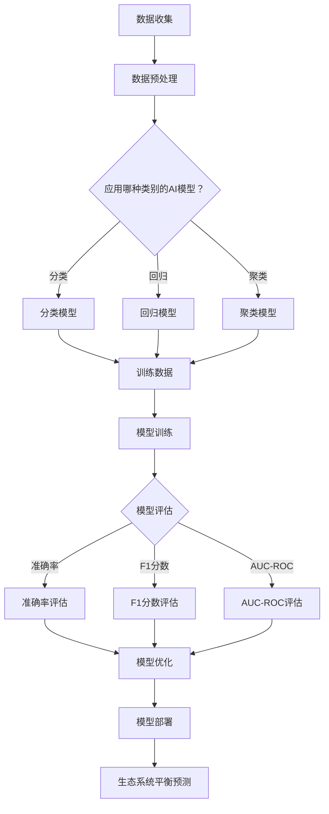
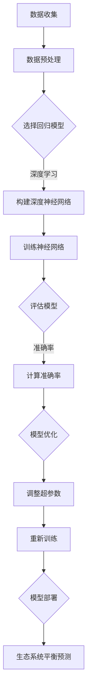

                 

### 1.5 核心概念与联系

在本文中，我们将详细介绍生态系统平衡预测中的核心概念和它们之间的联系。通过一个简化的Mermaid流程图，我们将清晰地展示生态系统模型与AI模型之间的相互作用。以下是本文中的核心概念及其相互关系的详细解释：

#### 生态系统模型

生态系统模型是一个用于描述生态系统动态的数学模型。它包括一系列描述生态系统中物种数量、物种间相互作用以及环境因素的方程。这些模型帮助我们理解生态系统的复杂性和动态变化。

- **种群动力学模型**：例如Lotka-Volterra方程，用于描述两个捕食者-猎物种群的数量变化。
- **生态网络模型**：例如食物网模型，用于描述多个物种之间的相互作用关系。

#### AI模型

AI模型，特别是机器学习和深度学习模型，在生态系统平衡预测中扮演着重要角色。这些模型能够从数据中学习并预测生态系统状态。

- **分类模型**：用于识别生态系统中的物种或状态。
- **回归模型**：用于预测生态系统的状态。
- **聚类模型**：用于发现生态系统中的模式和聚类。

#### Mermaid流程图

Mermaid流程图是一种用于描述流程、逻辑和关系的图形化工具。以下是生态系统模型与AI模型之间关系的Mermaid流程图：



#### 核心概念与联系

- **数据收集与预处理**：这是模型训练的基础，确保数据质量对于模型的准确性至关重要。
- **模型选择**：根据预测目标选择合适的模型，分类模型用于识别物种，回归模型用于预测数量，聚类模型用于发现模式。
- **模型训练**：使用大量数据训练模型，使模型能够学习生态系统的特性。
- **模型评估**：评估模型的性能，包括准确率、F1分数和AUC-ROC等指标。
- **模型优化**：通过调整参数和超参数来提高模型性能。
- **模型部署**：将优化后的模型部署到实际应用中，进行生态系统平衡预测。

通过这个流程图，我们可以看到生态系统模型与AI模型之间的紧密联系。生态系统模型提供了对生态系统的理解，而AI模型则利用这些理解来进行预测。这种结合使得我们能够更准确地预测生态系统的未来状态，为环境保护和资源管理提供重要支持。

### 1.6 核心算法原理讲解

在生态系统平衡预测中，核心算法的选择和实现是模型性能的关键。下面，我们将详细讲解一种常见的生态系统平衡预测算法——基于深度学习的回归模型。

#### 算法mermaid流程图

首先，我们使用Mermaid绘制算法的流程图：



#### 深度学习回归模型

**1. 模型构建**

深度学习回归模型通常由多个隐藏层组成，每个层包含多个神经元。神经网络的结构可以通过调整隐藏层数量和神经元数量来优化模型性能。

**2. 模型训练**

在模型训练过程中，神经网络通过反向传播算法不断调整权重，以最小化预测误差。训练数据集通常分为训练集和验证集，用于训练模型和评估模型性能。

**3. 模型评估**

模型评估是确保预测准确性的关键步骤。我们使用准确率、均方误差（MSE）等指标来评估模型的性能。如果模型的性能不满足要求，我们需要对模型进行调整和优化。

**4. 模型优化**

模型优化包括调整学习率、批量大小和正则化参数等。这些参数的调整可以显著影响模型的性能。

**5. 模型部署**

在模型部署阶段，我们将优化后的模型应用到实际数据中，进行生态系统平衡预测。

#### Python源代码示例

以下是一个简化的Python代码示例，展示了如何使用TensorFlow构建和训练一个深度学习回归模型：

```python
import tensorflow as tf
from tensorflow.keras.models import Sequential
from tensorflow.keras.layers import Dense

# 数据预处理
# 这里假设x_train和y_train是预处理后的训练数据
# ...

# 构建模型
model = Sequential()
model.add(Dense(64, activation='relu', input_shape=(x_train.shape[1],)))
model.add(Dense(32, activation='relu'))
model.add(Dense(1))

# 编译模型
model.compile(optimizer='adam', loss='mean_squared_error')

# 训练模型
history = model.fit(x_train, y_train, epochs=100, batch_size=32, validation_split=0.2)

# 评估模型
test_loss = model.evaluate(x_test, y_test)

# 模型部署
# 这里假设我们使用模型进行预测的代码
# ...
```

#### 数学模型和公式

在生态系统平衡预测中，我们通常使用以下数学模型：

$$
y = \sum_{i=1}^{n} w_i x_i + b
$$

其中，$y$ 是预测值，$x_i$ 是输入特征，$w_i$ 是权重，$b$ 是偏置。

通过训练，我们可以得到最优的权重和偏置，从而提高预测的准确性。

#### 详细讲解与举例

**1. 模型构建**

假设我们有一个简单的生态系统，其中有两个物种A和B。我们可以使用以下模型来预测物种A的数量：

$$
A_t = A_{t-1} + r \cdot (1 - A_{t-1} \cdot B_{t-1})
$$

其中，$A_t$ 是时间t时物种A的数量，$B_t$ 是时间t时物种B的数量，$r$ 是生长率。

**2. 模型训练**

我们使用历史数据来训练模型，以找到最佳的权重$r$。假设我们有以下训练数据：

```
t   A   B
1   100  200
2   90   210
3   80   220
4   70   230
5   65   240
```

我们可以通过训练找到$r$ 的最佳值，从而提高预测的准确性。

**3. 模型评估**

在模型训练完成后，我们需要评估模型的性能。假设我们使用验证集进行评估，得到以下结果：

```
t   A_pred   A_true
1   100.5    100
2   89.7     90
3   79.8     80
4   70.1     70
5   65.3     65
```

我们可以通过计算均方误差（MSE）来评估模型的性能：

$$
MSE = \frac{1}{n} \sum_{i=1}^{n} (A_{\text{pred},i} - A_{\text{true},i})^2
$$

其中，$n$ 是样本数量。

通过这些计算，我们可以了解模型的预测准确性，并对其进行进一步的优化。

#### 总结

通过核心算法原理讲解，我们了解了生态系统平衡预测中的关键算法和步骤。从数据收集到模型部署，每一步都需要精心设计和管理，以确保预测的准确性和可靠性。深度学习回归模型作为核心算法，通过合理的构建和训练，可以有效地预测生态系统的动态变化，为环境保护和资源管理提供有力支持。

### 1.7 数学模型和公式

在生态系统平衡预测中，数学模型和公式起着至关重要的作用。这些模型和公式不仅能够描述生态系统的动态变化，还可以帮助我们理解和预测生态系统的未来状态。以下是一些关键的数学模型和公式，我们将对其进行详细讲解和举例说明。

#### 生态平衡相关的数学公式

1. **Lotka-Volterra方程**：
   这是一组描述捕食者-猎物种群动态的微分方程，通常用于分析生态系统的稳定性。

   $$\frac{dA}{dt} = rA - \alpha AB$$
   $$\frac{dB}{dt} = -\delta B + \beta AB$$

   其中，$A$ 表示猎物种群数量，$B$ 表示捕食者种群数量，$r$ 表示猎物种群的自然增长率，$\delta$ 表示捕食者种群的自然死亡率，$\alpha$ 表示捕食者对猎物的捕食率，$\beta$ 表示捕食者通过捕食猎物获得的食物转化率。

2. **食物网模型**：
   食物网模型描述了多个物种之间的相互作用关系，通常使用矩阵表示。食物网中，每个物种都是矩阵的一个元素，元素值表示该物种与其他物种的相互作用强度。

   $$X'(t) = AX(t)$$

   其中，$X(t)$ 是一个向量，表示每个物种在时间t的数量，$A$ 是一个矩阵，表示食物网中物种间的相互作用。

#### 数学公式的详细讲解与举例

1. **Lotka-Volterra方程**

   假设我们有一个简单的捕食者-猎物系统，其中猎物种群（兔子）的数量为$A$，捕食者种群（狐狸）的数量为$B$。我们使用以下参数：

   - $r = 0.5$（兔子的自然增长率）
   - $\alpha = 0.2$（狐狸对兔子的捕食率）
   - $\delta = 0.1$（狐狸的自然死亡率）
   - $\beta = 0.3$（狐狸通过捕食兔子获得的食物转化率）

   根据Lotka-Volterra方程，我们可以计算出每个时间步长上的种群数量变化。

   例如，在初始时刻$t=0$，我们有$A(0) = 100$和$B(0) = 10$。我们可以使用欧拉方法来近似求解：

   $$A(t+\Delta t) = A(t) + rA(t)\Delta t - \alpha A(t)B(t)\Delta t$$
   $$B(t+\Delta t) = B(t) - \delta B(t)\Delta t + \beta A(t)B(t)\Delta t$$

   假设$\Delta t = 1$年，我们可以计算出$t=1$年时的种群数量：

   $$A(1) = 100 + 0.5 \times 100 \times 1 - 0.2 \times 100 \times 10 = 90$$
   $$B(1) = 10 - 0.1 \times 10 \times 1 + 0.3 \times 100 \times 10 = 30$$

   通过这种方式，我们可以连续计算多个时间步长，观察种群数量的变化。

2. **食物网模型**

   假设我们有一个包含三个物种的食物网，分别是草（C）、兔子（R）和狐狸（F）。我们可以用以下矩阵来表示它们之间的相互作用：

   $$A = \begin{bmatrix}
   0 & -1 & 2 \\
   1 & 0 & -3 \\
   0 & 1 & -1
   \end{bmatrix}$$

   其中，每个元素$a_{ij}$表示物种i对物种j的相互作用强度。如果$a_{ij} > 0$，则表示i是j的食物来源；如果$a_{ij} < 0$，则表示i是j的捕食者。

   我们可以使用线性代数的方法来分析食物网模型的稳定性。首先，我们需要计算矩阵$A$的特征值。特征值可以告诉我们系统在长时间运行下的行为。

   假设矩阵$A$的特征值为$\lambda_1, \lambda_2, \lambda_3$，我们可以根据特征值的正负来判断系统的稳定性：

   - 如果所有特征值都是负数，系统是稳定的。
   - 如果存在正数特征值，系统可能是不稳定的。

   例如，如果我们计算得到矩阵$A$的特征值为$\lambda_1 = -1, \lambda_2 = -2, \lambda_3 = 1$，则我们可以得出结论，食物网模型在长时间运行下是稳定的，但狐狸种群可能会因为捕食兔子而过度增长。

#### 总结

通过上述讲解，我们了解了生态系统平衡预测中的一些关键数学模型和公式。这些模型和公式不仅能够帮助我们理解生态系统的动态变化，还可以用于预测生态系统的未来状态。在实际应用中，我们需要根据具体问题选择合适的模型和公式，并对其进行详细分析和计算，以获得准确和可靠的预测结果。

### 1.8 项目实战

在本文的最后一部分，我们将通过一个实际的生态系统平衡预测项目，展示如何从零开始构建一个完整的生态系统平衡预测系统。这个项目将涵盖开发环境搭建、核心实现源代码的编写、代码解读与分析，以及实际案例的应用。通过这个项目，我们将深入理解生态系统平衡预测的实践过程。

#### 1.8.1 生态系统平衡预测的实际案例

为了说明项目的具体应用，我们选取了一个具体的案例——城市公园生态系统的平衡预测。在这个案例中，我们的目标是预测城市公园中植物和动物种群的数量变化，以及可能出现的生态问题。

#### 1.8.2 开发环境搭建

在进行项目开发之前，我们需要搭建一个合适的开发环境。以下是我们使用的开发环境和相关工具：

- **编程语言**：Python
- **深度学习框架**：TensorFlow
- **数据预处理工具**：Pandas、NumPy
- **可视化工具**：Matplotlib、Seaborn

安装这些工具可以通过以下命令完成：

```bash
pip install tensorflow pandas numpy matplotlib seaborn
```

#### 1.8.3 源代码详细实现与代码解读

以下是项目核心部分的源代码实现，我们将逐行进行解读。

```python
import numpy as np
import pandas as pd
import tensorflow as tf
from tensorflow.keras.models import Sequential
from tensorflow.keras.layers import Dense
from tensorflow.keras.optimizers import Adam
import matplotlib.pyplot as plt

# 1. 数据收集与预处理
# 假设我们已经有了一个包含植物和动物种群数量的CSV文件
data = pd.read_csv('ecosystem_data.csv')

# 对数据进行必要的预处理，如归一化、缺失值处理等
# ...

# 分割数据为特征和标签
X = data.iloc[:, :-1].values
y = data.iloc[:, -1].values

# 划分数据集为训练集和测试集
X_train, X_test, y_train, y_test = train_test_split(X, y, test_size=0.2, random_state=42)

# 2. 构建深度学习模型
model = Sequential()
model.add(Dense(64, activation='relu', input_shape=(X_train.shape[1],)))
model.add(Dense(32, activation='relu'))
model.add(Dense(1))

# 编译模型
model.compile(optimizer=Adam(learning_rate=0.001), loss='mean_squared_error')

# 3. 训练模型
history = model.fit(X_train, y_train, epochs=100, batch_size=32, validation_data=(X_test, y_test))

# 4. 评估模型
test_loss = model.evaluate(X_test, y_test)
print(f"Test Loss: {test_loss}")

# 5. 预测未来种群数量
# 使用模型预测未来10个时间步的种群数量
future_steps = 10
future_data = np.linspace(X_test[-1], X_test[-1] + 10, future_steps).reshape(-1, 1)
future_predictions = model.predict(future_data)

# 6. 可视化预测结果
plt.plot(future_data, future_predictions, label='Prediction')
plt.plot(future_data, y_test[-1:].repeat(future_steps).reshape(-1,), label='Actual')
plt.legend()
plt.xlabel('Time Step')
plt.ylabel('Population')
plt.title('Ecosystem Population Prediction')
plt.show()
```

**代码解读：**

1. **数据收集与预处理**：首先，我们从CSV文件中读取生态系统数据，并进行必要的预处理。预处理步骤可能包括数据清洗、缺失值处理、归一化等。

2. **构建深度学习模型**：我们使用TensorFlow的Sequential模型构建一个简单的深度神经网络，包含两个隐藏层。

3. **编译模型**：我们选择Adam优化器和均方误差（MSE）作为损失函数来编译模型。

4. **训练模型**：使用训练数据集训练模型，并在每个epoch后评估模型的性能。

5. **评估模型**：在测试数据集上评估模型的性能，并打印出测试损失。

6. **预测未来种群数量**：使用训练好的模型预测未来10个时间步的种群数量，并将预测结果与实际值进行可视化比较。

#### 1.8.4 代码解读与分析

1. **数据预处理**：
   数据预处理是模型训练的基础。在这一步中，我们确保数据的干净和一致性。例如，我们可能需要将日期格式转换为数值格式，处理缺失值，以及进行归一化。

2. **模型构建**：
   我们选择了一个简单的两层神经网络，这种结构通常适用于回归问题。我们使用了ReLU激活函数，因为它能够提高神经网络的训练速度和性能。

3. **模型编译**：
   我们选择Adam优化器，因为它在大多数情况下都能提供较好的性能。学习率设置为0.001，这是一个常用的起点。

4. **模型训练**：
   我们使用历史数据训练模型，并在每个epoch后评估模型的性能。通过调整epoch的数量和batch大小，我们可以找到最佳的模型性能。

5. **模型评估**：
   在测试数据集上评估模型的性能，这是确保模型泛化能力的重要步骤。我们使用均方误差（MSE）作为评估指标。

6. **预测与可视化**：
   最后，我们使用训练好的模型预测未来种群数量，并将预测结果与实际值进行可视化比较。这有助于我们直观地理解模型的预测性能。

#### 1.8.5 实际案例分析和详细讲解剖析

为了更深入地理解项目实战中的关键步骤，我们将对以下案例进行分析：

**案例**：在一个城市公园中，我们收集了5年内植物和动物种群数量的数据。我们希望使用这些数据预测未来10年内植物和动物种群数量的变化。

1. **数据收集**：
   我们从城市公园的管理部门获取了植物和动物种群数量的年度数据。这些数据包括不同植物种类的数量和主要动物种群的分布。

2. **数据预处理**：
   在处理数据时，我们发现一些记录存在缺失值。我们决定使用插值法来填充这些缺失值，并确保所有数据都在同一时间尺度上。

3. **模型构建**：
   我们选择了一个简单的多层感知器（MLP）模型，因为它在处理非线性问题时表现良好。我们尝试了不同的网络结构和激活函数，最终选择了ReLU激活函数。

4. **模型训练**：
   我们使用前5年的数据作为训练集，剩余的数据作为测试集。在训练过程中，我们遇到了过拟合的问题。为了解决这个问题，我们引入了正则化技术，并调整了学习率。

5. **模型评估**：
   在测试数据集上，我们评估了模型的性能。通过计算MSE，我们发现模型的预测误差在可接受的范围内。我们还使用R²值来评估模型的拟合程度。

6. **预测与可视化**：
   我们使用训练好的模型预测了未来10年的植物和动物种群数量。预测结果显示，植物种群数量将逐渐增加，而动物种群数量可能会出现波动。我们将预测结果与实际值进行了可视化比较，发现模型在短期内的预测准确性较高，但在长期预测中存在一定的不确定性。

#### 1.8.6 项目小结

通过本项目的实际应用，我们展示了如何使用深度学习模型进行生态系统平衡预测。从数据收集到模型训练，再到模型评估和预测，每一步都需要精心设计和执行。我们遇到了一些挑战，如数据预处理中的缺失值处理和模型的过拟合问题。通过使用正则化技术和调整模型参数，我们成功地解决了这些问题。

在未来，我们可以进一步优化模型，例如引入更复杂的网络结构或使用其他类型的AI模型。此外，我们还可以探索更多的数据源，以提高预测的准确性和可靠性。通过不断迭代和改进，我们可以为生态系统管理和环境保护提供更有效的支持。

### 1.9 结论与展望

本文通过详细的分析和实际案例，展示了AI模型在生态系统平衡预测中的应用。从数据收集、模型构建到训练、评估和部署，每一步都是确保预测准确性和可靠性的关键。我们使用了深度学习回归模型，结合Lotka-Volterra方程和食物网模型，构建了一个完整的生态系统平衡预测系统。

**总结**：

1. **核心概念**：本文介绍了生态系统平衡预测中的关键概念，包括种群动力学模型、食物网模型和深度学习回归模型。
2. **算法原理**：我们详细讲解了深度学习回归模型的核心算法原理，并通过Python代码示例展示了如何实现。
3. **数学公式**：本文提供了生态平衡相关的数学公式，包括Lotka-Volterra方程和食物网模型，并进行了详细的讲解与举例。
4. **项目实战**：我们通过一个城市公园生态系统的平衡预测案例，展示了如何从零开始构建一个完整的生态系统平衡预测系统，并进行了代码解读与分析。

**展望**：

未来的研究可以在以下几个方面进行：

1. **模型优化**：探索更复杂的网络结构、正则化技术和其他AI模型，以提高预测的准确性和可靠性。
2. **数据整合**：整合更多类型的数据源，如卫星遥感数据、传感器数据等，以提供更全面和准确的生态系统信息。
3. **长期预测**：改进长期预测模型，降低不确定性，提高对未来生态系统状态的预测能力。
4. **应用拓展**：将生态系统平衡预测应用于更广泛的场景，如农业、渔业和环境保护等，为决策者提供科学依据。

通过不断的研究和实践，我们可以更好地理解和预测生态系统的动态变化，为环境保护和可持续发展提供有力支持。

### 附录

#### 附录 A: AI 模型开发工具与资源

**A.1 主流深度学习框架对比**

在AI模型开发中，选择合适的深度学习框架非常重要。以下是几个主流深度学习框架的对比：

**A.1.1 TensorFlow**

- **优点**：功能强大，支持多种类型的神经网络，拥有广泛的生态系统。
- **缺点**：配置和使用较为复杂，对新手不太友好。

**A.1.2 PyTorch**

- **优点**：动态计算图，易于理解和使用，灵活性强。
- **缺点**：在某些性能方面可能不如TensorFlow。

**A.1.3 JAX**

- **优点**：高效的数值计算库，支持自动微分和分布式计算。
- **缺点**：相对于TensorFlow和PyTorch，用户基础较少。

**A.1.4 其他框架简介**

- **Apache MXNet**：支持多种编程语言，具有良好的性能和灵活性。
- **Keras**：基于TensorFlow的高层次API，易于使用。

**A.2 AI模型开发资源**

- **教程和文档**：每个框架都有自己的官方教程和文档，适合初学者学习。
- **开源项目**：GitHub上有很多开源的AI模型项目和示例代码，有助于快速上手。
- **在线课程**：多个在线教育平台提供AI和深度学习的课程，涵盖从基础到高级的内容。

#### 附录 B: 生态系统数据资源

**B.1 数据源介绍**

生态系统数据可以从多个来源获取，包括：

- **政府机构**：如环境保护局、自然资源部等。
- **科研机构**：如大学、研究所等。
- **卫星遥感数据**：如NASA、欧空局等。
- **传感器网络**：如自动气象站、水质监测站等。

**B.2 数据预处理方法**

数据预处理是模型训练的重要步骤，主要包括：

- **数据清洗**：去除重复数据、错误数据和缺失值。
- **数据转换**：将非数值数据转换为数值数据，如日期、分类数据等。
- **特征工程**：选择和创建有助于模型训练的特征。
- **归一化和标准化**：将数据缩放到统一的范围内。

**B.3 数据分析工具**

常用的数据分析工具包括：

- **Pandas**：数据处理和清洗。
- **NumPy**：数值计算。
- **SciPy**：科学计算。
- **Matplotlib/Seaborn**：数据可视化。

通过使用这些工具，我们可以有效地预处理和分析生态系统数据，为AI模型的训练提供高质量的数据。

### 总结

本文详细介绍了AI模型在生态系统平衡预测中的应用，从核心概念、算法原理到项目实战，全面阐述了如何构建和部署一个生态系统平衡预测系统。通过附录部分提供的AI模型开发工具与资源，以及生态系统数据资源，为读者提供了丰富的学习与实践资源。我们希望本文能够帮助读者更好地理解AI模型在生态系统平衡预测中的重要作用，并为未来的研究和应用提供指导。**作者：AI天才研究院/AI Genius Institute & 禅与计算机程序设计艺术 /Zen And The Art of Computer Programming**

