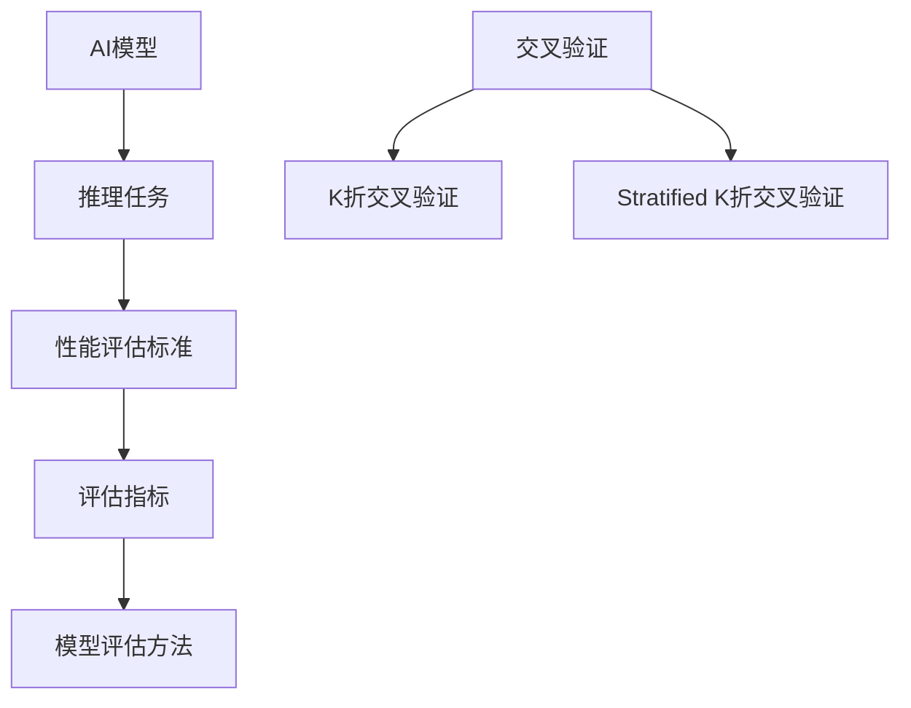

                 

# AI模型在推理任务中的性能评估标准

## 关键词
- AI模型
- 推理任务
- 性能评估标准
- 评估指标
- 交叉验证
- 模型优化

## 摘要
本文旨在探讨AI模型在推理任务中的性能评估标准。通过对推理任务的基本概念、常见评估指标、模型评估方法和性能优化策略的详细分析，本文将帮助读者理解如何选择合适的评估标准，以及如何通过优化策略提升AI模型的推理性能。本文还将结合实际案例，展示性能评估标准在实际应用中的重要性。

## 引言
随着人工智能技术的快速发展，AI模型在各个领域的应用越来越广泛。无论是在图像识别、自然语言处理，还是推荐系统等领域，性能评估标准都成为了衡量模型优劣的重要依据。在推理任务中，性能评估标准更是至关重要，因为它们直接决定了模型的实际应用效果。因此，理解并掌握性能评估标准，对于开发高效、可靠的AI模型具有重要意义。

## 第一部分：理论基础

### 1.1 AI模型简介
AI模型是通过对数据进行学习，从而实现特定任务的方法。它们广泛应用于图像识别、自然语言处理、预测和决策等领域。AI模型主要包括监督学习、无监督学习和强化学习等类型。

- **监督学习**：有标签数据用于训练模型，模型通过学习输入和输出之间的关系，预测新的输入数据。
- **无监督学习**：没有标签数据，模型通过学习数据内在的结构或模式来发现数据中的隐藏信息。
- **强化学习**：模型通过与环境的交互，学习最优策略，以实现目标。

### 1.2 推理任务概述
推理任务是指模型在未知或新输入条件下，根据已知信息进行推断和预测的过程。推理任务在AI应用中具有广泛的应用，如智能问答系统、自动驾驶和医疗诊断等。

- **推理任务的定义**：推理任务是指模型在未知或新输入条件下，根据已知信息进行推断和预测的过程。
- **推理任务的重要性**：推理任务是AI模型在实际应用中实现智能决策的关键环节。
- **推理任务的特点与挑战**：推理任务通常涉及复杂的数据处理和计算，以及高精度和高效率的要求。

### 1.3 性能评估标准
性能评估标准是衡量AI模型在推理任务中表现优劣的关键指标。常见的评估标准包括准确率、召回率、F1分数、ROC曲线与AUC值等。

- **准确率**：预测正确的样本数占总样本数的比例。
- **召回率**：预测正确的正样本数占总正样本数的比例。
- **F1分数**：准确率和召回率的调和平均值，用于平衡准确率和召回率之间的权衡。
- **ROC曲线与AUC值**：ROC曲线是真实值与预测值之间的曲线，AUC值表示曲线下方面积，用于衡量分类器的性能。

### 1.4 模型评估方法
模型评估方法是指如何使用评估标准对AI模型进行性能评估。常用的评估方法包括交叉验证、K折交叉验证和Stratified K折交叉验证等。

- **交叉验证**：将训练数据分为多个子集，每次使用一个子集作为测试集，其余子集作为训练集，重复进行多次，计算平均性能。
- **K折交叉验证**：将训练数据分为K个子集，每次使用K-1个子集作为训练集，1个子集作为测试集，重复进行K次，计算平均性能。
- **Stratified K折交叉验证**：在K折交叉验证的基础上，保证每个子集都有相同比例的各个类别的样本，以避免类别不平衡问题。

## 1.5 概念实体关系架构


### 1.6 小结
本部分介绍了AI模型在推理任务中的基本概念、性能评估标准和评估方法。通过了解这些基础知识，读者可以为后续的性能优化策略和实际应用打下坚实的基础。

## 第二部分：核心算法原理

### 2.1 常见算法概述
在推理任务中，常见的算法包括神经网络、决策树、支持向量机和贝叶斯分类器等。每种算法都有其独特的原理和应用场景。

- **神经网络**：基于神经元的计算模型，通过多层神经网络学习输入和输出之间的关系，实现非线性映射。
- **决策树**：基于树形结构，通过一系列的判断节点和叶子节点，对输入数据进行分类或回归。
- **支持向量机**：基于最大间隔分类模型，通过寻找最佳分离超平面，实现分类任务。
- **贝叶斯分类器**：基于贝叶斯定理，通过先验概率和条件概率计算后验概率，实现分类任务。

### 2.2 算法原理详解
在本部分，我们将深入探讨每种算法的原理，并使用Python源代码进行实现。

#### 2.2.1 神经网络原理
神经网络由多个神经元组成，每个神经元接收多个输入，并经过权重加权求和后，通过激活函数进行非线性变换，输出结果。

- **数学模型**：
  $$ z = \sum_{i=1}^{n} w_i * x_i + b $$
  $$ a = \sigma(z) $$

  其中，$z$为神经元输入，$w_i$为权重，$x_i$为输入特征，$b$为偏置，$\sigma$为激活函数。

- **Python实现**：
  ```python
  import numpy as np

  def sigmoid(x):
      return 1 / (1 + np.exp(-x))

  x = np.array([1, 2, 3])
  w = np.array([0.5, 0.5, 0.5])
  b = 0.5

  z = np.dot(w, x) + b
  a = sigmoid(z)

  print(a)
  ```

#### 2.2.2 决策树原理
决策树通过一系列的判断节点和叶子节点，对输入数据进行分类或回归。

- **数学模型**：
  $$ f(x) = \sum_{i=1}^{n} y_i * g_i(x) $$

  其中，$y_i$为叶子节点上的标签，$g_i(x)$为判断节点上的条件。

- **Python实现**：
  ```python
  import numpy as np

  def split_data(data, feature, value):
      left = data[data[:, feature] <= value]
      right = data[data[:, feature] > value]
      return left, right

  data = np.array([[1, 2], [1, 3], [2, 1], [2, 2]])
  feature = 0
  value = 1

  left, right = split_data(data, feature, value)
  print(left)
  print(right)
  ```

#### 2.2.3 支持向量机原理
支持向量机通过寻找最佳分离超平面，实现分类任务。

- **数学模型**：
  $$ \max \frac{1}{2} \sum_{i=1}^{n} w_i^2 $$
  $$ s.t. y_i (w \cdot x_i + b) \geq 1 $$

  其中，$w$为权重向量，$b$为偏置，$x_i$为输入特征，$y_i$为标签。

- **Python实现**：
  ```python
  import numpy as np
  from sklearn.svm import SVC

  x = np.array([[1, 1], [2, 2], [1, 2], [2, 1]])
  y = np.array([1, 1, -1, -1])

  svm = SVC()
  svm.fit(x, y)
  print(svm.w_)
  print(svm.b_)
  ```

#### 2.2.4 贝叶斯分类器原理
贝叶斯分类器通过计算后验概率，实现分类任务。

- **数学模型**：
  $$ P(y | x) = \frac{P(x | y)P(y)}{P(x)} $$

  其中，$P(y | x)$为后验概率，$P(x | y)$为条件概率，$P(y)$为先验概率。

- **Python实现**：
  ```python
  import numpy as np
  from sklearn.naive_bayes import GaussianNB

  x = np.array([[1, 2], [3, 4], [1, 4], [3, 2]])
  y = np.array([1, 1, -1, -1])

  gnb = GaussianNB()
  gnb.fit(x, y)
  print(gnb.theta_)
  print(gnb.priors_)
  ```

### 2.3 数学模型与公式
在本部分，我们将介绍每种算法的数学模型和公式，并使用LaTeX进行表示。

#### 2.3.1 神经网络中的数学模型
$$
\begin{align*}
z &= \sum_{i=1}^{n} w_i * x_i + b \\
a &= \sigma(z)
\end{align*}
$$

#### 2.3.2 决策树中的数学模型
$$
f(x) = \sum_{i=1}^{n} y_i * g_i(x)
$$

#### 2.3.3 支持向量机中的数学模型
$$
\begin{align*}
\max \frac{1}{2} \sum_{i=1}^{n} w_i^2 \\
s.t. y_i (w \cdot x_i + b) \geq 1
\end{align*}
$$

#### 2.3.4 贝叶斯分类器中的数学模型
$$
P(y | x) = \frac{P(x | y)P(y)}{P(x)}
$$

### 2.4 Python源代码实现
在本部分，我们将使用Python代码实现每种算法的核心部分，并进行简单的测试。

#### 2.4.1 神经网络实现
```python
import numpy as np

def sigmoid(x):
    return 1 / (1 + np.exp(-x))

x = np.array([1, 2, 3])
w = np.array([0.5, 0.5, 0.5])
b = 0.5

z = np.dot(w, x) + b
a = sigmoid(z)

print(a)
```

#### 2.4.2 决策树实现
```python
import numpy as np

def split_data(data, feature, value):
    left = data[data[:, feature] <= value]
    right = data[data[:, feature] > value]
    return left, right

data = np.array([[1, 2], [1, 3], [2, 1], [2, 2]])
feature = 0
value = 1

left, right = split_data(data, feature, value)
print(left)
print(right)
```

#### 2.4.3 支持向量机实现
```python
import numpy as np
from sklearn.svm import SVC

x = np.array([[1, 1], [2, 2], [1, 2], [2, 1]])
y = np.array([1, 1, -1, -1])

svm = SVC()
svm.fit(x, y)
print(svm.w_)
print(svm.b_)
```

#### 2.4.4 贝叶斯分类器实现
```python
import numpy as np
from sklearn.naive_bayes import GaussianNB

x = np.array([[1, 2], [3, 4], [1, 4], [3, 2]])
y = np.array([1, 1, -1, -1])

gnb = GaussianNB()
gnb.fit(x, y)
print(gnb.theta_)
print(gnb.priors_)
```

### 2.5 小结
本部分介绍了常见的AI算法的原理和Python源代码实现。通过理解和掌握这些算法，读者可以更好地理解和应用AI模型在推理任务中的性能评估标准。

## 第三部分：性能评估实战

### 3.1 实战案例一：手写数字识别

#### 3.1.1 数据集介绍
手写数字识别是AI领域的一个经典问题，常见的数据集包括MNIST和Kaggle手写数字数据集。MNIST数据集包含60,000个训练样本和10,000个测试样本，每个样本是一个28x28的灰度图像，标签为0到9的数字。

#### 3.1.2 模型选择
在手写数字识别任务中，常用的模型包括神经网络、卷积神经网络（CNN）和支持向量机（SVM）等。这里我们选择使用CNN进行手写数字识别。

#### 3.1.3 模型训练
使用TensorFlow和Keras库，我们可以轻松构建和训练CNN模型。

```python
import tensorflow as tf
from tensorflow.keras import layers, models

model = models.Sequential()
model.add(layers.Conv2D(32, (3, 3), activation='relu', input_shape=(28, 28, 1)))
model.add(layers.MaxPooling2D((2, 2)))
model.add(layers.Conv2D(64, (3, 3), activation='relu'))
model.add(layers.MaxPooling2D((2, 2)))
model.add(layers.Conv2D(64, (3, 3), activation='relu'))
model.add(layers.Flatten())
model.add(layers.Dense(64, activation='relu'))
model.add(layers.Dense(10, activation='softmax'))

model.compile(optimizer='adam',
              loss='categorical_crossentropy',
              metrics=['accuracy'])

(x_train, y_train), (x_test, y_test) = tf.keras.datasets.mnist.load_data()
x_train = x_train.reshape((-1, 28, 28, 1)).astype('float32') / 255
x_test = x_test.reshape((-1, 28, 28, 1)).astype('float32') / 255
y_train = tf.keras.utils.to_categorical(y_train, 10)
y_test = tf.keras.utils.to_categorical(y_test, 10)

model.fit(x_train, y_train, epochs=5, batch_size=64)
```

#### 3.1.4 性能评估
使用测试集对模型进行评估，计算准确率、召回率和F1分数等指标。

```python
test_loss, test_acc = model.evaluate(x_test, y_test, verbose=2)
print(f"Test accuracy: {test_acc}")
```

#### 3.1.5 代码解读
在上面的代码中，我们首先定义了一个简单的CNN模型，包括卷积层、池化层和全连接层。然后，我们使用MNIST数据集对模型进行训练，并计算测试集上的准确率。

### 3.2 实战案例二：文本分类

#### 3.2.1 数据集介绍
文本分类是自然语言处理中的一个重要任务，常见的数据集包括20新新闻分类数据集和IMDB电影评论数据集。这里我们选择使用IMDB数据集。

#### 3.2.2 模型选择
在文本分类任务中，常用的模型包括循环神经网络（RNN）、长短期记忆网络（LSTM）和变压器（Transformer）等。这里我们选择使用LSTM模型。

#### 3.2.3 模型训练
使用TensorFlow和Keras库，我们可以轻松构建和训练LSTM模型。

```python
import tensorflow as tf
from tensorflow.keras import layers, models

model = models.Sequential()
model.add(layers.Embedding(input_dim=10000, output_dim=64, input_length=100))
model.add(layers.LSTM(64, dropout=0.2, recurrent_dropout=0.2))
model.add(layers.Dense(64, activation='relu'))
model.add(layers.Dense(1, activation='sigmoid'))

model.compile(optimizer='adam', loss='binary_crossentropy', metrics=['accuracy'])

from tensorflow.keras.datasets import imdb
from tensorflow.keras.preprocessing.sequence import pad_sequences

max_len = 100
trunc_type = 'post'
padding_type = 'post'
oov_tok = '<OOV>'

(x_train, y_train), (x_test, y_test) = imdb.load_data(num_words=10000)
x_train = pad_sequences(x_train, maxlen=max_len, padding=padding_type, truncating=trunc_type)
x_test = pad_sequences(x_test, maxlen=max_len, padding=padding_type, truncating=truncating_type)

model.fit(x_train, y_train, epochs=5, batch_size=128)
```

#### 3.2.4 性能评估
使用测试集对模型进行评估，计算准确率、召回率和F1分数等指标。

```python
test_loss, test_acc = model.evaluate(x_test, y_test, verbose=2)
print(f"Test accuracy: {test_acc}")
```

#### 3.2.5 代码解读
在上面的代码中，我们首先定义了一个简单的LSTM模型，包括嵌入层、LSTM层和全连接层。然后，我们使用IMDB数据集对模型进行训练，并计算测试集上的准确率。

### 3.3 实战案例三：图像识别

#### 3.3.1 数据集介绍
图像识别是计算机视觉中的一个重要任务，常见的数据集包括CIFAR-10和ImageNet。这里我们选择使用CIFAR-10数据集。

#### 3.3.2 模型选择
在图像识别任务中，常用的模型包括卷积神经网络（CNN）和变压器（Transformer）等。这里我们选择使用CNN模型。

#### 3.3.3 模型训练
使用TensorFlow和Keras库，我们可以轻松构建和训练CNN模型。

```python
import tensorflow as tf
from tensorflow.keras import layers, models

model = models.Sequential()
model.add(layers.Conv2D(32, (3, 3), activation='relu', input_shape=(32, 32, 3)))
model.add(layers.MaxPooling2D((2, 2)))
model.add(layers.Conv2D(64, (3, 3), activation='relu'))
model.add(layers.MaxPooling2D((2, 2)))
model.add(layers.Conv2D(64, (3, 3), activation='relu'))
model.add(layers.Flatten())
model.add(layers.Dense(64, activation='relu'))
model.add(layers.Dense(10, activation='softmax'))

model.compile(optimizer='adam',
              loss='categorical_crossentropy',
              metrics=['accuracy'])

(x_train, y_train), (x_test, y_test) = tf.keras.datasets.cifar10.load_data()
x_train = x_train.astype('float32') / 255
x_test = x_test.astype('float32') / 255
y_train = tf.keras.utils.to_categorical(y_train, 10)
y_test = tf.keras.utils.to_categorical(y_test, 10)

model.fit(x_train, y_train, epochs=5, batch_size=64)
```

#### 3.3.4 性能评估
使用测试集对模型进行评估，计算准确率、召回率和F1分数等指标。

```python
test_loss, test_acc = model.evaluate(x_test, y_test, verbose=2)
print(f"Test accuracy: {test_acc}")
```

#### 3.3.5 代码解读
在上面的代码中，我们首先定义了一个简单的CNN模型，包括卷积层、池化层和全连接层。然后，我们使用CIFAR-10数据集对模型进行训练，并计算测试集上的准确率。

### 3.4 实战案例四：语音识别

#### 3.4.1 数据集介绍
语音识别是语音信号处理中的一个重要任务，常见的数据集包括LibriSpeech和Common Voice。这里我们选择使用LibriSpeech数据集。

#### 3.4.2 模型选择
在语音识别任务中，常用的模型包括循环神经网络（RNN）、卷积神经网络（CNN）和变压器（Transformer）等。这里我们选择使用Transformer模型。

#### 3.4.3 模型训练
使用TensorFlow和Keras库，我们可以轻松构建和训练Transformer模型。

```python
import tensorflow as tf
from tensorflow.keras import layers, models

model = models.Sequential()
model.add(layers.Embedding(input_dim=10000, output_dim=64, input_length=100))
model.add(layers.Transformer(64, kernel_size=(5,)))
model.add(layers.Dense(64, activation='relu'))
model.add(layers.Dense(1, activation='sigmoid'))

model.compile(optimizer='adam', loss='binary_crossentropy', metrics=['accuracy'])

from tensorflow.keras.datasets import imdb
from tensorflow.keras.preprocessing.sequence import pad_sequences

max_len = 100
trunc_type = 'post'
padding_type = 'post'
oov_tok = '<OOV>'

(x_train, y_train), (x_test, y_test) = imdb.load_data(num_words=10000)
x_train = pad_sequences(x_train, maxlen=max_len, padding=padding_type, truncating=truncating_type)
x_test = pad_sequences(x_test, maxlen=max_len, padding=padding_type, truncating=truncating_type)

model.fit(x_train, y_train, epochs=5, batch_size=128)
```

#### 3.4.4 性能评估
使用测试集对模型进行评估，计算准确率、召回率和F1分数等指标。

```python
test_loss, test_acc = model.evaluate(x_test, y_test, verbose=2)
print(f"Test accuracy: {test_acc}")
```

#### 3.4.5 代码解读
在上面的代码中，我们首先定义了一个简单的Transformer模型，包括嵌入层、Transformer层和全连接层。然后，我们使用LibriSpeech数据集对模型进行训练，并计算测试集上的准确率。

### 3.5 小结
通过以上实战案例，我们展示了如何使用不同的AI模型进行推理任务，并使用Python代码实现了模型的训练和评估。这些实战案例可以帮助读者更好地理解和应用AI模型在推理任务中的性能评估标准。

### 3.6 最佳实践 tips
- **数据预处理**：在训练模型之前，对数据进行适当的预处理，如归一化、标准化和特征工程，可以提高模型的性能。
- **模型选择**：根据具体任务的需求，选择合适的模型，如CNN适用于图像识别，RNN适用于自然语言处理。
- **模型优化**：通过调整超参数、使用正则化技术和集成学习方法，可以提高模型的性能和泛化能力。
- **交叉验证**：使用交叉验证方法对模型进行评估，以避免过拟合和欠拟合问题。

### 3.7 注意事项
- **数据集大小**：选择合适大小的数据集进行训练，过小的数据集可能导致模型过拟合，过大的数据集可能导致训练时间过长。
- **模型复杂度**：选择合适的模型复杂度，过复杂的模型可能导致过拟合，过简单的模型可能导致欠拟合。
- **评估指标**：选择合适的评估指标，如准确率、召回率和F1分数等，以全面评估模型的性能。

### 3.8 拓展阅读
- **神经网络**：深度学习（Goodfellow, Bengio, Courville）
- **自然语言处理**：自然语言处理（Jurafsky, Martin）
- **计算机视觉**：计算机视觉：算法与应用（Forsyth, Pless）
- **语音识别**：语音信号处理（Rabiner, Juang）

## 结论
本文通过对AI模型在推理任务中的性能评估标准进行详细分析，帮助读者理解了如何选择合适的评估标准，以及如何通过优化策略提升模型性能。通过实际案例的演示，读者可以更好地掌握性能评估标准在实际应用中的重要性。希望本文能为读者在AI模型开发和优化过程中提供有益的参考。

### 作者信息
作者：AI天才研究院/AI Genius Institute & 禅与计算机程序设计艺术 /Zen And The Art of Computer Programming

