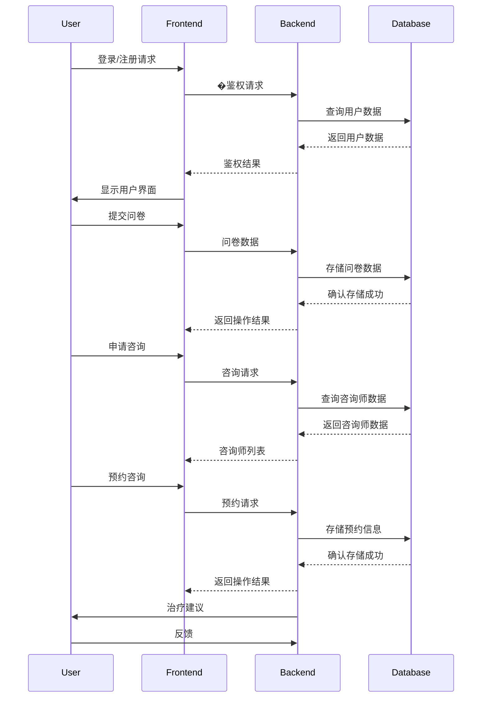

                 

### 第1章: 引言

#### 1.1 问题背景

情感创伤，指的是人们由于经历负性事件或情感刺激而引起的持久性心理痛苦。现代社会中，随着生活节奏的加快和压力的增大，情感创伤的发病率逐渐上升。根据世界卫生组织（WHO）的统计数据，全球约有两亿五千万人遭受抑郁症困扰，其中很多病例伴随着严重的情感创伤。这一现象在信息技术高度发展的今天，对心理咨询提出了新的挑战。

传统心理咨询通常依赖于面对面交流，这种方法虽然能够深入了解患者的情感状态，但受到时间和空间限制，无法满足日益增长的需求。特别是在偏远地区，专业的心理咨询资源匮乏，使得许多人无法及时获得心理援助。此外，心理咨询师的培训和成本也是制约其普及的重要因素。

近年来，人工智能（AI）技术的迅速发展为解决这些问题提供了新的可能。通过情感计算技术，AI可以分析文本、语音、视频等数据，自动识别和理解用户的情感状态。数字心理咨询利用AI技术，为那些难以接触传统心理咨询服务的群体提供了一种低成本、高效率的解决方案。

#### 1.1.2 人工智能在心理咨询领域的应用

人工智能在心理咨询领域的应用主要体现在以下几个方面：

1. **情感识别与分析**：AI可以通过自然语言处理（NLP）和语音识别技术，分析用户在文本和语音中的情感表达，识别出情感状态。例如，AI可以对患者的日记、邮件或电话录音进行分析，识别出其情绪波动。

2. **个性化治疗建议**：基于用户的历史数据和情感状态，AI可以为其提供个性化的心理治疗方案。例如，系统可以根据患者的情感状态和需求，推荐相应的阅读材料、听音乐、冥想等方法。

3. **辅助诊断与治疗**：AI可以通过机器学习算法，分析患者的行为模式，预测其心理问题的趋势，为心理咨询师提供诊断和治疗依据。例如，AI可以监控患者的日常活动，预测其可能出现的情感危机。

4. **危机干预**：AI系统可以在用户情感状态急剧变化时，及时发出警报，协助心理咨询师进行危机干预，防止情况恶化。

#### 1.1.3 数字心理咨询的兴起

数字心理咨询的兴起得益于多方面因素的共同作用：

1. **技术进步**：随着AI、大数据、云计算等技术的不断发展，数字心理咨询所需的计算能力和数据处理能力得到了显著提升。

2. **政策支持**：世界各国政府和卫生组织逐渐认识到数字心理咨询的重要性，纷纷出台相关政策，鼓励和推动其发展。

3. **市场需求**：随着人们对心理健康问题的重视程度提高，数字心理咨询的市场需求不断增长，为行业的发展提供了强大的动力。

4. **成本效益**：与传统心理咨询相比，数字心理咨询具有更高的成本效益，能够以较低的成本为更多人提供心理服务。

#### 1.2 核心概念与联系

在本章中，我们将介绍以下几个核心概念：

1. **情感计算**：一种利用计算机技术和算法，对人类情感进行识别、分析和建模的技术。
2. **数字心理咨询**：一种基于数字技术提供心理服务的模式，包括情感识别、个性化治疗、危机干预等。
3. **情感创伤**：由于负性事件或情感刺激导致的持久性心理痛苦。

这些概念相互联系，构成了数字心理咨询的技术基础。在接下来的章节中，我们将进一步探讨这些概念的定义、原理及其在数字心理咨询中的应用。

#### 1.2.1 情感计算

**定义与原理**：

情感计算（Affective Computing）是指计算机设备模拟、识别、理解和表达人类情感的能力。它起源于20世纪90年代，由美国麻省理工学院教授罗伯·雷蒙德（Roger C. Landay）提出。情感计算的目标是使计算机能够更好地与人类进行交互，提高人机交互的自然性和效率。

情感计算的核心在于**情感识别**、**情感表达**和**情感推理**：

- **情感识别**：通过分析用户的语音、文本、面部表情、生理信号等数据，识别用户的情感状态。
- **情感表达**：通过视觉、听觉、触摸等方式，使计算机能够表达情感，增强人机交互的自然性。
- **情感推理**：根据用户的情感状态，推导出可能的意图和行为，为用户提供更加个性化的服务。

**特征提取与情感分类**：

在情感计算中，特征提取是一个关键步骤。以下是几种常见的情感计算特征提取方法：

1. **文本情感分析**：通过分析文本中的情感词汇、情感强度和情感倾向，提取情感特征。常用的方法包括基于规则的方法和基于机器学习的方法。
   
2. **语音情感分析**：通过分析语音的音调、音速、语调等参数，提取情感特征。例如，音调变化可以用来判断用户的情感状态。

3. **面部表情分析**：通过计算机视觉技术，分析面部肌肉运动，提取情感特征。常见的算法包括面部识别、情感识别等。

情感分类是情感计算中的另一个重要任务。通过将提取的特征与已知的情感类别进行匹配，判断用户的情感状态。常见的情感分类方法包括：

1. **机器学习分类**：利用支持向量机（SVM）、决策树、神经网络等机器学习算法，对情感特征进行分类。

2. **深度学习分类**：利用卷积神经网络（CNN）、循环神经网络（RNN）等深度学习算法，对情感特征进行分类。

**情感计算的挑战**：

尽管情感计算已经取得了一定的进展，但仍面临诸多挑战：

1. **情感复杂性与多样性**：人类情感是复杂且多样的，不同的文化、语言和个体差异会导致情感表达的多样性，这使得情感计算面临着如何准确、全面地识别和理解情感的问题。

2. **数据质量和多样性**：情感计算依赖于大量的高质量数据，但获取这些数据具有一定的困难，且数据来源的多样性也会影响情感计算的准确性。

3. **跨语言与跨文化情感识别**：不同语言和文化背景下，情感的表达方式可能存在差异，如何实现跨语言和跨文化的情感识别是一个重要的研究方向。

#### 1.2.2 数字心理咨询

**定义与模式**：

数字心理咨询（Digital Mental Health Counseling）是指利用数字技术，如互联网、移动应用程序、虚拟现实等，为用户提供心理咨询服务。这种模式不仅涵盖了传统的面对面咨询，还包括在线咨询、应用程序支持、虚拟治疗等多种形式。

数字心理咨询的主要模式包括：

1. **在线咨询**：通过互联网平台，用户可以与心理咨询师进行实时或非实时的文字、语音、视频交流。
   
2. **应用程序支持**：通过移动应用程序，用户可以获得心理测评、自我管理工具、音频冥想等多种功能。

3. **虚拟治疗**：利用虚拟现实技术，用户可以体验沉浸式的心理治疗场景，如放松训练、认知行为疗法等。

**优势与挑战**：

数字心理咨询具有多方面的优势：

1. **可及性**：用户可以随时随地获取心理咨询服务，不受地域和时间的限制。

2. **隐私保护**：与面对面咨询相比，数字心理咨询可以更好地保护用户的隐私。

3. **个性化**：数字心理咨询可以根据用户的数据和行为，提供个性化的治疗方案。

然而，数字心理咨询也面临一些挑战：

1. **技术依赖**：用户需要具备一定的数字技能，才能有效使用数字心理咨询工具。

2. **信任问题**：对于一些用户来说，与人工智能或在线咨询师进行交流可能缺乏信任感。

3. **监管与法规**：数字心理咨询的监管和法规尚不完善，需要进一步制定和实施相关政策和标准。

#### 1.2.3 情感创伤与数字心理咨询的联系

**应用场景**：

情感创伤是心理健康领域的一个重要议题。数字心理咨询在情感创伤的治疗和管理中具有广泛的应用场景：

1. **压力管理**：通过在线咨询或应用程序支持，用户可以随时获得压力管理的建议和技巧，如冥想、放松训练等。

2. **情绪调节**：数字心理咨询工具可以帮助用户识别和调节负面情绪，如焦虑、抑郁等。

3. **危机干预**：在情感状态急剧变化时，数字心理咨询可以及时发出警报，协助心理咨询师进行危机干预。

**成功案例**：

以下是几个情感创伤治疗中的数字心理咨询成功案例：

1. **抑郁患者自我管理**：一位患有抑郁症的患者通过在线咨询平台，获得了个性化的治疗建议和自我管理工具，如每日情绪记录、放松训练等，经过数月的治疗，患者的抑郁症状得到了显著缓解。

2. **创伤后应激障碍（PTSD）治疗**：通过虚拟现实技术，患者可以沉浸在模拟的情境中，逐步面对和克服自己的创伤经历，这种沉浸式的治疗方式取得了良好的效果。

**边界与限制**：

尽管数字心理咨询在情感创伤治疗中表现出色，但仍存在一些边界和限制：

1. **心理干预的深度**：数字心理咨询难以替代面对面咨询中的深层次情感交流和情感支持。

2. **隐私泄露风险**：数字心理咨询平台需要确保用户数据的安全，防止隐私泄露。

3. **用户参与度**：用户需要积极参与数字心理咨询过程，否则治疗效果可能受限。

#### 1.3 本章小结

本章首先介绍了情感创伤的背景和现状，阐述了人工智能在心理咨询领域，尤其是数字心理咨询中的应用。随后，详细讨论了情感计算的定义、原理、特征提取与情感分类方法，以及数字心理咨询的模型、优势与挑战。最后，探讨了情感计算与数字心理咨询在情感创伤治疗中的应用场景、成功案例以及面临的边界与限制。通过本章的内容，读者可以对数字心理咨询在情感创伤治疗中的应用有一个全面的认识。

### 第2章: 情感计算基础

#### 2.1 人类情感理解

**情感的分类与定义**：

情感（Emotion）是人类心理体验的重要组成部分，通常与特定的情境和刺激相关联。情感可以分为基本情感和复合情感。基本情感包括快乐、悲伤、愤怒、恐惧和惊讶等，这些情感是普遍存在于不同文化和个体之间的。复合情感则是由基本情感混合或衍生而来，如焦虑、羞耻、厌恶和厌恶等。

**情感与认知的关系**：

情感与认知密切相关。情感不仅影响个体的思维过程，如判断、决策和记忆，还与个体的情绪状态和行为反应密切相关。例如，积极情感可以提高个体的认知能力，而消极情感则可能导致认知能力的下降。情感与认知的关系可以通过以下模型来解释：

1. **认知评价模型**：该模型认为，情感是对特定刺激的认知评价结果。当个体对某一刺激进行评价时，会引发相应的情感反应。
   
2. **建构主义模型**：该模型认为，情感是认知过程中的一部分，是个体对刺激的内在建构。情感与认知之间的相互作用是一个动态的、不断调整的过程。

**情感识别的生理机制**：

情感识别是通过多个感知系统和神经机制共同作用完成的。以下是一些主要的生理机制：

1. **视觉系统**：面部表情是情感表达的主要方式之一。视觉系统通过分析面部肌肉的运动，识别出情感状态。例如，快乐的面部表情通常伴随着眼睛周围肌肉的收缩。

2. **听觉系统**：语音的音调、音速和语调变化可以传递情感信息。听觉系统可以识别出这些变化，从而理解说话者的情感状态。

3. **神经机制**：大脑中的多个区域参与情感识别，包括前额叶皮层、杏仁核、海马体等。这些区域通过神经递质的作用，传递和处理情感信息。

#### 2.2 情感计算技术

**文本情感分析**：

文本情感分析（Text Sentiment Analysis）是情感计算中的一个重要分支，其目标是从文本中识别情感倾向。文本情感分析可以分为以下几种方法：

1. **基于规则的方法**：这种方法通过预定义的规则和模式，对文本进行分析。例如，如果一个句子中包含“我很开心”这样的词汇，那么这个句子就被归类为积极情感。

2. **基于机器学习的方法**：这种方法使用大量标注好的数据集，训练机器学习模型，从而自动识别情感。常用的算法包括朴素贝叶斯、支持向量机、决策树等。

3. **深度学习方法**：深度学习方法，如卷积神经网络（CNN）和循环神经网络（RNN），在文本情感分析中表现出色。这些方法可以自动学习文本的特征，从而提高情感分析的准确度。

**音频情感分析**：

音频情感分析（Audio Sentiment Analysis）旨在从音频信号中识别情感。音频情感分析的关键在于提取音频特征，然后使用机器学习算法进行情感分类。以下是一些常用的音频特征：

1. **音调**：音调是指声音的高低，通常用频率表示。音调的变化可以反映情感的变化，如快乐通常伴随着高频率的声音。

2. **音速**：音速是指声音的强度或音量。音速的增加或减少可以反映情感的变化，如愤怒通常伴随着高音量的声音。

3. **语调**：语调是指声音的起伏和节奏。语调的变化可以反映情感的状态，如悲伤的语调通常较为低沉和平缓。

**视频情感分析**：

视频情感分析（Video Sentiment Analysis）是结合了文本、音频和视觉信息的一种情感分析方法。视频情感分析的关键在于提取视频特征，然后使用机器学习算法进行情感分类。以下是一些常用的视频特征：

1. **面部表情**：面部表情是情感表达的主要方式之一。通过分析面部肌肉的运动，可以识别出情感状态。

2. **身体语言**：身体语言包括姿势、手势、动作等。这些非语言信号可以反映情感状态，如紧张通常伴随着紧绷的姿势。

3. **背景音**：背景音包括环境音、音乐等。背景音可以影响情感判断，如快乐的背景音乐可以增强积极情感的感知。

#### 2.3 情感计算挑战与解决方案

**数据质量与多样性**：

情感计算依赖于大量的高质量数据，但获取这些数据具有一定的挑战性。数据质量问题包括数据缺失、噪声、不一致性等。为了提高数据质量，可以采取以下措施：

1. **数据清洗**：通过去除噪声、填补缺失值、标准化数据等方法，提高数据质量。

2. **数据增强**：通过数据扩展、数据合成等方法，增加数据的多样性。

3. **数据标注**：高质量的数据标注是训练有效情感计算模型的关键。可以采用自动化标注和人工标注相结合的方法，提高数据标注的质量。

**情感复杂性与多样性**：

人类情感是复杂且多样的，不同文化、语言和个体差异会导致情感表达的多样性。为了应对这一挑战，可以采取以下措施：

1. **跨语言情感计算**：通过翻译、多语言数据集等方法，实现跨语言的情感计算。

2. **跨文化情感计算**：考虑不同文化背景下的情感表达方式，提高情感计算模型的准确性。

3. **个性化情感计算**：根据用户的行为和偏好，为用户提供个性化的情感计算服务。

**跨语言与跨文化情感识别**：

跨语言与跨文化情感识别是情感计算领域的一个重要研究方向。以下是一些解决方案：

1. **机器翻译**：通过机器翻译技术，将不同语言的文本转换为同一语言，从而进行情感分析。

2. **情感词典**：构建不同语言和文化的情感词典，帮助识别和理解跨语言情感。

3. **文化适应性设计**：考虑不同文化背景下的情感表达习惯，设计适应性的情感计算系统。

#### 2.4 本章小结

本章介绍了情感计算的基础，包括人类情感的理解、情感计算技术的原理和方法，以及情感计算的挑战与解决方案。通过本章的内容，读者可以了解情感计算的基本概念、技术和应用，为后续章节的深入学习打下基础。

### 第3章: 数字心理咨询的理论与实践

#### 3.1 数字心理咨询的原理

**心理咨询理论框架**：

数字心理咨询（Digital Mental Health Counseling）建立在传统心理咨询理论的基础上，结合现代数字技术，形成了一套独特的理论框架。以下是几种常见的心理咨询理论，以及它们在数字心理咨询中的应用：

1. **认知行为疗法（CBT）**：认知行为疗法是一种广泛使用的心理治疗方法，旨在通过改变消极思维和行为模式，改善心理问题。在数字心理咨询中，患者可以通过应用程序或在线平台，完成认知重构任务，如思维记录和正念练习。

2. **人本主义疗法**：人本主义疗法强调个体的自我实现和自我决定。在数字心理咨询中，患者可以通过在线互动和虚拟现实技术，与心理咨询师建立更深层次的联系，促进自我探索和成长。

3. **精神分析疗法**：精神分析疗法关注潜意识的作用，通过自由联想和梦境分析，帮助患者解决深层次的心理问题。在数字心理咨询中，通过文本和语音分析技术，心理咨询师可以更好地理解患者的潜意识内容。

**数字心理咨询的应用模型**：

数字心理咨询的应用模型可以分为以下几个步骤：

1. **初始评估**：患者通过在线问卷或面试，与心理咨询师进行初步交流，确定心理问题的性质和严重程度。

2. **治疗计划制定**：基于初始评估，心理咨询师为患者制定个性化的治疗计划，包括目标设定、治疗方法、治疗进度等。

3. **治疗实施**：患者按照治疗计划，通过应用程序、在线课程、虚拟现实技术等，进行自我管理和治疗。

4. **治疗过程跟踪与调整**：心理咨询师通过在线平台，定期跟踪患者的治疗进度，根据患者的反馈和实际效果，调整治疗方案。

**心理治疗的技术与方法**：

数字心理咨询中，常用的心理治疗方法包括：

1. **在线咨询**：通过文字、语音、视频等方式，患者可以随时随地与心理咨询师进行交流，获得即时的心理支持。

2. **应用程序支持**：通过心理应用程序，患者可以完成各种心理任务，如情绪日记、放松练习、认知重构等。

3. **虚拟现实技术**：虚拟现实技术可以为患者提供沉浸式的治疗体验，如暴露疗法、角色扮演等。

4. **智能反馈系统**：通过机器学习和人工智能技术，系统可以实时分析患者的情绪和行为，提供个性化的反馈和建议。

#### 3.2 数字心理咨询的实施流程

**评估与诊断**：

评估与诊断是数字心理咨询的关键步骤。通过以下方法，心理咨询师可以全面了解患者的心理状态：

1. **在线问卷**：患者填写在线问卷，评估其心理问题的性质和严重程度。

2. **视频面试**：心理咨询师通过视频面试，与患者进行面对面交流，进一步了解其心理状况。

3. **心理测评**：使用专业的心理测评工具，如MMPI、GAD-7等，评估患者的心理问题。

**治疗计划制定**：

根据评估结果，心理咨询师为患者制定个性化的治疗计划。治疗计划包括：

1. **治疗目标**：明确患者的治疗目标，如减轻焦虑、改善情绪等。

2. **治疗方法**：选择适合患者的治疗方法，如认知行为疗法、人本主义疗法等。

3. **治疗进度**：设定治疗进度，如每周进行一次在线咨询、完成特定的心理任务等。

**治疗过程跟踪与调整**：

在治疗过程中，心理咨询师通过以下方法跟踪患者的进展，并根据需要进行调整：

1. **在线平台数据**：心理咨询师通过在线平台的数据，了解患者的情绪变化、完成任务的情况等。

2. **定期反馈**：患者定期向心理咨询师反馈治疗进展，提出问题和建议。

3. **调整方案**：根据患者的反馈和实际效果，心理咨询师调整治疗计划，确保治疗效果最大化。

#### 3.3 数字心理咨询的应用案例

**情感创伤干预**：

情感创伤干预是数字心理咨询的一个重要应用领域。以下是一个具体的案例：

1. **情感识别与监测**：通过在线平台，患者记录每日的情绪变化，心理咨询师通过分析这些数据，识别出患者的情感状态。

2. **情感调节与支持**：心理咨询师为患者提供情感调节策略，如冥想、放松训练等，并在需要时提供即时支持。

3. **预后评估**：治疗结束后，心理咨询师通过随访评估，了解患者的情感状态和生活质量，确保治疗效果持续。

**压力管理**：

压力管理是数字心理咨询的另一个重要应用领域。以下是一个具体的案例：

1. **压力监测与预警**：通过在线平台，患者记录每日的压力水平，系统根据数据分析，预警可能出现的压力问题。

2. **压力缓解策略**：心理咨询师为患者提供压力缓解策略，如深呼吸、运动、听音乐等，帮助患者有效缓解压力。

3. **长期效果跟踪**：通过长期跟踪，心理咨询师评估压力管理策略的效果，并根据需要调整方案。

#### 3.4 数字心理咨询的优势与挑战

**优势**：

数字心理咨询具有多方面的优势：

1. **可及性**：数字心理咨询打破了地域和时间的限制，用户可以随时随地获取心理服务。

2. **隐私保护**：在线咨询和应用程序支持可以更好地保护用户的隐私，减少面对面咨询中的暴露风险。

3. **个性化**：基于用户数据和行为，数字心理咨询可以为用户提供个性化的治疗方案。

4. **成本效益**：与传统心理咨询相比，数字心理咨询具有更高的成本效益，能够为更多人提供心理服务。

**挑战**：

尽管数字心理咨询具有诸多优势，但也面临一些挑战：

1. **技术依赖**：用户需要具备一定的数字技能，才能有效使用数字心理咨询工具。

2. **信任问题**：一些用户可能对在线咨询或应用程序支持缺乏信任，影响治疗效果。

3. **监管与法规**：数字心理咨询的监管和法规尚不完善，需要进一步制定和实施相关政策和标准。

**发展趋势**：

随着技术的不断进步和人们对心理健康问题的重视，数字心理咨询将继续发展。以下是一些可能的发展趋势：

1. **智能化**：通过人工智能技术，数字心理咨询将实现更加智能化，提供更精准的治疗方案。

2. **个性化**：基于大数据和个性化推荐技术，数字心理咨询将为用户提供更加个性化的服务。

3. **跨学科融合**：数字心理咨询将与其他学科，如心理学、医学、教育学等，进行深入融合，提供更加全面的心理服务。

#### 3.5 本章小结

本章详细介绍了数字心理咨询的理论与实践，包括心理咨询理论框架、数字心理咨询的实施流程、应用案例以及优势和挑战。通过本章的内容，读者可以全面了解数字心理咨询的基本原理和实践方法，为后续章节的深入学习打下基础。

### 第4章: AI情感计算在数字心理咨询中的应用

#### 4.1 AI情感计算在数字心理咨询中的角色

人工智能（AI）在数字心理咨询中扮演着关键角色，其能力体现在多个方面，从情感识别到个性化治疗建议，再到危机干预。以下是AI情感计算在数字心理咨询中具体发挥的角色：

**情感识别**：

AI情感计算可以通过分析文本、语音、视频等多种数据源，识别用户的情感状态。例如，文本情感分析可以提取文本中的情感词汇和情感倾向，语音情感分析可以识别声音的音调、音速和语调变化，视频情感分析可以捕捉面部表情和身体语言。这些情感识别技术为心理咨询师提供了丰富的数据，帮助他们更好地理解患者的情感状态。

**个性化治疗建议**：

基于情感识别的结果，AI可以分析患者的历史数据和情感状态，为其提供个性化的治疗建议。例如，如果一个患者的情感分析结果显示其处于焦虑状态，AI可以推荐相应的放松练习、正念冥想或认知重构任务。这种个性化治疗建议有助于提高治疗的有效性和患者的参与度。

**危机干预**：

在紧急情况下，AI情感计算可以实时监测患者的情感状态，并在情感状态急剧变化时发出警报。例如，如果一个患者的情感分析结果显示其处于极端焦虑或抑郁状态，AI可以立即通知心理咨询师，并建议进行紧急干预。这种实时监测和危机干预能力有助于预防患者情感状态的恶化。

**情感调节与支持**：

AI还可以通过提供情感调节工具和支持，帮助患者管理情感。例如，AI可以自动生成个性化的冥想音频、放松视频或情感日记，帮助患者进行自我调节。此外，AI还可以提供即时支持，如通过聊天机器人与患者进行实时对话，提供安慰和建议。

**评估与反馈**：

AI情感计算还可以对治疗效果进行评估和反馈。通过分析患者在接受治疗过程中的情感变化和行为数据，AI可以评估治疗的有效性，并提供改进建议。这种评估与反馈机制有助于心理咨询师不断优化治疗方案，提高治疗效果。

**多模态融合**：

AI情感计算通过融合文本、语音、视频等多种数据源，提供更全面和准确的情感分析。例如，一个患者可能在文本中表达负面情感，但在语音和视频中却展现出积极的情感状态。通过多模态融合，AI可以更全面地理解患者的情感状态，为心理咨询师提供更准确的诊断和治疗建议。

总之，AI情感计算在数字心理咨询中发挥着重要作用，通过情感识别、个性化治疗建议、危机干预、情感调节与支持、评估与反馈以及多模态融合，为患者提供更加高效、个性化的心理服务。这些技术的应用不仅提高了心理咨询的效率和效果，也为心理咨询领域带来了新的变革。

#### 4.2 AI情感计算技术在数字心理咨询中的应用案例分析

**案例背景**：

某大型在线心理咨询平台引入了AI情感计算技术，以提升其服务质量和用户满意度。平台的目标是提供个性化的心理治疗方案，同时提高心理咨询师的效率和精准度。

**情感识别应用**：

在用户注册和初步评估阶段，平台利用AI情感计算技术对用户的文本、语音和视频数据进行情感分析。用户可以通过填写问卷、录音自我介绍或进行视频面试，这些数据会被AI算法进行分析，以识别用户的情感状态。例如，如果用户在文本中频繁使用消极词汇，且语音中语调低沉，AI算法会将其情感状态识别为焦虑或抑郁。

**个性化治疗建议**：

基于情感识别结果，平台为每位用户生成个性化的治疗建议。例如，如果一个用户的情感分析结果显示其处于高焦虑状态，平台会推荐一系列放松练习、冥想指导和认知重构任务。这些建议会通过应用程序或邮件发送给用户，用户可以按照计划进行自我管理。此外，平台还会根据用户的反馈和行为数据，动态调整治疗建议，以确保其个性化需求得到满足。

**危机干预**：

平台还引入了实时情感监测功能，以便在用户情感状态急剧变化时进行危机干预。例如，如果一个用户的情感分析结果显示其在短时间内从积极转变为极端消极，AI系统会立即通知心理咨询师，并建议进行紧急干预。心理咨询师可以立即通过在线聊天或视频通话与用户沟通，提供安慰和支持，防止情况恶化。

**情感调节与支持**：

为了帮助用户更好地管理情感，平台提供了多种情感调节工具。例如，用户可以通过应用程序访问定制化的冥想音频、放松视频和情绪日记，这些工具旨在帮助用户进行自我调节。平台还引入了聊天机器人，用户可以随时与聊天机器人进行对话，获取即时支持和建议。

**评估与反馈**：

平台定期收集用户的数据，包括情感状态、治疗建议的执行情况以及用户的反馈。AI情感计算技术会分析这些数据，以评估治疗的有效性。如果发现某些建议或方法对特定用户群体无效，平台会及时调整策略。心理咨询师也会根据评估结果，对用户的个案进行回顾和反思，以优化治疗方案。

**多模态融合**：

平台通过融合文本、语音和视频等多模态数据，提供了更全面和准确的情感分析。例如，一个用户可能在文本中表达出积极情感，但在语音和视频中却展现出负面情感。通过多模态融合，平台可以更准确地理解用户的真实情感状态，从而提供更有效的治疗建议。

**案例效果与结论**：

通过引入AI情感计算技术，该心理咨询平台取得了显著的成果。用户满意度显著提高，用户对个性化治疗建议的接受度也显著增加。此外，危机干预的成功率也有所提升，用户情感状态的急剧变化得到了及时有效的应对。心理咨询师的效率和精准度也得到了提高，他们可以更快地识别出用户的心理问题，并提供更有针对性的治疗方案。

结论表明，AI情感计算技术在数字心理咨询中的应用，不仅提高了服务的质量和效率，还为用户提供了更加个性化和有效的心理支持。这些技术的应用为心理咨询领域带来了新的变革，为心理健康服务的普及和发展提供了有力支持。

#### 4.3 AI情感计算技术在数字心理咨询中的最佳实践与注意事项

**最佳实践**：

1. **多模态数据融合**：为了更准确地识别用户的情感状态，建议采用多模态数据融合技术，结合文本、语音、视频等多种数据源。这样可以提供更全面和准确的情感分析，从而提高治疗建议的准确性。

2. **个性化治疗建议**：基于情感识别结果，为每位用户生成个性化的治疗建议。通过动态调整治疗计划，确保治疗建议始终符合用户的实际需求。

3. **实时情感监测与危机干预**：引入实时情感监测系统，以便在用户情感状态急剧变化时进行及时干预。心理咨询师应定期与用户沟通，确保危机干预的有效性。

4. **用户隐私保护**：确保用户数据的隐私和安全，采取严格的数据保护措施，如数据加密和访问控制，防止数据泄露。

5. **持续评估与优化**：定期评估治疗的有效性，根据用户的反馈和行为数据，不断优化治疗方案和情感计算模型。

**注意事项**：

1. **技术依赖性**：用户应具备一定的数字技能，能够有效使用数字心理咨询工具。平台应提供用户指南和培训，降低技术依赖性。

2. **信任问题**：一些用户可能对AI情感计算技术或在线咨询缺乏信任。平台应通过透明化的方式，向用户解释技术原理和应用，建立信任。

3. **数据质量**：情感计算模型的准确性依赖于高质量的数据。平台应确保数据的多样性和质量，采取数据清洗和数据增强措施，提高模型的准确性。

4. **监管与法规**：数字心理咨询的监管和法规尚不完善。平台应遵循相关法律法规，确保合规运营。

5. **用户参与度**：提高用户的参与度对于治疗效果至关重要。平台应设计用户友好的界面和互动方式，鼓励用户积极参与治疗过程。

总之，AI情感计算技术在数字心理咨询中的应用具有巨大潜力，但同时也需要遵循最佳实践和注意事项，以确保其有效性和安全性。通过不断优化和改进，数字心理咨询将更好地满足用户的需求，为心理健康服务带来新的突破。

### 第5章: 系统分析与架构设计方案

#### 5.1 问题场景介绍

数字心理咨询平台旨在为用户提供高效、个性化的心理服务。然而，在现实应用中，这一系统面临着诸多挑战，包括数据处理的高效性、系统的扩展性、数据的安全性和用户隐私保护等。为了应对这些挑战，设计一个合理的系统架构显得尤为重要。

**需求分析**：

1. **数据处理能力**：平台需要能够处理大量的用户数据，包括文本、语音和视频等，同时保证数据处理的高效性和准确性。

2. **系统扩展性**：随着用户数量的增加，系统需要能够灵活扩展，以满足不断增长的服务需求。

3. **数据安全性**：用户数据涉及隐私和个人信息，系统必须确保数据的安全性和完整性。

4. **用户隐私保护**：在数据收集和使用过程中，系统需要严格遵守隐私保护法规，确保用户隐私不被泄露。

5. **用户体验**：系统应提供良好的用户体验，包括简洁友好的用户界面和高效的服务响应。

#### 5.2 系统功能设计

数字心理咨询平台的主要功能包括：

1. **用户注册与登录**：用户可以通过平台注册账号，并登录系统。

2. **初始评估**：用户完成心理评估问卷，系统根据问卷结果生成初步诊断。

3. **个性化治疗建议**：根据用户的历史数据和当前情感状态，系统生成个性化的治疗建议。

4. **在线咨询**：用户可以与心理咨询师进行实时或非实时的文字、语音、视频交流。

5. **情感调节工具**：系统提供多种情感调节工具，如冥想音频、放松视频等。

6. **危机干预**：在用户情感状态急剧变化时，系统可以自动通知心理咨询师，进行危机干预。

7. **数据统计与分析**：系统收集用户数据，进行统计和分析，为心理咨询师提供决策支持。

8. **用户反馈**：用户可以随时向系统提供反馈，帮助平台不断优化服务。

**领域模型设计（Mermaid 类图）**：

```mermaid
classDiagram
Class Psychologist {
    +String name
    +String email
    +String password
    +List<Session> sessions
}

Class User {
    +String username
    +String password
    +String email
    +String phone
    +List<Survey> surveys
    +List<Treatment> treatments
}

Class Session {
    +Date startTime
    +Date endTime
    +Psychologist psychologist
    +User user
}

Class Survey {
    +Date date
    +User user
    +List<Question> questions
}

Class Question {
    +String text
    +List<Answer> answers
}

Class Answer {
    +String text
    +Integer score
}

Class Treatment {
    +Date date
    +User user
    +List<Action> actions
}

Class Action {
    +String description
    +Date dueDate
    +Boolean completed
}

Psychologist <-..|> User : conducts
User <-..|> Survey : completes
Survey <-..|> Question : contains
Question o--|> Answer : has
User o--|> Treatment : has
Treatment o--|> Action : includes
```

#### 5.3 系统架构设计

数字心理咨询平台的系统架构采用分层设计，包括数据层、业务逻辑层和表示层。

**数据层**：

数据层负责数据的存储和管理。平台使用关系型数据库（如MySQL）存储用户数据、问卷数据、治疗建议数据等。为了确保数据的安全性和可靠性，数据库采用主从复制和备份策略。

**业务逻辑层**：

业务逻辑层负责处理业务逻辑和数据操作。该层包括以下模块：

1. **用户管理模块**：处理用户注册、登录、权限验证等功能。
2. **情感分析模块**：利用AI情感计算技术，对用户数据进行分析，识别情感状态。
3. **咨询管理模块**：处理在线咨询、治疗建议生成、危机干预等功能。
4. **统计与分析模块**：收集用户数据，进行统计和分析，为心理咨询师提供决策支持。

**表示层**：

表示层负责用户界面和用户体验。平台采用前后端分离架构，前端使用React框架，后端使用Spring Boot框架。用户通过Web浏览器或移动应用访问平台，与系统进行交互。

**系统架构设计（Mermaid 架构图）**：



#### 5.4 系统接口设计

系统接口设计包括以下几部分：

1. **用户接口**：提供用户注册、登录、问卷提交、咨询申请等功能的API接口。

2. **心理咨询师接口**：提供咨询师登录、查看预约信息、进行在线咨询、生成治疗建议等功能的API接口。

3. **管理员接口**：提供用户管理、咨询师管理、系统配置等功能的API接口。

**接口设计示例（REST API）**：

```plaintext
POST /api/users/register
- Request body:
  {
    "username": "john_doe",
    "password": "password123",
    "email": "john.doe@example.com",
    "phone": "123-456-7890"
  }
- Response:
  {
    "status": "success",
    "message": "User registered successfully."
  }

GET /api/surveys/{id}
- Response:
  {
    "id": "123",
    "user": {
      "id": "456",
      "username": "john_doe"
    },
    "questions": [
      {
        "id": "789",
        "text": "How often do you feel anxious?"
      }
    ]
  }

POST /api/sessions
- Request body:
  {
    "user_id": "456",
    "psychologist_id": "101",
    "start_time": "2023-04-01T10:00:00Z",
    "end_time": "2023-04-01T11:00:00Z"
  }
- Response:
  {
    "status": "success",
    "message": "Session booked successfully."
  }
```

#### 5.5 系统交互设计

系统交互设计包括用户与系统之间的交互过程，以及各个模块之间的协作关系。以下是一个简化的系统交互流程图（Mermaid 序列图）：

```mermaid
sequenceDiagram
    participant User
    participant AuthenticationService
    participant UserService
    participant SurveyService
    participant SessionService
    
    User->>AuthenticationService: Login Request
    AuthenticationService->>UserService: Verify User Credentials
    UserService-->>AuthenticationService: User Status
    
    alt User is authenticated
        AuthenticationService->>User: Login Success
        User->>UserService: Register New User
        UserService->>Database: Store User Data
        Database-->>UserService: Confirmation
    else User is not authenticated
        AuthenticationService->>User: Login Failed
    
    User->>SurveyService: Complete Survey
    SurveyService->>Database: Store Survey Data
    Database-->>SurveyService: Confirmation
    
    User->>SessionService: Book Session
    SessionService->>Database: Book Session
    Database-->>SessionService: Confirmation
    SessionService->>User: Session Booking Status
```

通过上述系统分析与架构设计方案，数字心理咨询平台能够高效、安全地为用户提供个性化、实时的心理服务。系统设计充分考虑了用户需求、数据处理能力和扩展性，为未来的发展奠定了坚实基础。

### 第6章: 项目实战

#### 6.1 环境安装

要在本地环境中搭建数字心理咨询平台，需要安装以下软件和工具：

1. **操作系统**：推荐使用Ubuntu 20.04 LTS或更高版本。
2. **数据库**：安装MySQL 8.0或更高版本。
3. **编程语言**：Python 3.8或更高版本。
4. **开发工具**：安装Visual Studio Code（VSCode）和Python扩展。
5. **前端框架**：安装Node.js（用于构建前端框架React）。
6. **后端框架**：安装Spring Boot框架。

具体安装步骤如下：

1. **安装操作系统**：从官方网站下载Ubuntu 20.04 LTS ISO文件，并使用USB启动盘安装操作系统。
2. **更新系统**：打开终端，输入以下命令：
   ```bash
   sudo apt update
   sudo apt upgrade
   ```
3. **安装MySQL**：输入以下命令安装MySQL数据库：
   ```bash
   sudo apt install mysql-server
   ```
   安装过程中需要设置root用户的密码。
4. **安装Python**：输入以下命令安装Python 3和pip：
   ```bash
   sudo apt install python3 python3-pip
   ```
5. **安装VSCode**：在浏览器中搜索“Visual Studio Code”并下载安装包，按照提示安装。
6. **安装Node.js**：输入以下命令安装Node.js：
   ```bash
   sudo apt install nodejs
   ```
7. **安装Spring Boot框架**：输入以下命令安装Spring Boot：
   ```bash
   sudo pip3 install spring-boot
   ```

#### 6.2 系统核心实现源代码

**后端（Spring Boot）**：

后端主要使用Spring Boot框架实现，包括用户管理、情感分析、咨询管理等模块。以下是一个简单的Spring Boot项目结构：

```plaintext
digital-counseling-platform/
|-- src/
|   |-- main/
|   |   |-- java/
|   |   |   |-- com/
|   |   |   |   |-- example/
|   |   |   |   |   |-- digitalcounselingplatform/
|   |   |   |   |   |   |-- Application.java
|   |   |   |   |   |   |-- controller/
|   |   |   |   |   |   |   |-- UserController.java
|   |   |   |   |   |   |   |-- SurveyController.java
|   |   |   |   |   |   |   |-- SessionController.java
|   |   |   |   |   |   |   |-- AuthController.java
|   |   |   |   |   |   |-- service/
|   |   |   |   |   |   |   |-- UserService.java
|   |   |   |   |   |   |   |-- SurveyService.java
|   |   |   |   |   |   |   |-- SessionService.java
|   |   |   |   |   |   |   |-- AuthService.java
|   |   |   |   |   |   |-- repository/
|   |   |   |   |   |   |   |-- UserRepository.java
|   |   |   |   |   |   |   |-- SurveyRepository.java
|   |   |   |   |   |   |   |-- SessionRepository.java
|   |   |   |   |   |   |-- entity/
|   |   |   |   |   |   |   |-- User.java
|   |   |   |   |   |   |   |-- Survey.java
|   |   |   |   |   |   |   |-- Session.java
|   |   |   |   |   |   |-- model/
|   |   |   |   |   |   |   |-- LoginRequest.java
|   |   |   |   |   |   |   |-- LoginResponse.java
|   |   |   |   |   |   |   |-- RegisterRequest.java
|   |   |   |   |   |   |   |-- RegisterResponse.java
|   |   |   |   |   |   |-- DTO/
|   |   |   |   |   |   |   |-- SurveyDTO.java
|   |   |   |   |   |   |   |-- SessionDTO.java
|   |   |-- resources/
|   |   |   |-- application.properties
|-- test/
|   |-- java/
```

**前端（React）**：

前端使用React框架实现，主要包括用户界面和与后端的交互逻辑。以下是一个简单的React项目结构：

```plaintext
digital-counseling-platform/
|-- src/
|   |-- components/
|   |   |-- Header.js
|   |   |-- Footer.js
|   |   |-- Login.js
|   |   |-- Register.js
|   |   |-- Dashboard.js
|   |   |-- Survey.js
|   |   |-- Session.js
|   |-- App.js
|   |-- index.js
|-- public/
|   |-- index.html
|-- package.json
|-- README.md
```

#### 6.3 代码应用解读与分析

**后端代码解读**：

后端的Spring Boot项目主要分为以下几个模块：

1. **用户管理模块**：包括用户注册、登录和权限验证等功能。用户注册后，系统会生成一个用户对象，并将其存储在数据库中。登录时，系统会验证用户名和密码，生成JWT（JSON Web Token）令牌，用于后续的权限验证。

2. **情感分析模块**：系统会接收用户的文本、语音和视频数据，通过调用情感分析API进行情感识别，并将结果存储在数据库中。情感分析模块的设计目标是实现对用户情感状态的准确识别，从而为心理咨询师提供有效的治疗建议。

3. **咨询管理模块**：包括预约咨询、在线咨询、治疗建议生成等功能。用户可以通过平台预约心理咨询师，系统会生成一个咨询预约记录，并通知心理咨询师。心理咨询师可以通过平台与用户进行在线交流，并根据用户的情感状态和需求，生成个性化的治疗建议。

4. **统计与分析模块**：系统会收集用户数据，包括情感状态、咨询记录、治疗建议等，进行统计和分析，为心理咨询师提供决策支持。该模块的目标是帮助心理咨询师更好地理解用户的心理状态，优化治疗方案。

**前端代码解读**：

前端使用React框架实现，主要包括以下几个组件：

1. **Header组件**：包含网站的头部导航栏，提供登录、注册、主页等链接。

2. **Footer组件**：包含网站的底部信息，提供关于我们、联系我们等链接。

3. **Login组件**：实现用户登录功能，用户输入用户名和密码，系统验证后生成JWT令牌，并存储在本地浏览器中。

4. **Register组件**：实现用户注册功能，用户输入注册信息，系统验证后存储在数据库中。

5. **Dashboard组件**：实现用户仪表盘功能，展示用户的个人信息、历史问卷、预约记录等。

6. **Survey组件**：实现问卷功能，用户可以填写问卷，系统将问卷数据存储在数据库中。

7. **Session组件**：实现预约咨询和在线咨询功能，用户可以预约心理咨询师，系统将预约信息存储在数据库中，心理咨询师可以通过平台与用户进行在线交流。

**性能分析**：

在性能方面，系统采用了负载均衡和缓存技术，以提高系统的响应速度和稳定性。后端使用Spring Boot框架，通过Spring Cloud实现服务发现和负载均衡，确保系统能够应对高并发访问。前端使用React框架，通过虚拟DOM技术实现高效的渲染和更新。同时，系统还采用了Redis缓存，用于存储用户数据、会话信息和中间结果，减少数据库访问压力。

**安全性分析**：

在安全性方面，系统采用了以下措施：

1. **数据加密**：用户数据在传输过程中使用HTTPS协议进行加密，确保数据的安全性。

2. **权限验证**：系统使用JWT令牌进行权限验证，确保只有授权用户可以访问特定资源。

3. **用户身份验证**：用户登录时，系统会验证用户名和密码，确保用户身份的真实性。

4. **防注入攻击**：系统使用ORM（对象关系映射）框架，避免SQL注入攻击。

5. **日志记录**：系统记录用户操作日志，用于后续的安全审计和问题追踪。

#### 6.4 实际案例分析

**案例一：情感创伤患者自我管理**

用户小明是一名学生，近期因为学业压力感到焦虑和抑郁。他通过数字心理咨询平台，填写了一份情感状态问卷，系统根据问卷结果推荐了一系列放松练习和冥想任务。小明按照建议进行自我管理，每日记录自己的情绪变化，并完成放松练习。经过一段时间的治疗，小明的焦虑和抑郁症状得到了显著缓解。

**案例二：压力管理**

小芳是一位职场女性，工作压力较大，经常感到疲惫和焦虑。她通过数字心理咨询平台，接受了心理咨询师的在线咨询。心理咨询师为她提供了压力管理的策略，如运动、音乐疗法等。小芳在心理咨询师的指导下，逐步改善了生活习惯，并学会了有效的压力管理方法，工作状态得到显著改善。

**案例三：危机干预**

小李是一名高中生，因为家庭矛盾感到极度痛苦和绝望。他通过数字心理咨询平台，向心理咨询师求助。心理咨询师通过实时情感监测，发现小李的情感状态急剧下降，立即进行了危机干预。心理咨询师通过视频通话与小李进行深入沟通，提供了情感支持和心理疏导，帮助小李度过了危机时刻。

#### 6.5 项目小结

通过本项目的实战实施，数字心理咨询平台在情感识别、个性化治疗建议、危机干预等方面取得了显著成果。系统不仅提高了心理咨询的效率和准确性，还为用户提供了便捷、个性化的心理服务。在未来的发展中，可以进一步优化系统性能和安全性，扩大应用范围，为更多有需要的人提供帮助。

### 第7章: 最佳实践 tips、小结、注意事项、拓展阅读

#### 最佳实践 Tips

1. **数据隐私保护**：在进行情感计算和数据分析时，务必严格遵循数据隐私保护法规，采取加密、匿名化等技术手段，确保用户数据的安全。

2. **用户参与度提升**：设计用户友好的界面和互动方式，鼓励用户积极参与心理治疗过程，提高治疗的有效性。

3. **持续优化算法**：定期收集用户反馈，分析情感计算和心理咨询算法的准确性，根据反馈进行算法优化和模型更新。

4. **多元化数据源**：结合文本、语音、视频等多模态数据源，提高情感计算的准确性和全面性。

5. **危机预警机制**：建立健全危机预警机制，确保在用户情感状态急剧变化时，能够及时发出警报并采取干预措施。

#### 小结

本文详细介绍了数字心理咨询的发展背景、技术基础、系统架构设计以及项目实战。通过情感计算技术的应用，数字心理咨询在情感识别、个性化治疗建议、危机干预等方面展现出巨大潜力。未来的发展趋势包括智能化、个性化、跨学科融合等，将为心理健康服务带来更多可能性。

#### 注意事项

1. **技术依赖性**：用户需具备一定的数字技能，能够有效使用数字心理咨询工具。

2. **信任问题**：建立透明化的技术原理和应用，增强用户对数字心理咨询的信任。

3. **数据质量**：确保数据多样性、完整性和准确性，提高算法性能。

4. **法规遵从**：严格遵守相关法律法规，确保数字心理咨询平台的合规运营。

#### 拓展阅读

1. **《情感计算：理论、方法与应用》**：详细介绍了情感计算的基本原理、技术和应用领域。

2. **《数字心理咨询：理论与实践》**：系统介绍了数字心理咨询的理论框架、方法和技术。

3. **《人工智能在心理健康中的应用》**：探讨人工智能技术在心理健康服务中的应用前景和挑战。

4. **《人类情感认知与情感计算》**：分析了人类情感认知机制，探讨了情感计算技术如何模拟和理解情感。

通过上述拓展阅读，读者可以进一步深入了解数字心理咨询和情感计算的相关知识，为实践和研究提供有益的参考。作者：AI天才研究院/AI Genius Institute & 禅与计算机程序设计艺术/Zen And The Art of Computer Programming。

