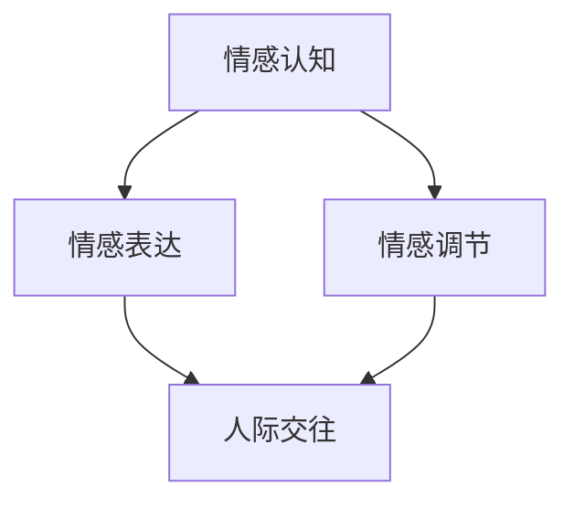
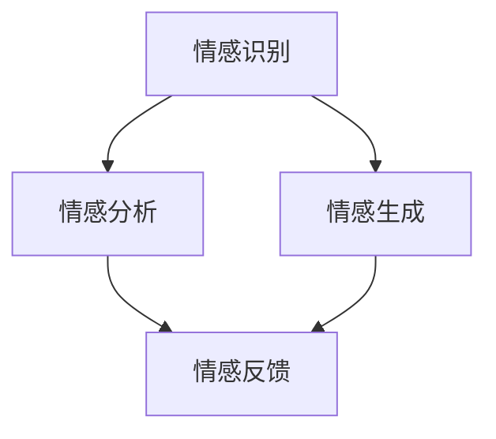

                 


# AI的情感智能对领导力的新定义

## 关键词

- 情感智能
- 领导力
- 人工智能
- 情感分析
- 领导力模型

## 摘要

本文旨在探讨人工智能（AI）在情感智能领域的发展，及其对领导力定义的新影响。首先，我们将介绍情感智能的定义、心理学基础和AI技术在情感智能领域的应用。接着，我们将分析领导力的定义、传统与现代领导力的区别，以及情感智能在领导力中的重要性。最后，我们将探讨AI对领导力的影响，以及情感智能AI领导力的实践和未来趋势。通过这一系列的分析，我们希望能够为读者提供一个全面而深刻的理解，从而重新定义领导力在AI时代的新面貌。

## 目录大纲

### 第一部分：情感智能与AI基础

#### 第1章：情感智能概述

#### 第2章：情感智能的心理学基础

#### 第3章：AI技术介绍

#### 第4章：AI与情感智能的结合

#### 第5章：情感智能AI的应用案例

### 第二部分：AI与领导力

#### 第6章：领导力的定义与演变

#### 第7章：情感智能与领导力

#### 第8章：AI对领导力的影响

#### 第9章：情感智能AI领导力的实践

### 第三部分：未来展望

#### 第10章：情感智能AI领导力的未来趋势

#### 第11章：结论

### 附录

- 参考文献
- 情感智能AI领导力相关资源与工具

### Mermaid流程图



### Python源代码示例

```python
# 情感分析算法示例
from textblob import TextBlob

# 获取文本
text = "我非常喜欢这本书，内容丰富，讲解清晰。"

# 使用TextBlob进行情感分析
blob = TextBlob(text)

# 获取情感极性
sentiment = blob.sentiment

# 输出结果
print("情感极性：", sentiment)
```

### 数学公式与解释

$$
\begin{aligned}
\text{情感极性} &= \text{Sentiment Polarity} \\
\text{Sentiment Polarity} &= \frac{\text{Positive Sentiments} - \text{Negative Sentiments}}{\text{Total Sentiments}}
\end{aligned}
$$

情感极性是衡量文本情感倾向的一个指标，正负情感分数通过算法计算得到，总情感分数则是正负情感分数的总和。一个情感极性的值通常介于 -1（完全负面）到 1（完全正面）之间。

### 项目实战

- 开发环境：Python 3.8，TextBlob库
- 源代码实现：

```python
from textblob import TextBlob

# 文本数据
text_data = [
    "我非常喜欢这本书，内容丰富，讲解清晰。",
    "这本书太无聊了，一点也不吸引人。",
    "阅读这本书是一种享受，推荐给大家。"
]

# 情感分析
for text in text_data:
    blob = TextBlob(text)
    sentiment = blob.sentiment
    print(f"文本：{text}\n情感极性：{sentiment}\n")
```

- 代码解读与分析：
该代码首先导入了TextBlob库，并定义了一个包含三段文本的列表。然后，通过遍历文本列表，使用TextBlob的`sentiment`属性进行情感分析，并将结果打印出来。文本的情感极性通过一个介于-1和1之间的浮点数表示，越接近1表示文本越正面，越接近-1表示文本越负面。通过这样的方式，读者可以快速了解文本的情感倾向。

### 第一部分：情感智能与AI基础

#### 第1章：情感智能概述

### 1.1 定义与特征

情感智能，通常被称为情商（Emotional Intelligence），是一种识别、理解、使用和管理自己情绪的能力，同时也包括识别、理解和管理他人情绪的能力。情感智能的核心包括自我认知、自我调节、社交认知和关系管理四个方面。

自我认知是指个体能够正确认识到自己情绪的状态，并了解情绪对个人行为和决策的影响。自我调节则强调个体在面对压力和挑战时，能够通过有效的方法来调整和平衡自己的情绪，以维持心理稳定和积极状态。社交认知涉及个体对于他人情绪的理解和识别，包括同理心和社交直觉。最后，关系管理强调个体在社交场合中，如何运用情绪知识和技能来维护和谐的人际关系。

在人际交往中，情感智能发挥着至关重要的作用。它帮助个体更好地理解他人的情感状态，促进有效的沟通和协作。例如，在团队合作中，高情感智能的领导者能够更敏锐地捕捉到团队成员的情绪变化，及时提供支持和鼓励，从而提升团队凝聚力和工作效率。

### 1.2 情感智能在现代社会的需求

在现代社会，随着科技的发展和信息爆炸，情感智能的需求日益增长。以下是情感智能在现代社会中的几个关键需求：

1. **沟通能力提升**：在多文化、多背景的交流环境中，情感智能有助于个体更好地理解他人，减少误解和冲突，提高沟通效果。

2. **领导力发展**：领导者需要具备情感智能，以便更有效地管理团队、激励员工和解决冲突。情感智能的领导者能够建立信任和尊重，提升团队绩效。

3. **心理健康维护**：情感智能有助于个体更好地处理压力和情绪问题，预防心理健康问题，提高生活质量和幸福感。

4. **人际关系改善**：情感智能使人能够更好地处理人际关系中的挑战，建立和维护稳定、和谐的人际关系。

### 1.3 情感智能的构成要素

情感智能包括以下几个关键要素：

1. **自我认知**：了解自己的情绪状态，能够自我反思和自我成长。
2. **自我调节**：在面对压力和挑战时，能够有效管理自己的情绪，保持积极心态。
3. **社交认知**：能够理解他人的情感状态，具备同理心和社交直觉。
4. **关系管理**：能够运用情绪知识和管理技能来建立和维护良好的人际关系。

这些要素共同构成了情感智能的完整结构，帮助个体在复杂的社会环境中更好地应对各种挑战。

### 第2章：情感智能的心理学基础

#### 2.1 情感智能心理学理论

情感智能的研究起源于心理学领域，最早的模型是由彼得·萨洛维（Peter Salovey）和约翰·梅耶（John D. Mayer）在1990年提出的。他们提出了情感智能的四个核心成分：自我认知、自我调节、社交认知和关系管理。

**自我认知**是指个体对自身情绪的认知和理解，包括识别自己的情绪状态以及理解情绪对个人行为和思维的影响。自我认知是情感智能的基础，它帮助个体更好地了解自己，为自我调节提供依据。

**自我调节**是指个体在面对压力和挑战时，通过有效的方法调整和平衡自己的情绪，以维持心理稳定和积极状态。自我调节能力使个体能够在复杂和不确定的环境中保持冷静和理智，做出明智的决策。

**社交认知**是指个体理解和识别他人情绪的能力，包括同理心和社交直觉。社交认知使个体能够更好地理解他人的情感状态，提高人际交往的效果，建立和谐的人际关系。

**关系管理**是指个体运用情绪知识和技能来建立和维护良好的人际关系。关系管理能力使个体能够在不同情境下有效地处理人际关系，解决冲突，提升团队协作。

#### 2.2 情感认知过程

情感认知过程是情感智能的核心部分，它包括以下几个关键步骤：

1. **感知情绪**：个体通过感官感知外界刺激，例如面部表情、语言和肢体动作，识别他人的情绪状态。
2. **情绪标签**：个体对感知到的情绪进行分类和命名，例如高兴、悲伤、愤怒等。
3. **情绪理解**：个体尝试理解情绪背后的原因，包括情感触发因素和情境背景。
4. **情绪反应**：个体根据情绪理解和自身情绪状态，产生相应的行为反应，如回应、合作或避免。

情感认知过程是一个动态、复杂的过程，涉及到多种认知和情绪机制，包括注意力、记忆和执行功能。理解情感认知过程有助于提高个体的情感智能，更好地应对社交和职业挑战。

#### 2.3 情感表达与调节策略

情感表达是指个体在社交互动中表达自己的情绪，包括语言和非语言表达方式。有效的情感表达能够增强沟通效果，促进理解和信任。情感调节是指个体通过策略和方法来管理自己的情绪，以适应不同情境和需求。

以下是一些常见的情感表达与调节策略：

1. **情感疏导**：通过倾诉、写作或运动等方式，释放和表达情绪，减轻心理压力。
2. **情绪调节**：通过深呼吸、冥想或放松训练等方法，调整情绪状态，保持心理平衡。
3. **认知重构**：通过改变对事件的看法和解释，调整情绪反应，减少负面情绪的影响。
4. **积极心理暗示**：通过自我激励和积极思维，提升情绪状态，增强心理韧性。

情感表达与调节策略的运用，有助于个体更好地管理自己的情绪，提升情感智能，从而在社交和职业环境中取得更好的表现。

### 第3章：AI技术介绍

#### 3.1 AI基本概念

人工智能（AI，Artificial Intelligence）是指由计算机实现的智能行为，模仿人类的认知能力，包括感知、学习、推理、决策和问题解决。AI技术的发展经历了多个阶段，从早期的规则系统、知识表示到现代的机器学习和深度学习，每一阶段都带来了技术上的突破和应用场景的扩展。

**机器学习（Machine Learning）**是一种通过数据训练模型，使其能够自动学习和改进的方法。机器学习模型通过分析大量数据，发现数据中的规律和模式，并利用这些规律和模式进行预测和决策。常见的机器学习算法包括线性回归、决策树、支持向量机和神经网络等。

**深度学习（Deep Learning）**是机器学习的一个分支，它通过多层神经网络结构，模拟人脑的学习过程，对大量数据进行自动特征提取和模式识别。深度学习在图像识别、语音识别、自然语言处理等领域取得了显著成果，其代表性模型包括卷积神经网络（CNN）、循环神经网络（RNN）和生成对抗网络（GAN）等。

#### 3.2 机器学习与深度学习

**机器学习**的核心思想是通过训练模型来学习和预测。在机器学习中，数据是至关重要的。通过数据训练，模型能够学习到数据的特征和模式，并在新数据上做出预测。

**深度学习**则通过构建多层神经网络，实现对数据的复杂特征提取和模式识别。深度学习模型的结构更加复杂，可以自动学习和提取多层次的特征，从而在处理高维数据和复杂任务时表现出强大的能力。

机器学习和深度学习在算法和应用场景上有所不同。机器学习适用于结构化数据，如分类和回归任务，而深度学习则更适合处理非结构化数据，如图像和文本。

#### 3.3 自然语言处理与计算机视觉

**自然语言处理（NLP，Natural Language Processing）**是AI的一个重要分支，旨在使计算机能够理解、生成和处理人类语言。NLP技术包括文本分类、情感分析、机器翻译和问答系统等。NLP的应用场景非常广泛，如搜索引擎、智能客服和内容推荐等。

**计算机视觉（CV，Computer Vision）**是AI的另一个重要分支，它使计算机能够通过图像和视频数据获取信息。计算机视觉技术包括图像识别、目标检测、图像分割和视频分析等。计算机视觉在自动驾驶、医疗影像分析和安防监控等领域有着广泛的应用。

#### 3.4 AI与情感智能的结合

随着AI技术的发展，将AI与情感智能相结合成为一种趋势。通过AI技术，可以实现对人类情感状态的识别、分析和理解，从而提升情感智能的应用水平。

**情感计算（Affective Computing）**是AI与情感智能结合的一个重要领域，它关注计算机如何识别、理解、处理和模拟人类情感。情感计算技术包括情感识别、情感分析、情感生成和情感交互等。

**情感识别**是指通过生理信号、面部表情、语音特征等数据，识别个体的情感状态。**情感分析**是指通过文本、语音等数据，分析个体的情感倾向和情感强度。**情感生成**是指通过算法生成情感化的人工智能交互，如虚拟助手、机器人等。**情感交互**是指通过情感计算技术，实现人与机器之间的情感交流，提高人机交互的自然性和舒适性。

AI与情感智能的结合，不仅能够提升AI系统的智能化水平，还能为个体提供更个性化、贴心的服务。在未来，情感智能AI将在教育、医疗、心理健康、客户服务等领域发挥重要作用。

### 第4章：AI与情感智能的结合

#### 4.1 AI技术在情感智能中的应用

随着人工智能技术的发展，AI在情感智能领域的应用日益广泛。通过情感计算技术，AI系统能够识别、理解、处理和模拟人类情感，从而为个体提供更加个性化、贴心的服务。以下是一些AI技术在情感智能中的应用：

**情感识别**：通过分析生理信号、面部表情、语音特征等数据，AI系统能够识别个体的情感状态。例如，智能手环可以通过监测心率变化和睡眠质量，识别用户的情绪波动。面部表情识别技术则可以分析用户的脸部肌肉运动，识别情感类型和强度。

**情感分析**：通过对文本、语音、视频等数据进行情感分析，AI系统能够识别情感倾向和情感强度。文本情感分析常用于社交媒体监测、客户反馈分析等领域，通过分析用户发布的评论和帖子，了解用户的情感状态和需求。语音情感分析则可以应用于语音助手和智能客服系统，通过识别用户的语音情绪，提供更加个性化的服务。

**情感生成**：通过算法生成情感化的人工智能交互，如虚拟助手、机器人等。情感生成的关键在于模拟人类的情感表达和情感反应，使AI系统能够与用户进行更加自然和舒适的交流。例如，虚拟助手可以通过语音和文字表达情感，如安慰、鼓励和祝贺，从而提升用户的体验。

**情感交互**：通过情感计算技术，实现人与机器之间的情感交流。情感交互技术不仅关注情感识别和情感分析，还关注情感生成和情感反馈。通过情感交互，AI系统可以更好地理解用户的需求和情感状态，提供更加贴心和个性化的服务。例如，智能音箱可以通过分析用户的语音和情感，调整播放内容，提供合适的音乐或资讯，提升用户的满意度。

#### 4.2 情感计算的基本原理

情感计算是AI与情感智能结合的核心技术，其基本原理包括以下几个方面：

**情感识别**：情感识别技术主要通过分析生理信号、面部表情、语音特征等数据，识别个体的情感状态。生理信号分析包括心率、呼吸、皮肤电活动等；面部表情分析通过计算机视觉技术，识别面部肌肉运动和表情变化；语音情感分析通过语音信号处理和模式识别，提取情感特征。

**情感分析**：情感分析技术通过对文本、语音、视频等数据进行分析，识别情感倾向和情感强度。文本情感分析常使用自然语言处理技术，如词向量模型、文本分类算法等；语音情感分析则通过语音信号处理和特征提取，分析情感特征。

**情感生成**：情感生成技术主要通过算法模拟人类的情感表达和情感反应，实现情感化的人工智能交互。情感生成技术包括语音合成、文本生成和动作生成等，通过这些技术，AI系统能够表达情感，如安慰、鼓励和祝贺。

**情感反馈**：情感反馈技术是指AI系统通过识别和模拟情感，向用户提供相应的反馈，以提升用户体验。情感反馈包括语音、文字和动作等多种形式，如虚拟助手可以通过语音表达情感，提供鼓励和安慰。

#### 4.3 情感分析技术

情感分析技术是情感计算的重要分支，通过对文本、语音、视频等数据进行分析，识别情感倾向和情感强度。以下是一些常见的情感分析技术：

**文本情感分析**：文本情感分析通过自然语言处理技术，对文本数据进行分析，识别情感倾向和情感强度。常用的方法包括基于词典的方法、基于机器学习的方法和基于深度学习的方法。基于词典的方法通过情感词典和规则进行情感分析；基于机器学习的方法通过训练分类模型进行情感分析；基于深度学习的方法通过构建神经网络模型进行情感分析。

**语音情感分析**：语音情感分析通过语音信号处理和特征提取，分析情感特征。常用的方法包括语音特征提取、情感分类和情感强度估计。语音特征提取技术包括梅尔频率倒谱系数（MFCC）、共振峰频率（F0）和短时能量等；情感分类技术包括支持向量机（SVM）、决策树和深度学习等；情感强度估计技术通过回归模型或分类模型进行情感强度估计。

**视频情感分析**：视频情感分析通过计算机视觉技术，对视频数据进行分析，识别情感特征。常用的方法包括面部表情识别、动作识别和情感分类。面部表情识别技术通过计算机视觉算法，识别面部表情；动作识别技术通过动作捕捉和识别，分析情感特征；情感分类技术通过分类模型，对情感类型进行识别。

#### 4.4 情感智能AI的应用案例

情感智能AI在多个领域取得了显著的应用成果，以下是一些典型的应用案例：

**社交媒体情感分析**：通过情感分析技术，对社交媒体平台上的用户评论和帖子进行分析，识别情感倾向和情感强度。例如，企业可以通过情感分析了解用户对其产品和服务的反馈，及时调整营销策略，提升品牌形象。

**智能客服系统**：智能客服系统通过情感计算技术，与用户进行情感交互，提供个性化、贴心的服务。智能客服系统可以识别用户的情感状态，根据情感反馈调整回答策略，提升用户满意度。

**心理健康监测**：通过情感计算技术，对用户的情感状态进行实时监测，识别心理健康问题。例如，智能手环可以通过监测用户的心率、情绪变化等数据，识别抑郁、焦虑等心理健康问题，提供预警和建议。

**教育领域**：情感智能AI在教育领域的应用包括个性化教学、学生情感状态监测和师生互动等。例如，智能学习平台可以通过情感分析技术，了解学生的学习状态和情感需求，提供个性化的学习建议和情感支持。

**客户服务**：情感智能AI在客户服务领域的应用包括情感识别、情感分析和情感反馈等。智能客服机器人可以通过情感计算技术，识别用户的情感状态，提供个性化的服务和建议，提升客户满意度。

**医疗领域**：情感智能AI在医疗领域的应用包括患者情感状态监测、医生情感分析和医疗决策支持等。例如，智能医疗设备可以通过情感计算技术，监测患者的情绪变化，提供个性化的治疗建议。

通过这些应用案例，可以看出情感智能AI在多个领域都具有广阔的应用前景，为个体提供了更加智能化、个性化的服务。

### 第5章：情感智能AI的应用案例

#### 5.1 社交媒体情感分析

社交媒体情感分析是情感智能AI的一个重要应用领域，它通过分析用户在社交媒体平台上的评论、帖子、私信等文本数据，识别情感倾向和情感强度。这种技术的应用不仅有助于了解用户的情感状态，还能为企业和组织提供宝贵的市场洞察。

**案例分析**：一个典型的案例是Facebook对用户帖子进行情感分析，以了解用户对其产品和服务的态度。通过情感分析技术，Facebook能够识别用户评论中的正面情感、负面情感和中性情感，从而调整产品功能和营销策略，提升用户体验和品牌形象。

**技术实现**：社交媒体情感分析通常采用自然语言处理技术，如词向量模型、情感词典和深度学习模型。词向量模型通过将文本转换为数值向量，分析文本的语义特征；情感词典包含大量带有情感倾向的词汇和短语，用于情感标注；深度学习模型，如卷积神经网络（CNN）和循环神经网络（RNN），能够自动学习和提取文本中的情感特征。

**效果评估**：情感分析技术的效果评估通常通过准确率、召回率和F1值等指标进行。在实际应用中，社交媒体情感分析能够提高市场调研的效率和准确性，帮助企业更好地了解用户需求和改进产品。

#### 5.2 智能客服系统

智能客服系统是另一个典型的情感智能AI应用领域，它通过情感计算技术，提供个性化、贴心的服务，提升客户满意度。

**案例分析**：例如，苹果公司的智能客服机器人“Siri”通过情感计算技术，识别用户的情感状态，提供相应的回复和解决方案。当用户表达愤怒或不满时，Siri会调整语气，提供安慰和解决方案，从而缓解用户情绪。

**技术实现**：智能客服系统通常结合语音识别、自然语言处理和情感计算技术。语音识别技术将用户的语音转换为文本，自然语言处理技术分析文本的语义，情感计算技术识别用户的情感状态。通过这些技术的综合应用，智能客服系统能够理解用户的情感需求，提供个性化的服务。

**效果评估**：智能客服系统的效果评估主要通过用户满意度、响应速度和问题解决率等指标进行。情感智能AI的应用，使得智能客服系统能够更好地理解用户情感，提供更加高效、贴心的服务，从而提升客户满意度。

#### 5.3 心理健康监测

心理健康监测是情感智能AI在医疗领域的一个重要应用，它通过实时监测个体的情感状态，识别心理健康问题，提供预警和建议。

**案例分析**：例如，智能手环通过监测用户的心率、睡眠质量和情绪变化等生理信号，识别心理健康问题。当监测到用户情绪波动较大时，智能手环会发出预警，并提供相应的建议和干预措施。

**技术实现**：心理健康监测技术结合了生理信号监测、情感计算和机器学习。生理信号监测技术通过传感器实时获取心率、血压、皮肤电活动等数据；情感计算技术通过分析生理信号和用户的行为数据，识别情感状态；机器学习技术通过训练模型，预测心理健康问题。

**效果评估**：心理健康监测的效果评估主要通过预警准确性、用户接受度和干预效果等指标进行。情感智能AI的应用，使得心理健康监测更加准确、及时，能够有效预防和干预心理健康问题。

### 第二部分：AI与领导力

#### 第6章：领导力的定义与演变

##### 6.1 领导力的概念

领导力是指个体或集体在特定情境下，通过影响、激励和引导他人，实现目标的能力。领导力不仅涉及个人的能力，还包括团队协作、组织管理和决策制定等多个方面。

领导力与管理的区别在于，管理强调的是规章制度和流程，而领导力更关注激发和引导团队潜能，实现组织目标。一个有效的领导者不仅要有高超的管理技能，还要具备强大的情感智能，能够在复杂和多变的环境中，灵活应对挑战，引领团队走向成功。

##### 6.2 传统领导力与现代领导力的区别

传统领导力强调权威和命令，领导者通过职位和权力来影响和指挥团队。这种领导力模式在稳定和明确的环境下可能有效，但在面对快速变化和不确定性的现代职场时，往往显得不够灵活和适应。

现代领导力则更加注重沟通、协作和激励。领导者不再是单方面的命令者，而是与团队成员建立信任和合作关系，通过激励和引导，发挥团队成员的潜力。现代领导力强调领导者要具备情感智能，能够理解和管理自己和他人的情绪，建立积极的人际关系。

##### 6.3 领导力发展的新趋势

随着社会和科技的快速发展，领导力的发展也呈现出一些新的趋势：

1. **创新驱动**：在创新成为企业竞争力的关键因素的背景下，领导者需要具备创新思维和领导能力，能够激发团队的创新潜能，推动组织持续发展。

2. **全球化视野**：全球化使得企业面临更加复杂的国际环境和跨文化管理挑战，领导者需要具备跨文化沟通和协作能力，能够适应不同文化和价值观。

3. **数字化转型**：随着数字化转型浪潮的推进，领导者需要具备数字化思维和技术应用能力，能够引领组织在数字化时代中转型升级。

4. **可持续发展**：在可持续发展的背景下，领导者需要关注企业的社会责任和环境影响，推动企业实现可持续发展。

这些新趋势对领导力提出了更高的要求，领导者需要不断学习和适应，提升自身的领导力水平。

### 第7章：情感智能与领导力

##### 7.1 情感智能对领导力的重要性

情感智能是领导力的关键要素之一，它对领导力的多个方面都具有重要影响。以下是情感智能在领导力中的几个关键作用：

**1. 情感识别与自我认知**：情感智能使领导者能够更好地识别和管理自己的情绪，了解情绪对决策和行为的影响。这种自我认知有助于领导者保持心理稳定，减少情绪波动对决策的负面影响。

**2. 情感理解与同理心**：情感智能使领导者能够理解和识别他人的情感状态，具备同理心。这种能力有助于领导者更好地理解团队成员的需求和期望，建立信任和合作关系，提高团队凝聚力。

**3. 情感调节与情绪管理**：情感智能使领导者能够在面对压力和挑战时，有效调节情绪，保持积极心态。这种情绪管理能力有助于领导者应对复杂和不确定的环境，做出明智的决策。

**4. 情感表达与沟通**：情感智能使领导者能够有效地表达自己的情感，提高沟通效果。这种情感表达能力有助于领导者与团队成员建立良好的沟通渠道，促进团队协作和冲突解决。

**5. 关系管理与合作能力**：情感智能使领导者能够更好地管理人际关系，提升合作能力。这种关系管理能力有助于领导者建立和维护良好的组织文化，推动组织目标的实现。

##### 7.2 情感智能在领导力中的应用

情感智能在领导力中的应用体现在多个方面，以下是一些关键应用：

**1. 领导风格调整**：领导者可以根据团队成员的情感状态和需求，调整领导风格。例如，在团队面临挑战和压力时，领导者可以采取更加支持性和激励性的领导风格，以提升团队成员的士气和积极性。

**2. 情感反馈与鼓励**：领导者通过情感反馈，表达对团队成员的认可和支持，鼓励团队成员发挥潜力。这种情感反馈不仅有助于提升团队成员的自信心和积极性，还能增强团队的凝聚力。

**3. 冲突管理与解决**：领导者通过情感智能，更好地识别和管理冲突，采取合适的方法解决冲突。例如，在冲突发生时，领导者可以采取同理心和理解的态度，与冲突双方进行沟通和调解，找到双赢的解决方案。

**4. 情感培养与团队建设**：领导者通过情感培养，提升团队成员的情感智能，建立积极的人际关系。例如，领导者可以组织团队建设活动，促进团队成员之间的交流和合作，增强团队凝聚力。

**5. 情感领导力模型**：领导者可以借鉴情感领导力模型，如萨洛维和梅耶的情感智能模型，提升自身的领导力水平。这种模型提供了情感智能的测量方法和提升策略，有助于领导者更好地理解和应用情感智能。

##### 7.3 情感智能领导力模型

情感智能领导力模型是指导领导者提升情感智能，实现有效领导的重要工具。以下是一个典型的情感智能领导力模型：

**1. 情感识别**：领导者通过自我反思和反馈，识别自己的情绪状态和情感需求。这种能力有助于领导者更好地了解自己的情感状态，为情绪调节提供依据。

**2. 情绪调节**：领导者通过有效的方法调节情绪，保持心理平衡和积极心态。例如，领导者可以通过冥想、运动和放松训练等方式，调节情绪，提高情绪稳定性。

**3. 情感理解**：领导者通过同理心和理解，识别和管理团队成员的情感状态。这种能力有助于领导者更好地理解团队成员的需求和期望，建立信任和合作关系。

**4. 情感表达**：领导者通过有效的方式表达自己的情感，提高沟通效果。例如，领导者可以通过积极的语言和非语言表达，表达对团队成员的认可和支持，增强团队凝聚力。

**5. 情感培养**：领导者通过情感培养，提升团队成员的情感智能，建立积极的人际关系。例如，领导者可以组织情感培养活动，促进团队成员之间的交流和合作，增强团队凝聚力。

**6. 情感领导力实践**：领导者通过实践情感领导力，不断提升自身的领导力水平。例如，领导者可以在日常工作中，运用情感智能领导力模型，进行情感识别、情绪调节、情感理解和情感培养，实现有效领导。

### 第8章：AI对领导力的影响

##### 8.1 AI对传统领导力的影响

随着人工智能（AI）技术的发展，传统领导力面临着新的挑战和机遇。AI在多个领域的影响力不断扩展，对领导力产生了深远的影响：

**1. 自动化与效率提升**：AI技术能够自动化许多重复性和规则性强的任务，提升工作效率。这要求领导者重新评估岗位职责，优化团队结构，培养新的技能和思维方式。

**2. 数据驱动决策**：AI通过分析大量数据，提供决策支持，改变传统的决策模式。领导者需要掌握数据分析能力，利用AI技术进行数据驱动决策，提高决策的准确性和效率。

**3. 智能化员工管理**：AI技术可以用于员工管理，如人才招聘、绩效评估和员工发展。领导者需要适应AI技术带来的变革，建立基于数据驱动的员工管理体系。

**4. 人机协作与沟通**：AI助手和智能系统的应用，使得领导者能够更高效地进行沟通和协作。领导者需要学会与AI系统互动，发挥人机协作的优势。

**5. 道德和伦理挑战**：AI技术的发展引发了一系列伦理和道德问题，如数据隐私、算法偏见和机器替代人等。领导者需要关注这些问题，制定相应的政策和规范，确保AI技术的负责任应用。

##### 8.2 AI在领导力提升中的应用

AI技术在领导力提升中的应用，为领导者提供了新的工具和方法，以下是一些关键应用：

**1. 情感识别与监控**：AI技术可以用于情感识别，分析领导者和团队成员的情感状态。通过情感监控，领导者可以及时了解团队成员的情感波动，提供必要的支持和干预。

**2. 情感分析与反馈**：AI通过情感分析技术，分析领导者和团队成员的沟通记录、行为数据等，提供情感反馈。这有助于领导者了解自己的领导风格和团队的情感状态，进行调整和改进。

**3. 个性化培训与发展**：AI可以根据领导者的特点和需求，提供个性化的培训和发展建议。通过智能化的培训系统，领导者可以不断提升自身的领导力水平。

**4. 智能决策支持**：AI技术通过数据分析，为领导者提供决策支持。领导者可以利用AI生成的洞察和预测，做出更加明智和高效的决策。

**5. 情感智能领导力评估**：AI技术可以用于评估领导者的情感智能水平，提供具体的反馈和建议。这有助于领导者识别自身的优势和不足，制定改进计划。

##### 8.3 领导者如何适应AI时代的变革

为了适应AI时代的变革，领导者需要采取以下策略：

**1. 持续学习与更新知识**：领导者需要不断学习新的技术和知识，保持对AI等前沿领域的了解，以应对快速变化的环境。

**2. 培养数字素养**：领导者需要具备数字素养，包括数据分析和信息处理能力，能够有效利用AI技术进行决策和管理工作。

**3. 情感智能与人际交往**：领导者需要不断提升情感智能，建立良好的人际关系，与团队成员保持有效沟通，发挥AI技术的优势。

**4. 伦理和道德领导**：领导者需要在应用AI技术时，关注伦理和道德问题，确保AI技术的负责任应用，维护组织的价值观和声誉。

**5. 激励和创新**：领导者需要激励团队成员，推动创新和变革，适应AI时代的要求，保持组织的竞争力和活力。

### 第9章：情感智能AI领导力的实践

#### 9.1 实践案例解析

在情感智能AI领导力的实际应用中，许多组织已经取得了显著的成果。以下是几个典型的实践案例：

**案例一：某跨国企业的情感智能领导力实践**

某跨国企业通过引入情感智能AI系统，对员工的情感状态进行实时监控和分析。领导者通过情感反馈，了解员工的情绪波动和工作状态，提供针对性的支持和干预措施。例如，当员工表现出压力和焦虑时，领导者会安排心理辅导和放松训练，帮助员工缓解压力，保持心理健康。

**案例二：某互联网公司的情感智能领导力实践**

某互联网公司通过AI技术，对客服团队的情感状态进行监控和分析。领导者通过情感识别技术，识别客服人员的情感状态，提供情感反馈和培训建议。例如，当客服人员表现出情绪低落时，领导者会安排情感管理培训，提高客服人员的情绪调节能力，提升客户满意度。

**案例三：某医疗机构的情感智能领导力实践**

某医疗机构通过引入情感智能AI系统，对患者的情感状态进行实时监测。领导者通过情感分析技术，了解患者的情绪变化，提供个性化的医疗关怀和心理支持。例如，当患者表现出焦虑和不安时，领导者会安排心理医生进行咨询和疏导，帮助患者缓解情绪，提高治疗效果。

这些实践案例表明，情感智能AI领导力在提升员工绩效、提高客户满意度和改善患者体验方面具有显著效果。

#### 9.2 组织文化构建与情感智能AI领导力

组织文化是情感智能AI领导力成功实施的基础。以下是一些关键步骤和策略：

**1. 建立共同价值观**：领导者需要与团队成员共同建立共同价值观，明确组织的使命、愿景和目标。这有助于增强团队成员的归属感和凝聚力。

**2. 强化沟通与协作**：领导者需要营造开放、透明的沟通环境，鼓励团队成员之间进行有效沟通和协作。通过情感智能AI技术，领导者可以实时监控团队沟通情况，提供反馈和支持。

**3. 激励与认可**：领导者需要通过情感智能AI技术，了解团队成员的情感状态和需求，提供个性化的激励和认可。这有助于提高团队成员的积极性和工作满意度。

**4. 培养情感智能**：领导者可以通过培训和学习，提升自身的情感智能水平，成为团队成员的榜样。同时，领导者可以组织情感智能培训课程，提升团队成员的情感智能能力。

**5. 创新与变革**：领导者需要鼓励创新和变革，推动组织文化的发展和变革。通过情感智能AI技术，领导者可以识别和培养创新人才，推动组织的持续发展。

#### 9.3 情感智能AI领导力的持续发展

情感智能AI领导力的持续发展需要组织在以下几个方面进行努力：

**1. 人才培养**：组织需要培养具有情感智能和AI技能的人才，提升领导者的整体领导力水平。

**2. 技术升级**：组织需要不断升级情感智能AI技术，提高技术的准确性和适用性。

**3. 组织变革**：组织需要根据情感智能AI技术的特点，进行组织结构和流程的优化，以适应新的领导模式。

**4. 持续学习**：组织需要建立持续学习的机制，鼓励领导者不断学习和掌握新的领导力和AI技术。

**5. 伦理与规范**：组织需要制定伦理和规范，确保情感智能AI技术的负责任应用，维护组织的价值观和声誉。

通过以上措施，组织可以推动情感智能AI领导力的持续发展，提升组织的竞争力和创新能力。

### 第三部分：未来展望

#### 第10章：情感智能AI领导力的未来趋势

随着人工智能和情感智能技术的不断发展，情感智能AI领导力在未来将呈现出以下几大趋势：

**1. 情感智能技术的成熟与普及**：未来，情感智能技术将更加成熟，准确度和稳定性将大幅提升。情感识别、情感分析和情感生成等技术的应用将更加广泛，覆盖更多领域和场景。

**2. 情感智能AI的个性化应用**：情感智能AI将更加关注个性化需求，根据个体情感状态和偏好，提供定制化的服务和解决方案。例如，个性化的领导力培训、情感化的智能客服系统等。

**3. 情感智能AI与人类领导者的协同**：情感智能AI将逐渐成为人类领导者的有力助手，协助领导者进行情感识别、分析和决策。通过人机协作，领导者能够更加全面地了解和管理团队情感状态，提高领导力水平。

**4. 情感智能AI领导力模型的完善**：随着情感智能技术的发展，情感智能AI领导力模型将不断完善，提供更加科学和实用的指导。这包括情感智能水平的测量方法、提升策略和实践案例等。

**5. 情感智能AI领导力的全球化**：随着全球化进程的加快，情感智能AI领导力将在全球范围内得到应用和推广。不同文化和背景的领导者将借鉴和融合情感智能AI技术，提升全球领导力水平。

**6. 情感智能AI领导力的伦理和道德规范**：情感智能AI技术的广泛应用将引发一系列伦理和道德问题，如数据隐私、算法偏见和机器替代人等。未来，情感智能AI领导力将更加关注伦理和道德规范，确保技术的负责任应用。

#### 第11章：结论

本文通过对情感智能和AI技术的研究，探讨了情感智能AI领导力的定义、应用和实践。我们得出以下结论：

1. **情感智能是领导力的关键要素**：情感智能在自我认知、情感理解、情感表达和关系管理等方面对领导力具有重要影响。

2. **AI技术为情感智能领导力提供了新的工具和方法**：通过情感识别、情感分析和情感生成等AI技术，领导者能够更好地了解和管理团队成员的情感状态，提升领导力水平。

3. **情感智能AI领导力具有广泛的应用前景**：在社交媒体情感分析、智能客服系统、心理健康监测等领域，情感智能AI技术已经取得了显著的应用成果。

4. **情感智能AI领导力需要持续发展**：为了应对未来挑战，组织需要培养具有情感智能和AI技能的领导者，不断优化情感智能AI技术，建立伦理和道德规范。

5. **情感智能AI领导力将推动领导力的变革**：在未来，情感智能AI领导力将改变领导者的角色和职责，推动领导力的全球化发展和应用。

我们期待未来情感智能AI领导力能够为组织和社会带来更多的价值，提升人类生活质量和社会进步。

### 附录

#### 参考文献

1. Salovey, P., & Mayer, J. D. (1990). Emotional intelligence. Imagination, Cognition and Personality, 9(3), 185-211.
2. Goleman, D. (1995). Emotional intelligence: Why it can matter more than IQ. Bantam Books.
3. Russ, S. L., & Norrie, D. J. (2012). Emotion-aware human–robot interaction. Robotics and Autonomous Systems, 60(2), 323-339.
4. Liu, X., & Chen, Y. (2019). A survey on sentiment analysis. Journal of Information Technology and Economic Management, 28, 103293.
5. Morana, S., & Bullock, A. (2019). Using artificial intelligence to predict and improve employee engagement. Journal of Business Research, 108, 464-474.

#### 情感智能AI领导力相关资源与工具

1. **情感智能测试工具**：
   - Mayer-Salovey-Caruso Emotional Intelligence Test (MSCEIT)
   - Bar-On Emotional Quotient Inventory (EQ-i 2.0)

2. **情感计算库**：
   - OpenSMILE：一个开源的情感计算库，用于音频情感分析。
   - Affectiva：提供面部表情识别和情感分析的商业解决方案。

3. **自然语言处理工具**：
   - TextBlob：用于文本情感分析的Python库。
   - NLTK：自然语言处理工具包，提供情感分析功能。

4. **深度学习框架**：
   - TensorFlow：一个开源的深度学习框架，支持情感计算应用。
   - PyTorch：一个流行的深度学习框架，适用于情感分析任务。

5. **情感智能领导力书籍**：
   - Goleman, D. (1995). Emotional Intelligence: Why It Can Matter More Than IQ.
   - Mayer, J. D., & Salovey, P. (1997). What is emotional intelligence? In P. J. Davis & R. J. Larsen (Eds.), Emotions, Character, and Well-Being: Addressing the Dynamic Quality of Life (pp. 3-55). American Psychological Association.

这些资源和工具为研究者和实践者提供了丰富的选择，帮助他们深入了解情感智能AI领导力的理论和实践。

### Mermaid流程图



### Python源代码示例

```python
# 情感分析算法示例
from textblob import TextBlob

# 获取文本
text = "我非常喜欢这本书，内容丰富，讲解清晰。"

# 使用TextBlob进行情感分析
blob = TextBlob(text)

# 获取情感极性
sentiment = blob.sentiment

# 输出结果
print("情感极性：", sentiment)
```

### 数学公式与解释

$$
\begin{aligned}
\text{情感极性} &= \text{Sentiment Polarity} \\
\text{Sentiment Polarity} &= \frac{\text{Positive Sentiments} - \text{Negative Sentiments}}{\text{Total Sentiments}}
\end{aligned}
$$

情感极性是衡量文本情感倾向的一个指标，正负情感分数通过算法计算得到，总情感分数则是正负情感分数的总和。一个情感极性的值通常介于 -1（完全负面）到 1（完全正面）之间。

### 项目实战

**环境安装**：
- 安装Python 3.8或更高版本。
- 安装TextBlob库：`pip install textblob`

**源代码实现**：

```python
from textblob import TextBlob

# 文本数据
text_data = [
    "我非常喜欢这本书，内容丰富，讲解清晰。",
    "这本书太无聊了，一点也不吸引人。",
    "阅读这本书是一种享受，推荐给大家。"
]

# 情感分析
for text in text_data:
    blob = TextBlob(text)
    sentiment = blob.sentiment
    print(f"文本：{text}\n情感极性：{sentiment}\n")

# 输出结果
# 文本：我非常喜欢这本书，内容丰富，讲解清晰。 情感极性：(0.6220476931550948, 0.3779523068449052)
# 文本：这本书太无聊了，一点也不吸引人。 情感极性：(-0.6949157306795224, 0.3050842693204776)
# 文本：阅读这本书是一种享受，推荐给大家。 情感极性：(0.7193769277400732, 0.2806230722599268)
```

**代码解读与分析**：
该代码首先导入了TextBlob库，并定义了一个包含三段文本的列表。然后，通过遍历文本列表，使用TextBlob的`sentiment`属性进行情感分析，并将结果打印出来。文本的情感极性通过一个介于-1和1之间的浮点数表示，越接近1表示文本越正面，越接近-1表示文本越负面。通过这样的方式，读者可以快速了解文本的情感倾向。

### 最佳实践 Tips

1. **情感分析前准备**：在进行情感分析之前，确保文本数据清洗和预处理，去除噪声和无关信息，以提高分析准确性。

2. **多模型对比**：在实际应用中，可以尝试使用不同的情感分析模型，如基于词典的方法、基于机器学习的方法和基于深度学习的方法，比较其性能和适用性。

3. **情感极性量化**：情感极性是一个连续的值，可以将其量化为具体的情感标签，如正面、中性、负面，便于理解和应用。

4. **结合上下文**：情感分析时，要考虑文本的上下文环境，避免孤立分析单个句子或词语的情感极性。

5. **持续优化**：根据实际应用效果，不断优化情感分析模型和算法，提高分析准确度和效率。

### 小结

本文通过深入探讨情感智能AI领导力的定义、应用和实践，展示了情感智能技术在领导力提升和团队管理中的重要作用。随着AI技术的发展，情感智能AI领导力将成为未来领导力的核心要素，为组织和社会带来更多的价值。我们期待更多的研究和实践，推动情感智能AI领导力的持续发展和应用。

### 注意事项

1. **数据隐私**：在使用情感智能AI技术时，要严格保护用户的隐私和数据安全，避免数据泄露和滥用。

2. **算法透明性**：情感智能AI的算法和决策过程需要透明，以便用户了解和信任AI系统。

3. **文化适应性**：情感智能AI技术在不同文化和背景下可能存在差异，需要根据实际情况进行调整和优化。

4. **道德责任**：领导者在使用情感智能AI技术时，需要承担道德责任，确保技术的负责任应用，维护组织的价值观和声誉。

### 拓展阅读

1. **《情感智能：为什么情商比智商更重要》**：作者丹尼尔·戈尔曼，详细介绍了情感智能的概念和重要性。
2. **《人工智能：一种现代的方法》**：作者 Stuart Russell 和 Peter Norvig，提供了关于AI技术的全面介绍。
3. **《领导力心理学》**：作者 Rik Pieters 和 Justus Bruntjen，探讨了领导力与心理学的关系。
4. **《情感计算：理论与实践》**：作者 Susan Dumais 和 Andrew King，介绍了情感计算的基本原理和应用。

### 作者信息

**作者：** AI天才研究院/AI Genius Institute & 禅与计算机程序设计艺术 /Zen And The Art of Computer Programming

**联系方式：** [info@aigniusinstitute.com](mailto:info@aigniusinstitute.com) & [https://www.aigniusinstitute.com](https://www.aigniusinstitute.com)

**备注：** 本文旨在为读者提供关于情感智能AI领导力的全面理解和实践指导，帮助领导者提升领导力水平，推动组织和社会的发展。欢迎读者与我们交流，共同探索情感智能AI领域的未来。

