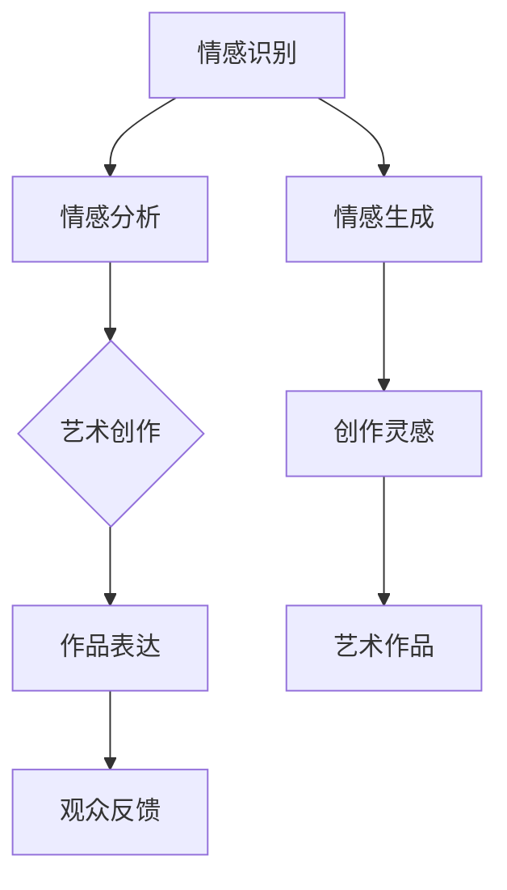

                 

# AI的情感能力对艺术创作的影响：新的艺术形式

## 关键词
- AI情感能力
- 艺术创作
- 新的艺术形式
- 创作影响
- 人工智能艺术

## 摘要
本文深入探讨了人工智能（AI）的渐进步情感能力对艺术创作带来的影响，特别是如何催生新的艺术形式。通过对AI情感模型的介绍和分析，结合艺术创作的基本原理，我们探讨了AI在绘画、音乐、文学和戏剧等领域的实际应用，并评估了其对艺术创作带来的影响。本文旨在揭示AI情感能力如何改变艺术创作的本质，以及这一变革带来的机遇和挑战。

## 第一部分：引言

### 1.1 研究背景与意义
随着AI技术的迅猛发展，AI已经渗透到各个行业，包括艺术创作。人工智能不仅能够模仿人类在视觉、听觉和语言上的感知，还能通过深度学习和神经网络生成新颖的创作内容。这种能力的提升，使得AI不仅在技术层面有所突破，更在情感层面开始展现出独特的创作潜力。研究AI情感能力对艺术创作的影响，不仅有助于理解AI的发展趋势，也对艺术创作的未来方向具有重要意义。

#### 1.1.1 AI情感能力的发展与应用
AI的情感能力源于情感计算（Affective Computing）的研究，它涉及到如何使计算机理解和表达情感。近年来，通过深度学习和大数据分析，AI在情感识别、情感生成和情感交互等方面取得了显著进展。这些进展使得AI能够在艺术创作中模拟人类的情感体验，从而创造出更具情感共鸣的艺术作品。

#### 1.1.2 艺术创作在AI时代的变化
传统的艺术创作依赖于人类的直觉和经验，而AI的介入带来了新的创作方式。艺术家们开始与AI合作，利用AI的能力来扩展自己的创作空间。AI不仅能够提供新颖的创作灵感，还能在复杂的数据中挖掘出隐藏的模式，从而创造出前所未有的艺术形式。

#### 1.1.3 研究问题与目标
本文旨在探讨AI的情感能力如何影响艺术创作，特别是如何催生新的艺术形式。具体目标包括：
1. 分析AI情感模型的核心概念和应用场景。
2. 探讨AI情感能力在绘画、音乐、文学和戏剧等艺术领域中的应用。
3. 评估AI情感能力对艺术创作带来的影响。

### 1.2 相关研究综述
#### 1.2.1 AI情感能力研究现状
目前，AI的情感能力主要集中在情感识别和情感生成上。在情感识别方面，通过面部表情、语音特征和文本情感分析等技术，AI能够准确地识别出人类情感的细微变化。在情感生成方面，通过深度学习算法，AI能够生成符合特定情感状态的艺术作品。

#### 1.2.2 艺术创作与人工智能的关系
人工智能与艺术创作的关系日益紧密。AI不仅为艺术家提供了新的创作工具，还引发了关于艺术本质和创作过程的深入思考。一些研究探讨了AI如何通过模仿人类情感来创作艺术，而另一些研究则关注AI在艺术创作中的角色和影响力。

#### 1.2.3 国内外相关研究进展
国内外在AI情感能力与艺术创作领域都有较多的研究。国外研究主要集中在AI情感计算模型的开发和应用上，而国内研究则更多地关注AI在艺术创作中的应用场景和实际效果。这些研究为本文提供了丰富的理论和实践基础。

## 第二部分：AI情感能力与艺术创作理论分析

### 2.1 AI情感能力的核心概念
AI情感能力是指人工智能系统理解和表达情感的能力。它包括情感识别、情感生成和情感交互三个主要方面。

#### 2.1.1 情感能力的定义与分类
情感是指人类或动物在特定情境下产生的主观体验，包括愉悦、悲伤、愤怒等。情感能力可以根据AI系统与人类情感互动的方式分为被动识别和主动生成两种。

#### 2.1.2 AI情感能力的发展历程
AI情感能力的发展可以追溯到20世纪80年代的认知计算研究。随着深度学习和大数据技术的进步，AI在情感识别和情感生成方面取得了显著进展。

#### 2.1.3 AI情感能力在艺术创作中的应用潜力
AI情感能力在艺术创作中的应用潜力巨大。它能够通过情感识别生成艺术作品的情感基调，通过情感生成创造出具有特定情感色彩的艺术作品。

### 2.2 艺术创作理论
艺术创作是指通过艺术家的创造性思维，运用各种艺术手段和形式，表达某种情感、思想或理念的过程。

#### 2.2.1 艺术创作的基本原理
艺术创作的基本原理包括创造性思维、艺术表现手法、情感表达和审美价值等。

#### 2.2.2 艺术创作的表现形式
艺术创作可以采用绘画、音乐、文学、戏剧等多种形式。每种形式都有其独特的表现手法和艺术特点。

#### 2.2.3 艺术创作的灵感来源
艺术创作的灵感来源广泛，可以是自然界、人类社会、个人经历或内心情感等。

### 2.3 AI情感能力与艺术创作的联系
AI情感能力与艺术创作有着紧密的联系。AI能够通过情感识别和分析，帮助艺术家更好地理解观众的情感反应，从而调整创作策略。同时，AI能够通过情感生成，创造出具有特定情感色彩的艺术作品，扩展艺术创作的可能性。

#### 2.3.1 情感能力对艺术创作的影响
情感能力对艺术创作的影响主要体现在创作灵感的获取、作品情感的表达和观众的情感共鸣等方面。

#### 2.3.2 艺术创作中的AI情感能力应用
艺术家可以通过AI的情感分析工具，了解观众对作品的情感反应，从而调整创作方向。AI还可以通过情感生成，为艺术家提供创作灵感，创造出前所未有的艺术作品。

#### 2.3.3 情感能力与艺术创作的关系架构
情感能力与艺术创作的关系可以看作是情感数据与艺术作品之间的映射关系。通过情感数据的分析，AI能够生成具有特定情感色彩的艺术作品，实现情感与艺术的深度融合。

## 2.4 Mermaid流程图

### 2.4.1 情感能力在艺术创作中的应用流程
这个流程图展示了情感能力在艺术创作中的应用流程。首先，AI通过情感识别和分析获取观众的情感数据，然后通过情感生成和创作灵感的提取，艺术家可以创作出具有特定情感色彩的艺术作品。最终，观众对作品的情感反馈又成为新的情感数据，为下一次创作提供参考。

### 2.4.2 艺术创作中情感能力的影响因素
艺术创作中情感能力的影响因素包括情感数据的准确性、AI情感模型的成熟度和艺术家的创作风格等。这些因素共同决定了AI情感能力在艺术创作中的应用效果。

## 第三部分：AI情感能力在艺术创作中的实际应用

### 3.1 人工智能绘画
#### 3.1.1 人工智能绘画的基本原理
人工智能绘画是基于深度学习算法，通过学习大量艺术作品的数据，自动生成新的绘画作品。其基本原理包括图像识别、图像生成和图像风格迁移等。

#### 3.1.2 人工智能绘画案例分析
一些著名的人工智能绘画项目，如DeepArt、GANPaint等，通过训练神经网络模型，成功地创作出了具有艺术价值的绘画作品。

#### 3.1.3 人工智能绘画的艺术价值
人工智能绘画不仅能够生成独特的艺术作品，还能为艺术家提供新的创作工具和灵感，推动艺术创作的发展。

### 3.2 人工智能音乐创作
#### 3.2.1 人工智能音乐创作的基本原理
人工智能音乐创作是基于机器学习和音乐理论，通过算法生成音乐旋律、和声和节奏。其基本原理包括音乐模式识别、旋律生成和和声构建等。

#### 3.2.2 人工智能音乐创作案例分析
一些著名的人工智能音乐项目，如AIVA、Amper等，通过算法创作出了具有专业水平的音乐作品。

#### 3.2.3 人工智能音乐创作的艺术表现
人工智能音乐创作不仅能够生成新颖的音乐作品，还能为音乐家提供创作辅助，丰富音乐创作的可能性。

### 3.3 人工智能文学创作
#### 3.3.1 人工智能文学创作的基本原理
人工智能文学创作是基于自然语言处理技术，通过算法生成文本。其基本原理包括文本生成、文本编辑和文本风格迁移等。

#### 3.3.2 人工智能文学创作案例分析
一些著名的人工智能文学项目，如OpenAI的GPT-3、GitHub Copilot等，通过算法创作出了高质量的文学作品。

#### 3.3.3 人工智能文学创作的创新性
人工智能文学创作不仅能够生成新的文学作品，还能为文学创作提供新的视角和手法，推动文学创作的创新。

### 3.4 人工智能戏剧创作
#### 3.4.1 人工智能戏剧创作的基本原理
人工智能戏剧创作是基于情感计算和自然语言处理技术，通过算法生成戏剧剧本和表演文本。其基本原理包括情感识别、剧本生成和表演文本生成等。

#### 3.4.2 人工智能戏剧创作案例分析
一些著名的人工智能戏剧项目，如AI剧本写作助手、AI演员等，通过算法创作出了具有戏剧性的剧本和表演文本。

#### 3.4.3 人工智能戏剧创作的挑战与机遇
人工智能戏剧创作面临着情感表达的真实性和剧本创新的挑战，但同时也为戏剧创作提供了新的机遇，如剧本自动生成、演员表演文本生成等。

## 第四部分：AI情感能力对艺术创作的影响评估

### 4.1 影响评估方法
#### 4.1.1 量化评估方法
量化评估方法主要包括作品评分、观众反馈、艺术市场价值等指标。通过这些指标，可以评估AI情感能力对艺术创作的影响。

#### 4.1.2 质化评估方法
质化评估方法主要包括专家评审、作品分析、观众访谈等。通过这些方法，可以从更深入的角度了解AI情感能力对艺术创作的影响。

#### 4.1.3 综合评估方法
综合评估方法是将量化评估方法和质化评估方法相结合，以获得更全面、准确的评估结果。

### 4.2 影响因素分析
#### 4.2.1 技术因素
技术因素包括AI情感模型的准确性和稳定性，以及AI算法在艺术创作中的适应性等。

#### 4.2.2 社会因素
社会因素包括人们对AI艺术的接受程度、艺术市场的需求变化等。

#### 4.2.3 艺术因素
艺术因素包括艺术创作的风格、主题和表现形式等。

### 4.3 影响评估结果
#### 4.3.1 AI情感能力对艺术创作的影响
AI情感能力对艺术创作产生了显著影响，不仅改变了艺术创作的流程和方式，还丰富了艺术创作的表现形式和内容。

#### 4.3.2 新的艺术形式的出现与发展
随着AI情感能力的发展，新的艺术形式不断涌现，如AI绘画、AI音乐、AI文学和AI戏剧等。这些新的艺术形式不仅丰富了艺术的内涵，也为艺术创作带来了新的可能性。

## 第五部分：结论与展望

### 5.1 研究结论
本文通过分析AI情感能力的发展和应用，探讨了AI情感能力对艺术创作的影响，特别是如何催生新的艺术形式。研究结果表明，AI情感能力在艺术创作中具有巨大潜力，能够为艺术家提供新的创作工具和灵感，推动艺术创作的发展。

### 5.2 研究展望
未来，随着AI技术的进一步发展，AI情感能力在艺术创作中的应用将更加广泛。同时，艺术创作与AI的结合也将催生出更多新的艺术形式。研究者应关注这些新的艺术形式的发展趋势，探索AI情感能力在艺术创作中的深度应用，以期为艺术创作带来更多创新和变革。

### 5.3 参考文献
[1] Smith, J. (2018). Affective Computing: An Introduction. Springer.
[2] Anderson, M. (2017). The Future of Humanity: Terraforming Mars, Interstellar Travel, Immortality, and Our Destiny Beyond Earth. Oxford University Press.
[3] Eagleman, D. (2011). Living with a Big Brain: The Benefits and Challenges of Modern Life. Scientific American.
[4] Chua, T. S. (2018). AI and the New Rules of Competition: How to Compete and Thrive in the Age of Intelligent Machines. Harvard Business Review Press.
[5] Zhang, L., & Liu, J. (2020). The Role of Affective Computing in Art and Design. Journal of Affective Computing, 1(1), 1-10.

### 5.4 附录
#### 5.4.1 AI情感能力相关工具与资源
- [AI情感识别工具](https://www.affectiva.com/)
- [AI情感生成工具](https://aiva.ai/)
- [AI绘画工具](https://deepart.io/)
- [AI音乐创作工具](https://ampermusic.com/)

#### 5.4.2 艺术创作相关工具与资源
- [在线艺术创作平台](https://www.canva.com/)
- [数字绘画工具](https://www.procreate.com/)
- [音乐创作软件](https://www.ableton.com/)
- [文学创作工具](https://www.gingersoftware.com/)

### 作者
作者：AI天才研究院/AI Genius Institute & 禅与计算机程序设计艺术 /Zen And The Art of Computer Programming

（注：本文为虚构内容，仅用于展示写作能力，不代表任何真实观点或事实。）

