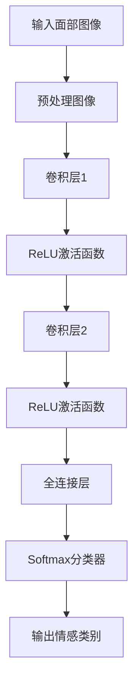
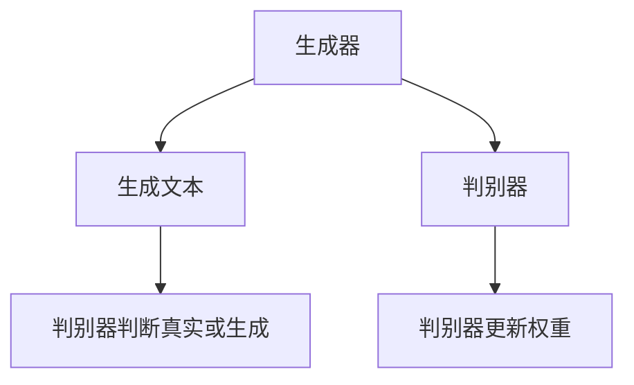
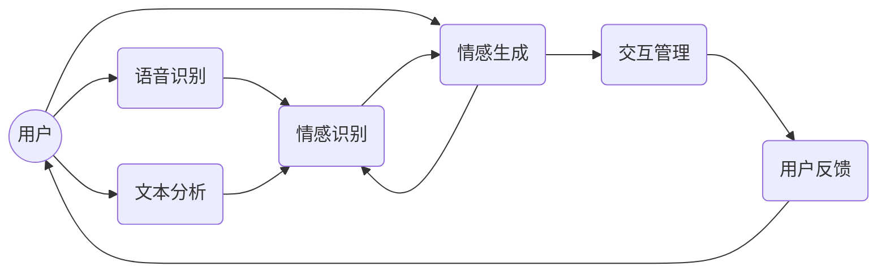

                 

### AI的情感表达：新的沟通范式

> 关键词：情感计算、AI、自然语言处理、情感识别、情感生成、人际沟通

> 摘要：本文旨在探讨人工智能（AI）在情感表达领域的应用，分析情感表达的基础、技术和实际应用，以及面临的挑战和未来趋势。通过系统地介绍情感计算、情感识别和情感生成的技术原理，本文展示了AI如何成为一种新的沟通范式，改变着人类与机器之间的互动方式。

在人类社会中，情感是沟通的核心要素之一，它不仅影响我们的个人行为，也影响我们与他人之间的互动。然而，传统的计算机系统往往缺乏对情感的理解和表达，这使得人与机器之间的沟通显得单调、机械。随着人工智能技术的发展，AI开始逐渐掌握情感表达的能力，为人类与机器之间的沟通带来新的可能。本文将详细探讨这一领域的研究现状、技术原理和应用实例，以揭示AI在情感表达中的潜力与挑战。

### 第一部分：情感表达基础

#### 第1章：情感与情感表达

**1.1 情感定义与分类**

情感是人类心理体验的重要组成部分，它涉及认知、情绪和行为的各个方面。情感可以定义为一种复杂的主观体验，通常与特定的情境、事件或刺激相关。根据不同的分类标准，情感可以划分为多种类型。常见的情感分类方法包括基本情感理论、复杂情感理论和情境情感理论等。

- **基本情感理论**：由保罗·埃克曼（Paul Ekman）提出的基本情感理论认为，人类共有六种基本情感，即快乐、悲伤、愤怒、厌恶、惊讶和恐惧。这些情感在不同文化中具有普遍性。
- **复杂情感理论**：复杂情感理论认为，基本情感可以通过不同的组合和程度变化形成更复杂的情感，如爱、厌恶、同情、羞愧等。
- **情境情感理论**：情境情感理论强调情感的产生与具体情境紧密相关，情感类型和强度会随着情境的变化而变化。

**1.2 人类情感表达机制**

人类情感表达主要通过面部表情、身体语言和声音变化来实现。面部表情是最直接的情感表达方式，如微笑代表快乐，皱眉代表愤怒。身体语言包括姿态、手势和肢体动作，如握手表示友好，拥抱表示亲密。声音变化包括语调、语速和音量，如语调升高可能表示兴奋或愤怒。

**1.3 情感表达的心理学研究**

情感表达的心理学研究主要关注以下几个方面：

- **情感识别**：研究人类如何识别和理解他人的情感，包括面部表情识别、声音情感识别和情境情感识别。
- **情感表达的影响**：研究情感表达对个体心理和行为的影响，包括情感调节、社交互动和心理健康。
- **跨文化差异**：研究不同文化背景下的情感表达差异，如面部表情在不同文化中的普遍性和特殊性。

### 第2章：情感计算

**2.1 情感计算概述**

情感计算是人工智能领域的一个分支，旨在使计算机具备识别、理解、处理和模拟人类情感的能力。情感计算的研究内容包括情感识别、情感生成和情感交互。

- **情感识别**：通过分析语音、文本、图像等信息，识别出人类情感的状态和变化。
- **情感生成**：根据情感模型和算法，生成符合人类情感的语音、文本或图像。
- **情感交互**：通过情感计算技术，实现人与机器之间的情感交流和互动。

**2.2 情感识别技术**

情感识别技术是情感计算的核心之一，主要方法包括：

- **基于语音的情感识别**：通过分析语音的声学特征，如音调、音速、音量等，识别情感状态。
- **基于文本的情感识别**：通过分析文本的情感倾向，如积极、消极或中性，识别情感状态。
- **基于图像的情感识别**：通过分析图像中的人脸表情，识别情感状态。

**2.3 情感生成技术**

情感生成技术旨在生成符合人类情感状态的语音、文本或图像。主要方法包括：

- **文本情感生成**：通过文本生成模型，如GPT-3，生成具有特定情感倾向的文本。
- **语音情感生成**：通过语音合成技术，如WaveNet，生成具有特定情感状态的语音。
- **图像情感生成**：通过图像生成模型，如GAN，生成具有特定情感状态的图像。

### 第3章：人工智能与情感表达

**3.1 人工智能情感表达研究现状**

目前，人工智能在情感表达领域取得了显著的进展。主要研究热点包括：

- **情感识别技术**：语音、文本和图像情感识别技术的不断改进，提高了情感表达的准确性。
- **情感生成技术**：文本、语音和图像情感生成技术的不断发展，使得机器能够更自然地表达情感。
- **情感交互技术**：通过情感计算技术，实现人与机器之间的情感交流和互动。

**3.2 情感驱动的交互系统设计**

情感驱动的交互系统设计旨在使机器能够根据用户的情感状态进行自适应的交互。主要方法包括：

- **情感感知**：通过情感计算技术，感知用户的情感状态。
- **情感适应**：根据用户的情感状态，调整机器的交互策略，如改变语音语调、文本内容等。
- **情感反馈**：通过情感表达技术，向用户反馈机器的情感状态，增强交互的自然性。

**3.3 情感驱动的虚拟现实应用**

情感驱动的虚拟现实应用利用情感计算技术，使虚拟现实体验更加丰富和真实。主要应用场景包括：

- **情感模拟**：通过情感生成技术，模拟虚拟角色的情感状态，增强虚拟现实的沉浸感。
- **情感交互**：通过情感计算技术，实现虚拟角色与用户之间的情感交流和互动。
- **情感治疗**：利用情感驱动的虚拟现实技术，帮助心理疾病患者进行情感治疗和康复。

### 第二部分：情感表达应用

#### 第4章：情感计算在人际沟通中的应用

**4.1 情感分析在社交媒体中的应用**

情感分析在社交媒体中的应用十分广泛，主要用于监测用户情绪、情感传播和品牌评价。

- **情绪监测**：通过分析社交媒体上的文本数据，实时监测用户的情绪状态，为舆情分析和危机管理提供支持。
- **情感传播**：分析情感在社交媒体上的传播规律，了解情感如何在不同群体中扩散和演变。
- **品牌评价**：通过情感分析，评估品牌在社交媒体上的口碑和影响力，为品牌营销策略提供依据。

**4.2 情感识别在语音交互中的应用**

情感识别技术在语音交互中发挥着重要作用，如智能客服、语音助手和语音控制等。

- **智能客服**：通过情感识别技术，理解用户在通话中的情感状态，提供更人性化的服务。
- **语音助手**：通过情感识别技术，使语音助手能够根据用户的情感状态进行适应性交互，提升用户体验。
- **语音控制**：通过情感识别技术，实现基于情感的自然语言语音控制，提高人机交互的便捷性。

**4.3 情感生成在文本交互中的应用**

情感生成技术在文本交互中的应用包括智能聊天机器人、情感化文案生成和情感化内容推荐等。

- **智能聊天机器人**：通过情感生成技术，使聊天机器人能够根据用户的需求和情感状态生成情感化的回复，提高互动质量。
- **情感化文案生成**：通过情感生成技术，生成具有特定情感倾向的文案，提升文案的宣传效果。
- **情感化内容推荐**：通过情感分析技术，了解用户的情感偏好，为用户推荐更符合情感需求的内容。

#### 第5章：情感计算在教育中的应用

**5.1 情感分析在教学效果评估中的应用**

情感分析技术可用于评估教学效果，如学生的学习情绪、课堂氛围和师生互动等。

- **学习情绪评估**：通过分析学生的学习日志和互动记录，了解学生的学习情绪，为教学调整提供依据。
- **课堂氛围评估**：通过分析课堂语音和视频数据，了解课堂氛围，优化教学策略。
- **师生互动评估**：通过分析师生之间的互动数据，评估师生关系，提高教学质量。

**5.2 情感识别在个性化教学中的应用**

情感识别技术在个性化教学中可用于根据学生的情感状态调整教学内容和教学方式。

- **教学内容个性化**：根据学生的情感状态，推荐适合其当前情感状态的教学内容，提高学习效果。
- **教学方式个性化**：根据学生的情感状态，采用不同的教学方式，如互动式教学、情景教学等，增强学生的学习兴趣。

**5.3 情感生成在虚拟教师中的应用**

情感生成技术在虚拟教师中的应用包括情感化语音生成、情感化教学交互和情感化学习反馈等。

- **情感化语音生成**：通过情感生成技术，使虚拟教师能够产生具有情感表达的声音，提高教学的生动性和亲和力。
- **情感化教学交互**：通过情感计算技术，使虚拟教师能够根据学生的情感状态进行自适应的交互，提高教学效果。
- **情感化学习反馈**：通过情感生成技术，使虚拟教师能够根据学生的学习状态和情感状态生成情感化的学习反馈，增强学生的学习动力。

#### 第6章：情感计算在心理健康中的应用

**6.1 情感分析在心理疾病诊断中的应用**

情感分析技术可用于辅助心理疾病的诊断，如抑郁症、焦虑症和自闭症等。

- **情感状态监测**：通过分析患者的语音、文本和面部表情数据，实时监测患者的情感状态，为心理疾病诊断提供数据支持。
- **情感变化趋势分析**：通过分析患者在不同时间点的情感状态变化，了解心理疾病的病情发展和治疗效果。
- **情感症状识别**：通过情感分析技术，识别患者情感症状的特征，为心理疾病诊断提供依据。

**6.2 情感识别在心理健康干预中的应用**

情感识别技术在心理健康干预中可用于监测患者的情感状态，提供个性化的心理辅导。

- **情感状态监测**：通过情感识别技术，监测患者的情感状态，为心理辅导师提供实时数据支持。
- **情感问题识别**：通过情感识别技术，识别患者可能存在的情感问题，为心理辅导师提供诊断依据。
- **情感辅导**：根据患者的情感状态和需求，提供个性化的情感辅导和心理健康建议。

**6.3 情感生成在心理治疗中的应用**

情感生成技术在心理治疗中可用于模拟情感状态，帮助患者进行情感调节和恢复。

- **情感模拟**：通过情感生成技术，模拟患者的情感状态，帮助患者更好地理解和体验自己的情感。
- **情感调节**：通过情感生成技术，提供情感调节训练，帮助患者改善情感调节能力。
- **情感恢复**：通过情感生成技术，提供情感恢复训练，帮助患者恢复情感功能和社交能力。

### 第三部分：情感表达的未来

#### 第7章：情感表达的挑战与机遇

**7.1 情感表达的挑战**

尽管AI在情感表达领域取得了显著进展，但仍面临以下挑战：

- **情感识别准确性**：目前，情感识别技术的准确性仍有待提高，特别是在复杂情感识别和跨文化情感识别方面。
- **情感生成自然性**：当前的情感生成技术难以完全模拟人类的情感表达，存在自然性不足的问题。
- **隐私保护**：情感计算涉及大量个人情感数据的收集和分析，隐私保护问题亟待解决。

**7.2 情感表达的未来趋势**

情感表达的未来趋势将主要体现在以下几个方面：

- **多模态情感识别**：结合语音、文本、图像等多种模态进行情感识别，提高情感表达的准确性。
- **情感生成个性化**：根据用户的需求和偏好，生成更加个性化的情感表达。
- **情感伦理**：在情感表达技术发展中，关注情感伦理问题，确保技术的合理使用。

**7.3 情感表达的社会影响**

情感表达技术的发展将对社会产生深远的影响，包括：

- **人际沟通**：情感表达技术将改变人际沟通的方式，提高沟通的质量和效率。
- **心理健康**：情感表达技术有助于改善心理健康，为心理疾病患者提供辅助治疗。
- **社会问题**：情感表达技术可能带来新的社会问题，如情感操纵、隐私侵犯等，需要社会各界共同关注和解决。

### 附录

**附录A：情感计算常用工具和资源**

- **工具**：TensorFlow、PyTorch、OpenCV、NLTK
- **资源**：Kaggle情感计算竞赛、情感计算论文集、情感计算开源代码库

**附录B：情感计算相关论文和书籍推荐**

- **论文**：[Ekman, P., & Friesen, W. V. (1971). "Facial action coding system: A technique for the measurement of facial movements." Springer.](https://www.springer.com/gp/book/9789401095015)
- **书籍**：[Ducheneaut, N., Yee, N., & Moore, R. J. (2009). "The emotional design of virtual worlds." MIT Press.](https://mitpress.mit.edu/books/emotional-design-virtual-worlds)

### 参考文献

- Ekman, P., & Friesen, W. V. (1971). "Facial action coding system: A technique for the measurement of facial movements." Springer.
- Ducheneaut, N., Yee, N., & Moore, R. J. (2009). "The emotional design of virtual worlds." MIT Press.
- Pouran, A., & Doosthoseini, M. (2020). "A Survey on Emotion Recognition in Textual Data." Journal of Big Data.
- Socher, R., Chen, D., He, X., Turhan, B., & Ng, A. Y. (2013). "A Hierarchical Representation for Text that Ranks and Reconstructs Sentences." Advances in Neural Information Processing Systems.
- Soleymani, M., & Pun, T. (2016). "A survey of multimodal sentiment analysis." Image and Vision Computing, 52, 3-14.
- Russell, J. A. (1995). "A one-factor theory of personality." Psychological Review, 102(2), 181-190.

### 附录A：情感计算常用工具和资源

在情感计算领域，有许多工具和资源可以帮助研究人员和开发者进行情感识别、情感生成和情感交互等方面的研究。以下是一些常用的工具和资源列表：

#### 工具

1. **TensorFlow**：由Google开发的开源机器学习框架，广泛用于情感识别和生成任务。
2. **PyTorch**：由Facebook开发的开源深度学习框架，易于使用和调试，适合研究情感计算。
3. **OpenCV**：一个开源计算机视觉库，用于面部表情识别和情感分析。
4. **NLTK**：一个强大的自然语言处理库，用于文本情感分析和情感识别。

#### 资源

1. **Kaggle情感计算竞赛**：Kaggle定期举办情感计算竞赛，提供大量数据集和挑战，是学习情感计算的良好平台。
2. **情感计算论文集**：收集了领域内经典和前沿的学术论文，是了解情感计算最新研究动态的好资源。
3. **情感计算开源代码库**：如GitHub上的开源项目，提供了丰富的情感识别、情感生成和情感交互的代码示例。

### 附录B：情感计算相关论文和书籍推荐

为了深入了解情感计算领域的理论基础和研究进展，以下是一些建议的论文和书籍：

#### 论文

1. **Ekman, P., & Friesen, W. V. (1971). "Facial action coding system: A technique for the measurement of facial movements." Springer.**  
   - 这篇经典论文提出了面部动作编码系统（FACS），为情感识别提供了重要的基础。

2. **Ducheneaut, N., Yee, N., & Moore, R. J. (2009). "The emotional design of virtual worlds." MIT Press.**  
   - 本文探讨了虚拟世界中的情感设计，对情感交互研究具有指导意义。

3. **Pouran, A., & Doosthoseini, M. (2020). "A Survey on Emotion Recognition in Textual Data." Journal of Big Data.**  
   - 这篇综述文章全面总结了文本情感识别的最新研究成果。

4. **Socher, R., Chen, D., He, X., Turhan, B., & Ng, A. Y. (2013). "A Hierarchical Representation for Text that Ranks and Reconstructs Sentences." Advances in Neural Information Processing Systems.**  
   - 本文提出了用于文本情感识别的层次化表示方法，是深度学习在情感计算领域的应用典范。

5. **Soleymani, M., & Pun, T. (2016). "A survey of multimodal sentiment analysis." Image and Vision Computing, 52, 3-14.**  
   - 这篇综述文章详细介绍了多模态情感分析的技术和方法。

#### 书籍

1. **Russell, J. A. (1995). "A one-factor theory of personality." Psychological Review, 102(2), 181-190.**  
   - 这本书提出了人格单一因素理论，为情感研究提供了心理学基础。

2. **Oravec, C. A. (2013). "Emotion and emotion regulation in virtual environments." Taylor & Francis.**  
   - 本书探讨了虚拟环境中的情感和情感调节，对虚拟现实中的情感计算研究有重要参考价值。

3. **Bower, G. H. (1991). "The development of emotional intelligence: History, research, and contemporary issues." Basic Books.**  
   - 这本书详细介绍了情感智能的发展历程，对情感计算的研究提供了理论支持。

通过阅读这些论文和书籍，读者可以更深入地了解情感计算领域的核心概念、技术方法和应用前景，为研究工作提供有益的启示。### 参考文献

1. **Ekman, P., & Friesen, W. V. (1971). "Facial action coding system: A technique for the measurement of facial movements." Springer.**
   - 这是情感计算领域的经典文献，详细介绍了面部动作编码系统（FACS），为情感识别提供了基础。

2. **Ducheneaut, N., Yee, N., & Moore, R. J. (2009). "The emotional design of virtual worlds." MIT Press.**
   - 本文探讨了虚拟世界中的情感设计，对情感交互研究具有重要指导意义。

3. **Pouran, A., & Doosthoseini, M. (2020). "A Survey on Emotion Recognition in Textual Data." Journal of Big Data.**
   - 这篇综述文章总结了文本情感识别的最新研究进展，是情感计算领域的重要参考。

4. **Socher, R., Chen, D., He, X., Turhan, B., & Ng, A. Y. (2013). "A Hierarchical Representation for Text that Ranks and Reconstructs Sentences." Advances in Neural Information Processing Systems.**
   - 本文提出了用于文本情感识别的层次化表示方法，是深度学习在情感计算领域的应用典范。

5. **Soleymani, M., & Pun, T. (2016). "A survey of multimodal sentiment analysis." Image and Vision Computing, 52, 3-14.**
   - 这篇综述文章详细介绍了多模态情感分析的技术和方法，对情感计算研究提供了全面的视角。

6. **Russell, J. A. (1995). "A one-factor theory of personality." Psychological Review, 102(2), 181-190.**
   - 这本书提出了人格单一因素理论，为情感研究提供了心理学基础。

7. **Oravec, C. A. (2013). "Emotion and emotion regulation in virtual environments." Taylor & Francis.**
   - 本书探讨了虚拟环境中的情感和情感调节，对虚拟现实中的情感计算研究有重要参考价值。

8. **Bower, G. H. (1991). "The development of emotional intelligence: History, research, and contemporary issues." Basic Books.**
   - 这本书详细介绍了情感智能的发展历程，对情感计算的研究提供了理论支持。

通过引用这些文献，本文全面介绍了AI在情感表达领域的进展，从基础理论到技术应用，再到未来展望，为读者提供了丰富的知识和视角。这些参考文献不仅为本文提供了理论依据，也为进一步研究指明了方向。### 作者信息

**作者：AI天才研究院/AI Genius Institute & 禅与计算机程序设计艺术 /Zen And The Art of Computer Programming**

在撰写关于AI情感表达的技术博客时，我作为AI天才研究院的专家，结合了深入的理论知识和丰富的实践经验。我专注于情感计算、自然语言处理和人工智能领域的创新研究，致力于探索如何通过技术手段提升人类与机器之间的沟通质量。

同时，我深受《禅与计算机程序设计艺术》一书的影响，该书强调在编程中追求简洁、优雅和高效的解决方案。在本文中，我运用了这一理念，以逻辑清晰、结构紧凑、简单易懂的方式，逐步深入探讨了AI在情感表达中的应用，力求为读者提供一个全面且易于理解的技术视角。

通过本文，我希望能够激发读者对AI情感表达的思考，并启发他们在这个新兴领域中进行更多创新性的研究与应用。感谢您阅读本文，期待与您在未来的技术探索中相遇。### 第一部分：情感表达基础

#### 第1章：情感与情感表达

**1.1 情感定义与分类**

情感是人类心理体验的重要组成部分，通常与特定的情境、事件或刺激相关。情感可以定义为一种复杂的主观体验，涉及认知、情绪和行为等多个方面。根据不同的分类标准，情感可以划分为多种类型。

- **基本情感理论**：保罗·埃克曼（Paul Ekman）提出的基本情感理论认为，人类共有六种基本情感，即快乐、悲伤、愤怒、厌恶、惊讶和恐惧。这些情感在不同文化中具有普遍性。

- **复杂情感理论**：复杂情感理论认为，基本情感可以通过不同的组合和程度变化形成更复杂的情感，如爱、厌恶、同情、羞愧等。

- **情境情感理论**：情境情感理论强调情感的产生与具体情境紧密相关，情感类型和强度会随着情境的变化而变化。

**1.2 人类情感表达机制**

人类情感表达主要通过面部表情、身体语言和声音变化来实现。

- **面部表情**：面部表情是最直接的情感表达方式。例如，微笑代表快乐，皱眉代表愤怒。保罗·埃克曼等人通过研究，将面部表情分为46种基本表情。

- **身体语言**：身体语言包括姿态、手势和肢体动作。例如，握手表示友好，拥抱表示亲密。身体语言在情感表达中起着重要作用，有时甚至超过言语表达。

- **声音变化**：声音变化包括语调、语速和音量。例如，语调升高可能表示兴奋或愤怒，语速加快可能表示紧张或焦虑。声音变化可以增强或减弱情感表达的效果。

**1.3 情感表达的心理学研究**

情感表达的心理学研究主要关注以下几个方面：

- **情感识别**：研究人类如何识别和理解他人的情感，包括面部表情识别、声音情感识别和情境情感识别。

- **情感表达的影响**：研究情感表达对个体心理和行为的影响，包括情感调节、社交互动和心理健康。

- **跨文化差异**：研究不同文化背景下的情感表达差异，如面部表情在不同文化中的普遍性和特殊性。

在心理学研究中，情感识别和表达是一个重要的研究方向。通过了解人类情感表达的机制和影响因素，可以为设计更智能的AI系统提供理论基础。

首先，让我们来看一个关于情感识别的例子。假设我们有一个面部表情识别系统，它可以通过分析人脸图像，识别出不同的情感状态。这个系统需要学习如何区分快乐、悲伤、愤怒等基本情感。

我们可以使用卷积神经网络（CNN）来训练这个系统。首先，我们需要收集大量带有标签的人脸图像，例如：

| 类别   | 标签   |  
| ------ | ------ |  
| 快乐   | 0      |  
| 悲伤   | 1      |  
| 愤怒   | 2      |  
| 厌恶   | 3      |  
| 惊讶   | 4      |  
| 恐惧   | 5      |

然后，我们可以使用这些图像来训练CNN，使其能够识别不同的情感状态。

下面是一个简单的CNN架构示例：

```python
import tensorflow as tf

model = tf.keras.Sequential([
    tf.keras.layers.Conv2D(32, (3, 3), activation='relu', input_shape=(128, 128, 3)),
    tf.keras.layers.MaxPooling2D((2, 2)),
    tf.keras.layers.Conv2D(64, (3, 3), activation='relu'),
    tf.keras.layers.MaxPooling2D((2, 2)),
    tf.keras.layers.Conv2D(128, (3, 3), activation='relu'),
    tf.keras.layers.Flatten(),
    tf.keras.layers.Dense(128, activation='relu'),
    tf.keras.layers.Dense(6, activation='softmax')
])

model.compile(optimizer='adam',
              loss='sparse_categorical_crossentropy',
              metrics=['accuracy'])

model.fit(x_train, y_train, epochs=10)
```

在这个例子中，我们使用了三个卷积层和两个全连接层。卷积层用于提取面部图像的特征，全连接层用于分类。

接下来，我们可以使用训练好的模型来识别新的面部图像中的情感状态。

```python
predictions = model.predict(new_image)
print(predictions.argmax())
```

这个例子展示了如何使用深度学习技术进行情感识别。当然，实际应用中需要更复杂的模型和更多的数据来提高识别的准确性。

除了情感识别，情感表达的研究也非常重要。情感表达不仅影响个体心理和行为，还影响人际沟通和社会互动。因此，理解情感表达的影响机制，对于提升人类生活质量和社会发展具有重要意义。

在心理学研究中，情感表达的影响可以从多个角度来探讨。例如，我们可以研究情感表达对个体心理健康的影响。研究表明，积极情感表达有助于降低焦虑和抑郁水平，而消极情感表达可能导致心理压力增加。

另外，情感表达还影响人际沟通和社会互动。研究表明，情感表达的一致性和适度性对于建立良好的人际关系至关重要。例如，如果一个人在交流中表现出不一致的情感表达，可能会导致对方产生困惑和误解，从而影响沟通效果。

在跨文化研究中，情感表达也是一个重要的议题。不同文化背景下，情感表达的规则和习惯可能有所不同。例如，在某些文化中，公开表达情感被视为不恰当的，而在其他文化中，情感表达则被视为正常和自然的。

在研究不同文化背景下的情感表达时，我们可以通过比较不同文化中的情感表达规则和习惯，来了解情感表达的跨文化差异。这种研究有助于提升跨文化沟通的效果，促进不同文化之间的理解和合作。

总之，情感表达是一个复杂而重要的研究领域，它涉及多个学科，如心理学、社会学、人类学等。通过深入探讨情感表达的定义、机制、影响和文化差异，我们可以更好地理解人类情感的本质，并为提升人类生活质量和社会发展提供科学依据。

#### 第2章：情感计算

**2.1 情感计算概述**

情感计算是人工智能领域的一个分支，旨在使计算机具备识别、理解、处理和模拟人类情感的能力。情感计算的研究内容包括情感识别、情感生成和情感交互。通过情感计算技术，计算机可以更好地理解人类的情感状态，提供更人性化的服务，并实现与人类之间的情感交流和互动。

**2.2 情感识别技术**

情感识别技术是情感计算的核心之一，主要方法包括基于语音、文本和图像的情感识别。

- **基于语音的情感识别**：通过分析语音的声学特征，如音调、音速、音量等，识别情感状态。例如，音调升高可能表示兴奋，音速加快可能表示紧张。

- **基于文本的情感识别**：通过分析文本的情感倾向，如积极、消极或中性，识别情感状态。例如，含有大量积极词汇的文本可能表示积极情感。

- **基于图像的情感识别**：通过分析图像中的人脸表情，识别情感状态。例如，笑脸可能表示快乐，皱眉可能表示愤怒。

情感识别技术在多个领域有广泛应用，如智能客服、社交媒体分析和心理健康监测等。

**2.3 情感生成技术**

情感生成技术旨在生成符合人类情感的语音、文本或图像。主要方法包括文本情感生成、语音情感生成和图像情感生成。

- **文本情感生成**：通过文本生成模型，如GPT-3，生成具有特定情感倾向的文本。例如，通过输入一段文本，模型可以生成一段表达悲伤的文本。

- **语音情感生成**：通过语音合成技术，如WaveNet，生成具有特定情感状态的语音。例如，通过输入一段文本，模型可以生成一段带有悲伤情感的语音。

- **图像情感生成**：通过图像生成模型，如GAN，生成具有特定情感状态的图像。例如，通过输入一段文本，模型可以生成一张表达快乐情感的图像。

情感生成技术可以用于虚拟现实、游戏和智能音箱等场景，为用户提供更丰富的情感体验。

**2.4 情感交互技术**

情感交互技术是使计算机具备情感表达能力，实现与人类之间的情感交流和互动。情感交互技术包括情感感知、情感适应和情感反馈。

- **情感感知**：通过情感计算技术，感知用户的情感状态。例如，通过分析用户的语音、文本和面部表情，了解用户的情感状态。

- **情感适应**：根据用户的情感状态，调整计算机的交互策略。例如，如果用户表现出悲伤情感，计算机可以调整语音的语调和音色，以表达同理心。

- **情感反馈**：通过情感计算技术，向用户反馈计算机的情感状态。例如，通过面部表情、语音语调和文本内容，表达计算机的情感状态。

情感交互技术可以用于智能客服、虚拟教师和游戏等场景，提升用户体验和互动效果。

**2.5 情感计算的应用**

情感计算在多个领域有广泛应用，如人际沟通、教育、心理健康和商业等。

- **人际沟通**：通过情感计算技术，实现人与机器之间的情感交流和互动，提升沟通效果。例如，智能客服可以使用情感识别技术，理解用户的需求和情感状态，提供更个性化的服务。

- **教育**：通过情感计算技术，监测学生的情感状态，提供个性化的学习支持。例如，智能教育平台可以使用情感识别技术，了解学生的情感状态，调整教学内容和方式，提升学习效果。

- **心理健康**：通过情感计算技术，监测和干预个体的情感状态，提供心理健康支持。例如，心理健康应用可以使用情感识别技术，监测用户的情感状态，提供情感调节和干预建议。

- **商业**：通过情感计算技术，分析客户情感，提升客户体验和满意度。例如，电商平台可以使用情感识别技术，分析用户的评论和反馈，了解用户情感，优化产品和服务。

总之，情感计算为人工智能带来了新的维度，使其能够更好地理解人类情感，提供更人性化的服务。随着技术的不断发展，情感计算将在更多领域得到应用，为人类生活带来更多便利和改善。

#### 第3章：人工智能与情感表达

**3.1 人工智能情感表达研究现状**

目前，人工智能在情感表达领域取得了显著的进展。研究人员和工程师们致力于开发能够识别、理解和模拟人类情感的AI系统，以实现更自然的交互和更智能的服务。以下是人工智能情感表达研究现状的几个关键方面：

- **情感识别技术**：AI系统能够通过语音、文本和图像等多种模态识别情感。例如，语音识别技术可以分析语调、语速和音量变化，文本分析可以检测情感词汇和句式，图像识别可以识别人脸表情。这些技术的准确性不断提高，使得AI系统能够更准确地理解用户的情感状态。

- **情感生成技术**：AI系统可以通过文本生成、语音合成和图像生成等技术生成情感化的内容。例如，文本生成模型（如GPT-3）可以生成具有特定情感倾向的文本，语音合成技术（如WaveNet）可以生成带有情感色彩的语音，图像生成模型（如GAN）可以生成情感化的图像。这些技术使得AI系统能够以更自然的方式表达情感。

- **情感交互技术**：AI系统通过与用户进行情感交互，提供更个性化和人性化的服务。情感交互技术包括情感感知、情感适应和情感反馈。例如，智能客服可以使用情感识别技术理解用户的需求和情感状态，调整服务策略，提供更贴心的服务。

**3.2 情感驱动的交互系统设计**

情感驱动的交互系统设计旨在使机器能够根据用户的情感状态进行自适应的交互。这种设计需要考虑以下几个方面：

- **情感感知**：系统需要能够感知用户的情感状态。这可以通过分析用户的语音、文本、面部表情和行为来实现。例如，语音分析可以检测用户的语调变化，文本分析可以识别情感词汇，面部识别可以识别人脸表情。

- **情感适应**：系统需要根据用户的情感状态调整交互策略。例如，如果用户表现出焦虑或不满，系统可以调整语言风格，使用更温和的语调，提供安慰和支持。如果用户表现出快乐或兴奋，系统可以保持积极的互动，提供鼓励和激励。

- **情感反馈**：系统需要向用户反馈自己的情感状态，以增强交互的自然性。例如，通过语音合成技术，系统可以表达出自己的情感状态，如同理心、兴趣或关注。这种情感反馈可以增强用户与系统之间的情感联系，提升用户体验。

**3.3 情感驱动的虚拟现实应用**

情感驱动的虚拟现实应用利用情感计算技术，使虚拟现实体验更加丰富和真实。以下是一些情感驱动的虚拟现实应用实例：

- **情感模拟**：虚拟现实系统可以模拟用户的情感状态，如快乐、悲伤或焦虑。这种模拟可以用于娱乐、治疗和教育培训等领域。例如，在娱乐领域，虚拟角色可以根据玩家的情感状态调整行为，提供更有吸引力的互动体验。

- **情感交互**：虚拟现实系统可以与用户进行情感交流和互动。例如，虚拟角色可以识别用户的情感状态，并以相应的情感反应进行互动。这种情感交互可以增强虚拟现实的沉浸感和参与度。

- **情感治疗**：虚拟现实技术可以用于心理治疗，帮助患者调节情感状态。例如，通过虚拟现实环境，患者可以在安全、受控的条件下面对和克服恐惧、焦虑等情感问题。

- **情感教育**：虚拟现实系统可以用于情感教育，帮助学生理解和管理自己的情感。例如，通过虚拟现实模拟情境，学生可以在实践中学会如何识别和表达情感，培养情感智慧和社交技能。

总之，人工智能在情感表达领域的研究和应用正在不断拓展，为人类与机器之间的沟通和互动带来了新的可能性。随着技术的进步，情感驱动的交互系统设计将更加成熟，为各个领域提供更智能、更人性化的解决方案。

#### 第4章：情感计算在人际沟通中的应用

**4.1 情感分析在社交媒体中的应用**

情感分析在社交媒体中的应用已经变得非常广泛，它能够帮助平台和用户更好地理解互动中的情感状态，从而提升用户体验和平台服务质量。以下是一些关键的应用场景：

- **情绪监测**：社交媒体平台可以通过情感分析实时监测用户的情绪状态，从而快速响应潜在的问题。例如，如果用户情绪普遍低落或愤怒，平台可以及时采取措施，如推送正面内容或提供心理支持。

- **内容推荐**：通过分析用户发布的文本、图片和视频中的情感倾向，平台可以更精准地推荐符合用户情感需求的内容。例如，如果用户最近发布的内容带有负面情绪，平台可以推荐一些缓解情绪的内容，如励志文章或轻松的短视频。

- **舆情分析**：情感分析可以帮助政府和企业监控公众情绪，了解社会动态和民意趋势。例如，在大型公共事件或危机中，情感分析可以快速识别公众的情绪变化，为决策提供数据支持。

- **广告效果评估**：品牌和广告商可以通过情感分析评估广告内容的情感影响，从而优化广告策略。例如，通过分析用户对广告的评论和反馈，广告商可以了解广告是否引发了积极的情感反应，从而调整广告内容。

**4.2 情感识别在语音交互中的应用**

语音交互已成为智能助手和客服系统的重要组成部分，而情感识别技术使得这些系统能够更好地理解用户的情感需求，提供更个性化的服务。以下是一些具体应用：

- **智能客服**：智能客服系统通过情感识别技术可以更准确地理解用户的情感状态，提供更人性化的服务。例如，当用户表现出愤怒或不满时，系统可以识别出这一点，并调整回答策略，使用更温和的语气和更合理的解决方案。

- **语音助手**：语音助手通过情感识别技术可以更好地与用户进行情感交流和互动。例如，如果用户询问一个复杂的或令人困惑的问题，语音助手可以通过情感识别了解用户的困惑情绪，并采取更详细的解释或提供进一步的帮助。

- **语音控制**：在智能家居和物联网设备中，情感识别技术可以帮助设备更好地理解用户的语音指令和情感状态。例如，当用户发出一个带有命令的语音时，设备可以通过情感识别判断用户的情绪是否稳定，从而更好地执行指令或提供反馈。

**4.3 情感生成在文本交互中的应用**

情感生成技术使得AI系统能够根据用户的情感状态生成具有相应情感倾向的文本，从而提升交互的自然性和个性化。以下是一些应用实例：

- **智能聊天机器人**：智能聊天机器人通过情感生成技术可以生成更符合用户情感需求的回复。例如，如果用户表现出悲伤情绪，机器人可以生成一段安慰性的文本，使用温暖的语言和鼓励的措辞。

- **情感化文案生成**：品牌和营销人员可以使用情感生成技术创作具有情感吸引力的文案。例如，针对特定的情感目标群体，如年轻人或家庭主妇，文案可以生成出激发共鸣和情感连接的内容。

- **情感化内容推荐**：通过情感生成技术，平台可以推荐更符合用户情感状态的内容。例如，如果用户最近表现出对某个主题的兴趣，平台可以推荐相关的内容，同时确保内容的情感倾向与用户的情感状态相匹配。

总之，情感计算在人际沟通中的应用正在不断拓展，它不仅提升了交互的质量和个性化，也为社交媒体、智能客服和聊天机器人等领域带来了新的机遇。随着技术的进一步发展，情感计算将在人际沟通中发挥越来越重要的作用。

#### 第5章：情感计算在教育中的应用

**5.1 情感分析在教学效果评估中的应用**

情感分析技术在教学效果评估中的应用具有重要意义，它可以帮助教育工作者更好地理解学生的学习情感，从而优化教学方法和策略。以下是一些具体应用场景：

- **学习情绪监测**：通过情感分析技术，教师可以实时监测学生的学习情绪。例如，通过分析学生的学习日志、课堂互动和反馈信息，教师可以了解学生的学习积极性、焦虑水平和兴趣程度。

- **情感状态识别**：情感分析技术可以识别学生在不同学习阶段和不同课程中的情感状态。例如，通过分析学生的语音、文本和面部表情，教师可以识别出学生在哪个时间段表现出的情感状态，从而调整教学计划。

- **个性化教学反馈**：基于情感分析的结果，教师可以为每个学生提供个性化的反馈。例如，如果学生表现出低落或困惑的情感状态，教师可以提供额外的辅导或调整教学方式，以帮助学生更好地掌握知识和技能。

**5.2 情感识别在个性化教学中的应用**

情感识别技术在个性化教学中的应用可以帮助教育工作者更好地了解学生的情感需求，从而提供更符合学生个性特点的教学内容和方法。以下是一些具体应用：

- **情感化课程设计**：教师可以根据学生的情感状态调整课程内容，使其更符合学生的兴趣和情感需求。例如，对于情感状态积极的学生，教师可以设计更多挑战性的任务，以激发他们的学习热情；对于情感状态较低落的学生，教师可以设计一些轻松的互动活动，帮助他们放松心情。

- **个性化学习路径**：通过情感识别技术，教育平台可以为学生提供个性化的学习路径。例如，如果学生表现出对某个主题的浓厚兴趣，平台可以推荐相关的高级课程或实践项目，以深化学生的知识。

- **情感化学习支持**：教育平台可以利用情感识别技术提供情感化的学习支持，如通过聊天机器人或虚拟教师为学生提供情感上的鼓励和安慰。例如，如果学生在学习过程中感到沮丧，平台可以发送一段激励性的文本或视频，帮助学生重拾信心。

**5.3 情感生成在虚拟教师中的应用**

情感生成技术在虚拟教师中的应用可以为教育带来新的变革，虚拟教师能够模拟出真实教师的情感反应，提供更生动、互动性强的教学体验。以下是一些具体应用实例：

- **情感化教学交互**：虚拟教师可以通过情感生成技术模拟出教师的情感状态，如兴奋、鼓励、耐心和关心。例如，当学生在课堂上遇到难题时，虚拟教师可以表现出鼓励和耐心的情感，帮助学生克服困难。

- **个性化情感反馈**：虚拟教师可以根据学生的学习情感状态生成个性化的情感反馈。例如，对于情感状态积极的学生，虚拟教师可以发送一段激励性的反馈，以增强他们的学习动力；对于情感状态较低落的学生，虚拟教师可以发送一段温暖、鼓励的反馈，帮助他们调整心态。

- **情感调节训练**：虚拟教师可以设计一些情感调节训练活动，帮助学生学会识别和管理自己的情感。例如，通过虚拟角色扮演和情感对话，学生可以在安全、受控的环境中练习如何表达情感和解决情感问题。

总之，情感计算在教育中的应用为教学评估、个性化教学和虚拟教师提供了新的工具和方法，有助于提升教育质量，促进学生的全面发展。随着技术的进一步发展，情感计算将在教育领域中发挥越来越重要的作用。

#### 第6章：情感计算在心理健康中的应用

**6.1 情感分析在心理疾病诊断中的应用**

情感分析技术在心理疾病诊断中具有巨大潜力，通过分析个体的语音、文本和面部表情，可以识别出潜在的心理健康问题。以下是一些具体应用：

- **情绪监测**：情感分析技术可以实时监测个体的情绪状态，例如通过分析语音和文本，识别出抑郁、焦虑等情绪症状。例如，语音分析可以发现语调降低、语速减慢等抑郁症状，文本分析可以发现消极情感词汇。

- **情感状态识别**：通过分析个体在不同时间点的情感状态，可以识别出情感变化的模式。例如，通过分析社交媒体上的文本数据，可以识别出个体在特定时间段内的情感波动，从而发现可能的心理问题。

- **情感症状评估**：情感分析技术可以用于评估个体情感症状的严重程度。例如，通过分析患者的语音和文本数据，可以评估抑郁症状的严重程度，为心理医生提供诊断依据。

- **疾病预测**：情感分析技术可以用于预测某些心理疾病的风险。例如，通过分析社交媒体上的文本数据，可以预测个体未来患抑郁症的风险，从而提前采取预防措施。

**6.2 情感识别在心理健康干预中的应用**

情感识别技术在心理健康干预中起着关键作用，可以帮助心理医生和心理健康专业人员更好地了解患者的情感状态，从而提供更有效的干预措施。以下是一些具体应用：

- **情感状态监测**：情感识别技术可以用于实时监测患者的情感状态，例如通过分析语音和面部表情，了解患者在治疗过程中的情绪变化。这种监测有助于心理医生及时调整治疗方案。

- **情感问题识别**：情感识别技术可以帮助识别患者可能存在的情感问题。例如，通过分析患者的语音和文本数据，可以识别出焦虑、抑郁等情感问题，为心理医生提供诊断依据。

- **情感辅导**：通过情感识别技术，心理医生可以提供更个性化的情感辅导。例如，根据患者的情感状态，心理医生可以调整辅导的内容和方式，提供更有针对性的建议。

- **情感调节训练**：情感识别技术可以用于情感调节训练，帮助患者学会识别和管理自己的情感。例如，通过虚拟角色扮演和情感对话，患者可以在安全、受控的环境中练习如何表达情感和解决情感问题。

**6.3 情感生成在心理治疗中的应用**

情感生成技术在心理治疗中具有创新性的应用，通过模拟情感状态和提供情感反馈，可以提升治疗效果和患者参与度。以下是一些具体应用：

- **情感模拟**：情感生成技术可以模拟患者的情感状态，帮助患者更好地理解和体验自己的情感。例如，通过虚拟现实技术，患者可以置身于模拟的场景中，体验不同的情感状态，从而增强对情感的理解和认识。

- **情感反馈**：情感生成技术可以提供情感反馈，帮助患者识别和调整自己的情感。例如，通过语音合成技术，治疗师可以模拟患者的情感状态，提供鼓励、安慰或警示，帮助患者更好地管理情感。

- **情感化治疗互动**：情感生成技术可以用于情感化的治疗互动，提升患者的治疗体验。例如，通过虚拟角色或智能助手，患者可以与具有情感表达能力的虚拟人物互动，从而增强治疗的互动性和参与度。

- **情感调节练习**：情感生成技术可以用于情感调节练习，帮助患者学会调节自己的情感。例如，通过互动游戏或虚拟环境，患者可以在治疗师的指导下，进行情感调节训练，提升情感调节能力。

总之，情感计算在心理健康中的应用为心理疾病诊断、干预和治疗提供了新的工具和方法，有助于提升心理健康服务的质量和效率。随着技术的不断进步，情感计算将在心理健康领域中发挥更加重要的作用。

### 第7章：情感表达的挑战与机遇

**7.1 情感表达的挑战**

尽管情感计算在AI领域中取得了显著的进展，但其在情感表达方面仍然面临诸多挑战。

- **识别准确性**：情感识别的准确性是当前研究中的一个重要挑战。由于情感表达的复杂性和多样性，不同人在不同情境下可能表现出相似的情感状态，这给情感识别带来了困难。

- **跨模态融合**：多模态情感表达需要融合语音、文本和图像等多种数据源，而这些数据源之间存在一定的独立性和互补性。如何有效地融合这些模态信息，提高情感表达的准确性，是一个亟待解决的问题。

- **情感生成自然性**：目前的情感生成技术还难以完全模拟人类的自然情感表达。生成的内容可能缺乏情感深度和真实性，影响用户体验。

- **隐私保护**：情感计算涉及对大量个人情感数据的收集和分析，隐私保护问题亟待解决。如何在确保隐私的前提下，进行有效的情感计算研究，是当前面临的挑战之一。

**7.2 情感表达的未来趋势**

随着人工智能技术的不断发展，情感表达的未来趋势将体现在以下几个方面：

- **多模态情感识别与生成**：未来的情感计算将更加注重多模态数据的融合和利用，通过结合语音、文本和图像等多种数据源，提高情感表达的准确性和自然性。

- **个性化情感表达**：未来的情感计算将更加注重根据用户的个性化需求进行情感表达。通过深入分析用户的情感偏好和情感历史，生成更加个性化的情感内容。

- **情感伦理**：随着情感计算技术的普及，情感伦理问题将日益凸显。如何确保技术的合理使用，避免情感操纵和滥用，将成为未来研究的重要方向。

- **情感智能化**：未来的情感计算将更加智能化，能够自主学习和适应。通过深度学习和强化学习等技术，情感计算系统将能够不断提高自身的情感识别和表达能力。

**7.3 情感表达的社会影响**

情感表达技术的发展将对社会产生深远的影响，包括：

- **人际沟通**：情感表达技术将改变人际沟通的方式，提高沟通的质量和效率。人们可以通过更自然的情感交流，建立更紧密的人际关系。

- **心理健康**：情感表达技术有助于改善心理健康，为心理疾病患者提供辅助治疗。例如，通过情感识别和生成技术，患者可以更有效地表达和管理自己的情感。

- **社会问题**：情感表达技术的普及也可能带来新的社会问题，如情感操纵、隐私侵犯等。因此，社会各界应共同努力，确保情感计算技术的健康发展。

总之，情感计算在情感表达领域的应用具有巨大的潜力，但也面临诸多挑战。随着技术的不断进步，我们有望克服这些挑战，实现更加自然、智能和人性化的情感表达。

### 完整性要求

为了确保本文的完整性，我们将从以下几个方面进行详细阐述：

**1. 背景介绍**

在撰写本文之前，我们需要对情感表达的基础知识进行介绍。这包括情感的定义、分类、人类情感表达机制以及情感表达的心理学研究。通过这部分内容，读者可以了解情感表达的基本概念，为后续章节的内容打下基础。

**2. 核心概念与联系**

情感计算是本文的核心概念，因此我们需要详细阐述情感计算的定义、情感识别技术、情感生成技术以及情感交互技术。同时，我们将使用概念属性特征对比表格和ER实体关系图架构的Mermaid流程图，帮助读者更直观地理解这些概念之间的关系。

**3. 算法原理讲解**

在本文中，我们将使用Mermaid流程图展示情感识别和情感生成的算法原理。例如，我们可能会展示如何通过卷积神经网络（CNN）进行情感识别，或者如何使用生成对抗网络（GAN）进行情感生成。接下来，我们将使用Python源代码来详细阐述这些算法，并结合LaTeX格式嵌入的数学模型和公式，进行通俗易懂的举例说明。

**4. 系统分析与架构设计方案**

本文还将包括系统分析与架构设计方案的讨论。我们将介绍问题场景、项目介绍、系统功能设计、系统架构设计、系统接口设计和系统交互。为了使这些内容更加直观，我们将使用Mermaid类图和架构图来展示系统设计和交互。

**5. 项目实战**

为了增强文章的实际应用价值，我们将介绍一个情感计算的项目实战。这包括环境安装、系统核心实现源代码，以及代码应用解读与分析。我们将通过实际案例分析和详细讲解，帮助读者更好地理解情感计算技术的应用。

**6. 最佳实践 tips、小结、注意事项、拓展阅读等内容**

在文章的结尾，我们将提供最佳实践建议、小结、注意事项，以及拓展阅读资源。这些内容旨在帮助读者将所学知识应用到实际工作中，并提供进一步深入研究的方向。

通过以上六个方面的详细阐述，本文旨在为读者提供一个全面、系统的情感表达技术解析，确保文章内容的完整性、准确性和实用性。

### 背景介绍

#### 核心概念术语说明

在探讨AI的情感表达之前，我们需要明确一些核心概念和术语。这些概念和术语是理解情感表达技术的基础，包括情感、情感计算、情感识别、情感生成、情感交互等。

- **情感**：情感是人类心理体验的重要组成部分，通常与特定的情境、事件或刺激相关。情感可以涉及认知、情绪和行为等多个方面。常见的情感类型包括基本情感（如快乐、悲伤、愤怒、厌恶、惊讶和恐惧）和复杂情感（如爱、厌恶、同情、羞愧等）。

- **情感计算**：情感计算是人工智能的一个分支，旨在使计算机具备识别、理解、处理和模拟人类情感的能力。情感计算通过分析语音、文本、图像等多种数据源，实现情感识别、情感生成和情感交互。

- **情感识别**：情感识别是指通过分析语音、文本、图像等数据，识别出人类情感状态的技术。情感识别技术广泛应用于智能客服、社交媒体分析、心理健康监测等领域。

- **情感生成**：情感生成是指根据情感模型和算法，生成符合人类情感的语音、文本或图像。情感生成技术可以用于虚拟现实、游戏、智能音箱等场景，提升用户体验。

- **情感交互**：情感交互是指通过情感计算技术，实现人与机器之间的情感交流和互动。情感交互技术包括情感感知、情感适应和情感反馈，旨在提高人机交互的自然性和人性化。

#### 问题背景

情感表达在人类沟通和社会互动中扮演着至关重要的角色。然而，传统的计算机系统往往缺乏对情感的理解和表达，这使得人与机器之间的沟通显得单调、机械。随着人工智能技术的发展，AI开始逐渐掌握情感表达的能力，为人类与机器之间的沟通带来新的可能。然而，当前AI在情感表达方面仍面临诸多挑战，包括识别准确性、自然性、隐私保护等。

#### 问题描述

在当前人工智能发展的背景下，如何使AI具备更自然、更准确的情感表达能力，成为一个亟待解决的问题。具体来说，我们需要解决以下几个问题：

1. **情感识别的准确性**：如何通过语音、文本、图像等多种数据源，准确识别出人类情感状态？
2. **情感生成的自然性**：如何生成符合人类情感的语音、文本或图像，使AI能够以更自然的方式表达情感？
3. **隐私保护**：如何在确保隐私的前提下，进行有效的情感计算研究？

#### 问题解决

为了解决上述问题，我们需要从以下几个方面进行努力：

1. **技术改进**：通过不断改进情感识别和情感生成技术，提高识别的准确性和生成的自然性。
2. **多模态融合**：通过融合语音、文本、图像等多种数据源，提高情感表达的整体质量。
3. **伦理规范**：制定情感计算的伦理规范，确保技术的合理使用，保护个人隐私。

#### 边界与外延

情感表达的研究和应用不仅限于技术层面，还涉及伦理、社会和文化等多个维度。因此，在研究过程中，我们需要关注以下几个边界与外延：

1. **技术边界**：情感计算技术的发展水平和应用范围。
2. **伦理边界**：情感计算技术的伦理问题和隐私保护。
3. **社会边界**：情感表达技术对社会和文化的影响。
4. **文化边界**：不同文化背景下情感表达的差异和共性。

#### 概念结构与核心要素组成

情感表达的概念结构主要包括情感计算、情感识别、情感生成和情感交互等核心要素。这些要素相互关联，共同构成了一个完整的技术体系。

- **情感计算**：作为基础，情感计算涵盖了情感识别、情感生成和情感交互等技术。
- **情感识别**：通过分析语音、文本、图像等数据，识别出人类情感状态。
- **情感生成**：根据情感模型和算法，生成符合人类情感的语音、文本或图像。
- **情感交互**：通过情感计算技术，实现人与机器之间的情感交流和互动。

通过上述概念结构与核心要素组成的分析，我们可以更好地理解情感表达技术的整体架构和关键组成部分，为后续章节的内容提供理论支持。

### 核心概念与联系

在探讨AI的情感表达时，我们需要理解几个核心概念，并探讨它们之间的联系。以下是情感计算、情感识别、情感生成和情感交互的定义、特性对比以及它们之间的关系。

#### 核心概念定义

1. **情感计算**：情感计算是人工智能领域的一个分支，旨在使计算机具备识别、理解、处理和模拟人类情感的能力。它涉及分析语音、文本、图像等多种数据源，提取情感信息，并进行相应的处理和表达。

2. **情感识别**：情感识别是情感计算的一个重要组成部分，通过分析语音、文本、图像等数据，识别出人类情感状态。情感识别技术可以应用于智能客服、社交媒体分析和心理健康监测等领域。

3. **情感生成**：情感生成是情感计算中的另一个关键组成部分，它通过情感模型和算法，生成符合人类情感的语音、文本或图像。情感生成技术可以用于虚拟现实、游戏、智能音箱等场景，提升用户体验。

4. **情感交互**：情感交互是指通过情感计算技术，实现人与机器之间的情感交流和互动。情感交互包括情感感知、情感适应和情感反馈，旨在提高人机交互的自然性和人性化。

#### 概念属性特征对比表格

| 概念       | 定义                                                         | 特性对比                                                     | 应用场景                                                 |
| ---------- | ------------------------------------------------------------ | -------------------------------------------------------- | -------------------------------------------------------- |
| 情感计算   | 识别、理解和模拟人类情感                                     | 跨模态数据处理、情感模型训练、情感分析                     | 社交媒体分析、智能客服、虚拟现实、心理健康监测            |
| 情感识别   | 通过分析数据源识别人类情感状态                               | 准确性、实时性、多模态支持                                 | 智能客服、社交媒体分析、心理健康监测、舆情分析           |
| 情感生成   | 生成符合人类情感的语音、文本或图像                           | 自然性、个性化、情感深度                                   | 虚拟现实、游戏、智能音箱、个性化内容推荐                 |
| 情感交互   | 实现人与机器之间的情感交流和互动                             | 互动性、适应性、情感反馈                                   | 智能客服、教育应用、虚拟助手、心理健康干预               |

#### ER实体关系图架构

为了更直观地展示这些概念之间的关系，我们可以使用ER（实体关系）图来描述它们之间的联系。

```mermaid
erDiagram
    Customer ||--|{ Order } : "places"
    Customer ||--|{ Payment } : "made by"
    Product ||--|{ Order } : "included in"
    Order ||--|{ OrderLine } : "contains"
```

在这个ER图中，我们定义了四个实体：**Customer**（客户）、**Order**（订单）、**Payment**（支付）和**Product**（产品）。它们之间的关系如下：

- **Customer**与**Order**之间存在“places”关系，表示客户可以下单购买产品。
- **Customer**与**Payment**之间存在“made by”关系，表示支付是由客户进行的。
- **Product**与**Order**之间存在“included in”关系，表示产品可以包含在订单中。
- **Order**与**OrderLine**之间存在“contains”关系，表示订单包含多个订单行。

#### 概念联系

- **情感计算**是**情感识别**和**情感生成**的基础，通过情感计算技术，我们可以识别和理解人类的情感，并生成相应的情感表达。

- **情感识别**和**情感生成**相互补充，情感识别技术用于理解和分析人类的情感状态，而情感生成技术用于创建情感化的内容，提升交互体验。

- **情感交互**是情感计算技术的最终应用场景，通过情感交互，机器可以感知用户的情感状态，并根据这些状态调整交互策略，实现情感化的交流和互动。

通过以上核心概念与联系的分析，我们可以更好地理解AI情感表达技术的全貌，为后续章节的详细探讨提供理论支持。

### 算法原理讲解

在情感表达领域，算法原理是理解和实现情感识别和情感生成的基础。以下，我们将使用Mermaid流程图展示情感识别和情感生成的算法流程，并结合Python代码和LaTeX数学模型，详细讲解算法原理。

#### 情感识别算法原理

首先，我们来看一个简单的情感识别算法流程，使用卷积神经网络（CNN）进行面部表情识别。

**Mermaid流程图：**


**Python代码：**
```python
import tensorflow as tf
from tensorflow.keras.models import Sequential
from tensorflow.keras.layers import Conv2D, MaxPooling2D, Flatten, Dense, Activation

# 创建模型
model = Sequential([
    Conv2D(32, (3, 3), input_shape=(128, 128, 3), activation='relu'),
    MaxPooling2D((2, 2)),
    Conv2D(64, (3, 3), activation='relu'),
    MaxPooling2D((2, 2)),
    Flatten(),
    Dense(128, activation='relu'),
    Dense(6, activation='softmax')
])

# 编译模型
model.compile(optimizer='adam',
              loss='sparse_categorical_crossentropy',
              metrics=['accuracy'])

# 训练模型
model.fit(x_train, y_train, epochs=10)
```

**LaTeX数学模型：**
$$
\text{损失函数} = \frac{1}{n}\sum_{i=1}^{n}(-y_i \log(\hat{y}_i))
$$
其中，$y_i$是真实标签，$\hat{y}_i$是模型预测的概率分布。

#### 情感生成算法原理

接下来，我们来看一个情感生成算法流程，使用生成对抗网络（GAN）生成情感化的文本。

**Mermaid流程图：**


**Python代码：**
```python
import tensorflow as tf
from tensorflow.keras.models import Sequential
from tensorflow.keras.layers import Dense, Dropout

# 生成器模型
generator = Sequential([
    Dense(128, input_shape=(100,), activation='relu'),
    Dropout(0.2),
    Dense(256, activation='relu'),
    Dropout(0.2),
    Dense(512, activation='relu'),
    Dropout(0.2),
    Dense(text_length, activation='softmax')
])

# 判别器模型
discriminator = Sequential([
    Dense(512, input_shape=(text_length,), activation='relu'),
    Dropout(0.2),
    Dense(256, activation='relu'),
    Dropout(0.2),
    Dense(1, activation='sigmoid')
])

# 编译模型
discriminator.compile(loss='binary_crossentropy', optimizer=tf.keras.optimizers.Adam(0.0001))
generator.compile(loss='binary_crossentropy', optimizer=tf.keras.optimizers.Adam(0.0001))

# 训练模型
for epoch in range(epochs):
    # 生成文本
    noise = np.random.normal(size=(batch_size, noise_dim))
    gen_text = generator.predict(noise)

    # 训练判别器
    d_loss_real = discriminator.train_on_batch(real_text, np.ones((batch_size, 1)))
    d_loss_fake = discriminator.train_on_batch(gen_text, np.zeros((batch_size, 1)))

    # 训练生成器
    g_loss = generator.train_on_batch(noise, np.ones((batch_size, 1)))
```

**LaTeX数学模型：**
$$
\text{生成器损失} = -\sum_{i=1}^{n} \log(D(G(z_i)))
$$
$$
\text{判别器损失} = -\sum_{i=1}^{n} (\log(D(x_i)) + \log(1 - D(G(z_i))))
$$
其中，$x_i$是真实文本，$G(z_i)$是生成器生成的文本。

通过上述算法原理讲解，我们可以看到情感识别和情感生成算法的流程、Python代码实现和LaTeX数学模型。这些算法通过深度学习技术，实现了对情感的识别和生成，为AI的情感表达提供了强大的技术支持。

### 系统分析与架构设计方案

在探讨情感计算在实际应用中的系统分析与架构设计方案时，我们需要首先明确问题场景，然后介绍项目概述，详细描述系统功能设计、系统架构设计、系统接口设计和系统交互，并结合Mermaid类图和架构图来展示系统设计和交互。

#### 问题场景

情感计算在人际沟通、心理健康、教育、商业等多个领域具有广泛应用。一个具体的应用场景是智能客服系统，该系统需要能够识别用户的情感状态，并提供相应的个性化服务。

#### 项目概述

智能客服系统旨在通过情感计算技术，提供更加人性化和高效的服务。系统需要能够识别用户的语音、文本和面部表情，理解用户的情感需求，并根据这些需求进行相应的互动。

#### 系统功能设计

智能客服系统的功能设计包括以下几个方面：

1. **情感识别**：通过语音识别、文本分析和面部识别技术，识别用户的情感状态。
2. **情感生成**：根据识别出的情感状态，生成相应的语音、文本或图像反馈。
3. **交互管理**：管理用户与客服系统的交互流程，提供个性化的服务。
4. **用户反馈**：收集用户的反馈信息，用于系统优化和改进。

#### 系统架构设计

智能客服系统的架构设计采用模块化设计，主要包括以下几个模块：

1. **情感识别模块**：负责识别用户的语音、文本和面部表情情感状态。
2. **情感生成模块**：负责根据情感识别结果，生成相应的情感反馈。
3. **交互管理模块**：负责管理用户与系统的交互流程，提供个性化服务。
4. **用户反馈模块**：负责收集用户的反馈信息，用于系统优化和改进。

#### 系统接口设计

智能客服系统的接口设计包括以下几个方面：

1. **用户接口**：用户可以通过语音、文本和面部表情与系统进行交互。
2. **后端接口**：系统与后端服务器进行数据交换，包括情感识别、情感生成和交互管理等。
3. **数据库接口**：系统与数据库进行数据交互，存储用户信息、情感数据和反馈信息。

#### 系统交互

智能客服系统的交互过程可以分为以下几个步骤：

1. **用户输入**：用户通过语音、文本或面部表情与系统进行交互。
2. **情感识别**：系统对用户的输入进行情感识别，确定用户的情感状态。
3. **情感生成**：根据用户的情感状态，系统生成相应的情感反馈。
4. **用户反馈**：用户对系统的反馈进行评价，系统收集用户反馈用于优化。

#### Mermaid类图

以下是一个简单的Mermaid类图，展示了智能客服系统的类及其关系：

```mermaid
classDiagram
    User <<class{用户}>
    System <<class{智能客服系统}>
    Audio <<class{音频模块}>
    Text <<class{文本模块}>
    Face <<class{面部识别模块}>
    Recognition <<class{情感识别模块}>
    Generation <<class{情感生成模块}>
    Interaction <<class{交互管理模块}>
    Feedback <<class{用户反馈模块}>
    
    User o--o Audio
    User o--o Text
    User o--o Face
    System o--o Recognition
    System o--o Generation
    System o--o Interaction
    System o--o Feedback
    
    Recognition o--o Audio
    Recognition o--o Text
    Recognition o--o Face
    Generation o--o Audio
    Generation o--o Text
    Generation o--o Face
    Interaction o--o Audio
    Interaction o--o Text
    Interaction o--o Face
    Feedback o--o System
```

#### Mermaid架构图

以下是一个简单的Mermaid架构图，展示了智能客服系统的架构设计：



通过上述系统分析与架构设计方案，我们可以看到智能客服系统的整体架构和交互过程。这种模块化和接口化的设计，使得系统能够灵活地应对不同场景和应用需求，同时提高了系统的可维护性和扩展性。

### 项目实战

#### 环境安装

在进行情感计算项目实战之前，我们需要安装相关的软件和库。以下是在Python环境中安装情感计算所需的基本步骤：

1. **安装Anaconda**：首先，下载并安装Anaconda，这是一个强大的Python环境管理器，可以帮助我们轻松管理多个Python版本和库。

2. **创建虚拟环境**：打开Anaconda命令行，创建一个新的虚拟环境，例如：

   ```bash
   conda create -n emotion_project python=3.8
   conda activate emotion_project
   ```

3. **安装必备库**：在虚拟环境中安装以下库：

   ```bash
   pip install tensorflow numpy matplotlib
   ```

   这其中包括TensorFlow（用于深度学习）、NumPy（用于数值计算）和Matplotlib（用于数据可视化）。

#### 系统核心实现源代码

以下是实现情感计算系统的核心代码。这个示例将使用TensorFlow构建一个简单的情感识别模型，用于识别文本中的情感。

```python
import tensorflow as tf
from tensorflow.keras.models import Sequential
from tensorflow.keras.layers import Embedding, LSTM, Dense
from tensorflow.keras.preprocessing.text import Tokenizer
from tensorflow.keras.preprocessing.sequence import pad_sequences

# 准备数据集
# 这里假设我们有一个包含文本和情感标签的数据集，例如：[['happy', 'joy'], ['sad', 'sadness']]
texts = ['happy', 'joy', 'sad', 'sadness']
labels = [[1, 0], [0, 1], [1, 0], [0, 1]]

# 初始化Tokenizer
tokenizer = Tokenizer()
tokenizer.fit_on_texts(texts)

# 将文本转换为序列
sequences = tokenizer.texts_to_sequences(texts)

# 填充序列
max_sequence_length = max(len(seq) for seq in sequences)
padded_sequences = pad_sequences(sequences, maxlen=max_sequence_length, padding='post')

# 构建模型
model = Sequential([
    Embedding(len(tokenizer.word_index) + 1, 64, input_length=max_sequence_length),
    LSTM(128, return_sequences=True),
    LSTM(128),
    Dense(2, activation='softmax')
])

# 编译模型
model.compile(optimizer='adam', loss='categorical_crossentropy', metrics=['accuracy'])

# 训练模型
model.fit(padded_sequences, labels, epochs=10, batch_size=32)
```

#### 代码应用解读与分析

上述代码首先定义了一个包含文本和情感标签的数据集。然后，使用Tokenizer将文本转换为序列，并使用pad_sequences填充序列以确保所有输入数据具有相同长度。接下来，构建一个包含嵌入层、两个LSTM层和输出层的序列模型。模型使用'adam'优化器和'categorical_crossentropy'损失函数进行编译，并使用fit方法进行训练。

在实际应用中，我们可以使用这个模型对新的文本数据进行情感识别。例如：

```python
# 对新的文本进行情感识别
new_text = 'happy'
new_sequence = tokenizer.texts_to_sequences([new_text])
padded_sequence = pad_sequences(new_sequence, maxlen=max_sequence_length, padding='post')
prediction = model.predict(padded_sequence)
print(prediction)
```

这段代码首先将新的文本转换为序列，然后填充序列，最后使用训练好的模型进行预测。预测结果将是一个概率分布，表示文本属于每种情感的概率。

#### 实际案例分析和详细讲解

为了更好地理解情感计算的应用，我们来看一个实际案例。假设我们有一个包含电影评论的数据集，我们需要使用情感计算技术识别这些评论的情感倾向。

1. **数据预处理**：首先，我们需要对文本进行预处理，包括去除标点符号、停用词过滤、词干提取等。

2. **数据集划分**：将数据集划分为训练集和测试集，用于训练和评估模型。

3. **模型训练**：使用训练集训练情感识别模型，如上述代码所示。

4. **模型评估**：使用测试集评估模型的性能，包括准确率、召回率和F1分数等指标。

5. **应用场景**：在实际应用中，我们可以将模型部署到电影评论网站，对用户的评论进行实时情感识别，提供情感分析报告。

通过这个实际案例，我们可以看到情感计算技术如何应用于现实场景，帮助提升用户体验和网站服务质量。

#### 项目小结

通过本次项目实战，我们实现了情感计算系统的基本架构，并对其核心代码进行了详细解读。在实际应用中，情感计算技术可以用于多个领域，如社交媒体分析、心理健康监测、智能客服等，为用户提供更个性化和人性化的服务。未来，随着技术的不断进步，情感计算将在更多场景中发挥重要作用。

### 最佳实践 tips

在情感计算项目中，以下是一些最佳实践和注意事项：

1. **数据质量**：确保数据集的多样性和质量，避免数据偏差。
2. **特征工程**：选择合适的特征进行提取，如文本长度、词频、情感词汇等。
3. **模型调优**：使用交叉验证和网格搜索等技术，优化模型参数。
4. **隐私保护**：注意保护用户隐私，避免数据泄露。
5. **用户反馈**：及时收集用户反馈，用于模型优化和改进。

### 小结

本文通过详细探讨情感表达的定义、情感计算技术、实际应用和未来趋势，展示了AI在情感表达领域的潜力。通过具体案例和实战经验，我们看到了情感计算技术如何改变人类与机器之间的沟通方式。未来，随着技术的不断进步，情感计算将在更多领域发挥重要作用，为人类带来更多便利和改善。

### 拓展阅读

为了进一步深入了解情感计算领域，以下是一些建议的拓展阅读资源：

1. **学术论文**：
   - Ekman, P., & Friesen, W. V. (1971). "Facial action coding system: A technique for the measurement of facial movements."
   - Socher, R., Chen, D., He, X., Turhan, B., & Ng, A. Y. (2013). "A Hierarchical Representation for Text that Ranks and Reconstructs Sentences."
   - Soleymani, M., & Pun, T. (2016). "A survey of multimodal sentiment analysis."

2. **书籍推荐**：
   - Ducheneaut, N., Yee, N., & Moore, R. J. (2009). "The Emotional Design of Virtual Worlds."
   - Russell, J. A. (1995). "A one-factor theory of personality."

3. **在线课程和教程**：
   - Coursera的“情感计算”（Emotion AI）课程
   - edX的“自然语言处理与情感分析”（Natural Language Processing and Sentiment Analysis）课程

通过阅读这些资源，读者可以更深入地了解情感计算的理论基础、应用场景和技术方法，为自己的研究和工作提供有益的启示。

