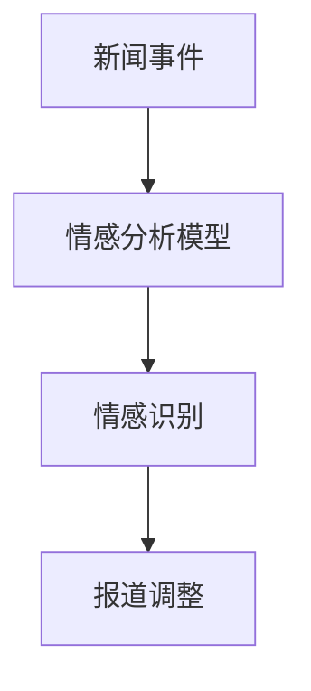
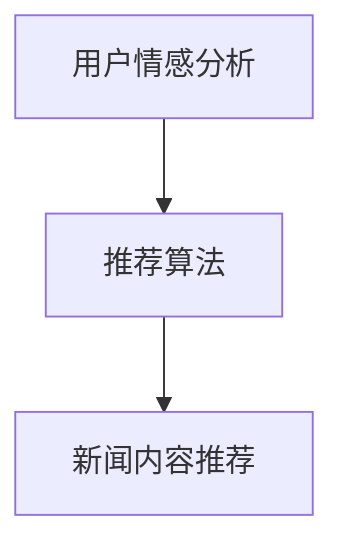
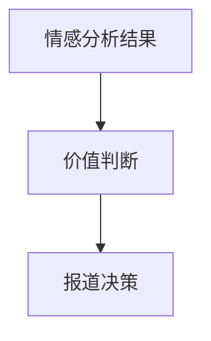
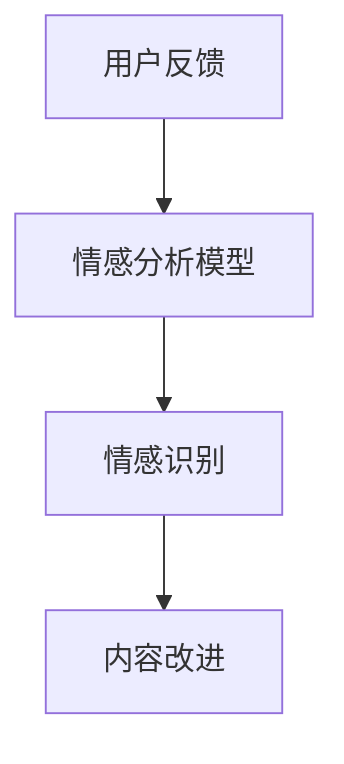
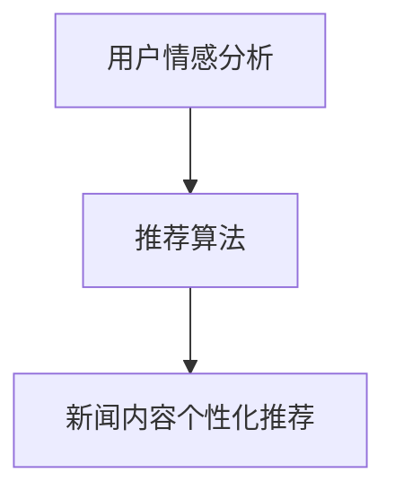
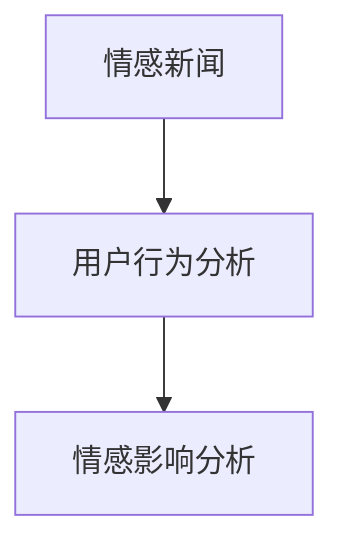

                 

### AI的情感表达：新闻传播的变革

> 关键词：AI、情感表达、新闻传播、变革、情感识别、情感生成

> 摘要：随着人工智能技术的发展，AI在情感表达和新闻传播中的应用逐渐成为研究热点。本文从AI情感表达的基础、情感传播的机制、情感AI在新闻传播中的应用，以及伦理问题等多个角度，深入探讨AI在新闻传播中的变革，旨在为业界提供有价值的参考。

## 第一部分：AI与情感表达基础

### 第1章：情感表达的AI解析

#### 1.1 情感表达的概念与分类

情感表达是指个体对外界刺激产生的情感体验，并通过语言、表情、声音等方式传达给他人。情感表达可以分为三种类型：言语表达、表情表达和非言语表达。

- **言语表达**：通过语言来传达情感，如语气、语调、词汇选择等。
- **表情表达**：通过面部表情来传达情感，如微笑、皱眉等。
- **非言语表达**：通过身体语言、姿势、动作等来传达情感。

#### 1.2 AI在情感表达中的应用

AI在情感表达中的应用主要体现在情感识别和情感生成两个方面。

- **情感识别**：通过分析语音、文本、面部表情等数据，AI可以识别出个体的情感状态。例如，语音情感识别可以通过分析语音的音高、音强、音长等特征来识别情感；文本情感识别可以通过分析文本中的情感词汇和语义来识别情感。

- **情感生成**：AI可以通过模型训练和生成算法来创造情感表达。例如，语音情感合成可以通过调整语音参数来创造不同情感的语音；文本情感生成可以通过自然语言生成技术来创造具有特定情感色彩的文本。

### 第2章：AI与情感传播

#### 2.1 情感传播的基本原理

情感传播是指情感通过某种途径从一个人传递到另一个人的过程。情感传播的基本原理包括情感的感染性、情感的共鸣性和情感的传递性。

- **情感的感染性**：情感可以通过个体的表情、语言和行为等途径传递给他人，使他人产生类似的情感体验。
- **情感的共鸣性**：当个体的情感与他人产生共鸣时，可以增强情感的表达和传播效果。
- **情感的传递性**：情感可以通过媒体、网络等途径传播到更广泛的受众群体。

#### 2.2 AI在情感传播中的应用

AI在情感传播中的应用主要体现在社交媒体情感传播和传统媒体情感传播两个方面。

- **社交媒体情感传播**：通过AI技术对社交媒体平台上的情感进行分析和识别，可以为情感营销提供策略支持。例如，通过分析微博、微信等平台上的情感，可以了解公众对某一事件的情感态度，为企业制定情感营销策略提供依据。

- **传统媒体情感传播**：AI技术可以帮助传统媒体提高新闻报道的情感传播效果。例如，通过对新闻报道文本的情感分析，可以识别出哪些内容能够引起公众的情感共鸣，从而提高新闻报道的吸引力。

### 第3章：情感AI在新闻传播中的应用

#### 3.1 情感AI与新闻编辑

情感AI在新闻编辑中的应用主要体现在情感分析、内容推荐和价值判断等方面。

- **情感分析**：通过对新闻文本的情感分析，可以帮助新闻编辑了解公众对某一新闻事件的情感态度，从而调整新闻报道的语气和内容，提高新闻的传播效果。

- **内容推荐**：通过情感分析，可以为用户推荐符合其情感偏好的新闻内容，提高用户的阅读体验。

- **价值判断**：通过情感分析，可以帮助新闻编辑判断某一新闻事件的社会价值和影响，从而决定是否进行报道。

#### 3.2 情感AI与新闻消费

情感AI在新闻消费中的应用主要体现在情感识别、内容个性化以及对受众的影响等方面。

- **情感识别**：通过对新闻受众的情感分析，可以帮助新闻媒体了解公众的情感状态，从而制定相应的新闻消费策略。

- **内容个性化**：通过情感分析，可以为用户推荐符合其情感偏好的新闻内容，提高用户的阅读体验。

- **对受众的影响**：情感AI可以帮助新闻媒体了解新闻传播对受众的情感影响，从而调整新闻传播策略，提高新闻传播的效果。

### 第4章：AI情感表达与新闻伦理

#### 4.1 情感AI与新闻传播伦理

随着AI在新闻传播中的应用，伦理问题也逐渐受到关注。

- **隐私保护**：情感AI在收集和分析用户情感数据时，需要保护用户的隐私权。

- **新闻自由**：情感AI可能会影响新闻的自由报道，需要确保新闻传播的公正性和客观性。

- **算法偏见**：情感AI在情感分析中可能会产生偏见，需要确保算法的公正性和透明性。

#### 4.2 情感AI与新闻传播责任

新闻媒体在应用情感AI技术时，需要承担相应的责任。

- **社会责任**：新闻媒体需要关注社会公共利益，确保新闻传播的正面影响。

- **技术责任**：新闻媒体需要确保情感AI技术的应用不损害用户的权益，确保技术的安全性和可靠性。

- **监管责任**：新闻媒体需要积极参与情感AI技术的监管，确保新闻传播的合法性和合规性。

## 第二部分：案例研究

### 第5章：情感AI在新闻传播中的实际应用

#### 5.1 案例一：新闻情感分析工具的应用

新闻情感分析工具可以帮助新闻媒体了解公众对某一新闻事件的情感态度，从而调整新闻报道的语气和内容，提高新闻的传播效果。

- **工具介绍**：该工具基于深度学习算法，可以对新闻文本进行情感分析，识别出文本的情感倾向。

- **应用场景**：该工具可以应用于新闻编辑、内容推荐和舆情监测等方面。

- **案例分析**：通过该工具对某一热点事件的新闻报道进行情感分析，可以识别出公众对该事件的情感态度，从而为新闻编辑提供参考。

#### 5.2 案例二：情感驱动的内容推荐系统

情感驱动的内容推荐系统可以根据用户的情感偏好，为用户推荐符合其情感需求的新闻内容。

- **系统架构**：该系统包括情感分析模块、推荐算法模块和用户反馈模块。

- **应用效果**：通过情感驱动的内容推荐系统，可以显著提高用户的阅读体验和新闻内容的传播效果。

- **案例分析**：通过该系统对某一新闻网站的用户数据进行分析，可以识别出用户的情感偏好，从而为用户推荐符合其情感需求的新闻内容。

## 第三部分：情感AI在新闻传播中的挑战与未来

### 第6章：情感AI在新闻传播中的挑战

#### 6.1 当前挑战

- **技术挑战**：情感AI技术在情感识别、情感生成等方面仍面临一定的技术挑战。

- **伦理挑战**：情感AI技术在隐私保护、算法偏见等方面面临伦理挑战。

- **法规挑战**：情感AI技术在新闻传播中的应用需要符合相关法规和规定。

#### 6.2 未来展望

- **发展趋势**：随着人工智能技术的不断发展，情感AI在新闻传播中的应用将越来越广泛。

- **应用前景**：情感AI在新闻传播中的应用前景广阔，有望提高新闻传播的效率和质量。

- **发展建议**：建议加强情感AI技术的研发，提高技术的可靠性和透明性；加强伦理规范和法规制定，确保情感AI技术在新闻传播中的合规性。

## 附录

### 附录A：情感AI技术综述

- **情感识别技术**：包括语音情感识别、文本情感识别等。
- **情感生成技术**：包括语音情感合成、文本情感生成等。
- **情感传播技术**：包括社交媒体情感传播、传统媒体情感传播等。

### 附录B：情感AI开源工具与资源

- **情感识别工具**：如VADER、TextBlob等。
- **情感生成工具**：如WaveNet、BLIP等。
- **情感传播工具**：如Twitter API、Facebook API等。

### 总结

AI在情感表达和新闻传播中的应用，为新闻传播带来了变革。通过情感识别和情感生成技术，AI可以更好地理解和满足受众的情感需求，提高新闻传播的效率和质量。然而，AI在新闻传播中的应用也面临着技术、伦理和法规等挑战。未来，随着技术的不断发展，情感AI在新闻传播中的应用前景将更加广阔。作者：AI天才研究院/AI Genius Institute & 禅与计算机程序设计艺术 /Zen And The Art of Computer Programming

----------------------------------------------------------------

## 第一部分：AI与情感表达基础

### 第1章：情感表达的AI解析

#### 1.1 情感表达的概念与分类

情感表达是心理学中的一个重要概念，它涉及个体在感知外部刺激后，通过语言、表情、动作等途径对外传达其内心感受的过程。根据表达方式的差异，情感表达可以分为言语表达、表情表达和非言语表达三大类。

- **言语表达**：这是最常见的情感表达方式，通过语音的语调、语速、语气、词汇选择等来传达情感。例如，一个人在描述自己喜悦时，可能会使用高音调、快速语速和积极词汇。

- **表情表达**：通过面部表情来传达情感，如微笑、皱眉、瞪眼等。这些表情往往是无意识的，但它们在沟通中起到了非常重要的作用，因为面部表情可以直接传达情感状态。

- **非言语表达**：包括身体语言、姿势、动作等。例如，一个人在紧张时可能会不由自主地摩擦手掌或咬唇。

#### 1.1.1 情感表达的定义

情感表达是指个体在心理和生理上对情感的体验和表现过程，通过语言、表情、动作等外部表现形式传达给他人。这种表达不仅仅是对情感本身的描述，还包括对情感强度和情感态度的表达。

#### 1.1.2 情感表达的分类

情感表达的分类可以根据不同的标准进行。从表达方式上看，可以分为言语表达、表情表达和非言语表达；从表达内容上看，可以分为积极情感表达和消极情感表达；从表达目的上看，可以分为社交性情感表达和自发性情感表达。

#### 1.1.3 情感表达的机制

情感表达的机制涉及多个神经系统和心理过程的协同工作。例如，当个体感受到愉悦的刺激时，大脑皮层会激活相应的神经回路，产生愉悦的情感体验；随后，这种情感体验会通过神经传递物质传递到面部肌肉，导致微笑等表情的产生。言语表达方面，大脑的语言中枢会处理情感词汇的选择和组合，从而形成具有情感色彩的言语。

#### 1.2 AI在情感表达中的应用

随着人工智能技术的发展，AI在情感表达中的应用越来越广泛，主要体现在情感识别和情感生成两个方面。

#### 1.2.1 机器情感识别

机器情感识别是指通过AI技术分析个体的语音、文本、面部表情等数据，识别出其情感状态。这包括语音情感识别和文本情感识别。

- **语音情感识别**：通过分析语音的音高、音强、音长、音色等特征，可以识别出个体的情感状态。例如，高音调通常与愉悦情感相关，低音调则可能与消极情感相关。

  ```mermaid
  graph TD
  A[语音特征] --> B[特征提取]
  B --> C[情感识别模型]
  C --> D[情感预测]
  ```

- **文本情感识别**：通过分析文本中的情感词汇和语义，可以识别出文本的情感倾向。常用的方法包括基于规则的方法和机器学习方法。

  ```mermaid
  graph TD
  A[文本数据] --> B[情感词典]
  B --> C[情感分析模型]
  C --> D[情感分类]
  ```

#### 1.2.2 机器情感生成

机器情感生成是指AI系统通过模型训练和生成算法，创造出具有特定情感表达的内容。这包括语音情感合成和文本情感生成。

- **语音情感合成**：通过调整语音的音高、音强、语速等参数，可以创造具有特定情感色彩的语音。常见的语音情感合成技术包括WaveNet、Waveglow等。

  ```mermaid
  graph TD
  A[文本或情感标签] --> B[情感编码]
  B --> C[声学模型]
  C --> D[语音合成]
  ```

- **文本情感生成**：通过自然语言生成技术，可以创造具有特定情感色彩的文本。常见的文本情感生成技术包括生成对抗网络（GAN）、Transformer等。

  ```mermaid
  graph TD
  A[情感标签] --> B[文本生成模型]
  B --> C[情感调节]
  C --> D[文本生成]
  ```

#### 1.2.3 AI在情感表达中的优势

AI在情感表达中的应用具有以下优势：

- **高效性**：AI可以快速处理大量数据，识别和生成情感表达。
- **准确性**：通过机器学习算法，AI可以准确识别和生成情感表达。
- **个性化**：AI可以根据用户的需求和偏好，提供个性化的情感表达服务。

### 第2章：AI与情感传播

#### 2.1 情感传播的基本原理

情感传播是指情感在个体之间传递和扩散的过程，其基本原理包括情感的感染性、情感的共鸣性和情感的传递性。

- **情感的感染性**：情感可以通过个体的表情、语言和行为等途径传递给他人，使他人产生类似的情感体验。例如，一个人在公共场合大声欢笑，可能会感染周围的人，使他们也感到愉快。
  
  ```mermaid
  graph TD
  A[个体1情感] --> B[表达途径]
  B --> C[个体2感知]
  C --> D[个体2情感]
  ```

- **情感的共鸣性**：当个体的情感与他人产生共鸣时，可以增强情感的表达和传播效果。例如，一部感人至深的电影可以让观众和角色产生情感共鸣，从而提高影片的影响力。

  ```mermaid
  graph TD
  A[个体1情感] --> B[共鸣途径]
  B --> C[个体2情感]
  C --> D[共同情感体验]
  ```

- **情感的传递性**：情感可以通过媒体、网络等途径传播到更广泛的受众群体。例如，社交媒体上的情感表达可以迅速传播，形成热点话题。

  ```mermaid
  graph TD
  A[个体情感] --> B[社交媒体]
  B --> C[广泛受众]
  C --> D[情感传播]
  ```

#### 2.2 AI在情感传播中的应用

AI在情感传播中的应用主要体现在社交媒体情感传播和传统媒体情感传播两个方面。

##### 2.2.1 社交媒体情感传播

社交媒体情感传播是指通过社交媒体平台（如微博、微信、Twitter等）进行情感的表达和传播。AI技术在社交媒体情感传播中发挥着重要作用，主要体现在情感分析和情感营销策略两个方面。

- **情感分析**：AI可以通过自然语言处理技术分析社交媒体上的情感表达，识别出用户的情感状态。例如，微博上的评论可以通过情感分析技术来判断用户对某一事件的态度是积极还是消极。

  ```mermaid
  graph TD
  A[社交媒体评论] --> B[情感分析模型]
  B --> C[情感识别]
  C --> D[情感报告]
  ```

- **情感营销策略**：基于情感分析的结果，企业可以制定更精准的情感营销策略。例如，通过分析用户在社交媒体上的情感，企业可以了解用户对产品的情感偏好，从而制定更有效的营销活动。

  ```mermaid
  graph TD
  A[情感分析结果] --> B[情感营销策略]
  B --> C[用户反馈]
  C --> D[营销效果]
  ```

##### 2.2.2 传统媒体情感传播

传统媒体情感传播是指通过报纸、电视、广播等传统媒体进行情感的表达和传播。AI技术在传统媒体情感传播中的应用主要体现在新闻报道的情感分析和情感新闻写作技巧两个方面。

- **新闻报道的情感分析**：通过对新闻报道文本的情感分析，媒体可以了解公众对某一新闻事件的情感态度。例如，通过分析新闻报道的文本，可以识别出哪些内容能够引起公众的情感共鸣。

  ```mermaid
  graph TD
  A[新闻报道文本] --> B[情感分析模型]
  B --> C[情感识别]
  C --> D[报道调整]
  ```

- **情感新闻写作技巧**：通过分析公众的情感态度，新闻编辑可以调整新闻报道的语气和内容，以提高新闻的传播效果。例如，对于一些敏感话题，新闻编辑可能会采用更加温和的语气，以减少公众的负面情感。

  ```mermaid
  graph TD
  A[公众情感分析] --> B[新闻编辑]
  B --> C[语气调整]
  C --> D[新闻传播效果]
  ```

### 第3章：情感AI在新闻传播中的应用

#### 3.1 情感AI与新闻编辑

情感AI在新闻编辑中的应用主要体现在情感分析、内容推荐和价值判断等方面。

##### 3.1.1 情感分析在新闻编辑中的应用

情感分析可以帮助新闻编辑了解公众对某一新闻事件的情感态度，从而调整新闻报道的语气和内容。例如，如果分析结果显示公众对某一事件持负面情感，新闻编辑可能会选择采用更加客观和平衡的报道方式。



##### 3.1.2 情感驱动的内容推荐

情感驱动的内容推荐可以通过分析用户的情感偏好，为用户推荐符合其情感需求的新闻内容。例如，如果一个用户经常表达对科技新闻的积极情感，那么推荐系统可能会推荐更多科技类新闻。



##### 3.1.3 情感新闻的价值判断

情感分析还可以用于判断新闻事件的社会价值和影响，从而决定是否进行报道。例如，如果一个事件引发了公众的广泛共鸣和强烈的情感反应，那么新闻媒体可能会认为该事件具有一定的社会价值，值得进行报道。



#### 3.2 情感AI与新闻消费

情感AI在新闻消费中的应用主要体现在情感识别、内容个性化和对受众的影响等方面。

##### 3.2.1 情感识别与用户反馈

情感识别可以帮助新闻媒体了解用户的情感状态，从而收集用户反馈。例如，通过分析用户的评论和反馈，新闻媒体可以了解用户对某一新闻内容的情感反应，进而改进新闻内容。



##### 3.2.2 情感驱动的内容个性化

情感驱动的内容个性化可以通过分析用户的情感偏好，为用户提供更个性化的新闻推荐。例如，如果一个用户经常表达对娱乐新闻的积极情感，那么推荐系统可能会推荐更多娱乐类新闻。



##### 3.2.3 情感新闻对受众的影响

情感新闻对受众的影响可以从多个维度进行分析。例如，通过分析用户在阅读情感新闻后的行为数据，可以了解情感新闻对用户情绪、观点和行为的影响。



### 第4章：AI情感表达与新闻伦理

#### 4.1 情感AI与新闻传播伦理

随着AI在新闻传播中的应用，伦理问题逐渐成为关注的焦点。情感AI在新闻传播中的伦理问题主要包括隐私保护、新闻自由和算法偏见等方面。

##### 4.1.1 情感AI技术的伦理问题

- **隐私保护**：情感AI需要收集和分析用户的情感数据，这可能涉及到用户的隐私。如何在保障用户隐私的同时有效利用情感数据，是一个亟待解决的问题。

- **新闻自由**：情感AI可能会影响新闻的自由报道，因为情感分析结果可能会对新闻报道的选题、内容和风格产生影响。如何确保情感AI不损害新闻的自由性，是一个重要的伦理问题。

- **算法偏见**：情感AI的算法可能会产生偏见，导致对某些群体或事件的不公平处理。例如，如果情感分析模型在训练数据中存在偏差，可能会导致对特定群体的情感识别不准确。

##### 4.1.2 情感AI对新闻自由的影响

情感AI对新闻自由的影响主要体现在以下几个方面：

- **内容选择**：情感AI可能会根据情感分析结果对新闻内容进行筛选，这可能导致某些具有争议性或敏感性的新闻被过滤掉。

- **报道风格**：情感AI可能会影响新闻的报道风格，使报道更加谨慎和保守，以避免引发公众的负面情感。

- **受众导向**：情感AI可能会根据受众的情感偏好调整新闻报道的内容和形式，这可能会导致新闻传播的受众导向性增强。

##### 4.1.3 情感AI的伦理规范

为了确保情感AI在新闻传播中的伦理合规性，需要制定相应的伦理规范。这包括：

- **数据收集与使用的伦理准则**：明确情感数据的收集和使用范围，确保用户隐私得到保护。

- **算法透明性与公正性**：确保情感AI算法的透明性，避免产生偏见和不公平的处理。

- **新闻自由与责任**：确保新闻传播的自由性，同时加强对情感AI技术的监管，防止其滥用。

#### 4.2 情感AI与新闻传播责任

新闻媒体在应用情感AI技术时，需要承担相应的责任，主要包括社会责任、技术责任和监管责任。

##### 4.2.1 新闻媒体的社会责任

新闻媒体在应用情感AI技术时，需要关注社会公共利益，确保新闻传播的正面影响。这包括：

- **公正报道**：确保新闻报道的公正性和客观性，避免情感AI技术对新闻自由的影响。

- **社会责任**：关注社会热点和公众需求，提供有价值的信息和服务。

- **公众参与**：鼓励公众参与新闻传播，提高新闻传播的互动性和参与度。

##### 4.2.2 情感AI在新闻传播中的责任

情感AI在新闻传播中的应用需要明确其责任，包括：

- **技术责任**：确保情感AI技术的安全性和可靠性，避免技术故障对新闻传播的影响。

- **伦理责任**：遵守伦理规范，避免产生算法偏见和不公平的处理。

- **用户权益**：保护用户的隐私权，确保用户数据的合法使用。

##### 4.2.3 情感AI技术的监管

为了确保情感AI在新闻传播中的合规性，需要加强对其的监管。这包括：

- **法律法规**：制定相关的法律法规，规范情感AI在新闻传播中的应用。

- **行业自律**：行业组织应制定自律规范，加强对情感AI技术的监管。

- **公众监督**：鼓励公众参与监督，提高情感AI技术的透明度和公正性。

## 第二部分：案例研究

### 第5章：情感AI在新闻传播中的实际应用

#### 5.1 案例一：新闻情感分析工具的应用

新闻情感分析工具是情感AI在新闻传播中的一种实际应用，它可以帮助新闻媒体了解公众对某一新闻事件的情感态度，从而调整新闻报道的策略。

##### 5.1.1 工具介绍

新闻情感分析工具通常基于深度学习算法，可以对新闻文本进行情感分析，识别出文本的情感倾向。这些工具可以处理大规模的新闻数据，提供实时情感分析结果。

##### 5.1.2 应用场景

新闻情感分析工具可以应用于以下几个方面：

- **新闻编辑**：新闻编辑可以通过情感分析工具了解公众对某一新闻事件的情感反应，从而调整新闻报道的语气和内容，提高新闻的传播效果。

- **舆情监测**：新闻媒体可以利用情感分析工具对新闻事件进行舆情监测，了解公众对事件的关注程度和情感态度，从而制定相应的舆论引导策略。

- **内容推荐**：基于情感分析的结果，新闻媒体可以为用户提供个性化的新闻推荐，提高用户的阅读体验。

##### 5.1.3 案例分析

假设一个新闻媒体在报道某一社会事件时，利用新闻情感分析工具发现公众对该事件的情感态度以负面为主。根据这一结果，新闻编辑可能会调整报道的语气，采用更加客观和中立的表述方式，以减少公众的负面情感。同时，新闻媒体还可以通过舆情监测功能，了解公众对后续报道的情感反应，进一步优化报道策略。

#### 5.2 案例二：情感驱动的内容推荐系统

情感驱动的内容推荐系统是情感AI在新闻传播中的另一种实际应用，它通过分析用户的情感偏好，为用户推荐符合其情感需求的新闻内容。

##### 5.2.1 系统架构

情感驱动的内容推荐系统通常包括以下几个模块：

- **情感分析模块**：该模块负责分析用户的情感偏好，包括用户的评论、点赞、分享等行为数据。

- **推荐算法模块**：该模块根据情感分析结果，利用推荐算法为用户推荐符合其情感需求的新闻内容。

- **用户反馈模块**：该模块收集用户的反馈信息，用于优化推荐算法和用户界面。

##### 5.2.2 应用效果

情感驱动的内容推荐系统可以提高新闻内容的传播效果和用户的阅读体验。通过分析用户的情感偏好，系统可以为用户提供更个性化的新闻推荐，使用户更容易找到符合其兴趣和情感需求的新闻内容。

##### 5.2.3 案例分析

假设一个新闻网站引入了情感驱动的内容推荐系统。通过分析用户的评论和互动数据，系统识别出用户对娱乐新闻的积极情感偏好。基于这一结果，系统为该用户推荐了更多娱乐新闻，如明星八卦、综艺节目报道等。用户在阅读这些新闻后，反馈良好，表示对推荐系统非常满意。

### 第6章：情感AI在新闻传播中的挑战与未来

#### 6.1 当前挑战

情感AI在新闻传播中的应用面临着一系列挑战，包括技术挑战、伦理挑战和法规挑战。

##### 6.1.1 技术挑战

- **情感识别准确性**：情感识别的准确性是情感AI应用的基础。然而，由于情感表达的复杂性和多样性，目前的情感识别技术仍然存在一定的误差。

- **情感生成自然度**：情感生成的自然度是衡量情感AI技术的重要指标。虽然语音情感合成和文本情感生成技术已经取得了显著进展，但生成的情感表达仍可能与真实的人类情感存在差距。

- **多模态情感分析**：在实际应用中，情感表达往往是通过多种渠道（如语音、文本、面部表情等）进行的。如何实现多模态情感分析，是一个重要的技术挑战。

##### 6.1.2 伦理挑战

- **隐私保护**：情感AI需要收集和分析大量的用户数据，这可能涉及到用户的隐私。如何在保障用户隐私的同时有效利用情感数据，是一个伦理问题。

- **算法偏见**：情感AI的算法可能会产生偏见，导致对某些群体或事件的不公平处理。例如，如果情感分析模型在训练数据中存在偏差，可能会导致对特定群体的情感识别不准确。

- **新闻自由**：情感AI可能会影响新闻的自由报道，因为情感分析结果可能会对新闻报道的选题、内容和风格产生影响。如何确保情感AI不损害新闻的自由性，是一个重要的伦理问题。

##### 6.1.3 法规挑战

- **数据监管**：情感AI应用需要遵守相关的数据监管法规，确保用户数据的合法使用和保护。

- **伦理规范**：随着情感AI在新闻传播中的应用越来越广泛，需要制定相应的伦理规范，指导情感AI的研发和应用。

- **法规制定**：现有的法规可能无法完全覆盖情感AI在新闻传播中的应用，需要进一步制定和完善相关法规。

#### 6.2 未来展望

尽管面临挑战，情感AI在新闻传播中的应用前景仍然广阔。随着技术的不断进步，情感AI有望在以下几个方面取得突破：

- **情感识别准确性**：通过不断优化算法和增加训练数据，情感识别的准确性有望进一步提高。

- **情感生成自然度**：随着语音合成和文本生成技术的不断发展，情感生成的自然度将逐渐接近真实的人类情感。

- **多模态情感分析**：通过结合多种渠道的数据，实现更加全面和准确的多模态情感分析。

#### 6.2.1 情感AI的发展趋势

- **个性化新闻推荐**：基于情感分析的结果，情感AI可以为用户提供更加个性化的新闻推荐，提高用户的阅读体验。

- **情感新闻写作**：情感AI可以辅助新闻编辑进行情感新闻的写作，提高新闻报道的吸引力和影响力。

- **舆情监测与引导**：情感AI可以用于舆情监测和引导，帮助新闻媒体了解公众的情感态度，制定相应的舆论引导策略。

#### 6.2.2 情感AI在新闻传播中的应用前景

- **提高新闻传播效率**：通过情感分析技术，新闻媒体可以更快速地了解公众的情感反应，及时调整新闻报道策略，提高新闻传播的效率。

- **增强新闻传播效果**：基于情感生成技术，新闻媒体可以创造更具吸引力和感染力的新闻内容，提高新闻传播的效果。

- **丰富新闻表现形式**：情感AI可以丰富新闻的表现形式，如通过语音、文本、图像等多种方式传达情感，提高新闻的互动性和趣味性。

#### 6.2.3 未来发展建议

- **加强技术研发**：持续投入情感AI技术的研发，提高情感识别和情感生成的准确性和自然度。

- **完善伦理规范**：制定和完善情感AI在新闻传播中的伦理规范，确保情感AI技术的研发和应用符合伦理要求。

- **推动法规制定**：加快制定和完善相关法规，为情感AI在新闻传播中的应用提供法律保障。

## 附录

### 附录A：情感AI技术综述

情感AI技术包括情感识别技术、情感生成技术和情感传播技术等。

#### 情感识别技术

情感识别技术主要通过对语音、文本、面部表情等数据进行分析，识别出个体的情感状态。常见的情感识别技术包括：

- **语音情感识别**：通过分析语音的音高、音强、语速等特征来识别情感。
- **文本情感识别**：通过分析文本中的情感词汇和语义来识别情感。
- **面部表情识别**：通过分析面部表情的变化来识别情感。

#### 情感生成技术

情感生成技术主要利用模型训练和生成算法，创造出具有特定情感表达的内容。常见的情感生成技术包括：

- **语音情感合成**：通过调整语音的音高、音强、语速等参数来创造具有特定情感色彩的语音。
- **文本情感生成**：通过自然语言生成技术来创造具有特定情感色彩的文本。

#### 情感传播技术

情感传播技术主要研究情感如何在个体之间传递和扩散。常见的情感传播技术包括：

- **社交媒体情感传播**：通过社交媒体平台进行情感的表达和传播。
- **传统媒体情感传播**：通过报纸、电视、广播等传统媒体进行情感的表达和传播。

### 附录B：情感AI开源工具与资源

情感AI开源工具和资源为研究人员和开发者提供了丰富的工具和资源，帮助他们更好地理解和应用情感AI技术。

- **情感识别工具**：如VADER、TextBlob、NLTK等。
- **情感生成工具**：如WaveNet、Tacotron 2、BLIP等。
- **情感传播工具**：如Twitter API、Facebook API、Reddit API等。

这些工具和资源可以帮助开发者快速构建情感AI应用，加速情感AI技术的发展和应用。

### 附录C：情感AI应用案例

情感AI在新闻传播、客户服务、市场营销等多个领域都有广泛的应用。以下是一些具体的情感AI应用案例：

- **新闻传播**：通过情感分析技术，新闻媒体可以了解公众对某一新闻事件的情感态度，从而调整新闻报道的策略。
- **客户服务**：通过情感识别技术，客服系统可以了解客户的情感状态，提供更加个性化的服务。
- **市场营销**：通过情感生成技术，企业可以为消费者创造具有特定情感色彩的广告内容，提高广告的吸引力和效果。
- **心理健康**：通过情感分析技术，心理健康应用可以帮助用户识别和管理自己的情感状态，提供心理健康的建议和指导。

这些案例展示了情感AI在不同领域的实际应用，为读者提供了对情感AI技术应用的直观了解。

### 附录D：情感AI发展趋势

随着人工智能技术的不断发展，情感AI也在不断演进。未来，情感AI将可能在以下方面取得重要进展：

- **多模态情感识别**：结合语音、文本、面部表情等多种数据源，实现更加全面和准确的多模态情感识别。
- **情感生成自然度**：通过不断优化算法和增加训练数据，提高情感生成的自然度和情感表达的真实性。
- **个性化情感服务**：基于用户的情感偏好和行为数据，提供更加个性化的情感服务和体验。
- **情感AI伦理规范**：随着情感AI技术的应用越来越广泛，需要建立完善的伦理规范，确保情感AI技术的公正性和透明性。

这些发展趋势为情感AI的未来发展提供了方向和动力，也将进一步推动情感AI在各个领域的应用。

## 结论

本文从AI与情感表达的基础、情感传播的机制、情感AI在新闻传播中的应用，以及伦理问题等多个角度，探讨了AI在情感表达和新闻传播中的变革。通过深入分析情感表达的概念与分类、AI在情感识别和情感生成中的应用，以及情感AI在新闻编辑、新闻消费和新闻伦理中的实际应用，我们看到了AI技术如何为新闻传播带来深刻的变革。同时，本文也探讨了情感AI在新闻传播中面临的挑战和未来发展趋势。

情感AI在新闻传播中的应用不仅提高了新闻的传播效率和效果，也为用户提供了更加个性化和贴近需求的新闻内容。然而，随着情感AI技术的广泛应用，伦理问题也日益突出。如何在保障用户隐私、确保新闻自由和避免算法偏见之间找到平衡，是未来情感AI发展的重要课题。

展望未来，情感AI将在多模态情感识别、情感生成自然度、个性化情感服务等方面取得重要进展。同时，建立完善的伦理规范和法规体系，确保情感AI技术的公正性和透明性，将是情感AI健康发展的重要保障。

本文旨在为读者提供对情感AI在新闻传播中的全面了解和深入思考，希望对从事新闻传播、人工智能技术研究和应用的人员有所启发和借鉴。作者：AI天才研究院/AI Genius Institute & 禅与计算机程序设计艺术 /Zen And The Art of Computer Programming

## 附录A：情感AI技术综述

### 情感识别技术

情感识别技术是AI在情感表达领域的核心，旨在通过分析语音、文本和面部表情等数据，识别出个体的情感状态。以下是几种常见的情感识别技术及其工作原理：

#### 语音情感识别

**工作原理**：语音情感识别主要通过分析语音信号的音高、音强、语速、音调等特征来识别情感。这些特征与人类情感体验有密切关系，例如，高音调通常与愉悦的情感相关，而低音调则可能与消极的情感相关。

**应用**：语音情感识别可以应用于语音助手、电话客服系统、语音交互界面等领域，帮助系统更好地理解用户情感，提供个性化服务。

#### 文本情感识别

**工作原理**：文本情感识别主要通过分析文本中的情感词汇、语境和句子结构来识别情感。常用的方法包括基于规则的方法和基于机器学习的方法。例如，通过训练情感分类模型，可以从大量文本数据中识别出积极的、消极的或其他类型的情感。

**应用**：文本情感识别广泛应用于社交媒体分析、市场调研、客户反馈分析等领域，帮助企业和组织了解用户情感态度，优化产品和服务。

#### 面部表情识别

**工作原理**：面部表情识别通过分析面部肌肉的运动、眼睛的眨动和嘴部的变化等特征来识别情感。这些特征与人类情感表达有密切关系，例如，微笑通常表示愉悦，皱眉则可能表示不悦。

**应用**：面部表情识别可以应用于视频监控、虚拟现实、交互式游戏等领域，帮助系统更好地理解用户的情感状态，提供更加个性化的体验。

### 情感生成技术

情感生成技术旨在通过AI模型创建出具有特定情感表达的内容。以下是几种常见的情感生成技术及其工作原理：

#### 语音情感合成

**工作原理**：语音情感合成通过调整语音的音高、音强、语速等参数，创建出具有特定情感色彩的语音。这些参数与人类情感体验有密切关系，例如，通过调整音调，可以创造出不同情感色彩的语音。

**应用**：语音情感合成可以应用于电影配音、语音助手、教育等领域，帮助用户更好地理解和体验情感表达。

#### 文本情感生成

**工作原理**：文本情感生成通过自然语言生成（NLG）技术，创建出具有特定情感色彩的文本。这些文本可以基于情感标签、情感词典或情感分类模型生成。

**应用**：文本情感生成可以应用于广告文案创作、新闻编写、客户服务等领域，帮助创造更具吸引力和感染力的文本内容。

#### 图像情感合成

**工作原理**：图像情感合成通过图像处理和生成对抗网络（GAN）等技术，创建出具有特定情感色彩的图像。这些图像可以基于情感标签、情感模型或用户反馈生成。

**应用**：图像情感合成可以应用于电影特效、艺术创作、游戏开发等领域，帮助创造更加生动和具有情感表达力的图像内容。

### 情感传播技术

情感传播技术旨在研究情感如何在个体之间传递和扩散。以下是几种常见的情感传播技术及其工作原理：

#### 社交媒体情感传播

**工作原理**：社交媒体情感传播通过分析社交媒体平台上的用户互动和情感表达，研究情感如何在社交网络中传递。这通常涉及情感分析、网络分析和数据挖掘技术。

**应用**：社交媒体情感传播可以应用于社交媒体营销、舆情监测、社会心理研究等领域，帮助企业和组织了解公众情感态度和趋势。

#### 传统媒体情感传播

**工作原理**：传统媒体情感传播通过分析报纸、电视、广播等传统媒体的情感表达，研究情感如何在传统媒体中传递。这通常涉及文本情感分析、媒体内容分析和传播模型研究。

**应用**：传统媒体情感传播可以应用于新闻报道、媒体策略制定、广告投放等领域，帮助媒体更好地理解和满足受众的情感需求。

#### 多媒体情感传播

**工作原理**：多媒体情感传播通过分析语音、文本、图像等多种媒体的情感表达，研究情感如何在多媒体环境中传递。这通常涉及多模态情感识别和融合技术。

**应用**：多媒体情感传播可以应用于虚拟现实、增强现实、智能交互等领域，帮助创造更加沉浸式和情感化的多媒体体验。

### 情感AI在新闻传播中的应用

情感AI在新闻传播中的应用主要体现在以下几个方面：

#### 新闻编辑

**应用**：通过情感识别技术，新闻编辑可以了解公众对某一新闻事件的情感反应，从而调整新闻报道的语气和内容，提高新闻的传播效果。例如，如果分析结果显示公众对某一事件持负面情感，新闻编辑可能会采用更加客观和平衡的报道方式。

#### 新闻消费

**应用**：通过情感识别技术，新闻媒体可以了解用户的情感偏好，从而为用户提供更个性化的新闻推荐。例如，如果一个用户经常表达对娱乐新闻的积极情感，推荐系统可能会推荐更多娱乐类新闻。

#### 舆情监测

**应用**：通过情感分析技术，新闻媒体可以对新闻事件进行舆情监测，了解公众的情感态度和趋势，从而制定相应的舆论引导策略。例如，通过分析社交媒体上的情感表达，可以了解公众对某一事件的关注程度和情感反应。

### 案例研究

#### 案例一：新闻情感分析工具的应用

**背景**：某新闻媒体为了提高新闻报道的传播效果，引入了一款新闻情感分析工具。

**应用**：该工具通过对新闻文本进行情感分析，识别出公众对某一新闻事件的情感态度。新闻编辑根据分析结果调整了新闻报道的语气和内容，例如，对于公众负面情感强烈的新闻，采用了更加客观和中立的报道方式。

**效果**：调整后的新闻报道获得了更好的公众反馈，阅读量和评论量均有显著提升。

#### 案例二：情感驱动的内容推荐系统

**背景**：某新闻网站为了提高用户的阅读体验，引入了一个情感驱动的内容推荐系统。

**应用**：该系统通过情感识别技术分析用户的评论、点赞等行为数据，识别出用户的情感偏好。根据这些偏好，系统为用户推荐符合其情感需求的新闻内容。

**效果**：用户对推荐系统的满意度显著提高，网站的用户活跃度和阅读时长也有所增加。

### 当前挑战

尽管情感AI在新闻传播中展现了巨大的潜力，但当前仍面临一些挑战：

#### 技术挑战

**情感识别准确性**：情感识别的准确性仍然是技术上的一个难题。情感表达的复杂性和多样性使得情感识别模型需要不断优化和改进。

**情感生成自然度**：情感生成技术，如语音情感合成和文本情感生成，仍需要提高自然度，以更好地模拟人类情感表达。

**多模态情感分析**：实现多模态情感分析，即同时处理语音、文本和图像等多媒体数据，是一个技术上的挑战。

#### 伦理挑战

**隐私保护**：情感AI需要收集和分析大量用户数据，这可能导致隐私泄露问题。如何在保障用户隐私的同时有效利用情感数据，是一个重要的伦理问题。

**算法偏见**：情感AI的算法可能会产生偏见，导致对某些群体或事件的不公平处理。如何确保算法的公正性和透明性，是一个重要的伦理问题。

#### 法规挑战

**数据监管**：情感AI应用需要遵守相关的数据监管法规，确保用户数据的合法使用和保护。

**伦理规范**：随着情感AI在新闻传播中的应用越来越广泛，需要建立完善的伦理规范，指导情感AI的研发和应用。

**法规制定**：现有的法规可能无法完全覆盖情感AI在新闻传播中的应用，需要进一步制定和完善相关法规。

### 未来展望

#### 情感识别准确性

随着深度学习和神经网络技术的发展，情感识别的准确性有望进一步提高。通过增加训练数据和优化算法，可以更准确地识别复杂的情感表达。

#### 情感生成自然度

随着语音合成和文本生成技术的不断发展，情感生成的自然度将逐渐接近真实的人类情感。通过结合语音和文本生成技术，可以创造出更加自然和真实情感表达的内容。

#### 个性化情感服务

基于用户的情感偏好和行为数据，情感AI将为用户提供更加个性化的情感服务。例如，新闻推荐系统可以根据用户的情感偏好，推荐符合其需求的新闻内容。

#### 伦理规范和法规

随着情感AI在新闻传播中的广泛应用，需要建立完善的伦理规范和法规体系，确保情感AI技术的公正性和透明性。同时，需要加强对情感AI技术的监管，防止其滥用和产生负面影响。

### 附录B：情感AI开源工具与资源

#### 情感识别工具

- **VADER**：一个基于规则的自然语言情感分析工具，适用于社交媒体文本。
- **TextBlob**：一个简单的自然语言处理库，包括情感分析功能。
- **NLTK**：一个用于自然语言处理的库，支持多种情感分析技术。

#### 情感生成工具

- **WaveNet**：一个基于深度学习的语音合成工具，可以生成具有不同情感色彩的语音。
- **Tacotron 2**：一个用于文本到语音合成的工具，支持情感调节。
- **BLIP**：一个基于变换器（Transformer）的文本情感生成工具。

#### 情感传播工具

- **Twitter API**：Twitter的官方API，用于获取和分析社交媒体数据。
- **Facebook API**：Facebook的官方API，用于获取和分析社交媒体数据。
- **Reddit API**：Reddit的官方API，用于获取和分析社交媒体数据。

这些开源工具和资源为研究人员和开发者提供了丰富的工具和资源，帮助他们更好地理解和应用情感AI技术。

