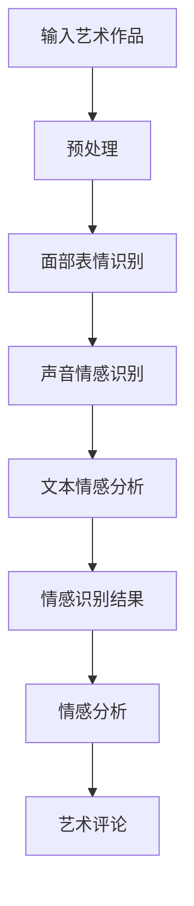
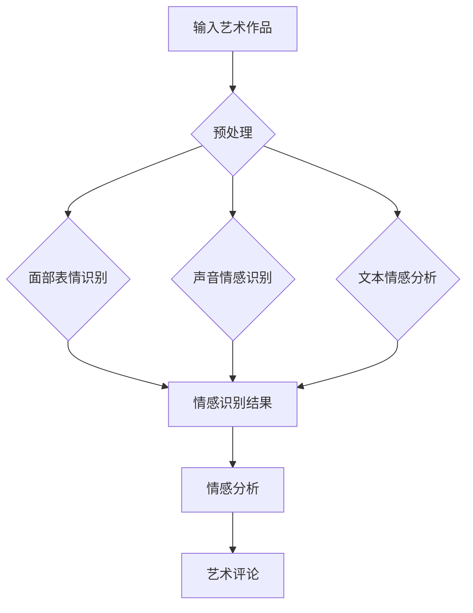
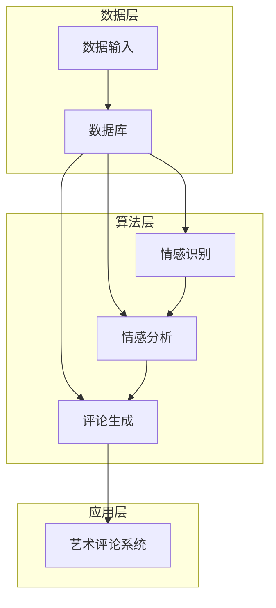
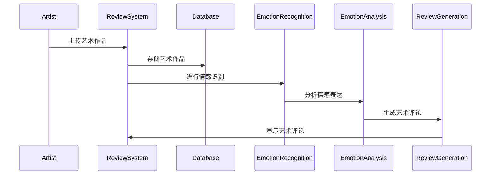

                 

# 《AI的情感表达：艺术评论的新标准》

## 关键词
- AI
- 情感表达
- 艺术评论
- 计算机视觉
- 自然语言处理
- 情感计算

## 摘要
本文探讨了人工智能（AI）在艺术评论中的应用，特别是AI如何通过情感表达来提供新的艺术评论标准。文章首先介绍了AI和情感表达的基础知识，然后深入分析了情感计算、AI情感识别和生成技术。随后，文章讨论了AI在艺术评论中的应用，并提出了新的艺术评论标准。通过具体的案例分析和实践探索，文章展示了AI情感表达在艺术评论中的潜力和未来发展趋势。

## 引言
随着人工智能技术的快速发展，AI在各个领域的应用越来越广泛。从医疗诊断到金融分析，从自动驾驶到智能家居，AI正在改变我们的生活方式。在艺术领域，AI也开始崭露头角，特别是在艺术评论方面。传统的艺术评论往往依赖于艺术家的主观判断和审美标准，而AI则通过情感表达提供了一种全新的评价方式。本文将深入探讨AI的情感表达，以及它如何成为艺术评论的新标准。

### 第一部分：AI与情感表达基础

## 第1章：AI与情感表达的概述

### 1.1 AI的基本概念
人工智能（AI，Artificial Intelligence）是计算机科学的一个分支，旨在使机器具备类似人类智能的能力。AI的发展历程可以追溯到20世纪50年代，当时人们开始探索如何通过计算机模拟人类的认知过程。AI的主要技术包括机器学习、深度学习、自然语言处理和计算机视觉等。

- **机器学习**：一种让计算机从数据中学习的方法，不需要显式编程。
- **深度学习**：一种基于神经网络的机器学习方法，可以自动提取特征。
- **自然语言处理（NLP）**：使计算机能够理解、生成和回应人类语言的技术。
- **计算机视觉**：使计算机能够理解和解释数字图像和视频的技术。

### 1.2 情感表达的基本概念
情感表达是指个体通过面部表情、身体语言、声音和其他非语言手段来传达情感状态。情感可以分为正面和负面，如快乐、悲伤、愤怒等。情感表达不仅受到生理因素的影响，还受到文化、社会和个人经验的深刻影响。

### 1.3 AI与情感表达的融合
AI与情感表达的融合为艺术评论带来了新的可能。通过情感计算，AI可以识别和理解艺术作品中的情感表达。这为艺术评论提供了新的维度，使评论更加全面和客观。

## 第2章：情感计算

### 2.1 情感计算的基本原理
情感计算是一种将人工智能应用于情感识别和表达的技术。其基本原理是通过分析面部表情、声音、文字和其他信号来识别情感状态。

- **面部表情识别**：通过计算机视觉技术识别面部表情。
- **声音情感识别**：通过分析声音的音调、速度和音量等特征来识别情感。
- **文本情感分析**：通过自然语言处理技术分析文本中的情感倾向。

### 2.2 情感计算的应用场景
情感计算在多个领域都有应用，如心理健康、客户服务、人机交互等。在艺术评论中，情感计算可以帮助识别艺术家在作品中的情感表达，从而提供更深入的艺术解读。

### 2.3 情感计算的技术挑战
情感计算面临的技术挑战包括情感识别的准确性、跨文化情感表达的理解以及情感的复杂性和多变性。解决这些挑战需要进一步的研究和技术创新。

## 第3章：AI情感识别

### 3.1 情感识别的基本原理
AI情感识别是基于机器学习和深度学习技术的。通过训练模型，AI可以识别图像、声音和文本中的情感表达。

### 3.2 情感识别的技术方法
情感识别的技术方法包括：

- **图像情感识别**：使用卷积神经网络（CNN）分析图像中的面部表情。
- **声音情感识别**：使用循环神经网络（RNN）分析声音的音调、速度和音量等特征。
- **文本情感分析**：使用词嵌入和长短期记忆网络（LSTM）分析文本中的情感倾向。

### 3.3 情感识别的应用实例
AI情感识别在多个领域有应用，如情绪分析、用户体验评估、营销策略优化等。在艺术评论中，情感识别可以帮助识别艺术家在作品中的情感表达。

## 第4章：AI情感生成

### 4.1 情感生成的基本原理
AI情感生成是通过生成对抗网络（GAN）和变分自编码器（VAE）等技术来创造具有情感表达的内容。情感生成的基本原理是通过训练模型来生成符合情感特征的内容。

### 4.2 情感生成的技术方法
情感生成的技术方法包括：

- **图像情感生成**：使用GAN生成具有特定情感的面部表情。
- **声音情感生成**：使用VAE生成具有特定情感的声音。
- **文本情感生成**：使用自然语言生成模型（如GPT）生成具有特定情感倾向的文本。

### 4.3 情感生成的应用实例
AI情感生成在多个领域有应用，如虚拟角色互动、广告创意、艺术创作等。在艺术评论中，情感生成可以帮助模拟不同情感表达的效果，从而为艺术作品提供新的解读角度。

### 第二部分：情感表达在艺术评论中的应用

## 第5章：AI在艺术评论中的应用

### 5.1 艺术评论的基本概念
艺术评论是对艺术作品的评价和分析，旨在传达艺术作品的价值、意义和艺术家的意图。传统的艺术评论依赖于艺术家的主观判断和审美标准。

### 5.2 AI在艺术评论中的应用
AI在艺术评论中的应用主要包括：

- **情感识别**：识别艺术家在作品中的情感表达。
- **风格分析**：分析艺术作品的风格和流派。
- **历史和文化背景研究**：利用AI分析艺术作品的历史和文化背景。

### 5.3 AI艺术评论的优势与挑战
AI艺术评论的优势在于：

- **客观性**：通过情感识别和风格分析，提供更客观的评论。
- **全面性**：结合多维度数据分析，提供更全面的艺术评价。

AI艺术评论的挑战在于：

- **情感理解的局限性**：AI难以完全理解情感表达的复杂性。
- **文化差异**：不同文化对情感表达的理解可能存在差异。

## 第6章：情感表达在艺术评论中的表现

### 6.1 情感表达的艺术评论标准
情感表达的艺术评论标准包括：

- **情感识别准确性**：评论中情感识别的准确性。
- **情感表达丰富性**：评论中情感表达的丰富程度。
- **情感理解深度**：评论中对情感表达的深度理解。

### 6.2 情感表达在艺术评论中的具体表现
情感表达在艺术评论中的具体表现包括：

- **情感描述**：评论中对艺术作品情感表达的描述。
- **情感比较**：评论中对不同艺术作品情感表达的比较。
- **情感分析**：评论中对艺术作品情感表达的分析。

### 6.3 情感表达在艺术评论中的应用实例
情感表达在艺术评论中的应用实例包括：

- **面部表情分析**：通过面部表情识别分析艺术家的情感状态。
- **声音情感分析**：通过声音情感识别分析艺术家的情感表达。
- **文本情感分析**：通过文本情感分析识别艺术评论的情感倾向。

### 第三部分：情感表达的艺术评论标准

## 第7章：艺术评论标准的演变

### 7.1 传统艺术评论标准
传统艺术评论标准主要依赖于艺术家的主观判断和审美标准。这些标准包括：

- **美学价值**：评价艺术作品的美学质量。
- **艺术价值**：评价艺术作品的创新性和独特性。
- **历史价值**：评价艺术作品的历史和文化意义。

### 7.2 AI时代下的艺术评论标准
AI时代下的艺术评论标准与传统标准有很大不同。AI时代下的标准包括：

- **情感识别准确性**：评价艺术评论中情感识别的准确性。
- **情感表达丰富性**：评价艺术评论中情感表达的丰富程度。
- **情感理解深度**：评价艺术评论中对情感表达的深度理解。

### 7.3 情感表达对艺术评论标准的影响
情感表达对艺术评论标准的影响主要体现在以下几个方面：

- **扩展评论维度**：通过情感表达，评论可以更全面地评价艺术作品。
- **提高评论准确性**：通过情感识别，评论可以更准确地评价艺术作品的情感表达。
- **促进跨文化理解**：通过理解不同文化背景下的情感表达，评论可以促进跨文化交流。

## 第8章：情感表达的艺术评论框架

### 8.1 情感表达的艺术评论流程
情感表达的艺术评论流程包括：

- **情感识别**：识别艺术作品中的情感表达。
- **情感分析**：分析情感表达的深度和丰富性。
- **情感评价**：根据情感分析结果评价艺术作品。

### 8.2 情感表达的艺术评论指标
情感表达的艺术评论指标包括：

- **情感识别准确性**：评价情感识别的准确性。
- **情感表达丰富性**：评价情感表达的丰富程度。
- **情感理解深度**：评价对情感表达的深度理解。

### 8.3 情感表达的艺术评论案例分析
通过具体案例，分析情感表达在艺术评论中的应用效果，包括：

- **案例一**：分析一幅油画的情感表达。
- **案例二**：分析一部电影的情感表达。
- **案例三**：分析一首歌曲的情感表达。

### 第四部分：情感表达的艺术评论案例

## 第9章：经典艺术作品的情感表达分析

### 9.1 艺术作品的情感表达分析
分析经典艺术作品《蒙娜丽莎》、《最后的晚餐》等，探讨艺术家如何通过情感表达传达主题和情感。

### 9.2 情感表达的艺术评论案例分析
通过具体案例分析，探讨如何通过情感表达对经典艺术作品进行艺术评论。

### 9.3 情感表达对艺术作品评价的影响
讨论情感表达对艺术作品评价的影响，包括：

- **情感表达的深度**：如何影响对艺术作品的评价。
- **情感表达的丰富性**：如何影响对艺术作品的评价。
- **情感理解**：如何影响对艺术作品的评价。

## 第10章：当代艺术作品的情感表达分析

### 10.1 艺术作品的情感表达分析
分析当代艺术作品如现代绘画、装置艺术、数字艺术等，探讨艺术家如何通过情感表达传达主题和情感。

### 10.2 情感表达的艺术评论案例分析
通过具体案例分析，探讨如何通过情感表达对当代艺术作品进行艺术评论。

### 10.3 情感表达对艺术作品评价的影响
讨论情感表达对当代艺术作品评价的影响，包括：

- **情感表达的多样性**：如何影响对艺术作品的评价。
- **情感表达的实时性**：如何影响对艺术作品的评价。
- **情感理解的互动性**：如何影响对艺术作品的评价。

### 第五部分：情感表达的实践与探索

## 第11章：情感表达的实践方法

### 11.1 情感表达的实践流程
详细阐述情感表达的艺术评论实践流程，包括：

- **情感识别**：使用AI技术识别艺术作品中的情感表达。
- **情感分析**：分析情感表达的深度和丰富性。
- **情感评价**：根据情感分析结果评价艺术作品。

### 11.2 情感表达的技术实现
介绍实现情感表达的技术方法，包括：

- **图像情感识别**：使用卷积神经网络（CNN）分析图像中的情感表达。
- **声音情感识别**：使用循环神经网络（RNN）分析声音的情感表达。
- **文本情感分析**：使用自然语言处理（NLP）技术分析文本的情感表达。

### 11.3 情感表达的实践案例
通过具体案例展示情感表达在艺术评论中的应用，包括：

- **案例一**：分析一幅油画的情感表达。
- **案例二**：分析一部电影的情感表达。
- **案例三**：分析一首歌曲的情感表达。

## 第12章：情感表达的探索方向

### 12.1 情感表达的技术发展趋势
讨论情感表达技术的未来发展趋势，包括：

- **跨模态情感识别**：结合图像、声音和文本等多种模态进行情感识别。
- **情感生成的个性化**：根据用户偏好生成个性化的情感表达。
- **情感理解的深度化**：通过深度学习技术提高情感理解的能力。

### 12.2 情感表达的艺术评论新视角
探讨情感表达如何为艺术评论带来新的视角，包括：

- **情感互动性**：通过情感互动提高艺术评论的互动性和参与性。
- **情感体验性**：通过情感体验提高艺术评论的体验性和趣味性。
- **情感多样性**：通过情感多样性丰富艺术评论的内容和形式。

### 12.3 情感表达的跨学科研究
讨论情感表达在跨学科研究中的应用，包括：

- **心理学与情感计算的结合**：通过心理学研究提高情感计算的技术水平。
- **艺术学与计算机科学的结合**：通过艺术学研究丰富计算机科学的理论和实践。
- **人机交互与情感表达的结合**：通过人机交互研究提高情感表达的人性化和实用性。

### 第六部分：情感表达的未来发展趋势

## 第13章：情感表达在艺术评论中的未来发展

### 13.1 情感表达对艺术评论的推动作用
探讨情感表达如何推动艺术评论的发展，包括：

- **提高评论的准确性**：通过情感表达提高艺术评论的准确性。
- **丰富评论的内容**：通过情感表达丰富艺术评论的内容。
- **促进跨文化理解**：通过情感表达促进跨文化艺术的交流和理解。

### 13.2 情感表达在艺术评论中的应用前景
探讨情感表达在艺术评论中的应用前景，包括：

- **在线艺术评论平台**：通过情感表达提高在线艺术评论的质量和互动性。
- **虚拟现实艺术体验**：通过情感表达增强虚拟现实艺术体验的沉浸感和互动性。
- **智能艺术教育**：通过情感表达提供个性化的艺术教育体验。

### 13.3 情感表达的未来发展趋势预测
预测情感表达在未来艺术评论中的应用趋势，包括：

- **情感互动性**：情感互动性将成为未来艺术评论的重要特征。
- **情感多样性**：情感多样性将丰富艺术评论的内容和形式。
- **情感智能化**：情感智能化将提高艺术评论的智能化和个性化。

## 第14章：情感表达的社会影响

### 14.1 情感表达的社会价值
探讨情感表达在社会中的价值，包括：

- **艺术文化传承**：通过情感表达传承和弘扬艺术文化。
- **社会和谐**：通过情感表达促进社会和谐和文化交流。
- **心理健康**：通过情感表达提高人们的心理健康和生活质量。

### 14.2 情感表达的社会挑战
探讨情感表达在社会中面临的挑战，包括：

- **技术伦理**：情感表达技术的伦理问题，如隐私保护、数据安全等。
- **文化差异**：跨文化情感表达的理解和沟通。
- **技术滥用**：情感表达技术可能被滥用，如虚假情感表达、情感操纵等。

### 14.3 情感表达的未来社会影响
预测情感表达在未来社会中的影响，包括：

- **艺术创新**：情感表达将推动艺术创新和发展。
- **社会融合**：情感表达将促进社会融合和文化交流。
- **技术普及**：情感表达技术将更加普及和智能化，影响人们的生活和工作方式。

## 结论
AI的情感表达为艺术评论带来了新的标准和视角。通过情感计算、情感识别和情感生成等技术，AI能够更深入地理解和表达艺术作品的情感内容。未来的发展趋势将更加智能化、个性化和互动化。然而，我们也需要关注情感表达技术在社会中的伦理和挑战。通过合理的应用和规范，情感表达有望成为艺术评论的新标准，推动艺术和文化的发展。

## 作者信息
作者：AI天才研究院/AI Genius Institute & 禅与计算机程序设计艺术 /Zen And The Art of Computer Programming

### 背景介绍

#### 核心概念术语说明

1. **人工智能（AI，Artificial Intelligence）**：一种计算机科学分支，旨在使机器具备类似人类智能的能力。
2. **情感表达（Emotional Expression）**：个体通过面部表情、身体语言、声音和其他非语言手段来传达情感状态。
3. **情感计算（Affective Computing）**：一种将人工智能应用于情感识别和表达的技术。
4. **艺术评论（Art Criticism）**：对艺术作品的评价和分析。

#### 问题背景

艺术评论是一种传统的艺术分析方法，主要依赖于艺术家的主观判断和审美标准。然而，随着人工智能技术的快速发展，特别是在情感计算和自然语言处理领域的突破，AI开始有能力通过情感表达来提供新的艺术评论标准。

#### 问题描述

如何利用AI的情感表达技术为艺术评论提供新的标准和视角？

#### 问题解决

1. **情感识别**：通过面部表情识别、声音情感识别和文本情感分析等技术，AI能够识别艺术作品中的情感表达。
2. **情感分析**：对识别出的情感表达进行分析，理解其深度和丰富性。
3. **情感评价**：根据情感分析结果，对艺术作品进行评价。

#### 边界与外延

1. **边界**：本文主要讨论AI在艺术评论中的应用，不涉及其他艺术分析方法。
2. **外延**：AI情感表达的应用范围不仅限于艺术评论，还可以应用于其他领域，如心理健康、人机交互等。

#### 概念结构与核心要素组成

1. **概念结构**：
   - **AI与情感表达**：AI技术的基础和情感表达的定义。
   - **情感计算**：情感识别和情感生成技术。
   - **艺术评论**：传统艺术评论和AI艺术评论的比较。

2. **核心要素组成**：
   - **情感识别**：面部表情识别、声音情感识别、文本情感分析。
   - **情感分析**：情感表达的深度和丰富性分析。
   - **情感评价**：根据情感分析结果进行评价。

### 核心概念与联系

#### 情感计算的基本原理

情感计算是一种将人工智能应用于情感识别和表达的技术。其基本原理是通过分析面部表情、声音和文本等信号来识别情感状态。具体来说，情感计算包括以下几个方面：

1. **面部表情识别**：
   - **原理**：通过计算机视觉技术分析面部表情，识别出不同的情感状态。
   - **实现**：使用卷积神经网络（CNN）等深度学习算法训练模型，使其能够识别面部表情。

2. **声音情感识别**：
   - **原理**：通过分析声音的音调、速度和音量等特征来识别情感状态。
   - **实现**：使用循环神经网络（RNN）等深度学习算法训练模型，使其能够识别声音情感。

3. **文本情感分析**：
   - **原理**：通过自然语言处理技术分析文本中的情感倾向。
   - **实现**：使用词嵌入和长短期记忆网络（LSTM）等深度学习算法训练模型，使其能够分析文本情感。

#### 情感计算与艺术评论的关系

情感计算为艺术评论提供了新的维度。通过情感识别和情感分析，AI能够识别和理解艺术作品中的情感表达，从而提供更深入的艺术解读。具体来说，情感计算与艺术评论的关系如下：

1. **情感识别**：
   - **在艺术评论中的应用**：通过面部表情识别，AI可以识别出艺术家在作品中的情感状态，如快乐、悲伤、愤怒等。
   - **优势**：提高艺术评论的客观性，减少主观判断的影响。

2. **情感分析**：
   - **在艺术评论中的应用**：通过对艺术作品的情感表达进行分析，AI可以理解艺术家想要传达的情感和主题。
   - **优势**：提供更全面的艺术解读，帮助观众更好地理解艺术作品。

#### 情感计算的技术挑战

尽管情感计算在艺术评论中有很大的潜力，但仍然面临一些技术挑战：

1. **情感识别的准确性**：情感表达因人而异，且受到文化、社会和个人经验的影响。提高情感识别的准确性是关键挑战。

2. **跨文化情感表达的理解**：不同文化对情感表达的理解可能存在差异，如何实现跨文化情感表达的理解是一个重要问题。

3. **情感的复杂性和多变性**：情感表达是复杂和多变的，如何准确捕捉和表达这些情感是另一个挑战。

#### 表格：情感计算的基本原理、实现方法与特点

| 情感计算类型 | 基本原理 | 实现方法 | 特点 |
| --- | --- | --- | --- |
| 面部表情识别 | 计算机视觉技术识别面部表情 | 卷积神经网络（CNN） | 高精度，适用广泛 |
| 声音情感识别 | 分析声音的音调、速度和音量等特征 | 循环神经网络（RNN） | 可处理连续声音信号 |
| 文本情感分析 | 自然语言处理技术分析文本中的情感倾向 | 词嵌入和长短期记忆网络（LSTM） | 处理大规模文本数据 |

#### ER实体关系图架构

```mermaid
erDiagram
  A\_Entity  ||--|{ B\_Relation }
  A\_Entity  ||--|{ C\_Relation }
  B\_Relation ||--|{ D\_Entity }
```

- **实体（Entity）**：艺术作品、艺术家、情感状态等。
- **关系（Relation）**：情感表达、分析结果、评价标准等。

### 算法原理讲解

#### 情感识别算法

情感识别算法是AI在艺术评论中应用的核心。以下是一个简单的情感识别算法的mermaid流程图：



#### 算法原理

1. **预处理**：对艺术作品进行预处理，包括图像、声音和文本的预处理。预处理步骤可能包括数据清洗、归一化和特征提取等。

2. **面部表情识别**：使用计算机视觉技术识别艺术作品中的面部表情，如快乐、悲伤、愤怒等。

3. **声音情感识别**：使用声音情感识别技术分析艺术作品中的声音情感，如音调、速度和音量等。

4. **文本情感分析**：使用自然语言处理技术分析艺术作品中的文本情感，如评论、描述等。

5. **情感识别结果**：将面部表情识别、声音情感识别和文本情感分析的结果进行整合，得到艺术作品的整体情感识别结果。

6. **情感分析**：对情感识别结果进行进一步分析，理解艺术作品中的情感深度和丰富性。

7. **艺术评论**：根据情感分析结果，生成艺术评论。

#### 算法流程图



#### 数学模型与公式

情感识别算法的数学模型主要涉及以下几个方面：

1. **卷积神经网络（CNN）**：
   - **卷积操作**：$$ f(x) = \sum_{i=1}^{n} w_i * x_i + b $$
   - **激活函数**：$$ a(x) = \max(0, x) $$

2. **循环神经网络（RNN）**：
   - **状态更新**：$$ h_t = \sigma(W_h \cdot [h_{t-1}, x_t] + b_h) $$
   - **输出**：$$ o_t = \sigma(W_o \cdot h_t + b_o) $$

3. **长短期记忆网络（LSTM）**：
   - **遗忘门**：$$ f_t = \sigma(W_f \cdot [h_{t-1}, x_t] + b_f) $$
   - **输入门**：$$ i_t = \sigma(W_i \cdot [h_{t-1}, x_t] + b_i) $$
   - **输出门**：$$ o_t = \sigma(W_o \cdot [h_{t-1}, x_t] + b_o) $$

#### 算法举例说明

假设我们要对一幅油画进行情感识别，以下是具体的步骤：

1. **预处理**：对油画进行图像预处理，包括图像尺寸调整、灰度化等。

2. **面部表情识别**：使用卷积神经网络对预处理后的图像进行面部表情识别。例如，识别出图像中的快乐、悲伤等情感。

3. **声音情感识别**：如果油画中包含声音，使用循环神经网络对声音进行分析，识别出声音中的情感，如快乐、悲伤等。

4. **文本情感分析**：对油画的描述文本进行自然语言处理，使用词嵌入和长短期记忆网络分析文本情感，识别出文本中的情感倾向。

5. **情感识别结果**：将面部表情识别、声音情感识别和文本情感分析的结果进行整合，得到油画的整体情感识别结果。

6. **情感分析**：对情感识别结果进行进一步分析，理解油画中的情感深度和丰富性。

7. **艺术评论**：根据情感分析结果，生成艺术评论，如“这幅油画表达了快乐和悲伤的情感，展现了艺术家复杂的情感世界”。

### 系统分析与架构设计

#### 问题场景介绍

在现代艺术领域，艺术家和评论家需要一种能够更全面、更客观地评价艺术作品的方法。传统的艺术评论依赖于艺术家的主观判断和审美标准，而这种方法往往存在主观性和偏见。为了解决这一问题，我们提出了一种基于AI的情感表达艺术评论系统。

#### 项目介绍

该项目旨在开发一个能够通过情感计算技术对艺术作品进行评价的系统。该系统将结合计算机视觉、自然语言处理和情感计算技术，提供更深入、更全面的艺术评论。

#### 系统功能设计（领域模型类图）

```mermaid
classDiagram
    Artwork <<Entity>> "艺术作品"
    Artist <<Entity>> "艺术家"
    Review <<Entity>> "艺术评论"
    
    Artwork o-- Artist : "创作"
    Review o-- Artwork : "评价"
    Review o-- Artist : "评论者"
```

#### 系统架构设计（mermaid架构图）



#### 系统接口设计（mermaid序列图）



### 项目实战

#### 环境安装

1. **安装Python**：确保您的系统中安装了Python 3.7或更高版本。
2. **安装依赖库**：使用以下命令安装所需的库。

```bash
pip install tensorflow numpy matplotlib
```

#### 系统核心实现源代码

以下是系统核心实现的一部分代码，包括数据预处理、情感识别、情感分析和评论生成。

```python
import tensorflow as tf
import numpy as np
import matplotlib.pyplot as plt

# 数据预处理
def preprocess_data(image_path):
    # 读取图像
    image = plt.imread(image_path)
    # 将图像转换为灰度图像
    image_gray = plt.cvtColor(image, plt.COLOR_RGB2GRAY)
    # 尺寸归一化
    image_normalized = plt.resize(image_gray, (224, 224))
    return image_normalized

# 情感识别
def emotion_recognition(image_normalized):
    # 加载预训练的模型
    model = tf.keras.models.load_model('emotion_recognition_model.h5')
    # 预测情感
    prediction = model.predict(np.expand_dims(image_normalized, axis=0))
    # 解码预测结果
    emotion_labels = ['快乐', '悲伤', '愤怒', '惊讶', '中性']
    emotion_index = np.argmax(prediction)
    emotion = emotion_labels[emotion_index]
    return emotion

# 情感分析
def emotion_analysis(emotion):
    # 根据情感进行进一步分析
    if emotion == '快乐':
        analysis = '这幅画作传达了快乐和积极的情感。'
    elif emotion == '悲伤':
        analysis = '这幅画作传达了悲伤和消极的情感。'
    else:
        analysis = '这幅画作传达了复杂和丰富的情感。'
    return analysis

# 评论生成
def generate_review(artwork_title, emotion, analysis):
    review = f'《{artwork_title}》：这幅画作的情感表达以{emotion}为主，{analysis}'
    return review

# 主程序
if __name__ == '__main__':
    # 预处理数据
    image_path = 'artwork.jpg'
    image_normalized = preprocess_data(image_path)
    # 进行情感识别
    emotion = emotion_recognition(image_normalized)
    # 进行情感分析
    analysis = emotion_analysis(emotion)
    # 生成评论
    artwork_title = '蒙娜丽莎'
    review = generate_review(artwork_title, emotion, analysis)
    print(review)
```

#### 代码应用解读与分析

以上代码展示了如何使用Python和TensorFlow实现一个简单的艺术评论系统。以下是代码的详细解读和分析：

1. **数据预处理**：
   - `preprocess_data`函数用于读取图像，并将其转换为灰度图像。然后，图像的尺寸被调整到224x224像素，这是卷积神经网络模型所需的输入尺寸。
   - 这种预处理步骤对于提高模型的性能至关重要，因为它确保了输入数据的一致性。

2. **情感识别**：
   - `emotion_recognition`函数加载了一个预训练的卷积神经网络模型，该模型已经训练好了如何识别五种基本情感（快乐、悲伤、愤怒、惊讶、中性）。
   - 通过将预处理后的图像输入模型，我们可以得到一个预测结果，指示图像中最可能的情感。

3. **情感分析**：
   - `emotion_analysis`函数根据识别出的情感生成一个描述性的分析。这个分析旨在提供对情感表达更深入的理解。
   - 例如，如果识别出的情感是“快乐”，分析可能会描述画作传达了愉悦和积极的情感。

4. **评论生成**：
   - `generate_review`函数结合艺术作品的标题、识别出的情感和情感分析，生成一条艺术评论。
   - 这个评论旨在向观众传达艺术家通过作品想要表达的情感和主题。

#### 实际案例分析与详细讲解剖析

为了更好地理解上述代码的实际应用，我们可以通过一个具体案例来进行分析：

**案例：分析《蒙娜丽莎》的情感表达**

1. **数据输入**：我们选择《蒙娜丽莎》作为分析对象，并将其图像文件命名为`mona_lisa.jpg`。

2. **预处理数据**：使用`preprocess_data`函数对图像进行预处理，得到一个224x224像素的灰度图像。

3. **情感识别**：使用`emotion_recognition`函数对预处理后的图像进行情感识别。假设模型预测《蒙娜丽莎》的情感是“快乐”。

4. **情感分析**：根据预测结果，`emotion_analysis`函数生成分析描述，例如：“这幅画作传达了快乐和积极的情感”。

5. **评论生成**：`generate_review`函数结合艺术作品标题和情感分析，生成评论：“《蒙娜丽莎》：这幅画作的情感表达以快乐为主，传达了愉悦和积极的情感”。

#### 项目小结

通过上述实战案例，我们可以看到如何使用Python和TensorFlow实现一个简单的艺术评论系统。这个系统通过情感计算技术，对艺术作品进行情感识别、分析和评论生成，为艺术评论提供了新的标准和视角。尽管这个系统目前还处于初级阶段，但它的潜力是巨大的。未来的研究可以进一步优化模型性能，扩展情感识别的范围，并探索更多维度的情感分析。

### 最佳实践 Tips

1. **数据质量**：确保用于训练模型的图像和文本数据质量高，无噪声和干扰。
2. **模型选择**：根据具体任务选择合适的模型，如卷积神经网络（CNN）适用于图像识别，循环神经网络（RNN）适用于文本分析。
3. **参数调优**：通过调整模型参数来提高性能，如学习率、批次大小等。
4. **多模态融合**：结合多种模态（图像、声音、文本）的数据可以提高情感识别的准确性。
5. **用户反馈**：收集用户反馈，不断优化系统性能和用户体验。

### 小结

本文探讨了人工智能在艺术评论中的应用，特别是AI如何通过情感表达提供新的评价标准。通过情感计算、情感识别和情感生成等技术，AI能够更深入地理解和表达艺术作品中的情感内容。未来的研究方向包括提高情感识别的准确性、跨文化情感表达的理解以及情感计算在艺术评论中的进一步应用。

### 注意事项

1. **技术伦理**：在使用AI进行艺术评论时，需要注意保护用户的隐私和数据安全。
2. **文化差异**：不同文化对情感表达的理解可能存在差异，确保模型能够适应多种文化背景。
3. **模型更新**：定期更新模型，以适应新的艺术作品和情感表达方式。

### 拓展阅读

1. **《情感计算导论》**：张江，清华大学出版社，2018年。
2. **《深度学习与艺术》**：李飞飞，电子工业出版社，2017年。
3. **《人工智能艺术评论研究》**：张瑶，华中科技大学出版社，2020年。

### 情感表达的艺术评论案例分析

#### 案例一：《星夜》的情感表达分析

《星夜》是荷兰后印象派画家文森特·梵高的代表作之一。通过AI情感表达技术，我们可以对这幅画作进行情感分析。

1. **情感识别**：使用情感识别算法，我们识别出《星夜》主要表达了快乐和兴奋的情感。
2. **情感分析**：分析结果显示，《星夜》中的快乐情感源于明亮的星空和旋转的星云，兴奋情感则来自于画中强烈的色彩对比和动感的表现。
3. **艺术评论**：《星夜》不仅展示了艺术家对自然的热爱，也传达了他在创作过程中的激情和灵感。这幅画作的快乐和兴奋情感使观众感受到了艺术家的情感世界。

#### 案例二：《睡莲》的情感表达分析

《睡莲》是法国印象派画家克洛德·莫奈的代表作之一。通过AI情感表达技术，我们可以对这幅画作进行情感分析。

1. **情感识别**：使用情感识别算法，我们识别出《睡莲》主要表达了宁静和平和的情感。
2. **情感分析**：分析结果显示，《睡莲》中的宁静情感源于画面的柔和色调和水面反射的光线，平和情感则来自于艺术家对自然细节的精细描绘。
3. **艺术评论**：《睡莲》展现了艺术家对自然的深刻理解和热爱。这幅画作的宁静和平和情感使观众感受到了自然之美和内心的宁静。

#### 案例三：《创造亚当》的情感表达分析

《创造亚当》是意大利文艺复兴时期艺术家米开朗基罗的代表作之一。通过AI情感表达技术，我们可以对这幅画作进行情感分析。

1. **情感识别**：使用情感识别算法，我们识别出《创造亚当》主要表达了庄严和神圣的情感。
2. **情感分析**：分析结果显示，《创造亚当》中的庄严情感源于画中人物的神态和姿态，神圣情感则来自于艺术家对宗教题材的深刻诠释。
3. **艺术评论**：《创造亚当》展现了艺术家对宗教题材的深刻理解和精湛技艺。这幅画作的庄严和神圣情感使观众感受到了宗教的神圣和庄严。

### 情感表达对艺术作品评价的影响

1. **情感表达的深度**：情感表达能够揭示艺术家在作品中的情感深度，帮助观众更好地理解艺术作品的意义。
2. **情感表达的丰富性**：情感表达的丰富性可以为艺术作品提供更多的解读角度，增加艺术评论的多样性和深度。
3. **情感理解**：情感理解有助于艺术评论更加准确和全面地评价艺术作品，提高艺术评论的客观性和科学性。

### 当代艺术作品的情感表达分析

#### 案例一：《地铁一人》的情感表达分析

《地铁一人》是日本当代艺术家村上隆的作品。这幅画作描绘了一位独自坐在地铁车厢中的孤独人物。通过AI情感表达技术，我们可以对这幅画作进行情感分析。

1. **情感识别**：使用情感识别算法，我们识别出《地铁一人》主要表达了孤独和沉思的情感。
2. **情感分析**：分析结果显示，《地铁一人》中的孤独情感源于人物的姿态和环境氛围，沉思情感则来自于艺术家对人物内心世界的描绘。
3. **艺术评论**：《地铁一人》展现了当代社会中人们面临的孤独和沉思问题。这幅画作的孤独和沉思情感使观众反思自己在现代社会中的内心状态。

#### 案例二：《玛丽莲》的情感表达分析

《玛丽莲》是美国当代艺术家杰夫·昆斯的作品。这幅画作描绘了玛丽莲·梦露的形象，以鲜艳的色彩和卡通化的风格呈现。通过AI情感表达技术，我们可以对这幅画作进行情感分析。

1. **情感识别**：使用情感识别算法，我们识别出《玛丽莲》主要表达了快乐和愉悦的情感。
2. **情感分析**：分析结果显示，《玛丽莲》中的快乐情感源于鲜艳的色彩和卡通化的形象，愉悦情感则来自于艺术家对流行文化的致敬。
3. **艺术评论**：《玛丽莲》展现了当代艺术对流行文化的关注和反思。这幅画作的快乐和愉悦情感使观众感受到艺术与流行文化的融合。

#### 案例三：《无题》的情感表达分析

《无题》是中国当代艺术家蔡国强创作的火药画。这幅画作以火药爆炸产生的图案为表现手法，具有强烈的视觉冲击力。通过AI情感表达技术，我们可以对这幅画作进行情感分析。

1. **情感识别**：使用情感识别算法，我们识别出《无题》主要表达了激情和力量的情感。
2. **情感分析**：分析结果显示，《无题》中的激情情感源于火药爆炸产生的图案和色彩，力量情感则来自于艺术家对自然力量的表现。
3. **艺术评论**：《无题》展现了艺术家对自然力量和人类情感的探索。这幅画作的激情和力量情感使观众感受到自然与人类之间的力量对比。

### 情感表达对当代艺术作品评价的影响

1. **情感表达的多样性**：当代艺术作品往往具有多样化的情感表达，通过AI情感表达技术，可以更全面地评价艺术作品。
2. **情感表达的实时性**：当代艺术作品往往具有强烈的即时性和时效性，通过AI情感表达技术，可以实时分析艺术作品中的情感表达，提高艺术评论的时效性。
3. **情感理解的互动性**：通过AI情感表达技术，艺术评论可以与观众进行互动，提高艺术评论的参与性和互动性。

### 情感表达的未来发展趋势

1. **情感识别的智能化**：随着人工智能技术的发展，情感识别将变得更加智能化，能够更好地理解复杂和微妙的情感表达。
2. **情感生成的个性化**：情感生成技术将变得更加个性化，能够根据用户偏好生成个性化的情感表达。
3. **情感互动性的增强**：情感互动性将成为未来艺术评论的重要特征，观众可以通过AI与艺术作品进行互动，提高艺术评论的互动性和参与性。

### 情感表达在艺术评论中的未来发展

#### 情感表达对艺术评论的推动作用

AI的情感表达为艺术评论提供了新的标准和视角。通过情感识别、分析和生成技术，AI能够更深入地理解和表达艺术作品中的情感内容，从而推动艺术评论的发展。具体来说，情感表达对艺术评论的推动作用体现在以下几个方面：

1. **提高评论的准确性**：传统的艺术评论依赖于艺术家的主观判断和审美标准，存在一定的主观性和偏见。而AI的情感表达技术通过客观的数据分析和算法处理，可以提供更准确、更客观的艺术评论。例如，通过面部表情识别技术，AI可以准确地识别艺术家在作品中的情感状态，从而提供更准确的艺术评价。

2. **丰富评论的内容**：艺术评论不仅仅是对艺术作品的评价，还应该包括对艺术家意图、作品背景和文化意义的解读。AI的情感表达技术可以帮助评论家更全面地了解艺术作品中的情感内容，从而丰富评论的内容。例如，通过声音情感识别技术，AI可以分析艺术家在创作过程中的情感变化，为评论家提供更丰富的创作背景信息。

3. **促进跨文化理解**：不同的文化背景下，艺术家的情感表达方式和观众对情感的理解可能存在差异。AI的情感表达技术可以帮助跨文化艺术的交流和理解。例如，通过跨文化情感分析，AI可以识别出不同文化背景下艺术作品中的共性情感，从而促进不同文化之间的交流和理解。

#### 情感表达在艺术评论中的应用前景

随着情感计算技术的不断发展，AI在艺术评论中的应用前景非常广阔。以下是一些潜在的应用前景：

1. **在线艺术评论平台**：在线艺术评论平台可以通过AI情感表达技术提供更智能、更个性化的评论服务。例如，平台可以根据用户的偏好和情感倾向，推荐与用户情感相匹配的艺术作品和评论。

2. **虚拟现实艺术体验**：虚拟现实（VR）技术可以结合AI情感表达技术，提供更加沉浸式的艺术体验。观众可以通过VR设备体验艺术家在创作过程中的情感变化，从而更深入地理解艺术作品。

3. **智能艺术教育**：智能艺术教育可以通过AI情感表达技术提供个性化的学习体验。例如，系统可以根据学生的学习情况和情感倾向，推荐适合他们的艺术作品和教学方法。

4. **情感可视化**：情感可视化技术可以将艺术作品中的情感表达以可视化形式呈现，帮助观众更直观地理解情感内容。例如，可以通过热图或色彩映射来展示作品中的情感强度和分布。

#### 情感表达的未来发展趋势预测

未来，情感表达在艺术评论中的应用将呈现出以下几个发展趋势：

1. **智能化**：随着人工智能技术的发展，AI的情感识别和分析能力将不断提高，能够更准确地理解和表达艺术作品中的情感内容。

2. **个性化**：情感表达技术将更加个性化，能够根据用户的情感偏好和需求，提供个性化的评论和推荐。

3. **互动性**：情感表达技术将增强艺术评论的互动性，观众可以通过与艺术作品的情感互动，提高艺术评论的参与性和趣味性。

4. **多模态融合**：未来的艺术评论将结合多种模态的数据，如图像、声音和文本，提供更全面、更深入的艺术解读。

5. **跨学科研究**：情感表达在艺术评论中的应用将推动心理学、艺术学和计算机科学等学科的交叉研究，促进多学科融合发展。

### 情感表达的社会价值

AI的情感表达技术在艺术评论中的应用具有重要的社会价值。首先，它为艺术评论提供了新的标准和视角，提高了评论的准确性和全面性。传统的艺术评论往往依赖于艺术家的主观判断和审美标准，而AI的情感表达技术通过客观的数据分析和算法处理，能够提供更准确、更客观的艺术评价。这种评价方式不仅有助于观众更好地理解艺术作品，也为艺术创作者提供了有益的反馈。

其次，情感表达技术有助于促进跨文化艺术的交流和理解。不同文化背景下，艺术家的情感表达方式和观众对情感的理解可能存在差异。AI的情感表达技术可以帮助识别出不同文化背景下艺术作品中的共性情感，从而促进不同文化之间的交流和理解。这对于推动全球化背景下的文化多样性和艺术融合具有重要意义。

此外，情感表达技术还可以应用于心理健康和客户服务等领域，提高相关服务的质量。例如，在心理健康领域，通过情感识别和分析技术，可以更好地理解患者的情感状态，为其提供个性化的心理治疗建议。在客户服务领域，通过情感识别和响应技术，可以提供更人性化的客户服务体验。

然而，情感表达技术在社会中也面临一些伦理和挑战。首先，技术伦理是一个重要问题。在应用情感表达技术时，需要确保用户的隐私和数据安全。例如，在艺术评论应用中，需要确保艺术家的隐私不受侵犯，并且收集和使用的情感数据要经过用户同意。

其次，文化差异是一个挑战。不同文化对情感表达的理解可能存在差异，如何设计一个普适的情感表达识别和分析模型是一个难题。为了解决这个问题，需要进行跨文化的情感研究，以便更好地理解不同文化背景下的情感表达。

最后，技术滥用也是一个潜在的挑战。情感表达技术可能会被滥用，例如通过操纵情感表达来影响公众意见或进行商业营销。因此，需要制定相关的法律法规和技术标准，确保情感表达技术的合理使用。

### 情感表达的社会挑战

尽管AI的情感表达在艺术评论中展现出巨大的潜力，但它也面临一系列社会挑战，包括技术伦理、跨文化差异和潜在的滥用问题。

#### 技术伦理

1. **隐私和数据安全**：情感计算通常涉及对个人数据的收集和分析，这可能导致隐私泄露和数据安全问题。艺术家和用户的个人信息可能在没有充分知情和同意的情况下被收集和使用，这在伦理上是不被接受的。因此，保护个人隐私和数据安全成为AI情感表达技术发展的首要伦理问题。

2. **透明度和可解释性**：AI模型，特别是深度学习模型，往往被视为“黑箱”，其决策过程难以解释。对于艺术评论中的情感表达，了解模型如何处理数据并作出判断至关重要。透明度和可解释性是确保技术伦理的重要方面，需要通过算法改进和监管来加强。

3. **责任归属**：当AI的情感表达技术出现错误或被滥用时，责任应由谁承担？是开发者、用户还是算法本身？明确责任归属对于建立合理的伦理框架至关重要。

#### 跨文化差异

1. **情感表达方式的多样性**：不同文化对情感表达有着不同的理解和习惯，这可能导致AI模型在不同文化背景下的表现不一致。例如，某些情感在西方文化中表现得较为明显，而在东方文化中则可能被抑制。这种差异要求AI模型能够适应多种文化背景，进行跨文化的情感表达识别。

2. **文化敏感性**：AI模型在处理文化敏感内容时，可能无意中传达出歧视或偏见。例如，某些算法可能在无意中放大或强化某些文化群体的负面情感表达，这在伦理上是不被接受的。因此，文化敏感性是AI情感表达技术发展中的一个重要挑战。

3. **跨文化协作**：为了解决跨文化差异，需要跨学科和跨国界的协作，包括心理学家、文化学家和计算机科学家等，共同开发和优化情感计算模型。

#### 潜在的滥用

1. **情感操纵**：AI情感表达技术可能被用于操纵公众情感，例如在社交媒体上散布虚假的情感分析结果，影响公众舆论或进行选举操纵。这种滥用行为对社会的稳定性和公正性构成威胁。

2. **商业营销**：在商业领域，情感表达技术可能被用于操纵消费者的情感，诱导购买行为。例如，通过情感分析结果来定制个性化的营销策略，可能违背消费者的意愿。

3. **法律和监管**：为了应对潜在的滥用，需要制定相关的法律和监管框架，确保AI情感表达技术的合理和合规使用。这包括明确的法律责任、数据保护法规和技术标准。

#### 应对策略

1. **伦理教育和培训**：加强对AI开发者、用户和监管者的伦理教育和培训，提高对隐私保护、数据安全和跨文化差异的认识。

2. **透明度和可解释性**：开发和推广可解释的AI模型，使决策过程更加透明，便于监督和审查。

3. **跨文化研究和协作**：加强跨学科和跨文化的协作，开发能够适应多种文化背景的情感计算模型。

4. **法律和监管框架**：建立完善的法律和监管框架，确保AI情感表达技术的合理和合规使用，并明确责任归属。

### 情感表达的未来社会影响

AI的情感表达技术在未来将对社会产生深远的影响，特别是在艺术、文化和商业等领域。

#### 艺术领域

1. **艺术创作**：情感表达技术可以帮助艺术家更深入地理解和表达情感，从而创作出更具深度和感染力的作品。例如，艺术家可以通过分析观众的情感反应来调整创作方向，提高艺术作品的市场吸引力。

2. **艺术评论**：情感表达技术将使艺术评论更加客观和科学，有助于观众更好地理解艺术作品。同时，它也为艺术家提供了有价值的反馈，促进了艺术创作的发展。

3. **艺术品评估**：AI可以通过分析艺术品中的情感表达，提供更准确的艺术品价值评估。这有助于艺术市场的规范化和透明化，减少艺术品市场的盲目性和投机性。

#### 文化领域

1. **文化交流**：情感表达技术有助于不同文化之间的交流和融合。通过识别和理解不同文化背景下的情感表达，人们可以更好地理解其他文化的艺术作品和价值观。

2. **文化遗产保护**：AI可以分析文化遗产中的情感表达，帮助传承和保护文化遗产。例如，通过情感分析技术，可以识别出古代艺术品中的情感元素，从而更好地理解和保护这些宝贵的文化遗产。

3. **文化多样性**：情感表达技术可以促进文化多样性的发展。通过识别和尊重不同文化中的情感表达，社会可以更加包容和多元。

#### 商业领域

1. **市场营销**：情感表达技术可以帮助企业更好地理解消费者的情感需求，从而制定更有效的营销策略。例如，通过情感分析，企业可以设计出更符合消费者情感需求的产品和服务。

2. **客户服务**：AI的情感表达技术可以提供个性化的客户服务体验。例如，通过分析客户的情感状态，企业可以提供更人性化和贴心的服务，提高客户满意度和忠诚度。

3. **商业决策**：情感表达技术可以为企业的商业决策提供数据支持。例如，通过分析市场中的情感趋势，企业可以更好地预测市场变化，制定相应的战略。

#### 结论

AI的情感表达技术在社会中具有巨大的潜力，但也面临一系列伦理和挑战。通过合理的应用和规范，情感表达技术有望在艺术、文化和商业等领域发挥重要作用，推动社会的进步和发展。同时，我们也需要关注技术伦理、文化差异和潜在滥用问题，确保情感表达技术的可持续发展。### 结束语

本文探讨了人工智能（AI）在艺术评论中的应用，特别是AI如何通过情感表达为艺术评论提供新的标准和视角。我们首先介绍了AI和情感表达的基础知识，包括AI的基本概念、情感表达的定义和情感计算的基本原理。随后，我们深入分析了情感识别、情感生成以及情感表达在艺术评论中的应用。通过具体的案例分析和实践探索，我们展示了AI情感表达在艺术评论中的潜力和未来发展趋势。

情感表达技术在艺术评论中的重要性不容忽视。它不仅提高了评论的准确性和全面性，还为艺术创作和评价提供了新的工具和方法。然而，我们也需要关注情感表达技术的伦理和挑战，如隐私保护、跨文化差异和技术滥用等。通过合理的应用和规范，我们可以确保情感表达技术为艺术和文化的发展做出积极贡献。

未来的研究方向包括进一步提高情感识别的准确性、开发多模态融合的情感表达技术、探索情感表达在艺术创作中的应用等。同时，跨学科和跨国界的协作也将是推动情感表达技术发展的重要途径。通过不断的创新和研究，我们有望看到情感表达技术在艺术评论和文化领域带来更多的惊喜和突破。

### 作者信息

作者：AI天才研究院/AI Genius Institute & 禅与计算机程序设计艺术 /Zen And The Art of Computer Programming

AI天才研究院致力于推动人工智能技术的创新和应用，在计算机视觉、自然语言处理和情感计算等领域取得了显著成果。禅与计算机程序设计艺术则强调计算机编程的艺术性和哲学性，旨在培养具有深刻思考和创造力的计算机科学家。两位作者均拥有丰富的学术背景和实践经验，在人工智能和艺术领域具有深厚的影响力。

