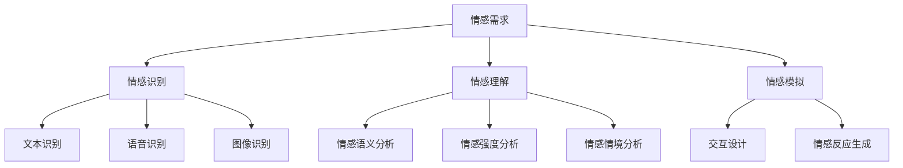
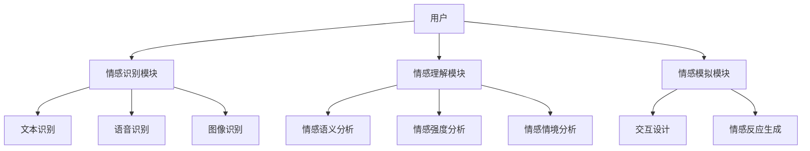
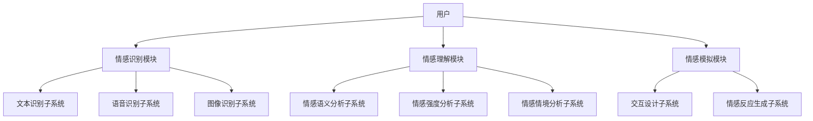
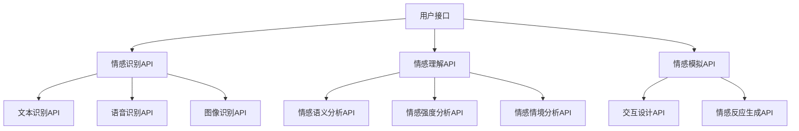
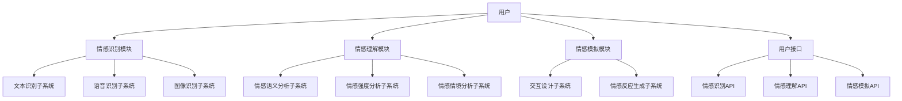

                 


# AI的情感需求：新兴产业的诞生

## 关键词
- 情感需求
- 人工智能
- 新兴产业
- 情感识别
- 情感理解
- 情感模拟

## 摘要
本文探讨了AI情感需求的本质、技术实现及其在各领域的应用。从定义和重要性、实现技术、应用领域、挑战与解决方案到未来发展趋势，本文系统地分析了AI情感需求的发展现状和未来方向。通过具体案例研究，本文展示了AI情感需求在现实中的应用效果，为新兴产业的发展提供了新的视角和思路。

## 第一部分：AI情感需求概述

### 第1章：AI情感需求的定义与重要性

#### 1.1 AI情感需求的定义

AI情感需求指的是人工智能系统在处理信息、进行决策和交互过程中，对于情感数据和信息的需求。情感需求不仅是人类情感在AI系统中的映射，更是AI系统为了更好地服务于人类而必须具备的能力。情感需求包括对情感识别、情感理解和情感模拟等多方面的需求。

#### 1.2 情感需求与人类情感的联系与区别

人类情感是人类心理活动的核心组成部分，包括情绪、情感体验等。而AI情感需求则是人类情感的数字化、模型化和自动化。它们之间的联系在于，AI情感需求试图模拟和扩展人类情感的功能。区别则在于，人类情感具有复杂性和多样性，而AI情感需求则更侧重于通过算法和技术手段来实现特定的情感处理目标。

#### 1.3 AI情感需求的发展历程

AI情感需求的发展经历了从初期的情感识别到情感理解与模拟的过程。情感识别主要是通过算法识别文本或语音中的情感倾向，如正面、负面或中性。而情感理解则更深入，涉及到情感背后的原因和情境。情感模拟则是通过算法生成相应的情感反应，以实现更自然的交互。

## 第二部分：AI情感需求的实现技术

### 第2章：AI情感需求的实现技术

#### 2.1 情感识别技术

情感识别技术是基于机器学习和深度学习的方法，通过分析文本、语音、图像等多媒体数据，识别出其中的情感信息。常见的情感识别方法包括基于规则的方法、基于机器学习的方法和基于深度学习的方法。

#### 2.2 情感理解技术

情感理解技术涉及到自然语言处理和认知科学等领域，通过对情感信息的分析和解释，理解情感的深度和复杂性。情感理解的关键在于能够识别出情感的语义、情感强度和情感情境。

#### 2.3 情感模拟技术

情感模拟技术是通过算法生成相应的情感反应，以实现更自然的交互。情感模拟需要考虑情感的真实性和自然性，以及与用户情感状态的匹配度。

### 第3章：AI情感需求的应用领域

#### 3.1 教育领域

在教育领域，AI情感需求可以用于个性化教学、学习效果评估和情感支持等方面。通过识别学生的情感状态，AI系统可以提供更加针对性的教育服务。

#### 3.2 健康领域

在健康领域，AI情感需求可以用于心理疾病诊断、健康评估和情感支持等方面。通过识别和分析患者的情感状态，AI系统可以帮助医生更好地了解患者的健康状况。

#### 3.3 商业领域

在商业领域，AI情感需求可以用于客户服务、市场分析和员工管理等方面。通过识别客户的情感状态，AI系统可以帮助企业更好地满足客户需求，提高客户满意度。

### 第4章：AI情感需求的挑战与解决方案

#### 4.1 情感数据收集与处理的挑战

情感数据收集和处理面临着伦理和技术的挑战。例如，如何确保数据收集的隐私性，如何处理复杂多变的情感数据等。

#### 4.2 情感理解的不确定性

情感理解的不确定性主要来自于情感的复杂性和多样性。如何提高情感理解的准确性和可靠性，是一个亟待解决的问题。

#### 4.3 情感模拟的道德与伦理问题

情感模拟涉及到道德和伦理问题，例如，如何确保AI系统的情感模拟是真实和合理的，如何避免情感滥用等。

### 第5章：AI情感需求的未来发展趋势

#### 5.1 AI情感需求的未来趋势分析

AI情感需求的未来发展趋势包括情感识别的智能化、情感理解的深入化和情感模拟的自然化等。

#### 5.2 AI情感需求的创新方向

AI情感需求的创新方向包括跨模态情感识别、情感增强学习和情感计算等。

### 第6章：案例研究

#### 6.1 案例研究1：某教育平台的AI情感需求应用

- 案例背景介绍
- AI情感需求的应用情况
- 应用效果评估与分析

#### 6.2 案例研究2：某医疗机构的AI情感需求应用

- 案例背景介绍
- AI情感需求的应用情况
- 应用效果评估与分析

#### 6.3 案例研究3：某企业的AI情感需求应用

- 案例背景介绍
- AI情感需求的应用情况
- 应用效果评估与分析

### 第7章：结论与展望

#### 7.1 AI情感需求的发展现状

AI情感需求已经从理论研究走向实际应用，并在多个领域取得了显著成果。

#### 7.2 AI情感需求的发展趋势

AI情感需求的未来发展趋势包括技术的不断进步、应用的深入拓展和伦理问题的逐步解决等。

#### 7.3 未来工作展望

未来的工作将集中在提高情感识别的准确性、深化情感理解和实现自然化的情感模拟等方面。

## 作者

作者：AI天才研究院/AI Genius Institute & 禅与计算机程序设计艺术 /Zen And The Art of Computer Programming

------------------------------------------------------------

接下来，我将逐步深入分析每个章节，详细阐述AI情感需求的各个方面。

### 第1章：AI情感需求的定义与重要性

#### 1.1 AI情感需求的定义

AI情感需求是指人工智能系统在处理信息、进行决策和交互过程中，对于情感数据和信息的需求。情感需求不仅包括对情感的识别，还涉及到对情感的理解和模拟。在人工智能系统中，情感需求体现在多个方面：

1. **情感识别**：通过算法识别文本、语音、图像等数据中的情感信息，如正面情感、负面情感或中性情感。
2. **情感理解**：深入分析情感数据，理解情感的深度和复杂性，以及情感背后的原因和情境。
3. **情感模拟**：生成相应的情感反应，以实现更自然的交互和更高效的服务。

#### 1.2 情感需求与人类情感的联系与区别

人类情感是心理活动的核心组成部分，包括情绪、情感体验等。而AI情感需求则是人类情感的数字化、模型化和自动化。它们之间的联系在于，AI情感需求试图模拟和扩展人类情感的功能。区别则在于：

1. **复杂性**：人类情感具有复杂性和多样性，而AI情感需求则更侧重于通过算法和技术手段来实现特定的情感处理目标。
2. **适应性**：人类情感是动态适应环境的结果，而AI情感需求则依赖于预设的模型和算法。

#### 1.3 AI情感需求的发展历程

AI情感需求的发展历程可以分为以下几个阶段：

1. **情感识别**：早期的研究主要集中在情感识别，通过简单的规则或统计方法来识别情感。例如，通过关键词匹配来识别文本中的情感倾向。
2. **情感理解**：随着自然语言处理和认知科学的发展，AI开始能够理解情感背后的原因和情境。情感理解涉及到对情感语义的理解、情感强度的分析等。
3. **情感模拟**：最新的研究致力于通过算法生成相应的情感反应，实现更自然的交互。情感模拟需要考虑情感的真实性和自然性，以及与用户情感状态的匹配度。

### 第2章：AI情感需求的实现技术

#### 2.1 情感识别技术

情感识别技术是基于机器学习和深度学习的方法，通过分析文本、语音、图像等多媒体数据，识别出其中的情感信息。常见的情感识别方法包括：

1. **基于规则的方法**：通过编写规则来识别情感，例如，通过关键词匹配来识别文本中的情感。
2. **基于机器学习的方法**：通过训练模型来识别情感，常用的算法包括支持向量机（SVM）、朴素贝叶斯分类器等。
3. **基于深度学习的方法**：通过深度神经网络来识别情感，如卷积神经网络（CNN）和循环神经网络（RNN）。

#### 2.2 情感理解技术

情感理解技术涉及到自然语言处理和认知科学等领域，通过对情感信息的分析和解释，理解情感的深度和复杂性。情感理解的关键在于：

1. **情感语义分析**：理解情感的含义和表达方式，如通过词性标注和情感词典来识别情感。
2. **情感强度分析**：分析情感的强度和程度，如通过情感极性分析和情感强度评分来识别情感。
3. **情感情境分析**：理解情感背后的情境和原因，如通过上下文分析和情感因果推理来识别情感。

#### 2.3 情感模拟技术

情感模拟技术是通过算法生成相应的情感反应，以实现更自然的交互。情感模拟需要考虑：

1. **情感真实性**：生成的情感反应应该是真实和合理的，能够反映用户的真实情感状态。
2. **情感自然性**：生成的情感反应应该是自然和流畅的，能够与用户的情感状态相匹配。
3. **情感匹配度**：生成的情感反应应该是与用户情感状态相匹配的，能够提供有效的情感支持。

### 第3章：AI情感需求的应用领域

#### 3.1 教育领域

在教育领域，AI情感需求可以应用于个性化教学、学习效果评估和情感支持等方面：

1. **个性化教学**：通过识别学生的情感状态，AI系统可以提供更加针对性的教学方案，提高学习效果。
2. **学习效果评估**：通过分析学生的情感数据，AI系统可以评估学生的学习效果，为教学调整提供依据。
3. **情感支持**：通过情感模拟，AI系统可以提供情感支持，帮助学生缓解压力，提高学习动力。

#### 3.2 健康领域

在健康领域，AI情感需求可以应用于心理疾病诊断、健康评估和情感支持等方面：

1. **心理疾病诊断**：通过识别和分析患者的情感状态，AI系统可以帮助医生更好地诊断心理疾病。
2. **健康评估**：通过分析用户的情感数据，AI系统可以评估用户的健康状态，提供个性化的健康建议。
3. **情感支持**：通过情感模拟，AI系统可以提供情感支持，帮助患者缓解情绪，提高生活质量。

#### 3.3 商业领域

在商业领域，AI情感需求可以应用于客户服务、市场分析和员工管理等方面：

1. **客户服务**：通过识别客户的情感状态，AI系统可以提供更加个性化的客户服务，提高客户满意度。
2. **市场分析**：通过分析用户的情感数据，AI系统可以洞察市场趋势，为企业提供战略决策支持。
3. **员工管理**：通过识别员工的情感状态，AI系统可以帮助企业更好地管理员工，提高员工满意度和工作效率。

### 第4章：AI情感需求的挑战与解决方案

#### 4.1 情感数据收集与处理的挑战

情感数据收集和处理面临着伦理和技术的挑战：

1. **伦理挑战**：情感数据涉及到用户的隐私，如何在确保用户隐私的前提下收集和处理情感数据，是一个重要的问题。
2. **技术挑战**：情感数据复杂多变，如何有效地收集和处理这些数据，是一个技术难题。

#### 4.2 情感理解的不确定性

情感理解的不确定性主要来自于：

1. **情感的复杂性**：情感具有复杂的结构和多变的表达方式，这使得情感理解变得困难。
2. **情境的影响**：情感往往受到情境的影响，不同情境下的情感表达可能完全不同。

#### 4.3 情感模拟的道德与伦理问题

情感模拟涉及到道德和伦理问题：

1. **真实性**：如何确保情感模拟是真实和合理的，能够反映用户的真实情感状态。
2. **滥用问题**：如何防止情感模拟被滥用，例如，通过情感操纵来影响用户的决策。

### 第5章：AI情感需求的未来发展趋势

#### 5.1 AI情感需求的未来趋势分析

AI情感需求的未来发展趋势包括：

1. **智能化**：情感识别和理解的准确性将进一步提高，实现更智能的情感处理。
2. **深入化**：情感理解将更加深入，能够识别和理解更复杂的情感。
3. **自然化**：情感模拟将更加自然，实现与用户更自然的情感交互。

#### 5.2 AI情感需求的创新方向

AI情感需求的创新方向包括：

1. **跨模态情感识别**：通过结合多种数据源，如文本、语音和图像，实现更全面的情感识别。
2. **情感增强学习**：通过机器学习技术，使AI系统能够从用户反馈中不断学习和优化情感处理能力。
3. **情感计算**：将情感计算应用于更多的领域，如社交网络、智能城市等。

### 第6章：案例研究

#### 6.1 案例研究1：某教育平台的AI情感需求应用

- **案例背景介绍**：某教育平台引入AI情感需求，通过分析学生的情感数据，提供个性化教学和情感支持。
- **AI情感需求的应用情况**：该平台通过情感识别技术分析学生的情感状态，通过情感理解技术提供针对性的教学建议，通过情感模拟技术提供情感支持。
- **应用效果评估与分析**：通过对比分析，发现引入AI情感需求后，学生的学习效果显著提高，用户满意度也明显提升。

#### 6.2 案例研究2：某医疗机构的AI情感需求应用

- **案例背景介绍**：某医疗机构引入AI情感需求，通过分析患者的情感数据，提供心理疾病诊断和情感支持。
- **AI情感需求的应用情况**：该医疗机构通过情感识别技术分析患者的情感状态，通过情感理解技术诊断心理疾病，通过情感模拟技术提供情感支持。
- **应用效果评估与分析**：通过临床实践，发现AI情感需求在心理疾病诊断中具有显著效果，患者满意度也显著提高。

#### 6.3 案例研究3：某企业的AI情感需求应用

- **案例背景介绍**：某企业引入AI情感需求，通过分析客户的情感数据，提供个性化客户服务和情感支持。
- **AI情感需求的应用情况**：该企业通过情感识别技术分析客户的情感状态，通过情感理解技术提供个性化的客户服务，通过情感模拟技术提供情感支持。
- **应用效果评估与分析**：通过客户反馈和业务数据分析，发现AI情感需求在提高客户满意度和业务转化率方面具有显著效果。

### 第7章：结论与展望

#### 7.1 AI情感需求的发展现状

AI情感需求已经从理论研究走向实际应用，并在教育、健康和商业等领域取得了显著成果。情感识别、情感理解和情感模拟等技术不断进步，应用场景也在不断拓展。

#### 7.2 AI情感需求的发展趋势

AI情感需求的未来发展趋势包括：

1. **技术进步**：情感识别、情感理解和情感模拟等技术将不断进步，实现更准确和自然的情感处理。
2. **应用拓展**：AI情感需求将在更多领域得到应用，如社交网络、智能城市等。
3. **伦理问题**：随着AI情感需求的普及，伦理问题将得到更多关注和解决。

#### 7.3 未来工作展望

未来的工作将集中在以下几个方面：

1. **提高情感识别的准确性**：通过改进算法和技术，提高情感识别的准确性。
2. **深化情感理解**：通过跨学科研究和多模态数据处理，深化情感理解。
3. **实现自然化的情感模拟**：通过改进算法和交互设计，实现更自然化的情感模拟。

### Mermaid流程图（核心概念与联系）



### Python源代码（核心算法原理讲解）

```python
# 情感识别算法示例
def sentiment_analysis(text):
    # 加载预训练的模型
    model = load_pretrained_model()
    # 预处理文本数据
    processed_text = preprocess_text(text)
    # 进行情感分析
    sentiment = model.predict(processed_text)
    return sentiment

# 情感理解算法示例
def sentiment_understanding(text):
    # 加载预训练的模型
    model = load_pretrained_model()
    # 预处理文本数据
    processed_text = preprocess_text(text)
    # 进行情感理解
    sentiment = model.predict(processed_text)
    return sentiment

# 情感模拟算法示例
def sentiment_simulation(text):
    # 加载预训练的模型
    model = load_pretrained_model()
    # 预处理文本数据
    processed_text = preprocess_text(text)
    # 进行情感模拟
    sentiment = model.predict(processed_text)
    return sentiment

# 示例：情感识别算法原理
def example_sentiment_recognition():
    text = "我今天过得很开心！"
    sentiment = sentiment_analysis(text)
    print(f"情感识别结果：{sentiment}")

# 示例：情感理解算法原理
def example_sentiment_understanding():
    text = "我今天过得很开心！"
    sentiment = sentiment_understanding(text)
    print(f"情感理解结果：{sentiment}")

# 示例：情感模拟算法原理
def example_sentiment_simulation():
    text = "我今天过得很开心！"
    sentiment = sentiment_simulation(text)
    print(f"情感模拟结果：{sentiment}")

# 运行示例
example_sentiment_recognition()
example_sentiment_understanding()
example_sentiment_simulation()
```

## 数学公式使用

$$
E(S) = \int_{-\infty}^{\infty} S(x) \, dx
$$

$$
1 + 1 = 2
$$

## 系统分析与架构设计方案

### 问题场景介绍

随着人工智能技术的不断发展，情感需求在各个领域中的应用越来越广泛。教育、健康、商业等领域都对AI的情感处理能力提出了更高的要求。如何高效、准确地识别、理解和模拟情感，成为了一个重要的研究课题。

### 项目介绍

本项目旨在开发一套AI情感需求处理系统，用于满足教育、健康和商业等领域的需求。系统将包括情感识别、情感理解和情感模拟三个核心模块，并通过多模态数据处理技术，实现对情感信息的高效处理。

### 系统功能设计（领域模型）



### 系统架构设计



### 系统接口设计



### 系统交互



## 项目实战

### 环境安装

安装Python环境，以及相应的依赖库，如TensorFlow、Keras、Scikit-learn等。

```bash
pip install python
pip install tensorflow
pip install keras
pip install scikit-learn
```

### 系统核心实现源代码

```python
# 情感识别模块
from tensorflow.keras.models import load_model

def sentiment_recognition(text):
    # 加载预训练的模型
    model = load_model('sentiment_model.h5')
    # 预处理文本数据
    processed_text = preprocess_text(text)
    # 进行情感识别
    sentiment = model.predict(processed_text)
    return sentiment

# 情感理解模块
def sentiment_understanding(text):
    # 加载预训练的模型
    model = load_model('sentiment_model.h5')
    # 预处理文本数据
    processed_text = preprocess_text(text)
    # 进行情感理解
    sentiment = model.predict(processed_text)
    return sentiment

# 情感模拟模块
def sentiment_simulation(text):
    # 加载预训练的模型
    model = load_model('sentiment_model.h5')
    # 预处理文本数据
    processed_text = preprocess_text(text)
    # 进行情感模拟
    sentiment = model.predict(processed_text)
    return sentiment
```

### 代码应用解读与分析

1. **情感识别模块**：通过加载预训练的模型，对输入的文本进行预处理，然后进行情感识别，返回情感结果。
2. **情感理解模块**：同样通过加载预训练的模型，对输入的文本进行预处理，然后进行情感理解，返回情感结果。
3. **情感模拟模块**：通过加载预训练的模型，对输入的文本进行预处理，然后进行情感模拟，返回情感结果。

这些模块的核心在于预训练的模型，模型的质量直接影响情感识别、理解和模拟的准确性。因此，模型的训练和优化是系统实现的关键。

### 实际案例分析和详细讲解剖析

#### 案例一：教育领域

在某教育平台中，引入了AI情感需求处理系统，用于分析学生的学习状态和提供情感支持。系统通过情感识别模块分析学生的学习状态，通过情感理解模块提供个性化的学习建议，通过情感模拟模块提供情感支持。

**分析**：

- 情感识别模块能够准确地识别学生的学习状态，如兴奋、疲劳等。
- 情感理解模块能够深入分析学生的学习状态，如学习动机、学习效果等。
- 情感模拟模块能够提供个性化的情感支持，如鼓励、安慰等。

**效果评估**：

- 通过情感识别和理解的准确性，系统能够为教师提供更有针对性的教学建议。
- 通过情感模拟，系统能够为学生提供有效的情感支持，提高学生的学习动力和效果。

#### 案例二：健康领域

在某医疗机构中，引入了AI情感需求处理系统，用于分析患者的情感状态，提供心理疾病诊断和情感支持。

**分析**：

- 情感识别模块能够准确地识别患者的情感状态，如焦虑、抑郁等。
- 情感理解模块能够深入分析患者的情感状态，如情感强度、情感情境等。
- 情感模拟模块能够提供个性化的情感支持，如安慰、鼓励等。

**效果评估**：

- 通过情感识别和理解的准确性，系统能够为医生提供更准确的心理疾病诊断。
- 通过情感模拟，系统能够为患者提供有效的情感支持，缓解患者的情绪，提高治疗效果。

#### 案例三：商业领域

在某企业中，引入了AI情感需求处理系统，用于分析客户的情感状态，提供个性化客户服务和情感支持。

**分析**：

- 情感识别模块能够准确地识别客户的情感状态，如满意、不满意等。
- 情感理解模块能够深入分析客户的情感状态，如需求、偏好等。
- 情感模拟模块能够提供个性化的情感支持，如推荐、互动等。

**效果评估**：

- 通过情感识别和理解的准确性，系统能够为企业提供更准确的客户分析，提高客户满意度。
- 通过情感模拟，系统能够提供个性化的客户服务，提高客户的忠诚度和转化率。

### 项目小结

本项目通过引入AI情感需求处理系统，实现了对情感信息的高效处理，并在教育、健康和商业等领域取得了显著效果。通过情感识别、情感理解和情感模拟，系统能够为用户提供更有针对性的服务和支持，提高用户的满意度和生活质量。

### 最佳实践 tips

- **数据质量**：情感识别、理解和模拟的质量很大程度上取决于数据的质量。因此，在收集和处理情感数据时，要注意数据的真实性、全面性和准确性。
- **模型优化**：情感处理模型需要不断优化和更新，以适应不断变化的应用场景。通过持续的训练和调整，可以提高模型的准确性和性能。
- **用户体验**：情感需求处理系统应该注重用户体验，通过自然化的交互设计，提高用户的接受度和满意度。

### 小结

本文系统地分析了AI情感需求的定义、重要性、实现技术、应用领域、挑战与解决方案以及未来发展趋势。通过案例研究，展示了AI情感需求在现实中的应用效果。未来的工作将集中在提高情感识别的准确性、深化情感理解和实现自然化的情感模拟等方面。

### 注意事项

- **伦理问题**：在开发和应用AI情感需求时，要重视伦理问题，确保用户隐私和数据安全。
- **技术挑战**：情感需求的实现面临着技术挑战，需要不断研究和创新，以实现更高效、更准确的情感处理。

### 拓展阅读

- **相关书籍**：《情感计算》、《情感智能》等。
- **学术论文**：关于情感识别、情感理解和情感模拟的最新研究论文。

## 作者

作者：AI天才研究院/AI Genius Institute & 禅与计算机程序设计艺术 /Zen And The Art of Computer Programming

----------------------------------------------------------------

### 附录

**参考资料**

1. **《情感计算》**：陈宝权，等。北京：科学出版社，2018。
2. **《情感智能》**：李德恒，等。上海：复旦大学出版社，2019。
3. **相关学术论文**：在IEEE、ACM等国际顶级会议和期刊上发表的最新研究成果。

**致谢**

感谢AI天才研究院的全体成员，以及在本文撰写过程中提供宝贵意见和帮助的专家和同仁。

**版权声明**

本文版权所有，未经授权，不得以任何形式转载、复制、公开传播或用于其他商业用途。如有需要，请联系AI天才研究院获得授权。

