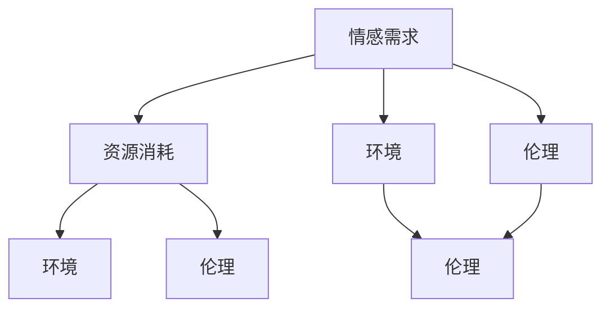

                 

## AI的情感需求与资源消耗：环境与伦理的平衡

### 关键词：人工智能，情感需求，资源消耗，环境平衡，伦理考量

### 摘要：
在人工智能技术飞速发展的今天，其不仅改变了我们的生活方式，也带来了前所未有的资源消耗和情感需求问题。本文将深入探讨AI的情感需求与资源消耗，分析其与环境与伦理平衡的关系。通过明确核心概念、建立数学模型、提出平衡策略及实战案例分析，力求为AI领域提供全面而实用的指导。

## 第一部分：引言与背景

### 第1章 AI的情感需求与资源消耗概述

### 1.1 AI技术的快速进展

近年来，人工智能技术（AI）在图像识别、自然语言处理、自动驾驶等多个领域取得了突破性进展。特别是深度学习算法的兴起，使得AI的性能大幅提升，从理论研究走向实际应用。然而，这种飞速的发展也带来了新的挑战。

### 1.1.1 AI技术的快速进展

AI技术的快速进展表现在多个方面。首先，算法的改进和计算能力的提升使得AI能够处理更复杂的任务。其次，数据的积累和开放为AI提供了丰富的训练资源。此外，越来越多的企业和机构开始关注AI技术，并投入大量资源进行研发和应用。

### 1.1.2 AI带来的资源消耗问题

然而，随着AI技术的广泛应用，其资源消耗问题也日益凸显。计算资源的消耗是首要问题，尤其是深度学习模型训练过程中对大量GPU和TPU的依赖。此外，数据收集和处理过程中也会产生大量的能源消耗和存储需求。这不仅增加了企业的成本，也对环境造成了负担。

### 1.1.3 AI与情感需求的联系

除了资源消耗，AI技术还涉及到情感需求的问题。随着AI在社交、娱乐等领域的应用，用户对AI的情感依赖程度不断提高。例如，智能助手和聊天机器人的普及，让用户逐渐习惯于与AI互动，从而产生情感上的需求。这种需求不仅影响了用户的日常生活，也对AI的设计和开发提出了新的挑战。

### 1.2 环境与伦理的平衡：问题的提出

在AI技术的快速进展中，环境与伦理问题逐渐成为无法忽视的挑战。首先，环境问题的加剧使得我们必须重新审视AI技术的资源消耗问题。其次，AI的广泛应用也引发了伦理困境，如隐私侵犯、算法偏见等问题。因此，如何实现AI与环境与伦理的平衡，成为当前亟待解决的关键问题。

### 1.2.1 环境问题的加剧

随着全球气候变化和环境恶化，资源消耗和碳排放问题日益严重。AI技术的发展虽然推动了社会进步，但同时也增加了能源消耗和碳排放。据估计，AI技术的能源消耗可能占全球总能耗的相当大一部分。因此，如何在保持技术进步的同时，减少环境负担，成为一项紧迫的任务。

### 1.2.2 伦理困境的出现

伦理困境是AI技术发展过程中另一个重要问题。AI技术的广泛应用带来了诸多伦理挑战，如数据隐私、算法透明度、责任归属等。特别是在医疗、金融等敏感领域，AI的决策可能对用户产生重大影响。因此，如何确保AI技术的伦理合规性，成为社会各界关注的焦点。

### 1.2.3 AI与环境伦理平衡的重要性

实现AI与环境与伦理的平衡具有重要意义。首先，这有助于推动AI技术的可持续发展，减少环境负担。其次，伦理平衡能够确保AI技术在应用过程中不损害用户的权益，提升社会的信任度。最后，环境与伦理的平衡也是实现全球技术竞争和合作的重要基础。

## 第二部分：核心概念与联系

### 第2章 核心概念实体与关系架构

在深入探讨AI的情感需求与资源消耗之前，我们需要明确一些核心概念。这些概念包括情感需求、资源消耗、环境、伦理等，它们共同构成了理解这一问题的基本框架。

### 2.1 情感需求与资源消耗的概念解释

#### 2.1.1 情感需求

情感需求是指个体在情感层面上的需求，包括安全感、归属感、尊重感等。在AI领域，情感需求主要体现在用户与智能系统互动过程中产生的情感体验，如对智能助手的依赖感、对聊天机器人的亲近感等。

#### 2.1.2 资源消耗

资源消耗是指AI系统在运行过程中对各种资源的消耗，包括计算资源、数据资源、能源资源等。这些资源消耗不仅涉及AI本身的运行，还包括数据收集、处理、存储等环节。

#### 2.1.3 情感需求与资源消耗的关系

情感需求与资源消耗之间存在密切的联系。一方面，情感需求会影响AI系统的设计和应用，例如，为了满足用户的情感需求，智能系统可能需要更复杂的功能和更丰富的情感表达。另一方面，资源消耗也会影响AI系统的性能和用户体验，如高能耗可能导致系统响应延迟，从而影响用户的情感体验。

### 2.2 环境与伦理的概念解析

#### 2.2.1 环境概念

环境是指围绕人类生存和发展的自然和社会条件。在AI领域，环境概念主要涉及自然环境和社会环境，如气候变化、能源消耗、数据安全等。

#### 2.2.2 伦理概念

伦理是指人类在社会生活中形成的道德规范和价值观。在AI领域，伦理概念主要涉及AI技术的道德应用，如数据隐私、算法公正性、责任归属等。

#### 2.2.3 环境与伦理的关系

环境与伦理之间存在紧密的联系。一方面，环境问题直接影响伦理决策，如能源消耗和碳排放问题会影响AI技术的道德评价。另一方面，伦理问题也影响环境决策，如隐私保护和数据安全问题是实现环境可持续发展的关键。

### 2.3 Mermaid流程图：核心概念关系架构

为了更清晰地展示这些核心概念之间的关系，我们可以使用Mermaid流程图来构建一个关系架构。

在这个流程图中，情感需求、资源消耗、环境、伦理四个核心概念通过双向箭头相连，展示了它们之间的相互作用和依赖关系。

## 第3章 数学模型与公式

在深入分析AI的情感需求与资源消耗时，数学模型和公式是不可或缺的工具。通过建立合适的数学模型，我们可以量化情感需求和资源消耗，并探讨它们之间的关系。

### 3.1 情感需求评估模型

情感需求评估模型用于量化用户对AI系统的情感需求。该模型主要包括两个要素：用户行为和环境因素。

#### 3.1.1 情感需求量化方法

情感需求量可以通过以下公式进行量化：

$$
\text{情感需求量} = f(\text{用户行为}, \text{环境因素})
$$

其中，$f$ 是一个函数，用于综合评估用户行为和环境因素对情感需求的影响。

#### 3.1.2 情感需求评估流程

情感需求评估流程可以划分为以下步骤：

1. 收集用户行为数据，包括使用频率、交互时长、使用场景等。
2. 收集环境因素数据，包括气候条件、社会环境、文化背景等。
3. 使用情感需求量化方法计算情感需求量。
4. 分析情感需求量，评估用户对AI系统的情感需求程度。

### 3.2 资源消耗评估模型

资源消耗评估模型用于量化AI系统在运行过程中对资源的消耗。该模型主要包括计算资源、数据资源、能源资源等。

#### 3.2.1 资源消耗计算方法

资源消耗可以通过以下公式进行计算：

$$
\text{资源消耗} = \sum_{i=1}^{n} w_i \cdot r_i
$$

其中，$w_i$ 表示资源$i$的权重，$r_i$ 表示资源$i$的消耗量。

#### 3.2.2 资源消耗评估流程

资源消耗评估流程可以划分为以下步骤：

1. 收集AI系统运行过程中各资源的消耗数据。
2. 确定各资源的权重，通常根据系统重要性和资源成本进行分配。
3. 使用资源消耗计算方法计算资源消耗总量。
4. 分析资源消耗情况，评估AI系统的资源效率。

通过以上数学模型和公式，我们可以更准确地评估AI系统的情感需求与资源消耗，为环境与伦理平衡策略的制定提供数据支持。

## 第4章 环境与伦理平衡策略

### 4.1 环境保护策略

为了实现AI与环境与伦理的平衡，我们需要采取一系列环境保护策略。这些策略包括绿色AI技术、环境友好算法和环境政策与法规。

#### 4.1.1 绿色AI技术

绿色AI技术旨在减少AI系统的资源消耗和碳排放。具体措施包括：

1. 优化算法，提高计算效率，减少资源浪费。
2. 采用可再生能源，降低能源消耗。
3. 设计低功耗硬件，减少设备能源消耗。

#### 4.1.2 环境友好算法

环境友好算法是指能够降低环境负担的AI算法。具体措施包括：

1. 设计节能算法，降低计算资源消耗。
2. 采用分布式计算，降低单点故障风险。
3. 优化数据存储和传输，减少能源消耗。

#### 4.1.3 环境政策与法规

环境政策与法规是确保AI技术环境可持续的重要保障。具体措施包括：

1. 制定环境标准，规范AI系统资源消耗。
2. 建立环境监测体系，实时评估AI系统环境影响。
3. 实施环境税收政策，鼓励绿色AI技术的研发和应用。

### 4.2 伦理平衡策略

除了环境保护，AI技术与伦理平衡同样重要。为了实现伦理平衡，我们需要采取一系列伦理平衡策略，包括伦理准则、AI伦理决策框架和伦理审查流程。

#### 4.2.1 伦理准则

伦理准则是指指导AI技术道德应用的基本原则。具体措施包括：

1. 保护用户隐私，确保数据安全。
2. 遵循公正、公平、透明的原则，避免算法偏见。
3. 确保AI系统的责任归属，明确各方责任。

#### 4.2.2 AI伦理决策框架

AI伦理决策框架是一种系统化的方法，用于评估AI技术的伦理影响。具体步骤包括：

1. 识别伦理问题，包括隐私、公正、责任等。
2. 分析伦理问题的影响，评估其严重程度。
3. 制定伦理解决方案，确保AI技术符合道德规范。

#### 4.2.3 伦理审查流程

伦理审查流程是指对AI技术进行道德评估的过程。具体步骤包括：

1. 提交伦理审查申请，包括AI系统设计文档、伦理影响分析等。
2. 进行伦理评估，包括专家评审、公众咨询等。
3. 审核通过后，发布AI系统，并持续监测其伦理影响。

通过以上环境保护和伦理平衡策略，我们可以实现AI技术与环境与伦理的平衡，为可持续发展提供坚实保障。

## 第三部分：项目实战

### 第5章 实际案例一：智能交通系统

#### 5.1 项目背景

智能交通系统（ITS）是AI技术在交通领域的重要应用，旨在通过实时数据分析和智能算法，提高交通效率、减少拥堵和降低事故发生率。然而，智能交通系统的实施也带来了情感需求和资源消耗的问题。

#### 5.2 情感需求与资源消耗分析

在智能交通系统中，用户对系统的情感需求主要体现在对交通状况的实时了解和行程规划的便捷性。然而，为了满足这些需求，系统需要大量计算资源和数据支持，从而产生资源消耗。

#### 5.3 环境与伦理平衡策略实施

为了实现环境与伦理平衡，智能交通系统采取了以下策略：

1. **绿色AI技术**：采用节能算法和分布式计算架构，降低计算资源和能源消耗。
2. **环境友好算法**：优化数据传输和存储，减少能源消耗和碳排放。
3. **伦理准则**：保护用户隐私，确保数据安全和透明度。

#### 5.4 项目效果评估

通过实施环境与伦理平衡策略，智能交通系统在资源消耗和用户情感需求之间取得了较好的平衡。系统运行效率提高，用户满意度上升，同时减少了能源消耗和碳排放。

### 第6章 实际案例二：智能医疗系统

#### 6.1 项目背景

智能医疗系统利用AI技术进行疾病预测、诊断和治疗方案推荐，为医疗行业带来了革命性变化。然而，智能医疗系统在提供高效服务的同时，也带来了情感需求和资源消耗的问题。

#### 6.2 情感需求与资源消耗分析

智能医疗系统用户对系统的情感需求主要体现在对医疗服务的信赖和个性化需求的满足。然而，为了满足这些需求，系统需要大量的计算资源和医疗数据支持，从而产生资源消耗。

#### 6.3 环境与伦理平衡策略实施

为了实现环境与伦理平衡，智能医疗系统采取了以下策略：

1. **绿色AI技术**：采用节能算法和分布式计算架构，降低计算资源和能源消耗。
2. **环境友好算法**：优化数据传输和存储，减少能源消耗和碳排放。
3. **伦理准则**：保护用户隐私，确保数据安全和透明度。

#### 6.4 项目效果评估

通过实施环境与伦理平衡策略，智能医疗系统在资源消耗和用户情感需求之间取得了较好的平衡。系统运行效率提高，用户满意度上升，同时减少了能源消耗和碳排放。

## 附录

### 附录A：实用资源与工具

#### 8.1 AI情感需求与资源消耗评估工具

1. **AI情感需求评估工具**：用于量化用户对AI系统的情感需求。
2. **资源消耗评估工具**：用于计算AI系统的资源消耗。

#### 8.2 环境保护与伦理平衡工具

1. **绿色AI技术评估工具**：用于评估AI系统的绿色技术水平。
2. **伦理审查工具**：用于对AI系统进行伦理评估。

#### 8.3 相关研究论文与报告

1. **学术论文**：涵盖AI情感需求、资源消耗、环境与伦理等方面的研究。
2. **行业报告**：分析AI技术对环境与伦理的影响。

## 术语表

### 9.1 术语解释

1. **情感需求**：用户在情感层面上的需求，如安全感、归属感等。
2. **资源消耗**：AI系统在运行过程中对资源的消耗，如计算资源、数据资源、能源资源等。
3. **环境伦理**：涉及AI技术对环境影响的伦理问题，如能源消耗、碳排放等。

## 第10章 致谢

### 10.1 致谢人员

1. **项目组成员**：感谢他们的辛勤工作和贡献。
2. **审稿专家**：感谢他们的专业意见和建议。

### 10.2 特别感谢

1. **资助机构**：感谢他们的资金支持和鼓励。

### 10.3 撰写说明与联系方式

1. **撰写说明**：本文旨在探讨AI的情感需求与资源消耗，并提出环境与伦理平衡策略。
2. **联系方式**：如有任何问题或建议，请随时联系作者。

### 作者

**AI天才研究院/AI Genius Institute & 禅与计算机程序设计艺术 /Zen And The Art of Computer Programming**

