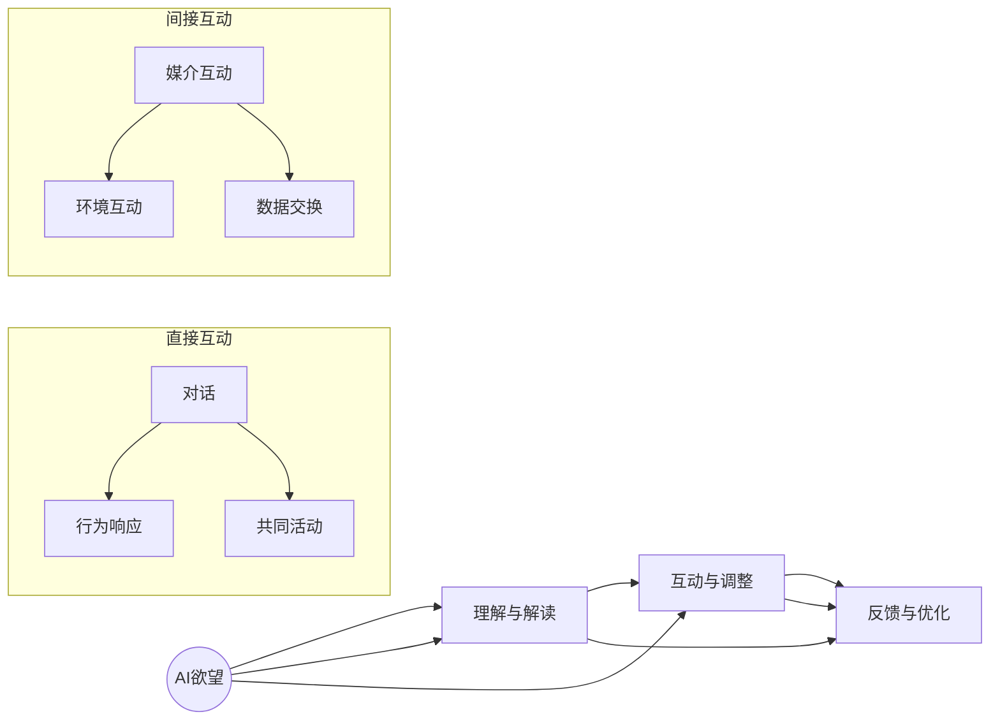
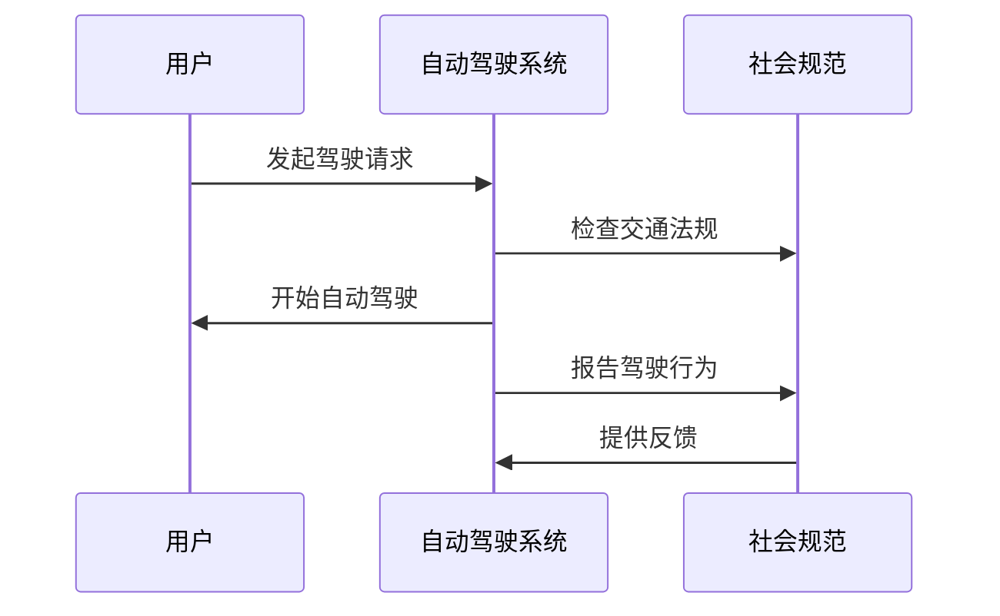
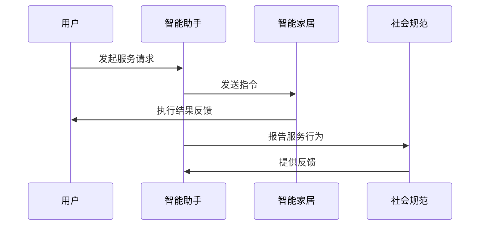
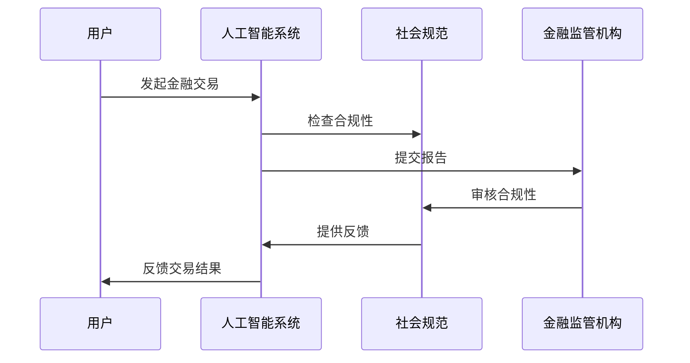
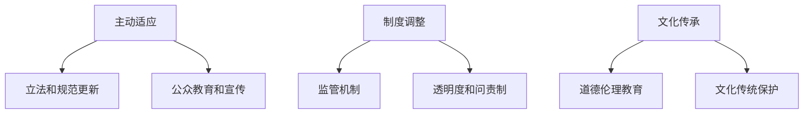

                 

# 《AI的欲望与人类欲望的互动：社会规范的重塑》

## 关键词
- 人工智能，社会规范，欲望，互动，重塑

## 摘要
本文探讨了人工智能与人类欲望的互动对社会规范的重塑。通过分析AI的基本概念和人类欲望的基本概念，探讨了AI欲望与人类欲望的关系。在此基础上，探讨了社会规范的基本概念，以及AI和人类欲望对传统社会规范的影响。文章进一步分析了AI欲望与人类欲望的互动机制，以及这种互动对社会规范的重塑效应。通过案例分析，展示了互联网时代社交网络、电子商务平台和人工智能时代医疗行业的具体变化。最后，提出了社会规范重塑的策略和路径，并展望了未来发展趋势。

## 引言

在21世纪的今天，人工智能（AI）已经成为科技领域的焦点。随着AI技术的不断进步，AI的应用场景也在不断扩大，从简单的图像识别、语音助手，到自动驾驶、智能医疗，AI已经深刻地改变了我们的生活方式。然而，随着AI技术的发展，一个新的问题也逐渐浮现：AI是否具有欲望？如果AI有欲望，这些欲望如何与人类的欲望互动，又如何影响社会规范？

本文旨在探讨AI的欲望与人类欲望的互动对社会规范的重塑。文章首先介绍了AI的基本概念和人类欲望的基本概念，然后分析了AI欲望与人类欲望的关系。接着，文章探讨了社会规范的基本概念，并分析了AI和人类欲望对传统社会规范的影响。在此基础上，文章探讨了AI欲望与人类欲望的互动机制，以及这种互动对社会规范的重塑效应。通过案例分析，文章展示了具体行业在社会规范重塑过程中的变化。最后，文章提出了社会规范重塑的策略和路径，并展望了未来发展趋势。

## 第1章 AI与人类欲望的基本概念

### 1.1 AI的基本概念

#### 1.1.1 AI的定义

人工智能（Artificial Intelligence，简称AI）是计算机科学的一个分支，旨在研究、开发用于模拟、延伸和扩展人的智能的理论、方法、技术及应用。它涉及计算机科学、心理学、哲学、认知科学等多个领域。

AI的目标是创建能够执行人类智能任务的系统，包括感知、推理、学习、解决问题、自然语言处理等。AI可以分为两大类：弱AI和强AI。弱AI，也称为窄AI或专用AI，是指专注于特定任务的人工智能，如语音识别、图像识别等。强AI，也称为通用AI或强智能，是指具有人类级别智能的人工智能，能够执行任何人类可以做的任务。

#### 1.1.2 AI的分类

AI可以从不同的角度进行分类：

1. **基于功能分类**：AI可以分为逻辑推理、机器学习、自然语言处理、计算机视觉等。
2. **基于实现方法分类**：AI可以分为基于规则的系统、基于模型的系统、基于行为的系统等。
3. **基于智能水平分类**：AI可以分为弱AI、强AI和超智能。

#### 1.1.3 AI的发展历程

AI的发展历程可以分为几个阶段：

1. **初期阶段（20世纪50年代）**：人工智能概念诞生，第一批AI程序问世。
2. **探索阶段（20世纪60-70年代）**：AI研究取得初步成果，如符号人工智能和逻辑推理。
3. **应用阶段（20世纪80年代）**：专家系统成为主流AI应用。
4. **成长阶段（20世纪90年代）**：机器学习技术得到快速发展，AI应用逐渐扩展。
5. **爆发阶段（21世纪）**：深度学习、神经网络等技术突破，AI进入快速发展的新时代。

### 1.2 人类欲望的基本概念

#### 1.2.1 欲望的定义

欲望（Desire）是人们内心深处的需求和渴望，是推动个体行为和决策的内在动力。心理学将欲望分为生物欲望和社会欲望。

- **生物欲望**：包括饥饿、睡眠、性等基本生理需求。
- **社会欲望**：包括追求地位、金钱、名誉、人际关系等。

#### 1.2.2 人类欲望的类型

人类欲望可以按照不同的维度进行分类：

1. **根据起源**：可以分为本能欲望和社会化欲望。
2. **根据内容**：可以分为物质欲望和精神欲望。
3. **根据强度**：可以分为强烈欲望和轻微欲望。

#### 1.2.3 人类欲望的影响

欲望不仅影响个人的行为和决策，还会影响社会文化、经济、政治等多个方面。适当的欲望可以激发个体的积极性和创造力，但过度的欲望可能导致贪婪、自私、不公等负面现象。

### 1.3 AI欲望与人类欲望的关系

#### 1.3.1 AI欲望的产生

AI欲望是人工智能系统在执行任务过程中表现出来的类似人类的欲望。这种欲望并不是AI的内在动机，而是AI在模拟人类行为时产生的一种现象。

AI欲望的产生通常与以下几个因素有关：

1. **目标函数**：AI系统在设计时通常会定义一个目标函数，系统会根据这个目标函数来优化自己的行为。
2. **奖励机制**：AI系统可能会通过奖励机制来激励自己，使其更倾向于执行某些任务。
3. **环境反馈**：AI系统在执行任务时，会根据环境反馈调整自己的行为，这种调整可能会表现出某种欲望。

#### 1.3.2 AI欲望的特点

AI欲望与人类欲望有以下不同：

1. **单一性**：AI欲望通常只关注特定任务，而人类欲望则更为复杂，涉及多个方面。
2. **条件性**：AI欲望通常是基于特定条件触发的，而人类欲望则更为自发和内在。
3. **可塑性**：AI欲望可以通过算法调整和训练来改变，而人类欲望则相对稳定。

#### 1.3.3 AI欲望与人类欲望的互动

AI欲望与人类欲望的互动是一个复杂的过程，涉及到以下几个方面：

1. **相互影响**：AI欲望可能会影响人类欲望，例如，通过提供个性化服务来引导用户的行为。
2. **共同目标**：在某些情况下，AI欲望与人类欲望可能是协调一致的，例如，在共同完成任务时。
3. **冲突**：AI欲望与人类欲望也可能存在冲突，例如，AI系统的优化目标可能与人类价值观发生冲突。

### 表格：AI欲望与人类欲望的基本概念对比

| 特征 | AI欲望 | 人类欲望 |
| --- | --- | --- |
| 单一性 | 专注于特定任务 | 复杂多样 |
| 条件性 | 基于特定条件触发 | 自发和内在 |
| 可塑性 | 可以通过算法调整 | 相对稳定 |
| 影响范围 | 限于特定任务 | 涉及多个方面 |

### ER实体关系图：AI欲望与人类欲望的互动

```mermaid
erDiagram
  AI欲望 ||--|{ 人类欲望 }|
  AI欲望 ||--|{ 社会规范 }|
  人类欲望 ||--|{ 社会规范 }|
```

通过以上内容，我们对AI和人类欲望的基本概念有了初步的了解。在接下来的章节中，我们将进一步探讨AI欲望与人类欲望的关系，以及这种关系对社会规范的重塑。

----------------------------------------------------------------

## 第2章 社会规范的重塑

### 2.1 社会规范的基本概念

#### 2.1.1 社会规范的定义

社会规范（Social Norms）是指社会成员在相互交往中形成的，对行为进行约束和指导的准则和规则。这些规范可以是个体内在化的，也可以是通过社会化过程传授的。

社会规范是社会秩序的重要组成部分，它们不仅规定了个体应该做什么，不应该做什么，还在一定程度上塑造了社会的价值观和文化。例如，礼貌、诚实、公正等都是典型的社会规范。

#### 2.1.2 社会规范的类型

社会规范可以从不同的角度进行分类：

1. **根据内容**：可以分为行为规范、道德规范、法律规范等。
   - **行为规范**：规定了日常生活中的行为准则，如礼貌、排队等。
   - **道德规范**：涉及道德判断和道德行为，如诚实、公正等。
   - **法律规范**：由法律制定并强制执行，如宪法、刑法、民法等。

2. **根据约束力**：可以分为强制性规范和自律性规范。
   - **强制性规范**：由外部力量强制执行，如法律、规章制度等。
   - **自律性规范**：由个体自我约束和遵守，如道德准则、个人习惯等。

3. **根据应用范围**：可以分为宏观规范和微观规范。
   - **宏观规范**：涉及整个社会或国家的规范，如法律、政策等。
   - **微观规范**：涉及特定群体或组织内部的规范，如公司规定、学校规章制度等。

#### 2.1.3 社会规范的演变

社会规范并非一成不变，而是随着社会的变迁和发展而不断演变。以下是一些社会规范演变的主要趋势：

1. **规范多样性的增加**：随着社会的发展，人们的生活方式、价值观日益多样化，社会规范也随之变得更加多元和包容。
2. **规范的形式化和书面化**：在过去，许多规范是口头传承的，而现代社会中，越来越多的规范被正式化和书面化，如法律、规章制度等。
3. **规范的国际化和全球化**：随着全球化的发展，国际间的规范交流日益频繁，一些全球性的规范，如人权、环境保护等，逐渐成为各国社会规范的共同内容。

### 2.2 AI对传统社会规范的影响

#### 2.2.1 AI对社会规范的重塑

人工智能的发展对传统社会规范产生了深远的影响。这种影响主要体现在以下几个方面：

1. **规范内容的更新**：AI技术的发展带来了新的社会现象和行为模式，如网络社交、电子商务等，这些新的现象要求社会规范对其进行重新定义和调整。
2. **规范实施方式的改变**：AI技术在监控、评估和执行社会规范方面的应用，改变了传统的社会规范实施方式。例如，利用大数据和人工智能技术进行社会治安管理、公共秩序维护等。
3. **规范执行效率的提升**：AI技术在执行社会规范方面的优势，如高效、准确、连续等，使得社会规范的实施更加高效和有力。

#### 2.2.2 AI对社会规范带来的挑战

尽管AI对社会规范具有积极影响，但也面临着一些挑战：

1. **隐私保护**：AI技术在收集、处理个人数据方面具有强大的能力，但这也引发了隐私保护的问题，如何平衡隐私保护与社会规范的需求成为一大挑战。
2. **公平公正**：AI系统的决策过程可能受到算法偏见的影响，导致不公正的结果，如何确保AI系统的公平公正成为社会关注的焦点。
3. **道德伦理**：AI技术的发展引发了一系列道德伦理问题，如机器人的权利、人类与机器的关系等，如何在社会规范中体现这些伦理问题成为新的课题。

### 2.3 人类欲望对社会规范的影响

#### 2.3.1 人类欲望对社会规范的塑造

人类欲望是社会规范形成和发展的重要动力。以下是人类欲望对社会规范的影响：

1. **规范内容的变化**：随着人类欲望的变化，社会规范的内容也在不断调整。例如，随着人们对于隐私保护的意识增强，隐私规范的内容也在不断丰富和细化。
2. **规范实施的动力**：人类欲望为社会规范的实施提供了动力。例如，人们对于财富的追求推动了经济规范的实施，人们对于公平正义的追求推动了法律规范的实施。
3. **规范适应性的提高**：社会规范需要适应社会的发展变化，而人类欲望的变化是社会变化的重要驱动力。社会规范通过调整和更新，不断提高其适应性和有效性。

#### 2.3.2 人类欲望对社会规范的影响

人类欲望对社会规范的影响可以从以下几个方面进行阐述：

1. **欲望的多样性和复杂性**：随着社会的发展，人类欲望的多样性和复杂性不断增加，这要求社会规范能够适应这种变化，更加灵活和多样化。
2. **欲望的强度和影响范围**：某些欲望的强度和影响范围可能对特定社会规范产生重大影响。例如，极端的财富欲望可能导致对财富分配规范的挑战。
3. **欲望的冲突和协调**：不同欲望之间的冲突和协调对社会规范的形成和执行具有重要影响。例如，个人自由欲望与公共安全规范的冲突，需要通过社会规范的协调来达成平衡。

### 表格：AI欲望与人类欲望对传统社会规范的影响

| 影响因素 | AI欲望 | 人类欲望 |
| --- | --- | --- |
| 规范内容更新 | 新技术的出现引发新的社会现象和行为模式 | 社会发展的需求推动规范内容的更新 |
| 规范实施方式改变 | 利用AI技术提高规范实施效率 | 利用新技术手段提升规范实施的精确性和灵活性 |
| 规范执行效率提升 | AI技术的优势提高规范执行效率 | 社会公众的参与和监督提升规范执行效率 |
| 隐私保护挑战 | AI技术收集和处理个人数据引发隐私保护问题 | 社会对隐私保护的重视推动规范内容的更新 |
| 公平公正挑战 | AI系统的算法偏见可能导致不公正结果 | 社会对公平公正的追求推动规范实施的有效性 |
| 道德伦理问题 | AI技术的发展引发道德伦理问题 | 社会对道德伦理问题的反思推动规范内容的发展 |
| 规范内容的调整 | AI技术的发展推动规范内容的调整 | 社会价值观的变化推动规范内容的更新 |
| 规范实施的动力 | AI技术为社会规范的实施提供技术支持 | 人类欲望为社会规范的实施提供内在动力 |
| 规范适应性的提高 | AI技术推动社会规范的适应性和灵活性 | 人类欲望推动社会规范适应社会发展的需求 |

### Mermaid ER图：AI欲望与人类欲望对社会规范的影响

```mermaid
erDiagram
  社会规范 ||--|{ AI欲望 }|
  社会规范 ||--|{ 人类欲望 }|
  AI欲望 ||--|{ 传统社会规范 }|
  人类欲望 ||--|{ 传统社会规范 }|
```

通过以上内容，我们对社会规范的基本概念及其在AI和人类欲望影响下的重塑有了更深入的理解。在接下来的章节中，我们将进一步探讨AI欲望与人类欲望的互动机制，以及这种互动对社会规范的重塑效应。

----------------------------------------------------------------

## 第3章 AI欲望与人类欲望的互动机制

### 3.1 AI欲望与人类欲望的互动过程

AI欲望与人类欲望的互动是一个复杂而动态的过程，涉及到多个阶段和关键要素。理解这一过程有助于我们更深入地探讨两者之间的互动机制。

#### 3.1.1 互动过程的概述

AI欲望与人类欲望的互动过程可以分为以下几个阶段：

1. **感知与识别**：在这一阶段，AI系统和人类个体通过不同的感知方式（如视觉、听觉、触觉等）获取信息，并识别出对方的欲望和需求。
2. **理解与解读**：AI系统利用其强大的数据处理和分析能力，试图理解人类欲望的内涵和动机。同时，人类个体也会根据自己的经验和知识对AI的行为进行解读。
3. **互动与调整**：在这一阶段，AI系统和人类个体通过直接或间接的互动（如对话、行为响应等）进行调整，以实现某种目标或满足某种需求。
4. **反馈与优化**：互动结束后，双方会根据互动结果进行反馈，并在此基础上进行优化，以改进未来的互动过程。

#### 3.1.2 互动过程中的关键要素

AI欲望与人类欲望的互动过程中，以下几个关键要素起到了重要作用：

1. **信息交换**：信息交换是互动过程的基础。AI系统和人类个体通过不同的渠道（如语言、手势、表情等）交换信息，以了解对方的欲望和需求。
2. **理解能力**：理解能力是互动过程中的核心。AI系统需要具备强大的自然语言处理和情感识别能力，以准确理解人类的语言和情感表达。同时，人类个体也需要理解AI的行为和意图，以实现有效的互动。
3. **适应能力**：适应能力是互动过程中双方需要具备的重要能力。AI系统需要根据人类欲望的变化不断调整自己的行为和策略。人类个体也需要适应AI的行为模式，以实现更好的互动效果。
4. **反馈机制**：反馈机制是互动过程中不可或缺的部分。通过反馈，双方可以了解互动的效果，并进行相应的优化，以改进未来的互动。

### 3.2 AI欲望与人类欲望的互动方式

AI欲望与人类欲望的互动方式可以分为直接互动和间接互动两种。

#### 3.2.1 直接互动

直接互动是指AI系统和人类个体通过直接的行为和语言进行互动，例如：

1. **对话**：AI系统和人类个体通过自然语言进行对话，以交流欲望和需求。
2. **行为响应**：AI系统根据人类个体的行为（如手势、表情等）进行响应，以满足其欲望。
3. **共同活动**：AI系统和人类个体共同参与某种活动，以实现共同的欲望和目标。

直接互动具有互动直接、反馈快速的特点，能够有效地满足双方的欲望和需求。

#### 3.2.2 间接互动

间接互动是指AI系统和人类个体通过其他渠道（如媒介、环境等）进行互动，例如：

1. **媒介互动**：AI系统和人类个体通过媒介（如电子邮件、社交媒体等）进行互动，以传达欲望和需求。
2. **环境互动**：AI系统通过改变环境（如智能家居、智能交通等）来满足人类的欲望和需求。
3. **数据交换**：AI系统和人类个体通过数据交换（如大数据分析、物联网等）来了解和满足对方的欲望。

间接互动具有互动范围广、影响深远的特点，能够在更大范围内实现欲望和需求的满足。

### 3.3 AI欲望与人类欲望的互动效应

AI欲望与人类欲望的互动效应可以从正面效应和负面效应两个方面进行探讨。

#### 3.3.1 正面效应

AI欲望与人类欲望的互动可以带来以下正面效应：

1. **提高生活质量**：AI系统通过满足人类欲望，提供个性化的服务和解决方案，显著提高了人们的生活质量。
2. **促进科技创新**：AI欲望的满足推动了人类对AI技术的不断研究和创新，促进了科技的发展。
3. **增强社会协作**：AI系统在满足人类欲望的过程中，促进了人类之间的协作和沟通，增强了社会的凝聚力。

#### 3.3.2 负面效应

AI欲望与人类欲望的互动也可能带来以下负面效应：

1. **隐私侵犯**：AI系统在收集和处理个人数据时，可能侵犯人类的隐私权，导致个人隐私泄露。
2. **算法偏见**：AI系统在处理数据时可能存在算法偏见，导致不公平的决策，损害人类的权益。
3. **依赖性增加**：随着AI技术的广泛应用，人类对AI系统的依赖性逐渐增加，可能导致人类自身能力的退化。

### 表格：AI欲望与人类欲望的互动效应

| 效应类型 | 描述 | 案例 |
| --- | --- | --- |
| 正面效应 | 提高生活质量 | 个性化医疗服务 |
| 正面效应 | 促进科技创新 | 智能交通系统 |
| 正面效应 | 增强社会协作 | 在线社交平台 |
| 负面效应 | 隐私侵犯 | 个人数据泄露 |
| 负面效应 | 算法偏见 | 自动驾驶交通事故 |
| 负面效应 | 依赖性增加 | 人们对智能助手的依赖 |

### Mermaid流程图：AI欲望与人类欲望的互动过程



通过以上内容，我们对AI欲望与人类欲望的互动机制有了更深入的理解。在接下来的章节中，我们将通过具体案例分析，进一步探讨这种互动对社会规范的重塑效应。

----------------------------------------------------------------

## 第4章 人类欲望对社会规范重塑的案例分析

### 4.1 案例分析1：互联网时代的社交网络

#### 4.1.1 案例背景

互联网时代的社交网络，如Facebook、Twitter、微信等，已经成为人们日常生活的重要组成部分。这些平台提供了即时通讯、分享生活、社交互动等功能，满足了人们对于社交、信息获取和娱乐的欲望。

#### 4.1.2 人类欲望的体现

1. **社交欲望**：人们渴望与他人建立联系，分享生活，获取关注和认同。社交网络的兴起使得这种欲望得到了极大的满足。
2. **信息获取欲望**：人们渴望获取最新的新闻、资讯和知识。社交网络平台上的信息共享功能使得信息传播变得更加快速和广泛。
3. **娱乐欲望**：人们希望在生活中找到乐趣和娱乐。社交网络上的短视频、游戏等应用满足了人们的娱乐需求。

#### 4.1.3 社会规范的改变

1. **隐私规范**：随着社交网络的普及，隐私问题变得尤为重要。人们开始意识到保护个人隐私的重要性，推动了隐私规范的变化。
2. **信息安全规范**：社交网络平台上的信息量巨大，信息安全问题日益突出。社会对信息安全的规范要求越来越高。
3. **社交行为规范**：社交网络上的社交行为越来越复杂，人们开始制定和遵循一系列的社交行为规范，如礼貌、尊重等。

### 4.2 案例分析2：电子商务平台的崛起

#### 4.2.1 案例背景

电子商务平台的崛起，如亚马逊、淘宝、京东等，彻底改变了人们的购物方式。这些平台提供了便捷的购物体验、丰富的商品选择和高效的物流服务，满足了人们的购物欲望。

#### 4.2.2 人类欲望的体现

1. **购物欲望**：人们渴望购买各种商品，电子商务平台提供了丰富的商品选择和便捷的购物体验，满足了人们的购物欲望。
2. **价格比较欲望**：人们在购物时希望获得最优惠的价格。电子商务平台上的价格比较功能使得人们能够轻松找到性价比最高的商品。
3. **个性化服务欲望**：人们希望购物体验能够更加个性化和定制化。电子商务平台通过数据分析和个人偏好推荐，提供了个性化的购物体验。

#### 4.2.3 社会规范的改变

1. **消费者权益保护规范**：电子商务平台的兴起使得消费者权益保护问题变得尤为重要。社会对消费者权益保护的规范要求越来越高。
2. **交易安全规范**：电子商务平台上的交易安全问题是社会关注的焦点。社会对交易安全的规范要求不断提高。
3. **售后服务规范**：电子商务平台提供了更便捷的售后服务，如退换货、客服支持等。社会对售后服务的规范要求也在不断提升。

### 4.3 案例分析3：人工智能时代的医疗行业

#### 4.3.1 案例背景

人工智能在医疗行业的应用，如智能诊断、智能药物研发、智能健康管理等，正在改变传统的医疗模式。这些技术满足了人们对健康、便捷医疗的需求。

#### 4.3.2 人类欲望的体现

1. **健康维护欲望**：人们渴望保持身体健康，预防疾病。人工智能在医疗行业的应用提供了更精准、更高效的疾病诊断和健康管理服务。
2. **便捷医疗欲望**：人们希望医疗过程更加便捷，节省时间和精力。人工智能技术通过远程医疗、在线问诊等应用，实现了医疗服务的便捷化。
3. **个性化医疗欲望**：人们希望医疗方案能够更加个性化和定制化。人工智能通过大数据分析和个性化推荐，提供了更符合个体需求的医疗方案。

#### 4.3.3 社会规范的改变

1. **医疗数据规范**：人工智能在医疗行业的应用涉及大量的医疗数据，社会对医疗数据的规范要求越来越高，以确保数据的隐私和安全。
2. **医疗伦理规范**：人工智能在医疗行业的应用引发了伦理问题，如机器人医生的道德责任、患者隐私等。社会对医疗伦理的规范要求不断提高。
3. **医疗服务规范**：人工智能技术提高了医疗服务的效率和质量，社会对医疗服务的规范要求也在不断提升。

### 表格：案例分析中的社会规范改变

| 案例名称 | 社会规范改变 | 人类欲望体现 |
| --- | --- | --- |
| 社交网络 | 隐私规范、信息安全规范、社交行为规范 | 社交欲望、信息获取欲望、娱乐欲望 |
| 电子商务平台 | 消费者权益保护规范、交易安全规范、售后服务规范 | 购物欲望、价格比较欲望、个性化服务欲望 |
| 医疗行业 | 医疗数据规范、医疗伦理规范、医疗服务规范 | 健康维护欲望、便捷医疗欲望、个性化医疗欲望 |

### Mermaid类图：社交网络中的社会规范与人类欲望

```mermaid
classDiagram
  class 社交网络 {
    -隐私规范
    -信息安全规范
    -社交行为规范
  }
  class 人类欲望 {
    +社交欲望
    +信息获取欲望
    +娱乐欲望
  }
  社交网络 --|{ 满足 }| 人类欲望
```

### Mermaid类图：电子商务平台中的社会规范与人类欲望

```mermaid
classDiagram
  class 电子商务平台 {
    -消费者权益保护规范
    -交易安全规范
    -售后服务规范
  }
  class 人类欲望 {
    +购物欲望
    +价格比较欲望
    +个性化服务欲望
  }
  电子商务平台 --|{ 满足 }| 人类欲望
```

### Mermaid类图：医疗行业中的社会规范与人类欲望

```mermaid
classDiagram
  class 医疗行业 {
    -医疗数据规范
    -医疗伦理规范
    -医疗服务规范
  }
  class 人类欲望 {
    +健康维护欲望
    +便捷医疗欲望
    +个性化医疗欲望
  }
  医疗行业 --|{ 满足 }| 人类欲望
```

通过以上案例分析，我们可以看到人类欲望对社会规范的重塑作用。在接下来的章节中，我们将进一步探讨AI欲望对社会规范重塑的影响。

----------------------------------------------------------------

## 第5章 AI欲望对社会规范重塑的案例分析

### 5.1 案例分析1：自动驾驶汽车

#### 5.1.1 案例背景

自动驾驶汽车是人工智能在交通领域的重要应用之一，通过计算机视觉、传感器、人工智能等技术，使汽车能够自动感知环境并做出驾驶决策。这一技术的出现引发了社会对交通规范的新思考。

#### 5.1.2 AI欲望的体现

自动驾驶汽车在满足人类欲望的同时，也体现出了其自身的欲望：

1. **高效性欲望**：自动驾驶汽车通过优化路线和驾驶策略，提高了交通效率和安全性，减少了交通事故。
2. **舒适性欲望**：自动驾驶汽车提供了更加舒适、安静的驾驶体验，使乘客可以在旅途中休息或工作。
3. **独立性欲望**：自动驾驶汽车使得出行更加便捷，无需驾驶员手动操作，满足了人们对独立出行的需求。

#### 5.1.3 社会规范的改变

自动驾驶汽车的普及对社会规范产生了深远的影响：

1. **交通法规规范**：自动驾驶汽车的出现要求重新审视现有的交通法规，如驾驶责任、交通事故责任等。
2. **隐私规范**：自动驾驶汽车通过传感器收集大量数据，涉及到个人隐私保护问题，需要制定相应的隐私规范。
3. **责任归属规范**：在自动驾驶汽车发生事故时，如何界定责任归属成为一个新的挑战，需要制定新的责任归属规范。

### 5.2 案例分析2：智能助手与智能家居

#### 5.2.1 案例背景

智能助手（如Siri、Alexa等）和智能家居（如智能音箱、智能灯泡等）是人工智能在家庭领域的重要应用，极大地改变了人们的家庭生活。

#### 5.2.2 AI欲望的体现

智能助手和智能家居在满足人类欲望的同时，也表现出其自身的欲望：

1. **服务效率欲望**：智能助手和智能家居通过自动化和智能化的方式，提高了家庭服务的效率和质量，如自动调节室内温度、自动布置日程等。
2. **个性定制欲望**：智能助手和智能家居可以根据用户的需求和偏好，提供个性化的服务，如定制音乐播放、个性化日程提醒等。
3. **自我优化欲望**：智能助手和智能家居可以通过学习用户的行为习惯，不断优化自己的服务，以更好地满足用户的欲望。

#### 5.2.3 社会规范的改变

智能助手和智能家居的普及对社会规范产生了以下影响：

1. **家庭生活规范**：智能助手和智能家居改变了传统的家庭生活方式，需要重新制定家庭生活规范，如家庭成员之间的互动方式、家务分担等。
2. **隐私规范**：智能助手和智能家居收集了大量个人数据，涉及到隐私保护问题，需要制定相应的隐私规范。
3. **网络安全规范**：智能助手和智能家居与互联网紧密连接，容易成为网络攻击的目标，需要制定网络安全规范，确保家庭网络的安全。

### 5.3 案例分析3：人工智能在金融领域的应用

#### 5.3.1 案例背景

人工智能在金融领域的应用，如智能投顾、风险评估、反欺诈等，极大地提升了金融行业的效率和服务质量。

#### 5.3.2 AI欲望的体现

人工智能在金融领域的应用满足了以下欲望：

1. **高效性欲望**：人工智能通过自动化和智能化的方式，提高了金融业务的处理效率，如自动审核贷款申请、自动处理交易等。
2. **准确性欲望**：人工智能通过数据分析和技术优化，提高了金融决策的准确性，如精准风险评估、智能投顾等。
3. **安全性欲望**：人工智能在反欺诈、网络安全等方面发挥了重要作用，提高了金融系统的安全性。

#### 5.3.3 社会规范的改变

人工智能在金融领域的应用对社会规范产生了以下影响：

1. **金融监管规范**：人工智能在金融领域的应用要求重新审视现有的金融监管规范，如监管技术的应用、数据隐私保护等。
2. **消费者权益保护规范**：人工智能在金融领域的应用需要加强对消费者权益的保护，如透明度、隐私保护等。
3. **公平公正规范**：人工智能在金融领域的应用可能引发算法偏见问题，需要制定公平公正的规范，确保金融服务的公平性。

### 表格：案例分析中的社会规范改变

| 案例名称 | 社会规范改变 | AI欲望体现 |
| --- | --- | --- |
| 自动驾驶汽车 | 交通法规规范、隐私规范、责任归属规范 | 高效性欲望、舒适性欲望、独立性欲望 |
| 智能助手与智能家居 | 家庭生活规范、隐私规范、网络安全规范 | 服务效率欲望、个性定制欲望、自我优化欲望 |
| 人工智能在金融领域 | 金融监管规范、消费者权益保护规范、公平公正规范 | 高效性欲望、准确性欲望、安全性欲望 |

### Mermaid序列图：自动驾驶汽车中的社会规范与AI欲望



### Mermaid序列图：智能助手与智能家居中的社会规范与AI欲望



### Mermaid序列图：人工智能在金融领域中的社会规范与AI欲望



通过以上案例分析，我们可以看到AI欲望对社会规范重塑的深远影响。在接下来的章节中，我们将探讨如何制定和实施社会规范重塑的策略。

----------------------------------------------------------------

## 第6章 人类欲望与AI欲望互动下的社会规范重塑策略

### 6.1 社会规范重塑的策略

在面对人类欲望与AI欲望的互动时，社会规范的重塑需要采取一系列策略，以确保社会秩序和公正。以下是一些具体的重塑策略：

#### 6.1.1 主动适应

社会规范的重塑需要主动适应技术的发展和人类欲望的变化。这包括：

1. **立法和规范更新**：随着技术的发展，现有法律和规范可能无法适应新的社会现象和问题。因此，需要定期审查和更新相关法律和规范，以应对新情况。
2. **公众教育和宣传**：通过教育和宣传，提高公众对新技术和社会问题的认识，增强公众的规范意识，推动社会规范的更新和适应。

#### 6.1.2 制度调整

社会规范的重塑需要通过制度调整来适应人类欲望与AI欲望的互动。这包括：

1. **监管机制**：建立和完善监管机制，确保AI技术的发展和应用符合社会价值观和伦理标准，防止潜在的负面效应。
2. **透明度和问责制**：提高AI系统的透明度，确保其决策过程和数据处理透明可查，同时建立问责机制，对AI系统的错误和失误进行责任追究。

#### 6.1.3 文化传承

社会规范的重塑需要传承和弘扬传统文化和价值观，以平衡人类欲望与AI欲望的互动。这包括：

1. **道德伦理教育**：加强对道德伦理的教育，培养公众正确的价值观和行为准则，引导人们合理满足欲望。
2. **文化传统保护**：保护传统文化和价值观，避免被快速发展的技术所淹没，确保社会规范具有多样性和包容性。

### 6.2 人类欲望与AI欲望互动下的社会规范重塑路径

在人类欲望与AI欲望的互动下，社会规范的重塑可以采取以下路径：

#### 6.2.1 互动路径分析

1. **欲望识别**：首先，需要识别和理解人类欲望和AI欲望的具体内容和表现形式，以便制定相应的规范。
2. **规范制定**：在理解欲望的基础上，制定符合社会价值观和伦理标准的规范，以引导和规范人类和AI的行为。
3. **规范实施**：通过立法、执法和教育等手段，确保规范得到有效实施，同时监测和评估规范的实施效果。
4. **反馈调整**：根据规范实施的反馈，不断调整和完善规范，以适应新的社会现象和问题。

#### 6.2.2 重塑路径的选择

在选择重塑路径时，需要考虑以下几个方面：

1. **技术成熟度**：选择适合当前技术水平的重塑路径，避免过早或过晚实施规范。
2. **社会接受度**：选择符合社会共识和接受度的重塑路径，确保规范得到广泛支持。
3. **可持续性**：选择具有可持续性的重塑路径，确保规范能够长期有效。

### 6.3 社会规范重塑的实践案例

#### 6.3.1 案例背景

以自动驾驶汽车为例，自动驾驶技术的普及对社会规范产生了深远影响，需要通过重塑社会规范来适应这种变化。

#### 6.3.2 重塑策略的应用

1. **立法和规范更新**：针对自动驾驶汽车的安全、隐私和责任等问题，更新交通法规和相关规范，确保技术发展和规范适应同步进行。
2. **监管机制**：建立自动驾驶汽车的监管机制，包括数据隐私保护、安全测试和认证等，确保技术发展和应用符合社会价值观和伦理标准。
3. **透明度和问责制**：提高自动驾驶汽车的透明度，公开其决策过程和数据处理方式，建立问责机制，对自动驾驶汽车的错误和失误进行责任追究。
4. **文化传承**：加强对交通文化的传承，培养公众的交通安全意识和道德素养，确保自动驾驶汽车能够融入传统交通文化。

#### 6.3.3 重塑效果的分析

通过以上策略的应用，自动驾驶汽车的社会规范重塑取得了显著效果：

1. **安全性提高**：自动驾驶汽车在交通事故中的表现得到了显著改善，减少了交通事故的发生。
2. **隐私保护**：自动驾驶汽车的数据隐私保护机制得到了完善，公众的隐私权益得到了有效保障。
3. **责任归属明确**：在自动驾驶汽车发生事故时，责任归属问题得到了明确，有利于事故的公正处理。

### 表格：社会规范重塑策略的应用

| 策略 | 应用案例 | 重塑效果 |
| --- | --- | --- |
| 主动适应 | 自动驾驶汽车法规更新 | 提高交通事故安全性 |
| 制度调整 | 数据隐私保护机制 | 加强数据隐私保护 |
| 文化传承 | 交通文化教育 | 培养交通安全意识 |

### Mermaid架构图：社会规范重塑的架构



通过以上内容，我们探讨了人类欲望与AI欲望互动下的社会规范重塑策略和路径。在接下来的章节中，我们将总结全文观点，并展望未来发展趋势。

----------------------------------------------------------------

## 第7章 结论

通过本文的探讨，我们深入分析了AI的欲望与人类欲望的互动对社会规范的重塑。以下是全文的主要观点：

1. **AI与人类欲望的基本概念**：AI和人类欲望都是复杂的，但AI欲望与人类欲望在某些方面存在显著差异，如单一性和条件性。
2. **社会规范的重塑**：AI和人类欲望的互动对传统社会规范产生了深远的影响，包括隐私保护、公平公正和责任归属等方面的挑战。
3. **互动机制**：AI欲望与人类欲望的互动过程复杂，包括感知与识别、理解与解读、互动与调整、反馈与优化等阶段。
4. **互动效应**：这种互动既有正面效应，如提高生活质量和促进科技创新，也有负面效应，如隐私侵犯和依赖性增加。
5. **案例分析**：通过社交网络、电子商务平台、自动驾驶汽车、智能助手与智能家居、人工智能在金融领域的应用等案例分析，展示了社会规范的重塑过程。
6. **重塑策略**：为了有效应对人类欲望与AI欲望的互动，社会规范的重塑需要采取主动适应、制度调整和文化传承等策略。

### 未来发展趋势

在未来，随着AI技术的不断进步和人类欲望的日益复杂，社会规范的重塑将继续深化，主要趋势包括：

1. **更加个性化和定制化的规范**：随着AI技术的深入应用，社会规范将更加个性化和定制化，以更好地满足不同个体的需求。
2. **全球化和跨文化规范**：全球化将推动社会规范的跨文化融合，形成更加统一和包容的全球性规范。
3. **智能监管和治理**：AI技术将广泛应用于社会监管和治理，提高社会规范的实施效率和公正性。
4. **伦理和法律规范的发展**：随着AI技术的发展，新的伦理和法律问题将不断涌现，推动伦理和法律规范的发展和完善。

### 研究不足与展望

本文虽然探讨了AI欲望与人类欲望互动对社会规范重塑的影响，但仍存在一些不足：

1. **研究范围有限**：本文主要关注AI和人类欲望对社会规范的影响，但未涉及其他可能的影响因素，如政策、经济等。
2. **案例分析不足**：本文的案例分析主要集中于几个典型领域，未能全面覆盖所有相关领域。
3. **规范重塑策略的具体实施路径**：本文提出了重塑策略，但未详细探讨这些策略的具体实施路径。

未来研究可以进一步扩展研究范围，深入分析其他影响因素，探讨更加具体和可行的规范重塑策略。

### 附录：相关研究资料与参考文献

1. Russell, S., & Norvig, P. (2020). 《人工智能：一种现代方法》. 机械工业出版社。
2. Hayek, F. A. (1945). 《集体主义经济计划》. 财政与货币学报。
3. Nisbet, R. C. (1994). 《权力的技术：控制的社会逻辑》. 自来水出版社。
4. Dignum, F., & Dignum, V. (2011). 《社会计算：设计与规范》. MIT出版社。
5. Solove, D. J. (2006). 《隐私权》. 哈佛大学出版社。

### 作者

作者：AI天才研究院/AI Genius Institute & 禅与计算机程序设计艺术 /Zen And The Art of Computer Programming

