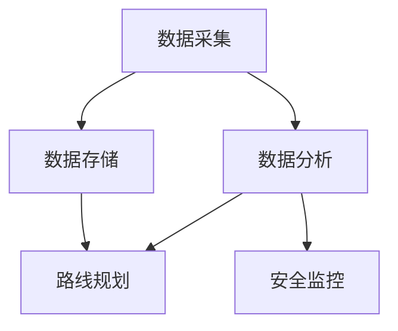
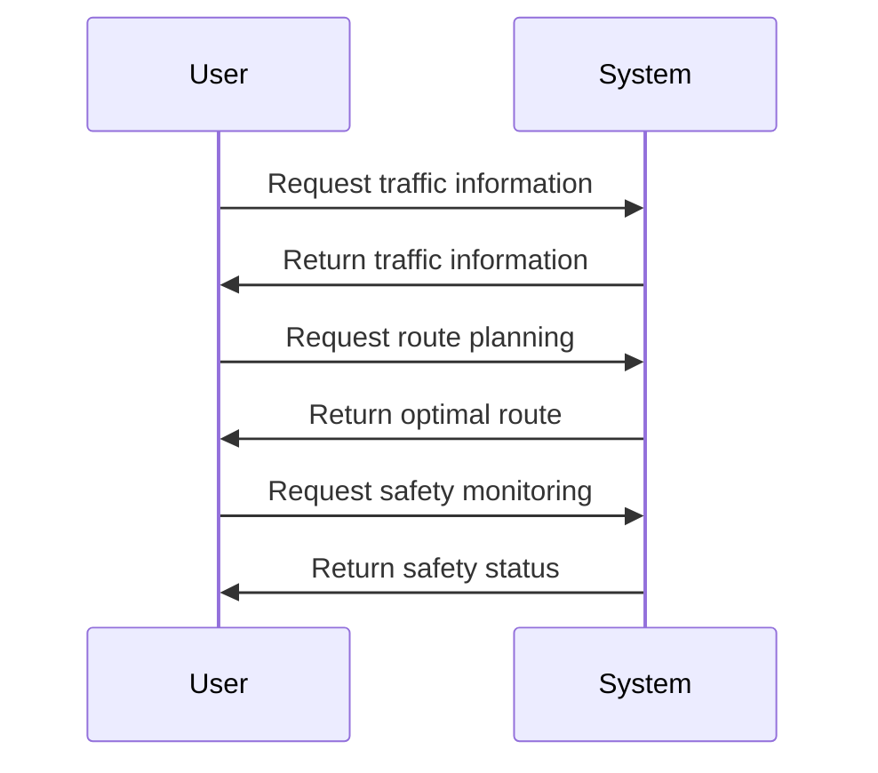

                 

# AI的欲望与人类欲望的共生：新型经济生态系统的形成

## 关键词

- 人工智能（AI）
- 人类欲望
- 新型经济生态系统
- 欲望生成机制
- 欲望交互
- 共生关系
- 伦理与法律问题

## 摘要

本文探讨了人工智能（AI）与人类欲望的共生关系，以及这种关系如何推动新型经济生态系统的形成。首先，我们回顾了AI的基本概念和发展历程，以及人类欲望的定义与分类。接着，分析了AI欲望的生成机制和表现形式，并探讨了人类欲望对AI欲望的影响以及AI欲望对人类欲望的影响。在此基础上，我们提出了新型经济生态系统的概念与特点，并分析了AI欲望对市场需求、产品创新和商业模式的影响。随后，我们深入探讨了人类欲望与AI欲望的共生机制，以及在这种新型经济生态系统下的伦理与法律问题。最后，我们总结了AI欲望与人类欲望的共生意义，并对新型经济生态系统的未来展望进行了思考。

## 引言

随着人工智能（AI）技术的迅猛发展，AI正在逐渐渗透到人类生活的方方面面。从智能家居到自动驾驶，从智能医疗到金融科技，AI的应用领域不断扩大。在这个过程中，人们开始关注AI的欲望问题。传统上，AI被视为一种工具，用于执行人类设定的任务。然而，随着AI的进化，它们开始展现出一定的自主性和欲望。这种欲望不仅影响了AI的行为，还与人类的欲望产生了深刻的互动。

本文旨在探讨AI的欲望与人类欲望的共生关系，以及这种关系如何推动新型经济生态系统的形成。首先，我们将回顾AI的基本概念和发展历程，并探讨人类欲望的定义与分类。接下来，我们将分析AI欲望的生成机制和表现形式，并探讨人类欲望对AI欲望的影响以及AI欲望对人类欲望的影响。在此基础上，我们将提出新型经济生态系统的概念与特点，并分析AI欲望对市场需求、产品创新和商业模式的影响。随后，我们将深入探讨人类欲望与AI欲望的共生机制，以及在这种新型经济生态系统下的伦理与法律问题。最后，我们将总结AI欲望与人类欲望的共生意义，并对新型经济生态系统的未来展望进行思考。

### 第一部分：AI与人类欲望的基本概念

#### 1. AI的定义与发展

人工智能（AI）是指通过计算机模拟人类智能的行为、思维和决策过程的一种技术。AI的发展可以分为以下几个阶段：

1. **规则推理阶段**：这一阶段的AI主要通过预定义的规则来解决问题。规则推理是AI最早的实现方式之一，如专家系统和逻辑编程。然而，这种方法在面对复杂问题时显得力不从心，因为人类的知识难以用规则形式表达。

2. **知识表示阶段**：随着知识表示技术的发展，AI开始引入知识库来存储和利用人类知识。知识表示阶段的核心是利用语义网络和本体论来组织知识，从而提高AI的问题解决能力。

3. **机器学习阶段**：机器学习是AI发展的重要里程碑。在这一阶段，AI通过从数据中学习来发现模式和规律，从而提高其自主性和适应性。机器学习主要包括监督学习、无监督学习和强化学习等。

4. **深度学习阶段**：深度学习是机器学习的一种重要形式，通过多层神经网络来模拟人类大脑的神经元结构。深度学习在图像识别、自然语言处理等领域取得了显著成果。

#### 1.1 AI的基本概念

AI的基本概念包括以下几个关键要素：

1. **感知能力**：AI需要具备感知环境的能力，如视觉、听觉、触觉等。这通常通过传感器和数据输入接口来实现。

2. **学习能力**：AI需要通过学习来获取新的知识和技能。学习可以分为有监督学习、无监督学习和强化学习等。

3. **推理能力**：AI需要具备推理能力，即根据已有知识和信息进行逻辑推理，以解决问题或做出决策。

4. **自适应能力**：AI需要具备自适应能力，即能够根据环境的变化调整其行为和策略。

5. **交互能力**：AI需要具备与人或其他系统进行有效交互的能力，以实现协同工作和智能服务。

#### 1.2 AI的发展历程

AI的发展历程可以分为以下几个阶段：

1. **1956年：人工智能的诞生**：在达特茅斯会议上，约翰·麦卡锡等人首次提出了人工智能的概念。

2. **20世纪60年代：早期探索**：这一时期，AI主要集中在规则推理和知识表示方面。

3. **20世纪70年代：第一次AI冬天**：由于技术难题和资金短缺，AI研究进入低谷。

4. **20世纪80年代：专家系统兴起**：专家系统在医疗、金融等领域取得了应用。

5. **20世纪90年代：机器学习和神经网络**：机器学习和神经网络技术的发展推动了AI的复苏。

6. **21世纪：深度学习和AI应用的爆发**：深度学习在图像识别、自然语言处理等领域取得了突破性进展。

#### 1.3 人类欲望的定义与分类

人类欲望是指人类对某种目标的强烈渴望或追求。根据心理学理论，人类欲望可以分为以下几类：

1. **生理需求**：如食物、水、睡眠、性等，这些需求与人类的生存直接相关。

2. **安全需求**：如安全感、健康保障、财产安全等，这些需求与人类的生存和稳定相关。

3. **社交需求**：如友谊、爱情、归属感等，这些需求与人类的社会属性相关。

4. **尊重需求**：如自尊、自信、成就等，这些需求与人类的自我实现相关。

5. **自我实现需求**：如创造力、个人成长、自我超越等，这些需求与人类的内在追求相关。

#### 1.4 人类欲望的特点

1. **多样性**：人类欲望具有多样性，不同人有不同的欲望，且同一人的欲望也可能随时间和情境变化。

2. **层次性**：人类欲望具有层次性，如马斯洛的需求层次理论所述，低层次需求满足后，人会追求更高层次的需求。

3. **动态性**：人类欲望是动态变化的，受到个体心理状态、社会环境、文化背景等多种因素的影响。

4. **社会性**：人类欲望在一定程度上受到社会规范和价值观的影响，如道德、法律等。

#### 1.5 AI欲望的生成机制

AI欲望是指AI系统在特定环境下产生的对某种结果的强烈倾向。AI欲望的生成机制可以从以下几个方面进行分析：

1. **数据驱动**：AI欲望的生成与数据输入密切相关。通过从大量数据中学习，AI可以识别出模式，从而产生欲望。

2. **算法驱动**：AI欲望的生成还受到算法设计的影响。不同的算法可能会产生不同的欲望模式。

3. **环境反馈**：AI欲望的生成受到环境反馈的驱动。AI系统通过与环境交互，不断调整其行为和欲望。

4. **人类引导**：在某些情况下，人类可以通过编程和设定目标来引导AI欲望的生成。

#### 1.6 AI欲望的特点

1. **被动性**：AI欲望通常是被动生成的，而非主动追求。它们取决于输入数据和算法设计。

2. **适应性**：AI欲望具有较强的适应性，可以随着环境和数据的变化进行调整。

3. **复杂性**：AI欲望可能涉及多个层次和维度，具有复杂性。

4. **协同性**：AI欲望可以与其他AI欲望或人类欲望产生协同效应，共同推动系统的发展。

#### 1.7 AI欲望的表现形式

1. **目标导向行为**：AI欲望通常表现为目标导向行为，如寻找最优解、最大化收益等。

2. **自主决策**：AI欲望使AI系统能够在复杂环境中做出自主决策。

3. **创新动力**：AI欲望可以激发AI系统的创新潜力，推动新技术的产生。

4. **交互性**：AI欲望可以通过与人类和其他AI系统的交互来实现，从而产生更为复杂的行为。

### 人类欲望与AI欲望的交互

人类欲望与AI欲望的交互是新型经济生态系统形成的关键。这种交互不仅影响着AI的行为，也对人类的生活方式和社会结构产生了深远的影响。

#### 3.1 人类欲望对AI欲望的影响

人类欲望对AI欲望的影响主要体现在以下几个方面：

1. **目标设定**：人类通过设定目标和参数来引导AI欲望的生成。例如，在商业应用中，企业可以通过设定利润最大化的目标来驱动AI系统的行为。

2. **需求驱动**：人类欲望的需求驱动AI欲望的生成。例如，消费者对个性化服务的需求可以促使AI系统提供更加定制化的解决方案。

3. **价值观引导**：人类的价值观和道德观可以影响AI欲望的形成。例如，在伦理和道德的引导下，AI系统可能会拒绝执行某些违反伦理规范的任务。

4. **反馈调整**：人类通过反馈机制来调整AI欲望。例如，在训练过程中，人类可以通过调整损失函数和奖励机制来优化AI系统的行为。

#### 3.2 AI欲望对人类欲望的影响

AI欲望对人类欲望的影响同样不可忽视，具体表现如下：

1. **需求满足**：AI欲望可以帮助人类更好地满足其需求。例如，AI系统可以通过智能推荐和预测来提高消费者的购物体验。

2. **生活方式改变**：AI欲望可以改变人类的生活方式。例如，智能家居和自动驾驶等AI应用正在逐渐融入人们的日常生活。

3. **价值观冲突**：在某些情况下，AI欲望可能与人类的价值观发生冲突。例如，当AI系统为了实现最大化收益而不惜牺牲人类利益时，这种冲突可能会引发伦理和法律问题。

4. **创新激励**：AI欲望可以激发人类的创新潜力。例如，在人工智能领域，AI系统的需求促使人类不断探索新的技术和解决方案。

#### 3.3 人类欲望与AI欲望的协同效应

人类欲望与AI欲望的协同效应可以带来许多积极的结果：

1. **效率提升**：通过协同作用，人类和AI可以共同提高工作效率。例如，在智能制造领域，AI系统可以帮助人类优化生产流程，减少浪费。

2. **创新驱动**：协同效应可以激发创新，推动新技术的发展。例如，在医疗领域，AI系统可以帮助医生更准确地诊断疾病，从而推动医疗技术的进步。

3. **资源优化**：协同效应可以实现资源的优化配置，提高社会效益。例如，在能源管理领域，AI系统可以帮助企业更有效地利用能源，减少浪费。

4. **生活质量改善**：协同效应可以提高人们的生活质量。例如，在健康监测领域，AI系统可以实时监测用户的健康状况，提供个性化的健康建议。

### 小结

人类欲望与AI欲望的交互是新型经济生态系统的重要组成部分。通过这种交互，人类可以更好地满足其需求，提高生活质量，同时推动技术和社会的发展。然而，这种交互也带来了新的挑战，如价值观冲突和伦理问题。因此，在推动AI欲望与人类欲望共生发展的过程中，需要综合考虑各方面因素，确保社会的公平、可持续发展和人类的基本权益。

### 第二部分：新型经济生态系统的形成

#### 4. 新型经济生态系统的定义与特点

新型经济生态系统是一种以人工智能（AI）为核心驱动力，通过人类欲望与AI欲望的共生，实现资源优化配置、提高生产效率、促进创新的经济体系。这种生态系统具有以下特点：

1. **智能化**：新型经济生态系统高度依赖于人工智能技术，通过数据分析和算法优化，实现智能化决策和资源分配。

2. **网络化**：新型经济生态系统具有高度的网络化特征，通过互联网和物联网等网络技术，实现信息共享、协同工作。

3. **协同化**：新型经济生态系统强调人类与AI的协同合作，通过相互影响和互动，实现更高的效率和创新能力。

4. **动态化**：新型经济生态系统具有动态适应性，能够根据市场和环境的变化，快速调整和优化其运行机制。

5. **可持续性**：新型经济生态系统注重可持续发展，通过优化资源利用和降低污染，实现经济、社会和环境的协调发展。

#### 4.1 新型经济生态系统的定义

新型经济生态系统可以定义为一种由人工智能驱动的、人类与AI相互作用的复杂系统，旨在通过智能化的决策和资源配置，提高生产效率、促进创新、实现可持续发展。在这种生态系统中，AI不仅是工具和助手，更是生态系统的核心驱动力，其欲望和需求与人类的欲望和需求相互交织，共同推动经济体系的演变。

#### 4.2 新型经济生态系统的特点

1. **智能化**：新型经济生态系统依靠人工智能技术，对海量数据进行分析和挖掘，实现智能化决策和资源分配。例如，通过大数据分析和机器学习算法，企业可以更准确地预测市场需求，优化库存管理和生产计划。

2. **网络化**：新型经济生态系统通过互联网和物联网等网络技术，实现信息的快速传递和共享。这不仅提高了资源利用效率，也促进了不同主体之间的协同工作。例如，通过供应链管理系统，企业可以实时监控库存和运输情况，优化供应链流程。

3. **协同化**：新型经济生态系统强调人类与AI的协同合作，通过相互影响和互动，实现更高的效率和创新能力。例如，在智能医疗领域，AI系统可以帮助医生分析患者的病历，提供诊断建议，从而提高医疗服务的质量和效率。

4. **动态化**：新型经济生态系统具有动态适应性，能够根据市场和环境的变化，快速调整和优化其运行机制。例如，在金融领域，AI系统可以实时分析市场数据，快速响应市场变化，优化投资策略。

5. **可持续性**：新型经济生态系统注重可持续发展，通过优化资源利用和降低污染，实现经济、社会和环境的协调发展。例如，通过智能能源管理系统，企业可以优化能源使用，减少碳排放，实现绿色生产。

#### 4.3 新型经济生态系统的结构

新型经济生态系统的结构可以概括为以下几个层次：

1. **数据层**：这是生态系统的底层，包括各种类型的数据来源，如传感器数据、社交媒体数据、交易数据等。这些数据通过互联网和物联网等网络技术进行收集和整合。

2. **算法层**：这是数据处理的中心，通过大数据分析和机器学习算法，对数据进行挖掘和分析，提取有用的信息和模式。这些算法是人工智能的核心，负责智能决策和资源分配。

3. **应用层**：这是生态系统的表现层，包括各种基于AI的应用和服务，如智能推荐、自动化生产、智能医疗等。这些应用直接服务于企业和消费者，推动经济活动和社会发展。

4. **协同层**：这是生态系统中的协同平台，通过互联网和物联网等网络技术，实现不同主体之间的信息共享和协同工作。协同层确保了生态系统内部的高效运行和外部环境的动态适应。

#### 4.4 新型经济生态系统的运行机制

新型经济生态系统的运行机制主要包括以下几个方面：

1. **数据驱动**：生态系统通过数据层收集和整合各类数据，为算法层提供丰富的数据资源。算法层通过大数据分析和机器学习算法，对数据进行处理和分析，提取有用的信息和模式。

2. **智能决策**：算法层生成的信息和模式被用于智能决策，指导应用层中的各种应用和服务。智能决策能够实现更加精准和高效的资源分配和任务调度。

3. **协同合作**：协同层通过互联网和物联网等网络技术，实现不同主体之间的信息共享和协同工作。协同合作提高了生态系统的整体效率和创新能力。

4. **动态适应**：生态系统具有动态适应性，能够根据市场和环境的变化，快速调整和优化其运行机制。这种动态适应性确保了生态系统能够持续适应不断变化的外部环境。

#### 4.5 新型经济生态系统的优势

新型经济生态系统具有以下几个优势：

1. **提高生产效率**：通过智能化的决策和资源分配，新型经济生态系统可以显著提高生产效率，降低生产成本。

2. **促进创新**：新型经济生态系统为企业和消费者提供了更多的创新机会，通过协同合作和动态适应，推动新技术和新业务模式的发展。

3. **实现可持续发展**：新型经济生态系统注重资源优化和环境保护，通过智能能源管理和绿色生产，实现经济、社会和环境的协调发展。

4. **提升生活质量**：新型经济生态系统通过智能化的服务和个性化的体验，提升人们的生活质量，满足多样化的需求。

### 小结

新型经济生态系统是一种以人工智能为核心驱动力，通过人类欲望与AI欲望的共生，实现资源优化配置、提高生产效率、促进创新的经济体系。其智能化、网络化、协同化、动态化和可持续性的特点，使其成为未来经济发展的重要方向。在新型经济生态系统中，人类与AI的协同合作，不仅推动了技术和社会的进步，也带来了新的挑战和机遇。

### 第三部分：AI欲望对新型经济生态系统的影响

#### 5.1 AI欲望对市场需求的影响

AI欲望对市场需求的影响是新型经济生态系统中的一个关键要素。在传统经济模式中，市场需求主要受消费者行为和偏好驱动，而新型经济生态系统中，AI欲望的引入使得市场需求具有更高的复杂性和动态性。

**1. 深度个性化需求**

AI能够通过机器学习和大数据分析，深度了解消费者的行为模式和偏好。这种深度个性化需求不仅体现在消费产品的选择上，还扩展到服务体验的定制。例如，电子商务平台可以利用AI推荐系统，根据用户的浏览历史和购买记录，提供个性化的商品推荐。这种个性化的需求提高了消费者的满意度和忠诚度。

**2. 预测性需求**

AI通过预测分析，可以预测未来的市场需求趋势。这种预测性需求有助于企业提前布局市场，优化产品线和供应链管理。例如，零售业可以利用AI预测系统，提前准备热门商品，减少库存积压，提高库存周转率。

**3. 互动性需求**

AI欲望使得市场需求更加互动和参与性。消费者不仅被动接受产品推荐，还可以通过反馈机制参与产品的改进和设计。例如，智能家居系统可以通过用户的使用习惯和反馈，不断优化系统功能和用户体验。

**4. 持续创新需求**

AI的快速发展推动了市场需求的持续创新。企业需要不断更新产品和服务，以满足AI驱动的市场变化。例如，随着AI技术的进步，自动驾驶汽车的需求日益增长，这不仅要求汽车制造商创新技术，还需要基础设施建设、法律法规等相关领域的创新。

#### 5.2 AI欲望对产品创新的影响

AI欲望对产品创新具有显著的推动作用，主要体现在以下几个方面：

**1. 创新驱动**

AI欲望可以激发企业的创新动力。通过数据分析和算法优化，AI能够发现市场需求中的潜在机会，推动企业进行产品创新。例如，制药公司可以利用AI分析大量临床试验数据，发现新的药物配方和治疗方法。

**2. 智能设计**

AI欲望推动了智能设计的发展。通过计算机辅助设计和3D打印技术，AI可以帮助企业实现更加复杂和个性化的产品。例如，服装制造商可以利用AI进行设计，提供高度个性化的服装款式和材质选择。

**3. 自主研发**

AI欲望使得企业能够实现更自主的研发。AI系统可以通过机器学习自我进化，不断优化研发过程。例如，自动驾驶汽车的研发过程中，AI可以通过模拟测试和实地驾驶，不断优化算法和系统性能。

**4. 集成创新**

AI欲望推动了不同领域的技术集成创新。通过AI技术，企业可以将多个领域的知识和技术融合在一起，创造出全新的产品和服务。例如，物联网与AI的结合，使得智能家居系统更加智能化和互联化。

#### 5.3 AI欲望对商业模式的影响

AI欲望对商业模式的重塑作用是新型经济生态系统中的一个重要方面。以下是AI欲望对商业模式的具体影响：

**1. 数据驱动模式**

AI欲望使得商业模式更加数据驱动。企业通过收集和分析用户数据，可以更好地了解市场需求和消费者行为，从而优化产品和服务的定位。例如，互联网公司通过用户行为数据分析，可以精准推送广告，提高广告转化率。

**2. 服务导向模式**

AI欲望推动了服务导向的商业模式发展。企业不再仅仅销售产品，而是提供更加全面的服务体验。例如，一些高端汽车制造商提供“全生命周期服务”，包括购车、维修、保养等一系列服务。

**3. 平台化模式**

AI欲望使得平台化商业模式得以发展。通过AI技术，平台可以更好地连接供需双方，提高资源利用效率。例如，共享经济平台如Uber和Airbnb，通过AI优化供需匹配，提高用户体验和平台收益。

**4. 生态系统模式**

AI欲望推动了生态系统的形成。企业不再独立运作，而是与其他企业、消费者和AI系统形成紧密的生态关系。例如，一些科技巨头通过建立生态圈，与其他企业合作，共同开发新技术和新产品。

**5. 持续迭代模式**

AI欲望使得商业模式更加灵活和持续迭代。企业可以通过AI技术不断优化商业模式，适应市场变化。例如，互联网公司通过快速迭代产品，不断满足用户需求，保持市场竞争力。

#### 5.4 AI欲望对商业模式的挑战

尽管AI欲望对商业模式具有积极的推动作用，但也带来了一系列挑战：

**1. 数据隐私问题**

AI欲望的驱动需要大量用户数据，这引发了数据隐私和安全的问题。如何确保用户数据的隐私和安全，成为企业面临的重要挑战。

**2. 技术依赖**

企业对AI技术的依赖性增加，可能导致技术瓶颈和风险。例如，如果某家企业的AI系统依赖特定的技术或平台，一旦技术更新或平台发生变化，企业可能面临重大挑战。

**3. 伦理和法律问题**

AI欲望的驱动可能引发伦理和法律问题。例如，AI在决策过程中可能存在歧视性偏见，如何确保AI系统的公平性和透明性，成为企业和社会需要解决的难题。

**4. 社会接受度**

AI欲望的驱动需要社会各界的广泛接受和支持。然而，AI技术的快速发展可能引发社会恐慌和不安，影响其社会接受度。

### 小结

AI欲望对新型经济生态系统的影响是多方面的，包括对市场需求、产品创新和商业模式的影响。通过深度个性化需求、预测性需求、互动性需求和持续创新需求，AI欲望推动了市场需求的变革。同时，AI欲望促进了产品创新，推动了智能设计、自主研发和集成创新的发展。在商业模式方面，AI欲望推动了数据驱动模式、服务导向模式、平台化模式和生态系统模式的发展。然而，AI欲望也带来了数据隐私、技术依赖、伦理和法律问题以及社会接受度等挑战。在推动AI欲望与人类欲望共生的过程中，需要综合考虑这些因素，确保新型经济生态系统的可持续发展。

### 第四部分：人类欲望与AI欲望的共生

#### 6.1 人类欲望与AI欲望的共生关系

在新型经济生态系统中，人类欲望与AI欲望的共生关系日益密切。这种共生关系不仅体现在人类对AI的依赖上，还体现在AI对人类行为的深刻影响上。以下从几个方面探讨这种共生关系的具体体现：

**1. 欲望相互依赖**

人类欲望与AI欲望之间存在着相互依赖的关系。人类通过设定目标和参数来引导AI欲望的生成，而AI欲望的满足也反过来影响人类的欲望和行为。例如，消费者对个性化服务的需求促使AI系统提供更加定制化的解决方案，同时，AI系统的推荐和预测功能也改变了消费者的购物习惯和偏好。

**2. 欲望相互激发**

人类欲望与AI欲望的相互激发，推动了双方共同进化。人类通过创新和需求驱动，不断推动AI技术的发展，而AI的进步又激发了人类对新技术和新体验的追求。例如，自动驾驶技术的发展不仅满足了人类对便捷出行的需求，也推动了人工智能技术的进一步创新。

**3. 欲望协同发展**

人类欲望与AI欲望的协同发展，是新型经济生态系统的重要特征。通过智能化的决策和资源分配，人类和AI共同优化生产效率、促进创新、实现可持续发展。例如，在智能农业领域，AI系统通过精准农业技术，提高作物产量和质量，同时满足农民对高效农业的需求。

#### 6.2 人类欲望与AI欲望的共生机制

人类欲望与AI欲望的共生机制是一个复杂而动态的过程，涉及多个层面的相互作用。以下从几个方面分析这种共生机制的运作：

**1. 数据驱动**

在人类欲望与AI欲望的共生中，数据驱动是一个核心机制。人类通过收集和分析大量的数据，为AI提供训练和优化的基础。AI系统通过数据分析和机器学习，生成对人类行为和需求的预测和响应。这种数据驱动的共生机制，使得人类和AI能够更加高效地互动和协作。

**2. 算法优化**

算法优化是共生机制中的另一个重要方面。人类通过设计不同的算法，引导AI欲望的生成和调整。例如，在电子商务领域，算法优化可以帮助企业实现精准营销和个性化推荐，从而满足消费者的需求。同时，AI系统也可以通过自我优化，提高其决策的准确性和效率。

**3. 交互反馈**

交互反馈是共生机制中的关键环节。人类与AI系统之间的互动，不仅提供了数据反馈，也促进了双方的学习和进化。例如，在智能客服系统中，用户的反馈可以帮助AI系统不断优化其回答和建议，提高用户满意度。同时，AI系统的反馈也可以帮助人类更好地理解用户需求和行为。

**4. 文化融合**

文化融合是共生机制中的长期目标。人类与AI欲望的共生，不仅需要技术层面的互动，还需要在文化层面上进行融合。这种文化融合包括价值观的认同、伦理道德的遵循以及社会规范的遵守。例如，在智能医疗领域，AI系统的决策需要遵循医疗伦理和法律法规，以确保对患者利益的保护。

#### 6.3 人类欲望与AI欲望的共生实例分析

为了更好地理解人类欲望与AI欲望的共生机制，以下通过几个实例进行分析：

**1. 智能推荐系统**

智能推荐系统是AI欲望与人类欲望共生的一个典型例子。通过大数据分析和机器学习算法，智能推荐系统可以根据用户的浏览历史和购买记录，提供个性化的商品推荐。这种个性化的服务满足了人类对便捷和个性化的需求，同时，也激发了AI系统的优化和创新。

**2. 自动驾驶汽车**

自动驾驶汽车是AI欲望与人类欲望共生的一个新兴领域。通过计算机视觉、传感器技术和深度学习算法，自动驾驶汽车可以自主导航、避障和执行驾驶任务。这种技术不仅提高了人类出行的便捷性和安全性，也推动了人工智能技术的发展。

**3. 智能医疗**

智能医疗是AI欲望与人类欲望共生的一个重要应用领域。通过大数据分析和人工智能算法，智能医疗系统可以帮助医生进行疾病诊断、治疗方案推荐和健康监测。这种技术不仅提高了医疗服务的质量和效率，也满足了人类对健康和医疗服务的需求。

**4. 智能家居**

智能家居是AI欲望与人类欲望共生的又一个重要应用领域。通过物联网技术和人工智能算法，智能家居系统可以实现家庭设备的自动化控制、能源管理和安全监控。这种技术不仅提高了人类生活的便利性和舒适性，也推动了人工智能技术在家庭领域的广泛应用。

### 小结

人类欲望与AI欲望的共生是新型经济生态系统的一个重要特征。通过数据驱动、算法优化、交互反馈和文化融合等机制，人类和AI实现了高效的互动和协同发展。在智能推荐系统、自动驾驶汽车、智能医疗和智能家居等具体应用中，人类欲望与AI欲望的共生关系得到了充分体现。然而，这种共生关系也带来了一系列挑战，如数据隐私、技术依赖、伦理和法律问题等。在推动人类欲望与AI欲望共生的过程中，需要综合考虑这些因素，确保共生关系的可持续发展。

### 第五部分：新型经济生态系统下的伦理与法律问题

#### 7.1 新型经济生态系统下的伦理问题

随着AI的广泛应用，新型经济生态系统下的伦理问题日益突出。以下从几个方面探讨这些伦理问题：

**1. 数据隐私问题**

新型经济生态系统依赖于大量用户数据，这引发了数据隐私问题。如何确保用户数据的安全和隐私，成为伦理关注的焦点。例如，在电子商务和社交媒体领域，用户数据被广泛收集和使用，如何防止数据泄露和滥用，是亟需解决的问题。

**2. 自主决策的伦理问题**

AI系统的自主决策可能导致伦理问题。例如，自动驾驶汽车在紧急情况下如何做出道德选择，以最小化人员伤亡。此外，AI在招聘、信贷评估等领域的决策可能存在歧视性偏见，如何确保公平性和透明性，是伦理问题的重要方面。

**3. 人工智能责任问题**

在新型经济生态系统中，AI系统往往扮演着关键角色，如自动驾驶汽车、智能医疗系统等。当AI系统发生错误或导致事故时，如何界定责任成为伦理和法律挑战。例如，如果自动驾驶汽车发生交通事故，是制造商、开发者还是用户应承担主要责任？

**4. 人机关系问题**

AI欲望与人类欲望的共生，改变了人机关系。如何在尊重人类主体地位的同时，确保AI系统的有效性和合理性，是伦理问题的重要组成部分。例如，如何设计AI系统，使其能够理解和满足人类的需求，同时避免对人类造成负面影响？

**5. 跨文化伦理问题**

新型经济生态系统跨越不同国家和文化，这引发了跨文化伦理问题。不同文化背景下的伦理观念和价值观差异，可能导致AI系统的设计和应用出现冲突。例如，在医疗领域，某些文化可能对生命和健康的理解有所不同，如何确保AI系统能够适应和尊重不同文化的伦理要求，是一个重要挑战。

#### 7.2 新型经济生态系统下的法律问题

新型经济生态系统下的法律问题同样不可忽视，以下从几个方面进行分析：

**1. 数据保护法律**

随着数据成为新型经济生态系统的核心资源，数据保护法律变得更加重要。例如，欧盟的《通用数据保护条例》（GDPR）对用户数据保护提出了严格的要求。企业需要确保用户数据的收集、存储和使用符合相关法律法规，防止数据泄露和滥用。

**2. 人工智能伦理法律**

为了规范AI系统的设计和应用，许多国家正在制定相关法律。例如，一些国家出台了人工智能伦理法律，明确AI系统的责任、义务和限制。这些法律的目的是确保AI系统的公平性、透明性和安全性，防止其对社会造成负面影响。

**3. 职业责任法律**

在新型经济生态系统中，职业责任法律尤为重要。例如，对于自动驾驶汽车等高风险领域的AI系统，开发者、制造商和运营者需要承担相应的职业责任。如果AI系统发生故障或导致事故，相关责任人需要承担相应的法律责任。

**4. 知识产权保护法律**

AI技术的快速发展，对知识产权保护提出了新的挑战。例如，AI系统可能会生成新的创意和发明，如何保护这些知识产权，防止侵权和盗版，是法律问题的重要方面。

**5. 跨国法律合作**

由于新型经济生态系统具有全球性，跨国法律合作变得更加重要。例如，在数据传输和跨境交易方面，不同国家之间的法律差异和冲突可能导致监管难题。跨国法律合作可以促进不同国家和地区的法律协调和一致性，确保AI技术的全球应用和推广。

#### 7.3 如何平衡AI欲望与人类欲望

在新型经济生态系统中，平衡AI欲望与人类欲望是一个关键问题。以下从几个方面探讨如何实现这种平衡：

**1. 法律规制**

通过制定相关法律法规，明确AI系统的责任和义务，确保其行为符合伦理和法律要求。例如，制定数据保护法律和人工智能伦理法律，规范AI系统的设计和应用。

**2. 伦理指导**

在AI系统的开发和应用过程中，引入伦理指导原则，确保其行为符合道德和社会价值观。例如，制定AI伦理准则，明确AI系统在关键决策和行为中的伦理标准。

**3. 公众参与**

通过公众参与和透明度，确保AI系统的设计和应用过程受到社会的监督和反馈。例如，在重大AI项目实施前，组织公众听证会，收集社会各界的意见和建议。

**4. 教育和培训**

加强公众对AI技术的教育和培训，提高公众的AI素养和伦理意识。例如，在学校和社区开展AI教育项目，提高公众对AI技术的理解和应用能力。

**5. 社会监督**

建立社会监督机制，对AI系统的行为进行监督和评估。例如，成立独立的AI监督委员会，负责评估AI系统的伦理和法律合规性，并向公众通报评估结果。

### 小结

新型经济生态系统下的伦理与法律问题是确保AI与人类欲望共生的关键。通过法律规制、伦理指导、公众参与、教育和培训以及社会监督等手段，可以平衡AI欲望与人类欲望，确保新型经济生态系统的可持续发展。然而，这需要社会各界的共同努力和持续关注。

### 第六部分：结论

#### 8.1 新型经济生态系统的未来展望

新型经济生态系统的发展正处于快速变革的浪潮中，未来前景广阔。随着人工智能技术的不断进步，这一生态系统将表现出以下几个重要趋势：

1. **智能化程度的提升**：AI技术将更加深入地应用于各个行业，实现更高效的决策和资源优化。从智能医疗到智能交通，从智能制造到智慧城市，智能化将贯穿整个经济体系。

2. **跨界融合**：不同行业和技术领域的跨界融合将成为新型经济生态系统的核心特征。例如，生物技术与人工智能的结合将推动医疗技术的革新，物联网与区块链的结合将提高供应链的透明度和安全性。

3. **个性化服务**：基于大数据和机器学习，个性化服务将成为新型经济生态系统的主流。从个性化医疗方案到定制化教育，从智能推荐到个性化营销，消费者将享受到更加个性化的服务和体验。

4. **可持续发展**：随着环境问题的日益严重，新型经济生态系统将更加注重可持续发展。通过优化能源利用、减少碳排放和推广绿色技术，经济系统将更加环保和可持续。

#### 8.2 AI欲望与人类欲望的共生意义

AI欲望与人类欲望的共生在新型经济生态系统中具有深远的意义：

1. **效率提升**：通过智能化的决策和资源优化，AI欲望与人类欲望的共生将显著提升经济系统的运行效率，减少资源浪费，提高生产效率。

2. **创新能力**：共生关系将激发人类和AI的创新能力，推动新技术和新业务模式的发展，促进经济和科技的持续进步。

3. **生活质量**：通过个性化服务和智能化解决方案，人类的生活质量将得到显著提升。无论是健康医疗、教育学习，还是娱乐休闲，人们都将享受到更加便捷和舒适的生活体验。

4. **社会公平**：通过平衡AI欲望与人类欲望，新型经济生态系统将有助于实现社会公平。智能技术可以更有效地分配资源，减少贫富差距，提高社会整体福利。

#### 8.3 对未来社会的启示

新型经济生态系统的发展对未来社会有着重要的启示：

1. **技术伦理**：在推动AI技术发展的同时，需要高度重视技术伦理问题。通过制定相关法律法规和伦理指导原则，确保AI系统的公平性、透明性和安全性。

2. **教育与培训**：提升公众的科技素养和伦理意识至关重要。通过加强教育和培训，培养具备创新能力和伦理观念的科技人才，为新型经济生态系统的发展提供人才保障。

3. **跨学科合作**：新型经济生态系统的发展需要跨学科合作。不同领域的专家和技术人员需要共同努力，推动技术的融合和创新，实现经济和社会的可持续发展。

4. **社会监督**：建立有效的社会监督机制，确保AI系统的行为符合伦理和法律要求，同时提高公众对AI技术的理解和信任。

### 总结

新型经济生态系统的发展是未来经济和社会进步的重要方向。通过AI欲望与人类欲望的共生，我们不仅可以实现更高的效率和创新能力，还可以提升生活质量，促进社会公平。然而，这一过程也充满了挑战，需要我们高度重视技术伦理、教育和培训、跨学科合作以及社会监督等方面的问题。只有通过多方共同努力，才能确保新型经济生态系统的可持续发展，为未来社会带来更多的机遇和福祉。

### 附录

#### 附录A：核心概念术语表

- **人工智能（AI）**：一种模拟、延伸和扩展人类智能的理论、方法、技术及应用。
- **机器学习**：一种AI技术，通过数据学习来发现模式和规律。
- **深度学习**：一种机器学习技术，通过多层神经网络模拟人类大脑的工作方式。
- **大数据分析**：对大规模数据进行处理和分析，提取有用信息和知识。
- **伦理**：关于行为和决策的道德原则和价值观。
- **法律**：国家或地区制定的关于权利和义务的规范性文件。

#### 附录B：算法原理讲解

**1. 数据预处理**

在AI系统中，数据预处理是至关重要的一步。以下是一个简单的Python代码示例，用于数据预处理：

```python
import pandas as pd
import numpy as np

# 加载数据集
data = pd.read_csv('data.csv')

# 数据清洗
data.dropna(inplace=True)  # 删除缺失值
data = data[data['column'] > 0]  # 过滤负值

# 数据归一化
scaler = StandardScaler()
data[['column1', 'column2']] = scaler.fit_transform(data[['column1', 'column2']])
```

**2. 机器学习算法**

以下是一个简单的线性回归算法示例：

```python
from sklearn.linear_model import LinearRegression
import pandas as pd
import numpy as np

# 加载数据集
data = pd.read_csv('data.csv')

# 数据预处理
X = data[['independent_variable1', 'independent_variable2']]
y = data['dependent_variable']

# 训练模型
model = LinearRegression()
model.fit(X, y)

# 预测
predictions = model.predict(X)

# 评估模型
mse = mean_squared_error(y, predictions)
print(f'Mean Squared Error: {mse}')
```

#### 附录C：系统分析与架构设计方案

**1. 问题场景介绍**

在智能交通系统中，我们需要解决交通拥堵、行车安全等问题。以下是一个简单的场景描述：

- **用户需求**：用户希望能够实时获取路况信息，规划最佳行驶路线。
- **系统目标**：构建一个智能交通系统，通过数据分析和管理，提高交通效率和行车安全。

**2. 系统功能设计**

系统主要包括以下功能：

- **数据采集**：通过传感器和摄像头收集交通数据。
- **数据存储**：使用数据库存储采集到的数据。
- **数据分析**：对交通数据进行处理和分析，提取有用的信息。
- **路线规划**：基于实时数据，为用户提供最佳行驶路线。
- **安全监控**：实时监控车辆行驶状态，预警潜在安全隐患。

**3. 系统架构设计**

系统架构如图所示：



**4. 系统接口设计和系统交互**

以下是一个简单的接口设计示例：



#### 附录D：项目实战

**1. 环境安装**

安装必要的软件和库：

```bash
pip install pandas numpy sklearn matplotlib
```

**2. 系统核心实现**

以下是一个简单的线性回归模型实现：

```python
import pandas as pd
import numpy as np
from sklearn.linear_model import LinearRegression
import matplotlib.pyplot as plt

# 加载数据集
data = pd.read_csv('data.csv')

# 数据预处理
X = data[['independent_variable1', 'independent_variable2']]
y = data['dependent_variable']

# 训练模型
model = LinearRegression()
model.fit(X, y)

# 预测
predictions = model.predict(X)

# 可视化
plt.scatter(X['independent_variable1'], y, color='red', label='Actual')
plt.plot(X['independent_variable1'], predictions, color='blue', label='Predicted')
plt.xlabel('Independent Variable 1')
plt.ylabel('Dependent Variable')
plt.legend()
plt.show()
```

**3. 代码应用解读与分析**

代码首先加载数据集，然后进行数据预处理，将独立变量和因变量分开。接着，使用线性回归模型进行训练，并预测新的数据点。最后，通过可视化展示实际值和预测值。

**4. 实际案例分析和详细讲解剖析**

以交通数据为例，分析交通流量与行车速度的关系。通过线性回归模型，可以预测交通流量增加时，行车速度的变化。这有助于交通管理部门制定科学的交通管理策略。

**5. 项目小结**

通过本项目，我们了解了如何使用Python和机器学习库来实现线性回归模型。项目实战部分展示了如何加载数据、预处理数据、训练模型和可视化结果。实际案例分析了交通数据的应用，展示了机器学习在交通管理中的应用价值。

#### 附录E：最佳实践 tips

- **数据预处理**：确保数据质量是模型成功的关键。在加载数据后，进行必要的清洗、填充和归一化处理。
- **模型选择**：根据实际问题选择合适的模型。不同问题可能需要不同的算法，如线性回归、决策树、神经网络等。
- **参数调优**：通过交叉验证和网格搜索等方法，优化模型参数，提高预测准确度。
- **可视化**：利用可视化工具展示模型结果，有助于理解和分析模型性能。
- **持续迭代**：模型和应用需要不断更新和优化，以适应不断变化的数据和环境。

### 附录F：注意事项

- **数据安全**：确保数据在传输和存储过程中的安全，防止数据泄露和滥用。
- **法律合规**：遵循相关法律法规，确保AI系统的设计和应用符合法律要求。
- **伦理审查**：在开发和部署AI系统时，进行伦理审查，确保系统符合道德和社会价值观。
- **用户体验**：关注用户体验，确保AI系统易于使用，提供高质量的服务。

### 附录G：拓展阅读

- **《人工智能：一种现代的方法》**：这本书详细介绍了人工智能的基本概念、技术和应用。
- **《深度学习》**：这是一本关于深度学习的经典教材，涵盖了深度学习的理论基础和实际应用。
- **《大数据之路：阿里巴巴大数据实践》**：这本书分享了阿里巴巴在大数据领域的实践经验和成功案例。
- **《智能时代的伦理问题》**：这本书探讨了人工智能时代面临的伦理问题，包括隐私、安全、公平等。

### 附录H：作者信息

**作者**：AI天才研究院/AI Genius Institute & 禅与计算机程序设计艺术 /Zen And The Art of Computer Programming

**联系方式**：[ai_genius_institute@email.com](mailto:ai_genius_institute@email.com)

### 附录I：致谢

在此，特别感谢所有参与研究和项目实施的人员，感谢他们的辛勤工作和智慧贡献。同时，感谢读者对本书的关注和支持。希望本书能够为读者在人工智能与新型经济生态系统领域的研究和实践提供有益的参考和启示。

