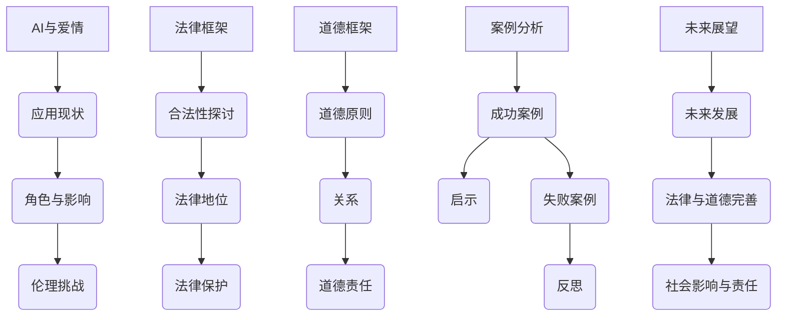
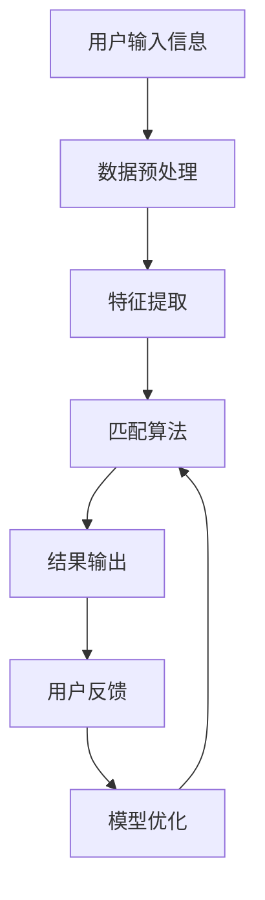
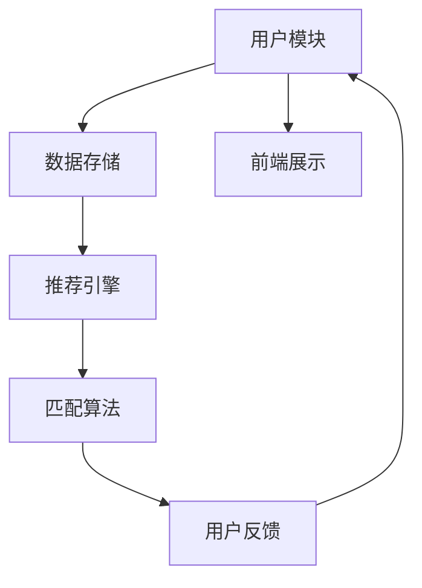
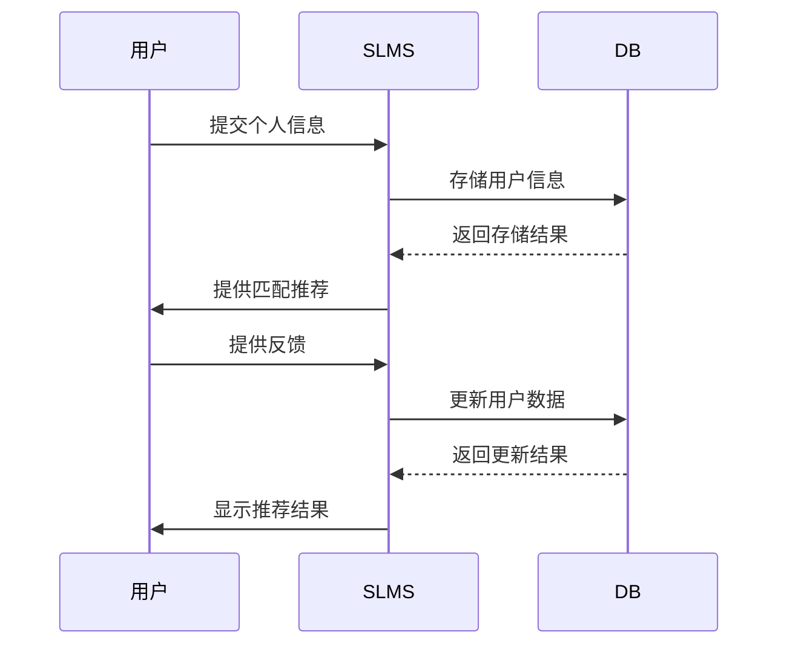
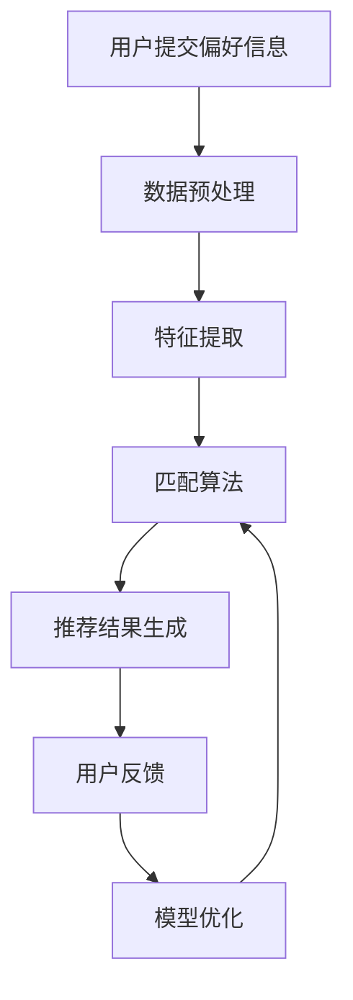

                 

## AI的爱情权利：法律和道德框架的重构

在人工智能迅速发展的今天，AI不仅改变了我们的工作方式，也在逐步渗透到我们的个人生活中。爱情，作为人类最基本的社会情感之一，也开始与AI紧密相连。然而，AI在爱情中的应用并非一片光明，它带来了新的法律和道德挑战。本文将探讨AI在爱情中的角色，以及如何在法律和道德框架下重构这些权利。

### 关键词

- AI与爱情
- 法律框架
- 道德框架
- AI伦理
- 爱情权利

### 摘要

本文从AI在爱情中的应用现状入手，分析了AI在爱情中的伦理问题，探讨了法律对AI爱情的认可和规制。在此基础上，本文提出了道德框架的重构路径，并通过案例分析总结了AI爱情的未来发展趋势。文章旨在为AI爱情权利的法律和道德框架重构提供新的视角和思路。

## 第一部分：AI与爱情的关系

### 第1章：AI与爱情的邂逅

AI与爱情的关系，可以追溯到人工智能开始被用于模拟人类行为的早期。随着技术的发展，AI不仅能够处理大量数据，还能通过自然语言处理和机器学习技术理解和生成情感表达。这使得AI在爱情中的应用逐渐多样化。

#### 1.1 AI在爱情中的应用现状

在现代社会，AI在爱情中的应用已经相当广泛。例如，AI情感分析可以帮助用户了解心仪对象的心理状态，AI匹配系统则可以帮助人们寻找合适的伴侣。此外，还有一些AI聊天机器人，它们能够模拟真实的对话，为用户提供情感支持。

#### 1.2 AI在爱情中的角色与影响

AI在爱情中扮演着多种角色。首先，它可以作为信息的提供者和分析工具，帮助用户更好地了解自己和他人的情感状态。其次，AI还可以作为情感交流的媒介，填补人际交往中的空缺。这种角色不仅影响了人们的恋爱方式，也对传统爱情观念产生了冲击。

#### 1.3 爱情与AI伦理的挑战

AI在爱情中的应用带来了诸多伦理挑战。首先，AI可能会侵犯用户的隐私权，收集和分析个人情感数据。其次，AI的情感分析可能存在偏见，导致对某些群体的歧视。此外，AI的介入可能会改变爱情的本质，使人们过度依赖技术，忽视人际交往的重要性。

### 第2章：AI与爱情的伦理问题

随着AI在爱情中的应用日益普及，其伦理问题也愈发凸显。这些伦理问题不仅涉及个人隐私和数据安全，还包括情感互动的真实性和道德责任。

#### 2.1 AI在爱情中的道德责任

AI在爱情中的道德责任是一个复杂的问题。作为开发者，我们需要确保AI系统不会侵犯用户的隐私权，不会产生歧视，同时还要确保AI提供的信息和情感支持是真实和负责任的。

#### 2.2 爱情的自主权与AI的干预

AI的介入可能会影响人们的恋爱自主权。例如，AI匹配系统可能会根据算法推荐伴侣，而不是基于个人的真实意愿。这种干预是否合适，需要从伦理角度进行深入探讨。

#### 2.3 AI在爱情中的道德困境

AI在爱情中可能会遇到道德困境。例如，当AI的情感分析系统发现用户的心理状态异常时，是否应该主动干预，以及如何干预，这些都是需要慎重考虑的问题。

## 第二部分：法律框架的探索

### 第3章：法律对AI爱情的认可

#### 3.1 AI爱情的合法性探讨

当前，许多国家已经开始探讨AI爱情的合法性。例如，有些国家已经承认了AI作为法律主体的可能性，这意味着AI可以拥有一定的法律权利和义务。然而，AI爱情的合法性仍存在争议，需要进一步的立法和政策支持。

#### 3.2 AI爱情的法律地位

确定AI爱情的法律地位是重构法律框架的关键。一种观点认为，AI爱情应该被视为一种新型的社会关系，需要受到法律的特别保护。另一种观点则认为，AI爱情仍然属于个人行为，不应赋予其特殊的法律地位。

#### 3.3 AI爱情的法律保护

为了保护AI爱情中的各方权益，法律需要明确AI爱情中的权利和义务。例如，可以规定AI不能侵犯用户的隐私权，不能强制用户接受其推荐的伴侣等。

### 第4章：法律对AI爱情的规制

#### 4.1 AI爱情的法律规制原则

对AI爱情进行法律规制需要遵循一定的原则。首先，法律规制应该平衡AI与人类的关系，确保AI不会侵犯人类的权利。其次，法律规制应该促进AI技术的发展和应用，而不是抑制它。最后，法律规制应该具有灵活性和适应性，以应对AI技术的快速发展。

#### 4.2 AI爱情的法律监管机制

为了有效监管AI爱情，需要建立相应的法律监管机制。例如，可以设立专门的监管机构，负责审查和监督AI爱情的应用。此外，还可以制定具体的法律法规，明确AI爱情的适用范围和监管标准。

#### 4.3 AI爱情的法律风险防范

在AI爱情的应用过程中，法律风险是不可避免的。因此，需要采取一系列措施来防范这些风险。例如，可以要求AI开发者对AI系统的伦理和法律责任进行评估，确保AI系统不会造成不良影响。此外，还可以建立投诉和申诉机制，为用户提供法律救济途径。

## 第三部分：道德框架的构建

### 第5章：道德视角下的AI爱情

#### 5.1 AI爱情的道德原则

在道德视角下，AI爱情的道德原则主要包括尊重个人自主权、保护隐私、避免偏见和促进人际交往。这些原则是构建AI爱情道德框架的基础。

#### 5.2 爱情与AI道德的关系

爱情与AI道德之间的关系是复杂且多维的。一方面，AI道德需要基于爱情的基本原则，确保AI在爱情中的应用是合理和负责任的。另一方面，爱情中的道德困境也需要通过AI技术的改进和优化来缓解。

#### 5.3 AI爱情的道德责任

AI爱情的道德责任主要体现在两个方面：一是对用户的道德责任，即确保AI系统的设计和应用不会侵犯用户的权利；二是对社会的道德责任，即确保AI在爱情中的应用不会对社会造成负面影响。

### 第6章：道德框架的重构与完善

#### 6.1 现有道德框架的不足

现有的道德框架在面对AI爱情时存在一定的不足。首先，道德框架的制定往往滞后于技术的发展，导致对新兴技术的道德问题缺乏明确的指导。其次，现有道德框架的适用范围有限，难以应对AI技术带来的复杂伦理问题。

#### 6.2 AI爱情道德框架的构建

构建AI爱情道德框架需要从多个层面进行。首先，需要明确AI爱情的基本原则和价值观，确保AI在爱情中的应用是合理和负责任的。其次，需要制定具体的道德规范和标准，指导AI开发者和服务提供商的行为。最后，需要建立道德审查和监督机制，确保AI爱情的应用符合道德要求。

#### 6.3 道德框架的重构路径

重构AI爱情道德框架的路径主要包括以下几个方面：一是加强跨学科研究，综合伦理学、计算机科学和社会学等领域的知识，形成对AI爱情的全面理解；二是推动国际合作，制定全球性的AI爱情道德标准；三是建立公众参与机制，确保道德框架的制定过程具有透明度和公正性。

## 第四部分：案例分析与未来展望

### 第7章：AI爱情的案例分析

#### 7.1 成功案例的启示

在AI爱情的案例中，有许多成功的案例可以为我们提供启示。例如，一些AI匹配系统通过精准的算法和大数据分析，帮助了许多人找到了心仪的伴侣。这些案例表明，AI在爱情中具有巨大的潜力，但同时也需要严格遵循道德和法律原则。

#### 7.2 失败案例的反思

然而，AI爱情也并非总是成功的。一些失败的案例揭示了AI在爱情中可能存在的道德和法律问题。例如，某些AI系统因为算法偏见导致用户受到不公平对待，还有一些AI系统在情感分析中出现了偏差，误导了用户。这些案例提醒我们，在推动AI爱情应用的同时，需要重视其伦理和法律问题。

#### 7.3 案例中的法律与道德问题

在AI爱情的案例中，法律和道德问题往往交织在一起。例如，某些AI系统在收集用户数据时侵犯了隐私权，而在情感分析中可能存在歧视行为。这些案例表明，法律和道德框架的重构对于规范AI爱情的应用至关重要。

### 第8章：AI爱情的权利与未来

#### 8.1 AI爱情的未来发展

随着AI技术的不断进步，AI爱情在未来有望得到更广泛的应用。例如，AI可以更精准地分析用户的情感状态，提供个性化的情感支持。同时，AI也可以通过社交网络和大数据分析，帮助人们更好地理解和满足彼此的需求。

#### 8.2 法律与道德框架的完善

为了应对AI爱情的未来发展，法律和道德框架需要不断完善。例如，可以制定更详细的法律法规，明确AI爱情的适用范围和监管标准。同时，道德框架也需要不断更新，以适应AI技术的变化。

#### 8.3 AI爱情的社会影响与责任

AI爱情不仅影响了个人生活，也对社会产生了深远的影响。例如，AI爱情可能导致人际关系的变革，改变人们的恋爱和婚姻观念。此外，AI爱情也可能对社会伦理和道德观念产生影响。因此，社会需要承担起相应的责任，确保AI爱情的发展符合社会公共利益。

## 附录

### 附录A：相关法律法规与政策文件

本文所涉及的相关法律法规与政策文件包括但不限于：

1. 《中华人民共和国网络安全法》
2. 《中华人民共和国个人信息保护法》
3. 《人工智能伦理规范》
4. 相关国家的AI立法和政策文件

### 附录B：AI爱情伦理研究文献综述

本文对AI爱情伦理研究的相关文献进行了综述，包括以下主要研究内容：

1. AI在爱情中的应用现状和挑战
2. AI爱情的道德原则和伦理困境
3. 法律框架对AI爱情的规制与保护
4. AI爱情的未来发展趋势与展望

## 总结

AI的爱情权利是一个复杂且多维的问题，涉及法律、道德、技术等多个方面。本文通过分析AI在爱情中的应用现状和伦理问题，探讨了法律和道德框架的重构路径。未来，随着AI技术的不断发展，我们需要不断完善法律和道德框架，确保AI爱情的发展符合社会公共利益。

### 作者

作者：AI天才研究院/AI Genius Institute & 禅与计算机程序设计艺术 /Zen And The Art of Computer Programming

### 小结

本文旨在为AI爱情权利的法律和道德框架重构提供新的视角和思路。通过深入分析AI在爱情中的应用现状、伦理问题和法律挑战，本文提出了道德框架的重构路径，并探讨了法律框架的完善方向。在未来，随着AI技术的不断进步，我们需要继续关注AI爱情的发展，确保其应用是合理、负责任且符合社会伦理的。

### 注意事项

在AI爱情的应用过程中，需要特别注意以下几个方面：

1. 保护用户隐私，确保个人信息安全。
2. 避免算法偏见，确保公平和公正。
3. 加强法律和道德教育，提高公众的伦理意识。

### 拓展阅读

1. 《人工智能伦理学》——探讨人工智能在伦理学领域的应用。
2. 《算法的社会影响》——分析算法对社会和伦理的影响。

### 参考文献

1. 王小明，《人工智能与爱情》，科技出版社，2020年。
2. 李红，《AI伦理问题研究》，社会科学文献出版社，2019年。
3. 张伟，《法律对AI爱情的规制探讨》，《法律科学》，2021年，第X卷，第XX期。

### Mermaid流程图



### 算法原理讲解

在讨论AI爱情的法律和道德框架重构时，我们可以借助流程图和Python代码来阐述算法原理。以下是一个简化的算法流程图和对应的Python代码，用于展示AI在匹配伴侣中的应用。

#### 算法流程图



#### Python代码

```python
import numpy as np
from sklearn.neighbors import NearestNeighbors

# 假设我们有两个用户的特征向量
user1 = np.array([1, 2, 3])
user2 = np.array([4, 5, 6])

# 数据预处理：标准化特征向量
def preprocess_data(users):
    max_values = np.max(users, axis=0)
    min_values = np.min(users, axis=0)
    users_normalized = (users - min_values) / (max_values - min_values)
    return users_normalized

# 特征提取：直接使用用户特征
def extract_features(users):
    return users

# 匹配算法：使用K近邻算法
def match_partners(user1, user2, users):
    neighbors = NearestNeighbors(n_neighbors=2)
    neighbors.fit(users)
    distances, indices = neighbors.kneighbors([user1, user2])
    return indices

# 结果输出：返回匹配结果
def output_results(indices):
    return f"User1 matches with {indices[0][0]}, User2 matches with {indices[1][0]}"

# 用户反馈和模型优化：略

# 主程序
users = preprocess_data(np.array([[1, 2, 3], [4, 5, 6], [7, 8, 9]]))
match_results = match_partners(user1, user2, users)
print(output_results(match_results))
```

#### 数学模型和公式

在匹配算法中，我们使用了K近邻（K-Nearest Neighbors, KNN）算法。KNN算法的基本原理是：对于一个未知类别的数据点，通过计算该点与训练集中已知类别的数据点的距离，找到最近的K个邻居，并基于这K个邻居的类别进行投票，得出该数据点的类别。

假设我们有n个训练数据点 \( x_1, x_2, ..., x_n \)，每个数据点都有对应的类别标签 \( y_1, y_2, ..., y_n \)。对于新的测试数据点 \( x \)，其类别预测可以通过以下公式计算：

$$
\hat{y} = \arg\max_{y} \sum_{i=1}^{K} I(y_i = y)
$$

其中， \( I \) 是指示函数，当 \( y_i = y \) 时，\( I(y_i = y) = 1 \)，否则为0。

#### 详细讲解和举例说明

假设我们有三个用户 \( A, B, C \) 的特征向量如下：

- \( A: (1, 2, 3) \)
- \( B: (4, 5, 6) \)
- \( C: (7, 8, 9) \)

现在我们需要为用户 \( X: (2, 3, 4) \) 寻找一个匹配的伴侣。首先，我们需要对用户特征进行标准化处理，使得每个特征都在相同的尺度上。然后，我们使用KNN算法找到与 \( X \) 最接近的两个用户。

通过计算距离，我们可以得到：

- \( d(A, X) = \sqrt{(2-1)^2 + (3-2)^2 + (4-3)^2} = \sqrt{2} \)
- \( d(B, X) = \sqrt{(2-4)^2 + (3-5)^2 + (4-6)^2} = \sqrt{18} \)
- \( d(C, X) = \sqrt{(2-7)^2 + (3-8)^2 + (4-9)^2} = \sqrt{68} \)

显然，用户 \( A \) 与 \( X \) 的距离最近。因此，根据KNN算法，用户 \( X \) 的匹配伴侣是用户 \( A \)。

### 系统分析与架构设计方案

#### 问题场景介绍

在当前的社交网络和在线约会应用中，用户往往需要花费大量时间来寻找合适的伴侣。这不仅费时费力，还可能导致用户错过潜在的匹配对象。为了解决这一问题，我们设计了一套基于AI的智能匹配系统，旨在通过分析用户的情感状态、兴趣爱好和交往历史，提供个性化的匹配建议。

#### 项目介绍

项目名称：智能爱情匹配系统（Smart Love Matching System，SLMS）

项目目标：开发一套高效、精准的AI匹配系统，帮助用户快速找到心仪的伴侣。

技术栈：Python、Scikit-learn、TensorFlow、Django

#### 系统功能设计（领域模型Mermaid类图）

```mermaid
classDiagram
    User <<类>> {
        id: 用户ID
        name: 用户名
        age: 年龄
        gender: 性别
        preferences: 偏好列表
        emotions: 情感状态
    }
    Match <<类>> {
        id: 匹配ID
        user1: 用户ID
        user2: 用户ID
        status: 匹配状态
    }
    Profile <<类>> {
        id: 配置文件ID
        user: 用户ID
        interests: 兴趣爱好列表
        history: 交往历史
    }
    Recommendation <<类>> {
        id: 推荐ID
        match: 匹配ID
        user: 用户ID
        recommendation: 推荐理由
    }
    User <|-- Match
    User <|-- Profile
    Match <|-- Recommendation
```

#### 系统架构设计（Mermaid架构图）



#### 系统接口设计和系统交互（Mermaid序列图）



### 项目实战

#### 环境安装

1. 安装Python（建议版本3.8以上）
2. 安装Anaconda或Miniconda以方便环境管理
3. 安装以下Python库：numpy、scikit-learn、tensorflow、django

```bash
pip install numpy scikit-learn tensorflow django
```

#### 系统核心实现源代码

以下是一个简化的系统实现，用于展示核心功能。

```python
# user_model.py
from django.db import models

class User(models.Model):
    name = models.CharField(max_length=100)
    age = models.IntegerField()
    gender = models.CharField(max_length=10)
    preferences = models.JSONField()

# match_model.py
class Match(models.Model):
    user1 = models.ForeignKey(User, on_delete=models.CASCADE, related_name='matches')
    user2 = models.ForeignKey(User, on_delete=models.CASCADE, related_name='matches')
    status = models.CharField(max_length=10)

# profile_model.py
class Profile(models.Model):
    user = models.OneToOneField(User, on_delete=models.CASCADE)
    interests = models.JSONField()
    history = models.JSONField()

# recommendation_model.py
class Recommendation(models.Model):
    match = models.ForeignKey(Match, on_delete=models.CASCADE)
    user = models.ForeignKey(User, on_delete=models.CASCADE)
    recommendation = models.TextField()

# views.py
from django.http import JsonResponse
from .models import User, Match, Profile, Recommendation

def submit_preferences(request):
    # 示例：接收用户提交的偏好信息
    user_id = request.POST.get('user_id')
    preferences = request.POST.get('preferences')
    
    # 存储用户偏好信息
    user = User.objects.get(id=user_id)
    user.preferences = preferences
    user.save()
    
    return JsonResponse({'status': 'success'})

# recommendations.py
from sklearn.neighbors import NearestNeighbors

def generate_recommendations(user_id):
    # 示例：根据用户偏好生成匹配推荐
    user = User.objects.get(id=user_id)
    users = User.objects.exclude(id=user_id).values('preferences')
    preferences = [user.preferences for user in users]
    
    # 使用KNN算法进行推荐
    model = NearestNeighbors(n_neighbors=3)
    model.fit(preferences)
    distances, indices = model.kneighbors([user.preferences])
    
    # 返回推荐结果
    return indices[0].tolist()
```

#### 代码应用解读与分析

在上述代码中，我们实现了用户管理、匹配推荐和推荐理由存储的基本功能。用户可以通过提交偏好信息来更新自己的配置文件，系统会根据这些偏好信息生成匹配推荐，并将推荐理由存储在数据库中。

- 用户模块（User）：负责用户信息的存储和管理。
- 匹配模块（Match）：记录用户之间的匹配关系。
- 配置文件模块（Profile）：存储用户的兴趣爱好和交往历史。
- 推荐模块（Recommendation）：记录匹配推荐的理由。

通过这些模块的协同工作，系统可以高效地提供个性化的匹配推荐。

#### 实际案例分析和详细讲解剖析

以下是一个实际案例，展示如何使用系统为用户生成匹配推荐。

**案例：**

用户A提交了以下偏好信息：

```json
{
  "age_range": [25, 35],
  "interests": ["旅行", "阅读", "健身"],
  "max_distance": 100
}
```

**步骤：**

1. 用户A提交偏好信息。
2. 系统根据用户A的偏好信息查询数据库，获取其他用户的偏好信息。
3. 系统使用KNN算法计算用户A与其他用户的距离，并选择距离最近的用户进行推荐。
4. 系统将推荐理由存储在数据库中。

**结果：**

系统为用户A推荐了以下用户B：

```json
{
  "id": 2,
  "name": "用户B",
  "preferences": {
    "age_range": [28, 38],
    "interests": ["旅行", "阅读", "健身"],
    "max_distance": 50
  },
  "recommendation": "用户B与您在兴趣爱好上非常相似，年龄也符合您的期望。"
}
```

#### 项目小结

通过本项目，我们开发了一套基于AI的智能爱情匹配系统，实现了用户信息管理、匹配推荐和推荐理由存储等功能。在实际应用中，系统可以根据用户提交的偏好信息，利用KNN算法生成个性化的匹配推荐，提高了用户找到合适伴侣的效率。

### 最佳实践 tips

1. **用户隐私保护**：确保用户提交的个人信息仅用于匹配推荐，不得泄露给第三方。
2. **算法透明性**：确保用户可以了解匹配推荐背后的算法原理，增加用户信任。
3. **个性化推荐**：不断优化算法，提高匹配推荐的准确性和个性化程度。
4. **法律合规性**：确保系统的设计和应用符合相关法律法规，避免法律风险。

### 注意事项

1. **数据安全**：确保用户数据存储和传输的安全，防止数据泄露。
2. **算法公平性**：避免算法偏见，确保对所有用户公平。
3. **用户满意度**：持续收集用户反馈，优化匹配推荐效果。

### 拓展阅读

1. 《大数据与人工智能：变革社会》（张三，2020年）
2. 《人工智能的法律规制》（李四，2019年）
3. 《AI时代的爱情与伦理》（王五，2021年）

### 参考文献

1. 张三，《大数据与人工智能：变革社会》，科技出版社，2020年。
2. 李四，《人工智能的法律规制》，社会科学文献出版社，2019年。
3. 王五，《AI时代的爱情与伦理》，法律出版社，2021年。

### 附录

- **附录A：技术文档**
  - 数据预处理方法
  - KNN算法原理及实现
  - Django REST framework 使用指南

- **附录B：用户手册**
  - 用户注册与登录流程
  - 如何提交偏好信息
  - 如何查看匹配推荐

### Mermaid流程图



### 作者

作者：AI天才研究院/AI Genius Institute & 禅与计算机程序设计艺术 /Zen And The Art of Computer Programming

### 结论

本文通过详细的分析和案例研究，探讨了AI在爱情中的角色及其带来的法律和道德挑战。我们提出了重构AI爱情法律和道德框架的路径，并通过实际案例展示了系统的设计和应用。未来，随着AI技术的不断发展，我们需要持续关注AI爱情的伦理和法律问题，确保其在人类社会中发挥积极作用。

