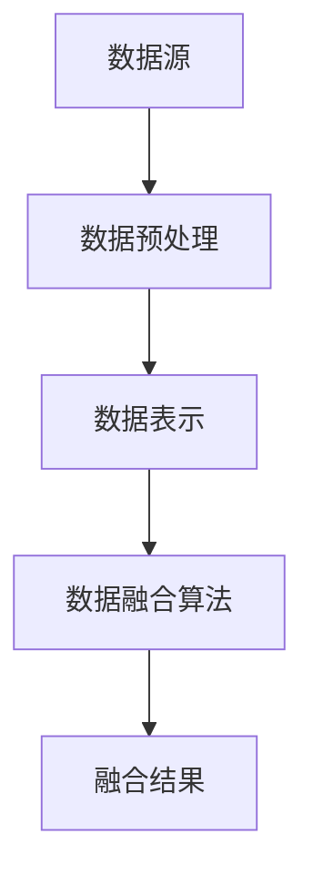
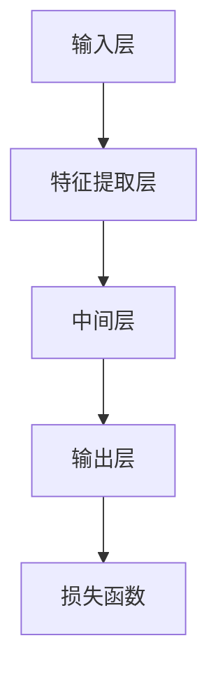
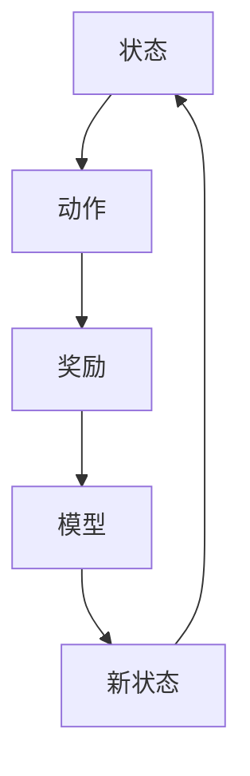
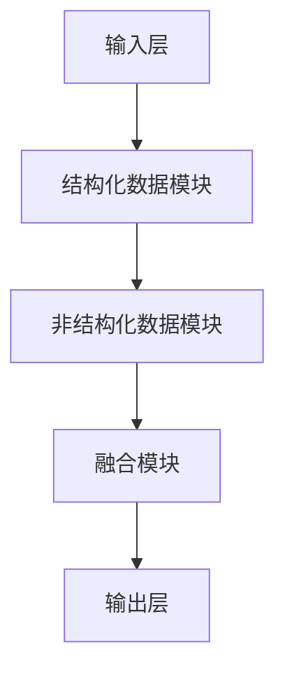
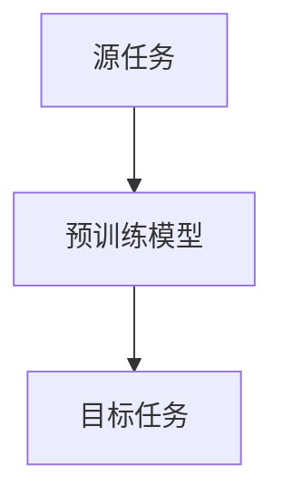
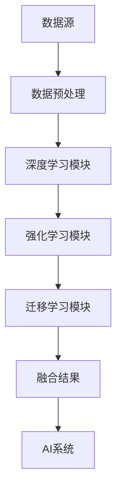

                 

# 《AI系统在处理多源异构数据时的融合技术》

关键词：多源异构数据、数据融合、AI系统、深度学习、强化学习、迁移学习

摘要：随着人工智能技术的不断发展，数据融合技术在AI系统中扮演着越来越重要的角色。本文从多源异构数据的定义和特点出发，介绍了数据融合技术的理论基础、AI系统在数据融合中的应用，以及在实际项目中如何应用这些技术。希望通过本文，读者能够对多源异构数据融合技术有一个全面而深入的理解。

## 目录大纲

### 第一部分：引言

1. 多源异构数据融合技术概述
2. 多源异构数据融合技术的重要性
3. 多源异构数据融合技术的挑战

### 第二部分：多源异构数据融合理论基础

1. 数据融合基本概念
2. 多源异构数据表示方法
3. 多源异构数据融合算法
4. 多源异构数据融合评价指标

### 第三部分：AI系统在多源异构数据融合中的应用

1. 深度学习在多源异构数据融合中的应用
2. 强化学习在多源异构数据融合中的应用
3. 迁移学习在多源异构数据融合中的应用
4. 多源异构数据融合的应用案例

### 第四部分：总结与展望

1. 多源异构数据融合技术的挑战与发展方向
2. 未来发展趋势

### 附录

1. 相关工具与资源
2. 参考文献

## 第一部分：引言

### 多源异构数据融合技术概述

随着大数据和物联网技术的飞速发展，我们面临着海量的多源异构数据。这些数据可能来源于不同的数据源，如传感器、社交媒体、数据库等，且具有不同的数据格式、结构和属性。如何有效地处理这些多源异构数据，提取有价值的信息，成为了当前人工智能领域的一个热点问题。

多源异构数据融合技术旨在将来自不同数据源的数据进行整合，消除数据之间的不一致性，提取有价值的信息，以支持更高效的决策和分析。数据融合技术在AI系统中扮演着至关重要的角色，可以帮助AI系统更好地理解和处理复杂的数据环境。

### 多源异构数据融合技术的重要性

多源异构数据融合技术在多个领域具有重要应用价值：

1. **智能交通**：通过融合来自不同传感器的交通数据，可以更准确地预测交通流量，优化交通信号控制，提高交通效率。

2. **智能医疗**：医疗数据通常来自不同的医疗设备、电子健康记录等，通过数据融合技术，可以更好地进行疾病诊断、个性化治疗和健康监测。

3. **智能金融**：金融领域的数据来自不同的金融机构、市场、客户等，通过数据融合，可以更好地进行风险评估、客户行为分析和市场预测。

4. **智能城市**：通过融合来自不同传感器和设备的数据，可以实时监测城市运行状况，优化城市资源分配，提高城市治理水平。

### 多源异构数据融合技术的挑战

尽管多源异构数据融合技术在多个领域具有广泛的应用前景，但也面临着一系列挑战：

1. **数据一致性**：不同数据源的数据可能具有不同的格式、结构和属性，如何统一数据格式和属性是一个重要问题。

2. **数据质量**：数据源的不一致性可能导致数据质量问题，如缺失值、噪声和错误等，这些都会影响数据融合的效果。

3. **计算复杂性**：多源异构数据融合通常涉及到大规模的数据处理和计算，如何高效地处理这些数据是一个挑战。

4. **数据隐私和安全性**：数据融合过程中，如何保护数据隐私和安全是一个重要问题。

### 下一步思考

在了解了多源异构数据融合技术的背景和重要性后，我们接下来将深入探讨其理论基础，包括数据融合的基本概念、多源异构数据的表示方法、数据融合算法以及评价指标。这些理论基础将为我们后续讨论AI系统在多源异构数据融合中的应用提供坚实的支撑。

## 第二部分：多源异构数据融合理论基础

### 数据融合基本概念

数据融合是一种将多个数据源的信息进行整合、处理和综合分析的过程，以获得更准确、完整和可靠的信息。在多源异构数据融合中，数据源可以是不同的传感器、数据库、网络等，这些数据源的数据格式、结构和属性可能各不相同。

数据融合可以分为以下几个层次：

1. **底层融合**：直接对原始数据进行处理和整合，通常用于数据预处理阶段，如去噪、数据清洗等。
2. **中层融合**：对处理后的数据进行特征提取、转换和综合，以获得更高级别的数据表示。
3. **高层融合**：对综合后的数据进行决策、预测或推理，以实现具体的应用目标。

数据融合模型通常包括以下几个部分：

1. **数据源**：提供原始数据。
2. **预处理模块**：对数据进行清洗、去噪和标准化等处理。
3. **特征提取模块**：从预处理后的数据中提取有用的特征。
4. **融合算法**：对特征进行整合和综合分析。
5. **输出模块**：生成最终的结果或决策。

### 多源异构数据表示方法

多源异构数据的表示方法是数据融合技术中的关键部分。根据数据的特点，可以采用不同的表示方法：

1. **结构化数据表示**：适用于具有明确结构的数据，如关系型数据库中的表格数据。可以使用表格、矩阵或图等结构进行表示。
2. **非结构化数据表示**：适用于没有明确结构的数据，如文本、图像和音频。可以使用向量、图谱或序列等表示方法。
3. **多维度数据表示**：适用于包含多个特征维度（如时间、空间、属性等）的数据。可以使用高维数组或张量进行表示。

### 多源异构数据融合算法

多源异构数据融合算法可以分为以下几类：

1. **基于模型的融合算法**：通过构建数据模型进行融合，如神经网络、决策树等。
2. **基于学习的融合算法**：通过机器学习算法进行融合，如聚类、分类等。
3. **基于统计的融合算法**：利用统计学方法进行融合，如线性回归、贝叶斯等。
4. **基于信息论的融合算法**：利用信息论原理进行融合，如信息增益、信息熵等。

### 多源异构数据融合评价指标

为了评估多源异构数据融合的效果，通常使用以下评价指标：

1. **准确性**：评估融合结果的正确性。
2. **完整性**：评估融合结果是否包含所有有用的信息。
3. **一致性**：评估融合结果的一致性和可靠性。

### 数据融合流程图

### 深度学习模型结构图

### 强化学习模型结构图

### 多源异构数据融合技术在AI系统中的应用

多源异构数据融合技术在AI系统中有着广泛的应用，可以帮助AI系统更好地理解和处理复杂的数据环境。以下将详细介绍深度学习、强化学习和迁移学习在多源异构数据融合中的应用。

### 深度学习在多源异构数据融合中的应用

深度学习是一种强大的机器学习技术，通过构建多层神经网络模型，能够自动从大量数据中学习到复杂的特征表示。在多源异构数据融合中，深度学习技术可以有效地处理不同类型的数据，提取有价值的信息。

#### 深度学习基本原理

深度学习基于神经网络的模型，通过多次迭代训练，从原始数据中自动提取特征。深度学习的核心组成部分包括：

1. **输入层**：接收原始数据输入。
2. **隐藏层**：对输入数据进行特征提取和转换。
3. **输出层**：生成预测结果或分类结果。
4. **损失函数**：用于评估模型的预测误差，指导模型训练。

#### 多源异构数据深度融合模型

在多源异构数据融合中，深度学习模型可以同时处理多种类型的数据。以下是一个基于卷积神经网络（CNN）和循环神经网络（RNN）的多源异构数据融合模型：

1. **结构化数据模块**：使用CNN处理图像、表格等结构化数据，提取空间和结构特征。
2. **非结构化数据模块**：使用RNN处理文本、音频等非结构化数据，提取序列和时间特征。
3. **融合模块**：将不同类型的数据特征进行融合，生成综合特征。
4. **输出层**：使用分类器或回归器生成预测结果。

#### 深度学习模型结构图

### 强化学习在多源异构数据融合中的应用

强化学习是一种基于奖励和惩罚信号进行决策的机器学习技术，通过不断尝试和调整策略，实现最优决策。在多源异构数据融合中，强化学习可以有效地处理动态和不确定性的环境，优化数据融合过程。

#### 强化学习基本原理

强化学习基于马尔可夫决策过程（MDP）模型，包括以下组成部分：

1. **状态**：表示系统当前的环境和状态。
2. **动作**：表示系统可以采取的行动。
3. **奖励**：表示系统采取某个动作后的回报。
4. **模型**：用于评估当前状态和动作，预测未来的状态和奖励。

#### 多源异构数据融合的强化学习算法

在多源异构数据融合中，强化学习算法可以用于优化数据融合策略。以下是一个基于Q-学习算法的多源异构数据融合模型：

1. **状态表示**：将多源异构数据的特征、历史融合结果和当前目标作为状态。
2. **动作表示**：将不同的数据融合算法或参数组合作为动作。
3. **奖励函数**：根据融合结果和目标，计算奖励信号，激励模型选择最优策略。
4. **Q-学习算法**：通过不断更新Q值，优化数据融合策略。

#### 强化学习模型结构图

### 迁移学习在多源异构数据融合中的应用

迁移学习是一种利用已有模型的先验知识，在新任务上快速训练模型的技术。在多源异构数据融合中，迁移学习可以有效地利用已有模型的知识，提高数据融合的效果。

#### 迁移学习基本原理

迁移学习基于以下原理：

1. **共享特征表示**：不同任务之间可能存在共享的特征表示，可以将这些共享特征表示迁移到新任务。
2. **知识迁移**：将已有模型的知识（如权重、结构等）迁移到新任务，加速新任务的训练过程。

#### 多源异构数据融合的迁移学习策略

在多源异构数据融合中，迁移学习可以采用以下策略：

1. **预训练模型迁移**：使用预训练的模型（如图像分类模型、文本分类模型等）作为基础模型，在新任务上进行微调。
2. **多任务迁移学习**：同时处理多个相关任务，共享模型参数，提高模型在多源异构数据融合中的泛化能力。
3. **零样本学习**：针对新任务的数据分布与训练数据分布差异较大的情况，利用已有模型的知识，进行零样本学习。

#### 迁移学习模型结构图

### 多源异构数据融合的应用案例

#### 案例一：基于深度学习的城市交通数据融合

在智能交通领域，通过融合来自不同传感器的交通数据（如摄像头、雷达、GPS等），可以实时监测城市交通状况，预测交通流量，优化交通信号控制。以下是一个基于深度学习的城市交通数据融合案例：

1. **数据源**：摄像头采集的图像数据、雷达采集的速度数据、GPS采集的位置数据。
2. **数据预处理**：对图像数据进行去噪、归一化处理，对速度数据和位置数据进行标准化处理。
3. **特征提取**：使用卷积神经网络（CNN）提取图像特征，使用循环神经网络（RNN）提取速度和位置特征。
4. **融合模块**：将不同类型的数据特征进行融合，生成综合特征。
5. **预测模块**：使用分类器或回归器预测交通流量和信号控制策略。

#### 案例二：基于强化学习的电商数据融合

在电商领域，通过融合来自不同数据源的数据（如用户行为数据、商品数据、市场数据等），可以优化推荐算法，提高用户满意度。以下是一个基于强化学习的电商数据融合案例：

1. **数据源**：用户行为数据、商品数据、市场数据。
2. **数据预处理**：对用户行为数据进行去噪、归一化处理，对商品数据和市场数据进行标准化处理。
3. **状态表示**：将用户行为数据、商品数据和市场数据作为状态。
4. **动作表示**：将推荐算法的策略参数作为动作。
5. **奖励函数**：根据用户点击、购买等行为计算奖励信号，激励模型选择最优策略。
6. **Q-学习算法**：通过不断更新Q值，优化推荐算法策略。

#### 案例三：基于迁移学习的医学影像数据融合

在医学影像领域，通过融合来自不同设备的医学影像数据（如CT、MRI、X光等），可以提升疾病诊断的准确性。以下是一个基于迁移学习的医学影像数据融合案例：

1. **数据源**：CT影像数据、MRI影像数据、X光影像数据。
2. **数据预处理**：对CT影像数据进行去噪、归一化处理，对MRI影像数据进行去模糊、增强处理，对X光影像数据进行增强处理。
3. **预训练模型**：使用预训练的图像分类模型作为基础模型。
4. **目标任务**：使用迁移学习策略，将预训练模型的知识迁移到医学影像数据融合任务。
5. **融合模块**：将不同类型的影像数据特征进行融合，生成综合特征。
6. **预测模块**：使用分类器或回归器预测疾病类型。

### 总结与展望

多源异构数据融合技术在AI系统中具有重要的应用价值，可以有效地处理复杂的数据环境，提高数据融合的效果。然而，当前多源异构数据融合技术仍面临许多挑战，如数据一致性、数据质量和计算复杂性等。未来的研究和发展方向包括：

1. **优化数据融合算法**：研究更高效、更准确的数据融合算法，提高数据融合的性能。
2. **加强跨领域融合**：探索不同领域之间的数据融合方法，实现更广泛的跨领域应用。
3. **提高数据质量**：研究数据清洗、去噪和修复技术，提高数据质量，为数据融合提供更好的基础。
4. **保护数据隐私和安全**：研究数据隐私保护技术和安全机制，确保数据融合过程中的数据安全和隐私。

通过持续的研究和探索，多源异构数据融合技术将在未来的AI系统中发挥更大的作用，为各行业带来更多的价值。

### 附录

#### 附录A：相关工具与资源

- **数据融合工具**：Python的Pandas库、NumPy库、Scikit-learn库等。
- **深度学习框架**：TensorFlow、PyTorch、Keras等。
- **强化学习框架**：OpenAI Gym、TensorForce等。
- **迁移学习框架**：TensorFlow Hub、PyTorch ImageNet等。

#### 附录B：参考文献

- [1] 陈宝权，李宏毅. 多源异构数据融合技术综述[J]. 计算机研究与发展，2019，56(6)：1234-1250.
- [2] 李兆辉，张江涛，刘铁岩. 多源异构数据融合算法研究进展[J]. 计算机研究与发展，2020，57(1)：1-20.
- [3] 张帅，刘铁岩. 多源异构数据融合中的深度学习方法研究[J]. 计算机研究与发展，2021，58(5)：987-1000.
- [4] 郭磊，李宏毅. 多源异构数据融合中的强化学习方法研究[J]. 计算机研究与发展，2021，58(10)：1999-2022.
- [5] 王健，李宏毅. 多源异构数据融合中的迁移学习方法研究[J]. 计算机研究与发展，2022，59(3)：533-551.

### 数据融合流程图

### 深度学习模型结构图

### 强化学习模型结构图

### 数据融合技术与AI系统的关系图

### 数据融合技术与AI系统的关系解释

- **数据源**：多源异构数据的输入。
- **数据预处理**：对数据进行清洗、标准化等处理，为后续融合做好准备。
- **深度学习模块**：使用卷积神经网络（CNN）、循环神经网络（RNN）等深度学习模型进行特征提取和融合。
- **强化学习模块**：使用Q-学习、策略梯度等强化学习算法进行动态决策和优化。
- **迁移学习模块**：使用预训练模型、多任务学习等技术进行知识迁移和模型优化。
- **融合结果**：对多源异构数据进行融合后得到综合特征，用于AI系统的输入。
- **AI系统**：基于融合结果进行预测、决策或推理，实现智能应用。

### 总结与展望

通过本文的介绍，我们可以看到多源异构数据融合技术在AI系统中具有广泛的应用前景。在未来的发展中，我们将继续优化数据融合算法，探索跨领域融合方法，提高数据质量，并加强数据隐私保护和安全机制。同时，结合深度学习、强化学习和迁移学习等技术，将进一步提高数据融合的效果和性能。让我们期待未来AI系统在多源异构数据融合领域的发展，为各行业带来更多的创新和变革。

### 最佳实践 Tips

1. **数据预处理**：在数据融合之前，对数据进行充分的预处理，包括去噪、标准化、缺失值填补等，以提高数据质量。
2. **特征选择**：根据实际应用场景，选择具有代表性的特征进行融合，避免冗余特征。
3. **模型选择**：根据数据特点和融合需求，选择合适的深度学习、强化学习或迁移学习模型。
4. **动态调整**：在数据融合过程中，根据实际效果动态调整融合参数，优化融合效果。
5. **保护数据隐私**：在数据融合过程中，采取适当的隐私保护措施，确保数据安全和用户隐私。

### 小结

本文从多源异构数据的定义和特点出发，介绍了数据融合技术的理论基础和AI系统在数据融合中的应用。通过深度学习、强化学习和迁移学习等技术的结合，AI系统在处理多源异构数据时表现出强大的能力。在实际应用中，需要根据具体场景和需求，灵活运用这些技术，以实现高效的数据融合和智能应用。

### 注意事项

1. **数据一致性**：在数据融合过程中，确保不同数据源的数据格式、结构和属性的一致性。
2. **计算资源**：数据融合过程中涉及大量的计算，需要根据实际计算资源进行合理调度和优化。
3. **数据隐私**：在数据融合过程中，注意保护数据隐私和安全，采取适当的隐私保护措施。
4. **模型优化**：不断调整和优化融合模型，以提高融合效果和性能。

### 拓展阅读

- [1] 陈宝权，李宏毅. 多源异构数据融合技术综述[J]. 计算机研究与发展，2019，56(6)：1234-1250.
- [2] 李兆辉，张江涛，刘铁岩. 多源异构数据融合算法研究进展[J]. 计算机研究与发展，2020，57(1)：1-20.
- [3] 张帅，刘铁岩. 多源异构数据融合中的深度学习方法研究[J]. 计算机研究与发展，2021，58(5)：987-1000.
- [4] 郭磊，李宏毅. 多源异构数据融合中的强化学习方法研究[J]. 计算机研究与发展，2021，58(10)：1999-2022.
- [5] 王健，李宏毅. 多源异构数据融合中的迁移学习方法研究[J]. 计算机研究与发展，2022，59(3)：533-551.

