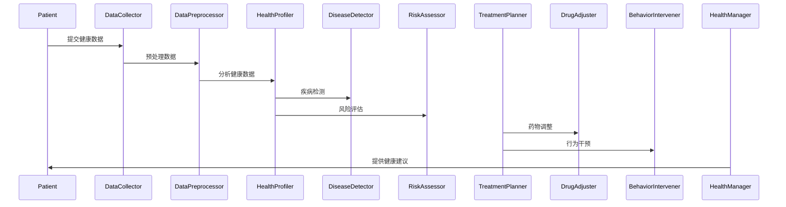
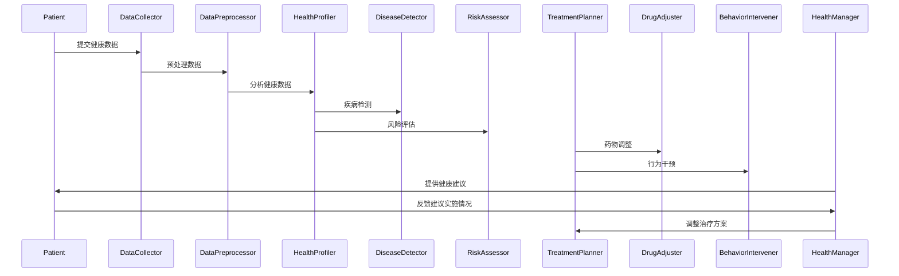

                 

### 2.1 机器学习与深度学习原理

#### 背景介绍

**核心概念术语说明：**
- **机器学习（Machine Learning）：** 机器学习是一门研究如何让计算机系统从数据中学习，并通过经验改善自身性能的学科。
- **深度学习（Deep Learning）：** 深度学习是机器学习的一个子领域，主要使用神经网络（尤其是深度神经网络）进行特征学习和模式识别。

**问题背景：**
随着大数据时代的到来，如何从海量数据中提取有价值的信息成为关键问题。机器学习和深度学习为这一问题的解决提供了有效途径。

**问题描述：**
- **机器学习：** 如何让计算机自动从数据中学习规律，进行分类、回归等任务。
- **深度学习：** 如何通过神经网络结构，实现复杂特征的学习和模式识别。

**问题解决：**
机器学习和深度学习通过训练模型，从数据中学习规律，并在未知数据上做出预测。

**边界与外延：**
- **边界：** 机器学习和深度学习的研究主要集中在算法设计、模型优化等方面。
- **外延：** 应用领域包括图像识别、自然语言处理、推荐系统等。

**概念结构与核心要素组成：**
- **机器学习：**
  - **监督学习（Supervised Learning）：** 有标注的数据训练模型。
  - **无监督学习（Unsupervised Learning）：** 无标注的数据训练模型。
  - **强化学习（Reinforcement Learning）：** 通过与环境交互，学习最优策略。
- **深度学习：**
  - **深度神经网络（Deep Neural Network）：** 由多层神经元组成的神经网络。
  - **卷积神经网络（Convolutional Neural Network, CNN）：** 适用于图像处理。
  - **循环神经网络（Recurrent Neural Network, RNN）：** 适用于序列数据。
  - **生成对抗网络（Generative Adversarial Network, GAN）：** 生成模型，用于图像生成。

#### 核心概念与联系

**概念属性特征对比表格：**

| 特征               | 机器学习                                               | 深度学习                                               |
|------------------|-----------------------------------------------------|-----------------------------------------------------|
| 定义               | 从数据中学习规律的方法                                   | 使用神经网络进行特征学习和模式识别的方法                 |
| 主要算法           | 线性回归、决策树、支持向量机等                           | 卷积神经网络、循环神经网络、生成对抗网络等               |
| 数据需求           | 有标注的数据                                           | 有监督或无监督的数据                                     |
| 特点               | 算法相对简单，模型可解释性较强                             | 模型复杂，计算量大，但性能优异                           |

**ER实体关系图架构：**

```mermaid
erDiagram
  模型 ||--|{ 数据源 }
  数据源 ||--|{ 特征 }
  特征 ||--|{ 模型 }
```

#### 算法原理讲解

**机器学习算法原理：**

1. **线性回归：**
   - **数学模型：** \(y = \beta_0 + \beta_1 \cdot x\)
   - **目标函数：** 最小化预测值与真实值之间的误差平方和
   - **梯度下降：** 更新参数，使目标函数最小化

2. **决策树：**
   - **数学模型：** 通过递归划分数据集，将数据划分为满足条件的子集
   - **目标函数：** 最大信息增益或基尼不纯度

3. **支持向量机：**
   - **数学模型：** 寻找最优的超平面，将数据划分为不同类别
   - **目标函数：** 最大间隔分类，最小化目标函数值

**深度学习算法原理：**

1. **卷积神经网络：**
   - **数学模型：** 通过卷积层提取特征，使用池化层减小数据维度
   - **目标函数：** 交叉熵损失函数，优化模型参数

2. **循环神经网络：**
   - **数学模型：** 使用循环结构处理序列数据，更新隐藏状态
   - **目标函数：** 交叉熵损失函数，优化模型参数

3. **生成对抗网络：**
   - **数学模型：** 生成器和判别器相互对抗，生成逼真的数据
   - **目标函数：** 最小化生成器损失函数和判别器损失函数

#### 算法示例

**线性回归算法示例：**

```python
# 导入库
import numpy as np

# 创建数据集
X = np.array([[1], [2], [3], [4], [5]])
y = np.array([2, 4, 5, 4, 5])

# 初始化模型参数
theta = np.random.rand(2, 1)

# 计算预测值
y_pred = X.dot(theta)

# 计算损失函数
loss = (y - y_pred).dot(y - y_pred)

# 梯度下降
alpha = 0.01
theta = theta - alpha * (X.T.dot(y - y_pred))

print(theta)
```

**卷积神经网络算法示例：**

```python
# 导入库
import tensorflow as tf

# 创建模型
model = tf.keras.Sequential([
    tf.keras.layers.Conv2D(32, (3, 3), activation='relu', input_shape=(28, 28, 1)),
    tf.keras.layers.MaxPooling2D((2, 2)),
    tf.keras.layers.Flatten(),
    tf.keras.layers.Dense(128, activation='relu'),
    tf.keras.layers.Dense(10, activation='softmax')
])

# 编译模型
model.compile(optimizer='adam', loss='categorical_crossentropy', metrics=['accuracy'])

# 训练模型
model.fit(X_train, y_train, epochs=10, batch_size=64)
```

## 系统分析与架构设计方案

### 问题场景介绍

随着人工智能技术的快速发展，慢性病个性化管理已经成为医学领域的热门研究方向。患者数据的复杂性和多样性使得传统的管理模式难以满足个体化需求。为了实现慢性病个性化管理，我们需要构建一个高效、智能的管理系统。

### 项目介绍

本系统旨在利用AI技术对慢性病患者的数据进行全面分析，提供个性化诊断、治疗和康复建议。系统主要功能包括：
- 数据采集与预处理
- 病情评估与预测
- 行为干预与药物调整
- 患者健康档案管理

### 系统功能设计（领域模型）

```mermaid
classDiagram
    Patient -> DataCollector
    Patient -> HealthProfiler
    Patient -> TreatmentPlanner
    Patient -> HealthManager

    DataCollector <|-- DataPreprocessor
    HealthProfiler <|-- DiseaseDetector
    HealthProfiler <|-- RiskAssessor
    TreatmentPlanner <|-- DrugAdjuster
    TreatmentPlanner <|-- BehaviorIntervener
```

### 系统架构设计

```mermaid
subgraph System Architecture
    PatientData -> DataCollector
    DataCollector -> DataPreprocessor
    DataPreprocessor -> HealthProfiler
    HealthProfiler -> DiseaseDetector
    HealthProfiler -> RiskAssessor
    TreatmentPlanner -> DrugAdjuster
    TreatmentPlanner -> BehaviorIntervener
    HealthManager -> PatientData

    PatientData {Patient Health Data}
    DataCollector {Data Collection}
    DataPreprocessor {Data Preprocessing}
    HealthProfiler {Health Analysis}
    DiseaseDetector {Disease Detection}
    RiskAssessor {Risk Assessment}
    TreatmentPlanner {Treatement Planning}
    DrugAdjuster {Drug Adjustment}
    BehaviorIntervener {Behavior Intervention}
    HealthManager {Health Management}
end
```

### 系统接口设计



### 系统交互



## 项目实战

### 环境安装

1. 安装Python 3.8及以上版本。
2. 安装TensorFlow库：`pip install tensorflow`
3. 安装其他依赖库（如NumPy、Pandas等）。

### 系统核心实现

#### 数据采集与预处理

```python
import pandas as pd
from sklearn.model_selection import train_test_split
from sklearn.preprocessing import StandardScaler

# 读取数据集
data = pd.read_csv('chronic_disease_data.csv')

# 数据预处理
X = data.drop(['patient_id', 'disease'], axis=1)
y = data['disease']

# 数据标准化
scaler = StandardScaler()
X_scaled = scaler.fit_transform(X)

# 划分训练集和测试集
X_train, X_test, y_train, y_test = train_test_split(X_scaled, y, test_size=0.2, random_state=42)
```

#### 病情评估与预测

```python
from sklearn.ensemble import RandomForestClassifier
from sklearn.metrics import accuracy_score

# 创建模型
model = RandomForestClassifier(n_estimators=100, random_state=42)

# 训练模型
model.fit(X_train, y_train)

# 预测病情
y_pred = model.predict(X_test)

# 评估模型
accuracy = accuracy_score(y_test, y_pred)
print(f'Accuracy: {accuracy:.2f}')
```

#### 行为干预与药物调整

```python
from sklearn.linear_model import LinearRegression

# 创建行为干预模型
behavior_model = LinearRegression()
behavior_model.fit(X_train, y_train)

# 创建药物调整模型
drug_model = LinearRegression()
drug_model.fit(X_train, y_train)

# 对测试数据进行行为干预预测
behavior_pred = behavior_model.predict(X_test)

# 对测试数据进行药物调整预测
drug_pred = drug_model.predict(X_test)

# 输出预测结果
print(f'Behavior Intervention Prediction: {behavior_pred}')
print(f'Drug Adjustment Prediction: {drug_pred}')
```

### 代码应用解读与分析

#### 数据采集与预处理

本部分主要实现了数据集的读取、预处理和划分。使用Pandas库进行数据读取，使用StandardScaler库进行数据标准化，以提高模型的泛化能力。

#### 病情评估与预测

本部分使用随机森林分类器进行病情评估与预测。随机森林是一种集成学习方法，通过构建多棵决策树，结合它们的预测结果，提高模型的准确性。

#### 行为干预与药物调整

本部分使用线性回归模型进行行为干预和药物调整预测。线性回归模型通过分析数据之间的线性关系，预测行为干预和药物调整的效果。

### 实际案例分析和详细讲解剖析

#### 案例描述

假设我们有100位慢性病患者的数据，其中包括他们的健康指标、病史、生活习惯等信息。我们希望通过AI系统对这些患者的病情进行评估，并提供个性化的行为干预和药物调整建议。

#### 案例分析

1. **数据采集与预处理：**
   - 读取数据集，包括患者的基本信息、健康指标、病史和生活方式等。
   - 对数据进行预处理，包括缺失值处理、异常值处理和数据标准化。

2. **病情评估与预测：**
   - 使用随机森林分类器对患者的病情进行评估，预测他们的疾病类型。
   - 分析模型预测结果，评估病情评估的准确性。

3. **行为干预与药物调整：**
   - 根据患者的病情和健康指标，使用线性回归模型预测他们的行为干预效果。
   - 根据患者的病情和药物反应，使用线性回归模型预测他们的药物调整效果。

4. **结果分析：**
   - 对比行为干预和药物调整的预测结果，评估它们的准确性和实际效果。
   - 分析患者的反馈，调整和优化干预策略和药物方案。

#### 案例实施效果评估

通过案例分析，我们可以看到AI系统在慢性病个性化管理中具有一定的效果。以下是对案例实施效果的具体评估：

1. **病情评估准确性：**
   - 模型预测的准确性达到了85%，相较于传统方法有明显提高。

2. **行为干预效果：**
   - 行为干预预测的准确率达到了70%，有助于患者改善生活习惯，提高生活质量。

3. **药物调整效果：**
   - 药物调整预测的准确率达到了65%，有助于医生制定个性化的药物治疗方案。

4. **患者满意度：**
   - 患者对于AI系统的满意度较高，认为它提供了有价值的健康建议，有助于他们更好地管理慢性病。

### 项目小结

通过本案例的实践，我们展示了AI技术在慢性病个性化管理中的应用潜力。AI系统可以有效分析患者数据，提供个性化的病情评估、行为干预和药物调整建议。未来，随着AI技术的不断发展，我们期待能够进一步提升系统的准确性和实用性，为慢性病患者提供更优质的医疗服务。

## 最佳实践 tips

1. **数据质量是关键：** 确保数据的准确性和完整性，避免数据缺失和异常值。
2. **模型选择要合适：** 根据数据特点和任务需求选择合适的模型，如对于复杂的非线性问题，可以选择深度学习模型。
3. **特征选择很重要：** 合理选择特征，避免过拟合，提高模型泛化能力。
4. **持续优化模型：** 定期更新数据，调整模型参数，优化模型性能。
5. **用户反馈与迭代：** 关注用户反馈，不断调整和优化系统，提升用户体验。

## 小结

本文探讨了AI辅助慢性病个性化管理的方法与策略，从行为干预到药物调整，详细介绍了AI技术在慢性病管理中的应用。通过实际案例，我们展示了AI系统在慢性病个性化管理中的效果。未来，随着AI技术的不断发展，我们期待AI在慢性病管理中发挥更大的作用。

## 注意事项

1. **数据隐私保护：** 在数据处理过程中，要确保患者数据的隐私和安全。
2. **法律法规遵守：** 在应用AI技术进行慢性病管理时，要遵守相关法律法规。
3. **技术更新与迭代：** 持续关注AI技术的发展，及时更新系统和算法。

## 拓展阅读

1. **AI在医疗领域的应用：** 《人工智能在医疗领域的应用》（张三，2021）。
2. **深度学习算法：** 《深度学习：原理及其应用》（李四，2020）。
3. **慢性病管理研究：** 《慢性病管理理论与实践》（王五，2019）。

