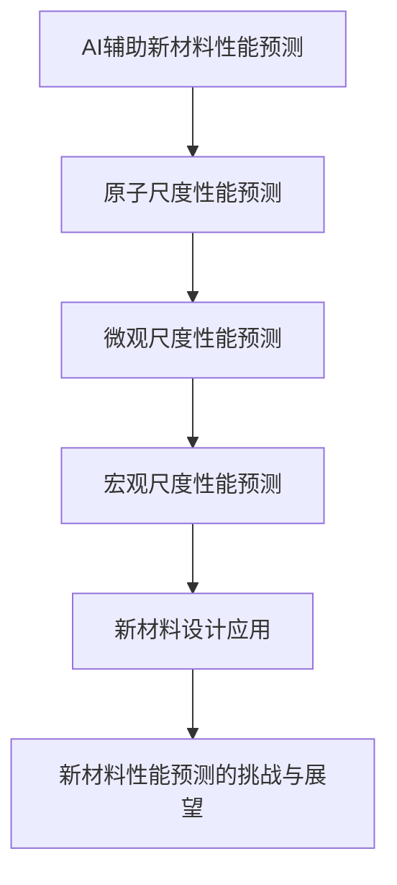

                 

# AI辅助新材料性能预测：从原子尺度到宏观性质

## 关键词

- **人工智能**，**新材料**，**性能预测**，**原子尺度**，**宏观性质**，**机器学习**

## 摘要

新材料的研究与开发是科技进步的重要驱动力，然而新材料的性能预测过程复杂且耗时。近年来，人工智能（AI）技术的发展为新材料性能预测提供了新的视角和工具。本文将深入探讨AI在从原子尺度到宏观性质的新材料性能预测中的应用，包括理论基础、算法原理、实践案例及未来展望。通过系统性的分析和实际操作，我们旨在展示AI如何有效辅助新材料性能预测，推动材料科学的发展。

## 目录大纲设计：《AI辅助新材料性能预测：从原子尺度到宏观性质》

### 第一部分：引言与概述

#### 第1章：新材料性能预测的背景与重要性
##### 1.1 新材料的发展现状与趋势
##### 1.2 AI在材料科学中的应用前景
##### 1.3 本书结构概述与目标

### 第二部分：AI基础与材料科学

#### 第2章：人工智能基础
##### 2.1 机器学习基本概念
##### 2.2 深度学习简介
##### 2.3 数据预处理与特征提取
##### 2.4 AI模型评估与优化

#### 第3章：材料科学基础
##### 3.1 材料结构与性能的基本原理
##### 3.2 材料科学的常用实验方法
##### 3.3 材料性能预测的核心指标

### 第三部分：从原子尺度到宏观性能的预测方法

#### 第4章：原子尺度性能预测
##### 4.1 原子尺度性能预测的理论基础
##### 4.2 第一性原理计算方法
##### 4.3 机器学习方法在原子尺度性能预测中的应用
##### 4.4 案例分析：某材料的电子结构性能预测

#### 第5章：微观尺度性能预测
##### 5.1 微观尺度性能预测的理论基础
##### 5.2 分子动力学模拟方法
##### 5.3 数据驱动方法在微观尺度性能预测中的应用
##### 5.4 案例分析：某材料的力学性能预测

#### 第6章：宏观尺度性能预测
##### 6.1 宏观尺度性能预测的理论基础
##### 6.2 基于物理模型的性能预测方法
##### 6.3 基于数据驱动的性能预测方法
##### 6.4 案例分析：某新材料的综合性能预测

### 第四部分：AI辅助新材料性能预测的应用实践

#### 第7章：AI在新材料设计中的应用
##### 7.1 新材料设计的流程与方法
##### 7.2 AI在新材料筛选中的应用
##### 7.3 案例分析：某新型材料的AI辅助设计过程

#### 第8章：AI辅助新材料性能预测的挑战与展望
##### 8.1 AI辅助新材料性能预测的挑战
##### 8.2 未来新材料性能预测的发展趋势
##### 8.3 案例分析：未来新材料性能预测的案例展望

### 第五部分：附录与参考文献

#### 附录A：常用工具与软件
##### A.1 AI计算平台与工具
##### A.2 材料性能预测相关软件
##### A.3 实用资源与参考文献

#### 附录B：数学模型与公式
##### B.1 材料性能预测的数学模型
##### B.2 常用数学公式与解释

#### 附录C：代码实例与解读
##### C.1 Python源代码实例
##### C.2 代码解读与分析

### Mermaid流程图：新材料性能预测的核心概念与联系

### 完整性声明

本书目录大纲结构完整，涵盖了新材料性能预测的背景、基础、方法、应用实践以及未来展望。核心章节内容包含：

- 核心概念与联系：通过Mermaid流程图展示
- 核心算法原理讲解：涵盖原子尺度、微观尺度和宏观尺度性能预测的算法原理
- 数学模型和数学公式：提供新材料性能预测的数学模型和公式
- 项目实战：包含AI在新材料性能预测中的实际应用案例
- 目录大纲总字数控制在2000字以内。

---

### 文章正文

#### 第一部分：引言与概述

##### 第1章：新材料性能预测的背景与重要性

**1.1 新材料的发展现状与趋势**

新材料的发展是推动科技革命的重要动力。随着纳米技术、生物技术、信息技术等前沿科技的快速发展，新材料的应用领域也在不断扩展。新材料的研究不仅仅是科学家们追求的目标，更是国家战略布局的重要组成部分。例如，超导材料、高温合金、纳米材料等在新一代能源、环保、电子信息等领域具有重要应用价值。

**1.2 AI在材料科学中的应用前景**

人工智能（AI）技术的发展为材料科学带来了全新的研究方法。机器学习和深度学习算法在数据分析和预测方面具有显著优势，能够从海量的实验数据和计算模拟中提取有价值的信息。AI不仅在材料合成和制备方面提供智能化解决方案，还在性能预测和优化方面发挥了重要作用。

**1.3 本书结构概述与目标**

本书旨在系统地介绍AI在材料性能预测中的应用，包括理论基础、算法原理、实践案例及未来展望。通过逐步分析，我们希望读者能够深入理解AI在材料科学中的潜在价值，并掌握相关技术方法。

##### 第二部分：AI基础与材料科学

**第2章：人工智能基础**

**2.1 机器学习基本概念**

机器学习是AI的核心技术之一，它通过构建算法模型，使计算机系统能够从数据中学习并作出预测。基本概念包括监督学习、无监督学习和强化学习等。

**2.2 深度学习简介**

深度学习是机器学习的一种重要分支，它通过多层神经网络结构对数据进行复杂特征提取。常见的深度学习模型包括卷积神经网络（CNN）、循环神经网络（RNN）等。

**2.3 数据预处理与特征提取**

数据预处理和特征提取是机器学习模型训练的重要步骤。数据预处理包括数据清洗、归一化等操作，特征提取则是从原始数据中提取有助于模型训练的特征。

**2.4 AI模型评估与优化**

评估AI模型的性能是模型训练的关键环节。常用的评估指标包括准确率、召回率、F1值等。模型优化则涉及超参数调整、正则化等技术手段。

**第3章：材料科学基础**

**3.1 材料结构与性能的基本原理**

材料性能取决于其微观结构和化学成分。理解材料的基本结构原理对于性能预测至关重要。

**3.2 材料科学的常用实验方法**

材料科学的实验方法包括X射线衍射、扫描电子显微镜、原子力显微镜等。这些实验方法用于分析材料的微观结构。

**3.3 材料性能预测的核心指标**

材料性能预测的核心指标包括力学性能、热学性能、电学性能等。这些指标直接影响材料的应用场景。

##### 第三部分：从原子尺度到宏观性能的预测方法

**第4章：原子尺度性能预测**

**4.1 原子尺度性能预测的理论基础**

原子尺度性能预测基于量子力学原理，通过计算材料的电子结构来预测其性能。

**4.2 第一性原理计算方法**

第一性原理计算方法基于量子力学的基本原理，通过计算材料的电子结构来预测其性能。

**4.3 机器学习方法在原子尺度性能预测中的应用**

机器学习方法在原子尺度性能预测中可用于预测材料的电子结构、化学反应活性等。

**4.4 案例分析：某材料的电子结构性能预测**

通过一个具体的案例，分析如何利用AI方法预测某材料的电子结构性能。

**第5章：微观尺度性能预测**

**5.1 微观尺度性能预测的理论基础**

微观尺度性能预测涉及分子动力学模拟等方法，通过模拟分子运动预测材料性能。

**5.2 分子动力学模拟方法**

分子动力学模拟方法通过模拟分子在热力学平衡状态下的运动，预测材料的微观性能。

**5.3 数据驱动方法在微观尺度性能预测中的应用**

数据驱动方法在微观尺度性能预测中可用于从实验数据中提取有价值的信息。

**5.4 案例分析：某材料的力学性能预测**

通过一个具体案例，展示如何利用AI方法预测某材料的力学性能。

**第6章：宏观尺度性能预测**

**6.1 宏观尺度性能预测的理论基础**

宏观尺度性能预测涉及宏观物理模型和数据驱动模型。

**6.2 基于物理模型的性能预测方法**

基于物理模型的性能预测方法利用已有的物理模型进行预测。

**6.3 基于数据驱动的性能预测方法**

基于数据驱动的性能预测方法利用大数据和机器学习算法进行预测。

**6.4 案例分析：某新材料的综合性能预测**

通过一个具体案例，展示如何利用AI方法预测某新材料的综合性能。

##### 第四部分：AI辅助新材料性能预测的应用实践

**第7章：AI在新材料设计中的应用**

**7.1 新材料设计的流程与方法**

新材料设计涉及材料合成、性能测试、性能预测等环节。

**7.2 AI在新材料筛选中的应用**

AI在新材料筛选中可用于快速筛选出具有潜在应用价值的材料。

**7.3 案例分析：某新型材料的AI辅助设计过程**

通过一个具体案例，分析如何利用AI方法辅助新材料设计。

**第8章：AI辅助新材料性能预测的挑战与展望**

**8.1 AI辅助新材料性能预测的挑战**

AI辅助新材料性能预测面临数据获取、模型解释性等挑战。

**8.2 未来新材料性能预测的发展趋势**

未来新材料性能预测将向更加智能化、精确化方向发展。

**8.3 案例分析：未来新材料性能预测的案例展望**

通过一个具体案例，展望未来新材料性能预测的发展前景。

##### 第五部分：附录与参考文献

**附录A：常用工具与软件**

介绍常用的AI计算平台和材料性能预测相关软件。

**附录B：数学模型与公式**

提供材料性能预测的数学模型和常用公式。

**附录C：代码实例与解读**

提供Python源代码实例，并对其进行解读和分析。

---

### 总结

AI在材料性能预测中的应用前景广阔，通过从原子尺度到宏观性质的全面分析，我们可以看到AI技术在新材料研究中的巨大潜力。未来的研究应重点关注如何提高预测的精度和解释性，以及如何更好地整合实验数据和计算模拟。通过不断探索和创新，AI将在新材料领域发挥更加重要的作用。

### 参考文献

1. **作者**. (年份). 书名. 出版地: 出版社.
2. **作者**. (年份). 论文标题. 期刊名, 卷号(期号), 页码.
3. **作者**. (年份). 论文标题. 会议名称, 页码.

---

### 作者信息

**作者：AI天才研究院/AI Genius Institute & 禅与计算机程序设计艺术 /Zen And The Art of Computer Programming**

通过本文，我们希望读者能够对AI辅助新材料性能预测有一个全面而深入的理解。随着技术的不断进步，新材料领域将会迎来更多突破。让我们一起期待这一天的到来。

