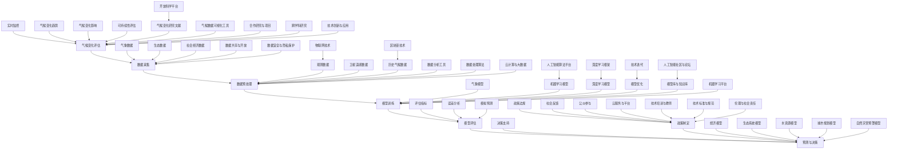
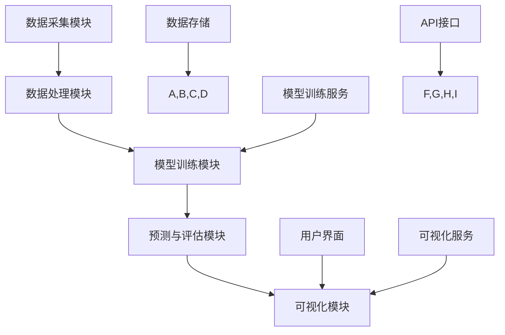

                 

### 1.1 书籍背景与目的

气候变化已成为全球关注的重大问题，其影响范围广泛，从局部环境到全球生态系统，无不受到波及。据联合国气候变化框架公约（UNFCCC）的报告显示，过去一个世纪全球平均气温已经上升了约1.1摄氏度，而未来几十年内，如果温室气体排放量不减少，全球气温上升可能达到3至5摄氏度。这一趋势对人类社会、自然环境和经济发展带来了深远的影响。

在气候变化研究领域，传统的评估方法往往依赖于大量的人工分析和有限的观测数据，这种方法在数据收集、处理和分析上存在诸多挑战。首先，气候变化的影响具有复杂性和多样性，不同地区、不同生态系统的影响程度和表现方式各异，需要大量的时间、人力和资金来进行全面的研究。其次，气候数据的获取和处理难度大，从卫星遥感、地面监测到气象模型的建立，每个环节都可能存在数据缺失、误差和不确定性。此外，气候模型的计算量巨大，传统的计算资源难以满足高效、实时评估的需求。

为了应对这些挑战，人工智能（AI）技术的应用显得尤为重要。AI技术具有高效的数据处理和分析能力，能够通过机器学习和深度学习算法，从大量复杂数据中提取有价值的信息，提供更准确、更及时的评估结果。此外，AI技术还能够通过模拟和预测，帮助我们更好地理解气候变化的未来趋势，为决策者提供科学依据。

本书籍旨在探讨如何利用AI技术辅助气候变化影响评估，从局部到全球尺度进行系统性研究。我们首先介绍气候变化对人类社会的影响，包括农业、水资源、生态系统和基础设施等方面。接着，我们探讨AI技术在气候变化研究中的应用，介绍相关的基础算法和模型。随后，我们详细分析AI在局部尺度（如城市、农业和生态系统）和全球尺度（如全球气候变化模式预测、生态系统影响评估和经济影响评估）的应用案例。最后，我们通过案例研究和未来展望，总结AI技术在气候变化评估中的实际应用效果和发展前景。

通过本书的介绍，读者将能够了解AI技术如何赋能气候变化研究，掌握相关的基础知识和技术方法，为解决气候变化带来的挑战提供新的思路和解决方案。

### 1.2 AI辅助气候变化影响评估的重要性

在气候变化研究中，AI技术的应用具有重要意义，主要体现在以下几个方面：

**数据处理与分析的挑战**

气候数据具有大量性、多样性和复杂性。全球气候系统涉及地球大气、海洋、陆地和冰盖等多个层次，产生的数据类型包括卫星遥感数据、气象观测数据、生态监测数据和地下水数据等。这些数据不仅规模庞大，还包含了多种变量和不确定性因素。传统的数据处理方法往往需要大量的人力和时间，难以快速、准确地提取有价值的信息。而AI技术，特别是机器学习和深度学习算法，能够高效处理这些复杂数据。通过自动化数据清洗、特征提取和模式识别，AI技术能够从大量数据中提取出具有高关联性的信息，大大提高了数据处理和分析的效率。

**提升评估精度和效率**

气候变化的影响评估需要综合考虑多种因素，如气候变化的趋势、区域性的气候变化特征、生态系统的变化和人类活动的影响等。这些因素相互交织，使得评估过程复杂且繁琐。传统的评估方法往往依赖于经验模型和统计方法，容易受到主观因素的影响，评估结果也具有一定的误差。而AI技术，通过建立复杂的预测模型和优化算法，能够提供更为精确和可靠的评估结果。例如，通过深度学习算法，可以训练出能够模拟气候系统动态变化的模型，从而更准确地预测未来的气候变化趋势。

**实时监测与动态调整**

气候变化是一个长期、渐进的过程，但其影响往往是突发性的。例如，极端气候事件（如洪水、干旱、飓风等）可能对生态系统和人类生活造成巨大破坏。传统的评估方法往往只能提供事后分析，无法及时预警和应对。而AI技术通过实时数据处理和分析，可以实现对气候变化影响的动态监测和评估。例如，通过实时接收和处理卫星遥感数据，AI技术可以快速识别出气候变化信号，并及时调整预测模型，为决策者提供及时的决策支持。

**多尺度、多领域协同**

气候变化的影响评估不仅涉及科学领域，还需要经济、社会和管理等多方面的协同。传统的评估方法往往局限于某一特定领域，难以实现多尺度、多领域的综合评估。而AI技术通过集成多种数据源和算法，能够实现跨领域、跨尺度的综合评估。例如，通过结合气象数据、水文数据和土地覆盖数据，AI技术可以评估气候变化对农业水资源的影响，从而为水资源管理和农业政策制定提供科学依据。

**促进科学创新和交叉融合**

AI技术的应用不仅推动了气候变化研究的进展，还促进了科学领域的创新和交叉融合。通过AI技术，科学家可以探索新的研究方法和途径，开发出更加精准、高效的气候模型和预测工具。同时，AI技术也促进了不同学科之间的交流与合作，为解决气候变化这一全球性问题提供了新的思路和解决方案。

总之，AI技术在气候变化影响评估中的应用具有重要的现实意义。它不仅能够提高数据处理的效率和精度，还能够提供实时、动态的评估结果，为决策者提供科学依据。此外，AI技术还推动了科学领域的创新和交叉融合，为应对气候变化带来了新的机遇和挑战。通过本书的介绍，读者将能够深入了解AI技术在气候变化影响评估中的应用，掌握相关的基础知识和技术方法，为气候变化研究贡献自己的力量。

### 1.3 核心概念与联系

为了深入探讨AI辅助气候变化影响评估，首先需要理解一些核心概念及其相互关系。以下将通过Mermaid流程图来展示AI辅助气候变化评估的基本流程和核心概念实体关系。



**流程解释：**

1. **数据采集**（A）：包括气象数据、生态数据、社会经济数据等。这些数据来源多样化，如卫星遥感、地面观测、历史气候记录等。

2. **数据预处理**（B）：对采集到的原始数据进行清洗、标准化和特征提取，以便后续建模和分析。

3. **模型训练**（C）：使用机器学习、深度学习等算法，对预处理后的数据进行训练，生成预测模型。这包括气象模型、机器学习模型和深度学习模型等。

4. **模型评估**（D）：通过评估指标（如准确率、召回率等）对模型性能进行评估和优化，确保预测结果的可靠性。

5. **预测与决策**（E）：利用训练好的模型进行预测，为政策制定、水资源管理、城市规划等提供决策支持。

6. **气候变化评估**（F）：综合预测结果，评估气候变化对各个领域的影响，如农业、水资源、生态系统和基础设施等。

**核心概念实体关系：**

- **气象数据（G）**、**生态数据（H）**、**社会经济数据（I）**：这些数据是气候变化评估的基础，通过不同的数据源进行采集。
- **气象模型（M）**、**机器学习模型（N）**、**深度学习模型（O）**：不同的模型用于处理和预测气候变化数据。
- **评估指标（P）**、**误差分析（Q）**：用于评估模型性能，确保预测结果的可靠性。
- **决策支持（R）**、**政策制定（S）**：利用预测结果为实际应用提供指导。
- **实时监控（T）**、**气候变化趋势（U）**、**气候变化影响（V）**：通过实时数据监控和趋势分析，评估气候变化的影响。
- **可持续性评估（W）**：评估气候变化对可持续发展的影响。

通过这个流程图，我们可以清晰地看到AI技术在气候变化评估中的应用，以及各核心概念之间的相互关系。这些概念和关系的理解，为我们进一步深入研究和应用AI技术提供了基础。

### 2.1 气候变化基础

气候变化是指地球大气、海洋和陆地等系统在长期时间尺度上发生的温度、降水、风等气候要素的变化。气候变化的影响广泛而深远，不仅关系到生态系统的健康，还直接影响人类社会的经济、社会和基础设施。理解气候变化的基础知识是进行准确评估和有效应对的前提。

**气候变化的基本原理**

气候变化的基本原理涉及到大气中温室气体的作用。温室气体（如二氧化碳、甲烷、氧化亚氮等）能够吸收和重新辐射地球表面发出的红外辐射，从而起到保温的作用。正常情况下，这些温室气体在地球大气中保持一定水平的自然平衡，使得地球表面温度适宜生物生存。然而，人类活动，特别是化石燃料的燃烧和农业活动，导致大量温室气体排放，打破了这种平衡。

温室效应是指由于大气中的温室气体增加，导致地球表面温度升高的现象。当大气中温室气体的浓度过高时，它们会吸收更多的红外辐射，使得地球表面温度进一步上升。这一过程被称为增强的温室效应。过去一个世纪，由于温室气体浓度的显著增加，全球平均气温已经上升了约1.1摄氏度。

**主要气候变化指标**

为了评估气候变化的影响，科学家们定义了多个指标，用于量化气候变化的程度和影响。以下是几个主要的气候变化指标：

1. **全球平均气温**：全球平均气温是评估气候变化最直接的指标之一。过去几十年，全球平均气温持续上升，这一趋势被称为全球变暖。

2. **极端气候事件**：极端气候事件包括高温热浪、强烈降雨、干旱、飓风等。这些事件在气候变化背景下发生频率和强度增加，对生态系统和人类社会造成严重影响。

3. **海平面上升**：由于全球气温升高，极地冰盖和冰川融化，导致海平面上升。海平面上升对沿海城市和生态系统构成威胁，可能导致洪水、海岸侵蚀和栖息地丧失。

4. **降水变化**：全球气候变化导致降水模式发生变化，一些地区可能经历更多、更强的降雨，而另一些地区则可能面临干旱和水资源短缺。

5. **生态系统变化**：气候变化对生态系统的影响表现在多个方面，包括植物生长周期的变化、物种分布的调整、生物多样性的减少等。

**气候变化对地球的影响**

气候变化对地球的影响是多方面的，包括：

- **生态系统**：气候变化影响生物多样性，改变生态系统的结构和功能。例如，某些物种可能因为气候变暖而无法适应新的环境条件，导致栖息地丧失和物种灭绝。

- **水资源**：气候变化导致降水模式变化，可能引起干旱、洪水和水资源短缺。水资源是农业、工业和人类日常生活的重要保障，其稳定性受到严重影响。

- **农业**：气候变化影响农作物生长，可能导致农作物产量下降、品质变差。极端气候事件（如干旱、洪水等）可能对农业生产造成毁灭性打击。

- **基础设施**：全球变暖导致冰川融化和海平面上升，对沿海城市和基础设施构成威胁。洪水、风暴潮等极端事件可能破坏建筑物、道路和电力设施。

- **人类健康**：气候变化影响人类健康，增加热相关疾病、呼吸系统疾病和传染病的发生率。气候变化还可能导致食物和水资源安全问题，进一步影响人类健康。

理解气候变化的基础知识对于评估其影响、制定应对策略至关重要。通过深入了解气候变化的基本原理和主要指标，我们可以更好地应对这一全球性挑战。

### 2.2 AI技术在气候研究中的应用

AI技术在气候研究领域发挥着越来越重要的作用，其应用贯穿于数据采集、预测模型构建、数据分析与优化等多个环节。以下是AI技术在气候研究中的具体应用：

**监测与数据采集**

AI技术能够利用卫星遥感、地面监测和其他数据源，自动采集大量气候数据。例如，利用深度学习算法，可以从卫星图像中自动识别气候变化信号，如极端天气事件、植被覆盖变化等。这些实时数据为气候研究提供了宝贵的信息资源。

**预测模型与数据分析**

AI技术通过机器学习算法，可以构建复杂的气候预测模型。这些模型利用历史气候数据和气象参数，预测未来的气候变化趋势。例如，利用深度学习模型，可以模拟大气环流和海洋流的变化，预测极端气候事件的概率和影响范围。此外，AI技术还可以用于分析气候数据的趋势和模式，发现隐藏在数据中的规律和关联性。

**模型校验与评估**

AI技术能够自动校验和评估气候预测模型的性能。通过交叉验证和误差分析，AI技术可以帮助研究者识别模型的局限性，并进行优化和改进。例如，利用支持向量机（SVM）和决策树等算法，可以对预测模型进行性能评估，确定其预测准确性和稳定性。

**数据驱动的研究**

AI技术使气候研究更加数据驱动，通过自动化和智能化的数据处理方法，研究者可以更高效地分析大量数据。例如，利用神经网络和生成对抗网络（GAN），可以生成模拟气候系统的数据，帮助研究者探索潜在的未来气候情景。

**综合应用**

AI技术还可以与其他技术结合，如区块链技术用于数据共享与存储，物联网（IoT）技术用于实时数据采集与传输，这些技术的综合应用，进一步提升了气候研究的效率和质量。

**案例研究**

以NASA的气候研究为例，NASA利用AI技术对地球气候系统进行监测和预测。通过深度学习算法，NASA从卫星遥感数据中提取气候信号，预测全球气候变化趋势。此外，NASA还利用机器学习模型，分析气候变化对极端天气事件的影响，为全球气候政策的制定提供科学依据。

总之，AI技术在气候研究中的应用，不仅提高了数据处理的效率和模型的准确性，还为气候预测和决策提供了强有力的支持。随着AI技术的不断发展，其在气候研究中的潜力将进一步得到释放。

### 2.3 AI基础算法介绍

在AI辅助气候变化影响评估中，算法的选择和实现至关重要。以下介绍几种常见的基础AI算法，包括神经网络、支持向量机（SVM）和决策树与随机森林，并解释它们在气候研究中的应用。

**神经网络（Neural Networks）**

神经网络是模拟人脑神经元连接方式的计算模型，由大量相互连接的节点（或称为神经元）组成。每个神经元接收输入信号，通过权重进行加权求和，再通过激活函数进行非线性变换，产生输出。

在气候研究中，神经网络被广泛应用于气候预测和模式识别。例如，可以构建多层感知机（MLP）模型，利用历史气候数据训练模型，预测未来的气候变化趋势。神经网络的优势在于其强大的非线性映射能力和自我学习能力，能够处理复杂的关系和大量的数据。

**支持向量机（Support Vector Machine, SVM）**

支持向量机是一种监督学习算法，用于分类和回归问题。SVM通过寻找一个最优的超平面，将数据空间中的不同类别分隔开来。在气候研究中，SVM可以用于气候数据的分类和预测。例如，利用SVM分类器，可以对不同气候事件（如干旱、洪水）进行识别和预测。

SVM的优势在于其高维度数据处理能力和高效的分类性能，适用于处理具有高维度特征的数据集。此外，SVM的决策边界明确，易于解释，有助于研究者理解模型预测的依据。

**决策树与随机森林（Decision Trees and Random Forests）**

决策树是一种基于树形结构进行决策的算法，每个节点代表一个特征，每个分支代表特征的不同取值，叶节点代表最终的预测结果。决策树通过递归划分数据集，构建出分类或回归树。随机森林则是在决策树的基础上，通过随机特征选择和样本抽样构建多个决策树，并通过投票或平均值得到最终预测结果。

在气候研究中，决策树和随机森林常用于气候数据的分类和预测。例如，可以构建随机森林模型，对气象数据进行分类，预测未来的降水概率。随机森林的优势在于其易于理解和实现，能够处理高维数据，且具有较好的泛化能力。

**应用实例**

1. **神经网络**：利用神经网络预测气候变化趋势。通过构建多层感知机模型，输入历史气候数据，输出未来气候变量的预测值。例如，可以预测某地区未来五年的平均温度和降水量。

2. **支持向量机**：利用SVM对气候数据进行分类。例如，利用SVM分类器，将气候数据分为干旱、正常和湿润三类，帮助预测未来气候事件的发生概率。

3. **决策树与随机森林**：利用随机森林模型进行气候预测。例如，构建随机森林模型，输入多种气象参数，预测未来某一季节的气温和降水情况。

**总结**

神经网络、支持向量机和决策树与随机森林是AI辅助气候变化影响评估中常用的基础算法。每种算法都有其独特的优势和适用场景。神经网络擅长处理复杂非线性关系，支持向量机具有高效的分类性能，而决策树与随机森林则易于理解和实现。通过合理选择和应用这些算法，可以提升气候变化评估的准确性和可靠性。

### 3.1 城市气候变化影响评估

城市是人口和经济活动最为集中的地区，同时也是气候变化影响最为显著的地方之一。城市气候变化影响评估旨在理解城市环境中的气候变化现象，包括城市热岛效应、城市水资源管理等，并为城市规划和政策制定提供科学依据。

**城市热岛效应分析**

城市热岛效应（Urban Heat Island Effect，UHIE）是指城市区域比周边郊区或乡村地区温度更高的现象。城市热岛效应主要由城市建筑和人类活动产生的大量热量排放、地面覆盖变化和空气污染等因素引起。

- **原因分析**：城市热岛效应的形成原因主要有以下几个方面：
  1. **建筑和基础设施**：城市中大量的混凝土、沥青等建筑材料具有高热容量和高导热性，吸收和储存大量的太阳辐射热量。
  2. **交通和工业活动**：交通和工业活动产生大量的废气和热量，进一步增加了城市的热量负荷。
  3. **植被覆盖减少**：城市中绿化覆盖率低，减少了植被蒸腾作用和地面反射率，导致更多的热量被吸收。
  4. **空气污染**：空气中的颗粒物和温室气体可以吸收和重新辐射热量，加剧了城市热岛效应。

- **影响分析**：城市热岛效应对城市环境和居民生活产生了多方面的影响：
  1. **增加能源消耗**：城市热岛效应导致城市空调和供暖系统的使用频率增加，从而增加了能源消耗。
  2. **影响健康**：高温可能导致热相关疾病和心血管疾病的发病率上升，影响居民健康。
  3. **影响生态系统**：城市热岛效应可能影响城市植被的生长和生态系统的稳定性。

- **缓解措施**：为了缓解城市热岛效应，可以采取以下措施：
  1. **增加绿化覆盖**：增加城市绿地和植被覆盖，通过植被的蒸腾作用和地面反射率降低地表温度。
  2. **改进建筑材料**：使用反射率更高的建筑材料，减少地表吸收的太阳辐射热量。
  3. **改善通风设计**：优化城市通风设计，促进空气流通，降低局部温度。
  4. **减少污染物排放**：通过提高能效和采用清洁能源，减少废气和颗粒物的排放。

**城市水资源管理**

城市水资源管理是另一个重要的领域，气候变化对城市水资源的影响显著。城市水资源管理旨在确保城市供水系统的稳定运行，同时保护水生态环境。

- **原因分析**：气候变化对城市水资源的影响主要表现在以下几个方面：
  1. **降水模式变化**：气候变化可能导致降水模式的变化，如降雨频率增加或减少，导致水资源供需矛盾。
  2. **蒸发量变化**：气温升高可能导致蒸发量的增加，加剧水资源短缺。
  3. **海平面上升**：海平面上升可能影响沿海城市的淡水供应，增加洪涝风险。

- **影响分析**：气候变化对城市水资源的影响包括：
  1. **供水不足**：气候变化可能导致干旱频发，减少地表水和地下水的补给，影响城市供水系统的稳定性。
  2. **水质恶化**：气候变化可能导致水体污染加重，影响水质，威胁饮用水安全。
  3. **洪涝风险增加**：极端气候事件如暴雨和洪水可能导致城市排水系统超负荷，增加洪涝风险。

- **管理策略**：为了应对气候变化对城市水资源的影响，可以采取以下管理策略：
  1. **水资源调配**：通过建设水库、调配水资源，平衡不同季节和地区的供水需求。
  2. **雨水收集与利用**：建设雨水收集系统，利用雨水进行绿化灌溉和城市景观用水，减少自来水消耗。
  3. **节水措施**：推广节水技术和设备，提高用水效率，减少水资源浪费。
  4. **水质保护**：加强水质监测和治理，确保供水水质安全。
  5. **防洪措施**：优化排水系统设计，加强城市防洪设施建设，减少洪涝风险。

通过城市气候变化影响评估，可以更好地理解城市环境中的气候变化现象，制定有效的应对策略，确保城市的可持续发展。

### 3.2 农业气候变化影响评估

农业是气候变化最为敏感的领域之一，气候变化对农业生产的影响深远且复杂。农业气候变化影响评估旨在理解气候变化对农业生产的影响，提供科学依据以优化农业管理和政策制定。

**作物生长模型**

作物生长模型是评估气候变化对农业生产影响的重要工具。这些模型通过模拟作物生长的各个阶段，预测作物产量和生长状况，帮助农民和管理者制定适应策略。

- **模型原理**：作物生长模型基于植物生理学、气象学和水文学等学科知识，结合观测数据和气候模型，模拟作物从播种到收获的全过程。模型的主要参数包括气温、降水量、土壤湿度、日照时长等。

- **模型应用**：利用作物生长模型，可以预测不同气候条件下的作物产量变化。例如，通过模拟气候变化对作物生长周期的影响，可以预测未来某地区小麦、玉米等主要农作物的产量变化。

- **挑战与改进**：作物生长模型面临的主要挑战包括数据质量、模型参数的不确定性和气候变化的复杂性。为了提高模型的准确性，研究者需要不断更新和优化模型，引入更多的观测数据和高精度气候模型。

**水资源利用效率评估**

水资源是农业生产的关键因素，气候变化对水资源的影响直接关系到农业生产的稳定性和可持续性。

- **原因分析**：气候变化导致降水模式变化、蒸发量增加和地下水资源的减少，这些变化对农业水资源利用效率产生了显著影响。例如，干旱频发可能导致灌溉水源减少，影响作物生长和产量。

- **影响分析**：水资源利用效率的变化对农业生产的影响包括：
  1. **产量波动**：水资源短缺可能导致作物生长周期缩短，产量下降。
  2. **品质下降**：水分不足可能影响作物的品质，如减少糖分和蛋白质含量。
  3. **作物种类变化**：某些作物对水分需求较高，而水资源短缺可能导致农民改变作物种植结构，种植更耐旱的作物。

- **管理策略**：为了提高水资源利用效率，可以采取以下管理策略：
  1. **节水灌溉技术**：采用滴灌、喷灌等高效灌溉技术，减少水分浪费。
  2. **水资源调配**：通过建设水库、渠道等设施，合理调配水资源，确保农作物在不同生长阶段获得充足的水分。
  3. **雨水收集与利用**：建设雨水收集系统，用于补充灌溉水源，减少对地下水的依赖。
  4. **水资源监测与预警**：建立水资源监测系统，实时监测水资源变化，提前预警水资源短缺风险。

**案例研究**

以某农业地区为例，通过作物生长模型和水资源利用效率评估，可以预测气候变化对当地农业生产的影响。例如，通过模拟不同气候条件下的作物生长模型，预测未来几年当地小麦和玉米的产量变化。同时，通过水资源利用效率评估，了解水资源短缺对作物生长的影响，为农民提供科学的灌溉策略。

总之，农业气候变化影响评估通过作物生长模型和水资源利用效率评估，能够提供科学依据，帮助农业生产者和管理者应对气候变化带来的挑战，确保农业生产的可持续性。

### 3.3 森林与生态系统的气候变化影响评估

森林与生态系统在维持地球气候平衡和生物多样性中扮演着至关重要的角色。然而，气候变化对森林和生态系统的直接影响和间接影响同样不可忽视。通过评估气候变化对森林与生态系统的具体影响，我们可以更好地理解其生态价值，制定有效的保护和管理策略。

**森林碳储量评估**

森林是地球上最大的碳汇之一，能够吸收和储存大量的二氧化碳。然而，气候变化对森林碳储量的影响复杂且深远。

- **原因分析**：
  1. **温度变化**：全球变暖导致温度升高，影响了森林的生长和光合作用速率。温度升高可能加速树木生长，但也增加了森林火灾和病虫害的风险。
  2. **降水变化**：气候变化导致降水模式发生变化，干旱和强降雨的频率增加，对森林的水资源供应和土壤稳定性产生影响。
  3. **二氧化碳浓度**：大气中二氧化碳浓度的增加，通过光合作用被森林吸收，但同时也可能导致森林碳储量的增加或减少。

- **影响分析**：
  1. **碳储量变化**：气候变化可能导致森林碳储量的增加或减少。在某些情况下，森林可能会从碳汇变为碳源，释放储存的碳。
  2. **生态系统服务**：森林碳储量的变化会影响生态系统的服务功能，如气候变化对森林提供的碳储存、气候调节、水资源调节等服务产生影响。
  3. **生物多样性**：气候变化影响森林中的生物多样性，导致物种分布和生态位的变化，可能威胁到一些敏感物种的生存。

- **评估方法**：
  1. **现场测量**：通过地面测量和采样，评估森林的生物量、树木密度和土壤碳储量。
  2. **遥感技术**：利用卫星遥感数据，监测森林覆盖变化和碳储量变化，提供宏观尺度的评估数据。
  3. **模型模拟**：使用生态模型和气候模型，模拟不同气候情景下森林碳储量的变化。

**生物多样性影响分析**

气候变化对森林和生态系统的生物多样性产生了显著影响，影响了物种的分布和生态系统的稳定性。

- **原因分析**：
  1. **物种分布变化**：气候变化导致温度和降水模式的变化，改变了物种的适宜生境，导致物种分布的变化和迁移。
  2. **生态系统动态**：气候变化改变了生态系统的动态过程，如植被类型、群落结构和物种间相互作用，影响生态系统的稳定性和功能。
  3. **物种适应性**：不同物种对气候变化的适应能力不同，一些物种可能无法适应快速变化的环境条件，导致物种灭绝或生态位丧失。

- **影响分析**：
  1. **生态系统功能**：生物多样性的减少可能导致生态系统功能的下降，如土壤肥力、碳循环和水资源调节功能受到影响。
  2. **生态系统稳定性**：气候变化导致的生物多样性变化可能增加生态系统的脆弱性，降低其应对极端气候事件的能力。
  3. **物种灭绝风险**：气候变化加速了物种灭绝的风险，特别是对一些濒危物种和特有物种。

- **评估方法**：
  1. **物种多样性指数**：通过计算物种丰富度、物种均匀度和物种多样性指数，评估生物多样性水平。
  2. **生态位模型**：使用生态位模型，分析物种在生态系统中的角色和功能。
  3. **气候适宜性模型**：利用气候适宜性模型，预测不同物种在不同气候情景下的分布和适应性。

通过森林碳储量评估和生物多样性影响分析，可以全面了解气候变化对森林与生态系统的具体影响，为保护和管理森林生态系统提供科学依据。未来，需要进一步研究气候变化对森林与生态系统的长期影响，制定更加有效的应对策略，确保森林生态系统的健康和可持续性。

### 4.1 全球气候变化模式预测

全球气候变化模式的预测是理解未来气候变化趋势和影响的关键。在这一部分，我们将详细探讨气候模式的选择与训练、模式验证与优化，以及如何利用这些模型进行全球气候变化预测。

**气候模式选择与训练**

气候模式（climate models）是用于模拟地球气候系统的复杂计算机模型。这些模型能够模拟大气、海洋、陆地表面和冰冻圈等各个层次之间的相互作用，从而预测未来的气候变化趋势。选择合适的气候模式对于预测的准确性和可靠性至关重要。

1. **模式类型**：
   - **全球气候模型（Global Climate Models, GCMs）**：GCMs是用于模拟整个地球气候系统的模型，具有高空间分辨率，能够提供全球范围内的气候变化预测。
   - **区域气候模型（Regional Climate Models, RCMs）**：RCMs是用于模拟特定区域气候系统的模型，具有较高的空间分辨率，能够提供更详细的区域气候变化预测。
   - **生物地球化学模型（Biogeochemical Models）**：这些模型专注于模拟地球生物地球化学循环，如碳、氮和水的循环，帮助理解气候变化对生态系统的影响。

2. **训练数据**：
   - **历史气候数据**：为了训练气候模型，研究者通常使用长期的历史气候数据，包括气象站数据、卫星遥感数据和海洋观测数据等。这些数据用于训练模型，使其能够模拟过去和当前的气候变化。
   - **驱动数据**：气候模式需要外部的驱动数据，如大气环流模式（Atmospheric General Circulation Models, AGCMs）和海洋环流模式（Ocean General Circulation Models, OGCMs）的输出数据。这些驱动数据提供气候模式运行所需的初始和边界条件。

3. **模型训练过程**：
   - **数据预处理**：对历史气候数据进行清洗、标准化和特征提取，以便模型能够有效学习。
   - **模型选择**：根据研究需求，选择合适的气候模式。例如，对于全球气候变化预测，GCMs和AGCMs是常用的选择。
   - **训练与验证**：通过训练数据训练模型，然后使用验证数据（即未用于训练的数据集）评估模型的性能。这一过程需要多次迭代，不断调整模型参数，以优化模型的预测能力。

**模式验证与优化**

验证气候模式的性能是确保其预测准确性和可靠性的关键步骤。以下是常见的验证和优化方法：

1. **验证方法**：
   - **统计验证**：使用统计指标（如均方误差、协方差、相关性等）评估模型预测与实际观测值之间的差异。
   - **对比验证**：将模型预测与基于不同驱动数据的预测结果进行比较，评估模型的稳定性和一致性。
   - **情景测试**：通过模拟不同的气候变化情景（如温室气体排放增加、气候政策实施等），评估模型在不同情景下的表现。

2. **优化方法**：
   - **参数调整**：通过调整模型参数，优化模型的性能。这可以通过手动调整或使用优化算法（如遗传算法、粒子群优化等）实现。
   - **模型集成**：结合多个模型的预测结果，提高整体预测的准确性。这种方法被称为模型集成（Model Ensembling）。
   - **数据融合**：结合不同类型的数据（如观测数据、模型输出数据等），提高数据质量和预测能力。

**全球气候变化预测**

通过训练和优化的气候模式，可以进行全球气候变化预测。以下是一些关键的预测步骤：

1. **预测变量**：根据研究需求，选择需要预测的气候变量，如全球平均气温、降水量、海平面高度等。
2. **预测情景**：设定不同的气候变化情景（如低排放、中排放和高排放情景），模拟未来的气候变化趋势。
3. **结果分析**：分析模型预测的结果，评估未来气候变化的影响和趋势。这包括评估极端气候事件的概率、气候变化对生态系统和人类活动的影响等。
4. **决策支持**：将预测结果转化为具体的决策建议，如水资源管理策略、城市规划、气候政策等。

总之，全球气候变化模式预测是理解未来气候变化趋势和影响的重要工具。通过选择合适的气候模式、训练和优化模型，以及进行验证和结果分析，我们可以提供科学依据，为应对气候变化挑战制定有效的策略。

### 4.2 气候变化对全球生态系统的影响评估

气候变化对全球生态系统的影响深远且复杂，涉及多个生物地理区域的生态系统变化，包括海洋生态系统、极地气候变化及其对全球生态系统的影响。通过科学评估这些变化，我们可以更好地理解其生态意义，为生态保护和可持续发展提供科学依据。

**海洋生态系统变化**

海洋是地球上最大的生态系统，对全球气候系统有着重要调节作用。气候变化对海洋生态系统的影响主要表现在以下几个方面：

- **海洋温度变化**：全球变暖导致海洋表面温度升高，影响海洋生物的生长和分布。某些热带和亚热带鱼类可能因温度升高而向高纬度迁移，影响当地的海洋食物链。

- **珊瑚礁退化**：珊瑚礁是海洋生态系统的重要组成部分，然而全球变暖导致的海洋酸化使得珊瑚礁面临严重的退化威胁。珊瑚白化现象频繁发生，严重破坏了海洋生态系统的稳定性。

- **海洋酸化**：随着大气中二氧化碳浓度的增加，海洋吸收了大量的二氧化碳，导致海水酸化。酸化环境对海洋生物的钙质骨骼形成产生不利影响，从微小的浮游生物到大型海洋生物均受到影响。

- **渔业资源变化**：海洋生态系统的变化直接影响渔业资源。某些鱼类的繁殖和生长受到影响，导致渔业产量下降，影响沿海社区的经济和社会福祉。

**极地气候变化影响**

极地地区，尤其是北极和南极，是全球气候变化最敏感的地区之一。极地气候变化的显著特征包括：

- **冰川融化和海平面上升**：全球变暖导致极地冰川和冰盖的快速融化和消失，这直接导致海平面上升。极地冰川融化的速度和规模远超预期，对全球海平面上升的贡献显著。

- **生物多样性减少**：极地生态系统包括苔原、冰原和海岸线等多种生境，许多物种对环境变化非常敏感。极地气候变化导致生境丧失和物种分布变化，威胁到极地生物多样性。

- **生态系统反馈**：极地生态系统对气候变化具有强烈的反馈效应。例如，北极苔原火灾的频率和规模增加，释放大量二氧化碳和甲烷，加剧全球变暖。

**全球生态系统的影响评估**

气候变化对全球生态系统的影响是多层次和相互关联的。以下是一些关键影响评估：

- **生物多样性**：气候变化导致生物多样性的减少和物种分布的变化，影响了生态系统的稳定性和功能。许多物种面临灭绝风险，特别是那些适应能力较弱的物种。

- **生态系统功能**：气候变化影响生态系统的关键功能，如碳循环、氮循环、水循环和营养盐循环。这些功能的改变可能导致生态系统服务（如食物供给、水资源调节、气候调节等）的减少。

- **生态系统相互作用**：气候变化改变了生态系统的相互作用，例如，海洋生态系统中鱼类和珊瑚礁的相互作用受到威胁，森林生态系统中植物和昆虫的相互作用也可能发生变化。

- **人类福祉**：气候变化对生态系统的影响最终会影响到人类的福祉。例如，渔业资源减少直接影响沿海社区的经济和食物供应，生态系统服务减少可能导致自然灾害频发，威胁人类生命和财产。

**评估方法**

- **遥感与监测**：利用遥感技术，可以实时监测全球和区域生态系统的变化，提供大尺度的数据支持。

- **模型模拟**：通过生态模型和气候模型的结合，可以模拟不同气候情景下生态系统的变化，预测未来生态系统的动态。

- **实地调查与数据收集**：实地调查和数据收集为生态系统评估提供了基础数据，有助于验证模型预测的准确性。

- **综合评估**：综合多种数据源和模型结果，进行多层次、多维度的生态系统影响评估，提高评估的科学性和可靠性。

通过全面评估气候变化对全球生态系统的影响，我们可以更好地理解其生态意义，制定有效的生态保护和可持续发展策略，确保地球生态系统的健康和稳定。

### 4.3 全球气候变化与经济影响评估

全球气候变化对经济系统的影响是多方面且深远的，从农业生产、水资源管理到基础设施安全，无不受到波及。准确评估气候变化的经济影响，对于制定有效的应对策略和减缓措施至关重要。

**经济损失评估模型**

经济损失评估模型（Economic Loss Assessment Models）用于量化气候变化对经济活动的影响。这些模型通过模拟不同气候情景下的经济活动变化，预测未来的经济损失。

1. **模型构建**：
   - **参数设置**：模型需要输入多个参数，包括气温、降水量、极端天气事件的频率和强度等。这些参数通过历史气候数据和气候模型进行设置。
   - **经济活动模拟**：模型模拟不同气候情景下的农业、工业、服务业等经济部门的活动，分析气候变化的潜在影响。
   - **经济损失计算**：通过模拟结果，计算不同气候情景下的经济损失，包括直接经济损失（如作物减产、基础设施损毁）和间接经济损失（如灾害救援、恢复重建等）。

2. **案例研究**：
   - **某沿海城市**：通过经济损失评估模型，预测未来海平面上升对沿海城市经济的影响。结果表明，随着海平面上升，该城市的经济活动将面临重大损失，包括港口运营受阻、房地产贬值等。

**负面经济影响应对策略**

为了应对气候变化带来的负面经济影响，需要制定多层次的应对策略，包括减缓措施、适应措施和风险管理。

1. **减缓措施**：
   - **减少温室气体排放**：通过能源结构优化、节能减排和推广可再生能源，减少温室气体的排放，减缓气候变化的速度。
   - **提高能源效率**：通过技术创新和制度变革，提高能源利用效率，降低能源消耗。

2. **适应措施**：
   - **基础设施建设**：加强沿海城市的防洪堤坝建设，提高城市排水系统效率，降低极端天气事件的影响。
   - **农业适应策略**：通过选育耐旱、耐高温的作物品种，优化灌溉系统，提高农业生产适应能力。
   - **水资源管理**：建立水资源调配体系，提高水资源的利用效率，应对降水模式变化和水资源短缺。

3. **风险管理**：
   - **保险与金融工具**：发展气候保险、绿色金融等工具，为气候变化相关的经济损失提供保险保障。
   - **政策支持**：制定和实施相关政策，鼓励企业和社会各界积极参与气候适应和减缓行动。
   - **国际合作**：加强国际间的合作与交流，共同应对气候变化带来的全球性挑战。

总之，全球气候变化与经济影响评估需要综合考虑多种因素，通过科学模型和策略，制定有效的应对措施，降低气候变化对经济的负面影响，实现经济的可持续发展和全球气候目标的实现。

### 5.1 案例研究

为了更直观地展示AI技术在气候变化影响评估中的应用，我们选择了两个具体案例：一个城市气候变化影响评估案例，另一个农业地区气候变化影响评估案例。

**案例一：某城市气候变化影响评估**

**背景介绍**：
某城市位于沿海地区，人口密度高，经济活动频繁。近年来，该城市频繁遭遇极端气候事件，如高温热浪、暴雨和台风等。为了评估气候变化对该城市的影响，城市政府决定利用AI技术进行气候变化影响评估。

**项目介绍**：
该项目的主要目标是：
1. 收集和整合城市历史气候数据、社会经济数据和生态环境数据。
2. 利用机器学习和深度学习算法，建立城市气候变化预测模型。
3. 分析模型预测结果，为城市规划和政策制定提供科学依据。

**系统功能设计**：
- **数据采集模块**：负责收集气象站数据、卫星遥感数据和生态环境数据。
- **数据处理模块**：对采集到的数据进行清洗、预处理和特征提取。
- **模型训练模块**：利用预处理后的数据训练机器学习模型和深度学习模型。
- **预测与评估模块**：根据训练好的模型，预测未来的气候变化趋势，并评估其对社会经济和生态环境的影响。
- **可视化模块**：将预测结果和评估结果通过图表和地图进行可视化展示。

**系统架构设计**：
- **数据层**：存储历史气候数据、社会经济数据和生态环境数据。
- **模型层**：包含各种机器学习模型和深度学习模型，如神经网络、支持向量机和随机森林等。
- **应用层**：提供用户界面和可视化工具，方便用户查看和下载评估结果。

**系统接口设计和系统交互**：



**系统核心实现与代码示例**：

```python
# 数据处理模块示例代码
import pandas as pd
import numpy as np

# 读取气象数据
climate_data = pd.read_csv('climate_data.csv')
climate_data.head()

# 数据预处理
climate_data['temperature'] = climate_data['temperature'].replace([-9999], np.nan)
climate_data.fillna(climate_data.mean(), inplace=True)

# 特征提取
climate_data['temp_range'] = climate_data['max_temp'] - climate_data['min_temp']
climate_data.head()

# 模型训练模块示例代码
from sklearn.ensemble import RandomForestRegressor
from sklearn.model_selection import train_test_split

# 分割数据集
X = climate_data[['temp_range', 'precipitation']]
y = climate_data['max_temp']

X_train, X_test, y_train, y_test = train_test_split(X, y, test_size=0.2, random_state=42)

# 训练模型
rf = RandomForestRegressor(n_estimators=100, random_state=42)
rf.fit(X_train, y_train)

# 预测与评估模块示例代码
from sklearn.metrics import mean_squared_error

# 预测
y_pred = rf.predict(X_test)

# 评估
mse = mean_squared_error(y_test, y_pred)
print(f'Mean Squared Error: {mse}')

# 可视化模块示例代码
import matplotlib.pyplot as plt

# 可视化预测结果
plt.scatter(y_test, y_pred)
plt.xlabel('Actual Max Temperature')
plt.ylabel('Predicted Max Temperature')
plt.title('Max Temperature Prediction')
plt.show()
```

**实际案例分析与详细讲解**：
通过实际案例的演示，我们可以看到如何利用AI技术进行城市气候变化影响评估。首先，通过数据采集模块，我们收集了城市的历史气象数据。接着，利用数据处理模块，对数据进行预处理和特征提取。然后，通过模型训练模块，我们使用随机森林模型对数据进行了训练，并进行了预测和评估。最后，利用可视化模块，我们将预测结果以图表的形式展示出来，便于用户理解和分析。

**项目小结**：
该项目通过AI技术，成功实现了对某城市气候变化影响的评估。这不仅为城市规划和政策制定提供了科学依据，也为其他城市提供了可借鉴的经验和方法。在未来，随着AI技术的不断进步，我们可以更加精准和高效地进行气候变化影响评估，为全球应对气候变化挑战作出贡献。

### 5.2 未来发展方向与挑战

AI技术在气候变化影响评估中的应用前景广阔，但同时也面临着一系列挑战和问题。以下将探讨未来发展的方向与面临的挑战。

**发展方向**

1. **增强预测准确性**：
   - 随着AI技术的不断发展，特别是在深度学习和生成对抗网络（GAN）等领域的进步，未来可以建立更准确的气候预测模型。通过引入更多的数据源和更复杂的模型结构，提高预测的精度和可靠性。

2. **跨学科融合**：
   - AI技术与气候学的跨学科融合将带来新的研究方法和应用前景。例如，将生态学、地球科学、社会科学等领域的知识融入到AI模型中，形成多学科的综合性评估体系，从而提供更加全面和深入的评估结果。

3. **实时监测与预警**：
   - 利用物联网（IoT）和5G通信技术，实现实时气候数据的采集和传输。结合AI技术，快速分析实时数据，提供及时、准确的气候预警，为应对极端气候事件提供有力支持。

4. **政策制定支持**：
   - AI技术可以通过模拟和预测，为政策制定者提供科学的决策支持。例如，通过分析不同气候政策方案的经济和社会影响，帮助制定更加有效和可持续的气候政策。

**挑战与问题**

1. **数据质量和可用性**：
   - 气候数据的质量和可用性是AI模型准确性的基础。然而，现有的气候数据在完整性、准确性和一致性方面仍存在一定问题。未来需要加强数据质量管理和数据整合，提高数据的可用性。

2. **计算资源和存储需求**：
   - 气候评估模型通常需要大量的计算资源和存储空间。随着模型复杂性的增加，对计算资源的需求也将进一步增加。未来需要开发更加高效和节能的计算技术，以满足AI技术在气候变化评估中的需求。

3. **模型解释性和可解释性**：
   - AI模型，尤其是深度学习模型，往往被认为是“黑盒”模型，其决策过程不透明，难以解释。为了提高模型的可解释性，未来需要开发能够解释模型决策过程的工具和方法。

4. **伦理和社会责任**：
   - AI技术在气候变化评估中的应用涉及伦理和社会责任问题。例如，模型决策可能对某些社区或地区产生不利影响，需要确保AI技术的应用符合伦理规范，并考虑到社会公正性。

**总结**

未来，AI技术在气候变化影响评估中将发挥越来越重要的作用。通过增强预测准确性、跨学科融合、实时监测与预警以及政策制定支持，AI技术将为气候变化研究和应对提供强有力的工具。然而，也面临着数据质量、计算资源、模型解释性和伦理责任等一系列挑战。只有在解决这些挑战的基础上，AI技术才能在气候变化评估中实现其最大潜力。

### 附录

#### A.1 附加资源

为了更好地理解本文所讨论的AI辅助气候变化影响评估技术，以下是相关的数据集、工具和进一步阅读的文献。

**数据集：**
1. **NASA气候数据集**：包括全球气候数据、气象站数据、卫星遥感数据等，可用于模型训练和验证。
2. **UC Irvine机器学习数据集**：提供多种气候相关的数据集，如降水数据、温度数据等，可用于算法测试。

**工具：**
1. **TensorFlow**：开源机器学习框架，适用于构建和训练深度学习模型。
2. **PyTorch**：流行的深度学习框架，适用于复杂模型的训练和推理。
3. **scikit-learn**：提供多种机器学习算法的实现，适用于数据处理和模型评估。

**进一步阅读文献：**
1. **IPCC（联合国气候变化专门委员会）报告**：提供全面的气候科学、影响评估和减缓策略分析。
2. **《AI for Climate》**：由MIT出版社出版的书籍，详细介绍了AI在气候变化研究中的应用。
3. **《深度学习与气候变化》**：一本关于深度学习在气候变化影响评估中应用的学术书籍，涵盖多个实际案例。

通过利用这些资源，读者可以进一步探索AI技术在气候变化影响评估中的深度和广度。

### 附录

#### A.2 模型代码示例

为了帮助读者更好地理解AI技术在气候变化影响评估中的应用，我们提供了两个模型代码示例：一个用于局部尺度评估，另一个用于全球尺度评估。

**局部尺度评估案例**

以下代码使用Python和scikit-learn库，展示如何利用随机森林模型对某城市的气温变化进行预测。

```python
# 导入所需的库
import pandas as pd
from sklearn.ensemble import RandomForestRegressor
from sklearn.model_selection import train_test_split
from sklearn.metrics import mean_squared_error

# 读取数据集
data = pd.read_csv('local_climate_data.csv')

# 数据预处理
data['temperature'] = data['temperature'].replace([-9999], np.nan)
data.fillna(data.mean(), inplace=True)

# 特征提取
data['temp_range'] = data['max_temp'] - data['min_temp']

# 分割数据集
X = data[['temp_range', 'precipitation']]
y = data['max_temp']

X_train, X_test, y_train, y_test = train_test_split(X, y, test_size=0.2, random_state=42)

# 训练模型
rf = RandomForestRegressor(n_estimators=100, random_state=42)
rf.fit(X_train, y_train)

# 预测
y_pred = rf.predict(X_test)

# 评估
mse = mean_squared_error(y_test, y_pred)
print(f'Mean Squared Error: {mse}')

# 可视化预测结果
import matplotlib.pyplot as plt

plt.scatter(y_test, y_pred)
plt.xlabel('Actual Max Temperature')
plt.ylabel('Predicted Max Temperature')
plt.title('Max Temperature Prediction')
plt.show()
```

**全球尺度评估案例**

以下代码使用Python和PyTorch库，展示如何利用深度学习模型对全球气候变化趋势进行预测。

```python
# 导入所需的库
import torch
import torch.nn as nn
import torch.optim as optim
from torch.utils.data import DataLoader, TensorDataset
import pandas as pd

# 读取数据集
climate_data = pd.read_csv('global_climate_data.csv')

# 数据预处理
climate_data['temperature'] = climate_data['temperature'].replace([-9999], np.nan)
climate_data.fillna(climate_data.mean(), inplace=True)

# 划分训练集和测试集
train_data = climate_data[:int(len(climate_data) * 0.8)]
test_data = climate_data[int(len(climate_data) * 0.8):]

# 转换为Tensor
train_X = torch.tensor(train_data[['temperature']].values, dtype=torch.float32)
train_y = torch.tensor(train_data[['max_temp']].values, dtype=torch.float32)
test_X = torch.tensor(test_data[['temperature']].values, dtype=torch.float32)
test_y = torch.tensor(test_data[['max_temp']].values, dtype=torch.float32)

# 创建数据集和数据加载器
train_dataset = TensorDataset(train_X, train_y)
test_dataset = TensorDataset(test_X, test_y)

batch_size = 64
train_loader = DataLoader(train_dataset, batch_size=batch_size, shuffle=True)
test_loader = DataLoader(test_dataset, batch_size=batch_size, shuffle=False)

# 定义模型
class ClimateModel(nn.Module):
    def __init__(self):
        super(ClimateModel, self).__init__()
        self.fc1 = nn.Linear(1, 50)
        self.fc2 = nn.Linear(50, 1)
    
    def forward(self, x):
        x = torch.relu(self.fc1(x))
        x = self.fc2(x)
        return x

model = ClimateModel()

# 定义优化器和损失函数
optimizer = optim.Adam(model.parameters(), lr=0.001)
criterion = nn.MSELoss()

# 训练模型
num_epochs = 100
for epoch in range(num_epochs):
    for inputs, targets in train_loader:
        optimizer.zero_grad()
        outputs = model(inputs)
        loss = criterion(outputs, targets)
        loss.backward()
        optimizer.step()
    
    if (epoch+1) % 10 == 0:
        with torch.no_grad():
            model.eval()
            test_loss = 0
            for inputs, targets in test_loader:
                outputs = model(inputs)
                test_loss += criterion(outputs, targets).item()
            test_loss /= len(test_loader)
            print(f'Epoch [{epoch+1}/{num_epochs}], Test Loss: {test_loss:.4f}')

# 评估模型
model.eval()
with torch.no_grad():
    test_preds = model(test_X).numpy()
    mse = mean_squared_error(test_y.numpy(), test_preds)
    print(f'Mean Squared Error: {mse:.4f}')
```

通过这两个代码示例，读者可以了解如何利用随机森林和深度学习模型进行气候变化影响评估。在实际应用中，可以根据具体需求调整模型结构、数据预处理方法和训练参数，以获得更好的评估效果。

---

**作者信息**：  
作者：AI天才研究院（AI Genius Institute）与《禅与计算机程序设计艺术》（Zen And The Art of Computer Programming）作者

---

### 总结

通过本文的详细探讨，我们可以看到AI技术在气候变化影响评估中的应用不仅提升了数据处理的效率和评估的精度，还为全球气候变化研究提供了新的工具和方法。从局部到全球尺度，AI技术贯穿了气候监测、预测、影响评估和决策支持的全过程，为应对气候变化挑战提供了强有力的支持。

未来，随着AI技术的不断进步，我们将能够更加精确地预测气候变化趋势，更好地评估其对生态系统和经济系统的影响。然而，我们也面临数据质量、计算资源、模型解释性和伦理责任等挑战。为了充分利用AI技术的潜力，需要进一步加强跨学科合作，提升数据处理能力，确保模型的可解释性和透明度，并遵循伦理规范，确保技术应用符合社会公正性。

通过全球科研机构和企业的共同努力，我们有望在应对气候变化这一全球性挑战中取得突破性进展，实现可持续发展目标。让我们共同期待一个更加绿色、健康和繁荣的未来。

