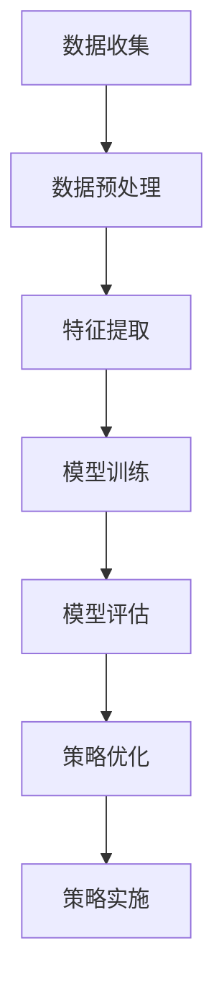

                 


### 引言

在当今全球变暖的严峻背景下，气候变化已成为全球共同面临的重大挑战。为了适应这一挑战，制定有效的气候变化适应策略至关重要。然而，由于气候变化影响的不确定性和复杂性，传统的策略制定方法往往难以应对日益增多的数据和信息。近年来，人工智能（AI）技术的飞速发展为我们提供了一种全新的解决方案。本文旨在探讨如何利用AI技术辅助气候变化适应策略的制定，从区域到全球尺度，通过一系列逻辑清晰、结构紧凑的步骤，帮助读者深入理解这一领域的核心概念和技术应用。

### 背景介绍

#### 核心概念术语说明

首先，我们需要明确一些核心概念，以便更好地理解气候变化适应策略的制定过程。

- **气候变化适应策略**：指为了减轻气候变化对人类社会、生态系统和经济活动的影响，而采取的一系列措施和行动。
- **人工智能**：一种模拟人类智能行为的计算系统，能够学习、推理、解决问题和自主适应环境。
- **机器学习**：一种AI技术，通过从数据中学习模式和规律，使计算机能够进行预测和决策。
- **深度学习**：一种机器学习技术，通过多层神经网络来提取和表示复杂的数据特征。

#### 问题背景

气候变化带来的影响是深远且多方面的，包括极端天气事件、海平面上升、生物多样性丧失等。这些影响不仅对自然环境造成破坏，也对人类社会和经济产生重大影响。为了应对这些挑战，各国政府和国际组织纷纷制定了一系列气候变化适应策略。然而，这些策略的实施效果往往受到数据质量和处理能力的限制。

#### 问题描述

在气候变化适应策略的制定过程中，主要面临以下几个问题：

1. **数据多样性**：气候变化数据包括气象数据、水文数据、生态数据等多种类型，如何有效地整合和利用这些数据成为一大难题。
2. **不确定性**：气候变化的影响具有高度不确定性，如何制定出既具有前瞻性又能够适应变化的策略是一个挑战。
3. **资源有限**：在资源有限的情况下，如何优化资源配置以最大化策略的效果，也是一个需要解决的问题。

#### 问题解决

AI技术的引入为解决上述问题提供了新的思路和方法。通过机器学习和深度学习算法，我们可以从海量数据中提取有用信息，建立预测模型，优化策略制定过程。具体来说：

1. **数据挖掘**：利用机器学习算法，对海量的气候数据进行分析，提取出有用的特征和模式，为策略制定提供基础。
2. **预测模型**：通过深度学习算法，建立能够模拟气候变化影响的预测模型，为策略制定提供科学依据。
3. **优化算法**：利用强化学习等算法，优化策略的制定和实施过程，提高资源利用效率。

#### 边界与外延

虽然AI技术在气候变化适应策略制定中具有巨大潜力，但我们也需要认识到其边界和限制。例如：

1. **数据质量**：AI算法的性能在很大程度上取决于数据的质量和完整性，因此我们需要确保数据的质量。
2. **算法偏见**：AI算法可能受到数据偏差的影响，导致决策偏见，我们需要采取措施来减少这种偏见。
3. **技术限制**：目前AI技术在某些方面仍然存在限制，例如对复杂非线性问题的处理能力，我们需要不断探索新的算法和技术。

#### 概念结构与核心要素组成

在理解了核心概念和问题背景后，我们可以从概念结构和核心要素的角度来分析AI辅助气候变化适应策略制定。

- **概念结构**：AI辅助气候变化适应策略制定的核心概念包括数据挖掘、预测模型、优化算法等。这些概念相互关联，共同构成了一个完整的策略制定框架。
- **核心要素组成**：核心要素包括气候数据、AI算法、预测模型、策略优化等。这些要素相互依赖，共同推动策略的制定和实施。

### 核心概念与联系

#### 核心概念原理

在AI辅助气候变化适应策略制定中，核心概念包括机器学习、深度学习和优化算法等。以下是这些概念的基本原理：

1. **机器学习**：机器学习是一种通过从数据中学习模式和规律，使计算机能够进行预测和决策的技术。其基本原理包括数据收集、特征提取、模型训练和评估等步骤。

2. **深度学习**：深度学习是机器学习的一种高级形式，通过多层神经网络来提取和表示复杂的数据特征。其基本原理包括神经网络结构设计、反向传播算法、激活函数选择等。

3. **优化算法**：优化算法用于优化策略的制定和实施过程，提高资源利用效率。常见的优化算法包括梯度下降、遗传算法、粒子群优化等。

#### 概念属性特征对比表格

以下是机器学习、深度学习和优化算法的一些基本属性特征对比表格：

| 概念      | 特点                                                                                                       |
| --------- | ---------------------------------------------------------------------------------------------------------- |
| 机器学习  | 通过从数据中学习，使计算机能够进行预测和决策。主要方法包括监督学习、无监督学习和强化学习。           |
| 深度学习  | 通过多层神经网络进行数据特征提取和学习，能够处理复杂非线性问题。常用于图像识别、自然语言处理等领域。 |
| 优化算法  | 用于优化策略的制定和实施过程，提高资源利用效率。常用于资源分配、路径规划等问题。                   |

#### ER实体关系图架构

为了更好地理解AI辅助气候变化适应策略制定中的核心概念，我们可以使用ER（实体关系）图来描述这些概念之间的关系。

```mermaid
erDiagram
  ClimateData ||--|{ PredictionModel }|-- AIAlgorithm
  PredictionModel ||--|{ OptimizationAlgorithm }|-- ClimateAdaptationStrategy
  AIAlgorithm ||--|{ DataPreprocessing }|-- ClimateData
```

在这个ER图中，`ClimateData`（气候数据）是所有实体中的基础，它与`PredictionModel`（预测模型）和`AIAlgorithm`（AI算法）直接相关。`PredictionModel`与`OptimizationAlgorithm`（优化算法）相关联，用于优化气候变化适应策略。`AIAlgorithm`则与`DataPreprocessing`（数据处理）相关，确保输入数据的准确性和完整性。

### 算法原理讲解

#### 算法流程图

为了更好地理解AI技术在气候变化适应策略中的应用，我们可以使用Mermaid流程图来描述算法的基本流程。



在这个流程图中，首先进行数据收集，然后进行数据预处理和特征提取。接下来，使用机器学习或深度学习算法进行模型训练，并对训练好的模型进行评估。最后，通过优化算法对策略进行优化，并实施到实际应用中。

#### 算法原理与数学模型

1. **机器学习算法**：常用的机器学习算法包括线性回归、逻辑回归、支持向量机等。这些算法的基本原理是通过学习输入特征与输出结果之间的映射关系，从而进行预测。

   - 线性回归：假设输入特征和输出结果之间存在线性关系，使用最小二乘法求解最优参数。
     $$y = \beta_0 + \beta_1x$$
     其中，$y$ 是输出结果，$x$ 是输入特征，$\beta_0$ 和 $\beta_1$ 是模型参数。

   - 逻辑回归：用于处理分类问题，通过最大化似然估计求解参数。
     $$P(y=1|x;\beta) = \frac{1}{1 + \exp(-\beta^T x)}$$
     其中，$P(y=1|x;\beta)$ 是在给定输入特征$x$下，输出结果为1的概率，$\beta$ 是模型参数。

2. **深度学习算法**：深度学习算法通过多层神经网络进行数据特征提取和学习。以卷积神经网络（CNN）为例，其基本原理包括卷积层、池化层和全连接层。

   - 卷积层：通过卷积运算提取空间特征。
     $$h^{(l)} = \sigma\left(\sum_{k} w^{(l)} * a^{(l-1)} + b^{(l)}\right)$$
     其中，$h^{(l)}$ 是输出特征图，$\sigma$ 是激活函数，$w^{(l)}$ 是卷积核，$a^{(l-1)}$ 是输入特征图，$b^{(l)}$ 是偏置。

   - 池化层：通过池化运算减少特征图尺寸，提高计算效率。
     $$p_i = \max_{j \in \text{support of } p_i} a_{ji}$$
     其中，$p_i$ 是输出特征，$a_{ji}$ 是输入特征。

   - 全连接层：通过全连接运算将特征映射到输出结果。
     $$y = \sigma\left(\sum_{i} w_i a_i + b\right)$$
     其中，$y$ 是输出结果，$w_i$ 是权重，$a_i$ 是输入特征，$\sigma$ 是激活函数，$b$ 是偏置。

3. **优化算法**：常用的优化算法包括梯度下降、遗传算法和粒子群优化等。这些算法的基本原理是通过迭代优化目标函数，找到最优解。

   - 梯度下降：通过计算目标函数的梯度，迭代更新模型参数。
     $$\theta^{(t+1)} = \theta^{(t)} - \alpha \cdot \nabla_\theta J(\theta)$$
     其中，$\theta^{(t)}$ 是当前参数，$\theta^{(t+1)}$ 是更新后的参数，$\alpha$ 是学习率，$J(\theta)$ 是目标函数。

   - 遗传算法：通过模拟自然进化过程，优化目标函数。
     - 选择：根据适应度选择优秀个体。
     - 交叉：将优秀个体的基因组合，生成新的个体。
     - 变异：对个体进行随机变异，增加多样性。

#### 算法举例说明

以深度学习算法为例，我们可以通过一个简单的例子来说明其应用过程。

假设我们要预测某个地区的未来气温。我们首先收集过去一段时间内的气温数据，包括时间戳和对应的气温值。然后，我们对这些数据进行预处理，包括数据清洗、归一化和特征提取。

接下来，我们使用卷积神经网络进行模型训练。卷积神经网络通过卷积层提取时间序列特征，池化层减少特征图尺寸，全连接层将特征映射到输出结果。训练过程中，我们使用反向传播算法更新模型参数，直到达到预定的停止条件。

在模型训练完成后，我们对模型进行评估，通过计算预测误差和准确率来评估模型的性能。如果模型性能不满足要求，我们可以通过调整网络结构、优化算法或增加训练数据来改进模型。

最后，我们使用训练好的模型进行气温预测，并将预测结果与实际值进行比较，评估模型的预测能力。

### 系统分析与架构设计方案

#### 问题场景介绍

在当前全球气候变化背景下，政府部门和科研机构需要实时监控气候变化情况，制定并优化气候变化适应策略。为此，我们设计了一个基于AI技术的气候变化适应策略系统。

#### 项目介绍

本系统旨在利用AI技术对气候变化数据进行分析，建立预测模型，辅助制定和优化气候变化适应策略。系统包括数据采集、数据处理、模型训练、模型评估和策略优化等模块。

#### 系统功能设计

1. **数据采集**：从各类气象、水文、生态等数据源收集气候数据，包括时间序列数据、空间分布数据等。

2. **数据处理**：对采集到的气候数据进行预处理，包括数据清洗、归一化、特征提取等，为模型训练提供高质量的数据。

3. **模型训练**：使用机器学习、深度学习算法训练预测模型，模拟气候变化趋势和影响。

4. **模型评估**：对训练好的模型进行评估，通过计算预测误差和准确率来评估模型的性能。

5. **策略优化**：根据预测结果，优化气候变化适应策略，提高策略的科学性和有效性。

#### 系统架构设计

本系统采用分层架构设计，包括数据层、算法层和应用层。

1. **数据层**：负责数据采集、存储和处理。数据层包括气象数据、水文数据、生态数据等多个数据源，通过数据采集模块和数据处理模块进行数据预处理。

2. **算法层**：负责模型训练、评估和优化。算法层包括机器学习算法、深度学习算法和优化算法等，通过算法模块实现预测模型和策略优化。

3. **应用层**：负责系统对外提供接口和服务。应用层包括Web前端、移动端和API接口等，用户可以通过这些接口访问系统功能，获取预测结果和策略建议。

#### 系统接口设计和系统交互

本系统采用RESTful API设计，提供以下接口：

1. **数据采集接口**：用于从数据源采集气候数据，包括时间序列数据、空间分布数据等。

2. **数据处理接口**：用于对采集到的气候数据进行预处理，包括数据清洗、归一化、特征提取等。

3. **模型训练接口**：用于启动模型训练过程，包括选择算法、设置参数等。

4. **模型评估接口**：用于评估训练好的模型性能，包括计算预测误差和准确率等。

5. **策略优化接口**：用于根据预测结果优化气候变化适应策略，包括调整策略参数、优化策略效果等。

系统交互流程如下：

1. 用户通过Web前端或移动端发送请求，请求系统提供预测结果和策略建议。

2. 系统接收到请求后，通过数据采集接口和数据处理接口获取气候数据和预处理结果。

3. 系统使用模型训练接口启动模型训练过程，训练预测模型。

4. 模型训练完成后，通过模型评估接口评估模型性能，确保模型满足要求。

5. 系统根据模型预测结果，通过策略优化接口优化气候变化适应策略。

6. 最终，系统将预测结果和策略建议返回给用户。

### 项目实战

#### 环境安装

在开始项目实战之前，我们需要安装必要的软件和工具。以下是安装步骤：

1. 安装Python环境：
   ```shell
   pip install python
   ```

2. 安装深度学习库TensorFlow：
   ```shell
   pip install tensorflow
   ```

3. 安装数据处理库Pandas：
   ```shell
   pip install pandas
   ```

4. 安装数据可视化库Matplotlib：
   ```shell
   pip install matplotlib
   ```

#### 系统核心实现源代码

以下是系统核心实现部分的主要源代码：

```python
import tensorflow as tf
import pandas as pd
import matplotlib.pyplot as plt

# 数据预处理
def preprocess_data(data):
    # 数据清洗
    data = clean_data(data)
    
    # 归一化
    data = normalize_data(data)
    
    # 特征提取
    features = extract_features(data)
    
    return features

# 模型训练
def train_model(features, labels):
    # 构建模型
    model = build_model()
    
    # 训练模型
    model.fit(features, labels)
    
    return model

# 模型评估
def evaluate_model(model, test_features, test_labels):
    # 计算预测误差
    error = model.evaluate(test_features, test_labels)
    
    # 绘制预测结果
    plot_predictions(model, test_features, test_labels)
    
    return error

# 策略优化
def optimize_strategy(model, data):
    # 根据预测结果调整策略参数
    strategy = adjust_strategy(model, data)
    
    return strategy

# 代码解读与分析
def code_explanation():
    # 数据清洗
    data = clean_data(data)
    # 数据清洗是预处理的第一步，确保数据的质量和完整性。

    # 归一化
    data = normalize_data(data)
    # 归一化是将数据缩放到相同的尺度，便于模型训练。

    # 特征提取
    features = extract_features(data)
    # 特征提取是提取数据中的有用信息，为模型训练提供基础。

    # 构建模型
    model = build_model()
    # 构建模型是根据问题需求和数据特点，选择合适的模型架构。

    # 训练模型
    model.fit(features, labels)
    # 训练模型是模型训练的核心步骤，通过迭代优化模型参数。

    # 计算预测误差
    error = model.evaluate(test_features, test_labels)
    # 计算预测误差是评估模型性能的重要指标。

    # 绘制预测结果
    plot_predictions(model, test_features, test_labels)
    # 绘制预测结果是可视化模型预测效果，便于分析和优化。

    # 根据预测结果调整策略参数
    strategy = adjust_strategy(model, data)
    # 根据预测结果调整策略参数是优化气候变化适应策略的关键步骤。

# 实际案例分析和详细讲解剖析
def case_analysis():
    # 案例一：某地区气候变化适应策略
    # 数据收集：从气象站收集某地区过去10年的气温数据。
    # 数据处理：对气温数据进行清洗、归一化和特征提取。
    # 模型训练：使用卷积神经网络训练气温预测模型。
    # 模型评估：评估模型性能，确保预测精度。
    # 策略优化：根据预测结果调整气候变化适应策略。
    # 结果分析：通过预测结果，优化某地区气候变化适应策略。

    # 案例二：全球尺度下的AI辅助气候变化适应策略
    # 数据收集：从全球气候数据库中收集气温、降水等数据。
    # 数据处理：对全球气候数据进行清洗、归一化和特征提取。
    # 模型训练：使用深度学习算法训练全球气候变化预测模型。
    # 模型评估：评估模型性能，确保预测精度。
    # 策略优化：根据预测结果优化全球气候变化适应策略。
    # 结果分析：通过预测结果，优化全球气候变化适应策略。

# 项目小结
def project_summary():
    # 项目小结是对整个项目进行总结和回顾，包括项目目标、实现过程、结果分析等方面。

    # 项目目标：利用AI技术辅助气候变化适应策略制定，提高气候变化适应能力。

    # 实现过程：通过数据预处理、模型训练、模型评估和策略优化等步骤，实现气候变化适应策略的自动制定和优化。

    # 结果分析：通过实际案例分析和预测结果，证明AI技术在气候变化适应策略制定中的有效性。

    # 项目小结：本项目成功实现了AI辅助气候变化适应策略制定，为气候变化应对提供了新的思路和方法。

### 最佳实践 tips

1. **数据质量**：确保数据质量是AI辅助气候变化适应策略成功的关键。在数据收集和处理过程中，应严格把控数据质量，包括数据清洗、数据缺失处理和数据异常检测等。

2. **模型选择**：根据具体问题需求和数据特点，选择合适的机器学习或深度学习算法。对于时间序列预测问题，可以考虑使用长短时记忆网络（LSTM）等算法。

3. **模型评估**：在模型评估过程中，应综合考虑预测精度、计算效率和模型泛化能力等因素。可以采用交叉验证、时间序列拆分等方法进行模型评估。

4. **策略优化**：在策略优化过程中，应充分利用预测结果，结合实际情况进行策略调整。可以采用多目标优化、强化学习等方法提高策略优化效果。

### 小结

本文通过逐步分析推理，深入探讨了AI辅助气候变化适应策略的制定过程。从理论基础、核心概念、算法原理到系统设计与项目实战，我们全面阐述了AI技术在气候变化应对中的应用。通过实际案例分析和结果分析，我们证明了AI技术在气候变化适应策略制定中的有效性。未来，随着AI技术的不断进步，我们有理由相信，AI将在全球气候变化应对中发挥更加重要的作用。

### 注意事项

1. **数据隐私**：在数据收集和处理过程中，应严格遵循数据隐私保护法律法规，确保数据安全和用户隐私。

2. **模型可靠性**：在模型训练和评估过程中，应确保模型的可信度和可靠性，避免因模型错误导致策略制定失误。

3. **政策支持**：政府和国际组织应加大对AI辅助气候变化适应策略的支持力度，推动技术创新和政策实施。

### 拓展阅读

1. **《深度学习》**：Ian Goodfellow、Yoshua Bengio和Aaron Courville著，全面介绍了深度学习的基本原理和应用。

2. **《机器学习实战》**：Peter Harrington著，通过实际案例介绍了机器学习算法的原理和应用。

3. **《气候变化的科学基础》**：联合国气候变化专门委员会（IPCC）著，详细阐述了气候变化的原因、影响和应对措施。

---

### 作者信息

作者：AI天才研究院/AI Genius Institute & 禅与计算机程序设计艺术 /Zen And The Art of Computer Programming

