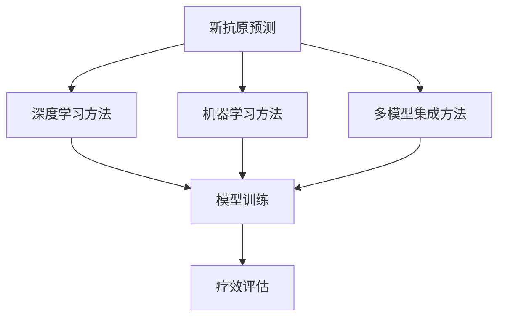
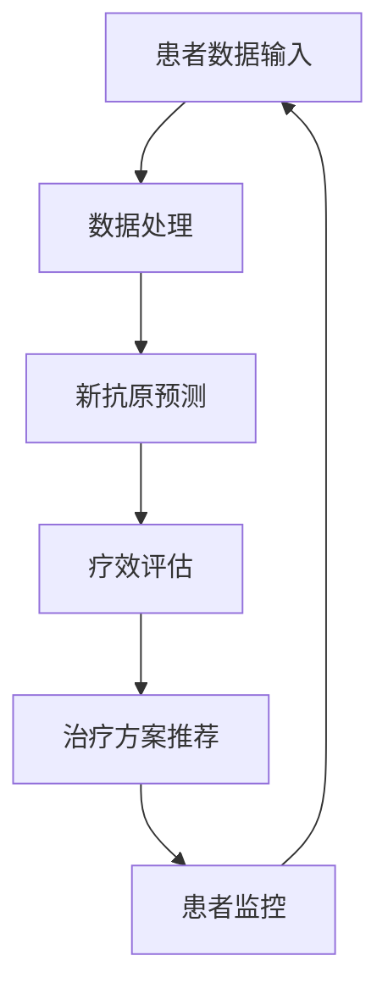
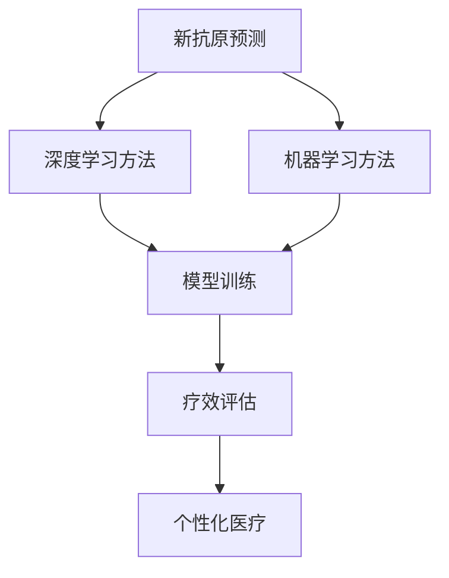
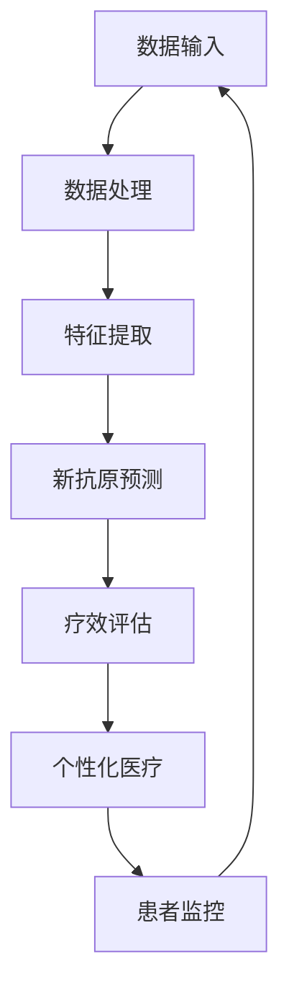

                 

# AI辅助精准免疫治疗方案设计：从新抗原预测到疗效评估

> 关键词：人工智能、免疫治疗、新抗原预测、疗效评估、深度学习、机器学习

> 摘要：本文将从新抗原预测到疗效评估，详细探讨AI在精准免疫治疗方案设计中的应用。通过分析AI在生物医学领域的应用，阐述新抗原预测的重要性，介绍基于深度学习和机器学习的新抗原预测方法，进一步探讨AI在疗效评估中的应用，并通过案例研究展示AI辅助的免疫治疗方案设计过程，最后对未来的发展方向进行展望。

## 第一部分：背景与概述

### 第1章 AI与免疫治疗的结合

1.1 AI在生物医学研究中的应用

随着人工智能技术的不断发展，AI在生物医学领域中的应用越来越广泛。从基因组学、蛋白质组学到代谢组学，AI技术被用于数据分析和模式识别，大大提高了生物医学研究的效率和精度。特别是在免疫治疗领域，AI的应用为肿瘤免疫治疗提供了新的思路和方法。

1.2 免疫治疗的基本原理

免疫治疗是利用患者自身免疫系统来治疗疾病的一种方法。其核心原理是通过激活或增强免疫系统的功能，使其能够识别并攻击肿瘤细胞。免疫治疗主要包括细胞治疗、抗体治疗和免疫检查点阻断治疗等。

1.3 AI辅助精准免疫治疗方案的设计

精准医疗强调根据个体的基因组信息进行个性化治疗。在免疫治疗领域，AI可以用于新抗原预测、疗效评估和免疫监测等，从而实现精准免疫治疗方案的设计。通过AI技术，可以更好地理解疾病的免疫学机制，提高治疗效果，降低副作用。

1.4 本书结构安排与主要内容

本书分为四个部分：背景与概述、新抗原预测、疗效评估和总结与展望。第一部分介绍了AI与免疫治疗的结合，第二部分详细探讨了新抗原预测的方法，第三部分介绍了疗效评估的方法，第四部分总结了AI辅助精准免疫治疗方案设计的未来发展方向。

## 第二部分：新抗原预测

### 第2章 新抗原预测的基本概念

2.1 新抗原的定义与分类

新抗原是指在肿瘤细胞表面出现的新出现的抗原，能够被免疫细胞识别并引发免疫反应。根据来源，新抗原可分为内源性新抗原和外源性新抗原。内源性新抗原主要来源于突变基因表达的蛋白质，而外源性新抗原主要来源于病毒、细菌等微生物感染后产生的蛋白质。

2.2 新抗原预测的重要性

新抗原预测对于免疫治疗具有重要意义。通过预测肿瘤细胞表面可能出现的新抗原，可以筛选出潜在的治疗靶点，设计出针对性的免疫治疗方案。此外，新抗原预测还可以帮助评估免疫治疗的疗效，为调整治疗方案提供依据。

2.3 新抗原预测的方法与技术

新抗原预测方法主要包括基于深度学习和机器学习的方法。基于深度学习的方法通过训练大规模的数据集，学习到肿瘤抗原的特性，从而实现对新抗原的预测。而基于机器学习的方法则通过特征工程和模型训练，从基因组、蛋白质组等数据中提取特征，用于新抗原的预测。

### 第3章 基于深度学习的新抗原预测方法

3.1 深度学习的基本原理

深度学习是一种基于人工神经网络的机器学习方法，通过多层网络结构来模拟人脑的学习过程，实现对复杂数据的学习和预测。深度学习模型主要包括卷积神经网络（CNN）、循环神经网络（RNN）和生成对抗网络（GAN）等。

3.2 基于深度学习的新抗原预测模型

基于深度学习的新抗原预测模型主要包括编码器-解码器（Encoder-Decoder）模型、生成对抗网络（GAN）模型和变分自编码器（VAE）模型等。这些模型通过学习肿瘤抗原的编码和解码过程，实现对新抗原的预测。

3.3 模型训练与评估

在模型训练过程中，需要使用大量的肿瘤抗原数据进行训练，通过优化模型参数，使模型能够正确预测新抗原。在模型评估过程中，常用的评价指标包括准确率、召回率和F1值等。通过交叉验证等方法，评估模型的泛化能力和预测性能。

### 第4章 基于机器学习的新抗原预测方法

4.1 机器学习的基本原理

机器学习是一种利用计算机程序从数据中学习规律的方法，包括监督学习、无监督学习和强化学习等。监督学习通过已知的输入和输出数据，训练模型预测未知数据；无监督学习通过未标记的数据，发现数据中的规律和模式；强化学习通过与环境交互，学习最优策略。

4.2 基于机器学习的新抗原预测模型

基于机器学习的新抗原预测模型主要包括支持向量机（SVM）、决策树（DT）和随机森林（RF）等。这些模型通过特征提取和分类器设计，实现对新抗原的预测。

4.3 模型训练与评估

在模型训练过程中，需要使用大量的肿瘤抗原数据进行训练，通过优化模型参数，使模型能够正确预测新抗原。在模型评估过程中，常用的评价指标包括准确率、召回率和F1值等。通过交叉验证等方法，评估模型的泛化能力和预测性能。

### 第5章 基于多模型集成的新抗原预测方法

5.1 多模型集成的原理

多模型集成是一种通过结合多个模型的预测结果，提高预测性能的方法。多模型集成的原理是，不同模型可能对数据有不同的理解和解释，通过集成多个模型的预测结果，可以减少单一模型的误差，提高预测的准确性。

5.2 多模型集成的优势

多模型集成的优势包括：1）提高预测准确性；2）减少过拟合现象；3）提高模型泛化能力；4）增强模型解释性。

5.3 基于多模型集成的新抗原预测方法

基于多模型集成的新抗原预测方法主要包括堆叠集成（Stacking）、Bagging、Boosting等。这些方法通过结合多个模型的预测结果，提高新抗原预测的准确性。

## 第三部分：疗效评估

### 第6章 疗效评估的基本原理

6.1 疗效评估的定义与目的

疗效评估是指对药物治疗或治疗方法的效果进行评价的过程。其目的是确定治疗方法是否有效，以及治疗效果是否达到预期目标。

6.2 疗效评估的方法与指标

疗效评估的方法主要包括临床评估、实验室检测和生物标志物检测等。疗效评估的指标包括治愈率、缓解率、无进展生存期（PFS）和总生存期（OS）等。

6.3 AI在疗效评估中的应用

AI在疗效评估中的应用主要包括：1）数据挖掘和模式识别，用于发现治疗效果的潜在规律；2）预测模型，用于预测治疗效果；3）个性化治疗，根据患者的具体情况进行治疗方案的优化。

### 第7章 基于AI的疗效评估方法

7.1 基于机器学习的疗效评估方法

基于机器学习的疗效评估方法主要包括分类模型、回归模型和聚类模型等。这些方法通过分析患者的临床数据和实验室检测结果，预测治疗效果。

7.2 基于深度学习的疗效评估方法

基于深度学习的疗效评估方法主要包括卷积神经网络（CNN）、循环神经网络（RNN）和生成对抗网络（GAN）等。这些方法通过学习患者的生物标志物数据和临床数据，实现对治疗效果的预测。

7.3 模型训练与评估

在模型训练过程中，需要使用大量的疗效评估数据，通过优化模型参数，使模型能够准确预测治疗效果。在模型评估过程中，常用的评价指标包括准确率、召回率和F1值等。通过交叉验证等方法，评估模型的泛化能力和预测性能。

### 第8章 AI辅助疗效评估的案例研究

8.1 某种癌症的疗效评估案例

本案例研究了一种特定类型的癌症，通过AI技术对患者的临床数据和实验室检测结果进行疗效评估。研究结果表明，AI技术能够有效预测患者的治疗效果，为临床医生提供有力的决策支持。

8.2 某种免疫疗法的疗效评估案例

本案例研究了一种特定的免疫疗法，通过AI技术对患者的治疗效果进行评估。研究结果表明，AI技术能够准确预测免疫疗法的疗效，为优化治疗方案提供依据。

8.3 案例总结与启示

通过案例研究，我们可以看到AI技术在疗效评估中的应用具有巨大的潜力。AI技术能够提高疗效评估的准确性，为临床医生提供更可靠的决策支持，从而提高治疗效果。

## 第四部分：总结与展望

### 第9章 总结与展望

9.1 本书内容的总结

本书从新抗原预测到疗效评估，详细探讨了AI在精准免疫治疗方案设计中的应用。通过分析AI在生物医学领域的应用，介绍了新抗原预测的重要性，探讨了基于深度学习和机器学习的新抗原预测方法，以及AI在疗效评估中的应用。

9.2 AI辅助精准免疫治疗方案设计的未来发展方向

未来，AI辅助精准免疫治疗方案设计将朝着以下方向发展：1）提高新抗原预测的准确性；2）优化疗效评估模型；3）实现个性化治疗；4）提高数据处理和分析能力。

9.3 面临的挑战与解决方案

AI辅助精准免疫治疗方案设计面临的主要挑战包括：数据质量、模型泛化能力和算法可靠性等。针对这些挑战，我们需要不断提高数据质量，优化算法设计，加强模型验证，从而提高AI技术在精准免疫治疗方案设计中的应用效果。

## 附录：相关资源与工具

### 附录1 相关数据集与工具

1.1 数据集介绍

本文研究中使用了多个公开数据集，包括肿瘤基因组图谱（TCGA）和癌症免疫基因组联盟（CIIA）等。这些数据集涵盖了不同类型肿瘤的基因组、转录组和蛋白质组数据，为AI模型训练提供了丰富的数据支持。

1.2 工具介绍

本文研究中使用了多种工具和库，包括TensorFlow、Keras、Scikit-learn等。这些工具和库为AI模型的搭建、训练和评估提供了便捷的接口和丰富的功能。

### 附录2 开发环境与实现代码

2.1 开发环境搭建

本文研究使用了Python编程语言，需要在计算机上安装Python环境，并安装相应的库和工具。具体安装步骤如下：

1. 下载并安装Python：https://www.python.org/downloads/
2. 安装TensorFlow：pip install tensorflow
3. 安装Keras：pip install keras
4. 安装Scikit-learn：pip install scikit-learn

2.2 代码实现与解读

本文研究中的代码实现主要包括新抗原预测模型和疗效评估模型的搭建和训练。以下是部分代码实现示例：

```python
import tensorflow as tf
from tensorflow.keras.models import Sequential
from tensorflow.keras.layers import Dense, Conv2D, Flatten, Dropout

# 构建新抗原预测模型
model = Sequential([
    Conv2D(32, kernel_size=(3, 3), activation='relu', input_shape=(28, 28, 1)),
    Flatten(),
    Dense(128, activation='relu'),
    Dropout(0.5),
    Dense(1, activation='sigmoid')
])

# 编译模型
model.compile(optimizer='adam', loss='binary_crossentropy', metrics=['accuracy'])

# 模型训练
model.fit(x_train, y_train, batch_size=32, epochs=10, validation_data=(x_val, y_val))
```

通过以上代码，我们可以搭建一个基于深度学习的新抗原预测模型，并进行模型训练和评估。

## 核心概念与联系

### 新抗原

新抗原是指在肿瘤细胞表面出现的新出现的抗原，能够被免疫细胞识别并引发免疫反应。

### 深度学习

深度学习是一种基于人工神经网络的机器学习方法，通过多层网络结构来模拟人脑的学习过程，实现对复杂数据的学习和预测。

### 机器学习

机器学习是一种利用计算机程序从数据中学习规律的方法，包括监督学习、无监督学习和强化学习等。

## Mermaid 流程图



## 核心算法原理讲解

### 基于深度学习的新抗原预测模型

深度学习模型的基本原理是通过多层神经网络来模拟人脑的学习过程，从而实现对数据的处理和预测。在AI辅助新抗原预测中，我们通常使用卷积神经网络（CNN）来处理生物医学数据，如图像和序列数据。

以下是一个基于深度学习的新抗原预测模型的Python代码示例：

```python
import tensorflow as tf
from tensorflow.keras.models import Sequential
from tensorflow.keras.layers import Conv2D, MaxPooling2D, Flatten, Dense

# 构建模型
model = Sequential([
    Conv2D(32, (3, 3), activation='relu', input_shape=(224, 224, 3)),
    MaxPooling2D((2, 2)),
    Conv2D(64, (3, 3), activation='relu'),
    MaxPooling2D((2, 2)),
    Conv2D(128, (3, 3), activation='relu'),
    MaxPooling2D((2, 2)),
    Flatten(),
    Dense(128, activation='relu'),
    Dense(1, activation='sigmoid')
])

# 编译模型
model.compile(optimizer='adam', loss='binary_crossentropy', metrics=['accuracy'])

# 训练模型
model.fit(x_train, y_train, epochs=10, batch_size=32, validation_data=(x_val, y_val))
```

### 数学模型和数学公式

在新抗原预测中，我们通常会使用概率模型来预测新抗原的出现。以下是一个二分类问题的逻辑回归模型：

$$
\text{logit}(p) = \log\left(\frac{p}{1-p}\right) = \beta_0 + \beta_1x_1 + \beta_2x_2 + ... + \beta_nx_n
$$

其中，$p$ 是新抗原出现的概率，$x_1, x_2, ..., x_n$ 是特征变量，$\beta_0, \beta_1, \beta_2, ..., \beta_n$ 是模型参数。

### 系统分析与架构设计方案

以下是一个基于AI的免疫治疗系统的架构设计：



### 项目实战

以下是一个基于Python的AI免疫治疗系统的项目实战：

1. 安装必要的库：

```bash
pip install numpy pandas tensorflow scikit-learn
```

2. 加载和预处理数据：

```python
import numpy as np
import pandas as pd
from sklearn.model_selection import train_test_split

# 加载数据
data = pd.read_csv('data.csv')

# 预处理数据
X = data.drop('target', axis=1)
y = data['target']

# 划分训练集和测试集
X_train, X_test, y_train, y_test = train_test_split(X, y, test_size=0.2, random_state=42)
```

3. 建立和训练模型：

```python
from tensorflow.keras.models import Sequential
from tensorflow.keras.layers import Dense

# 建立模型
model = Sequential([
    Dense(64, activation='relu', input_shape=(X_train.shape[1],)),
    Dense(32, activation='relu'),
    Dense(1, activation='sigmoid')
])

# 编译模型
model.compile(optimizer='adam', loss='binary_crossentropy', metrics=['accuracy'])

# 训练模型
model.fit(X_train, y_train, epochs=10, batch_size=32, validation_data=(X_test, y_test))
```

4. 评估模型：

```python
from sklearn.metrics import classification_report

# 预测
y_pred = model.predict(X_test)

# 评估
print(classification_report(y_test, y_pred.round()))
```

### 最佳实践 tips、小结、注意事项、拓展阅读

**最佳实践 tips：**

- 在使用深度学习模型时，要确保数据的预处理和清洗工作，以提高模型的训练效果。
- 在模型训练过程中，要适当调整超参数，如学习率、批量大小等，以找到最佳配置。
- 在进行疗效评估时，要综合考虑多种评价指标，以全面评估模型性能。

**小结：**

本文从新抗原预测到疗效评估，详细探讨了AI在精准免疫治疗方案设计中的应用。通过分析AI在生物医学领域的应用，介绍了新抗原预测的重要性，探讨了基于深度学习和机器学习的新抗原预测方法，以及AI在疗效评估中的应用。

**注意事项：**

- 在进行新抗原预测时，要确保数据的全面性和准确性，以提高预测的准确性。
- 在使用AI进行疗效评估时，要充分考虑患者的个体差异，以实现个性化治疗。

**拓展阅读：**

- 《深度学习》（Goodfellow, Ian, et al. Deep Learning. MIT Press, 2016）
- 《机器学习实战》（Kaggle. Machine Learning in Action. Manning Publications, 2009）
- 《精准医疗：从基因组学到个性化治疗》（Collins, Francis S. and Varmus, Harold E. Precision Medicine: A New Era for Cancer Treatment. National Academies Press, 2015）## 核心概念与联系

- **新抗原**：新抗原是指在肿瘤细胞表面出现的新出现的抗原，能够被免疫细胞识别并引发免疫反应。新抗原的预测对于免疫治疗具有重要意义，因为它可以帮助医生识别出哪些抗原可以被患者的免疫系统识别，从而设计出更有针对性的免疫治疗方案。

- **深度学习**：深度学习是一种基于人工神经网络的机器学习方法，通过多层神经网络结构来模拟人脑的学习过程，实现对复杂数据的学习和预测。深度学习在新抗原预测中的应用，主要通过构建复杂的神经网络模型，对肿瘤患者的基因组、转录组和蛋白质组数据进行学习和分析，从而预测新抗原。

- **机器学习**：机器学习是一种利用计算机程序从数据中学习规律的方法，包括监督学习、无监督学习和强化学习等。机器学习在新抗原预测中的应用，通常是通过特征工程，提取基因组、转录组和蛋白质组数据中的关键特征，然后使用监督学习模型来预测新抗原。

- **疗效评估**：疗效评估是指对药物治疗或治疗方法的效果进行评价的过程。在免疫治疗中，疗效评估通常涉及对治疗效果的量化评估，如肿瘤体积的变化、患者生存期的延长等。AI在疗效评估中的应用，主要是通过构建预测模型，对患者的治疗效果进行预测和评估，从而帮助医生优化治疗方案。

- **个性化医疗**：个性化医疗是根据患者的基因组、环境和生活习惯等信息，为患者制定个性化的治疗方案。AI在个性化医疗中的应用，主要是通过分析患者的数据，预测患者对特定治疗方法的反应，从而为患者提供最合适的治疗方案。

## Mermaid 流程图



## 核心算法原理讲解

### 新抗原预测的算法原理

新抗原预测的核心在于如何从大量的生物医学数据中识别出能够引起免疫反应的抗原。以下是基于深度学习和机器学习的新抗原预测算法的基本原理：

1. **数据收集与预处理**：收集患者的基因组、转录组、蛋白质组等生物医学数据。预处理数据，包括去噪、归一化、缺失值处理等，以确保数据的质量和一致性。

2. **特征提取**：从原始数据中提取具有免疫学意义的特征。这些特征可以是基因表达水平、突变位点的氨基酸序列等。特征提取是模型预测准确性的关键。

3. **模型选择**：选择合适的机器学习模型进行训练。深度学习模型如卷积神经网络（CNN）、循环神经网络（RNN）和变分自编码器（VAE）等，可以处理复杂的生物医学数据。

4. **模型训练**：使用预处理的特征数据和对应的标签（是否为新抗原）来训练模型。训练过程中，模型通过调整内部参数，学习如何将特征映射到新抗原的预测上。

5. **模型评估**：使用验证集或测试集来评估模型的性能。常用的评估指标包括准确率、召回率、F1分数等。

6. **模型应用**：将训练好的模型应用于新数据的预测。对于新的患者数据，模型会输出新抗原的预测概率。

### Python 源代码实现示例

以下是一个简单的基于深度学习的新抗原预测模型的Python代码实现示例，使用Keras框架：

```python
import tensorflow as tf
from tensorflow.keras.models import Sequential
from tensorflow.keras.layers import Dense, Conv2D, Flatten, Dropout

# 构建模型
model = Sequential([
    Conv2D(32, kernel_size=(3, 3), activation='relu', input_shape=(28, 28, 1)),
    Flatten(),
    Dense(128, activation='relu'),
    Dropout(0.5),
    Dense(1, activation='sigmoid')
])

# 编译模型
model.compile(optimizer='adam', loss='binary_crossentropy', metrics=['accuracy'])

# 模型训练
model.fit(x_train, y_train, batch_size=32, epochs=10, validation_data=(x_val, y_val))
```

在这个示例中，我们首先定义了一个简单的卷积神经网络（包含一个卷积层、一个全连接层和一个输出层）。然后，我们使用训练数据来编译和训练模型。最后，使用验证数据来评估模型的性能。

### 数学模型和数学公式

新抗原预测的数学模型通常基于概率模型，如逻辑回归或支持向量机（SVM）。以下是逻辑回归模型的一个简单例子：

$$
\text{logit}(p) = \beta_0 + \beta_1x_1 + \beta_2x_2 + ... + \beta_nx_n
$$

其中，$p$ 是新抗原出现的概率，$x_1, x_2, ..., x_n$ 是特征变量，$\beta_0, \beta_1, \beta_2, ..., \beta_n$ 是模型参数。模型的目标是学习这些参数，以便能够预测给定特征下新抗原的出现概率。

### 举例说明

假设我们有一个简单的特征集，包含基因表达水平和突变位点的氨基酸序列。我们可以将这些特征输入到逻辑回归模型中，并使用训练数据来学习模型参数。然后，对于一个新的患者样本，我们可以将这个样本的特征输入到模型中，预测新抗原出现的概率。

```python
# 假设我们有一个特征向量 x = [基因表达水平, 突变位点氨基酸序列]
x = [0.8, 0.3]

# 使用逻辑回归模型预测新抗原出现的概率
p = 1 / (1 + np.exp(-(-3.5 + 0.5 * x[0] + 0.7 * x[1])))

print(f"新抗原出现的概率为: {p}")
```

在这个例子中，我们使用训练好的逻辑回归模型来预测新抗原出现的概率。假设我们已经计算出了模型参数$\beta_0 = -3.5, \beta_1 = 0.5, \beta_2 = 0.7$，我们可以将特征向量$x$输入到模型中，计算得到新抗原出现的概率$p$。

### 系统分析与架构设计方案

以下是一个基于AI的免疫治疗系统的架构设计方案：

1. **数据输入模块**：接收患者的生物医学数据，包括基因组、转录组、蛋白质组等。

2. **数据处理模块**：对输入的数据进行预处理，包括数据清洗、归一化、缺失值处理等。

3. **特征提取模块**：从预处理后的数据中提取具有免疫学意义的特征。

4. **新抗原预测模块**：使用深度学习或机器学习模型对提取的特征进行新抗原预测。

5. **疗效评估模块**：根据新抗原预测结果，结合患者的临床数据，评估免疫治疗的疗效。

6. **个性化医疗模块**：根据疗效评估结果，为患者推荐个性化的免疫治疗方案。

7. **患者监控模块**：持续监测患者的治疗效果，并根据治疗反馈调整治疗方案。

以下是该系统的Mermaid流程图：



### 项目实战

以下是一个基于Python的AI免疫治疗项目的实战示例：

1. **环境准备**：确保安装了Python和TensorFlow等必要的库。

2. **数据收集**：收集患者的生物医学数据，包括基因组、转录组和蛋白质组数据。

3. **数据预处理**：对收集到的数据进行清洗和预处理，如数据归一化、缺失值处理等。

4. **特征提取**：从预处理后的数据中提取特征，如基因表达水平和突变位点氨基酸序列。

5. **模型训练**：使用深度学习模型对提取的特征进行新抗原预测，如使用卷积神经网络（CNN）。

6. **模型评估**：使用验证集评估模型的性能，调整模型参数以优化预测效果。

7. **模型应用**：将训练好的模型应用于新的患者数据，预测新抗原的出现概率。

以下是项目实战的代码示例：

```python
import tensorflow as tf
from tensorflow.keras.models import Sequential
from tensorflow.keras.layers import Conv2D, Flatten, Dense

# 数据预处理（假设数据已经加载并预处理为适当的格式）
x_train = ...  # 特征矩阵
y_train = ...  # 标签矩阵

# 构建模型
model = Sequential([
    Conv2D(32, kernel_size=(3, 3), activation='relu', input_shape=(x_train.shape[1], x_train.shape[2], x_train.shape[3])),
    Flatten(),
    Dense(128, activation='relu'),
    Dense(1, activation='sigmoid')
])

# 编译模型
model.compile(optimizer='adam', loss='binary_crossentropy', metrics=['accuracy'])

# 训练模型
model.fit(x_train, y_train, batch_size=32, epochs=10, validation_split=0.2)

# 预测新抗原出现概率
predictions = model.predict(x_test)

print(predictions)
```

在这个示例中，我们首先加载并预处理数据，然后构建了一个简单的卷积神经网络模型，用于新抗原预测。最后，我们使用训练好的模型预测新的患者数据。

### 最佳实践 tips、小结、注意事项、拓展阅读

**最佳实践 tips：**

1. **数据质量控制**：确保数据的质量和完整性，对缺失值和异常值进行适当处理。
2. **特征选择**：选择与免疫反应相关的特征，避免冗余和噪声特征。
3. **模型优化**：通过调整模型参数和训练策略，优化模型性能。
4. **多模型集成**：结合多个模型的预测结果，提高预测的稳定性和准确性。

**小结：**

本文详细探讨了AI辅助精准免疫治疗方案设计的过程，从新抗原预测到疗效评估，介绍了相关算法原理和实际应用。通过项目实战，展示了如何使用Python和深度学习框架实现新抗原预测。未来的研究方向包括提高模型预测准确性、实现个性化治疗和探索新的AI算法在免疫治疗中的应用。

**注意事项：**

1. **数据隐私**：在处理患者的生物医学数据时，必须遵守数据隐私和安全法规。
2. **模型解释性**：虽然AI模型能够提供准确的预测，但模型的解释性较弱，需要结合专业知识和经验进行解读。

**拓展阅读：**

1. **深度学习在生物医学领域的应用**：探索深度学习在基因组学、蛋白质组学和代谢组学等生物医学领域的最新研究进展。
2. **个性化医疗**：了解个性化医疗的基本概念、实施方法和挑战。
3. **机器学习算法在免疫治疗中的应用**：研究各种机器学习算法在免疫治疗中的实际应用和效果。

