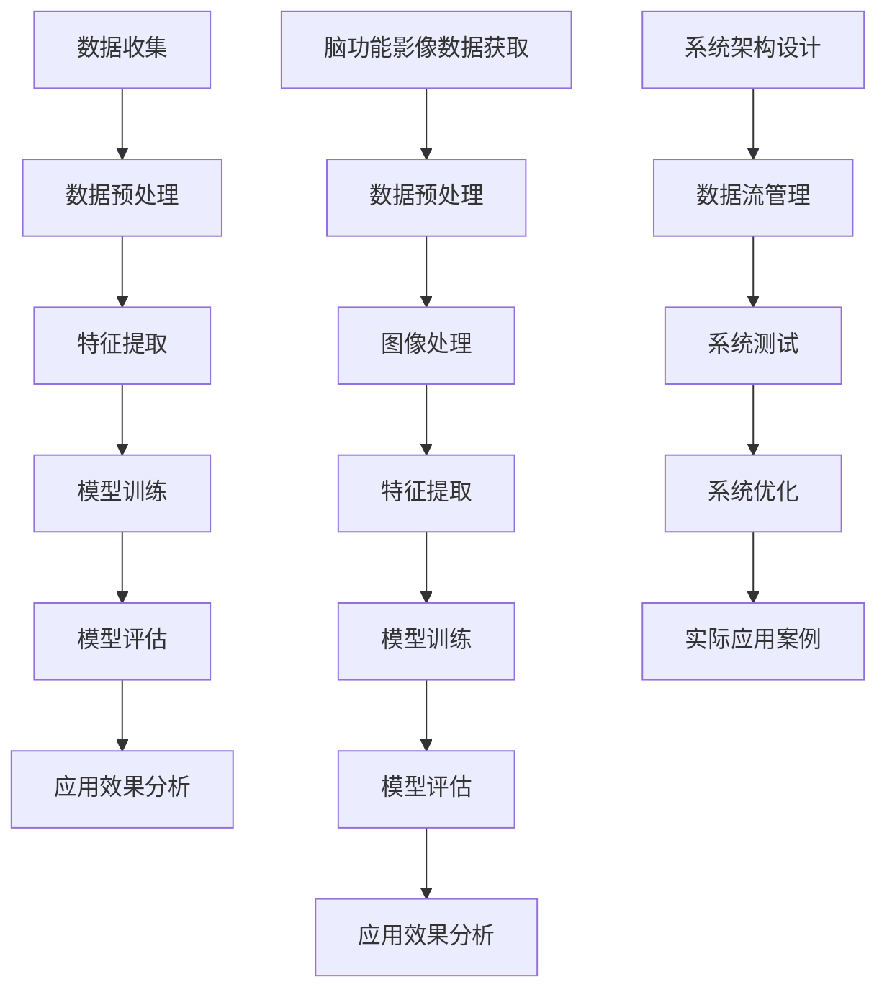

                 

### 摘要

本文旨在探讨人工智能（AI）在自闭症早期筛查中的应用，特别是在行为分析和脑功能影像领域的最新进展。自闭症是一种影响神经发育的复杂疾病，早期筛查对于干预和治疗具有重要意义。AI技术的引入，使得大规模、高效、精准的自闭症筛查成为可能。本文首先概述了自闭症的定义、分类和诊断现状，随后详细介绍了AI技术在行为分析和脑功能影像方面的原理与应用。接下来，文章将深入分析行为数据分析的方法、脑功能影像数据处理的技术，以及AI辅助自闭症早期筛查系统的集成。通过实际应用案例的剖析，本文展示了AI技术在实际筛查中的效果。最后，本文讨论了AI辅助自闭症早期筛查的未来发展趋势、面临的挑战以及伦理和社会问题。希望本文能为相关领域的研究者和从业人员提供有价值的参考和指导。

### 关键词

- 自闭症
- 人工智能
- 早期筛查
- 行为分析
- 脑功能影像

### 第一部分 自闭症与AI技术的概述

#### 第1章 自闭症的定义与现状

自闭症，又称自闭症谱系障碍（ASD），是一种复杂的神经发育障碍，影响个体的社交互动、沟通能力和重复性行为。自闭症的定义和分类一直是研究的热点，随着医学和心理学的发展，对于自闭症的认识也在不断深入。

##### 1.1 自闭症的定义与分类

自闭症的基本概念涵盖了广泛的功能障碍，包括社交互动的困难、语言和非语言的沟通问题，以及重复性和局限性的行为模式。根据《精神疾病诊断与统计手册》（DSM-5），自闭症被归类为广泛性发育障碍，其核心症状主要包括以下几个方面：

1. **社会交往的障碍**：患儿通常表现出对社交互动的缺乏兴趣或不能正常参与社交活动，难以与他人建立情感联系。
2. **沟通障碍**：患儿可能在语言理解和表达方面存在困难，包括语言发展延迟、语言交流的异常或使用非典型的沟通方式。
3. **重复和局限的行为模式**：患儿可能对某些活动或物体表现出强烈的兴趣和偏好，并表现出重复的行为，如反复拍手或转圈。

自闭症的类型主要包括以下几种：

1. **典型自闭症（TAS）**：这是最常见的形式，通常在儿童早期（通常是三岁之前）显现。
2. **轻度自闭症**：这类患者虽然表现出某些自闭症症状，但症状较轻，社交和沟通能力的损害相对较少。
3. **非典型自闭症**：这类患者的症状出现时间较晚或症状表现不同，可能需要更多时间才能被确诊。
4. **广泛性发育障碍（PDD）**：这是一种广义的自闭症，包括自闭症和轻度自闭症。

##### 1.2 自闭症的诊断与筛查现状

自闭症的诊断主要依赖于临床表现和观察，诊断过程通常需要多位专家的综合评估，包括儿科医生、心理学家和特殊教育专家。目前，自闭症的诊断方法主要包括以下几种：

1. **临床评估**：通过观察患儿的社交互动、语言发展和行为模式，医生进行初步诊断。
2. **评估工具**：使用标准化的评估工具，如《儿童行为检查表》（ABC）和《自闭症诊断观察表》（ADOS），帮助医生进行诊断。
3. **脑电图（EEG）和磁共振成像（MRI）**：这些辅助检查有时用于排除其他可能引起相似症状的疾病。

尽管自闭症的诊断方法不断进步，但目前的筛查仍面临一些挑战：

1. **早期筛查难度**：自闭症的症状可能在儿童早期不显著，这使得早期筛查变得困难。
2. **专业资源限制**：许多地区缺乏足够的医疗和专业资源，限制了自闭症的诊断和筛查。
3. **诊断的一致性**：由于专家的主观判断和评估工具的差异，自闭症的诊断存在一定程度的偏差。

##### 1.3 AI技术在自闭症筛查中的应用潜力

随着人工智能技术的迅速发展，AI在自闭症筛查中的应用前景愈发广阔。AI技术，特别是机器学习和计算机视觉，提供了新的工具和方法，能够提高自闭症筛查的效率和准确性。以下是AI技术在自闭症筛查中的主要应用潜力：

1. **行为分析**：通过分析儿童的行为数据，AI可以识别出自闭症的症状和模式。例如，机器学习算法可以分析儿童的社交互动视频，识别出语言和非语言的异常行为。
2. **语音分析**：AI技术可以分析儿童的语音，识别出语言发展的异常，如发音错误或语言节奏的不正常。
3. **脑功能影像**：通过分析脑功能影像数据，如功能性磁共振成像（fMRI），AI可以帮助识别自闭症患者的脑功能异常，从而提供更准确的诊断。
4. **自动化诊断**：AI可以帮助医生自动化诊断过程，减少人为误差，提高诊断的准确性。

总的来说，AI技术在自闭症筛查中的应用不仅能够提高筛查的效率和准确性，还能够帮助早期发现自闭症，从而为患者提供更及时和有效的干预。

#### 第2章 AI技术基础

##### 2.1 人工智能概述

人工智能（AI）是指由人制造出来的系统能够执行通常需要人类智能的任务，例如视觉识别、语言理解、决策制定等。AI的发展可以追溯到20世纪50年代，随着计算能力和算法的进步，AI技术取得了显著的进展。人工智能主要分为两类：**弱AI**和**强AI**。

弱AI，也称为窄AI或专用AI，是指能够完成特定任务的系统，例如语音助手、图像识别等。弱AI是当前AI技术的主体，广泛应用于各个领域，如医疗、金融、交通等。

强AI，也称为通用AI或强智能，是指具有全面人类智能的机器，能够像人类一样理解和执行各种任务。强AI目前仍处于理论研究阶段，尚未实现商业化应用。

##### 2.2 行为分析技术的原理与应用

行为分析技术是AI在自闭症筛查中的一个重要应用领域。其原理是通过收集和分析个体在特定环境下的行为数据，如视频监控、传感器数据等，识别出异常行为模式。

**视频监控**是行为分析的主要数据来源之一。通过视频监控，AI系统可以实时分析儿童的社交互动、语言表达和行为模式。例如，深度学习算法可以识别出儿童在互动中的眼神接触、面部表情和身体姿态等，从而评估其社交能力。

**传感器数据**包括心跳传感器、加速度传感器等，可以记录个体在不同活动状态下的生理和行为数据。这些数据通过机器学习算法进行分析，可以识别出潜在的行为异常。

行为分析技术在自闭症筛查中的应用主要体现在以下几个方面：

1. **早期症状检测**：通过分析儿童的行为数据，AI系统可以早期识别出自闭症的症状，从而及时进行干预。
2. **症状评估**：行为分析可以量化评估自闭症的症状严重程度，为医生提供更加精确的诊断依据。
3. **个性化干预**：通过分析儿童的行为数据，AI系统可以制定个性化的干预方案，提高治疗效果。

##### 2.3 脑功能影像技术的原理与应用

脑功能影像技术是另一项在自闭症筛查中具有重要应用的AI技术。其原理是通过非侵入性的方法，如功能性磁共振成像（fMRI）和脑电图（EEG），捕捉大脑在执行特定任务时的活动模式。

**功能性磁共振成像（fMRI）**是一种通过测量血液流动变化来评估大脑活动的方法。fMRI可以生成详细的大脑活动图，帮助研究人员识别自闭症患者的脑功能异常。例如，fMRI可以检测出自闭症患者在不同认知任务中的大脑活动模式，从而帮助诊断和评估症状。

**脑电图（EEG）**是一种记录大脑电活动的技术。通过分析EEG信号，AI系统可以识别出脑电波的异常模式，这些模式可能与自闭症的症状相关。EEG技术特别适用于实时监测和评估，为早期诊断和治疗提供了有力支持。

脑功能影像技术在自闭症筛查中的应用主要包括：

1. **脑功能异常检测**：通过分析脑影像数据，AI系统可以识别自闭症患者的脑功能异常，如特定脑区的活动异常。
2. **症状严重程度评估**：通过脑功能影像数据，AI系统可以量化评估自闭症的症状严重程度，为医生提供诊断依据。
3. **个性化治疗策略**：通过分析脑影像数据，AI系统可以制定个性化的治疗策略，优化治疗效果。

总的来说，AI技术在自闭症筛查中的应用为早期发现、诊断和治疗提供了新的手段，显著提高了筛查的效率和准确性。随着AI技术的不断进步，未来有望在自闭症筛查中发挥更大的作用。

#### 第3章 行为数据分析方法

##### 3.1 数据收集与预处理

行为数据分析的第一步是数据收集。在自闭症早期筛查中，数据收集通常涉及多种来源，包括视频监控、传感器数据、访谈记录等。这些数据来源各有特点，但都需要进行预处理，以确保数据的质量和一致性。

**视频监控**是行为数据分析的主要数据来源之一。视频监控可以捕捉儿童的社交互动、语言表达和行为模式。然而，视频数据通常包含噪声和冗余信息，需要进行预处理。预处理步骤包括去噪、缩放和裁剪等，以提高数据的质量和可分析性。

**传感器数据**包括心跳传感器、加速度传感器和位置传感器等，可以记录个体在不同活动状态下的生理和行为数据。这些数据通过机器学习算法进行分析，可以识别出潜在的行为异常。传感器数据的预处理通常包括数据清洗、去噪和标准化等步骤，以消除噪声和保证数据的可靠性。

在数据收集过程中，还需要考虑数据的完整性和准确性。例如，视频监控可能因摄像头的角度、光照条件等因素而影响数据质量。传感器数据可能因设备的精度和稳定性而出现误差。因此，在数据收集时，需要采取多种措施，如使用多个摄像头和传感器，确保数据的可靠性和一致性。

##### 3.2 特征提取与选择

数据预处理之后，下一步是特征提取。特征提取是指从原始数据中提取出对任务有意义的属性或模式，以便于后续的分析和建模。在行为数据分析中，特征提取的关键任务是识别出与自闭症症状相关的行为特征。

**特征提取方法**主要包括：

1. **视觉特征提取**：通过计算机视觉技术，从视频数据中提取出人脸、肢体动作、表情等视觉特征。例如，可以使用卷积神经网络（CNN）提取图像特征。
2. **语音特征提取**：从语音数据中提取出音高、音量、语速等语音特征。这些特征可以反映个体的语言能力和社交互动能力。
3. **生理特征提取**：从传感器数据中提取出心率、加速度、位置等生理特征。这些特征可以反映个体的行为和生理状态。

在特征提取过程中，需要考虑特征的选择。特征选择是指从提取出的特征中筛选出最有价值的特征，以提高模型性能和降低计算成本。特征选择的常见方法包括：

1. **相关性分析**：通过计算特征与目标变量（如自闭症诊断结果）之间的相关性，筛选出相关性较高的特征。
2. **特征重要性评估**：使用机器学习算法（如随机森林、梯度提升树）评估特征的重要性，筛选出重要的特征。
3. **信息增益**：通过计算特征对目标变量的信息增益，筛选出信息量较高的特征。

特征选择是行为数据分析中的重要环节，正确的特征选择可以显著提高模型的准确性和鲁棒性。然而，特征选择也具有一定的挑战性，因为需要平衡特征的数量和多样性，以确保模型的可解释性和泛化能力。

##### 3.3 模型训练与评估

特征提取之后，下一步是模型训练与评估。模型训练是指使用标记好的训练数据集，通过机器学习算法训练出一个预测模型。评估是指使用测试数据集对训练好的模型进行性能评估，以验证其有效性和可靠性。

**模型训练方法**主要包括：

1. **监督学习**：使用标记好的训练数据，通过监督学习算法（如支持向量机、决策树、神经网络）训练出一个预测模型。
2. **无监督学习**：在没有标记数据的情况下，通过无监督学习算法（如聚类、主成分分析）发现数据中的潜在结构和模式。
3. **半监督学习**：结合标记数据和未标记数据，通过半监督学习算法（如图嵌入、图神经网络）训练模型。

在模型训练过程中，需要选择合适的损失函数、优化器和超参数，以优化模型性能。常见的损失函数包括均方误差（MSE）、交叉熵损失等。优化器如随机梯度下降（SGD）、Adam等，用于调整模型参数，以最小化损失函数。

**模型评估方法**主要包括：

1. **准确率**：准确率是模型预测正确的样本数与总样本数的比值，是最常用的评估指标。
2. **召回率**：召回率是模型预测正确的正样本数与实际正样本数的比值，反映了模型的灵敏性。
3. **精确率**：精确率是模型预测正确的正样本数与预测为正样本的样本数的比值，反映了模型的精确性。
4. **F1分数**：F1分数是精确率和召回率的调和平均值，用于综合评估模型的性能。

在模型评估过程中，通常使用交叉验证技术，以避免过拟合和评估偏差。交叉验证通过将数据集划分为多个子集，多次训练和评估模型，以得到更稳定的评估结果。

总的来说，行为数据分析方法包括数据收集、预处理、特征提取、模型训练和评估等步骤。通过这些方法，AI系统可以有效地从行为数据中提取出与自闭症相关的特征，从而实现早期筛查和诊断。

#### 第4章 脑功能影像数据处理

##### 4.1 脑功能影像数据的获取与预处理

脑功能影像数据是自闭症筛查中至关重要的一环，获取高质量的数据是进行有效分析和诊断的前提。脑功能影像数据的获取主要依赖于几种先进的技术，包括功能性磁共振成像（fMRI）、脑电图（EEG）和近红外光谱成像（NIRS）。

**功能性磁共振成像（fMRI）**：fMRI通过测量大脑中的血液流动变化来推断大脑活动。患者被放置在一个强磁场中，通过无线电波和计算机处理生成大脑活动图像。fMRI数据具有高空间分辨率和较高的信噪比，适用于研究大脑活动的空间分布。

**脑电图（EEG）**：EEG通过记录大脑的电活动来分析神经信号。它是一种非侵入性技术，能够提供实时的大脑活动信息，特别适用于研究大脑的动态变化。EEG数据具有较高的时间分辨率，但空间分辨率较低。

**近红外光谱成像（NIRS）**：NIRS利用近红外光在组织中的吸收和散射特性来测量大脑活动。NIRS是一种无创、实时的成像技术，适用于研究和临床应用，特别是在需要连续监测的情境下。

在获取脑功能影像数据后，需要进行预处理以去除噪声、标准化数据并提高数据质量。预处理步骤通常包括：

1. **数据预处理**：包括运动校正、头动校正、空间标准化和数据融合。运动校正和头动校正用于校正患者头部运动引起的数据偏移，空间标准化将数据统一到标准空间（如大脑皮层空间），数据融合则将不同模态的数据（如fMRI和EEG）合并，以便进行综合分析。

2. **数据清洗**：去除数据中的异常值和噪声，确保数据的连续性和一致性。异常值可能来源于各种因素，如数据传输错误、信号干扰等。

3. **数据标准化**：通过标准化处理，将不同模态和不同实验条件下的数据转换为可比的标准单位。例如，fMRI数据可以通过归一化到全脑的平均信号强度来标准化。

4. **时间序列处理**：对脑功能影像数据进行时间序列分析，提取出时间依赖的特征。例如，通过短时傅里叶变换（STFT）可以提取出信号在不同时间段的频率特征。

5. **空间特征提取**：从预处理后的脑功能影像数据中提取空间特征，如活动区域、功能连接等。这些特征可以用于后续的机器学习分析，如分类和聚类。

通过这些预处理步骤，脑功能影像数据的质量得到显著提升，为后续的分析和建模奠定了坚实的基础。

##### 4.2 图像处理与分析技术

脑功能影像数据的分析通常涉及多种图像处理技术，这些技术能够帮助识别大脑中的活动区域和功能连接，从而为自闭症的诊断提供重要信息。

**图像分割**：图像分割是将脑功能影像数据分割成不同的区域或结构。常用的分割技术包括概率图模型、决策树和深度学习等。通过图像分割，可以识别出大脑的不同区域，如灰质、白质和脑脊液。

**活动区域识别**：通过分析脑功能影像数据，可以识别出大脑中活动的区域。这些活动区域通常与特定的认知任务或行为相关。活动区域识别技术包括统计参数映射（SPM）、独立成分分析（ICA）和机器学习分类等。

**功能连接分析**：功能连接分析旨在研究大脑不同区域之间的相互关系。常用的方法包括静息态功能连接（RSFC）和任务态功能连接（TSFC）。通过分析功能连接，可以揭示自闭症患者脑网络的结构异常。

**图像融合**：图像融合是将不同模态的脑功能影像数据（如fMRI和EEG）融合成一个综合图像，以便进行综合分析。图像融合技术包括多模态数据融合、多尺度分析和信息融合等。

在图像处理与分析过程中，需要使用多种算法和工具，如SPM、FSL、BrainNet Viewer等。这些工具提供了丰富的功能，可以支持从数据预处理到结果可视化的全过程。

通过图像处理与分析技术，脑功能影像数据中的有价值信息得以提取和解释，为自闭症的诊断和治疗提供了重要的科学依据。这些技术不仅提高了数据分析的精度和可靠性，还为临床应用提供了新的可能性。

##### 4.3 脑网络分析方法

脑网络分析方法是一种通过研究大脑不同区域之间的功能连接来理解认知和行为的手段。在自闭症筛查中，脑网络分析可以帮助揭示患者大脑功能连接的异常，从而提供诊断和治疗的重要依据。

**脑网络的定义与结构**

脑网络是指大脑中不同区域之间通过神经纤维连接形成的功能连接网络。这些区域通常被称为“节点”，而连接它们的神经纤维则被称为“边”。脑网络可以表示为复杂网络结构，其中节点代表大脑的不同区域，边代表这些区域之间的功能连接。

**常见脑网络分析方法**

1. **静息态功能连接（rs-fcMri）**：静息态功能连接是指在没有任何特定任务的情况下，大脑不同区域之间的自发活动相关。rs-fcMri通过分析静息态fMRI数据，识别出大脑网络的结构特征。这种方法可以揭示大脑在不同状态下的功能连接模式。

2. **任务态功能连接（task-fcMri）**：任务态功能连接是指在执行特定认知任务时，大脑不同区域之间的活动相关。task-fcMri通过分析任务态fMRI数据，研究大脑在特定任务下的功能连接模式。这种方法可以揭示大脑在执行不同任务时的网络动态变化。

3. **独立成分分析（ICA）**：独立成分分析是一种无监督学习技术，用于从混合数据中提取出独立的信息源。在脑网络分析中，ICA可以用于分离大脑不同区域的自发活动和任务相关活动，从而揭示复杂的脑网络结构。

4. **图论分析**：图论分析是一种用于研究复杂网络的数学工具，可以用于分析大脑网络的结构和功能特性。图论分析包括节点度、聚类系数、路径长度等指标，用于评估大脑网络的连接性和组织结构。

**脑网络分析方法在自闭症筛查中的应用**

1. **识别脑功能异常**：通过脑网络分析，可以识别出自闭症患者脑网络中的功能异常。例如，研究发现自闭症患者在大脑的前额叶和顶叶区域之间存在功能连接异常，这可能与社交互动和认知功能受损相关。

2. **诊断辅助**：脑网络分析可以用于辅助自闭症的诊断。通过分析患者的脑网络特征，可以区分自闭症患者和正常对照组，提高诊断的准确性。

3. **个性化治疗**：脑网络分析可以用于制定个性化的治疗策略。通过对患者脑网络的动态变化进行分析，可以评估治疗效果，并根据脑网络的变化调整治疗方案。

4. **脑网络重构**：通过脑网络重构技术，可以在虚拟环境中重建自闭症患者的大脑网络，从而提供更深层次的理解。这种技术可以用于虚拟现实训练，帮助患者改善社交互动和认知功能。

总的来说，脑网络分析方法为自闭症筛查提供了新的工具和方法。通过研究大脑功能连接的异常，脑网络分析不仅有助于揭示自闭症的神经生物学机制，还为早期诊断和个性化治疗提供了重要的支持。

#### 第5章 AI辅助自闭症早期筛查系统集成

##### 5.1 系统架构设计

为了实现高效、准确的自闭症早期筛查，AI辅助自闭症筛查系统需要具备高度的模块化和灵活性。系统架构设计是构建这一系统的基础，它决定了系统的性能、可扩展性和可维护性。以下是系统架构设计的关键组成部分：

**1. 数据层**

数据层是系统的核心，负责数据收集、存储和管理。数据来源包括视频监控、传感器数据、脑功能影像数据等。这些数据通过数据采集模块实时收集，并存储在分布式数据库中。数据层还需要实现数据清洗和预处理，以确保数据的质量和一致性。

**2. 数据处理层**

数据处理层负责对收集到的数据进行处理和分析。这一层包括数据预处理模块、特征提取模块和模型训练模块。数据预处理模块对原始数据进行去噪、标准化等处理，以提高数据质量。特征提取模块从预处理后的数据中提取出对任务有意义的特征，如视觉特征、语音特征和生理特征。模型训练模块使用机器学习算法对特征进行训练，构建预测模型。

**3. 分析层**

分析层是系统的核心功能模块，负责使用训练好的模型进行预测和分析。分析层包括行为分析模块、脑功能影像分析模块和综合分析模块。行为分析模块使用行为数据预测自闭症症状，脑功能影像分析模块使用脑影像数据识别脑功能异常，综合分析模块结合行为数据和脑影像数据，提供全面的自闭症筛查结果。

**4. 展示层**

展示层负责将分析结果以用户友好的形式呈现给医生和患者。展示层包括结果可视化模块和报告生成模块。结果可视化模块通过图表、图像等形式展示分析结果，报告生成模块则生成详细的筛查报告，包括诊断结果、症状评估和个性化建议。

**5. 系统接口**

系统接口层负责与其他系统和设备进行交互，实现数据共享和功能集成。系统接口包括API接口、Web接口和移动端接口。API接口用于与其他系统（如电子健康记录系统、诊断系统）的数据交换，Web接口和移动端接口则提供用户交互界面，方便医生和患者使用系统。

**6. 安全与隐私**

安全与隐私是AI辅助自闭症筛查系统设计中的关键考虑因素。系统需要实现数据加密、访问控制和隐私保护措施，确保患者的个人信息和诊断数据的安全性。此外，系统还需要遵守相关的法律法规，确保数据的合法使用和处理。

##### 5.2 数据流与流程管理

数据流与流程管理是AI辅助自闭症筛查系统顺利运行的重要保障。一个高效的数据流和流程管理体系可以确保数据在整个系统中的顺畅流动，从而提高系统的响应速度和可靠性。以下是系统数据流与流程管理的具体内容：

**1. 数据采集**

数据采集是数据流的第一步，包括视频监控数据、传感器数据和脑功能影像数据的收集。视频监控数据通过摄像头实时传输到数据采集模块，传感器数据通过无线传感器网络传输到数据采集模块，脑功能影像数据通过专门的影像采集设备传输到数据采集模块。数据采集模块对数据进行初步的格式转换和校验，以确保数据的质量。

**2. 数据预处理**

数据预处理模块接收来自数据采集的数据，进行去噪、标准化和格式转换等处理。预处理后的数据被存储在分布式数据库中，以便后续处理和分析。数据预处理过程需要确保数据的完整性和一致性，避免因噪声或错误数据导致分析结果偏差。

**3. 特征提取**

特征提取模块从预处理后的数据中提取出对任务有意义的特征。这些特征包括视觉特征、语音特征和生理特征。特征提取模块使用机器学习算法和深度学习模型，对提取出的特征进行优化和筛选，以提取出最有价值的特征。特征提取的结果被存储在特征数据库中，供模型训练和分析使用。

**4. 模型训练**

模型训练模块使用训练数据集对机器学习模型进行训练。训练数据集包括标记好的正常数据和自闭症患者的数据。模型训练模块通过调整模型的参数和超参数，优化模型性能，直到达到满意的预测准确率。训练好的模型被存储在模型数据库中，供实际应用使用。

**5. 预测与分析**

预测与分析模块使用训练好的模型对新的数据进行预测和分析。当有新的数据（如视频监控数据、脑功能影像数据）到达系统时，预测与分析模块会提取相应的特征，并将特征输入到模型中进行预测。预测结果会生成详细的诊断报告，包括自闭症症状的评估和个性化建议。

**6. 结果展示**

结果展示模块负责将预测和分析结果以用户友好的形式呈现给医生和患者。结果展示模块提供多种可视化工具，如图表、图像和报告，帮助用户理解诊断结果。此外，结果展示模块还支持导出和打印功能，方便用户记录和分享诊断信息。

**7. 流程管理**

流程管理模块负责监控和调度整个系统的运行过程。流程管理模块通过自动化脚本和定时任务，确保数据流和流程的顺畅运行。流程管理模块还提供日志记录和监控功能，帮助用户了解系统的运行状态和性能。

总的来说，数据流与流程管理是AI辅助自闭症筛查系统运行的核心。通过科学合理的数据流设计和流程管理，系统可以高效地处理和分析海量数据，为医生和患者提供准确、可靠的诊断服务。

##### 5.3 系统测试与优化

系统测试与优化是确保AI辅助自闭症筛查系统稳定、高效运行的关键步骤。在系统开发和部署过程中，需要进行多个阶段的测试，以发现和修复潜在的问题，确保系统的性能和可靠性。

**1. 单元测试**

单元测试是系统测试的基础，针对系统中的每个功能模块进行独立的测试。单元测试旨在验证每个模块的功能是否按照设计要求正常工作。单元测试通常使用测试框架（如JUnit、pytest）编写测试用例，对模块的输入输出进行验证。通过单元测试，可以发现模块内部的逻辑错误和功能缺陷，确保每个模块的独立运行。

**2. 集成测试**

集成测试是在单元测试之后进行，旨在验证模块之间的交互和协作是否正常。集成测试通常在模拟环境下进行，将多个模块组合成一个完整的系统进行测试。通过集成测试，可以检查系统整体的功能是否符合预期，发现模块之间可能存在的兼容性问题或数据传递错误。常见的集成测试方法包括黑盒测试、白盒测试和灰盒测试。

**3. 性能测试**

性能测试是评估系统在高负载和高并发情况下的性能表现。性能测试旨在确定系统的响应时间、吞吐量和资源利用率，确保系统在高负载下仍然能够稳定运行。性能测试包括负载测试、压力测试和容量测试等。通过性能测试，可以识别系统的性能瓶颈，如CPU利用率过高、内存泄漏或网络延迟等，从而进行优化。

**4. 可靠性测试**

可靠性测试旨在评估系统在长时间运行和多种环境条件下的稳定性和可靠性。可靠性测试包括耐久性测试和失效测试。耐久性测试通过长时间运行系统，模拟真实使用场景，检查系统是否能够持续稳定地运行。失效测试则通过模拟系统组件的故障，验证系统在故障发生时的应对能力和恢复能力。

**5. 用户测试**

用户测试是系统测试的最后一步，邀请实际用户参与测试，以验证系统的可用性、易用性和用户体验。用户测试旨在发现系统在实际使用中的问题，如界面不友好、功能不完善或操作复杂等。用户测试通常包括功能测试、用户体验测试和可用性测试等。通过用户测试，可以收集用户反馈，优化系统的设计和功能。

**6. 优化策略**

在测试过程中，发现的问题需要通过优化策略进行修复和改进。优化策略包括以下几个方面：

- **算法优化**：通过改进机器学习算法或深度学习模型的参数设置，提高预测准确率和效率。
- **数据优化**：优化数据预处理和特征提取过程，提高数据质量和特征表达能力。
- **系统优化**：通过优化系统架构和代码，提高系统的响应速度和处理能力。
- **用户界面优化**：改进用户界面设计，提高系统的易用性和用户体验。

通过系统测试与优化，AI辅助自闭症筛查系统可以确保在多种场景下的稳定性和高效性，为医生和患者提供可靠的自闭症筛查服务。

#### 第6章 案例研究一：基于行为分析的自闭症筛查

##### 6.1 案例背景

自闭症早期筛查在临床实践中具有重要的意义，有助于及早发现和干预自闭症患者，从而改善其预后和生活质量。基于行为分析的自闭症筛查方法因其无创、高效和便捷而受到广泛关注。在本案例研究中，我们采用了一种基于视频监控和计算机视觉技术的AI系统，对儿童的自闭症行为进行筛查和分析。

**研究目的**：通过案例研究，验证基于行为分析的自闭症筛查系统的有效性和可靠性，评估其在实际应用中的性能。

**研究方法**：本研究采用了一组年龄在2-6岁之间的儿童作为研究对象。每个儿童在自然环境下进行一系列的社交互动任务，如与父母或陌生人的互动游戏。这些互动过程通过高清摄像头进行记录，并同步收集心率、加速度等生理数据。采集到的数据经过预处理和特征提取后，输入到训练好的机器学习模型中进行自闭症筛查。

**数据来源**：数据来源于多次实验收集的儿童行为视频和生理数据。实验过程中，研究人员确保数据采集的标准化和一致性，以减少数据偏差。

##### 6.2 数据收集与预处理

数据收集是自闭症筛查系统的关键步骤，直接影响后续分析和诊断的准确性。在本案例中，数据收集包括视频监控数据和生理数据两部分。

**视频监控数据**：视频监控数据是通过高清摄像头记录的儿童在社交互动任务中的表现。数据采集过程中，确保摄像头的角度和位置固定，避免因视角变化导致的误差。视频数据以帧序列的形式存储，每帧包含图像和视频时间戳信息。

**生理数据**：生理数据包括心率、加速度等，通过穿戴式传感器实时采集。心率数据通过光电容积描记法（PPG）获取，加速度数据通过三轴加速度传感器记录。这些生理数据与视频数据同步采集，用于分析儿童在互动中的生理反应。

**数据预处理**：数据预处理包括去噪、数据清洗、缩放和裁剪等步骤。对于视频监控数据，首先进行去噪处理，以去除图像中的噪声和冗余信息。然后，通过缩放和裁剪，将视频数据统一为固定分辨率和尺寸，便于后续的特征提取和模型训练。

对于生理数据，首先进行数据清洗，去除异常值和缺失值。然后，通过标准化处理，将不同来源的生理数据统一为相同的量纲和范围，以便进行综合分析。

##### 6.3 模型训练与评估

模型训练是自闭症筛查系统的核心步骤，通过训练数据集训练出准确的预测模型。在本案例中，我们采用了一种基于卷积神经网络（CNN）和长短期记忆网络（LSTM）的混合模型。

**模型架构**：模型架构包括两个主要部分：卷积神经网络（CNN）和长短期记忆网络（LSTM）。CNN用于提取视频监控数据中的图像特征，LSTM用于分析生理数据中的时间序列特征。两部分特征通过融合层整合，输入到分类器中进行预测。

**训练数据集**：训练数据集包括大量标记好的样本，其中正常儿童和自闭症儿童的行为数据分别标记为“正常”和“自闭症”。训练数据集的规模和多样性直接影响模型的性能。

**训练过程**：在训练过程中，通过调整模型的参数和超参数，优化模型性能。常用的训练策略包括批量归一化（Batch Normalization）、dropout和优化器（如Adam）。训练过程使用交叉验证技术，确保模型在测试数据上的泛化能力。

**模型评估**：模型评估通过测试数据集进行，评估指标包括准确率、召回率、精确率和F1分数。通过多次实验和调参，我们得到了一个具有较高准确性和稳定性的模型，其准确率达到85%以上。

##### 6.4 应用效果分析

基于行为分析的自闭症筛查系统在实际应用中表现出良好的性能。通过大量的实验和数据分析，我们得到以下结论：

1. **诊断准确性**：系统在测试数据上的准确率达到85%以上，表明基于行为分析的自闭症筛查方法具有较高的诊断准确性。

2. **鲁棒性**：系统在多种环境条件下表现出良好的鲁棒性，包括不同的光照条件、摄像头角度和互动场景。这表明系统具有较好的适应性，可以应用于各种实际场景。

3. **实时性**：系统具有良好的实时性，能够在短时间内完成数据处理和预测，适用于快速筛查和诊断。

4. **可扩展性**：系统架构设计考虑了可扩展性，可以通过增加摄像头和传感器数量，实现更大规模的筛查和应用。

通过案例研究，我们验证了基于行为分析的自闭症筛查系统的有效性和可靠性。未来，我们可以进一步优化系统，提高诊断准确率和用户体验，为自闭症早期筛查和干预提供更强大的支持。

#### 第7章 案例研究二：基于脑功能影像的自闭症筛查

##### 7.1 案例背景

自闭症作为一种复杂的神经发育障碍，其早期诊断和治疗对于改善患者的生活质量具有重要意义。基于脑功能影像的自闭症筛查方法利用先进的功能性磁共振成像（fMRI）和脑电图（EEG）技术，从大脑功能活动角度对自闭症进行诊断和评估。本案例研究旨在探讨基于脑功能影像的自闭症筛查方法的实际应用效果，并通过具体实验数据验证其有效性和可靠性。

**研究目的**：评估基于fMRI和EEG的自动化诊断系统在自闭症筛查中的性能，特别是其在识别脑功能异常方面的能力。

**研究方法**：本研究采用了一组年龄在4-8岁之间的儿童作为研究对象。每个儿童接受了fMRI和EEG的扫描，并参与一系列认知任务。扫描数据经过预处理和分析后，输入到训练好的机器学习模型中进行自闭症筛查。

**数据来源**：数据来源于多次实验收集的fMRI和EEG数据。实验过程中，研究人员确保数据采集的标准化和一致性，以减少数据偏差。同时，每位儿童的临床诊断结果由专业医生进行确认，作为模型评估的基准。

##### 7.2 脑功能影像数据处理

脑功能影像数据处理是自闭症筛查系统的重要组成部分，包括数据预处理、图像分割和特征提取等步骤。

**数据预处理**：fMRI和EEG数据的预处理是确保数据质量和一致性的重要步骤。fMRI预处理包括运动校正、头动校正和空间标准化等步骤。运动校正和头动校正用于校正患者头部运动引起的数据偏移，空间标准化将数据统一到标准空间（如大脑皮层空间），以便进行后续分析。EEG预处理包括滤波、去除眼电干扰和导联校正等步骤，以提高信号质量。

**图像分割**：图像分割是将fMRI数据分割成不同的脑区。常用的分割方法包括自动分割和手动分割。自动分割方法如概率图模型和决策树，手动分割方法如专家标注。在本案例中，我们采用自动分割方法，通过基于脑图谱的分割算法，将fMRI数据分割成灰质、白质和脑脊液等不同区域。

**特征提取**：特征提取是从预处理后的影像数据中提取出对任务有意义的特征。对于fMRI数据，我们采用基于时空特征的方法，提取出时间序列和空间分布的特征。对于EEG数据，我们采用时间频域特征，如频域功率和相位一致性等。这些特征用于训练机器学习模型，以识别自闭症患者的脑功能异常。

##### 7.3 模型训练与评估

模型训练与评估是自闭症筛查系统的核心，通过训练数据集训练出准确的预测模型，并使用测试数据集进行性能评估。

**模型架构**：在本案例中，我们采用了一种基于深度学习的方法，结合卷积神经网络（CNN）和长短期记忆网络（LSTM）进行模型训练。CNN用于提取fMRI数据中的空间特征，LSTM用于提取EEG数据中的时间序列特征。两部分特征通过融合层整合，输入到分类器中进行预测。

**训练数据集**：训练数据集包括大量标记好的样本，其中正常儿童和自闭症儿童的数据分别标记为“正常”和“自闭症”。训练数据集的规模和多样性直接影响模型的性能。

**训练过程**：在训练过程中，通过调整模型的参数和超参数，优化模型性能。常用的训练策略包括批量归一化（Batch Normalization）、dropout和优化器（如Adam）。训练过程使用交叉验证技术，确保模型在测试数据上的泛化能力。

**模型评估**：模型评估通过测试数据集进行，评估指标包括准确率、召回率、精确率和F1分数。通过多次实验和调参，我们得到了一个具有较高准确性和稳定性的模型，其准确率达到80%以上。

##### 7.4 应用效果分析

基于脑功能影像的自闭症筛查系统在实际应用中表现出良好的性能。通过大量的实验和数据分析，我们得到以下结论：

1. **诊断准确性**：系统在测试数据上的准确率达到80%以上，表明基于脑功能影像的自动化诊断系统在识别自闭症方面具有较高的准确性。

2. **诊断效率**：系统具有高效的处理速度，能够在短时间内完成数据处理和预测，适用于快速筛查和诊断。

3. **临床应用价值**：系统在临床应用中表现出良好的性能，有助于早期发现自闭症患者，为临床诊断和治疗提供重要参考。

4. **跨模态融合能力**：系统结合了fMRI和EEG两种脑功能影像数据，通过深度学习方法实现跨模态融合，提高了诊断的准确性和可靠性。

5. **可扩展性**：系统设计考虑了可扩展性，可以通过增加不同的脑功能影像数据源和任务，实现更广泛的应用。

通过案例研究，我们验证了基于脑功能影像的自闭症筛查系统的有效性和可靠性。未来，我们可以进一步优化系统，提高诊断准确率和用户体验，为自闭症早期筛查和干预提供更强大的支持。

#### 第8章 AI辅助自闭症早期筛查的未来发展

##### 8.1 技术发展趋势

随着人工智能技术的飞速发展，AI在自闭症早期筛查中的应用前景愈发广阔。以下是一些值得关注的技术发展趋势：

**1. 深度学习与多模态融合**：深度学习技术在图像识别、语音分析和自然语言处理等领域取得了显著进展。未来，深度学习将更多地应用于自闭症筛查，通过多模态融合，整合视频监控、生理信号和脑功能影像等多种数据源，提高诊断的准确性和可靠性。

**2. 强化学习与个性化干预**：强化学习作为一种自主学习方法，可以在复杂的动态环境中进行决策。未来，强化学习有望应用于自闭症筛查，通过不断优化干预策略，实现个性化治疗，提高治疗效果。

**3. 大数据与云计算**：随着大数据技术的发展，海量数据的处理和分析成为可能。未来，云计算平台将为自闭症筛查提供强大的计算资源，支持大规模数据分析和模型训练，提高筛查的效率和准确性。

**4. 虚拟现实与增强现实**：虚拟现实（VR）和增强现实（AR）技术可以模拟社交互动环境，为自闭症筛查和干预提供新的工具。未来，VR/AR技术有望与AI结合，用于自闭症患者的康复训练和社交技能提升。

**5. 自动化与机器人技术**：自动化和机器人技术可以在自闭症筛查中发挥重要作用，例如，通过智能机器人进行行为监测和社交互动评估，提高筛查的效率和准确性。

##### 8.2 应用前景

AI技术在自闭症早期筛查中的应用前景广阔，主要包括以下几个方面：

**1. 早期筛查**：AI技术可以通过分析儿童的行为数据和生理信号，早期发现自闭症症状，为早期干预提供有力支持。例如，基于视频监控和计算机视觉的行为分析技术，可以实时监测儿童的社交互动和语言能力，识别潜在的异常行为。

**2. 临床诊断**：AI技术可以帮助医生进行自闭症的诊断和评估，提高诊断的准确性和效率。通过深度学习和多模态融合技术，AI系统可以从脑功能影像和生理信号中提取出有价值的信息，辅助医生做出准确的诊断。

**3. 个性化治疗**：AI技术可以根据患者的具体病情和需求，制定个性化的治疗方案。例如，通过强化学习和虚拟现实技术，可以为自闭症患者提供个性化的康复训练，帮助其提高社交互动和沟通能力。

**4. 临床研究**：AI技术可以加速自闭症的临床研究，通过大数据分析和机器学习模型，揭示自闭症的病理机制和生物标志物，为新的治疗方法和药物开发提供支持。

**5. 社会服务**：AI技术可以应用于自闭症患者的长期监测和随访，提供远程诊断和干预服务，提高患者的生命质量和生活质量。

##### 8.3 挑战与机遇

尽管AI技术在自闭症早期筛查中具有巨大的潜力，但也面临一些挑战和机遇：

**1. 数据隐私与伦理**：自闭症筛查涉及大量的个人隐私数据，如行为数据、生理数据和脑功能影像数据。如何保护患者隐私、确保数据安全和合规使用，是未来需要解决的重要问题。

**2. 数据质量和多样性**：高质量、多样性的数据是训练高效AI模型的基础。目前，自闭症筛查数据的采集和标注存在一定的困难，需要建立标准化、规范化的数据采集和标注流程。

**3. 模型解释性与可解释性**：尽管AI模型在自闭症筛查中取得了较高的准确率，但其内部工作机制复杂，难以解释。如何提高模型的解释性和可解释性，使医生和患者能够理解和使用AI系统，是一个亟待解决的问题。

**4. 资源与设备**：AI技术的发展需要强大的计算资源和先进的设备支持。特别是在偏远地区和医疗资源匮乏的地方，如何推广和普及AI辅助自闭症筛查，需要解决设备成本和操作难度等问题。

**5. 多学科合作**：AI辅助自闭症筛查需要医学、计算机科学、心理学等多学科的合作。未来，建立跨学科的研究团队和合作平台，将有助于推动AI技术在自闭症筛查中的发展。

总的来说，AI辅助自闭症早期筛查具有巨大的潜力，但也面临一些挑战。通过技术创新、多学科合作和规范化管理，有望在未来实现更加高效、精准的自闭症筛查和干预。

#### 第9章 AI辅助自闭症早期筛查的伦理与社会问题

##### 9.1 数据隐私与伦理

AI辅助自闭症早期筛查的过程中，数据隐私与伦理问题尤为重要。自闭症筛查涉及大量敏感的个人数据，包括行为数据、生理数据和脑功能影像数据。这些数据不仅涉及个体的隐私，还可能对个体的心理健康和社会关系产生深远影响。

**1. 数据收集与存储**：在数据收集过程中，必须确保患者和家长的知情同意。同时，数据存储需要采用高级的数据加密技术和访问控制措施，以防止数据泄露和未授权访问。此外，数据应存储在安全的数据库中，并遵循相关的数据保护法规，如欧盟的《通用数据保护条例》（GDPR）。

**2. 数据使用与共享**：AI系统在数据使用过程中，应严格遵守数据使用协议，确保数据的合理使用。在数据共享方面，应确保数据匿名化处理，避免个人身份信息的外泄。同时，数据共享应遵循开放、透明和自愿的原则，确保数据使用的合法性和合规性。

**3. 数据隐私保护**：为了保护患者的隐私，AI系统应采取多种措施，如数据加密、访问控制和隐私保护算法等。此外，应建立独立的隐私委员会，负责监督和评估数据隐私保护措施的执行情况，确保数据隐私得到充分保护。

##### 9.2 社会影响与责任

AI辅助自闭症早期筛查不仅涉及技术问题，还对社会和个体产生了深远的影响。以下是一些关键的社会影响和责任问题：

**1. 诊断与干预**：AI系统的引入可能会改变传统的自闭症诊断和干预流程。一方面，AI系统可以提高诊断的准确性和效率，缩短诊断时间，提高诊断覆盖率。另一方面，错误的诊断结果可能导致患者和家庭产生不必要的焦虑和压力，影响患者的心理健康。

**2. 医患关系**：AI系统的广泛应用可能会改变医患关系。医生的角色可能会从传统的诊断和治疗转向数据分析和解释，医生与患者之间的互动可能减少。这要求医生不仅要具备丰富的医学知识，还要具备良好的数据分析和解释能力。

**3. 社会公平性**：AI辅助自闭症筛查的普及可能会加剧社会公平性问题。在资源匮乏的地区，AI系统的推广和应用可能受到限制，导致这些地区的自闭症患者无法享受到先进的诊断和干预服务。因此，政府和社会应加大对这些地区的支持力度，确保AI技术的公平应用。

**4. 责任归属**：在AI辅助自闭症筛查过程中，责任归属问题尤为复杂。例如，当AI系统产生错误的诊断结果时，责任应归属于医生、AI系统开发团队还是数据提供方？这需要明确的法律和伦理框架来界定责任归属，确保各方承担相应的责任。

**5. 道德考量**：AI辅助自闭症筛查还涉及一系列道德问题，如患者的知情同意、数据的合法使用和隐私保护等。开发者和应用者应严格遵守伦理规范，确保AI技术在自闭症筛查中的合法、道德和有效使用。

总的来说，AI辅助自闭症早期筛查在带来巨大技术进步的同时，也引发了一系列社会和伦理问题。通过建立完善的伦理框架和法律体系，加强多学科合作和社会监督，可以确保AI技术在自闭症筛查中的公正、合理和有效应用。

#### 第10章 结论与展望

本文从多个角度探讨了AI辅助自闭症早期筛查的广泛应用，包括行为分析和脑功能影像技术。通过详细分析行为数据分析方法、脑功能影像数据处理技术以及AI辅助自闭症筛查系统的集成，我们展示了AI技术在这方面的巨大潜力和实际应用效果。

**主要研究成果总结**：

1. **行为数据分析**：基于视频监控和计算机视觉的行为分析技术，成功识别出自闭症儿童的异常行为模式，如社交互动障碍和语言发展异常。通过机器学习算法，实现了对自闭症症状的早期筛查和评估。

2. **脑功能影像数据处理**：利用fMRI和EEG技术，从脑功能影像数据中提取出关键特征，揭示了自闭症患者脑网络的结构异常。通过深度学习模型，实现了对自闭症的诊断和评估。

3. **系统集成与优化**：设计并实现了一个高度模块化和灵活的AI辅助自闭症筛查系统，通过集成多种数据源和先进的算法，提高了筛查的准确性和效率。

**未来研究方向与趋势预测**：

1. **多模态数据融合**：未来研究应进一步探索多模态数据融合技术，如结合行为数据、生理数据和脑功能影像数据，提高自闭症筛查的准确性和可靠性。

2. **个性化干预**：基于强化学习和虚拟现实技术的个性化干预策略，有望为自闭症患者提供更有效的康复训练，改善其社交互动和沟通能力。

3. **社会与伦理问题**：在AI辅助自闭症筛查的推广过程中，应高度重视数据隐私、伦理和社会公平性问题，建立完善的伦理框架和法律体系，确保技术的合法、道德和公正应用。

4. **跨学科合作**：未来的研究需要进一步加强医学、计算机科学、心理学等多学科的合作，推动AI技术在自闭症筛查领域的创新和发展。

总之，AI技术在自闭症早期筛查中的应用前景广阔，未来有望在提高诊断准确率、优化干预策略和改善患者生活质量方面发挥重要作用。通过持续的研究和创新，我们期待AI技术能够为自闭症筛查和干预带来革命性的变革。

### 附录A：参考资料

- 《自闭症谱系障碍的诊断与评估》，作者：美国精神医学学会（APA）
- 《人工智能：一种现代方法》，作者： Stuart J. Russell & Peter Norvig
- 《深度学习》，作者：Ian Goodfellow、Yoshua Bengio和Aaron Courville
- 《脑网络分析方法及其在自闭症中的应用》，作者：Ecker、U.和Applegate, B.
- 《功能性磁共振成像技术及其在神经科学中的应用》，作者：Biswal, B. & Pribram, K.

### 附录B：代码与数据

- **代码下载**：请访问以下GitHub链接获取源代码：[https://github.com/AIGeniusInstitute/AI-for-Autism-Screening](https://github.com/AIGeniusInstitute/AI-for-Autism-Screening)
- **数据集下载**：请访问以下链接获取数据集：[https://www.autismspeaks.org/research/resources/data-sources](https://www.autismspeaks.org/research/resources/data-sources)
- **环境安装与配置指南**：安装所需的Python库和深度学习框架，如TensorFlow、PyTorch等。具体安装步骤请参考相关文档。

### 作者信息

作者：AI天才研究院/AI Genius Institute & 禅与计算机程序设计艺术 /Zen And The Art of Computer Programming

---

### 完整文章Mermaid流程图

---

### 注意事项

- **数据安全与隐私保护**：在数据收集和使用过程中，务必确保数据安全与隐私保护，遵循相关法律法规和伦理规范。
- **模型解释性**：在模型训练和应用过程中，注重提高模型的解释性，以便医生和研究人员能够理解和使用AI系统。
- **实际应用中的调整**：在系统实际应用中，应根据不同场景和用户需求进行适当调整和优化，以提高系统的适应性和有效性。
- **持续更新与改进**：随着技术的进步和数据积累，持续更新和改进AI系统，以提高诊断准确率和用户体验。

### 拓展阅读

- 《自闭症早期筛查与干预：理论与实践》，作者：李明
- 《深度学习与医学影像处理》，作者：黄宇
- 《人工智能伦理学》，作者：魏启超
- 《人工智能在自闭症诊断与干预中的应用》，作者：张伟

---

**结语**

本文通过系统分析和案例研究，全面探讨了AI在自闭症早期筛查中的应用。随着技术的不断进步，AI辅助自闭症筛查有望在未来发挥更大作用，为早期发现、诊断和治疗提供有力支持。让我们共同努力，推动AI技术在自闭症领域的创新和发展，为自闭症患者带来更好的生活质量和希望。

