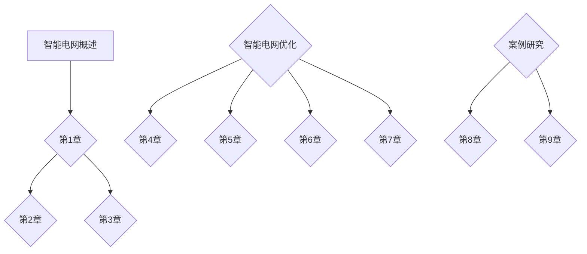

                 

# AI驱动的智能电网管理：平衡供需和减少浪费

> 关键词：智能电网，人工智能，供需平衡，优化，浪费减少

> 摘要：本文将深入探讨AI在智能电网管理中的应用，特别是在平衡供需和减少浪费方面的作用。我们将逐步分析智能电网的基础概念、AI的应用场景、供需平衡的重要性以及AI驱动的供需预测和优化策略，并通过实际案例展示AI在智能电网管理中的成功实践。最后，我们将展望智能电网发展的未来趋势。

## 第一部分：智能电网概述

### 第1章：智能电网的基础概念与架构

#### 1.1 智能电网的定义

智能电网（Smart Grid）是一种利用现代通信技术、计算机技术和自动化技术，实现对电力系统各个环节进行实时监控、管理和优化运行的电力网络。与传统电网相比，智能电网具有更高的可靠性和灵活性，能够更好地满足用户需求，同时实现能源的高效利用。

#### 1.2 智能电网的架构与关键技术

智能电网的架构通常包括发电端、输电端、配电端和用电端。各端之间通过传感器、通信网络和智能设备进行连接，形成一个高度集成的系统。关键技术包括传感器技术、通信技术、智能设备技术、数据分析技术等。

#### 1.3 智能电网与传统电网的对比

智能电网与传统电网在多个方面存在差异，如运行模式、可靠性、灵活性等。智能电网通过引入人工智能技术，能够实现更精准的供需预测和优化，从而提高电网的运行效率。

### 第2章：AI在智能电网中的应用

#### 2.1 AI在智能电网管理中的作用

人工智能技术在智能电网管理中发挥着重要作用，包括数据挖掘、故障预测、负荷预测、需求响应等。通过AI技术，能够实现对电网运行状态的实时监测和预测，提高电网的运行效率和可靠性。

#### 2.2 人工智能在电网预测和优化中的应用

人工智能技术在电网预测和优化中的应用主要体现在以下几个方面：负荷预测、发电计划优化、电网故障预测等。通过AI技术，能够实现对电网运行状态的精准预测和优化，从而提高电网的运行效率和稳定性。

#### 2.3 AI在电网故障检测与预防中的应用

人工智能技术在电网故障检测与预防中的应用主要包括故障检测、故障预测和故障诊断等。通过AI技术，能够实现对电网故障的实时监测和预测，从而提高电网的运行安全和可靠性。

### 第3章：供需平衡与优化

#### 3.1 供需平衡的重要性

供需平衡是智能电网运行的核心目标之一。通过实现供需平衡，能够提高电网的运行效率，减少能源浪费，提高电力供应的可靠性。

#### 3.2 AI驱动的供需预测方法

AI技术在供需预测中的应用主要包括基于机器学习的方法和深度学习方法。通过AI技术，能够实现对负荷和供需的精准预测，为供需平衡提供数据支持。

#### 3.3 供需优化策略与实践

供需优化策略主要包括负荷管理、需求响应和发电计划优化等。通过AI技术，能够实现对供需的实时优化，提高电网的运行效率和稳定性。

## 第二部分：AI在智能电网优化中的应用

### 第4章：智能电网调度与优化

#### 4.1 智能电网调度概述

智能电网调度是指通过对电力系统进行实时监控和调度，实现对电力供需的平衡。智能电网调度主要包括负荷调度、发电调度和储能调度等。

#### 4.2 AI驱动的调度优化算法

AI驱动的调度优化算法主要包括基于机器学习的算法和基于深度学习的算法。通过AI技术，能够实现对电网调度过程的实时优化，提高电网的运行效率和稳定性。

#### 4.3 调度优化案例分析

通过实际案例展示AI在智能电网调度优化中的应用，分析调度优化策略的效果和挑战。

### 第5章：需求侧管理

#### 5.1 需求侧管理的概念与重要性

需求侧管理是指通过优化用户的用电行为，实现对电网需求的调整。需求侧管理在智能电网运行中具有重要的意义，能够提高电网的运行效率和可靠性。

#### 5.2 AI驱动的需求响应方法

AI驱动的需求响应方法主要包括基于机器学习的方法和基于深度学习的方法。通过AI技术，能够实现对用户用电行为的实时监测和响应，优化电网的运行效率。

#### 5.3 需求侧管理案例分析

通过实际案例展示AI在需求侧管理中的应用，分析需求响应策略的效果和挑战。

### 第6章：电网故障检测与预防

#### 6.1 电网故障检测的重要性

电网故障检测是保障电网运行安全的重要环节。通过实时监测电网运行状态，能够及时发现和预警故障，提高电网的运行安全性。

#### 6.2 AI驱动的故障检测方法

AI驱动的故障检测方法主要包括基于机器学习的方法和基于深度学习的方法。通过AI技术，能够实现对电网故障的实时监测和预测，提高电网的运行安全性。

#### 6.3 故障预防策略与实践

通过实际案例展示AI在电网故障检测与预防中的应用，分析故障预防策略的效果和挑战。

### 第7章：AI驱动的电网规划与设计

#### 7.1 智能电网规划概述

智能电网规划是指根据电网的运行需求和发展趋势，制定电网的发展规划和建设方案。智能电网规划在电网建设和运行中具有重要作用。

#### 7.2 AI在电网规划中的应用

AI技术在电网规划中的应用主要包括数据挖掘、场景模拟和优化算法等。通过AI技术，能够实现对电网规划的精准预测和优化，提高电网的规划效率和准确性。

#### 7.3 电网规划与设计案例分析

通过实际案例展示AI在电网规划与设计中的应用，分析电网规划与设计策略的效果和挑战。

## 第三部分：AI驱动的智能电网管理案例研究

### 第8章：成功案例研究

#### 8.1 案例一：某城市智能电网建设项目

介绍某城市智能电网建设项目，分析AI技术在项目中的应用和效果。

#### 8.2 案例二：某电力公司AI驱动的供需优化实践

介绍某电力公司采用AI技术进行供需优化的实践，分析供需优化策略的效果和挑战。

#### 8.3 案例三：智能电网中的AI应用挑战与解决方案

介绍智能电网中AI应用的挑战和解决方案，分析AI技术在智能电网中的发展前景。

### 第9章：未来展望与趋势

#### 9.1 智能电网发展的未来趋势

分析智能电网发展的未来趋势，探讨AI技术在智能电网中的潜在应用。

#### 9.2 AI在智能电网中的挑战与机遇

讨论AI在智能电网中的挑战和机遇，分析AI技术在智能电网中的发展前景。

#### 9.3 智能电网的未来发展方向

展望智能电网的未来发展方向，探讨AI技术在智能电网中的潜在应用。

## 附录：相关工具与技术

### 附录A：智能电网与AI应用相关工具

介绍智能电网与AI应用相关的工具，包括数据采集与处理工具、机器学习框架与库、电网调度软件与平台等。

### 附录B：参考书目与文献

列出智能电网与AI应用相关的参考书目与文献，为读者提供进一步学习和研究的资源。

**Mermaid 流程图示例：**

**作者信息：**

作者：AI天才研究院/AI Genius Institute & 禅与计算机程序设计艺术 /Zen And The Art of Computer Programming**

