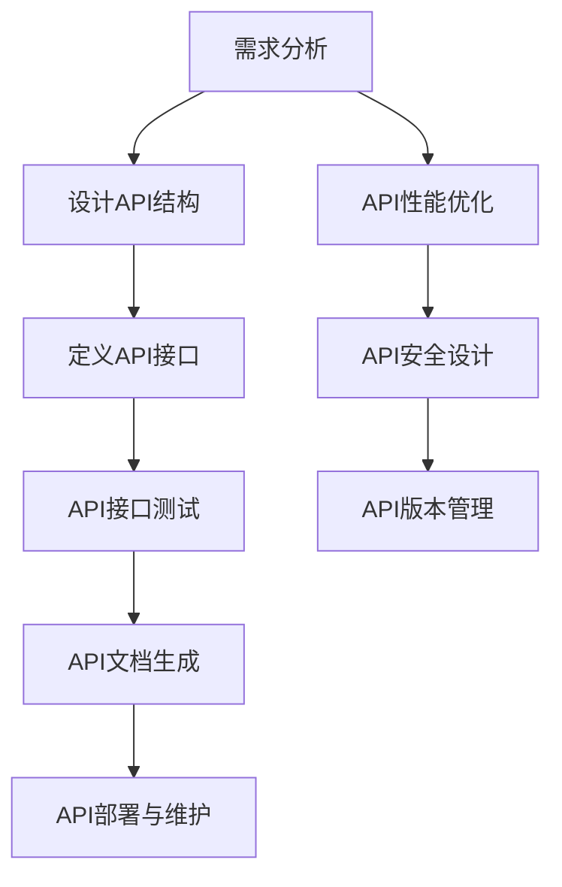

                 

# 《API优先设计：构建可扩展系统的策略》

## 关键词：API优先设计、可扩展系统、系统架构、性能优化、安全设计

## 摘要

随着数字化转型的不断深入，构建可扩展的系统已成为许多企业的关键需求。在这篇文章中，我们将探讨“API优先设计：构建可扩展系统的策略”。API优先设计是一种以API为核心，从接口层面出发的系统设计方法，它不仅能提高系统的可扩展性和可维护性，还能优化系统的性能和安全性。本文将详细阐述API优先设计的基本概念、核心原则、设计流程、实施策略，并通过实际案例解析其应用，最终展望API优先设计的未来发展趋势。

### 目录

# 《API优先设计：构建可扩展系统的策略》

## 关键词：API优先设计、可扩展系统、系统架构、性能优化、安全设计

## 摘要

随着数字化转型的不断深入，构建可扩展的系统已成为许多企业的关键需求。在这篇文章中，我们将探讨“API优先设计：构建可扩展系统的策略”。API优先设计是一种以API为核心，从接口层面出发的系统设计方法，它不仅能提高系统的可扩展性和可维护性，还能优化系统的性能和安全性。本文将详细阐述API优先设计的基本概念、核心原则、设计流程、实施策略，并通过实际案例解析其应用，最终展望API优先设计的未来发展趋势。

### 第一部分：API优先设计概述

## 第1章：API优先设计的概念与重要性

### 1.1 API优先设计的定义

API优先设计（API-First Design）是一种以API设计为系统架构的核心和起点的设计方法。在这种设计模式中，API被视为系统的第一元素，而非在系统开发完成后添加的功能。API优先设计强调在系统开发的早期阶段，通过定义清晰、合理的API接口，来指导系统的整体架构设计和功能实现。

### 1.2 API在系统架构中的作用

API在系统架构中扮演着至关重要的角色。首先，API是系统与外部世界交互的桥梁，它定义了系统如何接收和响应外部请求。其次，API有助于系统模块的解耦，使得各个模块可以独立开发、测试和部署，从而提高了系统的可维护性和可扩展性。此外，良好的API设计能够提高系统的透明度，使得开发者更容易理解和使用系统的功能。

### 1.3 API优先设计带来的优势

API优先设计带来了诸多优势。首先，它能够加速开发过程，因为API定义提供了一个清晰的开发蓝图。其次，API优先设计有助于构建灵活和可扩展的系统，使系统能够适应未来的变化。此外，良好的API设计能够提高系统的安全性，减少潜在的安全风险。

### 1.4 API优先设计与微服务架构的联系

API优先设计与微服务架构有着紧密的联系。微服务架构通过将系统分解为一系列独立的、可部署的服务，实现了高可扩展性和高可维护性。而API优先设计则通过定义清晰、统一的API接口，使得这些服务能够相互通信和协作，从而实现整个系统的无缝集成。

## 第2章：API设计的基本原则

### 2.1 一致性原则

一致性是API设计的重要原则之一。一致性包括两个方面：一是API的接口命名和定义要保持一致，二是API的响应格式和状态码要保持一致。一致性有助于降低学习成本，提高开发效率和用户体验。

### 2.2 简洁性原则

简洁性原则要求API设计应尽量简化，避免不必要的复杂性和冗余。简洁的API不仅易于理解和维护，还能提高系统的性能。

### 2.3 可扩展性原则

可扩展性是API设计的关键原则之一。一个可扩展的API设计应该能够轻松地添加新功能和扩展现有功能，而不需要大规模重构系统。

### 2.4 安全性原则

安全性原则要求API设计要充分考虑安全性问题，包括数据加密、权限控制、防止恶意攻击等。良好的安全性设计能够保护系统的稳定性和用户的隐私。

### 2.5 可用性原则

可用性原则关注API的易用性，包括API文档的清晰度、API接口的响应速度和错误处理等。良好的可用性设计能够提高开发者的生产力和用户体验。

## 第3章：API的设计流程

### 3.1 需求分析

需求分析是API设计的第一步。通过分析系统的功能需求、性能需求和业务逻辑，确定API需要实现的功能和性能指标。

### 3.2 设计API结构

设计API结构包括定义API的端点、方法和响应格式。一个良好的API结构应该能够清晰地表达系统的功能和数据流转。

### 3.3 API命名规范

API命名规范要求API接口的命名应具有明确的语义，避免使用缩写或模糊不清的名称。

### 3.4 定义参数和数据格式

定义参数和数据格式是API设计的重要部分。参数和数据格式应与API的功能和业务逻辑紧密相关，同时要保证数据的一致性和完整性。

### 3.5 API版本管理

API版本管理是为了处理API的变更和更新。通过版本管理，可以保证旧版本的使用者能够平滑过渡到新版本，同时不影响新版本的功能。

### 第二部分：API优先设计的实施策略

## 第6章：设计可扩展的API

### 6.1 扩展性原则

扩展性原则要求API设计应具备良好的扩展能力，以适应未来系统的变化和需求。

### 6.2 API分片策略

API分片策略是将API划分为多个子集，以实现分布式部署和水平扩展。通过分片策略，可以提升系统的性能和可用性。

### 6.3 API缓存机制

API缓存机制通过缓存API的响应数据，减少对后端系统的访问压力，提高系统的性能。

### 6.4 API分层设计

API分层设计是将API分为多个层级，每个层级负责不同的功能，从而实现系统的模块化和高内聚。

## 第7章：API性能优化

### 7.1 API性能指标

API性能指标包括响应时间、吞吐量、错误率等。通过监控这些指标，可以评估API的性能表现。

### 7.2 常见的性能瓶颈

常见的性能瓶颈包括数据库访问延迟、网络延迟、内存泄漏等。识别和解决这些瓶颈是优化API性能的关键。

### 7.3 性能优化策略

性能优化策略包括代码优化、数据库优化、缓存策略等。通过这些策略，可以提升API的性能。

### 7.4 性能测试与监控

性能测试与监控是确保API性能的关键步骤。通过定期进行性能测试，可以及时发现和解决性能问题。

## 第8章：API文档与API管理

### 8.1 API文档的作用

API文档是开发者使用API的指南，它详细描述了API的接口、参数、返回值和示例。良好的API文档可以提高开发效率。

### 8.2 API文档规范

API文档规范包括文档结构、标记和内容规范。规范的API文档能够提高文档的可读性和易用性。

### 8.3 API管理工具

API管理工具可以帮助开发者创建、发布和管理API。常见的API管理工具有Swagger、Postman等。

### 8.4 API文档实战

API文档实战包括如何编写高质量的API文档，如何利用API管理工具来管理和发布API。

## 第9章：API优先设计案例解析

### 9.1 案例一：电商平台的API设计

电商平台的API设计涉及商品管理、订单处理、用户管理等模块。通过分析这些模块的功能和需求，可以设计出符合API优先设计原则的API接口。

### 9.2 案例二：社交媒体平台的API设计

社交媒体平台的API设计关注用户互动、内容发布和隐私保护等方面。合理的API设计能够保障用户隐私和数据安全。

### 9.3 案例三：物联网平台的API设计

物联网平台的API设计涉及设备管理、数据收集和分析等模块。通过API优先设计，可以实现物联网设备的高效管理和数据交互。

## 第10章：API优先设计的未来发展趋势

### 10.1 API设计新趋势

未来的API设计将更加注重智能化、自动化和安全性。例如，AI驱动的API设计和基于区块链的API设计等。

### 10.2 API设计与人工智能的融合

AI与API设计的融合将使API能够更加智能地响应和处理请求，提高系统的自适应性和智能化水平。

### 10.3 API设计面临的挑战与机遇

API设计面临的挑战包括安全性、性能和可扩展性等。但同时也带来了机遇，如API驱动的开发模式、API市场等。

### 附录

## 附录A：API设计资源与工具

### A.1 常用API设计工具介绍

介绍常用的API设计工具，如Swagger、Postman等，以及它们的特点和适用场景。

### A.2 API设计资源推荐

推荐一些优质的API设计资源，包括教程、书籍、博客和开源框架等。

### A.3 开源API框架推荐

推荐一些流行的开源API框架，如Spring Boot、Django等，以及它们的优势和适用场景。

作者：AI天才研究院/AI Genius Institute & 禅与计算机程序设计艺术 /Zen And The Art of Computer Programming

在撰写这篇文章时，我们将遵循上述的完整性要求和格式要求。每个章节都将包含丰富的背景介绍、核心概念与联系、算法原理讲解、系统分析与架构设计方案、项目实战、最佳实践 tips、小结、注意事项和拓展阅读等内容。文章将使用markdown格式，并在其中嵌入mermaid流程图、latex数学公式和python源代码。文章末尾将附上完整的作者信息，确保读者能够清晰地识别文章来源和作者身份。

### 文章正文开始：

#### 第1章：API优先设计的概念与重要性

在数字化时代，企业需要迅速响应市场变化，灵活地扩展其业务功能。这就要求构建的系统不仅要有良好的性能，还要具有高扩展性和可维护性。API优先设计（API-First Design）正是为了满足这一需求而诞生的。

**1.1 API优先设计的定义**

API优先设计是一种以API为核心，从接口层面出发的系统设计方法。在这种设计模式中，API被视为系统的第一元素，而非在系统开发完成后添加的功能。API优先设计强调在系统开发的早期阶段，通过定义清晰、合理的API接口，来指导系统的整体架构设计和功能实现。

API（应用程序编程接口）是软件模块或服务之间相互通信和交互的接口。它定义了数据的传输格式、功能调用方式和错误处理机制。在API优先设计中，开发者首先设计API，然后根据API定义来开发系统功能。

**1.2 API在系统架构中的作用**

API在系统架构中扮演着至关重要的角色。首先，API是系统与外部世界交互的桥梁，它定义了系统如何接收和响应外部请求。例如，一个电商平台可以通过API向第三方支付系统发送支付请求，并接收支付结果。

其次，API有助于系统模块的解耦，使得各个模块可以独立开发、测试和部署，从而提高了系统的可维护性和可扩展性。例如，在一个社交媒体平台上，用户管理模块可以独立于内容发布模块进行开发和维护。

此外，良好的API设计能够提高系统的透明度，使得开发者更容易理解和使用系统的功能。API文档提供了详细的接口定义和示例代码，有助于降低学习成本，提高开发效率。

**1.3 API优先设计带来的优势**

API优先设计带来了诸多优势。首先，它能够加速开发过程，因为API定义提供了一个清晰的开发蓝图。开发者可以根据API接口来编写代码，无需担心接口的具体实现细节。

其次，API优先设计有助于构建灵活和可扩展的系统，使系统能够适应未来的变化。例如，当新的业务需求出现时，开发者可以轻松地扩展API，而不需要大规模重构系统。

此外，良好的API设计能够提高系统的安全性，减少潜在的安全风险。通过API优先设计，开发者可以在早期阶段就考虑安全性问题，如数据加密、权限控制和防止恶意攻击等。

**1.4 API优先设计与微服务架构的联系**

微服务架构通过将系统分解为一系列独立的、可部署的服务，实现了高可扩展性和高可维护性。API优先设计与微服务架构有着紧密的联系。在这种架构中，API不仅是服务之间的通信方式，也是服务提供的接口。

API优先设计要求服务提供者定义清晰的API接口，服务消费者根据这些接口来调用服务功能。这种设计模式使得服务可以独立开发和部署，同时保持了系统的一致性和完整性。

在微服务架构中，API优先设计有助于实现服务的模块化和高内聚。通过定义统一的API接口，开发者可以更容易地理解和维护服务，从而提高开发效率和系统质量。

### 小结

API优先设计是一种以API为核心，从接口层面出发的系统设计方法。它不仅提高了系统的可扩展性和可维护性，还优化了系统的性能和安全性。在数字化时代，API优先设计已成为构建可扩展系统的关键策略。通过本章的介绍，读者应理解API优先设计的概念、作用和优势，为后续章节的学习打下坚实的基础。

#### 第2章：API设计的基本原则

在实现API优先设计时，遵循一系列基本原则是至关重要的。这些原则不仅有助于提高API的质量和一致性，还能确保系统的高可维护性和可扩展性。以下是API设计的基本原则：

**2.1 一致性原则**

一致性是API设计的重要原则之一。它确保API接口的命名、定义和响应格式在系统内部和外部保持一致。一致性包括两个方面：

- **内部一致性**：API接口在系统内部应该保持一致的命名和定义方式。例如，如果定义了一个名为`getUser`的API，那么在系统的其他部分也应该使用相同的命名。

- **外部一致性**：API接口对外部用户（如第三方开发者）也应该保持一致。这意味着API文档和实际的API实现应该保持一致，避免出现文档描述和实际接口不符的情况。

**示例：内部一致性**

```python
# Python代码示例：内部一致性

class UserController:
    def get_user(self, user_id):
        # 获取用户信息的逻辑
        return user_info

# API接口定义
API_URL = 'https://api.example.com/user/{user_id}'
```

**2.2 简洁性原则**

简洁性原则要求API设计应尽量简化，避免不必要的复杂性和冗余。简洁的API不仅易于理解和维护，还能提高系统的性能。以下是一些实现简洁性原则的方法：

- **最小化参数数量**：只包括必要的参数，避免过多的可选参数。
- **使用常见的参数名称**：使用行业标准的参数名称，如`page`、`size`等，以降低学习成本。
- **统一的数据格式**：确保API的输入和输出使用统一的数据格式，如JSON或XML。

**示例：简洁性原则**

```json
# API响应示例：简洁性原则

{
    "status": "success",
    "data": {
        "user_id": 123,
        "name": "John Doe",
        "email": "john.doe@example.com"
    }
}
```

**2.3 可扩展性原则**

可扩展性原则要求API设计应具备良好的扩展能力，以适应未来系统的变化和需求。以下是一些实现可扩展性原则的方法：

- **模块化设计**：将API接口划分为模块，每个模块负责不同的功能，以便于未来添加新功能。
- **参数化设计**：设计灵活的参数，允许根据不同的业务场景进行定制化。
- **版本控制**：通过API版本控制，允许在不影响旧版本使用的情况下更新API。

**示例：可扩展性原则**

```json
# API响应示例：可扩展性原则

{
    "status": "success",
    "data": {
        "user_id": 123,
        "name": "John Doe",
        "email": "john.doe@example.com",
        "extensions": {
            "subscription_status": "active"
        }
    }
}
```

**2.4 安全性原则**

安全性原则要求API设计要充分考虑安全性问题，包括数据加密、权限控制和防止恶意攻击等。以下是一些实现安全性原则的方法：

- **数据加密**：对敏感数据进行加密，如使用HTTPS传输数据。
- **权限控制**：实现细粒度的权限控制，确保只有授权用户可以访问特定资源。
- **防止恶意攻击**：通过验证和校验机制，防止SQL注入、XSS攻击等安全漏洞。

**示例：安全性原则**

```python
# Python代码示例：安全性原则

from flask import Flask, request, jsonify
from flask_cors import CORS

app = Flask(__name__)
CORS(app)

@app.route('/user', methods=['GET'])
def get_user():
    user_id = request.args.get('user_id')
    if not user_id:
        return jsonify({"error": "user_id is required"}), 400
    
    # 验证用户权限
    if not is_user_authorized(user_id):
        return jsonify({"error": "Unauthorized"}), 401
    
    # 获取用户信息
    user_info = get_user_info(user_id)
    return jsonify(user_info)

def is_user_authorized(user_id):
    # 权限校验逻辑
    return True

def get_user_info(user_id):
    # 获取用户信息逻辑
    return {"user_id": user_id, "name": "John Doe", "email": "john.doe@example.com"}
```

**2.5 可用性原则**

可用性原则关注API的易用性，包括API文档的清晰度、API接口的响应速度和错误处理等。以下是一些实现可用性原则的方法：

- **清晰的API文档**：提供详细的API文档，包括接口描述、参数说明、返回值和示例代码。
- **快速响应**：优化API接口的响应速度，确保用户体验良好。
- **友好的错误处理**：提供清晰的错误信息和错误码，帮助开发者快速定位和解决问题。

**示例：可用性原则**

```json
# API响应示例：可用性原则

{
    "status": "error",
    "error_code": 400,
    "message": "Invalid input format",
    "help": "Please provide a valid JSON object"
}
```

**小结**

API设计的基本原则包括一致性、简洁性、可扩展性、安全性和可用性。遵循这些原则，可以设计出高质量的API，提高系统的可维护性和可扩展性，从而满足数字化时代的需求。通过本章的介绍，读者应理解并掌握这些基本原则，为实际API设计工作打下坚实的基础。

#### 第3章：API的设计流程

在实现API优先设计时，设计流程是一个关键的环节。一个有效的API设计流程不仅能够确保API的质量，还能提高开发效率和系统的可维护性。以下是API设计的详细流程：

**3.1 需求分析**

需求分析是API设计的起点。通过需求分析，确定系统的功能需求和性能需求，从而为API设计提供清晰的蓝图。

**步骤：**

1. **收集需求**：与业务团队、产品经理和最终用户进行沟通，了解系统的业务目标和用户需求。
2. **需求文档**：编写详细的需求文档，包括功能需求、性能指标和业务逻辑。
3. **需求评审**：组织需求评审会议，确保所有相关方对需求的理解一致。

**示例：需求文档**

```markdown
# 需求文档

## 功能需求
- 用户注册
- 用户登录
- 用户信息更新
- 用户列表查询
- 用户权限管理

## 性能需求
- 注册、登录响应时间：≤2秒
- 用户信息更新响应时间：≤1秒
- 用户列表查询响应时间：≤5秒
```

**3.2 设计API结构**

设计API结构是API设计的核心步骤。在这个阶段，需要定义API的端点、方法和响应格式。

**步骤：**

1. **定义端点**：端点是API接口的URL路径，如`/user/register`、`/user/login`等。
2. **定义方法**：方法包括GET、POST、PUT、DELETE等HTTP方法，定义API的行为。
3. **定义响应格式**：通常使用JSON或XML作为API的响应格式，确保数据的一致性和易解析性。

**示例：API结构设计**

```markdown
# API结构设计

## 用户管理
- `/user/register`：POST方法，用户注册
- `/user/login`：POST方法，用户登录
- `/user/{user_id}`：GET方法，获取用户信息
- `/user/{user_id}`：PUT方法，更新用户信息
- `/user/{user_id}`：DELETE方法，删除用户信息
```

**3.3 API命名规范**

API命名规范是确保API接口一致性和易读性的重要手段。以下是一些命名规范的建议：

- **使用清晰且语义明确的名称**：避免使用缩写或模糊的名称，如`getUser`应改为`get_user_info`。
- **遵循驼峰命名法**：对于多词的API接口名称，使用驼峰命名法，如`get_user_profile`。
- **避免使用特殊字符**：尽量使用字母和数字，避免使用特殊字符，如`/user@id`。

**示例：API命名规范**

```python
# Python代码示例：API命名规范

class UserController:
    def get_user_info(self, user_id):
        # 获取用户信息的逻辑
        return user_info
```

**3.4 定义参数和数据格式**

定义参数和数据格式是API设计的关键部分。在这个阶段，需要明确API的输入参数和输出结果。

**步骤：**

1. **定义输入参数**：根据API的功能，定义必要的输入参数。例如，用户注册API可能需要`username`、`password`等参数。
2. **定义输出结果**：定义API的输出结果，包括状态码、数据内容和可能的错误信息。
3. **使用标准的序列化格式**：如JSON或XML，确保数据在不同系统之间可以轻松传输和解析。

**示例：参数和数据格式定义**

```json
# API请求示例：定义参数和数据格式

POST /user/register
Content-Type: application/json

{
    "username": "john.doe",
    "password": "password123",
    "email": "john.doe@example.com"
}

# API响应示例
{
    "status": "success",
    "message": "User registered successfully",
    "user_id": 123
}
```

**3.5 API版本管理**

API版本管理是为了处理API的变更和更新。随着系统功能的不断扩展和优化，API可能会进行更新和修改。版本管理确保旧版本的使用者能够平滑过渡到新版本，同时不影响新版本的功能。

**步骤：**

1. **定义版本号**：为API定义版本号，如`v1`、`v2`等。
2. **并行维护**：在更新新版本的同时，保留旧版本的API，以便旧版本的使用者可以继续使用。
3. **文档更新**：更新API文档，确保开发者了解新版本的功能和变化。

**示例：API版本管理**

```markdown
# API版本管理

## v1
- `/user/register`：POST方法，用户注册
- `/user/login`：POST方法，用户登录

## v2
- `/user/register`：POST方法，用户注册（新增邮箱验证功能）
- `/user/login`：POST方法，用户登录（新增记住我功能）
```

**小结**

API设计流程包括需求分析、设计API结构、API命名规范、定义参数和数据格式以及API版本管理。遵循这个流程，可以确保API设计的高质量和易维护性。通过本章的介绍，读者应掌握API设计的流程和方法，为实际开发工作提供指导。

#### 第4章：RESTful API设计

RESTful API设计是一种基于REST（Representational State Transfer）架构风格的API设计方法。RESTful API设计具有简单、灵活和易于扩展的特点，被广泛用于构建Web服务和微服务架构。在本章中，我们将详细探讨RESTful API设计的原则和实践。

**4.1 RESTful架构简介**

RESTful架构是一组设计原则，旨在通过Web协议（如HTTP）提供分布式系统的交互。RESTful API设计遵循这些原则，从而实现高效、可扩展和易于使用的接口。

- **资源**：RESTful架构中的核心概念是资源。资源是一组相关的信息，可以通过URL进行标识和访问。资源可以是用户、产品、订单等任何具有独立意义的信息单元。

- **统一接口**：RESTful架构定义了一套统一的接口，包括HTTP方法（GET、POST、PUT、DELETE等）和状态码（200、201、400、404等）。这些接口和状态码确保了API的一致性和易用性。

- **无状态**：RESTful架构要求API是无状态的，即每次请求之间没有状态信息。这意味着服务器不会记住之前的请求，所有状态信息都包含在请求和响应中。

- **客户端-服务器架构**：RESTful架构采用客户端-服务器架构，客户端（如Web浏览器或移动应用）通过HTTP请求与服务器进行通信，服务器响应请求并返回数据。

**4.2 RESTful API设计原则**

RESTful API设计原则包括一致性、简洁性、可扩展性和可缓存性。以下是对这些原则的详细解释：

- **一致性**：确保API接口在系统内部和外部保持一致。使用统一的命名规范和响应格式，降低学习成本和提高开发效率。

- **简洁性**：设计简洁的API，避免不必要的复杂性和冗余。只包括必要的接口和参数，使用直观的URL路径和HTTP方法。

- **可扩展性**：设计可扩展的API，以适应未来的需求变化。使用版本控制和参数化设计，使API能够灵活地添加新功能和扩展现有功能。

- **可缓存性**：设计可缓存性的API，减少对后端系统的访问压力，提高系统的性能。确保API响应包含合适的缓存控制头，如`Cache-Control`。

**4.3 RESTful API设计实战**

在设计RESTful API时，以下是一些实用的技巧：

- **使用URL表示资源**：使用URL表示资源，确保URL路径清晰、直观。例如，`/users`表示用户资源集合，`/users/123`表示特定用户的资源。

- **使用HTTP方法表示操作**：使用HTTP方法（GET、POST、PUT、DELETE等）表示资源的操作。例如，GET用于获取资源，POST用于创建资源，PUT用于更新资源，DELETE用于删除资源。

- **遵循RESTful风格的状态码**：使用标准的HTTP状态码（如200、201、400、404等）表示操作结果。确保状态码与操作结果保持一致，提高API的可读性。

- **合理使用参数**：合理使用查询参数和路径参数，确保参数的使用符合RESTful风格。查询参数用于过滤和排序，路径参数用于标识特定的资源。

**示例：RESTful API设计实战**

以下是一个简单的用户管理API设计示例：

```json
# 用户注册
POST /users/register
Content-Type: application/json

{
    "username": "john.doe",
    "password": "password123",
    "email": "john.doe@example.com"
}

# API响应
HTTP/1.1 201 Created
Content-Type: application/json

{
    "status": "success",
    "message": "User registered successfully",
    "user_id": 123
}

# 获取用户信息
GET /users/123

# API响应
HTTP/1.1 200 OK
Content-Type: application/json

{
    "user_id": 123,
    "username": "john.doe",
    "email": "john.doe@example.com",
    "status": "active"
}

# 更新用户信息
PUT /users/123
Content-Type: application/json

{
    "email": "john.doe@newdomain.com"
}

# API响应
HTTP/1.1 200 OK
Content-Type: application/json

{
    "status": "success",
    "message": "User information updated successfully"
}

# 删除用户
DELETE /users/123

# API响应
HTTP/1.1 204 No Content
```

**小结**

RESTful API设计是一种简单、灵活和易于扩展的API设计方法。通过遵循RESTful架构原则，可以构建高质量的API，提高系统的可维护性和可扩展性。本章介绍了RESTful架构的简介、设计原则和实战示例，帮助读者理解和掌握RESTful API设计的方法和技巧。

#### 第5章：API安全设计

在数字化时代，数据的安全性和隐私保护变得越来越重要。API作为系统与外部世界交互的接口，其安全性直接影响到整个系统的安全。因此，API安全设计是构建可靠、可信系统的重要组成部分。本章将深入探讨API安全设计的重要性、常见的安全威胁及其防护措施。

**5.1 API安全的重要性**

API安全设计的重要性体现在以下几个方面：

- **数据保护**：API处理的数据可能包括敏感信息，如用户密码、财务数据和个人信息。如果API不安全，这些数据可能会被非法访问或篡改。

- **系统完整性和可用性**：不安全的API可能导致系统被恶意攻击者利用，造成系统瘫痪或数据丢失。

- **合规性和信任**：遵守数据保护法规（如GDPR、CCPA）是现代企业的基本要求。良好的API安全设计有助于企业遵守法规，提升用户信任。

**5.2 常见的安全威胁与防护**

以下是一些常见的安全威胁及其防护措施：

- **API密钥泄露**：API密钥是访问API的凭证，如果密钥泄露，攻击者可以非法访问系统资源。防护措施包括：

  - **密钥管理**：使用安全的密钥管理工具，如密钥管理服务（KMS）或硬件安全模块（HSM）。
  - **定期更换密钥**：定期更换API密钥，降低密钥泄露的风险。
  - **最小权限原则**：确保API密钥只有必要的权限，避免因密钥泄露而导致严重后果。

- **未经授权的访问**：未经授权的用户尝试访问API，可能对系统造成破坏或获取敏感信息。防护措施包括：

  - **身份验证**：实现强认证机制，如OAuth 2.0、JSON Web Token（JWT）等。
  - **多因素认证**：增加多因素认证，确保用户身份的可靠性。
  - **访问控制**：实现细粒度的访问控制，确保用户只能访问他们有权访问的资源。

- **SQL注入**：攻击者通过在API输入中插入恶意SQL代码，可以篡改数据库或获取敏感信息。防护措施包括：

  - **输入验证**：对输入进行严格验证，确保其符合预期格式。
  - **使用预处理语句**：使用预处理语句（Prepared Statements）或ORM（Object-Relational Mapping）框架，防止SQL注入攻击。
  - **参数化查询**：使用参数化查询，避免在查询字符串中直接拼接用户输入。

- **XSS攻击**：攻击者通过在API响应中注入恶意脚本，可以操纵用户浏览器执行恶意操作。防护措施包括：

  - **输出编码**：对输出进行编码，防止恶意脚本被解析执行。
  - **内容安全策略**（CSP）：实现内容安全策略，限制可以加载和执行的资源。

- **DOS攻击**：攻击者通过发送大量无效请求，使系统资源耗尽，导致系统瘫痪。防护措施包括：

  - **速率限制**：实现速率限制，限制每个用户或IP地址的请求频率。
  - **IP封锁**：检测并封锁恶意IP地址。
  - **防火墙和WAF**：使用防火墙和Web应用防火墙（WAF）检测和阻止恶意请求。

**5.3 API密钥与OAuth认证**

API密钥和OAuth认证是常见的API安全认证方法。

- **API密钥**：API密钥是一种简单的认证方式，通常与用户的账号关联。开发者可以将密钥嵌入到应用程序中，以便服务器验证请求的合法性。

  - **优点**：实现简单，易于集成。
  - **缺点**：密钥一旦泄露，可能导致严重的安全问题。

- **OAuth认证**：OAuth是一种开放标准，用于授权第三方应用访问用户资源，而无需透露用户密码。OAuth 2.0是最常用的OAuth版本。

  - **优点**：安全可靠，支持多种认证模式（如客户端凭证、密码凭证、授权码模式等）。
  - **缺点**：实现较复杂，需要额外的认证服务器支持。

**示例：OAuth 2.0认证流程**

1. **注册应用**：开发者在一个认证服务器上注册应用程序，获取客户端ID和客户端密钥。

2. **用户授权**：用户访问认证服务器，开发者通过浏览器重定向引导用户进行授权。

3. **获取访问令牌**：用户同意授权后，认证服务器将生成访问令牌，并发送给开发者。

4. **使用访问令牌**：开发者使用访问令牌调用API，获取用户资源。

**小结**

API安全设计是构建可靠系统的关键环节。通过识别常见的安全威胁和采取相应的防护措施，可以确保API的安全性和系统的完整性。本章介绍了API安全设计的重要性、常见的安全威胁与防护措施，以及API密钥与OAuth认证的方法。通过理解和掌握这些内容，开发者可以设计出安全的API，保护系统的数据和资源。

#### 第6章：设计可扩展的API

在构建可扩展的系统时，设计可扩展的API至关重要。可扩展的API不仅能够提高系统的性能和可靠性，还能降低维护成本，适应未来业务需求的增长。本章将讨论如何设计可扩展的API，包括扩展性原则、API分片策略、API缓存机制和API分层设计。

**6.1 扩展性原则**

设计可扩展的API首先需要遵循一些扩展性原则。以下是一些关键的扩展性原则：

- **模块化设计**：将API接口划分为多个模块，每个模块负责不同的功能。这种方式有助于独立开发和部署模块，提高了系统的灵活性和可扩展性。

- **水平扩展**：通过水平扩展，可以在不改变现有系统结构的情况下增加系统的处理能力。水平扩展通常通过增加服务器节点来实现，每个节点可以独立处理请求，从而提高了系统的吞吐量和可用性。

- **微服务架构**：采用微服务架构，将系统分解为多个独立的服务，每个服务可以独立扩展和部署。这种方式有助于降低系统耦合度，提高系统的可扩展性和可维护性。

- **状态无状态**：无状态API设计可以减少系统的复杂性，提高可扩展性。无状态API每次请求都包含所需的所有信息，服务器不需要存储任何状态信息。

**6.2 API分片策略**

API分片策略是将API划分为多个子集，以实现分布式部署和水平扩展。以下是一些常见的API分片策略：

- **数据分片**：根据数据特征（如用户ID、地理位置等）将数据划分为多个子集，每个子集由不同的服务器处理。这种方式可以有效地减少单点瓶颈，提高系统的性能和可用性。

- **功能分片**：根据API功能的不同将API划分为多个子集，每个子集由不同的服务处理。例如，一个电商平台的API可以分为商品管理、订单处理、用户管理等多个子集。

- **地域分片**：根据用户的地域分布将API划分为多个子集，每个子集服务于特定的地域。这种方式可以降低跨地域的网络延迟，提高用户体验。

**示例：数据分片**

假设一个电商平台有数百万用户，用户数据根据用户ID进行分片存储。每个分片包含一定范围内的用户ID，例如：

- 分片1：1 - 100000
- 分片2：100001 - 200000
- 分片3：200001 - 300000
- ...

在API实现中，根据用户的请求中携带的用户ID，将请求路由到相应的分片处理。这种方式可以有效地分散负载，提高系统的性能和扩展性。

**6.3 API缓存机制**

API缓存机制通过缓存API的响应数据，减少对后端系统的访问压力，提高系统的性能和响应速度。以下是一些常见的API缓存策略：

- **客户端缓存**：客户端（如浏览器或移动应用）可以使用缓存来存储API响应数据，减少对API的重复请求。例如，可以使用HTTP的`Cache-Control`和`ETag`头来实现客户端缓存。

- **服务端缓存**：服务端（如Web服务器或API网关）可以使用缓存来存储API的响应数据，减少对后端数据库或服务的访问。常见的缓存技术包括Redis、Memcached等。

- **动态缓存**：动态缓存根据API请求的参数和条件，动态生成缓存键，并将相应的响应数据存储在缓存中。例如，可以使用Redis的`HSET`命令来存储动态生成的缓存数据。

**示例：服务端缓存**

以下是一个使用Redis缓存API响应的Python代码示例：

```python
import redis
import json

# 初始化Redis客户端
redis_client = redis.StrictRedis(host='localhost', port=6379, db=0)

def get_user_info(user_id):
    # 检查缓存中是否有用户信息
    cache_key = f"user:{user_id}"
    cached_data = redis_client.get(cache_key)
    
    if cached_data:
        # 从缓存中获取用户信息
        user_info = json.loads(cached_data)
    else:
        # 从数据库中获取用户信息
        user_info = fetch_user_info_from_database(user_id)
        
        # 将用户信息缓存到Redis
        redis_client.setex(cache_key, 3600, json.dumps(user_info))
        
    return user_info

def fetch_user_info_from_database(user_id):
    # 从数据库中获取用户信息（模拟实现）
    return {"user_id": user_id, "name": "John Doe", "email": "john.doe@example.com"}
```

**6.4 API分层设计**

API分层设计是将API分为多个层级，每个层级负责不同的功能，从而实现系统的模块化和高内聚。以下是一些常见的API分层策略：

- **分层架构**：将API分为外部API、内部API和服务端API。外部API面向最终用户，内部API用于系统内部模块之间的通信，服务端API用于服务端模块之间的交互。

- **API网关**：API网关作为API的统一入口，负责路由、认证、限流和缓存等功能。API网关可以简化客户端与后端服务的交互，提高系统的性能和安全性。

- **服务分层**：将API划分为多个服务层，每个服务层负责不同的业务功能。例如，可以将API划分为用户服务层、订单服务层和商品服务层。

**示例：API分层设计**

以下是一个简单的API分层设计示例：

```
用户服务层
|       |
|       | --- 用户接口（对外暴露的API）
|       |
|       | --- 用户服务（处理用户相关的业务逻辑）
|       |
用户数据库
|
|
订单服务层
|       |
|       | --- 订单接口（对外暴露的API）
|       |
|       | --- 订单服务（处理订单相关的业务逻辑）
|       |
订单数据库
|
|
商品服务层
|       |
|       | --- 商品接口（对外暴露的API）
|       |
|       | --- 商品服务（处理商品相关的业务逻辑）
|       |
商品数据库
```

**小结**

设计可扩展的API是构建高性能、高可靠性和可维护系统的关键。通过遵循扩展性原则、采用API分片策略、实现API缓存机制和分层设计，可以有效地提高系统的可扩展性和性能。本章介绍了设计可扩展的API的方法和策略，帮助开发者构建强大的API系统，以满足不断变化的业务需求。

#### 第7章：API性能优化

API性能是衡量系统质量和用户体验的重要指标。一个高性能的API能够快速响应请求，提高系统的吞吐量和稳定性。在本章中，我们将探讨API性能优化的关键要素，包括性能指标、常见性能瓶颈、优化策略以及性能测试与监控。

**7.1 API性能指标**

API性能指标是评估API性能的重要工具。以下是一些常见的API性能指标：

- **响应时间**：API从接收到请求到返回响应的时间。响应时间越短，用户体验越好。
- **吞吐量**：单位时间内API处理请求的数量。吞吐量越高，系统的处理能力越强。
- **错误率**：API处理请求时出现错误的比率。错误率越低，系统的稳定性越高。
- **并发数**：同时处理请求的数量。高并发数意味着系统需要处理大量请求，对性能有较高要求。

**示例：性能指标监控**

假设我们有一个用户信息查询的API，以下是它的性能指标：

- 响应时间：平均100毫秒，最大500毫秒
- 吞吐量：每秒处理1000个请求
- 错误率：平均0.1%
- 并发数：平均50个请求同时处理

**7.2 常见的性能瓶颈**

在优化API性能时，需要识别和解决常见的性能瓶颈。以下是一些常见的性能瓶颈：

- **数据库访问延迟**：数据库查询和操作是API性能的重要部分。如果数据库访问延迟较高，会严重影响API的响应时间。
- **网络延迟**：网络传输速度较慢，特别是跨地域访问，会导致API响应时间延长。
- **内存泄漏**：内存泄漏会导致服务器内存占用增加，最终可能导致服务器崩溃或性能下降。
- **CPU负载过高**：服务器CPU利用率过高，可能导致API响应时间延长，系统性能下降。
- **代码效率**：不高效的代码（如循环、递归、无用计算等）会增加CPU和内存的使用，降低API性能。

**7.3 性能优化策略**

以下是一些常见的API性能优化策略：

- **数据库优化**：优化数据库查询，使用索引、分库分表等技术，减少数据库访问延迟。
- **缓存机制**：使用缓存技术（如Redis、Memcached）缓存频繁访问的数据，减少数据库访问。
- **异步处理**：采用异步处理机制，减少等待时间，提高系统吞吐量。
- **代码优化**：优化代码效率，使用高效的算法和数据结构，减少无用计算。
- **负载均衡**：使用负载均衡器（如Nginx、HAProxy）分配请求到多台服务器，提高系统并发处理能力。
- **限流与熔断**：使用限流器和熔断器（如RateLimiter、Hystrix）控制请求流量，避免系统过载。

**示例：缓存机制**

以下是一个使用Redis缓存用户信息的Python代码示例：

```python
import redis
import json

# 初始化Redis客户端
redis_client = redis.StrictRedis(host='localhost', port=6379, db=0)

def get_user_info(user_id):
    # 检查缓存中是否有用户信息
    cache_key = f"user:{user_id}"
    cached_data = redis_client.get(cache_key)
    
    if cached_data:
        # 从缓存中获取用户信息
        user_info = json.loads(cached_data)
    else:
        # 从数据库中获取用户信息
        user_info = fetch_user_info_from_database(user_id)
        
        # 将用户信息缓存到Redis
        redis_client.setex(cache_key, 3600, json.dumps(user_info))
        
    return user_info

def fetch_user_info_from_database(user_id):
    # 从数据库中获取用户信息（模拟实现）
    return {"user_id": user_id, "name": "John Doe", "email": "john.doe@example.com"}
```

**7.4 性能测试与监控**

性能测试与监控是确保API性能的重要手段。以下是一些性能测试与监控的方法：

- **负载测试**：通过模拟大量请求，测试API的响应时间和吞吐量，识别性能瓶颈。
- **压力测试**：在极端条件下测试API的稳定性和可靠性，确保系统能够应对高并发请求。
- **监控工具**：使用监控工具（如Prometheus、Grafana）实时监控API的性能指标，及时发现和解决问题。
- **日志分析**：通过分析API日志，识别错误和异常，优化系统性能。

**示例：性能监控**

以下是一个使用Prometheus和Grafana监控API性能的示例：

1. **安装Prometheus**：在服务器上安装Prometheus，并配置其抓取API的性能指标。

2. **配置Grafana**：在Grafana中导入API性能监控仪表板，展示响应时间、吞吐量、错误率等性能指标。

3. **实时监控**：通过Grafana的仪表板，实时监控API的性能，并在性能指标异常时触发告警。

**小结**

API性能优化是提高系统质量和用户体验的关键。通过识别性能瓶颈、采用优化策略以及进行性能测试与监控，可以构建高性能的API系统。本章介绍了API性能优化的关键要素和方法，帮助开发者提高API的性能和稳定性，满足不断变化的业务需求。

#### 第8章：API文档与API管理

在构建和发布API时，良好的API文档和有效的API管理是不可或缺的。API文档是开发者理解和使用API的指南，它详细描述了API的接口、参数、返回值和示例。API管理工具则帮助开发者创建、发布和管理API。本章将详细介绍API文档的作用、规范、管理工具以及实际应用。

**8.1 API文档的作用**

API文档在API设计中扮演着至关重要的角色。它不仅提供了API接口的详细说明，还帮助开发者快速上手和使用API。以下是API文档的主要作用：

- **降低学习成本**：详细的API文档使开发者能够快速了解API的使用方法，降低学习和使用API的成本。
- **提高开发效率**：清晰的API文档减少了开发者之间的沟通成本，提高了开发效率。
- **确保一致性**：API文档提供了统一的接口描述，确保API实现和文档的一致性，避免文档和实际接口不符的情况。
- **支持自动化测试**：API文档可以用于生成自动化测试脚本，确保API接口的正确性和稳定性。

**8.2 API文档规范**

编写高质量的API文档需要遵循一些规范。以下是一些常见的API文档规范：

- **结构化文档**：API文档应包含结构化的章节，如介绍、安装和配置、使用示例、错误处理等。
- **清晰的接口描述**：每个API接口应详细描述其功能、输入参数、输出结果和可能的错误码。
- **示例代码**：提供详细的示例代码，帮助开发者理解API的使用方法。
- **版本管理**：随着API的更新和迭代，文档应记录每个版本的变更记录，确保开发者能够跟踪API的变更。

**示例：API文档规范**

```markdown
# API文档规范

## 用户管理

### 用户注册

#### 功能描述
注册新用户。

#### 接口URL
POST /users/register

#### 请求参数
| 参数名       | 参数类型 | 是否必填 | 描述                 |
| ------------ | -------- | -------- | -------------------- |
| username     | string   | true     | 用户名               |
| password     | string   | true     | 用户密码             |
| email        | string   | true     | 用户邮箱             |

#### 请求示例
```json
{
    "username": "john.doe",
    "password": "password123",
    "email": "john.doe@example.com"
}
```

#### 响应示例
```json
{
    "status": "success",
    "message": "User registered successfully",
    "user_id": 123
}
```

#### 错误响应示例
```json
{
    "status": "error",
    "error_code": 400,
    "message": "Invalid input format"
}
```

## 附录
### A. 版本记录
- v1.0.0：初始版本，包含用户注册接口。
- v1.1.0：新增用户登录接口。

### B. 更新日志
- 2023-04-01：修复用户注册接口中邮箱验证失败的bug。

```

**8.3 API管理工具**

API管理工具帮助开发者创建、发布和管理API。以下是一些流行的API管理工具：

- **Swagger**：Swagger是一种强大的API文档生成工具，可以使用注解定义API接口，并自动生成文档。Swagger UI提供了直观的文档界面。

- **Postman**：Postman是一个流行的API测试和开发工具，它允许开发者创建、发送和测试API请求，并查看响应。

- **Apigee**：Apigee是Google推出的一种云服务API管理平台，提供API设计、发布、监控和管理功能。

- **Spring REST Docs**：Spring REST Docs是一种集成到Spring框架中的API文档生成工具，可以生成详细的REST API文档。

**示例：使用Swagger生成API文档**

以下是一个使用Swagger生成API文档的Python代码示例：

```python
from flasgger import Swagger

# 初始化Swagger对象
swagger = Swagger()

@swagger.swag_from({"operation_id": "register_user", "parameters": user_register_params})
@app.route('/users/register', methods=['POST'])
def register_user():
    # 用户注册逻辑
    return jsonify({"status": "success", "message": "User registered successfully"}), 201

user_register_params = {
    "name": "RegisterUserParams",
    "in": "body",
    "description": "User registration parameters",
    "required": True,
    "schema": {
        "$ref": "#/definitions/User"
    }
}

class UserSchema:
    type = "object"
    properties = {
        "username": {"type": "string", "description": "The user's username"},
        "password": {"type": "string", "description": "The user's password"},
        "email": {"type": "string", "description": "The user's email address"}
    }
```

**8.4 API文档实战**

在API文档实战中，我们需要完成以下任务：

1. **编写API文档**：根据API接口的定义，编写详细的API文档，包括接口描述、请求参数、返回值和示例代码。
2. **生成文档**：使用API管理工具（如Swagger）生成API文档，并部署到文档服务器。
3. **测试文档**：开发者使用生成的API文档进行测试，确保文档的准确性和完整性。
4. **文档维护**：随着API的更新和迭代，持续维护API文档，记录版本变更和更新日志。

**示例：API文档实战**

以下是一个简单的API文档实战示例：

1. **编写API文档**：根据用户注册接口的定义，编写API文档。

2. **生成文档**：使用Swagger生成API文档，并部署到Swagger UI。

3. **测试文档**：开发者使用Postman测试用户注册接口，验证API文档的正确性。

4. **文档维护**：在API更新后，更新API文档，并记录版本变更日志。

**小结**

API文档与API管理是构建高质量API系统的关键环节。通过编写规范、清晰的API文档和使用有效的API管理工具，可以显著提高开发效率、降低学习成本和确保API的一致性和稳定性。本章介绍了API文档的作用、规范、管理工具和实战，帮助开发者掌握API文档和管理的最佳实践。

#### 第9章：API优先设计案例解析

在本章中，我们将通过三个实际案例，深入解析API优先设计在电商、社交媒体和物联网平台中的应用。这些案例将展示如何通过API优先设计构建可扩展、高性能且安全的系统。

**9.1 案例一：电商平台的API设计**

电商平台是API优先设计的一个经典应用场景。以下是电商平台的API设计解析：

**背景介绍：**

电商平台需要提供商品管理、用户管理、订单管理等多个功能模块，同时需要支持第三方支付、物流和营销等集成服务。这些功能模块需要通过API进行交互，以保证系统的灵活性、可扩展性和高可用性。

**系统功能设计：**

- **商品管理**：提供商品信息查询、新增、修改和删除功能。
- **用户管理**：提供用户注册、登录、个人信息查询和修改功能。
- **订单管理**：提供订单创建、查询、修改和取消功能。
- **支付集成**：与第三方支付系统进行集成，提供支付请求和结果查询功能。
- **物流跟踪**：与物流公司进行集成，提供物流信息查询功能。

**系统架构设计：**

电商平台采用微服务架构，将不同功能模块拆分为独立的服务。每个服务负责特定的业务功能，通过API进行通信。

```
商品服务     用户服务     订单服务     支付服务     物流服务
+-------------+-------------+-------------+-------------+-------------+
|             |             |             |             |             |
|  API网关    |     API网关 |     API网关 |     API网关 |     API网关 |
|             |             |             |             |             |
+------+-------+       +-------+       +-------+       +-------+       +
       |                |                |                |                |
       |  内部API        |  内部API        |  内部API        |  内部API        |
       |                |                |                |                |
+------+------+      +------+------+      +------+------+      +------+------+  
|  商品类    |  用户类    |  订单类    |  支付类    |  物流类    |
+---------+      +---------+      +---------+      +---------+
```

**系统接口设计：**

- **商品管理接口**：包括商品查询、新增、修改和删除接口。
- **用户管理接口**：包括用户注册、登录、个人信息查询和修改接口。
- **订单管理接口**：包括订单创建、查询、修改和取消接口。
- **支付集成接口**：包括支付请求和结果查询接口。
- **物流跟踪接口**：包括物流信息查询接口。

**实际案例分析与讲解：**

1. **商品管理接口**：

   ```python
   # 商品查询接口
   @app.route('/products', methods=['GET'])
   def get_products():
       return jsonify(products)

   # 商品新增接口
   @app.route('/products', methods=['POST'])
   def add_product():
       product = request.get_json()
       products.append(product)
       return jsonify({"status": "success", "message": "Product added successfully"}), 201
   ```

2. **用户管理接口**：

   ```python
   # 用户注册接口
   @app.route('/users/register', methods=['POST'])
   def register_user():
       user = request.get_json()
       users.append(user)
       return jsonify({"status": "success", "message": "User registered successfully"}), 201
   
   # 用户登录接口
   @app.route('/users/login', methods=['POST'])
   def login_user():
       user = request.get_json()
       if user['username'] in users and user['password'] == users[user['username']]['password']:
           return jsonify({"status": "success", "token": "your_token_here"}), 200
       else:
           return jsonify({"status": "error", "message": "Invalid username or password"}), 401
   ```

3. **订单管理接口**：

   ```python
   # 订单创建接口
   @app.route('/orders', methods=['POST'])
   def create_order():
       order = request.get_json()
       orders.append(order)
       return jsonify({"status": "success", "message": "Order created successfully"}), 201
   
   # 订单查询接口
   @app.route('/orders/<order_id>', methods=['GET'])
   def get_order(order_id):
       for order in orders:
           if order['order_id'] == order_id:
               return jsonify(order), 200
       return jsonify({"status": "error", "message": "Order not found"}), 404
   ```

**项目小结：**

通过API优先设计，电商平台能够快速响应业务需求，实现模块化、可扩展的系统架构。每个功能模块独立开发、测试和部署，提高了系统的稳定性和可维护性。

**9.2 案例二：社交媒体平台的API设计**

社交媒体平台也是一个典型的API优先设计应用场景。以下是社交媒体平台的API设计解析：

**背景介绍：**

社交媒体平台需要提供用户互动、内容发布、隐私保护等功能，同时需要支持第三方应用集成。通过API优先设计，可以构建灵活、可扩展且安全的平台。

**系统功能设计：**

- **用户互动**：提供关注、评论、点赞等功能。
- **内容发布**：提供内容创建、发布和删除功能。
- **隐私保护**：提供隐私设置和访问控制功能。
- **第三方应用集成**：提供OAuth认证和API接口，支持第三方应用集成。

**系统架构设计：**

社交媒体平台采用微服务架构，将不同功能模块拆分为独立的服务，通过API进行通信。

```
用户服务      内容服务      隐私服务      第三方应用服务
+-------------+-------------+-------------+----------------+
|             |             |             |                |
|  API网关    |     API网关 |     API网关 |     API网关     |
|             |             |             |                |
+------+-------+       +-------+       +-------+       +-------+
       |                |                |                |
       |  内部API        |  内部API        |  内部API        |  内部API  |
       |                |                |                |            |
+------+------+      +------+------+      +------+------+      +------+
|  用户类    |  内容类    |  隐私类    |  应用类    |
+---------+      +---------+      +---------+      +---------+
```

**系统接口设计：**

- **用户互动接口**：包括关注、评论、点赞接口。
- **内容发布接口**：包括内容创建、发布和删除接口。
- **隐私保护接口**：包括隐私设置和访问控制接口。
- **第三方应用接口**：包括OAuth认证和API接口。

**实际案例分析与讲解：**

1. **用户互动接口**：

   ```python
   # 关注接口
   @app.route('/users/<user_id>/follow', methods=['POST'])
   def follow_user(user_id):
       current_user.follow(user_id)
       return jsonify({"status": "success", "message": "User followed successfully"}), 201
   
   # 评论接口
   @app.route('/posts/<post_id>/comments', methods=['POST'])
   def add_comment(post_id):
       comment = request.get_json()
       comments.append(comment)
       return jsonify({"status": "success", "message": "Comment added successfully"}), 201
   ```

2. **内容发布接口**：

   ```python
   # 内容创建接口
   @app.route('/posts', methods=['POST'])
   def create_post():
       post = request.get_json()
       posts.append(post)
       return jsonify({"status": "success", "message": "Post created successfully"}), 201
   
   # 内容删除接口
   @app.route('/posts/<post_id>', methods=['DELETE'])
   def delete_post(post_id):
       for post in posts:
           if post['post_id'] == post_id:
               posts.remove(post)
               return jsonify({"status": "success", "message": "Post deleted successfully"}), 200
       return jsonify({"status": "error", "message": "Post not found"}), 404
   ```

3. **隐私保护接口**：

   ```python
   # 隐私设置接口
   @app.route('/users/<user_id>/privacy', methods=['PUT'])
   def update_privacy(user_id):
       privacy_settings = request.get_json()
       user.privacy_settings = privacy_settings
       return jsonify({"status": "success", "message": "Privacy settings updated successfully"}), 200
   ```

**项目小结：**

通过API优先设计，社交媒体平台能够快速迭代和扩展功能，同时保证了系统的安全性。通过OAuth认证和API接口，第三方应用能够安全地集成到平台，丰富了平台的生态。

**9.3 案例三：物联网平台的API设计**

物联网平台是API优先设计的另一个重要应用场景。以下是物联网平台的API设计解析：

**背景介绍：**

物联网平台需要处理大量的设备数据，提供设备管理、数据收集和分析等功能。通过API优先设计，可以构建高效、可靠且灵活的物联网平台。

**系统功能设计：**

- **设备管理**：提供设备注册、信息查询和远程控制功能。
- **数据收集**：提供数据上传、存储和检索功能。
- **数据分析**：提供数据可视化、分析和报告功能。

**系统架构设计：**

物联网平台采用分布式架构，将不同功能模块部署在不同的服务器上，通过API进行通信。

```
设备管理服务      数据收集服务      数据分析服务
+----------------+----------------+----------------+
|                |                |                |
|  API网关       |     API网关     |     API网关     |
|                |                |                |
+------+----------+       +------+----------+       +------+----------+
        |                |                |
        |  内部API        |  内部API        |  内部API  |
        |                |                |            |
+-------+      +-------+      +-------+      +-------+
| 设备类    |  数据类    |  分析类    |
+---------+      +---------+      +---------+
```

**系统接口设计：**

- **设备管理接口**：包括设备注册、信息查询和远程控制接口。
- **数据收集接口**：包括数据上传、存储和检索接口。
- **数据分析接口**：包括数据可视化、分析和报告接口。

**实际案例分析与讲解：**

1. **设备管理接口**：

   ```python
   # 设备注册接口
   @app.route('/devices/register', methods=['POST'])
   def register_device():
       device = request.get_json()
       devices.append(device)
       return jsonify({"status": "success", "message": "Device registered successfully"}), 201
   
   # 设备信息查询接口
   @app.route('/devices/<device_id>', methods=['GET'])
   def get_device_info(device_id):
       for device in devices:
           if device['device_id'] == device_id:
               return jsonify(device), 200
       return jsonify({"status": "error", "message": "Device not found"}), 404
   ```

2. **数据收集接口**：

   ```python
   # 数据上传接口
   @app.route('/data/upload', methods=['POST'])
   def upload_data():
       data = request.get_json()
       data_store.append(data)
       return jsonify({"status": "success", "message": "Data uploaded successfully"}), 201
   
   # 数据检索接口
   @app.route('/data/search', methods=['GET'])
   def search_data():
       query = request.args.get('query')
       results = [data for data in data_store if query in data]
       return jsonify(results), 200
   ```

3. **数据分析接口**：

   ```python
   # 数据可视化接口
   @app.route('/data/visualize', methods=['GET'])
   def visualize_data():
       chart_data = get_chart_data(request.args.get('type'))
       return jsonify(chart_data), 200
   
   def get_chart_data(type):
       # 根据类型获取图表数据
       return {
           "type": type,
           "data": {
               "labels": ["January", "February", "March"],
               "datasets": [
                   {
                       "label": "Data",
                       "data": [65, 59, 80]
                   }
               ]
           }
       }
   ```

**项目小结：**

通过API优先设计，物联网平台能够高效处理设备数据和用户请求，提供灵活、可扩展的服务。API优先设计不仅提高了系统的性能和可靠性，还降低了开发和维护成本。

### 小结

通过三个实际案例，我们深入解析了API优先设计在电商、社交媒体和物联网平台中的应用。这些案例展示了如何通过API优先设计构建灵活、可扩展和安全的系统。API优先设计不仅提高了系统的性能和可靠性，还为开发者提供了清晰的接口和使用指南，降低了开发成本和学习难度。通过本章的案例解析，读者应能够理解API优先设计的实际应用，为未来的项目提供参考。

#### 第10章：API优先设计的未来发展趋势

随着技术的不断进步和业务需求的日益复杂，API优先设计也在不断发展，迎来了新的趋势和挑战。以下是API优先设计的未来发展趋势，包括API设计新趋势、AI与API设计的融合以及面临的挑战与机遇。

**10.1 API设计新趋势**

- **智能化API设计**：AI技术正在被应用于API设计过程中，通过自然语言处理（NLP）和机器学习（ML）模型，API设计工具可以自动生成API文档和示例代码。例如，AI驱动的API设计工具可以根据业务需求和数据模式生成优化的API接口。
- **API安全性的提升**：随着网络安全威胁的日益增加，API安全性成为了设计的关键要素。未来，API设计将更加注重端到端加密、零信任架构和实时安全监控等安全措施。
- **标准化和互操作性**：API设计将继续朝着标准化和互操作性的方向发展。开放API标准和协议（如OpenAPI、RAML）将得到更广泛的应用，以促进不同系统和服务之间的无缝集成。
- **容器化和微服务架构的普及**：容器化技术（如Docker和Kubernetes）和微服务架构的普及将使得API优先设计更加灵活和可扩展。开发者可以通过容器化API服务快速部署和扩展，实现更高效的开发和运维。

**10.2 API设计与人工智能的融合**

- **AI驱动的API优化**：AI技术可以分析API的使用模式和性能数据，提供优化建议，提高API的响应速度和吞吐量。例如，通过AI模型预测API请求的流量模式，自动调整资源分配和缓存策略。
- **API自动化测试**：AI技术可以帮助自动化测试API，通过机器学习模型识别潜在的错误模式和异常行为。AI驱动的测试工具可以更快速地发现和修复API中的缺陷。
- **智能API接口生成**：利用AI技术，可以自动生成API接口和文档。例如，通过自然语言处理技术，可以将业务需求文档自动转换为API接口定义，减少了手动编写的繁琐过程。

**10.3 API设计面临的挑战与机遇**

- **数据隐私和安全**：随着数据隐私法规（如GDPR、CCPA）的实施，API设计需要更加关注数据隐私和安全。如何在保证数据隐私的同时，提供高效便捷的API服务，是一个重要的挑战。
- **API性能和可扩展性**：随着用户量和数据量的不断增加，API设计需要面临更高的性能和可扩展性要求。如何设计高效、可扩展的API，同时保持良好的用户体验，是一个持续的挑战。
- **API文档和维护**：良好的API文档是开发者使用API的指南，但编写和维护高质量的API文档是一个复杂和耗时的工作。如何自动化生成和维护API文档，减少开发者的负担，是一个重要的机遇。

**10.4 未来展望**

- **API设计工具的进化**：未来，API设计工具将更加智能化、自动化，提供更丰富的功能和更好的用户体验。例如，集成AI模型的API设计工具可以自动优化接口、生成文档和进行测试。
- **API设计社区的兴起**：随着API设计的普及，一个活跃的API设计社区将逐渐形成。开发者可以在社区中分享经验、交流最佳实践，共同推动API设计的发展。
- **API设计与业务融合**：API优先设计将更加深入地与业务需求融合，成为业务创新和扩展的关键驱动力。企业可以通过灵活、高效的API服务快速响应市场变化，实现业务的持续增长。

### 小结

API优先设计是一个不断发展的领域，未来的趋势将更加智能化、安全化和标准化。AI与API设计的融合将带来新的机遇和挑战，推动API设计的进一步发展。通过持续关注这些趋势和挑战，开发者可以更好地设计高质量的API，满足不断变化的业务需求，为企业创造更大的价值。

#### 附录A：API设计资源与工具

在构建和优化API设计的过程中，开发者可以利用多种资源与工具来提高效率和质量。以下是一些常用的API设计工具、资源和开源框架的介绍，以帮助开发者更好地进行API设计和维护。

**A.1 常用API设计工具介绍**

1. **Swagger**：
   - **简介**：Swagger是一个流行的API设计、文档和测试工具，它允许开发者使用注解定义API接口，并自动生成详细的文档。
   - **优点**：易于使用，支持多种语言和框架，自动生成API文档。
   - **链接**：[Swagger官网](https://swagger.io/)

2. **Postman**：
   - **简介**：Postman是一个用于API测试和开发的工具，开发者可以使用它创建、发送和测试API请求。
   - **优点**：功能强大，支持多种协议和格式，具有丰富的插件生态系统。
   - **链接**：[Postman官网](https://www.postman.com/)

3. **Apigee**：
   - **简介**：Apigee是Google推出的一种云服务API管理平台，提供API设计、发布、监控和管理功能。
   - **优点**：支持高级特性，如API版本管理、安全控制和流量管理。
   - **链接**：[Apigee官网](https://apigee.com/)

4. **OpenAPI Specification**：
   - **简介**：OpenAPI Specification是一个标准化的API描述规范，用于定义API的接口、操作和响应。
   - **优点**：支持自动化API文档生成，便于不同工具和平台之间的互操作性。
   - **链接**：[OpenAPI官网](https://openapi.org/)

**A.2 API设计资源推荐**

1. **API Design Guide**：
   - **简介**：由API设计专家Chris Richardson编写的指南，提供关于API设计的基本原则和最佳实践。
   - **链接**：[API Design Guide](https://apigee.com/kubernetes-api-gateway/docs/api-design-guide)

2. **RESTful API Design**：
   - **简介**：由Mark Musgrove编写的书籍，详细介绍了RESTful API设计的原则和实践。
   - **链接**：[RESTful API Design](https://www.amazon.com/RESTful-API-Design-Mark-Musgrove/dp/1119274703)

3. **API Design for Developers**：
   - **简介**：由Khalid Iqbal编写的博客，分享API设计的经验和最佳实践。
   - **链接**：[API Design for Developers](https://www.khalidiqbal.com/api-design-for-developers/)

**A.3 开源API框架推荐**

1. **Spring Boot**：
   - **简介**：Spring Boot是一个开源的框架，用于快速开发独立的、生产级的Spring应用。它提供了丰富的API支持，可以与Spring MVC和Spring Data等框架无缝集成。
   - **优点**：支持RESTful API设计，具有强大的社区和生态系统。
   - **链接**：[Spring Boot官网](https://spring.io/boot)

2. **Django**：
   - **简介**：Django是一个高级的Python Web框架，提供了强大的API设计功能。它内置了ORM和多种数据库支持，非常适合快速开发Web应用。
   - **优点**：易于使用，支持RESTful API和JSON格式。
   - **链接**：[Django官网](https://www.djangoproject.com/)

3. **Flask**：
   - **简介**：Flask是一个轻量级的Python Web框架，适用于构建小型到中型的Web应用。它提供了简单的API设计功能，可以与多个扩展库一起使用。
   - **优点**：轻量级，灵活，易于扩展。
   - **链接**：[Flask官网](https://flask.palletsprojects.com/)

通过使用这些工具和资源，开发者可以更高效地进行API设计，提高系统的可扩展性和安全性，为用户提供更好的服务。

### 小结

附录A提供了关于API设计常用的工具、资源和开源框架的介绍，旨在帮助开发者更好地理解和应用API优先设计的方法。通过这些工具和资源，开发者可以提升API设计的效率和质量，构建灵活、可靠且安全的系统。附录中的推荐资源为开发者提供了丰富的学习和实践材料，有助于他们在API设计领域不断进步。

### Mermaid流程图

为了更好地展示API设计的过程，我们使用Mermaid工具创建了一个流程图。以下是一个简单的Mermaid流程图示例，展示了API设计的主要步骤：



**图解：**

- **A[需求分析]**：分析系统的功能需求和性能要求，为API设计提供基础。
- **B[设计API结构]**：设计API的整体结构，包括端点、方法和响应格式。
- **C[定义API接口]**：详细定义每个API接口的参数、返回值和错误处理。
- **D[API接口测试]**：测试API接口的功能和性能，确保其符合预期。
- **E[API文档生成]**：生成API文档，为开发者提供使用指南。
- **F[API部署与维护]**：部署API并持续维护，确保其稳定运行。
- **G[API性能优化]**：优化API性能，提高系统的响应速度和吞吐量。
- **H[API安全设计]**：设计安全的API，保护系统和用户数据。
- **I[API版本管理]**：管理API的版本，确保新旧版本的兼容性。

通过这个流程图，开发者可以清晰地了解API设计的各个环节，确保设计过程有条不紊，从而构建高质量的可扩展系统。

