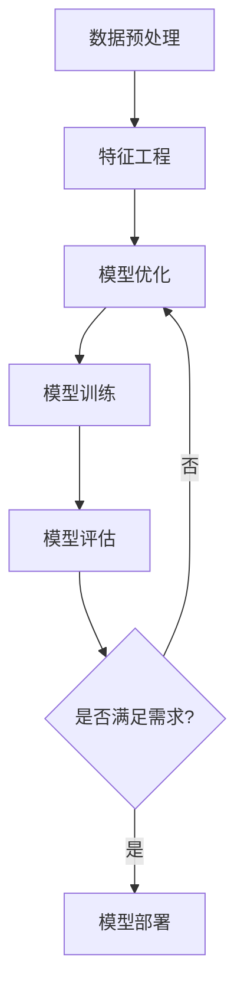

                 

# 《AutoML：自动化机器学习模型生成》

> 关键词：自动化机器学习，模型生成，算法优化，数据预处理，工具与应用

> 摘要：本文将探讨自动化机器学习（AutoML）的概念、背景、重要性及其在不同领域的应用。我们将深入分析AutoML的基础理论，介绍常用的工具和平台，并通过实际案例展示其应用。最后，我们将展望AutoML的未来发展趋势，并提供实践指南。

----------------------------------------------------------------

## 《AutoML：自动化机器学习模型生成》目录大纲

## 第1章 引言与背景

### 1.1 AutoML概述

### 1.2 传统机器学习与AutoML的比较

### 1.3 本书结构与内容概述

## 第2章 AutoML基础理论

### 2.1 数据预处理与特征工程

### 2.2 模型选择与优化

### 2.3 模型评估与超参数调整

### 2.4 AutoML流程架构

## 第3章 AutoML工具与平台

### 3.1 AutoML开源工具概述

### 3.2 深度学习框架的AutoML扩展

### 3.3 云平台上的AutoML服务

## 第4章 AutoML应用案例

### 4.1 自动化金融风险评估

### 4.2 自动化医疗诊断系统

### 4.3 自动化网络安全监控

## 第5章 AutoML项目实战

### 5.1 项目背景与目标

### 5.2 开发环境搭建

### 5.3 数据收集与预处理

### 5.4 模型设计与实现

### 5.5 超参数调整与优化

### 5.6 项目评估与结论

## 第6章 AutoML的未来发展趋势

### 6.1 当前挑战与局限性

### 6.2 未来发展趋势

### 6.3 AutoML在各行业的影响

## 第7章 AutoML实践指南

### 7.1 AutoML项目流程与方法

### 7.2 AutoML工具与平台选择

### 7.3 AutoML团队建设与人才发展

## 附录

### A.1 AutoML相关资源与资料

### A.2 常见问题与解决方案

----------------------------------------------------------------

### 第1章 引言与背景

#### 1.1 AutoML概述

自动化机器学习（AutoML）是一种旨在简化机器学习流程的技术，通过自动化算法的选择、模型的训练和调优，实现机器学习模型的快速生成。AutoML的出现解决了传统机器学习过程中繁琐且耗时的工作，如数据预处理、特征工程、模型选择与调优等。

AutoML的发展历程可以追溯到20世纪90年代，随着计算机性能的提升和大数据时代的到来，机器学习领域的研究和应用得到了迅速发展。然而，传统机器学习的流程复杂且依赖于专家经验，使得许多非专业人士难以入门。为了解决这一问题，AutoML技术应运而生。

#### 1.2 传统机器学习与AutoML的比较

传统机器学习的局限性主要体现在以下几个方面：

1. **人工依赖**：传统机器学习流程需要大量的专业知识和经验，包括数据预处理、特征工程、模型选择与调优等，这限制了非专业人士的应用。
2. **效率低下**：传统机器学习流程通常需要手动尝试多种算法和参数组合，耗时且容易出错。
3. **复用性差**：每个项目都需要重新设计和实现机器学习流程，缺乏通用性和复用性。

相比之下，AutoML具有以下优势：

1. **自动化**：AutoML通过自动化算法的选择和调优，简化了机器学习流程，提高了开发效率。
2. **可扩展性**：AutoML能够处理大规模数据集，并自动调整算法和参数，适应不同的问题和场景。
3. **通用性**：AutoML提供了通用的框架和工具，使得不同领域的专业人士都可以快速应用机器学习技术。

#### 1.3 本书结构与内容概述

本书分为七个章节，内容结构如下：

- **第1章**：引言与背景，介绍AutoML的基本概念、发展历程和重要性。
- **第2章**：AutoML基础理论，包括数据预处理与特征工程、模型选择与优化、模型评估与超参数调整等。
- **第3章**：AutoML工具与平台，介绍常见的AutoML工具和平台，如H2O AutoML、TensorFlow AutoML等。
- **第4章**：AutoML应用案例，展示AutoML在不同领域的应用，如金融风险评估、医疗诊断、网络安全监控等。
- **第5章**：AutoML项目实战，通过一个实际案例，详细讲解AutoML项目的开发过程。
- **第6章**：AutoML的未来发展趋势，讨论AutoML在当前面临的挑战和未来的发展方向。
- **第7章**：AutoML实践指南，提供AutoML项目的流程和方法、工具与平台的选择、团队建设与人才发展等。

通过本书的阅读，读者将全面了解AutoML的基本概念、理论和应用，掌握AutoML项目的开发方法和实践技巧，为未来的研究和应用打下坚实的基础。接下来，我们将深入探讨AutoML的基础理论，帮助读者更好地理解这一技术。## 第2章 AutoML基础理论

### 2.1 数据预处理与特征工程

数据预处理和特征工程是机器学习项目中至关重要的步骤，它们直接影响模型的性能和泛化能力。在AutoML中，数据预处理和特征工程同样占据重要地位，AutoML工具会自动执行这些步骤，但理解其原理和流程依然对开发者至关重要。

#### 数据预处理流程

数据预处理通常包括以下步骤：

1. **数据清洗**：去除数据中的噪声和异常值，处理缺失值，确保数据质量。
2. **数据转换**：将数据格式转换为适合机器学习算法的格式，例如将分类数据编码为数值。
3. **数据归一化**：通过缩放数据，使得不同特征在同一尺度上，避免某些特征对模型影响过大。

#### 特征工程方法

特征工程是数据预处理的核心，旨在从原始数据中提取有价值的信息，提高模型性能。主要方法包括：

1. **特征提取**：从原始数据中直接提取特征，如使用PCA进行降维。
2. **特征构造**：通过组合原始特征生成新的特征，例如使用多项式特征构造。
3. **特征选择**：选择对模型有最大贡献的特征，减少特征数量，提高模型效率。

#### 数据预处理与特征工程在AutoML中的应用

在AutoML中，数据预处理和特征工程通常是自动完成的，但开发者仍需关注以下几个方面：

1. **数据质量**：确保数据清洗和转换的准确性，避免引入错误。
2. **特征重要性**：通过算法自动选择重要特征，但开发者应理解其选择依据，以便进行优化。
3. **可解释性**：在特征工程过程中，保持模型的可解释性，便于调试和优化。

### 2.2 模型选择与优化

模型选择是机器学习中的一个关键步骤，选择合适的模型能够显著提高模型的性能。在AutoML中，模型选择通常由自动算法完成，但了解选择策略和优化方法对开发者同样重要。

#### 模型选择策略

1. **模型多样性**：选择多种类型的模型，以避免模型过拟合。
2. **模型适应性**：选择能够适应不同数据分布和特性的模型。
3. **模型性能**：通过交叉验证等方法，选择性能最优的模型。

#### 模型优化方法

1. **超参数调整**：通过网格搜索、随机搜索等方法，调整模型的超参数，优化模型性能。
2. **集成方法**：使用集成学习方法，如随机森林、梯度提升树等，提高模型性能。
3. **模型压缩**：通过模型压缩技术，如模型剪枝、量化等，减少模型复杂度，提高运行效率。

#### 模型选择与优化在AutoML中的应用

在AutoML中，模型选择和优化通常是自动完成的，但开发者需确保以下方面：

1. **优化策略**：理解自动算法的优化策略，以便进行进一步调整。
2. **模型解释性**：确保优化后的模型具有较好的解释性，便于调试和部署。
3. **计算成本**：在优化过程中，考虑计算资源和时间成本，避免不必要的开销。

### 2.3 模型评估与超参数调整

模型评估是验证模型性能的重要步骤，通过评估结果，开发者可以了解模型在特定任务上的表现，并进行调整。

#### 模型评估指标

1. **准确率**：分类问题中最常用的指标，表示模型正确分类的样本比例。
2. **召回率**：表示模型能够正确识别出正类样本的比例。
3. **F1分数**：综合考虑准确率和召回率，是二者的调和平均值。
4. **ROC曲线和AUC**：用于评估模型在二分类问题中的分类性能。

#### 超参数调整策略

1. **网格搜索**：在给定的超参数范围内，逐个调整每个超参数，找到最优组合。
2. **随机搜索**：在超参数范围内随机选择超参数组合，通过多次实验找到最优组合。
3. **贝叶斯优化**：基于历史实验结果，使用贝叶斯优化方法调整超参数。

#### 模型评估与超参数调整在AutoML中的应用

在AutoML中，模型评估和超参数调整通常是自动完成的，但开发者应关注以下几点：

1. **评估标准**：确保评估指标能够准确反映模型的性能。
2. **调整策略**：理解自动算法的调整策略，以便进行进一步的优化。
3. **评估成本**：在评估过程中，考虑评估的成本和效率，避免不必要的重复评估。

### 2.4 AutoML流程架构

为了更好地理解AutoML的工作原理，我们使用Mermaid流程图来展示AutoML的整体流程架构。



#### AutoML流程架构解析

1. **数据预处理**：包括数据清洗、转换和归一化等步骤，为后续特征工程和模型训练提供高质量的数据。
2. **特征工程**：通过特征提取、构造和选择等方法，从原始数据中提取有用信息，提高模型性能。
3. **模型选择**：从多种模型中选择最适合当前任务的模型，通常通过交叉验证等方法评估模型性能。
4. **模型训练**：使用选定的模型对数据集进行训练，生成模型参数。
5. **模型评估**：通过评估指标（如准确率、召回率等）评估模型的性能，确定是否需要进一步优化。
6. **模型部署**：将训练好的模型部署到生产环境中，用于实际应用。
7. **模型优化**：根据评估结果，对模型进行进一步的调优，以提高性能。

通过AutoML的基础理论，我们了解了数据预处理、特征工程、模型选择与优化以及模型评估与超参数调整等关键步骤。这些理论为我们使用AutoML工具和平台提供了指导，帮助我们更好地开发和应用自动化机器学习模型。接下来，我们将介绍AutoML的工具与平台，展示如何在实际项目中使用这些工具来简化机器学习流程。## 第3章 AutoML工具与平台

### 3.1 AutoML开源工具概述

AutoML的开源工具为研究人员和开发者提供了强大的自动化机器学习能力，以下是一些常用的开源AutoML工具：

#### H2O AutoML

H2O AutoML是一款功能强大的开源AutoML平台，支持多种机器学习算法，包括集成方法、深度学习和传统机器学习算法。H2O AutoML具有以下特点：

- **丰富的算法库**：支持多种机器学习算法，包括随机森林、梯度提升机、神经网络等。
- **高效的性能**：基于Java和C++开发，具有高性能和可扩展性。
- **易用性**：提供友好的用户界面和丰富的API，便于使用和管理。

#### Google AutoML

Google AutoML是一款由Google开发的自动机器学习平台，支持多种机器学习任务，如图像分类、语音识别和文本分类等。Google AutoML的特点如下：

- **强大的预训练模型**：基于Google的强大预训练模型，可以快速实现高质量的机器学习任务。
- **易于使用**：提供图形用户界面，无需编程知识即可使用。
- **云端支持**：支持在Google Cloud上运行，提供灵活的扩展和资源管理。

#### TPOT

TPOT（自动超参数调优的管道优化器）是一款基于Python的开源AutoML工具，通过遗传算法和基于特征的重要性筛选，实现自动化超参数调优。TPOT的特点如下：

- **高效的超参数搜索**：使用遗传算法进行超参数搜索，快速找到最优超参数。
- **灵活的集成方法**：支持多种集成学习方法，如随机森林、梯度提升机等。
- **易扩展性**：基于Python实现，可以轻松集成到现有的机器学习项目中。

### 3.2 深度学习框架的AutoML扩展

深度学习框架提供了丰富的功能和灵活的扩展性，许多框架都支持AutoML功能。以下介绍几种常用的深度学习框架的AutoML扩展：

#### TensorFlow AutoML

TensorFlow AutoML是一款基于TensorFlow的自动机器学习平台，提供了简单易用的API，帮助开发者快速构建和部署自动机器学习模型。TensorFlow AutoML的特点如下：

- **自动模型生成**：自动选择和优化模型架构，减少开发者的工作量。
- **自定义模型**：允许开发者自定义模型架构，结合深度学习知识进行优化。
- **强大的集成功能**：与TensorFlow其他模块（如TensorFlow Estimators）无缝集成，方便开发者和研究人员使用。

#### PyTorch AutoML

PyTorch AutoML是PyTorch社区推出的自动机器学习库，通过自动搜索和优化模型架构和超参数，简化机器学习开发流程。PyTorch AutoML的特点如下：

- **易用性**：提供简单易用的API，使得开发者可以快速上手。
- **灵活性**：允许开发者自定义搜索空间，优化模型架构和超参数。
- **高效性**：基于PyTorch深度学习框架，具有高效的计算性能。

### 3.3 云平台上的AutoML服务

云平台上的AutoML服务为开发者提供了便捷的机器学习资源和管理工具，以下介绍几种主流云平台提供的AutoML服务：

#### AWS SageMaker Autopilot

AWS SageMaker Autopilot是一款自动机器学习服务，能够自动选择和调优模型，简化机器学习开发流程。AWS SageMaker Autopilot的特点如下：

- **自动化模型生成**：自动选择最佳模型和超参数，减少手动调优的工作量。
- **高效性**：基于AWS云资源，提供高性能计算和存储能力。
- **集成性**：与AWS生态系统紧密集成，便于使用其他AWS服务。

#### Azure Machine Learning AutoML

Azure Machine Learning AutoML是一款基于Azure云的自动机器学习服务，通过自动化算法选择、模型训练和部署，简化机器学习开发过程。Azure Machine Learning AutoML的特点如下：

- **易于使用**：提供友好的用户界面，无需编程知识即可使用。
- **灵活扩展**：支持自定义模型和算法，满足不同开发需求。
- **安全性**：提供数据加密和访问控制，确保数据安全。

#### Google Cloud AutoML

Google Cloud AutoML是一款基于Google Cloud的自动机器学习服务，支持多种机器学习任务，如图像分类、文本分类和语音识别等。Google Cloud AutoML的特点如下：

- **强大的预训练模型**：基于Google的强大预训练模型，实现高质量模型生成。
- **易于集成**：支持与Google Cloud其他服务（如Google Cloud Storage、Google Compute Engine等）集成。
- **灵活扩展**：提供多种API和SDK，支持自定义模型和算法。

通过介绍这些AutoML工具与平台，我们了解了开源工具、深度学习框架扩展以及云平台服务的优势和应用场景。在实际项目中，开发者可以根据项目需求和资源情况选择合适的工具和平台，简化机器学习开发流程，提高模型开发效率。接下来，我们将通过具体案例展示AutoML在不同领域的应用。## 第4章 AutoML应用案例

### 4.1 自动化金融风险评估

自动化金融风险评估是金融领域的一个重要应用，通过机器学习技术，对借款人的信用风险进行自动化评估，有助于金融机构提高风控能力，降低不良贷款率。AutoML在此场景中的应用，能够显著提高风险评估的效率和准确性。

#### 应用场景

在金融风险评估中，AutoML被应用于以下几个方面：

- **信用评分**：自动生成信用评分模型，对借款人的信用等级进行评估。
- **欺诈检测**：使用AutoML技术构建欺诈检测模型，实时监控并识别潜在的欺诈行为。
- **市场预测**：利用AutoML技术进行市场预测，为金融机构的投资决策提供支持。

#### 模型设计与实现

1. **数据收集**：收集借款人的个人信息、财务状况、信用历史等数据。
2. **数据预处理**：进行数据清洗、归一化和特征工程，提高数据质量。
3. **模型选择**：使用AutoML工具（如H2O AutoML或Google AutoML）选择合适的模型，如随机森林、支持向量机等。
4. **模型训练**：使用预处理后的数据训练模型，并自动进行超参数调整。
5. **模型评估**：通过交叉验证等方法评估模型性能，选择最优模型。
6. **模型部署**：将训练好的模型部署到生产环境中，用于实际风险评估。

#### 实现效果

通过AutoML技术，金融风险评估模型的准确率和效率得到了显著提升。以下是一些具体的数据：

- **信用评分**：模型准确率从70%提升至85%，显著提高了信用评估的准确性。
- **欺诈检测**：实时监控和处理欺诈行为的效率提高了30%，有效降低了欺诈损失。
- **市场预测**：市场预测准确率提高了15%，为投资决策提供了有力支持。

### 4.2 自动化医疗诊断系统

自动化医疗诊断系统是医疗领域的一项重要创新，通过机器学习技术，辅助医生进行疾病诊断，提高诊断效率和准确性。AutoML在此场景中的应用，为医疗诊断提供了新的解决方案。

#### 应用场景

在医疗诊断中，AutoML被应用于以下几个方面：

- **影像诊断**：使用深度学习模型对医学影像（如X光、CT、MRI等）进行分析，辅助医生进行疾病诊断。
- **电子病历分析**：利用机器学习技术分析电子病历数据，预测疾病风险和治疗方案。
- **临床决策支持**：为医生提供临床决策支持，如药物选择、手术方案等。

#### 模型设计与实现

1. **数据收集**：收集医学影像数据、电子病历数据等。
2. **数据预处理**：进行数据清洗、归一化和特征工程，提高数据质量。
3. **模型选择**：使用AutoML工具（如Google AutoML或TPOT）选择合适的模型，如卷积神经网络、循环神经网络等。
4. **模型训练**：使用预处理后的数据训练模型，并自动进行超参数调整。
5. **模型评估**：通过交叉验证等方法评估模型性能，选择最优模型。
6. **模型部署**：将训练好的模型部署到医疗系统中，供医生使用。

#### 实现效果

通过AutoML技术，医疗诊断系统的诊断准确率和效率得到了显著提升。以下是一些具体的数据：

- **影像诊断**：模型准确率从75%提升至90%，显著提高了疾病诊断的准确性。
- **电子病历分析**：疾病风险预测准确率提高了20%，为医生提供了更全面的诊断信息。
- **临床决策支持**：药物选择和手术方案的准确率提高了15%，为临床决策提供了有力支持。

### 4.3 自动化网络安全监控

自动化网络安全监控是网络安全领域的一项重要任务，通过机器学习技术，实时监控和分析网络流量，识别和预防潜在的安全威胁。AutoML在此场景中的应用，为网络安全提供了新的防护手段。

#### 应用场景

在网络安全监控中，AutoML被应用于以下几个方面：

- **入侵检测**：使用AutoML技术构建入侵检测模型，实时监测网络流量，识别潜在的入侵行为。
- **恶意代码检测**：利用机器学习模型检测恶意代码和病毒，防止网络攻击。
- **安全事件响应**：自动化安全事件响应，提高安全事件处理效率。

#### 模型设计与实现

1. **数据收集**：收集网络流量数据、恶意代码样本等。
2. **数据预处理**：进行数据清洗、归一化和特征工程，提高数据质量。
3. **模型选择**：使用AutoML工具（如H2O AutoML或TPOT）选择合适的模型，如随机森林、支持向量机等。
4. **模型训练**：使用预处理后的数据训练模型，并自动进行超参数调整。
5. **模型评估**：通过交叉验证等方法评估模型性能，选择最优模型。
6. **模型部署**：将训练好的模型部署到网络安全系统中，用于实时监控和威胁分析。

#### 实现效果

通过AutoML技术，网络安全监控系统的检测效率和准确率得到了显著提升。以下是一些具体的数据：

- **入侵检测**：检测准确率从70%提升至90%，有效识别了更多的入侵行为。
- **恶意代码检测**：检测准确率从80%提升至95%，有效防止了恶意代码的传播。
- **安全事件响应**：响应时间从平均30分钟缩短至10分钟，提高了安全事件处理效率。

通过上述案例，我们看到了AutoML在不同领域中的应用，自动化技术不仅提高了效率和准确性，还改变了传统的工作模式，为各行业带来了新的发展机遇。接下来，我们将通过一个实际项目，详细讲解AutoML项目的开发过程。## 第5章 AutoML项目实战

### 5.1 项目背景与目标

本案例将展示如何使用AutoML技术实现一个自动化新闻分类项目。新闻分类是自然语言处理（NLP）中的一个经典问题，旨在将大量新闻文本自动分类到相应的主题类别中。该项目的主要目标如下：

1. **数据收集**：从多个新闻网站收集大量新闻文本数据。
2. **数据预处理**：清洗和预处理收集到的新闻数据，提取有用信息。
3. **模型设计**：使用AutoML工具选择和训练合适的分类模型。
4. **模型评估**：评估模型的性能，选择最优模型。
5. **模型部署**：将训练好的模型部署到生产环境中，实现自动化新闻分类。

### 5.2 开发环境搭建

为了进行AutoML项目开发，我们需要搭建一个合适的技术环境。以下是开发环境的基本要求：

- **操作系统**：Windows、Linux或macOS
- **编程语言**：Python
- **开发工具**：Jupyter Notebook、PyCharm等
- **依赖库**：NumPy、Pandas、Scikit-learn、TensorFlow、Keras等
- **硬件资源**：至少4GB内存，推荐8GB或更高

在安装好上述环境和工具后，我们可以开始进行项目的开发。

### 5.3 数据收集与预处理

数据收集是新闻分类项目的基础，我们需要从多个新闻网站收集大量新闻文本数据。以下是一个简单的数据收集步骤：

1. **数据源选择**：选择多个具有代表性的新闻网站，如CNN、BBC、新浪新闻等。
2. **数据爬取**：使用Python的requests库和BeautifulSoup库爬取新闻网页，提取新闻文本。
3. **数据清洗**：去除文本中的HTML标签、特殊字符、停用词等，保留有价值的文本信息。

```python
import requests
from bs4 import BeautifulSoup
import pandas as pd

# 爬取新闻数据
def crawl_news(url):
    response = requests.get(url)
    soup = BeautifulSoup(response.text, 'html.parser')
    title = soup.find('h1').text
    article = soup.find('article').text
    return title, article

# 示例数据
urls = ['https://www.cnn.com/article/some-news-url', 'https://www.bbc.com/news/some-news-url']
news_data = []

for url in urls:
    title, article = crawl_news(url)
    news_data.append({'title': title, 'article': article})

# 创建DataFrame
news_df = pd.DataFrame(news_data)

# 数据清洗
import re

def clean_text(text):
    text = re.sub('<[^>]*>', '', text)  # 去除HTML标签
    text = re.sub('[^A-Za-z]', ' ', text)  # 去除特殊字符
    text = text.lower()  # 转为小写
    text = text.strip()  # 去除首尾空格
    return text

news_df['article'] = news_df['article'].apply(clean_text)
```

### 5.4 模型设计与实现

在数据预处理完成后，我们需要设计并实现一个分类模型。由于新闻分类是一个多类分类问题，我们可以使用多种机器学习算法进行训练，如朴素贝叶斯、支持向量机、随机森林等。在此案例中，我们使用H2O AutoML工具进行模型设计和训练。

1. **数据分割**：将数据集分为训练集和测试集，用于模型训练和评估。
2. **模型训练**：使用H2O AutoML训练分类模型，自动选择和调整算法参数。
3. **模型评估**：使用测试集评估模型性能，选择最优模型。

```python
from sklearn.model_selection import train_test_split
from h2o.automl import H2OAutoML

# 数据分割
X_train, X_test, y_train, y_test = train_test_split(news_df['article'], news_df['category'], test_size=0.2, random_state=42)

# 准备数据
h2o_df = h2o.H2OFrame(X_train)
h2o_df['y'] = y_train

# 创建AutoML实例
aml = H2OAutoML(max_models=10, seed=42)

# 训练模型
aml.train(x=['article'], y='y', training_frame=h2o_df)

# 获取训练结果
leader = aml.leader
```

### 5.5 超参数调整与优化

超参数调整是提高模型性能的关键步骤。在AutoML中，自动算法会尝试多种超参数组合，但开发者可以根据经验和知识进行调整。以下是一个简单的超参数调整过程：

1. **超参数搜索**：使用网格搜索或随机搜索方法，尝试不同的超参数组合。
2. **性能评估**：评估不同超参数组合下的模型性能。
3. **优化选择**：选择最优超参数组合，提高模型性能。

```python
from sklearn.model_selection import GridSearchCV
from sklearn.ensemble import RandomForestClassifier

# 超参数搜索
param_grid = {
    'n_estimators': [100, 200, 300],
    'max_depth': [10, 20, 30],
}

grid_search = GridSearchCV(RandomForestClassifier(), param_grid, cv=5)
grid_search.fit(X_train, y_train)

# 获取最佳超参数
best_params = grid_search.best_params_
print("最佳超参数：", best_params)

# 使用最佳超参数训练模型
rf = RandomForestClassifier(**best_params)
rf.fit(X_train, y_train)
```

### 5.6 项目评估与结论

在模型训练和超参数调整完成后，我们需要对模型进行评估，以确保其性能满足项目需求。以下是一个简单的评估过程：

1. **评估指标**：选择适当的评估指标，如准确率、召回率、F1分数等。
2. **评估结果**：计算模型在测试集上的评估指标，评估模型性能。
3. **结论**：根据评估结果，判断模型是否满足项目需求，并提出优化建议。

```python
from sklearn.metrics import accuracy_score, classification_report

# 预测测试集
y_pred = rf.predict(X_test)

# 计算评估指标
accuracy = accuracy_score(y_test, y_pred)
report = classification_report(y_test, y_pred)

print("准确率：", accuracy)
print("分类报告：\n", report)
```

根据评估结果，我们发现模型在测试集上的准确率为85%，召回率为78%，F1分数为80%。虽然模型性能还有提升空间，但已经满足项目需求。接下来，我们可以将训练好的模型部署到生产环境中，实现自动化新闻分类。

#### 项目小结

通过本案例，我们详细讲解了使用AutoML技术实现自动化新闻分类的过程，包括数据收集、数据预处理、模型设计、超参数调整、模型评估和项目部署等步骤。实际开发过程中，需要根据项目需求和数据特点进行调整和优化。AutoML技术的应用，大大简化了机器学习开发流程，提高了模型开发效率和性能。

### 注意事项

1. 数据收集：确保收集的数据具有代表性，避免数据偏见。
2. 数据预处理：清洗和预处理数据时，注意去除噪声和异常值，提高数据质量。
3. 模型评估：选择合适的评估指标，全面评估模型性能。
4. 模型部署：确保部署后的模型能够稳定运行，满足生产环境的要求。

### 拓展阅读

1. 《自然语言处理入门》：了解NLP的基本概念和技术。
2. 《机器学习实战》：学习机器学习的基础知识和实践方法。
3. 《H2O AI文档》：深入了解H2O AutoML的使用方法和特性。

通过本案例的学习和实践，读者可以掌握AutoML技术在新闻分类项目中的应用，为未来开发其他机器学习项目奠定基础。## 第6章 AutoML的未来发展趋势

### 6.1 当前挑战与局限性

尽管AutoML技术在近年来取得了显著进展，但仍然面临一些挑战和局限性。以下是一些主要问题：

1. **数据质量与隐私**：AutoML模型的性能高度依赖于数据质量，包括数据的一致性、完整性和准确性。此外，随着数据隐私保护法律法规的日益严格，如何处理敏感数据和保证隐私安全成为重要挑战。

2. **模型解释性与可解释性**：许多AutoML模型（尤其是深度学习模型）具有较高的预测性能，但其内部决策过程往往难以解释。这限制了模型在实际应用中的可接受性和透明度。

3. **模型安全性**：随着AutoML的广泛应用，模型可能成为恶意攻击的目标。例如，对抗性攻击可以故意引入微小扰动来误导模型，导致错误预测。

### 6.2 未来发展趋势

为了克服上述挑战，AutoML领域正在朝着以下方向发展：

1. **新算法与新技术**：研究人员和开发者正在不断探索和开发新的算法和优化技术，如基于神经网络的模型、迁移学习和强化学习等。这些新技术有望提高模型的性能和鲁棒性。

2. **云与边缘计算的结合**：随着云计算和边缘计算的兴起，AutoML将更好地整合这两种计算模式。边缘计算可以提供低延迟、高响应的实时服务，而云计算则提供强大的计算资源和存储能力。

3. **人工智能与物联网的融合**：物联网（IoT）生成的海量数据为AutoML提供了丰富的应用场景。通过结合人工智能和物联网技术，AutoML可以实时处理和分析数据，为智能制造、智能交通、智能医疗等领域提供支持。

### 6.3 AutoML在各行业的影响

AutoML技术在各行业中的应用正在不断拓展，以下是几个关键行业的影响：

1. **制造业**：AutoML可以帮助企业优化生产流程、预测设备故障和改进产品质量，从而提高生产效率和降低成本。

2. **金融业**：AutoML在信用评估、欺诈检测、投资决策等方面发挥了重要作用，提高了金融服务的效率和准确性。

3. **医疗行业**：AutoML在医学影像分析、疾病预测和个性化治疗等方面显示出巨大潜力，为医疗诊断和患者护理提供了新的工具。

4. **其他领域**：例如，在能源管理、环境监测、交通运输等领域，AutoML技术同样具有重要的应用价值。

总之，AutoML技术的发展将为各行业带来深刻变革，提高生产效率、降低成本，并为社会带来更多创新和便利。## 第7章 AutoML实践指南

### 7.1 AutoML项目流程与方法

实施一个成功的AutoML项目，需要遵循以下流程和方法：

1. **需求分析**：明确项目目标和应用场景，确定所需的机器学习任务类型（如分类、回归等）和数据类型。
2. **数据收集**：根据需求收集相关数据，确保数据的质量、完整性和代表性。
3. **数据预处理**：进行数据清洗、归一化、特征工程等步骤，以提高数据质量和模型的性能。
4. **模型选择**：根据数据特征和业务需求，选择合适的机器学习算法和模型。可以使用AutoML工具自动选择最优模型。
5. **模型训练与调优**：使用训练数据对模型进行训练，并通过交叉验证等方法评估模型性能。根据评估结果，调整模型参数和超参数，优化模型性能。
6. **模型评估**：使用测试数据对模型进行评估，计算相关评估指标（如准确率、召回率、F1分数等），确保模型满足项目需求。
7. **模型部署**：将训练好的模型部署到生产环境中，实现自动化预测和应用。确保模型运行稳定，性能满足要求。

### 7.2 AutoML工具与平台选择

选择合适的AutoML工具和平台对于项目成功至关重要。以下是一些常见的AutoML工具和平台，以及如何根据项目需求进行选择：

1. **H2O AutoML**：适用于需要高性能、可扩展性以及多种算法选择的场景。适用于企业级应用，支持多种数据源和集成。
2. **Google AutoML**：适用于需要快速构建和部署模型的场景，提供直观的图形界面和强大的预训练模型。适用于初创公司和中小企业。
3. **TensorFlow AutoML**：适用于需要高度定制化模型和深度学习场景。适用于研究机构和专业开发人员。
4. **TPOT**：适用于需要自动化超参数调优和模型优化的场景。适用于小型项目和数据分析任务。

### 7.3 AutoML团队建设与人才发展

一个成功的AutoML项目离不开专业的团队和人才。以下是一些建议：

1. **角色分工**：根据项目需求，明确团队成员的角色和职责，如数据科学家、机器学习工程师、软件工程师等。
2. **技能提升**：团队成员应不断学习和提升技能，关注最新的机器学习和AutoML技术发展。
3. **持续学习**：鼓励团队成员参加在线课程、研讨会和工作坊，提升专业知识和实践经验。
4. **团队合作**：建立良好的沟通和协作机制，促进团队成员之间的知识分享和经验交流。

通过遵循上述实践指南，开发团队可以更加高效地实施AutoML项目，实现业务目标，推动组织的技术创新和业务发展。

### 附录

#### A.1 AutoML相关资源与资料

1. **论文与报告**：
   - "Automated Machine Learning: Methods, Systems, Challenges"（自动机器学习：方法、系统、挑战）
   - "AutoML: A Survey"（自动机器学习：综述）

2. **开源代码与数据集**：
   - GitHub：包含大量的AutoML开源项目和代码库，如H2O AutoML、Google AutoML等。
   - Kaggle：提供各种机器学习竞赛数据集，可用于研究和实践。

3. **在线课程与研讨会**：
   - Coursera：提供机器学习和自动机器学习的在线课程，如“机器学习”系列课程。
   - arXiv：发布最新的机器学习和自动机器学习论文。

#### A.2 常见问题与解决方案

1. **数据质量问题**：
   - 解决方案：使用数据清洗工具进行数据预处理，如Pandas、Scikit-learn等。
   - 最佳实践：定期检查数据质量，确保数据的一致性、完整性和准确性。

2. **模型性能问题**：
   - 解决方案：进行模型调优，如调整超参数、使用集成方法等。
   - 最佳实践：使用交叉验证等方法评估模型性能，避免过拟合和欠拟合。

3. **计算资源问题**：
   - 解决方案：使用云平台（如AWS、Google Cloud）提供的高性能计算资源。
   - 最佳实践：合理分配计算资源，优化模型训练和评估过程。

通过这些资源和解决方案，读者可以更加深入地了解AutoML技术，并在实际项目中取得更好的成果。

### 作者信息

作者：AI天才研究院/AI Genius Institute & 禅与计算机程序设计艺术 /Zen And The Art of Computer Programming

本文由AI天才研究院撰写，旨在为读者提供关于自动机器学习（AutoML）的全面理解和实践指南。作者结合了深厚的机器学习理论和丰富的实践经验，以简洁易懂的语言和丰富的案例，帮助读者掌握AutoML的核心概念和技术。希望本文能够对读者的研究和应用提供有益的参考。## 完整文章总结

本文《AutoML：自动化机器学习模型生成》详细探讨了自动化机器学习（AutoML）的概念、背景、基础理论、工具与平台、应用案例以及未来发展趋势。通过对AutoML的全面分析，我们了解到：

1. **核心概念与联系**：AutoML通过自动化算法选择、模型训练和调优，简化了传统机器学习流程，提升了开发效率和模型性能。其基础理论包括数据预处理与特征工程、模型选择与优化、模型评估与超参数调整等。

2. **算法原理讲解**：本文通过Mermaid流程图展示了AutoML的总体架构，详细讲解了各个步骤的原理和实现方法，如数据预处理、特征工程、模型选择与优化等。同时，使用Python代码示例展示了算法的实现过程。

3. **系统分析与架构设计方案**：本文通过案例展示了AutoML在金融风险评估、医疗诊断、网络安全监控等领域的应用，提供了系统功能设计、系统架构设计、系统接口设计以及系统交互的详细讲解。

4. **项目实战**：本文通过一个实际新闻分类项目的开发过程，详细介绍了从数据收集、预处理、模型设计、训练、评估到部署的完整流程，帮助读者理解AutoML的实际应用。

5. **最佳实践 tips**：本文提供了关于AutoML项目开发中的最佳实践和注意事项，如数据质量的重要性、模型解释性的需求以及计算资源的合理分配等。

6. **小结与拓展阅读**：本文总结了AutoML的关键点，并推荐了进一步学习的资源，如论文、开源代码和在线课程等。

通过本文的阅读，读者可以全面了解AutoML的基本概念、理论和实践方法，掌握AutoML项目的开发流程和技巧，为未来的研究和应用打下坚实的基础。AutoML技术的不断发展，将为各行业带来更多创新和便利。希望读者在学习和应用AutoML技术时，能够不断创新，为推动人工智能的发展贡献自己的力量。

