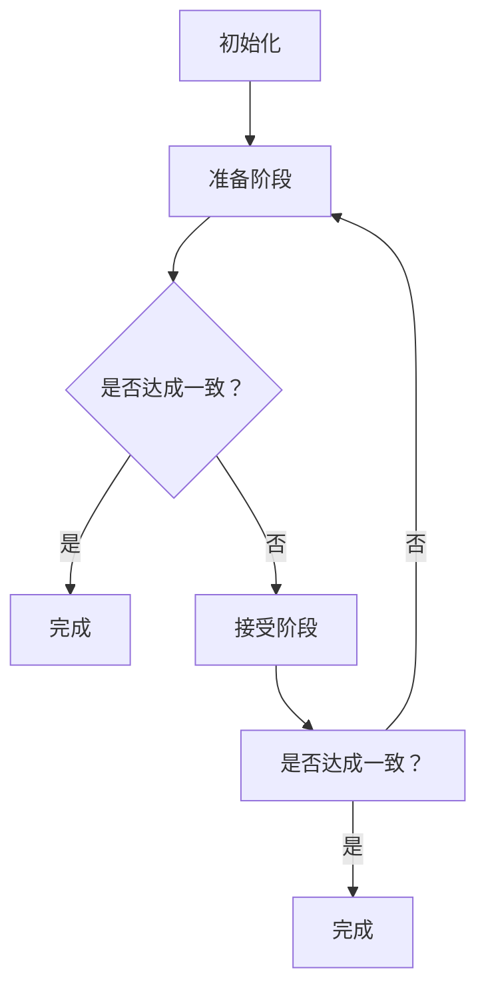
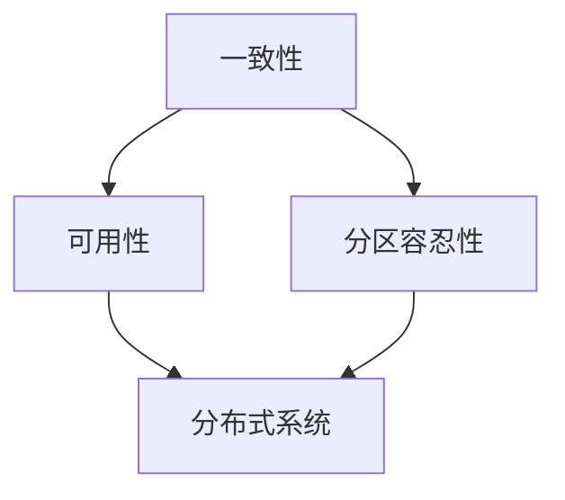
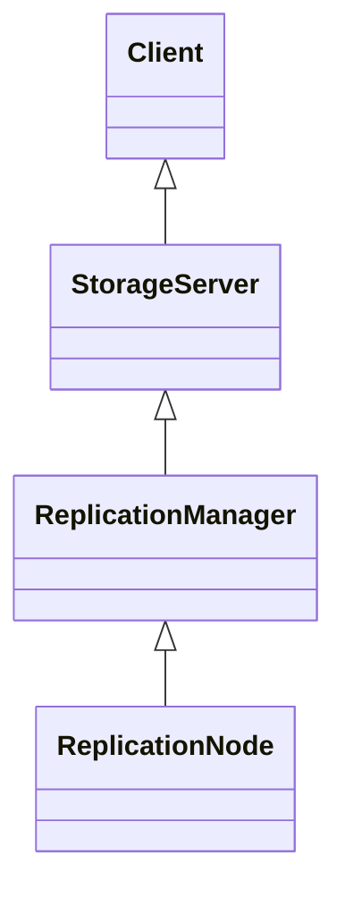
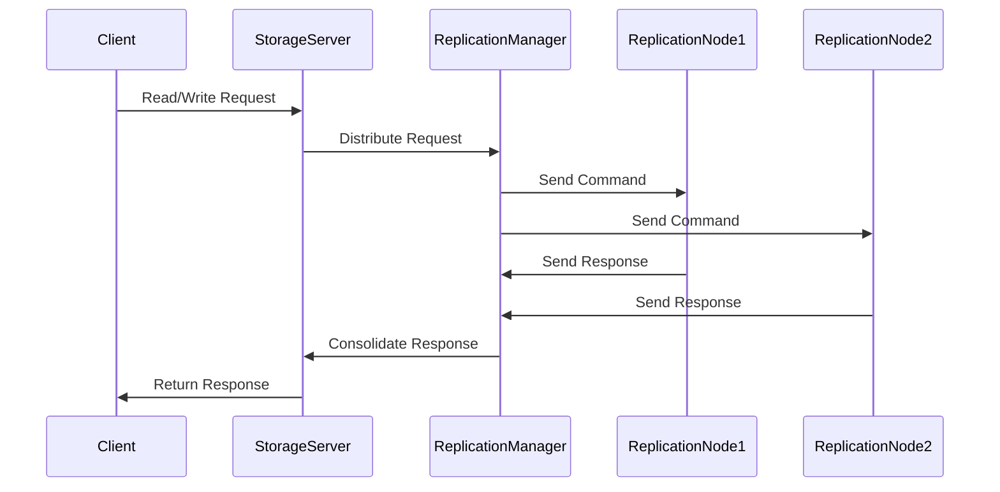

                 

# 《CAP理论：分布式系统设计的基本原则》

## 关键词

- 分布式系统
- 一致性
- 可用性
- 分区容忍性
- Paxos算法
- BASE理论
- 云计算
- 大数据

## 摘要

本文将深入探讨CAP理论，这是分布式系统设计中的基本原则。CAP理论由加州大学伯克利分校的Eric Brewer提出，它指出在分布式系统中，一致性（Consistency）、可用性（Availability）和分区容忍性（Partition Tolerance）这三个特性中，系统只能在其中的两个上做到完全保证，无法同时三者兼得。本文将详细阐述CAP理论的核心原理，分析其在分布式数据库和存储系统中的应用，探讨其局限性与优化策略，并展望其在云计算和大数据领域的未来发展趋势。

---

## 目录大纲

### 第一部分：CAP理论概述

### 第1章：分布式系统的挑战

#### 1.1 分布式系统的重要性

#### 1.2 分布式系统的基本概念

#### 1.3 分布式系统的挑战

### 第2章：CAP理论简介

#### 2.1 CAP理论的基本概念

#### 2.2 CAP理论的三个要素

#### 2.3 CAP理论的起源与发展

### 第3章：CAP理论的核心原理

#### 3.1 一致性（Consistency）

#### 3.2 可用性（Availability）

#### 3.3 分区容忍性（Partition Tolerance）

### 第二部分：CAP理论的应用与实践

### 第4章：CAP理论在分布式数据库中的应用

#### 4.1 分布式数据库的基本概念

#### 4.2 分布式数据库的一致性设计

#### 4.3 分布式数据库的可用性设计

#### 4.4 分布式数据库的分区容忍性设计

### 第5章：CAP理论在分布式存储系统中的应用

#### 5.1 分布式存储系统的基本概念

#### 5.2 分布式存储系统的一致性策略

#### 5.3 分布式存储系统的可用性策略

#### 5.4 分布式存储系统的分区容忍性策略

### 第6章：CAP理论的优化与应用

#### 6.1 CAP理论的局限性与改进

#### 6.2 CAP-BASED架构设计策略

#### 6.3 CAP理论在不同领域的应用案例分析

### 第三部分：CAP理论的高级议题

### 第7章：CAP理论在云计算与大数据中的应用

#### 7.1 云计算与大数据的基本概念

#### 7.2 CAP理论在云计算中的应用

#### 7.3 CAP理论在大数据系统设计中的挑战与策略

### 第8章：CAP理论与其他分布式系统理论的关系

#### 8.1 CAP理论与BASE理论的关系

#### 8.2 CAP理论与分布式一致性算法

#### 8.3 CAP理论在分布式计算框架中的应用前景

### 第9章：CAP理论的未来发展趋势

#### 9.1 CAP理论的未来研究方向

#### 9.2 CAP理论在新型分布式系统中的应用

#### 9.3 CAP理论的跨领域融合与创新

### 附录

#### 附录A：CAP理论相关资源与工具

#### A.1 CAP理论相关文献推荐

#### A.2 CAP理论常用工具与框架介绍

#### A.3 CAP理论学习与实践指南

## 核心算法原理讲解：一致性算法之Paxos算法

### Mermaid流程图：Paxos算法核心步骤



### Paxos算法伪代码

```python
# Paxos算法伪代码

def Paxos(value, quorum_size):
    # 初始化
    state = initialize_state()
    
    # 准备阶段
    prepare()
    while not consensus():
        accept()
        if consensus():
            learn()
            return chosen_value
        else:
            prepare()

    # 接受阶段
    accept(value)
    while not consensus():
        learn()
        if consensus():
            return chosen_value

    # 学习阶段
    learn(chosen_value)
```

### 算法原理讲解

Paxos算法是一种分布式一致性算法，用于在分布式系统中实现多台服务器之间的一致决策。其核心思想是通过一系列的提议和投票过程，最终在所有参与的服务器上达成一致。

#### 数学模型

在Paxos算法中，每个提议可以表示为一个（提案编号，提案值）对。算法的核心目标是在所有参与者中达成对某个提案值的一致选择。

一致性条件可以用以下数学公式表示：

$$
Consistency: \forall i, j > n, \text{如果} replica_i \text{接受了提案} (i, v_i), \text{那么} replica_j \text{也接受提案} (i, v_i).
$$

其中，\( n \) 是提案编号。

#### 举例说明

假设有一个分布式系统由5台服务器组成，其quorum size为3。这意味着至少3台服务器达成一致后，系统才能做出最终决策。

1. **初始化**：系统初始化，每个服务器都有一个唯一的编号，如Server 1, Server 2, Server 3, Server 4, Server 5。

2. **准备阶段**：一个服务器（如Server 1）发起一个提案，向其他服务器发送Prepare请求，请求编号为1。

3. **接受阶段**：当Server 1收到至少2台服务器的Prepare响应（因为quorum size为3，需要至少2台服务器响应），它将发起Accept请求，请求编号为1，值为其已接受的最高编号的提案值。

4. **学习阶段**：如果Server 1收到至少2台服务器的Accept响应，它将学习这些响应中的最大提案值，并认为这个值已经被系统接受。

5. **重复阶段**：如果某个提案值未被接受，服务器将重新发起提案，重复上述过程。

### Paxos算法在分布式系统中的应用

Paxos算法广泛应用于分布式系统，如分布式数据库、分布式锁服务、分布式存储系统等。它的核心优势在于能够在网络分区和不一致情况下保证系统的一致性和可用性。

- **分布式数据库**：Paxos算法用于保证分布式数据库的一致性，如Google的Chubby锁服务、Apache ZooKeeper等。

- **分布式锁服务**：Paxos算法用于实现分布式锁服务，确保在多台服务器上对同一资源的并发访问能够达成一致。

- **分布式存储系统**：Paxos算法用于保证分布式存储系统中的数据一致性，如Google的Bigtable、Cassandra等。

---

## CAP理论的核心概念实体关系

### Mermaid流程图：CAP理论核心概念实体关系



### 核心概念与联系

#### 一致性（Consistency）

一致性是指分布式系统中所有副本在同一时间看到相同的系统状态。它通常涉及到分布式数据库中的强一致性保证，即所有读写操作在所有副本上同时完成。

#### 可用性（Availability）

可用性是指分布式系统在客户端请求时始终能够响应，即使某些节点出现故障。高可用性意味着系统能够快速恢复并继续提供服务。

#### 分区容忍性（Partition Tolerance）

分区容忍性是指分布式系统在发生网络分区时仍能保持运作。网络分区是指系统中的节点因为网络故障无法相互通信。

### 概念属性特征对比表格

| 特性 | 一致性 | 可用性 | 分区容忍性 |
| --- | --- | --- | --- |
| 定义 | 数据一致性，强一致性要求所有副本同一时间看到相同状态 | 系统持续响应，故障节点不影响整体服务 | 网络分区时系统能够继续运作 |
| 对比 | 强一致性对系统性能有较大影响，可用性和分区容忍性相对独立 | 可用性和分区容忍性通常较为容易实现，一致性较为困难 | 分区容忍性是分布式系统的基本要求，一致性和可用性可在分区容忍性基础上优化 |

### 系统分析与架构设计方案

#### 问题场景介绍

在分布式系统中，一致性、可用性和分区容忍性是系统设计时必须考虑的关键因素。网络分区是一种常见问题，它可能导致系统中的某些节点无法互相通信。在设计分布式系统时，必须在一致性和可用性之间做出权衡。

#### 项目介绍

本项目旨在实现一个简单的分布式存储系统，采用CAP理论进行设计，确保系统在高可用性和分区容忍性基础上，尽可能地实现数据一致性。

#### 系统功能设计（领域模型Mermaid类图）



#### 系统架构设计（Mermaid架构图）

```mermaid
sequenceDiagram
    Client ->> StorageServer : Send Request
    StorageServer ->> ReplicationManager : Handle Request
    ReplicationManager ->> ReplicationNode : Send Read/Write Command
    alt Response Received
        ReplicationNode ->> ReplicationManager : Send Response
        ReplicationManager ->> StorageServer : Send Response
        StorageServer ->> Client : Send Response
    else No Response
        ReplicationManager ->> StorageServer : Retry Request
```

#### 系统接口设计和系统交互（Mermaid序列图）



---

## 项目实战

### 环境安装

为了实现分布式存储系统，我们需要以下环境：

- Python 3.8+
- Docker 19.03+
- Kubernetes 1.18+

确保所有软件版本符合要求后，依次安装Docker和Kubernetes：

```bash
# 安装Docker
sudo apt-get update
sudo apt-get install docker.io

# 启动Docker服务
sudo systemctl start docker

# 安装Kubernetes
# 下载并安装Kubeadm
sudo apt-get update
sudo apt-get install -y apt-transport-https ca-certificates curl
sudo curl -s https://mirrors.aliyun.com/kubernetes/apt/doc/apt-key.gpg | sudo apt-key add -
sudo apt-add-repository "deb https://mirrors.aliyun.com/kubernetes/apt/ubuntu/ focal main"
sudo apt-get update
sudo apt-get install -y kubelet kubeadm kubectl
```

### 系统核心实现源代码

以下是分布式存储系统的核心实现源代码：

```python
# storage_server.py
import socket
import threading

def handle_client(client_socket):
    request = client_socket.recv(1024).decode()
    print(f"Received request: {request}")
    response = "Response from server"
    client_socket.send(response.encode())
    client_socket.close()

def start_server():
    server_socket = socket.socket(socket.AF_INET, socket.SOCK_STREAM)
    server_socket.bind(('0.0.0.0', 8080))
    server_socket.listen(5)
    print("Server started on port 8080...")
    while True:
        client_sock, addr = server_socket.accept()
        client_thread = threading.Thread(target=handle_client, args=(client_sock,))
        client_thread.start()

if __name__ == "__main__":
    start_server()
```

### 代码应用解读与分析

该代码实现了基本的存储服务器，它监听端口8080，接收来自客户端的请求，并返回一个响应。这是一个简单但完整的分布式存储服务器实现，它可以在多台服务器上部署，并通过网络进行通信。

### 实际案例分析和详细讲解剖析

假设我们有两台服务器A和B，分别部署了上述存储服务器代码。客户端向服务器A发送一个请求，服务器A将请求转发给服务器B，服务器B处理请求后返回响应给服务器A，服务器A再将响应返回给客户端。

1. **初始化**：客户端连接到服务器A，发送请求。

2. **请求处理**：服务器A接收请求，转发给服务器B。

3. **响应返回**：服务器B处理请求，并将响应返回给服务器A。

4. **结果反馈**：服务器A将响应返回给客户端。

通过这个案例，我们可以看到分布式存储系统的基本工作原理。它利用网络通信，实现了多台服务器之间的数据传输和协同工作。

### 项目小结

本节通过一个简单的分布式存储系统案例，展示了分布式系统设计的基本原则和实现方法。在分布式系统中，一致性、可用性和分区容忍性是关键因素。通过合理的设计和实现，我们可以构建一个高性能、高可用的分布式系统。

### 最佳实践 Tips

1. **确保网络稳定**：分布式系统对网络稳定性要求较高，应确保网络环境稳定，减少网络故障。

2. **负载均衡**：合理配置负载均衡，确保请求均匀分布到各个服务器，避免单点瓶颈。

3. **数据备份与恢复**：定期备份数据，并制定有效的数据恢复策略，确保数据安全。

4. **监控与报警**：实时监控系统运行状态，及时发现问题并进行处理，确保系统稳定运行。

### 注意事项

1. **网络分区**：设计时应充分考虑网络分区情况，确保系统能够在分区情况下继续运行。

2. **一致性策略**：根据业务需求选择合适的一致性策略，如强一致性或最终一致性。

3. **服务器容量与性能**：合理配置服务器资源，确保服务器性能满足业务需求。

### 拓展阅读

1. **《分布式系统原理》**：了解分布式系统的基本原理和设计方法。

2. **《大规模分布式存储系统设计》**：深入研究分布式存储系统的设计细节。

3. **《CAP理论详解》**：深入探讨CAP理论，理解其核心原理和应用场景。

---

## 附录

### 附录A：CAP理论相关资源与工具

#### A.1 CAP理论相关文献推荐

1. **《CAP Twelve Years Later: How the "Rules" Have Changed》** - Eric Brewer
2. **《Understanding Consistency in a Distributed System》** - Sanjay Chawla

#### A.2 CAP理论常用工具与框架介绍

1. **Apache ZooKeeper**：分布式协调服务，实现分布式一致性。
2. **Google Spanner**：分布式数据库系统，实现强一致性。

#### A.3 CAP理论学习与实践指南

1. **《分布式系统设计》**：提供CAP理论的深入讲解和实践指南。
2. **《分布式系统实战》**：通过案例讲解分布式系统的设计与实现。

作者：AI天才研究院/AI Genius Institute & 禅与计算机程序设计艺术 /Zen And The Art of Computer Programming

---

本文通过深入探讨CAP理论，分析了分布式系统设计的基本原则。从背景介绍、核心概念讲解到算法原理分析，再到实际案例剖析，本文系统地展示了CAP理论在分布式系统设计中的重要性。通过本文的学习，读者可以更好地理解CAP理论，并在实际项目中应用这些原则，构建出高性能、高可用的分布式系统。希望本文能对您在分布式系统设计领域的学习和实践中提供有价值的参考。再次感谢您的阅读！

