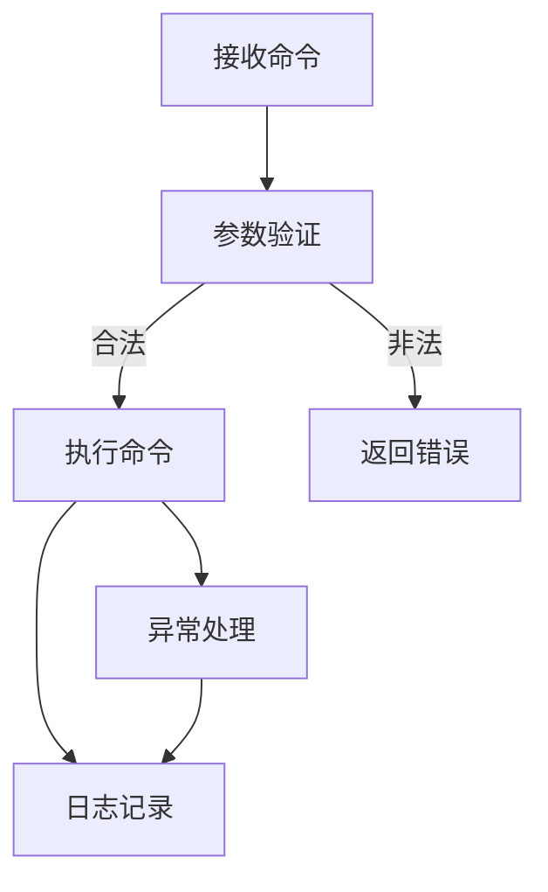
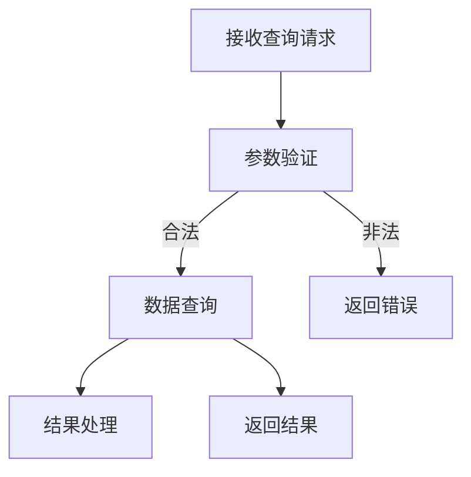

                 

## CQRS模式：背景、核心概念及架构设计

### 引言

CQRS（Command Query Responsibility Segregation）模式，是一种将应用中的命令（Command）和查询（Query）操作分离的架构设计模式。其核心思想是将读写操作分离到不同的服务中，以提高系统的性能和可维护性。在现代软件工程中，CQRS模式被广泛应用于高并发、高可扩展性的大型系统中，尤其在处理大量数据查询和更新操作时表现出色。

本文将深入探讨CQRS模式，从其背景、核心概念到具体的架构设计，逐步分析这一模式的优势和应用场景，帮助读者理解CQRS模式的基本原理和实施方法。

### CQRS模式的起源与背景

CQRS模式起源于分布式系统的设计理念，最早由Martin Fowler在2005年提出。其背景是传统单体应用在处理大量并发请求时面临性能瓶颈，难以满足日益增长的业务需求。随着微服务架构的兴起，CQRS模式成为了一种应对高并发、高可扩展性挑战的有效手段。

传统的单体应用通常将所有的业务逻辑和数据库操作封装在一起，导致读写操作混合在一起，从而降低了系统的响应速度和可维护性。为了解决这一问题，CQRS模式通过将读操作和写操作分离，使系统能够更好地应对不同的操作类型，从而提高了整体性能。

### CQRS模式的核心思想

CQRS模式的核心思想是将系统中的命令和查询操作分离到不同的服务中。具体来说：

- **命令（Command）**：代表用户对系统的操作请求，如创建订单、修改用户信息等。这些操作通常涉及数据的创建、更新和删除。
- **查询（Query）**：代表用户对系统数据的读取请求，如获取用户订单列表、查询库存情况等。这些操作通常不修改数据，但需要快速、高效地获取结果。

通过分离命令和查询操作，CQRS模式能够实现以下目标：

1. **性能优化**：读操作和写操作分离，使得系统可以独立优化各自的性能，从而提高整体系统的响应速度。
2. **可扩展性**：读操作和写操作分离，可以独立扩展各自的服务实例，从而更好地应对不同的业务需求。
3. **数据一致性**：通过适当的机制（如事件溯源、最终一致性等），确保系统在不同操作之间保持数据一致性。

### CQRS与传统的SOA和微服务架构的关系

CQRS模式与传统的SOA（服务导向架构）和微服务架构有密切的关系。SOA和微服务架构都是基于服务的理念，强调服务的独立性和解耦性。然而，CQRS模式在此基础上进一步细化了服务的职责，将读操作和写操作分离到不同的服务中。

- **SOA**：是一种基于服务的设计理念，强调服务的独立性和可重用性。SOA中的服务通常包含读操作和写操作，但并没有明确地将二者分离。
- **微服务架构**：是SOA的一种具体实现，将系统拆分为一系列独立的小服务，每个服务负责特定的业务功能。微服务架构支持CQRS模式，因为它允许将读操作和写操作分离到不同的服务中，从而实现更好的性能和可扩展性。

总之，CQRS模式是微服务架构中的一种具体应用，通过分离读操作和写操作，能够更好地应对高并发、高可扩展性的业务需求。

### CQRS模式的基本术语

在深入探讨CQRS模式之前，我们需要了解一些基本术语，以便更好地理解这一模式的核心概念。

- **命令（Command）**：用户发起的操作请求，通常用于创建、更新或删除数据。例如，创建订单、修改用户信息等。
- **查询（Query）**：用户发起的数据读取请求，通常用于获取数据的状态或信息。例如，查询用户订单列表、获取库存情况等。
- **读模型（Read Model）**：为满足查询操作而构建的数据模型，通常与写模型分离。读模型是预先计算并缓存的数据，用于快速响应用户的查询请求。
- **写模型（Write Model）**：用于存储实际业务数据的数据模型。写模型通常包含实时的业务数据，并用于执行命令操作。

通过理解这些基本术语，我们可以更好地理解CQRS模式的工作原理和设计思路。

### CQRS模式的模型类型

CQRS模式主要分为两种模型类型：分解模型（Decomposed Model）和聚合模型（Aggregate Model）。

#### 分解模型

分解模型将系统分为独立的读模型和写模型，每个模型分别处理不同的操作类型。具体来说：

- **读模型**：专门用于处理查询操作，提供快速、高效的数据读取服务。读模型通常是一个独立的、预先计算的数据缓存，不需要与写模型保持实时一致。
- **写模型**：用于存储实际的业务数据，处理命令操作。写模型通常是一个完整的、实时的数据存储，用于确保业务逻辑的完整性和一致性。

#### 聚合模型

聚合模型将读模型和写模型集成到同一个服务中，但通过不同的接口处理查询和命令操作。具体来说：

- **聚合模型**：将读模型和写模型集成到一个服务中，但通过不同的接口处理查询和命令操作。这种方式通常用于小型系统或场景，当读操作和写操作之间的耦合性较低时。

#### 两种模型类型的比较

- **适用场景**：分解模型适用于需要独立优化读操作和写操作性能的场景，而聚合模型适用于读操作和写操作耦合性较低的小型系统。
- **性能**：分解模型由于将读操作和写操作分离，可以独立优化各自的性能，但需要处理数据一致性问题。聚合模型由于读操作和写操作集成在一起，性能可能受到一定限制。
- **可扩展性**：分解模型具有更好的可扩展性，因为可以独立扩展读模型和写模型。聚合模型的可扩展性相对较差，因为读操作和写操作的扩展往往需要同时进行。

### CQRS模式中的读写分离原理

CQRS模式中的读写分离是通过将读模型和写模型分离到不同的服务或模块中实现的。这种分离不仅提高了系统的性能和可扩展性，还带来了以下好处：

1. **性能优化**：读模型和写模型可以分别进行性能优化，例如读模型可以采用缓存策略、索引优化等，而写模型可以采用事务管理、批量处理等。
2. **数据一致性**：通过事件溯源、最终一致性等机制，确保读模型和写模型之间的数据一致性。
3. **可维护性**：读写分离使得系统的模块更加独立，降低了模块之间的耦合性，提高了系统的可维护性。

具体来说，CQRS模式中的读写分离原理包括以下几个方面：

- **命令处理**：命令操作通过命令接口发送到写模型，写模型执行相应的业务逻辑并更新数据。
- **查询处理**：查询操作通过查询接口发送到读模型，读模型返回预计算的结果，提高了查询效率。

通过这种分离原理，CQRS模式能够更好地应对高并发、高可扩展性的业务需求。

### 总结

在本章中，我们介绍了CQRS模式的基本概念、起源背景、核心思想和基本术语。通过理解CQRS模式，我们能够更好地掌握如何分离读写操作，提高系统的性能和可维护性。在接下来的章节中，我们将深入探讨CQRS模式的核心组成部分，包括命令处理、查询处理以及如何进行架构设计。这些内容将帮助读者更全面地理解CQRS模式的工作原理和应用方法。

### 命令处理

#### 命令模式的定义与作用

命令模式（Command Pattern）是一种行为设计模式，用于将请求封装为一个对象，从而允许将请求参数化、将请求排队或记录请求日志，同时支持可撤销的操作。在CQRS模式中，命令模式用于处理用户的操作请求，如创建订单、修改用户信息等。

命令模式的核心作用是将操作请求与执行操作的过程解耦。具体来说，命令模式包括以下几个关键组成部分：

- **命令（Command）**：代表具体的操作请求，通常是一个包含操作参数的对象。
- **调用者（Invoker）**：负责发送命令请求，通常是一个控制器或服务类。
- **接收者（Receiver）**：负责执行具体的操作，通常是一个业务服务类。

通过命令模式，我们可以将用户的请求（命令）与具体的执行过程（接收者）分离，从而实现以下好处：

1. **可扩展性**：通过扩展命令类，可以轻松添加新的操作请求，而无需修改调用者和接收者。
2. **解耦**：命令模式将请求和执行过程分离，降低了系统组件之间的耦合性，提高了系统的可维护性。
3. **可撤销性**：通过实现命令的撤销功能，可以在必要时回滚操作，确保系统的稳定性。

#### 命令处理流程详解

在CQRS模式中，命令处理是一个关键环节，其流程通常包括以下几个步骤：

1. **接收命令**：调用者接收用户发送的命令请求，并将命令对象存储在一个队列或缓存中。
2. **参数验证**：对命令对象进行参数验证，确保输入参数的有效性和完整性。如果参数不合法，返回错误信息。
3. **执行命令**：调用接收者的相应方法，执行具体的业务操作。这通常涉及到对数据库的插入、更新或删除操作。
4. **异常处理**：在执行命令的过程中，如果发生异常，需要进行异常处理，确保系统能够恢复到正常状态。
5. **日志记录**：记录命令执行的日志信息，用于后续的审计和调试。

以下是一个简单的命令处理流程示例：



通过上述流程，我们可以确保命令请求能够得到正确处理，同时保证系统的稳定性和可维护性。

#### 命令模式的最佳实践

在实现命令模式时，以下最佳实践可以帮助我们构建高效、可靠的命令处理系统：

1. **参数验证**：对命令参数进行严格的验证，确保输入参数的有效性和完整性。可以使用参数校验框架（如Hibernate Validator）来简化验证过程。
2. **异步处理**：对于耗时的命令操作，可以考虑使用异步处理机制（如异步编程模型、消息队列等），以提高系统的响应速度和并发能力。
3. **事务管理**：在执行命令时，确保事务的完整性和一致性。可以使用数据库事务管理机制（如数据库连接池、事务控制器等），确保操作要么全部成功，要么全部失败。
4. **日志记录**：详细记录命令执行的日志信息，包括操作类型、参数值、执行时间等，以便进行后续的审计和调试。
5. **错误处理**：定义统一的错误处理机制，确保系统能够优雅地处理各种异常情况，并给出友好的错误提示。

通过遵循这些最佳实践，我们可以构建一个高效、可靠且易于维护的命令处理系统。

### 查询处理

#### 查询模式的定义与作用

查询模式（Query Pattern）是一种用于获取数据状态或信息的设计模式。在CQRS模式中，查询模式用于处理用户的查询请求，如获取用户订单列表、查询库存情况等。查询模式的核心作用是将数据查询操作与数据操作（如创建、更新、删除）分离，从而提高系统的性能和可维护性。

在查询模式中，主要的组成部分包括：

- **查询（Query）**：代表用户的查询请求，通常是一个包含查询条件的对象。
- **查询处理器（Query Processor）**：负责执行查询操作，并返回查询结果。查询处理器通常是一个独立的服务类。
- **数据访问层（Data Access Layer）**：提供数据查询接口，查询处理器通过该接口获取数据。

通过查询模式，我们可以实现以下好处：

1. **性能优化**：查询操作可以独立优化，例如使用缓存、索引等，从而提高查询效率。
2. **可扩展性**：查询处理器和数据访问层可以独立扩展，从而适应不同的业务需求。
3. **解耦**：查询操作与数据操作分离，降低了系统组件之间的耦合性，提高了系统的可维护性。

#### 查询处理流程详解

查询处理流程通常包括以下几个步骤：

1. **接收查询请求**：查询处理器接收到用户的查询请求，并将查询条件解析为具体的查询操作。
2. **参数验证**：对查询条件进行验证，确保输入参数的有效性和完整性。如果参数不合法，返回错误信息。
3. **数据查询**：查询处理器通过数据访问层执行查询操作，并返回查询结果。在执行查询时，可以采用缓存策略、索引优化等手段提高查询效率。
4. **结果处理**：对查询结果进行必要的处理，如排序、过滤等，然后返回给用户。

以下是一个简单的查询处理流程示例：



通过上述流程，我们可以确保查询请求能够得到高效、可靠的响应。

#### 查询模式的最佳实践

在实现查询模式时，以下最佳实践可以帮助我们构建高效、可靠的查询处理系统：

1. **缓存策略**：对于经常查询的数据，可以使用缓存策略（如Redis、Memcached等）来减少数据库查询次数，提高查询效率。
2. **索引优化**：在数据库中创建适当的索引，提高查询速度。根据查询条件选择合适的索引列，并定期优化索引结构。
3. **分页查询**：对于大数据量的查询操作，可以使用分页查询技术，限制单次查询返回的结果条数，以提高系统的响应速度。
4. **并行处理**：对于复杂的查询操作，可以考虑使用并行处理技术，将查询任务分解为多个子任务并行执行，从而提高查询效率。
5. **错误处理**：定义统一的错误处理机制，确保系统能够优雅地处理各种异常情况，并给出友好的错误提示。

通过遵循这些最佳实践，我们可以构建一个高效、可靠且易于维护的查询处理系统。

### 命令和查询处理模式的对比

命令处理模式和查询处理模式在CQRS模式中扮演着重要角色，虽然它们的目的不同，但在系统设计时需要综合考虑。以下是两者之间的对比：

#### 目的不同

- **命令处理模式**：主要用于处理用户对系统的操作请求，如创建订单、修改用户信息等。其核心目标是确保操作的正确性和数据的一致性。
- **查询处理模式**：主要用于处理用户对系统数据的查询请求，如获取用户订单列表、查询库存情况等。其核心目标是提供高效、准确的数据查询服务。

#### 流程差异

- **命令处理流程**：包括接收命令、参数验证、执行命令、异常处理和日志记录等步骤。
- **查询处理流程**：包括接收查询请求、参数验证、数据查询、结果处理和返回结果等步骤。

#### 最佳实践

- **命令处理**：注重事务管理、参数验证和异常处理，确保操作的正确性和数据的一致性。
- **查询处理**：注重缓存策略、索引优化和并行处理，提高查询效率和响应速度。

#### 联系与融合

虽然命令处理模式和查询处理模式在流程和最佳实践上有所不同，但它们在系统设计中是相互关联的。在实现CQRS模式时，需要综合考虑两者的需求，确保系统在保证数据一致性的同时，提供高效的数据查询服务。

通过理解命令和查询处理模式的不同点和联系，我们可以更好地设计CQRS系统，提高系统的性能和可维护性。

### CQRS模式在Web应用中的设计

在Web应用中，CQRS模式的设计至关重要，它能够显著提高系统的性能和可扩展性。以下我们将探讨CQRS模式在Web应用中的设计方法，包括RESTful API设计和GraphQL服务应用。

#### CQRS模式在RESTful API设计中的应用

RESTful API设计是Web服务的一种常用设计模式，它通过HTTP协议提供统一的接口，便于不同系统之间的交互。在CQRS模式中，RESTful API的设计需要考虑如何分离命令和查询操作。

1. **命令操作**：

   命令操作通常涉及创建、更新和删除数据，可以设计为以下几种类型的API接口：

   - **POST请求**：用于创建新数据，如`POST /orders`创建新订单。
   - **PUT/PATCH请求**：用于更新数据，如`PUT /orders/{orderId}`更新特定订单。
   - **DELETE请求**：用于删除数据，如`DELETE /orders/{orderId}`删除特定订单。

   在实现命令操作时，需要注意以下几点：

   - **参数验证**：确保请求参数的有效性和完整性，可以使用JSON Schema等工具进行验证。
   - **事务管理**：确保操作要么全部成功，要么全部失败，可以使用分布式事务管理框架（如Seata）。
   - **错误处理**：优雅地处理各种异常情况，给出明确的错误信息。

2. **查询操作**：

   查询操作通常涉及获取数据的状态或信息，可以设计为以下类型的API接口：

   - **GET请求**：用于获取数据列表，如`GET /orders`获取所有订单。
   - **GET with 参数**：用于获取特定条件的数据，如`GET /orders?userId={userId}`获取指定用户的所有订单。

   在实现查询操作时，需要注意以下几点：

   - **缓存策略**：对于经常查询的数据，可以使用缓存技术（如Redis）减少数据库查询次数，提高查询效率。
   - **分页查询**：对于大数据量的查询操作，可以使用分页技术（如Limit Offset）限制单次查询返回的结果条数，提高系统的响应速度。
   - **响应格式**：确保返回的响应格式（如JSON）易于解析，可以提供自定义响应格式。

#### CQRS模式在GraphQL服务中的应用

GraphQL是一种基于查询的API设计语言，它提供了一种强大的数据查询接口，使得客户端可以根据需要获取所需的数据，从而避免了传统的RESTful API设计中常见的过度查询和不足查询问题。在CQRS模式中，GraphQL服务可以更好地满足复杂查询需求。

1. **命令操作**：

   在GraphQL中，命令操作通常通过**突变（Mutation）**来实现，如下所示：

   ```graphql
   type Mutation {
     createOrder(input: OrderInput!): Order!
     updateOrder(id: ID!, input: OrderInput!): Order!
     deleteOrder(id: ID!): Order!
   }
   ```

   在实现突变操作时，需要注意以下几点：

   - **输入验证**：确保输入参数的有效性和完整性，可以使用GraphQL的解析器进行验证。
   - **事务管理**：确保操作要么全部成功，要么全部失败，可以使用分布式事务管理框架。
   - **权限控制**：确保用户具有执行命令操作的权限，可以使用基于JWT的认证机制。

2. **查询操作**：

   在GraphQL中，查询操作通常通过**查询（Query）**来实现，如下所示：

   ```graphql
   type Query {
     ordersByUser(userId: ID!): [Order!]
     orderById(id: ID!): Order
   }
   ```

   在实现查询操作时，需要注意以下几点：

   - **缓存策略**：对于经常查询的数据，可以使用缓存技术减少数据库查询次数，提高查询效率。
   - **自定义解析器**：可以使用自定义解析器来优化查询性能，例如使用索引、聚合等操作。
   - **响应格式**：确保返回的响应格式（如JSON）易于解析，可以提供自定义响应格式。

通过结合RESTful API和GraphQL服务，CQRS模式在Web应用中的设计能够更好地满足不同类型的操作需求，提高系统的性能和可维护性。

### CQRS模式在企业级应用中的实践

在企业级应用中，CQRS模式因其出色的性能和可扩展性，被广泛应用于各种业务场景。以下将详细探讨CQRS模式在电子商务系统、订单处理系统和库存管理系统中的应用，并分析其实际案例。

#### CQRS模式在电子商务系统的应用

电子商务系统通常需要处理大量用户请求，包括商品浏览、购物车管理、订单提交等。CQRS模式通过分离读操作和写操作，提高了系统的性能和响应速度。

**案例**：一个大型在线零售平台，其订单提交功能使用了CQRS模式。

1. **命令处理**：

   订单提交是一个典型的写操作，使用命令模式进行处理。具体流程如下：

   - **接收订单数据**：用户在购物车中提交订单，系统接收订单数据，并将数据存储在命令队列中。
   - **参数验证**：对订单数据（如商品ID、数量、用户ID等）进行验证，确保数据的完整性和正确性。
   - **事务处理**：将订单数据提交到事务处理器，确保订单创建、库存扣减、用户余额调整等操作要么全部成功，要么全部失败。

2. **查询处理**：

   用户在订单提交后，可能需要查询订单状态、订单详情等。查询操作使用查询模式进行处理，具体流程如下：

   - **查询订单状态**：系统根据用户ID和订单ID查询订单状态，返回订单详情，如订单号、商品名称、数量、支付状态等。
   - **缓存优化**：对于频繁查询的数据，如用户订单列表，可以使用缓存策略，减少数据库查询次数。

通过CQRS模式，电子商务系统提高了订单提交的效率和可靠性，同时确保了订单查询的快速响应。

#### CQRS模式在订单处理系统的实现

订单处理系统是电子商务系统的重要组成部分，负责处理订单的创建、支付、发货等操作。CQRS模式在订单处理系统中发挥了关键作用。

**案例**：一个大型电商平台，其订单处理系统采用了CQRS模式。

1. **命令处理**：

   订单处理系统的命令处理主要包括订单创建和支付操作，具体流程如下：

   - **订单创建**：用户提交订单后，系统将订单数据存储在写模型中，并生成订单号。
   - **支付处理**：订单提交后，用户需要进行支付操作。系统调用支付服务，处理支付请求，并将支付结果记录到数据库。

2. **查询处理**：

   订单处理系统的查询处理主要包括查询订单状态、订单详情等，具体流程如下：

   - **订单状态查询**：用户可以通过查询接口查询订单状态，如订单是否已支付、是否已发货等。
   - **订单详情查询**：用户可以查询订单详情，包括商品名称、数量、价格、支付时间等。

通过CQRS模式，订单处理系统实现了读写分离，提高了系统的性能和可扩展性。

#### CQRS模式在库存管理系统的优化

库存管理系统是企业运营中至关重要的部分，负责监控库存水平、库存调整等操作。CQRS模式通过分离读操作和写操作，有效提高了库存管理系统的效率。

**案例**：一个大型制造企业，其库存管理系统采用了CQRS模式。

1. **命令处理**：

   库存管理系统的命令处理主要包括库存调整、库存扣减等操作，具体流程如下：

   - **库存调整**：当库存水平低于警戒线时，系统会自动生成库存调整命令，调整库存量。
   - **库存扣减**：用户在订单提交时，系统会自动扣减相应的库存量，确保库存数据的准确性。

2. **查询处理**：

   库存管理系统的查询处理主要包括查询库存水平、库存详情等，具体流程如下：

   - **库存查询**：用户可以通过查询接口查询当前库存水平，包括库存总量、库存预警等。
   - **库存详情查询**：用户可以查询特定商品的库存详情，包括库存数量、入库时间、出库时间等。

通过CQRS模式，库存管理系统实现了读写分离，提高了库存数据的实时性和准确性。

### 总结

CQRS模式在企业级应用中的实践，通过分离读操作和写操作，提高了系统的性能和可扩展性。在实际案例中，CQRS模式在电子商务系统、订单处理系统和库存管理系统中都取得了显著的成效。通过合理的设计和实施，企业能够更好地应对复杂的业务需求，提高运营效率。

### CQRS模式在不同技术栈中的实现

在现代软件开发中，CQRS模式因其高效的读写分离特性，被广泛应用于多种技术栈中。以下我们将详细探讨CQRS模式在Java、.NET和Node.js技术栈中的具体实现，并通过实际代码示例进行讲解。

#### CQRS模式在Java中的实现

Java作为一种广泛使用的企业级编程语言，具有强大的生态系统和丰富的库支持，使其成为实现CQRS模式的理想选择。以下是Java中实现CQRS模式的基本步骤：

1. **定义命令和查询接口**：

   在Java中，我们首先需要定义命令和查询接口，用于处理不同的业务操作。以下是一个简单的示例：

   ```java
   // 命令接口
   public interface OrderCommand {
       void createOrder(Order order);
       void updateOrder(Order order);
       void deleteOrder(Long orderId);
   }

   // 查询接口
   public interface OrderQuery {
       Order getOrderById(Long orderId);
       List<Order> getOrdersByCustomerId(Long customerId);
   }
   ```

2. **实现命令和查询处理**：

   接着，我们需要实现命令和查询处理的具体逻辑。以下是一个简单的命令处理示例：

   ```java
   @Service
   public class OrderCommandHandler implements OrderCommand {
       @Autowired
       private OrderRepository orderRepository;

       @Override
       public void createOrder(Order order) {
           // 业务逻辑处理，如库存扣减、订单创建等
           orderRepository.save(order);
       }

       @Override
       public void updateOrder(Order order) {
           // 业务逻辑处理，如更新订单状态、商品数量等
           orderRepository.updateOrder(order);
       }

       @Override
       public void deleteOrder(Long orderId) {
           // 业务逻辑处理，如订单删除、库存恢复等
           orderRepository.deleteOrderById(orderId);
       }
   }
   ```

   对于查询处理，可以采用类似的实现方式：

   ```java
   @Service
   public class OrderQueryHandler implements OrderQuery {
       @Autowired
       private OrderRepository orderRepository;

       @Override
       public Order getOrderById(Long orderId) {
           return orderRepository.findById(orderId);
       }

       @Override
       public List<Order> getOrdersByCustomerId(Long customerId) {
           return orderRepository.findOrdersByCustomerId(customerId);
       }
   }
   ```

3. **分离数据模型**：

   在Java中，我们通常将读模型和写模型分离到不同的数据库表中。以下是一个简单的数据模型示例：

   ```java
   @Entity
   @Table(name = "orders_write_model")
   public class OrderWriteModel {
       @Id
       @GeneratedValue(strategy = GenerationType.IDENTITY)
       private Long id;

       private String orderId;
       private String customerId;
       // 其他属性
   }

   @Entity
   @Table(name = "orders_read_model")
   public class OrderReadModel {
       @Id
       @GeneratedValue(strategy = GenerationType.IDENTITY)
       private Long id;

       private String orderId;
       private String customerId;
       private String status;
       // 其他属性
   }
   ```

#### CQRS模式在.NET中的实现

.NET框架在实现CQRS模式时也提供了丰富的库支持，如Entity Framework Core和ASP.NET Core等。以下是.NET中实现CQRS模式的基本步骤：

1. **定义命令和查询接口**：

   类似于Java，在.NET中我们首先需要定义命令和查询接口：

   ```csharp
   public interface ICommandHandler<TCommand> where TCommand : ICommand
   {
       void Handle(TCommand command);
   }

   public interface IQueryHandler<TQuery> where TQuery : IQuery
   {
       TResult Handle(TQuery query);
   }
   ```

2. **实现命令和查询处理**：

   在.NET中，我们可以使用MediatR库来简化命令和查询处理：

   ```csharp
   public class OrderCommandHandler : ICommandHandler<CreateOrderCommand>
   {
       private readonly OrderRepository _orderRepository;

       public OrderCommandHandler(OrderRepository orderRepository)
       {
           _orderRepository = orderRepository;
       }

       public void Handle(CreateOrderCommand command)
       {
           // 业务逻辑处理，如库存扣减、订单创建等
           _orderRepository.CreateOrder(command.Order);
       }
   }

   public class OrderQueryHandler : IQueryHandler<GetOrderQuery>
   {
       private readonly OrderRepository _orderRepository;

       public OrderQueryHandler(OrderRepository orderRepository)
       {
           _orderRepository = orderRepository;
       }

       public Order Handle(GetOrderQuery query)
       {
           return _orderRepository.GetOrderById(query.OrderId);
       }
   }
   ```

3. **分离数据模型**：

   在.NET中，我们可以使用Entity Framework Core来分离读模型和写模型：

   ```csharp
   public class OrderWriteModel : IEntityTypeConfiguration<OrderWriteModel>
   {
       public void Configure(EntityTypeBuilder<OrderWriteModel> builder)
       {
           builder.HasKey(b => b.Id);
           builder.Property(b => b.OrderId).IsRequired();
           builder.Property(b => b.CustomerId).IsRequired();
           // 其他属性
       }
   }

   public class OrderReadModel : IEntityTypeConfiguration<OrderReadModel>
   {
       public void Configure(EntityTypeBuilder<OrderReadModel> builder)
       {
           builder.HasKey(b => b.Id);
           builder.Property(b => b.OrderId).IsRequired();
           builder.Property(b => b.CustomerId).IsRequired();
           builder.Property(b => b.Status).IsRequired();
           // 其他属性
       }
   }
   ```

#### CQRS模式在Node.js中的实现

Node.js以其高性能和异步编程模型在实时应用程序开发中广泛应用。在Node.js中实现CQRS模式相对简单，以下是基本步骤：

1. **定义命令和查询接口**：

   在Node.js中，我们可以使用TypeScript来定义命令和查询接口：

   ```typescript
   interface ICommand {
       execute(handler: ICommandHandler): Promise<void>;
   }

   interface IQuery<TResult> {
       execute(handler: IQueryHandler<TResult>): Promise<TResult>;
   }
   ```

2. **实现命令和查询处理**：

   使用Express.js和TypeORM库，我们可以简化命令和查询处理：

   ```typescript
   // 命令处理
   @Service()
   class OrderCommandHandler {
       async execute(command: CreateOrderCommand) {
           // 业务逻辑处理，如库存扣减、订单创建等
           await this.orderRepository.createOrder(command.order);
       }
   }

   // 查询处理
   @Service()
   class OrderQueryHandler {
       async execute(query: GetOrderQuery): Promise<Order> {
           return this.orderRepository.getOrderById(query.id);
       }
   }
   ```

3. **分离数据模型**：

   在Node.js中，我们同样可以使用TypeORM来分离读模型和写模型：

   ```typescript
   @Entity()
   class OrderWriteModel {
       @PrimaryGeneratedColumn()
       id: number;

       @Column()
       orderId: string;

       @Column()
       customerId: string;
       // 其他属性
   }

   @Entity()
   class OrderReadModel {
       @PrimaryGeneratedColumn()
       id: number;

       @Column()
       orderId: string;

       @Column()
       customerId: string;

       @Column()
       status: string;
       // 其他属性
   }
   ```

通过上述步骤，我们可以实现在Java、.NET和Node.js技术栈中实现CQRS模式。这些实现方法不仅能够提高系统的性能和可维护性，还能够更好地满足复杂的业务需求。

### CQRS模式的挑战与解决方案

#### 数据一致性问题

在CQRS模式中，由于读模型和写模型通常分离在不同的服务中，因此数据一致性问题成为一个重要的挑战。读模型可能会因为缓存、延迟或不同步等原因产生不一致的数据。

**解决方案**：

1. **最终一致性**：通过事件溯源或CQRS+事件溯源确保最终一致性。这意味着系统中的所有操作都会生成事件，这些事件会在不同的服务中同步，从而确保最终的一致性。
2. **事件溯源**：在CQRS模式中，事件溯源是一种常用的解决方案。每个操作都会生成一个事件，这些事件被记录在一个事件存储中，然后由另一个服务来消费这些事件，从而确保数据的一致性。
3. **同步机制**：使用同步机制（如定时任务、消息队列等）来确保读模型和写模型之间的数据同步。例如，可以通过消息队列将写模型中的更新事件发送到读模型，从而实现数据的一致性。

#### 性能优化问题

CQRS模式中的读模型和写模型分离可能会导致性能优化变得复杂。特别是读模型可能需要处理大量的缓存、索引和查询优化。

**解决方案**：

1. **缓存策略**：使用分布式缓存（如Redis）来减少读模型对数据库的查询次数，提高查询性能。
2. **索引优化**：在数据库中创建适当的索引，提高查询速度。根据查询条件选择合适的索引列，并定期优化索引结构。
3. **查询优化**：对于复杂的查询操作，可以采用分库分表、垂直拆分或水平拆分等策略，从而提高查询性能。

#### 调试和监控问题

由于CQRS模式中的服务分离，调试和监控变得更加复杂。我们需要确保能够全面监控整个系统的运行状态，及时发现并解决问题。

**解决方案**：

1. **日志记录**：使用统一日志记录工具（如ELK、Logstash等）来记录系统的日志，便于后续的调试和分析。
2. **分布式跟踪**：使用分布式跟踪工具（如Zipkin、Jaeger等）来追踪请求的生命周期，确保能够全面监控系统的运行状态。
3. **监控告警**：使用监控工具（如Prometheus、Grafana等）来监控系统的性能指标，设置告警规则，以便在出现问题时及时通知相关人员。

通过上述解决方案，我们可以有效应对CQRS模式中的数据一致性、性能优化和调试监控等挑战，从而确保系统的稳定运行。

### CQRS模式的前沿发展

随着技术的不断进步，CQRS模式在许多新兴领域得到了进一步的发展和优化。以下是CQRS模式在事件溯源、CQRS+事件溯源以及云计算与大数据应用中的前沿发展。

#### CQRS模式与事件溯源

事件溯源（Event Sourcing）是一种将所有状态变化记录为事件的模式，每个事件都代表系统状态的一次变更。事件溯源与CQRS模式相结合，可以在保证数据一致性的同时，提供强大的数据处理能力。

**原理**：

在事件溯源中，每个操作都会生成一个事件，这些事件记录了系统状态的变更历史。读模型通过消费这些事件来重建当前状态，从而实现了最终一致性。

**优势**：

1. **数据一致性和可追溯性**：事件溯源确保了数据的一致性，因为每个事件都记录了系统状态的变化，从而可以追溯每个变更的来源。
2. **扩展性和灵活性**：事件溯源允许系统灵活地处理各种复杂的业务逻辑，因为可以通过事件流来重放和修改系统状态。

**案例**：

一个典型的案例是在金融交易系统中，所有交易操作都会生成事件，如买入、卖出等。通过事件溯源，系统能够准确记录每个交易的历史，并在需要时进行回滚或查询。

#### CQRS+事件溯源

CQRS+事件溯源结合了CQRS和事件溯源的优点，进一步优化了数据一致性和系统性能。

**原理**：

在CQRS+事件溯源中，除了记录操作事件外，还会生成特定的查询事件，这些查询事件用于更新读模型。通过这种方式，读模型可以保持与写模型的一致性，同时提高查询性能。

**优势**：

1. **高效的查询性能**：通过生成特定的查询事件，读模型可以更快地更新，从而提高查询性能。
2. **灵活的数据处理**：事件溯源提供了强大的数据处理能力，可以灵活地处理各种业务逻辑。

**案例**：

在电子商务系统中，CQRS+事件溯源可以用于实时更新库存信息。每次订单提交时，不仅会生成订单事件，还会生成查询事件，用于更新库存读模型。

#### CQRS模式在云计算与大数据应用中的潜力

云计算和大数据技术的发展为CQRS模式提供了新的应用场景和优化手段。

**云计算应用**：

在云计算环境中，CQRS模式可以通过容器化（如Docker）、微服务架构（如Kubernetes）以及自动化部署（如CI/CD）来实现高效的读写分离。

**大数据应用**：

在处理大数据时，CQRS模式可以通过分布式数据处理框架（如Apache Hadoop、Apache Spark）来优化查询性能，同时确保数据的一致性和准确性。

**优势**：

1. **高扩展性**：云计算和大数据技术使得CQRS模式能够轻松地扩展到大规模系统，满足不断增长的数据和处理需求。
2. **高性能**：通过分布式架构和优化查询策略，CQRS模式在处理大数据时能够提供高效的读写分离。

**案例**：

在实时数据分析平台中，CQRS模式可以用于处理大量的实时数据流，通过事件溯源和分布式查询优化，确保数据的实时性和准确性。

通过上述前沿发展，CQRS模式在多个领域中展示了其强大的应用潜力，为现代软件开发提供了新的思路和解决方案。

### CQRS模式的未来展望

随着技术的不断进步和业务需求的日益复杂，CQRS模式在未来的发展前景十分广阔。以下是CQRS模式在物联网（IoT）、区块链技术以及人工智能（AI）领域的潜在应用和拓展。

#### 物联网（IoT）中的应用

物联网技术的发展带来了海量设备的连接和数据生成，这些数据需要高效的处理和实时分析。CQRS模式在IoT中的应用，可以显著提高系统的响应速度和处理能力。

**潜在应用**：

1. **实时监控与数据分析**：在智能家居、智能工厂等场景中，CQRS模式可以用于实时监控设备状态，并快速分析设备数据，从而实现智能决策。
2. **边缘计算优化**：通过在边缘设备上部署CQRS模式，可以实现数据的本地处理和缓存，降低中心服务器的负载，提高整体系统的性能。

**优势**：

- **高效的数据处理**：CQRS模式能够分离读写操作，优化数据处理的效率。
- **实时响应能力**：在IoT场景中，实时响应至关重要，CQRS模式能够满足这一需求。

#### 区块链技术中的潜力

区块链技术的去中心化、不可篡改特性与CQRS模式的读写分离机制相结合，具有巨大的应用潜力。

**潜在应用**：

1. **分布式账本**：在分布式账本技术（如Hyperledger Fabric）中，CQRS模式可以用于分离读写操作，提高账本的处理效率和数据一致性。
2. **智能合约**：在智能合约的开发中，CQRS模式可以帮助分离业务逻辑和状态查询，确保智能合约的高效执行和数据一致性。

**优势**：

- **数据一致性和安全性**：通过CQRS模式，可以确保区块链系统中数据的一致性和安全性。
- **可扩展性**：区块链系统的分布式特性与CQRS模式相结合，可以进一步优化系统的可扩展性。

#### 人工智能（AI）领域的拓展

人工智能技术的发展，尤其是机器学习和深度学习，需要大量的数据处理和实时分析。CQRS模式在AI领域的拓展，可以显著提高数据处理和分析的效率。

**潜在应用**：

1. **实时数据分析**：在金融风控、医疗诊断等场景中，CQRS模式可以用于实时处理和分析数据，提供智能决策支持。
2. **AI推理服务**：通过CQRS模式，可以构建高效的AI推理服务，快速响应用户请求，提高AI应用的性能。

**优势**：

- **高性能数据处理**：CQRS模式能够高效地分离读写操作，满足AI领域对数据处理的高性能需求。
- **灵活性与可扩展性**：CQRS模式可以根据不同的业务需求灵活调整，适应各种AI应用场景。

通过在物联网、区块链和人工智能领域的拓展，CQRS模式将在未来的技术发展中发挥越来越重要的作用，为现代软件开发提供更加高效、可靠和可扩展的解决方案。

### CQRS模式的总结

CQRS模式作为一种分离读写操作的架构设计模式，具有许多显著的优势和适用场景。其核心思想是将系统的读操作和写操作分离到不同的服务中，从而提高系统的性能、可扩展性和可维护性。

#### 优势

1. **性能优化**：通过分离读写操作，系统能够独立优化各自的性能，例如读模型可以使用缓存、索引等技术提高查询效率，而写模型可以采用批量处理、事务管理等提高写入效率。
2. **可扩展性**：读写分离使得系统可以独立扩展读模型和写模型，从而更好地应对不同的业务需求。例如，在电子商务系统中，读模型可以独立扩展以满足用户查询需求，而写模型可以独立扩展以处理订单创建等操作。
3. **数据一致性**：通过适当的一致性机制（如事件溯源、最终一致性等），确保系统在不同操作之间保持数据一致性，从而避免传统架构中常见的数据不一致问题。

#### 适用场景

CQRS模式特别适用于以下场景：

1. **高并发、高可扩展性的系统**：例如电子商务平台、在线支付系统等，这些系统需要处理大量的并发请求，通过CQRS模式可以有效提高系统的性能和可扩展性。
2. **需要分离读写操作的业务**：例如实时数据处理、金融风控等，这些业务场景中读写操作具有不同的性能和一致性要求，通过CQRS模式可以更好地满足这些需求。
3. **数据一致性要求较高的系统**：例如分布式系统、微服务架构等，CQRS模式通过事件溯源等技术可以确保数据在不同服务之间的一致性。

通过总结CQRS模式的优势和适用场景，我们可以更好地理解其在现代软件开发中的应用价值和前景。

### 拓展阅读与参考资料

对于想要进一步深入了解CQRS模式及其相关技术的读者，以下是一些建议的拓展阅读资源和参考资料。

#### 拓展阅读

1. **《CQRS and Event Sourcing in .NET》**：这本书详细介绍了CQRS和事件溯源在.NET中的实现方法，包括代码示例和最佳实践。
2. **《Building Microservices》**：这本书由Sam Newman撰写，全面介绍了微服务架构的设计原则和实践，其中包含了CQRS模式的相关内容。
3. **《Event Sourcing in Action》**：这本书由Steve Smith撰写，详细介绍了事件溯源的概念、原理和实现方法，适合对事件溯源感兴趣的读者。

#### 参考资料

1. **Martin Fowler的CQRS文档**：Martin Fowler在其官方网站上提供了关于CQRS模式的详细文档，包括模式的概念、设计原则和常见问题解答。
2. **Netflix的CQRS实践**：Netflix在其官方网站上分享了其在服务中采用CQRS模式的具体实践，包括架构设计、性能优化和一致性保障。
3. **Docker官方文档**：Docker提供了丰富的文档，介绍了如何使用容器化技术部署和管理CQRS模式下的微服务。

通过阅读这些拓展阅读资源和参考资料，读者可以更全面地了解CQRS模式及其在实际应用中的最佳实践，从而提升自己在软件架构设计方面的能力。

