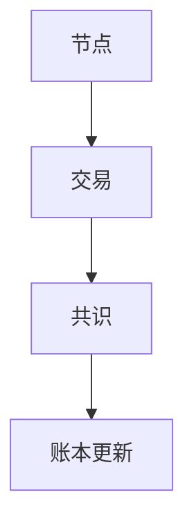
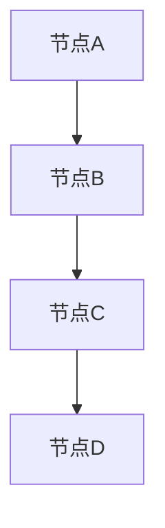
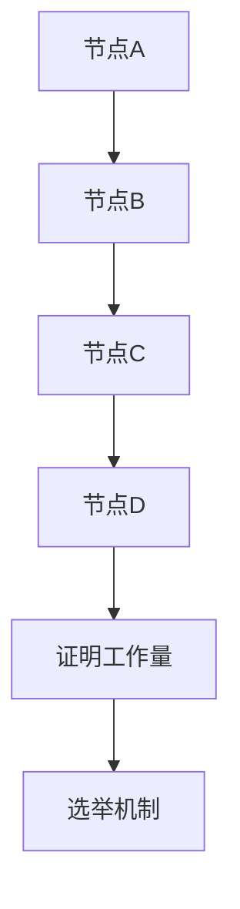
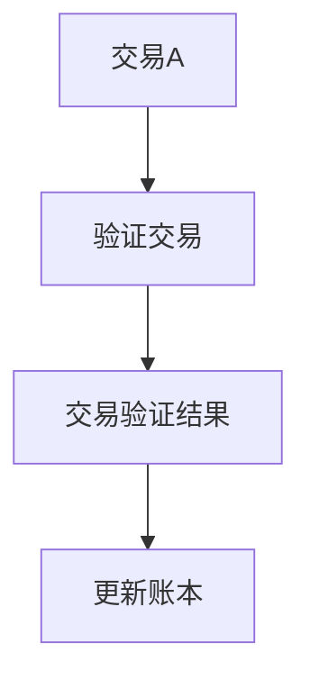

                 


### DAG（有向无环图）在分布式账本中的应用

#### 关键词：DAG、分布式账本、区块链、共识算法、交易验证、性能提升

> 摘要：本文将深入探讨DAG（有向无环图）在分布式账本中的应用，从基础理论、数学模型、应用场景到核心算法，再到项目实践，全面解析DAG在分布式计算、存储和账本更新中的优势和挑战。通过具体实例，我们希望帮助读者理解DAG的核心概念及其在分布式账本中的重要应用。

---

## 第一部分：DAG基础理论

### 第1章：DAG基本概念

#### 1.1 什么是DAG

**DAG的定义**：DAG（Directed Acyclic Graph，有向无环图）是由节点（或称为顶点）和边组成的图形结构，其中节点表示数据元素，边表示节点之间的关系，并且边的方向是有向的。DAG中的每一条边都指向一个特定的后续节点，而不会形成环。

**DAG与无向图、有向图的关系**：无向图是没有方向的边，而DAG则是具有方向的边。有向图可能包含环，但DAG不允许存在任何环。

#### 1.2 DAG的基本特性

**无环性**：DAG中的节点通过有向边连接，但不会形成闭合路径，即不存在环。

**有向性**：DAG的边是有方向的，即从源节点指向目标节点。

**节点与边的关系**：每个节点可以有一个或多个前驱节点和后继节点，但不会有形成闭环的情况。

#### 1.3 DAG与区块链的关系

**DAG在区块链中的应用背景**：传统的区块链技术使用链式结构来记录交易信息，而DAG提供了一种新的数据结构，可以实现多条并行链，提高了系统性能。

**DAG与区块链的区别与联系**：DAG在区块链中的应用主要体现在其去中心化和高扩展性上，它允许交易并行处理，提高了系统的吞吐量。同时，DAG解决了传统区块链中的“双花”问题。

---

### 第2章：DAG的数学模型

#### 2.1 DAG的表示方法

**胶囊图**：胶囊图是一种通过节点和边的形式来表示DAG的方法，节点代表数据元素，边表示节点之间的关系。

**Petri网**：Petri网是一种用于描述并发系统和异步通信的数学模型，它也可以用于表示DAG。

**递归图**：递归图是一种通过递归定义的图结构，适用于表示具有递归关系的DAG。

#### 2.2 DAG的基本算法

**拓扑排序**：拓扑排序是一种对DAG进行排序的算法，它按照节点之间的关系进行排序，使得所有前驱节点都在后续节点之前。

**最长路径算法**：最长路径算法用于寻找DAG中两个节点之间最长的路径。

**网络流算法**：网络流算法用于计算DAG中的最大流或最小流。

---

### 第3章：DAG的典型应用场景

#### 3.1 分布式计算

**数据处理**：DAG可以用于并行处理大量数据，提高数据处理效率。

**负载均衡**：通过DAG实现任务的分配和调度，实现负载均衡。

**并行计算**：DAG支持并行计算，可以加速计算过程。

#### 3.2 分布式存储

**数据存储**：DAG可以用于高效地存储和管理数据。

**数据检索**：通过DAG实现快速的索引和检索。

**数据同步**：DAG支持数据的分布式同步，保证数据的完整性。

#### 3.3 分布式账本

**共识算法**：DAG可以用于实现高效的共识算法，提高系统的共识速度。

**交易验证**：DAG支持对交易进行高效验证，保证交易的安全性和有效性。

**账本更新**：DAG可以实现分布式账本的快速更新，保证账本的一致性。

---

## 第二部分：DAG在分布式账本中的应用

### 第4章：分布式账本中的DAG

#### 4.1 DAG在分布式账本中的优势

**可扩展性**：DAG允许并行处理交易，从而提高系统的可扩展性。

**性能提升**：通过并行处理，DAG可以显著提高系统的性能。

**安全性增强**：DAG提供了一种去中心化的结构，增强了系统的安全性。

#### 4.2 DAG在分布式账本中的应用框架

**基本框架设计**：DAG在分布式账本中的应用框架包括节点、交易、共识和账本更新等关键组件。

**系统架构图**：图4.1展示了DAG在分布式账本中的系统架构。



---

### 第5章：DAG在分布式账本中的核心算法

#### 5.1 DAG共识算法

**证明工作量**：在DAG共识算法中，节点通过证明工作量来竞争生成区块。

**选举机制**：通过特定的选举机制，选择出块节点，生成新的区块。

#### 5.2 DAG交易验证算法

**交易验证流程**：交易在加入DAG前需要经过严格的验证流程。

**交易冲突解决**：DAG通过特定的机制来解决交易冲突，保证账本的一致性。

#### 5.3 DAG账本更新算法

**账本更新策略**：DAG通过区块的生成和验证来更新账本。

**账本一致性保障**：DAG采用分布式一致性算法来保障账本的一致性。

---

### 第6章：DAG分布式账本的项目实践

#### 6.1 项目背景

**项目概述**：介绍DAG分布式账本项目的整体情况。

**项目目标**：明确项目的目标和预期成果。

#### 6.2 项目架构设计

**节点架构**：描述DAG分布式账本节点的架构。

**网络拓扑**：展示DAG分布式账本的网络拓扑结构。

#### 6.3 项目实施步骤

**节点启动**：详细描述节点的启动过程。

**交易处理**：介绍交易的处理流程。

**共识达成**：阐述共识达成的机制和过程。

#### 6.4 项目评估与优化

**性能评估**：对项目的性能进行评估。

**安全性评估**：对项目的安全性进行评估。

**可扩展性评估**：对项目的可扩展性进行评估。

---

### 第7章：DAG在分布式账本中的应用前景与挑战

#### 7.1 应用前景

**分布式计算领域**：DAG在分布式计算中的应用前景广阔。

**分布式存储领域**：DAG可以提升分布式存储系统的效率。

**跨链互操作性**：DAG有助于实现跨链互操作性。

#### 7.2 面临的挑战

**可扩展性问题**：DAG的可扩展性仍需进一步优化。

**安全性问题**：DAG的安全性问题需要持续关注。

**规模性问题**：如何处理大规模的DAG结构是一个挑战。

---

## 附录：DAG相关资源与工具

### 附录1：DAG学习资源推荐

**学习资料**：推荐一些DAG相关的学习资料。

**研究论文**：介绍一些关于DAG的研究论文。

### 附录2：DAG开发工具介绍

**DAG实现框架**：介绍一些DAG的实现框架。

**开发工具与库**：介绍一些用于DAG开发的工具和库。

---

## Mermaid 流程图

**DAG基本结构图**：



**DAG共识算法流程图**：



**DAG交易验证流程图**：



---

## Python代码示例

**DAG拓扑排序实现**：

```python
from collections import defaultdict

def topological_sort(graph):
    in_degree = defaultdict(int)
    for node in graph:
        for neighbor in graph[node]:
            in_degree[neighbor] += 1

    queue = [node for node, degree in in_degree.items() if degree == 0]
    sorted_nodes = []

    while queue:
        node = queue.pop(0)
        sorted_nodes.append(node)

        for neighbor in graph[node]:
            in_degree[neighbor] -= 1
            if in_degree[neighbor] == 0:
                queue.append(neighbor)

    return sorted_nodes
```

**DAG最长路径算法实现**：

```python
import numpy as np

def longest_path(dag, source):
    dist = {node: float('inf') for node in dag}
    dist[source] = 0

    for _ in range(len(dag) - 1):
        for node in dag:
            for neighbor in dag[node]:
                if dist[node] + 1 < dist[neighbor]:
                    dist[neighbor] = dist[node] + 1

    return dist
```

**DAG网络流算法实现**：

```python
from collections import defaultdict

def max_flow(dag, source, sink):
    flow = defaultdict(int)
    while True:
        parent = dfs(dag, source, sink, flow)
        if not parent:
            break

        path_flow = float('inf')
        s = sink
        while s != source:
            path_flow = min(path_flow, flow[parent[s], s])
            s = parent[s]

        for v in parent.values():
            for u in v:
                if u in flow:
                    flow[u, v] += path_flow
                else:
                    flow[v, u] -= path_flow

    return sum(flow[(u, v) for u, v in flow.items() if u < v]
```

---

## 作者：AI天才研究院/AI Genius Institute & 禅与计算机程序设计艺术 /Zen And The Art of Computer Programming

---

### 文章小结

本文从DAG的基本概念出发，深入探讨了DAG在分布式账本中的应用。通过详细的分析和实例，我们了解了DAG在分布式计算、存储和账本更新中的优势和挑战。DAG以其高扩展性和高性能，为分布式系统带来了新的可能。在未来的发展中，DAG有望在更多领域发挥重要作用。

---

### 注意事项

在实现DAG分布式账本时，需要注意以下几个方面：

1. **性能优化**：合理设计节点结构和算法，提高系统性能。
2. **安全性保障**：确保交易验证和账本更新的安全性。
3. **可扩展性设计**：设计可扩展的架构，以应对不断增长的数据量和交易量。

---

### 拓展阅读

1. **《DAG技术深度解析》**：深入探讨DAG的技术细节和应用场景。
2. **《分布式账本技术导论》**：了解分布式账本的基本概念和最新发展。

---

### 最佳实践 Tips

1. **DAG网络流算法在实际应用中，可以结合具体业务场景进行优化**。
2. **在设计DAG共识算法时，需要综合考虑安全性和性能**。

通过本文的阅读，希望读者对DAG在分布式账本中的应用有了更深入的理解，能够在实际项目中运用DAG技术，为分布式系统带来创新和提升。

