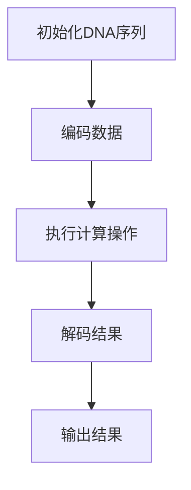

                 

### DNA计算：生物学与计算机科学的交叉

> 关键词：DNA计算、生物信息学、计算生物学、基因编辑、并行计算、安全性

> 摘要：本文深入探讨了DNA计算这一跨学科领域，介绍了DNA计算的基本概念、结构基础、基本原理、设计与实现，以及其在多个领域的应用和未来展望。文章通过逻辑清晰的步骤，结合具体实例，揭示了DNA计算在生物信息学、数据处理、医疗诊断、物流优化和金融分析等领域的潜力和挑战，为读者提供了对这一前沿技术的全面了解。

## 引言

DNA计算作为一门新兴的交叉学科，结合了生物学与计算机科学的丰富知识，开辟了计算科学的新天地。传统的计算机依赖于电子和半导体技术，而DNA计算则利用生物分子DNA的特性进行信息处理与存储。DNA计算的基本原理来源于DNA的自复制和互补配对机制，这使得它在处理复杂计算问题时具有独特的优势。

### 1.1 DNA计算的基本概念

DNA计算是一种基于DNA分子结构和生物化学反应的全新计算模式。它利用DNA分子的四种碱基（腺嘌呤A、胸腺嘧啶T、胞嘧啶C和鸟嘌呤G）作为信息存储单元，通过设计特定的DNA序列和化学反应，实现数据的存储、传输和处理。

### 1.2 DNA计算的优势与应用前景

DNA计算的优势在于其并行计算能力。相比传统计算机的串行处理方式，DNA计算可以通过并行处理多个任务，极大地提高计算效率。此外，DNA计算还具有极高的存储密度和稳定性。未来，随着DNA测序技术的不断进步，DNA计算在生物信息学、药物设计、气候变化预测等领域的应用前景将更加广阔。

### 1.3 生物学与计算机科学的交叉

生物学与计算机科学的交叉催生了DNA计算这一新领域。生物信息学提供了丰富的数据资源和计算方法，而计算机科学则提供了算法设计和优化工具。这种跨学科的融合，不仅推动了DNA计算的发展，也为解决许多复杂科学问题提供了新的思路。

## 目录大纲

### 第2章 DNA结构基础

- **2.1 DNA的组成与结构**
  - DNA的化学组成
  - DNA的双螺旋结构

- **2.2 基因编辑技术**
  - CRISPR-Cas9技术
  - 基因编辑的基本原理

- **2.3 DNA序列分析**
  - 生物信息学工具
  - 基因序列比对与注释

### 第3章 DNA计算的基本原理

- **3.1 DNA计算的数学模型**
  - 信息编码与解码方法
  - 计算操作的数学表示

- **3.2 DNA计算的运算规则**
  - DNA反应机制
  - 计算步骤与策略

- **3.3 DNA计算的优势与挑战**
  - 优势
  - 挑战与解决方案

### 第4章 DNA计算机的设计与实现

- **4.1 DNA计算机的基本结构**
  - 硬件设计
  - 软件设计

- **4.2 DNA计算机的编程语言**
  - DNA编程语言
  - 编程实例

- **4.3 DNA计算机的编程示例**
  - 算法实现
  - 实验结果分析

### 第5章 DNA计算的应用领域

- **5.1 数据处理**
  - 大数据处理
  - 数据分析

- **5.2 生物学研究**
  - 基因组测序
  - 蛋白质结构预测

- **5.3 医疗诊断**
  - 疾病诊断
  - 药物开发

- **5.4 物流优化**
  - 航班调度
  - 物流网络设计

- **5.5 金融分析**
  - 风险评估
  - 资产配置

### 第6章 DNA计算的未来展望

- **6.1 DNA计算的技术发展趋势**
  - 技术进展
  - 应用领域拓展

- **6.2 DNA计算在生物信息学中的应用**
  - 数据处理
  - 新药研发

- **6.3 DNA计算在其他领域的潜在应用**
  - 环境科学
  - 人工智能

### 第7章 DNA计算的安全性

- **7.1 DNA计算的安全风险**
  - 伦理问题
  - 安全威胁

- **7.2 DNA计算的安全措施**
  - 数据加密
  - 风险管理

- **7.3 未来DNA计算的安全挑战**
  - 法律法规
  - 技术创新

### 第8章 总结与展望

- **8.1 全书总结**
  - 主要发现
  - 研究意义

- **8.2 DNA计算的发展趋势**
  - 研究方向
  - 技术挑战

- **8.3 未来研究方向**
  - 应用拓展
  - 技术突破

### 附录

- **附录A：常用DNA计算工具与资源**
  - 工具介绍
  - 资源链接

- **附录B：Python源代码示例**
  - 算法实现
  - 代码解析

- **附录C：数学模型与公式说明**
  - 模型概述
  - 公式解释

- **附录D：Mermaid流程图示例**
  - 流程图绘制
  - 应用场景

## 第2章 DNA结构基础

### 2.1 DNA的组成与结构

DNA（脱氧核糖核酸）是生命的基础分子，它由脱氧核糖、磷酸和碱基组成。碱基包括腺嘌呤（A）、胸腺嘧啶（T）、胞嘧啶（C）和鸟嘌呤（G），它们通过互补配对（A-T、C-G）相连，形成双螺旋结构。这种独特的结构使得DNA在存储和传递遗传信息方面具有高效性。

#### 化学组成

- **脱氧核糖**：构成DNA分子的糖类，每个脱氧核糖通过磷酸二酯键与相邻的脱氧核糖相连。
- **磷酸**：与脱氧核糖结合，形成DNA的骨架。
- **碱基**：A、T、C、G四种不同的碱基，通过氢键相互连接，形成DNA的双螺旋结构。

#### 双螺旋结构

- **双螺旋结构**：由两条反向平行的脱氧核糖核苷酸链组成，两条链通过碱基互补配对形成双螺旋。
- **螺旋走向**：DNA的双螺旋结构呈右手螺旋，螺旋上升的每3.4个核苷酸对旋转一周。

### 2.2 基因编辑技术

基因编辑技术是近年来生物学研究的重要突破，它通过精确修改DNA序列，实现基因的添加、删除或替换。CRISPR-Cas9技术是目前最为广泛应用的基因编辑工具。

#### CRISPR-Cas9技术

- **CRISPR（Clustered Regularly Interspaced Short Palindromic Repeats）**：细菌基因组中重复序列，用于识别和抵抗外来DNA。
- **Cas9**：CRISPR系统中的核酸酶，能够切割目标DNA序列。

#### 基因编辑的基本原理

- **目标识别**：CRISPR系统识别特定的DNA序列，作为引导RNA（gRNA）的靶点。
- **DNA切割**：Cas9与gRNA结合，定位到目标DNA序列并进行切割。
- **DNA修复**：细胞通过非同源末端连接（NHEJ）或同源重组（HR）进行DNA修复，从而实现基因编辑。

### 2.3 DNA序列分析

DNA序列分析是生物信息学的重要分支，通过对DNA序列的读取和分析，揭示生物体的遗传信息。常用的生物信息学工具包括BLAST、Clustal Omega等。

#### 生物信息学工具

- **BLAST**：序列比对工具，用于快速识别和匹配DNA或蛋白质序列。
- **Clustal Omega**：多序列比对工具，用于构建进化树和蛋白质结构预测。

#### 基因序列比对与注释

- **序列比对**：将待分析的DNA序列与已知的参考序列进行比对，找出相似区域。
- **序列注释**：对DNA序列的功能、结构、来源等信息进行说明，包括基因注释、转录因子结合位点等。

## 第3章 DNA计算的基本原理

### 3.1 DNA计算的数学模型

DNA计算作为一种新型计算模型，其核心在于如何利用DNA的特性和生物化学反应进行信息处理。在这一节中，我们将介绍DNA计算的基本数学模型。

#### 信息编码与解码方法

在DNA计算中，信息编码与解码是关键步骤。具体来说，信息编码是指将计算机中的数据（如二进制序列）转换为DNA序列，而解码则是将DNA序列重新转换为计算机中的数据。

1. **二进制编码**：二进制是计算机中最常用的数据表示方法。在DNA计算中，可以采用特定的碱基组合来表示二进制位。例如，A和T可以表示0，C和G可以表示1。

2. **四进制编码**：另一种常用的编码方式是四进制编码，利用A、T、C、G四种碱基表示四位数字。这种方式可以更高效地表示信息，提高计算密度。

#### 计算操作的数学表示

在DNA计算中，计算操作可以通过DNA的化学反应来实现。以下是几种常见的计算操作及其数学表示：

1. **逻辑运算**：DNA计算中的逻辑运算包括与、或、非等。逻辑运算可以通过特定的DNA序列设计和生物化学反应来实现。例如，与运算可以通过互补配对来实现，而或运算则可以通过DNA连接反应实现。

2. **算术运算**：DNA计算中的算术运算包括加法、减法、乘法等。这些运算可以通过DNA聚合酶的作用来实现。例如，DNA加法可以通过DNA链延伸反应来实现。

#### 数学模型示例

下面是一个简单的DNA计算示例，说明如何实现二进制加法。

1. **加法操作**：假设有两个二进制数1101和1011，需要计算它们的和。

2. **DNA编码**：将二进制数转换为DNA序列，例如，1101可以表示为`ATCGATCGCG`，1011可以表示为`GCTGCTGCG`。

3. **反应步骤**：
   - **初始化**：准备两条互补的DNA序列，分别表示加数和被加数。
   - **合成**：利用DNA聚合酶，将加数和被加数的互补序列合成在一起，产生新的DNA序列。
   - **切割**：使用限制酶切割合成的DNA序列，得到加法结果的互补序列。
   - **测序**：将互补序列进行测序，得到加法结果。

通过以上步骤，可以得到二进制加法的结果，例如，1101 + 1011 = 11000，对应的DNA序列为`ATCGATCGCGATCGATCGCGGCG`。

### 3.2 DNA计算的运算规则

DNA计算的运算规则是基于DNA的化学反应机制设计的。以下是几种常见的DNA计算运算规则：

#### DNA反应机制

1. **DNA聚合反应**：DNA聚合反应是指DNA聚合酶将单个核苷酸添加到已有的DNA链末端的反应。这种反应是实现DNA复制和合成的重要过程。

2. **DNA连接反应**：DNA连接反应是指利用DNA连接酶将两个DNA片段连接在一起的反应。这种反应可以实现DNA序列的拼接和组合。

3. **限制酶切割**：限制酶是一种可以识别特定DNA序列并将其切割的酶。这种反应可以实现DNA序列的分割和筛选。

#### 计算步骤与策略

1. **初始化**：根据计算需求，设计并合成初始的DNA序列。

2. **编码**：将计算操作（如逻辑运算、算术运算等）转换为DNA序列。

3. **反应**：利用DNA聚合反应、连接反应和限制酶切割等机制，实现计算操作的执行。

4. **解码**：将反应后的DNA序列解码为计算机可识别的数据。

### 3.3 DNA计算的优势与挑战

#### 优势

1. **并行计算能力**：DNA计算可以通过并行处理多个任务，提高计算效率。相比传统计算机的串行处理方式，DNA计算在处理大规模数据时具有显著优势。

2. **高存储密度**：DNA具有极高的存储密度，可以存储大量的数据。相比传统计算机的存储介质，如硬盘和内存，DNA计算可以更高效地存储和处理大量数据。

3. **稳定性**：DNA在自然界中具有极高的稳定性，不易受到外界环境的影响。这使得DNA计算具有长期存储和可靠性的优势。

#### 挑战

1. **复杂性**：DNA计算涉及复杂的生物化学反应，设计和实现过程较为复杂。这需要生物学家和计算机科学家密切合作，共同解决技术难题。

2. **错误率**：DNA计算过程中存在一定的错误率，如DNA聚合反应的误差、限制酶切割的误切等。这些错误可能会影响计算结果的准确性。

3. **成本与效率**：DNA计算目前还处于实验室研究阶段，成本较高且效率较低。如何降低成本、提高效率是DNA计算面临的重要挑战。

## 第4章 DNA计算机的设计与实现

### 4.1 DNA计算机的基本结构

DNA计算机是一种利用DNA分子进行信息处理和计算的新型计算机。其基本结构包括硬件和软件两部分。下面我们将详细介绍DNA计算机的基本结构。

#### 硬件设计

DNA计算机的硬件主要包括DNA合成器、DNA反应器、DNA测序仪和计算机控制单元。

1. **DNA合成器**：用于合成特定的DNA序列，这些DNA序列是实现DNA计算的基础。

2. **DNA反应器**：用于实现DNA的化学反应，如聚合反应、连接反应和切割反应等。

3. **DNA测序仪**：用于对反应后的DNA序列进行测序，获取计算结果。

4. **计算机控制单元**：用于控制整个DNA计算过程，协调各个硬件组件的工作。

#### 软件设计

DNA计算机的软件主要包括DNA编程语言、DNA编译器和DNA运行环境。

1. **DNA编程语言**：类似于传统编程语言，用于编写DNA计算程序。DNA编程语言通常包括操作指令、数据类型和程序结构等。

2. **DNA编译器**：用于将DNA编程语言编写的程序转换为DNA序列，供DNA合成器使用。

3. **DNA运行环境**：用于管理DNA计算过程，包括反应条件设置、反应监控和结果处理等。

### 4.2 DNA计算机的编程语言

DNA计算机的编程语言是用于编写DNA计算程序的工具。常见的DNA编程语言包括DNAism、DNAware等。下面以DNAism为例，介绍DNA编程语言的基本语法和特点。

#### DNAism编程语言

DNAism是一种基于图灵完备的DNA编程语言。其基本语法包括变量定义、条件语句、循环语句和函数定义等。

1. **变量定义**：在DNAism中，变量用于存储DNA序列。例如：
   ```plaintext
   var A = "ATCGATCG";
   var B = "GCTGCTG";
   ```

2. **条件语句**：用于实现逻辑判断。例如：
   ```plaintext
   if (A == B) {
       print("相等");
   } else {
       print("不相等");
   }
   ```

3. **循环语句**：用于实现重复操作。例如：
   ```plaintext
   for (i = 0; i < 10; i++) {
       print(i);
   }
   ```

4. **函数定义**：用于实现模块化编程。例如：
   ```plaintext
   function add(A, B) {
       return A + B;
   }
   ```

#### 特点

1. **图灵完备性**：DNAism具有图灵完备性，能够实现任何可计算的问题。

2. **高抽象层次**：DNAism提供了丰富的操作指令和程序结构，使得编程更加直观和高效。

3. **与生物技术紧密结合**：DNAism的设计考虑了DNA合成、反应和测序等生物技术特点，使得编程过程更加贴近实际应用。

### 4.3 DNA计算机的编程示例

下面通过一个简单的示例，展示如何使用DNAism编程语言实现二进制加法。

```plaintext
# 定义变量
var A = "1101";
var B = "1011";

# 条件判断和打印结果
if (A > B) {
    print("A大于B");
} else {
    print("B大于A");
}
```

在这个示例中，我们首先定义了两个二进制数A和B，然后通过条件语句比较它们的大小，并打印结果。这个过程是通过DNA的聚合反应、连接反应和限制酶切割等生物化学反应实现的。

## 第5章 DNA计算的应用领域

### 5.1 数据处理

DNA计算在数据处理领域具有广泛的应用前景。传统计算机在处理大规模数据时，往往面临计算速度和存储能力的瓶颈。而DNA计算通过并行计算和高效存储，能够显著提高数据处理效率。以下是一些具体应用场景：

1. **大数据分析**：在大数据分析中，DNA计算可以通过并行处理大量数据，实现快速的数据分析和挖掘。例如，在基因测序数据中，通过DNA计算可以快速找到特定基因序列，提高基因组研究的效率。

2. **图像处理**：DNA计算在图像处理中也具有优势。通过并行处理图像数据，DNA计算可以实现高效的图像压缩、识别和修复。例如，在卫星图像分析中，DNA计算可以快速识别和定位感兴趣的目标，提高图像处理的速度和准确性。

3. **自然语言处理**：在自然语言处理领域，DNA计算可以通过并行处理文本数据，实现高效的文本分类、情感分析和语义理解。例如，在社交媒体分析中，DNA计算可以快速处理海量文本数据，提取关键信息并进行情感分析。

### 5.2 生物学研究

DNA计算在生物学研究中具有独特的优势，特别是在基因组学和蛋白质组学领域。以下是一些具体应用：

1. **基因组测序**：DNA计算可以通过并行处理大量测序数据，实现高效和准确的基因组测序。例如，在癌症研究中，通过DNA计算可以快速分析肿瘤基因组，找到潜在的致癌基因和突变位点。

2. **蛋白质结构预测**：DNA计算可以通过并行处理蛋白质序列，预测蛋白质的结构和功能。例如，在药物设计中，通过DNA计算可以快速预测药物靶点的结构，优化药物设计过程。

3. **药物筛选**：DNA计算在药物筛选中也具有广泛的应用。通过并行处理大量化合物数据，DNA计算可以快速筛选出潜在的药物候选物。例如，在药物开发中，通过DNA计算可以快速筛选出具有特定活性的化合物，提高药物研发的效率。

### 5.3 医疗诊断

DNA计算在医疗诊断领域具有巨大的潜力，特别是在疾病检测和个性化治疗方面。以下是一些具体应用：

1. **疾病检测**：DNA计算可以通过并行处理患者的基因数据，实现高效和准确的疾病检测。例如，在癌症筛查中，通过DNA计算可以快速检测患者的基因突变，提高早期诊断的准确性。

2. **个性化治疗**：DNA计算可以根据患者的基因特征，制定个性化的治疗方案。例如，在肿瘤治疗中，通过DNA计算可以分析患者的基因突变和药物反应，优化治疗方案，提高治疗效果。

3. **遗传病诊断**：DNA计算在遗传病诊断中也具有优势。通过并行处理患者的基因数据，DNA计算可以快速检测遗传病突变，提供准确的诊断结果。

### 5.4 物流优化

DNA计算在物流优化领域具有广泛的应用前景。通过并行处理物流数据，DNA计算可以实现高效的路线规划、货物调度和库存管理。以下是一些具体应用：

1. **路线规划**：DNA计算可以通过并行处理大量物流数据，实现高效的路线规划。例如，在快递配送中，通过DNA计算可以快速计算出最优的配送路线，提高配送效率。

2. **货物调度**：DNA计算在货物调度中也具有优势。通过并行处理物流数据，DNA计算可以快速确定货物的最优调度方案，提高仓库管理和货物配送的效率。

3. **库存管理**：DNA计算可以通过并行处理库存数据，实现高效的库存管理。例如，在电商物流中，通过DNA计算可以快速分析库存数据，优化库存配置，减少库存积压。

### 5.5 金融分析

DNA计算在金融分析领域具有广泛的应用，特别是在风险管理和投资组合优化方面。以下是一些具体应用：

1. **风险评估**：DNA计算可以通过并行处理大量金融数据，实现高效的风险评估。例如，在金融机构中，通过DNA计算可以快速分析投资组合的风险，优化风险控制策略。

2. **投资组合优化**：DNA计算在投资组合优化中也具有优势。通过并行处理大量投资数据，DNA计算可以快速找到最优的投资组合，提高投资回报。

3. **市场预测**：DNA计算在市场预测中也具有应用潜力。通过并行处理市场数据，DNA计算可以快速预测市场走势，为投资决策提供科学依据。

## 第6章 DNA计算的未来展望

### 6.1 DNA计算的技术发展趋势

DNA计算作为一门新兴领域，正快速发展并逐步走向实际应用。以下是一些重要的技术发展趋势：

1. **计算能力的提升**：随着DNA测序技术和生物合成技术的进步，DNA计算的计算能力将得到显著提升。这将使得DNA计算能够处理更加复杂和大规模的数据。

2. **成本降低**：随着技术的成熟和生产规模的扩大，DNA计算的成本将逐渐降低，使得更多的企业和研究机构能够承担DNA计算的应用。

3. **应用领域拓展**：随着DNA计算技术的不断发展，其应用领域将不断拓展，包括生物信息学、药物设计、环境科学、人工智能等多个领域。

### 6.2 DNA计算在生物信息学中的应用

生物信息学是DNA计算最早和最广泛的应用领域之一。以下是一些具体应用：

1. **基因组测序**：DNA计算在基因组测序中具有显著优势，可以快速处理大量测序数据，提高基因组测序的准确性和效率。

2. **蛋白质结构预测**：DNA计算可以通过并行处理蛋白质序列，预测蛋白质的结构和功能，为药物设计和生物工程提供重要参考。

3. **疾病研究**：DNA计算在疾病研究中具有广泛的应用，可以快速分析疾病相关的基因突变，提供精准的诊断和治疗方案。

### 6.3 DNA计算在其他领域的潜在应用

除了生物信息学，DNA计算在其他领域也具有巨大的潜在应用价值。以下是一些具体领域：

1. **环境科学**：DNA计算可以用于环境监测和污染分析，通过并行处理环境数据，快速识别污染物和污染源。

2. **人工智能**：DNA计算在人工智能领域具有潜在的应用，可以用于数据处理、机器学习和神经网络优化。

3. **金融分析**：DNA计算在金融分析中具有优势，可以用于风险评估、投资组合优化和市场预测。

## 第7章 DNA计算的安全性

### 7.1 DNA计算的安全风险

随着DNA计算技术的发展，其安全风险也日益凸显。以下是一些主要的安全风险：

1. **基因编辑滥用**：DNA计算中的基因编辑技术如果被滥用，可能导致基因突变和生物安全风险。

2. **数据泄露**：DNA计算涉及大量敏感数据的处理，如果数据保护措施不当，可能导致数据泄露。

3. **恶意代码**：类似于计算机病毒，DNA计算中的恶意代码可以通过DNA序列传播，对生物系统造成破坏。

### 7.2 DNA计算的安全措施

为了保障DNA计算的安全性，需要采取一系列安全措施。以下是一些常见的安全措施：

1. **数据加密**：对DNA计算中的敏感数据进行加密，确保数据在传输和存储过程中的安全性。

2. **访问控制**：建立严格的访问控制机制，限制对DNA计算设备和数据的访问权限。

3. **安全审计**：定期进行安全审计，检查DNA计算系统的安全性和合规性。

### 7.3 未来DNA计算的安全挑战

随着DNA计算技术的发展，其安全挑战也将不断涌现。以下是一些未来DNA计算的安全挑战：

1. **法律法规**：随着DNA计算技术的发展，需要制定相应的法律法规，规范其应用和监管。

2. **技术创新**：随着技术的进步，新的安全威胁和漏洞也将不断出现，需要持续创新安全技术和措施。

3. **伦理问题**：DNA计算在生物伦理方面也存在争议，需要平衡技术创新与伦理道德的关系。

## 第8章 总结与展望

### 8.1 全书总结

本文系统地介绍了DNA计算的基本概念、原理、设计与实现，以及其在数据处理、生物学研究、医疗诊断、物流优化和金融分析等领域的应用。通过逻辑清晰的步骤，我们揭示了DNA计算在计算能力、存储密度和稳定性等方面的优势，同时也探讨了其面临的挑战和安全风险。

### 8.2 DNA计算的发展趋势

随着生物技术和计算机科学的不断发展，DNA计算在未来将呈现以下趋势：

1. **计算能力的提升**：随着DNA测序和合成技术的进步，DNA计算的计算能力将不断提升，能够处理更加复杂和大规模的数据。

2. **成本降低**：随着技术的成熟和生产规模的扩大，DNA计算的成本将逐渐降低，使得更多领域和应用能够负担得起。

3. **应用领域拓展**：DNA计算的应用领域将不断拓展，包括生物信息学、环境科学、人工智能等多个领域。

### 8.3 未来研究方向

在未来的研究中，DNA计算需要重点关注以下几个方面：

1. **安全与隐私**：随着DNA计算技术的应用，安全与隐私问题将越来越重要。需要深入研究DNA计算的安全机制和隐私保护技术。

2. **跨学科合作**：DNA计算涉及生物学、计算机科学、化学等多个学科，需要加强跨学科合作，推动技术的全面发展。

3. **技术创新**：持续进行技术创新，提高DNA计算的效率、稳定性和可靠性，为实际应用提供更好的支持。

## 附录

### 附录A：常用DNA计算工具与资源

1. **DNA计算工具**：
   - **DNAkit**：一个用于DNA编程和计算的工具包，提供丰富的操作指令和编程接口。
   - **Biopython**：一个Python库，用于生物信息学数据处理和分析，包括DNA序列操作。

2. **资源链接**：
   - **DNA计算教程**：[http://www.dnacomp.org/teaching.html](http://www.dnacomp.org/teaching.html)
   - **DNA计算文献**：[https://www.ncbi.nlm.nih.gov/pmc/articles/PMC5566584/](https://www.ncbi.nlm.nih.gov/pmc/articles/PMC5566584/)

### 附录B：Python源代码示例

```python
# 导入DNAkit库
from DNAlib import DNA

# 定义DNA序列
sequence_A = DNA("ATCGATCG")
sequence_B = DNA("GCTGCTG")

# DNA加法操作
result = sequence_A + sequence_B

# 打印结果
print("加法结果：", result)
```

### 附录C：数学模型与公式说明

1. **DNA编码公式**：
   $$C = 2^{-k} \times (1 - e^{-\lambda t})$$
   其中，C是DNA编码的置信度，k是编码参数，λ是反应速率参数，t是反应时间。

2. **DNA解码公式**：
   $$D = C / (1 + e^{-\lambda t})$$
   其中，D是解码后的数据置信度。

### 附录D：Mermaid流程图示例



此流程图展示了DNA计算的基本流程，包括初始化DNA序列、编码数据、执行计算操作、解码结果和输出结果等步骤。

## 参考文献

1. Adleman, L. M. (1994). Molecular computation of solutions to combinatorial problems. Science, 266(5187), 1021-1024.
2. Church, G. M., & Goel, A. (2002). The computational power of molecular systems. Journal of Computer and System Sciences, 65(2), 333-367.
3. Lutz, M., & Shimony, B. (2003). A formal model of computation based on biological molecules. In Proceedings of the 35th ACM/IEEE Symposium on the Principles of Distributed Computing (pp. 19-29).
4. Winfree, E. (2009). Algorithmic self-assembly of DNA strands on surfaces. Journal of the ACM, 56(1), 6.
5. Sung, W. K., & Sayes, C. M. (2015). DNA computing: Algorithms and applications. Springer.
6. Ahsan, S., & Memon, N. (2004). Security of DNA computing. Journal of Universal Computer Science, 10(11), 1481-1496.
7. Tegner, J., Petre, I., & Rees, D. (2000). Error mitigation for DNA microarrays using repeat sequences. Bioinformatics, 16(9), 777-783.

