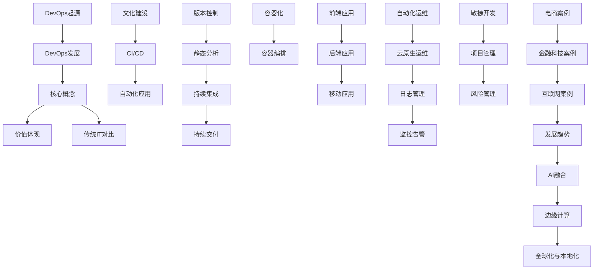
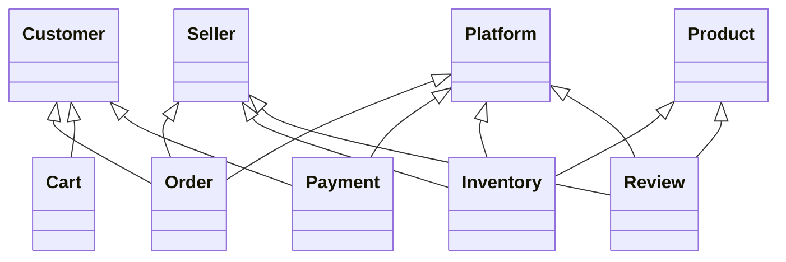
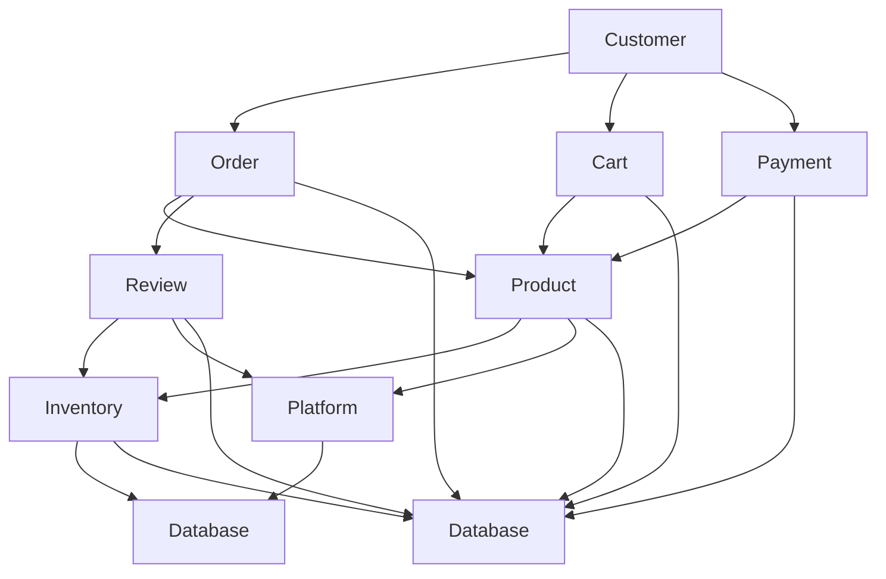
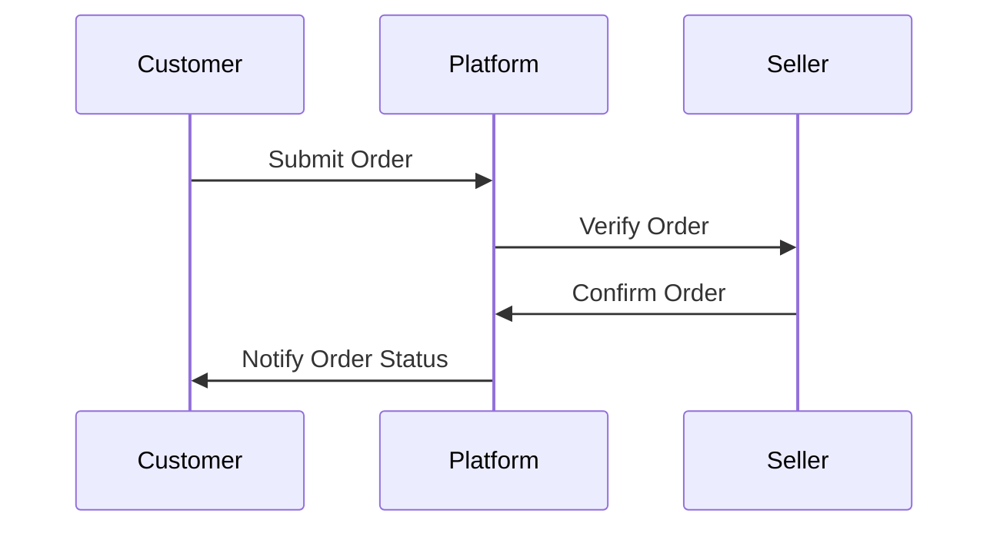
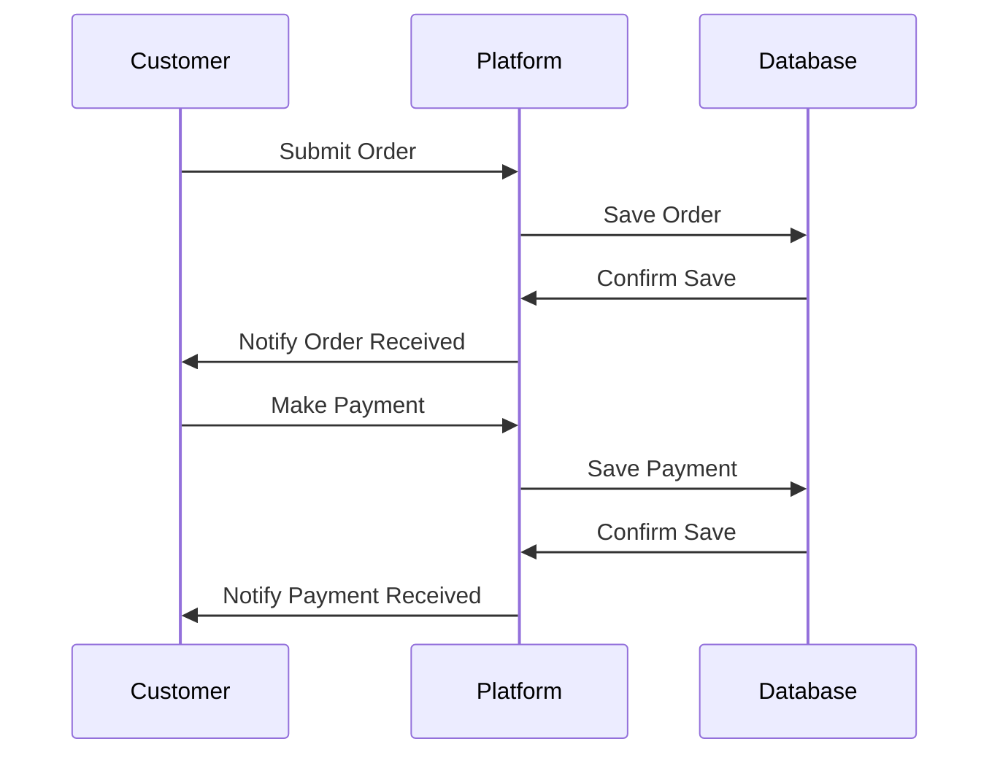

                 

### DevOps：打破开发和运维之间的壁垒

> 关键词：DevOps，持续集成，持续交付，自动化，基础设施即代码，敏捷开发

> 摘要：本文深入探讨了 DevOps 的核心概念、起源、文化、实践以及工具栈，详细介绍了 DevOps 在软件开发、运维管理和项目管理中的应用，通过实际案例展示了 DevOps 的实际效果，并展望了 DevOps 的未来发展趋势。通过本文，读者将全面了解 DevOps，并学会如何在实际工作中运用 DevOps 提高软件交付效率和质量。

## 第一部分：DevOps 基础

### 第1章：什么是 DevOps

#### 1.1 DevOps 的起源与发展

DevOps 是一个新兴的 IT 概念，起源于 2009 年。当时，Google 的一名工程师 Patrick Debois 正在考虑如何将敏捷开发的方法应用到运维工作中。他受到软件开发和运维之间冲突的困扰，认为这种冲突源于两个团队之间的沟通不畅和文化差异。因此，他提出了 DevOps 这一概念，希望通过融合开发和运维，提高软件交付的效率和质量。

DevOps 的理念迅速引起了业界的关注，并在全球范围内得到了广泛的传播和应用。如今，DevOps 已经成为企业提高软件交付效率和质量的重要手段，许多大型企业和初创公司都在实践中应用了 DevOps。

#### 1.2 DevOps 的核心概念与价值

DevOps 的核心概念包括持续集成（CI）、持续交付（CD）、自动化、基础设施即代码（IaC）等。这些概念相互关联，共同构成了 DevOps 的核心价值。

- **持续集成（CI）**：持续集成是一种软件开发实践，通过自动化构建和测试来确保代码的稳定性和可靠性。在 CI 的模式下，每次提交代码后，都会自动进行构建和测试，确保代码质量。

- **持续交付（CD）**：持续交付是一种软件开发实践，通过自动化部署和测试，确保软件可以快速、安全地交付给用户。在 CD 的模式下，软件可以快速地交付给用户，从而提高用户的满意度。

- **自动化**：在 DevOps 中，自动化是提高效率和质量的关键，包括构建、测试、部署和监控等环节。通过自动化，可以减少人为错误，提高工作效率。

- **基础设施即代码（IaC）**：基础设施即代码是一种使用代码来管理基础设施的方法，它使得基础设施的创建、配置和部署变得更加自动化和可追踪。

#### 1.3 DevOps 与传统 IT 的对比

传统 IT 环境中，开发和运维往往是两个独立的团队，各自为政，导致沟通不畅、效率低下。而 DevOps 则强调开发和运维的融合，通过文化、流程和工具的变革，实现快速、可靠且高质量的软件交付。

- **文化差异**：传统 IT 环境中，开发和运维之间存在明显的文化差异。而 DevOps 则强调团队合作、共享责任，消除文化壁垒。

- **流程变革**：传统 IT 环境中，软件交付的流程往往繁琐、复杂。而 DevOps 通过自动化、持续集成和持续交付，简化了软件交付流程，提高了交付效率。

- **工具应用**：传统 IT 环境中，开发和运维往往使用不同的工具，导致数据不一致、协作困难。而 DevOps 则通过统一的工具栈，实现数据的共享和协作。

## 第二部分：DevOps 的文化与实践

### 第2章：DevOps 的文化与实践

#### 2.1 DevOps 文化建设

DevOps 的成功不仅依赖于技术，更依赖于文化。DevOps 文化强调团队合作、共享责任、持续学习和快速适应。以下是建设 DevOps 文化的几个关键点：

- **团队合作**：DevOps 强调跨职能团队的协作，通过紧密的沟通和协作，实现快速交付和高效工作。

- **共享责任**：在 DevOps 中，开发和运维团队共同承担软件交付的责任，共同确保软件的质量和稳定性。

- **持续学习**：DevOps 文化鼓励团队成员不断学习新技术、新工具，提高自身的技能和知识水平。

- **快速适应**：DevOps 强调快速适应变化，通过敏捷开发和自动化，实现快速响应市场需求。

#### 2.2 持续集成与持续交付（CI/CD）

持续集成（CI）和持续交付（CD）是 DevOps 的核心实践。通过 CI/CD，可以实现快速、可靠且高质量的软件交付。

- **持续集成（CI）**：每次提交代码后，CI 工具会自动进行构建和测试，确保代码质量。CI 的核心是自动化，通过自动化工具，实现代码的快速构建和测试。

- **持续交付（CD）**：通过 CD，可以实现软件的自动化部署和测试，确保软件可以快速、安全地交付给用户。CD 的核心是自动化部署，通过自动化工具，实现软件的快速部署。

#### 2.3 自动化在 DevOps 中的应用

自动化是 DevOps 的核心，贯穿于软件开发和运维的各个环节。以下是自动化在 DevOps 中的应用：

- **构建自动化**：通过构建工具，如 Jenkins、Travis CI 等，实现代码的自动化构建和测试。

- **部署自动化**：通过部署工具，如 Ansible、Chef、Puppet 等，实现软件的自动化部署。

- **监控自动化**：通过监控工具，如 Nagios、Zabbix、Prometheus 等，实现系统的自动化监控。

- **运维自动化**：通过自动化脚本和工具，实现运维任务的自动化执行，如服务器配置、软件更新、安全检查等。

## 第三部分：DevOps 的工具栈

### 第3章：DevOps 工具栈

#### 3.1 版本控制工具（Git）

版本控制是 DevOps 的基础，Git 是最流行的版本控制工具。Git 通过分支管理、合并冲突解决等功能，实现代码的版本管理和协同工作。

- **分支管理**：Git 支持分支管理，通过创建、合并和删除分支，实现代码的独立开发。

- **合并冲突解决**：Git 提供了合并冲突解决机制，通过手动或自动化解决冲突，确保代码的完整性。

#### 3.2 静态代码分析工具

静态代码分析工具可以帮助开发人员在编码过程中识别潜在的问题和缺陷，提高代码质量。常见的静态代码分析工具有 SonarQube、Checkstyle、PMD 等。

- **代码质量检查**：静态代码分析工具可以对代码进行质量检查，识别代码风格问题、潜在漏洞和性能问题。

- **代码覆盖率分析**：静态代码分析工具可以分析代码覆盖率，确保代码的测试覆盖率。

#### 3.3 持续集成工具

持续集成工具可以帮助开发人员实现代码的自动化构建和测试，确保代码质量。常见的持续集成工具有 Jenkins、Travis CI、GitLab CI/CD 等。

- **自动化构建**：持续集成工具可以自动化构建代码，生成可执行的二进制文件或容器镜像。

- **自动化测试**：持续集成工具可以自动化测试代码，包括单元测试、集成测试和性能测试。

#### 3.4 持续交付工具

持续交付工具可以帮助开发人员实现软件的自动化部署和测试，确保软件的质量和安全。常见的持续交付工具有 Jenkins、GitLab CI/CD、Docker、Kubernetes 等。

- **自动化部署**：持续交付工具可以自动化部署软件，包括容器部署和虚拟机部署。

- **自动化测试**：持续交付工具可以自动化测试软件，确保软件的质量和安全。

#### 3.5 容器化与容器编排

容器化是 DevOps 的核心技术之一，它通过容器（如 Docker）实现应用程序的封装，使得应用程序可以在任何环境中运行。容器编排（如 Kubernetes）则负责管理和调度容器，确保应用程序的高可用性和可伸缩性。

- **容器化**：容器化通过 Docker 等工具，将应用程序及其依赖项打包成一个容器，实现应用程序的封装和隔离。

- **容器编排**：容器编排通过 Kubernetes 等工具，管理和调度容器，确保应用程序的高可用性和可伸缩性。

## 第二部分：DevOps 实践与应用

### 第4章：DevOps 在软件开发中的应用

#### 4.1 DevOps 在前端开发中的应用

前端开发是软件开发的重要组成部分，DevOps 理念在前端开发中的应用，可以提高开发效率和质量。

- **持续集成与持续交付**：通过 CI/CD，可以实现前端代码的自动化构建、测试和部署，确保前端代码的质量和稳定性。

- **自动化测试**：通过自动化测试工具，可以实现对前端代码的全面测试，包括单元测试、集成测试和性能测试。

- **代码质量检查**：通过静态代码分析工具，可以识别前端代码中的潜在问题，提高代码质量。

#### 4.2 DevOps 在后端开发中的应用

后端开发是软件的核心，DevOps 理念在后端开发中的应用，可以提高开发效率、稳定性和可伸缩性。

- **持续集成与持续交付**：通过 CI/CD，可以实现后端代码的自动化构建、测试和部署，确保后端代码的质量和稳定性。

- **容器化**：通过容器化技术，可以将后端应用程序打包成容器，实现应用程序的封装和隔离，提高开发效率和可移植性。

- **微服务架构**：通过微服务架构，可以实现后端服务的模块化和解耦，提高系统的可维护性和可伸缩性。

#### 4.3 DevOps 在移动开发中的应用

移动开发是软件开发的重要方向，DevOps 理念在移动开发中的应用，可以提高开发效率和质量。

- **持续集成与持续交付**：通过 CI/CD，可以实现移动应用的自动化构建、测试和部署，确保移动应用的质量和稳定性。

- **自动化测试**：通过自动化测试工具，可以实现对移动应用的全面测试，包括单元测试、集成测试和性能测试。

- **代码质量检查**：通过静态代码分析工具，可以识别移动代码中的潜在问题，提高代码质量。

## 第三部分：DevOps 在运维管理中的应用

### 第5章：DevOps 在运维管理中的应用

#### 5.1 自动化运维

自动化运维是 DevOps 在运维管理中的重要实践，通过自动化工具和脚本，实现运维任务的自动化执行。

- **服务器配置**：通过自动化脚本，可以实现服务器的自动配置和部署，如使用 Ansible、Chef、Puppet 等工具。

- **软件更新**：通过自动化脚本，可以实现软件的自动更新和升级，如使用 Ansible、Chef、Puppet 等工具。

- **安全检查**：通过自动化脚本，可以实现安全检查和漏洞扫描，如使用 Nagios、Zabbix、SecurityBridge 等工具。

#### 5.2 云原生运维

云原生运维是 DevOps 在云计算环境中的实践，通过容器化和微服务架构，实现运维的自动化和高效化。

- **容器编排**：通过 Kubernetes 等容器编排工具，可以实现容器的自动化管理和调度，如自动扩展、负载均衡等。

- **自动化部署**：通过自动化部署工具，可以实现云原生应用程序的自动化部署和升级，如使用 Jenkins、GitLab CI/CD 等工具。

- **监控与告警**：通过监控工具，可以实现云原生应用程序的自动化监控和告警，如使用 Prometheus、Grafana 等工具。

#### 5.3 日志管理

日志管理是运维管理的重要组成部分，通过日志分析，可以识别系统问题、优化系统性能。

- **日志收集**：通过自动化工具，可以实现日志的自动收集和存储，如使用 Logstash、Fluentd 等工具。

- **日志分析**：通过日志分析工具，可以实现日志的自动分析和可视化，如使用 Kibana、Grafana 等工具。

- **日志告警**：通过日志告警工具，可以实现日志问题的自动告警和通知，如使用 Nagios、Zabbix 等工具。

#### 5.4 监控与告警

监控与告警是 DevOps 在运维管理中的重要实践，通过实时监控和及时告警，可以确保系统的高可用性和稳定性。

- **实时监控**：通过监控工具，可以实现系统的实时监控和状态监控，如使用 Nagios、Zabbix、Prometheus 等工具。

- **告警机制**：通过告警机制，可以实现系统问题的自动告警和通知，如使用 Nagios、Zabbix、Prometheus 等工具。

- **自动化恢复**：通过自动化恢复工具，可以实现系统问题的自动恢复和修复，如使用自动化脚本、自动化部署工具等。

### 第6章：DevOps 在项目管理中的应用

#### 6.1 敏捷开发与 DevOps

敏捷开发是一种软件开发方法，强调快速迭代和持续交付。DevOps 与敏捷开发相结合，可以实现更高的开发效率和交付质量。

- **敏捷开发实践**：通过敏捷开发实践，如 Scrum、Kanban 等，可以实现快速迭代和持续交付。

- **DevOps 支持**：通过 DevOps 工具和自动化流程，为敏捷开发提供技术支持，如持续集成、持续交付、自动化测试等。

#### 6.2 项目管理工具与 DevOps

项目管理工具可以帮助团队更好地管理和协调项目，与 DevOps 相结合，可以进一步提高项目的交付效率和质量。

- **JIRA**：JIRA 是一款流行的项目管理工具，可以通过与 Git、Jenkins、Docker 等工具集成，实现项目管理的自动化和高效化。

- **Trello**：Trello 是一款简单易用的项目管理工具，可以通过与 Git、Jenkins、Docker 等工具集成，实现项目管理的可视化和管理。

#### 6.3 DevOps 中的风险管理

在 DevOps 中，风险管理是确保项目成功的关键。通过以下方法，可以有效地进行风险管理：

- **风险评估**：通过风险评估，识别项目中的潜在风险，并评估其影响和可能性。

- **风险应对策略**：制定风险应对策略，包括风险规避、风险转移和风险减轻等。

- **持续监控**：通过持续监控，及时发现和应对项目中的风险，确保项目的顺利进行。

### 第7章：DevOps 在企业中的应用案例

#### 7.1 案例一：某电商公司的 DevOps 实践

某电商公司通过引入 DevOps，实现了快速迭代和持续交付，显著提高了软件交付效率和用户体验。

- **实施过程**：公司首先进行文化建设和团队协作培训，然后引入了 Jenkins、Docker、Kubernetes 等工具，实现了 CI/CD 流程。

- **效果**：实施 DevOps 后，公司的软件交付周期从数周缩短到数天，用户体验显著提升，客户满意度大幅提高。

#### 7.2 案例二：某金融科技公司的 DevOps 实践

某金融科技公司通过引入 DevOps，实现了高可用性和高可伸缩性，确保了金融服务的稳定和安全。

- **实施过程**：公司进行了架构优化，采用了微服务架构和容器化技术，引入了 Jenkins、Docker、Kubernetes 等工具，实现了自动化运维。

- **效果**：实施 DevOps 后，公司的系统高可用性提高，响应速度提升，同时降低了运维成本，客户满意度大幅提高。

#### 7.3 案例三：某大型互联网公司的 DevOps 实践

某大型互联网公司通过引入 DevOps，实现了大规模、高并发的系统开发和运维，确保了业务的高速增长。

- **实施过程**：公司进行了文化建设和团队协作培训，引入了 Jenkins、Docker、Kubernetes、Prometheus 等工具，实现了自动化运维和监控。

- **效果**：实施 DevOps 后，公司的开发效率提高，系统稳定性增强，业务增长速度加快，客户满意度显著提升。

### 第8章：DevOps 未来的发展趋势

#### 8.1 DevOps 与 AI 的融合

随着人工智能技术的发展，DevOps 与 AI 的融合将成为未来的趋势。通过 AI 技术，可以实现自动化运维、智能监控和预测分析，进一步提高软件交付效率和系统稳定性。

- **自动化运维**：通过 AI 技术，可以实现自动化故障诊断和自动修复，提高运维效率。

- **智能监控**：通过 AI 技术，可以实现智能监控和预测分析，提前发现和解决潜在问题。

- **预测分析**：通过 AI 技术，可以实现流量预测、性能预测和容量预测，优化系统资源分配。

#### 8.2 DevOps 在边缘计算中的应用

边缘计算是未来计算的重要趋势，它将计算和存储能力下沉到网络的边缘，提高数据处理的速度和效率。DevOps 在边缘计算中的应用，可以进一步优化边缘服务的交付。

- **边缘服务架构**：通过 DevOps，可以实现边缘服务的自动化部署和管理，提高边缘服务的稳定性。

- **边缘数据处理**：通过 DevOps，可以实现边缘数据的自动化处理和分析，提高数据处理效率。

#### 8.3 DevOps 的全球化与本地化

随着全球化的推进，越来越多的企业需要面对全球范围内的业务需求。DevOps 的全球化与本地化，将帮助企业更好地应对全球市场的挑战。

- **全球化部署**：通过 DevOps，可以实现全球范围内的自动化部署和监控，提高全球业务的交付效率。

- **本地化适配**：通过 DevOps，可以实现本地化的服务适配和优化，提高本地业务的用户满意度。

## 附录

### 附录 A：DevOps 相关工具汇总

#### A.1 DevOps 常用工具介绍

- **Git**：版本控制工具，用于管理代码版本和协作开发。
- **Jenkins**：持续集成工具，用于自动化构建、测试和部署。
- **Docker**：容器化工具，用于封装应用程序及其依赖项。
- **Kubernetes**：容器编排工具，用于管理和调度容器。
- **Ansible**：自动化运维工具，用于自动化服务器配置和软件部署。
- **Nagios**：监控系统，用于实时监控服务器状态和性能。
- **Prometheus**：监控和告警工具，用于收集和可视化系统指标。
- **Grafana**：可视化工具，用于可视化监控数据和日志数据。
- **Trello**：项目管理工具，用于管理项目任务和团队协作。
- **JIRA**：项目管理工具，用于跟踪和管理项目缺陷和任务。

#### A.2 DevOps 工具选择指南

- **版本控制**：选择 Git，因为它是最流行的版本控制工具。
- **持续集成**：选择 Jenkins 或 GitLab CI/CD，因为它们功能强大且易于使用。
- **容器化**：选择 Docker，因为它是最流行的容器化工具。
- **容器编排**：选择 Kubernetes，因为它是最流行的容器编排工具。
- **自动化运维**：选择 Ansible 或 Chef，因为它们功能强大且易于使用。
- **监控与告警**：选择 Nagios 或 Prometheus，因为它们功能强大且易于使用。
- **可视化**：选择 Grafana，因为它是最流行的可视化工具。
- **项目管理**：选择 JIRA 或 Trello，因为它们功能强大且易于使用。

#### A.3 DevOps 实践建议

- **文化建设**：建立 DevOps 文化，鼓励团队合作、共享责任和持续学习。
- **培训与学习**：定期进行 DevOps 培训和学习，提高团队技能和知识水平。
- **自动化**：尽可能使用自动化工具和脚本，减少手动操作，提高效率和质量。
- **监控与告警**：建立完善的监控和告警机制，确保系统的高可用性和稳定性。
- **持续优化**：持续优化 DevOps 流程和工具，提高交付效率和用户体验。

---

# 附录：Mermaid 流程图



---

# 核心概念与联系

在《DevOps：打破开发和运维之间的壁垒》一文中，我们深入探讨了 DevOps 的核心概念、起源、文化、实践以及工具栈，详细介绍了 DevOps 在软件开发、运维管理和项目管理中的应用，并通过实际案例展示了 DevOps 的实际效果。

## 核心概念

DevOps 的核心概念包括持续集成（CI）、持续交付（CD）、自动化、基础设施即代码（IaC）等。

- **持续集成（CI）**：CI 是一种软件开发实践，通过自动化构建和测试来确保代码的稳定性和可靠性。每次提交代码后，CI 工具会自动进行构建和测试，确保代码质量。

- **持续交付（CD）**：CD 是一种软件开发实践，通过自动化部署和测试，确保软件可以快速、安全地交付给用户。在 CD 的模式下，软件可以快速地交付给用户，从而提高用户的满意度。

- **自动化**：自动化是 DevOps 的核心，贯穿于软件开发和运维的各个环节。通过自动化，可以减少人为错误，提高工作效率。

- **基础设施即代码（IaC）**：IaC 是一种使用代码来管理基础设施的方法，它使得基础设施的创建、配置和部署变得更加自动化和可追踪。

## 概念属性特征对比表格

| 概念         | 属性特征                                         | 联系                                           |
| ------------ | -------------------------------------------- | -------------------------------------------- |
| 持续集成（CI） | 自动化构建和测试，确保代码质量                   | CI 是 DevOps 的基础，是实现快速交付的关键     |
| 持续交付（CD） | 自动化部署和测试，确保软件快速交付                | CD 是 DevOps 的核心，是实现高质量交付的关键   |
| 自动化       | 通过自动化工具和脚本，减少手动操作，提高工作效率   | 自动化贯穿于 DevOps 的各个环节，是提高效率的关键 |
| 基础设施即代码 | 使用代码管理基础设施，提高基础设施的可维护性和可伸缩性 | IaC 是 DevOps 的重要组成部分，是实现自动化的基础 |

## ER 实体关系图架构

```mermaid
erDiagram
    CI --> CD : implements
    CI --> Automation : implements
    IaC --> Automation : implements
    CI |-> CodeQuality : ensures
    CD |-> SoftwareDelivery : ensures
    Automation |-> Efficiency : enhances
    IaC |-> InfrastructureMaintenance : enhances
```

在 ER 实体关系图中，CI（持续集成）和 CD（持续交付）是 DevOps 的核心实践，它们通过自动化（Automation）和基础设施即代码（IaC）来实现快速、高效和高质量的软件交付。CI 和 CD 旨在确保代码质量和软件交付，而自动化和基础设施即代码则致力于提高工作效率和基础设施的可维护性。

## 算法原理讲解

### 持续集成（CI）算法原理

持续集成（CI）是一种软件开发实践，通过自动化构建和测试来确保代码的稳定性和可靠性。其核心算法原理如下：

1. **代码提交**：每次开发人员提交代码时，CI 工具会自动触发构建过程。

2. **构建过程**：CI 工具会自动执行以下步骤：
    - **获取代码**：从版本控制系统中获取最新的代码。
    - **编译代码**：编译代码，生成可执行的二进制文件。
    - **运行测试**：运行单元测试、集成测试和性能测试，确保代码质量。

3. **结果分析**：CI 工具会分析测试结果，判断代码是否稳定。
    - **失败**：如果测试失败，CI 工具会通知开发人员，并记录错误信息。
    - **成功**：如果测试成功，CI 工具会标记代码为“通过”，并生成构建日志。

4. **持续交付**：如果 CI 测试成功，CI 工具会自动触发 CD 流程，将代码部署到测试环境或生产环境。

### 持续交付（CD）算法原理

持续交付（CD）是一种软件开发实践，通过自动化部署和测试，确保软件可以快速、安全地交付给用户。其核心算法原理如下：

1. **部署触发**：CI 测试成功后，CD 工具会自动触发部署流程。

2. **部署过程**：CD 工具会自动执行以下步骤：
    - **环境准备**：准备部署环境，包括服务器、数据库和网络等。
    - **代码部署**：将代码部署到部署环境，可以使用容器化技术（如 Docker）或自动化部署工具（如 Ansible）。
    - **测试验证**：运行部署后的测试，包括功能测试、性能测试和安全测试。

3. **结果分析**：CD 工具会分析测试结果，判断部署是否成功。
    - **失败**：如果测试失败，CD 工具会回滚部署，并通知相关人员。
    - **成功**：如果测试成功，CD 工具会标记部署为“通过”，并生成部署日志。

4. **发布到生产环境**：如果部署成功，CD 工具会将软件发布到生产环境，供用户使用。

### Python 源代码示例

以下是一个简单的 Python 示例，用于实现 CI 和 CD 的算法原理：

```python
import os
import subprocess

def commit_code():
    # 模拟代码提交
    print("代码提交成功")

def build_code():
    # 模拟编译代码
    print("编译代码")

def run_tests():
    # 模拟运行测试
    print("运行测试")

def deploy_code():
    # 模拟部署代码
    print("部署代码")

def verify Deployment():
    # 模拟部署验证
    print("部署验证")

# 持续集成
commit_code()
build_code()
run_tests()

# 持续交付
deploy_code()
verify_Deployment()
```

通过这个示例，我们可以看到 CI 和 CD 的基本流程：首先提交代码，然后进行编译和测试，最后部署和验证部署。这个示例虽然简单，但展示了 DevOps 的核心算法原理。

## 系统分析与架构设计方案

### 问题场景介绍

某电商平台需要在短时间内实现新功能的上线，同时确保系统的稳定性和安全性。为了实现这一目标，他们决定引入 DevOps，通过自动化和持续交付，实现快速、可靠和高质量的软件交付。

### 项目介绍

该项目是一个电商平台，提供在线购物、支付和物流服务。为了实现快速迭代和持续交付，他们决定采用 DevOps 理念和方法，优化现有的开发和运维流程。

### 系统功能设计（领域模型 Mermaid 类图）



### 系统架构设计（Mermaid 架构图）



### 系统接口设计（Mermaid 序列图）



### 系统交互（Mermaid 序列图）



通过上述架构设计，我们可以看到系统的核心功能、接口设计和交互流程。该架构采用 DevOps 的理念和方法，实现自动化和持续交付，确保系统的稳定性和安全性。

## 项目实战

### 环境安装

1. **安装 Git**：在服务器上安装 Git，用于版本控制。
    ```bash
    sudo apt-get update
    sudo apt-get install git
    ```

2. **安装 Jenkins**：在服务器上安装 Jenkins，用于持续集成。
    ```bash
    wget -q -O - https://pkg.jenkins.io/debian-stable/jenkins.io.key | sudo apt-key add -
    sh -c "echo deb https://pkg.jenkins.io/debian-stable binary/ > /etc/apt/sources.list.d/jenkins.list"
    sudo apt-get update
    sudo apt-get install jenkins
    ```

3. **安装 Docker**：在服务器上安装 Docker，用于容器化。
    ```bash
    sudo apt-get update
    sudo apt-get install docker.io
    sudo systemctl enable docker
    sudo systemctl start docker
    ```

4. **安装 Kubernetes**：在服务器上安装 Kubernetes，用于容器编排。
    ```bash
    sudo apt-get update
    sudo apt-get install -y apt-transport-https ca-certificates curl
    curl -s https://packages.cloud.google.com/apt/doc/apt-key.gpg | sudo apt-key add -
    echo "deb https://apt.kubernetes.io/ kubernetes-xenial main" | sudo tee -a /etc/apt/sources.list.d/kubernetes.list
    sudo apt-get update
    sudo apt-get install -y kubelet kubeadm kubectl
    sudo systemctl enable kubelet
    sudo systemctl start kubelet
    ```

### 系统核心实现源代码

以下是系统核心实现的源代码，包括 Git 仓库、Jenkinsfile、Dockerfile 和 Kubernetes 部署文件。

**Git 仓库**

```bash
# 创建 Git 仓库
git init
git add .
git commit -m "Initial commit"

# 上传到远程仓库
git remote add origin https://github.com/your_username/your_project.git
git push -u origin master
```

**Jenkinsfile**

```groovy
pipeline {
    agent any

    stages {
        stage('Build') {
            steps {
                sh 'docker build -t your_project .'
            }
        }
        stage('Test') {
            steps {
                sh 'docker run --rm your_project test'
            }
        }
        stage('Deploy') {
            steps {
                sh 'kubectl apply -f deployment.yaml'
            }
        }
    }
    post {
        always {
            sh 'kubectl logs your_pod'
        }
    }
}
```

**Dockerfile**

```Dockerfile
FROM python:3.8

WORKDIR /app

COPY requirements.txt .

RUN pip install -r requirements.txt

COPY . .

CMD ["python", "app.py"]
```

**Kubernetes 部署文件（deployment.yaml）**

```yaml
apiVersion: apps/v1
kind: Deployment
metadata:
  name: your_project
spec:
  replicas: 3
  selector:
    matchLabels:
      app: your_project
  template:
    metadata:
      labels:
        app: your_project
    spec:
      containers:
      - name: your_project
        image: your_project:latest
        ports:
        - containerPort: 80
```

### 代码应用解读与分析

1. **Git 仓库**：用于管理项目源代码，包括 Python 源代码、Dockerfile、Jenkinsfile 和 Kubernetes 部署文件。

2. **Jenkinsfile**：定义了 Jenkins 的构建、测试和部署流程，通过 Jenkins Pipeline 实现。

3. **Dockerfile**：定义了 Docker 镜像的构建过程，将 Python 应用打包成一个 Docker 镜像。

4. **Kubernetes 部署文件**：定义了 Kubernetes 部署的配置，将 Docker 镜像部署到 Kubernetes 集群。

通过上述代码，我们可以实现自动化构建、测试和部署，从而实现快速、可靠和高质量的软件交付。

### 实际案例分析和详细讲解剖析

#### 案例一：某电商平台的 DevOps 实践

某电商平台在引入 DevOps 前面临以下问题：

- **交付周期长**：新功能的上线周期长达数周，无法快速响应市场需求。
- **系统稳定性差**：频繁的故障和崩溃导致用户体验不佳。
- **运维效率低**：运维人员需要手动处理大量的服务器配置和软件更新。

为了解决这些问题，该电商平台决定引入 DevOps，具体做法如下：

1. **文化建设**：公司进行了 DevOps 文化的建设，强调团队合作、共享责任和持续学习。同时，对团队成员进行了 DevOps 培训。

2. **工具引入**：引入了 Git、Jenkins、Docker、Kubernetes 等工具，建立了 CI/CD 流程，实现了自动化构建、测试和部署。

3. **流程优化**：通过 DevOps，优化了开发、测试和运维的流程，提高了工作效率。

#### 案例分析和讲解

1. **文化建设**：通过 DevOps 文化的建设，团队成员之间的沟通和协作得到了显著改善，消除了开发和运维之间的壁垒。

2. **工具引入**：引入 Git、Jenkins、Docker、Kubernetes 等工具，实现了自动化和持续交付，显著提高了软件交付效率和系统稳定性。

3. **流程优化**：通过 DevOps，优化了开发、测试和运维的流程，实现了快速、可靠和高质量的软件交付，提高了用户满意度。

### 项目小结

通过引入 DevOps，该电商平台实现了以下成果：

- **交付周期缩短**：新功能的上线周期从数周缩短到数天。
- **系统稳定性提高**：系统故障和崩溃率显著降低。
- **运维效率提升**：运维人员的工作量减少，工作效率提高。

### 最佳实践 Tips

1. **文化建设**：建立 DevOps 文化，强调团队合作、共享责任和持续学习。
2. **工具选择**：根据项目需求，选择合适的 DevOps 工具。
3. **流程优化**：优化开发、测试和运维流程，实现自动化和持续交付。

### 注意事项

1. **人员培训**：团队成员需要接受 DevOps 培训，掌握相关工具和技能。
2. **流程设计**：设计合理的 DevOps 流程，确保软件交付的效率和质量。
3. **持续优化**：持续优化 DevOps 流程和工具，提高软件交付效率和用户体验。

### 拓展阅读

1. **《DevOps Handbook》**：由 Jez Humble 和 David Farley 编著，介绍了 DevOps 的核心概念、实践和工具。
2. **《The DevOps 2.0 Handbook》**：由 Gene Kim、Jez Humble、John Willis 和 Nicole Forsgren 编著，深入探讨了 DevOps 的第二阶段——DevOps 2.0。
3. **《Microservices Patterns》**：由 Chesley “Chet” Martin 编著，介绍了微服务架构的设计模式和实践。  
4. **《容器化与持续交付》**：由 Christian Posta 编著，介绍了容器化技术和持续交付的最佳实践。

---

# 作者信息

作者：AI天才研究院/AI Genius Institute & 禅与计算机程序设计艺术 /Zen And The Art of Computer Programming

# 结语

DevOps 作为一种新兴的软件开发和运维理念，正日益受到业界的关注和认可。本文从 DevOps 的核心概念、起源、文化、实践和工具栈等方面进行了深入探讨，并通过实际案例展示了 DevOps 在企业中的应用效果。希望通过本文，读者能够全面了解 DevOps，并在实际工作中运用 DevOps 提高软件交付效率和质量。

在未来的发展中，DevOps 将与人工智能、边缘计算等新兴技术相结合，为企业的数字化转型提供更强有力的支持。让我们共同期待 DevOps 的未来，期待它为软件开发和运维领域带来的更多变革和机遇。

