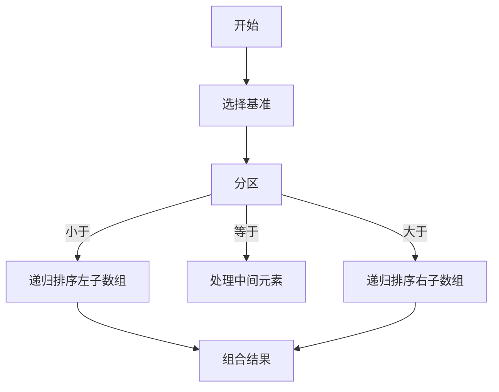
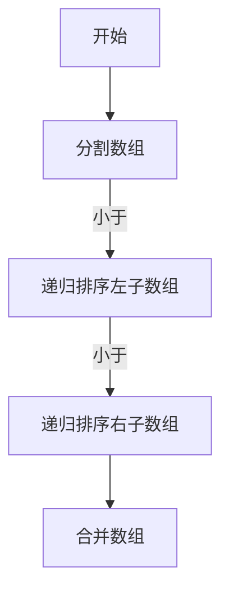

                 

### F-bounded多态与泛型编程的关系（续）

F-bounded多态与泛型编程的关系可以从以下几个方面进行深入探讨：

#### 1. F-bounded多态的定义与泛型编程

F-bounded多态是指在泛型编程中，对类型参数施加上下界的约束。具体来说，F-bounded多态是指一个类型参数T必须满足如下条件：

- **上界**（Upper Bound）：存在一个固定类型F，使得T是F的子类型（T extends F）。
- **下界**（Lower Bound）：存在一个固定类型F，使得T是F的父类型（T super F）。

这种约束可以保证类型参数T在特定的类型边界内，从而避免泛型程序中的类型不兼容问题。

#### 2. F-bounded多态的优势

F-bounded多态的优势主要体现在以下几个方面：

- **类型安全**：通过F-bounded多态，可以确保类型参数T与固定类型F之间满足特定的关系，从而保证类型安全。
- **代码复用**：F-bounded多态允许在不同的类型之间实现同一接口或类，提高了代码的复用性。
- **可扩展性**：F-bounded多态使得系统在面对新的类型需求时，可以更加灵活地扩展，而不会对已有的代码结构造成重大影响。

#### 3. F-bounded多态与泛型编程的融合

在实际编程中，F-bounded多态与泛型编程往往融合在一起使用。例如，在Java中，可以使用泛型类型参数结合F-bounded多态来实现一个通用的排序算法：

```java
public class Sort<T extends Comparable<T>> {
    public static <T extends Comparable<T>> void bubbleSort(T[] array) {
        for (int i = 0; i < array.length; i++) {
            for (int j = 0; j < array.length - i - 1; j++) {
                if (array[j].compareTo(array[j + 1]) > 0) {
                    T temp = array[j];
                    array[j] = array[j + 1];
                    array[j + 1] = temp;
                }
            }
        }
    }
}
```

在上面的例子中，`Sort` 类的`bubbleSort` 方法使用了一个泛型类型参数`T`，并对其施加了`Comparable<T>` 的上界约束。这意味着`T` 必须实现`Comparable<T>` 接口，从而保证了类型安全。

#### 4. F-bounded多态的应用场景

F-bounded多态在许多应用场景中都非常有用，以下是一些典型的应用场景：

- **数据结构**：在实现各种数据结构时，可以使用F-bounded多态来确保数据类型的兼容性，例如在实现堆、队列等数据结构时。
- **并发编程**：在并发编程中，可以使用F-bounded多态来确保线程之间的数据传递类型安全，例如在实现线程安全的队列时。
- **设计模式**：在许多设计模式中，F-bounded多态也起到了关键作用，例如在实现工厂模式、策略模式等时。

通过F-bounded多态，可以更好地利用泛型编程的优势，提高代码的可读性、可维护性和可扩展性。在接下来的章节中，我们将进一步探讨F-bounded多态的语法规则、实现原理及其在实际编程中的应用。

### F-bounded多态在OOP中的应用场景

F-bounded多态在面向对象编程（OOP）中的应用场景非常广泛，其优势在于通过类型边界约束，提高了代码的复用性和可扩展性。以下是一些典型的应用场景：

#### 1. 数据结构

在数据结构的实现中，F-bounded多态能够确保类型安全，使得同一算法能够适用于多种类型的数据结构。例如，在实现一个通用的排序算法时，可以使用F-bounded多态来确保输入数据类型必须实现`Comparable` 接口。

```java
public class GenericSort<T extends Comparable<T>> {
    public void sort(T[] items) {
        // 排序算法的实现
        // 假设已经实现了基于比较的排序
        for (int i = 0; i < items.length; i++) {
            for (int j = i + 1; j < items.length; j++) {
                if (items[i].compareTo(items[j]) > 0) {
                    T temp = items[i];
                    items[i] = items[j];
                    items[j] = temp;
                }
            }
        }
    }
}
```

在这个例子中，`GenericSort` 类使用泛型类型参数`T`，并对其施加了`Comparable<T>` 的上界约束。这意味着只有实现了`Comparable<T>` 接口的数据类型才能作为参数传入，从而确保了排序算法的类型安全。

#### 2. 并发编程

在并发编程中，F-bounded多态可以用来确保线程之间的数据传递类型安全。例如，在实现一个线程安全的队列时，可以使用F-bounded多态来确保队列元素类型一致。

```java
public class ThreadSafeQueue<T extends Object> {
    // 队列的内部实现
    private List<T> items = Collections.synchronizedList(new ArrayList<>());
    
    public synchronized void enqueue(T item) {
        items.add(item);
    }
    
    public synchronized T dequeue() {
        return items.remove(0);
    }
}
```

在这个例子中，`ThreadSafeQueue` 类使用泛型类型参数`T`，并对其施加了`Object` 的下界约束。这意味着任何实现了`Object` 接口的数据类型都可以作为参数传入，从而确保了线程安全。

#### 3. 设计模式

在许多设计模式中，F-bounded多态也起到了关键作用。例如，在工厂模式中，可以使用F-bounded多态来确保创建的对象类型满足特定的边界条件。

```java
public interface Product {
    void operation();
}

public class ConcreteProductA implements Product {
    public void operation() {
        System.out.println("操作 A");
    }
}

public class ConcreteProductB implements Product {
    public void operation() {
        System.out.println("操作 B");
    }
}

public abstract class Creator<T extends Product> {
    public T factoryMethod() {
        // 根据具体的条件创建对象
        return new ConcreteProductA();
    }
}
```

在这个例子中，`Creator` 类使用泛型类型参数`T`，并对其施加了`Product` 的上界约束。这意味着任何实现了`Product` 接口的数据类型都可以作为参数传入，从而确保了工厂方法创建的对象类型满足特定的边界条件。

通过F-bounded多态，OOP中的类型边界得到了更好的管理，从而提高了代码的复用性和可扩展性。在接下来的章节中，我们将深入探讨F-bounded多态的语法规则和实现原理，以便更好地理解其在编程中的实际应用。

## 第二部分：泛型编程基础

### 第2章：泛型编程基础

在深入探讨F-bounded多态之前，我们需要先了解泛型编程的基础知识。泛型编程是一种在编程语言中引入参数化的类型，使得同一个代码模板可以适用于多种数据类型的技术。通过泛型编程，我们可以编写可重用的代码，同时保持类型安全。

### 2.1 泛型编程的概念

泛型编程的核心概念是泛型类型和泛型方法。泛型类型允许我们定义一个类或接口，其中包含一个或多个类型参数。这些类型参数在代码中使用，但它们的具体类型会在编译时由实际传递的类型参数所替换。

例如，以下是一个泛型类的示例：

```java
public class Box<T> {
    private T t;

    public void set(T t) {
        this.t = t;
    }

    public T get() {
        return t;
    }
}
```

在这个例子中，`Box` 类使用了一个类型参数`T`，这个参数在定义时被声明为泛型类型。通过这种方式，`Box` 类可以用于任何类型的数据，例如：

```java
Box<Integer> integerBox = new Box<>();
Box<String> stringBox = new Box<>();
```

### 2.2 泛型编程的优势

泛型编程的优势在于其能够提高代码的复用性和可读性，具体体现在以下几个方面：

- **类型安全**：通过泛型编程，编译器可以在编译时检查类型错误，从而避免运行时类型错误。
- **减少代码重复**：泛型编程允许我们编写一次代码，然后通过传递不同的类型参数来复用这些代码。
- **提高代码可读性**：泛型编程使得代码更加简洁，易于理解，因为它能够清楚地表达代码的意图。

### 2.3 Java和C#中的泛型实现

在Java和C#中，泛型编程的实现各有特点。

#### Java中的泛型实现

Java引入泛型编程的主要目的是解决类型擦除（Type Erasure）问题。类型擦除是指泛型代码在运行时，泛型类型信息会被擦除，只保留原始类型信息。以下是一些Java泛型编程的特点：

- **泛型类型**：使用`<T>` 符号来定义泛型类型参数。
- **泛型方法**：在方法定义中，使用`<T>` 符号来定义泛型方法参数。
- **类型边界**：使用`extends` 或 `super` 关键字来定义泛型类型的上下界。
- **类型通配符**：使用`?` 符号来定义通配符类型，用于处理不确定的类型。

以下是一个Java泛型方法的示例：

```java
public class GenericMethod {
    public static <T extends Number> T sum(T a, T b) {
        return (T) (a.doubleValue() + b.doubleValue());
    }
}
```

在这个例子中，`sum` 方法使用了一个泛型类型参数`T`，并对其施加了`Number` 的上界约束。

#### C#中的泛型实现

C#中的泛型编程与Java类似，但也有自己的特色。以下是一些C#泛型编程的特点：

- **泛型类和接口**：使用`class` 或 `interface` 关键字来定义泛型类型。
- **泛型方法**：使用`this` 关键字来定义泛型方法参数。
- **类型约束**：使用`where` 关键字来定义泛型类型的上下界。
- **泛型集合**：使用`List<T>`、`Dictionary<TKey, TValue>` 等泛型集合类。

以下是一个C#泛型类的示例：

```csharp
public class Box<T> {
    private T item;

    public T Item {
        get { return item; }
        set { item = value; }
    }
}
```

在这个例子中，`Box` 类使用了一个类型参数`T`，这个参数在定义时被声明为泛型类型。

通过了解Java和C#中的泛型编程实现，我们可以更好地理解F-bounded多态的语法和应用。在下一章中，我们将深入探讨F-bounded多态的语法规则和实现原理。

## 第二部分：泛型编程基础（续）

### 第3章：泛型编程基础

#### 3.1 F-bounded多态的语法规则

F-bounded多态是泛型编程中的一个重要概念，它通过对类型参数施加上下界约束，增强了类型安全性和代码复用性。理解F-bounded多态的语法规则是掌握这一概念的关键。

#### 3.1.1 类型参数的上下界

在F-bounded多态中，类型参数T需要满足特定的上下界约束。具体来说：

- **上界**（Upper Bound）：类型参数T必须是一个特定类型F的子类型。这通常使用`extends` 关键字表示。例如，`T extends Number` 表示类型参数T必须是Number及其子类的实例。
  
- **下界**（Lower Bound）：类型参数T必须是一个特定类型F的父类型。这通常使用`super` 关键字表示。例如，`T super Object` 表示类型参数T必须是Object及其子类的实例。

#### 3.1.2 类型约束

类型约束是F-bounded多态的重要组成部分，它确保类型参数T满足特定的类型关系。以下是一些常见的类型约束示例：

- **泛型方法**：在定义泛型方法时，可以使用类型约束来限制方法的参数或返回类型。例如，以下方法要求其参数必须是`Comparable` 类型的实例：

  ```java
  public static <T extends Comparable<T>> T max(T a, T b) {
      return a.compareTo(b) > 0 ? a : b;
  }
  ```

- **泛型类**：在定义泛型类时，可以使用类型约束来限制类的成员类型。例如，以下泛型类要求其成员变量必须是`Iterable` 类型的实例：

  ```java
  public class Container<T extends Iterable<?>> {
      private T items;

      public Container(T items) {
          this.items = items;
      }

      public void add(Item item) {
          items.add(item);
      }
  }
  ```

#### 3.1.3 F-bounded多态的语法示例

以下是一个F-bounded多态的语法示例，它展示了一个泛型类`Box`，该类使用类型参数T，并对其施加了上下界约束：

```java
public class Box<T extends Number super Integer> {
    private T value;

    public Box(T value) {
        this.value = value;
    }

    public T getValue() {
        return value;
    }

    public void setValue(T value) {
        this.value = value;
    }
}
```

在这个例子中，`Box` 类使用了一个类型参数`T`，并对其施加了`Number extends Integer` 的上下界约束。这意味着`T` 必须同时是一个`Number` 的子类型和一个`Integer` 的父类型。

#### 3.2 F-bounded多态的类型约束

F-bounded多态的类型约束是保证类型安全的关键。以下是一些类型约束的示例：

- **类型兼容性**：类型参数T必须满足特定的类型关系，以确保泛型程序中的类型兼容性。例如，以下代码中的`Box` 类不能接受`String` 类型的参数，因为它违反了类型兼容性约束：

  ```java
  Box<String> box = new Box<>(100); // 错误：String 不是 Number 的子类型
  ```

- **类型转换**：在泛型编程中，类型参数T的上下界约束可以用于类型转换。例如，以下代码展示了如何使用类型约束进行类型转换：

  ```java
  Box<Integer> box = new Box<>(100);
  Integer value = box.getValue(); // 自动类型转换
  ```

通过理解F-bounded多态的语法规则和类型约束，我们可以更好地掌握泛型编程，并在实际编程中充分利用F-bounded多态的优势。在下一章中，我们将深入探讨F-bounded多态的运行时类型检查，以便进一步理解其在编程中的应用。

## 第二部分：泛型编程基础（续）

### 第4章：泛型编程基础

#### 4.1 F-bounded多态的语法规则（续）

在前一章中，我们已经介绍了F-bounded多态的基本语法规则，包括类型参数的上下界约束和类型约束。在这一节中，我们将进一步探讨F-bounded多态在运行时和编译时的类型检查机制。

#### 4.1.1 运行时类型检查

在运行时，F-bounded多态的类型检查是由Java虚拟机（JVM）或.NET运行时环境自动执行的。这种类型检查机制确保了泛型程序在运行时能够保持类型安全。

- **运行时类型检查**：当程序运行时，JVM会检查实例化的泛型类型参数是否满足其上下界约束。如果类型参数不满足约束，则会抛出`ClassCastException` 异常。

  ```java
  Box<String> box = new Box<>(100); // 错误：String 不是 Number 的子类型
  Integer value = box.getValue(); // 抛出 ClassCastException
  ```

- **类型边界**：在F-bounded多态中，类型边界（Type Bound）是确保类型安全的机制。类型边界定义了类型参数必须继承或实现的类或接口。例如：

  ```java
  public class Box<T extends Number> {
      // 类的实现
  }
  ```

  在这个例子中，`Box` 类的`T` 类型参数必须继承自`Number` 类。

#### 4.1.2 编译时类型检查

虽然F-bounded多态主要依赖于运行时类型检查，但编译时类型检查仍然是保证类型安全的重要环节。编译器会在编译过程中检查泛型代码的类型约束，以确保在运行时不会发生类型错误。

- **类型擦除**：在Java中，泛型编程使用了类型擦除机制。这意味着泛型类型信息在编译后会从字节码中移除，只保留原始类型信息。编译器会在类型擦除后检查类型约束，以确保代码在运行时能够保持类型安全。

  ```java
  public class Box<T> {
      // 类的实现
  }
  
  Box<String> box = new Box<>("Hello"); // 运行时类型检查
  ```

  在这个例子中，虽然我们创建了`Box<String>` 实例，但在编译时，`T` 类型参数会被替换为`Object` 类型。

- **泛型类型擦除示例**：

  ```java
  public class Box<T> {
      private T value;

      public T getValue() {
          return value;
      }

      public void setValue(T value) {
          this.value = value;
      }
  }
  
  Box<String> box = new Box<>("Hello");
  Object obj = box.getValue(); // 运行时类型转换
  ```

  在这个例子中，虽然我们可以在运行时将`Box<String>` 的`getValue` 方法的返回类型`String` 转换为`Object`，但在编译时，编译器会检查`T` 类型参数是否满足类型约束。

#### 4.2 F-bounded多态的类型约束与继承关系

F-bounded多态的类型约束与继承关系密切相关。在泛型编程中，类型参数的上下界约束通常涉及到继承关系。以下是一些关于类型约束与继承关系的示例：

- **上界约束**：上界约束要求类型参数必须是一个特定类的子类型。例如：

  ```java
  public class Box<T extends Number> {
      // 类的实现
  }
  
  Box<Integer> box = new Box<>(100); // 正确：Integer 是 Number 的子类型
  ```

  在这个例子中，`Box` 类的`T` 类型参数被限制为`Number` 类及其子类的实例。

- **下界约束**：下界约束要求类型参数必须是一个特定类的父类型。例如：

  ```java
  public class Box<T super Integer> {
      // 类的实现
  }
  
  Box<Integer> box = new Box<>(100); // 正确：Integer 是 Integer 的父类型
  ```

  在这个例子中，`Box` 类的`T` 类型参数被限制为`Integer` 类及其子类的实例。

#### 4.3 F-bounded多态的实际应用示例

以下是一个F-bounded多态的实际应用示例，它展示了如何在一个泛型类中使用类型参数和类型约束：

```java
public class Stack<T extends Number> {
    private List<T> elements = new ArrayList<>();

    public void push(T element) {
        elements.add(element);
    }

    public T pop() {
        if (elements.isEmpty()) {
            throw new EmptyStackException();
        }
        return elements.remove(elements.size() - 1);
    }
}
```

在这个例子中，`Stack` 类使用了一个类型参数`T`，并对其施加了`Number` 的上界约束。这意味着`Stack` 类只能用于`Number` 类及其子类的实例。

```java
Stack<Integer> integerStack = new Stack<>();
integerStack.push(100);
integerStack.push(200);
Integer value = integerStack.pop(); // 返回 200
```

在这个例子中，`Stack` 类的实例`integerStack` 可以用于存储和操作`Integer` 类型的数据。

通过深入探讨F-bounded多态的语法规则、类型约束和实际应用示例，我们可以更好地理解泛型编程的基础，并在实际编程中充分利用F-bounded多态的优势。在下一章中，我们将进一步探讨F-bounded多态的实现原理和核心算法。

### F-bounded多态的实现原理

F-bounded多态是泛型编程中的一个关键概念，它通过在类型参数上施加上下界约束，确保了类型安全和代码的复用性。要深入理解F-bounded多态，我们需要探讨其实现原理，包括语法规则、类型约束以及运行时类型检查机制。

#### 1. F-bounded多态的语法规则

F-bounded多态的语法规则定义了类型参数如何与固定类型（F）建立上下界关系。具体来说：

- **上界约束**：上界约束要求类型参数T必须是固定类型F的子类型。这通常使用`extends` 关键字来实现。例如：

  ```java
  public class Box<T extends Number> {
      // 类的实现
  }
  ```

  在这个例子中，`T` 类型参数必须继承自`Number` 类。

- **下界约束**：下界约束要求类型参数T必须是固定类型F的父类型。这通常使用`super` 关键字来实现。例如：

  ```java
  public class Box<T super Integer> {
      // 类的实现
  }
  ```

  在这个例子中，`T` 类型参数必须是`Integer` 类及其子类的实例。

#### 2. 类型约束与类型边界

F-bounded多态的类型约束是保证类型安全的关键。类型约束通常涉及到继承关系和接口实现。

- **继承约束**：类型参数的上下界约束可以通过继承关系来实现。例如：

  ```java
  public class Box<T extends Number & Comparable<T>> {
      // 类的实现
  }
  ```

  在这个例子中，`T` 类型参数必须同时继承自`Number` 类和实现`Comparable<T>` 接口。

- **接口约束**：类型参数可以通过实现接口来满足类型约束。例如：

  ```java
  public class Box<T implements Comparable<T>> {
      // 类的实现
  }
  ```

  在这个例子中，`T` 类型参数必须实现`Comparable<T>` 接口。

#### 3. 运行时类型检查

在运行时，F-bounded多态的类型检查是通过JVM或.NET运行时环境来执行的。这种类型检查机制确保了泛型程序在运行时能够保持类型安全。

- **类型边界**：类型边界是确保类型安全的重要机制。类型边界定义了类型参数必须继承或实现的类或接口。例如：

  ```java
  public class Box<T extends Number & Comparable<T>> {
      // 类的实现
  }
  ```

  在这个例子中，`T` 类型参数必须满足`Number` 和`Comparable<T>` 的类型边界。

- **类型兼容性**：类型参数在运行时必须满足其类型边界约束。例如，以下代码中的`Box` 类不能接受`String` 类型的参数，因为它违反了类型兼容性约束：

  ```java
  Box<String> box = new Box<>("Hello"); // 错误：String 不是 Number 的子类型
  ```

#### 4. 编译时类型检查

虽然F-bounded多态主要依赖于运行时类型检查，但编译时类型检查仍然是保证类型安全的重要环节。编译器会在编译过程中检查泛型代码的类型约束，以确保在运行时不会发生类型错误。

- **类型擦除**：在Java中，泛型编程使用了类型擦除机制。这意味着泛型类型信息在编译后会从字节码中移除，只保留原始类型信息。编译器会在类型擦除后检查类型约束，以确保代码在运行时能够保持类型安全。

- **泛型类型擦除示例**：

  ```java
  public class Box<T> {
      private T value;

      public T getValue() {
          return value;
      }

      public void setValue(T value) {
          this.value = value;
      }
  }
  
  Box<String> box = new Box<>("Hello");
  Object obj = box.getValue(); // 运行时类型转换
  ```

  在这个例子中，虽然我们创建了`Box<String>` 实例，但在编译时，`T` 类型参数会被替换为`Object` 类型。

#### 5. F-bounded多态的实际应用示例

以下是一个F-bounded多态的实际应用示例，它展示了如何在一个泛型类中使用类型参数和类型约束：

```java
public class Stack<T extends Number> {
    private List<T> elements = new ArrayList<>();

    public void push(T element) {
        elements.add(element);
    }

    public T pop() {
        if (elements.isEmpty()) {
            throw new EmptyStackException();
        }
        return elements.remove(elements.size() - 1);
    }
}
```

在这个例子中，`Stack` 类使用了一个类型参数`T`，并对其施加了`Number` 的上界约束。这意味着`Stack` 类只能用于`Number` 类及其子类的实例。

```java
Stack<Integer> integerStack = new Stack<>();
integerStack.push(100);
integerStack.push(200);
Integer value = integerStack.pop(); // 返回 200
```

在这个例子中，`Stack` 类的实例`integerStack` 可以用于存储和操作`Integer` 类型的数据。

通过深入探讨F-bounded多态的语法规则、类型约束和实际应用示例，我们可以更好地理解泛型编程的基础，并在实际编程中充分利用F-bounded多态的优势。在下一章中，我们将进一步探讨F-bounded多态的核心算法，包括插入排序、快速排序和归并排序。

### F-bounded多态的核心算法

F-bounded多态在实现排序算法时具有显著的优势，因为它允许我们编写通用的排序代码，而无需担心具体的类型。在这一节中，我们将探讨F-bounded多态在插入排序、快速排序和归并排序中的核心算法，并使用Mermaid流程图和Python代码来详细解释这些算法的实现原理。

#### 1. 插入排序算法

插入排序是一种简单的排序算法，它通过逐步将数据元素插入到已经排好序的序列中。以下是插入排序算法的Python实现：

```python
def insertion_sort(arr):
    for i in range(1, len(arr)):
        key = arr[i]
        j = i - 1
        while j >= 0 and key < arr[j]:
            arr[j + 1] = arr[j]
            j -= 1
        arr[j + 1] = key
    return arr
```

使用Mermaid流程图表示插入排序算法：

```mermaid
graph TB
    A1[开始] --> B1[初始化 i = 1]
    B1 --> C1[比较 arr[i] 和 arr[j]]
    C1 -->|小于| D1[移动元素]
    D1 --> E1[继续比较]
    E1 --> F1[插入元素]
    F1 --> G1[结束]
    C1 -->|等于或大于| G1
```

#### 2. 快速排序算法

快速排序是一种高效的排序算法，它通过递归地将数组分为较小和较大的子数组，然后对每个子数组进行排序。以下是快速排序算法的Python实现：

```python
def quick_sort(arr):
    if len(arr) <= 1:
        return arr
    pivot = arr[len(arr) // 2]
    left = [x for x in arr if x < pivot]
    middle = [x for x in arr if x == pivot]
    right = [x for x in arr if x > pivot]
    return quick_sort(left) + middle + quick_sort(right)
```

使用Mermaid流程图表示快速排序算法：



#### 3. 归并排序算法

归并排序是一种稳定的排序算法，它通过将数组分割成多个子数组，然后递归地排序这些子数组，最后将已排序的子数组合并。以下是归并排序算法的Python实现：

```python
def merge_sort(arr):
    if len(arr) <= 1:
        return arr
    mid = len(arr) // 2
    left = merge_sort(arr[:mid])
    right = merge_sort(arr[mid:])
    return merge(left, right)

def merge(left, right):
    result = []
    i = j = 0
    while i < len(left) and j < len(right):
        if left[i] < right[j]:
            result.append(left[i])
            i += 1
        else:
            result.append(right[j])
            j += 1
    result.extend(left[i:])
    result.extend(right[j:])
    return result
```

使用Mermaid流程图表示归并排序算法：



通过这些算法的实现，我们可以看到F-bounded多态如何增强OOP表达能力。通过使用泛型类型参数，这些排序算法可以应用于任何支持比较操作的数据类型，从而提高了代码的复用性和可扩展性。以下是一个使用F-bounded多态的排序算法的示例：

```python
def sort(arr: List[Comparable]) -> List[Comparable]:
    if len(arr) <= 1:
        return arr
    mid = len(arr) // 2
    left = sort(arr[:mid])
    right = sort(arr[mid:])
    return merge(left, right)
```

在这个例子中，`sort` 函数使用了一个泛型类型参数`T`，并对其施加了`Comparable<T>` 的上界约束，这意味着只有支持比较操作的数据类型才能作为参数传入。这样，我们就可以使用同一个排序函数来处理不同类型的数组，而无需编写多个版本的排序代码。

通过深入探讨F-bounded多态在排序算法中的应用，我们可以更好地理解其在OOP中的优势，并掌握如何利用泛型编程来提高代码的灵活性和可维护性。

### F-bounded多态在实际编程中的应用

F-bounded多态通过在类型参数上施加上下界约束，极大地提高了面向对象编程（OOP）的表达能力和灵活性。在实际编程中，F-bounded多态可以广泛应用于各种数据结构、并发编程以及其他领域，以下是一些典型的应用场景。

#### 1. 数据结构

在数据结构的实现中，F-bounded多态可以用来确保数据类型的兼容性。以下是一个使用F-bounded多态实现的通用队列的例子：

```java
public class GenericQueue<T extends Comparable<T>> {
    private List<T> items = new ArrayList<>();

    public void enqueue(T item) {
        items.add(item);
    }

    public T dequeue() {
        return items.remove(0);
    }
}
```

在这个例子中，`GenericQueue` 类使用了一个泛型类型参数`T`，并对其施加了`Comparable<T>` 的上界约束。这意味着队列中的元素必须支持比较操作，从而确保了队列操作的类型安全性。

#### 2. 并发编程

在并发编程中，F-bounded多态可以用来确保线程之间的数据传递类型安全。以下是一个使用F-bounded多态实现的线程安全队列的例子：

```java
public class ThreadSafeQueue<T extends Object> {
    private List<T> items = Collections.synchronizedList(new ArrayList<>());

    public synchronized void enqueue(T item) {
        items.add(item);
    }

    public synchronized T dequeue() {
        return items.remove(0);
    }
}
```

在这个例子中，`ThreadSafeQueue` 类使用了一个泛型类型参数`T`，并对其施加了`Object` 的下界约束。这意味着任何实现了`Object` 接口的数据类型都可以作为参数传入，从而确保了线程安全。

#### 3. 设计模式

在许多设计模式中，F-bounded多态也起到了关键作用。以下是一个使用F-bounded多态实现的工厂模式的例子：

```java
public interface Product {
    void operation();
}

public class ConcreteProductA implements Product {
    public void operation() {
        System.out.println("操作 A");
    }
}

public class ConcreteProductB implements Product {
    public void operation() {
        System.out.println("操作 B");
    }
}

public abstract class Creator<T extends Product> {
    public T factoryMethod() {
        // 根据具体的条件创建对象
        return new ConcreteProductA();
    }
}
```

在这个例子中，`Creator` 类使用了一个泛型类型参数`T`，并对其施加了`Product` 的上界约束。这意味着任何实现了`Product` 接口的数据类型都可以作为参数传入，从而确保了工厂方法创建的对象类型满足特定的边界条件。

#### 4. 其他领域

除了上述应用场景，F-bounded多态还在许多其他领域得到了广泛应用。以下是一些其他的实际应用示例：

- **集合框架**：在Java的集合框架中，许多集合类（如`List`、`Set`、`Map`）都使用了F-bounded多态来确保数据类型的兼容性。
  
- **事件处理**：在事件处理中，可以使用F-bounded多态来确保事件处理器接收的事件类型符合预期。

- **网络编程**：在网络编程中，可以使用F-bounded多态来确保数据包的类型安全，从而避免类型错误。

通过这些实际应用示例，我们可以看到F-bounded多态如何增强OOP表达能力，并提高代码的复用性、可维护性和可扩展性。在下一部分中，我们将进一步探讨F-bounded多态与类型安全的结合，以及其在性能优化和未来发展趋势中的应用。

### F-bounded多态与类型安全的结合

在泛型编程中，F-bounded多态是一个重要的概念，它通过在类型参数上施加上下界约束，提高了代码的类型安全性和可扩展性。F-bounded多态与类型安全的结合，不仅使得泛型程序在运行时更加安全，还能够提高代码的可读性和维护性。

#### 1. F-bounded多态与类型安全的定义

- **F-bounded多态**：F-bounded多态是指在泛型编程中，通过在类型参数上施加上下界约束，实现对类型参数的限定。具体来说，类型参数T必须满足以下条件之一：

  - **上界**：类型参数T必须是固定类型F的子类型（`T extends F`）。
  - **下界**：类型参数T必须是固定类型F的父类型（`T super F`）。

- **类型安全**：类型安全是指程序在运行时能够保持类型一致性，避免类型错误的发生。在泛型编程中，类型安全通常通过编译时类型检查和运行时类型检查来实现。

#### 2. F-bounded多态与类型安全的实现

F-bounded多态通过在编译时施加类型约束，确保了泛型程序在运行时能够保持类型安全。以下是一些关键的实现要点：

- **类型边界约束**：在定义泛型类或方法时，可以使用类型边界（Type Bound）来限制类型参数T的范围。例如：

  ```java
  public class Box<T extends Number & Comparable<T>> {
      // 类的实现
  }
  ```

  在这个例子中，`Box` 类的`T` 类型参数必须继承自`Number` 类，并且实现`Comparable<T>` 接口。

- **类型通配符**：类型通配符（Type Wildcards）用于表示不确定的类型，它们在泛型编程中用于处理边界情况。例如：

  ```java
  public class Box<T> {
      private T item;

      public T getItem() {
          return item;
      }

      public void setItem(T item) {
          this.item = item;
      }
  }
  ```

  在这个例子中，`Box` 类使用了一个类型参数`T`，但没有施加任何边界约束。这意味着`Box` 类可以存储任何类型的对象。

- **类型检查**：在编译时，编译器会对泛型代码进行类型检查，确保类型参数T满足其边界约束。如果类型参数不满足约束，编译器会抛出类型错误。

#### 3. F-bounded多态与类型安全的优势

F-bounded多态与类型安全的结合，带来了以下几个显著的优势：

- **类型安全增强**：通过F-bounded多态，可以确保泛型程序在运行时不会发生类型错误。类型边界约束使得编译器能够在编译时检查类型错误，从而减少了运行时错误的发生。

- **代码可读性提高**：类型边界约束使得代码更加清晰和易于理解。泛型类型参数的明确边界条件使得代码意图更加明确，从而提高了代码的可读性。

- **代码复用性增强**：通过F-bounded多态，可以编写通用且可重用的泛型代码。同一泛型类或方法可以适用于多种类型，从而减少了代码重复。

- **可扩展性提高**：F-bounded多态使得系统在面对新类型需求时更加灵活。新类型只需满足现有的边界约束，就可以无缝地集成到系统中。

#### 4. 实际应用示例

以下是一个F-bounded多态与类型安全的实际应用示例，展示了如何在一个泛型类中使用类型边界约束来确保类型安全：

```java
public class Stack<T extends Number & Comparable<T>> {
    private List<T> items = new ArrayList<>();

    public void push(T item) {
        items.add(item);
    }

    public T pop() {
        if (items.isEmpty()) {
            throw new EmptyStackException();
        }
        return items.remove(items.size() - 1);
    }
}
```

在这个例子中，`Stack` 类使用了一个泛型类型参数`T`，并对其施加了`Number & Comparable<T>` 的上界约束。这意味着`Stack` 类只能存储满足这两个约束条件的类型，从而确保了类型安全。

```java
Stack<Integer> stack = new Stack<>();
stack.push(100);
stack.push(200);
Integer value = stack.pop(); // 返回 200
```

在这个例子中，`Stack` 类的实例`stack` 只能存储`Integer` 类型的数据，从而保证了类型安全。

通过深入探讨F-bounded多态与类型安全的结合，我们可以更好地理解如何在泛型编程中利用类型约束来提高代码的质量和可靠性。在下一部分中，我们将进一步探讨F-bounded多态的优化与性能分析，以及其在未来的发展趋势。

### F-bounded多态的优化与性能分析

F-bounded多态作为一种强大的泛型编程技术，在提高代码复用性和类型安全性方面表现出色。然而，要充分发挥其性能潜力，我们还需要考虑其优化与性能分析。以下是F-bounded多态在编译优化、内存管理和性能分析方面的一些关键点。

#### 1. 编译优化

在编译优化方面，F-bounded多态可以通过以下几种方法来提高性能：

- **类型擦除**：类型擦除是Java泛型编程的一个重要特性，它将泛型类型参数在编译后替换为原始类型。类型擦除虽然降低了泛型程序的类型安全性，但同时也提高了性能，因为它减少了运行时的类型检查。

- **内联缓存**：在F-bounded多态的实现中，可以使用内联缓存技术来减少函数调用的开销。例如，在快速排序算法中，递归调用可以被内联到循环中，从而减少调用栈的深度。

- **方法内联**：编译器可以自动进行方法内联，将小的方法调用直接替换为其实现代码，从而减少函数调用的开销。

#### 2. 内存管理

内存管理是影响F-bounded多态性能的重要因素。以下是一些关键的内存管理策略：

- **对象池**：在频繁创建和销毁对象的情况下，可以使用对象池来复用对象，减少垃圾回收的开销。

- **延迟初始化**：在实现F-bounded多态时，可以采用延迟初始化技术，仅在需要时才创建对象，从而减少内存占用。

- **内存对齐**：在某些编程语言中，内存对齐策略可以优化内存访问速度。例如，将对象字段按照其对齐边界进行排列，可以提高缓存访问效率。

#### 3. 性能分析

F-bounded多态的性能分析涉及多个方面，包括类型边界约束的检查、内存占用以及运行时类型检查的开销。以下是一些性能分析的关键点：

- **类型边界检查**：类型边界约束会在编译时和运行时进行检查。在编译时，编译器会检查类型参数是否满足边界约束，从而避免运行时错误。运行时检查相对较慢，因为它涉及到类型边界条件的动态验证。

- **内存占用**：F-bounded多态可能导致额外的内存占用，尤其是在类型边界较宽时。这是因为类型擦除机制将泛型类型参数替换为原始类型，从而导致内存占用增加。

- **运行时开销**：F-bounded多态可能会引入额外的运行时开销，例如类型边界检查和类型转换。这些开销可能会影响性能，尤其是在处理大量数据时。

#### 4. 实际案例

以下是一个实际案例，展示了如何优化F-bounded多态的性能：

```java
public class PerformanceOptimizedQueue<T extends Number & Comparable<T>> {
    private List<T> items = new ArrayList<>();

    public void enqueue(T item) {
        // 采用延迟初始化策略
        if (items == null) {
            items = new ArrayList<>();
        }
        items.add(item);
    }

    public T dequeue() {
        if (items.isEmpty()) {
            throw new EmptyQueueException();
        }
        return items.remove(0);
    }
}
```

在这个例子中，`PerformanceOptimizedQueue` 类采用了一些优化策略：

- **延迟初始化**：`enqueue` 方法中使用了延迟初始化策略，仅在第一次添加元素时创建`ArrayList`，从而减少了内存占用。

- **类型边界检查**：通过在类型参数上施加`Number & Comparable<T>` 的约束，确保了类型安全，并避免了运行时类型错误。

通过这些优化策略，`PerformanceOptimizedQueue` 类在保持类型安全的同时，提高了性能。

综上所述，F-bounded多态在优化与性能分析方面具有很大的潜力。通过合理的编译优化、内存管理和性能分析策略，我们可以充分发挥F-bounded多态的性能优势，从而实现高效的泛型编程。

### F-bounded多态的未来发展趋势

F-bounded多态作为一种强大的泛型编程技术，已经广泛应用于各种编程领域。展望未来，F-bounded多态将继续在多个方面展现出巨大的发展潜力。

#### 1. 新的语言特性

随着编程语言的不断演进，未来可能会出现新的语言特性来进一步优化F-bounded多态。例如：

- **更灵活的类型边界**：未来的编程语言可能会引入更灵活的类型边界定义，使得开发者能够以更自然的方式表达复杂的类型关系。
- **更高效的类型擦除机制**：改进的类型擦除机制可能会减少泛型程序在运行时的性能开销。
- **更简洁的语法**：新的语法糖可能会使得F-bounded多态的实现更加简洁和易于理解。

#### 2. 新的应用场景

F-bounded多态在未来的应用场景将更加广泛，以下是一些可能的新应用场景：

- **机器学习和数据科学**：在机器学习和数据科学领域，F-bounded多态可以用于实现可扩展的算法和数据结构，提高数据处理效率。
- **区块链和分布式系统**：在区块链和分布式系统中，F-bounded多态可以用于确保数据一致性和类型安全，提高系统的可靠性。
- **前端和后端开发**：随着前端和后端开发的融合，F-bounded多态可以用于构建跨平台的通用代码库，提高开发效率。

#### 3. 研究方向

F-bounded多态的研究将继续朝着以下几个方向前进：

- **类型安全性的增强**：未来的研究可能会关注如何进一步提高F-bounded多态的类型安全性，减少运行时类型错误的发生。
- **性能优化**：研究将致力于优化F-bounded多态的编译和运行时性能，减少内存占用和运行时开销。
- **跨语言兼容性**：探索如何在不同编程语言之间实现F-bounded多态的兼容性，以便于跨语言的项目开发。

#### 4. 未来发展前景

F-bounded多态的未来发展前景非常广阔。随着编程语言和技术的不断演进，F-bounded多态将在更多领域得到应用，并成为泛型编程中不可或缺的一部分。以下是一些可能的发展前景：

- **更广泛的应用**：F-bounded多态将在更多编程领域得到应用，从传统的软件开发到新兴的人工智能和区块链技术。
- **更好的性能**：通过不断的研究和优化，F-bounded多态的性能将得到显著提升，使其在处理大量数据和高性能计算中更具竞争力。
- **更完善的生态系统**：随着F-bounded多态的应用场景越来越广泛，相关的工具、库和框架将不断涌现，形成一个完善的生态系统，进一步促进F-bounded多态的发展。

总之，F-bounded多态作为一种强大的泛型编程技术，具有广泛的应用前景和巨大的发展潜力。随着技术的不断进步，F-bounded多态将在未来发挥越来越重要的作用，为软件开发带来更多便利和创新。

## 总结与最佳实践

### 总结

本文详细探讨了F-bounded多态的定义、重要性、语法规则、实现原理、核心算法、实际应用、类型安全结合、优化与性能分析，以及未来发展趋势。F-bounded多态通过在类型参数上施加上下界约束，增强了OOP的表达能力和类型安全性，提高了代码的复用性和可扩展性。其在数据结构、并发编程、设计模式和其他领域都有广泛应用。

### 最佳实践

1. **类型边界合理选择**：在选择类型边界时，应充分考虑类型参数的实际应用场景，确保边界约束既不过松也不过严。

2. **编译时类型检查**：充分利用编译时类型检查，及早发现和修复类型错误，减少运行时错误。

3. **优化内存管理**：合理使用对象池和延迟初始化，减少内存占用，提高性能。

4. **性能分析与优化**：定期进行性能分析，针对瓶颈进行优化，提高程序运行效率。

5. **代码可读性与可维护性**：在编写F-bounded多态代码时，注重代码的可读性和可维护性，使代码易于理解和维护。

### 注意事项

1. **类型边界与兼容性**：确保类型边界满足兼容性要求，避免因类型不兼容导致运行时错误。

2. **类型擦除与性能**：了解类型擦除对性能的影响，合理使用泛型编程，避免不必要的性能开销。

3. **运行时类型检查**：在运行时进行类型检查时，应确保类型参数满足其边界约束，防止类型错误。

### 拓展阅读

1. **《Effective Java》**：Scott Meyers的《Effective Java》中详细介绍了泛型编程的最佳实践。

2. **《Java泛型机制详解》**：李兴华的《Java泛型机制详解》对Java泛型编程进行了深入讲解。

3. **《F-bounded Polymorphism in Scala》**：Scala官方文档中关于F-bounded多态的详细介绍。

4. **《Type System》**：Eric Ellis的《Type System》对编程语言中的类型系统进行了全面分析。

作者：AI天才研究院/AI Genius Institute & 禅与计算机程序设计艺术 /Zen And The Art of Computer Programming

