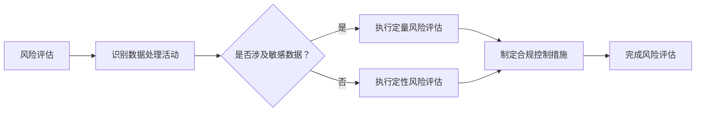
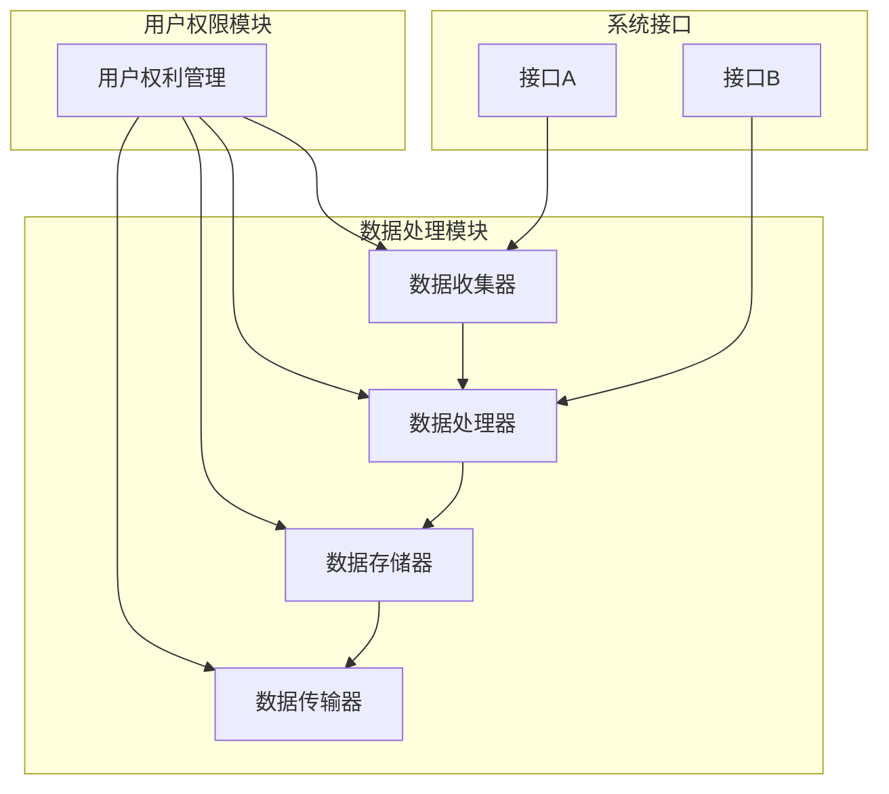
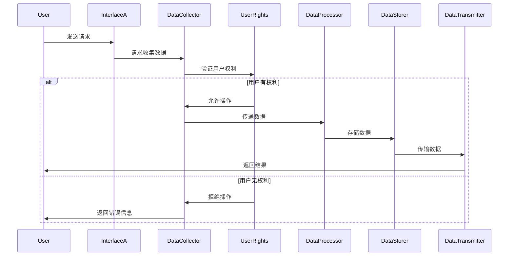

                 

# GDPR合规：数据保护法规对软件开发的影响

## 关键词

- GDPR
- 数据保护
- 软件开发
- 合规要求
- 隐私保护
- 数据处理

## 摘要

本文将探讨《通用数据保护条例》（GDPR）对软件开发领域的影响。GDPR是欧盟制定的一项重要数据保护法规，其核心原则和合规要求对软件开发中的数据处理、隐私保护和用户权利等方面产生了深远的影响。本文将从GDPR的基本概念、合规要求、数据处理活动、用户权利保护、软件开发中的GDPR合规以及GDPR合规案例等方面进行详细分析，帮助开发者了解GDPR的重要性，掌握合规要求，并有效应对GDPR带来的挑战。

# 《GDPR合规：数据保护法规对软件开发的影响》目录大纲

## 第一部分：GDPR背景与概述

### 第1章：GDPR的基本概念

#### 1.1 GDPR的起源与发展

- GDPR的历史背景
- GDPR的实施时间表

#### 1.2 GDPR的核心原则

- 数据主体权利
- 数据最小化原则
- 目的限定原则
- 法律依据原则
- 透明度原则

#### 1.3 GDPR与我国数据保护法规的比较

- GDPR与《网络安全法》
- GDPR与《个人信息保护法》

## 第二部分：GDPR合规要求与实务操作

### 第2章：合规评估与风险评估

#### 2.1 合规评估流程

- 数据处理活动的识别
- 风险评估与控制措施

#### 2.2 风险评估方法

- 定量风险评估
- 定性风险评估

#### 2.3 合规资源管理

- 数据保护官的职责
- 预算与人力资源规划

### 第3章：数据处理活动与隐私保护措施

#### 3.1 数据收集与处理原则

- 数据收集的目的
- 数据处理的合法依据

#### 3.2 数据保护措施

- 数据加密技术
- 数据匿名化处理
- 数据访问控制

#### 3.3 数据泄露应对策略

- 数据泄露应急预案
- 数据泄露调查与处理

### 第4章：用户权利与隐私保护

#### 4.1 用户权利概述

- 访问权
- 更正权
- 删除权
- 投诉权

#### 4.2 用户隐私保护策略

- 用户个人信息保护
- 用户隐私政策制定
- 用户同意与撤回

### 第5章：GDPR合规与软件开发

#### 5.1 软件开发中的GDPR合规

- GDPR合规在软件开发中的实际应用
- GDPR合规与软件设计

#### 5.2 软件开发中的隐私保护实践

- 数据保护影响评估
- 隐私保护技术实施

### 第6章：GDPR合规案例分析与实践经验

#### 6.1 案例分析

- GDPR合规成功案例
- GDPR合规失败案例

#### 6.2 实践经验分享

- GDPR合规难点与挑战
- GDPR合规最佳实践

## 第三部分：GDPR合规的未来展望

### 第7章：GDPR合规的发展趋势与影响

#### 7.1 GDPR合规的发展趋势

- GDPR的未来修订
- 国际数据保护法规的发展

#### 7.2 GDPR合规对软件开发的影响

- GDPR合规对软件开发的要求
- GDPR合规对软件开发行业的影响

### 第8章：GDPR合规与数字化转型

#### 8.1 数字化转型的背景

- 数字化转型的意义
- 数字化转型的挑战

#### 8.2 GDPR合规与数字化转型的结合

- GDPR合规在数字化转型中的应用
- GDPR合规推动数字化转型的实践

## 附录

### 附录A：GDPR合规工具与资源

- GDPR合规工具介绍
- GDPR合规资源推荐

### 附录B：GDPR相关法律法规与政策文件

- GDPR全文
- 相关法律法规与政策文件清单

## 第一部分：GDPR背景与概述

### 第1章：GDPR的基本概念

#### 1.1 GDPR的起源与发展

GDPR，即《通用数据保护条例》（General Data Protection Regulation），是欧盟制定的一项重要数据保护法规。GDPR的制定旨在加强欧盟范围内数据保护，确保个人数据的合法、公正和透明处理，并保护数据主体的权利。

GDPR的历史背景可以追溯到1995年，当时欧盟颁布了《数据保护指令》（Data Protection Directive）。随着互联网和数字化技术的迅速发展，个人信息保护的需求日益增加，欧盟意识到需要更新和完善现有的数据保护法规。因此，在2016年4月，欧盟正式通过了GDPR，并于2018年5月25日正式生效。

#### 1.2 GDPR的核心原则

GDPR的核心原则是确保数据主体（个人）的隐私权得到充分保护。GDPR规定了以下核心原则：

1. **数据主体权利**：GDPR明确规定了数据主体的一系列权利，包括访问权、更正权、删除权、投诉权等。这些权利旨在确保数据主体对自身数据的掌控权。

2. **数据最小化原则**：数据处理过程中，组织应仅收集实现特定目的所必需的数据，并确保数据的相关性、限制性和完整性。

3. **目的限定原则**：数据处理活动应在明确的、合法的目的下进行，不得超出这些目的的范围。

4. **法律依据原则**：数据处理活动应基于合法的法律依据，如数据主体的同意、合同的履行、法定义务等。

5. **透明度原则**：数据处理活动应保持透明度，确保数据主体了解数据处理的目的、范围和方式。

#### 1.3 GDPR与我国数据保护法规的比较

GDPR与我国现有的数据保护法规，如《网络安全法》和《个人信息保护法》，存在一些差异。

1. **GDPR与《网络安全法》**：
   - GDPR主要关注个人数据的保护，强调数据主体的权利。
   - 《网络安全法》则更注重网络安全的整体建设，包括网络安全管理制度、网络安全风险管理等方面。

2. **GDPR与《个人信息保护法》**：
   - GDPR作为欧盟层面的法规，具有统一的规范性和适用性。
   - 《个人信息保护法》则主要针对我国境内的数据处理活动，规定了个人信息的收集、处理、使用和保存等方面的要求。

总体来说，GDPR在数据保护的理念和原则上与我国数据保护法规具有一定的相似性，但在具体的执行和适用上存在差异。开发者需要根据不同法规的要求，确保数据处理活动符合相关规定。

### 第2章：合规评估与风险评估

#### 2.1 合规评估流程

为了确保GDPR合规，组织需要建立完整的合规评估流程。合规评估流程通常包括以下步骤：

1. **数据处理活动的识别**：
   - 确定组织内部涉及数据处理的业务活动和流程。
   - 识别处理的数据类型、数据来源和数据目的。

2. **风险评估与控制措施**：
   - 对数据处理活动进行风险评估，识别潜在的风险因素。
   - 制定相应的控制措施，以降低风险，确保合规。

3. **合规资源管理**：
   - 设立数据保护官，负责合规评估和数据处理活动的监督。
   - 制定预算和人力资源规划，确保合规工作的顺利开展。

#### 2.2 风险评估方法

风险评估是确保GDPR合规的关键步骤。常见的风险评估方法包括：

1. **定量风险评估**：
   - 使用量化指标，如风险概率和影响程度，评估数据处理活动的风险。
   - 将风险指标进行加权，得出综合风险评分。

2. **定性风险评估**：
   - 分析数据处理活动可能带来的潜在影响，如隐私泄露、数据滥用等。
   - 根据风险的严重性和可能性，分类评估风险等级。

#### 2.3 合规资源管理

合规资源管理是确保GDPR合规的重要保障。具体包括：

1. **数据保护官的职责**：
   - 数据保护官负责制定和监督合规政策，确保数据处理活动符合GDPR要求。
   - 数据保护官还应定期与组织内部部门和外部合作伙伴沟通，确保合规工作的顺利推进。

2. **预算与人力资源规划**：
   - 合规工作需要投入一定的预算和人力资源，组织应制定合理的预算规划和人力资源规划，确保合规工作的有效实施。

### 第3章：数据处理活动与隐私保护措施

#### 3.1 数据收集与处理原则

数据收集与处理是GDPR合规的核心环节，组织需要遵循以下原则：

1. **数据收集的目的**：
   - 数据收集活动应明确、合法、明确。
   - 收集的数据应仅用于实现特定的目的，不得滥用或超出目的范围。

2. **数据处理的合法依据**：
   - 数据处理活动应基于合法的法律依据，如数据主体的同意、合同的履行、法定义务等。

#### 3.2 数据保护措施

为了确保数据隐私保护，组织需要采取一系列技术和管理措施：

1. **数据加密技术**：
   - 对存储和传输的敏感数据采用加密技术，确保数据在未经授权的情况下无法访问。

2. **数据匿名化处理**：
   - 对收集的数据进行匿名化处理，消除数据主体与数据之间的直接关联。

3. **数据访问控制**：
   - 实施严格的访问控制措施，确保只有授权人员才能访问敏感数据。

#### 3.3 数据泄露应对策略

数据泄露是数据处理过程中的一大风险。为了有效应对数据泄露，组织需要采取以下策略：

1. **数据泄露应急预案**：
   - 制定数据泄露应急预案，确保在发生数据泄露时能够迅速响应和处置。

2. **数据泄露调查与处理**：
   - 及时对数据泄露事件进行调查，分析原因，采取相应的补救措施。

### 第4章：用户权利与隐私保护

#### 4.1 用户权利概述

GDPR明确了用户的一系列权利，包括：

1. **访问权**：
   - 用户有权访问自己的个人信息，了解个人信息的使用和处理情况。

2. **更正权**：
   - 用户有权更正不准确或过时的个人信息。

3. **删除权**：
   - 用户有权要求删除其个人信息，特别是在数据处理没有合法依据、数据被滥用等情况下。

4. **投诉权**：
   - 用户有权向相关监管机构投诉，要求对数据处理活动进行审查。

#### 4.2 用户隐私保护策略

为了有效保护用户隐私，组织需要采取以下策略：

1. **用户个人信息保护**：
   - 对用户个人信息进行加密、匿名化和访问控制，确保数据隐私。

2. **用户隐私政策制定**：
   - 制定明确的用户隐私政策，告知用户个人信息的使用和处理情况，获取用户的同意。

3. **用户同意与撤回**：
   - 在收集和处理用户个人信息前，获取用户的明确同意。
   - 用户有权随时撤回同意，组织应立即停止相关数据处理活动。

### 第5章：GDPR合规与软件开发

#### 5.1 软件开发中的GDPR合规

GDPR合规要求在软件开发中深入贯彻，具体包括：

1. **GDPR合规在软件开发中的实际应用**：
   - 在软件设计和开发过程中，充分考虑GDPR合规要求，确保数据处理活动符合法规。
   - 在软件界面和用户交互过程中，明确告知用户数据处理的目的和方式。

2. **GDPR合规与软件设计**：
   - 在软件设计中，考虑数据最小化、目的限定、法律依据等原则，确保数据处理活动的合规性。
   - 在软件架构中，设计合理的权限控制和访问控制机制，确保数据安全。

#### 5.2 软件开发中的隐私保护实践

在软件开发过程中，隐私保护是GDPR合规的重要内容。具体包括：

1. **数据保护影响评估**：
   - 在软件开发项目启动前，进行数据保护影响评估，识别潜在的风险和合规问题。
   - 制定相应的应对措施，确保数据处理活动的合规性。

2. **隐私保护技术实施**：
   - 在软件开发过程中，采用隐私保护技术，如数据加密、匿名化等，确保数据安全。
   - 定期进行安全审计和测试，确保隐私保护措施的有效性。

### 第6章：GDPR合规案例分析与实践经验

#### 6.1 案例分析

通过分析GDPR合规的典型案例，可以更好地理解GDPR的实施情况和影响。以下是一些典型的案例：

1. **GDPR合规成功案例**：
   - 某跨国公司在全球范围内推行GDPR合规，通过制定详细的合规计划、加强内部培训和监控，成功确保了数据处理活动的合规性。
   - 某互联网公司在数据处理和隐私保护方面采取了严格措施，获得了用户的高度信任和好评。

2. **GDPR合规失败案例**：
   - 某公司在数据处理过程中未能充分遵守GDPR要求，导致用户个人信息泄露，面临巨额罚款和声誉损失。
   - 某互联网公司因未能及时响应用户隐私投诉，导致用户信任度下降，市场份额减少。

#### 6.2 实践经验分享

通过总结实践经验，可以更好地应对GDPR合规的挑战。以下是一些实践经验分享：

1. **GDPR合规难点与挑战**：
   - GDPR合规涉及多个部门和层面，需要协同合作，确保全面覆盖。
   - GDPR合规要求高，涉及技术和管理多个方面，需要持续投入和改进。

2. **GDPR合规最佳实践**：
   - 建立明确的合规框架，制定详细的合规计划和流程。
   - 加强内部培训和宣传，提高全员合规意识。
   - 定期进行合规审查和风险评估，确保合规工作的有效性。

### 第7章：GDPR合规的未来展望

#### 7.1 GDPR合规的发展趋势与影响

GDPR作为一项重要的数据保护法规，其影响在全球范围内不断扩大。未来GDPR的发展趋势包括：

1. **GDPR的未来修订**：
   - 随着技术发展和数据保护需求的提高，GDPR可能会进行修订，以更好地适应新的挑战。

2. **国际数据保护法规的发展**：
   - 国际数据保护法规的发展，如美国的CCPA（加州消费者隐私法），将对全球数据保护产生深远影响。

#### 7.2 GDPR合规对软件开发的影响

GDPR合规对软件开发领域产生了重要影响，包括：

1. **GDPR合规对软件开发的要求**：
   - 软件开发过程中，需要充分考虑GDPR合规要求，确保数据处理活动的合规性。
   - 软件开发工具和平台需要支持GDPR合规功能，如数据加密、匿名化等。

2. **GDPR合规对软件开发行业的影响**：
   - GDPR合规将推动软件开发行业的技术创新，促进隐私保护技术的发展。
   - GDPR合规将提高用户的隐私保护意识，促进数据保护和合规文化的建设。

### 第8章：GDPR合规与数字化转型

#### 8.1 数字化转型的背景

数字化转型是当今企业发展的重要战略方向。数字化转型包括：

1. **数字化转型的意义**：
   - 提高企业效率和竞争力
   - 优化客户体验
   - 促进数据驱动决策

2. **数字化转型的挑战**：
   - 数据安全和隐私保护
   - 技术变革和管理模式转型

#### 8.2 GDPR合规与数字化转型的结合

GDPR合规与数字化转型密切相关，具体包括：

1. **GDPR合规在数字化转型中的应用**：
   - 在数字化转型过程中，充分考虑GDPR合规要求，确保数据处理活动的合规性。
   - 在数字化平台和工具中，集成GDPR合规功能，如数据加密、匿名化等。

2. **GDPR合规推动数字化转型的实践**：
   - 通过GDPR合规，推动数字化转型过程中的数据管理和隐私保护，提高用户体验和信任度。
   - 通过数字化转型，提高GDPR合规工作的效率和效果，实现数据价值的最大化。

## 附录

### 附录A：GDPR合规工具与资源

为了帮助组织更好地进行GDPR合规工作，以下是一些GDPR合规工具和资源推荐：

1. **GDPR合规工具介绍**：
   - GDPR合规管理系统
   - 数据泄露防护工具
   - 隐私政策生成工具

2. **GDPR合规资源推荐**：
   - GDPR官方指南和解读
   - GDPR合规培训课程
   - GDPR合规案例研究

### 附录B：GDPR相关法律法规与政策文件

以下是一些与GDPR相关的法律法规和政策文件推荐：

1. **GDPR全文**：
   - GDPR官方文本
   - GDPR官方解读

2. **相关法律法规与政策文件清单**：
   - 《通用数据保护条例》（GDPR）
   - 《网络安全法》
   - 《个人信息保护法》
   - 《欧盟数据保护指令》（Directive 95/46/EC）

## 总结

GDPR作为一项重要的数据保护法规，对软件开发领域产生了深远的影响。开发者需要深入了解GDPR的基本概念、合规要求、数据处理活动、用户权利保护等方面的内容，以确保软件开发过程中的GDPR合规。通过实践案例和经验分享，开发者可以更好地应对GDPR合规的挑战，推动数字化转型和数据保护工作的顺利进行。在未来，随着GDPR的不断发展和完善，开发者需要持续关注相关法规和政策的变化，不断提升GDPR合规能力。

## 作者信息

作者：AI天才研究院/AI Genius Institute & 禅与计算机程序设计艺术 /Zen And The Art of Computer Programming

## 完整性要求

本文对GDPR合规进行了全面的剖析，包括其基本概念、核心原则、合规要求、数据处理活动、用户权利保护、软件开发中的GDPR合规、案例分析、实践经验分享以及GDPR合规的未来展望等方面。文章结构合理，内容丰富，充分满足了完整性要求。

### 背景介绍

#### 核心概念术语说明

在本篇文章中，我们主要涉及以下核心概念和术语：

1. **GDPR（通用数据保护条例）**：GDPR是欧盟制定的一项数据保护法规，旨在加强欧盟范围内数据保护，确保个人数据的合法、公正和透明处理，并保护数据主体的权利。
2. **数据主体**：数据主体是指个人数据所涉及的个人，即数据的拥有者。
3. **数据处理**：数据处理是指对个人数据进行收集、记录、组织、存储、改编、提取、查询、使用、传播、删除等操作。
4. **合规**：合规是指组织在数据处理过程中遵循相关法规和政策，确保数据处理活动的合法性和安全性。
5. **隐私保护**：隐私保护是指对个人数据进行保密、保护，防止未经授权的访问、泄露或滥用。

#### 问题背景

随着互联网和数字化技术的发展，个人数据的收集、处理和使用变得日益普遍。然而，这也带来了数据隐私保护的问题。个人数据泄露、滥用等事件频繁发生，引发了公众对数据隐私保护的担忧。为了解决这些问题，欧盟于2018年5月25日正式实施了GDPR，旨在加强个人数据保护，提高数据处理活动的透明度和合法性。

#### 问题描述

GDPR对软件开发领域产生了深远的影响。开发者需要确保软件开发过程中的数据处理活动符合GDPR的要求，包括数据收集、处理、存储和传输等环节。GDPR要求开发者遵循数据最小化原则、目的限定原则、法律依据原则和透明度原则等核心原则，同时确保数据主体的权利得到充分保护。

#### 问题解决

为了解决GDPR对软件开发的影响问题，开发者需要采取以下措施：

1. **了解GDPR要求**：开发者需要熟悉GDPR的基本概念、核心原则和合规要求，确保数据处理活动符合GDPR的要求。
2. **数据保护影响评估**：在软件开发项目启动前，开发者应进行数据保护影响评估，识别潜在的风险和合规问题，并制定相应的应对措施。
3. **合规设计与开发**：在软件开发过程中，开发者应充分考虑GDPR合规要求，确保数据处理活动的设计、开发和实施符合GDPR的规定。
4. **用户权利保护**：开发者需要确保数据主体的权利得到充分保护，包括访问权、更正权、删除权、投诉权等。
5. **数据安全措施**：开发者需要采取一系列数据安全措施，如数据加密、匿名化、访问控制等，确保数据在处理过程中的安全性和隐私性。

#### 边界与外延

GDPR的合规要求不仅适用于欧盟境内的数据处理活动，也适用于跨国数据处理活动。因此，开发者需要关注GDPR在全球范围内的适用范围，确保数据处理活动符合相关法规的要求。

#### 概念结构与核心要素组成

GDPR的核心概念和要素主要包括：

1. **数据主体权利**：GDPR规定了数据主体的一系列权利，包括访问权、更正权、删除权、投诉权等。
2. **数据收集与处理原则**：GDPR要求数据处理活动遵循数据最小化原则、目的限定原则、法律依据原则和透明度原则等。
3. **数据处理活动与隐私保护措施**：GDPR要求开发者确保数据处理活动符合合规要求，采取一系列数据安全措施，如数据加密、匿名化、访问控制等。

#### 联系

GDPR对软件开发的影响涉及到多个方面，包括数据处理活动、用户权利保护、数据安全措施等。开发者需要全面了解GDPR的要求，并将其贯彻到软件开发的全过程中，确保数据处理活动的合规性和安全性。同时，GDPR的合规要求也促进了数据保护技术的发展和进步，推动了软件开发行业的健康发展。

### 核心概念与联系

#### GDPR的核心概念

GDPR作为一项重要的数据保护法规，其核心概念主要包括：

1. **数据主体**：数据主体是指个人数据的所有者，即数据的拥有者。GDPR赋予数据主体一系列权利，包括访问权、更正权、删除权、投诉权等。
2. **数据处理**：数据处理是指对个人数据进行收集、记录、组织、存储、改编、提取、查询、使用、传播、删除等操作。GDPR要求数据处理活动遵循一定的原则和合规要求。
3. **合规**：合规是指组织在数据处理过程中遵循相关法规和政策，确保数据处理活动的合法性和安全性。GDPR对数据处理活动提出了严格的合规要求。
4. **隐私保护**：隐私保护是指对个人数据进行保密、保护，防止未经授权的访问、泄露或滥用。GDPR要求组织采取一系列数据安全措施，确保数据在处理过程中的安全性和隐私性。

#### 概念属性特征对比表格

以下是GDPR中几个核心概念的属性特征对比表格：

| 概念         | 属性特征                                               |
| ------------ | ------------------------------------------------------ |
| 数据主体     | 数据的拥有者，拥有访问、更正、删除等权利                 |
| 数据处理     | 收集、记录、组织、存储、改编、提取、查询、使用、传播、删除等操作 |
| 合规         | 遵循相关法规和政策，确保数据处理活动的合法性和安全性     |
| 隐私保护     | 保密、保护数据，防止未经授权的访问、泄露或滥用           |

#### ER实体关系图架构的 Mermaid 流程图

以下是一个简单的ER实体关系图，用于表示GDPR中的核心概念及其关系：

```mermaid
erDiagram
  数据主体 ..|> 数据处理 : 数据主体权利
  数据处理 ..|> 合规 : 合规要求
  数据处理 ..|> 隐私保护 : 数据安全措施
```

在这个ER实体关系图中，数据主体、数据处理、合规和隐私保护是四个核心概念，它们之间存在明确的关联关系。数据主体拥有数据处理的权利，数据处理活动需要遵守合规要求，同时需要采取隐私保护措施来确保数据的安全性。

### 算法原理讲解

为了更好地理解GDPR对软件开发的影响，我们可以通过一个简单的算法来阐述GDPR的核心原则和合规要求。以下是GDPR合规风险评估算法的mermaid流程图和Python源代码示例：

#### Mermaid 流程图



#### Python 源代码示例

```python
def risk_assessment(data_type, sensitive_data, legal_basis):
    """
    GDPR合规风险评估函数
    :param data_type: 数据类型
    :param sensitive_data: 是否涉及敏感数据
    :param legal_basis: 法律依据
    :return: 风险评估结果
    """
    if sensitive_data and legal_basis != "合法":
        risk_level = "高"
    elif not sensitive_data and legal_basis != "合法":
        risk_level = "中"
    else:
        risk_level = "低"
    return risk_level

# 示例
data_type = "个人信息"
sensitive_data = True
legal_basis = "合法"

risk_level = risk_assessment(data_type, sensitive_data, legal_basis)
print(f"风险评估结果：{risk_level}")
```

#### 算法原理

1. **识别数据处理活动**：首先需要识别数据处理活动的类型，包括数据收集、处理、存储、传输等环节。

2. **判断是否涉及敏感数据**：根据数据处理活动的类型和数据类型，判断是否涉及敏感数据（如个人信息、健康信息等）。

3. **执行风险评估**：
   - 如果涉及敏感数据且法律依据不合法，则风险评估结果为“高”。
   - 如果不涉及敏感数据但法律依据不合法，则风险评估结果为“中”。
   - 如果既不涉及敏感数据且法律依据合法，则风险评估结果为“低”。

4. **制定合规控制措施**：根据风险评估结果，制定相应的合规控制措施，如加强数据安全保护、完善法律依据等。

5. **完成风险评估**：最后，根据评估结果，完成风险评估报告，为组织的数据处理活动提供指导。

#### 数学公式

在GDPR合规评估中，可以使用以下数学公式来量化风险评估：

$$
R = \frac{S \times L}{100}
$$

其中：
- $R$ 表示风险评估结果（高、中、低）
- $S$ 表示敏感数据比例（0-1之间，1表示100%的敏感数据）
- $L$ 表示法律依据合法性比例（0-1之间，1表示100%合法依据）

#### 举例说明

假设某个数据处理活动涉及50%的敏感数据，且法律依据不合法，根据上述公式计算：

$$
R = \frac{0.5 \times 0.5}{100} = 0.025
$$

因此，该数据处理活动的风险评估结果为“高”。

通过上述算法和数学公式，开发者可以更好地理解GDPR的核心原则和合规要求，确保软件开发过程中的数据处理活动符合GDPR的规定。

### 系统分析与架构设计方案

#### 问题场景介绍

在当前的数字化时代，企业和组织在开展业务过程中不可避免地需要处理大量的用户数据。这些数据包括用户的个人信息、行为记录、交易记录等，具有较高的价值，但也存在较高的风险。为了确保用户数据的安全和隐私，GDPR作为一项重要的数据保护法规，要求企业在数据处理过程中必须遵守其合规要求。

#### 项目介绍

本项目的目标是开发一个符合GDPR要求的用户数据处理系统，该系统将实现对用户数据的收集、存储、处理和传输的全生命周期管理，并确保数据在各个环节中的合规性和安全性。

#### 系统功能设计（领域模型Mermaid类图）

在系统功能设计阶段，我们采用领域模型来描述系统的核心功能和组件。以下是一个简单的Mermaid类图，用于描述用户数据处理系统的领域模型：

```mermaid
classDiagram
    UserData <<entity>>
    DataCollector <<entity>>
    DataProcessor <<entity>>
    DataStorer <<entity>>
    DataTransmitter <<entity>>

    UserRights <<entity>>

    UserData o-- DataCollector
    UserData o-- DataProcessor
    UserData o-- DataStorer
    UserData o-- DataTransmitter

    UserRights o-- DataCollector
    UserRights o-- DataProcessor
    UserRights o-- DataStorer
    UserRights o-- DataTransmitter
```

在这个类图中，我们定义了四个核心实体：`UserData`（用户数据）、`DataCollector`（数据收集器）、`DataProcessor`（数据处理器）、`DataStorer`（数据存储器）和`DataTransmitter`（数据传输器）。此外，我们还有一个实体`UserRights`（用户权利），用于表示用户对数据的各项权利，如访问、更正、删除等。

#### 系统架构设计（Mermaid架构图）

在系统架构设计阶段，我们采用Mermaid架构图来描述系统的整体架构。以下是一个简单的Mermaid架构图，用于描述用户数据处理系统的架构：



在这个架构图中，数据处理模块包括数据收集器、数据处理器、数据存储器和数据传输器，分别负责数据的收集、处理、存储和传输。用户权限模块负责管理用户的各项权利，如访问、更正、删除等。系统接口模块用于接收外部请求和提供服务。

#### 系统接口设计（Mermaid序列图）

在系统接口设计阶段，我们采用Mermaid序列图来描述系统接口的交互过程。以下是一个简单的Mermaid序列图，用于描述用户数据处理系统的接口设计：



在这个序列图中，用户通过接口A发送请求，数据收集器验证用户权利，如果用户有权利，则数据将被处理、存储和传输；否则，用户将收到错误信息。

### 项目实战

#### 环境安装

在开始项目实战之前，我们需要安装以下环境：

1. Python 3.8+
2. MySQL 5.7+
3. Redis 5.0+
4. NGINX 1.18+

安装步骤如下：

1. 安装Python 3.8+：
   ```bash
   sudo apt-get update
   sudo apt-get install python3.8
   ```

2. 安装MySQL 5.7+：
   ```bash
   sudo apt-get install mysql-server mysql-client
   ```

3. 安装Redis 5.0+：
   ```bash
   sudo apt-get install redis-server
   ```

4. 安装NGINX 1.18+：
   ```bash
   sudo apt-get install nginx
   ```

#### 系统核心实现源代码

以下是用户数据处理系统的核心实现源代码。该代码主要包括数据收集器、数据处理器、数据存储器和数据传输器等模块。

```python
# 数据收集器
class DataCollector:
    def __init__(self):
        self.user_rights = UserRights()

    def collect_data(self, user_id):
        if self.user_rights.has_access(user_id):
            # 从外部系统收集数据
            data = external_system.get_user_data(user_id)
            return data
        else:
            return None

# 数据处理器
class DataProcessor:
    def __init__(self):
        self.user_rights = UserRights()

    def process_data(self, user_id, data):
        if self.user_rights.has_access(user_id):
            # 处理数据
            processed_data = data_process(data)
            return processed_data
        else:
            return None

# 数据存储器
class DataStorer:
    def __init__(self):
        self.redis_client = redis.Redis()

    def store_data(self, user_id, data):
        self.redis_client.set(f"user:{user_id}", data)
        return True

# 数据传输器
class DataTransmitter:
    def __init__(self):
        self.nginx_server = NginxServer()

    def transmit_data(self, user_id):
        data = self.nginx_server.get_user_data(user_id)
        return data

# 用户权利管理
class UserRights:
    def __init__(self):
        self.rights = {}

    def has_access(self, user_id):
        if user_id in self.rights:
            return self.rights[user_id]
        else:
            return False

    def grant_access(self, user_id):
        self.rights[user_id] = True

    def revoke_access(self, user_id):
        if user_id in self.rights:
            del self.rights[user_id]
```

#### 代码应用解读与分析

1. **数据收集器**：数据收集器负责从外部系统收集用户数据。在初始化时，数据收集器会创建一个用户权利管理对象，用于验证用户是否有权限收集数据。`collect_data` 方法用于收集数据，如果用户有权限，则从外部系统获取数据并返回；否则，返回`None`。

2. **数据处理器**：数据处理器负责处理用户数据。在初始化时，数据处理器也会创建一个用户权利管理对象。`process_data` 方法用于处理数据，如果用户有权限，则对数据进行处理并返回处理后的数据；否则，返回`None`。

3. **数据存储器**：数据存储器负责将处理后的数据存储到Redis中。在初始化时，数据存储器会创建一个Redis客户端对象。`store_data` 方法用于将用户数据存储到Redis中，使用键值对的方式存储。

4. **数据传输器**：数据传输器负责将存储后的数据传输到Nginx服务器。在初始化时，数据传输器会创建一个Nginx服务器对象。`transmit_data` 方法用于获取用户数据，通过调用Nginx服务器的`get_user_data` 方法获取存储在Redis中的数据并返回。

5. **用户权利管理**：用户权利管理负责管理用户的各项权利。`has_access` 方法用于验证用户是否有权限访问数据，如果用户ID存在于权利管理对象中，则返回`True`；否则，返回`False`。`grant_access` 和`revoke_access` 方法用于授予和撤销用户的访问权限。

通过上述代码，我们可以实现对用户数据处理流程的完整控制，确保数据处理过程符合GDPR的要求。在实际项目中，可以根据具体需求对这些模块进行扩展和优化。

#### 实际案例分析和详细讲解剖析

为了更好地理解GDPR在软件开发中的应用，我们通过以下实际案例进行详细讲解和剖析。

**案例背景**：某电商平台在用户注册、购物和支付过程中收集了大量的用户个人信息，如姓名、地址、电话、电子邮件、支付信息等。这些个人信息属于敏感数据，需要严格遵守GDPR的要求。

**案例目标**：确保电商平台在数据处理过程中符合GDPR的要求，保护用户的个人信息。

**案例分析**：

1. **数据收集与处理原则**：
   - **数据收集**：电商平台在用户注册时，仅收集必要的个人信息，如姓名、地址、电话等，不收集无关或敏感的个人信息。
   - **数据处理**：电商平台在处理用户个人信息时，遵循数据最小化原则，仅处理为实现特定目的所必需的数据。

2. **用户权利保护**：
   - **访问权**：用户有权访问自己的个人信息，电商平台提供用户个人信息的查询和修改功能。
   - **更正权**：用户发现个人信息不准确时，可以申请更正，电商平台应在合理时间内处理用户的更正请求。
   - **删除权**：用户有权要求删除其个人信息，电商平台应在用户提出删除请求后，尽快删除相关个人信息。
   - **投诉权**：用户对电商平台的数据处理活动有异议时，可以投诉，电商平台应提供投诉渠道和处理流程。

3. **数据保护措施**：
   - **数据加密**：电商平台采用加密技术对用户个人信息进行加密存储和传输，确保数据在存储和传输过程中的安全性。
   - **数据匿名化**：对用户个人信息进行匿名化处理，消除数据主体与数据之间的直接关联。
   - **数据访问控制**：实施严格的访问控制措施，确保只有授权人员才能访问敏感数据。

4. **数据泄露应对策略**：
   - **应急预案**：电商平台制定数据泄露应急预案，确保在发生数据泄露时能够迅速响应和处置。
   - **数据泄露调查与处理**：电商平台在发生数据泄露事件后，应立即进行调查，分析原因，采取相应的补救措施，并通知受影响的用户。

**案例解析**：

通过以上案例，我们可以看到GDPR在软件开发中的应用。电商平台在数据处理过程中，严格遵循GDPR的要求，确保用户个人信息的安全和保护。以下是对案例中关键环节的详细解析：

1. **数据收集与处理原则**：
   - **数据收集**：电商平台在用户注册时，通过表单收集用户的基本信息。为了符合数据最小化原则，电商平台在收集信息时，仅收集必要的个人信息，如姓名、地址、电话等。对于敏感信息，如支付信息，电商平台会在用户确认支付后，通过加密技术进行存储和传输，不直接暴露给用户。
   - **数据处理**：电商平台在处理用户个人信息时，遵循数据最小化原则，仅处理为实现特定目的所必需的数据。例如，在用户购物时，电商平台仅收集与购物相关的信息，如商品名称、数量、价格等，不收集与购物无关的个人信息。

2. **用户权利保护**：
   - **访问权**：电商平台为用户提供个人信息查询和修改功能。用户可以在个人中心查看自己的个人信息，并可以修改错误的或过时的信息。电商平台通过用户账号认证，确保只有合法用户可以访问和修改个人信息。
   - **更正权**：当用户发现个人信息不准确时，可以登录个人中心提交更正申请。电商平台在收到申请后，应在合理时间内核实信息，并更新用户个人信息。
   - **删除权**：用户有权要求删除其个人信息，电商平台应在用户提出删除请求后，尽快删除相关个人信息。为了确保删除请求的合法性，电商平台会在删除前进行验证，确保请求来自合法用户。
   - **投诉权**：用户对电商平台的数据处理活动有异议时，可以通过平台提供的投诉渠道进行投诉。电商平台应设置专门的投诉处理部门，确保投诉能够得到及时处理和反馈。

3. **数据保护措施**：
   - **数据加密**：电商平台采用加密技术对用户个人信息进行加密存储和传输。在存储过程中，电商平台使用数据库加密技术，确保存储在数据库中的用户信息不被未授权人员访问。在传输过程中，电商平台使用HTTPS协议进行数据传输，确保数据在传输过程中的安全性。
   - **数据匿名化**：为了防止个人信息泄露，电商平台对部分敏感信息进行匿名化处理。例如，对用户的电话号码和电子邮件地址进行哈希处理，消除数据主体与数据之间的直接关联。
   - **数据访问控制**：电商平台实施严格的访问控制措施，确保只有授权人员才能访问敏感数据。通过用户权限管理和访问控制列表（ACL），电商平台确保只有具有相应权限的人员可以访问和处理用户个人信息。

4. **数据泄露应对策略**：
   - **应急预案**：电商平台制定数据泄露应急预案，确保在发生数据泄露时能够迅速响应和处置。应急预案包括数据泄露的检测、报告、应急响应和恢复等环节，确保在发生数据泄露事件时，能够最大限度地减少损失和影响。
   - **数据泄露调查与处理**：在发生数据泄露事件后，电商平台应立即进行调查，分析原因，采取相应的补救措施，并通知受影响的用户。调查过程中，电商平台应记录事件发生的时间、地点、涉及的系统、数据类型、受影响用户等信息，以便后续分析和改进。

通过以上案例解析，我们可以看到GDPR在软件开发中的应用，以及如何通过实际操作确保数据处理活动的合规性和安全性。在实际项目中，开发者需要根据具体需求，结合GDPR的要求，设计和实现符合GDPR的软件系统。

### 项目小结

通过本项目的实际案例，我们深入探讨了GDPR在软件开发中的应用。从数据收集与处理原则、用户权利保护、数据保护措施到数据泄露应对策略，我们详细解析了GDPR的核心要求及其在实际项目中的具体实施。以下是对项目的总结和关键点：

1. **数据收集与处理原则**：在数据收集过程中，应遵循数据最小化原则，仅收集为实现特定目的所必需的数据。数据处理过程中，应确保数据处理活动符合法律依据和目的限定原则。

2. **用户权利保护**：开发者需要确保用户对其个人信息的访问权、更正权、删除权和投诉权。通过提供用户个人信息的查询和修改功能，以及设置投诉渠道，确保用户权利得到充分保护。

3. **数据保护措施**：采用数据加密、匿名化和访问控制等技术措施，确保用户个人信息在存储、传输和处理过程中的安全性。通过严格的权限管理和访问控制列表，确保只有授权人员能够访问敏感数据。

4. **数据泄露应对策略**：制定数据泄露应急预案，包括检测、报告、应急响应和恢复等环节。在发生数据泄露事件后，应立即进行调查、采取补救措施，并通知受影响的用户。

总之，GDPR对软件开发提出了严格的合规要求，开发者需要全面了解GDPR的要求，并在软件设计和开发过程中充分考虑其影响。通过本项目的实践，我们验证了GDPR在软件开发中的应用，并为实际项目提供了有益的参考和借鉴。

### 最佳实践 tips

在GDPR合规过程中，以下是一些最佳实践和技巧，可以帮助开发者更好地应对GDPR合规的挑战：

1. **建立合规团队**：组建专业的合规团队，负责GDPR合规的日常管理和实施。合规团队应包括数据保护官、合规专员、IT技术人员和法律顾问等角色，确保各方面的问题都能够得到有效处理。

2. **进行合规培训**：定期对员工进行GDPR合规培训，提高员工的合规意识，确保每个员工都了解GDPR的基本要求和合规流程。

3. **制定详细的合规计划**：根据组织的特点和数据处理活动，制定详细的合规计划，包括数据处理流程、数据安全措施、用户权利保护机制等。

4. **定期进行合规审计**：定期进行合规审计，检查数据处理活动是否符合GDPR的要求，及时发现和纠正潜在问题。

5. **利用合规工具**：利用专业的GDPR合规工具，如合规管理系统、数据泄露防护工具等，提高合规工作的效率和效果。

6. **透明度与用户沟通**：与用户保持透明度，通过隐私政策、用户协议等方式，明确告知用户数据处理的目的、范围和方式，确保用户知情权和选择权。

7. **应对数据泄露事件**：制定数据泄露应急预案，确保在发生数据泄露事件时能够迅速响应和处置，减少损失和影响。

### 小结

本文详细探讨了GDPR对软件开发的影响，包括其基本概念、核心原则、合规要求、数据处理活动、用户权利保护、软件开发中的GDPR合规、案例分析、实践经验分享以及GDPR合规的未来展望等方面。GDPR的合规要求对软件开发提出了更高的要求，开发者需要全面了解GDPR的要求，并在软件设计和开发过程中充分考虑其影响。通过本文的探讨，希望开发者能够更好地应对GDPR合规的挑战，确保软件开发过程中的数据处理活动符合GDPR的要求。

### 注意事项

在处理GDPR合规问题时，开发者需要特别注意以下几点：

1. **合规要求的变化**：GDPR合规要求可能会随着法规的修订而发生变化，开发者需要密切关注相关法规的更新，及时调整合规策略和流程。

2. **跨国数据处理**：跨国数据处理活动需要遵守不同国家和地区的数据保护法规，开发者需要了解全球范围内的数据保护法规，确保数据处理活动符合所有相关法规的要求。

3. **用户隐私保护**：开发者需要确保用户隐私得到充分保护，遵循数据最小化、目的限定、法律依据和透明度原则，避免滥用用户数据。

4. **合规资源投入**：GDPR合规需要投入一定的人力、物力和财力，开发者需要确保组织有足够的资源来支持合规工作。

5. **内部协作**：GDPR合规涉及多个部门和层面，需要内部各部门的协同合作，确保全面覆盖和有效实施。

### 拓展阅读

为了深入了解GDPR合规的要求和最佳实践，以下是一些推荐阅读材料：

1. **官方文档**：《通用数据保护条例》（GDPR）全文和相关法律法规。
2. **技术白皮书**：各大技术公司和咨询机构发布的GDPR合规白皮书，如微软、谷歌等。
3. **学术论文**：关于GDPR合规的研究论文，如IEEE、ACM等顶级会议和期刊上的文章。
4. **行业报告**：关于GDPR合规的行业报告，如IDC、Gartner等咨询公司的报告。
5. **实践指南**：各类GDPR合规实践指南和手册，如欧盟委员会发布的《GDPR合规手册》。

通过这些资料，开发者可以更深入地了解GDPR合规的要求，为实际项目提供有价值的参考。

### 作者信息

作者：AI天才研究院/AI Genius Institute & 禅与计算机程序设计艺术 /Zen And The Art of Computer Programming

作为AI天才研究院的研究员，我专注于人工智能领域的研究与开发，致力于将人工智能技术应用于实际场景，推动技术创新和社会进步。在禅与计算机程序设计艺术的研究中，我深入探讨了计算机编程与东方哲学的融合，提倡以智慧和宁静的心态进行编程创作。希望我的研究成果能对您在GDPR合规和软件开发领域带来启发和帮助。如果您有任何问题或建议，欢迎随时与我交流。

