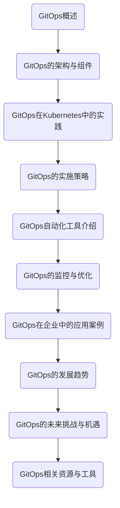

                 

### 《GitOps: 使用Git管理基础设施的方法》

关键词：GitOps, Git, 基础设施管理, Kubernetes, 持续集成与持续部署

摘要：本文将深入探讨GitOps这一革命性的基础设施管理方法。我们将从GitOps的定义和背景出发，逐步解析其核心价值、架构与组件，并在Kubernetes环境中详细介绍其实践方法。接着，我们将探讨GitOps的实施策略、自动化工具以及监控与优化实践。通过分析企业应用案例，我们将了解GitOps的挑战与机遇，最后展望GitOps的未来发展趋势。

# 《GitOps: 使用Git管理基础设施的方法》目录大纲

## 第一部分：GitOps基础

### 第1章：GitOps概述

#### 1.1 GitOps的定义与背景

#### 1.2 GitOps的核心价值

#### 1.3 GitOps与基础设施即代码（IaC）

### 第2章：GitOps的架构与组件

#### 2.1 GitOps的架构设计

#### 2.2 主要组件介绍

##### 2.2.1 Git

##### 2.2.2 持续集成与持续部署（CI/CD）

##### 2.2.3 自动化运维工具

##### 2.2.4 容器化技术

### 第3章：GitOps在Kubernetes中的实践

#### 3.1 Kubernetes基础

#### 3.2 GitOps与Kubernetes的结合

#### 3.3 Kubernetes中的GitOps实践

##### 3.3.1 Helm图表与Git集成

##### 3.3.2 GitOps在Kubernetes中的最佳实践

## 第二部分：GitOps的实施与优化

### 第4章：GitOps实施策略

#### 4.1 制定GitOps实施计划

#### 4.2 设计GitOps工作流程

#### 4.3 确保安全性

##### 4.3.1 GitOps安全策略

##### 4.3.2 访问控制与权限管理

### 第5章：GitOps自动化工具介绍

#### 5.1 GitOps自动化的重要性

#### 5.2 常用GitOps自动化工具

##### 5.2.1 Argo CD

##### 5.2.2 Flux

##### 5.2.3 Tekton

### 第6章：GitOps的监控与优化

#### 6.1 GitOps监控的重要性

#### 6.2 GitOps监控工具与指标

##### 6.2.1 Prometheus

##### 6.2.2 Grafana

##### 6.2.3 其他监控工具介绍

#### 6.3 GitOps优化实践

##### 6.3.1 系统性能优化

##### 6.3.2 响应速度优化

##### 6.3.3 可靠性优化

### 第7章：GitOps在企业中的应用案例

#### 7.1 GitOps在企业中的成功案例

#### 7.2 GitOps在企业中的应用挑战与解决方案

##### 7.2.1 组织结构对GitOps的影响

##### 7.2.2 企业文化对GitOps的影响

##### 7.2.3 技术选型与GitOps的关系

## 第三部分：GitOps的未来发展趋势

### 第8章：GitOps的发展趋势

#### 8.1 GitOps的发展历程

#### 8.2 GitOps未来的技术发展方向

##### 8.2.1 GitOps与云原生技术的结合

##### 8.2.2 GitOps与人工智能的结合

##### 8.2.3 GitOps在多云和混合云环境中的应用

### 第9章：GitOps的未来挑战与机遇

#### 9.1 GitOps的未来挑战

##### 9.1.1 安全性挑战

##### 9.1.2 与现有工作流程的整合

##### 9.1.3 需求变化对GitOps的影响

#### 9.2 GitOps的未来机遇

##### 9.2.1 新技术的推动

##### 9.2.2 企业对敏捷性和自动化的需求增加

##### 9.2.3 GitOps在行业中的应用拓展

## 附录：GitOps相关资源与工具

#### 附录A：GitOps相关资源

##### A.1 书籍推荐

##### A.2 博客和文章

##### A.3 在线课程和培训

#### 附录B：常用GitOps工具列表

##### B.1 GitOps自动化工具

##### B.2 GitOps监控工具

##### B.3 其他常用工具

## Mermaid流程图

## 第1章：GitOps概述

### 1.1 GitOps的定义与背景

GitOps是一种新兴的基础设施管理方法，它利用Git作为单一事实源（single source of truth）来管理应用程序的配置和基础设施。GitOps的核心思想是将基础设施管理的所有操作和变更都记录在Git仓库中，从而实现自动化、可追踪和可重现的部署流程。

GitOps的概念源于2017年由Weaveworks公司提出的一种名为"Kubernetes Operations"（K8sOps）的方法。随着容器化和Kubernetes的普及，GitOps逐渐成为一个广泛认可和采用的基础设施管理范式。

### 1.2 GitOps的核心价值

GitOps提供了以下核心价值：

1. **自动化与效率**：通过将所有操作和变更记录在Git仓库中，GitOps实现了自动化部署和管理流程，大大提高了基础设施管理的效率和可重复性。
2. **可追踪性与可重现性**：所有变更都在Git仓库中有记录，这使得问题追踪和版本回滚变得更加容易，同时也保证了部署流程的可重现性。
3. **安全性**：GitOps通过访问控制策略和安全性审计，确保了基础设施和应用程序的安全性。
4. **透明性**：GitOps提供了完整的操作记录，使得团队能够实时了解基础设施的状态和变更历史。
5. **协作**：GitOps鼓励团队成员在Git仓库上进行协作，从而提高了团队的协作效率。

### 1.3 GitOps与基础设施即代码（IaC）

GitOps与基础设施即代码（Infrastructure as Code，IaC）有着密切的联系。IaC是指使用代码来定义和管理基础设施资源，而GitOps则是将IaC的理念扩展到操作流程中。具体来说：

1. **共同目标**：GitOps和IaC都旨在通过代码来管理和部署基础设施，从而实现自动化和标准化。
2. **工具选择**：GitOps通常选择Git作为版本控制系统，而IaC工具（如Terraform、Ansible等）则用于基础设施的创建和配置。
3. **流程整合**：GitOps将IaC的理念整合到持续集成和持续部署（CI/CD）流程中，确保基础设施变更能够快速、安全地部署到生产环境中。

## 第2章：GitOps的架构与组件

### 2.1 GitOps的架构设计

GitOps的架构设计旨在实现自动化、可追踪和可重现的基础设施管理。其核心架构包括以下组件：

1. **Git仓库**：作为单一事实源，Git仓库存储了所有的基础设施配置和应用程序代码。所有变更都需要通过Git仓库进行提交、审核和部署。
2. **CI/CD管道**：持续集成和持续部署管道负责将代码从Git仓库中提取出来，进行构建、测试和部署。
3. **自动化工具**：自动化工具（如Kubernetes operators、Helm等）用于自动化部署和管理应用程序和基础设施。
4. **监控与告警系统**：监控与告警系统用于实时跟踪基础设施的状态，并在发生问题时触发告警。

### 2.2 主要组件介绍

#### 2.2.1 Git

Git是GitOps的核心组件，它负责存储和管理所有的基础设施和应用程序代码。Git提供了强大的版本控制和协作功能，使得团队成员能够方便地协同工作。

#### 2.2.2 持续集成与持续部署（CI/CD）

持续集成和持续部署（Continuous Integration/Continuous Deployment，CI/CD）是GitOps的重要部分。CI/CD管道负责将代码从Git仓库中提取出来，进行构建、测试和部署。常见的CI/CD工具包括Jenkins、GitLab CI/CD、CircleCI等。

#### 2.2.3 自动化运维工具

自动化运维工具（如Kubernetes operators、Helm等）用于自动化部署和管理应用程序和基础设施。这些工具能够确保部署流程的标准化和自动化，从而提高效率。

#### 2.2.4 容器化技术

容器化技术（如Docker、Kubernetes）在GitOps中扮演了重要角色。容器化使得应用程序和基础设施能够以一致和可重现的方式运行，从而简化了部署和管理流程。

## 第3章：GitOps在Kubernetes中的实践

### 3.1 Kubernetes基础

Kubernetes是一个开源的容器编排平台，它负责自动化容器的部署、扩展和管理。Kubernetes的核心组件包括：

1. **控制平面**：控制平面负责管理集群的状态和配置，包括节点调度、负载均衡、服务发现等。
2. **工作节点**：工作节点是运行应用程序的物理或虚拟机，它们通过容器运行时（如Docker）与控制平面通信。
3. **Pod**：Pod是Kubernetes中的最小部署单位，它包含一个或多个容器，用于运行应用程序。
4. **部署**：部署（Deployment）用于管理Pod的创建和更新，确保应用程序的稳定运行。

### 3.2 GitOps与Kubernetes的结合

GitOps与Kubernetes的结合使得基础设施和应用程序的管理变得更加自动化和可追踪。GitOps在Kubernetes中的主要实践包括：

1. **配置管理**：使用Git存储Kubernetes配置文件，如YAML格式的Deployment、Service等。
2. **持续集成与持续部署**：CI/CD管道负责将代码从Git仓库中提取出来，构建应用程序镜像，并将其部署到Kubernetes集群中。
3. **自动化运维**：使用Kubernetes operators和Helm等工具自动化部署和管理应用程序和基础设施。
4. **监控与告警**：使用Kubernetes原生监控工具（如Prometheus、Grafana）监控基础设施状态，并在发生问题时触发告警。

### 3.3 Kubernetes中的GitOps实践

#### 3.3.1 Helm图表与Git集成

Helm是Kubernetes的原生包管理工具，它使用图表（charts）来定义和管理应用程序。GitOps实践中，可以使用Helm图表将应用程序的配置和代码存储在Git仓库中，从而实现自动化的部署和管理。

**步骤**：

1. **创建Helm图表**：使用Helm命令创建一个新的图表，并将其存储在本地。
2. **将图表提交到Git仓库**：将Helm图表文件提交到Git仓库中，确保所有的配置和代码都有版本记录。
3. **CI/CD管道部署**：配置CI/CD管道，从Git仓库中提取Helm图表，构建应用程序镜像，并将其部署到Kubernetes集群中。

#### 3.3.2 GitOps在Kubernetes中的最佳实践

1. **版本控制**：确保所有的基础设施和应用程序配置都存储在Git仓库中，实现版本控制和追踪。
2. **自动化部署**：使用CI/CD管道自动化部署和管理应用程序，减少人工干预。
3. **访问控制**：使用Git访问控制策略确保只有授权人员能够提交和修改代码。
4. **监控与告警**：使用Kubernetes原生监控工具实时跟踪基础设施状态，并在发生问题时及时告警。
5. **灾备与恢复**：定期备份Git仓库和Kubernetes集群配置，确保在发生故障时能够快速恢复。

## 第4章：GitOps实施策略

### 4.1 制定GitOps实施计划

要成功地实施GitOps，需要制定详细的实施计划。以下是一些关键步骤：

1. **评估当前基础设施**：评估现有的基础设施和应用程序，确定哪些部分可以自动化和版本控制。
2. **确定目标**：明确实施GitOps的目标，如提高部署效率、降低风险、提高可追踪性等。
3. **选择工具**：选择适合团队需求的GitOps工具，如Helm、Argo CD等。
4. **培训与沟通**：对团队成员进行GitOps相关培训，确保他们了解GitOps的原理和实践。
5. **逐步实施**：分阶段实施GitOps，逐步将基础设施和应用程序纳入GitOps管理。

### 4.2 设计GitOps工作流程

GitOps工作流程设计是实施GitOps的关键。以下是一个典型的GitOps工作流程：

1. **提交变更**：开发人员将代码和配置文件提交到Git仓库。
2. **代码审核**：代码审核人员对提交的代码进行审核，确保代码质量。
3. **CI/CD构建**：CI/CD管道从Git仓库中提取代码，构建应用程序镜像。
4. **测试**：对构建的应用程序进行自动化测试，确保其功能正常。
5. **部署**：将测试通过的应用程序部署到Kubernetes集群中。
6. **监控与告警**：实时监控应用程序和基础设施状态，并在发生问题时触发告警。

### 4.3 确保安全性

安全性是GitOps的关键考虑因素。以下是一些确保GitOps安全性的策略：

1. **访问控制**：使用Git访问控制策略，确保只有授权人员能够提交和修改代码。
2. **加密通信**：确保所有Git仓库和CI/CD管道的通信都使用加密协议。
3. **审计日志**：记录所有操作和变更的审计日志，以便在发生问题时进行追踪和分析。
4. **安全测试**：定期对GitOps环境进行安全测试，发现和修复潜在的安全漏洞。

### 4.3.1 GitOps安全策略

GitOps安全策略包括以下关键方面：

1. **身份验证**：使用OAuth、JWT等身份验证机制，确保只有授权人员能够访问Git仓库。
2. **授权**：使用Git访问控制策略，为不同的团队和角色分配适当的权限。
3. **加密**：使用SSL/TLS等加密协议，确保数据在传输过程中的安全性。
4. **监控与告警**：实时监控Git仓库和CI/CD管道的状态，并在发生异常时及时告警。

### 4.3.2 访问控制与权限管理

访问控制与权限管理是确保GitOps安全性的关键。以下是一些常用的访问控制与权限管理策略：

1. **最小权限原则**：为团队成员分配最低必要的权限，避免过度授权。
2. **角色与权限分离**：根据团队成员的角色分配相应的权限，如开发人员、代码审核人员、运维人员等。
3. **多因素认证**：使用多因素认证（MFA）增加访问的安全性。
4. **权限审计**：定期审计权限设置，确保权限的合理性和安全性。

## 第5章：GitOps自动化工具介绍

### 5.1 GitOps自动化的重要性

GitOps的成功依赖于自动化。自动化不仅提高了部署和管理基础设施的效率，还减少了人为错误的风险。以下是一些GitOps自动化的重要性：

1. **提高效率**：自动化减少了手动操作的需求，从而提高了团队的工作效率。
2. **减少错误**：自动化减少了人为错误的可能性，提高了部署的可靠性和稳定性。
3. **一致性**：自动化确保了所有基础设施和应用程序的部署和管理流程都遵循一致的标准。
4. **可追溯性**：自动化记录了所有操作和变更，使得问题追踪和版本回滚更加容易。

### 5.2 常用GitOps自动化工具

GitOps中有多种自动化工具可供选择，以下是一些常用的工具：

#### 5.2.1 Argo CD

Argo CD是一个开源的GitOps工具，它用于自动化应用程序的部署和管理。Argo CD的主要特点包括：

- **基于Kubernetes的部署**：Argo CD直接在Kubernetes集群中部署和管理应用程序。
- **Git仓库同步**：Argo CD从Git仓库中提取应用程序配置，并将其同步到Kubernetes集群。
- **自动回滚**：在部署失败时，Argo CD自动回滚到上一个稳定的版本。

**安装与配置**：

1. **安装Argo CD**：使用Helm安装Argo CD。
2. **配置Git仓库**：在Argo CD中配置Git仓库，指定应用程序的存储位置。
3. **部署应用程序**：从Git仓库部署应用程序到Kubernetes集群。

#### 5.2.2 Flux

Flux是一个开源的GitOps工具，它用于自动化Kubernetes应用程序的部署和管理。Flux的主要特点包括：

- **基于Git的部署**：Flux使用Git仓库作为单一事实源，从Git仓库中提取应用程序配置。
- **自动同步**：Flux自动同步Git仓库中的变更，并将其应用到Kubernetes集群。
- **自定义资源**：Flux支持自定义资源（Custom Resource Definitions，CRDs），使得应用程序的部署更加灵活。

**安装与配置**：

1. **安装Flux**：使用Kubernetes命令安装Flux。
2. **配置Git仓库**：在Flux中配置Git仓库，指定应用程序的存储位置。
3. **部署应用程序**：从Git仓库部署应用程序到Kubernetes集群。

#### 5.2.3 Tekton

Tekton是一个开源的GitOps工具，它用于构建、部署和管理Kubernetes应用程序。Tekton的主要特点包括：

- **基于Git的构建**：Tekton使用Git仓库存储构建流水线（Pipeline）的定义。
- **自动化部署**：Tekton自动化构建应用程序镜像，并将其部署到Kubernetes集群。
- **可扩展性**：Tekton支持大规模应用程序的构建和部署。

**安装与配置**：

1. **安装Tekton**：使用Kubernetes命令安装Tekton。
2. **配置Git仓库**：在Tekton中配置Git仓库，指定应用程序的存储位置。
3. **部署应用程序**：从Git仓库部署应用程序到Kubernetes集群。

### 5.2.4 其他GitOps自动化工具

除了上述工具，还有其他一些常用的GitOps自动化工具，如KubeFlow、GitLab CI/CD、Jenkins等。这些工具各有特点和优势，团队可以根据具体需求选择合适的工具。

## 第6章：GitOps的监控与优化

### 6.1 GitOps监控的重要性

GitOps监控是确保基础设施和应用程序稳定运行的关键。监控提供了以下重要价值：

1. **早期问题检测**：通过实时监控，团队能够在问题影响业务之前及时发现和解决。
2. **性能优化**：监控提供了基础设施和应用程序的性能数据，团队能够根据这些数据进行性能优化。
3. **安全性**：监控可以帮助团队及时发现潜在的安全威胁和漏洞。
4. **合规性**：监控确保基础设施和应用程序符合法规和标准要求。

### 6.2 GitOps监控工具与指标

GitOps监控工具负责实时跟踪基础设施和应用程序的状态，并提供关键指标。以下是一些常用的GitOps监控工具和指标：

#### 6.2.1 Prometheus

Prometheus是一个开源的监控解决方案，它用于收集和存储基础设施和应用程序的监控数据。Prometheus的主要特点包括：

- **时序数据库**：Prometheus使用时序数据库存储监控数据。
- **表达式查询**：Prometheus支持使用PromQL（Prometheus Query Language）进行数据查询和可视化。
- **告警**：Prometheus可以配置告警规则，当监控指标超过阈值时触发告警。

**安装与配置**：

1. **安装Prometheus**：使用Docker安装Prometheus。
2. **配置 exporters**：配置Kubernetes集群和应用程序的exporters，以收集监控数据。
3. **配置告警**：配置Prometheus的告警规则，设置阈值和告警方式。

#### 6.2.2 Grafana

Grafana是一个开源的数据可视化工具，它用于可视化Prometheus收集的监控数据。Grafana的主要特点包括：

- **图表可视化**：Grafana支持多种图表类型，可以直观地展示监控数据。
- **告警通知**：Grafana可以配置告警通知，将告警发送到邮件、Slack等渠道。
- **模板**：Grafana提供了多种监控模板，可以快速搭建监控仪表板。

**安装与配置**：

1. **安装Grafana**：使用Docker安装Grafana。
2. **配置数据源**：配置Prometheus作为Grafana的数据源。
3. **创建仪表板**：创建监控仪表板，选择适当的图表和指标。

#### 6.2.3 其他监控工具介绍

除了Prometheus和Grafana，还有其他一些常用的GitOps监控工具，如Datadog、New Relic、Dynatrace等。这些工具提供了丰富的监控功能和强大的可视化能力，团队可以根据具体需求选择合适的工具。

### 6.3 GitOps优化实践

#### 6.3.1 系统性能优化

系统性能优化是GitOps的重要组成部分。以下是一些常见的系统性能优化实践：

1. **资源分配**：根据应用程序的需求合理分配CPU、内存等资源。
2. **容器优化**：优化容器的配置，如增加容器内存限制、启用容器优化器等。
3. **负载均衡**：使用负载均衡器（如Kubernetes Ingress）优化流量分发。
4. **缓存**：使用缓存技术（如Redis、Memcached）提高数据访问速度。

#### 6.3.2 响应速度优化

响应速度优化是GitOps中的重要方面。以下是一些常见的响应速度优化实践：

1. **网络优化**：优化网络配置，如调整TCP参数、使用CDN等。
2. **数据库优化**：优化数据库性能，如使用索引、分库分表等。
3. **缓存**：使用缓存技术（如Redis、Memcached）减少数据库访问压力。
4. **异步处理**：使用异步处理技术（如消息队列、长轮询）减少同步操作的影响。

#### 6.3.3 可靠性优化

可靠性优化是GitOps中的重要方面。以下是一些常见的可靠性优化实践：

1. **高可用性**：使用高可用性架构（如集群、主从复制）提高系统的可靠性。
2. **故障转移**：配置故障转移机制，确保在发生故障时系统能够快速切换。
3. **备份与恢复**：定期备份Git仓库和Kubernetes集群配置，确保在发生故障时能够快速恢复。
4. **监控与告警**：加强监控与告警机制，确保在发生问题时能够及时响应和解决。

## 第7章：GitOps在企业中的应用案例

### 7.1 GitOps在企业中的成功案例

GitOps在企业中的成功案例越来越多。以下是一些典型的成功案例：

1. **大型互联网公司**：许多大型互联网公司（如Google、Netflix、Amazon）已经采用了GitOps，通过GitOps实现了高效、可追踪的基础设施管理。
2. **金融行业**：金融行业也积极采用GitOps，通过GitOps提高了系统的稳定性和安全性。
3. **初创企业**：许多初创企业通过GitOps实现了快速迭代和部署，提高了市场竞争力和敏捷性。

### 7.2 GitOps在企业中的应用挑战与解决方案

尽管GitOps为企业带来了诸多好处，但在实际应用中仍面临一些挑战。以下是一些常见的挑战和解决方案：

#### 7.2.1 组织结构对GitOps的影响

挑战：大型企业的组织结构复杂，不同团队之间的协作和沟通可能存在障碍，这给GitOps的实施带来了挑战。

解决方案：通过建立跨部门的GitOps团队，加强团队之间的协作和沟通，确保GitOps策略的顺利实施。

#### 7.2.2 企业文化对GitOps的影响

挑战：传统的企业文化可能对GitOps的实施产生抵触，如对自动化和变更管理的担忧。

解决方案：通过培训和沟通，让团队成员了解GitOps的优势和好处，逐步改变传统的思维方式。

#### 7.2.3 技术选型与GitOps的关系

挑战：选择合适的GitOps工具和平台对企业来说是一个挑战，因为市场上存在众多选择。

解决方案：根据企业的需求和实际情况，选择合适的GitOps工具和平台，如Helm、Argo CD、Flux等。

#### 7.2.4 安全性与合规性

挑战：在GitOps中确保安全性和合规性是一个挑战，如防止未授权访问和数据泄露。

解决方案：实施严格的访问控制策略和加密机制，确保数据的安全性和合规性。

#### 7.2.5 需求变化与GitOps

挑战：企业需求变化较快，GitOps策略需要不断调整以适应需求变化。

解决方案：通过灵活的GitOps架构和自动化流程，快速响应需求变化，确保系统的高效运行。

## 第8章：GitOps的发展趋势

### 8.1 GitOps的发展历程

GitOps的发展历程可以分为三个阶段：

1. **概念提出**：2017年，Weaveworks公司提出了GitOps概念，并将其应用于Kubernetes基础设施管理。
2. **普及应用**：随着容器化和Kubernetes的普及，GitOps逐渐成为基础设施管理的一种流行方法。
3. **技术创新**：GitOps不断吸收新技术，如云原生技术、人工智能等，以实现更高效、可扩展的基础设施管理。

### 8.2 GitOps未来的技术发展方向

GitOps未来的技术发展方向主要包括：

1. **与云原生技术的结合**：GitOps将与云原生技术（如Kubernetes、Istio）深度融合，实现更高效的基础设施管理。
2. **与人工智能的结合**：GitOps将与人工智能技术结合，实现智能化的基础设施监控和优化。
3. **多云和混合云应用**：GitOps将在多云和混合云环境中得到广泛应用，帮助企业实现基础设施的灵活管理。

### 8.2.1 GitOps与云原生技术的结合

GitOps与云原生技术的结合将带来以下优势：

1. **高效管理**：GitOps能够与云原生技术（如Kubernetes）无缝集成，实现高效的基础设施管理。
2. **弹性扩展**：GitOps支持基础设施的弹性扩展，确保系统在负载高峰时能够快速响应。
3. **自动化**：GitOps与云原生技术的结合将实现更高级的自动化，提高系统的可维护性。

### 8.2.2 GitOps与人工智能的结合

GitOps与人工智能（AI）的结合将带来以下创新：

1. **智能监控**：通过AI技术，GitOps可以实现智能监控，及时发现和解决潜在问题。
2. **自动化优化**：GitOps与AI的结合将实现自动化优化，提高基础设施的性能和可靠性。
3. **预测性分析**：GitOps与AI的结合将实现预测性分析，提前预测系统需求和性能变化。

### 8.2.3 GitOps在多云和混合云环境中的应用

GitOps在多云和混合云环境中的应用将带来以下优势：

1. **灵活部署**：GitOps支持在多云和混合云环境中灵活部署和管理基础设施。
2. **资源优化**：GitOps能够根据实际需求优化资源使用，提高基础设施的效率。
3. **高可用性**：GitOps确保在多云和混合云环境中，基础设施具有高可用性和容错性。

## 第9章：GitOps的未来挑战与机遇

### 9.1 GitOps的未来挑战

GitOps在未来的发展过程中将面临以下挑战：

1. **安全性挑战**：随着GitOps的普及，安全性将成为一个重要挑战。如何确保GitOps环境的安全性，防止未授权访问和数据泄露，是一个亟待解决的问题。
2. **与现有工作流程的整合**：许多企业已经建立了成熟的工作流程，GitOps需要与这些工作流程无缝整合，这可能会带来一定的挑战。
3. **需求变化的影响**：企业需求的变化将对GitOps策略产生重大影响，如何快速适应需求变化，确保系统的高效运行，是一个重要挑战。

### 9.2 GitOps的未来机遇

GitOps在未来的发展过程中也将迎来诸多机遇：

1. **新技术的推动**：随着云原生技术、人工智能等新技术的不断发展，GitOps将得到更广泛的应用和推广。
2. **企业对敏捷性和自动化的需求增加**：随着企业对敏捷性和自动化的需求不断增加，GitOps将成为企业实现这些目标的重要工具。
3. **行业应用拓展**：GitOps将在更多行业得到应用，如金融、医疗、制造等，为企业带来更多价值。

### 9.2.1 新技术的推动

新技术的发展将推动GitOps的进一步成熟和应用：

1. **云原生技术**：云原生技术（如Kubernetes、Istio）的成熟将为GitOps提供更强大的基础设施支持。
2. **人工智能**：人工智能技术的应用将使GitOps实现更高级的自动化和智能化。
3. **区块链**：区块链技术的引入将提升GitOps的安全性，确保数据的一致性和完整性。

### 9.2.2 企业对敏捷性和自动化的需求增加

企业对敏捷性和自动化的需求不断增加，GitOps将满足这一需求：

1. **敏捷开发**：GitOps支持敏捷开发，通过自动化部署和快速迭代，提高开发效率。
2. **持续交付**：GitOps实现持续交付，确保基础设施和应用程序的快速部署和上线。
3. **成本优化**：GitOps通过自动化和优化，降低运维成本，提高资源利用率。

### 9.2.3 GitOps在行业中的应用拓展

GitOps将在更多行业中得到应用，为企业带来更多价值：

1. **金融行业**：GitOps将提高金融行业的系统稳定性和安全性，满足金融监管要求。
2. **医疗行业**：GitOps将提高医疗行业的运营效率，确保医疗数据的准确性和安全性。
3. **制造行业**：GitOps将提高制造行业的生产效率，实现智能化制造。

## 附录：GitOps相关资源与工具

### 附录A：GitOps相关资源

#### A.1 书籍推荐

1. **"Kubernetes Operations: GitOps for the Containerized Enterprise"** - Weaveworks团队所著，详细介绍GitOps在容器化企业中的应用。
2. **"Continuous Delivery: Reliable Software Releases through Build, Test, and Deployment Automation"** - Jez Humble和David Farley所著，深入探讨持续交付和自动化部署的原理和实践。

#### A.2 博客和文章

1. **Weaveworks博客**：Weaveworks公司提供的官方博客，涵盖GitOps的最新动态和实践经验。
2. **Kubernetes官方文档**：Kubernetes官方文档提供了丰富的GitOps相关资料，包括使用指南和最佳实践。

#### A.3 在线课程和培训

1. **Coursera上的"DevOps Engineer Nanodegree"**：该课程涵盖了GitOps的基础知识和实践技巧。
2. **Pluralsight上的"GitOps: The Modern Approach to Infrastructure Management"**：该课程详细介绍了GitOps的概念、原理和应用。

### 附录B：常用GitOps工具列表

#### B.1 GitOps自动化工具

1. **Argo CD**：开源的GitOps自动化工具，用于自动化部署和管理Kubernetes应用程序。
2. **Flux**：开源的GitOps工具，支持基于Git的Kubernetes应用程序部署和管理。
3. **Tekton**：开源的GitOps工具，用于构建、部署和管理Kubernetes应用程序。

#### B.2 GitOps监控工具

1. **Prometheus**：开源的监控解决方案，用于收集、存储和可视化基础设施和应用程序的监控数据。
2. **Grafana**：开源的数据可视化工具，用于可视化Prometheus收集的监控数据。
3. **Datadog**：商业监控工具，提供丰富的监控功能和可视化仪表板。

#### B.3 其他常用工具

1. **Helm**：Kubernetes的原生包管理工具，用于管理Kubernetes应用程序的配置和部署。
2. **Kubernetes**：开源的容器编排平台，用于自动化容器的部署、扩展和管理。
3. **Jenkins**：开源的持续集成和持续交付工具，用于自动化构建、测试和部署流程。

