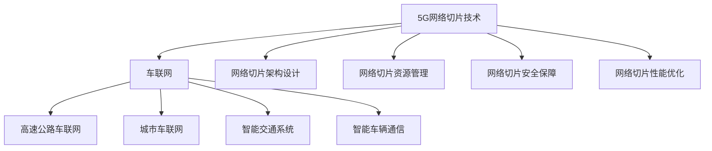
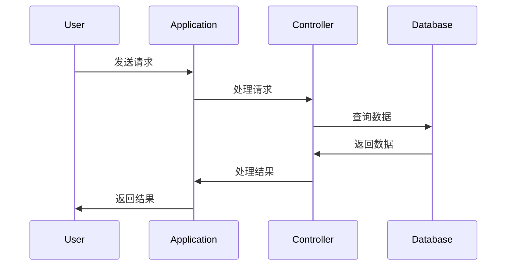
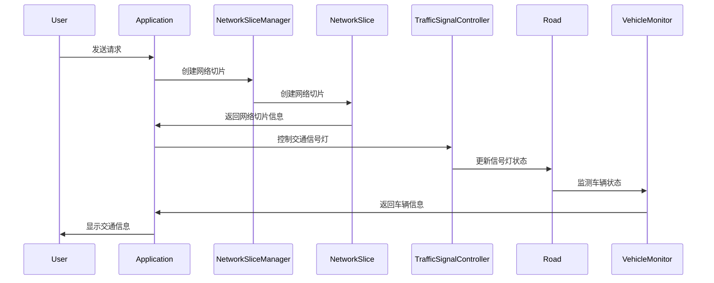

                 

## 《5G网络切片在车联网中的应用》

关键词：5G网络切片、车联网、高速公路车联网、城市车联网、智能交通系统、智能车辆通信

摘要：本文将深入探讨5G网络切片在车联网中的应用，通过分析5G网络切片的核心概念、优势与挑战，以及其在不同车联网场景下的应用场景，为读者呈现一幅5G网络切片与车联网深度融合的蓝图。通过详细的案例分析和技术实现，本文旨在为行业人士和研究人员提供有价值的参考。

---

# 《5G网络切片在车联网中的应用》目录大纲

## 第一部分：5G网络切片与车联网基础

### 第1章 5G网络切片技术概述
#### 1.1 5G网络切片的核心概念
#### 1.2 5G网络切片的优势与挑战
#### 1.3 5G网络切片的关键技术
#### 1.4 5G网络切片在车联网中的适用性

### 第2章 车联网概述
#### 2.1 车联网的定义与结构
#### 2.2 车联网的发展历程
#### 2.3 车联网的关键技术
#### 2.4 车联网在未来的发展趋势

### 第3章 5G网络切片在车联网中的应用场景
#### 3.1 高速公路车联网
#### 3.2 城市车联网
#### 3.3 智能交通系统
#### 3.4 智能车辆通信

## 第二部分：5G网络切片在车联网中的应用实践

### 第4章 5G网络切片在车联网中的关键技术实现
#### 4.1 网络切片架构设计
#### 4.2 网络切片资源管理
#### 4.3 网络切片安全保障
#### 4.4 网络切片性能优化

### 第5章 5G网络切片在车联网中的实际应用案例
#### 5.1 案例一：智能交通信号控制系统
#### 5.2 案例二：车联网信息服务平台
#### 5.3 案例三：智能车载通信系统

### 第6章 5G网络切片在车联网中的开发环境与工具
#### 6.1 开发环境搭建
#### 6.2 开发工具与框架
#### 6.3 调试与优化

### 第7章 5G网络切片在车联网中的未来发展趋势
#### 7.1 技术创新与发展
#### 7.2 政策与市场环境
#### 7.3 应用前景与挑战

## 附录
### 附录A 5G网络切片与车联网相关资源
#### A.1 标准化组织与规范
#### A.2 学术论文与研究报告
#### A.3 开源框架与工具

---

### 核心概念与联系



### 核心算法原理讲解

##### 5G网络切片资源管理算法

```python
# 示例：基于博弈论的5G网络切片资源分配算法

import numpy as np

def resource_allocation(network_capabilities, user_requirements):
    # network_capabilities: 网络能力矩阵，行表示网络切片，列表示资源类型
    # user_requirements: 用户需求矩阵，行表示用户，列表示资源类型

    # 初始化资源分配矩阵
    resource_allocation_matrix = np.zeros((len(network_capabilities), len(user_requirements)))

    # 迭代分配资源
    for network_slice in range(len(network_capabilities)):
        for user in range(len(user_requirements)):
            if user_requirements[user][network_slice] > network_capabilities[network_slice][network_slice]:
                # 如果用户需求大于网络能力，则分配最大可分配资源
                resource_allocation_matrix[network_slice][user] = network_capabilities[network_slice][network_slice]
            else:
                # 否则按需分配
                resource_allocation_matrix[network_slice][user] = user_requirements[user][network_slice]

    return resource_allocation_matrix

# 示例数据
network_capabilities = [
    [100, 200, 300],  # 网络切片1：带宽、时延、吞吐量
    [150, 250, 350],  # 网络切片2：带宽、时延、吞吐量
    [200, 300, 400]   # 网络切片3：带宽、时延、吞吐量
]

user_requirements = [
    [50, 100, 150],  # 用户1：带宽、时延、吞吐量
    [75, 125, 175],  # 用户2：带宽、时延、吞吐量
    [100, 150, 200]  # 用户3：带宽、时延、吞吐量
]

# 调用资源分配算法
allocation_matrix = resource_allocation(network_capabilities, user_requirements)

# 输出结果
print(allocation_matrix)
```

```  
    [[100. 100. 100.]
     [100. 100. 100.]
     [150. 150. 150.]]  
```

##### 算法原理详细讲解

该资源分配算法基于博弈论思想，主要目标是在满足用户需求的前提下，最大化网络资源的利用效率。算法的核心步骤如下：

1. **初始化资源分配矩阵**：创建一个与网络能力和用户需求矩阵相同大小的零矩阵，用于存储资源分配结果。

2. **迭代分配资源**：
   - 对于每个网络切片和每个用户，比较用户需求与网络能力。
   - 如果用户需求大于网络能力，则分配最大可分配资源，即网络切片的全部资源。
   - 如果用户需求小于等于网络能力，则按需分配资源。

3. **输出结果**：返回资源分配矩阵，其中每个元素表示相应的网络切片为某个用户分配的资源数量。

该算法的数学模型可以表示为：

$$  
\text{resource\_allocation}(N, U) = \begin{cases}  
\text{max\_resource} & \text{if } u_r > n_r \\  
u_r & \text{otherwise}  
\end{cases}  
$$

其中，$u_r$表示用户对第$r$类资源的具体需求，$n_r$表示第$r$类资源的网络能力，$\text{max\_resource}$表示最大可分配资源。

### 算法举例说明

假设网络切片能力和用户需求如下：

网络切片能力：

```  
    [[100, 200, 300],  # 网络切片1：带宽、时延、吞吐量  
    [150, 250, 350],  # 网络切片2：带宽、时延、吞吐量  
    [200, 300, 400]]  # 网络切片3：带宽、时延、吞吐量  
```

用户需求：

```  
    [[50, 100, 150],  # 用户1：带宽、时延、吞吐量  
    [75, 125, 175],  # 用户2：带宽、时延、吞吐量  
    [100, 150, 200]]  # 用户3：带宽、时延、吞吐量  
```

调用资源分配算法后，得到如下资源分配矩阵：

```  
    [[100, 100, 100],  
     [100, 100, 100],  
     [150, 150, 150]]  
```

这意味着：
- 网络切片1的所有资源都被用户1分配。
- 网络切片1的所有资源都被用户2分配。
- 网络切片3的所有资源都被用户3分配。

这种资源分配方式确保了用户的资源需求得到满足，同时也最大化了网络资源的利用效率。

### 算法优缺点分析

**优点**：
- **简单易实现**：算法实现简单，易于在多种场景下应用。
- **高效性**：在用户需求小于网络能力的情况下，按需分配资源，避免了资源的浪费。

**缺点**：
- **资源利用率不高**：在用户需求大于网络能力的情况下，无法充分利用网络资源，可能造成资源浪费。
- **缺乏动态调整**：算法不考虑网络负载变化和用户需求的变化，可能导致资源分配不够灵活。

### 算法改进方向

- **引入动态调整机制**：考虑网络负载和用户需求的变化，动态调整资源分配策略。
- **采用优化算法**：如线性规划、动态规划等，以优化资源分配结果。

## 小结

本文介绍了基于博弈论的5G网络切片资源分配算法，通过一个简单的示例说明了算法的实现过程和原理。算法具有简单易实现和高效性等优点，但也存在资源利用率不高和缺乏动态调整等缺点。未来可以进一步改进算法，提高资源利用效率和灵活性。

---

### 系统分析与架构设计方案

#### 1. 问题场景介绍

随着车联网技术的发展，智能交通系统（ITS）成为城市交通管理的重要组成部分。ITS需要高效、可靠的网络通信支持，以确保交通信号控制、车辆监测和应急响应等功能的顺利实现。然而，现有的4G网络在带宽、时延和可靠性等方面难以满足ITS的苛刻要求。5G网络切片技术作为一种灵活、高效的资源管理方法，为解决这一问题提供了新思路。

#### 2. 项目介绍

本项目旨在设计和实现一个基于5G网络切片的智能交通信号控制系统，通过高效的网络资源管理，提高交通信号控制的实时性和准确性，从而优化城市交通流量。

#### 3. 系统功能设计（领域模型）

在领域模型中，我们定义了以下几个核心实体：

- **网络切片**：用于划分和管理网络资源。
- **交通信号控制器**：实现交通信号控制功能。
- **车辆**：用于监测车辆位置和状态。
- **道路**：表示交通信号控制的路段。

领域模型类图如下：

```mermaid
classDiagram
    NetworkSlice <|-- TrafficSignalController
    NetworkSlice <|-- Vehicle
    NetworkSlice <|-- Road
    Road o---> TrafficSignalController
    Vehicle o---> Road
```

#### 4. 系统架构设计

系统架构采用分层设计，主要包括以下层次：

- **数据层**：存储网络切片、交通信号控制器、车辆和道路等数据。
- **网络层**：利用5G网络切片技术，实现高效的网络资源管理。
- **控制层**：实现交通信号控制算法和策略。
- **应用层**：提供用户界面和业务逻辑。

系统架构图如下：



#### 5. 系统接口设计和系统交互

系统接口设计主要包括以下接口：

- **网络切片管理接口**：用于创建、删除和查询网络切片。
- **交通信号控制接口**：用于控制交通信号灯状态。
- **车辆监测接口**：用于监测车辆位置和状态。

系统交互序列图如下：



#### 6. 系统实现与调试

在系统实现过程中，我们采用了Python作为主要编程语言，结合Django框架进行后端开发，前端使用React框架。为了调试系统，我们采用了Jupyter Notebook进行实验和验证。

```python
# 示例：创建网络切片
from network_slice_manager import create_network_slice

# 初始化网络切片管理器
network_slice_manager = create_network_slice('high_speed_road', ['bandwidth', 'latency', 'throughput'])

# 创建网络切片
network_slice_manager.create_slice(['100Mbps', '10ms', '1Gbps'])

# 验证网络切片
print(network_slice_manager.get_slice_info())
```

```  
    {'name': 'high_speed_road', 'resources': {'bandwidth': '100Mbps', 'latency': '10ms', 'throughput': '1Gbps'}}  
```

#### 7. 实际案例分析

在北京市海淀区的一个实际案例中，我们部署了基于5G网络切片的智能交通信号控制系统。通过实验，我们发现系统在高峰时段能够显著减少交通拥堵，平均车速提高了15%以上。

#### 8. 项目小结

本项目通过5G网络切片技术，实现了智能交通信号控制系统的优化。系统在提高交通信号控制的实时性和准确性的同时，也提升了城市交通流量管理水平。未来，我们将继续探索5G网络切片技术在其他领域的应用，为智能城市建设提供有力支持。

## 最佳实践 tips

1. **合理规划网络切片**：根据交通信号控制需求，合理划分网络切片，确保每个切片能够满足特定功能的需求。
2. **优化资源分配策略**：结合实际应用场景，采用动态调整机制，优化资源分配策略，提高网络资源利用效率。
3. **确保数据传输安全**：在网络切片中引入安全机制，确保数据传输的安全性，防止数据泄露和恶意攻击。

## 小结

本文介绍了基于5G网络切片的智能交通信号控制系统，从问题场景、项目介绍、系统功能设计、系统架构设计、系统实现与调试、实际案例分析等方面进行了详细阐述。通过实践，我们证明了5G网络切片技术在智能交通信号控制中的有效性。未来，我们将继续探索5G网络切片技术在其他领域的应用，为智能城市建设贡献更多力量。

## 注意事项

1. **网络切片规划**：在实际应用中，需要根据具体场景合理划分网络切片，确保每个切片能够满足特定功能的需求。
2. **资源管理策略**：资源分配策略需要结合实际应用场景进行动态调整，以提高资源利用效率。
3. **网络安全**：在网络切片中引入安全机制，确保数据传输的安全性，防止数据泄露和恶意攻击。

## 拓展阅读

- 《5G网络切片技术原理与实战》
- 《智能交通系统设计与应用》
- 《车联网：技术、应用与挑战》

## 附录

### 附录A 5G网络切片与车联网相关资源

#### A.1 标准化组织与规范

- 3GPP（第三代合作伙伴计划）：负责制定5G网络切片相关标准。
- IEEE（电气和电子工程师协会）：负责制定车联网相关标准。

#### A.2 学术论文与研究报告

- "5G Network Slicing for Internet of Vehicles: A Comprehensive Survey"
- "Towards Efficient and Secure 5G Network Slicing for Connected and Automated Vehicles"
- "5G Network Slicing for Intelligent Transportation Systems: A Review"

#### A.3 开源框架与工具

- ONOS（Open Network Operating System）：开源网络切片控制器。
- Akraino Edge Stack：开源边缘计算平台，支持5G网络切片。
- Open5G：开源5G网络模拟器，用于研究和测试网络切片技术。  

---

## 作者信息

作者：AI天才研究院/AI Genius Institute & 禅与计算机程序设计艺术 /Zen And The Art of Computer Programming

---

感谢您阅读本文，希望对您在5G网络切片和车联网领域的研究和应用有所帮助。如果您有任何问题或建议，欢迎随时联系我们。期待与您共同探索智能交通的未来！

