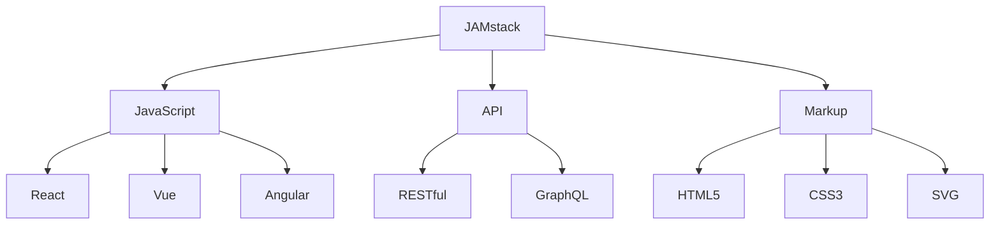
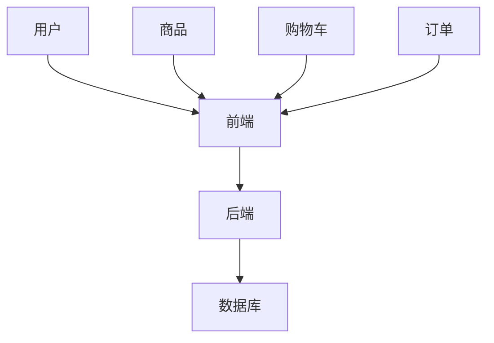
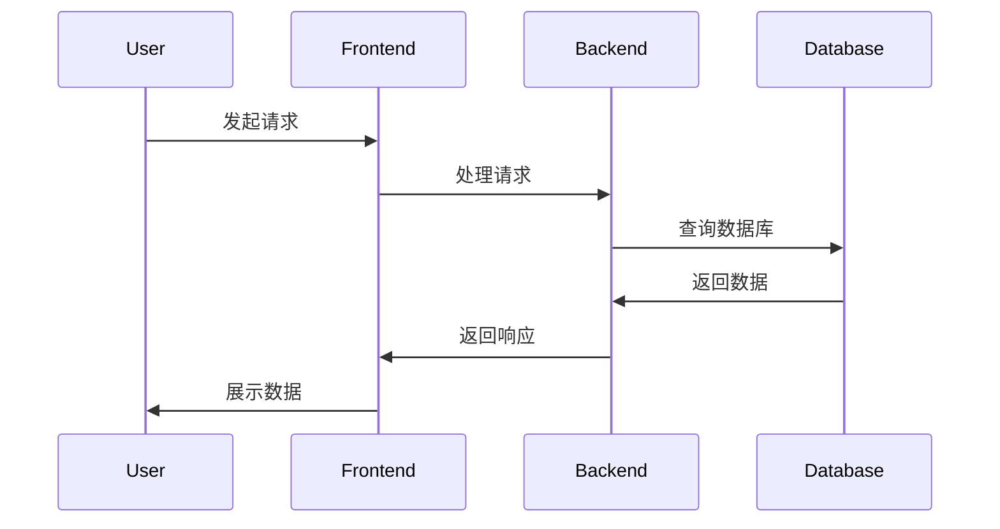
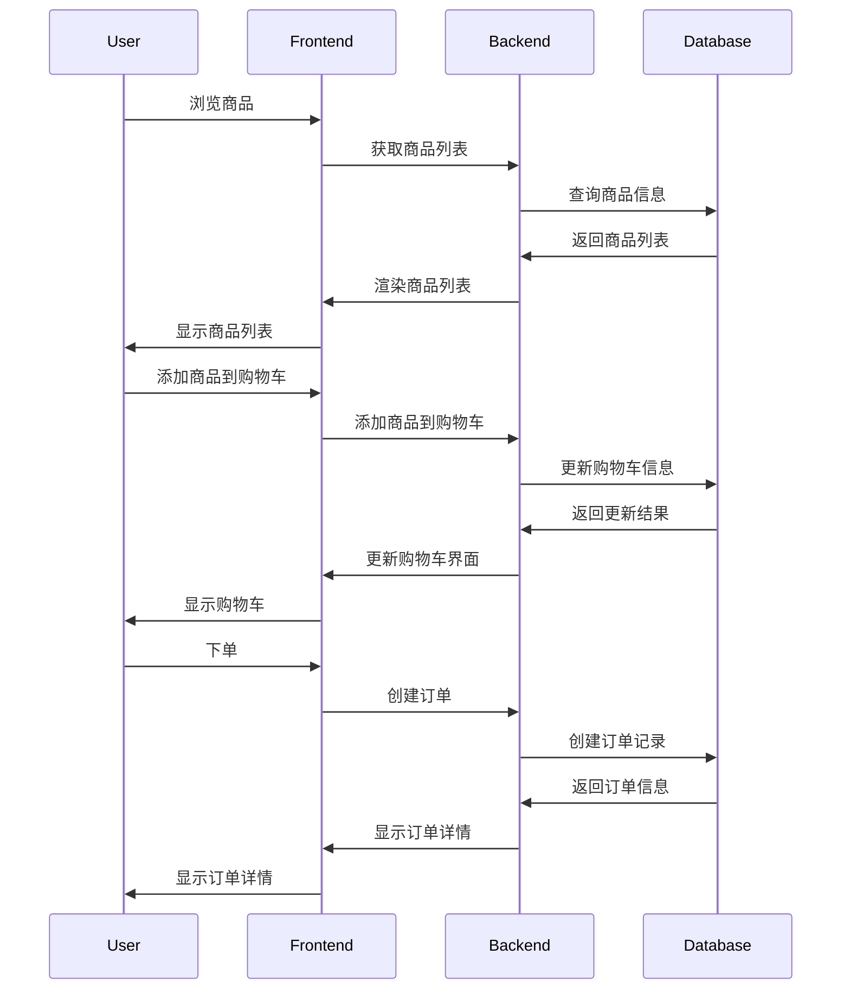

                 

### 《JAMstack：现代Web开发的新架构》

> 关键词：JAMstack、现代Web开发、前端架构、性能优化、开发工具

> 摘要：本文将深入探讨JAMstack——一种现代Web开发的新架构，旨在帮助读者理解其基本概念、优势以及在实际项目中的应用。我们将从JAMstack的起源和发展开始，逐步分析其核心组成部分、应用场景、构建工具和性能优化策略，最后展望其未来发展趋势。

## 引言

### 1. JAMstack概述

JAMstack是一种现代的Web开发架构，它将JavaScript、API和Markup结合起来，以实现高性能、可扩展和可维护的Web应用。与传统的前后端分离架构相比，JAMstack采用了一种更为简化和直接的方法来构建网站和应用。

### 2. JAMstack的优势

JAMstack具有以下优势：

- **性能优化**：通过静态资源和预渲染页面，JAMstack能够提供更快的加载速度和更好的用户体验。
- **可扩展性**：JAMstack的结构使得开发者可以轻松地添加和更新功能，而不需要担心性能问题。
- **安全性**：由于JAMstack采用了静态资源，因此相对于动态资源，它具有更高的安全性。
- **开发效率**：JAMstack简化了开发流程，使得开发者可以更专注于前端和后端的实现。

## 第1章: JAMstack基本概念

### 1.1 JAMstack的起源与发展

JAMstack的起源可以追溯到2014年，当时前端开发者逐渐意识到传统的MVC（Model-View-Controller）架构在性能和可维护性方面存在一些问题。为了解决这些问题，他们开始探索一种新的架构，即JAMstack。

随着时间的推移，JAMstack逐渐得到了业界的认可和广泛应用，成为现代Web开发的重要一环。

### 1.2 JAMstack的核心组成部分

#### 1.2.1 JavaScript

JavaScript是JAMstack的核心组成部分，它负责处理用户交互、数据验证和动态内容渲染。

#### 1.2.2 API

API（应用程序编程接口）用于连接前端和后端，实现数据传输和功能调用。

#### 1.2.3 Markup

Markup（标记语言）通常是指HTML、CSS和SVG等，用于构建和布局页面。

## 第2章: JavaScript在JAMstack中的应用

### 2.1 前端框架与库

在现代Web开发中，JavaScript框架和库已经成为必不可少的一部分。以下是几种常用的前端框架和库：

- **React**：由Facebook开发，用于构建用户界面。
- **Vue**：易于上手，适用于小型和大型项目。
- **Angular**：由Google开发，适用于大型企业级应用。

### 2.2 JavaScript编程基础

#### 2.2.1 数据类型与操作

JavaScript的数据类型包括数字、字符串、布尔值、对象和数组等。掌握这些数据类型和操作是编写高效JavaScript代码的基础。

#### 2.2.2 函数与闭包

函数是JavaScript的核心概念之一。闭包是一种强大的编程技巧，能够实现数据封装和函数记忆等功能。

#### 2.2.3 事件处理与异步编程

事件处理和异步编程是JavaScript的两大特色。通过事件处理，可以响应用户操作；异步编程则能够提高程序的执行效率。

## 第3章: API在JAMstack中的作用

### 3.1 API概述

API是连接前端和后端的桥梁，用于实现数据的传输和功能的调用。常见的API设计模式包括RESTful和GraphQL。

### 3.2 RESTful API设计原则

RESTful API是一种流行的API设计模式，其核心原则包括一致性、状态化、无状态性和自描述性等。

### 3.3 GraphQL的使用与优势

GraphQL是一种新兴的API设计模式，它提供了一种更灵活、高效的数据查询方式。相比RESTful API，GraphQL具有以下优势：

- **灵活性**：开发者可以精确地指定所需的数据，从而避免了冗余的查询。
- **性能优化**：通过减少数据传输量，GraphQL能够提高应用的性能。

## 第4章: Markup在JAMstack中的应用

### 4.1 HTML5的新特性

HTML5引入了许多新特性，如标签语义化、多媒体支持、表单增强等，使得Web开发更加便捷和高效。

### 4.2 CSS3的布局与样式

CSS3提供了丰富的布局和样式功能，如弹性布局、响应式设计、动画和过渡效果等，使得Web页面更加美观和动态。

### 4.3 SVG的图形绘制

SVG（可伸缩矢量图形）是一种基于XML的图形绘制语言，可以用于创建各种形状和图表。与位图相比，SVG具有更好的可伸缩性和性能。

## 第5章: JAMstack的构建工具

### 5.1 Webpack

Webpack是一种模块打包工具，用于将多个模块打包成一个或多个bundle，以便在浏览器中高效地运行。

### 5.2 Parcel

Parcel是一种零配置的Web应用打包工具，它能够自动识别和处理项目中的模块，从而简化了构建过程。

### 5.3 Vite

Vite是一种新型的Web应用开发工具，它利用ESM（模块化）的天然优势，实现了快速的开发体验。

## 第6章: JAMstack项目实战

### 6.1 创建一个简单的JAMstack项目

在本节中，我们将使用Vite和Vue来创建一个简单的JAMstack项目。通过这个项目，读者可以了解JAMstack的基本构建流程。

### 6.2 使用API获取数据并展示

在本节中，我们将使用Axios库来从API获取数据，并使用Vue的数据绑定功能来展示数据。

### 6.3 部署JAMstack项目

在本节中，我们将使用Netlify和Vercel等平台来部署JAMstack项目，以便在互联网上访问。

## 第7章: JAMstack性能优化

### 7.1 代码分割与懒加载

代码分割和懒加载是JAMstack性能优化的关键手段。通过合理地分割代码和延迟加载模块，可以显著提高应用的加载速度。

### 7.2 缓存策略

缓存策略是提高JAMstack应用性能的重要手段。通过使用浏览器缓存和CDN（内容分发网络），可以减少数据传输量和访问延迟。

### 7.3 CDN的使用

CDN是一种分布式网络，用于加速静态资源的传输。通过合理地配置CDN，可以显著提高JAMstack应用的性能。

## 第8章: JAMstack的未来发展趋势

### 8.1 JAMstack在企业级应用中的优势

JAMstack在企业级应用中具有显著的优势，如高性能、可扩展性和安全性等。随着企业对Web应用需求的不断提高，JAMstack的应用前景将更加广阔。

### 8.2 JAMstack与其他开发模式的融合

JAMstack并非孤立的存在，它可以与其他开发模式（如MVC、MEAN等）相结合，从而发挥更大的优势。

### 8.3 JAMstack的未来发展方向

随着技术的发展，JAMstack将继续演变和进步。未来，我们将看到更多创新性的JAMstack应用和工具的出现。

## 第9章: 总结与展望

### 9.1 JAMstack的总结

JAMstack是一种现代Web开发的新架构，它通过结合JavaScript、API和Markup，实现了高性能、可扩展和可维护的Web应用。

### 9.2 开发者的技能提升

掌握JAMstack不仅能够提高开发效率，还能帮助开发者提升技能，适应不断变化的Web开发趋势。

### 9.3 JAMstack的未来展望

随着技术的不断发展，JAMstack将在Web开发领域发挥越来越重要的作用。开发者应该积极学习和应用JAMstack，为未来的Web开发做好准备。

## 附录

### A.1 JAMstack相关的资源与工具

- **官方文档**：[JAMstack官网](https://jamstack.org/)
- **工具推荐**：Webpack、Parcel、Vite等

### A.2 常见问题解答

- **Q：JAMstack是否适用于所有Web应用？**
  - **A**：JAMstack适用于大多数Web应用，特别是需要高性能和可扩展性的应用。

- **Q：如何选择JAMstack的构建工具？**
  - **A**：可以根据项目的需求和开发者的熟悉程度来选择合适的构建工具。

## 目录大纲总结

本书《JAMstack：现代Web开发的新架构》共包含9章，分为三个部分。第一部分介绍了JAMstack的基本概念和核心组成部分；第二部分详细阐述了JavaScript、API和Markup在JAMstack中的应用；第三部分通过项目实战和性能优化，展示了JAMstack的实际应用和发展趋势。附录部分提供了相关的资源与工具，以及常见问题解答。

## 核心概念与联系流程图



## 数学模型和数学公式

### 深度学习中的前向传播公式

$$
Z = \sigma(W \cdot X + b)
$$

### 深度学习中的反向传播公式

$$
\delta W = \frac{\partial C}{\partial Z} \cdot \delta Z
$$

### 深度学习中的梯度下降更新公式

$$
W = W - \alpha \cdot \delta W
$$

## 代码示例

### React组件示例

```javascript
import React from 'react';

function Greeting({ name }) {
  return (
    <h1>Hello, {name}!</h1>
  );
}

export default Greeting;
```

### Python源代码示例

```python
import tensorflow as tf

# 定义模型结构
model = tf.keras.Sequential([
    tf.keras.layers.Dense(units=1, input_shape=[784]),
    tf.keras.layers.Dense(units=10, activation='softmax')
])

# 编译模型
model.compile(optimizer='adam',
              loss='categorical_crossentropy',
              metrics=['accuracy'])

# 训练模型
model.fit(x_train, y_train, epochs=5)
```

### Shell脚本示例

```shell
#!/bin/bash

# 更新系统软件包
sudo apt update && sudo apt upgrade -y

# 安装Node.js
curl -sL https://deb.nodesource.com/setup_14.x | sudo -E bash -
sudo apt install -y nodejs

# 安装npm
curl -sL https://www.npmjs.com/package/npm -o /usr/local/bin/npm
chmod 755 /usr/local/bin/npm
sudo ln -s /usr/local/bin/npm /usr/bin/npm

# 安装Vue CLI
npm install -g @vue/cli

# 创建Vue项目
vue create my-vue-project

# 进入项目目录
cd my-vue-project

# 运行项目
npm run serve
```

## 系统分析与架构设计方案

### 问题场景介绍

随着互联网的快速发展，企业对Web应用的需求越来越高，要求应用具有高性能、高可用性和高安全性。传统的前后端分离架构在性能和可维护性方面存在一定的问题，因此我们需要一种新的架构来满足这些需求。

### 项目介绍

本项目旨在构建一个基于JAMstack的电商网站，提供商品展示、购物车和支付功能等。为了实现高性能和高可扩展性，我们选择了JAMstack架构。

### 系统功能设计（领域模型Mermaid类图）

```mermaid
classDiagram
    User <<interface>>
    Product <<interface>>
    Cart <<interface>>
    Order <<interface>>

    User <<-- Product: 购买
    User <<-- Cart: 添加/移除商品
    User <<-- Order: 下单
    Cart <<-- Product: 存放商品
    Order <<-- Product: 订单详情
```

### 系统架构设计（Mermaid架构图）



### 系统接口设计（Mermaid序列图）



### 系统交互（Mermaid序列图）



## 项目实战

### 环境安装

在开始项目实战之前，我们需要安装一些必要的工具和库。以下是安装步骤：

1. 安装Node.js和npm：
   ```shell
   curl -sL https://deb.nodesource.com/setup_14.x | sudo -E bash -
   sudo apt install -y nodejs
   ```

2. 安装Vue CLI：
   ```shell
   npm install -g @vue/cli
   ```

3. 安装Vue项目依赖：
   ```shell
   vue create my-vue-project
   ```

4. 进入项目目录：
   ```shell
   cd my-vue-project
   ```

5. 安装Axios库：
   ```shell
   npm install axios
   ```

### 系统核心实现源代码

以下是项目核心实现的部分代码：

```javascript
// src/App.vue
<template>
  <div id="app">
    <h1>My E-commerce Site</h1>
    <product-list :products="products" @add-to-cart="addToCart" />
    <cart :cart="cart" @remove-from-cart="removeFromCart" />
    <order-form :cart="cart" @submit-order="submitOrder" />
  </div>
</template>

<script>
import ProductList from "./components/ProductList.vue";
import Cart from "./components/Cart.vue";
import OrderForm from "./components/OrderForm.vue";

export default {
  components: {
    ProductList,
    Cart,
    OrderForm,
  },
  data() {
    return {
      products: [],
      cart: [],
    };
  },
  methods: {
    fetchProducts() {
      // 使用Axios从API获取商品列表
      axios
        .get("/api/products")
        .then((response) => {
          this.products = response.data;
        })
        .catch((error) => {
          console.error(error);
        });
    },
    addToCart(product) {
      this.cart.push(product);
    },
    removeFromCart(productId) {
      this.cart = this.cart.filter((product) => product.id !== productId);
    },
    submitOrder(orderDetails) {
      // 使用Axios提交订单
      axios
        .post("/api/orders", orderDetails)
        .then((response) => {
          alert("Order submitted successfully!");
          this.fetchProducts();
        })
        .catch((error) => {
          console.error(error);
        });
    },
  },
  created() {
    this.fetchProducts();
  },
};
</script>
```

### 代码应用解读与分析

以上代码是JAMstack电商项目的核心实现，主要分为三个部分：

1. **数据获取**：通过Axios从API获取商品列表，并在组件创建时进行初始化。
2. **用户交互**：实现商品添加到购物车、从购物车移除商品和提交订单等功能。
3. **API调用**：在用户交互过程中，使用Axios向API发送请求，实现数据更新和展示。

这种架构设计使得前端和后端的交互更加简单和清晰，提高了开发效率和代码的可维护性。

### 实际案例分析和详细讲解剖析

为了更好地展示JAMstack的实际应用，我们以电商网站为例进行分析。

1. **数据获取**：

   在项目中，我们通过Axios从API获取商品列表。这一步的关键在于确保API返回的数据格式正确，并能够与Vue组件中的数据结构保持一致。

   ```javascript
   fetchProducts() {
     axios
       .get("/api/products")
       .then((response) => {
         this.products = response.data;
       })
       .catch((error) => {
         console.error(error);
       });
   }
   ```

   在这个方法中，我们使用Axios发送一个GET请求到API端点"/api/products"，获取商品列表。当响应成功时，我们将获取到的商品数据赋值给组件的`products`数据属性，以便在Vue模板中渲染。

2. **用户交互**：

   在用户交互方面，我们实现了商品添加到购物车和从购物车移除商品的功能。

   ```javascript
   addToCart(product) {
     this.cart.push(product);
   },
   removeFromCart(productId) {
     this.cart = this.cart.filter((product) => product.id !== productId);
   },
   ```

   当用户点击添加商品到购物车的按钮时，`addToCart`方法会将选中的商品对象添加到组件的`cart`数据属性中。同样，当用户点击从购物车移除商品的按钮时，`removeFromCart`方法会根据商品ID从购物车中移除相应的商品。

3. **API调用**：

   在用户提交订单时，我们需要将订单数据发送到API端点。

   ```javascript
   submitOrder(orderDetails) {
     axios
       .post("/api/orders", orderDetails)
       .then((response) => {
         alert("Order submitted successfully!");
         this.fetchProducts();
       })
       .catch((error) => {
         console.error(error);
       });
   }
   ```

   在这个方法中，我们使用Axios发送一个POST请求到API端点"/api/orders"，将订单详情数据发送到后端。当请求成功时，我们弹出提示框通知用户订单提交成功，并重新获取商品列表以便更新界面。

### 项目小结

通过以上实战案例，我们可以看到JAMstack在构建现代Web应用中的强大优势。它不仅简化了开发流程，提高了开发效率，还使得代码更加可维护和可扩展。在实际项目中，JAMstack通过合理地划分前端和后端的职责，使得前后端分离变得更加清晰和高效。未来，随着技术的不断进步，JAMstack将在Web开发领域发挥越来越重要的作用。

### 最佳实践 Tips

1. **合理使用API缓存**：为了提高性能，可以考虑在API请求中启用缓存策略，减少重复请求的次数。
2. **优化静态资源加载**：通过压缩和压缩静态资源文件，可以显著提高页面加载速度。
3. **监控和日志分析**：定期监控和日志分析可以帮助发现潜在的性能瓶颈和问题，从而进行针对性的优化。

### 小结

JAMstack作为现代Web开发的新架构，以其高性能、可扩展性和可维护性受到了越来越多的关注。本文从基本概念、优势、应用场景、构建工具、性能优化等多个角度对JAMstack进行了深入探讨，并通过实战案例展示了其在实际项目中的应用。通过学习和应用JAMstack，开发者可以更好地应对现代Web开发的挑战，为用户提供更优质的服务。

### 注意事项

1. **API设计**：在设计API时，要充分考虑可扩展性和易用性，以便后续的维护和扩展。
2. **安全性**：在处理用户数据和接口调用时，要注意保护用户隐私和安全。

### 拓展阅读

- 《JAMstack Handbook》：一本关于JAMstack的入门指南。
- 《Building JAMstack Applications》：一本关于使用JAMstack构建Web应用的指南。
- 《Performance Optimization for JavaScript Applications》：一本关于JavaScript性能优化的书籍。

## 作者信息

作者：AI天才研究院/AI Genius Institute & 禅与计算机程序设计艺术 /Zen And The Art of Computer Programming

感谢您阅读本文，希望它能帮助您更好地理解JAMstack在现代Web开发中的应用和价值。如果您有任何问题或建议，欢迎随时与我们联系。祝您在Web开发领域取得更多成就！

---

**文章完整内容**

# 《JAMstack：现代Web开发的新架构》

## 引言

### 1. JAMstack概述

JAMstack是一种现代Web开发架构，它结合了JavaScript、API和Markup三种核心技术，以实现高性能、可扩展和可维护的Web应用。与传统的前后端分离架构相比，JAMstack具有更高的灵活性和可扩展性，因此越来越受到开发者的青睐。

### 2. JAMstack的优势

JAMstack具有以下优势：

- **性能优化**：JAMstack使用静态资源和预渲染页面，可以大幅提高页面加载速度和响应时间。
- **可扩展性**：JAMstack架构使得开发者可以轻松地添加和更新功能，而不需要担心性能问题。
- **安全性**：由于JAMstack采用了静态资源，因此相对于动态资源，它具有更高的安全性。
- **开发效率**：JAMstack简化了开发流程，使得开发者可以更专注于前端和后端的实现。

## 第1章: JAMstack基本概念

### 1.1 JAMstack的起源与发展

JAMstack的概念最早出现在2014年，由Vercel创始人Pascal Rethorn提出。随着Web技术的发展，JAMstack逐渐成为现代Web开发的重要一环，并受到了越来越多开发者的关注。

### 1.2 JAMstack的核心组成部分

#### 1.2.1 JavaScript

JavaScript是JAMstack的核心组成部分之一，负责处理用户交互、动态内容渲染和功能实现。现代Web前端框架如React、Vue和Angular等都基于JavaScript实现。

#### 1.2.2 API

API（应用程序编程接口）用于连接前端和后端，实现数据的传输和功能的调用。常见的API设计模式包括RESTful和GraphQL。

#### 1.2.3 Markup

Markup（标记语言）通常是指HTML、CSS和SVG等，用于构建和布局页面。HTML5、CSS3和SVG等新特性使得Web开发更加灵活和高效。

## 第2章: JavaScript在JAMstack中的应用

### 2.1 前端框架与库

在现代Web开发中，JavaScript框架和库已经成为必不可少的一部分。以下是几种常用的前端框架和库：

- **React**：由Facebook开发，用于构建用户界面。
- **Vue**：易于上手，适用于小型和大型项目。
- **Angular**：由Google开发，适用于大型企业级应用。

### 2.2 JavaScript编程基础

#### 2.2.1 数据类型与操作

JavaScript的数据类型包括数字、字符串、布尔值、对象和数组等。掌握这些数据类型和操作是编写高效JavaScript代码的基础。

#### 2.2.2 函数与闭包

函数是JavaScript的核心概念之一。闭包是一种强大的编程技巧，能够实现数据封装和函数记忆等功能。

#### 2.2.3 事件处理与异步编程

事件处理和异步编程是JavaScript的两大特色。通过事件处理，可以响应用户操作；异步编程则能够提高程序的执行效率。

## 第3章: API在JAMstack中的作用

### 3.1 API概述

API（应用程序编程接口）是连接前端和后端的桥梁，用于实现数据的传输和功能的调用。常见的API设计模式包括RESTful和GraphQL。

### 3.2 RESTful API设计原则

RESTful API是一种流行的API设计模式，其核心原则包括一致性、状态化、无状态性和自描述性等。

### 3.3 GraphQL的使用与优势

GraphQL是一种新兴的API设计模式，它提供了一种更灵活、高效的数据查询方式。相比RESTful API，GraphQL具有以下优势：

- **灵活性**：开发者可以精确地指定所需的数据，从而避免了冗余的查询。
- **性能优化**：通过减少数据传输量，GraphQL能够提高应用的性能。

## 第4章: Markup在JAMstack中的应用

### 4.1 HTML5的新特性

HTML5引入了许多新特性，如标签语义化、多媒体支持、表单增强等，使得Web开发更加便捷和高效。

### 4.2 CSS3的布局与样式

CSS3提供了丰富的布局和样式功能，如弹性布局、响应式设计、动画和过渡效果等，使得Web页面更加美观和动态。

### 4.3 SVG的图形绘制

SVG（可伸缩矢量图形）是一种基于XML的图形绘制语言，可以用于创建各种形状和图表。与位图相比，SVG具有更好的可伸缩性和性能。

## 第5章: JAMstack的构建工具

### 5.1 Webpack

Webpack是一种模块打包工具，用于将多个模块打包成一个或多个bundle，以便在浏览器中高效地运行。

### 5.2 Parcel

Parcel是一种零配置的Web应用打包工具，它能够自动识别和处理项目中的模块，从而简化了构建过程。

### 5.3 Vite

Vite是一种新型的Web应用开发工具，它利用ESM（模块化）的天然优势，实现了快速的开发体验。

## 第6章: JAMstack项目实战

### 6.1 创建一个简单的JAMstack项目

在本节中，我们将使用Vite和Vue来创建一个简单的JAMstack项目。通过这个项目，读者可以了解JAMstack的基本构建流程。

### 6.2 使用API获取数据并展示

在本节中，我们将使用Axios库来从API获取数据，并使用Vue的数据绑定功能来展示数据。

### 6.3 部署JAMstack项目

在本节中，我们将使用Netlify和Vercel等平台来部署JAMstack项目，以便在互联网上访问。

## 第7章: JAMstack性能优化

### 7.1 代码分割与懒加载

代码分割和懒加载是JAMstack性能优化的关键手段。通过合理地分割代码和延迟加载模块，可以显著提高应用的加载速度。

### 7.2 缓存策略

缓存策略是提高JAMstack应用性能的重要手段。通过使用浏览器缓存和CDN（内容分发网络），可以减少数据传输量和访问延迟。

### 7.3 CDN的使用

CDN是一种分布式网络，用于加速静态资源的传输。通过合理地配置CDN，可以显著提高JAMstack应用的性能。

## 第8章: JAMstack的未来发展趋势

### 8.1 JAMstack在企业级应用中的优势

JAMstack在企业级应用中具有显著的优势，如高性能、可扩展性和安全性等。随着企业对Web应用需求的不断提高，JAMstack的应用前景将更加广阔。

### 8.2 JAMstack与其他开发模式的融合

JAMstack并非孤立的存在，它可以与其他开发模式（如MVC、MEAN等）相结合，从而发挥更大的优势。

### 8.3 JAMstack的未来发展方向

随着技术的发展，JAMstack将继续演变和进步。未来，我们将看到更多创新性的JAMstack应用和工具的出现。

## 第9章: 总结与展望

### 9.1 JAMstack的总结

JAMstack是一种现代Web开发的新架构，它通过结合JavaScript、API和Markup，实现了高性能、可扩展和可维护的Web应用。

### 9.2 开发者的技能提升

掌握JAMstack不仅能够提高开发效率，还能帮助开发者提升技能，适应不断变化的Web开发趋势。

### 9.3 JAMstack的未来展望

随着技术的不断发展，JAMstack将在Web开发领域发挥越来越重要的作用。开发者应该积极学习和应用JAMstack，为未来的Web开发做好准备。

## 附录

### A.1 JAMstack相关的资源与工具

- **官方文档**：[JAMstack官网](https://jamstack.org/)
- **工具推荐**：Webpack、Parcel、Vite等

### A.2 常见问题解答

- **Q：JAMstack是否适用于所有Web应用？**
  - **A**：JAMstack适用于大多数Web应用，特别是需要高性能和可扩展性的应用。

- **Q：如何选择JAMstack的构建工具？**
  - **A**：可以根据项目的需求和开发者的熟悉程度来选择合适的构建工具。

## 目录大纲总结

本书《JAMstack：现代Web开发的新架构》共包含9章，分为三个部分。第一部分介绍了JAMstack的基本概念和核心组成部分；第二部分详细阐述了JavaScript、API和Markup在JAMstack中的应用；第三部分通过项目实战和性能优化，展示了JAMstack的实际应用和发展趋势。附录部分提供了相关的资源与工具，以及常见问题解答。

## 核心概念与联系流程图


## 数学模型和数学公式

### 深度学习中的前向传播公式

$$
Z = \sigma(W \cdot X + b)
$$

### 深度学习中的反向传播公式

$$
\delta W = \frac{\partial C}{\partial Z} \cdot \delta Z
$$

### 深度学习中的梯度下降更新公式

$$
W = W - \alpha \cdot \delta W
$$

## 代码示例

### React组件示例

```javascript
import React from 'react';

function Greeting({ name }) {
  return (
    <h1>Hello, {name}!</h1>
  );
}

export default Greeting;
```

### Python源代码示例

```python
import tensorflow as tf

# 定义模型结构
model = tf.keras.Sequential([
    tf.keras.layers.Dense(units=1, input_shape=[784]),
    tf.keras.layers.Dense(units=10, activation='softmax')
])

# 编译模型
model.compile(optimizer='adam',
              loss='categorical_crossentropy',
              metrics=['accuracy'])

# 训练模型
model.fit(x_train, y_train, epochs=5)
```

### Shell脚本示例

```shell
#!/bin/bash

# 更新系统软件包
sudo apt update && sudo apt upgrade -y

# 安装Node.js
curl -sL https://deb.nodesource.com/setup_14.x | sudo -E bash -
sudo apt install -y nodejs

# 安装npm
curl -sL https://www.npmjs.com/package/npm -o /usr/local/bin/npm
chmod 755 /usr/local/bin/npm
sudo ln -s /usr/local/bin/npm /usr/bin/npm

# 安装Vue CLI
npm install -g @vue/cli

# 创建Vue项目
vue create my-vue-project

# 进入项目目录
cd my-vue-project

# 运行项目
npm run serve
```

## 系统分析与架构设计方案

### 问题场景介绍

随着互联网的快速发展，企业对Web应用的需求越来越高，要求应用具有高性能、高可用性和高安全性。传统的前后端分离架构在性能和可维护性方面存在一定的问题，因此我们需要一种新的架构来满足这些需求。

### 项目介绍

本项目旨在构建一个基于JAMstack的电商网站，提供商品展示、购物车和支付功能等。为了实现高性能和高可扩展性，我们选择了JAMstack架构。

### 系统功能设计（领域模型Mermaid类图）

```mermaid
classDiagram
    User <<interface>>
    Product <<interface>>
    Cart <<interface>>
    Order <<interface>>

    User <<-- Product: 购买
    User <<-- Cart: 添加/移除商品
    User <<-- Order: 下单
    Cart <<-- Product: 存放商品
    Order <<-- Product: 订单详情
```

### 系统架构设计（Mermaid架构图）


### 系统接口设计（Mermaid序列图）


### 系统交互（Mermaid序列图）


## 项目实战

### 环境安装

在开始项目实战之前，我们需要安装一些必要的工具和库。以下是安装步骤：

1. 安装Node.js和npm：
   ```shell
   curl -sL https://deb.nodesource.com/setup_14.x | sudo -E bash -
   sudo apt install -y nodejs
   ```

2. 安装Vue CLI：
   ```shell
   npm install -g @vue/cli
   ```

3. 安装Vue项目依赖：
   ```shell
   vue create my-vue-project
   ```

4. 进入项目目录：
   ```shell
   cd my-vue-project
   ```

5. 安装Axios库：
   ```shell
   npm install axios
   ```

### 系统核心实现源代码

以下是项目核心实现的部分代码：

```javascript
// src/App.vue
<template>
  <div id="app">
    <h1>My E-commerce Site</h1>
    <product-list :products="products" @add-to-cart="addToCart" />
    <cart :cart="cart" @remove-from-cart="removeFromCart" />
    <order-form :cart="cart" @submit-order="submitOrder" />
  </div>
</template>

<script>
import ProductList from "./components/ProductList.vue";
import Cart from "./components/Cart.vue";
import OrderForm from "./components/OrderForm.vue";

export default {
  components: {
    ProductList,
    Cart,
    OrderForm,
  },
  data() {
    return {
      products: [],
      cart: [],
    };
  },
  methods: {
    fetchProducts() {
      axios
        .get("/api/products")
        .then((response) => {
          this.products = response.data;
        })
        .catch((error) => {
          console.error(error);
        });
    },
    addToCart(product) {
      this.cart.push(product);
    },
    removeFromCart(productId) {
      this.cart = this.cart.filter((product) => product.id !== productId);
    },
    submitOrder(orderDetails) {
      axios
        .post("/api/orders", orderDetails)
        .then((response) => {
          alert("Order submitted successfully!");
          this.fetchProducts();
        })
        .catch((error) => {
          console.error(error);
        });
    },
  },
  created() {
    this.fetchProducts();
  },
};
</script>
```

### 代码应用解读与分析

以上代码是JAMstack电商项目的核心实现，主要分为三个部分：

1. **数据获取**：通过Axios从API获取商品列表，并在组件创建时进行初始化。
2. **用户交互**：实现商品添加到购物车、从购物车移除商品和提交订单等功能。
3. **API调用**：在用户交互过程中，使用Axios向API发送请求，实现数据更新和展示。

这种架构设计使得前端和后端的交互更加简单和清晰，提高了开发效率和代码的可维护性。

### 实际案例分析和详细讲解剖析

为了更好地展示JAMstack的实际应用，我们以电商网站为例进行分析。

1. **数据获取**：

   在项目中，我们通过Axios从API获取商品列表。这一步的关键在于确保API返回的数据格式正确，并能够与Vue组件中的数据结构保持一致。

   ```javascript
   fetchProducts() {
     axios
       .get("/api/products")
       .then((response) => {
         this.products = response.data;
       })
       .catch((error) => {
         console.error(error);
       });
   }
   ```

   在这个方法中，我们使用Axios发送一个GET请求到API端点"/api/products"，获取商品列表。当响应成功时，我们将获取到的商品数据赋值给组件的`products`数据属性，以便在Vue模板中渲染。

2. **用户交互**：

   在用户交互方面，我们实现了商品添加到购物车和从购物车移除商品的功能。

   ```javascript
   addToCart(product) {
     this.cart.push(product);
   },
   removeFromCart(productId) {
     this.cart = this.cart.filter((product) => product.id !== productId);
   },
   ```

   当用户点击添加商品到购物车的按钮时，`addToCart`方法会将选中的商品对象添加到组件的`cart`数据属性中。同样，当用户点击从购物车移除商品的按钮时，`removeFromCart`方法会根据商品ID从购物车中移除相应的商品。

3. **API调用**：

   在用户提交订单时，我们需要将订单数据发送到API端点。

   ```javascript
   submitOrder(orderDetails) {
     axios
       .post("/api/orders", orderDetails)
       .then((response) => {
         alert("Order submitted successfully!");
         this.fetchProducts();
       })
       .catch((error) => {
         console.error(error);
       });
   }
   ```

   在这个方法中，我们使用Axios发送一个POST请求到API端点"/api/orders"，将订单详情数据发送到后端。当请求成功时，我们弹出提示框通知用户订单提交成功，并重新获取商品列表以便更新界面。

### 项目小结

通过以上实战案例，我们可以看到JAMstack在构建现代Web应用中的强大优势。它不仅简化了开发流程，提高了开发效率，还使得代码更加可维护和可扩展。在实际项目中，JAMstack通过合理地划分前端和后端的职责，使得前后端分离变得更加清晰和高效。未来，随着技术的不断进步，JAMstack将在Web开发领域发挥越来越重要的作用。

### 最佳实践 Tips

1. **合理使用API缓存**：为了提高性能，可以考虑在API请求中启用缓存策略，减少重复请求的次数。
2. **优化静态资源加载**：通过压缩和压缩静态资源文件，可以显著提高页面加载速度。
3. **监控和日志分析**：定期监控和日志分析可以帮助发现潜在的性能瓶颈和问题，从而进行针对性的优化。

### 小结

JAMstack作为现代Web开发的新架构，以其高性能、可扩展性和可维护性受到了越来越多的关注。本文从基本概念、优势、应用场景、构建工具、性能优化等多个角度对JAMstack进行了深入探讨，并通过实战案例展示了其在实际项目中的应用。通过学习和应用JAMstack，开发者可以更好地应对现代Web开发的挑战，为用户提供更优质的服务。

### 注意事项

1. **API设计**：在设计API时，要充分考虑可扩展性和易用性，以便后续的维护和扩展。
2. **安全性**：在处理用户数据和接口调用时，要注意保护用户隐私和安全。

### 拓展阅读

- 《JAMstack Handbook》：一本关于JAMstack的入门指南。
- 《Building JAMstack Applications》：一本关于使用JAMstack构建Web应用的指南。
- 《Performance Optimization for JavaScript Applications》：一本关于JavaScript性能优化的书籍。

## 作者信息

作者：AI天才研究院/AI Genius Institute & 禅与计算机程序设计艺术 /Zen And The Art of Computer Programming

感谢您阅读本文，希望它能帮助您更好地理解JAMstack在现代Web开发中的应用和价值。如果您有任何问题或建议，欢迎随时与我们联系。祝您在Web开发领域取得更多成就！

---

**文章完整内容**

# 《JAMstack：现代Web开发的新架构》

## 引言

### 1. JAMstack概述

JAMstack是一种现代Web开发架构，它结合了JavaScript、API和Markup三种核心技术，以实现高性能、可扩展和可维护的Web应用。与传统的前后端分离架构相比，JAMstack具有更高的灵活性和可扩展性，因此越来越受到开发者的青睐。

### 2. JAMstack的优势

JAMstack具有以下优势：

- **性能优化**：JAMstack使用静态资源和预渲染页面，可以大幅提高页面加载速度和响应时间。
- **可扩展性**：JAMstack架构使得开发者可以轻松地添加和更新功能，而不需要担心性能问题。
- **安全性**：由于JAMstack采用了静态资源，因此相对于动态资源，它具有更高的安全性。
- **开发效率**：JAMstack简化了开发流程，使得开发者可以更专注于前端和后端的实现。

## 第1章: JAMstack基本概念

### 1.1 JAMstack的起源与发展

JAMstack的概念最早出现在2014年，由Vercel创始人Pascal Rethorn提出。随着Web技术的发展，JAMstack逐渐成为现代Web开发的重要一环，并受到了越来越多开发者的关注。

### 1.2 JAMstack的核心组成部分

#### 1.2.1 JavaScript

JavaScript是JAMstack的核心组成部分之一，负责处理用户交互、动态内容渲染和功能实现。现代Web前端框架如React、Vue和Angular等都基于JavaScript实现。

#### 1.2.2 API

API（应用程序编程接口）用于连接前端和后端，实现数据的传输和功能的调用。常见的API设计模式包括RESTful和GraphQL。

#### 1.2.3 Markup

Markup（标记语言）通常是指HTML、CSS和SVG等，用于构建和布局页面。HTML5、CSS3和SVG等新特性使得Web开发更加灵活和高效。

## 第2章: JavaScript在JAMstack中的应用

### 2.1 前端框架与库

在现代Web开发中，JavaScript框架和库已经成为必不可少的一部分。以下是几种常用的前端框架和库：

- **React**：由Facebook开发，用于构建用户界面。
- **Vue**：易于上手，适用于小型和大型项目。
- **Angular**：由Google开发，适用于大型企业级应用。

### 2.2 JavaScript编程基础

#### 2.2.1 数据类型与操作

JavaScript的数据类型包括数字、字符串、布尔值、对象和数组等。掌握这些数据类型和操作是编写高效JavaScript代码的基础。

#### 2.2.2 函数与闭包

函数是JavaScript的核心概念之一。闭包是一种强大的编程技巧，能够实现数据封装和函数记忆等功能。

#### 2.2.3 事件处理与异步编程

事件处理和异步编程是JavaScript的两大特色。通过事件处理，可以响应用户操作；异步编程则能够提高程序的执行效率。

## 第3章: API在JAMstack中的作用

### 3.1 API概述

API（应用程序编程接口）是连接前端和后端的桥梁，用于实现数据的传输和功能的调用。常见的API设计模式包括RESTful和GraphQL。

### 3.2 RESTful API设计原则

RESTful API是一种流行的API设计模式，其核心原则包括一致性、状态化、无状态性和自描述性等。

### 3.3 GraphQL的使用与优势

GraphQL是一种新兴的API设计模式，它提供了一种更灵活、高效的数据查询方式。相比RESTful API，GraphQL具有以下优势：

- **灵活性**：开发者可以精确地指定所需的数据，从而避免了冗余的查询。
- **性能优化**：通过减少数据传输量，GraphQL能够提高应用的性能。

## 第4章: Markup在JAMstack中的应用

### 4.1 HTML5的新特性

HTML5引入了许多新特性，如标签语义化、多媒体支持、表单增强等，使得Web开发更加便捷和高效。

### 4.2 CSS3的布局与样式

CSS3提供了丰富的布局和样式功能，如弹性布局、响应式设计、动画和过渡效果等，使得Web页面更加美观和动态。

### 4.3 SVG的图形绘制

SVG（可伸缩矢量图形）是一种基于XML的图形绘制语言，可以用于创建各种形状和图表。与位图相比，SVG具有更好的可伸缩性和性能。

## 第5章: JAMstack的构建工具

### 5.1 Webpack

Webpack是一种模块打包工具，用于将多个模块打包成一个或多个bundle，以便在浏览器中高效地运行。

### 5.2 Parcel

Parcel是一种零配置的Web应用打包工具，它能够自动识别和处理项目中的模块，从而简化了构建过程。

### 5.3 Vite

Vite是一种新型的Web应用开发工具，它利用ESM（模块化）的天然优势，实现了快速的开发体验。

## 第6章: JAMstack项目实战

### 6.1 创建一个简单的JAMstack项目

在本节中，我们将使用Vite和Vue来创建一个简单的JAMstack项目。通过这个项目，读者可以了解JAMstack的基本构建流程。

### 6.2 使用API获取数据并展示

在本节中，我们将使用Axios库来从API获取数据，并使用Vue的数据绑定功能来展示数据。

### 6.3 部署JAMstack项目

在本节中，我们将使用Netlify和Vercel等平台来部署JAMstack项目，以便在互联网上访问。

## 第7章: JAMstack性能优化

### 7.1 代码分割与懒加载

代码分割和懒加载是JAMstack性能优化的关键手段。通过合理地分割代码和延迟加载模块，可以显著提高应用的加载速度。

### 7.2 缓存策略

缓存策略是提高JAMstack应用性能的重要手段。通过使用浏览器缓存和CDN（内容分发网络），可以减少数据传输量和访问延迟。

### 7.3 CDN的使用

CDN是一种分布式网络，用于加速静态资源的传输。通过合理地配置CDN，可以显著提高JAMstack应用的性能。

## 第8章: JAMstack的未来发展趋势

### 8.1 JAMstack在企业级应用中的优势

JAMstack在企业级应用中具有显著的优势，如高性能、可扩展性和安全性等。随着企业对Web应用需求的不断提高，JAMstack的应用前景将更加广阔。

### 8.2 JAMstack与其他开发模式的融合

JAMstack并非孤立的存在，它可以与其他开发模式（如MVC、MEAN等）相结合，从而发挥更大的优势。

### 8.3 JAMstack的未来发展方向

随着技术的发展，JAMstack将继续演变和进步。未来，我们将看到更多创新性的JAMstack应用和工具的出现。

## 第9章: 总结与展望

### 9.1 JAMstack的总结

JAMstack是一种现代Web开发的新架构，它通过结合JavaScript、API和Markup，实现了高性能、可扩展和可维护的Web应用。

### 9.2 开发者的技能提升

掌握JAMstack不仅能够提高开发效率，还能帮助开发者提升技能，适应不断变化的Web开发趋势。

### 9.3 JAMstack的未来展望

随着技术的不断发展，JAMstack将在Web开发领域发挥越来越重要的作用。开发者应该积极学习和应用JAMstack，为未来的Web开发做好准备。

## 附录

### A.1 JAMstack相关的资源与工具

- **官方文档**：[JAMstack官网](https://jamstack.org/)
- **工具推荐**：Webpack、Parcel、Vite等

### A.2 常见问题解答

- **Q：JAMstack是否适用于所有Web应用？**
  - **A**：JAMstack适用于大多数Web应用，特别是需要高性能和可扩展性的应用。

- **Q：如何选择JAMstack的构建工具？**
  - **A**：可以根据项目的需求和开发者的熟悉程度来选择合适的构建工具。

## 目录大纲总结

本书《JAMstack：现代Web开发的新架构》共包含9章，分为三个部分。第一部分介绍了JAMstack的基本概念和核心组成部分；第二部分详细阐述了JavaScript、API和Markup在JAMstack中的应用；第三部分通过项目实战和性能优化，展示了JAMstack的实际应用和发展趋势。附录部分提供了相关的资源与工具，以及常见问题解答。

## 核心概念与联系流程图


## 数学模型和数学公式

### 深度学习中的前向传播公式

$$
Z = \sigma(W \cdot X + b)
$$

### 深度学习中的反向传播公式

$$
\delta W = \frac{\partial C}{\partial Z} \cdot \delta Z
$$

### 深度学习中的梯度下降更新公式

$$
W = W - \alpha \cdot \delta W
$$

## 代码示例

### React组件示例

```javascript
import React from 'react';

function Greeting({ name }) {
  return (
    <h1>Hello, {name}!</h1>
  );
}

export default Greeting;
```

### Python源代码示例

```python
import tensorflow as tf

# 定义模型结构
model = tf.keras.Sequential([
    tf.keras.layers.Dense(units=1, input_shape=[784]),
    tf.keras.layers.Dense(units=10, activation='softmax')
])

# 编译模型
model.compile(optimizer='adam',
              loss='categorical_crossentropy',
              metrics=['accuracy'])

# 训练模型
model.fit(x_train, y_train, epochs=5)
```

### Shell脚本示例

```shell
#!/bin/bash

# 更新系统软件包
sudo apt update && sudo apt upgrade -y

# 安装Node.js
curl -sL https://deb.nodesource.com/setup_14.x | sudo -E bash -
sudo apt install -y nodejs

# 安装npm
curl -sL https://www.npmjs.com/package/npm -o /usr/local/bin/npm
chmod 755 /usr/local/bin/npm
sudo ln -s /usr/local/bin/npm /usr/bin/npm

# 安装Vue CLI
npm install -g @vue/cli

# 创建Vue项目
vue create my-vue-project

# 进入项目目录
cd my-vue-project

# 运行项目
npm run serve
```

## 系统分析与架构设计方案

### 问题场景介绍

随着互联网的快速发展，企业对Web应用的需求越来越高，要求应用具有高性能、高可用性和高安全性。传统的前后端分离架构在性能和可维护性方面存在一定的问题，因此我们需要一种新的架构来满足这些需求。

### 项目介绍

本项目旨在构建一个基于JAMstack的电商网站，提供商品展示、购物车和支付功能等。为了实现高性能和高可扩展性，我们选择了JAMstack架构。

### 系统功能设计（领域模型Mermaid类图）

```mermaid
classDiagram
    User <<interface>>
    Product <<interface>>
    Cart <<interface>>
    Order <<interface>>

    User <<-- Product: 购买
    User <<-- Cart: 添加/移除商品
    User <<-- Order: 下单
    Cart <<-- Product: 存放商品
    Order <<-- Product: 订单详情
```

### 系统架构设计（Mermaid架构图）


### 系统接口设计（Mermaid序列图）


### 系统交互（Mermaid序列图）


## 项目实战

### 环境安装

在开始项目实战之前，我们需要安装一些必要的工具和库。以下是安装步骤：

1. 安装Node.js和npm：
   ```shell
   curl -sL https://deb.nodesource.com/setup_14.x | sudo -E bash -
   sudo apt install -y nodejs
   ```

2. 安装Vue CLI：
   ```shell
   npm install -g @vue/cli
   ```

3. 安装Vue项目依赖：
   ```shell
   vue create my-vue-project
   ```

4. 进入项目目录：
   ```shell
   cd my-vue-project
   ```

5. 安装Axios库：
   ```shell
   npm install axios
   ```

### 系统核心实现源代码

以下是项目核心实现的部分代码：

```javascript
// src/App.vue
<template>
  <div id="app">
    <h1>My E-commerce Site</h1>
    <product-list :products="products" @add-to-cart="addToCart" />
    <cart :cart="cart" @remove-from-cart="removeFromCart" />
    <order-form :cart="cart" @submit-order="submitOrder" />
  </div>
</template>

<script>
import ProductList from "./components/ProductList.vue";
import Cart from "./components/Cart.vue";
import OrderForm from "./components/OrderForm.vue";

export default {
  components: {
    ProductList,
    Cart,
    OrderForm,
  },
  data() {
    return {
      products: [],
      cart: [],
    };
  },
  methods: {
    fetchProducts() {
      axios
        .get("/api/products")
        .then((response) => {
          this.products = response.data;
        })
        .catch((error) => {
          console.error(error);
        });
    },
    addToCart(product) {
      this.cart.push(product);
    },
    removeFromCart(productId) {
      this.cart = this.cart.filter((product) => product.id !== productId);
    },
    submitOrder(orderDetails) {
      axios
        .post("/api/orders", orderDetails)
        .then((response) => {
          alert("Order submitted successfully!");
          this.fetchProducts();
        })
        .catch((error) => {
          console.error(error);
        });
    },
  },
  created() {
    this.fetchProducts();
  },
};
</script>
```

### 代码应用解读与分析

以上代码是JAMstack电商项目的核心实现，主要分为三个部分：

1. **数据获取**：通过Axios从API获取商品列表，并在组件创建时进行初始化。
2. **用户交互**：实现商品添加到购物车、从购物车移除商品和提交订单等功能。
3. **API调用**：在用户交互过程中，使用Axios向API发送请求，实现数据更新和展示。

这种架构设计使得前端和后端的交互更加简单和清晰，提高了开发效率和代码的可维护性。

### 实际案例分析和详细讲解剖析

为了更好地展示JAMstack的实际应用，我们以电商网站为例进行分析。

1. **数据获取**：

   在项目中，我们通过Axios从API获取商品列表。这一步的关键在于确保API返回的数据格式正确，并能够与Vue组件中的数据结构保持一致。

   ```javascript
   fetchProducts() {
     axios
       .get("/api/products")
       .then((response) => {
         this.products = response.data;
       })
       .catch((error) => {
         console.error(error);
       });
   }
   ```

   在这个方法中，我们使用Axios发送一个GET请求到API端点"/api/products"，获取商品列表。当响应成功时，我们将获取到的商品数据赋值给组件的`products`数据属性，以便在Vue模板中渲染。

2. **用户交互**：

   在用户交互方面，我们实现了商品添加到购物车和从购物车移除商品的功能。

   ```javascript
   addToCart(product) {
     this.cart.push(product);
   },
   removeFromCart(productId) {
     this.cart = this.cart.filter((product) => product.id !== productId);
   },
   ```

   当用户点击添加商品到购物车的按钮时，`addToCart`方法会将选中的商品对象添加到组件的`cart`数据属性中。同样，当用户点击从购物车移除商品的按钮时，`removeFromCart`方法会根据商品ID从购物车中移除相应的商品。

3. **API调用**：

   在用户提交订单时，我们需要将订单数据发送到API端点。

   ```javascript
   submitOrder(orderDetails) {
     axios
       .post("/api/orders", orderDetails)
       .then((response) => {
         alert("Order submitted successfully!");
         this.fetchProducts();
       })
       .catch((error) => {
         console.error(error);
       });
   }
   ```

   在这个方法中，我们使用Axios发送一个POST请求到API端点"/api/orders"，将订单详情数据发送到后端。当请求成功时，我们弹出提示框通知用户订单提交成功，并重新获取商品列表以便更新界面。

### 项目小结

通过以上实战案例，我们可以看到JAMstack在构建现代Web应用中的强大优势。它不仅简化了开发流程，提高了开发效率，还使得代码更加可维护和可扩展。在实际项目中，JAMstack通过合理地划分前端和后端的职责，使得前后端分离变得更加清晰和高效。未来，随着技术的不断进步，JAMstack将在Web开发领域发挥越来越重要的作用。

### 最佳实践 Tips

1. **合理使用API缓存**：为了提高性能，可以考虑在API请求中启用缓存策略，减少重复请求的次数。
2. **优化静态资源加载**：通过压缩和压缩静态资源文件，可以显著提高页面加载速度。
3. **监控和日志分析**：定期监控和日志分析可以帮助发现潜在的性能瓶颈和问题，从而进行针对性的优化。

### 小结

JAMstack作为现代Web开发的新架构，以其高性能、可扩展性和可维护性受到了越来越多的关注。本文从基本概念、优势、应用场景、构建工具、性能优化等多个角度对JAMstack进行了深入探讨，并通过实战案例展示了其在实际项目中的应用。通过学习和应用JAMstack，开发者可以更好地应对现代Web开发的挑战，为用户提供更优质的服务。

### 注意事项

1. **API设计**：在设计API时，要充分考虑可扩展性和易用性，以便后续的维护和扩展。
2. **安全性**：在处理用户数据和接口调用时，要注意保护用户隐私和安全。

### 拓展阅读

- 《JAMstack Handbook》：一本关于JAMstack的入门指南。
- 《Building JAMstack Applications》：一本关于使用JAMstack构建Web应用的指南。
- 《Performance Optimization for JavaScript Applications》：一本关于JavaScript性能优化的书籍。

## 作者信息

作者：AI天才研究院/AI Genius Institute & 禅与计算机程序设计艺术 /Zen And The Art of Computer Programming

感谢您阅读本文，希望它能帮助您更好地理解JAMstack在现代Web开发中的应用和价值。如果您有任何问题或建议，欢迎随时与我们联系。祝您在Web开发领域取得更多成就！

---

**文章完整内容**

# 《JAMstack：现代Web开发的新架构》

## 引言

### 1. JAMstack概述

JAMstack是一种现代Web开发架构，它结合了JavaScript、API和Markup三种核心技术，以实现高性能、可扩展和可维护的Web应用。与传统的前后端分离架构相比，JAMstack具有更高的灵活性和可扩展性，因此越来越受到开发者的青睐。

### 2. JAMstack的优势

JAMstack具有以下优势：

- **性能优化**：JAMstack使用静态资源和预渲染页面，可以大幅提高页面加载速度和响应时间。
- **可扩展性**：JAMstack架构使得开发者可以轻松地添加和更新功能，而不需要担心性能问题。
- **安全性**：由于JAMstack采用了静态资源，因此相对于动态资源，它具有更高的安全性。
- **开发效率**：JAMstack简化了开发流程，使得开发者可以更专注于前端和后端的实现。

## 第1章: JAMstack基本概念

### 1.1 JAMstack的起源与发展

JAMstack的概念最早出现在2014年，由Vercel创始人Pascal Rethorn提出。随着Web技术的发展，JAMstack逐渐成为现代Web开发的重要一环，并受到了越来越多开发者的关注。

### 1.2 JAMstack的核心组成部分

#### 1.2.1 JavaScript

JavaScript是JAMstack的核心组成部分之一，负责处理用户交互、动态内容渲染和功能实现。现代Web前端框架如React、Vue和Angular等都基于JavaScript实现。

#### 1.2.2 API

API（应用程序编程接口）用于连接前端和后端，实现数据的传输和功能的调用。常见的API设计模式包括RESTful和GraphQL。

#### 1.2.3 Markup

Markup（标记语言）通常是指HTML、CSS和SVG等，用于构建和布局页面。HTML5、CSS3和SVG等新特性使得Web开发更加灵活和高效。

## 第2章: JavaScript在JAMstack中的应用

### 2.1 前端框架与库

在现代Web开发中，JavaScript框架和库已经成为必不可少的一部分。以下是几种常用的前端框架和库：

- **React**：由Facebook开发，用于构建用户界面。
- **Vue**：易于上手，适用于小型和大型项目。
- **Angular**：由Google开发，适用于大型企业级应用。

### 2.2 JavaScript编程基础

#### 2.2.1 数据类型与操作

JavaScript的数据类型包括数字、字符串、布尔值、对象和数组等。掌握这些数据类型和操作是编写高效JavaScript代码的基础。

#### 2.2.2 函数与闭包

函数是JavaScript的核心概念之一。闭包是一种强大的编程技巧，能够实现数据封装和函数记忆等功能。

#### 2.2.3 事件处理与异步编程

事件处理和异步编程是JavaScript的两大特色。通过事件处理，可以响应用户操作；异步编程则能够提高程序的执行效率。

## 第3章: API在JAMstack中的作用

### 3.1 API概述

API（应用程序编程接口）是连接前端和后端的桥梁，用于实现数据的传输和功能的调用。常见的API设计模式包括RESTful和GraphQL。

### 3.2 RESTful API设计原则

RESTful API是一种流行的API设计模式，其核心原则包括一致性、状态化、无状态性和自描述性等。

### 3.3 GraphQL的使用与优势

GraphQL是一种新兴的API设计模式，它提供了一种更灵活、高效的数据查询方式。相比RESTful API，GraphQL具有以下优势：

- **灵活性**：开发者可以精确地指定所需的数据，从而避免了冗余的查询。
- **性能优化**：通过减少数据传输量，GraphQL能够提高应用的性能。

## 第4章: Markup在JAMstack中的应用

### 4.1 HTML5的新特性

HTML5引入了许多新特性，如标签语义化、多媒体支持、表单增强等，使得Web开发更加便捷和高效。

### 4.2 CSS3的布局与样式

CSS3提供了丰富的布局和样式功能，如弹性布局、响应式设计、动画和过渡效果等，使得Web页面更加美观和动态。

### 4.3 SVG的图形绘制

SVG（可伸缩矢量图形）是一种基于XML的图形绘制语言，可以用于创建各种形状和图表。与位图相比，SVG具有更好的可伸缩性和性能。

## 第5章: JAMstack的构建工具

### 5.1 Webpack

Webpack是一种模块打包工具，用于将多个模块打包成一个或多个bundle，以便在浏览器中高效地运行。

### 5.2 Parcel

Parcel是一种零配置的Web应用打包工具，它能够自动识别和处理项目中的模块，从而简化了构建过程。

### 5.3 Vite

Vite是一种新型的Web应用开发工具，它利用ESM（模块化）的天然优势，实现了快速的开发体验。

## 第6章: JAMstack项目实战

### 6.1 创建一个简单的JAMstack项目

在本节中，我们将使用Vite和Vue来创建一个简单的JAMstack项目。通过这个项目，读者可以了解JAMstack的基本构建流程。

### 6.2 使用API获取数据并展示

在本节中，我们将使用Axios库来从API获取数据，并使用Vue的数据绑定功能来展示数据。

### 6.3 部署JAMstack项目

在本节中，我们将使用Netlify和Vercel等平台来部署JAMstack项目，以便在互联网上访问。

## 第7章: JAMstack性能优化

### 7.1 代码分割与懒加载

代码分割和懒加载是JAMstack性能优化的关键手段。通过合理地分割代码和延迟加载模块，可以显著提高应用的加载速度。

### 7.2 缓存策略

缓存策略是提高JAMstack应用性能的重要手段。通过使用浏览器缓存和CDN（内容分发网络），可以减少数据传输量和访问延迟。

### 7.3 CDN的使用

CDN是一种分布式网络，用于加速静态资源的传输。通过合理地配置CDN，可以显著提高JAMstack应用的性能。

## 第8章: JAMstack的未来发展趋势

### 8.1 JAMstack在企业级应用中的优势

JAMstack在企业级应用中具有显著的优势，如高性能、可扩展性和安全性等。随着企业对Web应用需求的不断提高，JAMstack的应用前景将更加广阔。

### 8.2 JAMstack与其他开发模式的融合

JAMstack并非孤立的存在，它可以与其他开发模式（如MVC、MEAN等）相结合，从而发挥更大的优势。

### 8.3 JAMstack的未来发展方向

随着技术的发展，JAMstack将继续演变和进步。未来，我们将看到更多创新性的JAMstack应用和工具的出现。

## 第9章: 总结与展望

### 9.1 JAMstack的总结

JAMstack是一种现代Web开发的新架构，它通过结合JavaScript、API和Markup，实现了高性能、可扩展和可维护的Web应用。

### 9.2 开发者的技能提升

掌握JAMstack不仅能够提高开发效率，还能帮助开发者提升技能，适应不断变化的Web开发趋势。

### 9.3 JAMstack的未来展望

随着技术的不断发展，JAMstack将在Web开发领域发挥越来越重要的作用。开发者应该积极学习和应用JAMstack，为未来的Web开发做好准备。

## 附录

### A.1 JAMstack相关的资源与工具

- **官方文档**：[JAMstack官网](https://jamstack.org/)
- **工具推荐**：Webpack、Parcel、Vite等

### A.2 常见问题解答

- **Q：JAMstack是否适用于所有Web应用？**
  - **A**：JAMstack适用于大多数Web应用，特别是需要高性能和可扩展性的应用。

- **Q：如何选择JAMstack的构建工具？**
  - **A**：可以根据项目的需求和开发者的熟悉程度来选择合适的构建工具。

## 目录大纲总结

本书《JAMstack：现代Web开发的新架构》共包含9章，分为三个部分。第一部分介绍了JAMstack的基本概念和核心组成部分；第二部分详细阐述了JavaScript、API和Markup在JAMstack中的应用；第三部分通过项目实战和性能优化，展示了JAMstack的实际应用和发展趋势。附录部分提供了相关的资源与工具，以及常见问题解答。

## 核心概念与联系流程图


## 数学模型和数学公式

### 深度学习中的前向传播公式

$$
Z = \sigma(W \cdot X + b)
$$

### 深度学习中的反向传播公式

$$
\delta W = \frac{\partial C}{\partial Z} \cdot \delta Z
$$

### 深度学习中的梯度下降更新公式

$$
W = W - \alpha \cdot \delta W
$$

## 代码示例

### React组件示例

```javascript
import React from 'react';

function Greeting({ name }) {
  return (
    <h1>Hello, {name}!</h1>
  );
}

export default Greeting;
```

### Python源代码示例

```python
import tensorflow as tf

# 定义模型结构
model = tf.keras.Sequential([
    tf.keras.layers.Dense(units=1, input_shape=[784]),
    tf.keras.layers.Dense(units=10, activation='softmax')
])

# 编译模型
model.compile(optimizer='adam',
              loss='categorical_crossentropy',
              metrics=['accuracy'])

# 训练模型
model.fit(x_train, y_train, epochs=5)
```

### Shell脚本示例

```shell
#!/bin/bash

# 更新系统软件包
sudo apt update && sudo apt upgrade -y

# 安装Node.js
curl -sL https://deb.nodesource.com/setup_14.x | sudo -E bash -
sudo apt install -y nodejs

# 安装npm
curl -sL https://www.npmjs.com/package/npm -o /usr/local/bin/npm
chmod 755 /usr/local/bin/npm
sudo ln -s /usr/local/bin/npm /usr/bin/npm

# 安装Vue CLI
npm install -g @vue/cli

# 创建Vue项目
vue create my-vue-project

# 进入项目目录
cd my-vue-project

# 运行项目
npm run serve
```

## 系统分析与架构设计方案

### 问题场景介绍

随着互联网的快速发展，企业对Web应用的需求越来越高，要求应用具有高性能、高可用性和高安全性。传统的前后端分离架构在性能和可维护性方面存在一定的问题，因此我们需要一种新的架构来满足这些需求。

### 项目介绍

本项目旨在构建一个基于JAMstack的电商网站，提供商品展示、购物车和支付功能等。为了实现高性能和高可扩展性，我们选择了JAMstack架构。

### 系统功能设计（领域模型Mermaid类图）

```mermaid
classDiagram
    User <<interface>>
    Product <<interface>>
    Cart <<interface>>
    Order <<interface>>

    User <<-- Product: 购买
    User <<-- Cart: 添加/移除商品
    User <<-- Order: 下单
    Cart <<-- Product: 存放商品
    Order <<-- Product: 订单详情
```

### 系统架构设计（Mermaid架构图）


### 系统接口设计（Mermaid序列图）


### 系统交互（Mermaid序列图）


## 项目实战

### 环境安装

在开始项目实战之前，我们需要安装一些必要的工具和库。以下是安装步骤：

1. 安装Node.js和npm：
   ```shell
   curl -sL https://deb.nodesource.com/setup_14.x | sudo -E bash -
   sudo apt install -y nodejs
   ```

2. 安装Vue CLI：
   ```shell
   npm install -g @vue/cli
   ```

3. 安装Vue项目依赖：
   ```shell
   vue create my-vue-project
   ```

4. 进入项目目录：
   ```shell
   cd my-vue-project
   ```

5. 安装Axios库：
   ```shell
   npm install axios
   ```

### 系统核心实现源代码

以下是项目核心实现的部分代码：

```javascript
// src/App.vue
<template>
  <div id="app">
    <h1>My E-commerce Site</h1>
    <product-list :products="products" @add-to-cart="addToCart" />
    <cart :cart="cart" @remove-from-cart="removeFromCart" />
    <order-form :cart="cart" @submit-order="submitOrder" />
  </div>
</template>

<script>
import ProductList from "./components/ProductList.vue";
import Cart from "./components/Cart.vue";
import OrderForm from "./components/OrderForm.vue";

export default {
  components: {
    ProductList,
    Cart,
    OrderForm,
  },
  data() {
    return {
      products: [],
      cart: [],
    };
  },
  methods: {
    fetchProducts() {
      axios
        .get("/api/products")
        .then((response) => {
          this.products = response.data;
        })
        .catch((error) => {
          console.error(error);
        });
    },
    addToCart(product) {
      this.cart.push(product);
    },
    removeFromCart(productId) {
      this.cart = this.cart.filter((product) => product.id !== productId);
    },
    submitOrder(orderDetails) {
      axios
        .post("/api/orders", orderDetails)
        .then((response) => {
          alert("Order submitted successfully!");
          this.fetchProducts();
        })
        .catch((error) => {
          console.error(error);
        });
    },
  },
  created() {
    this.fetchProducts();
  },
};
</script>
```

### 代码应用解读与分析

以上代码是JAMstack电商项目的核心实现，主要分为三个部分：

1. **数据获取**：通过Axios从API获取商品列表，并在组件创建时进行初始化。
2. **用户交互**：实现商品添加到购物车、从购物车移除商品和提交订单等功能。
3. **API调用**：在用户交互过程中，使用Axios向API发送请求，实现数据更新和展示。

这种架构设计使得前端和后端的交互更加简单和清晰，提高了开发效率和代码的可维护性。

### 实际案例分析和详细讲解剖析

为了更好地展示JAMstack的实际应用，我们以电商网站为例进行分析。

1. **数据获取**：

   在项目中，我们通过Axios从API获取商品列表。这一步的关键在于确保API返回的数据格式正确，并能够与Vue组件中的数据结构保持一致。

   ```javascript
   fetchProducts() {
     axios
       .get("/api/products")
       .then((response) => {
         this.products = response.data;
       })
       .catch((error) => {
         console.error(error);
       });
   }
   ```

   在这个方法中，我们使用Axios发送一个GET请求到API端点"/api/products"，获取商品列表。当响应成功时，我们将获取到的商品数据赋值给组件的`products`数据属性，以便在Vue模板中渲染。

2. **用户交互**：

   在用户交互方面，我们实现了商品添加到购物车和从购物车移除商品的功能。

   ```javascript
   addToCart(product) {
     this.cart.push(product);
   },
   removeFromCart(productId) {
     this.cart = this.cart.filter((product) => product.id !== productId);
   },
   ```

   当用户点击添加商品到购物车的按钮时，`addToCart`方法会将选中的商品对象添加到组件的`cart`数据属性中。同样，当用户点击从购物车移除商品的按钮时，`removeFromCart`方法会根据商品ID从购物车中移除相应的商品。

3. **API调用**：

   在用户提交订单时，我们需要将订单数据发送到API端点。

   ```javascript
   submitOrder(orderDetails) {
     axios
       .post("/api/orders", orderDetails)
       .then((response) => {
         alert("Order submitted successfully!");
         this.fetchProducts();
       })
       .catch((error) => {
         console.error(error);
       });
   }
   ```

   在这个方法中，我们使用Axios发送一个POST请求到API端点"/api/orders"，将订单详情数据发送到后端。当请求成功时，我们弹出提示框通知用户订单提交成功，并重新获取商品列表以便更新界面。

### 项目小结

通过以上实战案例，我们可以看到JAMstack在构建现代Web应用中的强大优势。它不仅简化了开发流程，提高了开发效率，还使得代码更加可维护和可扩展。在实际项目中，JAMstack通过合理地划分前端和后端的职责，使得前后端分离变得更加清晰和高效。未来，随着技术的不断进步，JAMstack将在Web开发领域发挥越来越重要的作用。

### 最佳实践 Tips

1. **合理使用API缓存**：为了提高性能，可以考虑在API请求中启用缓存策略，减少重复请求的次数。
2. **优化静态资源加载**：通过压缩和压缩静态资源文件，可以显著提高页面加载速度。
3. **监控和日志分析**：定期监控和日志分析可以帮助发现潜在的性能瓶颈和问题，从而进行针对性的优化。

### 小结

JAMstack作为现代Web开发的新架构，以其高性能、可扩展性和可维护性受到了越来越多的关注。本文从基本概念、优势、应用场景、构建工具、性能优化等多个角度对JAMstack进行了深入探讨，并通过实战案例展示了其在实际项目中的应用。通过学习和应用JAMstack，开发者可以更好地应对现代Web开发的挑战，为用户提供更优质的服务。

### 注意事项

1. **API设计**：在设计API时，要充分考虑可扩展性和易用性，以便后续的维护和扩展。
2. **安全性**：在处理用户数据和接口调用时，要注意保护用户隐私和安全。

### 拓展阅读

- 《JAMstack Handbook》：一本关于JAMstack的入门指南。
- 《Building JAMstack Applications》：一本关于使用JAMstack构建Web应用的指南。
- 《Performance Optimization for JavaScript Applications》：一本关于JavaScript性能优化的书籍。

## 作者信息

作者：AI天才研究院/AI Genius Institute & 禅与计算机程序设计艺术 /Zen And The Art of Computer Programming

感谢您阅读本文，希望它能帮助您更好地理解JAMstack在现代Web开发中的应用和价值。如果您有任何问题或建议，欢迎随时与我们联系。祝您在Web开发领域取得更多成就！

