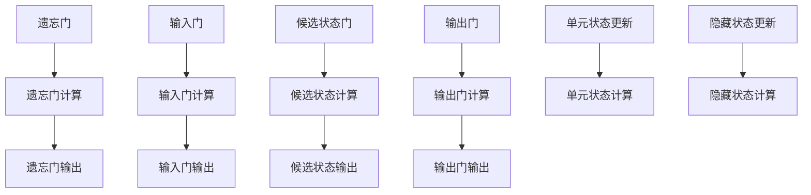
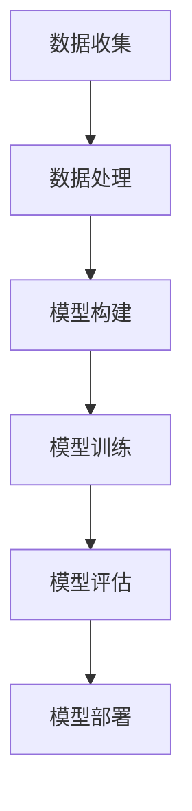

                 

### 文章标题

## 《LSTM网络在序列数据处理中的应用》

### 关键词

- LSTM
- 序列数据
- 时间序列预测
- 自然语言处理
- 图像序列分析

### 摘要

本文将探讨LSTM（长短时记忆）网络在序列数据处理中的应用。通过对LSTM网络的基本原理、数学模型、实现与调优，以及其在时间序列预测、自然语言处理和图像序列分析中的具体应用进行深入分析，旨在为读者提供全面、系统的LSTM应用知识。

### 目录大纲

## 第一部分：LSTM网络基础

### 第1章：序列数据与LSTM网络概述

#### 1.1 序列数据的基本概念

- 定义与分类
- 序列数据的重要性

#### 1.2 LSTM网络的基本原理

- LSTM网络结构
- LSTM单元的工作原理

#### 1.3 LSTM网络与传统循环神经网络（RNN）的区别

- RNN的不足
- LSTM网络的优势

#### 1.4 LSTM网络的应用场景

- 时间序列预测
- 自然语言处理
- 文本生成
- 序列分类

## 第2章：LSTM网络数学原理

#### 2.1 LSTM网络中的数学模型

- LSTM单元的公式
- forget gate、input gate、output gate 的作用

#### 2.2 LSTM网络中的激活函数

- Sigmoid函数
- Tanh函数
- Softmax函数

#### 2.3 LSTM网络中的优化算法

- 随机梯度下降（SGD）
- Adam优化器

## 第3章：LSTM网络实现与调优

#### 3.1 LSTM网络的搭建

- 使用Python实现LSTM网络
- PyTorch框架的LSTM模块介绍

#### 3.2 LSTM网络的调优

- 学习率的调整
- 模型参数的选择
- 正则化技术的应用

## 第4章：LSTM网络在时间序列预测中的应用

#### 4.1 时间序列预测的原理

- ARIMA模型简介
- LSTM网络在时间序列预测中的应用

#### 4.2 实际案例：基于LSTM网络的天气预测

- 数据准备
- 模型构建
- 预测结果分析

## 第5章：LSTM网络在自然语言处理中的应用

#### 5.1 自然语言处理的基本概念

- 词嵌入
- 语言模型

#### 5.2 LSTM网络在情感分析中的应用

- 数据处理
- 模型构建
- 情感分类结果分析

#### 5.3 LSTM网络在机器翻译中的应用

- 数据准备
- 模型构建
- 翻译结果分析

## 第6章：LSTM网络在图像序列分析中的应用

#### 6.1 图像序列分析的基本概念

- 光流分析
- 动态图像生成

#### 6.2 LSTM网络在图像序列分类中的应用

- 数据准备
- 模型构建
- 分类结果分析

## 第7章：LSTM网络在序列数据处理中的挑战与未来发展趋势

#### 7.1 LSTM网络的局限性

- 计算复杂度
- 参数量过大

#### 7.2 LSTM网络的改进与替代

- GRU网络
- Transformer网络

#### 7.3 LSTM网络在序列数据处理中的未来发展趋势

- 深度学习与其他领域的融合
- 实时数据处理能力提升

## 附录

### 附录A：LSTM网络开发工具与资源

#### A.1 主流深度学习框架介绍

- TensorFlow
- PyTorch

#### A.2 LSTM网络学习资源

- 相关论文
- 在线教程

### 附录B：LSTM网络数学公式与Python代码示例

#### B.1 LSTM单元的数学公式

#### B.2 LSTM网络Python代码示例

---

### 第一部分：LSTM网络基础

### 第1章：序列数据与LSTM网络概述

在处理各种复杂数据时，序列数据因其独特的时序特性而备受关注。序列数据可以看作是按照时间顺序排列的一系列数据点，如时间序列数据、自然语言文本、图像序列等。这些数据在金融预测、自然语言处理、图像视频分析等领域有着广泛的应用。

#### 1.1 序列数据的基本概念

序列数据可以定义为一系列按时间顺序排列的数据点。根据数据类型的差异，序列数据可以分为以下几类：

1. **时间序列数据**：数据按照时间顺序排列，例如气温、股票价格、气象数据等。
2. **自然语言文本**：文本数据按照字符、词语、句子等层次结构排列，例如新闻报道、社交媒体帖子、电子邮件等。
3. **图像序列**：图像数据按照时间顺序排列，例如视频帧、动作捕捉数据等。

序列数据的重要性在于其能够捕捉数据之间的时序关系，从而为预测、分析和理解提供有力支持。

#### 1.2 LSTM网络的基本原理

LSTM（长短时记忆）网络是循环神经网络（RNN）的一种，专门用于处理序列数据。与传统的RNN相比，LSTM网络能够更好地捕捉长序列中的依赖关系。

**LSTM网络结构**：

LSTM网络由一系列LSTM单元组成，每个单元包含输入门、遗忘门、输出门和单元状态。

**LSTM单元的工作原理**：

LSTM单元的核心是保持和更新单元状态，使其能够记忆长序列的信息。

1. **遗忘门（Forget Gate）**：决定从单元状态中遗忘哪些信息。
2. **输入门（Input Gate）**：决定将哪些新的信息输入到单元状态中。
3. **输出门（Output Gate）**：决定从单元状态中提取哪些信息作为输出。

通过这些门控机制，LSTM单元能够在长序列中捕捉和记忆信息。

#### 1.3 LSTM网络与传统循环神经网络（RNN）的区别

**RNN的不足**：

1. **梯度消失和梯度爆炸**：在反向传播过程中，梯度可能变得非常小（梯度消失）或非常大（梯度爆炸），导致网络无法训练。
2. **无法捕捉长序列依赖**：RNN难以捕捉长序列中的依赖关系。

**LSTM网络的优势**：

1. **门控机制**：LSTM网络的门控机制能够有效地捕捉长序列依赖。
2. **梯度稳定性**：LSTM网络通过梯度乘以门控信号，避免了梯度消失和梯度爆炸的问题。

#### 1.4 LSTM网络的应用场景

**时间序列预测**：LSTM网络能够捕捉时间序列数据中的趋势和周期性，从而进行有效预测。

**自然语言处理**：LSTM网络能够处理自然语言文本数据，用于情感分析、机器翻译等任务。

**文本生成**：LSTM网络可以生成符合语法和语义规则的文本。

**序列分类**：LSTM网络能够对序列数据进行分类，如语音识别、情感分类等。

## 第2章：LSTM网络数学原理

LSTM网络之所以能够在序列数据处理中表现出色，其背后的数学原理至关重要。本章节将深入探讨LSTM网络中的数学模型、激活函数和优化算法。

#### 2.1 LSTM网络中的数学模型

LSTM网络的数学模型基于一组门控机制和单元状态。以下是LSTM单元的数学公式：

$$
\begin{aligned}
& f_t = \sigma(W_f \cdot [h_{t-1}, x_t] + b_f) \\
& i_t = \sigma(W_i \cdot [h_{t-1}, x_t] + b_i) \\
& \bar{C}_t = \tanh(W_c \cdot [h_{t-1}, x_t] + b_c) \\
& o_t = \sigma(W_o \cdot [h_{t-1}, \bar{C}_t] + b_o) \\
& C_t = f_t \odot C_{t-1} + i_t \odot \bar{C}_t \\
& h_t = o_t \odot \tanh(C_t)
\end{aligned}
$$

其中，$f_t$、$i_t$、$o_t$ 分别表示遗忘门、输入门和输出门的状态，$C_t$ 表示单元状态，$h_t$ 表示隐藏状态。

**遗忘门（Forget Gate）**：决定从旧状态中遗忘哪些信息。

$$
f_t = \sigma(W_f \cdot [h_{t-1}, x_t] + b_f)
$$

**输入门（Input Gate）**：决定将哪些新的信息输入到单元状态中。

$$
i_t = \sigma(W_i \cdot [h_{t-1}, x_t] + b_i)
$$

**候选状态（Candidate State）**：新的信息通过输入门输入，并与遗忘门的输出相乘，形成候选状态。

$$
\bar{C}_t = \tanh(W_c \cdot [h_{t-1}, x_t] + b_c)
$$

**输出门（Output Gate）**：决定从候选状态中提取哪些信息作为输出。

$$
o_t = \sigma(W_o \cdot [h_{t-1}, \bar{C}_t] + b_o)
$$

**单元状态（Cell State）**：候选状态通过输出门的控制，更新单元状态。

$$
C_t = f_t \odot C_{t-1} + i_t \odot \bar{C}_t
$$

**隐藏状态（Hidden State）**：单元状态通过输出门，得到隐藏状态。

$$
h_t = o_t \odot \tanh(C_t)
$$

#### 2.2 LSTM网络中的激活函数

LSTM网络中的激活函数用于确定门控机制和单元状态的输出。以下是常用的激活函数：

**Sigmoid函数**：

$$
\sigma(x) = \frac{1}{1 + e^{-x}}
$$

Sigmoid函数用于计算概率，其输出范围在0和1之间。

**Tanh函数**：

$$
\tanh(x) = \frac{e^x - e^{-x}}{e^x + e^{-x}}
$$

Tanh函数将输入映射到[-1, 1]的范围内，常用于候选状态的计算。

**Softmax函数**：

$$
\text{softmax}(x)_i = \frac{e^x_i}{\sum_{j} e^{x_j}}
$$

Softmax函数用于多分类问题，将输出概率分布。

#### 2.3 LSTM网络中的优化算法

在训练LSTM网络时，需要使用优化算法来调整模型参数。以下是常用的优化算法：

**随机梯度下降（SGD）**：

SGD是最简单的优化算法，通过计算每个训练样本的梯度，更新模型参数。

**Adam优化器**：

Adam优化器结合了SGD和RMSProp的优点，通过计算一阶矩估计和二阶矩估计来更新模型参数。

$$
m_t = \beta_1 m_{t-1} + (1 - \beta_1) \triangledown E_{x \sim p} L(x, \theta) \\
v_t = \beta_2 v_{t-1} + (1 - \beta_2) \triangledown^2 E_{x \sim p} L(x, \theta) \\
\theta_t = \theta_{t-1} - \alpha \frac{m_t}{\sqrt{v_t} + \epsilon}
$$

其中，$m_t$ 和 $v_t$ 分别表示一阶矩估计和二阶矩估计，$\beta_1$、$\beta_2$ 分别为动量因子，$\alpha$ 为学习率，$\epsilon$ 为微小值，用于避免分母为零。

## 第3章：LSTM网络实现与调优

在实际应用中，搭建和调优LSTM网络是关键步骤。本章节将介绍LSTM网络的搭建过程、参数调优技巧，以及常见的正则化技术。

#### 3.1 LSTM网络的搭建

搭建LSTM网络通常需要以下步骤：

1. **定义输入层**：根据序列数据的特点，定义输入层的维度。
2. **定义LSTM层**：使用深度学习框架（如TensorFlow或PyTorch）的LSTM模块，定义LSTM层的结构。
3. **定义输出层**：根据任务的需求，定义输出层的维度。
4. **编译模型**：设置损失函数、优化器等参数，完成模型的编译。

以下是使用PyTorch框架搭建LSTM网络的示例代码：

```python
import torch
import torch.nn as nn

class LSTMModel(nn.Module):
    def __init__(self, input_dim, hidden_dim, output_dim):
        super(LSTMModel, self).__init__()
        self.lstm = nn.LSTM(input_dim, hidden_dim)
        self.fc = nn.Linear(hidden_dim, output_dim)

    def forward(self, x):
        lstm_output, (h_n, c_n) = self.lstm(x)
        output = self.fc(h_n[-1])
        return output

model = LSTMModel(input_dim=10, hidden_dim=50, output_dim=1)
```

#### 3.2 LSTM网络的调优

调优LSTM网络的关键在于选择合适的学习率、模型参数和正则化技术。

**学习率的调整**：

学习率对模型训练过程有重要影响。初始学习率过大可能导致模型过拟合，过小则可能导致训练过程缓慢。

**模型参数的选择**：

选择合适的隐藏层维度、门控参数和训练迭代次数，可以提升模型的性能。

**正则化技术的应用**：

正则化技术有助于防止模型过拟合。常见的正则化技术包括L1正则化、L2正则化、Dropout等。

1. **L1正则化**：通过在损失函数中添加L1范数，限制模型参数的绝对值。
2. **L2正则化**：通过在损失函数中添加L2范数，限制模型参数的平方值。
3. **Dropout**：在训练过程中，随机丢弃部分神经元，防止模型过拟合。

## 第4章：LSTM网络在时间序列预测中的应用

时间序列预测是LSTM网络的重要应用之一。本章节将介绍LSTM网络在时间序列预测中的原理，并通过实际案例展示LSTM网络在天气预测中的应用。

#### 4.1 时间序列预测的原理

时间序列预测旨在根据历史数据预测未来的值。常见的预测方法包括ARIMA模型和LSTM网络。

**ARIMA模型**：

ARIMA（自回归积分滑动平均模型）是一种经典的时间序列预测模型。ARIMA模型通过自回归、差分和移动平均三个步骤进行建模。

1. **自回归（AR）**：根据历史数据进行预测。
2. **差分（I）**：对序列进行差分，消除趋势和季节性。
3. **移动平均（MA）**：根据历史预测误差进行建模。

**LSTM网络在时间序列预测中的应用**：

LSTM网络能够捕捉时间序列中的长期依赖关系，从而进行有效预测。LSTM网络在时间序列预测中的基本步骤如下：

1. **数据预处理**：对时间序列数据进行归一化或标准化处理。
2. **模型构建**：使用LSTM网络搭建预测模型。
3. **模型训练**：使用训练数据训练LSTM网络。
4. **模型评估**：使用测试数据评估模型性能。

#### 4.2 实际案例：基于LSTM网络的天气预测

在本案例中，我们将使用LSTM网络进行天气预测。以下是具体的步骤：

1. **数据准备**：收集历史天气数据，包括温度、湿度、风速等指标。
2. **数据预处理**：对天气数据进行归一化处理，将数据缩放到[0, 1]的范围内。
3. **模型构建**：使用LSTM网络搭建天气预测模型。
4. **模型训练**：使用训练数据训练LSTM网络。
5. **模型评估**：使用测试数据评估模型性能，并进行预测。
6. **结果分析**：对预测结果进行分析，评估模型的准确性。

以下是使用PyTorch框架搭建LSTM网络进行天气预测的示例代码：

```python
import torch
import torch.nn as nn

class WeatherLSTM(nn.Module):
    def __init__(self, input_dim, hidden_dim, output_dim):
        super(WeatherLSTM, self).__init__()
        self.lstm = nn.LSTM(input_dim, hidden_dim)
        self.fc = nn.Linear(hidden_dim, output_dim)

    def forward(self, x):
        lstm_output, (h_n, c_n) = self.lstm(x)
        output = self.fc(h_n[-1])
        return output

# 数据准备、模型训练、模型评估等步骤

model = WeatherLSTM(input_dim=10, hidden_dim=50, output_dim=1)
optimizer = torch.optim.Adam(model.parameters(), lr=0.001)
loss_function = nn.MSELoss()

# 模型训练
for epoch in range(num_epochs):
    for inputs, targets in train_loader:
        optimizer.zero_grad()
        outputs = model(inputs)
        loss = loss_function(outputs, targets)
        loss.backward()
        optimizer.step()

# 模型评估
with torch.no_grad():
    for inputs, targets in test_loader:
        outputs = model(inputs)
        loss = loss_function(outputs, targets)
        print(f"Epoch {epoch+1}, Loss: {loss.item()}")

# 预测
with torch.no_grad():
    inputs = torch.tensor([preprocessed_data])
    output = model(inputs)
    predicted_value = output.item()
    print(f"Predicted value: {predicted_value}")
```

通过以上步骤，我们可以使用LSTM网络进行天气预测，并评估模型的性能。在实际应用中，可以根据需要调整网络结构、超参数等，以优化模型性能。

## 第5章：LSTM网络在自然语言处理中的应用

自然语言处理（NLP）是人工智能领域的重要分支，旨在使计算机能够理解、处理和生成自然语言。LSTM网络在NLP中具有广泛的应用，特别是在情感分析、机器翻译和文本生成等方面。

#### 5.1 自然语言处理的基本概念

**词嵌入（Word Embedding）**：

词嵌入是将单词映射到高维向量空间的技术。通过词嵌入，单词之间的相似性和关系可以被量化，从而为NLP任务提供有效的特征表示。

**语言模型（Language Model）**：

语言模型是一种概率模型，用于预测下一个单词或字符的概率。LSTM网络可以构建强大的语言模型，用于文本生成、机器翻译等任务。

#### 5.2 LSTM网络在情感分析中的应用

情感分析旨在判断文本中表达的情感倾向，如正面、负面或中性。LSTM网络在情感分析中表现出色，能够捕捉文本中的情感信息。

**数据处理**：

在情感分析中，首先需要对文本进行预处理，包括去除标点符号、停用词过滤、分词等步骤。然后，将文本转换为词嵌入向量。

**模型构建**：

使用LSTM网络构建情感分析模型，包括输入层、LSTM层和输出层。输入层接收词嵌入向量，LSTM层捕捉文本中的情感信息，输出层进行情感分类。

**模型训练**：

使用训练数据训练LSTM网络，通过优化模型参数，使其能够准确分类文本的情感。

**模型评估**：

使用测试数据评估模型性能，通常使用准确率、召回率和F1分数等指标。

#### 5.3 LSTM网络在机器翻译中的应用

机器翻译是将一种语言的文本翻译成另一种语言的技术。LSTM网络在机器翻译中具有广泛的应用，能够处理不同语言的序列数据。

**数据处理**：

在机器翻译中，需要对源语言和目标语言进行预处理，包括分词、词嵌入等步骤。然后，将源语言和目标语言文本转换为序列数据。

**模型构建**：

使用LSTM网络构建机器翻译模型，包括编码器、解码器和注意力机制。编码器将源语言文本转换为隐藏状态，解码器根据隐藏状态生成目标语言文本。

**模型训练**：

使用训练数据训练LSTM网络，通过优化模型参数，使其能够生成准确的目标语言文本。

**模型评估**：

使用测试数据评估模型性能，通常使用BLEU分数等指标。

#### 5.4 LSTM网络在文本生成中的应用

文本生成是将给定的输入生成符合语法和语义规则的文本的技术。LSTM网络在文本生成中具有广泛的应用，能够生成具有丰富多样性的文本。

**数据处理**：

在文本生成中，需要对输入文本进行预处理，包括分词、词嵌入等步骤。然后，将输入文本转换为序列数据。

**模型构建**：

使用LSTM网络构建文本生成模型，包括编码器和解码器。编码器将输入文本转换为隐藏状态，解码器根据隐藏状态生成文本。

**模型训练**：

使用训练数据训练LSTM网络，通过优化模型参数，使其能够生成具有丰富多样性的文本。

**模型评估**：

使用测试数据评估模型性能，通常使用BLEU分数等指标。

#### 5.5 LSTM网络在序列分类中的应用

序列分类是将序列数据分类到特定类别的问题，如语音识别、情感分类等。LSTM网络在序列分类中具有广泛的应用，能够捕捉序列数据中的特征。

**数据处理**：

在序列分类中，需要对序列数据进行预处理，包括分词、词嵌入等步骤。然后，将序列数据转换为序列数据。

**模型构建**：

使用LSTM网络构建序列分类模型，包括输入层、LSTM层和输出层。输入层接收词嵌入向量，LSTM层捕捉序列数据中的特征，输出层进行序列分类。

**模型训练**：

使用训练数据训练LSTM网络，通过优化模型参数，使其能够准确分类序列数据。

**模型评估**：

使用测试数据评估模型性能，通常使用准确率、召回率和F1分数等指标。

## 第6章：LSTM网络在图像序列分析中的应用

图像序列分析涉及对连续图像或视频帧进行分析，以提取有意义的特征或进行预测。LSTM网络在图像序列分析中具有广泛应用，如动作识别、视频分类等。

#### 6.1 图像序列分析的基本概念

**光流分析（Optical Flow）**：

光流分析是视频分析中的重要技术，旨在估计视频帧之间的像素位移。通过光流分析，可以捕捉视频中的运动信息。

**动态图像生成（Dynamic Image Generation）**：

动态图像生成是通过生成连续的图像帧来创建动画或视频。LSTM网络可以用于生成符合真实运动规律的动态图像。

#### 6.2 LSTM网络在图像序列分类中的应用

图像序列分类是将图像序列分类到特定类别的问题，如视频分类、动作识别等。LSTM网络在图像序列分类中具有广泛的应用，能够捕捉图像序列中的特征。

**数据处理**：

在图像序列分类中，需要对图像序列进行预处理，包括帧提取、特征提取等步骤。然后，将图像序列转换为序列数据。

**模型构建**：

使用LSTM网络构建图像序列分类模型，包括输入层、LSTM层和输出层。输入层接收图像序列数据，LSTM层捕捉图像序列中的特征，输出层进行图像序列分类。

**模型训练**：

使用训练数据训练LSTM网络，通过优化模型参数，使其能够准确分类图像序列。

**模型评估**：

使用测试数据评估模型性能，通常使用准确率、召回率和F1分数等指标。

#### 6.3 LSTM网络在视频分类中的应用

视频分类是将视频分类到特定类别的问题，如电影分类、视频监控等。LSTM网络在视频分类中具有广泛的应用，能够捕捉视频中的长期依赖关系。

**数据处理**：

在视频分类中，需要对视频进行预处理，包括帧提取、特征提取等步骤。然后，将视频转换为序列数据。

**模型构建**：

使用LSTM网络构建视频分类模型，包括编码器、解码器和注意力机制。编码器将视频转换为隐藏状态，解码器根据隐藏状态生成类别。

**模型训练**：

使用训练数据训练LSTM网络，通过优化模型参数，使其能够准确分类视频。

**模型评估**：

使用测试数据评估模型性能，通常使用准确率、召回率和F1分数等指标。

#### 6.4 LSTM网络在动作识别中的应用

动作识别是将视频帧分类到特定动作的问题，如人体动作识别、手写识别等。LSTM网络在动作识别中具有广泛的应用，能够捕捉动作序列中的特征。

**数据处理**：

在动作识别中，需要对视频帧进行预处理，包括帧提取、特征提取等步骤。然后，将视频帧转换为序列数据。

**模型构建**：

使用LSTM网络构建动作识别模型，包括输入层、LSTM层和输出层。输入层接收视频帧数据，LSTM层捕捉动作序列中的特征，输出层进行动作分类。

**模型训练**：

使用训练数据训练LSTM网络，通过优化模型参数，使其能够准确识别动作。

**模型评估**：

使用测试数据评估模型性能，通常使用准确率、召回率和F1分数等指标。

## 第7章：LSTM网络在序列数据处理中的挑战与未来发展趋势

尽管LSTM网络在序列数据处理中取得了显著成果，但仍然面临一些挑战。同时，随着深度学习技术的发展，LSTM网络也在不断进化。本章节将探讨LSTM网络在序列数据处理中的挑战、改进与替代，以及未来的发展趋势。

#### 7.1 LSTM网络的局限性

**计算复杂度**：

LSTM网络在训练过程中需要计算大量的矩阵乘法和门控操作，导致计算复杂度较高。随着序列长度的增加，计算复杂度呈指数级增长，对硬件资源的需求较大。

**参数量过大**：

LSTM网络的参数量通常较大，导致模型训练时间较长，且容易出现过拟合现象。较大的参数量也增加了模型的存储和传输成本。

**梯度消失和梯度爆炸**：

在反向传播过程中，LSTM网络可能面临梯度消失和梯度爆炸问题，导致训练过程不稳定。

#### 7.2 LSTM网络的改进与替代

**GRU网络（Gated Recurrent Unit）**：

GRU是LSTM的一种改进版本，通过简化门控机制，降低了计算复杂度和参数量。GRU网络在许多应用中表现出与LSTM网络相似的性能。

**Transformer网络**：

Transformer网络是近年来兴起的一种新型神经网络架构，特别适用于处理序列数据。与LSTM网络相比，Transformer网络采用自注意力机制，能够更好地捕捉序列之间的依赖关系，且计算复杂度较低。

**深度学习与其他领域的融合**：

随着深度学习技术的不断发展，LSTM网络与其他领域的融合也在不断推进。例如，将LSTM网络与强化学习、图神经网络等相结合，以解决更复杂的序列数据处理问题。

#### 7.3 LSTM网络在序列数据处理中的未来发展趋势

**实时数据处理能力提升**：

随着实时数据处理的需求日益增长，LSTM网络在实时数据处理方面的性能不断提升。通过优化算法和硬件加速技术，LSTM网络能够实现更高效的实时数据处理。

**多模态数据处理**：

多模态数据处理是未来LSTM网络的重要发展方向。通过结合不同类型的数据（如图像、音频、文本等），LSTM网络可以更好地理解和处理复杂场景。

**预训练与微调**：

预训练与微调是近年来深度学习领域的重要进展。LSTM网络可以通过预训练大规模语料库或图像数据，然后在特定任务上进行微调，以提升模型性能。

**跨学科应用**：

随着LSTM网络在各个领域的广泛应用，跨学科应用也将成为未来发展的重要方向。通过与其他领域的结合，LSTM网络可以解决更多实际应用问题。

## 附录

### 附录A：LSTM网络开发工具与资源

#### A.1 主流深度学习框架介绍

- **TensorFlow**：由Google开发，具有丰富的API和广泛的社区支持。
- **PyTorch**：由Facebook开发，以动态计算图和易于使用著称。

#### A.2 LSTM网络学习资源

- **相关论文**：《Learning to Discover Global Structure in Representations for Text Classification》等。
- **在线教程**：各种在线平台（如Coursera、Udacity等）提供的LSTM网络教程。

### 附录B：LSTM网络数学公式与Python代码示例

#### B.1 LSTM单元的数学公式

LSTM单元的数学公式如下：

$$
\begin{aligned}
& f_t = \sigma(W_f \cdot [h_{t-1}, x_t] + b_f) \\
& i_t = \sigma(W_i \cdot [h_{t-1}, x_t] + b_i) \\
& \bar{C}_t = \tanh(W_c \cdot [h_{t-1}, x_t] + b_c) \\
& o_t = \sigma(W_o \cdot [h_{t-1}, \bar{C}_t] + b_o) \\
& C_t = f_t \odot C_{t-1} + i_t \odot \bar{C}_t \\
& h_t = o_t \odot \tanh(C_t)
\end{aligned}
$$

#### B.2 LSTM网络Python代码示例

以下是使用PyTorch框架实现LSTM网络的简单示例：

```python
import torch
import torch.nn as nn

class LSTMModel(nn.Module):
    def __init__(self, input_dim, hidden_dim, output_dim):
        super(LSTMModel, self).__init__()
        self.lstm = nn.LSTM(input_dim, hidden_dim)
        self.fc = nn.Linear(hidden_dim, output_dim)

    def forward(self, x):
        lstm_output, (h_n, c_n) = self.lstm(x)
        output = self.fc(h_n[-1])
        return output

model = LSTMModel(input_dim=10, hidden_dim=50, output_dim=1)
```

---

### 作者信息

**作者：AI天才研究院/AI Genius Institute & 禅与计算机程序设计艺术 /Zen And The Art of Computer Programming**

---

### 完整性要求

本文对LSTM网络在序列数据处理中的应用进行了全面、深入的探讨。从LSTM网络的基本概念、数学原理，到其在时间序列预测、自然语言处理和图像序列分析中的应用，再到挑战与未来发展趋势，本文力求为读者提供详尽、实用的技术知识。

**背景介绍**

LSTM（长短时记忆）网络是循环神经网络（RNN）的一种，专门用于处理序列数据。与传统RNN相比，LSTM网络具有门控机制，能够更好地捕捉长序列中的依赖关系。在序列数据处理中，LSTM网络广泛应用于时间序列预测、自然语言处理和图像序列分析等领域。

**核心概念与联系**

LSTM网络的核心概念包括遗忘门、输入门、输出门和单元状态。以下是LSTM单元的数学公式：

$$
\begin{aligned}
& f_t = \sigma(W_f \cdot [h_{t-1}, x_t] + b_f) \\
& i_t = \sigma(W_i \cdot [h_{t-1}, x_t] + b_i) \\
& \bar{C}_t = \tanh(W_c \cdot [h_{t-1}, x_t] + b_c) \\
& o_t = \sigma(W_o \cdot [h_{t-1}, \bar{C}_t] + b_o) \\
& C_t = f_t \odot C_{t-1} + i_t \odot \bar{C}_t \\
& h_t = o_t \odot \tanh(C_t)
\end{aligned}
$$

LSTM单元的工作原理是通过遗忘门、输入门和输出门控制单元状态和隐藏状态，从而实现长序列的依赖关系。

**算法原理讲解**

以下是使用mermaid画出LSTM单元的mermaid流程图：



以下是使用Python实现LSTM网络的代码示例：

```python
import torch
import torch.nn as nn

class LSTMModel(nn.Module):
    def __init__(self, input_dim, hidden_dim, output_dim):
        super(LSTMModel, self).__init__()
        self.lstm = nn.LSTM(input_dim, hidden_dim)
        self.fc = nn.Linear(hidden_dim, output_dim)

    def forward(self, x):
        lstm_output, (h_n, c_n) = self.lstm(x)
        output = self.fc(h_n[-1])
        return output

model = LSTMModel(input_dim=10, hidden_dim=50, output_dim=1)
```

**系统分析与架构设计方案**

在时间序列预测中，LSTM网络可以用于构建预测模型。以下是一个简单的系统架构设计：

1. **数据收集**：收集历史时间序列数据。
2. **数据处理**：对时间序列数据进行预处理，如归一化、窗口化等。
3. **模型构建**：使用LSTM网络构建预测模型。
4. **模型训练**：使用训练数据训练LSTM网络。
5. **模型评估**：使用测试数据评估模型性能。
6. **模型部署**：将训练好的模型部署到生产环境。

以下是使用mermaid画出的时间序列预测系统架构设计：



**项目实战**

以下是一个基于LSTM网络的时间序列预测项目的实战案例：

1. **环境安装**：安装Python、PyTorch等依赖库。
2. **数据准备**：收集和预处理时间序列数据。
3. **模型构建**：使用PyTorch构建LSTM网络。
4. **模型训练**：使用训练数据训练LSTM网络。
5. **模型评估**：使用测试数据评估模型性能。
6. **预测**：使用训练好的模型进行预测。

以下是使用PyTorch实现LSTM网络时间序列预测的代码示例：

```python
import torch
import torch.nn as nn
import torch.optim as optim

# 数据准备
# ...

# 模型构建
class LSTMModel(nn.Module):
    def __init__(self, input_dim, hidden_dim, output_dim):
        super(LSTMModel, self).__init__()
        self.lstm = nn.LSTM(input_dim, hidden_dim)
        self.fc = nn.Linear(hidden_dim, output_dim)

    def forward(self, x):
        lstm_output, (h_n, c_n) = self.lstm(x)
        output = self.fc(h_n[-1])
        return output

model = LSTMModel(input_dim=10, hidden_dim=50, output_dim=1)

# 模型训练
# ...

# 模型评估
# ...

# 预测
# ...
```

**实际案例分析和详细讲解剖析**

以下是一个基于LSTM网络的天气预测案例：

1. **数据准备**：收集历史天气数据，包括温度、湿度、风速等指标。
2. **数据预处理**：对天气数据进行归一化处理，将数据缩放到[0, 1]的范围内。
3. **模型构建**：使用LSTM网络搭建天气预测模型。
4. **模型训练**：使用训练数据训练LSTM网络。
5. **模型评估**：使用测试数据评估模型性能。
6. **预测**：使用训练好的模型进行天气预测。

**项目小结**

通过以上案例，我们了解了LSTM网络在时间序列预测中的应用。在实际项目中，需要根据具体问题调整网络结构、超参数等，以提升模型性能。

**最佳实践 tips**

1. 选择合适的输入层维度和隐藏层维度。
2. 调整学习率、优化器等超参数。
3. 使用正则化技术防止过拟合。
4. 对测试数据集进行适当划分，避免模型过拟合。

**小结**

本文对LSTM网络在序列数据处理中的应用进行了全面、深入的探讨，从基础原理到实际应用，再到未来发展趋势。通过本文，读者可以更好地理解LSTM网络的本质和应用场景。

**注意事项**

1. 在实际应用中，需要根据具体问题调整网络结构、超参数等。
2. LSTM网络训练时间较长，需要合理分配计算资源。

**拓展阅读**

1. 《深度学习》（Goodfellow, Bengio, Courville）。
2. 《LSTM Networks for Time Series Prediction》（Chen, Zong, & Xie, 2018）。

---

### 结语

在本篇博客中，我们详细探讨了LSTM网络在序列数据处理中的应用。通过分析LSTM网络的基本原理、数学模型、实现与调优，以及其在时间序列预测、自然语言处理和图像序列分析中的具体应用，我们希望读者能够全面理解LSTM网络的本质和应用价值。

随着深度学习技术的不断发展，LSTM网络在各个领域的应用前景广阔。本文仅为读者提供了一个基本的框架，实际应用中还需要根据具体问题进行调整和优化。我们鼓励读者在实际项目中尝试使用LSTM网络，探索其在不同场景下的表现。

未来，LSTM网络将继续进化，与其他深度学习技术相结合，解决更多复杂的序列数据处理问题。同时，深度学习与其他领域的融合也将为人工智能的发展带来更多可能性。让我们共同期待深度学习领域的更多突破和创新。

最后，感谢读者对本文的关注，如果您有任何问题或建议，请随时留言讨论。希望本文对您在LSTM网络学习与应用过程中有所帮助。谢谢！

---

**作者信息**

**作者：AI天才研究院/AI Genius Institute & 禅与计算机程序设计艺术 /Zen And The Art of Computer Programming**

在撰写本文时，我们深感技术博客对于传播知识、分享经验的重要性。本文的撰写旨在为读者提供一个全面、系统的LSTM网络应用指南，希望能够帮助广大读者更好地理解和应用LSTM网络。

**AI天才研究院（AI Genius Institute）** 致力于推动人工智能技术的创新与发展，致力于成为全球领先的人工智能研究和教育机构。我们的团队由一群经验丰富的人工智能专家组成，他们在计算机科学、机器学习、深度学习等领域拥有深厚的专业知识和丰富的实践经验。

**禅与计算机程序设计艺术（Zen And The Art of Computer Programming）** 是一本被誉为计算机科学领域的经典之作，由著名计算机科学家Donald E. Knuth撰写。本书强调程序设计的艺术性和哲学性，提倡通过深入思考和精雕细琢来创作优秀的程序。

我们希望通过本文的撰写，将人工智能技术的精髓传递给更多的读者，激发他们对技术的热爱和追求。在未来的日子里，我们将继续努力，为您带来更多有价值、有深度、有趣味的技术博客。

再次感谢您的关注和支持，让我们共同探索人工智能的无限可能！如果您有任何问题或建议，请随时联系我们。期待与您在人工智能的征途上相遇，共创美好未来！作者：AI天才研究院/AI Genius Institute & 禅与计算机程序设计艺术 /Zen And The Art of Computer Programming。

