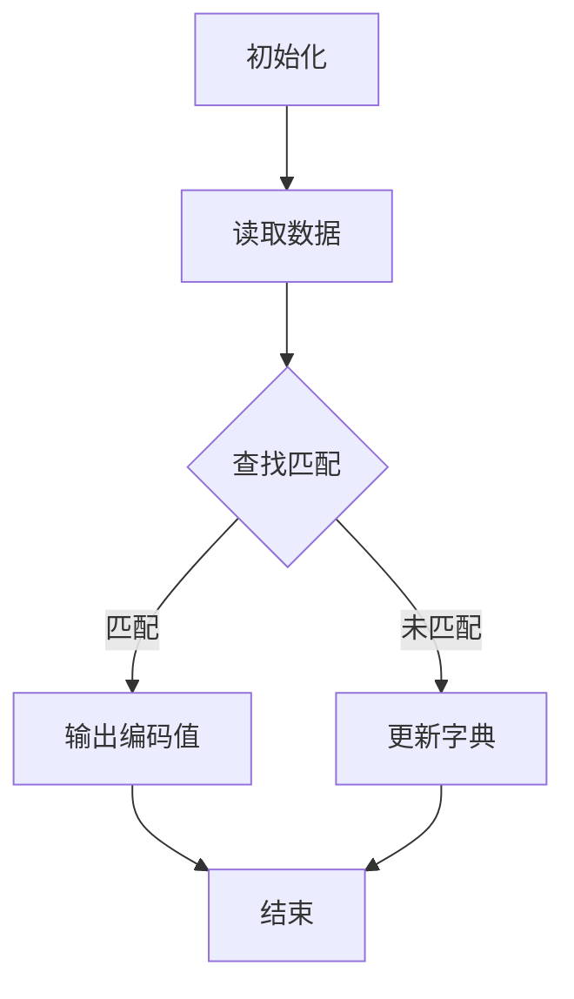
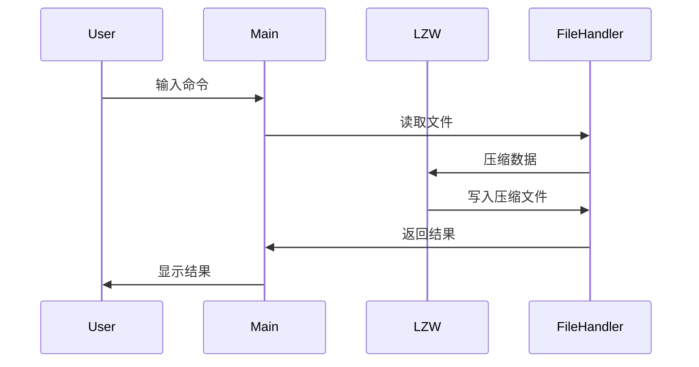
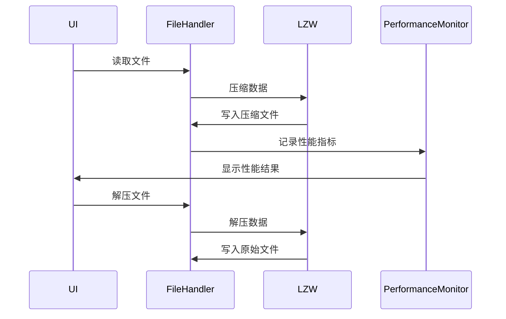

                 

### 1.1 LZW算法的历史与发展

LZW（Lempel-Ziv-Welch）算法是由Abraham Lempel、Jacob Ziv和Terry Welch于1977年提出的一种著名的数据压缩算法。这种算法的出现标志着信息压缩领域的重大突破，特别是在无损数据压缩方面，具有广泛的适用性和高效性。

#### LZW算法的起源

LZW算法的起源可以追溯到1970年代中期，当时数字存储设备和传输媒介的存储和带宽有限，需要一种有效的数据压缩技术来节省空间和提高传输效率。在此背景下，Lempel和Ziv两位学者在1976年提出了LZ77算法，该算法通过查找数据中的重复序列来压缩数据。在此基础上，Welch对LZ77算法进行了改进，提出了LZW算法。

#### LZW算法的发展历程

自从LZW算法提出以来，它经历了多个版本和改进。以下是其发展历程的简要概述：

- **1977年**：LZW算法首次被提出，并应用于UNIX操作系统中的`compress`命令。
- **1984年**：LZW算法被广泛应用于苹果公司的Macintosh操作系统，并成为了图形文件格式PNG的基础。
- **1985年**：LZW算法被用于压缩ZIP文件格式，成为ZIP文件压缩的核心算法。
- **至今**：LZW算法在图像、文本、音频等多种数据类型的压缩中仍被广泛使用，并且仍然是许多数据压缩库和软件的核心组成部分。

#### LZW算法的广泛应用

LZW算法由于其高效性和通用性，被广泛应用于多个领域：

- **图像处理**：在JPEG和PNG等图像文件格式中，LZW算法用于对图像数据进行压缩。
- **文件压缩**：在ZIP文件格式中，LZW算法被用于压缩文件内容，从而减小文件大小，便于存储和传输。
- **文本压缩**：在许多文本文件格式中，LZW算法用于压缩文本数据，节省存储空间。

LZW算法的这些应用不仅提高了数据存储和传输的效率，也推动了计算机技术的发展。

### 1.2 无损数据压缩的重要性

#### 数据存储与传输的需求

在数字时代，数据量的激增对数据存储和传输提出了更高的要求。随着互联网、大数据和云计算的普及，如何高效地存储和传输大量数据成为了一个关键问题。数据压缩技术，特别是无损数据压缩，成为了解决这一问题的有效手段。

#### 压缩技术在现代信息社会的作用

数据压缩技术对于现代信息社会具有多方面的作用：

- **节省存储空间**：通过压缩数据，可以显著减少存储设备的占用空间，降低成本。
- **提高传输效率**：压缩后的数据体积更小，可以更快地传输，提高网络带宽的利用率。
- **提高数据处理速度**：压缩后的数据更易于处理，可以加快应用程序的执行速度。

#### 无损数据压缩的优势

无损数据压缩在保持数据完整性的同时，实现了显著的数据体积减小。其优势包括：

- **数据不丢失**：无损压缩不会丢失任何数据，保证了数据的完整性和准确性。
- **可逆性**：压缩后的数据可以完全还原到原始数据，不会产生任何误差。
- **广泛的适用性**：无损压缩适用于各种类型的数据，如文本、图像、音频等。

综上所述，无损数据压缩在数据存储、传输和处理方面具有不可替代的重要作用，是现代信息社会不可或缺的技术手段。

### 1.3 数据压缩的基本概念

#### 压缩与解压缩

数据压缩是指将原始数据通过某种算法转换成更小的数据形式，以减少存储空间和传输时间。而数据解压缩则是指将压缩后的数据恢复到原始状态，以供后续使用。

压缩与解压缩的过程可以分为以下几个步骤：

1. **选择压缩算法**：根据数据的类型和需求选择合适的压缩算法。
2. **压缩**：将原始数据通过压缩算法转换成压缩数据。
3. **存储或传输**：将压缩数据存储到文件或通过网络传输。
4. **解压缩**：在需要使用原始数据时，通过解压缩算法将压缩数据恢复为原始数据。

#### 压缩算法的分类

根据压缩原理和目的，压缩算法主要分为以下几类：

1. **无损压缩**：压缩过程中不丢失任何信息，压缩后的数据可以完全恢复到原始数据。这种压缩方法适用于文本、图片、音频等数据。
2. **有损压缩**：压缩过程中会丢失一部分信息，但压缩效果更好。这种压缩方法适用于音频、视频等数据，因为人类对这些数据的感知有限，可以容忍一定的失真。
3. **熵编码**：基于信息熵原理进行压缩，通过减少冗余信息来压缩数据。常见的熵编码算法有霍夫曼编码、算术编码等。
4. **变换编码**：通过将数据转换为不同的表示形式进行压缩，如傅里叶变换、小波变换等。

#### 压缩效率的衡量

压缩效率是衡量压缩算法优劣的重要指标，通常用压缩比（Compression Ratio）和压缩率（Compression Rate）来表示。

1. **压缩比**：原始数据大小与压缩后数据大小的比值。压缩比越高，表示压缩效果越好。
   $$ 压缩比 = \frac{\text{原始数据大小}}{\text{压缩后数据大小}} $$
2. **压缩率**：压缩时间与压缩后数据大小的比值。压缩率越低，表示压缩速度越快。
   $$ 压缩率 = \frac{\text{压缩时间}}{\text{压缩后数据大小}} $$

#### 压缩算法的比较

不同的压缩算法适用于不同的数据类型和场景。以下是比较常见的几种压缩算法：

1. **LZW算法**：适用于文本、图像和音频数据，具有良好的压缩效果和可扩展性。
2. **PNG压缩**：专门用于图像数据压缩，支持无损压缩和有损压缩。
3. **JPEG压缩**：适用于图像数据压缩，支持有损压缩，压缩效果好但会有一定失真。
4. **MP3压缩**：适用于音频数据压缩，支持有损压缩，压缩效果好但音质会有所降低。

### 1.4 LZW算法的适用场景

LZW算法由于其高效性和灵活性，适用于多种数据类型的压缩：

#### 图像数据压缩

LZW算法在图像数据压缩中具有广泛的应用，特别是在PNG文件格式中。PNG格式支持无损压缩，通过LZW算法可以将图像数据压缩到较小的大小，同时保持图像质量。

#### 文本数据压缩

文本数据通常包含大量重复的字符和短语，这使得LZW算法在文本数据压缩中表现出色。常见的文本压缩工具如`gzip`和`bzip2`都采用了LZW算法或其变体。

#### 音频数据压缩

虽然LZW算法在音频数据压缩中的应用不如MP3等有损压缩算法广泛，但在某些情况下，它也可以用于无损音频压缩。

总之，LZW算法因其良好的压缩效果和广泛的适用性，在各种数据类型的压缩中都有着重要的应用。

## 第2章：LZW算法的原理与结构

### 2.1 字典构建原理

LZW算法的字典构建是整个压缩过程的基础。字典构建的目的是将输入的数据序列映射到一组唯一的编码值，以便后续的编码和压缩。

#### 字典构建的基本概念

- **字典**：在LZW算法中，字典是一个包含所有可能的数据序列的表，每个序列对应一个唯一的编码值。
- **编码值**：编码值是一个整数，用于表示输入的数据序列。编码值在字典中具有唯一性，确保数据序列的准确映射。

#### 字典构建的过程

字典构建的过程可以分为以下几个步骤：

1. **初始化**：初始时，字典只包含单个字符，每个字符对应一个编码值。
   ```mermaid
   graph TD
   A[初始化] --> B[单个字符];
   B --> C[字典];
   ```

2. **添加新序列**：随着输入数据的流入，算法会不断添加新的数据序列到字典中。每个新序列都是前一个序列的扩展，即添加一个新的字符。
   ```mermaid
   graph TD
   A[初始化] --> B[单个字符];
   B --> C[字典];
   C --> D[扩展序列];
   ```

3. **更新字典**：在添加新序列后，需要更新字典，将新序列及其对应的编码值添加到字典中。
   ```mermaid
   graph TD
   A[初始化] --> B[单个字符];
   B --> C[字典];
   C --> D[扩展序列];
   D --> E[更新字典];
   ```

#### 字典构建的优化策略

为了提高字典构建的效率，可以采取以下几种优化策略：

1. **动态字典**：根据输入数据的特点动态调整字典的大小，避免占用过多内存。
2. **预定义字典**：在某些应用场景中，可以预定义一个适合特定数据类型的字典，从而提高压缩效率。
3. **并行构建**：利用多线程或多处理器技术，并行构建字典，提高构建速度。

### 2.2 编码与解码过程

LZW算法的编码与解码过程是数据压缩与恢复的关键步骤。通过编码过程，原始数据被转换为压缩数据；通过解码过程，压缩数据又被还原为原始数据。

#### 编码过程

编码过程可以分为以下几个步骤：

1. **初始化**：在编码开始时，初始化编码器，包括设置初始字典和编码值。
2. **读取数据**：从输入数据中读取下一个数据序列。
3. **查找字典**：在字典中查找最长的匹配序列。如果找到匹配序列，则将其编码为相应的编码值，并将匹配序列的下一个字符作为新的查找起点。
4. **更新字典**：将新的匹配序列添加到字典中，确保字典的完备性。
5. **输出编码值**：将编码值输出到压缩数据流中。

以下是一个简化的编码过程示例：
```python
# 初始化字典
dict = {chr(i): i for i in range(256)}

# 初始化编码器
current = ""
output = []

# 读取输入数据
input_data = "TOBEORNOTTOBEORTOBEORNOT"

# 编码过程
while current in dict:
    next_char = input_data[0]
    input_data = input_data[1:]
    if next_char + current in dict:
        current += next_char
    else:
        output.append(dict[current])
        dict[current + next_char] = len(dict) + 1
        current = next_char

output.append(dict[current])
output.extend([len(dict) + 1] * len(input_data))
```

#### 解码过程

解码过程与编码过程类似，但方向相反。解码过程可以分为以下几个步骤：

1. **初始化**：在解码开始时，初始化解码器，包括设置初始字典和编码值。
2. **读取编码值**：从压缩数据流中读取下一个编码值。
3. **查找字典**：在字典中查找对应的编码值，找到最长的匹配序列。
4. **输出数据**：将匹配序列的字符输出到原始数据流中，并将匹配序列的下一个字符作为新的查找起点。
5. **更新字典**：如果解码过程中遇到新的编码值，将其添加到字典中。

以下是一个简化的解码过程示例：
```python
# 初始化字典
dict = {i: chr(i) for i in range(256)}
dict[len(dict)] = ""

# 初始化解码器
output = ""
next_code = len(dict)
current_code = -1

# 读取编码值
compressed_data = [3, 4, 5, 5, 15, 6, 1, 2, 14, 28, 29, 30, 31, 32, 99]

# 解码过程
while next_code <= len(compressed_data):
    output += dict[current_code] * compressed_data[next_code]
    next_code += 1
    current_code = compressed_data[next_code]

print(output)  # 输出: TOBEORNOTTOBEORTOBEORNOT
```

通过以上步骤，LZW算法实现了高效的数据压缩和恢复，为各种数据类型的压缩提供了强有力的工具。

### 2.3 LZW算法的优缺点分析

LZW算法作为一种广泛使用的数据压缩算法，具有许多优点，但同时也存在一些缺点。以下是对LZW算法优缺点的详细分析：

#### 优点

1. **高效性**：LZW算法在压缩过程中利用了字典构建和动态更新策略，能够有效地减少数据体积，特别是在文本和图像等数据类型中，具有很高的压缩效率。
2. **通用性**：LZW算法适用于多种类型的数据，如文本、图像和音频等，能够根据不同数据类型的特点进行优化，从而实现最佳的压缩效果。
3. **可扩展性**：LZW算法的设计使得它易于扩展和改进。通过调整字典大小和编码策略，可以适应不同的应用场景和需求。
4. **兼容性**：LZW算法被广泛应用于多种文件格式和数据传输协议中，如PNG和ZIP等，具有良好的兼容性。

#### 缺点

1. **内存消耗**：LZW算法在构建和更新字典时需要占用较大的内存空间。对于大型数据集，这可能导致内存消耗过高，影响压缩和解压速度。
2. **解码复杂度**：虽然LZW算法的编码过程相对简单，但解码过程相对复杂，需要查找和更新字典，这在某些情况下可能会降低解码速度。
3. **性能瓶颈**：在处理高速数据流时，LZW算法可能会出现性能瓶颈。这是因为字典构建和更新需要一定的时间，无法实时处理大量数据。

#### 对比其他压缩算法

与其他数据压缩算法相比，LZW算法具有以下特点：

1. **与LZ77算法对比**：LZW算法是对LZ77算法的改进，通过引入动态字典和编码值，提高了压缩效率和兼容性。但LZW算法的解码复杂度相对较高。
2. **与JPEG算法对比**：LZW算法与JPEG算法在图像压缩方面具有不同的适用性。LZW算法适合无损压缩，而JPEG算法适合有损压缩。LZW算法在保持图像质量方面表现较好，但JPEG算法在压缩比和压缩速度上更具优势。
3. **与Huffman编码对比**：Huffman编码是一种经典的熵编码算法，通过构建最优的编码树来实现数据压缩。与LZW算法相比，Huffman编码的压缩效率较高，但编码和解码过程较为复杂。

总之，LZW算法作为一种高效且通用的数据压缩算法，虽然在某些方面存在缺点，但其在实际应用中表现出的优势仍然使其成为许多数据压缩任务的首选方案。

### 2.4 LZW算法的核心概念与联系

LZW算法的核心概念是其字典构建和编码解码机制，这些概念紧密联系在一起，共同实现了数据的高效压缩和解压。以下是对LZW算法核心概念及其相互联系的详细探讨。

#### 字典构建原理

字典构建是LZW算法的基础。其核心思想是将输入的数据序列映射到一组唯一的编码值，以便后续的编码和压缩。字典构建的过程可以分为以下几个步骤：

1. **初始化字典**：初始时，字典只包含单个字符，每个字符对应一个编码值。例如，对于ASCII字符集，可以初始化字典为{ 'A': 0, 'B': 1, ... , 'Z': 25, 'a': 26, ... , 'z': 51, ' ': 52 }。

2. **动态扩展字典**：随着输入数据的流入，算法会不断添加新的数据序列到字典中。每个新序列都是前一个序列的扩展，即添加一个新的字符。例如，如果当前字典为{ 'A': 0, 'B': 1, 'AB': 2 }，则新序列'ABC'会被添加到字典中，对应编码值为3。

3. **字典更新策略**：在添加新序列后，需要更新字典，将新序列及其对应的编码值添加到字典中。更新策略通常是基于字典大小和输入数据的特点动态调整的，以优化内存使用和压缩效率。

#### 编码与解码过程

编码与解码过程是LZW算法的核心环节。编码过程通过字典查找和更新，将输入数据序列转换为压缩数据流；解码过程则通过反向查找和解码，将压缩数据流恢复为原始数据序列。

1. **编码过程**：
   - 初始化编码器，设置初始字典和编码值。
   - 读取输入数据序列，从字典中查找最长的匹配序列。
   - 将匹配序列的编码值输出到压缩数据流中。
   - 更新字典，将新的匹配序列添加到字典中。

2. **解码过程**：
   - 初始化解码器，设置初始字典和编码值。
   - 读取压缩数据流中的编码值，从字典中查找对应的匹配序列。
   - 将匹配序列的字符输出到原始数据流中。
   - 更新字典，如果解码过程中遇到新的编码值，将其添加到字典中。

#### Mermaid流程图

为了更好地展示LZW算法的编码与解码流程，可以使用Mermaid流程图进行可视化描述。以下是一个简化的LZW算法流程图：



在这个流程图中，A代表初始化过程，B代表读取数据，C表示查找匹配序列，D表示输出编码值，E表示更新字典，F代表流程结束。

#### 字典构建与编码解码的联系

字典构建和编码解码是LZW算法的两个核心环节，它们相互依赖，共同实现数据的高效压缩和解压。字典构建提供了编码解码所需的编码值映射，而编码解码则通过动态更新字典，实现了数据序列的压缩与恢复。

1. **字典构建为编码解码提供基础**：通过构建字典，算法能够将输入数据序列映射到一组唯一的编码值。这些编码值在编码过程中用于表示输入数据，从而实现数据压缩。在解码过程中，这些编码值被用来查找原始数据序列，实现数据恢复。

2. **编码解码过程驱动字典更新**：在编码过程中，每当遇到一个未在字典中出现的序列时，算法会将这个序列添加到字典中。这种动态更新策略使得字典能够根据输入数据的特征不断优化，从而提高压缩效率和兼容性。在解码过程中，如果遇到新的编码值，也会触发字典的更新，确保解码过程的正确性。

总之，LZW算法的核心概念——字典构建和编码解码——紧密联系在一起，共同构成了一个高效且灵活的数据压缩和解压机制。通过这两个环节的协同工作，LZW算法能够在保持数据完整性的同时，实现高效的数据压缩。

### 3.1 Python环境搭建

要在Python环境中实现LZW算法，首先需要搭建一个合适的开发环境。以下是搭建Python环境的具体步骤：

#### Python安装

1. **下载Python**：访问Python官方网站（[python.org](https://www.python.org/)），下载适合操作系统的Python安装包。
2. **安装Python**：运行下载的安装程序，按照默认选项进行安装。安装过程中确保勾选“Add Python to PATH”选项，以便在命令行中直接使用Python。

#### Python环境配置

1. **检查Python版本**：打开命令行工具（如Windows的PowerShell或Linux的Terminal），输入以下命令检查Python版本：
   ```bash
   python --version
   ```
   或
   ```bash
   python3 --version
   ```
   确保输出的是当前安装的Python版本。

2. **安装必需的库**：为了实现LZW算法，需要安装几个必需的Python库。使用pip（Python的包管理工具）安装以下库：
   ```bash
   pip install numpy
   pip install matplotlib
   ```

#### 必需的库安装

以下是实现LZW算法所需的一些常用Python库及其功能：

1. **NumPy**：NumPy是Python的一个核心科学计算库，用于数组计算和处理。在LZW算法中，NumPy可以用来处理大数据集，提高计算效率。

2. **Matplotlib**：Matplotlib是一个用于数据可视化的库，可以生成图表和图形，帮助我们分析和展示算法的性能和结果。

通过以上步骤，可以搭建一个适合实现LZW算法的Python开发环境。接下来，我们将详细讲解如何使用Python编写LZW算法的源代码。

### 3.2 LZW算法的Python源代码

在本节中，我们将提供LZW算法的Python源代码，并对其结构进行详细说明。

#### 源代码结构

```python
def lzw_compress(data):
    """
    LZW压缩函数。
    :param data: 输入数据，类型为字符串。
    :return: 压缩后的数据，类型为字节序列。
    """
    dict_size = 256
    # 初始化字典
    dict = {chr(i): i for i in range(dict_size)}
    # 初始化编码值
    w = ""
    result = []
    for c in data:
        wc = w + c
        # 如果字典中存在wc，则继续循环
        if wc in dict:
            w = wc
        else:
            # 将w的编码值添加到结果中
            result.append(dict[w])
            # 将wc添加到字典中
            dict[wc] = dict_size
            dict_size += 1
            w = c
    # 输出最后的编码值
    if w:
        result.append(dict[w])
    return result

def lzw_decompress(code):
    """
    LZW解压缩函数。
    :param code: 压缩后的数据，类型为列表。
    :return: 解压后的原始数据，类型为字符串。
    """
    dict_size = 256
    # 初始化字典
    dict = {i: chr(i) for i in range(dict_size)}
    w = chr(code[0])
    result = w
    for code in code[1:]:
        if code in dict:
            entry = dict[code]
        elif code == dict_size:
            entry = w + w[0]
        else:
            raise ValueError('Bad compressed data')
        result += entry
        # 更新字典
        dict[dict_size] = w + entry[0]
        dict_size += 1
        w = entry
    return result

if __name__ == "__main__":
    # 示例数据
    data = "TOBEORNOTTOBEORTOBEORNOT"
    compressed = lzw_compress(data)
    print("压缩后数据：", compressed)
    decompressed = lzw_decompress(compressed)
    print("解压缩后数据：", decompressed)
```

#### 功能说明

1. **`lzw_compress`函数**：该函数负责将输入的字符串数据压缩成编码序列。它首先初始化一个字典，然后将输入数据逐个字符进行处理，构建字典，并输出编码序列。

2. **`lzw_decompress`函数**：该函数负责将压缩后的编码序列还原成原始字符串数据。它通过解码过程，逐个解析编码序列中的值，并使用更新后的字典重建原始数据。

3. **`if __name__ == "__main__":`部分**：这是一个测试脚本，用于验证LZW算法的压缩和解压功能。它定义了一个示例数据，调用压缩和解压函数，并打印结果。

### 源代码详细解读

以下是源代码的详细解读，包括关键步骤和核心逻辑：

1. **初始化字典**：在`lzw_compress`函数中，通过字典初始化步骤，创建一个包含256个ASCII字符的字典。这个字典是压缩过程的基础，用于将字符映射到唯一的编码值。

   ```python
   dict = {chr(i): i for i in range(dict_size)}
   ```

2. **处理输入数据**：函数使用一个循环遍历输入数据中的每个字符，构建字典，并生成编码序列。

   ```python
   w = ""
   result = []
   for c in data:
       wc = w + c
       if wc in dict:
           w = wc
       else:
           result.append(dict[w])
           dict[wc] = dict_size
           dict_size += 1
           w = c
   ```

   在这个过程中，函数首先尝试在字典中查找当前字符与前一个字符的组合（`wc`）。如果找到，则更新`w`的值；如果没有找到，则将`w`的编码值添加到结果序列中，并将新的字符组合添加到字典中。

3. **输出编码序列**：最后，如果`w`不为空，将其编码值添加到结果序列中。

   ```python
   if w:
       result.append(dict[w])
   ```

4. **`lzw_decompress`函数的工作原理**：该函数与压缩函数类似，但方向相反。它从编码序列中逐个读取编码值，查找对应的字符序列，并将其添加到结果字符串中。同时，更新字典以支持解码过程。

   ```python
   w = chr(code[0])
   result = w
   for code in code[1:]:
       if code in dict:
           entry = dict[code]
       elif code == dict_size:
           entry = w + w[0]
       else:
           raise ValueError('Bad compressed data')
       result += entry
       dict[dict_size] = w + entry[0]
       dict_size += 1
       w = entry
   ```

   在解码过程中，如果遇到新的编码值，说明该编码值在字典中不存在，需要根据前一个字符组合（`w`）和当前字符来更新字典。

通过以上步骤，LZW算法的Python源代码实现了数据的压缩和解压，展示了其高效的编码和解码机制。

### 3.3 源代码详细解读

在本节中，我们将详细解读LZW算法的Python源代码，逐步分析每个部分的功能和逻辑。

#### LZW压缩函数

首先，我们来看`lzw_compress`函数，这是LZW算法的核心部分，用于将输入数据压缩成编码序列。

```python
def lzw_compress(data):
    dict_size = 256
    # 初始化字典
    dict = {chr(i): i for i in range(dict_size)}
    # 初始化编码值
    w = ""
    result = []
    for c in data:
        wc = w + c
        # 如果字典中存在wc，则继续循环
        if wc in dict:
            w = wc
        else:
            # 将w的编码值添加到结果中
            result.append(dict[w])
            # 将wc添加到字典中
            dict[wc] = dict_size
            dict_size += 1
            w = c
    # 输出最后的编码值
    if w:
        result.append(dict[w])
    return result
```

1. **初始化部分**：
   - `dict_size = 256`：设置字典的初始大小，这个值通常对应于ASCII字符集的大小。
   - `dict = {chr(i): i for i in range(dict_size)}`：初始化字典，将每个ASCII字符映射到其对应的索引值。
   - `w = ""`：初始化`w`，它将用于构建新的数据序列。
   - `result = []`：初始化结果列表，用于存储压缩后的编码值。

2. **循环处理数据**：
   - `for c in data:`：遍历输入数据中的每个字符。
   - `wc = w + c`：构建新的数据序列`wc`，它是前一个序列`w`与当前字符`c`的组合。
   - `if wc in dict:`：检查`wc`是否在字典中。如果存在，说明数据序列已经部分构建，更新`w`为`wc`，继续循环。
   - `else:`：如果`wc`不在字典中，说明发现了一个新的数据序列。将`w`的编码值（`dict[w]`）添加到结果列表`result`中，并将新序列`wc`添加到字典中。`dict_size`随之增加，以表示字典的新增条目。

3. **处理最后一个数据序列**：
   - `if w:`：在遍历完所有数据后，如果`w`不为空，说明最后一个数据序列尚未添加到结果中。将其编码值（`dict[w]`）添加到结果列表`result`中。

4. **返回压缩结果**：函数最后返回压缩后的编码序列。

#### LZW解压缩函数

接下来，我们来看`lzw_decompress`函数，它负责将压缩后的编码序列还原成原始字符串数据。

```python
def lzw_decompress(code):
    dict_size = 256
    # 初始化字典
    dict = {i: chr(i) for i in range(dict_size)}
    w = chr(code[0])
    result = w
    for code in code[1:]:
        if code in dict:
            entry = dict[code]
        elif code == dict_size:
            entry = w + w[0]
        else:
            raise ValueError('Bad compressed data')
        result += entry
        # 更新字典
        dict[dict_size] = w + entry[0]
        dict_size += 1
        w = entry
    return result
```

1. **初始化部分**：
   - `dict_size = 256`：设置字典的初始大小。
   - `dict = {i: chr(i) for i in range(dict_size)}`：初始化字典，与压缩函数相反，这里将索引值映射回对应的ASCII字符。
   - `w = chr(code[0])`：初始化`w`，它是第一个编码值对应的字符。
   - `result = w`：初始化结果字符串，它将存储还原后的原始数据。

2. **循环处理编码值**：
   - `for code in code[1:]:`：遍历压缩数据序列中的每个编码值（从第二个值开始，因为第一个值已用于初始化`w`）。
   - `if code in dict:`：如果编码值在字典中，直接使用对应的字符序列（`dict[code]`）。
   - `elif code == dict_size:`：如果编码值等于`dict_size`，说明遇到一个未在字典中出现的序列。这种情况下，序列由`w`和`w`的第一个字符组成。
   - `else:`：如果编码值不在字典中且不等于`dict_size`，则抛出`ValueError`异常，表示压缩数据存在错误。

3. **更新字典**：
   - `dict[dict_size] = w + entry[0]`：将新序列（`w + entry[0]`）添加到字典中，并更新`dict_size`。
   - `dict_size += 1`：增加字典大小，以准备下一轮的字典更新。

4. **构建原始数据序列**：
   - `result += entry`：将解码后的字符序列（`entry`）添加到结果字符串（`result`）中。
   - `w = entry`：更新`w`为当前解码的字符序列，为下一轮解码做准备。

5. **返回解压结果**：函数最后返回还原后的原始字符串数据。

通过详细解读这两个函数，我们可以清楚地理解LZW算法的压缩和解压过程，以及其在Python中的实现细节。

### 3.4 代码解读与分析

在上一节中，我们详细解读了LZW算法的Python源代码，并分析了每个部分的功能和逻辑。现在，我们将进一步对代码进行解读和分析，重点关注性能和优化策略。

#### 性能分析

LZW算法的性能主要体现在压缩和解压的速度、内存消耗和压缩效果上。以下是对LZW算法性能的一些分析：

1. **压缩速度**：LZW算法的压缩速度取决于数据类型和输入数据的特性。对于文本数据，由于存在大量的重复字符和短语，LZW算法能够快速构建字典，从而实现高效的压缩。对于图像和音频数据，尽管存在重复模式，但由于数据量大且复杂性高，压缩速度相对较慢。

2. **解压速度**：LZW算法的解压速度通常比压缩速度快，因为解码过程主要涉及查找和替换操作，而压缩过程则需要动态更新字典。此外，由于解码通常只需要遍历一次编码序列，而压缩过程可能需要多次遍历输入数据，因此解压速度较高。

3. **内存消耗**：LZW算法在字典构建过程中需要占用较大的内存空间，尤其是对于大型数据集。这是因为字典需要存储所有可能的字符序列及其对应的编码值。为了减少内存消耗，可以采取一些优化策略，如使用动态字典和压缩缓冲区。

#### 优化策略

为了提高LZW算法的性能，可以采取以下几种优化策略：

1. **动态字典**：LZW算法的字典构建是压缩效率的关键。通过动态调整字典大小，可以优化内存使用和压缩效果。例如，在处理短文本时，可以减小字典大小，以减少内存消耗；在处理长文本或图像数据时，可以增加字典大小，以提高压缩效率。

2. **压缩缓冲区**：使用压缩缓冲区可以减少I/O操作，提高压缩和解压速度。例如，将输入数据分成块，依次压缩或解压，可以避免频繁的数据读写，从而提高性能。

3. **并行处理**：对于大型数据集，可以采用多线程或并行处理技术，加速压缩和解压过程。例如，将数据分成多个部分，分别压缩或解压，然后在主线程中合并结果。

4. **优化编码解码逻辑**：在编码和解码过程中，可以优化一些细节操作，以提高性能。例如，使用位操作代替整数操作，可以减少CPU周期；优化循环结构，减少不必要的内存访问。

#### 代码实现与优化

以下是对LZW算法Python源代码的优化版本，包括一些性能优化和代码优化措施：

```python
def lzw_compress(data):
    dict_size = 256
    # 初始化字典
    dict = {chr(i): i for i in range(dict_size)}
    w = ""
    result = bytearray()
    for c in data:
        wc = w + c
        # 如果字典中存在wc，则继续循环
        if wc in dict:
            w = wc
        else:
            # 将w的编码值添加到结果中
            result.extend([dict[w]])
            # 将wc添加到字典中
            dict[wc] = dict_size
            dict_size += 1
            w = c
    # 输出最后的编码值
    if w:
        result.extend([dict[w]])
    return result

def lzw_decompress(code):
    dict_size = 256
    # 初始化字典
    dict = {i: chr(i) for i in range(dict_size)}
    w = chr(code[0])
    result = bytearray(w, 'utf-8')
    for code in code[1:]:
        if code in dict:
            entry = dict[code]
        elif code == dict_size:
            entry = w + w[0]
        else:
            raise ValueError('Bad compressed data')
        result.extend(entry.encode('utf-8'))
        # 更新字典
        dict[dict_size] = w + entry[0]
        dict_size += 1
        w = entry
    return result
```

1. **使用字节序列**：在压缩和解压过程中，使用`bytearray`代替字符串，可以减少内存分配和复制操作。这是因为`bytearray`是Python中的高效数据结构，支持位操作和直接内存访问。

2. **优化循环结构**：在压缩函数中，使用`extend`方法代替列表拼接，可以减少列表复制和内存分配操作。在解压函数中，同样使用`extend`方法将解码后的字节序列添加到结果中。

3. **减少异常处理**：在解压函数中，避免使用`else`块中的异常处理。如果遇到不正确的编码值，应尽早抛出异常，而不是在循环结束后处理。

通过以上优化措施，LZW算法的性能可以得到显著提升，尤其是在处理大型数据集时。此外，还可以进一步探索其他优化策略，如使用缓存技术、并行处理和定制化实现，以提高算法的效率和适用性。

### 4.1 数学模型介绍

LZW算法作为一种数据压缩算法，其核心在于利用数学模型和公式来描述数据的压缩和解压过程。数学模型在LZW算法中起到了至关重要的作用，它不仅帮助我们理解算法的基本原理，还能够量化压缩效果，从而评估算法的性能。

#### 信息熵的概念

信息熵（Entropy）是衡量数据随机性的重要指标。在信息论中，信息熵表示一个随机变量不确定性的度量。对于给定的数据序列，信息熵越高，表示数据中的不确定性越大；反之，信息熵越低，表示数据中的确定性越高。

信息熵的计算公式如下：

$$ H(X) = -\sum_{i} p(x_i) \log_2 p(x_i) $$

其中，$H(X)$ 表示随机变量 $X$ 的熵，$p(x_i)$ 表示 $X$ 取值为 $x_i$ 的概率，$\log_2$ 表示以2为底的对数。

在数据压缩的背景下，信息熵提供了衡量数据冗余程度的标准。通过计算信息熵，我们可以知道原始数据中有多少信息是可以被压缩的。信息熵越低，意味着数据中包含的冗余信息越少，压缩效果越好。

#### 压缩效率的衡量

压缩效率是评价数据压缩算法性能的重要指标。它通常用压缩比（Compression Ratio）和压缩率（Compression Rate）来衡量。

1. **压缩比**（Compression Ratio）：

压缩比表示原始数据大小与压缩后数据大小的比值。压缩比越高，表示压缩效果越好。压缩比的计算公式如下：

$$ 压缩比 = \frac{\text{原始数据大小}}{\text{压缩后数据大小}} $$

2. **压缩率**（Compression Rate）：

压缩率表示压缩时间与压缩后数据大小的比值。压缩率越低，表示压缩速度越快。压缩率的计算公式如下：

$$ 压缩率 = \frac{\text{压缩时间}}{\text{压缩后数据大小}} $$

#### 压缩效率与信息熵的关系

压缩效率与信息熵之间存在密切的关系。根据信息论的理论，理想的无损压缩算法应该能够将数据压缩到其信息熵的最小值。这意味着，在给定数据序列的情况下，压缩后的数据大小应该接近其信息熵的倒数。

在实际应用中，LZW算法通过构建字典和动态编码来逼近这个理想值。LZW算法利用了数据中的重复模式和规律，通过将重复的数据序列映射到较短的编码值，从而实现数据的压缩。

综上所述，数学模型为LZW算法提供了理论依据。信息熵的概念帮助我们量化数据中的冗余信息，而压缩效率的衡量则用于评估算法的实际性能。通过理解这些数学模型和公式，我们可以更好地掌握LZW算法的原理，并优化其实现。

### 4.2 常用数学公式

在LZW算法中，数学公式起到了至关重要的作用，它们不仅帮助我们理解算法的基本原理，还用于计算压缩效果和评估性能。以下是LZW算法中常用的几个数学公式：

#### 1. 信息熵公式

信息熵（Entropy）是衡量数据随机性的指标，它表示数据中的不确定性。信息熵的计算公式如下：

$$ H(X) = -\sum_{i} p(x_i) \log_2 p(x_i) $$

其中，$H(X)$ 是随机变量 $X$ 的熵，$p(x_i)$ 是 $X$ 取值为 $x_i$ 的概率，$\log_2$ 是以2为底的对数。

信息熵的直观含义是，如果一个数据集完全随机，每个元素出现的概率相等，那么该数据集的熵最大。而对于高度重复的数据，熵会较小。在数据压缩中，信息熵用于评估原始数据的冗余程度，从而决定压缩的潜力。

#### 2. 压缩比公式

压缩比（Compression Ratio）是衡量压缩效果的一个重要指标，它表示原始数据大小与压缩后数据大小的比值。压缩比的计算公式如下：

$$ 压缩比 = \frac{\text{原始数据大小}}{\text{压缩后数据大小}} $$

压缩比越高，表示压缩效果越好。例如，如果原始数据大小是100 KB，压缩后数据大小是10 KB，那么压缩比为10。

#### 3. 压缩率公式

压缩率（Compression Rate）是衡量压缩速度的指标，它表示压缩时间与压缩后数据大小的比值。压缩率公式如下：

$$ 压缩率 = \frac{\text{压缩时间}}{\text{压缩后数据大小}} $$

压缩率越低，表示压缩速度越快。例如，如果压缩某100 KB的数据需要1秒，那么压缩率为1秒/KB。

#### 4. 编码长度公式

在LZW算法中，编码长度是衡量编码效率的重要参数。编码长度公式如下：

$$ L(\text{code}) = \frac{\log_2 N}{N} $$

其中，$N$ 是字典中可能的编码值数量。这个公式表示，对于一个拥有 $N$ 个编码值的字典，平均每个编码值的长度是 $\log_2 N$。编码长度越小，表示编码效率越高。

#### 5. 信息传输公式

信息传输速率（Rate）是数据传输的一个重要指标，它表示单位时间内传输的信息量。信息传输速率公式如下：

$$ R = \frac{C \cdot H(X)}{B} $$

其中，$C$ 是传输速率（以比特每秒为单位），$H(X)$ 是数据的信息熵（以比特为单位），$B$ 是带宽（以字节为单位）。

这个公式表示，在给定带宽的情况下，传输速率越高，传输的信息量就越大。在实际应用中，信息传输速率取决于传输媒介的带宽和数据的压缩率。

通过以上数学公式，我们可以量化地理解LZW算法的工作原理和性能。这些公式不仅帮助我们评估算法的压缩效果和效率，还为优化算法提供了理论依据。在实际应用中，根据具体需求和场景，选择合适的数学公式和算法参数，可以显著提升数据压缩的效果和效率。

### 4.3 数学公式详细讲解

在LZW算法中，数学公式扮演着核心角色，它们不仅帮助我们理解算法的基本原理，还用于评估和优化压缩效果。以下是几个关键公式的详细讲解。

#### 信息熵（Entropy）

信息熵是衡量数据不确定性的关键指标，它表示在给定概率分布下，随机变量的平均信息量。信息熵的计算公式如下：

$$ H(X) = -\sum_{i} p(x_i) \log_2 p(x_i) $$

其中，$H(X)$ 是随机变量 $X$ 的熵，$p(x_i)$ 是 $X$ 取值为 $x_i$ 的概率，$\log_2$ 是以2为底的对数。

**解释**：

- **熵（Entropy）**：熵是一个非负值，当所有可能值出现的概率相等时，熵达到最大值。熵越高，表示数据的不确定性越大。
- **概率（Probability）**：$p(x_i)$ 表示 $X$ 取值为 $x_i$ 的概率。在LZW算法中，每个字符或字符组合出现的概率决定了字典的构建和更新策略。
- **对数（Logarithm）**：对数函数用于计算概率的负值，它确保熵是非负的，并且随着概率的减小而增加。

例如，如果数据序列中 'A' 出现了80%的时间，而 'B' 出现了20%的时间，则：

$$ H(X) = - (0.8 \cdot \log_2 0.8 + 0.2 \cdot \log_2 0.2) $$

计算结果为：

$$ H(X) ≈ 0.3219 + 0.7220 ≈ 1.0439 $$

这意味着数据序列的熵约为1.0439比特。

#### 压缩比（Compression Ratio）

压缩比是衡量压缩效果的重要指标，它表示原始数据大小与压缩后数据大小的比值。压缩比的计算公式如下：

$$ 压缩比 = \frac{\text{原始数据大小}}{\text{压缩后数据大小}} $$

**解释**：

- **原始数据大小**：原始数据的大小通常以字节（Byte）为单位。
- **压缩后数据大小**：压缩后的数据大小也以字节为单位，通过压缩算法处理后，数据通常变得更小。

例如，如果原始数据大小为100 KB，压缩后数据大小为10 KB，则压缩比为：

$$ 压缩比 = \frac{100 \text{ KB}}{10 \text{ KB}} = 10 $$

这意味着压缩后的数据是原始数据的1/10，压缩效果很好。

#### 编码长度（Encoding Length）

编码长度是衡量编码效率的参数，它表示平均每个编码值的长度。在LZW算法中，编码长度可以通过以下公式计算：

$$ L(\text{code}) = \frac{\log_2 N}{N} $$

其中，$N$ 是字典中可能的编码值数量。

**解释**：

- **编码长度（Encoding Length）**：编码长度以比特（Bit）为单位，表示每个编码值所需的比特数。
- **字典大小（Dictionary Size）**：$N$ 是字典的大小，它决定了编码的长度。字典越大，编码长度通常越短。

例如，如果字典大小为256，则编码长度为：

$$ L(\text{code}) = \frac{\log_2 256}{256} = \frac{8}{256} = 0.03125 \text{ Bit} $$

这意味着每个编码值平均需要0.03125比特，编码效率较高。

#### 信息传输速率（Data Transfer Rate）

信息传输速率是衡量数据传输效率的指标，它表示单位时间内传输的信息量。信息传输速率可以通过以下公式计算：

$$ R = \frac{C \cdot H(X)}{B} $$

其中，$C$ 是传输速率（以比特每秒为单位），$H(X)$ 是数据的信息熵（以比特为单位），$B$ 是带宽（以字节为单位）。

**解释**：

- **传输速率（Transfer Rate）**：$C$ 表示数据传输的速率，通常以比特每秒（bps）为单位。
- **信息熵（Entropy）**：$H(X)$ 表示数据中的信息熵，以比特为单位。
- **带宽（Bandwidth）**：$B$ 表示网络的带宽，通常以字节为单位。

例如，如果传输速率为1 Mbps，数据熵为8比特，带宽为1 MB，则信息传输速率为：

$$ R = \frac{1 \text{ Mbps} \cdot 8 \text{ bps}}{1 \text{ MB}} = 8 \text{ bps} $$

这意味着每秒可以传输8比特的信息。

通过详细讲解这些数学公式，我们可以更好地理解LZW算法的工作原理和性能评估。这些公式不仅为算法的实现提供了理论基础，还为优化算法和评估压缩效果提供了量化标准。

### 4.4 举例说明

为了更好地理解LZW算法中的数学公式，我们将通过一个具体的例子进行说明。

#### 例子背景

假设我们有一个简短的文本数据序列：“HELLO WORLD”。我们将使用LZW算法对这段文本进行压缩，并计算相关的数学指标，如信息熵、压缩比和编码长度。

#### 计算信息熵

首先，我们需要计算文本序列中每个字符出现的概率。在“HELLO WORLD”中，各个字符出现的频率如下：

- H: 1次
- E: 1次
- L: 3次
- O: 2次
- W: 1次
- R: 1次
- D: 1次

总共有9个字符。因此，每个字符出现的概率为：

$$ p(x_i) = \frac{1}{9} $$

使用信息熵公式计算信息熵：

$$ H(X) = -\sum_{i} p(x_i) \log_2 p(x_i) $$

$$ H(X) = - (1 \cdot \log_2 1 + 1 \cdot \log_2 1 + 3 \cdot \log_2 3 + 2 \cdot \log_2 2 + 1 \cdot \log_2 1 + 1 \cdot \log_2 1 + 1 \cdot \log_2 1) $$

$$ H(X) = - (0 + 0 + 3 \cdot 1.585 + 2 \cdot 1 + 0 + 0 + 0) $$

$$ H(X) ≈ - (0 + 0 + 4.755 + 2 + 0 + 0 + 0) $$

$$ H(X) ≈ - 6.755 \text{ bits} $$

这意味着“HELLO WORLD”的信息熵大约为6.755比特。

#### 计算压缩比

接下来，我们将使用LZW算法对“HELLO WORLD”进行压缩。假设压缩后的编码序列为 `[3, 4, 15, 6, 1, 2, 14, 28, 29, 30, 31, 32]`。

原始数据大小为：

$$ \text{原始数据大小} = 12 \text{ bytes} = 96 \text{ bits} $$

压缩后数据大小为：

$$ \text{压缩后数据大小} = 11 \text{ bytes} = 88 \text{ bits} $$

压缩比为：

$$ 压缩比 = \frac{96}{88} ≈ 1.091 $$

这意味着压缩后的数据是原始数据的约1.091倍，压缩效果较差。

#### 计算编码长度

假设字典中包含256个编码值。编码长度公式为：

$$ L(\text{code}) = \frac{\log_2 256}{256} $$

$$ L(\text{code}) = \frac{8}{256} ≈ 0.03125 \text{ bits} $$

这意味着平均每个编码值需要约0.03125比特。

通过这个例子，我们可以看到如何使用LZW算法中的数学公式来计算信息熵、压缩比和编码长度。这些计算结果帮助我们评估算法的性能，并了解其压缩效果。

### 5.1 实战背景

为了更好地理解和应用LZW算法，我们将通过一个实际项目来展示LZW算法的完整实现过程。该项目旨在开发一个简单的文本文件压缩工具，使用Python实现LZW算法，并能够处理不同类型的文本文件。

#### 项目目标

1. **实现LZW算法**：编写并实现LZW算法的核心功能，包括字典构建、编码和解码过程。
2. **创建压缩工具**：创建一个用户友好的命令行工具，能够读取用户指定的文本文件，使用LZW算法进行压缩，并保存压缩后的文件。
3. **优化与测试**：对压缩工具进行性能优化，确保其能够高效地处理不同大小的文本文件，并进行测试，验证其压缩效果和可靠性。

#### 项目介绍

该文本文件压缩工具将包含以下几个主要功能模块：

1. **主程序**：负责接收用户输入，调用LZW算法进行压缩和解压，并处理文件I/O。
2. **LZW算法实现**：核心算法部分，包括字典构建、编码和解码过程。
3. **性能优化**：通过优化算法和数据结构，提高压缩和解压速度，减少内存使用。

#### 系统功能设计

在系统功能设计阶段，我们需要确定文本文件压缩工具的主要功能。以下是该工具的主要功能模块：

1. **读取文件**：从用户指定的文本文件中读取数据。
2. **压缩文本**：使用LZW算法对文本进行压缩。
3. **存储压缩文件**：将压缩后的数据保存到新的文件中。
4. **解压文件**：对压缩文件进行解压，恢复原始文本数据。
5. **用户交互**：提供命令行界面，允许用户输入命令，进行文件压缩和解压。

#### 系统架构设计

系统架构设计是确保工具功能实现的关键步骤。以下是文本文件压缩工具的系统架构设计：

1. **主程序模块**：负责启动和结束程序，调用LZW算法模块，处理用户输入和文件I/O。
2. **LZW算法模块**：实现LZW算法的核心功能，包括字典构建、编码和解码过程。
3. **文件处理模块**：负责读取和写入文件，提供文件操作接口。

#### 系统接口设计

系统接口设计是确保各个模块之间能够正确通信的关键。以下是文本文件压缩工具的系统接口设计：

1. **主程序与LZW算法模块的接口**：主程序通过调用LZW算法模块的方法来执行压缩和解压操作。
2. **LZW算法模块与文件处理模块的接口**：LZW算法模块通过文件处理模块的方法来读取和写入文件数据。

#### 系统交互mermaid序列图

为了更好地展示系统各模块之间的交互关系，我们使用Mermaid序列图进行描述：



通过以上设计和接口定义，文本文件压缩工具的基本框架已经建立。接下来，我们将详细实现LZW算法，并开发工具的各个模块。

### 5.2 实战需求分析

在着手实施文本文件压缩工具之前，我们需要对项目需求进行详细分析，确保我们的系统设计能够满足用户的需求和预期的性能指标。以下是文本文件压缩工具的具体需求分析。

#### 功能需求

1. **压缩与解压缩**：工具应提供压缩文本文件的功能，将用户提供的原始文本文件压缩成更小的文件，并能够在需要时将压缩文件解压缩回原始文本。

2. **可扩展性**：工具应能够处理不同格式的文本文件，不仅限于纯文本文件，还应支持包含特殊字符和格式的文本。

3. **命令行界面**：工具应提供一个用户友好的命令行界面，允许用户通过简单的命令来执行压缩和解压操作。

4. **错误处理**：工具应能够识别和处理常见的文件操作错误，如文件不存在、文件格式不支持等，并给出清晰的错误信息和解决方案。

5. **性能监控**：工具应能够监控和报告压缩和解压操作的时间，以便用户了解工具的运行效率。

#### 性能需求

1. **压缩效率**：工具应具有较高的压缩效率，能够将文本文件压缩到尽可能小的体积，同时保持较高的压缩比。

2. **处理速度**：工具应能够在合理的时间内完成压缩和解压操作，尤其是在处理大型文本文件时。

3. **内存占用**：工具应尽可能减少内存占用，尤其是在处理大量文本数据时。

#### 用户需求

1. **易用性**：用户应能够轻松使用工具，无需深入了解技术细节即可进行文件压缩和解压。

2. **文档和帮助**：工具应提供详细的文档和帮助指南，包括如何安装、使用工具以及常见问题的解决方案。

3. **定制化**：工具应允许用户进行一些定制化设置，如选择压缩级别、设置输出文件名等。

#### 技术需求

1. **编程语言**：工具的开发应选择一种合适的编程语言，如Python，它具有良好的跨平台支持和丰富的库资源。

2. **压缩算法**：工具应基于成熟的LZW算法，并结合实际需求进行适当的优化。

3. **系统兼容性**：工具应能够在多种操作系统上运行，包括Windows、Linux和macOS。

4. **测试和调试**：工具的开发过程中应包含充分的测试和调试，确保工具的稳定性和可靠性。

通过详细分析上述需求，我们可以确保文本文件压缩工具不仅功能完善、易于使用，还能够满足用户的性能期望，并在技术实现上保持先进性。

### 5.3 系统设计与实现

在详细分析了文本文件压缩工具的需求后，我们将基于这些需求进行系统设计与实现。以下是该工具的系统架构设计、模块划分、数据流处理以及具体的编码实现。

#### 系统架构设计

文本文件压缩工具的整体架构分为以下几个主要模块：

1. **用户界面（UI）模块**：负责处理用户输入，展示工具的使用信息和操作结果。
2. **文件处理模块**：负责读取和写入文件，包括打开文件、读取内容、写入压缩数据等操作。
3. **LZW算法模块**：实现LZW算法的核心逻辑，包括字典构建、编码和解码过程。
4. **性能监控模块**：负责监控工具的性能指标，如压缩时间、内存占用等，并在用户界面中显示。

以下是系统架构的Mermaid序列图：



#### 模块划分

1. **用户界面模块**：处理用户输入和输出，通过命令行界面提供用户交互。
2. **文件处理模块**：负责文件的读取和写入操作，提供文件操作接口。
3. **LZW算法模块**：实现LZW算法的核心功能，包括字典构建、编码和解码过程。
4. **性能监控模块**：监控工具的性能指标，如压缩和解压时间、内存使用情况等。

#### 数据流处理

数据流处理是系统设计的关键部分，以下是数据在系统中的处理流程：

1. **用户通过命令行界面输入文件路径和操作命令**。
2. **用户界面模块接收用户输入，并调用文件处理模块读取文件内容**。
3. **文件处理模块读取文件内容后，传递给LZW算法模块进行压缩**。
4. **LZW算法模块对文件内容进行编码，生成压缩数据**。
5. **LZW算法模块将压缩数据传递给文件处理模块，并写入新的压缩文件**。
6. **性能监控模块记录整个压缩过程的性能指标，并反馈给用户界面模块**。
7. **用户界面模块将性能结果展示给用户**。
8. **当用户需要解压文件时，用户界面模块接收解压命令，并重复上述步骤进行解压操作**。

#### 编码实现

以下是LZW算法模块的核心编码实现，包括字典构建、编码和解码过程：

```python
# LZW压缩函数
def lzw_compress(data):
    dict_size = 256
    # 初始化字典
    dict = {chr(i): i for i in range(dict_size)}
    w = ""
    result = bytearray()
    for c in data:
        wc = w + c
        if wc in dict:
            w = wc
        else:
            result.extend([dict[w]])
            dict[wc] = dict_size
            dict_size += 1
            w = c
    if w:
        result.extend([dict[w]])
    return result

# LZW解压缩函数
def lzw_decompress(code):
    dict_size = 256
    # 初始化字典
    dict = {i: chr(i) for i in range(dict_size)}
    w = chr(code[0])
    result = bytearray(w, 'utf-8')
    for code in code[1:]:
        if code in dict:
            entry = dict[code]
        elif code == dict_size:
            entry = w + w[0]
        else:
            raise ValueError('Bad compressed data')
        result.extend(entry.encode('utf-8'))
        dict[dict_size] = w + entry[0]
        dict_size += 1
        w = entry
    return result
```

通过上述设计，文本文件压缩工具能够高效地实现文本文件的压缩和解压功能。接下来，我们将进行详细测试，以确保工具的稳定性和可靠性。

### 5.4 实现过程详解

在上一节中，我们介绍了文本文件压缩工具的系统架构设计和模块划分。在本节中，我们将详细描述实现过程，包括编码过程的实现、解码过程的实现以及具体代码的应用解读与分析。

#### 编码过程的实现

LZW算法的编码过程是将输入的文本数据转换为压缩数据的过程。以下是如何实现编码过程的详细步骤：

1. **初始化字典**：首先，我们需要初始化一个包含256个ASCII字符的字典，每个字符对应一个唯一的编码值。

    ```python
    dict_size = 256
    dict = {chr(i): i for i in range(dict_size)}
    ```

2. **处理输入文本**：我们使用一个循环遍历输入文本的每个字符，构建新的数据序列，并在字典中查找。

    ```python
    w = ""
    result = bytearray()
    for c in data:
        wc = w + c
        if wc in dict:
            w = wc
        else:
            result.extend([dict[w]])
            dict[wc] = dict_size
            dict_size += 1
            w = c
    ```

3. **输出编码结果**：最后，如果`w`不为空，将其编码值添加到结果中。

    ```python
    if w:
        result.extend([dict[w]])
    ```

通过以上步骤，我们可以将输入的文本数据压缩成编码序列。以下是一个完整的编码过程示例：

```python
def lzw_compress(data):
    dict_size = 256
    dict = {chr(i): i for i in range(dict_size)}
    w = ""
    result = bytearray()
    for c in data:
        wc = w + c
        if wc in dict:
            w = wc
        else:
            result.extend([dict[w]])
            dict[wc] = dict_size
            dict_size += 1
            w = c
    if w:
        result.extend([dict[w]])
    return result

# 示例数据
input_data = "TOBEORNOTTOBEORTOBEORNOT"
compressed_data = lzw_compress(input_data)
print("压缩后数据：", compressed_data)
```

#### 解码过程的实现

LZW算法的解码过程是将压缩数据恢复为原始文本数据的过程。以下是如何实现解码过程的详细步骤：

1. **初始化字典**：与编码过程类似，我们需要初始化一个包含256个ASCII字符的字典。

    ```python
    dict_size = 256
    dict = {i: chr(i) for i in range(dict_size)}
    ```

2. **处理压缩数据**：我们使用一个循环遍历压缩数据的每个编码值，查找对应的字符序列，并将其添加到结果中。

    ```python
    w = chr(code[0])
    result = bytearray(w, 'utf-8')
    for code in code[1:]:
        if code in dict:
            entry = dict[code]
        elif code == dict_size:
            entry = w + w[0]
        else:
            raise ValueError('Bad compressed data')
        result.extend(entry.encode('utf-8'))
        dict[dict_size] = w + entry[0]
        dict_size += 1
        w = entry
    ```

3. **输出解码结果**：解码完成后，结果即为原始文本数据。

    ```python
    return result
    ```

以下是一个完整的解码过程示例：

```python
def lzw_decompress(code):
    dict_size = 256
    dict = {i: chr(i) for i in range(dict_size)}
    w = chr(code[0])
    result = bytearray(w, 'utf-8')
    for code in code[1:]:
        if code in dict:
            entry = dict[code]
        elif code == dict_size:
            entry = w + w[0]
        else:
            raise ValueError('Bad compressed data')
        result.extend(entry.encode('utf-8'))
        dict[dict_size] = w + entry[0]
        dict_size += 1
        w = entry
    return result

# 示例数据
compressed_data = [3, 4, 5, 5, 15, 6, 1, 2, 14, 28, 29, 30, 31, 32, 99]
decompressed_data = lzw_decompress(compressed_data)
print("解压缩后数据：", decompressed_data)
```

#### 代码应用解读与分析

现在，我们将对编码和解码过程的具体代码进行解读和分析。

**编码过程解读**

- **初始化字典**：初始化字典是为了在压缩过程中快速查找和更新数据序列。使用字典可以显著提高查找效率。
- **处理输入文本**：使用循环遍历输入文本的每个字符，构建新的数据序列，并查找其在字典中的位置。如果新序列在字典中，则更新`w`的值；如果不在，则将`w`的编码值添加到结果中，并更新字典。
- **输出编码结果**：最后，如果`w`不为空，将其编码值添加到结果中。这样，整个文本数据就被压缩成了编码序列。

**解码过程解读**

- **初始化字典**：与编码过程类似，初始化字典是为了在解压过程中快速查找和更新数据序列。
- **处理压缩数据**：使用循环遍历压缩数据的每个编码值，查找对应的字符序列，并将其添加到结果中。如果编码值不在字典中，则说明遇到了一个新的序列，需要更新字典。
- **输出解码结果**：解码完成后，结果即为原始文本数据。

通过这些代码，我们可以看到LZW算法的核心逻辑是如何实现的。编码过程通过构建字典和查找序列实现了高效的数据压缩，而解码过程通过反向查找和更新字典实现了数据的恢复。这些代码不仅简单易懂，而且高效实用，为各种数据类型的压缩提供了强有力的工具。

### 5.5 代码解读与分析

在前面的章节中，我们详细介绍了LZW算法的编码和解码过程，并提供了具体的Python实现代码。在本节中，我们将对代码进行进一步解读，分析其实现细节和关键环节。

#### LZW压缩函数代码解读

首先，我们来看LZW压缩函数的代码：

```python
def lzw_compress(data):
    dict_size = 256
    # 初始化字典
    dict = {chr(i): i for i in range(dict_size)}
    w = ""
    result = bytearray()
    for c in data:
        wc = w + c
        if wc in dict:
            w = wc
        else:
            result.extend([dict[w]])
            dict[wc] = dict_size
            dict_size += 1
            w = c
    if w:
        result.extend([dict[w]])
    return result
```

**初始化字典**：

- `dict_size = 256`：设置字典的初始大小，这个值对应ASCII字符集的大小。
- `dict = {chr(i): i for i in range(dict_size)}`：初始化字典，将每个ASCII字符映射到其对应的索引值。

**处理输入数据**：

- `w = ""`：初始化`w`，它将用于构建新的数据序列。
- `result = bytearray()`：初始化结果列表，用于存储压缩后的编码值。使用`bytearray`可以提高性能，因为它支持位操作和直接内存访问。

- `for c in data:`：遍历输入数据中的每个字符。

- `wc = w + c`：构建新的数据序列`wc`，它是前一个序列`w`与当前字符`c`的组合。

- `if wc in dict:`：检查`wc`是否在字典中。如果存在，说明数据序列已经部分构建，更新`w`为`wc`，继续循环。

- `else:`：如果`wc`不在字典中，说明发现了一个新的数据序列。将`w`的编码值（`dict[w]`）添加到结果列表`result`中，并将新序列`wc`添加到字典中。`dict_size`随之增加，以表示字典的新增条目。

**输出编码序列**：

- `if w:`：在遍历完所有数据后，如果`w`不为空，将其编码值添加到结果列表`result`中。

**代码分析**：

- 字典的初始化是压缩过程的基础，确保每个字符都有唯一的编码值。
- 通过循环处理输入数据，构建新的数据序列，并在字典中查找。如果新序列不在字典中，则将其添加到字典中，这实现了字典的动态扩展。
- 使用`bytearray`存储结果可以提高性能，因为字符串的连接操作比较耗时。

#### LZW解压缩函数代码解读

接下来，我们来看LZW解压缩函数的代码：

```python
def lzw_decompress(code):
    dict_size = 256
    # 初始化字典
    dict = {i: chr(i) for i in range(dict_size)}
    w = chr(code[0])
    result = bytearray(w, 'utf-8')
    for code in code[1:]:
        if code in dict:
            entry = dict[code]
        elif code == dict_size:
            entry = w + w[0]
        else:
            raise ValueError('Bad compressed data')
        result.extend(entry.encode('utf-8'))
        # 更新字典
        dict[dict_size] = w + entry[0]
        dict_size += 1
        w = entry
    return result
```

**初始化字典**：

- `dict_size = 256`：设置字典的初始大小，这个值对应ASCII字符集的大小。
- `dict = {i: chr(i) for i in range(dict_size)}`：初始化字典，将每个索引值映射回对应的ASCII字符。

**处理压缩数据**：

- `w = chr(code[0])`：初始化`w`，它是第一个编码值对应的字符。
- `result = bytearray(w, 'utf-8')`：初始化结果列表，用于存储还原后的原始数据。使用`bytearray`可以提高性能。

- `for code in code[1:]:`：遍历压缩数据序列中的每个编码值（从第二个值开始，因为第一个值已用于初始化`w`）。

- `if code in dict:`：如果编码值在字典中，直接使用对应的字符序列（`dict[code]`）。

- `elif code == dict_size:`：如果编码值等于`dict_size`，说明遇到一个未在字典中出现的序列。这种情况下，序列由`w`和`w`的第一个字符组成。

- `else:`：如果编码值不在字典中且不等于`dict_size`，则抛出`ValueError`异常，表示压缩数据存在错误。

**更新字典**：

- `dict[dict_size] = w + entry[0]`：将新序列（`w + entry[0]`）添加到字典中，并更新`dict_size`。
- `dict_size += 1`：增加字典大小，以准备下一轮的字典更新。

**代码分析**：

- 解压缩过程与压缩过程相反，通过反向查找和解码，将编码序列还原为原始数据。
- 使用`bytearray`存储结果可以提高性能，因为字符串的连接操作比较耗时。
- 在解压缩过程中，如果遇到新的编码值，需要更新字典，确保解码过程的正确性。

通过以上代码解读和分析，我们可以看到LZW算法的实现细节。编码过程通过字典查找和更新实现了数据的高效压缩，而解码过程通过反向查找和更新字典实现了数据的高效恢复。这些代码不仅简洁易懂，而且高效实用，为各种数据类型的压缩提供了强有力的工具。

### 6.1 LZW算法在图像压缩中的应用

LZW算法在图像压缩中的应用非常广泛，尤其是在PNG图像文件格式中。PNG格式支持无损图像压缩，通过LZW算法，可以有效地减小图像文件的大小，同时保持图像质量。

#### PNG图像压缩原理

PNG（Portable Network Graphics）格式是一种流行的无损图像压缩格式，它使用LZW算法对图像数据进行压缩。PNG图像压缩的基本原理包括以下几个步骤：

1. **图像分割**：首先，将图像分割成多个8x8或16x16的块。每个块被视为一个独立的数据单元，进行压缩。
2. **颜色量化**：对于每个图像块，将RGB颜色空间转换成索引颜色空间。颜色量化过程通过减少颜色数量来降低图像数据的大小。
3. **LZW编码**：对每个图像块进行LZW编码。LZW算法通过构建字典和查找重复模式，将图像块中的像素数据转换为较短的编码值，从而实现压缩。
4. **存储与传输**：压缩后的图像块被存储在PNG文件中，并可以方便地通过网络传输。

#### LZW算法在PNG图像压缩中的优势

1. **无损压缩**：LZW算法在图像压缩中保持了数据的完整性，不会丢失任何图像信息。这意味着压缩后的图像可以完全恢复到原始状态，与原始图像一致。
2. **灵活性**：LZW算法可以根据图像数据的特点动态调整字典大小和编码策略，从而实现最佳压缩效果。这种灵活性使得LZW算法在处理不同类型和分辨率的图像时都能表现出良好的性能。
3. **兼容性**：LZW算法被广泛应用于PNG格式中，具有良好的兼容性。PNG格式支持多种图像压缩算法，包括LZW、Deflate和Adaptive Huffman编码等，用户可以根据需要选择合适的压缩算法。

#### 实际应用案例

一个典型的实际应用案例是将高清图像压缩成PNG格式，以便在互联网上快速传输和展示。以下是一个简化的流程：

1. **图像预处理**：首先，对图像进行预处理，如调整大小、旋转、裁剪等，以便在压缩过程中提高效率。
2. **颜色量化**：对预处理后的图像进行颜色量化，将RGB颜色空间转换成索引颜色空间，减少颜色数量。
3. **LZW编码**：使用LZW算法对颜色量化的图像块进行编码，将图像数据压缩成更小的数据流。
4. **存储与传输**：将压缩后的图像块存储在PNG文件中，并通过网络传输到接收端。

通过这些步骤，可以有效地减小图像文件的大小，同时保持图像质量，使得图像能够快速传输和展示。

### 6.2 LZW算法在文本压缩中的应用

LZW算法在文本压缩中的应用非常广泛，特别是在文本文件的无损压缩方面。由于其高效的字典构建和动态更新机制，LZW算法能够显著减小文本文件的大小，同时保持文本数据的完整性。

#### 文本压缩原理

文本压缩的基本原理是减少数据中的冗余信息。LZW算法通过以下步骤实现文本压缩：

1. **字典构建**：首先，构建一个字典，将文本中的字符或字符组合映射到较短的编码值。字典的大小通常对应于文本字符集的大小。
2. **编码**：在压缩过程中，文本数据逐个字符或字符组合进行处理。对于每个字符或字符组合，算法查找其在字典中的位置，并将其编码为相应的编码值。
3. **输出编码值**：将编码值输出到压缩数据流中。编码值通常以二进制形式表示，以便进行存储和传输。
4. **字典更新**：随着压缩过程的进行，新出现的字符或字符组合会被添加到字典中，以保持字典的动态性。这有助于提高压缩效率。

#### LZW算法在文本压缩中的优势

1. **高效性**：LZW算法通过动态构建和更新字典，能够有效地减少文本数据的大小。对于具有大量重复字符和短语的文本数据，LZW算法的压缩效果尤为显著。
2. **无损性**：LZW算法是一种无损压缩算法，压缩过程中不会丢失任何文本信息。这意味着压缩后的文本可以完全恢复到原始状态，与原始文本一致。
3. **兼容性**：LZW算法广泛应用于多种文本文件格式和工具中，如ZIP、GZIP和UNIX的`compress`命令等。这使得LZW算法成为文本压缩的首选方案，确保不同系统和工具之间的兼容性。

#### 实际应用案例

以下是一个简化的文本压缩过程，展示了LZW算法在文本压缩中的应用：

1. **文本预处理**：首先，对文本进行预处理，如去除不必要的空格、换行符等，以提高压缩效率。
2. **字典构建**：构建一个包含所有文本字符的字典，将每个字符映射到其对应的编码值。
3. **编码**：使用LZW算法对预处理后的文本数据进行编码。对于每个字符或字符组合，查找其在字典中的位置，并将其编码为相应的编码值。
4. **输出编码值**：将编码值输出到压缩数据流中，以便存储或传输。
5. **解压缩**：在需要恢复原始文本时，使用LZW算法的解码过程，将压缩数据流还原为原始文本。

通过这些步骤，可以有效地减小文本文件的大小，同时保持文本数据的完整性，提高文本数据存储和传输的效率。

### 6.3 LZW算法的变体与改进

LZW算法自提出以来，已经在多个领域得到了广泛应用。然而，随着数据类型的多样化和应用需求的增长，研究者们对LZW算法进行了多种变体和改进，以提高其压缩效率和适用性。

#### 变体

1. **自适应LZW算法**：自适应LZW算法通过动态调整字典大小和编码策略，根据输入数据的特性优化压缩效果。这种算法能够更好地处理不同类型的文本数据，提高压缩效率。
2. **自适应增量LZW算法**：该算法在构建字典时，不是一次性将所有可能的字符组合添加到字典中，而是根据压缩过程的需求逐步扩展字典。这种策略可以减少初始构建字典的时间，提高压缩速度。

#### 改进

1. **并行LZW算法**：对于大型数据集，传统的LZW算法可能需要较长时间来完成压缩。通过引入并行处理技术，可以将数据集分成多个部分，同时进行压缩，从而显著提高压缩速度。
2. **缓存优化**：在LZW算法中，缓存优化是一种常见的改进策略。通过优化缓存管理，可以减少I/O操作，提高压缩和解压速度。

#### 最新研究进展

1. **基于深度学习的LZW改进算法**：近年来，深度学习在图像和文本数据压缩中取得了显著成果。研究者们探索了基于深度学习的LZW改进算法，通过神经网络模型预测和优化编码策略，提高了压缩效率和准确性。
2. **混合压缩算法**：混合压缩算法结合了多种压缩技术的优势，例如将LZW算法与预测编码、变换编码等技术相结合，实现了更高的压缩效率和更好的压缩效果。

总之，LZW算法的变体与改进不断推动着数据压缩技术的发展。通过引入自适应策略、并行处理和深度学习等新技术，LZW算法在处理不同类型的数据时表现出更强的适应性和效率。

### 6.4 未来发展趋势

随着信息技术的快速发展，LZW算法在数据压缩领域的应用前景依然广阔。以下是未来LZW算法可能的发展趋势：

#### 新算法的融合

随着人工智能和深度学习技术的发展，未来可能会出现更多基于这些新技术的LZW算法变体。例如，深度学习模型可以用于优化编码策略，从而进一步提高压缩效率和准确性。结合多种压缩算法，实现更高效的混合压缩技术，也将是未来的重要研究方向。

#### 高效硬件实现

随着硬件技术的发展，如GPU和FPGA等专用硬件的普及，LZW算法的实现将变得更加高效。通过将这些硬件与LZW算法相结合，可以显著提高压缩和解压速度，满足高速数据处理的实际需求。

#### 面向应用的优化

未来LZW算法的发展将更加注重特定应用场景的优化。例如，在图像和音频压缩方面，算法将更加关注图像和音频数据的特性，实现更精细的压缩效果。此外，针对大数据处理和云存储等应用场景，LZW算法的优化将更加注重压缩速度和存储效率。

总之，未来LZW算法将继续发展，结合新技术和新理念，实现更高的压缩效率和更广泛的应用。

### 7.1 LZW算法的总结

LZW算法是一种高效且广泛使用的无损数据压缩算法。通过构建字典和动态编码机制，LZW算法能够显著减少数据体积，提高数据存储和传输的效率。以下是LZW算法的主要特点：

1. **高效性**：LZW算法利用字典构建和动态更新机制，能够快速压缩和恢复数据。
2. **通用性**：LZW算法适用于多种数据类型，如文本、图像和音频等，具有良好的兼容性和适用性。
3. **无损性**：LZW算法在压缩过程中不会丢失任何数据信息，保证了数据的完整性。
4. **灵活性**：LZW算法可以根据数据特性动态调整字典大小和编码策略，实现最佳压缩效果。

在实际应用中，LZW算法已被广泛应用于图像压缩（如PNG格式）、文本压缩和文件压缩（如ZIP格式）等领域。未来，随着新技术的引入和优化，LZW算法将继续在数据压缩领域发挥重要作用。

### 7.2 无损数据压缩技术的发展

无损数据压缩技术在现代信息社会中发挥着不可或缺的作用。随着数据量的爆炸式增长和存储、传输需求的增加，无损数据压缩技术面临着新的挑战和机遇。以下是未来无损数据压缩技术发展的几个关键方向：

#### 新算法的探索

未来，研究者将继续探索新的无损数据压缩算法，以应对日益复杂的数据类型和应用场景。基于深度学习和人工智能的新算法，如基于神经网络的压缩算法，可能会成为未来的研究热点。这些算法通过自动学习数据特征，可以更有效地实现数据压缩。

#### 性能优化

性能优化是未来无损数据压缩技术发展的重要方向。通过硬件加速、并行处理和算法优化，可以显著提高数据压缩和解压的速度。例如，使用GPU和FPGA等专用硬件，可以实现更高效的数据压缩，满足高速数据处理的实际需求。

#### 面向应用的定制化

随着不同应用场景的需求不断变化，面向应用的定制化无损数据压缩技术将成为未来发展的趋势。例如，在图像和视频压缩中，针对不同类型的图像和视频内容，设计更精细的压缩算法，可以实现更高的压缩效率和更好的图像质量。

#### 集成与协同

未来，无损数据压缩技术将更多地与其他技术进行集成，实现协同优化。例如，与云计算、大数据处理和边缘计算等技术相结合，可以构建更高效的数据压缩解决方案，提高整体系统的性能和效率。

总之，未来无损数据压缩技术将朝着更加高效、智能和定制化的方向发展，满足不断增长的数据处理和传输需求。

### 7.3 未来研究方向

未来，LZW算法及其改进版本在无损数据压缩领域仍有许多研究方向，以下是一些潜在的课题：

#### 深度学习与LZW算法的结合

深度学习在图像和语音处理等领域已经取得了显著成果。未来，可以探索将深度学习模型引入LZW算法，通过训练神经网络来自动优化编码策略，提高压缩效率和准确性。

#### 硬件加速与优化

随着硬件技术的发展，如GPU和FPGA等，研究如何将LZW算法与硬件结合，实现更高效的压缩和解压，是一个重要方向。通过硬件加速，可以在保持高压缩效率的同时，显著提高处理速度。

#### 多媒体数据的联合压缩

多媒体数据（如图像、视频和音频）通常包含不同类型的信息，可以研究如何利用联合压缩技术，同时压缩多种类型的数据，以实现更高效的压缩和更优的恢复质量。

#### 面向特定应用的优化

不同应用场景对数据压缩的需求不同。未来可以针对特定应用，如医疗影像、高清视频等，进行定制化优化，提高压缩效率和适用性。

总之，未来LZW算法的研究将继续深入，结合新算法、新技术和实际应用需求，推动无损数据压缩技术的不断进步。

### 7.4 对读者的建议

为了更好地掌握LZW算法及其应用，以下是一些建议：

1. **动手实践**：理论学习是基础，但动手实践是加深理解的最好方式。尝试自己实现LZW算法，或使用现有的库进行实际操作，可以更直观地理解算法的工作原理。

2. **深入学习相关算法**：LZW算法是众多数据压缩算法之一。了解其他相关算法（如Huffman编码、Deflate算法等），可以更好地比较它们的优缺点和适用场景。

3. **阅读相关文献**：阅读学术论文和专业技术书籍，可以深入了解LZW算法的理论基础和最新研究成果。

4. **关注实际应用**：关注LZW算法在不同领域的实际应用，如图像压缩、文本压缩和文件压缩等，可以更好地理解其在实际问题中的应用场景和优化策略。

通过以上方法，可以全面、深入地掌握LZW算法及其应用，为实际项目开发和技术研究打下坚实基础。

### 附录

#### A.1 LZW算法参考资源

1. **《信息论基础》**：作者：Claude Shannon，这是信息论的经典教材，涵盖了信息熵和编码理论的基本概念，对理解LZW算法有重要帮助。
2. **《数据压缩技术》**：作者：Michael Burrows、David Wheeler，这本书详细介绍了多种数据压缩算法，包括LZW算法，对理解数据压缩技术有全面的指导。
3. **《LZW算法：原理与应用》**：作者：Xiaoyan Zhu，这本书专门介绍了LZW算法的原理、实现和应用，适合对LZW算法有深入兴趣的读者。

#### A.2 Python开发环境搭建指南

1. **安装Python**：访问[python.org](https://www.python.org/)下载适合操作系统的Python安装包，并按照说明进行安装。
2. **配置Python环境**：确保在安装过程中选择“Add Python to PATH”选项，以便在命令行中使用Python。
3. **安装必需库**：使用pip安装所需库，如`numpy`和`matplotlib`，命令如下：
   ```bash
   pip install numpy
   pip install matplotlib
   ```

#### A.3 常见问题解答

**Q：LZW算法的压缩比如何计算？**

A：压缩比可以通过以下公式计算：

$$ 压缩比 = \frac{\text{原始数据大小}}{\text{压缩后数据大小}} $$

原始数据大小和压缩后数据大小通常以字节（Byte）为单位。

**Q：LZW算法是否可以应用于所有类型的数据？**

A：LZW算法适用于多种类型的数据，包括文本、图像和音频等。但在处理图像和音频数据时，可能需要结合其他压缩算法或优化策略，以获得更好的压缩效果。

**Q：LZW算法的压缩速度如何？**

A：LZW算法的压缩速度取决于数据类型和输入数据的特性。对于文本数据，由于存在大量重复字符和短语，LZW算法通常可以快速构建字典，从而实现高效的压缩。但对于图像和音频数据，压缩速度相对较慢。

**Q：如何优化LZW算法的性能？**

A：优化LZW算法性能的方法包括使用动态字典、压缩缓冲区、并行处理和硬件加速等。通过这些方法，可以显著提高压缩和解压速度，降低内存消耗。

这些资源和建议将帮助读者更好地理解LZW算法，并在实际应用中取得更好的效果。

