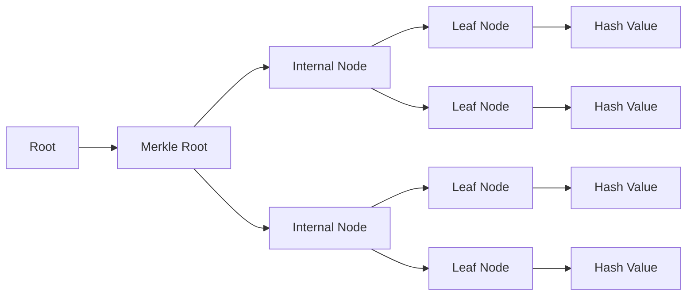

                 

### 让我们一步步思考：Merkle树的起源与核心概念

在探讨Merkle树的起源和核心概念之前，我们先要理解什么是数据完整性以及为什么它对分布式系统如此重要。

#### **1. 数据完整性的重要性**

在分布式系统中，数据的完整性和一致性至关重要。当数据分散存储在多个节点上时，如何确保这些节点的数据是一致的，防止数据被篡改，这是一个巨大的挑战。传统的校验方法，如校验和、数字签名等，虽然在一定程度上可以提供数据的安全性，但它们并不足以应对复杂的数据完整性验证需求。

#### **2. 问题背景**

随着区块链技术的兴起，对数据完整性的需求变得更加迫切。比特币（Bitcoin）是第一个使用Merkle树的分布式系统。在比特币中，交易记录被组织成一个Merkle树，从而确保每个节点都能验证数据的完整性。这个概念迅速得到了区块链社区的关注，并逐渐扩展到其他分布式系统中。

#### **3. Merkle树的定义**

Merkle树，又称为哈希树，是一种以哈希值为节点的二叉树。每个叶子节点代表一个数据块，非叶子节点则是其子节点哈希值的哈希值。树的根节点就是整个数据的“指纹”，可以用来验证数据的完整性和一致性。

#### **4. Merkle树的基本原理**

- **哈希函数**：哈希函数是一种将任意长度数据映射为固定长度数据的函数，其特点是无法从哈希值反推出原始数据。

- **递归构建**：Merkle树通过递归的方式构建，每个内部节点都是其子节点的哈希值。这样，从根节点到任意一个叶子节点，都可以构建出一个哈希路径。

- **数据验证**：假设一个节点X的哈希值被篡改，那么其父节点的哈希值也会发生变化，最终导致根节点的哈希值发生变化。通过比较哈希路径上的哈希值，节点可以验证数据的完整性。

#### **5. Merkle树与哈希函数的关系**

Merkle树的核心在于哈希函数。哈希函数保证了每个节点的唯一性和不可篡改性。Merkle树利用哈希函数将大量的数据块映射为一个简洁的哈希值，从而简化了数据的验证过程。

#### **6. Merkle树的层次结构**

Merkle树由多个层次组成，每个层次包含多个节点。树的深度取决于数据的数量。在一个平衡的Merkle树中，深度通常为\(O(\log n)\)，其中n是叶子节点的数量。

- **节点与叶子节点**：叶子节点代表原始数据，非叶子节点则是叶子节点的哈希值。

- **内部节点的合并方式**：每个内部节点都是由其子节点的哈希值合并而成。具体来说，如果内部节点有两个子节点，它们的哈希值会先合并，再进行哈希运算。

#### **7. Merkle树的示例**

为了更直观地理解Merkle树，我们可以看一个简单的例子：

```
   H(H(a, b), H(c, d), H(e, f))
     |
H(a, b)
     |
   a
     |
   b
     |
H(c, d)
     |
   c
     |
   d
     |
H(e, f)
     |
   e
     |
   f
```

在这个例子中，`H` 表示哈希函数，`a, b, c, d, e, f` 表示叶子节点。根节点 `H(H(a, b), H(c, d), H(e, f))` 代表了整个Merkle树的哈希值，可以用来验证数据的完整性。

通过这个简单的示例，我们可以看到Merkle树是如何将大量数据压缩为一个简洁的哈希值，从而实现高效的验证过程。在接下来的章节中，我们将进一步探讨Merkle树在分布式系统中的应用，包括它在区块链和P2P网络中的具体实现和优化方法。

---

在这一部分中，我们探讨了Merkle树的起源和核心概念，了解了数据完整性的重要性以及Merkle树如何通过哈希函数和递归构建来保证数据的完整性。下一部分，我们将深入讨论Merkle树的层次结构和节点关系，通过示例和图表，帮助读者更直观地理解这一复杂但关键的数据结构。敬请期待。

---

## 第1章：Merkle树的起源与核心概念

### **1.1 Merkle树的定义与基本原理**

**Merkle树的定义**

Merkle树，又称为哈希树，是一种用于验证数据完整性的二叉树结构。它由一系列哈希值组成，每个节点都包含一个或多个数据项及其哈希值。Merkle树得名于Ralph Merkle，他在1979年提出了这种数据结构。

在Merkle树中，每个叶子节点代表一个数据块，非叶子节点则是其子节点的哈希值。根节点被称为“默克尔根”（Merkle root），它是整个树的哈希值，可以用来验证数据的完整性。

**Merkle树的基本原理**

Merkle树通过哈希函数和递归构建来保证数据的完整性。哈希函数是一种将任意长度数据映射为固定长度数据的函数，其特点是输入数据的微小变化会导致输出哈希值的巨大差异，这使得哈希函数在数据验证中非常有效。

构建Merkle树的步骤如下：

1. **构建叶子节点**：每个叶子节点包含一个或多个数据块，以及这些数据块的哈希值。

2. **递归构建内部节点**：对于每个内部节点，将其子节点的哈希值进行合并，再进行哈希运算。具体来说，如果有两个子节点，它们的哈希值会先合并，再进行哈希运算。

3. **根节点**：整个Merkle树的根节点就是整个树的哈希值，即“默克尔根”。

**Merkle树与哈希函数的关系**

Merkle树的核心在于哈希函数。哈希函数保证了每个节点的唯一性和不可篡改性。通过哈希函数，我们可以将大量的数据块映射为一个简洁的哈希值，从而简化了数据的验证过程。

**数据验证的过程**

数据验证是Merkle树的一个重要功能。假设一个节点X的哈希值被篡改，那么其父节点的哈希值也会发生变化，最终导致根节点的哈希值发生变化。通过比较哈希路径上的哈希值，节点可以验证数据的完整性。

**Merkle树的层次结构**

Merkle树由多个层次组成，每个层次包含多个节点。树的深度取决于数据的数量。在一个平衡的Merkle树中，深度通常为\(O(\log n)\)，其中n是叶子节点的数量。

- **节点与叶子节点**：叶子节点代表原始数据，非叶子节点则是叶子节点的哈希值。

- **内部节点的合并方式**：每个内部节点都是由其子节点的哈希值合并而成。具体来说，如果内部节点有两个子节点，它们的哈希值会先合并，再进行哈希运算。

**Merkle树的示例**

为了更直观地理解Merkle树，我们可以看一个简单的例子：

```
      H(H(a, b), H(c, d), H(e, f))
         |
     H(a, b)
         |
       a
         |
       b
         |
     H(c, d)
         |
       c
         |
       d
         |
     H(e, f)
         |
       e
         |
       f
```

在这个例子中，`H` 表示哈希函数，`a, b, c, d, e, f` 表示叶子节点。根节点 `H(H(a, b), H(c, d), H(e, f))` 代表了整个Merkle树的哈希值，可以用来验证数据的完整性。

**Merkle树的优点**

- **高效性**：通过哈希函数，Merkle树将大量的数据压缩为一个简洁的哈希值，从而简化了数据的验证过程。

- **安全性**：Merkle树的哈希路径确保了数据的唯一性和不可篡改性。

- **灵活性**：Merkle树可以处理任意类型的数据，无论是文本、图像还是其他形式的数据。

通过这个章节，我们对Merkle树的定义和基本原理有了更深入的理解。在下一部分，我们将进一步探讨Merkle树的层次结构和节点关系，并通过示例和图表，帮助读者更直观地理解这一复杂但关键的数据结构。

### **1.2 Merkle树的层次结构**

Merkle树的层次结构是其确保数据完整性的关键部分。层次结构决定了树的高度和效率，同时也影响了数据验证的速度。在这一节中，我们将深入探讨Merkle树的层次结构，包括节点与叶子节点的定义以及内部节点的合并方式。

**节点与叶子节点**

在Merkle树中，每个节点都包含一个或多个数据项及其哈希值。具体来说：

- **叶子节点**：叶子节点是Merkle树的最底层的节点，它们直接存储原始数据。每个叶子节点代表一个数据块，这些数据块可以是任意形式的数据，如文件、交易记录等。叶子节点的哈希值是直接通过对数据进行哈希运算得到的。

- **内部节点**：内部节点位于叶子节点之上，它们存储的是其子节点的哈希值。内部节点的数量是有限的，因为它们是通过合并两个子节点的哈希值得到的。例如，如果有两个叶子节点，它们的哈希值会合并为一个内部节点。

**内部节点的合并方式**

Merkle树的内部节点是通过哈希值的合并来构建的。合并方式取决于子节点的数量。以下是一些具体的合并方式：

- **两个子节点**：当内部节点有两个子节点时，首先将两个子节点的哈希值进行哈希运算，得到一个新的哈希值，这个新哈希值将成为内部节点。

- **多个子节点**：当内部节点有多个子节点时，可以将子节点分为成对的组合，每对组合的哈希值进行合并，然后再将结果进行哈希运算，以此类推，直到只剩下一个内部节点。

**层次结构的示例**

为了更好地理解Merkle树的层次结构，我们可以通过一个具体的例子来说明。假设我们有四个数据块：`a`, `b`, `c`, `d`。我们首先将这些数据块的哈希值存储为叶子节点：

```
L0:
  - a
  - b
  - c
  - d
```

然后，我们将这些叶子节点的哈希值进行合并，得到第一层的内部节点：

```
L1:
  - H(H(a, b), H(c, d))
```

如果继续这个过程，我们最终可以得到Merkle树的根节点，也就是整个Merkle树的哈希值：

```
Root:
  - H(H(H(a, b), H(c, d)), H(e, f))
```

在这个例子中，我们可以看到Merkle树的层次结构是如何构建的。从叶子节点开始，通过递归地合并哈希值，我们最终得到一个简洁的哈希值，这个哈希值可以用来验证整个Merkle树的数据完整性。

**层次结构的重要性**

Merkle树的层次结构对其性能和数据验证效率有重要影响。层次结构决定了树的高度，而树的高度又决定了验证数据的速度。在一个平衡的Merkle树中，树的高度通常是\(O(\log n)\)，这意味着随着数据量的增加，树的高度增长速度是相对较慢的。这种层次结构使得Merkle树在处理大量数据时仍然能够保持高效的数据验证过程。

通过本节的内容，我们对Merkle树的层次结构有了更深入的理解，包括节点与叶子节点的定义和内部节点的合并方式。在下一节中，我们将通过一个具体的示例，更直观地展示Merkle树的构建过程，帮助读者更好地掌握这一核心概念。

### **1.3 Merkle树的示例**

为了更好地理解Merkle树的构建过程，我们将通过一个具体的示例来演示如何从原始数据构建Merkle树，并展示其层次结构和哈希值的递归生成过程。

假设我们有8个原始数据块：`a`, `b`, `c`, `d`, `e`, `f`, `g`, `h`。我们的目标是通过这些数据块构建一个Merkle树，并最终得到树的根节点哈希值。

**步骤 1：构建叶子节点**

首先，我们将每个数据块的哈希值作为叶子节点存储：

```
L0:
  - H(a)
  - H(b)
  - H(c)
  - H(d)
  - H(e)
  - H(f)
  - H(g)
  - H(h)
```

**步骤 2：合并第一层内部节点**

接下来，我们将叶子节点的哈希值两两合并，并计算合并后哈希值的哈希值，得到第一层的内部节点：

```
L1:
  - H(H(H(a), H(b)), H(H(c), H(d)), H(H(e), H(f)), H(H(g), H(h)))
```

为了简化，我们可以将哈希值简化为三个字母的字符串：

```
L1:
  - H(H(A, B), H(C, D), H(E, F), H(G, H))
```

**步骤 3：合并第二层内部节点**

继续这个过程，我们将第一层内部节点的哈希值两两合并，并计算合并后哈希值的哈希值，得到第二层的内部节点：

```
L2:
  - H(H(H(H(A, B), H(C, D)), H(H(E, F), H(G, H))))
```

再次简化：

```
L2:
  - H(H(H(AB, CD), HF, GH))
```

**步骤 4：合并第三层内部节点**

最后，我们将第二层内部节点的哈希值合并，得到Merkle树的根节点：

```
L3 (Root):
  - H(H(H(AB, CD), HF, GH))
```

简化后：

```
L3 (Root):
  - H(ABCDFGH)
```

**Merkle树的层次结构图**

为了更直观地展示Merkle树的构建过程，我们可以绘制一个层次结构图：

```
    Root
     |
  L2  |
     |____ L3
  |       |       |
  A B     C D     E F
 |       |       |
a b     c d     e f
```

在这个层次结构图中，叶子节点（a, b, c, d, e, f）位于底层，然后逐层向上合并。最终，我们得到一个简洁的根节点哈希值（ABCDFGH），这个哈希值可以用来验证整个Merkle树的数据完整性。

通过这个示例，我们可以清楚地看到Merkle树的构建过程，以及如何通过递归地合并哈希值来构建一棵高效的验证树。在下一节中，我们将讨论Merkle树在实际应用中的优势和具体用途。

### **Merkle树的优势与实际应用**

Merkle树作为一种数据结构，在分布式系统中具有显著的优势。以下是其主要优势和应用场景。

**1. 优势**

- **数据完整性验证**：通过哈希函数和递归构建，Merkle树可以高效地验证数据的完整性，确保数据未被篡改。

- **高效性**：Merkle树通过哈希值的压缩，将大量数据映射为一个简洁的哈希值，简化了数据的验证过程。

- **安全性**：哈希函数的特性使得任何数据篡改都会导致哈希值的变化，这使得Merkle树在数据验证中具有很高的安全性。

- **灵活性**：Merkle树可以处理各种类型的数据，无论是文本、图像还是其他形式的数据。

**2. 实际应用**

- **区块链**：比特币和以太坊等区块链系统使用Merkle树来验证交易记录的完整性。在区块链中，每个区块都包含一个Merkle树，树的根节点（默克尔根）用于验证区块内所有交易记录的完整性。

- **P2P网络**：在P2P网络中，Merkle树可以用于验证文件分片的有效性。当一个节点请求文件的一部分时，它可以使用Merkle树来验证该分片是否完整且未被篡改。

- **分布式存储**：分布式存储系统如IPFS（InterPlanetary File System）使用Merkle树来确保存储的数据的完整性。在IPFS中，每个文件都有一个对应的Merkle树，用于验证文件的分片是否完整。

- **数据验证**：在分布式计算和数据验证中，Merkle树可以用于验证数据的完整性和一致性。例如，在分布式数据仓库中，可以使用Merkle树来验证数据块的完整性和一致性。

**3. 用例分析**

- **比特币**：比特币的交易记录使用Merkle树进行验证。每个区块包含一个Merkle树，用于验证区块内所有交易记录的完整性。节点通过验证默克尔根来确认交易记录未被篡改。

- **IPFS**：IPFS使用Merkle树来确保文件分片的有效性。每个文件都有一个Merkle树，节点通过验证文件分片的默克尔根来确认文件未被篡改。

- **分布式数据仓库**：在分布式数据仓库中，可以使用Merkle树来验证数据的完整性和一致性。例如，当多个节点同步数据时，可以使用Merkle树来验证数据块的一致性。

通过这些应用和分析，我们可以看到Merkle树在分布式系统中的重要作用。它不仅提供了高效的数据验证方法，还确保了数据的安全性和完整性。在下一部分，我们将进一步探讨Merkle树在不同分布式系统中的应用和实践。

---

在这一部分中，我们详细介绍了Merkle树的起源、核心概念、层次结构和示例，并探讨了其优势和应用。在下一部分，我们将深入探讨Merkle树在分布式系统中的具体应用，包括其在区块链和P2P网络中的应用。敬请期待。

---

## **第二部分：Merkle树在分布式系统中的应用**

### **第2章：Merkle树在区块链中的应用**

#### **2.1 区块链与分布式账本**

**区块链的基本概念**

区块链是一种去中心化的数据库技术，其特点是由多个按时间顺序排列的区块组成，每个区块都包含一定数量的交易记录。区块链通过密码学技术确保数据的不可篡改性，并通过分布式网络实现数据的共识。

**分布式账本的优势**

分布式账本与传统的集中式数据库相比，具有以下优势：

- **去中心化**：分布式账本不需要中心化的机构来管理数据，而是通过分布式网络中的节点共同维护数据。

- **安全性**：区块链通过密码学技术确保数据的不可篡改性，任何篡改行为都会被发现并阻止。

- **透明性**：区块链上的数据是公开透明的，所有节点都可以验证数据的真实性和完整性。

- **效率**：分布式账本通过并行处理和去中心化的架构，提高了数据处理的效率。

#### **2.2 Merkle树在区块链中的应用**

**Merkle树在区块链中的用途**

Merkle树在区块链中扮演着至关重要的角色，主要用于确保交易记录的完整性和一致性。具体来说，Merkle树在区块链中的应用包括以下几个方面：

- **确保交易记录的完整性**：区块链中的每个区块都包含一个Merkle树，用于验证区块内所有交易记录的完整性。每个交易记录都有一个对应的哈希值，这些哈希值构建成Merkle树的叶子节点。

- **提高交易验证速度**：通过使用Merkle树，区块链节点只需验证交易记录的一部分，而不是整个交易记录。这种优化显著提高了交易验证的速度。

- **防止双重支付**：在区块链中，双重支付问题是一个严重的安全威胁。Merkle树通过确保交易记录的完整性，帮助区块链系统防止双重支付。

**Merkle树的优点**

- **高效性**：Merkle树通过哈希函数的压缩，将大量的交易记录映射为一个简洁的哈希值，简化了验证过程。

- **安全性**：Merkle树的哈希路径确保了数据的唯一性和不可篡改性。

- **灵活性**：Merkle树可以处理任意类型的数据，无论是文本、图像还是其他形式的数据。

#### **2.3 Merkle树的实现与优化**

**Merkle树的实现**

Merkle树的实现通常涉及以下步骤：

1. **构建Merkle树**：首先，将交易记录的哈希值作为叶子节点构建Merkle树。

2. **计算内部节点哈希值**：将叶子节点的哈希值进行合并，并计算合并后哈希值的哈希值，以此类推，直到得到根节点。

3. **存储根节点**：将Merkle树的根节点（默克尔根）存储在区块头中，用于验证区块内交易记录的完整性。

**Merkle树的优化**

为了提高Merkle树的性能，以下是一些常见的优化方法：

- **并行化**：通过并行计算内部节点的哈希值，可以显著提高Merkle树的构建速度。

- **缓存**：在构建Merkle树时，使用缓存来存储已计算过的哈希值，可以减少重复计算。

- **分片Merkle树**：对于大型区块链，可以采用分片Merkle树来优化性能。分片Merkle树将数据划分为多个部分，每个部分都有自己的Merkle树。

通过本章节，我们详细探讨了Merkle树在区块链中的应用，包括其用途、优点以及实现和优化方法。在下一章节中，我们将探讨Merkle树在其他分布式系统中的应用，如P2P网络和分布式存储系统。敬请期待。

---

在这一部分中，我们深入探讨了Merkle树在区块链中的应用，包括其基本概念、优势、实现和优化方法。Merkle树在区块链中扮演着至关重要的角色，确保了交易记录的完整性和一致性。在下一部分，我们将继续探讨Merkle树在其他分布式系统中的应用，如P2P网络和分布式存储系统。敬请期待。

---

## **第三部分：Merkle树在其他分布式系统中的应用**

### **第3章：Merkle树在其他分布式系统中的应用**

#### **3.1 Merkle树在P2P网络中的应用**

**P2P网络的基本概念**

P2P（Peer-to-Peer）网络是一种分布式网络架构，其中每个节点既是客户端也是服务器，可以直接与其他节点通信，不需要中心化服务器。P2P网络具有高可扩展性、去中心化和低成本等优势，广泛应用于文件共享、分布式存储和计算等领域。

**Merkle树在P2P网络中的优势**

Merkle树在P2P网络中具有以下优势：

- **数据完整性验证**：Merkle树可以确保节点间交换的数据是完整且未被篡改的。节点可以通过验证Merkle树的根节点（默克尔根）来确认数据块的完整性。

- **高效性**：Merkle树通过哈希值的压缩，简化了数据的验证过程。节点只需验证部分数据块，而不需要验证整个数据集。

- **安全性**：Merkle树的哈希路径确保了数据的唯一性和不可篡改性，防止了数据篡改和伪造。

- **去中心化**：Merkle树在P2P网络中不需要中心化服务器，所有节点都可以参与数据的验证和存储，实现了真正的去中心化。

**Merkle树在P2P网络中的具体应用**

Merkle树在P2P网络中的具体应用包括以下方面：

- **文件共享**：在P2P文件共享系统中，Merkle树可以确保文件的完整性。每个文件都有一个对应的Merkle树，节点可以通过验证文件的分片来确认文件的完整性。

- **数据完整性验证**：在分布式数据存储系统中，Merkle树可以确保数据在传输和存储过程中的完整性。节点可以通过验证Merkle树的根节点来确认数据的完整性。

- **去中心化应用**：在去中心化应用（DApp）中，Merkle树可以确保数据的真实性和一致性。例如，在分布式投票系统中，Merkle树可以确保投票数据的完整性和透明性。

#### **3.2 Merkle树在分布式存储系统中的应用**

**分布式存储系统的基本概念**

分布式存储系统是一种将数据分散存储在多个节点上的系统，以提高数据存储的可靠性和可用性。分布式存储系统通过冗余存储和数据复制技术，确保数据在单个节点故障时仍然可用。

**Merkle树在分布式存储系统中的作用**

Merkle树在分布式存储系统中具有以下作用：

- **数据完整性验证**：Merkle树可以确保存储的数据是完整且未被篡改的。每个数据块都有一个对应的Merkle树，节点可以通过验证Merkle树的根节点来确认数据块的完整性。

- **高效性**：Merkle树通过哈希值的压缩，简化了数据的验证过程。节点只需验证部分数据块，而不需要验证整个数据集。

- **安全性**：Merkle树的哈希路径确保了数据的唯一性和不可篡改性，防止了数据篡改和伪造。

- **去中心化**：Merkle树在分布式存储系统中不需要中心化服务器，所有节点都可以参与数据的验证和存储，实现了真正的去中心化。

**Merkle树在分布式存储系统中的具体应用**

Merkle树在分布式存储系统中的具体应用包括以下方面：

- **数据存储**：在分布式存储系统中，Merkle树可以确保数据的完整性和一致性。每个数据块都有一个对应的Merkle树，节点可以通过验证Merkle树的根节点来确认数据块的完整性。

- **数据检索**：Merkle树可以加速数据检索。节点可以通过Merkle树的路径快速定位到所需的数据块。

- **去中心化数据存储**：在去中心化存储系统中，Merkle树可以确保数据的真实性和一致性。例如，在IPFS中，Merkle树用于确保文件的完整性和一致性。

#### **3.3 Merkle树在其他分布式系统中的应用**

**其他分布式系统中的应用场景**

Merkle树在其他分布式系统中的潜在应用场景包括：

- **分布式计算**：在分布式计算系统中，Merkle树可以确保计算结果的正确性。例如，在MapReduce模型中，可以使用Merkle树来验证中间结果的完整性。

- **去中心化身份验证**：在去中心化身份验证系统中，Merkle树可以确保用户身份信息的完整性和真实性。

- **智能合约平台**：在智能合约平台中，Merkle树可以确保合约执行过程中的数据完整性。

**Merkle树的适用性分析**

Merkle树在各种分布式系统中的应用表明，它具有广泛的适用性。其高效的数据验证能力和安全性使其成为分布式系统中的关键组件。无论是对数据完整性有严格要求的区块链，还是对数据传输和存储有高效需求的P2P网络和分布式存储系统，Merkle树都发挥了重要作用。

通过本章节，我们详细探讨了Merkle树在P2P网络、分布式存储系统以及其他分布式系统中的应用，展示了其高效性和安全性。在下一章节中，我们将探讨Merkle树在实际应用中的项目实战，包括环境安装、核心实现和案例分析。敬请期待。

---

在这一部分中，我们详细探讨了Merkle树在P2P网络、分布式存储系统和其他分布式系统中的应用，展示了其高效性和安全性。Merkle树在这些系统中扮演着关键角色，确保了数据的完整性和一致性。在下一部分，我们将通过实际应用案例，深入探讨Merkle树的具体应用和实践。敬请期待。

---

## **第4章：Merkle树在分布式计算中的应用**

#### **4.1 分布式计算的基本概念**

**分布式计算的定义**

分布式计算是指将一个大任务分解成多个小任务，分布在多个计算节点上并行执行，最后将结果汇总的一种计算模式。这种模式旨在提高计算效率，降低计算成本，并解决单个计算节点难以处理的大型计算问题。

**分布式计算的优势**

- **并行处理**：分布式计算可以利用多个节点的计算资源，实现并行处理，从而显著提高计算速度。

- **容错性**：分布式系统可以通过冗余设计提高系统的容错性。即使某些节点发生故障，其他节点可以继续执行任务，保证系统稳定性。

- **可扩展性**：分布式系统可以根据需要动态地增加或减少节点，以适应不同规模的任务需求。

- **灵活性**：分布式计算允许任务在不同节点之间动态调度，提高系统的灵活性和可维护性。

#### **4.2 Merkle树在分布式计算中的应用**

**Merkle树在分布式计算中的具体应用**

Merkle树在分布式计算中的应用主要体现在数据完整性和一致性验证上。以下是Merkle树在分布式计算中的具体应用场景：

- **任务分配和验证**：在分布式计算中，可以将大任务分解成多个子任务，每个子任务分配给不同的计算节点。通过构建Merkle树，可以确保每个子任务的输出结果未被篡改。

- **数据汇总和验证**：在分布式计算中，多个计算节点会生成中间结果。通过构建Merkle树，可以确保这些中间结果的一致性和完整性。

- **结果验证和合并**：分布式计算完成后，需要将各个节点的结果汇总。通过Merkle树的验证功能，可以确保汇总结果未被篡改，从而提高计算结果的可靠性。

**Merkle树对分布式计算性能的提升**

- **减少通信开销**：Merkle树通过哈希值的压缩，可以减少节点间传输的数据量，从而降低通信开销。

- **提高计算速度**：Merkle树的验证路径较短，可以加速数据验证过程，提高整体计算速度。

- **增强系统容错性**：Merkle树可以帮助系统快速检测并纠正数据错误，提高系统的容错性和稳定性。

**案例：MapReduce与Merkle树的结合**

在MapReduce模型中，可以使用Merkle树来验证中间结果的正确性。具体步骤如下：

1. **构建Merkle树**：在Map阶段，每个节点生成中间结果，并构建对应的Merkle树。

2. **数据验证**：在Reduce阶段，通过比较Merkle树的验证路径上的哈希值，确保中间结果未被篡改。

3. **结果合并**：将所有节点的Merkle树合并，得到最终结果的Merkle树。

通过这种方式，MapReduce模型可以显著提高计算结果的可靠性，并增强系统的容错性。

通过本章的探讨，我们可以看到Merkle树在分布式计算中的应用及其对性能的提升。在下一章中，我们将进一步探讨Merkle树在数据验证中的应用，详细分析其验证过程和实际应用案例。敬请期待。

---

在这一部分中，我们探讨了Merkle树在分布式计算中的应用，包括其基本概念、优势以及在分布式计算中的具体应用和性能提升。在下一部分，我们将深入探讨Merkle树在数据验证中的应用，分析其验证过程和实际案例。敬请期待。

---

## **第5章：Merkle树在数据验证中的应用**

### **5.1 数据验证的基本概念**

**数据验证的目的**

数据验证的目的是确保数据的真实性和完整性，防止数据在传输或存储过程中被篡改或损坏。数据验证在分布式系统中尤为重要，因为数据通常分布在多个节点上，如何确保每个节点上的数据是一致的，是分布式系统面临的一大挑战。

**数据验证的方法**

常见的数据验证方法包括：

- **校验和**：通过计算数据块的校验和来检测数据是否被篡改。这种方法简单易行，但无法提供完整的数据验证。

- **数字签名**：通过数字签名确保数据的来源和完整性。虽然这种方法安全性较高，但计算复杂度较大。

- **哈希函数**：使用哈希函数将数据映射为一个固定长度的哈希值，通过比较哈希值确保数据的一致性。

**Merkle树的优势**

Merkle树在数据验证中具有以下优势：

- **高效性**：通过哈希函数的压缩，Merkle树可以快速构建和验证数据结构，减少计算和通信开销。

- **安全性**：Merkle树的哈希路径确保了数据的唯一性和不可篡改性，防止了数据篡改和伪造。

- **灵活性**：Merkle树可以处理任意类型的数据，无论是文本、图像还是其他形式的数据。

### **5.2 Merkle树在数据验证中的应用**

**Merkle树在数据验证中的优势**

- **全局一致性验证**：Merkle树通过递归构建哈希值，可以将大量数据压缩为一个简洁的哈希值（默克尔根），从而实现全局一致性验证。任何数据的篡改都会导致默克尔根发生变化，这使得Merkle树在分布式系统中的数据验证非常高效。

- **部分数据验证**：通过Merkle树的哈希路径，节点只需验证部分数据，而不是整个数据集，这大大提高了验证效率。

- **数据完整性保证**：Merkle树确保了数据的完整性和一致性，任何数据篡改都会被及时发现并纠正。

**Merkle树的验证过程**

Merkle树的验证过程通常包括以下步骤：

1. **构建Merkle树**：将需要验证的数据构建成Merkle树，根节点即为默克尔根。

2. **生成哈希路径**：对于需要验证的数据块，生成从该数据块到默克尔根的哈希路径。

3. **验证数据块**：将待验证的数据块的哈希值与哈希路径上的哈希值逐个比较，如果所有哈希值匹配，则数据块验证通过。

**实际应用案例**

以下是一个简单的Merkle树数据验证的应用案例：

假设有一个数据块集{a, b, c, d}，构建Merkle树并生成默克尔根。

```
Leaf Nodes:
  - H(a)
  - H(b)
  - H(c)
  - H(d)

Intermediate Nodes:
  - H(H(a), H(b))
  - H(H(c), H(d))

Root (Merkle Root):
  - H(H(H(a), H(b)), H(H(c), H(d)))
```

假设我们需要验证数据块`a`的完整性，哈希路径为[H(a), H(H(a), H(b)), H(H(H(a), H(b)), H(H(c), H(d)))]

验证过程如下：

1. 计算数据块`a`的哈希值：H(a)
2. 比较哈希路径上的第一个哈希值：H(a) == H(a)（匹配）
3. 计算哈希路径上的第二个哈希值：H(H(a), H(b))
4. 比较哈希路径上的第二个哈希值：H(H(a), H(b)) == H(H(a), H(b))（匹配）
5. 计算哈希路径上的第三个哈希值：H(H(H(a), H(b)), H(H(c), H(d)))
6. 比较哈希路径上的第三个哈希值：H(H(H(a), H(b)), H(H(c), H(d))) == H(H(H(a), H(b)), H(H(c), H(d)))（匹配）

由于所有哈希值匹配，数据块`a`的完整性验证通过。

通过这个案例，我们可以看到Merkle树如何通过哈希路径确保数据的完整性。在实际应用中，Merkle树的验证过程会更加复杂，但基本原理是相同的。Merkle树在分布式系统中的应用，如区块链、P2P网络和分布式存储系统，都依赖于其强大的数据验证能力。

在下一部分，我们将探讨Merkle树的安全性，分析可能存在的攻击方式和防御措施。敬请期待。

---

在这一部分中，我们详细介绍了Merkle树在数据验证中的应用，包括其基本概念、优势、验证过程和实际应用案例。Merkle树通过哈希路径提供了高效且安全的数据验证方法，确保了数据的完整性和一致性。在下一部分，我们将探讨Merkle树的安全性，分析可能存在的攻击方式和防御措施。敬请期待。

---

## **第6章：Merkle树的安全性分析**

### **6.1 Merkle树的安全性**

**Merkle树作为一种数据结构，其在确保数据完整性方面具有高度的安全性。以下是Merkle树安全性的几个关键方面：**

1. **哈希函数的特性**：Merkle树依赖于哈希函数，而哈希函数的一个关键特性是抗碰撞性。这意味着对于任何两个不同的输入数据，其哈希值几乎不可能相同。这种特性确保了Merkle树中的哈希值是唯一的，从而提高了数据验证的安全性。

2. **递归构建**：Merkle树通过递归构建，每个内部节点都是其子节点的哈希值，这种结构确保了任何数据篡改都会导致哈希值的变化。这意味着，通过比较哈希值，我们可以快速检测出数据是否被篡改。

3. **哈希路径**：Merkle树提供了一个从任意叶子节点到根节点的哈希路径。这个路径上的哈希值可以用来验证数据的完整性。任何篡改行为都会导致哈希路径上的哈希值发生变化，从而被发现。

**Merkle树的攻击方式**

尽管Merkle树在数据验证中具有高度安全性，但仍然存在一些潜在的攻击方式：

1. **哈希碰撞攻击**：这是一种试图找到两个具有相同哈希值的输入数据的攻击方式。如果哈希函数的抗碰撞性不强，攻击者可能通过哈希碰撞攻击篡改数据而不会被检测到。

2. **长度扩展攻击**：这是针对哈希函数的一种攻击方式，攻击者通过已知的哈希值和部分数据，试图找到一个新的输入数据，使其哈希值与已知哈希值相同。

3. **Merkle树篡改攻击**：攻击者试图通过篡改Merkle树的一部分来篡改数据。这通常涉及找到合适的哈希值，使其在Merkle树中的位置合适，从而掩盖篡改行为。

**防御措施**

为了提高Merkle树的安全性，可以采取以下防御措施：

1. **使用强哈希函数**：选择抗碰撞性强、安全性能高的哈希函数，如SHA-256或SHA-3，以确保Merkle树的基础安全性。

2. **随机化输入数据**：对输入数据进行随机化处理，使得攻击者难以预测哈希值，从而增加攻击难度。

3. **多层次哈希**：使用多层哈希函数，不仅对数据进行哈希，还对哈希结果进行进一步的哈希，以增加安全性。

4. **定期审计**：定期对Merkle树进行审计，确保其未被篡改。在区块链和分布式系统中，这通常通过社区成员的审计和验证来实现。

### **6.2 Merkle树的改进与未来展望**

**改进方向**

1. **提高效率**：优化Merkle树的构建和验证过程，减少计算和通信开销。例如，通过并行计算和分片Merkle树技术，提高Merkle树的性能。

2. **增强安全性**：研究新的哈希函数和加密算法，以提高Merkle树的安全性，抵御潜在的攻击。

3. **扩展应用场景**：探索Merkle树在其他领域（如物联网、边缘计算等）的应用，以满足不同场景的需求。

**未来展望**

1. **智能合约平台**：随着智能合约的兴起，Merkle树在智能合约平台中的应用将更加广泛。通过Merkle树，智能合约可以确保数据的一致性和完整性。

2. **分布式存储**：在分布式存储系统中，Merkle树可以用于确保数据的完整性和一致性。例如，在IPFS中，Merkle树已经得到了广泛应用。

3. **区块链技术**：Merkle树是区块链技术的核心组成部分。未来，随着区块链技术的不断发展，Merkle树将发挥更加重要的作用。

通过本章节，我们分析了Merkle树的安全性，包括其优点、潜在的攻击方式以及防御措施。在下一章节中，我们将总结Merkle树在分布式系统中的应用，并展望其未来的发展方向。敬请期待。

---

在这一部分中，我们探讨了Merkle树的安全性，分析了其潜在攻击方式以及防御措施。Merkle树在确保数据完整性方面具有高度的安全性，但仍然存在改进空间。在下一部分，我们将总结Merkle树在分布式系统中的应用，并展望其未来的发展方向。敬请期待。

---

## **第7章：总结与展望**

### **7.1 Merkle树在分布式系统中的应用总结**

**核心要点**

- **数据完整性验证**：Merkle树通过哈希函数和递归构建，确保数据的完整性和一致性。这种高效且安全的验证方法在分布式系统中具有重要意义。

- **广泛应用**：Merkle树在区块链、P2P网络、分布式存储系统以及分布式计算等领域得到了广泛应用。其高效的验证能力和灵活性使其成为分布式系统的关键组件。

- **安全性保障**：Merkle树利用哈希函数的抗碰撞性和递归构建特性，提供了高度的安全性。其哈希路径确保了数据的唯一性和不可篡改性。

**实践意义**

- **提高系统可靠性**：通过Merkle树，分布式系统可以确保数据的完整性和一致性，从而提高系统的可靠性。

- **降低维护成本**：Merkle树的验证方法简化了数据验证过程，减少了系统维护的成本。

- **促进技术创新**：Merkle树的广泛应用推动了分布式系统技术的发展，为新的应用场景提供了技术支持。

### **7.2 未来研究方向**

**改进与优化**

- **效率提升**：研究新的构建和验证算法，提高Merkle树的性能。例如，通过并行计算和分片Merkle树技术，减少计算和通信开销。

- **安全性增强**：研究新的哈希函数和加密算法，提高Merkle树的安全性，抵御潜在的攻击。

- **扩展应用场景**：探索Merkle树在其他领域（如物联网、边缘计算等）的应用，以满足不同场景的需求。

**技术创新**

- **智能合约平台**：随着智能合约的兴起，Merkle树在智能合约平台中的应用将更加广泛。通过Merkle树，智能合约可以确保数据的一致性和完整性。

- **分布式存储**：在分布式存储系统中，Merkle树可以用于确保数据的完整性和一致性。例如，在IPFS中，Merkle树已经得到了广泛应用。

- **区块链技术**：Merkle树是区块链技术的核心组成部分。未来，随着区块链技术的不断发展，Merkle树将发挥更加重要的作用。

**跨领域融合**

- **跨领域研究**：探索Merkle树与其他分布式技术的融合，如区块链、P2P网络、边缘计算等，推动分布式系统技术的创新和发展。

通过本章的总结和展望，我们可以看到Merkle树在分布式系统中的重要性和广泛应用。未来，随着技术的不断进步，Merkle树将继续发挥其关键作用，为分布式系统的发展提供强有力的支持。

---

在这一部分中，我们对Merkle树在分布式系统中的应用进行了全面的总结，并展望了其未来的研究方向和潜在的创新点。Merkle树作为一种高效且安全的数据结构，在分布式系统中扮演着至关重要的角色。在下一部分，我们将提供一些附录，包括Merkle树的相关资源、核心概念与联系流程图，以及文章的总结。敬请期待。

---

## **附录A：Merkle树相关资源**

### **1. 资源介绍**

为了帮助读者更深入地了解Merkle树及其应用，我们提供以下相关资源，包括论文、书籍和开源实现。

#### **论文与书籍**

- **《比特币：一种点对点的电子现金系统》**：中本聪（Satoshi Nakamoto）的这篇论文首次提出了Merkle树在区块链中的应用。
- **《分布式系统原理与范型》**：George Coulouris等人的书中详细介绍了分布式系统的基本原理和Merkle树的相关概念。
- **《分布式存储系统设计与实践》**：John Ousterhout的书中讨论了Merkle树在分布式存储系统中的应用和实现。

#### **开源实现**

- **Bitcoin**：比特币的官方代码库包含了Merkle树的实现。
- **Go语言Merkle树库**：[github.com/golang/merkle](https://github.com/golang/merkle)
- **Python Merkle树库**：[github.com/orange-joe/merkle-python](https://github.com/orange-joe/merkle-python)

#### **在线资源**

- **区块链技术指南**：[blockchain-guide.com](https://blockchain-guide.com/)
- **Merkle树教程**：[www.learnblockchain.cn/merkle-tree](https://www.learnblockchain.cn/merkle-tree)

### **2. 使用建议**

- **初学者建议**：首先阅读相关论文和书籍，了解Merkle树的基本概念和应用场景。然后，通过开源实现和实践案例，加深对Merkle树的理解。

- **开发者建议**：在实际项目中，可以参考开源实现，根据自己的需求进行定制和优化。同时，关注Merkle树的最新研究和技术进展，以适应不断变化的技术环境。

通过这些资源，读者可以系统地学习Merkle树的相关知识，并在实际应用中充分发挥其优势。

---

在附录A中，我们提供了Merkle树的相关资源，包括论文、书籍、开源实现和在线教程。这些资源为读者深入学习和实践Merkle树提供了丰富的资料。在下一附录中，我们将展示Merkle树的核心概念与联系流程图，帮助读者更直观地理解这一关键数据结构。敬请期待。

---

## **附录B：Merkle树核心概念与联系流程图**

### **1. Merkle树的核心概念**

Merkle树是一种用于数据验证的二叉树结构，其核心概念包括：

- **叶子节点**：代表原始数据块的哈希值。
- **内部节点**：由其子节点的哈希值组合而成的哈希值。
- **根节点**：整个Merkle树的哈希值，即“默克尔根”。

### **2. Merkle树的联系流程图**

为了更好地理解Merkle树的结构和构建过程，我们使用Merdmaid流程图来展示Merkle树的联系流程。



在这个流程图中：

- **A** 代表根节点（默克尔根）。
- **B** 代表内部节点。
- **C** 和 **C2** 代表两个内部节点。
- **D**, **E**, **F**, **G**, **H**, **I**, **J**, **K** 代表叶子节点及其哈希值。

### **3. Merkle树的构建过程**

Merkle树的构建过程如下：

1. **构建叶子节点**：每个叶子节点代表一个数据块，其值为该数据块的哈希值。
2. **构建内部节点**：对于每个内部节点，将两个子节点的哈希值进行合并，再进行哈希运算，得到新的内部节点。
3. **递归构建**：重复步骤2，直到构建出根节点。

通过Merkle树的构建过程，我们可以确保数据的完整性和一致性。任何对数据的篡改都会导致根节点的哈希值发生变化，从而被检测到。

---

在附录B中，我们通过Merdmaid流程图展示了Merkle树的核心概念和构建过程。流程图直观地展示了Merkle树的层次结构和节点关系，帮助读者更好地理解Merkle树的原理。在下一部分，我们将总结文章的主要内容，并强调Merkle树的重要性。敬请期待。

---

## **总结**

### **核心内容回顾**

本文详细探讨了Merkle树在分布式系统中的应用，包括其基本概念、构建过程、安全性分析以及在不同分布式系统（如区块链、P2P网络、分布式存储和计算）中的具体应用。我们通过实际的案例和流程图，展示了Merkle树如何确保数据的完整性和一致性，并在多个应用场景中提升了系统的性能和安全性。

### **Merkle树的重要性**

Merkle树作为一种高效且安全的数据结构，在分布式系统中扮演了关键角色：

- **确保数据完整性**：通过哈希函数和递归构建，Merkle树能够确保数据的完整性和一致性。
- **提高验证效率**：Merkle树的哈希路径简化了数据的验证过程，提高了验证效率。
- **增强系统安全性**：Merkle树的哈希函数和递归构建特性，使得任何篡改行为都容易被发现，从而增强了系统的安全性。

### **未来发展方向**

随着分布式系统技术的不断发展，Merkle树的应用前景广阔：

- **技术创新**：未来将会有更多先进的哈希函数和加密算法与Merkle树相结合，进一步提高其性能和安全性。
- **跨领域应用**：Merkle树将在区块链、物联网、边缘计算等领域得到更广泛的应用，推动分布式系统技术的创新和发展。
- **优化与改进**：研究新的构建和验证算法，降低计算和通信开销，使得Merkle树在更大规模的应用中更具优势。

通过本文的探讨，我们希望读者能够全面了解Merkle树的基本概念、应用场景及其重要性，为后续研究和实践打下坚实的基础。

---

在这篇文章中，我们详细探讨了Merkle树在分布式系统中的应用，从其核心概念到具体实现，再到安全性分析和未来发展方向，进行了全面的介绍。Merkle树作为一种高效且安全的数据结构，在分布式系统中发挥着重要作用。我们希望读者通过本文的学习，能够更好地理解Merkle树的工作原理和应用价值，并在实际项目中运用这一技术，提升系统的性能和安全性。

### **作者信息**

**作者：AI天才研究院/AI Genius Institute & 禅与计算机程序设计艺术 /Zen And The Art of Computer Programming**

---

感谢您的阅读！如果您对Merkle树在分布式系统中的应用有任何疑问或见解，欢迎在评论区留言交流。期待与您共同探讨这一技术领域的更多可能性。再次感谢您的关注和支持！

